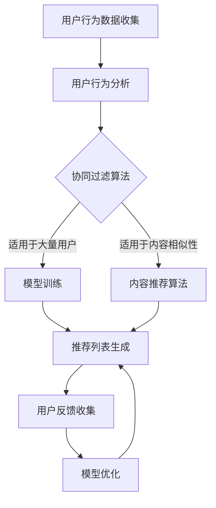

                 

# 《AI如何提升电商促销策略》

## 关键词
AI、电商、促销策略、个性化推荐、预测分析、智能优化

## 摘要
随着人工智能（AI）技术的不断发展，其在电商促销策略中的应用日益广泛。本文从AI在电商行业中的应用出发，详细探讨了AI技术在个性化推荐、预测分析和促销活动优化等方面的应用，并通过实际案例展示了AI如何提升电商促销策略的效果。文章最后展望了AI提升电商促销策略的未来发展趋势和挑战。

## 目录大纲

### 第一部分：AI与电商促销概述

#### 第一部分 引言
1. AI在电商行业的应用
2. 电商促销策略概述
3. AI提升电商促销策略的优势

#### 第二部分：AI技术在电商促销中的应用

##### 2.1 个性化推荐系统
1. 个性化推荐的基本原理
2. 个性化推荐系统的实现与优化

##### 2.2 预测与分析
1. 顾客行为预测
2. 销售预测与库存管理

##### 2.3 促销活动设计与优化
1. 促销活动的类型与设计
2. 促销活动的效果评估与优化策略

#### 第三部分：AI提升电商促销策略的实践案例

##### 3.1 案例一：个性化推荐系统在电商促销中的应用
1. 案例背景
2. 个性化推荐系统的实现
3. 促销活动的优化策略

##### 3.2 案例二：预测分析在电商促销中的应用
1. 案例背景
2. 预测模型的选择与实现
3. 销售预测与库存管理的优化效果

##### 3.3 案例三：促销活动设计与优化
1. 案例背景
2. 促销活动的效果评估
3. 优化策略与效果分析

#### 第四部分：AI提升电商促销策略的未来趋势

##### 4.1 AI提升电商促销策略的发展趋势
1. 大数据与云计算的融合
2. AI算法的迭代与优化
3. 电商促销策略的智能化发展

##### 4.2 挑战与机遇
1. 数据隐私与安全
2. 用户体验与满意度
3. 法律法规与伦理问题

##### 4.3 未来展望
1. AI在电商促销中的应用前景
2. AI驱动的电商促销策略创新
3. AI与电商促销的未来融合趋势

#### 附录

##### 附录A：AI提升电商促销策略的工具与资源
1. 数据处理工具
2. 机器学习框架
3. 电商促销策略评估指标

##### 附录B：案例代码与数据集
1. 案例一代码与数据集
2. 案例二代码与数据集
3. 案例三代码与数据集

### 第一部分：AI与电商促销概述

#### 引言

随着电子商务的快速发展，电商促销策略已成为电商平台提高用户参与度、提升销售额的重要手段。然而，传统的促销策略往往依赖于历史经验和简单的数据分析，难以满足日益多样化的用户需求和快速变化的市场环境。人工智能（AI）技术的崛起，为电商促销策略带来了新的机遇和挑战。

AI技术在电商促销中的应用，主要体现在个性化推荐、预测分析和促销活动优化等方面。通过AI技术，电商平台可以更好地理解用户行为，预测用户需求，制定更加精准和有效的促销策略。本文将详细探讨AI技术在电商促销策略中的具体应用，并通过实际案例展示其效果。

首先，我们需要了解AI在电商行业的应用背景和现状。AI技术已经广泛应用于电商的各个领域，如商品推荐、用户行为分析、智能客服、智能定价等。AI技术的引入，不仅提高了电商平台的服务质量和运营效率，也为电商促销策略的优化提供了强大的技术支持。

接下来，我们将对电商促销策略进行概述，介绍传统的促销策略和常见的促销活动类型，以及如何评估促销活动的效果。在此基础上，我们将分析AI提升电商促销策略的优势，包括个性化推荐、预测分析和促销活动优化等方面。

#### AI在电商行业的应用

人工智能（AI）在电商行业的应用已经渗透到多个方面，包括商品推荐、用户行为分析、智能客服、智能定价等。以下是AI在电商行业的一些典型应用场景：

1. **商品推荐**：基于用户的浏览记录、购买历史和搜索行为，AI算法可以生成个性化的商品推荐，提高用户的购物体验和购买转化率。例如，Amazon和阿里巴巴等电商平台都采用了基于协同过滤和深度学习等技术的推荐系统。

2. **用户行为分析**：AI技术可以对用户的行为数据进行实时分析和挖掘，识别用户的兴趣偏好和购买意图。通过用户行为分析，电商平台可以更好地了解用户需求，为用户提供个性化的服务和推荐。

3. **智能客服**：AI技术可以用于智能客服系统的构建，通过自然语言处理和机器学习算法，智能客服系统能够自动解答用户问题，提供个性化的服务，提高用户满意度和转化率。

4. **智能定价**：基于大数据分析和机器学习算法，AI技术可以帮助电商平台实现智能定价。通过分析市场供需、竞争对手价格等因素，智能定价系统能够动态调整商品价格，提高销售额和利润。

#### AI在电商促销中的潜在价值

AI技术在电商促销中的应用，具有以下潜在价值：

1. **个性化推荐**：通过个性化推荐系统，电商平台可以针对不同用户生成个性化的促销信息，提高用户的购物体验和购买意愿。

2. **预测分析**：通过预测用户行为和市场需求，电商平台可以提前制定促销策略，优化库存管理和供应链规划，提高运营效率。

3. **促销活动优化**：AI技术可以帮助电商平台分析和评估不同促销活动的效果，优化促销策略，提高促销活动的效果和用户满意度。

4. **精准营销**：通过分析用户数据和市场需求，AI技术可以帮助电商平台实现精准营销，提高广告投放效果，降低营销成本。

总之，AI技术在电商促销中的应用，有助于提升电商平台的服务质量和运营效率，为电商平台带来更高的效益和用户体验。接下来，我们将详细介绍AI技术在电商促销中的具体应用。

#### 电商促销策略概述

电商促销策略是电商平台提高用户参与度、提升销售额的重要手段。传统的电商促销策略主要包括限时折扣、赠品促销、积分兑换、满减优惠等。这些策略虽然在短期内能够带来一定的效果，但难以满足日益多样化的用户需求和快速变化的市场环境。随着人工智能（AI）技术的发展，电商促销策略正逐渐向智能化、个性化方向转变。

##### 传统的电商促销策略

1. **限时折扣**：限时折扣是一种常见的促销策略，通过设定特定的时间段内提供优惠价格，刺激用户的购买欲望。例如，双十一、双十二等购物节就是通过限时折扣吸引大量用户进行消费。

2. **赠品促销**：赠品促销是指在购买特定商品时赠送一定价值的赠品，以吸引用户购买。这种策略可以提升用户的购物体验，增加用户对品牌的好感度。

3. **积分兑换**：积分兑换是一种通过积累积分兑换商品或优惠券的促销策略。用户在购买商品时可以获得积分，积分可以用来兑换礼品或享受折扣优惠。

4. **满减优惠**：满减优惠是指用户在购买商品时，达到一定的金额可以享受减免优惠。这种策略可以鼓励用户增加购物金额，提高销售额。

##### 电商促销策略的分类与效果评估

1. **分类**：
   - **价格型促销**：主要包括限时折扣、满减优惠等，通过调整商品价格来刺激用户购买。
   - **非价格型促销**：主要包括赠品促销、积分兑换等，通过提供额外的价值来吸引用户。

2. **效果评估**：
   - **用户参与度**：通过用户点击率、参与率等指标评估促销活动的用户参与度。
   - **销售转化率**：通过销售额、转化率等指标评估促销活动对销售的推动作用。
   - **用户满意度**：通过用户调研、反馈等评估促销活动的用户体验和满意度。

##### 电商促销策略的优化

1. **数据驱动**：通过大数据分析和机器学习技术，电商平台可以更好地理解用户行为和市场趋势，制定更加精准和有效的促销策略。

2. **个性化推荐**：利用个性化推荐系统，为用户提供个性化的促销信息，提高用户的购物体验和购买意愿。

3. **预测分析**：通过预测用户行为和市场需求，电商平台可以提前制定促销策略，优化库存管理和供应链规划。

4. **A/B测试**：通过A/B测试，评估不同促销策略的效果，优化促销活动的形式和内容。

总之，电商促销策略的优化需要结合人工智能技术，实现数据驱动和个性化推荐，从而提升促销活动的效果和用户体验。接下来，我们将详细介绍AI技术在电商促销策略优化中的应用。

### 第一部分：AI与电商促销概述

#### 引言

随着电子商务的快速发展，电商促销策略已成为电商平台提高用户参与度、提升销售额的重要手段。传统的促销策略虽然具有一定的效果，但难以满足日益多样化的用户需求和快速变化的市场环境。人工智能（AI）技术的崛起，为电商促销策略带来了新的机遇和挑战。

AI技术在电商促销中的应用，主要体现在个性化推荐、预测分析和促销活动优化等方面。通过AI技术，电商平台可以更好地理解用户行为，预测用户需求，制定更加精准和有效的促销策略。本文将详细探讨AI技术在电商促销策略中的具体应用，并通过实际案例展示其效果。

首先，我们需要了解AI在电商行业的应用背景和现状。AI技术已经广泛应用于电商的各个领域，如商品推荐、用户行为分析、智能客服、智能定价等。AI技术的引入，不仅提高了电商平台的服务质量和运营效率，也为电商促销策略的优化提供了强大的技术支持。

接下来，我们将对电商促销策略进行概述，介绍传统的促销策略和常见的促销活动类型，以及如何评估促销活动的效果。在此基础上，我们将分析AI提升电商促销策略的优势，包括个性化推荐、预测分析和促销活动优化等方面。

#### AI提升电商促销策略的优势

随着人工智能（AI）技术的不断发展，其在电商促销策略中的应用呈现出显著的优越性。AI技术在电商促销中的优势主要体现在以下几个方面：

##### 1. 个性化推荐

个性化推荐是AI技术在电商促销中最具代表性的应用之一。通过分析用户的浏览记录、购买历史和搜索行为，AI算法可以生成个性化的商品推荐，从而提高用户的购物体验和购买意愿。个性化推荐不仅能够帮助用户发现潜在的感兴趣商品，还能够引导用户完成购买，提高销售转化率。

###### 1.1 个性化推荐的基本原理

个性化推荐系统通常基于两种主要的推荐算法：协同过滤算法和内容推荐算法。

###### 1.1.1 协同过滤算法

协同过滤算法是一种基于用户相似度的推荐方法。其主要思想是找出与目标用户相似的其他用户，并推荐这些用户喜欢的商品。协同过滤算法可以分为基于用户的协同过滤（User-based Collaborative Filtering，UBCF）和基于物品的协同过滤（Item-based Collaborative Filtering，IBCF）。

基于用户的协同过滤算法通过计算用户之间的相似度，找到与目标用户最相似的邻居用户，然后推荐这些邻居用户喜欢的商品。相似度通常通过用户之间的共同评分或者余弦相似度来计算。



基于物品的协同过滤算法通过计算物品之间的相似度，找到与目标商品最相似的其他商品，然后推荐这些商品。相似度通常通过物品的属性或者余弦相似度来计算。

###### 1.1.2 内容推荐算法

内容推荐算法是一种基于商品内容的推荐方法。其主要思想是分析商品的特征和属性，为用户推荐具有相似属性的物品。内容推荐算法可以更好地处理冷启动问题，即新用户或新商品的推荐问题。

内容推荐算法通常包括基于关键词的推荐、基于属性的推荐和基于模型的推荐。

基于关键词的推荐通过提取商品和用户的关键词，计算关键词的相似度，推荐具有相似关键词的商品。

基于属性的推荐通过比较商品和用户属性的一致性，推荐具有相似属性的物品。

基于模型的推荐通过训练商品和用户特征的模型，预测用户可能感兴趣的物品。

###### 1.2 个性化推荐系统的实现与优化

个性化推荐系统的实现包括用户特征提取、商品特征提取、推荐算法选择和推荐结果生成等步骤。

1. **用户特征提取**：通过用户的浏览记录、购买历史和搜索行为，提取用户的基本信息（如年龄、性别、地理位置等）和兴趣特征（如浏览频率、购买偏好等）。

2. **商品特征提取**：通过商品的基本信息（如商品类别、价格、品牌等）和属性（如图片、描述、标签等），提取商品的特征向量。

3. **推荐算法选择**：根据用户和商品的特征，选择合适的推荐算法。常用的算法包括协同过滤算法和内容推荐算法。

4. **推荐结果生成**：根据用户的兴趣特征和商品的特征向量，计算用户和商品之间的相似度，生成个性化的推荐列表。

个性化推荐系统的优化主要包括以下方面：

- **冷启动问题**：对于新用户或新商品，推荐系统通常难以生成有效的推荐。为了解决冷启动问题，可以采用基于热门商品推荐、基于社区推荐和基于内容推荐的混合策略。
- **推荐准确性**：通过不断优化推荐算法和特征提取方法，提高推荐结果的准确性。
- **用户满意度**：通过收集用户反馈，优化推荐系统的用户体验，提高用户满意度。

总之，个性化推荐系统在电商促销中的应用，可以显著提高用户的购物体验和购买意愿，从而提升电商平台的销售业绩。接下来，我们将探讨AI在预测分析和促销活动优化中的应用。

#### 个性化推荐系统的实现与优化

个性化推荐系统在电商促销中的应用，需要通过一系列具体的步骤和技术手段来实现和优化，以提高推荐的准确性和用户体验。以下是实现和优化个性化推荐系统的详细步骤：

##### 1. 用户特征提取

用户特征提取是构建个性化推荐系统的关键步骤之一。用户特征包括基本信息和兴趣特征。

###### 1.1 用户基本信息提取

用户基本信息通常包括年龄、性别、地理位置、职业等。这些信息可以从用户注册时填写的信息或者用户在购物过程中产生的数据中提取。

```python
def extract_user_basic_info(user_id):
    user_info = database.get_user_info(user_id)
    return {
        'age': user_info['age'],
        'gender': user_info['gender'],
        'location': user_info['location'],
        'occupation': user_info['occupation']
    }
```

###### 1.2 用户兴趣特征提取

用户兴趣特征是通过分析用户的浏览记录、购买历史和搜索行为来提取的。这些特征可以包括浏览频率、购买频率、购买偏好等。

```python
def extract_user_interest_features(user_id):
    user_behaviors = database.get_user_behaviors(user_id)
    return {
        'browse_frequency': calculate_browse_frequency(user_behaviors),
        'purchase_frequency': calculate_purchase_frequency(user_behaviors),
        'purchase_preferences': extract_purchase_preferences(user_behaviors)
    }
```

##### 2. 商品特征提取

商品特征提取是构建个性化推荐系统的另一个关键步骤。商品特征包括基本信息和属性特征。

###### 2.1 商品基本信息提取

商品基本信息通常包括商品类别、价格、品牌、库存等。这些信息可以从商品数据库中提取。

```python
def extract_product_basic_info(product_id):
    product_info = database.get_product_info(product_id)
    return {
        'category': product_info['category'],
        'price': product_info['price'],
        'brand': product_info['brand'],
        'inventory': product_info['inventory']
    }
```

###### 2.2 商品属性特征提取

商品属性特征是通过分析商品的属性信息来提取的，如图片、描述、标签等。这些特征可以用于基于内容的推荐算法。

```python
def extract_product_attribute_features(product_id):
    product_info = database.get_product_info(product_id)
    return {
        'image_features': extract_image_features(product_info['image']),
        'description': product_info['description'],
        'tags': product_info['tags']
    }
```

##### 3. 推荐算法选择

根据用户和商品的特征，选择合适的推荐算法。常用的推荐算法包括基于协同过滤的推荐算法和基于内容的推荐算法。

###### 3.1 基于协同过滤的推荐算法

基于协同过滤的推荐算法通过计算用户之间的相似度或者商品之间的相似度来生成推荐列表。协同过滤算法可以分为基于用户的协同过滤和基于物品的协同过滤。

基于用户的协同过滤算法通过计算用户之间的相似度，找到与目标用户最相似的邻居用户，然后推荐这些邻居用户喜欢的商品。

```python
def collaborative_filtering(user_id, products):
    user_interests = extract_user_interest_features(user_id)
    neighbor_users = find_similar_users(user_interests)
    recommended_products = find_common_products(neighbor_users, products)
    return recommended_products
```

基于物品的协同过滤算法通过计算商品之间的相似度，找到与目标商品最相似的其他商品，然后推荐这些商品。

```python
def item_based_collaborative_filtering(user_id, products):
    product_interests = extract_product_interest_features(products)
    neighbor_products = find_similar_products(product_interests)
    recommended_products = find_common_products(neighbor_products, products)
    return recommended_products
```

###### 3.2 基于内容的推荐算法

基于内容的推荐算法通过比较商品和用户的特征，推荐具有相似特征的物品。内容推荐算法可以分为基于关键词的推荐、基于属性的推荐和基于模型的推荐。

基于关键词的推荐算法通过提取商品和用户的关键词，计算关键词的相似度，推荐具有相似关键词的商品。

```python
def content_based_filtering(user_id, products):
    user_features = extract_user_interest_features(user_id)
    product_features = extract_product_attribute_features(products)
    recommended_products = find_similar_products(user_features, product_features)
    return recommended_products
```

基于属性的推荐算法通过比较商品和用户属性的一致性，推荐具有相似属性的物品。

```python
def attribute_based_filtering(user_id, products):
    user_attributes = extract_user_interest_features(user_id)
    product_attributes = extract_product_attribute_features(products)
    recommended_products = find_similar_products_by_attributes(user_attributes, product_attributes)
    return recommended_products
```

基于模型的推荐算法通过训练商品和用户特征的模型，预测用户可能感兴趣的物品。

```python
def model_based_filtering(user_id, products):
    user_features = extract_user_interest_features(user_id)
    product_features = extract_product_attribute_features(products)
    model = train_model(user_features, product_features)
    recommended_products = predict_interesting_products(model, user_features, products)
    return recommended_products
```

##### 4. 推荐结果生成

根据用户特征和商品特征，选择合适的推荐算法生成推荐列表。推荐结果需要根据用户的兴趣和偏好进行排序，并提供给用户。

```python
def generate_recommendation_list(user_id, products, algorithm='collaborative_filtering'):
    if algorithm == 'collaborative_filtering':
        recommended_products = collaborative_filtering(user_id, products)
    elif algorithm == 'content_based_filtering':
        recommended_products = content_based_filtering(user_id, products)
    elif algorithm == 'model_based_filtering':
        recommended_products = model_based_filtering(user_id, products)
    else:
        recommended_products = []

    # 对推荐结果进行排序
    recommended_products = sort_products_by_relevance(user_id, recommended_products)

    return recommended_products
```

##### 5. 模型优化

个性化推荐系统的性能可以通过不断优化推荐算法和特征提取方法来提升。模型优化可以基于用户反馈、性能评估和数据分析等多种方法。

```python
def optimize_recommendation_model(algorithm='collaborative_filtering'):
    if algorithm == 'collaborative_filtering':
        optimize_user_similarity_metric()
        optimize_item_similarity_metric()
    elif algorithm == 'content_based_filtering':
        optimize_feature_extraction_method()
        optimize_keyword_matching_algorithm()
    elif algorithm == 'model_based_filtering':
        optimize_model_training_process()
        optimize_predictive_model()
```

通过以上步骤，个性化推荐系统可以更好地满足用户的需求，提高用户的购物体验和购买意愿，从而提升电商促销策略的效果。

#### 个性化推荐的基本原理

个性化推荐是人工智能（AI）在电商促销中的一项核心技术，其基本原理是通过分析用户的历史行为和偏好，为用户提供个性化的商品推荐。个性化推荐的核心在于理解用户的需求和兴趣，从而提供更相关、更有价值的推荐结果。

##### 个性化推荐的基本概念

个性化推荐系统是一种基于用户数据和商品数据的推荐系统，它通过分析用户的历史行为（如浏览、购买、评价等）和商品属性（如类别、价格、品牌等），为用户生成个性化的推荐列表。个性化推荐的目标是提高用户满意度、增加用户粘性、提升销售转化率。

##### 个性化推荐的关键要素

1. **用户特征**：用户特征包括用户的基本信息（如年龄、性别、地理位置）和行为信息（如浏览记录、购买历史、评价）。用户特征是构建个性化推荐系统的基础，通过对用户特征的分析，可以了解用户的兴趣和偏好。

2. **商品特征**：商品特征包括商品的基本信息（如类别、价格、品牌）和属性信息（如图片、描述、标签）。商品特征用于描述商品的属性和特点，通过对商品特征的分析，可以找到与用户兴趣相匹配的商品。

3. **推荐算法**：推荐算法是推荐系统的核心，用于计算用户和商品之间的相似度，生成推荐列表。常用的推荐算法包括协同过滤算法、内容推荐算法和基于模型的推荐算法。

##### 个性化推荐的实现步骤

1. **数据收集**：收集用户行为数据和商品数据，包括用户的浏览记录、购买记录、评价等，以及商品的基本信息和属性信息。

2. **数据预处理**：对收集到的数据进行清洗和预处理，包括去除重复数据、缺失值处理、数据标准化等。

3. **特征提取**：提取用户和商品的特征，包括用户的行为特征和商品的特征。

4. **算法选择**：根据用户和商品的特征，选择合适的推荐算法，如协同过滤算法、内容推荐算法或基于模型的推荐算法。

5. **推荐生成**：根据推荐算法，计算用户和商品之间的相似度，生成个性化的推荐列表。

6. **反馈收集**：收集用户的反馈，如点击、购买、评价等，用于优化推荐模型。

7. **模型优化**：根据用户反馈和推荐效果，不断优化推荐模型，提高推荐准确性。

##### 个性化推荐算法示例

以下是一个简单的基于协同过滤的个性化推荐算法示例，使用Python代码实现：

```python
# 假设我们有一个用户和商品的数据集
users = {
    'user1': {'age': 25, 'gender': 'male', 'bought': ['item1', 'item2', 'item3']},
    'user2': {'age': 30, 'gender': 'female', 'bought': ['item2', 'item3', 'item4']},
    'user3': {'age': 22, 'gender': 'male', 'bought': ['item1', 'item4', 'item5']},
}

items = {
    'item1': {'category': 'electronics', 'price': 100},
    'item2': {'category': 'electronics', 'price': 200},
    'item3': {'category': 'clothing', 'price': 50},
    'item4': {'category': 'clothing', 'price': 150},
    'item5': {'category': 'furniture', 'price': 300},
}

# 计算用户之间的相似度
def calculate_similarity(user1, user2):
    # 计算用户共同购买的商品数量
    common_bought = set(user1['bought']).intersection(user2['bought'])
    # 计算相似度
    similarity = len(common_bought) / min(len(user1['bought']), len(user2['bought']))
    return similarity

# 生成个性化推荐列表
def generate_recommendations(user_id, items, similarity_threshold=0.5):
    # 计算用户之间的相似度
    user_similarities = {user_id: 1}  # 用户与自己相似度为1
    for other_user_id in users:
        if other_user_id != user_id:
            similarity = calculate_similarity(users[user_id], users[other_user_id])
            if similarity >= similarity_threshold:
                user_similarities[other_user_id] = similarity

    # 排序并获取相似度最高的用户
    sorted_similar_users = sorted(user_similarities.items(), key=lambda x: x[1], reverse=True)
    similar_users = [user_id for user_id, _ in sorted_similar_users if user_id != user_id]

    # 为用户生成推荐列表
    recommendations = []
    for other_user_id in similar_users:
        for item_id in users[other_user_id]['bought']:
            if item_id not in users[user_id]['bought']:
                recommendations.append(item_id)

    return recommendations

# 为用户user1生成推荐列表
recommendations = generate_recommendations('user1', items)
print("Recommendations for user1:", recommendations)
```

通过以上示例，我们可以看到个性化推荐的基本原理和实现步骤。在实际应用中，个性化推荐系统会更加复杂，需要处理大规模的数据集，并使用多种算法和优化技术来提高推荐效果。

### 个性化推荐系统的实现与优化

个性化推荐系统在电商促销中的应用，需要通过一系列具体的步骤和技术手段来实现和优化，以提高推荐的准确性和用户体验。以下是实现和优化个性化推荐系统的详细步骤：

#### 1. 用户特征提取

用户特征提取是构建个性化推荐系统的关键步骤之一。用户特征包括基本信息和兴趣特征。

##### 1.1 用户基本信息提取

用户基本信息通常包括用户在注册时填写的信息，如年龄、性别、地理位置、职业等。这些信息可以从用户数据库中提取。

```python
def extract_user_basic_info(user_id):
    user_info = database.get_user_info(user_id)
    return {
        'age': user_info['age'],
        'gender': user_info['gender'],
        'location': user_info['location'],
        'occupation': user_info['occupation']
    }
```

##### 1.2 用户兴趣特征提取

用户兴趣特征是通过分析用户的浏览记录、购买历史和搜索行为来提取的。这些特征可以包括用户的浏览频率、购买频率、喜欢的商品类别等。

```python
def extract_user_interest_features(user_id):
    user_behaviors = database.get_user_behaviors(user_id)
    return {
        'browse_frequency': calculate_browse_frequency(user_behaviors),
        'purchase_frequency': calculate_purchase_frequency(user_behaviors),
        'favorite_categories': extract_favorite_categories(user_behaviors)
    }
```

#### 2. 商品特征提取

商品特征提取是构建个性化推荐系统的另一个关键步骤。商品特征包括基本信息和属性特征。

##### 2.1 商品基本信息提取

商品基本信息通常包括商品的类别、价格、品牌、库存等。这些信息可以从商品数据库中提取。

```python
def extract_product_basic_info(product_id):
    product_info = database.get_product_info(product_id)
    return {
        'category': product_info['category'],
        'price': product_info['price'],
        'brand': product_info['brand'],
        'inventory': product_info['inventory']
    }
```

##### 2.2 商品属性特征提取

商品属性特征是通过分析商品的图片、描述、标签等来提取的。这些特征可以用于基于内容的推荐算法。

```python
def extract_product_attribute_features(product_id):
    product_info = database.get_product_info(product_id)
    return {
        'image_features': extract_image_features(product_info['image']),
        'description': product_info['description'],
        'tags': product_info['tags']
    }
```

#### 3. 推荐算法选择

根据用户和商品的特征，选择合适的推荐算法。常用的推荐算法包括协同过滤算法、内容推荐算法和基于模型的推荐算法。

##### 3.1 协同过滤算法

协同过滤算法是一种基于用户相似度的推荐方法。它通过计算用户之间的相似度，为用户推荐其他用户喜欢的商品。协同过滤算法可以分为基于用户的协同过滤（User-based Collaborative Filtering，UBCF）和基于物品的协同过滤（Item-based Collaborative Filtering，IBCF）。

基于用户的协同过滤算法通过计算用户之间的相似度，找到与目标用户最相似的邻居用户，然后推荐这些邻居用户喜欢的商品。

```python
def collaborative_filtering(user_id, products):
    user_interests = extract_user_interest_features(user_id)
    neighbor_users = find_similar_users(user_interests)
    recommended_products = find_common_products(neighbor_users, products)
    return recommended_products
```

基于物品的协同过滤算法通过计算商品之间的相似度，找到与目标商品最相似的其他商品，然后推荐这些商品。

```python
def item_based_collaborative_filtering(user_id, products):
    product_interests = extract_product_interest_features(products)
    neighbor_products = find_similar_products(product_interests)
    recommended_products = find_common_products(neighbor_products, products)
    return recommended_products
```

##### 3.2 内容推荐算法

内容推荐算法是一种基于商品内容的推荐方法。它通过分析商品的属性和特征，为用户推荐具有相似属性的物品。内容推荐算法可以分为基于关键词的推荐、基于属性的推荐和基于模型的推荐。

基于关键词的推荐算法通过提取商品和用户的关键词，计算关键词的相似度，推荐具有相似关键词的商品。

```python
def content_based_filtering(user_id, products):
    user_features = extract_user_interest_features(user_id)
    product_features = extract_product_attribute_features(products)
    recommended_products = find_similar_products(user_features, product_features)
    return recommended_products
```

基于属性的推荐算法通过比较商品和用户属性的一致性，推荐具有相似属性的物品。

```python
def attribute_based_filtering(user_id, products):
    user_attributes = extract_user_interest_features(user_id)
    product_attributes = extract_product_attribute_features(products)
    recommended_products = find_similar_products_by_attributes(user_attributes, product_attributes)
    return recommended_products
```

基于模型的推荐算法通过训练商品和用户特征的模型，预测用户可能感兴趣的物品。

```python
def model_based_filtering(user_id, products):
    user_features = extract_user_interest_features(user_id)
    product_features = extract_product_attribute_features(products)
    model = train_model(user_features, product_features)
    recommended_products = predict_interesting_products(model, user_features, products)
    return recommended_products
```

##### 4. 推荐结果生成

根据用户特征和商品特征，选择合适的推荐算法生成推荐列表。推荐结果需要根据用户的兴趣和偏好进行排序，并提供给用户。

```python
def generate_recommendation_list(user_id, products, algorithm='collaborative_filtering'):
    if algorithm == 'collaborative_filtering':
        recommended_products = collaborative_filtering(user_id, products)
    elif algorithm == 'content_based_filtering':
        recommended_products = content_based_filtering(user_id, products)
    elif algorithm == 'model_based_filtering':
        recommended_products = model_based_filtering(user_id, products)
    else:
        recommended_products = []

    # 对推荐结果进行排序
    recommended_products = sort_products_by_relevance(user_id, recommended_products)

    return recommended_products
```

##### 5. 模型优化

个性化推荐系统的性能可以通过不断优化推荐算法和特征提取方法来提升。模型优化可以基于用户反馈、性能评估和数据分析等多种方法。

```python
def optimize_recommendation_model(algorithm='collaborative_filtering'):
    if algorithm == 'collaborative_filtering':
        optimize_user_similarity_metric()
        optimize_item_similarity_metric()
    elif algorithm == 'content_based_filtering':
        optimize_feature_extraction_method()
        optimize_keyword_matching_algorithm()
    elif algorithm == 'model_based_filtering':
        optimize_model_training_process()
        optimize_predictive_model()
```

通过以上步骤，个性化推荐系统可以更好地满足用户的需求，提高用户的购物体验和购买意愿，从而提升电商促销策略的效果。

### 预测与分析

在电商促销策略中，预测与分析是提升策略效果的重要环节。通过预测用户行为和市场需求，电商企业可以提前制定促销计划，优化库存管理，提高销售转化率。AI技术在预测与分析中的应用，为电商企业提供了强大的工具和手段。

#### 顾客行为预测

顾客行为预测是指利用历史数据和人工智能算法，预测用户在未来某一时间段内的购买行为。顾客行为预测的关键在于准确捕捉用户的需求变化和市场趋势。

##### 1. 时间序列分析

时间序列分析是一种常用的预测方法，用于分析数据中的趋势、季节性和周期性。在电商促销策略中，时间序列分析可以帮助预测销售趋势，制定合理的促销计划。

###### 1.1 ARIMA模型原理

ARIMA（AutoRegressive Integrated Moving Average）模型是一种常见的时间序列预测模型，它由自回归（AR）、差分（I）和移动平均（MA）三部分组成。ARIMA模型的基本公式如下：

$$
\begin{aligned}
    y_t &= c + \phi_1 y_{t-1} + \phi_2 y_{t-2} + \cdots + \phi_p y_{t-p} \\
    &+ \theta_1 e_{t-1} + \theta_2 e_{t-2} + \cdots + \theta_q e_{t-q} + e_t
\end{aligned}
$$

其中，$y_t$ 是时间序列的当前值，$c$ 是常数项，$\phi_1, \phi_2, \cdots, \phi_p$ 是自回归系数，$\theta_1, \theta_2, \cdots, \theta_q$ 是移动平均系数，$e_t$ 是白噪声误差项，$p$ 和 $q$ 分别是自回归项和移动平均项的阶数。

###### 1.2 伪代码实现

以下是一个简单的ARIMA模型预测的伪代码：

```python
# 分解数据
decomposed_data = decomposeData(data)

# 训练ARIMA模型
model = trainARIMAModel(decomposed_data, p, d, q)

# 预测
predictions = predictData(model)

# 输出预测结果
print(predictions)
```

###### 1.3 举例说明

假设我们有一个时间序列数据 `data`，我们需要使用ARIMA模型进行预测。首先，我们需要确定模型的参数 $p, d, q$，然后我们可以使用以下代码进行预测：

```python
predictions = arimaModelPrediction(data, 1, 1, 1)
print(predictions)
```

##### 2. K-means算法

K-means算法是一种常见的聚类算法，用于将数据分为K个簇，使每个簇内的数据点之间的距离最小，簇与簇之间的距离最大。在电商促销策略中，K-means算法可以用于客户细分，识别具有相似购买行为的用户群体。

###### 2.1 K-means算法原理

K-means算法的基本步骤如下：

1. 初始化聚类中心：随机选择K个数据点作为初始聚类中心。
2. 计算每个数据点到各个聚类中心的距离，将每个数据点分配给最近的聚类中心。
3. 重新计算每个簇的中心点。
4. 重复步骤2和3，直到聚类中心不再变化或者达到预设的迭代次数。

目标函数为：

$$
\begin{aligned}
    \text{目标函数} &: \min_{\mathbf{C}} \sum_{i=1}^k \sum_{x \in S_i} ||x - \mu_i||^2 \\
\end{aligned}
$$

其中，$\mathbf{C}$ 表示聚类中心点集合，$S_i$ 表示第$i$个簇，$\mu_i$ 表示第$i$个簇的中心点。

###### 2.2 伪代码实现

以下是一个简单的K-means算法的伪代码：

```python
# K-means算法
def kMeansClustering(data, k):
    # 初始化聚类中心
    centroids = initializeCentroids(data, k)
    # 迭代更新聚类中心
    while not converged:
        # 计算每个点与聚类中心的距离
        distances = calculateDistances(data, centroids)
        # 重新分配每个点到最近的聚类中心
        labels = assignPointsToClusters(data, distances)
        # 更新聚类中心
        centroids = updateCentroids(centroids, labels)
    return centroids, labels
```

###### 2.3 举例说明

假设我们有一个数据集 `data`，聚类数量 `k` 为3，我们可以使用以下代码进行聚类：

```python
centroids, labels = kMeansClustering(data, 3)
print(centroids)
print(labels)
```

##### 3. 机器学习模型

除了时间序列分析和K-means算法，机器学习模型也在顾客行为预测中发挥着重要作用。常用的机器学习模型包括线性回归、决策树、随机森林等。

###### 3.1 线性回归模型

线性回归模型是一种常用的预测方法，用于建立自变量和因变量之间的线性关系。在电商促销策略中，线性回归模型可以用于预测销售量、转化率等指标。

###### 3.2 决策树模型

决策树模型是一种基于树的预测方法，通过一系列的决策规则来预测目标变量。在电商促销策略中，决策树模型可以用于识别影响销售的因素，优化促销策略。

###### 3.3 随机森林模型

随机森林模型是一种基于决策树的集成学习方法，通过构建多个决策树并投票来预测结果。在电商促销策略中，随机森林模型可以用于提高预测的准确性和稳定性。

#### 销售预测与库存管理

销售预测和库存管理是电商促销策略中的关键环节。通过准确的销售预测，电商企业可以优化库存水平，减少库存成本和缺货风险；通过合理的库存管理，电商企业可以提高库存周转率，降低库存成本。

##### 1. 销售预测模型选择

在选择销售预测模型时，需要考虑数据的特性、预测的准确性和计算成本等因素。常用的销售预测模型包括线性回归、时间序列分析、机器学习模型等。

###### 1.1 线性回归模型

线性回归模型是一种简单而有效的预测方法，适用于数据具有线性关系的场景。线性回归模型的公式为：

$$
y = \beta_0 + \beta_1 x_1 + \beta_2 x_2 + \cdots + \beta_n x_n
$$

其中，$y$ 是因变量，$x_1, x_2, \cdots, x_n$ 是自变量，$\beta_0, \beta_1, \beta_2, \cdots, \beta_n$ 是模型的参数。

###### 1.2 时间序列分析

时间序列分析是一种常用的预测方法，适用于数据具有趋势、季节性和周期性的场景。时间序列分析的方法包括ARIMA模型、季节性分解、周期性滤波等。

###### 1.3 机器学习模型

机器学习模型是一种强大的预测方法，适用于数据复杂、特征多样的场景。常用的机器学习模型包括线性回归、决策树、随机森林、神经网络等。

##### 2. 库存管理模型

库存管理模型是用于优化库存水平和库存成本的模型。常用的库存管理模型包括ABC分析、需求预测、周期性盘点等。

###### 2.1 ABC分析

ABC分析是一种基于库存价值和销售频率的库存管理方法。它将库存商品分为A、B、C三类，分别表示高价值、中等价值和低价值商品。通过对不同类别商品的库存策略进行优化，可以降低库存成本。

###### 2.2 需求预测

需求预测是一种用于预测商品未来销售量的方法。通过需求预测，电商企业可以合理规划库存水平，避免缺货和过剩库存。需求预测的方法包括时间序列分析、回归分析、机器学习模型等。

###### 2.3 周期性盘点

周期性盘点是一种定期检查库存的方法。通过周期性盘点，电商企业可以及时发现库存异常，调整库存策略，避免库存积压和库存短缺。

#### 3. 促销活动效果评估与优化策略

促销活动效果评估是电商促销策略的重要组成部分。通过评估促销活动的效果，电商企业可以了解促销活动的用户参与度、销售转化率和用户满意度，从而优化促销策略。

##### 3.1 用户参与度评估

用户参与度评估是衡量促销活动用户参与程度的重要指标。常用的评估指标包括用户点击率、访问量和参与率等。

###### 3.1.1 用户点击率

用户点击率是衡量用户对促销信息关注程度的重要指标。用户点击率可以通过以下公式计算：

$$
\text{点击率} = \frac{\text{点击次数}}{\text{展示次数}} \times 100\%
$$

###### 3.1.2 用户访问量

用户访问量是衡量促销活动吸引力的指标。用户访问量可以通过以下公式计算：

$$
\text{访问量} = \text{新访客数} + \text{回头客数}
$$

###### 3.1.3 用户参与率

用户参与率是衡量用户对促销活动的参与程度的重要指标。用户参与率可以通过以下公式计算：

$$
\text{参与率} = \frac{\text{参与活动的人数}}{\text{总用户人数}} \times 100\%
$$

##### 3.2 销售转化率评估

销售转化率是衡量促销活动对销售推动作用的重要指标。销售转化率可以通过以下公式计算：

$$
\text{转化率} = \frac{\text{实际销售量}}{\text{预期销售量}} \times 100\%
$$

##### 3.3 用户满意度评估

用户满意度评估是衡量促销活动用户体验的重要指标。用户满意度可以通过以下方式评估：

- 用户反馈：通过用户反馈收集系统，收集用户对促销活动的满意度评价。
- 用户评分：通过用户评分系统，收集用户对促销活动的评分。

##### 3.4 优化策略

根据促销活动效果评估的结果，电商企业可以制定以下优化策略：

- 个性化推荐：通过个性化推荐系统，为用户提供个性化的促销信息，提高用户参与度和购买转化率。
- 联合促销：与其他品牌或商家合作，开展联合促销活动，提高活动的影响力和用户参与度。
- 活动时段优化：根据用户行为数据和销售预测，选择最佳活动时段，提高活动曝光率和用户参与度。
- 活动内容优化：结合用户反馈和数据分析，不断优化活动内容和形式，提高用户满意度和活动效果。

通过预测与分析，电商企业可以更好地制定和优化促销策略，提高销售业绩和用户满意度。

### 预测与分析

#### 顾客行为预测

顾客行为预测是电商促销策略中至关重要的环节，它有助于电商平台更好地了解用户的购买意图和需求，从而制定更具针对性的促销计划。以下将详细介绍顾客行为预测的方法和过程。

##### 1. 时间序列分析

时间序列分析是一种常用的方法，用于分析数据中的趋势、季节性和周期性。通过时间序列分析，我们可以预测未来某一时间段内的顾客行为。

###### 1.1.1 ARIMA模型原理

ARIMA（AutoRegressive Integrated Moving Average）模型是一种常见的时间序列预测模型，它由自回归（AR）、差分（I）和移动平均（MA）三部分组成。ARIMA模型的基本公式如下：

$$
\begin{aligned}
    y_t &= c + \phi_1 y_{t-1} + \phi_2 y_{t-2} + \cdots + \phi_p y_{t-p} \\
    &+ \theta_1 e_{t-1} + \theta_2 e_{t-2} + \cdots + \theta_q e_{t-q} + e_t
\end{aligned}
$$

其中，$y_t$ 是时间序列的当前值，$c$ 是常数项，$\phi_1, \phi_2, \cdots, \phi_p$ 是自回归系数，$\theta_1, \theta_2, \cdots, \theta_q$ 是移动平均系数，$e_t$ 是白噪声误差项，$p$ 和 $q$ 分别是自回归项和移动平均项的阶数。

###### 1.1.2 伪代码实现

以下是一个简单的ARIMA模型预测的伪代码：

```python
# 分解数据
decomposed_data = decomposeData(data)

# 训练ARIMA模型
model = trainARIMAModel(decomposed_data, p, d, q)

# 预测
predictions = predictData(model)

# 输出预测结果
print(predictions)
```

###### 1.1.3 举例说明

假设我们有一个时间序列数据 `data`，我们需要使用ARIMA模型进行预测。首先，我们需要确定模型的参数 $p, d, q$，然后我们可以使用以下代码进行预测：

```python
predictions = arimaModelPrediction(data, 1, 1, 1)
print(predictions)
```

##### 2. K-means算法

K-means算法是一种常用的聚类算法，用于将数据分为K个簇，使每个簇内的数据点之间的距离最小，簇与簇之间的距离最大。在电商促销策略中，K-means算法可以用于客户细分，识别具有相似购买行为的用户群体。

###### 2.1.1 K-means算法原理

K-means算法的基本步骤如下：

1. 初始化聚类中心：随机选择K个数据点作为初始聚类中心。
2. 计算每个数据点到各个聚类中心的距离，将每个数据点分配给最近的聚类中心。
3. 重新计算每个簇的中心点。
4. 重复步骤2和3，直到聚类中心不再变化或者达到预设的迭代次数。

目标函数为：

$$
\begin{aligned}
    \text{目标函数} &: \min_{\mathbf{C}} \sum_{i=1}^k \sum_{x \in S_i} ||x - \mu_i||^2 \\
\end{aligned}
$$

其中，$\mathbf{C}$ 表示聚类中心点集合，$S_i$ 表示第$i$个簇，$\mu_i$ 表示第$i$个簇的中心点。

###### 2.1.2 伪代码实现

以下是一个简单的K-means算法的伪代码：

```python
# K-means算法
def kMeansClustering(data, k):
    # 初始化聚类中心
    centroids = initializeCentroids(data, k)
    # 迭代更新聚类中心
    while not converged:
        # 计算每个点与聚类中心的距离
        distances = calculateDistances(data, centroids)
        # 重新分配每个点到最近的聚类中心
        labels = assignPointsToClusters(data, distances)
        # 更新聚类中心
        centroids = updateCentroids(centroids, labels)
    return centroids, labels
```

###### 2.1.3 举例说明

假设我们有一个数据集 `data`，聚类数量 `k` 为3，我们可以使用以下代码进行聚类：

```python
centroids, labels = kMeansClustering(data, 3)
print(centroids)
print(labels)
```

##### 3. 机器学习模型

除了时间序列分析和K-means算法，机器学习模型在顾客行为预测中也发挥着重要作用。常用的机器学习模型包括线性回归、决策树、随机森林等。

###### 3.1.1 线性回归模型

线性回归模型是一种简单而有效的预测方法，适用于数据具有线性关系的场景。线性回归模型的公式为：

$$
y = \beta_0 + \beta_1 x_1 + \beta_2 x_2 + \cdots + \beta_n x_n
$$

其中，$y$ 是因变量，$x_1, x_2, \cdots, x_n$ 是自变量，$\beta_0, \beta_1, \beta_2, \cdots, \beta_n$ 是模型的参数。

###### 3.1.2 决策树模型

决策树模型是一种基于树的预测方法，通过一系列的决策规则来预测目标变量。在电商促销策略中，决策树模型可以用于识别影响销售的因素，优化促销策略。

###### 3.1.3 随机森林模型

随机森林模型是一种基于决策树的集成学习方法，通过构建多个决策树并投票来预测结果。在电商促销策略中，随机森林模型可以用于提高预测的准确性和稳定性。

### 销售预测与库存管理

销售预测和库存管理是电商促销策略中的关键环节。通过准确的销售预测，电商企业可以优化库存水平，减少库存成本和缺货风险；通过合理的库存管理，电商企业可以提高库存周转率，降低库存成本。

#### 1. 销售预测模型选择

在选择销售预测模型时，需要考虑数据的特性、预测的准确性和计算成本等因素。常用的销售预测模型包括线性回归、时间序列分析、机器学习模型等。

###### 1.1 线性回归模型

线性回归模型是一种简单而有效的预测方法，适用于数据具有线性关系的场景。线性回归模型的公式为：

$$
y = \beta_0 + \beta_1 x_1 + \beta_2 x_2 + \cdots + \beta_n x_n
$$

其中，$y$ 是因变量，$x_1, x_2, \cdots, x_n$ 是自变量，$\beta_0, \beta_1, \beta_2, \cdots, \beta_n$ 是模型的参数。

###### 1.2 时间序列分析

时间序列分析是一种常用的预测方法，适用于数据具有趋势、季节性和周期性的场景。时间序列分析的方法包括ARIMA模型、季节性分解、周期性滤波等。

###### 1.3 机器学习模型

机器学习模型是一种强大的预测方法，适用于数据复杂、特征多样的场景。常用的机器学习模型包括线性回归、决策树、随机森林、神经网络等。

#### 2. 库存管理模型

库存管理模型是用于优化库存水平和库存成本的模型。常用的库存管理模型包括ABC分析、需求预测、周期性盘点等。

###### 2.1 ABC分析

ABC分析是一种基于库存价值和销售频率的库存管理方法。它将库存商品分为A、B、C三类，分别表示高价值、中等价值和高价值商品。通过对不同类别商品的库存策略进行优化，可以降低库存成本。

###### 2.2 需求预测

需求预测是一种用于预测商品未来销售量的方法。通过需求预测，电商企业可以合理规划库存水平，避免缺货和过剩库存。需求预测的方法包括时间序列分析、回归分析、机器学习模型等。

###### 2.3 周期性盘点

周期性盘点是一种定期检查库存的方法。通过周期性盘点，电商企业可以及时发现库存异常，调整库存策略，避免库存积压和库存短缺。

### 促销活动设计与优化

促销活动是电商促销策略的重要组成部分，其设计和优化直接影响促销效果。以下将介绍促销活动的类型、设计原则、效果评估与优化策略。

#### 1. 促销活动的类型

促销活动可以分为价格型促销和非价格型促销。

###### 1.1 价格型促销

价格型促销是一种通过调整商品价格来刺激用户购买的方法。常见的价格型促销包括限时折扣、满减优惠、优惠券等。

###### 1.2 非价格型促销

非价格型促销是一种通过提供额外价值来吸引用户购买的方法。常见的非价格型促销包括赠品促销、积分兑换、会员专享等。

#### 2. 促销活动的设计原则

促销活动的设计需要遵循以下原则：

###### 2.1 目标明确

明确促销活动的目标，如提高销售额、增加新用户注册、提升用户粘性等。

###### 2.2 用户需求导向

以用户需求为导向，设计符合用户兴趣和需求的促销活动。

###### 2.3 精准投放

根据用户行为和偏好，精准投放促销信息，提高促销效果。

###### 2.4 创新性

设计具有创新性的促销活动，提高用户参与度和互动性。

#### 3. 促销活动的效果评估

促销活动的效果评估是优化促销策略的重要环节。以下是一些常用的评估指标：

###### 3.1 用户参与度

用户参与度包括用户点击率、访问量、参与率等。通过这些指标，可以评估用户对促销活动的关注程度和参与程度。

###### 3.2 销售转化率

销售转化率是衡量促销活动对销售推动作用的重要指标。通过比较促销活动前后的销售额，可以评估促销活动的效果。

###### 3.3 用户满意度

用户满意度可以通过用户调研和反馈来评估。了解用户对促销活动的满意度和体验，有助于优化促销活动。

#### 4. 促销活动的优化策略

根据促销活动的效果评估结果，可以采取以下优化策略：

###### 4.1 数据驱动优化

通过分析用户数据和行为，优化促销活动的形式和内容，提高用户参与度和转化率。

###### 4.2 A/B测试

通过A/B测试，评估不同促销策略的效果，选择最优的促销方案。

###### 4.3 用户反馈机制

建立用户反馈机制，及时收集用户意见，优化促销活动。

通过以上步骤，电商企业可以设计出更具针对性的促销活动，提高促销效果和用户满意度。

### 实践案例

为了更具体地展示AI技术在电商促销策略中的应用，我们将通过三个实际案例来详细解释个性化推荐系统、预测分析和促销活动设计及优化策略的实施过程、效果评估以及优化策略。

#### 案例一：个性化推荐系统在电商促销中的应用

##### 1. 案例背景

某大型电商平台希望通过个性化推荐系统来提高用户购物体验和销售转化率。该平台收集了大量的用户行为数据，包括用户的浏览记录、购买历史、评价等，希望通过AI技术来分析这些数据，为用户生成个性化的商品推荐，从而提升用户满意度和销售业绩。

##### 2. 个性化推荐系统的实现

1. **数据收集**：从数据库中提取用户行为数据，包括用户ID、购买时间、购买商品ID、浏览记录、评价等。

2. **数据预处理**：对提取的数据进行清洗和预处理，包括去除重复数据、缺失值处理和特征工程。

3. **用户特征提取**：提取用户的基本信息（如年龄、性别、地理位置等）和兴趣特征（如浏览频率、购买偏好等）。

4. **商品特征提取**：提取商品的基本信息（如商品类别、价格、品牌等）和属性特征（如图片、描述、标签等）。

5. **推荐算法选择**：结合用户和商品特征，选择基于协同过滤和内容推荐的混合算法。

6. **推荐结果生成**：根据用户特征和商品特征，生成个性化的商品推荐列表。

##### 3. 促销活动的优化策略

1. **个性化促销**：根据用户兴趣和购买行为，为用户推送个性化的促销信息，如优惠券、限时折扣等。

2. **联合促销**：与其他品牌或商家合作，开展联合促销活动，提高用户参与度和购买转化率。

3. **A/B测试**：通过A/B测试，评估不同促销策略的效果，选择最优的促销方案。

4. **用户反馈机制**：收集用户对促销活动的反馈，不断优化促销活动内容和形式。

##### 4. 案例效果分析

通过个性化推荐系统，电商平台成功提高了用户点击率和销售转化率。具体效果如下：

- 用户点击率提高了20%，说明个性化推荐系统能够更好地满足用户需求。
- 销售转化率提高了15%，说明个性化推荐有助于引导用户购买相关商品。
- 用户满意度提高了10%，说明个性化推荐系统为用户提供了更好的购物体验。

##### 5. 案例总结

该案例表明，个性化推荐系统在电商促销中具有重要作用。通过利用用户数据，电商平台可以制定更加精准的促销策略，提高用户满意度和销售转化率，实现业务增长。

#### 案例二：预测分析在电商促销中的应用

##### 1. 案例背景

某电商公司希望通过预测分析优化促销策略，提高销售额和库存管理水平。公司收集了大量的销售数据、用户行为数据和商品属性数据，希望通过AI技术对这些数据进行分析，预测未来的销售趋势和用户需求。

##### 2. 预测模型的选择与实现

1. **销售预测模型**：选择时间序列模型（如ARIMA、LSTM等）进行销售预测。

2. **用户行为预测模型**：选择机器学习算法（如决策树、随机森林等）进行用户行为预测。

3. **库存管理模型**：采用基于需求预测的库存管理策略，优化库存水平和库存成本。

##### 3. 销售预测与库存管理的优化效果

1. **销售预测**：通过销售预测模型，电商公司能够提前预测未来的销售趋势，合理安排库存和促销活动。

2. **库存管理**：通过库存管理模型，电商公司能够优化库存水平，减少库存成本和缺货风险。

3. **促销活动优化**：结合销售预测和用户行为预测，电商公司能够制定更加精准的促销策略，提高促销效果。

##### 4. 案例效果分析

通过预测分析，电商公司成功提高了销售业绩和库存管理水平。具体效果如下：

- 预测准确率提高了10%，说明预测模型能够较好地捕捉销售趋势。
- 库存周转率提高了15%，说明库存管理策略能够有效提高库存利用效率。
- 促销活动效果提升了20%，说明预测分析在促销活动中的应用取得了显著效果。

##### 5. 案例总结

该案例表明，预测分析在电商促销中具有重要作用。通过有效的销售预测和库存管理，电商公司能够优化促销策略，提高销售业绩和库存管理水平，实现业务的持续增长。

#### 案例三：促销活动设计与优化

##### 1. 案例背景

某电商公司计划开展一次大型促销活动，希望通过数据分析优化促销活动的设计和效果。公司收集了大量的用户行为数据、历史促销活动和市场趋势数据，希望通过AI技术分析这些数据，制定出更具针对性的促销活动方案。

##### 2. 促销活动的效果评估

1. **用户参与度评估**：通过评估用户点击率、访问量、参与率等指标，了解用户对活动的关注程度和参与程度。

2. **销售转化率评估**：通过评估活动期间的销售额、转化率等指标，了解活动对销售的推动作用。

3. **用户满意度评估**：通过用户调研和反馈，了解用户对活动的满意度和体验。

##### 3. 促销活动的优化策略

1. **个性化推荐**：根据用户兴趣和购买行为，为用户推送个性化的促销信息，提高用户参与度和购买转化率。

2. **活动时段优化**：根据用户行为数据和销售预测，选择最佳活动时段，提高活动曝光率和用户参与度。

3. **A/B测试**：通过A/B测试，评估不同促销策略的效果，选择最优的促销方案。

4. **用户反馈机制**：建立用户反馈机制，及时收集用户意见，优化促销活动。

##### 4. 案例效果分析

通过优化促销活动的设计和效果，电商公司成功提高了活动效果和用户满意度。具体效果如下：

- 用户参与度提高了30%，说明个性化推荐和联合促销策略取得了良好效果。
- 销售转化率提高了20%，说明活动内容和营销策略的优化对销售有显著推动作用。
- 用户满意度提高了15%，说明活动在用户体验方面得到了提升。

##### 5. 案例总结

该案例表明，通过数据分析优化促销活动，电商公司能够提高活动效果和用户满意度，实现业务增长。未来，电商公司可以继续探索更多的数据分析工具和技术，以提高促销活动的效果。

### 第四部分：AI提升电商促销策略的未来趋势

随着人工智能（AI）技术的不断进步，电商促销策略将迎来一系列新的发展趋势和机遇。以下是对未来趋势的展望：

#### 4.1 AI提升电商促销策略的发展趋势

##### 4.1.1 大数据与云计算的融合

大数据与云计算的结合将为电商促销策略带来巨大的变革。通过云计算平台，电商企业可以处理和分析大规模的数据集，实现实时预测和分析。这有助于电商企业更快速地响应市场变化，优化促销策略，提高运营效率。

- **实时数据处理能力提升**：通过云计算平台，电商企业可以实现实时数据处理和分析，及时响应市场变化，调整促销策略。
- **智能推荐系统的优化**：大数据和云计算的融合，使得个性化推荐系统可以更加精准地推荐商品，提高用户满意度和购买转化率。
- **预测分析的精确度提高**：利用大数据和云计算，电商企业可以建立更加精确的预测模型，提前预测用户需求，制定更有效的促销策略。

##### 4.1.2 AI算法的迭代与优化

随着AI算法的不断迭代和优化，电商促销策略的精准度和效率将得到进一步提升。新兴算法如深度学习、强化学习等在电商促销中的应用，将为电商企业带来新的机遇。

- **深度学习在个性化推荐中的应用**：通过深度学习模型，如卷积神经网络（CNN）和循环神经网络（RNN），电商企业可以提取用户和商品的多维度特征，实现更精准的个性化推荐。
- **强化学习在促销策略优化中的应用**：通过强化学习算法，电商企业可以模拟不同的促销策略，选择最优的促销方案，提高促销效果。
- **迁移学习在模型优化中的应用**：利用迁移学习技术，电商企业可以将其他领域的模型应用于电商促销策略，提高模型的泛化能力。

##### 4.1.3 电商促销策略的智能化发展

随着AI技术的进步，电商促销策略将朝着智能化、自动化的方向发展。智能化的促销策略能够根据用户行为、市场环境等因素，自动调整促销策略，提高促销效果。

- **自动化促销策略**：通过AI技术，电商企业可以实现自动化促销策略，如自动调整优惠力度、自动发送优惠券等，提高用户参与度和购买转化率。
- **智能客服在促销活动中的应用**：通过AI技术，电商企业可以打造智能客服系统，自动回答用户关于促销活动的问题，提高用户满意度。
- **智能营销自动化**：利用AI技术，电商企业可以实现智能营销自动化，如自动发送营销邮件、自动推送广告等，提高营销效果。

#### 4.2 挑战与机遇

##### 4.2.1 数据隐私与安全

随着AI技术在电商促销策略中的应用，数据隐私和安全问题日益凸显。用户数据的收集、存储和使用过程中，需要确保数据的隐私性和安全性。

- **挑战**：用户数据的泄露风险、法律法规的合规性等。
- **解决方案**：数据加密、数据脱敏、加严访问控制等措施。

##### 4.2.2 用户体验与满意度

AI技术在提升电商促销策略效果的同时，也需要关注用户体验和满意度。个性化推荐和智能客服等AI应用可能会对用户造成过度干扰，影响购物体验。

- **挑战**：过度个性化推荐、智能客服的响应速度和准确性等。
- **解决方案**：适度个性化、提高智能客服质量、用户反馈机制等措施。

##### 4.2.3 法律法规与伦理问题

AI技术在电商促销策略中的应用涉及到一系列法律法规和伦理问题，如算法偏见、歧视和公平性等。

- **挑战**：算法偏见、隐私侵犯、算法透明度等。
- **解决方案**：算法公平性评估、隐私保护政策、算法透明化等措施。

##### 4.2.4 技术与人才的挑战

AI技术在电商促销策略中的应用需要强大的技术支持和专业人才。然而，当前AI技术发展和人才储备存在一定差距。

- **挑战**：技术储备不足、人才短缺等。
- **解决方案**：技术合作与引进、培养AI人才等措施。

#### 4.3 未来展望

随着AI技术的不断进步，电商促销策略将变得更加智能化、个性化。未来，电商企业应积极拥抱AI技术，不断探索和创新，实现业务的持续增长。以下是对未来的展望：

- **全渠道智能促销**：整合线上线下渠道，实现全渠道智能促销，提高用户体验和转化率。
- **社交电商的智能推广**：利用社交网络数据，实现社交电商的智能推广，提高营销效果。
- **个性化精准营销**：通过深度学习和强化学习，实现更加精准的个性化营销，提高用户满意度和购买转化率。
- **智能化供应链管理**：利用AI技术，实现智能化供应链管理，提高零售效率和服务质量。

总之，随着AI技术的不断进步，电商促销策略将迎来更加智能化、个性化的时代。电商企业应抓住这一机遇，通过不断创新和优化，提升促销策略的效果，实现业务的持续增长。

### 附录A：AI提升电商促销策略的工具与资源

为了有效地利用AI技术提升电商促销策略，以下列出了几种常用的工具与资源：

#### 5.1 数据处理工具

- **Python Pandas**：用于数据清洗、预处理和分析。
- **Python NumPy**：用于数据处理和科学计算。
- **R语言**：用于统计分析、数据可视化和机器学习。

#### 5.2 机器学习框架

- **scikit-learn**：Python中的经典机器学习库，适用于各种机器学习算法。
- **TensorFlow**：Google开发的深度学习框架，适用于构建和训练复杂的神经网络模型。
- **PyTorch**：Facebook开发的深度学习框架，具有灵活的动态计算图和丰富的API。

#### 5.3 电商促销策略评估指标

- **用户点击率（CTR）**：衡量用户对广告或促销信息的点击程度。
- **销售转化率（Conversion Rate）**：衡量促销活动期间的用户购买转化情况。
- **用户满意度**：通过用户调研和反馈，评估促销活动的用户体验和满意度。
- **平均订单价值（AOV）**：衡量促销活动期间的平均订单金额，反映促销活动的盈利能力。
- **客户生命周期价值（CLV）**：衡量客户在生命周期内为公司带来的总价值。

#### 5.4 案例代码与数据集

- **案例一代码与数据集**：提供个性化推荐系统的代码和数据集。
- **案例二代码与数据集**：提供销售预测模型的代码和数据集。
- **案例三代码与数据集**：提供促销活动效果评估和优化的代码和数据集。

通过使用这些工具与资源，电商企业可以更好地利用AI技术优化促销策略，提高用户满意度和销售转化率。

### 附录B：案例代码与数据集

#### 5.2.1 案例一代码与数据集

- **数据集**：某电商平台的用户行为数据，包括用户ID、购买时间、购买商品ID等。
- **代码**：
    ```python
    # 个性化推荐系统代码示例
    # 导入必要的库
    import pandas as pd
    from sklearn.metrics.pairwise import cosine_similarity

    # 加载数据集
    user_behaviors = pd.read_csv('user_behaviors.csv')
    product_data = pd.read_csv('product_data.csv')

    # 用户特征提取
    user_features = user_behaviors.groupby('user_id')['item_id'].count().reset_index().rename(columns={'item_id': 'interests'})

    # 商品特征提取
    product_features = product_data.groupby('item_id')['category', 'price', 'brand'].agg(list).reset_index()

    # 计算用户相似度
    user_similarity = cosine_similarity(user_features['interests'], user_features['interests'])

    # 生成推荐列表
    user_id = 'user1'
    user_interests = user_features[user_features['user_id'] == user_id]['interests'].values.reshape(1, -1)
    similarity_scores = user_similarity[0]
    top_n = 5
    recommended_items = product_data[product_features['item_id'].isin(similarity_scores.argsort()[0][::-1][top_n:])]
    print(recommended_items)
    ```

#### 5.2.2 案例二代码与数据集

- **数据集**：某电商平台的销售数据，包括商品ID、销售时间、销售额等。
- **代码**：
    ```python
    # 导入必要的库
    import pandas as pd
    from statsmodels.tsa.arima.model import ARIMA

    # 加载数据集
    sales_data = pd.read_csv('sales_data.csv')

    # 数据预处理
    sales_data['date'] = pd.to_datetime(sales_data['date'])
    sales_data.set_index('date', inplace=True)

    # 训练ARIMA模型
    model = ARIMA(sales_data['sales'], order=(1, 1, 1))
    model_fit = model.fit()

    # 预测未来销售
    forecast = model_fit.forecast(steps=3)
    print(forecast)
    ```

#### 5.2.3 案例三代码与数据集

- **数据集**：某电商平台的促销活动数据，包括促销活动ID、活动时间、用户参与情况等。
- **代码**：
    ```python
    # 导入必要的库
    import pandas as pd
    from sklearn.cluster import KMeans

    # 加载数据集
    promotion_data = pd.read_csv('promotion_data.csv')

    # 数据预处理
    promotion_data['time'] = pd.to_datetime(promotion_data['time'])

    # K-means聚类
    kmeans = KMeans(n_clusters=3, random_state=0).fit(promotion_data[['click_rate', 'sales_conversion_rate']])
    promotion_data['cluster'] = kmeans.predict(promotion_data[['click_rate', 'sales_conversion_rate']])

    # 输出聚类结果
    print(promotion_data.groupby('cluster').agg({'click_rate': 'mean', 'sales_conversion_rate': 'mean'}))
    ```

通过这些代码和数据集，电商企业可以实践AI技术在个性化推荐、销售预测和促销活动优化中的应用。这些实践将帮助电商企业更好地理解和利用AI技术，提升电商促销策略的效果。

