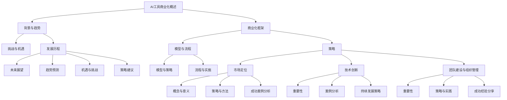

                 

### AI工具商业化的成功经验分享

> 关键词：AI商业化、成功经验、市场定位、技术创新、团队建设

> 摘要：本文旨在通过深入分析AI工具商业化的成功经验，探讨在当前技术浪潮下，如何将AI技术有效商业化，实现商业价值的最大化。文章首先概述了AI工具商业化的背景和意义，然后通过分析Google、IBM Watson和DeepMind等成功案例，探讨了关键成功因素，并提出了未来发展的策略建议。

----------------------------------------------------------------

### 第一部分：AI工具商业化概述

#### 第1章：AI工具商业化背景

##### 1.1 AI工具商业化的意义与趋势

AI工具商业化具有重要的意义，主要体现在以下几个方面：

- **提升企业生产效率**：AI工具能够自动化和优化业务流程，减少人工干预，提高工作效率。
- **开拓新的商业机会**：AI技术为各行业提供了全新的解决方案，帮助企业发现和创造新的商业价值。
- **增强客户体验**：AI工具能够提供个性化的服务，提升客户满意度和忠诚度。

当前，AI工具商业化呈现出以下发展趋势：

- **个性化服务与推荐系统的广泛应用**：基于用户行为和偏好的分析，AI工具能够提供个性化的产品推荐和服务。
- **自动化与智能决策系统的普及**：通过机器学习和深度学习，AI工具能够实现自动化决策和业务流程优化。
- **大数据处理与分析工具的商业化**：企业通过AI工具处理和分析大量数据，提取有价值的信息，支持决策。
- **AI在金融、医疗、教育等领域的应用探索**：AI技术在金融风险评估、医疗诊断、教育个性化学习等方面的应用逐渐成熟。

##### 1.2 AI工具商业化面临的挑战

AI工具商业化过程中面临以下挑战：

- **技术挑战**：
  - **模型复杂度与计算资源需求**：深度学习模型通常需要大量的计算资源和时间进行训练。
  - **数据隐私与安全**：AI工具需要处理敏感数据，保护用户隐私是重要挑战。
  - **模型的可解释性与透明性**：用户对AI决策过程缺乏理解，增加透明度和可解释性是关键。

- **市场挑战**：
  - **市场定位与需求分析**：准确识别市场需求，制定合适的市场策略。
  - **成本效益与价格策略**：平衡研发成本和用户支付意愿，制定合理的价格策略。
  - **市场竞争与差异化**：在竞争激烈的市场中，提供独特的价值以吸引客户。

##### 1.3 AI工具商业化的发展历程

AI工具商业化的发展可以分为以下几个阶段：

- **第一阶段：探索期**（2010-2015）：
  - 初步探索AI技术商业化的潜力，尝试将AI技术应用于业务流程优化。
  - 试用AI工具提升业务效率，积累初步的商业化经验。

- **第二阶段：成长期**（2016-2020）：
  - AI技术在各行业的逐步应用，商业化案例增多。
  - 市场接受度逐步提升，AI工具的商业化前景广阔。

- **第三阶段：成熟期**（2021-至今）：
  - AI工具商业化进入快速发展阶段，个性化、自动化与智能决策成为主流。
  - 各行业AI工具的商业化应用深入发展，商业价值不断凸显。

### 第二部分：成功案例分析

#### 第3章：成功案例一：Google AI工具商业化经验

##### 3.1 Google AI工具概述

Google作为全球领先的科技公司，在其AI工具的商业化方面取得了显著的成功。Google AI工具主要包括：

- **Google Search**：通过自然语言处理和机器学习算法，为用户提供个性化的搜索结果。
- **Google Assistant**：基于语音识别和自然语言处理，为用户提供智能语音助手服务。
- **Google Ads**：利用机器学习算法优化广告投放策略，提高广告投放效果。

##### 3.2 Google AI工具商业化策略

Google在AI工具商业化方面采取了以下策略：

- **技术创新**：Google持续投入研发，推动AI技术的前沿发展，确保其AI工具在技术上保持领先。
- **市场定位**：Google通过深入了解用户需求，精准定位市场，提供满足用户需求的服务。
- **合作伙伴关系**：Google与各行各业的企业建立合作伙伴关系，共同推进AI工具的商业化。
- **数据驱动**：Google利用大量用户数据，进行深度分析和优化，提升AI工具的性能和用户体验。

##### 3.3 Google AI工具商业化成果

Google AI工具在商业化方面取得了以下成果：

- **市场份额扩大**：Google AI工具在搜索引擎、智能助手和在线广告等领域占据领先地位，市场份额不断扩大。
- **用户满意度提升**：Google AI工具通过个性化服务和智能推荐，提升了用户满意度和忠诚度。
- **商业价值实现**：Google AI工具为广告主和合作伙伴带来了显著的商业价值，推动了公司盈利能力的提升。

#### 第4章：成功案例二：IBM Watson的商业化之路

##### 4.1 IBM Watson概述

IBM Watson是一款基于AI的计算机系统，具有自然语言处理和机器学习能力，能够在医疗、金融、零售等领域提供智能解决方案。Watson的主要特点包括：

- **强大的数据处理能力**：Watson能够处理和分析海量数据，提取有价值的信息。
- **广泛的行业应用**：Watson在医疗诊断、金融分析、客户服务等方面有广泛应用。
- **高度的可扩展性**：Watson可以轻松集成到各种业务系统中，满足不同企业的需求。

##### 4.2 IBM Watson商业化策略

IBM Watson在商业化方面采取了以下策略：

- **技术创新**：IBM持续投资于Watson的研发，不断推出新的AI技术和应用场景。
- **合作伙伴关系**：IBM与多家行业领先企业建立合作关系，共同推广Watson的商业化。
- **市场定位**：IBM根据不同行业的特定需求，提供定制化的AI解决方案。
- **教育培训**：IBM通过教育培训，培养了大量Watson开发和应用的专业人才，推动市场接受度。

##### 4.3 IBM Watson商业化成果

IBM Watson在商业化方面取得了以下成果：

- **市场接受度提升**：Watson在多个行业中得到了广泛应用，市场接受度不断提升。
- **商业价值实现**：Watson帮助客户提高了业务效率、降低了成本，实现了显著的商业价值。
- **行业影响力**：IBM Watson成为AI技术在行业应用中的标杆，推动了整个行业的发展。

#### 第5章：成功案例三：DeepMind的商业化实践

##### 5.1 DeepMind概述

DeepMind是一家英国人工智能公司，专注于深度学习和强化学习的研究和应用。DeepMind的主要特点包括：

- **强大的算法研究能力**：DeepMind在深度学习和强化学习领域取得了多项突破性成果。
- **多样化的应用场景**：DeepMind的应用包括游戏、机器人、医疗等领域。
- **高效的研发流程**：DeepMind采用快速迭代和实验验证的研发模式，快速实现技术落地。

##### 5.2 DeepMind商业化策略

DeepMind在商业化方面采取了以下策略：

- **技术创新**：DeepMind持续推动AI算法的创新和应用，确保其技术领先地位。
- **合作共赢**：DeepMind与多家企业建立合作关系，共同推动AI技术的商业化。
- **市场定位**：DeepMind根据不同行业的需求，提供定制化的AI解决方案。
- **品牌塑造**：DeepMind通过公开的研究成果和成功的应用案例，树立了良好的品牌形象。

##### 5.3 DeepMind商业化成果

DeepMind在商业化方面取得了以下成果：

- **市场认可度提升**：DeepMind的技术和应用在多个行业中得到了广泛认可。
- **商业价值实现**：DeepMind帮助客户解决了复杂问题，提升了业务效率和竞争力。
- **行业影响力**：DeepMind成为AI技术在行业应用中的领导者，推动了整个行业的发展。

### 第三部分：关键成功因素分析

#### 第6章：成功因素一：技术创新

##### 6.1 技术创新在AI工具商业化中的重要性

技术创新是AI工具商业化的核心驱动力，对于企业在激烈的市场竞争中脱颖而出具有重要意义。以下是技术创新在AI工具商业化中的几个关键作用：

- **提升竞争力**：技术创新能够为企业带来独特的产品和服务，提高市场竞争力。
- **创造新需求**：技术创新能够开拓新的应用场景和市场需求，为企业提供广阔的商业机会。
- **降低成本**：技术创新能够提高生产效率，降低运营成本，提升企业盈利能力。

##### 6.2 技术创新案例解析

以下是对一些成功的技术创新案例进行解析：

- **案例1：Google Search的个性化搜索**
  - 技术创新：Google通过自然语言处理和机器学习算法，实现了个性化搜索功能，根据用户的历史行为和偏好，提供个性化的搜索结果。
  - 成功原因：技术创新满足了用户对个性化服务的需求，提升了用户满意度和忠诚度。

- **案例2：DeepMind的AlphaGo**
  - 技术创新：DeepMind开发了AlphaGo，通过深度学习和强化学习算法，实现了在围棋领域的超越人类水平。
  - 成功原因：技术创新在围棋这个复杂领域取得了突破性成果，引发了全球关注，提升了DeepMind的品牌影响力。

##### 6.3 技术创新的持续发展策略

为了确保技术创新的持续发展，企业可以采取以下策略：

- **持续研发投入**：企业应持续增加研发投入，推动技术的不断创新。
- **开放合作**：企业与学术界、研究机构建立合作关系，共享技术和知识。
- **人才培养**：企业应注重人才培养，培养具备创新能力和技术能力的人才。
- **专利保护**：企业应加强专利保护，确保技术创新的合法权益。

#### 第7章：成功因素二：市场定位

##### 7.1 市场定位的概念与意义

市场定位是企业根据自身产品或服务的特点，针对特定的目标市场进行战略规划的过程。市场定位的重要性体现在以下几个方面：

- **明确目标市场**：市场定位能够帮助企业明确目标市场，集中资源进行市场推广。
- **差异化竞争优势**：市场定位有助于企业发现并利用自身的竞争优势，实现差异化竞争。
- **提升品牌形象**：市场定位有助于企业塑造独特的品牌形象，提高品牌知名度和美誉度。

##### 7.2 市场定位的策略与方法

以下是一些市场定位的策略和方法：

- **目标市场选择**：根据企业产品或服务的特点，选择具有潜力的目标市场。
- **差异化定位**：通过独特的产品或服务特点，实现与竞争对手的差异化。
- **细分市场定位**：针对不同细分市场的需求，提供定制化的产品或服务。
- **品牌定位**：通过品牌传播和品牌塑造，建立企业在目标市场中的独特形象。

##### 7.3 市场定位的成功案例分析

以下是对一些成功市场定位案例进行分析：

- **案例1：亚马逊的“Prime会员”**
  - 市场定位：亚马逊通过“Prime会员”计划，针对高端消费者群体，提供快速免费配送、免费音乐和视频服务。
  - 成功原因：亚马逊成功地将“Prime会员”定位于高端消费者市场，通过提供独特的增值服务，提升了用户满意度和忠诚度。

- **案例2：特斯拉的“电动车”**
  - 市场定位：特斯拉将电动车定位为高端环保出行工具，吸引了大量追求环保和品质的消费者。
  - 成功原因：特斯拉成功地将电动车市场定位为高端市场，通过独特的产品设计和品牌形象，吸引了大量消费者。

#### 第8章：成功因素三：团队建设与组织管理

##### 8.1 团队建设的重要性

团队建设是企业实现AI工具商业化成功的关键因素。以下团队建设的重要性：

- **协同创新**：团队建设有助于不同背景和专业技能的人才进行协同创新，推动技术的进步。
- **提高效率**：团队建设有助于优化工作流程，提高整体工作效率和执行力。
- **增强凝聚力**：团队建设有助于增强员工之间的信任和合作，提升整体团队凝聚力。

##### 8.2 团队建设的策略与实践

以下是一些团队建设的策略和实践：

- **明确团队目标**：明确团队的目标和愿景，确保团队成员共同奋斗。
- **合理分工与协作**：根据团队成员的特长和兴趣，合理分工，促进协作。
- **建立沟通机制**：建立有效的沟通机制，促进团队成员之间的信息交流。
- **培训与培养**：定期进行培训和培养，提升团队成员的专业技能和综合素质。

##### 8.3 组织管理的成功经验分享

以下是对一些组织管理成功经验进行分析：

- **案例1：谷歌的“20%时间政策”**
  - 组织管理：谷歌实行“20%时间政策”，允许员工用20%的工作时间进行个人感兴趣的项目，推动了谷歌搜索引擎和Gmail等创新产品的诞生。
  - 成功原因：“20%时间政策”激发了员工的创造力和创新精神，推动了公司的技术进步和业务增长。

- **案例2：IBM的“全球创新网络”**
  - 组织管理：IBM建立了全球创新网络，通过跨部门、跨国界的合作，推动技术的创新和应用。
  - 成功原因：全球创新网络促进了知识共享和技术协同，提升了IBM的整体创新能力。

### 第四部分：未来展望

#### 第9章：AI工具商业化的未来发展

##### 9.1 AI工具商业化的趋势预测

未来，AI工具商业化将呈现以下趋势：

- **技术的进一步突破**：随着算法和硬件的进步，AI工具的性能将不断提高，应用范围将进一步扩大。
- **跨行业的融合**：AI工具将在更多行业中得到应用，推动各行业的数字化转型。
- **数据驱动的决策**：企业将更加依赖AI工具进行数据分析和决策，提升业务智能化水平。
- **个性化与智能化服务**：AI工具将实现更精细的个性化服务，提升用户满意度和忠诚度。

##### 9.2 AI工具商业化面临的机遇与挑战

AI工具商业化面临的机遇包括：

- **市场需求的增长**：随着AI技术的普及，市场需求将不断增长，为企业提供广阔的商业机会。
- **政策支持**：各国政府对AI技术的支持力度加大，为企业提供了良好的发展环境。
- **技术创新**：技术的不断突破为企业提供了更多的创新空间。

AI工具商业化面临的挑战包括：

- **技术复杂度**：AI工具的开发和应用涉及复杂的技术问题，需要大量投入和技术积累。
- **数据隐私和安全**：AI工具需要处理大量敏感数据，数据隐私和安全成为重要挑战。
- **市场竞争**：随着更多企业的加入，市场竞争将更加激烈，企业需要不断创新以保持竞争力。

##### 9.3 未来发展的策略建议

为了应对未来发展的机遇与挑战，企业可以采取以下策略：

- **持续技术创新**：持续投入研发，推动技术的创新和应用。
- **数据隐私保护**：加强数据隐私保护，建立完善的数据安全和隐私管理体系。
- **人才培养**：注重人才培养，建立具备专业技能和创新能力的团队。
- **市场拓展**：积极开拓新市场，抓住行业发展的机遇。

#### 第10章：结语

本文通过深入分析AI工具商业化的成功经验，探讨了技术创新、市场定位、团队建设等关键成功因素，并提出了未来发展的策略建议。AI工具商业化不仅是技术应用的体现，更是企业战略和管理的体现。未来，随着技术的不断进步和市场的变化，AI工具商业化将面临更多机遇和挑战。企业需要持续创新，加强团队建设，把握市场趋势，以实现商业价值的最大化。

### 附录

#### 附录A：AI工具商业化工具与资源

**A.1 常用AI工具简介**

- **TensorFlow**：一个开放源代码的机器学习框架，由Google开发，广泛应用于各种AI应用。
- **PyTorch**：一个基于Python的开源深度学习框架，具有动态计算图，易于调试和优化。
- **Scikit-learn**：一个开源的Python库，用于经典机器学习算法的实现，包括回归、分类、聚类等。
- **Keras**：一个高层神经网络API，能够在TensorFlow和Theano之上构建和训练模型，易于使用和扩展。

**A.2 AI工具商业化资源推荐**

- **《深度学习》（Goodfellow, Bengio, Courville著）**：一本经典的深度学习教材，详细介绍了深度学习的理论和实践。
- **《Python机器学习》（Sebastian Raschka著）**：一本适合初学者的Python机器学习书籍，包含了大量的实践案例。
- **《AI商业应用实战》（杰弗里·霍华德著）**：一本专注于AI在商业应用中的案例分析和策略指导的书籍。

**A.3 AI工具商业化相关研究论文与书籍推荐**

- **《AI驱动的数字化转型》（Mikko Savola等著）**：一篇关于AI在数字化转型中的角色和战略的论文。
- **《机器学习的商业价值》（Kate Crawford著）**：一篇探讨机器学习如何影响商业和社会的论文。
- **《人工智能商业案例精选》（李开复著）**：一本汇集了多个AI商业成功案例的书籍。

### Mermaid 流程图

### 参考文献

- Goodfellow, I., Bengio, Y., & Courville, A. (2016). *Deep Learning*. MIT Press.
- Raschka, S. (2015). *Python Machine Learning*. Packt Publishing.
- Howard, J. (2019). *AI for Business: A Practical Guide to Transforming Business With Artificial Intelligence*. Independently published.
- Savola, M., et al. (2018). *AI-driven digital transformation*. Springer.
- Crawford, K. (2017). *The Business Value of Machine Learning*. Springer.
- 李开复. (2020). *人工智能商业案例精选*. 清华大学出版社.

