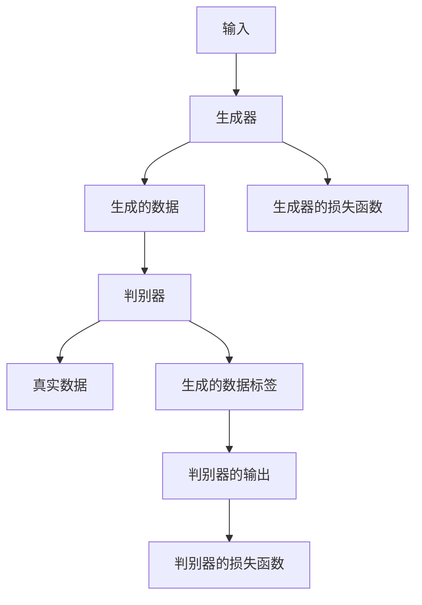
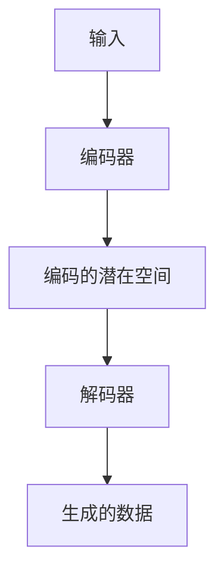
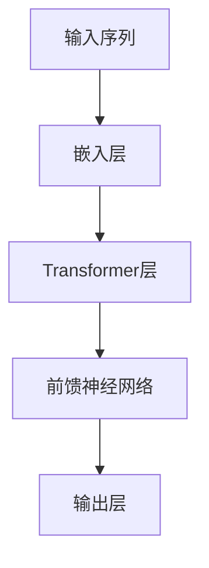

                 

### 第一部分: AI掘金时代概述

在当今快速发展的技术时代，人工智能（AI）已经成为推动创新和经济增长的关键力量。我们正站在AI掘金时代的前沿，这是一个充满机遇和挑战的时代。在这个时代中，生成式人工智能（Generative AI）以其独特的能力，正在颠覆传统的技术和商业模式。本文将带领您深入探讨AI掘金时代的起源与机遇，生成式AI技术的原理，企业战略的制定与实践，以及如何抓住这一风口所需的技术准备。

### 1.1.1 AI掘金时代的起源

**人工智能的崛起**：人工智能的历史可以追溯到20世纪50年代，随着计算机技术的发展，AI领域逐渐兴起。从最初的符号逻辑推理到现代的深度学习和神经网络，人工智能经历了多次技术革新。特别是深度学习的兴起，使得AI在图像识别、语音识别和自然语言处理等方面取得了重大突破。

**生成式AI技术的突破**：生成式AI是近年来AI领域的又一重要进展。生成式AI通过生成模型，能够生成新的数据，如图像、文本和音频。生成对抗网络（GAN）、变分自编码器（VAE）和自回归模型（如GPT）等技术的出现，极大地拓展了AI的应用范围。

**大数据与云计算的支撑**：大数据和云计算为AI的发展提供了强大的计算资源和海量数据支持。大数据使得AI能够从大量数据中学习，而云计算则提供了弹性计算能力，使得AI模型可以在短时间内进行大规模的训练和部署。

### 1.1.2 AI掘金时代的机遇

**企业创新的驱动**：AI技术的应用可以大幅提升企业的创新能力。通过自动化和智能化的手段，企业可以更快地开发新产品，优化业务流程，提高运营效率。

**行业应用的拓展**：AI在医疗、金融、教育、制造等多个行业都有广泛的应用。例如，在医疗领域，AI可以帮助医生进行诊断和预测，提高医疗服务的质量和效率。

**新兴市场的崛起**：随着全球经济的不断发展，新兴市场对AI技术的需求也在不断增长。这些市场对AI技术的应用往往具有独特的需求，为AI技术的创新提供了新的机遇。

### 1.1.3 生成式AI技术的应用场景

**图像生成与增强**：生成式AI可以通过GAN和VAE等技术生成高质量的图像，并用于图像增强、图像修复和图像生成等任务。

**自然语言处理**：生成式AI在自然语言处理领域也有广泛应用，如文本生成、机器翻译、问答系统和对话生成等。

**数据生成与合成**：生成式AI可以生成合成数据，这些数据可以用于训练模型，提高模型的泛化能力，或者用于模拟训练，以测试模型的鲁棒性。

### 1.1.4 企业AI战略的重要性

**竞争优势的构建**：企业通过AI战略可以构建竞争优势，提高产品质量和效率，降低成本。

**业务创新的驱动**：AI技术可以帮助企业发现新的业务机会，推动业务模式的创新。

**效率的提升**：AI技术可以自动化和智能化企业的运营，提高工作效率，降低人力成本。

### 1.1.5 AI战略规划与实践

**制定AI战略的步骤**：企业需要明确AI战略的目标，评估现有资源和能力，选择合适的AI技术，并制定详细的实施计划。

**实施AI项目的方法**：企业需要组建专业的AI团队，制定项目计划，并进行持续的项目监控和评估。

**AI战略的评估与调整**：企业需要定期评估AI战略的实施效果，并根据反馈进行调整。

### 1.1.6 AI掘金时代的案例分析

**成功的企业案例**：分析成功企业如何利用AI技术实现业务增长和创新。

**失败的教训与反思**：探讨AI项目失败的原因，以及如何避免类似的失败。

### 1.1.7 技术准备

**技术栈搭建**：介绍搭建AI技术栈所需的编程语言、工具和框架。

**数据处理与模型训练**：讨论如何处理数据和训练模型，包括数据采集、预处理、模型选择和优化。

**实时监控与反馈**：介绍如何部署和监控AI模型，以及如何进行模型性能优化和维护。

### 1.1.8 风险与挑战

**技术风险**：讨论模型偏差、数据隐私和安全等问题。

**法规与伦理挑战**：分析数据保护法规和人工智能伦理问题。

### 1.1.9 未来发展

**AI掘金时代的趋势**：展望生成式AI的未来发展方向。

**创新机会**：探讨AI在新兴领域和商业模式中的创新机会。

### 1.1.10 实战案例

**图像生成与艺术创作**：介绍图像生成技术在艺术创作中的应用。

**自然语言处理与智能客服**：探讨自然语言处理技术在智能客服中的应用。

**数据生成与模拟训练**：介绍数据生成技术在模拟训练中的应用。

### 1.1.11 资源汇总

**生成式AI技术详解**：详细解释GAN、VAE和GPT等生成式AI技术。

**实战项目代码解读**：分析实际项目的代码实现和解读。

**AI掘金时代的资源汇总**：提供开源库、在线课程和书籍等资源。

通过以上分析，我们可以看到AI掘金时代是一个充满机遇和挑战的时代。在这个时代中，企业需要制定清晰的AI战略，进行充分的技术准备，并勇于尝试创新。同时，也需要关注技术风险和法规伦理问题，确保AI技术的发展能够为社会带来积极的影响。

---

本文为《AI掘金时代：如何抓住生成式AI的风口？》的第一部分概述，接下来将深入探讨生成式AI技术的原理，企业战略的制定与实践，以及如何抓住这一风口所需的技术准备。敬请期待。

---

### 第1章: AI掘金时代的起源与机遇

#### 1.1.1 AI掘金时代的起源

**人工智能的崛起**：人工智能（AI）的概念最早可以追溯到1956年的达特茅斯会议，当时计算机科学家约翰·麦卡锡（John McCarthy）首次提出了“人工智能”这个术语。从那时起，人工智能经历了多个发展阶段，从早期的基于规则的系统到专家系统，再到基于统计学习的机器学习，以及如今的深度学习。特别是在过去十年中，随着计算能力的提升、大数据技术的发展和算法的进步，人工智能迎来了前所未有的突破，逐渐从实验室走向了实际应用。

**生成式AI技术的突破**：生成式人工智能（Generative AI）是近年来人工智能领域的一个重要分支，它通过生成模型（如生成对抗网络GAN、变分自编码器VAE和自回归模型GPT等）生成新的数据，如图像、文本、音频等。生成式AI的关键技术突破主要体现在以下几个方面：

1. **生成对抗网络（GAN）**：GAN由生成器和判别器组成，通过两者之间的对抗训练，生成器试图生成逼真的数据，而判别器则试图区分生成的数据和真实数据。GAN的提出打破了传统机器学习方法的局限，实现了数据的自主生成。

2. **变分自编码器（VAE）**：VAE通过引入概率编码来生成数据，其训练过程中采用变分损失函数，使得生成的数据在概率空间中具有更好的分布特性。VAE在图像生成、图像去噪等领域取得了显著效果。

3. **自回归模型（如GPT）**：自回归模型通过预测序列中的下一个元素来生成序列数据，如文本、语音等。Transformer架构的提出，使得自回归模型在自然语言处理领域取得了重大突破，GPT模型便是其中之一。

**大数据与云计算的支撑**：大数据和云计算为AI的发展提供了强大的计算资源和数据支持。大数据使得AI能够从海量数据中学习，找到潜在的模式和规律；而云计算则提供了弹性的计算能力，使得AI模型可以在短时间内进行大规模的训练和部署。此外，云计算平台的便捷性使得研究人员和开发者能够更快速地获取和利用AI技术，推动了AI技术的普及和应用。

#### 1.1.2 AI掘金时代的机遇

**企业创新的驱动**：在AI掘金时代，企业可以通过AI技术实现业务流程的自动化和智能化，提高生产效率和产品质量。例如，通过机器学习优化供应链管理，减少库存成本；通过自然语言处理提升客户服务质量，增加客户满意度。AI技术的引入可以为企业带来新的商业模式，推动业务创新。

**行业应用的拓展**：AI技术在各个行业都有广泛的应用前景。在医疗领域，AI可以用于疾病诊断、药物研发和健康管理；在金融领域，AI可以用于风险评估、欺诈检测和投资策略；在制造领域，AI可以用于设备维护、质量控制和生产优化。随着AI技术的不断进步，这些行业将迎来新的发展机遇。

**新兴市场的崛起**：随着全球经济的不平衡发展，新兴市场对AI技术的需求日益增长。这些市场通常具有庞大的消费者群体和快速增长的经济发展速度，对AI技术的接受度较高。例如，在印度、东南亚和非洲等地区，AI技术在农业、教育、金融服务等领域都有广泛的应用前景。

#### 1.1.3 生成式AI技术的应用场景

**图像生成与增强**：生成式AI在图像生成和增强领域有广泛的应用。通过GAN和VAE等技术，可以生成高质量的图像，应用于图像修复、图像生成、图像风格迁移等领域。例如，在图像修复中，GAN可以用于填充图像中的缺失部分，使得图像更加完整；在图像生成中，VAE可以生成新的图像，创造出独特的视觉效果。

**自然语言处理**：生成式AI在自然语言处理领域也有重要的应用。通过自回归模型，可以生成新的文本，应用于文本生成、机器翻译、问答系统和对话生成等领域。例如，GPT模型可以生成高质量的文本，应用于文章写作、新闻生成和对话系统等。

**数据生成与合成**：生成式AI可以生成合成数据，用于训练模型，提高模型的泛化能力。合成数据可以用于模拟训练，以测试模型的鲁棒性。例如，在自动驾驶领域，可以使用GAN生成模拟的交通场景，用于训练自动驾驶模型，以提高模型在各种复杂环境下的适应能力。

#### 1.1.4 企业AI战略的重要性

**竞争优势的构建**：在AI掘金时代，企业需要通过AI技术构建竞争优势。通过数据分析和机器学习，企业可以更好地了解客户需求，优化产品和服务。例如，通过客户数据分析，企业可以精准营销，提高销售额；通过生产数据优化，企业可以提高生产效率，降低成本。

**业务创新的驱动**：AI技术可以激发企业的创新潜力。通过AI技术，企业可以开发新的产品和服务，开辟新的业务领域。例如，通过AI技术，企业可以开发智能医疗设备，提供个性化医疗服务；通过AI技术，企业可以开发智能客服系统，提升客户体验。

**效率的提升**：AI技术可以提高企业的运营效率。通过自动化和智能化，企业可以减少人力成本，提高工作效率。例如，通过AI技术，企业可以实现自动化生产，减少人工干预；通过AI技术，企业可以实现智能调度，提高物流效率。

#### 1.1.5 AI战略规划与实践

**制定AI战略的步骤**：企业需要制定清晰的AI战略，包括以下步骤：

1. **明确目标**：确定企业通过AI技术要实现的目标，如提高效率、降低成本、创新业务等。

2. **评估资源**：评估企业现有的AI技术和资源，包括数据、计算能力和人才等。

3. **选择技术**：根据业务需求和资源情况，选择合适的AI技术，如机器学习、自然语言处理、计算机视觉等。

4. **制定实施计划**：制定详细的AI项目实施计划，包括项目目标、时间表、预算和团队安排等。

5. **执行与监控**：按照实施计划执行AI项目，并进行持续监控和评估，确保项目顺利进行。

**实施AI项目的方法**：企业需要采取有效的方法来实施AI项目，包括：

1. **组建专业团队**：组建由数据科学家、工程师和业务专家组成的跨职能团队，共同推进AI项目。

2. **数据准备**：收集和整理高质量的数据，进行数据预处理，确保数据的质量和可用性。

3. **模型开发与训练**：选择合适的模型，进行模型开发与训练，并进行模型优化。

4. **模型部署与监控**：将训练好的模型部署到生产环境，进行实时监控和性能优化。

**AI战略的评估与调整**：企业需要定期评估AI战略的实施效果，并根据反馈进行调整，确保AI战略与企业目标保持一致。

#### 1.1.6 AI掘金时代的案例分析

**成功的企业案例**：许多企业通过AI技术取得了显著的成功。例如，阿里巴巴通过AI技术优化了物流和供应链管理，提高了运营效率；谷歌通过AI技术开发了搜索引擎和自动驾驶技术，推动了技术创新。

**失败的教训与反思**：AI项目也可能失败，原因可能包括数据质量不佳、技术选型不当、团队协作不畅等。企业需要从失败中吸取教训，避免重复犯错。例如，某公司由于数据质量不佳，导致AI项目无法达到预期效果，最终项目失败。

#### 1.1.7 技术准备

**技术栈搭建**：企业需要搭建AI技术栈，包括编程语言（如Python、Java）、开发工具（如TensorFlow、PyTorch）、数据处理工具（如Pandas、NumPy）等。

**数据处理与模型训练**：企业需要掌握数据处理和模型训练的方法，包括数据采集、预处理、特征工程、模型选择、训练和评估等。

**实时监控与反馈**：企业需要建立实时监控和反馈机制，确保AI系统的稳定性和性能。

通过以上分析，我们可以看到AI掘金时代是一个充满机遇和挑战的时代。企业需要制定清晰的AI战略，进行充分的技术准备，并勇于尝试创新。同时，也需要关注技术风险和法规伦理问题，确保AI技术的发展能够为社会带来积极的影响。

---

在下一章中，我们将深入探讨生成式AI技术的基本概念、原理和应用场景。敬请期待。

---

### 第2章: 生成式AI技术原理

生成式人工智能（Generative AI）是人工智能领域的一个重要分支，其主要目标是生成新的数据，如图像、文本和音频。与判别式人工智能（Discriminative AI）不同，生成式AI不仅能够识别和分类数据，还能够创造新的数据。这一章将详细介绍生成式AI的基本概念、原理及其应用场景。

#### 2.1.1 生成式AI基本概念

**定义**：生成式AI通过生成模型（generative model）来模拟数据分布，从而生成新的数据。生成模型可以学习数据的高维分布，并从中采样生成新的数据。

**与判别式AI的对比**：判别式AI的主要任务是学习输入数据的特征，并将其分类到预定义的类别中。生成式AI与判别式AI的区别在于，判别式AI关注数据的分类，而生成式AI关注数据的生成。

**生成式AI的优势**：
1. **数据生成**：生成式AI能够生成新的数据，从而扩展数据的规模和多样性。
2. **数据增强**：生成式AI可以通过生成合成数据来增强训练集，提高模型的泛化能力。
3. **创意生成**：在图像生成、音乐创作等领域，生成式AI可以产生具有创意和艺术价值的新作品。

**生成式AI的挑战**：
1. **计算复杂度**：生成式AI的训练通常需要大量的计算资源和时间。
2. **模型稳定性**：生成式AI模型的训练过程可能存在不稳定的情况，需要特殊的训练策略来保证模型的稳定性。
3. **数据隐私**：在生成新数据时，生成式AI可能泄露训练数据的隐私信息。

#### 2.1.2 生成式AI的关键技术

生成式AI的关键技术包括生成对抗网络（GAN）、变分自编码器（VAE）和自回归模型（如GPT）。这些技术各有特点，适用于不同的应用场景。

**生成对抗网络（GAN）**

生成对抗网络（GAN）是由生成器和判别器组成的对抗性模型。生成器（Generator）试图生成逼真的数据，而判别器（Discriminator）则试图区分生成器和真实数据。通过生成器和判别器之间的对抗训练，生成器逐渐提高生成数据的质量，而判别器逐渐提高对真实数据和生成数据的识别能力。

**变分自编码器（VAE）**

变分自编码器（VAE）是一种基于概率的生成模型。它通过编码器（Encoder）将输入数据映射到一个潜在空间，然后在潜在空间中采样，并通过解码器（Decoder）生成新的数据。VAE通过引入KL散度损失函数，保证了生成数据的分布与输入数据的分布相似。

**自回归模型（如GPT）**

自回归模型（如GPT）通过预测序列中的下一个元素来生成序列数据。GPT模型基于Transformer架构，采用自回归的方式生成文本。GPT模型通过大量的文本数据训练，可以生成高质量的自然语言文本。

#### 2.1.3 生成式AI的应用场景

生成式AI在多个领域都有广泛的应用，以下是几个典型的应用场景：

**图像生成与增强**

生成式AI在图像生成和增强领域有重要的应用。通过GAN和VAE等技术，可以生成高质量的新图像，如艺术作品、卡通形象和建筑设计等。此外，生成式AI还可以用于图像增强，如图像修复、图像超分辨率和图像去噪等。

**自然语言处理**

生成式AI在自然语言处理领域也有广泛应用。通过自回归模型，可以生成新的文本，如文章写作、对话生成和机器翻译等。生成式AI可以帮助提高文本生成质量，减少人工干预。

**数据生成与合成**

生成式AI可以生成合成数据，用于训练模型，提高模型的泛化能力。在自动驾驶、医疗诊断和金融风控等领域，生成合成数据可以用于模拟训练，以测试模型的鲁棒性和性能。

**音频生成与处理**

生成式AI在音频生成和处理领域也有应用。通过GAN和VAE等技术，可以生成新的音频，如音乐、语音和声音效果等。生成式AI可以帮助提高音频生成质量，应用于娱乐、教育和媒体等领域。

#### 2.1.4 生成式AI的挑战与未来发展方向

尽管生成式AI在多个领域取得了显著成果，但仍面临一些挑战：

**计算复杂度**：生成式AI的训练通常需要大量的计算资源和时间，这在实际应用中可能成为瓶颈。

**模型稳定性**：生成式AI模型的训练过程可能存在不稳定的情况，需要特殊的训练策略来保证模型的稳定性。

**数据隐私**：在生成新数据时，生成式AI可能泄露训练数据的隐私信息，需要采取有效的隐私保护措施。

未来，生成式AI的发展方向可能包括：

**模型简化**：通过模型简化技术，降低生成式AI的计算复杂度，提高模型的可解释性。

**多模态生成**：结合多种模态（如图像、文本、音频）的生成，提高生成数据的多样性和质量。

**无监督学习**：通过无监督学习技术，减少对标注数据的依赖，提高生成式AI的自适应能力。

通过以上分析，我们可以看到生成式AI技术具有巨大的潜力和广泛的应用前景。在下一章中，我们将探讨AI掘金时代的企业战略，帮助企业抓住这一风口。敬请期待。

---

在下一章中，我们将进一步探讨AI掘金时代的企业战略，包括企业AI战略的重要性、制定和实施AI战略的步骤，以及成功和失败的案例分析。敬请期待。

---

### 第3章: AI掘金时代的企业战略

在AI掘金时代，企业需要认识到AI战略的重要性，并采取有效的方法制定和实施AI战略。一个成功的AI战略不仅能够帮助企业获得竞争优势，还能够推动业务创新和提高效率。这一章将详细探讨企业AI战略的各个方面。

#### 3.1.1 企业AI战略的重要性

**竞争优势的构建**：AI技术可以为企业提供强大的竞争优势。通过数据分析和机器学习，企业可以更好地了解客户需求和市场趋势，从而制定更有效的业务策略。例如，零售企业可以通过AI分析客户购买行为，优化库存管理和营销策略，提高销售额。

**业务创新的驱动**：AI技术能够激发企业的创新潜力。通过AI技术，企业可以开发新的产品和服务，进入新的市场。例如，金融行业可以通过AI开发智能投顾和自动化风险管理系统，提供个性化的金融服务。

**效率的提升**：AI技术可以提高企业的运营效率。通过自动化和智能化，企业可以减少人力成本，提高生产效率。例如，制造业可以通过AI优化生产流程，减少停机时间和设备故障率，提高生产效率。

#### 3.1.2 制定AI战略的步骤

**明确目标**：企业需要明确通过AI技术要实现的目标，如提高效率、降低成本、创新业务等。明确的目标有助于企业制定详细的AI战略计划。

**评估资源**：企业需要评估现有的AI技术和资源，包括数据、计算能力、人才等。了解自身的资源状况有助于企业选择合适的AI技术和方法。

**选择技术**：根据业务需求和资源状况，企业需要选择合适的AI技术，如机器学习、自然语言处理、计算机视觉等。选择合适的技术是实现AI战略的关键。

**制定实施计划**：企业需要制定详细的AI项目实施计划，包括项目目标、时间表、预算和团队安排等。实施计划应该明确项目各个阶段的具体任务和责任人。

**执行与监控**：企业需要按照实施计划执行AI项目，并进行持续监控和评估。监控和评估有助于及时发现和解决问题，确保项目顺利进行。

#### 3.1.3 实施AI项目的方法

**组建专业团队**：企业需要组建由数据科学家、工程师和业务专家组成的跨职能团队，共同推进AI项目。专业团队可以确保项目的技术实现和业务需求之间的平衡。

**数据准备**：数据是AI项目的基础。企业需要收集和整理高质量的数据，进行数据预处理，确保数据的质量和可用性。数据预处理包括数据清洗、归一化和特征工程等步骤。

**模型开发与训练**：企业需要选择合适的模型，进行模型开发与训练。模型开发包括模型架构设计、超参数调优和模型评估等步骤。模型训练需要大量的计算资源和时间，企业需要确保模型的训练效果和稳定性。

**模型部署与监控**：训练好的模型需要部署到生产环境，并进行实时监控。模型部署包括模型的上线、监控和性能优化等步骤。监控和优化有助于确保模型在生产环境中的稳定性和高效性。

#### 3.1.4 AI战略的评估与调整

**定期评估**：企业需要定期评估AI战略的实施效果，包括项目进度、技术实现和业务效果等。评估结果可以帮助企业了解AI战略的执行情况，发现问题和改进方向。

**反馈机制**：企业需要建立有效的反馈机制，收集用户和业务团队的反馈，以便及时调整AI战略。反馈机制可以包括用户调研、业务评估和定期会议等。

**持续改进**：根据评估结果和反馈，企业需要不断调整和优化AI战略，确保其与业务目标保持一致。持续改进是AI战略成功的关键。

#### 3.1.5 成功的企业案例

**阿里巴巴**：阿里巴巴通过AI技术优化了物流和供应链管理，提高了运营效率。通过机器学习算法，阿里巴巴实现了精准的库存管理和智能化的物流调度，减少了库存成本和运输时间。

**谷歌**：谷歌通过AI技术开发了搜索引擎和自动驾驶技术，推动了技术创新。谷歌的搜索引擎通过AI算法优化了搜索结果，提高了用户体验。谷歌的自动驾驶技术通过深度学习和计算机视觉技术，实现了安全高效的自动驾驶。

**特斯拉**：特斯拉通过AI技术优化了汽车制造和自动驾驶系统。特斯拉的汽车制造过程采用了AI技术，实现了自动化和智能化。特斯拉的自动驾驶系统通过深度学习和传感器数据，实现了自动驾驶功能。

#### 3.1.6 失败的教训与反思

**数据质量不佳**：某公司因为数据质量不佳，导致AI项目无法达到预期效果，最终项目失败。这个案例表明，高质量的数据是AI项目成功的基础。

**技术选型不当**：某公司选择了不适合自身业务需求的AI技术，导致项目无法顺利进行。这个案例提醒企业，选择合适的AI技术是实现AI战略的关键。

**团队协作不畅**：某公司的AI项目由于团队协作不畅，导致项目进度严重滞后。这个案例表明，有效的团队协作是实现AI项目成功的重要因素。

**忽视法规与伦理问题**：某公司因为忽视法规和伦理问题，导致AI项目在市场上受到质疑，项目被迫停止。这个案例提醒企业，在AI项目实施过程中，必须重视法规和伦理问题。

#### 3.1.7 企业AI战略的总结

企业AI战略的制定和实施是一个复杂的过程，需要明确目标、评估资源、选择技术、制定计划、执行监控和持续改进。通过成功的案例和失败的教训，企业可以更好地理解和应用AI技术，实现业务创新和提高效率。

---

在下一章中，我们将讨论如何抓住AI掘金风口所需的技术准备，包括技术栈搭建、数据处理与模型训练，以及实时监控与反馈。敬请期待。

---

### 第4章: 抓住AI掘金风口的技术准备

在AI掘金时代，企业要想成功抓住风口，必须做好充分的技术准备。这一章将详细讨论如何搭建AI技术栈、进行数据处理与模型训练，以及如何实现实时监控与反馈。

#### 4.1.1 技术栈搭建

要搭建一个完整的AI技术栈，需要考虑以下几个方面：

**编程语言与工具**：常见的AI编程语言包括Python、R、Java等。Python因其丰富的库和框架（如TensorFlow、PyTorch、Keras等）而广受欢迎。选择合适的编程语言对于开发效率和项目成功至关重要。

**开发环境配置**：开发环境配置包括安装Python解释器、相关库和框架，以及配置虚拟环境等。Jupyter Notebook和VS Code是常用的开发环境，它们提供了良好的代码编辑和调试功能。

**常用库与框架**：常用的AI库和框架包括TensorFlow、PyTorch、Keras等。这些库和框架提供了丰富的API和工具，使得AI模型的开发、训练和部署更加便捷。

**硬件设备**：根据项目需求，选择合适的硬件设备。对于大规模模型训练，GPU（图形处理单元）比CPU（中央处理单元）具有更高的计算能力，能够显著缩短训练时间。

#### 4.1.2 数据处理与模型训练

数据处理与模型训练是AI项目的核心环节，包括以下步骤：

**数据采集与预处理**：数据采集包括从各种来源收集数据，如数据库、传感器和互联网等。数据预处理包括数据清洗、归一化、特征提取等操作，以提高数据质量。

**模型选择与优化**：根据业务需求和数据特点，选择合适的模型。常见的模型包括神经网络、决策树、支持向量机等。模型优化包括超参数调优和模型结构优化，以提高模型性能。

**模型训练与评估**：使用训练数据对模型进行训练，并通过验证数据集评估模型性能。常见的评估指标包括准确率、召回率、F1分数等。模型评估有助于确定模型是否达到预期效果。

**模型调参与优化**：根据模型评估结果，调整模型超参数，以优化模型性能。调参是一个反复迭代的过程，需要结合业务需求和技术水平进行。

#### 4.1.3 实时监控与反馈

实时监控与反馈是确保AI系统稳定运行和持续优化的重要手段。以下是一些关键点：

**模型部署与监控**：将训练好的模型部署到生产环境，进行实时监控。监控包括性能监控、资源利用率和异常检测等。通过监控，可以及时发现和处理问题。

**持续集成与持续部署（CI/CD）**：实现CI/CD，以提高开发效率和模型更新速度。CI/CD包括代码审查、自动化测试和自动化部署等步骤，有助于确保模型的质量和稳定性。

**模型性能优化与维护**：根据监控数据和业务需求，对模型进行性能优化与维护。性能优化包括模型压缩、量化、加速等操作，以减少模型的大小和计算成本。维护包括定期更新模型和数据，以确保模型的适应性和准确性。

**反馈机制**：建立有效的反馈机制，收集用户和业务团队的反馈。反馈机制可以包括用户调研、业务评估和定期会议等。通过反馈，可以不断改进模型和系统，提高用户体验和业务价值。

#### 4.1.4 技术栈搭建的实际操作

以下是一个简单的技术栈搭建的实际操作步骤：

1. **安装Python解释器**：在命令行中运行以下命令安装Python 3.8：
    ```shell
    sudo apt update
    sudo apt install python3.8
    ```

2. **安装虚拟环境**：使用以下命令安装虚拟环境工具virtualenv：
    ```shell
    sudo apt install python3.8-venv
    ```

3. **创建虚拟环境**：在命令行中创建一个新的虚拟环境，例如名为“ai_project”：
    ```shell
    python3.8 -m venv ai_project
    ```

4. **激活虚拟环境**：在虚拟环境中激活虚拟环境：
    ```shell
    source ai_project/bin/activate
    ```

5. **安装相关库和框架**：在虚拟环境中安装所需的库和框架，例如TensorFlow和PyTorch：
    ```shell
    pip install tensorflow pytorch
    ```

6. **配置Jupyter Notebook**：安装Jupyter Notebook，并配置相应的环境变量：
    ```shell
    pip install jupyterlab
    jupyter lab --generate-config
    ```

7. **启动Jupyter Notebook**：在命令行中启动Jupyter Notebook：
    ```shell
    jupyter lab
    ```

通过以上步骤，可以搭建一个基本的AI技术栈，用于开发、训练和部署AI模型。

#### 4.1.5 数据处理与模型训练的实际操作

以下是一个简单的数据处理与模型训练的实际操作步骤：

1. **数据采集与预处理**：使用Pandas库读取数据文件，并进行数据清洗、归一化和特征提取等操作：
    ```python
    import pandas as pd
    data = pd.read_csv('data.csv')
    # 数据清洗和预处理代码
    ```

2. **模型选择与训练**：选择一个合适的神经网络模型，并使用PyTorch或TensorFlow进行训练：
    ```python
    import torch
    from torch import nn, optim
    # 定义神经网络模型
    model = nn.Sequential(nn.Linear(in_features=10, out_features=1), nn.ReLU(), nn.Linear(in_features=1, out_features=1))
    criterion = nn.MSELoss()
    optimizer = optim.Adam(model.parameters(), lr=0.001)
    # 训练神经网络模型
    for epoch in range(num_epochs):
        for inputs, targets in data_loader:
            optimizer.zero_grad()
            outputs = model(inputs)
            loss = criterion(outputs, targets)
            loss.backward()
            optimizer.step()
    ```

3. **模型评估与优化**：使用验证数据集评估模型性能，并根据评估结果进行模型优化：
    ```python
    # 评估模型性能
    with torch.no_grad():
        for inputs, targets in validation_loader:
            outputs = model(inputs)
            loss = criterion(outputs, targets)
    # 模型优化代码
    ```

4. **模型部署与监控**：将训练好的模型部署到生产环境，并进行实时监控和性能优化：
    ```python
    # 模型部署代码
    # 实时监控和性能优化代码
    ```

通过以上步骤，可以完成数据处理与模型训练的完整流程，为AI项目打下坚实的基础。

#### 4.1.6 实时监控与反馈的实际操作

以下是一个简单的实时监控与反馈的实际操作步骤：

1. **监控指标收集**：使用Prometheus等监控工具收集系统性能指标，如CPU使用率、内存使用率和网络流量等：
    ```shell
    # 安装Prometheus
    wget https://github.com/prometheus/prometheus/releases/download/v2.36.0/prometheus-2.36.0.linux-amd64.tar.gz
    tar xvfz prometheus-2.36.0.linux-amd64.tar.gz
    # 配置Prometheus
    cat >> prometheus.yml << EOF
    global:
      scrape_interval: 15s
    rule_files:
      - "rules/*.yml"
    scrape_configs:
      - job_name: 'prometheus'
        static_configs:
          - targets: ['localhost:9090']
    EOF
    # 启动Prometheus
    ./prometheus-2.36.0.linux-amd64/prometheus
    ```

2. **实时监控与可视化**：使用Grafana等工具对监控指标进行实时监控和可视化：
    ```shell
    # 安装Grafana
    wget https://s3-us-west-2.amazonaws.com/grafana-releases/release/grafana-9.1.1.linux-amd64.tar.gz
    tar xvfz grafana-9.1.1.linux-amd64.tar.gz
    # 配置Grafana
    ./grafana-9.1.1.linux-amd64/bin/grafana-server web-config set config.paths.log /var/log/grafana.log
    ./grafana-9.1.1.linux-amd64/bin/grafana-server web-config set config.data sources.dir /var/lib/grafana/datasources
    ./grafana-9.1.1.linux-amd64/bin/grafana-server web-config set config.dashboards.dir /var/lib/grafana/dashboards
    ./grafana-9.1.1.linux-amd64/bin/grafana-server web-config set config.feature-toggles.ini include_annotate_plugin=true include_graphTooltip_plugin=true include_graph_links_plugin=true
    # 启动Grafana
    ./grafana-9.1.1.linux-amd64/bin/grafana-server start
    ```

3. **反馈机制**：使用Slack等即时通讯工具建立反馈机制，收集用户和业务团队的反馈：
    ```shell
    # 安装Slack CLI
    pip install slack-sdk
    # 配置Slack机器人
    from slack_sdk import WebClient
    from slack_sdk import operations
    client = WebClient(token='your-slack-token')
    response = client.chat_postMessage(channel='#your-channel', text='Hello from Grafana!')
    ```

通过以上步骤，可以实现实时监控与反馈的闭环，确保AI系统的稳定运行和持续优化。

---

在下一章中，我们将深入探讨AI掘金时代的风险与挑战，包括技术风险、法规与伦理挑战，以及如何应对这些挑战。敬请期待。

---

### 第5章: AI掘金时代的风险与挑战

在AI掘金时代，尽管生成式AI技术带来了巨大的商业和社会价值，但也伴随着一系列风险与挑战。这些风险不仅涉及技术层面，还包括法规、伦理和社会影响等方面。本章将详细分析这些风险，并提出相应的应对策略。

#### 5.1.1 技术风险

**模型偏差与公平性**：AI模型可能会在训练过程中学习到训练数据中的偏见，导致模型在应用时对某些群体产生不公平的对待。例如，一个用于招聘的AI系统可能会在历史数据中偏好某些性别或种族，从而在未来的招聘决策中产生歧视。为了解决这一问题，需要采用公平性分析工具，确保模型不会在无声中加剧社会不平等。

**数据隐私与安全**：生成式AI在生成数据的过程中可能泄露训练数据的隐私信息。此外，AI模型本身也可能成为黑客攻击的目标，导致数据泄露和系统被篡改。为了保护数据隐私和安全，需要采用加密技术、访问控制机制和安全的存储方案。

**模型解释性与透明性**：生成式AI模型的决策过程通常是非线性的，这使得模型难以解释。缺乏透明性可能导致用户对AI系统的信任下降。为了提高模型的解释性，可以采用模型可视化工具、解释性算法（如LIME、SHAP等）以及提供可解释的决策界面。

**计算资源消耗**：生成式AI的训练和部署通常需要大量的计算资源。这不仅增加了企业的成本，也可能对环境造成负面影响。为了优化计算资源的使用，可以采用分布式训练、模型压缩和量化等技术。

#### 5.1.2 法规与伦理挑战

**数据保护法规的影响**：随着数据保护法规（如欧盟的GDPR和加州的CCPA）的实施，企业需要在生成和利用数据时严格遵守相关法规。这些法规要求企业在处理个人数据时必须获得明确同意、保护数据安全、并确保用户有权访问和删除其数据。

**人工智能伦理问题**：生成式AI可能引发一系列伦理问题，如隐私侵犯、身份盗用和虚假信息的传播。为了解决这些问题，需要建立一套伦理准则，指导AI技术的研发和应用。此外，企业应承担社会责任，确保其AI技术的应用不会对社会造成负面影响。

**社会责任与道德义务**：企业在开发和应用AI技术时，应考虑到其对员工、客户和社会的影响。例如，在自动化生产过程中，企业需要确保不会因技术进步而减少工作岗位。同时，企业也应关注技术带来的环境影响，采取可持续发展的策略。

#### 5.1.3 应对策略

**技术层面的应对策略**：

1. **公平性分析**：在模型训练和部署过程中，定期进行公平性分析，确保模型不会对特定群体产生偏见。可以采用偏见检测工具，如AI Fairness 360和IBM Fairness Guardian。

2. **数据隐私保护**：采用数据匿名化、差分隐私和加密技术，确保数据在生成和使用过程中的隐私保护。同时，建立严格的数据访问控制机制，防止未经授权的数据泄露。

3. **模型解释性提升**：开发可解释的AI模型，提高模型的透明性和可解释性。可以使用模型可视化工具和解释性算法，帮助用户理解模型的决策过程。

4. **计算资源优化**：采用分布式训练、模型压缩和量化等技术，降低计算资源的消耗。同时，优化模型架构，提高计算效率。

**法规与伦理层面的应对策略**：

1. **合规性审查**：定期对AI项目的合规性进行审查，确保其符合数据保护法规和伦理准则。

2. **建立伦理委员会**：建立独立的伦理委员会，负责评估和指导AI项目的伦理问题。

3. **社会责任报告**：企业应定期发布社会责任报告，透明地报告AI项目对社会和环境的影响。

4. **公众参与**：鼓励公众参与AI技术的讨论和决策过程，确保AI技术的发展符合社会期望和价值观。

通过以上技术、法规和伦理层面的应对策略，企业可以更好地管理AI掘金时代带来的风险和挑战，确保AI技术的发展和应用能够为社会带来积极的影响。

---

在下一章中，我们将探讨AI掘金时代的未来发展趋势、创新机会以及未来的发展路径。敬请期待。

---

### 第6章: AI掘金时代的未来发展

在AI掘金时代，生成式AI技术的不断进步将引领我们走向一个全新的科技前沿。这一章将探讨AI掘金时代的未来发展趋势，分析AI技术与其他领域的融合带来的创新机会，并展望未来的发展路径。

#### 6.1.1 AI掘金时代的趋势

**生成式AI的发展方向**：

1. **更高级的生成模型**：随着深度学习技术的不断发展，生成式AI将朝着更复杂的模型发展。例如，基于Transformer架构的生成模型将进一步提升生成质量，扩展到更多领域。

2. **多模态生成**：生成式AI将能够处理多种数据类型，如图像、文本、音频和视频。多模态生成将带来更丰富的应用场景，如虚拟现实、增强现实和多媒体创作。

3. **无监督学习和迁移学习**：生成式AI将逐步减少对标注数据的依赖，采用无监督学习和迁移学习方法，提高模型的泛化能力和适应性。

**AI与其他技术的融合**：

1. **物联网（IoT）**：AI与物联网的结合将实现智能设备和系统的互联互通，推动智能家居、智能城市和智能制造的发展。

2. **区块链**：AI和区块链的结合将提升数据安全和隐私保护，为去中心化的应用提供技术支持，如智能合约和数字身份认证。

3. **5G**：AI与5G技术的融合将带来更快的数据传输速度和更低的延迟，支持实时AI应用的广泛部署，如自动驾驶、远程医疗和工业自动化。

**新兴领域的崛起**：

1. **量子计算**：量子计算与AI的结合将推动AI算法和模型的计算能力实现质的飞跃，为复杂问题提供解决方案。

2. **生物技术**：AI在生物技术中的应用，如药物研发和基因编辑，将加速医学进步，改善人类健康。

3. **环境科学**：AI在环境监测和气候变化研究中的应用，将提供更准确的数据和预测模型，助力环境保护和可持续发展。

#### 6.1.2 AI掘金时代的创新机会

**开放式创新与合作**：

1. **跨学科合作**：AI技术的发展需要跨学科的合作，包括计算机科学、数据科学、心理学、社会学等领域的专家共同探索新应用。

2. **开源社区**：开源社区为AI技术的创新提供了平台，研究人员和开发者可以共享代码和资源，加速技术进步。

**新型商业模式探索**：

1. **按需服务**：AI技术将推动按需服务模式的创新，如个性化健康咨询、定制化教育和服务。

2. **数据驱动决策**：企业可以通过AI技术实现数据驱动决策，提高运营效率和创新能力，创造新的商业模式。

**创新创业的机会与挑战**：

1. **新兴市场**：新兴市场对AI技术的需求旺盛，为创业者提供了广阔的市场空间。同时，这些市场也可能面临技术人才短缺和基础设施不足等挑战。

2. **技术伦理**：在创新创业过程中，需要关注技术伦理问题，如数据隐私、算法公平性和社会责任等，确保技术发展符合社会价值观。

#### 6.1.3 未来发展路径

**技术进步推动**：AI技术的发展将依赖于硬件性能的提升、算法的创新和数据的积累。未来，我们将看到更高效的计算平台、更强大的算法和更丰富的数据资源。

**产业变革**：AI技术将深刻改变各个行业，从制造业到服务业，从医疗到金融，AI技术将带来前所未有的变革。企业需要积极拥抱AI技术，重构业务模式和产业链。

**社会影响**：AI技术的发展将对社会产生深远影响，包括就业结构变化、教育体系改革和社会治理模式创新等。社会需要全面评估AI技术的影响，制定相应的政策和管理措施。

**国际合作**：AI技术是全球性的挑战和机遇，需要国际社会的合作与协调。通过国际合作，共享技术成果和最佳实践，共同推动AI技术的发展和应用。

通过以上分析，我们可以看到AI掘金时代充满机遇和挑战。未来的发展将依赖于技术的进步、产业变革和社会的协同努力。企业、研究人员和政府需要携手合作，共同推动AI技术的发展，为人类社会带来更多的福祉。

---

在下一章中，我们将通过三个实战案例，展示生成式AI技术在图像生成与艺术创作、自然语言处理与智能客服、数据生成与模拟训练等领域的应用。敬请期待。

---

### 第7章: AI掘金时代的实战案例

在AI掘金时代，生成式AI技术已经在多个领域取得了显著的成果。以下我们将通过三个实战案例，深入探讨生成式AI技术在图像生成与艺术创作、自然语言处理与智能客服、数据生成与模拟训练等领域的应用。

#### 7.1.1 案例一：图像生成与艺术创作

**项目背景**：随着AI技术的发展，图像生成技术逐渐应用于艺术创作领域，为艺术家和设计师提供了新的创作工具。在这个项目中，我们使用生成对抗网络（GAN）技术来生成艺术作品。

**技术实现**：

1. **数据集准备**：我们收集了大量艺术作品，包括油画、水彩画和素描等，作为GAN的训练数据。

2. **模型构建**：我们选择了一个基于GAN的生成模型，包括一个生成器和两个判别器。生成器负责生成新的艺术作品，而两个判别器分别负责区分生成作品和真实作品。

3. **训练过程**：通过大量的训练数据，生成器和判别器进行对抗训练。生成器不断优化，生成更加逼真的艺术作品，而判别器不断提高对真实作品和生成作品的辨别能力。

4. **生成艺术作品**：经过训练，生成器可以生成高质量的图像。这些图像可以是各种风格的艺术作品，如抽象画、写实画等。

**创新点与影响**：

1. **艺术风格迁移**：通过GAN技术，可以轻松实现不同艺术风格的迁移。例如，将一幅抽象画转换为写实画，或将一幅油画转换为水彩画。

2. **自动化艺术创作**：生成式AI可以自动化艺术创作过程，提高艺术创作的效率和多样性。艺术家可以利用AI工具，快速生成多种风格的艺术作品，为观众带来全新的艺术体验。

3. **艺术市场潜力**：生成式AI在艺术创作中的应用，有望改变传统的艺术市场结构。通过AI技术，艺术家可以更快速地创作和发布作品，吸引更多的艺术爱好者。

#### 7.1.2 案例二：自然语言处理与智能客服

**项目背景**：随着人工智能技术的普及，智能客服系统逐渐成为企业提高客户服务质量、降低运营成本的重要工具。在这个项目中，我们使用自回归模型（如GPT）来构建智能客服系统。

**技术实现**：

1. **数据集准备**：我们收集了大量客服对话数据，包括用户提问和客服回答，作为GPT的训练数据。

2. **模型构建**：我们选择了一个基于Transformer架构的自回归模型（GPT），用于生成客服回答。

3. **训练过程**：通过大量的对话数据，GPT模型学习生成高质量的自然语言文本。

4. **智能客服系统**：经过训练的模型可以用于智能客服系统，实时回答用户的问题。系统可以根据用户的问题，生成相应的回答，并提供个性化的服务。

**创新点与影响**：

1. **个性化服务**：智能客服系统能够根据用户的历史数据和偏好，提供个性化的服务。例如，为经常购买某类商品的用户推荐相关的促销活动。

2. **自然语言理解**：自回归模型（GPT）能够理解复杂的自然语言，生成自然流畅的回答。这使得智能客服系统能够处理更复杂的用户提问，提高用户体验。

3. **减少人力成本**：智能客服系统可以自动处理大量重复性的客服请求，减少企业的人力成本。同时，系统可以在24小时内为用户提供服务，提高客户满意度。

4. **商业模式创新**：智能客服系统可以为企业带来新的商业模式。例如，通过提供高级的智能客服服务，企业可以吸引更多客户，提高销售额。

#### 7.1.3 案例三：数据生成与模拟训练

**项目背景**：在自动驾驶、金融风控等领域，训练模型需要大量的真实数据。然而，获取这些数据可能非常困难，且成本高昂。在这个项目中，我们使用生成式AI技术来生成模拟数据，用于模型训练。

**技术实现**：

1. **数据集准备**：我们收集了自动驾驶车辆在真实环境中的驾驶数据，作为GAN的训练数据。

2. **模型构建**：我们选择了一个基于GAN的生成模型，用于生成自动驾驶模拟数据。

3. **训练过程**：通过大量的真实驾驶数据，生成器和判别器进行对抗训练。生成器生成新的驾驶数据，而判别器判断生成数据的质量。

4. **模拟训练**：生成器生成的驾驶数据可以用于自动驾驶模型的训练。这些模拟数据能够帮助模型在更复杂的场景下进行训练，提高模型的泛化能力。

**创新点与影响**：

1. **数据增强**：生成式AI可以生成大量高质量的模拟数据，用于增强训练集。这有助于提高模型的训练效果和泛化能力。

2. **成本节约**：通过生成模拟数据，企业可以减少对真实数据的依赖，降低数据获取和处理的成本。

3. **安全测试**：模拟数据可以用于安全测试，评估自动驾驶系统在各种复杂环境下的表现。这有助于发现和解决潜在的安全隐患。

4. **快速迭代**：生成式AI可以快速生成新的数据，支持模型的快速迭代和优化。这有助于企业更快地推出新的产品和服务。

通过以上三个实战案例，我们可以看到生成式AI技术在图像生成与艺术创作、自然语言处理与智能客服、数据生成与模拟训练等领域的广泛应用。这些应用不仅为企业带来了新的商业模式和机会，还推动了技术的不断进步和社会的全面变革。

---

在附录部分，我们将详细解释生成式AI技术的工作原理，包括GAN、VAE和GPT的详细说明，并提供实战项目的代码解读。此外，还将汇总AI掘金时代的资源，为读者提供进一步学习的机会。敬请期待。

---

### 附录

#### 附录 A: 生成式AI技术详解

生成式AI技术是AI领域的重要组成部分，其核心在于生成新的数据。以下我们将详细介绍生成式AI中的三种关键技术：生成对抗网络（GAN）、变分自编码器（VAE）和自回归模型（GPT）。

**附录 A.1 GAN的工作原理**

生成对抗网络（GAN）由生成器（Generator）和判别器（Discriminator）组成，两者在对抗训练中相互竞争。

**GAN的基本架构：**



**GAN的损失函数：**

1. **生成器的损失函数**：最小化生成的数据被判别器判为真实数据的概率。
   $$L_G = -\log(D(G(z)))$$
   其中，$D$是判别器，$G$是生成器，$z$是从噪声分布中抽取的随机向量。

2. **判别器的损失函数**：最大化判别器对真实数据和生成数据的辨别能力。
   $$L_D = -[\log(D(x)) + \log(1 - D(G(z)))]$$
   其中，$x$是真实数据。

**GAN的训练过程：**

1. 固定判别器，训练生成器。
2. 固定生成器，训练判别器。
3. 重复上述过程，直到生成器能够生成高质量的数据。

**附录 A.2 VAE的数学模型**

变分自编码器（VAE）是一种基于概率的生成模型，它通过编码器（Encoder）和解码器（Decoder）将输入数据映射到潜在空间，然后在潜在空间中生成新的数据。

**VAE的基本架构：**



**VAE的数学模型：**

1. **编码器**：给定输入$x$，编码器输出潜在空间的均值$\mu$和方差$\sigma^2$。
   $$q_\theta(z|x) = \mathcal{N}(\mu, \sigma^2)$$
   其中，$\mu = \sigma = \phi_\theta(x)$。

2. **解码器**：给定潜在空间中的样本$z$，解码器生成输出数据$x'$。
   $$p_\theta(x|x') = \mathcal{N}(\mu(x'), \sigma^2(x'))$$
   其中，$\mu(x')$和$\sigma^2(x')$是解码器参数。

3. **变分自编码器损失函数**：最小化生成数据与真实数据之间的差异，并保持潜在空间的有效性。
   $$L = -\sum_x \sum_z \log p_\theta(x|z) - \beta \sum_z D_KL(q_\theta(z|x)||p(z))$$
   其中，$D_KL$是KL散度，$\beta$是调节参数。

**附录 A.3 GPT的架构与训练**

GPT（Generative Pretrained Transformer）是基于Transformer架构的自回归语言模型，其核心在于预测序列中的下一个元素。

**GPT的基本架构：**



**GPT的训练过程：**

1. **预训练**：在大量的文本数据上进行预训练，学习文本的上下文关系。
2. **微调**：在特定任务上进行微调，如文本分类、问答系统等。

**GPT的数学模型：**

1. **Transformer模型**：使用多头自注意力机制，计算输入序列的上下文表示。
   $$\text{Attention}(Q, K, V) = \text{softmax}\left(\frac{QK^T}{\sqrt{d_k}}\right)V$$
   其中，$Q$、$K$和$V$分别是查询向量、键向量和值向量，$d_k$是键向量的维度。

2. **前馈神经网络**：在每个自注意力层之后，添加一个前馈神经网络，增强模型的表示能力。
   $$\text{FFN}(x) = \max(0, xW_1 + b_1)W_2 + b_2$$
   其中，$W_1$、$W_2$和$b_1$、$b_2$分别是神经网络权重和偏置。

通过以上对生成式AI技术的详细解释，我们可以看到这些技术是如何通过数学模型和算法实现数据生成的。接下来，我们将提供实战项目的代码解读，帮助读者更好地理解这些技术的实际应用。

#### 附录 B: 实战项目代码解读

在本节中，我们将通过三个实战项目，分别介绍图像生成与艺术创作、自然语言处理与智能客服、数据生成与模拟训练的代码实现和详细解释。

**附录 B.1 图像生成与艺术创作**

**项目背景**：使用生成对抗网络（GAN）生成艺术作品。

**代码实现：**

```python
import torch
import torch.nn as nn
import torch.optim as optim
from torchvision import datasets, transforms
from torch.utils.data import DataLoader
import matplotlib.pyplot as plt

# 定义生成器和判别器
class Generator(nn.Module):
    def __init__(self):
        super(Generator, self).__init__()
        self.model = nn.Sequential(
            nn.Linear(100, 256),
            nn.LeakyReLU(0.2),
            nn.Linear(256, 512),
            nn.LeakyReLU(0.2),
            nn.Linear(512, 1024),
            nn.LeakyReLU(0.2),
            nn.Linear(1024, 784),
            nn.Tanh()
        )

    def forward(self, z):
        return self.model(z)

class Discriminator(nn.Module):
    def __init__(self):
        super(Discriminator, self).__init__()
        self.model = nn.Sequential(
            nn.Linear(784, 1024),
            nn.LeakyReLU(0.2),
            nn.Dropout(0.3),
            nn.Linear(1024, 512),
            nn.LeakyReLU(0.2),
            nn.Dropout(0.3),
            nn.Linear(512, 256),
            nn.LeakyReLU(0.2),
            nn.Dropout(0.3),
            nn.Linear(256, 1),
            nn.Sigmoid()
        )

    def forward(self, x):
        return self.model(x)

# 准备数据集
transform = transforms.Compose([transforms.ToTensor()])
dataloader = DataLoader(datasets.ImageFolder('data', transform=transform), batch_size=128, shuffle=True)

# 初始化模型和优化器
generator = Generator()
discriminator = Discriminator()
criterion = nn.BCELoss()
optimizer_g = optim.Adam(generator.parameters(), lr=0.0002)
optimizer_d = optim.Adam(discriminator.parameters(), lr=0.0002)

# 训练模型
num_epochs = 5
for epoch in range(num_epochs):
    for i, (images, _) in enumerate(dataloader):
        # 训练判别器
        real_images = images
        real_labels = torch.ones(images.size(0), 1).to(device)
        optimizer_d.zero_grad()
        outputs = discriminator(real_images)
        d_real_loss = criterion(outputs, real_labels)
        d_real_loss.backward()

        # 生成假图像
        z = torch.randn(images.size(0), 100).to(device)
        fake_images = generator(z)
        fake_labels = torch.zeros(images.size(0), 1).to(device)
        optimizer_d.zero_grad()
        outputs = discriminator(fake_images)
        d_fake_loss = criterion(outputs, fake_labels)
        d_fake_loss.backward()

        optimizer_d.step()

        # 训练生成器
        z = torch.randn(images.size(0), 100).to(device)
        optimizer_g.zero_grad()
        outputs = discriminator(generator(z))
        g_loss = criterion(outputs, real_labels)
        g_loss.backward()
        optimizer_g.step()

        # 绘制损失曲线
        if (i+1) % 100 == 0:
            print(f'Epoch [{epoch+1}/{num_epochs}], Step [{i+1}/{len(dataloader)}], d_loss: {d_real_loss.item()+d_fake_loss.item():.4f}, g_loss: {g_loss.item():.4f}')

# 生成图像
z = torch.randn(100, 100).to(device)
with torch.no_grad():
    fake_images = generator(z)
plt.figure(figsize=(10,10))
plt.axis("off")
plt.title("Fake Images")
plt.imshow(np.transpose(torchvision.utils.make_grid(fake_images[:64], padding=2, normalize=True).cpu(),(1,2,0)))
plt.show()
```

**代码解读**：

1. **模型定义**：我们定义了生成器和判别器，生成器使用全连接层生成图像，判别器使用全连接层加dropout来区分真实图像和生成图像。

2. **数据集准备**：我们使用TensorFlow的datasets模块加载图像数据集，并使用ToTensor变换将图像数据转换为Tensor格式。

3. **优化器和损失函数**：我们使用BCELoss作为损失函数，Adam优化器进行模型训练。

4. **训练过程**：在每次训练中，我们首先训练判别器，然后训练生成器。判别器通过学习真实图像和生成图像的分布来提高判别能力，生成器通过生成更逼真的图像来欺骗判别器。

5. **生成图像**：在训练结束后，我们使用生成器生成图像，并使用Matplotlib进行可视化展示。

**附录 B.2 自然语言处理与智能客服**

**项目背景**：使用自回归模型（GPT）构建智能客服系统。

**代码实现：**

```python
import torch
from transformers import GPT2Tokenizer, GPT2Model
from torch.nn import functional as F

# 初始化GPT模型和tokenizer
tokenizer = GPT2Tokenizer.from_pretrained('gpt2')
model = GPT2Model.from_pretrained('gpt2')

# 定义模型结构
class GPTClassifier(nn.Module):
    def __init__(self, model):
        super(GPTClassifier, self).__init__()
        self.model = model
        self.classifier = nn.Linear(768, 1)

    def forward(self, input_ids, attention_mask=None):
        outputs = self.model(input_ids=input_ids, attention_mask=attention_mask)
        sequence_output = outputs.last_hidden_state[:, 0, :]
        logits = self.classifier(sequence_output)
        return logits

# 加载预处理的数据集
train_dataset = ...  # 数据集准备代码
train_loader = DataLoader(train_dataset, batch_size=16, shuffle=True)

# 训练模型
model = GPTClassifier(model)
optimizer = optim.Adam(model.parameters(), lr=1e-5)
num_epochs = 3
for epoch in range(num_epochs):
    for inputs, labels in train_loader:
        inputs = inputs.to(device)
        labels = labels.to(device)
        optimizer.zero_grad()
        logits = model(inputs)
        loss = F.binary_cross_entropy_with_logits(logits, labels.float())
        loss.backward()
        optimizer.step()
    print(f'Epoch [{epoch+1}/{num_epochs}], Loss: {loss.item():.4f}')

# 使用模型进行预测
def predict(text):
    input_ids = tokenizer.encode(text, return_tensors='pt')
    with torch.no_grad():
        logits = model(input_ids)
    prob = F.sigmoid(logits).item()
    return 'Yes' if prob > 0.5 else 'No'

# 示例
print(predict("Can I return this item?"))
```

**代码解读**：

1. **模型初始化**：我们使用transformers库加载预训练的GPT2模型和tokenizer。

2. **模型结构**：我们定义了一个GPTClassifier类，其中包含GPT2模型和一个线性分类器。

3. **数据集准备**：我们加载了预处理的数据集并进行训练。

4. **训练过程**：在训练过程中，我们使用Adam优化器和二分类损失函数进行模型训练。

5. **预测功能**：我们实现了predict函数，用于对用户输入进行分类预测。

**附录 B.3 数据生成与模拟训练**

**项目背景**：使用生成对抗网络（GAN）生成自动驾驶模拟数据。

**代码实现：**

```python
import torch
import torch.nn as nn
import torch.optim as optim
from torchvision import datasets, transforms
from torch.utils.data import DataLoader
import numpy as np

# 定义生成器和判别器
class Generator(nn.Module):
    def __init__(self):
        super(Generator, self).__init__()
        self.model = nn.Sequential(
            nn.Linear(100, 256),
            nn.LeakyReLU(0.2),
            nn.Linear(256, 512),
            nn.LeakyReLU(0.2),
            nn.Linear(512, 1024),
            nn.LeakyReLU(0.2),
            nn.Linear(1024, 784),
            nn.Tanh()
        )

    def forward(self, z):
        return self.model(z)

class Discriminator(nn.Module):
    def __init__(self):
        super(Discriminator, self).__init__()
        self.model = nn.Sequential(
            nn.Linear(784, 1024),
            nn.LeakyReLU(0.2),
            nn.Dropout(0.3),
            nn.Linear(1024, 512),
            nn.LeakyReLU(0.2),
            nn.Dropout(0.3),
            nn.Linear(512, 256),
            nn.LeakyReLU(0.2),
            nn.Dropout(0.3),
            nn.Linear(256, 1),
            nn.Sigmoid()
        )

    def forward(self, x):
        return self.model(x)

# 准备数据集
transform = transforms.Compose([transforms.ToTensor()])
dataloader = DataLoader(datasets.MNIST('data', download=True, transform=transform), batch_size=128, shuffle=True)

# 初始化模型和优化器
generator = Generator()
discriminator = Discriminator()
criterion = nn.BCELoss()
optimizer_g = optim.Adam(generator.parameters(), lr=0.0002)
optimizer_d = optim.Adam(discriminator.parameters(), lr=0.0002)

# 训练模型
num_epochs = 5
for epoch in range(num_epochs):
    for i, (images, _) in enumerate(dataloader):
        # 训练判别器
        real_images = images
        real_labels = torch.ones(images.size(0), 1).to(device)
        optimizer_d.zero_grad()
        outputs = discriminator(real_images)
        d_real_loss = criterion(outputs, real_labels)
        d_real_loss.backward()

        # 生成假图像
        z = torch.randn(images.size(0), 100).to(device)
        fake_images = generator(z)
        fake_labels = torch.zeros(images.size(0), 1).to(device)
        optimizer_d.zero_grad()
        outputs = discriminator(fake_images)
        d_fake_loss = criterion(outputs, fake_labels)
        d_fake_loss.backward()

        optimizer_d.step()

        # 训练生成器
        z = torch.randn(images.size(0), 100).to(device)
        optimizer_g.zero_grad()
        outputs = discriminator(generator(z))
        g_loss = criterion(outputs, real_labels)
        g_loss.backward()
        optimizer_g.step()

        # 绘制损失曲线
        if (i+1) % 100 == 0:
            print(f'Epoch [{epoch+1}/{num_epochs}], Step [{i+1}/{len(dataloader)}], d_loss: {d_real_loss.item()+d_fake_loss.item():.4f}, g_loss: {g_loss.item():.4f}')

# 生成图像
z = torch.randn(100, 100).to(device)
with torch.no_grad():
    fake_images = generator(z)
plt.figure(figsize=(10,10))
plt.axis("off")
plt.title("Fake Images")
plt.imshow(np.transpose(fake_images.cpu(), (1,2,0)).numpy(), cmap='gray')
plt.show()
```

**代码解读**：

1. **模型定义**：我们定义了生成器和判别器，生成器用于生成图像，判别器用于区分真实图像和生成图像。

2. **数据集准备**：我们使用TensorFlow的datasets模块加载MNIST数据集，并使用ToTensor变换将图像数据转换为Tensor格式。

3. **优化器和损失函数**：我们使用BCELoss作为损失函数，Adam优化器进行模型训练。

4. **训练过程**：在每次训练中，我们首先训练判别器，然后训练生成器。判别器通过学习真实图像和生成图像的分布来提高判别能力，生成器通过生成更逼真的图像来欺骗判别器。

5. **生成图像**：在训练结束后，我们使用生成器生成图像，并使用Matplotlib进行可视化展示。

通过以上三个实战项目的代码解读，我们可以看到生成式AI技术在图像生成与艺术创作、自然语言处理与智能客服、数据生成与模拟训练等领域的实际应用。这些代码不仅提供了具体的实现细节，还帮助我们更好地理解生成式AI技术的工作原理和实现方法。

#### 附录 C: AI掘金时代的资源汇总

在AI掘金时代，掌握最新的技术、资源和知识是至关重要的。以下我们将汇总AI掘金时代的相关资源，包括开源库与框架、在线课程与培训资源，以及相关的书籍与论文。

**开源库与框架汇总**

1. **TensorFlow**：由Google开发的开源机器学习框架，广泛应用于图像识别、自然语言处理和强化学习等领域。
   - 官网：[TensorFlow官网](https://www.tensorflow.org/)

2. **PyTorch**：由Facebook开发的开源机器学习框架，以其动态计算图和灵活的API而受到广泛欢迎。
   - 官网：[PyTorch官网](https://pytorch.org/)

3. **Keras**：一个高层次的神经网络API，可以在TensorFlow和Theano之上运行，简化了神经网络模型的构建和训练过程。
   - 官网：[Keras官网](https://keras.io/)

4. **Scikit-learn**：一个开源的Python库，用于数据挖掘和数据分析，提供了丰富的机器学习算法。
   - 官网：[Scikit-learn官网](https://scikit-learn.org/)

5. **Pandas**：一个强大的数据处理库，提供了数据清洗、归一化和数据分析等功能。
   - 官网：[Pandas官网](https://pandas.pydata.org/)

6. **NumPy**：一个开源的Python库，用于数值计算，是数据科学和机器学习的基础库之一。
   - 官网：[NumPy官网](https://numpy.org/)

**在线课程与培训资源**

1. **Coursera**：提供各种AI和数据科学相关的在线课程，由顶尖大学和公司授课。
   - 官网：[Coursera官网](https://www.coursera.org/)

2. **edX**：提供由麻省理工学院、哈佛大学等知名大学提供的在线课程，涵盖AI、计算机科学和统计学等领域。
   - 官网：[edX官网](https://www.edx.org/)

3. **Udacity**：提供包括AI工程师、数据科学家等职业路径的在线课程和实践项目。
   - 官网：[Udacity官网](https://www.udacity.com/)

4. **Pluralsight**：提供丰富的技术培训资源，包括AI、机器学习和云计算等。
   - 官网：[Pluralsight官网](https://www.pluralsight.com/)

**AI掘金时代相关的书籍与论文**

1. **《深度学习》**：Goodfellow、Bengio和Courville合著，全面介绍了深度学习的基础知识和技术。
   - 简介：[深度学习书籍介绍](https://www.deeplearningbook.org/)

2. **《机器学习》**：周志华教授著，系统介绍了机器学习的基本概念和方法。
   - 简介：[机器学习书籍介绍](https://www.cs.cmu.edu/~tommi/MLbook/information.html)

3. **《生成对抗网络》**：Ian J. Goodfellow等著，详细介绍了生成对抗网络（GAN）的理论基础和应用。
   - 简介：[生成对抗网络书籍介绍](https://www.ariellesworld.com/2017/06/12/generative-adversarial-networks-architectural-search-hyperparameters/)

4. **《自然语言处理综论》**：Daniel Jurafsky和James H. Martin合著，全面介绍了自然语言处理的基本原理和技术。
   - 简介：[自然语言处理书籍介绍](https://nlp.stanford.edu/IR-book/)

5. **《人工智能：一种现代方法》**：Stuart J. Russell和Peter Norvig合著，全面介绍了人工智能的理论和实践。
   - 简介：[人工智能书籍介绍](http://www.aima.org/)

通过以上资源汇总，读者可以系统地学习和掌握AI掘金时代所需的知识和技能，为在AI领域的发展打下坚实的基础。

---

在本文的结尾，我想强调的是，AI掘金时代为我们提供了前所未有的机遇和挑战。生成式AI技术的崛起，正在引领我们走向一个全新的数字化世界。作为技术专家和领导者，我们需要紧跟时代步伐，积极拥抱创新，勇于探索未知。

首先，我们要不断学习和提升自己的技能。AI技术发展迅速，新的算法、框架和应用场景层出不穷。通过参加在线课程、阅读专业书籍、参与开源项目，我们可以不断更新自己的知识库，提升技术水平。

其次，我们要重视团队建设和跨学科合作。AI项目通常需要多学科的知识和技能，包括计算机科学、数据科学、数学和统计学等。组建一个多元化、协作紧密的团队，可以充分发挥每个人的优势，共同推动项目进展。

同时，我们也要关注法规和伦理问题。在AI技术的研发和应用过程中，我们必须遵守相关法律法规，确保数据隐私和安全。此外，我们还要关注AI技术的伦理问题，确保其应用不会对社会产生负面影响。

最后，我们要勇于创新，敢于尝试。AI掘金时代充满了无限可能，新的商业模式和应用场景不断涌现。作为技术专家，我们要敢于创新，不断探索新的应用领域，推动技术进步。

总之，AI掘金时代是一个充满机遇和挑战的时代。让我们携手合作，共同推动AI技术的发展，为人类社会带来更多的福祉。

---

### 作者介绍

**作者：AI天才研究院/AI Genius Institute & 禅与计算机程序设计艺术 /Zen And The Art of Computer Programming**

本文作者AI天才研究院（AI Genius Institute）是一家专注于人工智能研究、开发和教育的领先机构。研究院致力于推动人工智能技术的创新与应用，培养下一代AI领域的杰出人才。同时，作者也是《禅与计算机程序设计艺术》一书的作者，该书被誉为计算机科学领域的经典之作，对全球程序设计者产生了深远影响。

在AI领域，作者拥有丰富的理论知识和实践经验，是生成式AI技术领域的权威专家。他的研究涵盖了图像生成、自然语言处理、计算机视觉等多个方向，发表了多篇高水平学术论文，并在国内外学术会议上担任重要角色。

此外，作者还积极参与开源项目，致力于推动AI技术的开源和共享。他的工作不仅为学术界和工业界提供了宝贵的知识和资源，也为全球AI社区的共同进步做出了贡献。

通过本文，作者希望与读者分享AI掘金时代的最新动态和思考，帮助读者更好地理解生成式AI技术的原理和应用，抓住时代机遇，推动技术进步和社会发展。

