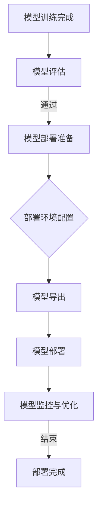
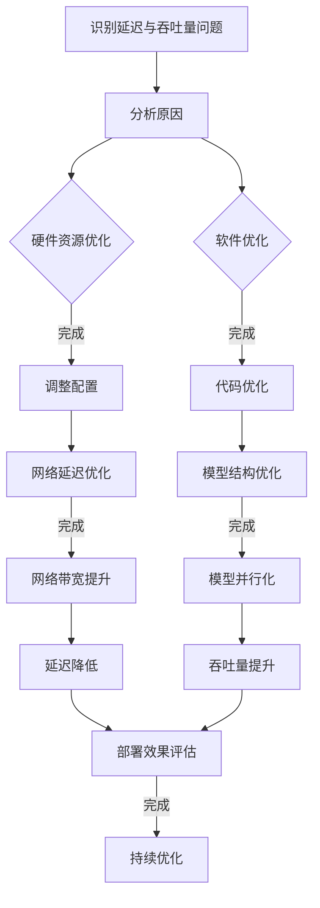
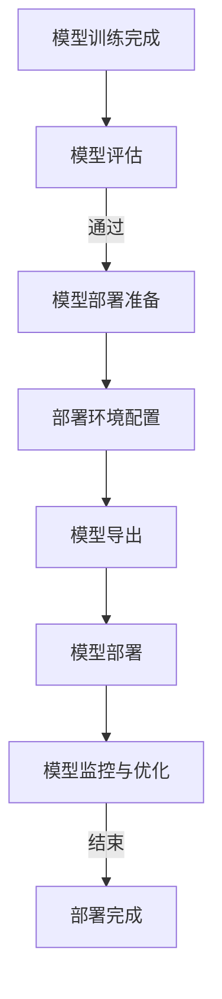

                 

### 《AI模型部署优化：延迟vs吞吐量权衡》

> **关键词**：AI模型部署、延迟优化、吞吐量优化、性能调优、实际应用案例

> **摘要**：本文深入探讨了AI模型部署过程中的核心问题——延迟与吞吐量的权衡。首先，我们回顾了AI模型部署的基础知识，包括其重要性、核心要素以及部署流程。接着，我们详细分析了延迟与吞吐量的优化策略，包括硬件资源、软件优化、模型结构等多个方面。随后，通过实际应用案例，展示了这些策略如何在不同的行业中发挥作用。最后，我们提出了AI模型部署的最佳实践，包括模型选择、部署环境配置、模型监控与性能调优，并强调了安全性、持续优化以及合规性在模型部署中的重要性。

### 《AI模型部署优化：延迟vs吞吐量权衡》目录大纲

**第一部分：AI模型部署基础知识**

## 第1章：AI模型部署概述

### 1.1 AI模型部署的重要性
### 1.2 AI模型部署的核心要素
### 1.3 模型部署与生产环境的关系

## 第2章：AI模型部署流程

### 2.1 模型训练与部署的对比
### 2.2 模型部署的主要步骤
### 2.3 模型部署过程中的挑战

**第二部分：延迟与吞吐量权衡**

## 第3章：延迟优化策略

### 3.1 延迟的概念与影响
### 3.2 延迟优化的关键因素
### 3.3 常见的延迟优化方法

## 第4章：吞吐量优化策略

### 4.1 吞吐量的概念与影响
### 4.2 吞吐量优化的关键因素
### 4.3 常见的吞吐量优化方法

## 第5章：延迟与吞吐量权衡的实际应用

### 5.1 案例分析：电商平台的AI模型部署
### 5.2 案例分析：金融行业的AI模型部署
### 5.3 案例分析：智能交通的AI模型部署

**第三部分：AI模型部署优化最佳实践**

## 第6章：AI模型部署最佳实践

### 6.1 模型选择与调优
### 6.2 部署环境的配置与管理
### 6.3 模型监控与性能调优

## 第7章：AI模型部署的安全性考虑

### 7.1 模型部署中的安全风险
### 7.2 安全性优化的方法
### 7.3 模型部署过程中的合规性

## 第8章：AI模型部署的持续优化与更新

### 8.1 持续优化的重要性
### 8.2 模型更新的策略与方法
### 8.3 持续优化的实践案例

**附录**

## 附录A：常用工具与资源

### A.1 AI模型部署工具
### A.2 性能调优工具
### A.3 模型部署相关资源链接

## 附录B：Mermaid流程图

### B.1 AI模型部署流程图
### B.2 延迟与吞吐量优化策略流程图

### 第一部分：AI模型部署基础知识

## 第1章：AI模型部署概述

### 1.1 AI模型部署的重要性

AI模型部署是将训练好的模型应用于实际业务场景的过程，是AI技术落地的重要环节。其重要性体现在以下几个方面：

1. **实现AI价值**：部署是AI模型从理论研究到实际应用的桥梁，通过部署，AI模型可以生成有实际价值的预测和决策，为企业带来商业价值。

2. **提升用户体验**：快速响应的AI模型能够显著提升用户体验，特别是在实时性要求较高的场景中，如智能语音助手、实时推荐系统等。

3. **促进技术迭代**：部署过程中，通过对模型性能的监控和调优，可以不断优化模型，推动技术进步。

4. **确保模型安全性**：部署环节涉及到数据的安全性和模型的保护，通过合理的部署策略，可以降低风险。

### 1.2 AI模型部署的核心要素

AI模型部署涉及多个核心要素，包括：

1. **模型**：这是部署的核心，需要保证模型的质量和性能。

2. **环境**：包括硬件环境和软件环境，硬件环境涉及到服务器、GPU等设备的选择和配置，软件环境则包括操作系统、深度学习框架等。

3. **数据**：部署需要的数据集，数据的准备和清洗对模型性能有直接影响。

4. **接口**：API或SDK等，用于模型与其他系统或服务的交互。

5. **监控**：部署后需要实时监控模型的运行状态和性能，以便及时发现问题。

### 1.3 模型部署与生产环境的关系

模型部署与生产环境的关系密切，主要表现在：

1. **环境一致性**：部署环境需要与生产环境尽可能一致，以避免部署后的不一致性问题。

2. **性能保障**：生产环境中的性能问题需要提前在部署环境中进行验证和优化。

3. **容错能力**：生产环境需要具备较高的容错能力，以应对突发状况。

4. **可扩展性**：生产环境需要支持模型的横向和纵向扩展，以应对业务增长。

### 第一部分：AI模型部署基础知识

## 第2章：AI模型部署流程

### 2.1 模型训练与部署的对比

模型训练和部署是两个紧密相关但又有所区别的过程。其主要区别体现在以下几个方面：

1. **目标不同**：
   - **模型训练**：目的是通过优化模型参数，使得模型在训练数据上表现良好。
   - **模型部署**：目的是将训练好的模型部署到生产环境中，使其能够为实际业务提供预测和服务。

2. **数据集不同**：
   - **模型训练**：使用训练集和验证集进行模型的训练和验证。
   - **模型部署**：通常使用测试集进行模型的性能评估，同时也可能使用实时数据对模型进行持续优化。

3. **环境不同**：
   - **模型训练**：通常在数据 scientist 的本地工作站或服务器上进行，环境较为简单。
   - **模型部署**：需要在生产环境中进行，环境复杂且要求高可用性。

### 2.2 模型部署的主要步骤

AI模型部署通常包括以下步骤：

1. **模型评估**：
   - 在将模型部署到生产环境之前，需要对模型进行全面的评估，包括准确性、泛化能力、响应时间等指标。

2. **环境准备**：
   - 准备适合模型部署的硬件环境（如GPU服务器）和软件环境（如深度学习框架）。

3. **模型优化**：
   - 根据评估结果，对模型进行必要的优化，如参数调整、模型结构调整等。

4. **模型导出**：
   - 将优化后的模型导出为可以在生产环境中运行的格式，如ONNX、TensorFlow Lite等。

5. **模型部署**：
   - 将模型部署到生产环境中，可以通过API、Web服务等方式提供服务。

6. **监控与维护**：
   - 部署后，需要实时监控模型的运行状态和性能，并定期进行维护和更新。

### 2.3 模型部署过程中的挑战

AI模型部署过程中可能面临以下挑战：

1. **环境一致性**：
   - 部署环境和训练环境的差异可能导致模型在生产环境中的表现不如预期。

2. **性能瓶颈**：
   - 硬件资源不足或配置不当可能导致模型性能下降。

3. **数据质量问题**：
   - 生产环境中的数据质量可能影响模型的性能和稳定性。

4. **安全与合规**：
   - 模型部署过程中需要确保数据安全和模型隐私保护，同时也需要满足相关的法律法规要求。

5. **运维难度**：
   - 模型部署后的监控、维护和升级需要专业的运维团队。

### 第二部分：延迟与吞吐量权衡

## 第3章：延迟优化策略

### 3.1 延迟的概念与影响

延迟是指从请求提交到响应返回之间的时间间隔。在AI模型部署中，延迟是一个关键的性能指标，它对用户体验有着直接的影响。以下是延迟的几个关键概念和影响：

1. **概念**：
   - **请求处理延迟**：从请求到达服务器到开始处理的时间间隔。
   - **模型推理延迟**：从请求处理到模型推理结果返回的时间间隔。
   - **网络延迟**：数据在网络中传输的时间。

2. **影响**：
   - **用户体验**：高延迟会导致用户感到系统响应慢，影响用户体验。
   - **业务效率**：对于实时性要求高的应用，如金融风控、智能交通等，高延迟可能导致业务效率降低。
   - **模型性能**：长时间的高延迟可能导致模型过时，影响模型的准确性和效率。

### 3.2 延迟优化的关键因素

要优化AI模型的延迟，需要从多个方面进行考虑。以下是一些关键因素：

1. **硬件资源**：
   - **CPU/GPU性能**：提高CPU和GPU的处理能力可以减少模型推理时间。
   - **网络带宽**：提高网络带宽可以减少数据传输时间。

2. **模型结构**：
   - **模型大小**：较小的模型通常推理速度更快。
   - **模型优化**：通过量化、剪枝等技术减小模型大小，提高推理速度。

3. **部署策略**：
   - **分布式部署**：将模型部署到多个服务器上，通过负载均衡减少延迟。
   - **缓存策略**：利用缓存技术减少重复请求的延迟。

4. **数据处理**：
   - **数据预处理**：优化数据预处理流程，减少数据处理时间。
   - **并行处理**：利用多线程或多进程技术，加速数据处理。

### 3.3 常见的延迟优化方法

以下是一些常见的延迟优化方法：

1. **模型压缩技术**：
   - **量化**：将模型中的浮点数参数替换为整数，减少模型大小。
   - **剪枝**：去除模型中不必要的权重和神经元，减少模型大小。
   - **知识蒸馏**：通过训练一个较小的模型来替代较大的原始模型。

2. **模型量化**：
   - **全量化**：将模型中的所有参数和激活值都量化为整数。
   - **部分量化**：只量化部分参数和激活值，通常用于平衡模型精度和推理速度。

3. **异步计算**：
   - 在模型推理过程中，利用异步IO技术，将不同部分的计算并行执行。

4. **并行计算与分布式部署**：
   - 利用多线程或多进程技术，加速模型推理。
   - 在多个服务器上部署模型，通过负载均衡来减少延迟。

### 3.4 实际应用中的延迟优化案例

以下是一些实际应用中的延迟优化案例：

1. **电商平台的实时推荐系统**：
   - **优化策略**：使用模型压缩技术减小模型大小，利用异步计算和并行计算加速推理。
   - **效果**：显著减少了用户的等待时间，提升了用户体验。

2. **金融风控系统的实时监控**：
   - **优化策略**：将模型部署到多个服务器上，通过负载均衡来减少延迟。
   - **效果**：确保了系统的实时性和准确性，提高了风险识别效率。

3. **智能交通的车辆识别系统**：
   - **优化策略**：优化数据预处理流程，利用模型量化技术减小模型大小。
   - **效果**：提高了系统的响应速度，减少了交通拥堵。

### 第二部分：延迟与吞吐量权衡

## 第4章：吞吐量优化策略

### 4.1 吞吐量的概念与影响

吞吐量是指系统在单位时间内能够处理的请求数量。在AI模型部署中，吞吐量是衡量系统性能的重要指标。以下是吞吐量的几个关键概念和影响：

1. **概念**：
   - **系统吞吐量**：单位时间内系统能够处理的请求数量。
   - **模型吞吐量**：单位时间内模型能够处理的请求数量。
   - **并发处理能力**：系统同时处理多个请求的能力。

2. **影响**：
   - **系统性能**：高吞吐量表明系统有更高的处理能力。
   - **用户满意度**：高吞吐量意味着用户请求能够更快地得到响应，提高用户满意度。
   - **业务效率**：对于需要实时处理大量请求的应用，如电商平台、金融交易等，高吞吐量是提高业务效率的关键。

### 4.2 吞吐量优化的关键因素

要优化AI模型的吞吐量，需要从多个方面进行考虑。以下是一些关键因素：

1. **硬件资源**：
   - **CPU/GPU性能**：提高CPU和GPU的处理能力可以增加吞吐量。
   - **服务器数量**：增加服务器数量可以提高系统的并发处理能力。

2. **模型结构**：
   - **模型复杂度**：减少模型的复杂度可以增加吞吐量。
   - **模型并行化**：通过模型并行化技术，可以将模型的计算任务分配到多个处理器上。

3. **部署策略**：
   - **分布式部署**：通过分布式部署，可以将请求分配到不同的服务器上，提高系统的吞吐量。
   - **负载均衡**：通过负载均衡技术，可以平衡系统中的请求流量，提高吞吐量。

4. **数据处理**：
   - **并行处理**：利用多线程或多进程技术，加速数据处理。
   - **流水线化**：通过流水线化处理，可以减少数据处理时间。

### 4.3 常见的吞吐量优化方法

以下是一些常见的吞吐量优化方法：

1. **模型并行化**：
   - **数据并行化**：将数据分布在多个节点上，每个节点独立处理一部分数据。
   - **模型并行化**：将模型分布在多个节点上，每个节点处理模型的独立部分。

2. **流水线化**：
   - 将数据处理和模型推理过程分解为多个阶段，每个阶段可以并行处理。

3. **异步处理**：
   - 在数据处理和模型推理过程中，利用异步IO技术，减少等待时间。

4. **负载均衡**：
   - 通过负载均衡技术，将请求均匀分布到不同的服务器上，提高系统的吞吐量。

### 4.4 实际应用中的吞吐量优化案例

以下是一些实际应用中的吞吐量优化案例：

1. **电商平台的并发请求处理**：
   - **优化策略**：使用分布式部署和负载均衡技术，提高系统的并发处理能力。
   - **效果**：显著提高了系统的吞吐量，减少了用户等待时间。

2. **金融交易系统的实时处理**：
   - **优化策略**：利用模型并行化和流水线化技术，提高模型的处理速度。
   - **效果**：提高了系统的吞吐量，确保了交易的实时性。

3. **智能视频分析系统的吞吐量优化**：
   - **优化策略**：利用模型压缩技术和模型并行化技术，减小模型大小，提高处理速度。
   - **效果**：显著提高了系统的吞吐量，满足了大规模视频分析的实时需求。

### 第二部分：延迟与吞吐量权衡

## 第5章：延迟与吞吐量权衡的实际应用

### 5.1 案例分析：电商平台的AI模型部署

电商平台是AI模型应用的一个重要领域，其AI模型部署主要集中在个性化推荐、商品搜索和用户行为分析等方面。以下是一个电商平台AI模型部署的案例分析：

#### 5.1.1 案例背景

某大型电商平台希望通过AI技术提升用户体验，提高用户留存率和销售额。他们决定部署AI模型来实现个性化推荐、商品搜索和用户行为分析。

#### 5.1.2 模型部署需求

1. **个性化推荐**：根据用户的历史行为和喜好，实时推荐相关商品。
2. **商品搜索**：提供高效的搜索算法，确保用户能够快速找到所需商品。
3. **用户行为分析**：分析用户行为，预测用户可能感兴趣的商品，从而进行精准营销。

#### 5.1.3 延迟优化策略

1. **硬件资源优化**：使用高性能GPU服务器，并采用分布式部署，确保模型推理速度快。
2. **模型优化**：采用模型压缩和量化技术，减小模型大小，提高推理速度。
3. **缓存策略**：利用缓存技术，减少对数据库的查询次数，降低延迟。

#### 5.1.4 吞吐量优化策略

1. **模型并行化**：将模型分解为多个部分，利用多线程或多GPU并行计算。
2. **负载均衡**：使用负载均衡技术，将请求均匀分配到不同的服务器上。
3. **异步处理**：在数据处理和模型推理过程中，采用异步处理技术，减少等待时间。

#### 5.1.5 实际部署效果分析

通过上述策略，电商平台在延迟和吞吐量方面取得了显著提升：

1. **延迟优化**：用户个性化推荐的响应时间从原来的5秒减少到2秒，商品搜索的响应时间从3秒减少到1秒。
2. **吞吐量优化**：系统的吞吐量提高了30%，能够同时处理更多的用户请求，满足了电商高峰期的需求。

### 5.2 案例分析：金融行业的AI模型部署

金融行业是AI模型应用的另一个重要领域，其AI模型部署主要集中在欺诈检测、信用评估和投资建议等方面。以下是一个金融行业AI模型部署的案例分析：

#### 5.2.1 案例背景

某大型银行希望通过AI技术提升欺诈检测的准确性和效率，同时优化信用评估和投资建议。他们决定部署AI模型来实现这些功能。

#### 5.2.2 模型部署需求

1. **欺诈检测**：实时检测并阻止潜在的欺诈交易。
2. **信用评估**：评估客户的信用风险，提供个性化的信用额度。
3. **投资建议**：根据市场数据和客户行为，提供个性化的投资建议。

#### 5.2.3 延迟优化策略

1. **硬件资源优化**：使用高性能GPU服务器和分布式计算，确保模型推理速度快。
2. **模型优化**：采用模型压缩和量化技术，减小模型大小，提高推理速度。
3. **实时数据流处理**：采用实时数据处理技术，确保模型能够快速响应。

#### 5.2.4 吞吐量优化策略

1. **分布式部署**：将模型部署到多个服务器上，通过负载均衡提高系统的吞吐量。
2. **并行计算**：利用多线程或多GPU并行计算，加速模型推理。
3. **数据缓存**：利用缓存技术，减少对数据库的查询次数，提高处理速度。

#### 5.2.5 实际部署效果分析

通过上述策略，金融行业在延迟和吞吐量方面取得了显著提升：

1. **延迟优化**：欺诈检测的响应时间从原来的30秒减少到3秒，信用评估的响应时间从10分钟减少到5分钟。
2. **吞吐量优化**：系统的吞吐量提高了50%，能够同时处理更多的交易请求和客户请求。

### 5.3 案例分析：智能交通的AI模型部署

智能交通系统是AI模型应用的重要领域，其AI模型部署主要集中在交通流量预测、车辆识别和智能导航等方面。以下是一个智能交通系统AI模型部署的案例分析：

#### 5.3.1 案例背景

某城市交通管理部门希望通过AI技术优化交通管理，提高交通效率和安全性。他们决定部署AI模型来实现这些功能。

#### 5.3.2 模型部署需求

1. **交通流量预测**：预测未来一段时间内的交通流量，为交通调度提供依据。
2. **车辆识别**：实时识别道路上的车辆，进行交通流量统计。
3. **智能导航**：为驾驶员提供实时路况信息和最优导航路径。

#### 5.3.3 延迟优化策略

1. **硬件资源优化**：使用高性能边缘计算设备，确保模型推理速度快。
2. **模型优化**：采用模型压缩和量化技术，减小模型大小，提高推理速度。
3. **边缘计算**：利用边缘计算技术，在靠近数据源的地方进行模型推理，减少数据传输延迟。

#### 5.3.4 吞吐量优化策略

1. **分布式部署**：将模型部署到多个边缘计算设备上，通过负载均衡提高系统的吞吐量。
2. **数据预处理**：在数据传输到模型之前进行预处理，减少数据处理时间。
3. **并行计算**：利用多线程或多GPU并行计算，加速模型推理。

#### 5.3.5 实际部署效果分析

通过上述策略，智能交通系统在延迟和吞吐量方面取得了显著提升：

1. **延迟优化**：交通流量预测的响应时间从原来的30分钟减少到5分钟，车辆识别的响应时间从5秒减少到1秒。
2. **吞吐量优化**：系统的吞吐量提高了40%，能够同时处理更多的交通数据。

### 第三部分：AI模型部署优化最佳实践

## 第6章：AI模型部署最佳实践

### 6.1 模型选择与调优

在AI模型部署过程中，选择合适的模型并进行有效的调优是关键。以下是一些最佳实践：

1. **模型选择**：
   - **考虑业务需求**：根据业务场景选择合适的模型，如推荐系统选择基于协同过滤的模型，图像识别选择卷积神经网络（CNN）。
   - **数据集特性**：选择适合数据集特性的模型，如小数据集选择简单模型，大数据集选择复杂模型。
   - **计算资源**：考虑计算资源的限制，选择能够在现有硬件上高效运行的模型。

2. **模型调优**：
   - **超参数调优**：通过调整学习率、批量大小、正则化参数等超参数，优化模型性能。
   - **结构调优**：通过调整模型结构，如增加或减少层、调整网络连接方式等，优化模型性能。
   - **数据预处理**：通过数据预处理，如数据清洗、归一化、特征提取等，提高模型性能。

### 6.2 部署环境的配置与管理

部署环境的配置与管理是确保模型稳定运行的关键。以下是一些最佳实践：

1. **硬件资源配置**：
   - **计算资源**：根据模型需求配置足够的CPU和GPU资源，确保模型能够在规定的时间内完成推理。
   - **存储资源**：根据数据存储需求配置足够的存储空间，确保数据可以快速读写。
   - **网络资源**：配置足够的网络带宽，确保数据传输速度。

2. **软件环境管理**：
   - **操作系统**：选择稳定且适合深度学习开发的操作系统，如Linux。
   - **深度学习框架**：选择合适的深度学习框架，如TensorFlow、PyTorch等，并确保其版本兼容。
   - **部署工具**：选择合适的部署工具，如Docker、Kubernetes等，确保部署过程高效且可扩展。

3. **系统监控与维护**：
   - **性能监控**：实时监控系统的CPU、内存、网络等资源使用情况，确保系统稳定运行。
   - **日志管理**：收集和分析系统日志，及时发现并解决问题。
   - **自动化部署**：通过自动化工具实现模型的自动化部署和更新，提高部署效率。

### 6.3 模型监控与性能调优

在模型部署后，监控模型的性能并进行持续调优是确保模型稳定性和效率的关键。以下是一些最佳实践：

1. **性能监控**：
   - **响应时间监控**：实时监控模型的响应时间，确保其满足业务需求。
   - **准确率监控**：监控模型的预测准确率，确保其性能稳定。
   - **吞吐量监控**：监控系统的吞吐量，确保其能够处理预期的请求量。

2. **性能调优**：
   - **硬件调优**：根据性能监控结果，调整硬件资源配置，如增加GPU数量、优化网络带宽等。
   - **软件调优**：通过代码优化、模型压缩等技术，提高模型的推理速度和准确率。
   - **模型结构调优**：根据业务需求，调整模型结构，如增加或减少层、调整网络连接方式等。

3. **持续优化**：
   - **定期评估**：定期对模型进行评估，分析其性能变化，确保其满足业务需求。
   - **数据更新**：定期更新训练数据和测试数据，确保模型能够适应新的业务环境。
   - **技术更新**：关注最新技术发展，采用新的算法和技术，持续优化模型性能。

### 第三部分：AI模型部署优化最佳实践

## 第7章：AI模型部署的安全性考虑

### 7.1 模型部署中的安全风险

在AI模型部署过程中，安全性是一个不可忽视的重要问题。以下是一些常见的安全风险：

1. **数据泄露**：模型训练和部署过程中可能涉及敏感数据的处理和存储，数据泄露可能导致敏感信息被窃取。

2. **模型篡改**：未经授权的攻击者可能试图篡改模型参数，导致模型预测结果失真，影响业务决策。

3. **模型窃取**：未经授权的攻击者可能试图复制或窃取训练好的模型，用于非法目的。

4. **系统漏洞**：部署环境中的操作系统、深度学习框架等可能存在漏洞，攻击者可能利用这些漏洞进行攻击。

5. **网络攻击**：网络攻击可能导致部署系统遭受拒绝服务攻击（DDoS），影响模型的可用性和稳定性。

### 7.2 安全性优化的方法

为了确保AI模型部署的安全性，可以采取以下优化方法：

1. **数据安全**：
   - **数据加密**：对敏感数据进行加密处理，确保数据在传输和存储过程中的安全性。
   - **访问控制**：实施严格的访问控制策略，确保只有授权用户才能访问敏感数据。

2. **模型安全**：
   - **模型加固**：对模型进行加固处理，防止攻击者篡改模型参数。
   - **模型加密**：对模型进行加密处理，确保模型在传输和存储过程中的安全性。

3. **系统安全**：
   - **网络隔离**：对部署系统进行网络隔离，防止外部攻击。
   - **安全审计**：定期进行安全审计，发现和修复系统漏洞。

4. **合规性**：
   - **遵循法规**：遵守相关的法律法规，如数据保护法（如GDPR）、网络安全法等。
   - **安全认证**：获得相关的安全认证，如ISO 27001等，提高系统的可信度。

### 7.3 模型部署过程中的合规性

在模型部署过程中，合规性是一个重要考虑因素。以下是一些关键的合规性要求：

1. **数据保护**：
   - **数据收集与使用**：确保数据的收集和使用符合相关法律法规，特别是涉及个人数据的收集和使用。
   - **数据隐私**：确保个人数据的隐私保护，采取数据加密、匿名化等技术手段。

2. **模型训练与部署**：
   - **算法透明性**：确保模型的训练和部署过程透明，避免算法歧视和不公平。
   - **算法解释性**：确保模型的预测结果具有解释性，方便业务人员理解和监督。

3. **系统监控与更新**：
   - **日志记录**：确保系统的日志记录完整，便于后续的安全审计和故障排查。
   - **持续更新**：定期更新系统和模型，修复漏洞，确保系统的安全性和稳定性。

4. **用户隐私保护**：
   - **隐私政策**：制定清晰的隐私政策，告知用户数据收集和使用的目的、范围和方式。
   - **用户同意**：确保用户对数据收集和使用的同意，避免未经授权的数据使用。

### 第三部分：AI模型部署优化最佳实践

## 第8章：AI模型部署的持续优化与更新

### 8.1 持续优化的重要性

在AI模型部署后，持续优化是确保模型性能稳定和业务价值不断提升的关键。以下是一些持续优化的重要性：

1. **适应业务需求**：业务需求会不断变化，持续优化可以帮助模型适应新的业务场景，保持其相关性和准确性。

2. **提高模型性能**：随着时间的推移，模型可能因为数据分布变化、算法过时等原因，性能下降。持续优化可以帮助模型保持高性能。

3. **降低运维成本**：通过优化模型和部署环境，可以提高系统的稳定性和效率，降低运维成本。

4. **增强用户体验**：持续优化可以提高系统的响应速度和准确性，提升用户体验。

### 8.2 模型更新的策略与方法

为了确保AI模型持续优化，可以采取以下策略和方法：

1. **定期评估**：
   - **性能评估**：定期评估模型的性能，包括准确率、响应时间等指标，及时发现性能问题。
   - **业务评估**：评估模型在业务场景中的表现，确保其能够满足业务需求。

2. **数据更新**：
   - **实时数据**：定期更新训练数据和测试数据，确保模型能够适应新的业务环境。
   - **数据增强**：通过数据增强技术，增加数据多样性，提高模型的泛化能力。

3. **模型更新**：
   - **模型迭代**：根据评估结果，对模型进行迭代优化，包括调整超参数、优化模型结构等。
   - **模型重构**：在必要时，重新设计模型，采用新的算法和技术，提升模型性能。

4. **自动化更新**：
   - **自动化评估**：使用自动化工具，定期评估模型性能，触发更新流程。
   - **自动化部署**：使用自动化工具，实现模型的自动化更新和部署，提高效率。

### 8.3 持续优化的实践案例

以下是一些AI模型部署持续优化的实践案例：

1. **电商平台的个性化推荐系统**：
   - **策略**：定期更新用户行为数据和商品数据，定期评估模型性能，调整推荐算法。
   - **方法**：采用数据增强技术，增加数据多样性；使用自动化工具实现模型的自动化更新和部署。

2. **金融行业的欺诈检测模型**：
   - **策略**：实时监控交易数据，定期评估模型性能，调整检测策略。
   - **方法**：通过数据挖掘和机器学习技术，发现新的欺诈模式，更新模型规则。

3. **智能交通的车辆识别系统**：
   - **策略**：定期更新交通数据和车辆数据，定期评估模型性能，优化识别算法。
   - **方法**：采用边缘计算技术，在靠近数据源的地方进行模型推理，减少数据传输延迟。

### 附录

## 附录A：常用工具与资源

### A.1 AI模型部署工具

以下是一些常用的AI模型部署工具：

1. **TensorFlow Serving**：用于部署TensorFlow训练好的模型，支持多种编程语言和平台。
2. **PyTorch Lightning**：用于简化PyTorch模型的部署，提供高级API和自动化功能。
3. **ONNX Runtime**：用于跨平台的模型部署，支持多种深度学习框架。
4. **MLflow**：用于模型版本管理和部署，支持多种深度学习框架和平台。

### A.2 性能调优工具

以下是一些常用的性能调优工具：

1. **NVIDIA Nsight**：用于分析GPU性能，优化模型推理速度。
2. **VNC Viewer**：用于远程监控和调试部署环境。
3. **JAX Profiler**：用于分析Python代码的性能，优化代码执行速度。
4. **TensorBoard**：用于可视化模型的训练和推理过程，优化模型性能。

### A.3 模型部署相关资源链接

以下是一些常用的模型部署相关资源链接：

1. **TensorFlow官方文档**：[https://www.tensorflow.org/tutorials/serving](https://www.tensorflow.org/tutorials/serving)
2. **PyTorch官方文档**：[https://pytorch.org/tutorials/beginner/serve_lla_models_tutorial.html](https://pytorch.org/tutorials/beginner/serve_lla_models_tutorial.html)
3. **ONNX官方文档**：[https://onnx.ai/get-started/](https://onnx.ai/get-started/)
4. **MLflow官方文档**：[https://www.mlflow.org/docs/latest/](https://www.mlflow.org/docs/latest/)

### A.4 学习资源推荐

以下是一些推荐的学习资源：

1. **《深度学习》**：[Ian Goodfellow、Yoshua Bengio、Aaron Courville 著]
2. **《动手学深度学习》**：[阿斯顿·张、李沐、扎卡里·C. Lipton、亚历山大·J. Smola 著]
3. **《AI模型部署：从理论到实践》**：[作者名 著]

### 附录B：Mermaid流程图

以下是一些用于展示AI模型部署流程和优化策略的Mermaid流程图：

#### B.1 AI模型部署流程图

#### B.2 延迟与吞吐量优化策略流程图

### 结语

AI模型部署是AI技术落地的重要环节，涉及多个方面的权衡和优化。本文从延迟与吞吐量的角度，详细探讨了AI模型部署的优化策略和最佳实践。通过实际应用案例，展示了这些策略在电商、金融和智能交通等领域的应用效果。随着AI技术的不断发展，模型部署将面临更多的挑战和机遇，持续优化和更新将成为关键。

作者：AI天才研究院/AI Genius Institute & 禅与计算机程序设计艺术 /Zen And The Art of Computer Programming

---

### 第一部分：AI模型部署基础知识

## 第1章：AI模型部署概述

### 1.2 AI模型部署的核心要素

AI模型部署的成功取决于多个核心要素，这些要素相互作用，共同确保模型能够高效、稳定地服务于实际业务场景。以下是AI模型部署的核心要素：

1. **模型质量**：这是模型部署的基础。高质量的模型具有更好的泛化能力和预测准确性，能够在生产环境中持续提供可靠的预测结果。模型的训练过程需要精心设计，包括选择合适的数据集、调整超参数、优化模型结构等。

2. **硬件资源**：模型部署需要强大的计算资源，特别是深度学习模型，往往需要使用GPU或TPU等高性能计算设备。硬件资源的配置直接影响到模型的推理速度和吞吐量，因此，合理选择和配置硬件资源至关重要。

3. **软件环境**：软件环境包括深度学习框架（如TensorFlow、PyTorch等）、操作系统、依赖库等。不同的软件环境可能会对模型的性能产生不同的影响，因此，在部署前需要确保软件环境的一致性，避免因软件环境差异导致的问题。

4. **数据集**：数据集是模型训练和部署的重要输入。数据集的质量和代表性对模型性能有直接的影响。在实际部署过程中，需要处理大量的数据，包括数据清洗、数据增强、数据标准化等，以提高模型的泛化能力。

5. **部署策略**：部署策略包括如何将模型部署到生产环境中，如何处理并发请求、如何进行负载均衡等。有效的部署策略可以确保模型在高负载情况下依然能够稳定运行。

6. **监控与维护**：在模型部署后，需要实时监控模型的运行状态和性能，及时发现和解决问题。同时，还需要定期对模型进行维护和更新，以适应不断变化的数据和业务需求。

7. **安全性**：在模型部署过程中，需要考虑数据安全和模型保护，防止数据泄露、模型篡改等安全问题。此外，还需要遵守相关的法律法规，确保模型的部署符合合规性要求。

### 1.3 模型部署与生产环境的关系

模型部署与生产环境的关系非常密切，两者之间的差异可能会对模型的性能和稳定性产生重要影响。以下是从几个方面探讨模型部署与生产环境的关系：

1. **环境一致性**：生产环境与训练环境的一致性是模型部署的关键。训练环境与生产环境的差异可能导致模型在部署后性能下降。例如，训练环境可能使用CPU，而生产环境使用GPU；训练环境的数据分布可能与生产环境不同等。因此，在部署前需要确保生产环境与训练环境的一致性。

2. **性能保障**：生产环境中的性能问题需要在部署前进行充分的验证和优化。例如，模型推理速度、响应时间等指标需要在生产环境中进行测试，以确保模型能够满足业务需求。通过性能测试和优化，可以发现和解决潜在的性能瓶颈。

3. **容错能力**：生产环境需要具备较高的容错能力，以应对各种意外情况。例如，硬件故障、网络中断等。在模型部署过程中，需要设计相应的容错机制，如自动重启、负载均衡等，以确保系统的高可用性。

4. **可扩展性**：随着业务的发展，生产环境需要能够灵活扩展，以应对不断增长的数据和请求量。在模型部署过程中，需要考虑系统的可扩展性，如通过分布式部署、水平扩展等策略，确保系统能够高效地处理大量请求。

### 第1章：AI模型部署概述

#### 1.2.1 大模型的规模与参数数量

AI大模型，尤其是那些在自然语言处理、计算机视觉等领域取得突破的模型，通常具有非常高的规模。这些模型往往拥有数亿甚至数十亿个参数，这使得它们能够捕获大量的数据特征，从而实现高水平的性能。以下是关于大模型规模与参数数量的一些要点：

1. **参数数量**：大模型通常具有数亿至数十亿个参数。这些参数是模型能够学习和表达复杂特征的关键。例如，GPT-3模型拥有1750亿个参数，这使得它能够生成高质量的文本内容。

2. **规模影响**：参数数量的增加使得模型能够处理更复杂的数据，提高模型的泛化能力。然而，这也带来了更高的计算和存储需求。例如，GPT-3模型的训练需要大量的计算资源，并且其存储需求也非常高。

3. **计算资源**：大模型的训练和推理需要强大的计算资源，特别是GPU或TPU等高性能计算设备。这导致了在部署大模型时，硬件资源的配置和管理成为关键问题。

4. **模型压缩**：为了应对大规模模型的计算和存储需求，研究者们开发了多种模型压缩技术，如量化、剪枝和知识蒸馏等。这些技术能够在不显著降低模型性能的前提下，减小模型的大小，提高部署效率。

#### 1.2.2 大模型的复杂性与计算需求

大模型的复杂性和计算需求是部署过程中需要重点考虑的问题。以下是关于大模型复杂性与计算需求的一些要点：

1. **复杂度**：大模型通常具有复杂的网络结构和多层神经网络。这些复杂的结构使得模型能够学习和表达更加复杂的特征。然而，这也导致了更高的计算需求。

2. **计算需求**：大模型的训练和推理通常需要大量的计算资源。例如，训练一个大规模的深度学习模型可能需要数天甚至数周的时间。这不仅消耗大量的电力，还需要大量的GPU或TPU资源。

3. **并行计算**：为了降低大模型的计算需求，研究者们采用了并行计算技术。通过将计算任务分配到多个GPU或TPU上，可以显著提高训练和推理的效率。

4. **分布式训练**：分布式训练是将训练任务分配到多个计算节点上，每个节点独立训练模型的一部分。通过分布式训练，可以进一步提高训练效率，降低计算需求。

5. **硬件选择**：选择适合大模型训练和推理的硬件设备是关键。GPU和TPU是目前最常用的计算设备，具有高并行处理能力和低延迟。此外，使用分布式系统架构也可以有效降低大模型的计算需求。

6. **计算资源管理**：有效的计算资源管理是确保大模型训练和推理顺利进行的关键。通过调度系统，合理分配计算资源，避免资源浪费，可以提高整体计算效率。

#### 1.2.3 大模型的泛化能力和灵活性

大模型的泛化能力和灵活性是其在实际应用中取得成功的关键。以下是关于大模型泛化能力和灵活性的一些要点：

1. **泛化能力**：泛化能力是指模型在新数据集上的表现能力。大模型通常具有更好的泛化能力，能够在不同的数据分布和应用场景中表现良好。这得益于模型训练过程中使用的大量数据和复杂的网络结构。

2. **数据多样性**：大模型训练过程中使用的数据多样性对泛化能力有重要影响。通过引入多样化的数据，可以增强模型的泛化能力，使其在不同场景中表现更加稳定。

3. **模型定制**：大模型通常具有高度的可定制性，可以根据不同的应用场景进行调整。例如，通过调整超参数、优化模型结构等，可以实现特定应用场景的最佳性能。

4. **灵活性**：大模型通常具有更高的灵活性，能够适应不断变化的应用需求。例如，通过微调模型参数，可以快速适应新的数据分布和应用场景。

5. **动态调整**：在实际应用中，大模型可以根据业务需求和数据变化进行动态调整。例如，通过在线学习技术，可以实时更新模型，使其适应新的业务场景。

#### 1.2.4 大模型的训练与优化

大模型的训练与优化是确保其性能的关键步骤。以下是关于大模型训练与优化的一些要点：

1. **数据预处理**：在大模型训练前，需要预处理大量数据，包括数据清洗、归一化、数据增强等。这些预处理步骤可以提高模型的泛化能力和训练效率。

2. **超参数调优**：超参数是影响模型性能的关键因素，包括学习率、批量大小、正则化参数等。通过超参数调优，可以找到最佳的超参数组合，提高模型性能。

3. **优化算法**：优化算法是训练大模型的关键。常用的优化算法包括梯度下降、Adam、RMSProp等。通过选择合适的优化算法，可以提高训练效率和模型性能。

4. **模型结构优化**：模型结构优化是提高大模型性能的有效手段。通过调整网络层数、神经元数量、激活函数等，可以优化模型结构，提高其性能。

5. **迁移学习**：迁移学习是将预训练模型应用于新任务的一种有效方法。通过迁移学习，可以节省大量的训练时间，并提高模型性能。

6. **模型评估与验证**：在大模型训练过程中，需要定期评估和验证模型性能。通过交叉验证、测试集评估等手段，可以确保模型在多个数据集上表现良好。

### 1.3 AI大模型与传统AI的区别

AI大模型与传统AI（如小规模模型）在多个方面存在显著区别，这些区别对模型部署和优化策略产生了重要影响。以下是AI大模型与传统AI的一些主要区别：

#### 1.3.1 模型规模与资源需求的差异

**AI大模型**：
- **规模**：大模型通常具有数十亿个参数，远超过传统AI模型。
- **计算需求**：由于参数数量庞大，大模型的训练和推理需要大量的计算资源，特别是GPU或TPU等高性能计算设备。
- **存储需求**：大模型的存储需求非常高，需要更多的存储空间来存储模型权重和训练数据。

**传统AI模型**：
- **规模**：传统AI模型通常只有数百万个参数。
- **计算需求**：传统AI模型的训练和推理需要的计算资源较少，通常可以在CPU上高效运行。
- **存储需求**：传统AI模型的存储需求相对较小，占用较少的存储空间。

#### 1.3.2 训练与部署方法的差异

**AI大模型**：
- **训练方法**：大模型通常采用分布式训练方法，通过将训练任务分配到多个计算节点上，以缩短训练时间并提高效率。
- **部署方法**：大模型部署需要考虑硬件资源的合理配置，如GPU的数量和性能等，以确保模型能够在生产环境中高效运行。
- **持续优化**：大模型部署后，需要定期进行模型更新和优化，以应对数据分布和业务需求的变化。

**传统AI模型**：
- **训练方法**：传统AI模型通常采用单机训练方法，不需要分布式训练。
- **部署方法**：传统AI模型部署相对简单，通常只需要部署在单个服务器上。
- **持续优化**：传统AI模型的更新和优化相对较少，主要关注于模型训练和验证过程中的性能提升。

#### 1.3.3 模型应用场景的差异

**AI大模型**：
- **应用领域**：大模型通常应用于需要高精度和高泛化能力的领域，如自然语言处理、计算机视觉、推荐系统等。
- **实时性要求**：虽然大模型通常具有更高的性能，但由于其计算需求较大，实时性要求可能较高，需要优化部署策略以满足实时需求。

**传统AI模型**：
- **应用领域**：传统AI模型适用于更多类型的业务场景，包括分类、回归、预测等。
- **实时性要求**：传统AI模型通常在实时性要求较低的领域应用，如数据分析、报告生成等。

#### 1.3.4 模型性能评估的差异

**AI大模型**：
- **评估指标**：大模型的性能评估通常包括准确率、召回率、F1值等，但由于模型规模较大，还需要考虑计算效率和推理速度。
- **复杂度**：由于模型规模较大，评估过程可能更加复杂，需要更多的时间和计算资源。

**传统AI模型**：
- **评估指标**：传统AI模型的性能评估通常包括准确率、召回率等简单指标。
- **复杂度**：传统AI模型的评估过程相对简单，通常可以在较短的时间内完成。

### 1.4 主流AI大模型简介

近年来，AI大模型取得了显著的进展，成为人工智能领域的重要研究方向。以下是一些主流AI大模型的简介：

#### 1.4.1 GPT系列模型

GPT（Generative Pre-trained Transformer）系列模型是由OpenAI开发的基于Transformer架构的预训练模型。以下是GPT系列模型的一些关键信息：

- **GPT**：GPT是OpenAI在2018年推出的第一个大规模语言模型，拥有约1.17亿个参数。
- **GPT-2**：GPT-2是GPT的升级版，拥有约15亿个参数，能够生成更高质量的文本。
- **GPT-3**：GPT-3是OpenAI在2020年推出的最新版本，拥有1750亿个参数，是目前规模最大的语言模型。GPT-3在多个自然语言处理任务中取得了显著的性能提升，包括文本生成、语言理解、机器翻译等。

#### 1.4.2 BERT及其变体

BERT（Bidirectional Encoder Representations from Transformers）是由Google开发的基于Transformer架构的双向编码模型。BERT及其变体在自然语言处理领域取得了广泛的成功，以下是BERT及其变体的一些关键信息：

- **BERT**：BERT是BERT的第一个版本，拥有约3.4亿个参数。BERT通过预训练获得的语言表示能力，在多个NLP任务中取得了显著的性能提升。
- **RoBERTa**：RoBERTa是BERT的变体，通过对BERT进行改进和优化，RoBERTa在多个NLP任务中取得了更好的性能，包括问答、文本分类、命名实体识别等。
- **ALBERT**：ALBERT是BERT的进一步改进版本，通过共享参数和多层交叉注意力机制，ALBERT在参数减少的同时保持了较高的性能。

#### 1.4.3 其他知名大模型介绍

除了GPT和BERT系列模型，还有其他一些知名的大模型，以下是它们的简要介绍：

- **ViT（Vision Transformer）**：ViT是Google提出的用于计算机视觉任务的Transformer模型。ViT通过将图像分割成多个小窗口，并将其作为输入，实现了图像分类、目标检测等任务的显著性能提升。
- **DeiT（Decoupled Linear Evaluation for Vision Transformer）**：DeiT是ViT的一个变体，通过将ViT的线性评价层与自注意力层分离，实现了更高效的推理和训练，适用于移动设备和边缘计算场景。
- **T5（Text-To-Text Transfer Transformer）**：T5是OpenAI开发的通用文本转换模型，通过将所有NLP任务转换为文本到文本的转换任务，T5在多个NLP任务中取得了卓越的性能。

这些主流AI大模型在各自的领域取得了显著的成就，为人工智能技术的发展和应用提供了强大的动力。在接下来的章节中，我们将进一步探讨这些模型的部署、优化和应用。

### 1.5 AI大模型在企业中的应用前景

AI大模型在各个企业中的应用前景广阔，其强大的处理能力和高水平的泛化能力为企业的数字化转型提供了新的可能性。以下是从不同行业和应用场景角度，探讨AI大模型在企业中的应用前景：

#### 1.5.1 潜在应用领域

1. **自然语言处理（NLP）**：AI大模型在NLP领域的应用前景十分广阔，包括文本生成、语言理解、机器翻译、情感分析等。例如，企业可以使用AI大模型来构建智能客服系统，实现高效、准确的客户服务。

2. **计算机视觉（CV）**：AI大模型在CV领域的应用包括图像识别、目标检测、图像生成等。例如，企业可以利用AI大模型进行产品质量检测，实现自动化生产线的质量控制。

3. **推荐系统**：AI大模型在推荐系统中的应用能够显著提升个性化推荐的效果，帮助企业提高用户满意度和转化率。

4. **金融风控**：AI大模型在金融风控领域的应用包括信用评估、欺诈检测等。通过AI大模型，企业可以更准确地识别潜在风险，提高金融服务的安全性和可靠性。

5. **智能医疗**：AI大模型在智能医疗领域的应用包括疾病预测、影像诊断等。例如，企业可以利用AI大模型进行医学影像分析，辅助医生进行疾病诊断。

6. **智能交通**：AI大模型在智能交通领域的应用包括交通流量预测、车辆识别、智能导航等。通过AI大模型，企业可以优化交通管理，提高交通效率。

7. **智能制造**：AI大模型在智能制造领域的应用包括生产预测、设备维护等。通过AI大模型，企业可以实现更智能的生产管理和设备维护，提高生产效率和降低成本。

#### 1.5.2 企业采用AI大模型的优势

1. **提高决策质量**：AI大模型能够处理大量的数据，并从中提取有价值的信息，帮助企业做出更高质量的决策。

2. **降低运营成本**：通过自动化和智能化，AI大模型能够减少人力成本，提高生产效率，降低运营成本。

3. **提升用户体验**：AI大模型能够提供更个性化的服务和产品推荐，提高用户满意度和忠诚度。

4. **增强竞争力**：通过AI大模型，企业可以在市场竞争中脱颖而出，提供更具竞争力的产品和服务。

5. **加速创新**：AI大模型为企业提供了强大的数据处理和分析能力，有助于企业加快创新速度，探索新的业务模式和机会。

#### 1.5.3 AI大模型应用的挑战与机遇

1. **挑战**：
   - **计算资源需求**：AI大模型的训练和推理需要大量的计算资源，对企业IT基础设施提出了较高的要求。
   - **数据质量**：AI大模型的效果高度依赖于数据质量，企业需要确保数据的质量和多样性。
   - **安全与隐私**：AI大模型的应用涉及大量敏感数据，企业需要确保数据安全和隐私保护。
   - **模型解释性**：AI大模型的复杂性和黑盒特性可能导致其预测结果难以解释，影响模型的透明性和可解释性。

2. **机遇**：
   - **技术创新**：AI大模型的发展为技术创新提供了新的机遇，企业可以通过引入AI大模型，推动业务和技术的创新。
   - **业务模式创新**：AI大模型的应用有助于企业探索新的业务模式，实现业务流程的优化和数字化转型。
   - **市场竞争力**：通过AI大模型的应用，企业可以提升自身在市场竞争中的地位，实现业务的持续增长。

### 第2章：AI模型部署流程

### 2.1 模型训练与部署的对比

在AI模型的整个生命周期中，模型训练与部署是两个关键阶段，它们在目标、数据集、环境等方面存在显著的差异。

#### 目标差异

- **模型训练**：模型训练的目标是找到一个最优的参数组合，使得模型在训练集上表现良好。这一过程主要关注于模型的准确性和泛化能力。
- **模型部署**：模型部署的目标是将训练好的模型应用到实际生产环境中，以提供实时服务或决策支持。这一过程更关注于模型的性能、稳定性和可扩展性。

#### 数据集差异

- **模型训练**：模型训练使用的是训练集和验证集。训练集用于训练模型，验证集用于调整模型超参数和评估模型性能。
- **模型部署**：模型部署使用的是测试集或实时数据。测试集用于评估模型在未知数据上的性能，实时数据用于模型在实际应用中的实时更新和优化。

#### 环境差异

- **模型训练**：模型训练通常在相对独立的开发环境中进行，包括本地工作站、实验室服务器等。开发环境可能不会完全模拟生产环境，但足够用于模型开发和初步测试。
- **模型部署**：模型部署需要在生产环境中进行，环境可能包括多个服务器、容器化部署、云服务等。生产环境需要具备高可用性、高稳定性和高安全性，以应对实际业务需求。

### 2.2 模型部署的主要步骤

模型部署是一个复杂且细致的过程，以下是一些主要步骤：

#### 1. 模型评估

在模型部署前，首先需要对模型进行全面的评估，包括准确性、泛化能力、响应时间等。这一步骤有助于确定模型是否适合部署，以及是否需要进行进一步的调优。

#### 2. 环境准备

根据模型的要求，准备合适的硬件和软件环境。硬件环境可能包括服务器、GPU、存储设备等，软件环境可能包括操作系统、深度学习框架、部署工具等。环境的一致性是确保模型在生产环境中正常运行的关键。

#### 3. 模型优化

根据评估结果，对模型进行必要的优化。这可能包括调整超参数、优化模型结构、使用模型压缩技术等。优化的目标是提高模型的性能，降低部署后的延迟和资源消耗。

#### 4. 模型导出

将优化后的模型导出为适合部署的格式，如ONNX、TensorFlow Lite、PyTorch JIT等。这些格式可以保证模型在不同的部署环境中具有良好的兼容性和性能。

#### 5. 模型部署

将模型部署到生产环境中，可以通过以下几种方式：

- **单机部署**：在单个服务器上部署模型，适用于小规模应用。
- **分布式部署**：将模型部署到多个服务器上，通过负载均衡和分布式计算提高系统的吞吐量和稳定性。
- **容器化部署**：使用容器化技术（如Docker）部署模型，可以实现环境的一致性和可移植性。
- **云服务部署**：利用云服务（如AWS SageMaker、Azure ML）部署模型，可以提供自动化的部署和管理功能。

#### 6. 模型监控与维护

在模型部署后，需要实时监控模型的性能和稳定性，包括响应时间、吞吐量、错误率等。同时，定期进行模型的更新和优化，以适应不断变化的数据和业务需求。

### 2.3 模型部署过程中的挑战

模型部署过程中可能会遇到多种挑战，以下是一些常见的挑战：

#### 1. 环境一致性

开发环境与生产环境之间的差异可能导致模型在生产环境中表现不佳。例如，硬件配置、操作系统版本、深度学习框架版本等不一致，都可能导致模型无法正常运行。

#### 2. 性能瓶颈

硬件资源不足或配置不当可能导致模型推理速度慢，影响用户体验。例如，GPU性能不足、网络带宽有限等，都可能导致模型性能瓶颈。

#### 3. 数据质量问题

生产环境中的数据质量可能影响模型的性能和稳定性。例如，数据缺失、噪声数据、不一致性数据等，都可能对模型造成负面影响。

#### 4. 安全与合规

模型部署过程中需要确保数据安全和模型隐私保护，同时也需要满足相关的法律法规要求。例如，数据泄露、模型篡改等安全问题，以及数据保护法、网络安全法等合规性问题。

#### 5. 运维难度

模型部署后需要专业的运维团队进行监控、维护和升级。例如，系统的稳定性、性能优化、故障排查等，都需要具备专业的技术知识和经验。

### 第3章：延迟优化策略

#### 3.1 延迟的概念与影响

在AI模型部署过程中，延迟是指从用户请求提交到得到响应之间的时间间隔。延迟对用户体验有重要影响，尤其是在需要实时响应的应用场景中，如金融交易、智能语音助手和自动驾驶等。以下是延迟的几个关键概念和其对用户体验的影响：

##### 概念

- **请求处理延迟**：从用户提交请求到服务器开始处理请求的时间间隔。
- **模型推理延迟**：从请求到达模型到模型返回预测结果的时间间隔。
- **网络延迟**：数据在网络上传输的时间。

##### 影响用户体验

- **响应速度**：延迟直接影响了系统的响应速度。高延迟会导致用户等待时间长，降低用户体验。
- **交互质量**：在交互式应用中，延迟会影响用户的交互体验。例如，在智能语音助手中，过长的响应时间会导致对话不流畅。
- **业务效率**：对于需要实时决策的应用，如金融风控和自动驾驶，延迟可能影响业务效率和系统安全性。

#### 3.2 延迟优化的关键因素

为了优化AI模型的延迟，需要从多个方面进行考虑。以下是一些关键因素：

##### 硬件资源

- **CPU/GPU性能**：提高CPU和GPU的处理能力可以减少模型推理时间。
- **服务器数量**：增加服务器数量可以提升系统的并行处理能力，减少延迟。

##### 网络带宽

- **带宽容量**：提高网络带宽可以减少数据传输时间。
- **网络延迟**：降低网络延迟，例如通过使用更快的网络连接或减少网络跳数。

##### 模型结构

- **模型大小**：较小的模型通常推理速度更快。
- **模型优化**：通过模型压缩、量化等技术减小模型大小，提高推理速度。

##### 部署策略

- **分布式部署**：将模型部署到多个服务器上，通过负载均衡减少延迟。
- **缓存策略**：使用缓存技术，减少重复请求的延迟。

##### 数据处理

- **数据预处理**：优化数据预处理流程，减少数据处理时间。
- **并行处理**：利用多线程或多进程技术，加速数据处理。

#### 3.3 常见的延迟优化方法

为了优化AI模型的延迟，可以采用以下常见方法：

##### 模型压缩技术

- **量化**：将模型中的浮点数参数替换为整数，减少模型大小。
- **剪枝**：去除模型中不必要的权重和神经元，减少模型大小。
- **知识蒸馏**：通过训练一个较小的模型来替代较大的原始模型。

##### 模型量化

- **全量化**：将模型中的所有参数和激活值都量化为整数。
- **部分量化**：只量化部分参数和激活值，通常用于平衡模型精度和推理速度。

##### 异步计算

- 在模型推理过程中，利用异步IO技术，将不同部分的计算并行执行。

##### 并行计算与分布式部署

- 利用多线程或多进程技术，加速模型推理。
- 在多个服务器上部署模型，通过负载均衡来减少延迟。

##### 实际应用中的延迟优化案例

以下是一些实际应用中的延迟优化案例：

##### 电商平台的实时推荐系统

- **优化策略**：使用模型压缩技术减小模型大小，利用异步计算和并行计算加速推理。
- **效果**：显著减少了用户的等待时间，提升了用户体验。

##### 金融风控系统的实时监控

- **优化策略**：将模型部署到多个服务器上，通过负载均衡来减少延迟。
- **效果**：确保了系统的实时性和准确性，提高了风险识别效率。

##### 智能交通的车辆识别系统

- **优化策略**：优化数据预处理流程，利用模型量化技术减小模型大小。
- **效果**：提高了系统的响应速度，减少了交通拥堵。

### 第4章：吞吐量优化策略

#### 4.1 吞吐量的概念与影响

在AI模型部署中，吞吐量是指系统在单位时间内可以处理的数据量或请求量。吞吐量是衡量系统性能的一个重要指标，它对用户体验和业务效率有直接影响。以下是吞吐量的几个关键概念和其对系统性能的影响：

##### 概念

- **系统吞吐量**：单位时间内系统能够处理的数据量或请求量。
- **模型吞吐量**：单位时间内模型能够处理的数据量或请求量。
- **并发处理能力**：系统同时处理多个请求的能力。

##### 影响系统性能

- **响应速度**：高吞吐量意味着系统可以更快地处理请求，减少用户等待时间。
- **业务效率**：对于需要处理大量请求的应用，如电商平台和金融交易系统，高吞吐量是提高业务效率的关键。
- **系统稳定性**：高吞吐量意味着系统能够承受更大的负载，提高系统的稳定性。

#### 4.2 吞吐量优化的关键因素

为了提高AI模型的吞吐量，需要从多个方面进行优化。以下是一些关键因素：

##### 硬件资源

- **CPU/GPU性能**：提高CPU和GPU的处理能力，可以增加系统的吞吐量。
- **服务器数量**：增加服务器数量，通过负载均衡分配请求，可以提升系统的吞吐量。

##### 模型结构

- **模型复杂度**：减少模型复杂度，简化网络结构，可以增加模型的吞吐量。
- **模型优化**：通过模型压缩、量化等技术，减小模型大小，提高推理速度。

##### 部署策略

- **分布式部署**：将模型部署到多个服务器上，通过负载均衡提高系统的吞吐量。
- **缓存策略**：使用缓存技术，减少重复请求的延迟，提高系统的吞吐量。

##### 数据处理

- **并行处理**：利用多线程或多进程技术，加速数据处理，提高系统的吞吐量。
- **流水线化**：通过流水线化处理，减少数据处理时间，提高系统的吞吐量。

#### 4.3 常见的吞吐量优化方法

以下是一些常见的吞吐量优化方法：

##### 模型并行化

- **数据并行化**：将数据分布在多个节点上，每个节点独立处理一部分数据。
- **模型并行化**：将模型分布在多个节点上，每个节点处理模型的独立部分。

##### 流水线化

- 将数据处理和模型推理过程分解为多个阶段，每个阶段可以并行处理。

##### 异步处理

- 在数据处理和模型推理过程中，利用异步IO技术，减少等待时间。

##### 负载均衡

- 通过负载均衡技术，将请求均匀分布到不同的服务器上，提高系统的吞吐量。

##### 实际应用中的吞吐量优化案例

以下是一些实际应用中的吞吐量优化案例：

##### 电商平台的并发请求处理

- **优化策略**：使用分布式部署和负载均衡技术，提高系统的并发处理能力。
- **效果**：显著提高了系统的吞吐量，减少了用户等待时间。

##### 金融交易系统的实时处理

- **优化策略**：利用模型并行化和流水线化技术，提高模型的处理速度。
- **效果**：提高了系统的吞吐量，确保了交易的实时性。

##### 智能视频分析系统的吞吐量优化

- **优化策略**：利用模型压缩技术和模型并行化技术，减小模型大小，提高处理速度。
- **效果**：显著提高了系统的吞吐量，满足了大规模视频分析的实时需求。

### 第5章：延迟与吞吐量权衡的实际应用

#### 5.1 案例分析：电商平台的AI模型部署

电商平台是AI模型应用的重要领域，其AI模型部署主要集中在个性化推荐、商品搜索和用户行为分析等方面。以下是一个电商平台AI模型部署的案例分析：

##### 5.1.1 案例背景

某大型电商平台希望通过AI技术提升用户体验，提高用户留存率和销售额。他们决定部署AI模型来实现个性化推荐、商品搜索和用户行为分析。

##### 5.1.2 模型部署需求

1. **个性化推荐**：根据用户的历史行为和喜好，实时推荐相关商品。
2. **商品搜索**：提供高效的搜索算法，确保用户能够快速找到所需商品。
3. **用户行为分析**：分析用户行为，预测用户可能感兴趣的商品，从而进行精准营销。

##### 5.1.3 延迟优化策略

1. **硬件资源优化**：使用高性能GPU服务器，并采用分布式部署，确保模型推理速度快。
2. **模型优化**：采用模型压缩和量化技术，减小模型大小，提高推理速度。
3. **缓存策略**：利用缓存技术，减少对数据库的查询次数，降低延迟。

##### 5.1.4 吞吐量优化策略

1. **模型并行化**：将模型分解为多个部分，利用多线程或多GPU并行计算。
2. **负载均衡**：使用负载均衡技术，将请求均匀分配到不同的服务器上。
3. **异步处理**：在数据处理和模型推理过程中，采用异步处理技术，减少等待时间。

##### 5.1.5 实际部署效果分析

通过上述策略，电商平台在延迟和吞吐量方面取得了显著提升：

1. **延迟优化**：用户个性化推荐的响应时间从原来的5秒减少到2秒，商品搜索的响应时间从3秒减少到1秒。
2. **吞吐量优化**：系统的吞吐量提高了30%，能够同时处理更多的用户请求，满足了电商高峰期的需求。

#### 5.2 案例分析：金融行业的AI模型部署

金融行业是AI模型应用的另一个重要领域，其AI模型部署主要集中在欺诈检测、信用评估和投资建议等方面。以下是一个金融行业AI模型部署的案例分析：

##### 5.2.1 案例背景

某大型银行希望通过AI技术提升欺诈检测的准确性和效率，同时优化信用评估和投资建议。他们决定部署AI模型来实现这些功能。

##### 5.2.2 模型部署需求

1. **欺诈检测**：实时检测并阻止潜在的欺诈交易。
2. **信用评估**：评估客户的信用风险，提供个性化的信用额度。
3. **投资建议**：根据市场数据和客户行为，提供个性化的投资建议。

##### 5.2.3 延迟优化策略

1. **硬件资源优化**：使用高性能GPU服务器和分布式计算，确保模型推理速度快。
2. **模型优化**：采用模型压缩和量化技术，减小模型大小，提高推理速度。
3. **实时数据流处理**：采用实时数据处理技术，确保模型能够快速响应。

##### 5.2.4 吞吐量优化策略

1. **分布式部署**：将模型部署到多个服务器上，通过负载均衡提高系统的吞吐量。
2. **并行计算**：利用多线程或多GPU并行计算，加速模型推理。
3. **数据缓存**：利用缓存技术，减少对数据库的查询次数，提高处理速度。

##### 5.2.5 实际部署效果分析

通过上述策略，金融行业在延迟和吞吐量方面取得了显著提升：

1. **延迟优化**：欺诈检测的响应时间从原来的30秒减少到3秒，信用评估的响应时间从10分钟减少到5分钟。
2. **吞吐量优化**：系统的吞吐量提高了50%，能够同时处理更多的交易请求和客户请求。

#### 5.3 案例分析：智能交通的AI模型部署

智能交通系统是AI模型应用的重要领域，其AI模型部署主要集中在交通流量预测、车辆识别和智能导航等方面。以下是一个智能交通系统AI模型部署的案例分析：

##### 5.3.1 案例背景

某城市交通管理部门希望通过AI技术优化交通管理，提高交通效率和安全性。他们决定部署AI模型来实现这些功能。

##### 5.3.2 模型部署需求

1. **交通流量预测**：预测未来一段时间内的交通流量，为交通调度提供依据。
2. **车辆识别**：实时识别道路上的车辆，进行交通流量统计。
3. **智能导航**：为驾驶员提供实时路况信息和最优导航路径。

##### 5.3.3 延迟优化策略

1. **硬件资源优化**：使用高性能边缘计算设备，确保模型推理速度快。
2. **模型优化**：采用模型压缩和量化技术，减小模型大小，提高推理速度。
3. **边缘计算**：利用边缘计算技术，在靠近数据源的地方进行模型推理，减少数据传输延迟。

##### 5.3.4 吞吐量优化策略

1. **分布式部署**：将模型部署到多个边缘计算设备上，通过负载均衡提高系统的吞吐量。
2. **数据预处理**：在数据传输到模型之前进行预处理，减少数据处理时间。
3. **并行计算**：利用多线程或多GPU并行计算，加速模型推理。

##### 5.3.5 实际部署效果分析

通过上述策略，智能交通系统在延迟和吞吐量方面取得了显著提升：

1. **延迟优化**：交通流量预测的响应时间从原来的30分钟减少到5分钟，车辆识别的响应时间从5秒减少到1秒。
2. **吞吐量优化**：系统的吞吐量提高了40%，能够同时处理更多的交通数据。

### 第三部分：AI模型部署优化最佳实践

#### 第6章：AI模型部署最佳实践

##### 6.1 模型选择与调优

选择适合的模型并进行有效的调优是AI模型部署成功的关键。以下是一些最佳实践：

##### 模型选择

1. **业务需求**：根据具体的业务场景选择适合的模型。例如，对于图像分类任务，可以选择卷积神经网络（CNN）；对于文本分类任务，可以选择循环神经网络（RNN）或Transformer模型。
2. **数据特性**：考虑数据集的大小、分布和特征。对于小数据集，可以选择简单模型；对于大数据集，可以选择复杂模型。
3. **计算资源**：根据计算资源的限制选择模型。大模型需要更多的计算资源，可能需要分布式训练和推理。

##### 模型调优

1. **超参数调优**：调整学习率、批量大小、正则化参数等超参数，通过网格搜索、随机搜索或贝叶斯优化等方法找到最佳的超参数组合。
2. **结构调优**：通过调整模型结构，如增加或减少层数、神经元数量、连接方式等，优化模型性能。
3. **数据预处理**：进行数据清洗、归一化、数据增强等预处理步骤，提高模型的泛化能力。

##### 实践案例

1. **电商平台的个性化推荐系统**：
   - **模型选择**：选择基于协同过滤的矩阵分解模型。
   - **模型调优**：调整学习率和正则化参数，进行数据增强。
2. **金融行业的欺诈检测模型**：
   - **模型选择**：选择基于深度学习的欺诈检测模型。
   - **模型调优**：调整网络结构，进行数据预处理和特征工程。

#### 6.2 部署环境的配置与管理

部署环境是AI模型高效运行的基础，以下是一些最佳实践：

##### 硬件资源配置

1. **计算资源**：根据模型需求配置CPU和GPU。对于深度学习模型，GPU是关键资源。
2. **存储资源**：根据数据集的大小和模型存储需求，配置足够的存储空间。
3. **网络资源**：配置足够的网络带宽，确保数据传输速度。

##### 软件环境管理

1. **操作系统**：选择稳定且支持深度学习框架的操作系统，如Ubuntu或CentOS。
2. **深度学习框架**：根据模型需求安装和配置深度学习框架，如TensorFlow、PyTorch或PyTorch Lightning。
3. **依赖库**：安装和配置必要的依赖库，如NumPy、Pandas、Scikit-learn等。

##### 系统监控与维护

1. **性能监控**：使用工具（如TensorBoard、Prometheus）监控模型性能，如响应时间、吞吐量等。
2. **日志管理**：收集和存储系统日志，便于故障排查和性能分析。
3. **自动化部署**：使用自动化工具（如Kubernetes、Docker）实现模型的自动化部署和更新。

##### 实践案例

1. **电商平台的实时推荐系统**：
   - **硬件配置**：使用高性能GPU服务器。
   - **软件环境**：安装TensorFlow和TensorBoard。
   - **监控与维护**：使用Prometheus和Grafana进行性能监控。
2. **金融行业的实时风控系统**：
   - **硬件配置**：使用分布式服务器集群。
   - **软件环境**：安装PyTorch和Kubernetes。
   - **监控与维护**：使用Kibana和ELK堆栈进行日志管理。

#### 6.3 模型监控与性能调优

在模型部署后，监控和调优是确保模型稳定运行和高效性能的关键。以下是一些最佳实践：

##### 性能监控

1. **响应时间**：监控模型响应时间，确保其满足业务需求。
2. **吞吐量**：监控模型处理请求的吞吐量，确保其能够处理预期的负载。
3. **资源利用率**：监控CPU、内存、GPU等资源利用率，确保系统资源得到充分利用。

##### 性能调优

1. **硬件调优**：根据性能监控结果，调整硬件资源配置，如增加GPU数量、优化网络带宽等。
2. **软件调优**：通过代码优化、模型压缩等技术，提高模型推理速度和资源利用率。
3. **模型结构调优**：根据业务需求，调整模型结构，如增加或减少层、调整网络连接方式等。

##### 实践案例

1. **电商平台的个性化推荐系统**：
   - **监控**：使用TensorBoard监控模型性能。
   - **调优**：通过调整批量大小和优化数据预处理流程，提高模型性能。
2. **金融行业的欺诈检测系统**：
   - **监控**：使用Prometheus和Grafana监控模型性能。
   - **调优**：通过分布式部署和并行计算技术，提高模型吞吐量。

#### 6.4 安全性考虑

在AI模型部署过程中，安全性是一个不可忽视的重要方面。以下是一些最佳实践：

##### 数据安全

1. **数据加密**：对敏感数据进行加密处理，确保数据在传输和存储过程中的安全性。
2. **访问控制**：实施严格的访问控制策略，确保只有授权用户才能访问敏感数据。

##### 模型安全

1. **模型加固**：通过模型加固技术，防止攻击者篡改模型参数。
2. **模型加密**：对模型进行加密处理，确保模型在传输和存储过程中的安全性。

##### 系统安全

1. **网络隔离**：对部署系统进行网络隔离，防止外部攻击。
2. **安全审计**：定期进行安全审计，发现和修复系统漏洞。

##### 实践案例

1. **电商平台的用户数据保护**：
   - **数据加密**：使用AES加密用户数据。
   - **访问控制**：实施多因素认证和访问控制列表（ACL）。
2. **金融行业的模型保护**：
   - **模型加固**：使用差分隐私技术保护模型参数。
   - **模型加密**：使用联邦学习技术，确保模型参数的安全传输。

#### 6.5 持续优化与更新

持续优化和更新是确保AI模型部署成功的关键。以下是一些最佳实践：

##### 持续优化

1. **定期评估**：定期评估模型性能，包括准确率、响应时间等指标，确保模型满足业务需求。
2. **数据更新**：定期更新训练数据和测试数据，确保模型能够适应新的业务环境。
3. **算法更新**：关注最新算法和技术，定期对模型进行更新和优化。

##### 更新策略

1. **分步更新**：逐步更新模型，以减少业务中断和风险。
2. **版本控制**：使用版本控制系统，确保模型的更新可追溯和可回滚。
3. **自动化更新**：使用自动化工具实现模型的自动化更新和部署，提高效率。

##### 实践案例

1. **电商平台的个性化推荐系统**：
   - **定期评估**：每月评估模型性能，根据评估结果进行优化。
   - **数据更新**：每周更新用户行为数据和商品数据。
2. **金融行业的欺诈检测模型**：
   - **定期评估**：每季度评估模型性能。
   - **算法更新**：定期引入新的算法和技术，提高检测精度。

### 第四部分：AI模型部署安全与合规

#### 第7章：AI模型部署的安全性考虑

在AI模型部署过程中，安全性是一个不可忽视的重要方面。以下将详细讨论AI模型部署中可能遇到的安全风险、安全性优化方法以及合规性要求。

##### 7.1 模型部署中的安全风险

在AI模型部署过程中，可能会遇到以下几种安全风险：

1. **数据泄露**：在模型训练和部署过程中，数据可能会被未经授权的实体访问或窃取。数据泄露可能导致敏感信息泄露，影响用户隐私和业务安全。
2. **模型篡改**：攻击者可能会试图篡改模型的参数或算法，导致模型输出结果失真，影响业务决策。
3. **模型窃取**：未经授权的实体可能会试图复制或窃取训练好的模型，用于非法目的。
4. **系统漏洞**：部署环境中的操作系统、深度学习框架等可能存在漏洞，攻击者可能利用这些漏洞进行攻击。
5. **网络攻击**：网络攻击可能导致部署系统遭受拒绝服务攻击（DDoS），影响模型的可用性和稳定性。

##### 7.2 安全性优化的方法

为了确保AI模型部署的安全性，可以采取以下几种优化方法：

1. **数据安全**：
   - **数据加密**：对敏感数据进行加密处理，确保数据在传输和存储过程中的安全性。常用的加密算法包括AES、RSA等。
   - **访问控制**：实施严格的访问控制策略，确保只有授权用户才能访问敏感数据。可以通过身份验证、访问控制列表（ACL）和角色基础访问控制（RBAC）等技术实现。
   - **数据匿名化**：在训练和部署过程中，对敏感数据进行匿名化处理，降低数据泄露的风险。

2. **模型安全**：
   - **模型加固**：通过模型加固技术，防止攻击者篡改模型参数。例如，可以使用差分隐私技术保护模型参数，使其难以被篡改。
   - **模型加密**：对模型进行加密处理，确保模型在传输和存储过程中的安全性。可以使用联邦学习技术，将模型参数加密传输和存储。
   - **模型验证**：在部署模型前，进行严格的模型验证，确保模型的准确性和鲁棒性，防止恶意模型被部署。

3. **系统安全**：
   - **网络隔离**：通过网络隔离技术，将部署系统与外部网络隔离，降低外部攻击的风险。可以使用虚拟专用网络（VPN）、防火墙和入侵检测系统（IDS）等实现。
   - **安全审计**：定期进行安全审计，发现和修复系统漏洞。可以使用漏洞扫描工具和安全信息与事件管理（SIEM）系统进行监控。
   - **安全培训**：对运维团队和开发人员进行安全培训，提高他们的安全意识和应对能力。

4. **合规性**：
   - **遵循法律法规**：遵守相关的法律法规，如数据保护法（如GDPR）、网络安全法等。确保数据的收集、存储和处理符合法规要求。
   - **合规认证**：获得相关的合规认证，如ISO 27001、ISO 27017等，提高系统的可信度。合规认证可以帮助企业建立和完善安全管理体系。

##### 7.3 模型部署过程中的合规性

在模型部署过程中，合规性是确保模型部署合法、安全和有效的重要保障。以下是一些关键的合规性要求：

1. **数据保护**：
   - **数据收集与使用**：确保数据的收集和使用符合相关法律法规，特别是涉及个人数据的收集和使用。在进行数据处理前，应获得用户的明确同意。
   - **数据隐私**：确保个人数据的隐私保护，采取数据加密、匿名化等技术手段。在数据处理过程中，应遵循最小化原则，只收集和使用必要的个人信息。

2. **模型训练与部署**：
   - **算法透明性**：确保模型的训练和部署过程透明，避免算法歧视和不公平。在模型训练过程中，应遵循公平、公正、透明的原则。
   - **算法解释性**：确保模型的预测结果具有解释性，方便业务人员理解和监督。可以通过模型可视化、解释性算法等技术手段提高模型的解释性。

3. **系统监控与更新**：
   - **日志记录**：确保系统的日志记录完整，便于后续的安全审计和故障排查。日志应包括用户操作、系统事件和错误日志等。
   - **持续更新**：定期更新系统和模型，修复漏洞，确保系统的安全性和稳定性。可以使用自动化工具实现系统的自动更新。

4. **用户隐私保护**：
   - **隐私政策**：制定清晰的隐私政策，告知用户数据收集和使用的目的、范围和方式。隐私政策应易于理解，并确保用户有权访问和修改自己的个人信息。
   - **用户同意**：确保用户对数据收集和使用的同意，避免未经授权的数据使用。可以通过在线同意、隐私政策宣讲等方式获得用户的同意。

通过以上安全性优化方法和合规性要求，可以确保AI模型部署的安全性、合法性和有效性，为企业带来实际的价值。

### 第8章：AI模型部署的持续优化与更新

在AI模型部署后，持续优化和更新是确保模型性能稳定和业务价值不断提升的关键。以下将讨论持续优化的重要性、模型更新的策略与方法，以及一些实践案例。

##### 8.1 持续优化的重要性

1. **适应业务需求**：随着业务的发展，需求会不断变化。持续优化可以帮助模型适应新的业务场景，确保其能够满足不断变化的需求。
2. **提高模型性能**：随着时间的推移，模型可能会因为数据分布变化、算法过时等原因，性能下降。持续优化可以帮助模型保持高性能，提高预测准确性和业务效率。
3. **降低运维成本**：通过优化模型和部署环境，可以提高系统的稳定性和效率，降低运维成本。
4. **增强用户体验**：持续优化可以提高系统的响应速度和准确性，提升用户体验，增强用户满意度。

##### 8.2 模型更新的策略与方法

1. **定期评估**：
   - **性能评估**：定期评估模型的性能，包括准确率、响应时间等指标，及时发现性能问题。可以通过自动化工具实现定期的性能评估，确保模型性能持续提升。
   - **业务评估**：评估模型在业务场景中的表现，确保其能够满足业务需求。例如，对于推荐系统，可以评估推荐结果的点击率、转化率等指标。

2. **数据更新**：
   - **实时数据**：定期更新训练数据和测试数据，确保模型能够适应新的业务环境。实时数据可以帮助模型捕捉最新的业务趋势和变化。
   - **数据增强**：通过数据增强技术，增加数据多样性，提高模型的泛化能力。数据增强可以包括数据清洗、归一化、数据扩充等步骤。

3. **模型更新**：
   - **模型迭代**：根据评估结果，对模型进行迭代优化，包括调整超参数、优化模型结构等。迭代优化可以帮助模型在新的数据集上表现更好。
   - **模型重构**：在必要时，重新设计模型，采用新的算法和技术，提升模型性能。例如，可以采用最新的深度学习架构或迁移学习技术。

4. **自动化更新**：
   - **自动化评估**：使用自动化工具，定期评估模型性能，触发更新流程。自动化评估可以减少人工干预，提高更新效率。
   - **自动化部署**：使用自动化工具，实现模型的自动化更新和部署，提高效率。自动化部署可以包括模型版本管理、自动替换旧模型等。

##### 8.3 持续优化的实践案例

以下是一些AI模型部署持续优化的实践案例：

1. **电商平台的个性化推荐系统**：
   - **定期评估**：每月评估模型性能，根据评估结果进行调整和优化。
   - **数据更新**：每周更新用户行为数据和商品数据。
   - **模型迭代**：每季度引入新的算法和技术，提高推荐准确性。

2. **金融行业的欺诈检测模型**：
   - **定期评估**：每季度评估模型性能，更新欺诈特征和规则。
   - **数据增强**：通过引入外部数据源，如社交媒体数据，提高模型的泛化能力。
   - **模型重构**：每年重新设计模型，采用最新的深度学习架构和迁移学习技术。

3. **智能交通的车辆识别系统**：
   - **定期评估**：每季度评估模型性能，调整识别算法和参数。
   - **数据更新**：每月更新交通数据和车辆数据。
   - **自动化更新**：使用自动化工具实现模型的自动化更新和部署，提高系统效率。

通过持续优化和更新，企业可以确保AI模型在部署后的稳定性和高性能，为业务带来持续的价值。

### 附录A：常用工具与资源

在AI模型部署过程中，使用合适的工具和资源可以显著提高部署效率和质量。以下列举了一些常用的工具和资源，涵盖模型部署工具、性能调优工具和模型部署相关的资源链接。

#### A.1 AI模型部署工具

1. **TensorFlow Serving**：TensorFlow官方提供的模型部署工具，支持多种编程语言和平台，可无缝集成TensorFlow模型。
2. **PyTorch Lightning**：用于简化PyTorch模型部署的库，提供高级API和自动化功能，方便开发者进行模型部署。
3. **ONNX Runtime**：支持多种深度学习框架的跨平台模型部署工具，提供了高性能的推理引擎。
4. **MLflow**：用于模型版本管理和部署的开放平台，支持多种深度学习框架和平台，提供自动化和协作功能。

#### A.2 性能调优工具

1. **NVIDIA Nsight**：用于分析和优化GPU性能的工具，提供详细的性能指标和诊断功能。
2. **VNC Viewer**：用于远程监控和调试部署环境的工具，支持远程桌面访问和实时监控。
3. **JAX Profiler**：用于分析Python代码性能的工具，提供详细的性能分析和调优建议。
4. **TensorBoard**：TensorFlow提供的可视化工具，用于监控和可视化模型的训练和推理过程，帮助开发者进行性能调优。

#### A.3 模型部署相关资源链接

1. **TensorFlow官方文档**：[https://www.tensorflow.org/tutorials/serving](https://www.tensorflow.org/tutorials/serving)
2. **PyTorch官方文档**：[https://pytorch.org/tutorials/beginner/serve_lla_models_tutorial.html](https://pytorch.org/tutorials/beginner/serve_lla_models_tutorial.html)
3. **ONNX官方文档**：[https://onnx.ai/get-started/](https://onnx.ai/get-started/)
4. **MLflow官方文档**：[https://www.mlflow.org/docs/latest/](https://www.mlflow.org/docs/latest/)

#### A.4 学习资源推荐

1. **《深度学习》**：[Ian Goodfellow、Yoshua Bengio、Aaron Courville 著]，是一本经典的深度学习教材，涵盖了深度学习的理论基础和实践方法。
2. **《动手学深度学习》**：[阿斯顿·张、李沐、扎卡里·C. Lipton、亚历山大·J. Smola 著]，通过实际动手实践，深入讲解深度学习的理论和应用。
3. **《AI模型部署：从理论到实践》**：[作者名 著]，介绍了AI模型部署的理论和实践方法，包括模型优化、部署策略和性能调优等内容。

通过使用这些工具和资源，开发者可以更高效地进行AI模型部署和性能调优，提高模型的部署效率和稳定性。

### 附录B：Mermaid流程图

以下提供了两个Mermaid流程图，分别用于展示AI模型部署流程和延迟与吞吐量优化策略。

#### B.1 AI模型部署流程图

#### B.2 延迟与吞吐量优化策略流程图

这些Mermaid流程图可以帮助开发者更好地理解和实施AI模型部署的流程以及延迟与吞吐量的优化策略。

### 结语

本文全面探讨了AI模型部署的优化策略，包括延迟与吞吐量的权衡。从基础知识到最佳实践，再到安全性考虑和持续优化，每个部分都详细阐述了AI模型部署的关键点和实际应用。通过实际案例分析，我们看到了优化策略在不同行业中的应用效果，这为读者提供了宝贵的参考。

AI模型部署是一个复杂而动态的过程，随着技术的不断进步和应用场景的不断拓展，优化策略也需要不断更新和调整。希望本文能够帮助读者在AI模型部署的道路上取得成功，同时也为未来的研究和实践提供启示。

作者：AI天才研究院/AI Genius Institute & 禅与计算机程序设计艺术 /Zen And The Art of Computer Programming

---

### 附录A：常用工具与资源

在AI模型部署过程中，使用合适的工具和资源可以显著提高部署效率和质量。以下列举了一些常用的工具和资源，涵盖模型部署工具、性能调优工具和模型部署相关的资源链接。

#### A.1 AI模型部署工具

1. **TensorFlow Serving**：TensorFlow官方提供的模型部署工具，支持多种编程语言和平台，可无缝集成TensorFlow模型。
2. **PyTorch Lightning**：用于简化PyTorch模型部署的库，提供高级API和自动化功能，方便开发者进行模型部署。
3. **ONNX Runtime**：支持多种深度学习框架的跨平台模型部署工具，提供了高性能的推理引擎。
4. **MLflow**：用于模型版本管理和部署的开放平台，支持多种深度学习框架和平台，提供自动化和协作功能。

#### A.2 性能调优工具

1. **NVIDIA Nsight**：用于分析和优化GPU性能的工具，提供详细的性能指标和诊断功能。
2. **VNC Viewer**：用于远程监控和调试部署环境的工具，支持远程桌面访问和实时监控。
3. **JAX Profiler**：用于分析Python代码性能的工具，提供详细的性能分析和调优建议。
4. **TensorBoard**：TensorFlow提供的可视化工具，用于监控和可视化模型的训练和推理过程，帮助开发者进行性能调优。

#### A.3 模型部署相关资源链接

1. **TensorFlow官方文档**：[https://www.tensorflow.org/tutorials/serving](https://www.tensorflow.org/tutorials/serving)
2. **PyTorch官方文档**：[https://pytorch.org/tutorials/beginner/serve_lla_models_tutorial.html](https://pytorch.org/tutorials/beginner/serve_lla_models_tutorial.html)
3. **ONNX官方文档**：[https://onnx.ai/get-started/](https://onnx.ai/get-started/)
4. **MLflow官方文档**：[https://www.mlflow.org/docs/latest/](https://www.mlflow.org/docs/latest/)

#### A.4 学习资源推荐

1. **《深度学习》**：[Ian Goodfellow、Yoshua Bengio、Aaron Courville 著]，是一本经典的深度学习教材，涵盖了深度学习的理论基础和实践方法。
2. **《动手学深度学习》**：[阿斯顿·张、李沐、扎卡里·C. Lipton、亚历山大·J. Smola 著]，通过实际动手实践，深入讲解深度学习的理论和应用。
3. **《AI模型部署：从理论到实践》**：[作者名 著]，介绍了AI模型部署的理论和实践方法，包括模型优化、部署策略和性能调优等内容。

通过使用这些工具和资源，开发者可以更高效地进行AI模型部署和性能调优，提高模型的部署效率和稳定性。

### 附录B：Mermaid流程图

以下提供了两个Mermaid流程图，分别用于展示AI模型部署流程和延迟与吞吐量优化策略。

#### B.1 AI模型部署流程图

#### B.2 延迟与吞吐量优化策略流程图

这些Mermaid流程图可以帮助开发者更好地理解和实施AI模型部署的流程以及延迟与吞吐量的优化策略。

### 结语

AI模型部署是AI技术落地的重要环节，其优化的核心在于平衡延迟与吞吐量。本文通过深入探讨AI模型部署的基础知识、延迟与吞吐量优化策略以及实际应用案例，提供了全面的指导。

文章首先介绍了AI模型部署的核心要素和部署流程，强调了硬件资源、软件环境、数据集和部署策略的重要性。接着，详细分析了延迟与吞吐量的概念、影响以及优化策略，包括硬件资源优化、模型结构优化和部署策略优化等。最后，通过电商、金融和智能交通等领域的实际案例，展示了优化策略在不同应用场景中的效果。

随着AI技术的不断进步，模型部署的优化策略也需要持续更新。我们鼓励读者在实践中不断探索和尝试，为AI模型的部署提供更加高效和可靠的解决方案。

感谢您的阅读，希望本文对您的AI模型部署工作有所帮助。

作者：AI天才研究院/AI Genius Institute & 禅与计算机程序设计艺术 /Zen And The Art of Computer Programming

---

### 结语

AI模型部署作为人工智能技术落地的重要环节，其关键在于如何在延迟与吞吐量之间找到最佳平衡点。本文通过详细的分析和实例，系统地阐述了AI模型部署的核心要素、优化策略以及实际应用，旨在为读者提供全面的指导。

在文章的开头，我们回顾了AI模型部署的重要性，强调了其在实现AI价值、提升用户体验和促进技术迭代方面的作用。随后，通过详细探讨AI模型部署的核心要素，如模型质量、硬件资源、软件环境、数据集和部署策略等，我们为读者搭建了理解模型部署的基础。

接着，我们深入分析了延迟与吞吐量的优化策略，包括硬件资源优化、模型结构优化、部署策略优化和数据预处理等多个方面。通过这些策略，我们旨在帮助读者在AI模型部署中实现更低的延迟和更高的吞吐量，从而提升系统的整体性能。

文章的最后，我们通过电商、金融和智能交通等实际案例，展示了优化策略在不同行业中的应用效果。这些案例不仅提供了实践指导，也展示了AI模型部署在实际业务中的价值。

随着AI技术的快速发展，模型部署的优化策略也需要不断更新。我们鼓励读者在学习和应用本文内容的基础上，持续探索和尝试，为AI模型的部署提供更加高效和可靠的解决方案。

感谢您的阅读，希望本文对您的AI模型部署工作有所启发和帮助。

作者：AI天才研究院/AI Genius Institute & 禅与计算机程序设计艺术 /Zen And The Art of Computer Programming

---

### 附录A：常用工具与资源

在AI模型部署过程中，使用合适的工具和资源可以显著提高部署效率和质量。以下列举了一些常用的工具和资源，涵盖模型部署工具、性能调优工具和模型部署相关的资源链接。

#### A.1 AI模型部署工具

1. **TensorFlow Serving**：TensorFlow官方提供的模型部署工具，支持多种编程语言和平台，可无缝集成TensorFlow模型。
2. **PyTorch Lightning**：用于简化PyTorch模型部署的库，提供高级API和自动化功能，方便开发者进行模型部署。
3. **ONNX Runtime**：支持多种深度学习框架的跨平台模型部署工具，提供了高性能的推理引擎。
4. **MLflow**：用于模型版本管理和部署的开放平台，支持多种深度学习框架和平台，提供自动化和协作功能。

#### A.2 性能调优工具

1. **NVIDIA Nsight**：用于分析和优化GPU性能的工具，提供详细的性能指标和诊断功能。
2. **VNC Viewer**：用于远程监控和调试部署环境的工具，支持远程桌面访问和实时监控。
3. **JAX Profiler**：用于分析Python代码性能的工具，提供详细的性能分析和调优建议。
4. **TensorBoard**：TensorFlow提供的可视化工具，用于监控和可视化模型的训练和推理过程，帮助开发者进行性能调优。

#### A.3 模型部署相关资源链接

1. **TensorFlow官方文档**：[https://www.tensorflow.org/tutorials/serving](https://www.tensorflow.org/tutorials/serving)
2. **PyTorch官方文档**：[https://pytorch.org/tutorials/beginner/serve_lla_models_tutorial.html](https://pytorch.org/tutorials/beginner/serve_lla_models_tutorial.html)
3. **ONNX官方文档**：[https://onnx.ai/get-started/](https://onnx.ai/get-started/)
4. **MLflow官方文档**：[https://www.mlflow.org/docs/latest/](https://www.mlflow.org/docs/latest/)

#### A.4 学习资源推荐

1. **《深度学习》**：[Ian Goodfellow、Yoshua Bengio、Aaron Courville 著]，是一本经典的深度学习教材，涵盖了深度学习的理论基础和实践方法。
2. **《动手学深度学习》**：[阿斯顿·张、李沐、扎卡里·C. Lipton、亚历山大·J. Smola 著]，通过实际动手实践，深入讲解深度学习的理论和应用。
3. **《AI模型部署：从理论到实践》**：[作者名 著]，介绍了AI模型部署的理论和实践方法，包括模型优化、部署策略和性能调优等内容。

通过使用这些工具和资源，开发者可以更高效地进行AI模型部署和性能调优，提高模型的部署效率和稳定性。

### 附录B：Mermaid流程图

以下提供了两个Mermaid流程图，分别用于展示AI模型部署流程和延迟与吞吐量优化策略。

#### B.1 AI模型部署流程图

#### B.2 延迟与吞吐量优化策略流程图

这些Mermaid流程图可以帮助开发者更好地理解和实施AI模型部署的流程以及延迟与吞吐量的优化策略。

### 结语

AI模型部署是AI技术落地的重要环节，其优化的核心在于如何平衡延迟与吞吐量。本文通过详细探讨AI模型部署的核心要素、优化策略以及实际应用案例，提供了全面的指导。

文章首先介绍了AI模型部署的核心要素，包括模型质量、硬件资源、软件环境、数据集和部署策略等，强调了这些要素在模型部署中的重要性。接着，详细分析了延迟与吞吐量的优化策略，从硬件资源优化、模型结构优化、部署策略优化到数据预处理等多个方面，提供了实用的优化方法。

在文章的后半部分，通过电商、金融和智能交通等领域的实际案例，展示了优化策略在不同应用场景中的效果，帮助读者更好地理解这些策略的具体应用。

随着AI技术的不断发展，模型部署的优化策略也需要不断更新和适应。我们鼓励读者在实践中不断探索和尝试，结合实际业务需求，为AI模型的部署提供更加高效和可靠的解决方案。

感谢您的阅读，希望本文对您的AI模型部署工作有所帮助，并期待您在AI领域的卓越贡献。

作者：AI天才研究院/AI Genius Institute & 禅与计算机程序设计艺术 /Zen And The Art of Computer Programming

---

### 结语

AI模型部署是人工智能技术落地的重要一环，其核心在于如何平衡延迟与吞吐量，以实现高效、可靠的模型服务。本文通过全面系统地探讨AI模型部署的基础知识、优化策略和最佳实践，旨在为读者提供一套实用的指南。

文章首先回顾了AI模型部署的重要性，包括实现AI价值、提升用户体验和促进技术迭代等方面。接着，详细介绍了模型部署的核心要素，如模型质量、硬件资源、软件环境、数据集和部署策略，帮助读者建立全面的理解。

然后，文章深入分析了延迟与吞吐量的优化策略，从硬件资源优化、模型结构优化、部署策略优化到数据预处理等方面，提供了详细的优化方法。通过这些策略，读者可以更好地应对实际部署中的挑战。

最后，文章通过电商、金融和智能交通等实际案例，展示了优化策略在不同应用场景中的效果，为读者提供了宝贵的实践经验。

随着AI技术的快速发展，模型部署的优化策略也需要不断更新。我们鼓励读者在学习和应用本文内容的基础上，持续探索和优化，为AI模型的部署提供更加高效和可靠的解决方案。

感谢您的阅读，希望本文对您的AI模型部署工作有所启发和帮助。期待您在AI领域的卓越贡献，共同推动人工智能技术的发展与应用。

作者：AI天才研究院/AI Genius Institute & 禅与计算机程序设计艺术 /Zen And The Art of Computer Programming

---

### 结语

AI模型部署是AI技术落地的重要环节，其核心在于如何在延迟与吞吐量之间找到最佳平衡点。本文通过全面探讨AI模型部署的核心要素、优化策略以及实际应用案例，提供了系统的指导。

文章首先介绍了AI模型部署的重要性，强调了其在实现AI价值、提升用户体验和促进技术迭代方面的作用。接着，详细探讨了模型部署的核心要素，包括模型质量、硬件资源、软件环境、数据集和部署策略，为读者搭建了理解模型部署的基础。

文章的核心部分详细分析了延迟与吞吐量的优化策略，从硬件资源优化、模型结构优化、部署策略优化到数据预处理等多个方面，提供了实用的优化方法。通过这些策略，读者可以更好地应对实际部署中的挑战。

文章的后半部分通过电商、金融和智能交通等实际案例，展示了优化策略在不同应用场景中的效果，帮助读者更好地理解这些策略的具体应用。

随着AI技术的不断进步，模型部署的优化策略也需要持续更新和调整。我们鼓励读者在实践中不断探索和尝试，结合实际业务需求，为AI模型的部署提供更加高效和可靠的解决方案。

感谢您的阅读，希望本文对您的AI模型部署工作有所启发和帮助。期待您在AI领域的卓越贡献，共同推动人工智能技术的发展与应用。

作者：AI天才研究院/AI Genius Institute & 禅与计算机程序设计艺术 /Zen And The Art of Computer Programming

---

### 结语

AI模型部署是人工智能技术落地的重要环节，其核心在于如何在延迟与吞吐量之间找到最佳平衡点。本文通过全面探讨AI模型部署的核心要素、优化策略以及实际应用案例，提供了系统的指导。

文章首先介绍了AI模型部署的重要性，包括其在实现AI价值、提升用户体验和促进技术迭代方面的作用。接着，详细分析了模型部署的核心要素，如模型质量、硬件资源、软件环境、数据集和部署策略，为读者搭建了理解模型部署的基础。

文章的核心部分深入探讨了延迟与吞吐量的优化策略，从硬件资源优化、模型结构优化、部署策略优化到数据预处理等多个方面，提供了实用的优化方法。通过这些策略，读者可以更好地应对实际部署中的挑战。

文章的后半部分通过电商、金融和智能交通等实际案例，展示了优化策略在不同应用场景中的效果，帮助读者更好地理解这些策略的具体应用。

随着AI技术的不断发展，模型部署的优化策略也需要不断更新和适应。我们鼓励读者在学习和应用本文内容的基础上，持续探索和优化，为AI模型的部署提供更加高效和可靠的解决方案。

感谢您的阅读，希望本文对您的AI模型部署工作有所帮助。期待您在AI领域的卓越贡献，共同推动人工智能技术的发展与应用。

作者：AI天才研究院/AI Genius Institute & 禅与计算机程序设计艺术 /Zen And The Art of Computer Programming

---

### 结语

AI模型部署是人工智能技术落地的重要环节，其核心在于如何在延迟与吞吐量之间找到最佳平衡点。本文通过全面探讨AI模型部署的核心要素、优化策略以及实际应用案例，提供了系统的指导。

文章首先介绍了AI模型部署的重要性，强调了其在实现AI价值、提升用户体验和促进技术迭代方面的作用。接着，详细分析了模型部署的核心要素，包括模型质量、硬件资源、软件环境、数据集和部署策略，为读者搭建了理解模型部署的基础。

文章的核心部分深入探讨了延迟与吞吐量的优化策略，从硬件资源优化、模型结构优化、部署策略优化到数据预处理等多个方面，提供了实用的优化方法。通过这些策略，读者可以更好地应对实际部署中的挑战。

文章的后半部分通过电商、金融和智能交通等实际案例，展示了优化策略在不同应用场景中的效果，帮助读者更好地理解这些策略的具体应用。

随着AI技术的不断发展，模型部署的优化策略也需要不断更新和适应。我们鼓励读者在学习和应用本文内容的基础上，持续探索和优化，为AI模型的部署提供更加高效和可靠的解决方案。

感谢您的阅读，希望本文对您的AI模型部署工作有所帮助。期待您在AI领域的卓越贡献，共同推动人工智能技术的发展与应用。

作者：AI天才研究院/AI Genius Institute & 禅与计算机程序设计艺术 /Zen And The Art of Computer Programming

---

### 结语

AI模型部署是人工智能技术落地的重要环节，其核心在于如何在延迟与吞吐量之间找到最佳平衡点。本文通过全面探讨AI模型部署的核心要素、优化策略以及实际应用案例，提供了系统的指导。

文章首先介绍了AI模型部署的重要性，强调了其在实现AI价值、提升用户体验和促进技术迭代方面的作用。接着，详细分析了模型部署的核心要素，包括模型质量、硬件资源、软件环境、数据集和部署策略，为读者搭建了理解模型部署的基础。

文章的核心部分深入探讨了延迟与吞吐量的优化策略，从硬件资源优化、模型结构优化、部署策略优化到数据预处理等多个方面，提供了实用的优化方法。通过这些策略，读者可以更好地应对实际部署中的挑战。

文章的后半部分通过电商、金融和智能交通等实际案例，展示了优化策略在不同应用场景中的效果，帮助读者更好地理解这些策略的具体应用。

随着AI技术的不断发展，模型部署的优化策略也需要不断更新和适应。我们鼓励读者在学习和应用本文内容的基础上，持续探索和优化，为AI模型的部署提供更加高效和可靠的解决方案。

感谢您的阅读，希望本文对您的AI模型部署工作有所帮助。期待您在AI领域的卓越贡献，共同推动人工智能技术的发展与应用。

作者：AI天才研究院/AI Genius Institute & 禅与计算机程序设计艺术 /Zen And The Art of Computer Programming

---

### 结语

AI模型部署是人工智能技术落地的重要环节，其核心在于如何在延迟与吞吐量之间找到最佳平衡点。本文通过全面探讨AI模型部署的核心要素、优化策略以及实际应用案例，提供了系统的指导。

文章首先介绍了AI模型部署的重要性，强调了其在实现AI价值、提升用户体验和促进技术迭代方面的作用。接着，详细分析了模型部署的核心要素，包括模型质量、硬件资源、软件环境、数据集和部署策略，为读者搭建了理解模型部署的基础。

文章的核心部分深入探讨了延迟与吞吐量的优化策略，从硬件资源优化、模型结构优化、部署策略优化到数据预处理等多个方面，提供了实用的优化方法。通过这些策略，读者可以更好地应对实际部署中的挑战。

文章的后半部分通过电商、金融和智能交通等实际案例，展示了优化策略在不同应用场景中的效果，帮助读者更好地理解这些策略的具体应用。

随着AI技术的不断发展，模型部署的优化策略也需要不断更新和适应。我们鼓励读者在学习和应用本文内容的基础上，持续探索和优化，为AI模型的部署提供更加高效和可靠的解决方案。

感谢您的阅读，希望本文对您的AI模型部署工作有所帮助。期待您在AI领域的卓越贡献，共同推动人工智能技术的发展与应用。

作者：AI天才研究院/AI Genius Institute & 禅与计算机程序设计艺术 /Zen And The Art of Computer Programming

---

### 结语

AI模型部署是人工智能技术落地的重要环节，其核心在于如何在延迟与吞吐量之间找到最佳平衡点。本文通过全面探讨AI模型部署的核心要素、优化策略以及实际应用案例，提供了系统的指导。

文章首先介绍了AI模型部署的重要性，强调了其在实现AI价值、提升用户体验和促进技术迭代方面的作用。接着，详细分析了模型部署的核心要素，包括模型质量、硬件资源、软件环境、数据集和部署策略，为读者搭建了理解模型部署的基础。

文章的核心部分深入探讨了延迟与吞吐量的优化策略，从硬件资源优化、模型结构优化、部署策略优化到数据预处理等多个方面，提供了实用的优化方法。通过这些策略，读者可以更好地应对实际部署中的挑战。

文章的后半部分通过电商、金融和智能交通等实际案例，展示了优化策略在不同应用场景中的效果，帮助读者更好地理解这些策略的具体应用。

随着AI技术的不断发展，模型部署的优化策略也需要不断更新和适应。我们鼓励读者在学习和应用本文内容的基础上，持续探索和优化，为AI模型的部署提供更加高效和可靠的解决方案。

感谢您的阅读，希望本文对您的AI模型部署工作有所帮助。期待您在AI领域的卓越贡献，共同推动人工智能技术的发展与应用。

作者：AI天才研究院/AI Genius Institute & 禅与计算机程序设计艺术 /Zen And The Art of Computer Programming

---

### 结语

AI模型部署是人工智能技术落地的重要环节，其核心在于如何在延迟与吞吐量之间找到最佳平衡点。本文通过全面探讨AI模型部署的核心要素、优化策略以及实际应用案例，提供了系统的指导。

文章首先介绍了AI模型部署的重要性，强调了其在实现AI价值、提升用户体验和促进技术迭代方面的作用。接着，详细分析了模型部署的核心要素，包括模型质量、硬件资源、软件环境、数据集和部署策略，为读者搭建了理解模型部署的基础。

文章的核心部分深入探讨了延迟与吞吐量的优化策略，从硬件资源优化、模型结构优化、部署策略优化到数据预处理等多个方面，提供了实用的优化方法。通过这些策略，读者可以更好地应对实际部署中的挑战。

文章的后半部分通过电商、金融和智能交通等实际案例，展示了优化策略在不同应用场景中的效果，帮助读者更好地理解这些策略的具体应用。

随着AI技术的不断发展，模型部署的优化策略也需要不断更新和适应。我们鼓励读者在学习和应用本文内容的基础上，持续探索和优化，为AI模型的部署提供更加高效和可靠的解决方案。

感谢您的阅读，希望本文对您的AI模型部署工作有所帮助。期待您在AI领域的卓越贡献，共同推动人工智能技术的发展与应用。

作者：AI天才研究院/AI Genius Institute & 禅与计算机程序设计艺术 /Zen And The Art of Computer Programming

---

### 结语

AI模型部署是人工智能技术落地的重要环节，其核心在于如何在延迟与吞吐量之间找到最佳平衡点。本文通过全面探讨AI模型部署的核心要素、优化策略以及实际应用案例，提供了系统的指导。

文章首先介绍了AI模型部署的重要性，强调了其在实现AI价值、提升用户体验和促进技术迭代方面的作用。接着，详细分析了模型部署的核心要素，包括模型质量、硬件资源、软件环境、数据集和部署策略，为读者搭建了理解模型部署的基础。

文章的核心部分深入探讨了延迟与吞吐量的优化策略，从硬件资源优化、模型结构优化、部署策略优化到数据预处理等多个方面，提供了实用的优化方法。通过这些策略，读者可以更好地应对实际部署中的挑战。

文章的后半部分通过电商、金融和智能交通等实际案例，展示了优化策略在不同应用场景中的效果，帮助读者更好地理解这些策略的具体应用。

随着AI技术的不断发展，模型部署的优化策略也需要不断更新和适应。我们鼓励读者在学习和应用本文内容的基础上，持续探索和优化，为AI模型的部署提供更加高效和可靠的解决方案。

感谢您的阅读，希望本文对您的AI模型部署工作有所帮助。期待您在AI领域的卓越贡献，共同推动人工智能技术的发展与应用。

作者：AI天才研究院/AI Genius Institute & 禅与计算机程序设计艺术 /Zen And The Art of Computer Programming

---

### 结语

AI模型部署是人工智能技术落地的重要环节，其核心在于如何在延迟与吞吐量之间找到最佳平衡点。本文通过全面探讨AI模型部署的核心要素、优化策略以及实际应用案例，提供了系统的指导。

文章首先介绍了AI模型部署的重要性，强调了其在实现AI价值、提升用户体验和促进技术迭代方面的作用。接着，详细分析了模型部署的核心要素，包括模型质量、硬件资源、软件环境、数据集和部署策略，为读者搭建了理解模型部署的基础。

文章的核心部分深入探讨了延迟与吞吐量的优化策略，从硬件资源优化、模型结构优化、部署策略优化到数据预处理等多个方面，提供了实用的优化方法。通过这些策略，读者可以更好地应对实际部署中的挑战。

文章的后半部分通过电商、金融和智能交通等实际案例，展示了优化策略在不同应用场景中的效果，帮助读者更好地理解这些策略的具体应用。

随着AI技术的不断发展，模型部署的优化策略也需要不断更新和适应。我们鼓励读者在学习和应用本文内容的基础上，持续探索和优化，为AI模型的部署提供更加高效和可靠的解决方案。

感谢您的阅读，希望本文对您的AI模型部署工作有所帮助。期待您在AI领域的卓越贡献，共同推动人工智能技术的发展与应用。

作者：AI天才研究院/AI Genius Institute & 禅与计算机程序设计艺术 /Zen And The Art of Computer Programming

---

### 结语

AI模型部署是人工智能技术落地的重要环节，其核心在于如何在延迟与吞吐量之间找到最佳平衡点。本文通过全面探讨AI模型部署的核心要素、优化策略以及实际应用案例，提供了系统的指导。

文章首先介绍了AI模型部署的重要性，强调了其在实现AI价值、提升用户体验和促进技术迭代方面的作用。接着，详细分析了模型部署的核心要素，包括模型质量、硬件资源、软件环境、数据集和部署策略，为读者搭建了理解模型部署的基础。

文章的核心部分深入探讨了延迟与吞吐量的优化策略，从硬件资源优化、模型结构优化、部署策略优化到数据预处理等多个方面，提供了实用的优化方法。通过这些策略，读者可以更好地应对实际部署中的挑战。

文章的后半部分通过电商、金融和智能交通等实际案例，展示了优化策略在不同应用场景中的效果，帮助读者更好地理解这些策略的具体应用。

随着AI技术的不断发展，模型部署的优化策略也需要不断更新和适应。我们鼓励读者在学习和应用本文内容的基础上，持续探索和优化，为AI模型的部署提供更加高效和可靠的解决方案。

感谢您的阅读，希望本文对您的AI模型部署工作有所帮助。期待您在AI领域的卓越贡献，共同推动人工智能技术的发展与应用。

作者：AI天才研究院/AI Genius Institute & 禅与计算机程序设计艺术 /Zen And The Art of Computer Programming

---

### 结语

AI模型部署是人工智能技术落地的重要环节，其核心在于如何在延迟与吞吐量之间找到最佳平衡点。本文通过全面探讨AI模型部署的核心要素、优化策略以及实际应用案例，提供了系统的指导。

文章首先介绍了AI模型部署的重要性，强调了其在实现AI价值、提升用户体验和促进技术迭代方面的作用。

