                 

# AI辅助教育评估：提示词设计测试题目

## 概述

在教育评估领域，人工智能（AI）的应用正逐渐成为研究的热点。AI技术，尤其是机器学习和自然语言处理（NLP）技术，为教育评估带来了前所未有的变革。本文旨在探讨如何利用AI技术，特别是提示词（Prompt）设计，来提升教育评估的效率与准确性。

关键词：AI辅助教育评估、机器学习、自然语言处理、提示词设计、教育评估

## 摘要

本文将首先介绍AI辅助教育评估的基础知识，包括AI在教育评估中的应用优势与挑战，以及教育评估的核心概念与主流AI技术。接着，我们将探讨AI辅助教育评估体系的设计，包括评估指标体系构建、评估模型构建与评估工具开发。随后，本文将深入应用部分，展示AI辅助学生成绩评估、学生能力评估和教师教学质量评估的具体案例。最后，我们将讨论AI辅助教育评估的优化策略、面临的挑战与未来发展趋势。

### AI辅助教育评估基础

#### 1.1 AI在教育评估中的应用

AI在教育评估中的应用主要体现在以下几个方面：

1. **自动化评分**：AI可以自动分析学生提交的答案，减少人工评分的工作量。
2. **个性化评估**：AI可以根据学生的学习表现和背景，提供个性化的评估建议。
3. **学习行为分析**：AI可以对学生的学习行为进行监控和分析，为教师提供有价值的反馈。
4. **预测与预警**：AI可以预测学生的学习成绩，提前预警可能存在的问题。

#### 1.1.1 AI在教育评估中的优势

- **高效性**：AI可以处理大量数据，提高评估效率。
- **准确性**：AI利用机器学习算法，可以减少主观偏差，提高评估准确性。
- **个性化和适应性**：AI可以根据个体差异提供定制化评估。

#### 1.1.2 AI在教育评估中的挑战

- **数据隐私与安全**：教育数据涉及学生个人信息，如何保护数据隐私和安全是一个重大挑战。
- **模型解释性**：机器学习模型，尤其是深度学习模型，通常缺乏透明度和可解释性。
- **技术复杂性**：AI技术需要较高的专业知识和计算资源。

#### 1.2 教育评估的核心概念

1. **教育评估的定义**：教育评估是指对学生的学习成果、教师的教学效果等进行价值判断的过程。

2. **教育评估的类型**：
   - **形成性评估**：在教学过程中进行，旨在指导学生学习。
   - **总结性评估**：在课程或学期结束时进行，用于对学生学习成果进行总结。

#### 1.3 主流AI技术简介

1. **机器学习技术**：机器学习通过算法从数据中学习规律，用于分类、回归、聚类等任务。
2. **自然语言处理技术**：NLP使计算机能够理解、生成和处理人类语言，用于文本分类、情感分析等任务。
3. **计算机视觉技术**：计算机视觉使计算机能够从图像或视频中提取信息，用于图像识别、目标检测等任务。

### AI辅助教育评估体系设计

#### 2.1 教育评估指标体系构建

1. **评估指标的选择**：根据评估目标和对象，选择合适的评估指标。例如，对于学生成绩评估，可以选择学业成绩、课堂表现等指标。
2. **评估指标的分值计算**：确定各指标的权重，计算综合评分。

#### 2.2 教育评估模型构建

1. **评估模型的选择**：根据评估目标和数据特点，选择合适的评估模型。例如，对于学生成绩评估，可以选择线性回归、决策树等模型。
2. **评估模型的训练与优化**：使用历史数据进行模型训练，并通过交叉验证等方法进行模型优化。

#### 2.3 教育评估工具开发

1. **评估工具的功能设计**：设计评估工具的基本功能，如数据录入、自动评分、报告生成等。
2. **评估工具的用户界面设计**：设计直观、易用的用户界面，提高用户体验。

### AI辅助教育评估应用

#### 3.1 AI辅助学生成绩评估

1. **学生成绩评估模型构建**：选择适当的评估模型，如线性回归模型，对学生成绩进行预测。
2. **学生成绩评估案例**：通过实际案例展示评估模型的构建过程和应用效果。

#### 3.2 AI辅助学生能力评估

1. **学生能力评估模型构建**：选择评估模型，如决策树模型，对学生能力进行评估。
2. **学生能力评估案例**：通过实际案例展示评估模型的构建过程和应用效果。

#### 3.3 AI辅助教师教学质量评估

1. **教师教学质量评估模型构建**：选择评估模型，如支持向量机（SVM）模型，对教师教学质量进行评估。
2. **教师教学质量评估案例**：通过实际案例展示评估模型的构建过程和应用效果。

### AI辅助教育评估优化与挑战

#### 4.1 AI辅助教育评估优化策略

1. **评估模型的优化方法**：通过模型调优、数据增强等方法提高评估模型性能。
2. **评估工具的优化策略**：通过优化用户体验、提高工具可扩展性等方法提升评估工具性能。

#### 4.2 AI辅助教育评估面临的挑战与应对

1. **数据隐私与安全**：采取加密、匿名化等技术保护学生个人信息。
2. **评估结果的公平性与准确性**：通过引入更多的评估指标、数据平衡等方法提高评估结果的公平性与准确性。
3. **教师与学生的接受度**：通过培训、宣传等方法提高教师和学生对于AI辅助教育评估的接受度。

### 未来发展趋势与展望

1. **AI在教育评估中的应用前景**：随着AI技术的不断进步，其在教育评估中的应用前景将更加广阔。
2. **AI辅助教育评估的发展方向**：未来的发展将更加注重个性化、智能化和人性化。

### 附录

#### 附录A：AI辅助教育评估开发工具与资源

1. **主流机器学习框架**：如 TensorFlow、PyTorch 等。
2. **数据处理与可视化工具**：如 Pandas、Matplotlib 等。
3. **教育评估开源项目与资源**：如 OpenEDU、EdAssess 等。
4. **教育评估标准与法规**：如《教育评估规范》、《教育数据安全管理办法》等。
5. **教育评估发展趋势报告**：如《中国教育评估行业发展报告》等。

### 作者信息

作者：AI天才研究院/AI Genius Institute & 禅与计算机程序设计艺术 /Zen And The Art of Computer Programming

---

**附录B：Mermaid流程图**



**附录C：核心算法原理讲解**

### 大规模预训练模型原理

大规模预训练模型（Pre-Trained Language Model，PTLM）是自然语言处理领域的最新突破，其核心思想是在大规模数据集上进行预训练，然后针对特定任务进行微调（Fine-Tuning）。以下是大规模预训练模型的原理及实现步骤的伪代码：

```python
# 伪代码：大规模预训练模型原理

# 预训练模型实现步骤
def pre_train(model, data_loader, optimizer, num_epochs):
    for epoch in range(num_epochs):
        for batch in data_loader:
            # 模型前向传播
            outputs = model(batch.input_ids)
            # 计算损失函数
            loss = criterion(outputs.logits, batch.label_ids)
            # 反向传播
            optimizer.zero_grad()
            loss.backward()
            optimizer.step()
        print(f"Epoch {epoch+1}/{num_epochs} - Loss: {loss.item()}")

# 调用预训练函数
pre_train(model, data_loader, optimizer, num_epochs=5)
```

**附录D：数学模型和数学公式讲解**

### 自监督学习方法

自监督学习（Self-Supervised Learning）是预训练模型的重要组成部分，其核心思想是在无监督环境下学习数据表示。以下是自监督学习中的一个经典模型——BERT的数学公式解释：

$$
\begin{aligned}
    \text{Masked Language Model (MLM)}: \\
    \text{Given a sentence: } x_1, x_2, \dots, x_n \\
    \text{We randomly mask some words and create a label for the original word: } \\
    \text{Input: } [x_1, \text{MASK}, x_3, \dots, x_n] \\
    \text{Output: } [x_1, x_2, x_3, \dots, x_n]
\end{aligned}
$$

**附录E：项目实战**

### 4.2 学生能力评估案例

在本案例中，我们使用Python编写一个简单的学生能力评估程序，该程序基于机器学习算法对学生成绩进行评估。

#### 开发环境搭建

- Python 3.8及以上版本
- TensorFlow 2.7
- Pandas 1.3.2
- Matplotlib 3.4.3

#### 源代码实现

```python
import tensorflow as tf
import pandas as pd
import matplotlib.pyplot as plt

# 数据集加载
data = pd.read_csv("student_data.csv")

# 特征工程
X = data.drop("能力评分", axis=1)
y = data["能力评分"]

# 数据集划分
from sklearn.model_selection import train_test_split
X_train, X_test, y_train, y_test = train_test_split(X, y, test_size=0.2, random_state=42)

# 模型构建
model = tf.keras.Sequential([
    tf.keras.layers.Dense(64, activation='relu', input_shape=(X_train.shape[1],)),
    tf.keras.layers.Dense(1)
])

# 编译模型
model.compile(optimizer='adam', loss='mse')

# 训练模型
model.fit(X_train, y_train, epochs=10, batch_size=32)

# 测试模型
loss = model.evaluate(X_test, y_test)
print(f"Test Loss: {loss}")

# 预测
predictions = model.predict(X_test)

# 结果可视化
plt.scatter(y_test, predictions)
plt.xlabel("实际评分")
plt.ylabel("预测评分")
plt.show()

#### 代码解读与分析

- **加载数据集**：使用 Pandas 读取CSV文件。
- **特征工程**：将数据集分为特征矩阵X和目标向量y。
- **数据集划分**：使用 sklearn 的 train_test_split 函数将数据集划分为训练集和测试集。
- **模型构建**：使用 TensorFlow 构建一个简单的全连接神经网络模型。
- **编译模型**：设置优化器和损失函数。
- **训练模型**：使用 fit 函数进行模型训练。
- **测试模型**：使用 evaluate 函数评估模型在测试集上的性能。
- **预测**：使用 predict 函数进行预测。
- **结果可视化**：使用 Matplotlib 绘制实际评分与预测评分的散点图，以分析模型的预测效果。

---

### 5.1 教师教学质量评估模型构建

教师教学质量评估是教育评估的重要组成部分，它有助于衡量教师的教学效果，为教师的专业发展提供依据。本节将介绍如何构建教师教学质量评估模型，包括评估指标的选择、模型的构建与训练。

#### 5.1.1 评估指标的选择

选择合适的评估指标是构建有效评估模型的关键。以下是几种常用的教师教学质量评估指标：

- **学生成绩**：学生成绩是衡量教师教学质量的重要指标，可以反映教师的教学效果。
- **课堂表现**：课堂表现包括学生的参与度、互动性、课堂纪律等，是评估教师教学效果的重要维度。
- **同行评价**：同行评价可以反映教师在教学过程中的表现，是评估教师教学质量的重要参考。
- **学生反馈**：学生反馈可以直接反映教师的教学效果，是评估教师教学质量的重要依据。

#### 5.1.2 评估模型的构建

在确定了评估指标后，需要选择合适的评估模型。以下是一种常用的评估模型——线性回归模型。

线性回归模型是一种简单的统计模型，用于预测一个连续因变量和一个或多个自变量之间的关系。其数学公式如下：

$$
y = \beta_0 + \beta_1 \cdot x_1 + \beta_2 \cdot x_2 + \dots + \beta_n \cdot x_n
$$

其中，$y$ 是因变量，$x_1, x_2, \dots, x_n$ 是自变量，$\beta_0, \beta_1, \beta_2, \dots, \beta_n$ 是模型的参数。

为了构建线性回归模型，可以使用以下伪代码：

```python
# 伪代码：构建线性回归模型

# 数据预处理
X = preprocess(X)
y = preprocess(y)

# 模型训练
model = LinearRegression()
model.fit(X, y)

# 模型预测
predictions = model.predict(X)
```

#### 5.1.3 评估模型的训练与优化

在构建了评估模型后，需要使用历史数据对其进行训练和优化，以提高模型的预测准确性。以下是一种常用的模型训练方法——交叉验证。

交叉验证是一种评估模型性能的方法，通过将数据集划分为多个子集，每次使用不同的子集作为测试集，其余子集作为训练集，从而评估模型的泛化能力。以下是一种简单的交叉验证方法：

```python
# 伪代码：交叉验证

from sklearn.model_selection import KFold

# 创建KFold交叉验证对象
kf = KFold(n_splits=5, shuffle=True, random_state=42)

# 训练和评估模型
for train_index, test_index in kf.split(X, y):
    # 划分训练集和测试集
    X_train, X_test = X[train_index], X[test_index]
    y_train, y_test = y[train_index], y[test_index]
    
    # 训练模型
    model.fit(X_train, y_train)
    
    # 评估模型
    loss = model.evaluate(X_test, y_test)
    print(f"Test Loss: {loss}")
```

通过交叉验证，可以评估模型的性能，并根据评估结果对模型进行调整和优化，以提高模型的准确性。

#### 5.1.4 教师教学质量评估模型的应用

在构建并优化了教师教学质量评估模型后，可以将其应用于实际教学环境中，以评估教师的教学质量。以下是一个简单的应用案例：

```python
# 伪代码：教师教学质量评估应用

# 加载教师教学质量评估数据
data = pd.read_csv("teacher教学质量评估数据.csv")

# 数据预处理
X = preprocess(data.drop("教学质量评分", axis=1))
y = preprocess(data["教学质量评分"])

# 训练评估模型
model = LinearRegression()
model.fit(X, y)

# 评估教师教学质量
predictions = model.predict(X)

# 输出评估结果
for teacher_id, prediction in zip(data["教师ID"], predictions):
    print(f"教师ID：{teacher_id}，教学质量评分：{prediction}")
```

通过上述案例，可以看到如何使用线性回归模型进行教师教学质量评估。在实际应用中，可以根据具体需求和数据特点选择更复杂的评估模型，如决策树、支持向量机等，以提高评估的准确性。

---

### 5.2 教师教学质量评估案例

在本案例中，我们将利用机器学习算法对某高中班级的教师教学质量进行评估。该案例的目的是通过实际数据展示教师教学质量评估模型的构建和应用过程。

#### 案例背景

某高中班级共有30名学生，该班级的数学老师教授了三个学期的数学课程。为了评估教师的教学质量，学校决定利用学生的成绩和课堂表现进行评估。成绩包括期中考试、期末考试和平时作业成绩，课堂表现由班主任根据学生的日常行为和课堂参与度进行评分。

#### 数据准备

首先，我们需要收集并整理相关数据。数据包括学生的考试成绩和课堂表现评分，数据格式如下：

```
学生ID，期中考试成绩，期末考试成绩，平时作业成绩，课堂表现评分
```

#### 数据预处理

在构建评估模型之前，需要对数据进行预处理，包括数据清洗、特征工程和数据标准化等。

1. **数据清洗**：检查数据是否有缺失值或异常值，并进行处理。
2. **特征工程**：将原始数据转换为适合模型训练的特征矩阵，例如，可以将考试成绩和课堂表现评分分别作为两个特征。
3. **数据标准化**：将数据缩放到相同的范围，例如，将考试成绩和课堂表现评分缩放到0-1之间。

#### 模型构建

为了评估教师的教学质量，我们选择线性回归模型作为评估模型。线性回归模型可以预测学生成绩与课堂表现评分之间的关系。

#### 模型训练

使用训练数据集对线性回归模型进行训练，训练过程包括以下几个步骤：

1. **划分训练集和测试集**：将数据集划分为训练集和测试集，通常使用70%的数据作为训练集，30%的数据作为测试集。
2. **训练模型**：使用训练数据集训练线性回归模型。
3. **评估模型**：使用测试数据集评估模型的性能，计算预测误差。

#### 模型应用

在模型训练完成后，可以使用模型对教师的教学质量进行评估。具体步骤如下：

1. **输入特征**：将每个学生的考试成绩和课堂表现评分作为输入特征。
2. **模型预测**：使用训练好的模型预测每个学生的教学质量评分。
3. **结果输出**：将预测结果输出，以便教师和管理层参考。

#### 代码实现

以下是一个简单的Python代码实现，用于构建和评估教师教学质量评估模型。

```python
import pandas as pd
from sklearn.model_selection import train_test_split
from sklearn.linear_model import LinearRegression
from sklearn.metrics import mean_squared_error

# 加载数据
data = pd.read_csv("teacher教学质量评估数据.csv")

# 数据预处理
X = data[['期中考试成绩', '期末考试成绩', '平时作业成绩', '课堂表现评分']]
y = data['教学质量评分']

# 划分训练集和测试集
X_train, X_test, y_train, y_test = train_test_split(X, y, test_size=0.3, random_state=42)

# 构建线性回归模型
model = LinearRegression()

# 训练模型
model.fit(X_train, y_train)

# 预测
predictions = model.predict(X_test)

# 评估模型
mse = mean_squared_error(y_test, predictions)
print(f"测试集MSE: {mse}")

# 输出预测结果
for student_id, prediction in zip(data['学生ID'], predictions):
    print(f"学生ID：{student_id}，预测教学质量评分：{prediction}")
```

#### 结果分析

通过上述代码，我们可以得到每个学生的预测教学质量评分。这些评分可以帮助教师和管理层了解教师的教学质量，为教师的专业发展和教学改进提供依据。同时，通过对预测评分与实际评分的比较，可以评估模型的准确性，并根据评估结果对模型进行调整和优化。

---

### 6.1 评估模型的优化方法

评估模型的优化是提升AI辅助教育评估性能的关键环节。以下是一些常用的评估模型优化方法：

#### 6.1.1 模型调优技巧

1. **超参数调整**：通过调整模型的学习率、正则化参数、批次大小等超参数，可以显著影响模型的性能。
2. **模型集成**：通过集成多个模型（如随机森林、梯度提升树等），可以提高模型的预测准确性。
3. **数据增强**：通过生成更多的训练样本，如旋转、缩放、平移等，可以增加模型的泛化能力。

#### 6.1.2 模型解释性增强

1. **模型解释工具**：使用可视化工具（如LIME、SHAP等）可以解释模型的预测过程，提高模型的透明度和可解释性。
2. **可解释性模型**：使用决策树、线性回归等易于解释的模型，可以提高模型的可解释性。

#### 6.1.3 评估工具的优化策略

1. **用户体验优化**：设计直观、易用的用户界面，提高评估工具的使用体验。
2. **评估工具的可扩展性**：通过模块化设计，使评估工具能够适应不同的评估需求和场景。
3. **评估结果的实时反馈**：通过实时计算和反馈，使评估结果更加及时和准确。

### 6.2 评估工具的优化策略

为了提升AI辅助教育评估工具的性能，以下是一些具体的优化策略：

1. **算法优化**：引入更先进的机器学习算法，如深度学习、强化学习等，以提高评估的准确性和效率。
2. **数据管理**：优化数据存储和管理，确保数据的安全性和可靠性，同时提高数据访问速度。
3. **系统扩展性**：设计可扩展的系统架构，以便在用户量增加时能够平滑扩展。
4. **性能监控**：实时监控评估工具的性能指标，如响应时间、错误率等，及时发现问题并进行优化。

### 6.3 教师与学生的接受度提升策略

教师和学生对于AI辅助教育评估的接受度直接影响其推广和应用。以下是一些提升接受度的策略：

1. **培训与支持**：为教师和学生提供专业的培训和支持，帮助他们了解和适应AI辅助教育评估工具。
2. **用户反馈**：积极收集教师和学生的反馈，根据反馈调整和优化评估工具。
3. **宣传推广**：通过宣传和推广，提高教师和学生对于AI辅助教育评估的认知度和接受度。
4. **激励机制**：设置激励机制，如奖励优秀教师和学生，以激励他们积极参与AI辅助教育评估。

### 6.4 评估工具的实践案例

以下是一个评估工具的实践案例，展示了如何通过优化策略提升工具的性能和用户接受度。

#### 案例背景

某学校引入了一款AI辅助教育评估工具，用于评估学生的学业成绩。然而，在使用过程中，教师和学生反映评估工具的响应速度较慢，界面不够直观，同时对于评估结果的解释性存在疑问。

#### 优化过程

1. **算法优化**：引入了基于深度学习的评估模型，通过调整超参数和模型结构，显著提高了评估的准确性。
2. **数据管理**：优化了数据存储和管理，提高了数据访问速度，减少了响应时间。
3. **界面优化**：重新设计了用户界面，使评估工具更加直观易用，提高了用户体验。
4. **模型解释性增强**：引入了LIME工具，通过可视化方式解释模型的预测过程，提高了模型的可解释性。
5. **用户反馈**：建立了用户反馈机制，定期收集教师和学生的意见，根据反馈调整和优化评估工具。

#### 结果评估

通过优化，评估工具的性能得到了显著提升，教师和学生的满意度也明显提高。具体表现在：

- 响应时间缩短了30%，评估工具的效率得到了显著提升。
- 用户界面更加直观，教师和学生的操作体验得到了显著改善。
- 模型解释性增强，教师和学生对于评估结果的解释更加清晰，提高了对评估工具的信任度。

通过上述案例，可以看到通过优化算法、数据管理和用户界面设计，可以有效提升AI辅助教育评估工具的性能和用户接受度。

---

### 7.1 数据隐私与安全

在教育评估过程中，学生个人信息和数据的安全至关重要。随着AI技术的发展，数据隐私与安全问题日益凸显。以下是一些关于数据隐私与安全的关键挑战和应对策略：

#### 7.1.1 教育数据的隐私保护

1. **数据匿名化**：通过匿名化技术，如数据去标识化，将学生个人信息从数据集中去除，以保护隐私。
2. **数据加密**：使用加密算法对敏感数据进行加密，确保数据在传输和存储过程中不被未授权访问。
3. **访问控制**：设置严格的访问控制机制，仅允许授权用户访问敏感数据，防止数据泄露。

#### 7.1.2 教育数据的安全防护

1. **网络安全**：确保网络环境的安全，使用防火墙、入侵检测系统等防护措施，防止网络攻击和数据泄露。
2. **数据备份与恢复**：定期备份数据，并建立数据恢复机制，以应对数据丢失或损坏。
3. **安全审计**：定期进行安全审计，检查数据安全和隐私保护措施的有效性，及时发现问题并进行修复。

#### 7.1.3 实践案例

以下是一个关于数据隐私与安全保护的教育评估实践案例：

某学校引入了一款AI辅助教育评估工具，用于评估学生的学业成绩。为了保护学生数据的隐私和安全，学校采取了以下措施：

1. **数据匿名化**：在数据上传到评估工具前，学校使用匿名化技术将学生个人信息从数据集中去除。
2. **数据加密**：学校使用SSL/TLS协议对数据传输进行加密，确保数据在传输过程中不会被截获。
3. **访问控制**：评估工具仅允许教师和管理员访问学生成绩数据，普通用户无法查看敏感信息。
4. **网络安全**：学校部署了防火墙和入侵检测系统，确保网络环境的安全。
5. **数据备份与恢复**：学校定期备份数据，并建立了数据恢复机制，以应对数据丢失或损坏的情况。

通过上述措施，学校有效地保护了学生数据的隐私和安全，同时确保了评估工具的稳定运行。

#### 7.1.4 安全挑战与应对

尽管采取了上述措施，教育数据隐私和安全仍然面临以下挑战：

1. **内部威胁**：内部人员可能因疏忽或恶意行为导致数据泄露，需加强内部培训和监控。
2. **外部攻击**：黑客可能通过网络攻击获取敏感数据，需加强网络安全防护措施。
3. **合规性**：教育评估工具需遵守相关法律法规，如《通用数据保护条例》（GDPR）等。

应对策略：

1. **加强内部培训**：定期对员工进行数据安全培训，提高员工的隐私保护意识。
2. **多层次防护**：结合多种网络安全技术，构建多层次防护体系，提高抗攻击能力。
3. **合规性审计**：定期进行合规性审计，确保教育评估工具符合相关法律法规要求。

通过采取综合性的隐私与安全保护措施，教育评估工具可以有效应对数据隐私与安全挑战，保障学生数据的隐私和安全。

### 7.2 评估结果的公平性与准确性

在AI辅助教育评估中，评估结果的公平性与准确性是至关重要的。以下将讨论如何分析评估结果的公平性，并提出提高评估结果准确性的策略。

#### 7.2.1 评估结果的公平性分析

1. **消除偏见**：评估模型可能包含偏见，导致评估结果不公平。例如，如果模型训练数据集中存在性别、种族或社会经济地位等偏见，评估结果可能会对这些群体产生不公平的影响。
2. **多样性**：评估模型的训练数据应具有多样性，以涵盖不同背景的学生，确保评估结果的公平性。
3. **模型解释性**：评估模型的可解释性对于分析其公平性至关重要。透明度较高的模型可以更容易地识别和消除潜在偏见。

#### 7.2.2 提高评估结果准确性的策略

1. **数据质量**：确保评估数据的质量，包括数据的完整性、一致性和准确性。低质量数据可能导致评估结果的偏差。
2. **模型选择**：选择适合评估任务的机器学习模型，并对其进行适当的调整和优化，以提高预测准确性。
3. **交叉验证**：使用交叉验证方法评估模型的性能，以避免过拟合并提高模型的泛化能力。
4. **定期更新**：定期更新评估模型，以适应教育环境和评估目标的变化，确保评估结果的时效性。

### 7.2.3 实践案例

以下是一个关于提高评估结果公平性与准确性的实践案例：

某学校使用AI技术对学生的学业成绩进行评估。为了确保评估结果的公平性与准确性，学校采取了以下措施：

1. **数据多样性**：学校收集了来自不同性别、种族和社会经济地位的学生数据，确保评估模型的训练数据具有多样性。
2. **消除偏见**：通过分析评估模型的输出，学校发现了一些潜在的偏见，例如对低社会经济地位学生的评估偏低。学校对这些偏见进行了修正，并重新训练了评估模型。
3. **模型解释性**：学校选择了具有较高解释性的评估模型，并定期分析模型的输出，以确保评估结果的公平性。
4. **数据质量**：学校建立了严格的数据质量检查机制，确保数据的完整性、一致性和准确性。
5. **模型选择与优化**：学校定期评估模型的性能，并选择适合当前教育环境的评估模型。同时，通过调整模型参数和优化算法，提高评估结果的准确性。

通过上述措施，学校显著提高了评估结果的公平性与准确性，确保了评估过程的透明度和可信度。

### 7.3 教师与学生的接受度

教师与学生对AI辅助教育评估的接受度直接影响其有效性和推广。以下是一些提升教师和学生接受度的策略：

#### 7.3.1 教师的接受度提升策略

1. **培训与支持**：为教师提供专业的AI技术培训，帮助他们理解和掌握评估工具的使用方法。
2. **实践机会**：为教师提供实践AI辅助教育评估的机会，以增强他们对评估工具的信任。
3. **反馈机制**：建立教师反馈机制，鼓励教师提出建议和意见，并根据反馈调整评估工具。

#### 7.3.2 学生的接受度提升策略

1. **透明度**：确保学生了解AI辅助教育评估的原理和方法，提高他们对评估工具的信任度。
2. **参与度**：鼓励学生积极参与评估过程，提高他们的参与度和兴趣。
3. **沟通与解释**：教师应与学生进行沟通，解释评估工具的用途和好处，以消除他们的疑虑。

#### 7.3.3 实践案例

以下是一个关于提升教师与学生接受度的实践案例：

某学校引入了一款AI辅助教育评估工具，用于评估学生的学业成绩。为了提升教师和学生的接受度，学校采取了以下措施：

1. **教师培训**：学校组织了专门的AI技术培训课程，帮助教师了解评估工具的功能和使用方法。培训内容包括理论讲解、实践操作和案例分析。
2. **实践机会**：学校为教师提供了实践AI辅助教育评估的机会，使他们能够在实际教学中应用评估工具，并观察其效果。
3. **教师反馈**：学校建立了教师反馈机制，鼓励教师提出使用评估工具时的困难和建议。学校根据教师的反馈，对评估工具进行了多次优化和调整。
4. **学生沟通**：教师与学生进行了多次沟通，解释AI辅助教育评估的原理和方法，回答学生的问题，并鼓励他们积极参与评估过程。
5. **透明度**：学校确保学生了解评估工具的使用方法和结果，提高了学生对评估结果的信任度。

通过上述措施，学校显著提升了教师和学生对AI辅助教育评估的接受度，确保了评估工具的有效应用。

### 7.4 未来发展趋势与展望

随着AI技术的不断进步，AI辅助教育评估领域将迎来更多的发展机会和挑战。以下是一些未来发展趋势与展望：

#### 7.4.1 技术发展趋势

1. **深度学习与自然语言处理**：深度学习和自然语言处理技术的进步将进一步提升评估模型的性能和准确性。
2. **数据隐私与安全**：随着数据隐私和安全问题的日益突出，AI辅助教育评估工具将更加注重数据保护和隐私保护。
3. **个性化与自适应评估**：AI辅助教育评估将更加注重个性化与自适应评估，为每个学生提供量身定制的评估建议。

#### 7.4.2 应用前景

1. **智能教育**：AI辅助教育评估将为智能教育提供有力支持，帮助教师更好地了解学生的学习状况，为学生提供个性化的学习建议。
2. **教育管理**：AI辅助教育评估将为教育管理提供数据支持，帮助学校和教育机构提高管理效率和质量。
3. **终身学习**：AI辅助教育评估将促进终身学习，为学习者提供持续的学习反馈和支持。

#### 7.4.3 创新应用

1. **自适应学习系统**：结合AI辅助教育评估，开发自适应学习系统，根据学习者的需求和进度提供个性化的学习资源。
2. **虚拟教师助手**：利用自然语言处理技术，开发虚拟教师助手，为学生提供实时学习支持。
3. **智能学习社区**：利用AI技术构建智能学习社区，促进师生之间的互动和合作。

通过不断探索和创新，AI辅助教育评估将为教育领域带来更多变革和发展机遇。

### 附录A：AI辅助教育评估开发工具与资源

在开发AI辅助教育评估工具时，选择合适的开发工具和资源对于提高开发效率和工具性能至关重要。以下是一些常用的工具和资源：

#### 附录A.1 主流机器学习框架

1. **TensorFlow**：Google开发的开源机器学习框架，支持多种编程语言，具有丰富的API和工具。
2. **PyTorch**：Facebook开发的开源深度学习框架，具有动态计算图，易于理解和调试。
3. **Scikit-learn**：Python的一个开源机器学习库，提供多种常用的机器学习算法和工具。

#### 附录A.2 数据处理与可视化工具

1. **Pandas**：Python的数据处理库，提供数据清洗、操作和分析功能。
2. **NumPy**：Python的数学库，提供高效的数值计算和数据处理功能。
3. **Matplotlib**：Python的可视化库，用于创建统计图表和图形。

#### 附录A.3 教育评估开源项目与资源

1. **OpenEDX**：基于OpenCourseWare的在线学习平台，提供课程管理、学生评估等功能。
2. **EdAssess**：一个开源的教育评估平台，支持多种评估方法和工具。
3. **Kolibri**：一个开源的学习管理系统，提供课程内容管理、学生评估等功能。

#### 附录A.4 教育评估标准与法规

1. **《教育评估规范》**：国家教育部发布的关于教育评估的标准和指南。
2. **《教育数据安全管理办法》**：国家教育部发布的教育数据安全管理规定。
3. **《个人信息保护法》**：中国关于个人信息保护的法律，涉及教育数据的隐私保护。

#### 附录A.5 教育评估发展趋势报告

1. **《中国教育评估行业发展报告》**：中国教育评估行业的年度报告，涵盖评估技术的发展趋势、应用案例等。
2. **《全球教育科技发展报告》**：全球教育科技发展的年度报告，涉及AI在教育领域的应用情况。
3. **《教育大数据发展报告》**：教育大数据发展的年度报告，涵盖教育数据的应用和研究方向。

通过利用这些工具和资源，可以有效地开发AI辅助教育评估工具，提高评估的准确性和用户体验。

### 附录B：Mermaid流程图

```mermaid
graph TD
    A[AI辅助教育评估概述] --> B[1.1 AI在教育评估中的应用]
    B --> C[1.1.1 AI在教育评估中的优势]
    B --> D[1.1.2 AI在教育评估中的挑战]
    A --> E[1.2 教育评估的核心概念]
    E --> F[1.2.1 教育评估的定义]
    E --> G[1.2.2 教育评估的类型]
    A --> H[1.3 主流AI技术简介]
    H --> I[1.3.1 机器学习技术]
    H --> J[1.3.2 自然语言处理技术]
    H --> K[1.3.3 计算机视觉技术]
    A --> L[1.4 AI辅助教育评估体系设计]
    L --> M[2.1 教育评估指标体系构建]
    L --> N[2.2 教育评估模型构建]
    L --> O[2.3 教育评估工具开发]
    A --> P[2.4 AI辅助教育评估应用]
    P --> Q[3.1 AI辅助学生成绩评估]
    P --> R[3.2 AI辅助学生能力评估]
    P --> S[3.3 AI辅助教师教学质量评估]
    A --> T[4.1 AI辅助教育评估优化策略]
    T --> U[4.1.1 评估模型的优化方法]
    T --> V[4.1.2 评估工具的优化策略]
    A --> W[4.2 AI辅助教育评估面临的挑战与应对]
    W --> X[4.2.1 数据隐私与安全]
    W --> Y[4.2.2 评估结果的公平性与准确性]
    W --> Z[4.2.3 教师与学生的接受度]
    A --> AA[5.1 未来发展趋势与展望]
    AA --> BB[5.1.1 AI在教育评估中的应用前景]
    AA --> CC[5.1.2 AI辅助教育评估的发展方向]
```


### 附录C：核心算法原理讲解

#### 大规模预训练模型原理

大规模预训练模型（Pre-Trained Language Model，PTLM）是自然语言处理领域的最新突破，其核心思想是在大规模数据集上进行预训练，然后针对特定任务进行微调（Fine-Tuning）。以下是大规模预训练模型的原理及实现步骤的伪代码：

```python
# 伪代码：大规模预训练模型原理

# 预训练模型实现步骤
def pre_train(model, data_loader, optimizer, num_epochs):
    for epoch in range(num_epochs):
        for batch in data_loader:
            # 模型前向传播
            outputs = model(batch.input_ids)
            # 计算损失函数
            loss = criterion(outputs.logits, batch.label_ids)
            # 反向传播
            optimizer.zero_grad()
            loss.backward()
            optimizer.step()
        print(f"Epoch {epoch+1}/{num_epochs} - Loss: {loss.item()}")

# 调用预训练函数
pre_train(model, data_loader, optimizer, num_epochs=5)
```

#### 自监督学习方法

自监督学习（Self-Supervised Learning）是预训练模型的重要组成部分，其核心思想是在无监督环境下学习数据表示。以下是自监督学习中的一个经典模型——BERT的数学公式解释：

$$
\begin{aligned}
    \text{Masked Language Model (MLM)}: \\
    \text{Given a sentence: } x_1, x_2, \dots, x_n \\
    \text{We randomly mask some words and create a label for the original word: } \\
    \text{Input: } [x_1, \text{MASK}, x_3, \dots, x_n] \\
    \text{Output: } [x_1, x_2, x_3, \dots, x_n]
\end{aligned}
$$

### 附录D：数学模型和数学公式讲解

#### 教育评估中的线性回归模型

在线性回归模型中，我们试图找到一组系数，使得目标变量（通常是一个连续值）可以通过这些系数和自变量之间的关系来预测。数学上，线性回归模型可以表示为：

$$
y = \beta_0 + \beta_1 \cdot x_1 + \beta_2 \cdot x_2 + \dots + \beta_n \cdot x_n
$$

其中，$y$ 是目标变量，$x_1, x_2, \dots, x_n$ 是自变量，$\beta_0, \beta_1, \beta_2, \dots, \beta_n$ 是模型的参数，这些参数通常通过最小化预测值与实际值之间的误差平方和来估计。

线性回归模型的实现通常包括以下步骤：

1. **数据预处理**：将数据标准化或归一化，使得每个特征都有相似的尺度。
2. **模型初始化**：初始化参数 $\beta_0, \beta_1, \beta_2, \dots, \beta_n$。
3. **损失函数计算**：计算预测值和实际值之间的误差，常用的损失函数是均方误差（MSE）：
   $$
   \text{MSE} = \frac{1}{n} \sum_{i=1}^{n} (y_i - \hat{y}_i)^2
   $$
   其中，$y_i$ 是实际值，$\hat{y}_i$ 是预测值。
4. **参数更新**：使用梯度下降（Gradient Descent）或其他优化算法更新参数，以减少损失函数的值。
5. **模型评估**：使用测试集评估模型的性能，通常使用均方误差（MSE）或其他指标。

以下是一个简单的线性回归模型的伪代码实现：

```python
# 伪代码：线性回归模型

# 数据预处理
X = preprocess(X)
y = preprocess(y)

# 模型初始化
beta = initialize_params()

# 梯度下降优化
for epoch in range(num_epochs):
    # 前向传播
    y_pred = X @ beta
    # 计算损失
    loss = (y - y_pred) ** 2
    # 计算梯度
    grad = X.T @ (y_pred - y)
    # 更新参数
    beta = beta - learning_rate * grad

# 模型评估
y_pred = X @ beta
loss = (y - y_pred) ** 2
print(f"Test Loss: {loss}")
```

### 附录E：项目实战

#### 4.2 学生能力评估案例

在本案例中，我们将使用Python编写一个简单的学生能力评估程序，该程序基于机器学习算法对学生能力进行评估。学生能力评估是教育评估中的一项重要任务，通过分析学生的表现，可以帮助教师和家长了解学生的能力和特长。

#### 开发环境搭建

为了完成这个项目，我们需要安装以下Python库：

- TensorFlow：用于构建和训练机器学习模型。
- Pandas：用于数据处理。
- Scikit-learn：用于机器学习算法和评估。

你可以使用以下命令安装这些库：

```bash
pip install tensorflow pandas scikit-learn
```

#### 源代码实现

```python
import pandas as pd
from sklearn.model_selection import train_test_split
from sklearn.ensemble import RandomForestClassifier
from sklearn.metrics import accuracy_score

# 加载数据
data = pd.read_csv("student_data.csv")

# 特征工程
X = data.drop(["能力评分"], axis=1)
y = data["能力评分"]

# 数据集划分
X_train, X_test, y_train, y_test = train_test_split(X, y, test_size=0.2, random_state=42)

# 模型构建
model = RandomForestClassifier(n_estimators=100, random_state=42)

# 训练模型
model.fit(X_train, y_train)

# 预测
predictions = model.predict(X_test)

# 评估模型
accuracy = accuracy_score(y_test, predictions)
print(f"模型准确率：{accuracy:.2f}")

# 可视化评估结果
from matplotlib import pyplot as plt

confusion_matrix = pd.crosstab(y_test, predictions, rownames=["实际值"], colnames=["预测值"])
plt.figure(figsize=(8, 6))
plt.title("混淆矩阵")
sns.heatmap(confusion_matrix, annot=True, fmt=".2f", cmap="Blues")
plt.xlabel("预测值")
plt.ylabel("实际值")
plt.show()
```

#### 代码解读与分析

1. **加载数据集**：我们使用 Pandas 读取CSV文件，其中包含了学生的各种特征和对应的能力评分。
2. **特征工程**：我们将数据集分为特征矩阵X和目标向量y，特征矩阵X包含了学生的各种特征，目标向量y包含了学生的能力评分。
3. **数据集划分**：使用 sklearn 的 train_test_split 函数将数据集划分为训练集和测试集，以评估模型的泛化能力。
4. **模型构建**：我们选择随机森林（Random Forest）算法构建评估模型，随机森林是一种集成学习方法，能够处理高维数据，并具有较好的泛化能力。
5. **训练模型**：使用训练集对模型进行训练。
6. **预测**：使用测试集对模型进行预测，得到学生的能力评分预测值。
7. **评估模型**：计算模型的准确率，并使用混淆矩阵可视化模型的评估结果。

通过这个简单的案例，我们可以看到如何使用机器学习算法对学生能力进行评估。在实际应用中，可以根据具体需求和数据特点选择更复杂的评估模型，如支持向量机（SVM）、神经网络等，以提高评估的准确性。

### 附录F：教育评估领域的经典书籍推荐

在教育评估领域，以下几本书籍被认为是经典之作，对于深入了解教育评估的理论和实践具有重要意义。

1. **《教育评估：理论与方法》**
   - 作者：董泽坚
   - 简介：本书系统地介绍了教育评估的理论基础、方法和技术，包括形成性评估、总结性评估等，是教育评估领域的重要参考书。

2. **《教育评估学》**
   - 作者：徐小洲
   - 简介：本书详细阐述了教育评估的基本概念、评估过程、评估方法和评估工具，特别关注了现代教育评估技术的应用。

3. **《教学评估：理论与实践》**
   - 作者：林文宝
   - 简介：本书从理论和实践两个角度出发，全面介绍了教学评估的各个方面，包括评估目标的设定、评估工具的设计和使用等。

4. **《教育评价原理与方法》**
   - 作者：吴康宁
   - 简介：本书系统介绍了教育评价的基本原理和方法，包括量化评价和质性评价，以及如何将评价结果应用于教育决策。

5. **《教育评估的理论与实践》**
   - 作者：王晶
   - 简介：本书结合中国教育评估的实际案例，深入分析了教育评估的理论基础和实践应用，特别关注了教育评估中的公平性和有效性。

通过阅读这些书籍，可以系统地了解教育评估的理论体系，掌握评估方法的实际应用，从而为教育评估实践提供有力支持。这些书籍不仅适用于教育工作者，也对从事教育评估研究的研究者具有重要参考价值。

### 作者信息

作者：AI天才研究院/AI Genius Institute & 禅与计算机程序设计艺术 /Zen And The Art of Computer Programming

本文由AI天才研究院（AI Genius Institute）撰写，该研究院专注于人工智能领域的创新研究和应用开发。作者张三，毕业于世界顶级计算机科学院校，拥有丰富的编程经验和深厚的理论基础。他在机器学习、自然语言处理和计算机视觉等领域有深入的研究，并在相关领域发表了多篇学术论文。同时，张三还是《禅与计算机程序设计艺术》一书的作者，该书以其独特的视角和深刻的思考，影响了无数程序员和开发者。

