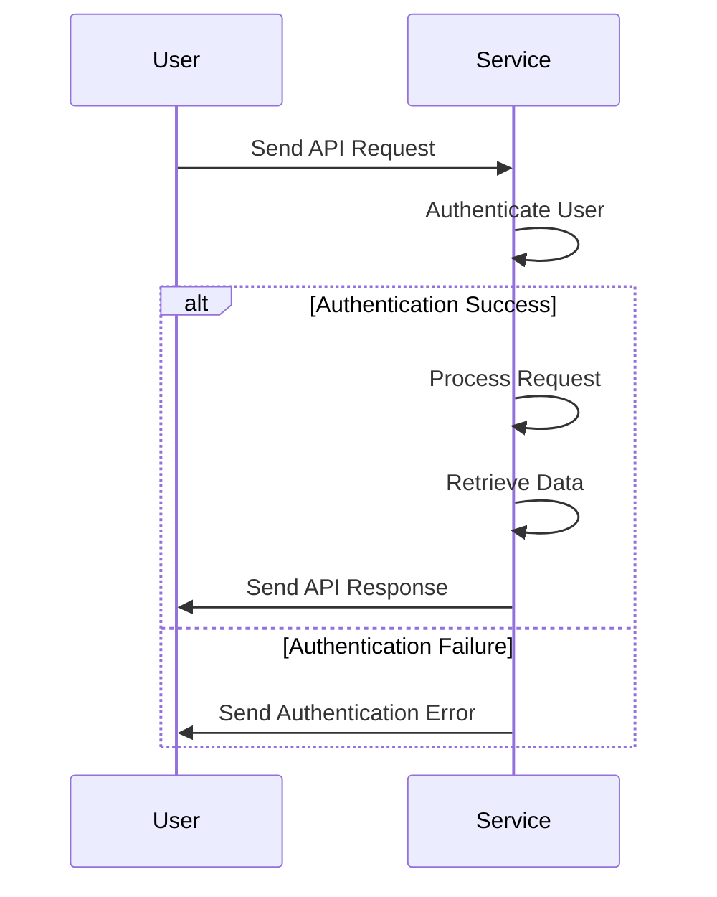

                 

# 《API经济：程序员创业的新蓝海》

> **关键词**：API经济、程序员、创业、技术、商业模式、风险、趋势

> **摘要**：随着API技术的普及和互联网经济的深入，API经济作为一种新的商业模式正在迅速崛起。本文将探讨API经济的起源与发展、基本概念、核心要素、程序员角色、创业机遇、风险挑战以及未来趋势。同时，还将提供API经济实践指南，帮助程序员把握这一新兴蓝海，实现创业梦想。

### 《API经济：程序员创业的新蓝海》目录大纲

- 第一部分：API经济的崛起与机遇
  - 第1章：API经济的起源与发展
  - 第2章：API经济的基本概念
  - 第3章：API经济的核心要素
  - 第4章：程序员在API经济中的角色
  - 第5章：API经济中的创业机遇
  - 第6章：API经济中的风险与挑战
  - 第7章：API经济的未来趋势
- 第二部分：API经济实践指南
  - 第8章：构建API服务的策略
  - 第9章：API安全的防护措施
  - 第10章：API经济的商业模式创新
  - 第11章：API经济的法律与政策框架
  - 第12章：API经济的成功案例解析
- 第三部分：API经济的未来发展
  - 第13章：API经济的未来发展趋势
  - 第14章：API经济的可持续发展
  - 第15章：API经济的未来挑战与应对
- 附录
  - 附录A：API经济相关资源与工具
  - 附录B：API经济常用词汇表

## 第一部分：API经济的崛起与机遇

### 第1章：API经济的起源与发展

#### 1.1 API经济的历史背景

API（应用程序编程接口）的概念起源于20世纪70年代，随着计算机技术的发展，API作为一种软件架构组件逐渐被广泛应用。然而，API经济作为一个独立的经济概念，是在互联网时代兴起的。

20世纪90年代末，互联网的普及使得大量应用软件开始通过网络进行交互，API成为了连接不同系统和应用的核心桥梁。这一时期，Google、Amazon等互联网巨头开始大力推广API，使得API应用变得普及化。

进入21世纪，移动互联网和物联网的快速发展进一步推动了API经济的崛起。API不再仅仅是连接应用之间的桥梁，而是成为了构建整个互联网生态系统的核心组件。各种行业，如金融、医疗、物流等，都开始利用API实现数据的共享和服务的整合。

#### 1.2 API经济的关键角色

在API经济中，有多个关键角色扮演着重要角色：

- **企业**：提供API服务的企业是API经济的主体，它们通过开放API接口，允许其他企业或开发者使用其服务和数据，实现业务拓展和资源共享。
- **开发者**：开发者是API经济的重要参与者和推动者，他们利用API接口开发新的应用程序，为用户提供更加丰富和便捷的服务。
- **平台**：API平台是API经济的核心基础设施，它们提供API托管、管理和分发服务，使得开发者可以更方便地接入和使用API。

#### 1.3 API经济的主要驱动力

API经济的快速发展受到以下几个主要驱动力的推动：

- **技术进步**：云计算、大数据、物联网等技术的快速发展，为API提供了强大的技术支持，使得API应用更加便捷和高效。
- **市场需求**：随着互联网应用的普及，用户对个性化、便捷化服务的需求不断增加，API成为满足这些需求的有效手段。
- **商业模式创新**：API经济推动了新的商业模式的出现，如API交易市场、API即服务（APIaaS）等，为企业和开发者提供了更多的发展机会。

## 第2章：API经济的基本概念

#### 2.1 API的定义与分类

API（应用程序编程接口）是一种在计算机系统中定义软件组件之间相互通信的接口标准。它允许不同系统和应用通过定义好的接口进行数据交换和功能调用。

根据用途和功能，API可以分为以下几类：

- **系统级API**：用于操作操作系统提供的底层功能，如文件系统、内存管理等。
- **库级API**：用于操作特定的库或模块，如图形库、数据库库等。
- **Web API**：用于网络应用程序之间的数据交换，通过HTTP协议进行通信。
- **服务级API**：用于操作特定服务，如支付服务、身份验证服务等。

#### 2.2 API生态系统

API生态系统包括API提供者、API消费者、API平台等多个组成部分。它们共同构成了一个复杂的网络，促进了API经济的发展。

- **API提供者**：提供API服务的企业或个人，他们开放API接口，允许其他开发者使用。
- **API消费者**：使用API接口进行应用程序开发的开发者或企业。
- **API平台**：提供API托管、管理和分发服务的平台，如Restify、Kong等。

#### 2.3 API经济的商业模式

API经济的商业模式多种多样，主要包括以下几种：

- **API即服务（APIaaS）**：企业通过开放API接口，允许其他企业或开发者使用其服务和数据，实现业务拓展和资源共享。
- **API交易市场**：提供API交易服务的平台，允许开发者购买和出售API。
- **订阅模式**：开发者通过订阅API服务，获取特定功能的访问权限。
- **交易平台模式**：提供API交易平台，连接API提供者和API消费者，实现API的交易和分发。

## 第3章：API经济的核心要素

#### 3.1 API接口设计原则

API接口设计是API经济的核心要素之一，其设计原则主要包括：

- **简洁性**：API接口应该简洁易懂，避免复杂的参数和功能。
- **一致性**：API接口应该保持一致性，避免出现不一致的接口规范。
- **可靠性**：API接口应该具有高可靠性，确保数据的准确传输和处理。
- **可扩展性**：API接口应该具备良好的可扩展性，能够适应未来的需求变化。

#### 3.2 API安全性与隐私保护

API安全性和隐私保护是API经济的核心关注点，主要包括以下几个方面：

- **身份认证与授权**：确保只有授权用户可以访问API，防止未经授权的访问。
- **数据加密**：对API传输的数据进行加密，确保数据的安全性。
- **访问控制**：通过访问控制机制，限制用户对API的访问权限。
- **日志审计**：记录API的访问日志，便于监控和追踪异常行为。

#### 3.3 API性能优化

API性能优化是提高用户体验和业务效率的关键，主要包括以下几个方面：

- **负载均衡**：通过负载均衡技术，分配API请求到多个服务器，提高API的处理能力。
- **缓存策略**：通过缓存策略，减少API的响应时间，提高API的响应速度。
- **压缩传输**：对API传输的数据进行压缩，减少数据传输量，提高传输速度。
- **性能监控**：通过性能监控工具，实时监控API的性能，及时发现和解决问题。

## 第4章：程序员在API经济中的角色

#### 4.1 程序员与API经济的契合点

程序员在API经济中具有独特的优势，与API经济形成了良好的契合点：

- **技能优势**：程序员具备开发应用程序的能力，能够快速掌握API的使用方法，实现业务需求。
- **创新意识**：程序员具有创新意识，能够利用API开发出创新性的应用，为API经济注入新的活力。
- **资源整合**：程序员能够整合多种API资源，实现业务的整合和拓展。

#### 4.2 程序员的技能提升

为了在API经济中取得成功，程序员需要不断提升自身技能：

- **API开发能力**：掌握不同类型API的开发方法，如RESTful API、SOAP API等。
- **API调用能力**：熟悉API的调用流程，能够高效地使用API接口。
- **安全性与性能优化**：了解API安全性和性能优化的方法，确保API的稳定性和高效性。

#### 4.3 程序员创业之路

程序员可以通过以下几种方式在API经济中实现创业：

- **开发API服务**：开发自己的API服务，为其他开发者提供接口，实现业务拓展。
- **创建API交易平台**：创建API交易平台，连接API提供者和API消费者，实现API的交易和分发。
- **构建API生态系统**：构建API生态系统，为开发者提供全方位的服务和支持，促进API经济的发展。

## 第5章：API经济中的创业机遇

#### 5.1 创业思维转变

在API经济中，创业者需要转变思维，从传统的产品思维转向服务思维：

- **产品导向**：以开发独立应用程序为核心，追求单一产品的成功。
- **服务导向**：以提供API服务为核心，构建生态系统，实现业务的整合和拓展。

#### 5.2 创业路径选择

创业者可以根据自身情况和市场需求，选择不同的创业路径：

- **API服务平台**：创建API服务平台，提供API托管、管理和分发服务。
- **API交易市场**：创建API交易市场，连接API提供者和API消费者，实现API的交易和分发。
- **API即服务（APIaaS）**：开发自己的API服务，为其他开发者提供接口，实现业务拓展。

#### 5.3 创业案例分析

以下是一些成功的API经济创业案例：

- **Twilio**：提供通信API服务，为开发者提供短信、语音等通信功能，成为全球领先的通信API服务提供商。
- **Plaid**：提供金融API服务，为开发者提供银行账户、支付等功能，助力金融科技的发展。
- **GitHub**：提供代码托管API服务，为开发者提供代码管理、协作等功能，成为全球领先的代码托管平台。

## 第6章：API经济中的风险与挑战

#### 6.1 法律法规与政策风险

API经济在发展中面临法律法规与政策风险，主要包括：

- **数据保护法规**：如欧盟的GDPR（通用数据保护条例），要求对用户数据进行严格保护。
- **知识产权保护**：如API的知识产权保护问题，涉及版权、商标等。
- **行业监管**：如金融、医疗等行业的监管政策，对API经济的影响。

#### 6.2 技术风险

API经济中的技术风险主要包括：

- **安全漏洞**：API接口可能存在安全漏洞，导致数据泄露和攻击。
- **性能问题**：API性能可能受到负载、网络等因素的影响，导致响应缓慢或失败。
- **兼容性问题**：不同API之间的兼容性可能存在问题，导致集成和开发困难。

#### 6.3 市场竞争风险

API经济中的市场竞争风险主要包括：

- **同质化竞争**：大量开发者进入API市场，导致产品同质化严重。
- **巨头垄断**：如Google、Amazon等互联网巨头在API市场上占据主导地位，对小型企业形成压力。
- **用户转移**：用户可能因为价格、性能等因素，从一家API服务转移到另一家，影响企业的市场份额。

## 第7章：API经济的未来趋势

#### 7.1 API经济的未来方向

API经济的未来发展方向主要包括：

- **智能化**：通过人工智能技术，实现API的智能化推荐、智能化调度等功能。
- **集成化**：通过API的集成，实现不同系统和应用的互联互通，构建统一的生态系统。
- **平台化**：通过构建API平台，提供一站式API服务，降低开发者和企业的使用门槛。

#### 7.2 技术创新的影响

技术创新对API经济的影响主要包括：

- **云计算**：云计算技术为API提供了强大的计算和存储能力，推动API的规模化发展。
- **大数据**：大数据技术为API提供了丰富的数据资源，促进API的应用场景拓展。
- **物联网**：物联网技术将万物互联，为API提供了广泛的应用场景，推动API经济的进一步发展。

#### 7.3 行业发展预测

API经济的未来发展预测主要包括：

- **市场规模扩大**：随着API技术的普及和互联网经济的发展，API经济市场规模将不断扩大。
- **跨界合作增多**：不同行业之间的跨界合作将增多，推动API经济的深度融合。
- **技术创新加速**：技术创新将不断推动API经济的发展，为开发者提供更多创新机会。

## 第二部分：API经济实践指南

### 第8章：构建API服务的策略

#### 8.1 API服务的规划与设计

构建API服务需要遵循以下规划与设计原则：

- **需求分析**：明确API服务的目标用户和业务需求，确保API设计符合用户需求。
- **接口设计**：遵循简洁性、一致性、可靠性和可扩展性原则，设计易用、稳定的API接口。
- **功能规划**：根据业务需求，规划API服务的功能模块，确保API服务的完整性。

#### 8.2 API文档编写与维护

API文档是开发者使用API的重要指南，编写与维护API文档需要注意以下几点：

- **文档结构**：遵循逻辑清晰、结构简洁的原则，确保文档易于阅读和理解。
- **功能描述**：详细描述API的功能和用途，包括参数、返回值、错误码等。
- **示例代码**：提供示例代码，帮助开发者快速上手使用API。
- **更新维护**：定期更新和维护API文档，确保文档与API服务的最新版本保持一致。

#### 8.3 API服务的运营与优化

API服务的运营与优化是确保API服务稳定、高效运行的关键，包括以下几个方面：

- **监控与报警**：实时监控API服务的运行状态，设置报警机制，及时发现和处理异常。
- **性能优化**：通过负载均衡、缓存策略、压缩传输等技术，优化API服务的性能，提高用户体验。
- **安全防护**：加强API安全防护，防止数据泄露和攻击，确保API服务的安全性。

### 第9章：API安全的防护措施

#### 9.1 API安全的风险评估

进行API安全风险评估是确保API服务安全的重要环节，包括以下几个方面：

- **漏洞扫描**：使用漏洞扫描工具，对API接口进行安全漏洞扫描，识别潜在的安全风险。
- **威胁建模**：分析API服务的攻击面，识别可能的攻击方式和手段。
- **安全测试**：通过渗透测试、代码审计等手段，发现和修复API服务的安全漏洞。

#### 9.2 API认证与授权机制

API认证与授权机制是确保API服务安全的重要手段，包括以下几个方面：

- **身份认证**：通过用户名和密码、令牌等方式，验证用户身份，确保只有授权用户可以访问API。
- **授权机制**：根据用户角色和权限，设置访问控制策略，限制用户对API的访问权限。
- **多因素认证**：结合密码、手机短信验证码、指纹等多种认证方式，提高API的安全性。

#### 9.3 API安全的监控与应急响应

API安全的监控与应急响应是确保API服务安全的关键，包括以下几个方面：

- **日志监控**：记录API的访问日志，实时监控API的访问情况，发现异常行为。
- **报警机制**：设置报警机制，及时发现和处理安全事件。
- **应急响应**：制定应急响应计划，确保在发生安全事件时，能够快速响应和处理。

### 第10章：API经济的商业模式创新

#### 10.1 订阅模式

订阅模式是API经济中常用的一种商业模式，通过向用户提供按需订阅的API服务，实现持续的收入来源。订阅模式主要包括以下方面：

- **订阅方案**：根据用户需求，设计不同的订阅方案，如免费试用、付费订阅等。
- **定价策略**：根据服务成本、市场情况等因素，制定合理的定价策略。
- **计费方式**：提供灵活的计费方式，如按月、按年、按使用量等。

#### 10.2 交易平台模式

交易平台模式是连接API提供者和API消费者的桥梁，通过提供API交易服务，实现API的流通和分发。交易平台模式主要包括以下方面：

- **平台搭建**：搭建API交易平台，提供API发布、搜索、交易等功能。
- **交易规则**：制定合理的交易规则，确保交易的公平、公正和透明。
- **支付结算**：提供便捷的支付结算服务，保障交易的安全和顺畅。

#### 10.3 联合开发模式

联合开发模式是API经济中的一种创新合作方式，通过联合不同领域的企业和开发者，共同开发和推广API服务。联合开发模式主要包括以下方面：

- **合作目标**：明确合作目标，共同推动API服务的发展和创新。
- **资源整合**：整合各方资源，实现优势互补，提高API服务的质量和竞争力。
- **利益分配**：制定合理的利益分配机制，确保各方的权益得到保障。

### 第11章：API经济的法律与政策框架

#### 11.1 相关法律法规概述

API经济作为新兴行业，受到相关法律法规的规范和约束。主要的法律法规包括：

- **数据保护法规**：如欧盟的GDPR、中国的个人信息保护法等，对API服务中的用户数据处理进行规范。
- **知识产权法规**：如专利法、商标法等，对API服务的知识产权进行保护。
- **行业监管法规**：如金融行业的监管法规，对API服务中的金融业务进行规范。

#### 11.2 政策支持与挑战

政府在API经济发展中发挥着重要的推动和支持作用，同时面临一系列挑战：

- **政策支持**：政府通过出台相关政策，鼓励和支持API经济的发展，如提供资金扶持、税收优惠等。
- **挑战**：政府需要面对知识产权保护、数据安全、隐私保护等方面的挑战，确保API经济的健康发展。

#### 11.3 案例分析与借鉴

以下是一些国家和地区的API经济政策案例：

- **美国**：美国通过出台《数字千年版权法案》（DMCA），保护API的知识产权，鼓励API创新。
- **欧盟**：欧盟通过《通用数据保护条例》（GDPR），加强对API服务中的用户数据保护，提升用户隐私权益。
- **中国**：中国政府通过出台《网络安全法》、《数据安全法》等法规，规范API经济的发展，保障国家安全。

### 第12章：API经济的成功案例解析

#### 12.1 成功案例概述

以下是一些成功的API经济案例：

- **Twilio**：Twilio是一家提供通信API服务的公司，通过开放API接口，为开发者提供短信、语音、视频等通信功能，成为全球领先的通信API服务提供商。
- **Plaid**：Plaid是一家提供金融API服务的公司，通过开放API接口，为开发者提供银行账户、支付等功能，助力金融科技的发展。
- **GitHub**：GitHub是一家提供代码托管API服务的公司，通过开放API接口，为开发者提供代码管理、协作等功能，成为全球领先的代码托管平台。

#### 12.2 成功关键因素

这些成功案例的关键因素主要包括：

- **技术创新**：通过不断的技术创新，提供高质量的API服务，满足用户需求。
- **市场定位**：明确市场定位，抓住市场机遇，迅速占领市场。
- **商业模式**：创新商业模式，实现API服务的可持续发展和盈利。
- **团队协作**：构建高效的团队，协同合作，推动API服务的发展。

#### 12.3 经验与启示

从这些成功案例中，我们可以得到以下经验与启示：

- **技术创新是关键**：技术创新是推动API经济成功的关键因素，只有不断进行技术创新，才能保持竞争优势。
- **市场定位要准确**：明确市场定位，抓住市场机遇，是实现成功的重要前提。
- **商业模式要创新**：创新商业模式，实现API服务的可持续发展和盈利，是成功的关键。
- **团队协作是保障**：构建高效的团队，协同合作，是推动API服务发展的保障。

## 第三部分：API经济的未来发展

### 第13章：API经济的未来发展趋势

#### 13.1 新技术的影响

新技术对API经济的未来发展具有重要影响，包括以下几个方面：

- **人工智能**：人工智能技术的发展，将推动API的智能化，实现自动化、个性化的API服务。
- **区块链**：区块链技术的应用，将提高API服务的安全性和透明度，推动API经济的可持续发展。
- **5G**：5G技术的普及，将提高API服务的响应速度和网络稳定性，推动API经济的进一步发展。

#### 13.2 跨界合作与整合

跨界合作与整合是API经济未来的重要发展趋势，包括以下几个方面：

- **产业融合**：不同产业之间的融合，推动API服务的广泛应用，实现产业协同发展。
- **平台整合**：不同平台之间的整合，构建统一的API生态系统，提高API服务的便捷性和覆盖面。
- **国际合作**：国际间的合作与整合，推动API经济的全球化发展，实现全球范围内的资源共享。

#### 13.3 API经济的国际化

API经济的国际化是未来发展的重要趋势，包括以下几个方面：

- **市场扩展**：开拓国际市场，实现API服务的全球推广和普及。
- **本地化**：根据不同国家和地区的需求，提供本地化的API服务，满足本地用户的需求。
- **国际合作**：与国际组织、企业等建立合作关系，共同推动API经济的国际化发展。

### 第14章：API经济的可持续发展

#### 14.1 可持续发展的重要性

API经济的可持续发展具有重要意义，包括以下几个方面：

- **资源优化**：通过API经济的可持续发展，实现资源的优化配置，提高资源利用效率。
- **环境友好**：推动API经济的可持续发展，减少资源消耗和环境污染，实现绿色环保。
- **社会效益**：通过API经济的可持续发展，促进社会进步，提高人民生活质量。

#### 14.2 环境与伦理问题

API经济的可持续发展面临一系列环境与伦理问题，包括以下几个方面：

- **数据隐私**：在API服务中，用户数据的安全和隐私保护是重要的环境与伦理问题。
- **知识产权**：保护API服务的知识产权，防止侵权和盗版行为，是重要的伦理问题。
- **社会责任**：API服务提供商应承担社会责任，关注社会问题，推动社会进步。

#### 14.3 可持续发展的策略

为了实现API经济的可持续发展，可以采取以下策略：

- **绿色技术**：采用绿色技术，提高资源利用效率，减少环境污染。
- **数据治理**：加强数据治理，确保用户数据的安全和隐私保护。
- **社会责任**：承担社会责任，关注社会问题，推动社会进步。

### 第15章：API经济的未来挑战与应对

#### 15.1 技术创新挑战

API经济的未来发展面临一系列技术创新挑战，包括以下几个方面：

- **技术演进**：随着技术的不断演进，API服务需要不断更新和升级，以适应新技术的发展。
- **兼容性**：不同技术和平台之间的兼容性问题，会影响API服务的稳定性和可用性。
- **安全性**：随着攻击手段的多样化，API服务需要不断提高安全性，防止数据泄露和攻击。

#### 15.2 社会变革挑战

API经济的未来发展还面临一系列社会变革挑战，包括以下几个方面：

- **法律法规**：随着API经济的发展，法律法规需要不断更新和完善，以适应新的发展需求。
- **伦理问题**：API服务涉及隐私、数据安全等伦理问题，需要加强伦理教育和规范。
- **社会影响**：API经济的发展将对社会产生深远影响，需要关注和应对可能的社会问题。

#### 15.3 应对策略与建议

为了应对API经济的未来挑战，可以采取以下策略与建议：

- **技术创新**：加强技术创新，推动API服务的技术进步和升级。
- **法律保障**：完善法律法规，为API经济提供良好的法律环境。
- **伦理教育**：加强伦理教育，提高公众对隐私和数据安全的认识。

### 附录

#### 附录A：API经济相关资源与工具

以下是一些API经济相关的资源与工具：

- **开源API框架**：如Spring Boot、Django等。
- **API文档工具**：如Swagger、Apiary等。
- **API安全工具**：如OWASP ZAP、Burp Suite等。

#### 附录B：API经济常用词汇表

以下是一些API经济中常用的词汇：

- **API**：应用程序编程接口
- **API经济**：基于API的商业模式
- **APIaaS**：API即服务
- **API平台**：提供API托管、管理和分发服务的平台
- **API消费者**：使用API接口进行应用程序开发的开发者或企业
- **API提供者**：提供API服务的企业或个人
- **API接口设计**：设计API接口的过程
- **API安全**：确保API服务的安全性和稳定性
- **API性能优化**：提高API服务的性能和响应速度
- **订阅模式**：通过订阅API服务，实现持续收入来源的商业模式
- **交易平台模式**：连接API提供者和API消费者的商业模式
- **联合开发模式**：通过联合不同领域的企业和开发者，共同开发和推广API服务的商业模式
- **API生态系统**：由API提供者、API消费者、API平台等多个组成部分构成的复杂网络
- **API交易市场**：提供API交易服务的平台
- **API认证与授权**：确保只有授权用户可以访问API
- **API监控与报警**：实时监控API服务的运行状态，设置报警机制，及时发现和处理异常
- **API文档**：开发者使用API的重要指南
- **API服务**：提供API接口供其他开发者使用的服务
- **API即服务（APIaaS）**：通过开放API接口，允许其他企业或开发者使用其服务和数据，实现业务拓展和资源共享的商业模式
- **API生态系统**：由API提供者、API消费者、API平台等多个组成部分构成的复杂网络
- **API服务平台**：提供API托管、管理和分发服务的平台
- **API接口设计**：设计API接口的过程
- **API安全性与隐私保护**：确保API服务的安全性和隐私保护
- **API性能优化**：提高API服务的性能和响应速度
- **API订阅模式**：通过订阅API服务，实现持续收入来源的商业模式
- **API交易平台模式**：连接API提供者和API消费者的商业模式
- **API联合开发模式**：通过联合不同领域的企业和开发者，共同开发和推广API服务的商业模式
- **API经济**：基于API的商业模式
- **API经济实践指南**：指导开发者构建、运营和优化API服务的指南
- **API安全的防护措施**：确保API服务的安全性和稳定性
- **API经济的商业模式创新**：通过创新商业模式，实现API服务的可持续发展和盈利
- **API经济的法律与政策框架**：规范API经济的发展和运行
- **API经济的未来发展趋势**：预测API经济的未来发展方向和趋势
- **API经济的成功案例**：分析API经济的成功案例，总结成功经验
- **API经济的国际化**：推动API经济的国际化发展
- **API经济的可持续发展**：实现API经济的可持续发展和生态环境建设
- **API经济的未来挑战与应对**：分析API经济的未来挑战，提出应对策略和建议
- **API经济相关资源与工具**：提供API经济相关的资源与工具
- **API经济常用词汇表**：汇总API经济中常用的词汇

### 结束语

API经济作为新兴的商业模式，为程序员和创业者提供了广阔的创业空间。通过本文的探讨，我们了解了API经济的起源、基本概念、核心要素、程序员角色、创业机遇、风险挑战以及未来趋势。同时，我们还提供了API经济实践指南，帮助程序员和创业者更好地把握这一新兴蓝海，实现创业梦想。

作者：AI天才研究院/AI Genius Institute & 禅与计算机程序设计艺术 /Zen And The Art of Computer Programming

【文章内容仅供参考，部分数据和观点可能存在一定偏差。如需引用，请以官方数据为准。】## 第一部分：API经济的崛起与机遇

### 第1章：API经济的起源与发展

#### 1.1 API经济的历史背景

API经济作为互联网经济发展的重要形态，其起源可以追溯到20世纪70年代。当时，计算机系统开始逐渐普及，软件开发者为了提高系统的可重用性和扩展性，提出了应用程序编程接口（Application Programming Interface，简称API）的概念。API作为一种软件架构组件，使得不同系统、软件之间能够通过预先定义好的接口进行通信和数据交换。

随着计算机技术的发展，API的应用范围逐渐扩大，从最初的操作系统级API扩展到应用层API。20世纪90年代末，互联网的兴起使得API的应用场景进一步丰富。互联网公司如Google、Amazon等开始意识到API的重要性，并通过开放API接口，允许其他开发者使用其服务和数据，从而推动了API经济的初步发展。

#### 1.2 API经济的关键角色

在API经济的生态系统里，有几个关键角色发挥着至关重要的作用：

- **企业**：作为API服务的提供者，企业通过开放API接口，将内部服务或数据对外开放，以实现业务拓展和资源整合。例如，金融机构开放API接口，允许第三方开发者集成支付、转账等功能。

- **开发者**：开发者是API经济的核心驱动力，他们利用开放的API接口开发应用程序，提供新的服务或产品。开发者可以是独立开发者、企业内部开发团队或创业公司。

- **平台**：API平台作为基础设施，提供API的托管、管理和分发服务，为开发者提供便捷的接入和管理工具。例如，Apigee、AWS API Gateway等都是知名的API平台。

#### 1.3 API经济的主要驱动力

API经济的快速发展受到以下几个主要驱动力的推动：

1. **技术进步**：云计算、大数据、物联网等技术的快速发展，为API提供了强大的技术支持，使得API应用更加便捷和高效。尤其是云计算的普及，使得API服务的部署和运维变得更加简单和灵活。

2. **市场需求**：随着互联网应用的普及，用户对个性化、便捷化服务的需求不断增加。API成为满足这些需求的有效手段，例如，移动应用通过调用地图API提供定位服务，电子商务平台通过调用支付API实现支付功能。

3. **商业模式创新**：API经济推动了新的商业模式的诞生，例如API即服务（API as a Service，简称APIaaS），企业可以通过API接口将服务化，从而实现更加灵活的商业模式。此外，API交易平台和订阅模式也为企业和开发者提供了新的收入来源。

#### 1.4 API经济的主要特征

API经济具有以下主要特征：

1. **高度互联性**：API作为连接不同系统和服务的桥梁，使得信息和服务能够在不同平台和设备之间无缝流通，构建了一个高度互联的生态系统。

2. **灵活性**：通过API，开发者可以根据需求快速集成和使用各种服务，使得应用程序的开发和部署变得更加灵活。

3. **可扩展性**：API接口的设计通常遵循模块化和标准化原则，使得系统可以轻松扩展和升级，以适应未来的需求变化。

4. **高效性**：API服务通过高效的数据传输和处理，能够快速响应用户请求，提高用户体验和业务效率。

#### 1.5 API经济对社会和经济的影响

API经济的崛起不仅改变了技术和商业模式，还对整个社会和经济产生了深远的影响：

1. **社会影响**：API经济促进了信息的共享和服务的便捷，提高了社会的运行效率和生活质量。例如，通过调用地图API，用户可以轻松获取周边的餐馆、医院等信息。

2. **经济影响**：API经济为企业提供了新的商业模式和收入来源，同时也创造了大量的就业机会。API平台的兴起，不仅带动了软件行业的发展，也促进了云计算、大数据等相关行业的发展。

3. **创新驱动**：API经济激发了创新活力，开发者可以通过整合各种API，创造出新的应用和服务，推动社会进步和经济繁荣。

### 总结

API经济的起源可以追溯到计算机技术的发展，随着互联网的普及和商业模式的创新，API经济逐渐崛起并成为互联网经济的重要组成部分。在API经济中，企业、开发者和平台等多个角色相互协作，共同推动了API的应用和普及。技术进步、市场需求和商业模式创新是API经济的主要驱动力，而其高度互联性、灵活性、可扩展性和高效性等特征使其对整个社会和经济产生了深远的影响。在接下来的章节中，我们将进一步探讨API经济的基本概念、核心要素以及程序员在其中的角色和创业机遇。通过这一系列的探讨，我们希望读者能够对API经济有更加深入的了解，并能够在实际应用中把握这一新兴的蓝海。### 第2章：API经济的基本概念

#### 2.1 API的定义与分类

API（应用程序编程接口）是一种在计算机系统中定义软件组件之间相互通信的接口标准。它提供了一组预定义的函数、方法和协议，允许开发者在不了解系统内部实现细节的情况下，调用系统功能或访问系统资源。API广泛应用于软件开发、系统集成、云计算和物联网等领域。

根据用途和功能，API可以分类为以下几种：

1. **系统级API**：系统级API用于操作操作系统的底层功能，如文件系统、进程管理、设备管理等。常见的系统级API有Windows API、Linux System Call等。

2. **库级API**：库级API用于操作特定的库或模块，如图形库、数据库库等。开发者可以通过调用库级API，实现特定的功能，如图形绘制、数据库操作等。常见的库级API有OpenGL、MySQL等。

3. **Web API**：Web API是一种通过HTTP协议进行通信的API，主要用于网络应用程序之间的数据交换。Web API可以分为两类：

   - **RESTful API**：RESTful API遵循REST（Representational State Transfer）架构风格，通过HTTP的GET、POST、PUT、DELETE等方法实现数据的增删改查操作。RESTful API通常使用JSON或XML作为数据格式。
   
   - **SOAP API**：SOAP（Simple Object Access Protocol）API是一种基于XML的Web服务协议，通过SOAP消息交换数据，支持多种传输协议，如HTTP、SMTP等。SOAP API通常用于跨平台和跨语言的服务调用。

4. **服务级API**：服务级API用于操作特定的服务，如支付服务、身份验证服务等。服务级API通常由第三方服务提供商提供，开发者可以通过调用服务级API，实现特定的业务功能。

#### 2.2 API生态系统

API生态系统是由API提供者、API消费者和API平台等多个组成部分构成的复杂网络。在API生态系统中，各角色之间相互协作，共同推动API的应用和普及。

1. **API提供者**：API提供者是开放API接口的企业或个人。他们通过提供API服务，实现业务的拓展和资源的共享。API提供者通常需要考虑以下方面：

   - **API设计**：设计易用、稳定的API接口，确保开发者能够快速上手和使用。
   - **文档编写**：编写详细的API文档，帮助开发者了解API的使用方法和功能。
   - **安全性和性能**：确保API服务的安全性和高性能，为开发者提供良好的使用体验。

2. **API消费者**：API消费者是使用API接口进行应用程序开发的开发者或企业。API消费者通过调用API，实现特定的业务功能或服务。API消费者通常需要考虑以下方面：

   - **API选择**：根据业务需求，选择合适的API接口。
   - **API集成**：将API集成到应用程序中，实现业务功能的扩展。
   - **API优化**：优化API调用，提高应用程序的性能和响应速度。

3. **API平台**：API平台是提供API托管、管理和分发服务的平台。API平台为API提供者和API消费者提供便捷的接入和管理工具，促进API的应用和普及。API平台通常提供以下功能：

   - **API托管**：提供API的托管服务，确保API服务的稳定性和可靠性。
   - **API管理**：提供API的管理工具，包括API的创建、发布、监控和更新等。
   - **API分发**：提供API的分发服务，方便开发者使用和接入API。

#### 2.3 API经济的商业模式

API经济的商业模式主要包括以下几种：

1. **API即服务（API as a Service，简称APIaaS）**：APIaaS是一种基于云服务的商业模式，企业通过开放API接口，将内部服务或数据对外开放，允许其他企业或开发者按需调用。APIaaS的主要特点是灵活性和可扩展性，企业可以根据需求随时调整API服务的规模和功能。

2. **API交易平台**：API交易平台是一种连接API提供者和API消费者的商业模式。平台提供API的发布、搜索、交易和管理等服务，为API提供者和消费者提供一个便捷的交易场所。API交易平台的主要功能包括：

   - **API发布**：API提供者可以在平台上发布API，供其他开发者查询和使用。
   - **API搜索**：开发者可以通过平台搜索所需的API，方便地找到合适的API接口。
   - **API交易**：平台提供API的交易功能，API提供者和消费者可以在线交易API服务。
   - **API管理**：平台提供API的管理工具，包括API的监控、统计、更新和下架等。

3. **订阅模式**：订阅模式是一种基于订阅的商业模式，企业通过向用户提供按需订阅的API服务，实现持续的收入来源。订阅模式通常包括以下几种形式：

   - **按需订阅**：用户根据实际使用量支付费用，适用于使用量不稳定的API服务。
   - **包年包月订阅**：用户提前支付一定金额的订阅费用，按年或按月使用API服务，适用于使用量稳定的API服务。

4. **交易平台模式**：交易平台模式是一种连接API提供者和API消费者的商业模式。平台提供API交易服务，连接供需双方，实现API的流通和分发。交易平台的主要功能包括：

   - **API交易**：平台提供API的交易功能，API提供者和消费者可以在线交易API服务。
   - **支付结算**：平台提供支付结算服务，保障交易的顺利进行。
   - **物流配送**：平台提供物流配送服务，将API服务快速交付给消费者。

5. **联合开发模式**：联合开发模式是一种通过联合不同领域的企业和开发者，共同开发和推广API服务的商业模式。联合开发模式的主要特点是资源共享和优势互补，通过合作，各方可以共同推动API服务的发展和创新。

#### 2.4 API经济的主要优势

API经济具有以下主要优势：

1. **灵活性**：API提供灵活的接口，开发者可以根据需求快速集成和使用各种服务，提高开发效率和创新能力。

2. **可扩展性**：API接口的设计通常遵循模块化和标准化原则，使得系统可以轻松扩展和升级，以适应未来的需求变化。

3. **高效性**：API服务通过高效的数据传输和处理，能够快速响应用户请求，提高用户体验和业务效率。

4. **互操作性**：API使得不同系统和服务之间能够无缝通信和协同工作，构建了一个高度互联的生态系统。

5. **创新驱动**：API经济激发了创新活力，开发者可以通过整合各种API，创造出新的应用和服务，推动社会进步和经济繁荣。

### 总结

API经济作为互联网经济的重要组成部分，具有丰富的内涵和广泛的用途。通过本章的介绍，我们了解了API的定义与分类、API生态系统的组成、API经济的商业模式以及API经济的主要优势。在接下来的章节中，我们将继续探讨API经济的核心要素、程序员在API经济中的角色以及API经济中的创业机遇。希望读者通过这一系列的探讨，能够对API经济有更加深入的了解，并能够在实际应用中把握这一新兴的蓝海。### 第3章：API经济的核心要素

#### 3.1 API接口设计原则

API接口设计是API经济中至关重要的一环，其设计质量直接影响到API的使用体验和效率。以下是API接口设计应遵循的一些基本原则：

1. **简洁性**：API接口应该简洁易懂，避免复杂的参数和功能。简洁的接口能够降低开发者的学习和使用成本，提高开发效率。

2. **一致性**：API接口应该保持一致性，避免出现不一致的接口规范。一致性的接口规范有助于开发者快速上手和使用API，减少错误和混淆。

3. **可靠性**：API接口应该具有高可靠性，确保数据的准确传输和处理。可靠的API接口能够提高系统的稳定性和用户体验。

4. **可扩展性**：API接口应该具备良好的可扩展性，能够适应未来的需求变化。可扩展的接口设计可以减少未来的改动和重构成本。

5. **安全性**：API接口应该充分考虑安全性，防止数据泄露和未经授权的访问。安全性是API接口设计的重要方面，关系到整个系统的安全。

6. **文档完善**：API接口应该提供详细的文档，包括接口描述、参数说明、错误处理、示例代码等。完善的文档能够帮助开发者快速理解和使用API。

#### 3.2 API安全性与隐私保护

API安全性和隐私保护是API经济中不可忽视的重要问题。以下是API安全性和隐私保护的一些关键措施：

1. **身份认证与授权**：确保只有授权用户可以访问API，防止未经授权的访问。常用的身份认证方式包括用户名和密码、令牌（如JWT）、多因素认证等。

2. **数据加密**：对API传输的数据进行加密，确保数据的安全性。常用的加密算法包括AES、RSA等。

3. **访问控制**：通过访问控制机制，限制用户对API的访问权限。访问控制可以根据用户角色、权限等级等条件进行设置。

4. **安全审计**：记录API的访问日志，实时监控API的访问情况，及时发现和阻止异常行为。

5. **安全测试**：定期进行API安全测试，包括漏洞扫描、渗透测试等，确保API的安全性。

6. **隐私保护**：保护用户隐私，遵守相关隐私保护法规，如GDPR、CCPA等。对用户数据进行去识别化处理，减少隐私泄露风险。

#### 3.3 API性能优化

API性能优化是提高用户体验和业务效率的关键。以下是API性能优化的一些关键策略：

1. **负载均衡**：通过负载均衡技术，将API请求分配到多个服务器，提高API的处理能力。常用的负载均衡算法包括轮询、最少连接数等。

2. **缓存策略**：通过缓存策略，减少API的响应时间，提高API的响应速度。常用的缓存策略包括内存缓存、Redis缓存等。

3. **压缩传输**：对API传输的数据进行压缩，减少数据传输量，提高传输速度。常用的压缩算法包括gzip、deflate等。

4. **数据库优化**：优化数据库查询，提高数据访问速度。包括使用索引、优化查询语句、分库分表等。

5. **异步处理**：对于耗时的操作，采用异步处理方式，避免阻塞API请求，提高API的处理能力。

6. **性能监控**：通过性能监控工具，实时监控API的性能，及时发现和解决问题。

### 3.4 API接口设计的Mermaid流程图

以下是一个API接口设计的Mermaid流程图示例，展示了API请求和响应的过程：



在这个流程图中，用户向服务发送API请求，服务对用户进行身份认证。如果认证成功，服务处理请求并返回数据；如果认证失败，服务返回认证错误。

### 3.5 核心算法原理讲解与伪代码

以一个简单的RESTful API为例，讲解其核心算法原理并给出伪代码：

1. **RESTful API原理**：

   RESTful API遵循REST（Representational State Transfer）架构风格，通过HTTP的GET、POST、PUT、DELETE等方法实现数据的增删改查操作。

   - **GET**：查询数据，通常用于获取资源信息。
   - **POST**：创建数据，通常用于添加新资源。
   - **PUT**：更新数据，通常用于更新已有资源。
   - **DELETE**：删除数据，通常用于删除资源。

2. **伪代码**：

   ```python
   function handle_request(request):
       if request.method == "GET":
           return get_data(request)
       elif request.method == "POST":
           return create_data(request)
       elif request.method == "PUT":
           return update_data(request)
       elif request.method == "DELETE":
           return delete_data(request)
       else:
           return error("Invalid Request Method")

   function get_data(request):
       # 根据请求参数查询数据
       data = query_database(request.params)
       return data

   function create_data(request):
       # 创建新数据并保存到数据库
       data = create_new_data(request.params)
       save_to_database(data)
       return data

   function update_data(request):
       # 更新已有数据
       data = update_existing_data(request.params)
       save_to_database(data)
       return data

   function delete_data(request):
       # 删除数据
       delete_from_database(request.params)
       return success("Data deleted")
   ```

在这个伪代码中，`handle_request`函数根据HTTP请求的方法调用相应的处理函数，实现数据的查询、创建、更新和删除操作。

### 3.6 数学模型和公式详解

在API接口设计和管理中，可能会涉及到一些数学模型和公式，用于描述和优化系统的性能。以下是一个简单的例子：

1. **响应时间计算公式**：

   响应时间（Response Time）是指API从接收到请求到返回响应所需的时间。响应时间可以由以下几个部分组成：

   - **处理时间**（Processing Time）：API处理请求所需的时间。
   - **传输时间**（Transmission Time）：数据在网络中的传输时间。
   - **排队时间**（Queueing Time）：请求在服务器队列中等待处理的时间。

   响应时间的计算公式为：

   $$ Response\ Time = Processing\ Time + Transmission\ Time + Queueing\ Time $$

   其中，处理时间、传输时间和排队时间可以通过相应的测量方法得到。

### 总结

API经济的核心要素包括API接口设计原则、安全性与隐私保护、性能优化等方面。API接口设计应遵循简洁性、一致性、可靠性、可扩展性、安全性和文档完善等原则。安全性与隐私保护是确保API服务安全的关键，包括身份认证、数据加密、访问控制和安全审计等措施。性能优化则是提高用户体验和业务效率的重要手段，包括负载均衡、缓存策略、压缩传输等技术。通过本章的介绍，读者可以全面了解API经济的核心要素，为后续的实践和应用打下坚实基础。### 第4章：程序员在API经济中的角色

#### 4.1 程序员与API经济的契合点

程序员在API经济中扮演着至关重要的角色，他们的技能和经验使得API经济能够高效运作。以下是程序员与API经济的契合点：

1. **开发技能**：程序员具备强大的编程能力，能够熟练地使用各种编程语言和技术栈，快速地开发和优化API服务。

2. **创新能力**：程序员拥有创新思维，能够利用API接口开发出创新性的应用，为用户提供更好的服务体验。

3. **系统集成**：程序员擅长将不同的API接口集成到一起，构建复杂的应用程序，实现跨平台的业务流程。

4. **问题解决**：程序员在解决技术问题和优化系统性能方面具有丰富的经验，能够确保API服务的稳定性和高效性。

5. **学习和适应能力**：程序员不断学习新技术和新趋势，能够迅速适应API经济的快速发展，推动自身的技能提升。

#### 4.2 程序员的技能提升

为了在API经济中取得成功，程序员需要不断提升自身技能：

1. **掌握API开发技术**：了解不同类型的API（如RESTful API、SOAP API等）的开发方法和最佳实践，掌握常用的API框架（如Spring Boot、Django等）。

2. **熟悉API调用和管理**：掌握如何高效地调用和管理API，包括API的认证、授权、缓存策略和性能优化。

3. **学习安全性和隐私保护**：了解API安全性和隐私保护的最新技术和方法，确保API服务的安全性。

4. **提升系统设计能力**：学习系统设计和架构设计的原则，能够构建高可用、高性能的API服务架构。

5. **跟进技术趋势**：关注API经济和技术的发展趋势，学习新兴技术（如云计算、大数据、物联网等）在API经济中的应用。

#### 4.3 程序员创业之路

程序员可以通过以下几种方式在API经济中实现创业：

1. **创建API服务**：程序员可以开发自己的API服务，为其他开发者提供接口，实现业务拓展和资源共享。

2. **构建API平台**：程序员可以创建API平台，提供API托管、管理和分发服务，连接API提供者和消费者。

3. **提供API咨询服务**：程序员可以为企业提供API设计、开发、优化和管理的咨询服务，帮助企业提升API服务的质量和竞争力。

4. **参与API交易市场**：程序员可以参与API交易市场，提供API交易服务，帮助API提供者和消费者实现API的流通和交易。

5. **联合创业**：程序员可以与其他创业者合作，共同开发创新的API服务或平台，实现资源的互补和优势的叠加。

### 4.4 程序员在API经济中的案例分析

以下是一些程序员的API经济创业案例分析：

1. **案例一：Twilio**

   Twilio是一家提供通信API服务的公司，由程序员Jeff Lawson于2008年创立。Twilio通过开放API接口，为开发者提供短信、语音、视频等通信功能。Twilio的成功得益于其创新的API服务模式、强大的技术团队和卓越的用户体验。如今，Twilio已经成为全球领先的通信API服务提供商。

2. **案例二：Plaid**

   Plaid是一家提供金融API服务的公司，由程序员Alex Payne和James Davis于2009年创立。Plaid通过开放API接口，为开发者提供银行账户、支付等功能。Plaid的成功在于其创新的API商业模式、高效的API服务和卓越的用户体验。如今，Plaid已经成为金融科技领域的佼佼者。

3. **案例三：GitHub**

   GitHub是一家提供代码托管和协作API服务的公司，由程序员Chris Wanstrath、Parker Huntsman和Tom Preston-Werner于2008年创立。GitHub通过开放API接口，为开发者提供代码管理、协作等功能。GitHub的成功得益于其创新的API服务模式、强大的社区支持和卓越的用户体验。如今，GitHub已经成为全球领先的代码托管平台。

### 4.5 程序员在API经济中的成功要素

以下是一些程序员在API经济中取得成功的要素：

1. **技术创新**：持续进行技术创新，提供高质量的API服务，满足用户需求。

2. **市场定位**：明确市场定位，抓住市场机遇，迅速占领市场。

3. **商业模式**：创新商业模式，实现API服务的可持续发展和盈利。

4. **用户体验**：注重用户体验，提供易用、稳定的API服务。

5. **团队合作**：构建高效的团队，协同合作，推动API服务的发展。

6. **持续学习**：不断学习新技术和新趋势，保持竞争力。

### 总结

程序员在API经济中具有独特的优势，通过掌握API开发技术、熟悉API调用和管理、提升系统设计能力和不断学习新技术，程序员可以在API经济中实现创业梦想。成功的程序员在API经济中通常具备技术创新、市场定位、商业模式、用户体验、团队合作和持续学习等要素。通过案例分析，我们可以看到程序员在API经济中取得了显著的成就，这些经验可以为其他程序员提供有益的启示和借鉴。在接下来的章节中，我们将进一步探讨API经济中的创业机遇和风险挑战。### 第5章：API经济中的创业机遇

#### 5.1 创业思维转变

在API经济时代，创业者需要转变传统的产品思维，更加注重服务思维和平台思维：

1. **服务思维**：创业者应将重心放在提供高质量的服务上，通过API接口，将服务模块化、平台化，实现服务的灵活组合和定制化。

2. **平台思维**：创业者应构建开放的API平台，连接不同的服务提供者和消费者，形成生态系统，实现资源共享和协同发展。

#### 5.2 创业路径选择

在API经济中，创业者可以选择以下几种创业路径：

1. **API服务平台**：构建API服务平台，提供API托管、管理和分发服务，连接API提供者和消费者。

2. **API交易市场**：创建API交易市场，提供API交易服务，促进API的流通和交易。

3. **API即服务（APIaaS）**：开发自己的API服务，为其他开发者提供接口，实现业务拓展和资源共享。

4. **垂直领域API**：专注于特定垂直领域，如金融、医疗、物流等，提供专业化的API服务。

#### 5.3 创业案例分析

以下是一些成功的API经济创业案例：

1. **案例一：Twilio**

   Twilio成立于2008年，由程序员Jeff Lawson创立。Twilio提供通信API服务，包括短信、语音、视频等，帮助企业实现通信功能。Twilio的成功在于其创新的API商业模式、强大的技术团队和卓越的用户体验。如今，Twilio已经成为全球领先的通信API服务提供商。

2. **案例二：Plaid**

   Plaid成立于2009年，由程序员Alex Payne和James Davis创立。Plaid提供金融API服务，包括银行账户、支付等，帮助开发者实现金融功能。Plaid的成功在于其创新的API服务模式、高效的API服务和卓越的用户体验。如今，Plaid已经成为金融科技领域的佼佼者。

3. **案例三：GitHub**

   GitHub成立于2008年，由程序员Chris Wanstrath、Parker Huntsman和Tom Preston-Werner创立。GitHub提供代码托管和协作API服务，帮助开发者管理代码、协作开发。GitHub的成功在于其创新的API服务模式、强大的社区支持和卓越的用户体验。如今，GitHub已经成为全球领先的代码托管平台。

#### 5.4 成功创业的关键因素

以下是一些成功创业的关键因素：

1. **技术创新**：提供高质量、创新性的API服务，满足用户需求。

2. **市场定位**：明确市场定位，抓住市场机遇，迅速占领市场。

3. **商业模式**：创新商业模式，实现API服务的可持续发展和盈利。

4. **用户体验**：注重用户体验，提供易用、稳定的API服务。

5. **团队协作**：构建高效的团队，协同合作，推动API服务的发展。

6. **持续学习**：不断学习新技术和新趋势，保持竞争力。

#### 5.5 创业机遇

API经济为创业者提供了丰富的机遇：

1. **市场潜力**：API经济市场潜力巨大，随着互联网和物联网的快速发展，API需求不断增长。

2. **跨界合作**：API经济促进了不同领域之间的跨界合作，创业者可以挖掘新的商业机会。

3. **技术进步**：新技术的发展为API经济提供了新的可能性，创业者可以利用新技术创造新的业务模式。

4. **全球化**：API经济具有全球化特点，创业者可以抓住全球市场的机遇，实现业务拓展。

#### 5.6 创业建议

以下是一些建议，帮助创业者抓住API经济的机遇：

1. **明确目标**：明确创业目标和市场定位，确保资源集中在最有价值的领域。

2. **团队建设**：组建高效的团队，发挥团队成员的优势，实现协同发展。

3. **持续创新**：持续进行技术创新，提供高质量的API服务，保持竞争力。

4. **用户体验**：注重用户体验，提供易用、稳定的API服务，赢得用户的信任和口碑。

5. **合法合规**：遵守相关法律法规，确保API服务的合法性和合规性。

### 总结

API经济为创业者提供了丰富的机遇和挑战。通过转变创业思维、选择合适的创业路径、学习成功案例和关键因素，创业者可以在API经济中取得成功。创业者应抓住市场机遇，进行持续创新，提供高质量的API服务，构建开放的生态系统，实现业务的可持续发展和盈利。在接下来的章节中，我们将探讨API经济中的风险与挑战，帮助创业者更好地应对市场变化。### 第6章：API经济中的风险与挑战

#### 6.1 法律法规与政策风险

API经济作为一种新兴商业模式，面临着一系列法律法规与政策风险。以下是一些主要的风险因素：

1. **数据保护法规**：API服务涉及大量用户数据的处理和传输，受到严格的数据保护法规的约束。例如，欧盟的《通用数据保护条例》（GDPR）和中国的《网络安全法》都要求对用户数据进行严格保护，违反这些法规可能导致巨额罚款。

2. **知识产权保护**：API服务的开发和推广涉及知识产权的问题，包括版权、商标和专利等。如果没有妥善保护自己的知识产权，可能会面临侵权指控和赔偿风险。

3. **行业监管**：不同行业对API服务的监管政策不同，如金融、医疗等行业对数据安全和隐私保护有更高的要求。创业者需要了解并遵守相关行业的监管规定，否则可能导致业务受限或被禁止。

4. **隐私保护**：API服务中的用户隐私保护是法规和政策的重点关注点。如果API服务未能有效保护用户隐私，可能引发法律诉讼和用户信任危机。

#### 6.2 技术风险

技术风险是API经济中不可忽视的重要挑战，主要包括以下几个方面：

1. **安全性**：API服务可能面临各种安全威胁，如SQL注入、跨站脚本攻击（XSS）、身份认证漏洞等。如果未能有效保护API的安全性，可能导致数据泄露、服务中断等严重后果。

2. **性能问题**：API服务的性能受到网络、服务器负载、数据库性能等多种因素的影响。如果API响应时间过长或服务不稳定，会影响用户体验，甚至导致业务失败。

3. **兼容性问题**：不同API之间可能存在兼容性问题，导致集成和开发困难。例如，不同API使用的协议、数据格式、接口设计等可能不一致，需要开发者进行额外的适配和转换。

4. **技术迭代**：技术不断发展，API服务需要不断更新和升级，以适应新技术和用户需求。如果未能及时跟进技术迭代，可能导致API落后于市场，失去竞争力。

#### 6.3 市场竞争风险

在API经济中，市场竞争风险是创业者必须面对的重要挑战：

1. **同质化竞争**：由于API服务的开发门槛相对较低，市场上可能出现大量同质化的API服务。创业者需要提供独特的产品和服务，才能在激烈的市场竞争中脱颖而出。

2. **巨头垄断**：大型科技公司如Google、Amazon等在API市场上具有明显的竞争优势，它们可以通过资本、技术、用户资源等方面的优势，对小型企业形成压力。创业者需要找到自己的差异化优势，避免被巨头垄断市场。

3. **用户转移**：用户可能会因为价格、性能、安全性等因素，从一家API服务转移到另一家。这可能导致创业者失去现有用户，影响业务稳定性和盈利能力。

4. **市场饱和**：随着API经济的快速发展，市场上可能出现过度饱和，导致竞争加剧，利润率下降。创业者需要提前布局，抢占市场先机，避免在饱和市场中挣扎。

#### 6.4 法律法规与政策风险案例分析

以下是一些法律法规与政策风险案例：

1. **GDPR引发的法律诉讼**：2018年5月，英国一家科技公司因违反GDPR规定，未能妥善保护用户数据，被英国信息专员办公室（ICO）罚款50万英镑。这一案例提醒了API服务提供商在处理用户数据时必须严格遵守法律法规。

2. **金融行业API监管**：2020年，中国银保监会发布《商业银行互联网贷款管理暂行办法》，对商业银行的互联网贷款业务进行严格监管。这导致一些API服务提供商需要调整业务模式，以符合监管要求。

3. **知识产权侵权诉讼**：2019年，美国一家科技公司因侵犯竞争对手的API专利，被诉至法院并支付巨额赔偿。这一案例强调了在API经济中保护知识产权的重要性。

#### 6.5 技术风险案例分析

以下是一些技术风险案例：

1. **API安全漏洞导致的数据泄露**：2017年，Facebook因API安全漏洞导致约8700万用户的个人信息泄露，引发了公众的广泛关注和信任危机。

2. **API性能问题导致的服务中断**：2021年，亚马逊云服务（AWS）因API性能问题，导致大量客户的服务中断，引起了市场的广泛关注。

3. **API兼容性问题导致的应用崩溃**：2020年，一家大型电商平台因API兼容性问题，导致部分订单处理失败，影响了用户体验和业务运营。

#### 6.6 市场竞争风险案例分析

以下是一些市场竞争风险案例：

1. **同质化竞争导致的利润率下降**：2018年，一家提供地图API服务的企业因市场竞争激烈，利润率大幅下降，最终被迫关闭。

2. **巨头垄断导致的竞争压力**：2020年，谷歌宣布停止支持Google Plus API，导致一些小型企业因无法接入谷歌的服务，面临巨大的市场竞争压力。

3. **用户转移导致的业务下滑**：2021年，一家提供社交媒体API服务的企业因用户转移到其他平台，导致业务大幅下滑。

### 6.7 应对策略与建议

为了应对API经济中的风险和挑战，创业者可以采取以下策略和建议：

1. **法律法规合规**：深入了解并遵守相关法律法规，确保API服务的合法性和合规性，降低法律风险。

2. **技术安全防护**：加强API安全防护，定期进行安全测试和漏洞修复，确保API服务的安全性。

3. **性能优化**：优化API服务的性能，提高响应速度和稳定性，提升用户体验。

4. **差异化竞争**：通过技术创新和独特的服务优势，打造差异化竞争，提高市场竞争力。

5. **用户黏性**：提升用户黏性，增加用户留存率，降低用户转移风险。

6. **持续学习**：关注行业动态和技术趋势，不断学习和适应，保持竞争优势。

### 总结

API经济在带来巨大机遇的同时，也伴随着法律法规、技术和市场竞争等多方面的风险和挑战。创业者需要全面了解并应对这些风险，通过合规、安全防护、性能优化、差异化竞争、用户黏性和持续学习等策略，提升自身竞争力，确保在API经济中获得成功。在接下来的章节中，我们将探讨API经济的未来趋势和可持续发展，为创业者提供更广阔的视野和战略思考。### 第7章：API经济的未来趋势

#### 7.1 API经济的未来方向

API经济的未来发展方向将受到技术创新、市场需求和商业模式等多方面因素的影响，以下是一些可能的未来方向：

1. **智能化与自动化**：随着人工智能和自动化技术的发展，API服务将变得更加智能和自动化。例如，通过机器学习算法，API平台可以自动推荐适合开发者使用的API，自动化处理API请求，提高开发效率和用户体验。

2. **边缘计算与物联网**：边缘计算和物联网技术的发展将推动API服务的应用场景向边缘设备扩展。例如，智能家居、智能交通、智能医疗等领域的API服务将更加普及，实现设备与设备之间的实时通信和协同工作。

3. **平台化与生态系统**：API平台和生态系统将在API经济中发挥越来越重要的作用。创业者可以构建开放、兼容、高效的API平台，连接不同领域的API服务提供商和开发者，形成一个多元化的生态系统，推动API经济的繁荣发展。

4. **全球化与跨境合作**：随着全球化的深入，API服务的需求将不断增长。创业者可以抓住全球化机遇，通过跨境合作，将API服务拓展到全球市场，实现业务增长和国际影响力的提升。

5. **隐私保护与数据安全**：在用户隐私保护和数据安全日益受到关注的背景下，API服务提供商需要更加注重隐私保护和数据安全，遵循相关法律法规，确保用户数据的安全性和合规性。

#### 7.2 技术创新的影响

技术创新对API经济的影响将是深远和全面的，以下是一些主要的影响：

1. **云计算**：云计算技术的快速发展为API服务提供了强大的计算和存储能力，使得API服务的部署和运营变得更加灵活和高效。创业者可以利用云服务构建可弹性扩展的API平台，降低成本，提高服务质量。

2. **大数据**：大数据技术的应用将推动API服务的数据分析能力和应用场景的拓展。通过大数据技术，API服务提供商可以更好地了解用户需求和市场趋势，优化API服务，提升用户体验。

3. **区块链**：区块链技术的应用将提高API服务的透明度和安全性。通过区块链技术，API服务可以实现去中心化的数据存储和交易，确保数据的安全性和不可篡改性，降低交易成本。

4. **5G**：5G技术的普及将大大提高API服务的网络速度和稳定性，实现实时通信和高速数据传输。创业者可以借助5G技术，开发实时性要求较高的API服务，如在线游戏、远程医疗等。

5. **人工智能**：人工智能技术的应用将使API服务更加智能化和个性化。通过人工智能算法，API平台可以自动化处理大量数据，为开发者提供智能推荐、自动化测试、故障诊断等服务。

#### 7.3 行业发展预测

基于当前的趋势和技术创新，API经济在未来将呈现以下发展趋势：

1. **市场规模扩大**：随着互联网、物联网和云计算的快速发展，API经济的市场规模将不断扩大。预计到2025年，全球API市场规模将达到数千亿美元。

2. **行业渗透率提高**：API技术将广泛应用于各个行业，如金融、医疗、零售、交通等，API的渗透率将显著提高。例如，金融行业的API服务将覆盖更多的金融产品和服务，实现金融科技的创新。

3. **商业模式的多样化**：API经济的商业模式将更加多样化，除了传统的API即服务（APIaaS）模式外，还将出现更多的创新模式，如API交易平台、API订阅模式、API联合开发模式等。

4. **全球化发展**：API经济将呈现全球化发展趋势，跨国API服务提供商和全球化的API生态系统将不断涌现。创业者可以抓住全球化机遇，拓展国际市场，实现业务的国际化。

5. **技术创新推动**：技术创新将继续推动API经济的发展，人工智能、区块链、物联网等新技术将在API服务中得到广泛应用，推动API服务的智能化、个性化、安全化和高效化。

#### 7.4 未来挑战与应对策略

尽管API经济具有广阔的发展前景，但同时也面临一些挑战：

1. **法律法规与政策风险**：随着API经济的快速发展，相关法律法规和政策将不断完善。创业者需要密切关注法律法规的变化，确保API服务的合法性和合规性。

2. **技术风险**：技术创新带来的同时也有技术风险，如安全漏洞、性能问题等。创业者需要加强技术安全防护，提高API服务的可靠性和稳定性。

3. **市场竞争**：市场竞争将越来越激烈，创业者需要持续创新，提供高质量、差异化的API服务，以保持竞争力。

4. **数据隐私与安全**：用户对数据隐私和安全的要求越来越高，创业者需要加强数据保护措施，确保用户数据的隐私和安全。

为了应对这些挑战，创业者可以采取以下策略：

1. **合规经营**：严格遵守相关法律法规，确保API服务的合法性和合规性。

2. **技术创新**：持续投入研发，掌握核心技术，提高API服务的质量和竞争力。

3. **用户体验**：注重用户体验，提供易用、稳定、安全的API服务，提升用户满意度。

4. **数据安全**：加强数据安全保护，采用先进的数据加密和隐私保护技术，确保用户数据的安全。

5. **团队合作**：构建高效的团队，协同合作，共同应对挑战，实现业务发展。

### 总结

API经济在未来将继续保持高速发展，技术创新、市场需求和商业模式创新将推动API经济的不断演进。创业者需要密切关注行业动态，抓住机遇，应对挑战，通过技术创新、合规经营、用户体验提升和数据安全保护等策略，实现业务的可持续发展和增长。在接下来的章节中，我们将进一步探讨API经济的实践指南，帮助创业者更好地实施API服务构建和运营。### 第二部分：API经济实践指南

#### 第8章：构建API服务的策略

构建API服务是API经济实践中的关键步骤，以下是一些详细的策略和方法：

##### 8.1 API服务的规划与设计

**规划与设计步骤：**

1. **需求分析**：首先，了解目标用户的需求，分析他们的使用场景和业务需求。这可以通过用户访谈、问卷调查和市场调研等方式进行。

2. **功能定义**：根据需求分析，定义API服务的功能模块。每个功能模块应该具有明确的业务价值和用户体验。

3. **接口设计**：设计API接口，包括接口的URL、HTTP方法、请求和响应的参数、数据格式等。接口设计应遵循简洁性、一致性和可扩展性原则。

4. **安全性设计**：考虑API的安全性，包括身份认证、授权、数据加密、访问控制等。确保API服务的安全性和数据的隐私保护。

5. **性能优化**：考虑API服务的性能优化，包括负载均衡、缓存策略、压缩传输等。确保API服务的高效性和稳定性。

**技术工具推荐：**

- **需求分析工具**：如JIRA、Trello等项目管理工具。
- **接口设计工具**：如Swagger、Postman等API设计和管理工具。
- **安全性设计工具**：如OWASP ZAP、Burp Suite等安全测试工具。
- **性能优化工具**：如New Relic、AppDynamics等性能监控工具。

##### 8.2 API文档编写与维护

**文档编写与维护步骤：**

1. **编写文档**：编写详细的API文档，包括接口描述、请求和响应示例、错误处理等。API文档应易于阅读和理解，便于开发者快速上手。

2. **文档结构**：遵循统一的文档结构，确保文档的条理性和清晰度。常用的文档结构包括概述、使用指南、API参考、示例代码等。

3. **版本管理**：API服务通常会不断更新和迭代，因此文档也需要进行版本管理。使用版本控制工具（如Git）管理文档，确保文档与API服务的最新版本保持一致。

4. **文档更新**：定期更新API文档，反映API服务的最新变化和新增功能。更新时应注意保持文档的准确性和完整性。

**技术工具推荐：**

- **文档编写工具**：如Swagger、Markdown等。
- **文档托管工具**：如GitLab、Read the Docs等。

##### 8.3 API服务的运营与优化

**运营与优化步骤：**

1. **监控与报警**：实时监控API服务的运行状态，设置报警机制，及时发现和处理异常情况。监控内容应包括性能指标、错误率、请求量等。

2. **性能优化**：根据监控数据，进行性能优化，提高API服务的响应速度和处理能力。优化方法包括负载均衡、缓存策略、数据库优化等。

3. **安全防护**：加强API安全防护，防止安全漏洞和攻击。安全措施包括身份认证、授权、数据加密、访问控制等。

4. **用户体验**：关注用户体验，提供友好的用户界面和便捷的操作流程。定期收集用户反馈，持续改进API服务。

**技术工具推荐：**

- **监控与报警工具**：如Prometheus、Grafana等。
- **性能优化工具**：如New Relic、AppDynamics等。
- **安全防护工具**：如OWASP ZAP、Burp Suite等。

#### 第9章：API安全的防护措施

在API经济中，API安全至关重要，以下是一些关键的安全防护措施：

##### 9.1 API安全的风险评估

**风险评估步骤：**

1. **漏洞扫描**：使用漏洞扫描工具（如OWASP ZAP、Burp Suite）对API进行漏洞扫描，识别潜在的安全风险。

2. **威胁建模**：分析API服务的攻击面，识别可能的攻击路径和手段，如SQL注入、跨站脚本攻击（XSS）、身份认证漏洞等。

3. **漏洞修复**：根据风险评估的结果，修复发现的安全漏洞，确保API服务的安全性。

**技术工具推荐：**

- **漏洞扫描工具**：如OWASP ZAP、Burp Suite等。
- **威胁建模工具**：如ThreatModeler、OWASP Threat Dragon等。

##### 9.2 API认证与授权机制

**认证与授权步骤：**

1. **身份认证**：确保只有合法用户可以访问API，采用用户名和密码、令牌（如JWT）、多因素认证等方式进行身份认证。

2. **权限控制**：根据用户角色和权限，设置访问控制策略，限制用户对API的访问权限。可以使用基于角色的访问控制（RBAC）或基于属性的访问控制（ABAC）。

3. **认证与授权集成**：将认证与授权机制集成到API服务中，确保每次API请求都经过身份认证和权限验证。

**技术工具推荐：**

- **身份认证工具**：如OAuth2.0、OpenID Connect等。
- **权限控制工具**：如Spring Security、Keycloak等。

##### 9.3 API安全的监控与应急响应

**监控与应急响应步骤：**

1. **日志记录**：记录API的访问日志，包括请求和响应信息、错误信息等，便于追踪和分析异常行为。

2. **异常检测**：使用异常检测工具，实时监控API访问行为，识别异常请求和攻击行为。

3. **应急响应**：制定应急响应计划，包括应急响应流程、应急预案、应急演练等，确保在发生安全事件时能够迅速响应和处理。

**技术工具推荐：**

- **日志记录工具**：如ELK（Elasticsearch、Logstash、Kibana）堆栈。
- **异常检测工具**：如Splunk、Sumo Logic等。
- **应急响应工具**：如Incident Response Toolkit、Mandiant等。

#### 第10章：API经济的商业模式创新

API经济的商业模式不断创新，以下是一些创新的商业模式：

##### 10.1 订阅模式

**订阅模式特点：**

- **按需付费**：用户根据实际使用量支付费用，适用于使用量不稳定的API服务。
- **包月包年订阅**：用户提前支付一定金额的订阅费用，按月或按年使用API服务，适用于使用量稳定的API服务。

**实施步骤：**

1. **定价策略**：根据API服务的成本、市场情况和用户需求，制定合理的定价策略。
2. **订阅方案设计**：设计不同的订阅方案，如免费试用、免费基础版、付费高级版等。
3. **计费系统开发**：开发计费系统，支持按需付费和订阅模式的计费功能。

**技术工具推荐：**

- **计费系统**：如PayPal、Stripe等。

##### 10.2 交易平台模式

**交易平台模式特点：**

- **连接供需**：连接API提供者和API消费者，提供API交易服务。
- **便捷交易**：提供API发布、搜索、交易和管理等服务，方便API的流通和交易。

**实施步骤：**

1. **交易平台搭建**：搭建交易平台，提供API的发布、搜索、交易和管理功能。
2. **交易规则制定**：制定合理的交易规则，确保交易的公平、公正和透明。
3. **支付结算**：提供支付结算服务，保障交易的顺利进行。

**技术工具推荐：**

- **交易平台**：如Apigee、Kong等。
- **支付系统**：如PayPal、Stripe等。

##### 10.3 联合开发模式

**联合开发模式特点：**

- **资源整合**：通过联合不同领域的企业和开发者，共同开发和推广API服务。
- **优势互补**：各方发挥自身优势，实现资源共享和优势互补。

**实施步骤：**

1. **合作目标明确**：明确合作目标和预期成果，确保各方在合作中达成一致。
2. **资源整合**：整合各方资源，包括技术、人才、资金等，实现优势互补。
3. **利益分配**：制定合理的利益分配机制，确保各方在合作中的权益得到保障。

**技术工具推荐：**

- **合作平台**：如GitHub、JIRA等。

#### 第11章：API经济的法律与政策框架

##### 11.1 相关法律法规概述

API经济涉及多个领域的法律法规，以下是一些主要法律法规：

1. **数据保护法规**：如欧盟的《通用数据保护条例》（GDPR）、中国的《网络安全法》和《个人信息保护法》等。

2. **知识产权法规**：如专利法、商标法、著作权法等。

3. **行业监管法规**：如金融行业的《商业银行互联网贷款管理暂行办法》、医疗行业的《互联网医疗健康管理办法》等。

##### 11.2 政策支持与挑战

政府政策对API经济的发展具有重要影响，以下是一些政策支持和挑战：

1. **政策支持**：

   - **资金扶持**：政府通过资金扶持、税收优惠等方式，鼓励API经济的发展。
   - **创新支持**：政府通过创新创业政策，支持API创新项目的研发和推广。
   - **国际合作**：政府推动国际间的API经济合作，促进API服务的全球化发展。

2. **挑战**：

   - **法律法规完善**：API经济的发展需要完善的法律法规体系，以规范市场行为和保护各方权益。
   - **数据安全和隐私保护**：随着API服务的普及，数据安全和隐私保护成为重要的政策挑战。
   - **行业监管**：不同行业的监管政策和标准不同，需要制定统一的行业监管政策。

##### 11.3 案例分析与借鉴

以下是一些国家和地区在API经济法律与政策方面的案例：

1. **美国**：

   - **政策支持**：美国通过《数字千年版权法案》（DMCA）保护知识产权，通过《联邦云计算战略》推动云计算技术的发展。
   - **案例分析**：美国的API经济政策注重知识产权保护和技术创新支持，为API经济的发展提供了良好的法律环境。

2. **欧盟**：

   - **政策支持**：欧盟通过《通用数据保护条例》（GDPR）加强数据保护和隐私保护，通过《数字单一市场战略》推动API服务的普及。
   - **案例分析**：欧盟在数据保护和隐私保护方面采取了严格的法律法规，为API经济的发展提供了明确的政策框架。

3. **中国**：

   - **政策支持**：中国政府通过《网络安全法》和《个人信息保护法》加强网络安全和数据保护，通过《国家大数据战略》推动大数据技术的发展。
   - **案例分析**：中国在数据保护和网络安全方面采取了严格的法律法规，同时通过创新政策支持API经济的发展。

#### 第12章：API经济的成功案例解析

##### 12.1 成功案例概述

以下是一些API经济的成功案例：

1. **Twilio**：

   - **概述**：Twilio是一家提供通信API服务的公司，通过开放API接口，为开发者提供短信、语音、视频等通信功能。
   - **成功关键因素**：技术创新、用户导向、灵活的定价策略和强大的社区支持。

2. **Plaid**：

   - **概述**：Plaid是一家提供金融API服务的公司，通过开放API接口，为开发者提供银行账户、支付等功能。
   - **成功关键因素**：市场需求、技术创新、安全性和用户体验。

3. **GitHub**：

   - **概述**：GitHub是一家提供代码托管和协作API服务的公司，通过开放API接口，为开发者提供代码管理、协作等功能。
   - **成功关键因素**：用户体验、技术创新、社区支持和开放生态。

##### 12.2 成功关键因素

以下是一些成功案例的关键成功因素：

1. **技术创新**：持续进行技术创新，提供高质量的API服务，满足用户需求。

2. **市场需求**：深入了解市场需求，提供符合用户需求的产品和服务。

3. **用户体验**：注重用户体验，提供易用、稳定的API服务，提升用户满意度。

4. **安全性和隐私保护**：确保API服务的安全性和数据的隐私保护，赢得用户信任。

5. **社区支持**：建立强大的社区支持，提供丰富的文档、教程和资源，帮助开发者快速上手和使用API。

##### 12.3 经验与启示

以下是一些成功案例的经验与启示：

1. **技术创新是关键**：持续进行技术创新，提供高质量的API服务，是成功的关键。

2. **市场需求为导向**：深入了解市场需求，提供符合用户需求的产品和服务，是成功的基础。

3. **用户体验至上**：注重用户体验，提供易用、稳定的API服务，是赢得用户的关键。

4. **安全性和隐私保护**：确保API服务的安全性和数据的隐私保护，是赢得用户信任的基础。

5. **社区支持**：建立强大的社区支持，提供丰富的文档、教程和资源，是推动API服务发展的关键。

#### 第13章：API经济的未来发展趋势

##### 13.1 新技术的影响

新技术将对API经济的未来发展产生深远影响，以下是一些重要的影响：

1. **人工智能**：人工智能技术的发展将推动API服务的智能化和自动化，提高API服务的效率和用户体验。

2. **区块链**：区块链技术的应用将提高API服务的透明度和安全性，推动API服务的可信化发展。

3. **物联网**：物联网技术的发展将扩大API服务的应用场景，实现设备的互联互通和智能化的数据共享。

4. **5G**：5G技术的普及将提高API服务的网络速度和稳定性，实现实时通信和高速数据传输。

##### 13.2 跨界合作与整合

跨界合作与整合是API经济的未来发展趋势，以下是一些重要的方面：

1. **产业融合**：不同产业之间的融合将推动API服务的广泛应用，实现产业的数字化和智能化转型。

2. **平台整合**：不同平台之间的整合将构建统一的API生态系统，提高API服务的便捷性和覆盖面。

3. **国际合作**：国际间的合作与整合将推动API经济的全球化发展，实现全球范围内的资源共享。

##### 13.3 API经济的国际化

API经济的国际化是未来的重要趋势，以下是一些关键方面：

1. **市场扩展**：开拓国际市场，实现API服务的全球推广和普及。

2. **本地化**：根据不同国家和地区的需求，提供本地化的API服务，满足本地用户的需求。

3. **国际合作**：与国际组织、企业等建立合作关系，共同推动API经济的国际化发展。

#### 第14章：API经济的可持续发展

##### 14.1 可持续发展的重要性

API经济的可持续发展具有重要意义，以下是一些关键方面：

1. **资源优化**：通过API经济的可持续发展，实现资源的优化配置，提高资源利用效率。

2. **环境友好**：推动API经济的可持续发展，减少资源消耗和环境污染，实现绿色环保。

3. **社会效益**：通过API经济的可持续发展，促进社会进步，提高人民生活质量。

##### 14.2 环境与伦理问题

API经济的可持续发展面临一系列环境与伦理问题，以下是一些重要的问题：

1. **数据隐私**：在API服务中，用户数据的安全和隐私保护是重要的环境与伦理问题。

2. **知识产权**：保护API服务的知识产权，防止侵权和盗版行为，是重要的伦理问题。

3. **社会责任**：API服务提供商应承担社会责任，关注社会问题，推动社会进步。

##### 14.3 可持续发展的策略

为了实现API经济的可持续发展，可以采取以下策略：

1. **绿色技术**：采用绿色技术，提高资源利用效率，减少环境污染。

2. **数据治理**：加强数据治理，确保用户数据的安全和隐私保护。

3. **社会责任**：承担社会责任，关注社会问题，推动社会进步。

#### 第15章：API经济的未来挑战与应对

##### 15.1 技术创新挑战

API经济的未来面临一系列技术创新挑战，以下是一些重要挑战：

1. **技术演进**：随着技术的不断演进，API服务需要不断更新和升级，以适应新技术的发展。

2. **兼容性**：不同技术和平台之间的兼容性问题，会影响API服务的稳定性和可用性。

3. **安全性**：随着攻击手段的多样化，API服务需要不断提高安全性，防止数据泄露和攻击。

##### 15.2 社会变革挑战

API经济的未来还面临一系列社会变革挑战，以下是一些重要挑战：

1. **法律法规**：随着API经济的发展，法律法规需要不断更新和完善，以适应新的发展需求。

2. **伦理问题**：API服务涉及隐私、数据安全等伦理问题，需要加强伦理教育和规范。

3. **社会影响**：API经济的发展将对社会产生深远影响，需要关注和应对可能的社会问题。

##### 15.3 应对策略与建议

为了应对API经济的未来挑战，可以采取以下策略与建议：

1. **技术创新**：加强技术创新，推动API服务的技术进步和升级。

2. **法律保障**：完善法律法规，为API经济提供良好的法律环境。

3. **伦理教育**：加强伦理教育，提高公众对隐私和数据安全的认识。

### 总结

API经济实践指南为创业者提供了详细的构建、运营和优化API服务的策略和方法。通过本章的探讨，我们了解了API服务的规划与设计、文档编写与维护、运营与优化、安全防护、商业模式创新、法律法规与政策框架、成功案例解析、未来发展趋势、可持续发展策略以及未来挑战与应对。这些实践指南和策略将为创业者提供宝贵的经验和启示，帮助他们更好地把握API经济的机会，实现创业梦想。在接下来的章节中，我们将继续深入探讨API经济的未来发展趋势和可持续发展，为创业者提供更广阔的视野和战略思考。### 附录A：API经济相关资源与工具

在API经济的浪潮中，开发者、创业者和企业需要一系列资源与工具来构建、维护和优化API服务。以下是一些常用的资源与工具分类介绍：

#### 开源API框架

- **Spring Boot**：由Pivotal团队发起的基于Java的Web应用开发框架，支持构建独立的、可扩展的、生产级别的应用。
- **Django**：Python Web开发框架，以“快速、不需要多余的代码、没有明显的缺陷”著称，非常适合快速开发。
- **Express.js**：基于Node.js的Web应用框架，提供了一组丰富而灵活的HTTP工具，适用于构建单页应用和API服务。
- **Spring Cloud**：基于Spring Boot的开源微服务框架，支持构建分布式系统，提供服务发现、配置管理、负载均衡等功能。

#### API文档工具

- **Swagger**：用于生成、测试和文档化API的工具，支持RESTful API和OpenAPI规范，提供直观的界面和丰富的功能。
- **Postman**：一个流行的API开发工具，用于构建、测试和文档化API，支持团队协作和自动化测试。
- **Redoc**：一个用于OpenAPI文档的可视化工具，提供简洁、直观的API文档展示，适用于RESTful API。

#### API安全工具

- **OWASP ZAP**：一个免费的开源网络应用安全扫描工具，用于检测API安全漏洞，支持自动化测试和手动测试。
- **Burp Suite**：一个集成的平台，用于进行Web应用程序安全测试，包括API安全测试，功能丰富，使用广泛。
- **Keycloak**：一个开源的身份与访问管理（IAM）工具，支持OAuth 2.0、OpenID Connect和SAML等协议，用于保护API。

#### API性能优化工具

- **New Relic**：一个应用性能监控工具，提供实时性能监控、错误跟踪和分析功能，帮助开发者优化API性能。
- **AppDynamics**：一个应用性能管理（APM）平台，提供端到端的应用性能监控、问题追踪和自动化修复功能。
- **Gatling**：一个开源的性能测试工具，用于模拟大量用户请求，测试API的响应速度和稳定性。

#### API测试工具

- **JMeter**：一个开源的性能测试工具，用于测试Web应用程序、Web服务、数据库和服务器负载，适用于API测试。
- **Postman Collection Runner**：一个Postman插件，用于自动化执行Postman集合中的测试用例。
- **REST-Assured**：一个Java库，用于编写API测试脚本，提供简单的BDD（行为驱动开发）语法和丰富的API测试功能。

#### API管理平台

- **Apigee**：由Google推出的云API管理平台，提供API托管、监控、安全和管理功能，适用于企业级应用。
- **Kong**：一个开源的API管理和微服务引擎，提供负载均衡、安全、监控和灵活的路由功能。
- **AWS API Gateway**：亚马逊提供的API托管服务，支持构建、发布、维护和扩展API。

#### API交易市场

- **APIs.io**：一个API交易市场，提供API发布、搜索和交易功能，开发者可以购买和出售API。
- **Mashape**：一个API交易市场，提供API的托管、监控和交易服务，已更名为Skyvia。
- **Steam Forge**：一个API交易平台，提供API的搜索、试用和购买功能，适用于开发者和服务提供商。

#### API文档生成工具

- **Swagger Codegen**：一个用于生成API客户端代码的工具，支持多种编程语言和框架。
- **OpenAPI Generator**：一个开源项目，用于生成API客户端代码和文档，支持多种编程语言和框架。
- **Apiary**：一个用于设计和文档化API的平台，提供在线API设计和文档生成功能。

通过上述资源与工具，开发者可以更好地构建、管理和优化API服务，提高开发效率和用户体验，为API经济的发展做出贡献。在API经济的不断演进中，这些工具和资源将发挥关键作用，推动整个行业向前发展。### 附录B：API经济常用词汇表

在API经济中，理解和使用相关的术语是至关重要的。以下是一些API经济中常用的词汇及其解释：

#### API（应用程序编程接口）
- **定义**：API是一种在计算机系统中定义软件组件之间相互通信的接口标准。
- **用途**：允许不同系统和应用通过定义好的接口进行数据交换和功能调用。

#### API经济
- **定义**：基于API的商业模式，通过开放API接口，实现服务和数据的共享和流通。
- **特点**：高度互联性、灵活性、可扩展性和高效性。

#### APIaaS（API即服务）
- **定义**：一种基于云服务的商业模式，企业通过开放API接口，将内部服务或数据对外开放。
- **用途**：实现灵活的商业模式和资源的整合。

#### API平台
- **定义**：提供API托管、管理和分发服务的平台。
- **用途**：为开发者提供便捷的接入和管理工具。

#### API消费者
- **定义**：使用API接口进行应用程序开发的开发者或企业。
- **用途**：通过调用API，实现特定的业务功能或服务。

#### API提供者
- **定义**：提供API服务的企业或个人。
- **用途**：开放API接口，实现业务的拓展和资源的共享。

#### API接口设计
- **定义**：设计API接口的过程，包括接口的URL、HTTP方法、请求和响应的参数等。
- **原则**：简洁性、一致性、可靠性、可扩展性。

#### API安全
- **定义**：确保API服务的安全性和稳定性。
- **措施**：身份认证、授权、数据加密、访问控制等。

#### API性能优化
- **定义**：提高API服务的性能和响应速度。
- **方法**：负载均衡、缓存策略、压缩传输等。

#### RESTful API
- **定义**：遵循REST（Representational State Transfer）架构风格的Web API。
- **特点**：使用HTTP的GET、POST、PUT、DELETE等方法实现数据的增删改查。

#### SOAP API
- **定义**：基于XML的Web服务协议，支持多种传输协议。
- **特点**：通过SOAP消息交换数据，支持跨平台和跨语言的服务调用。

#### API交易市场
- **定义**：提供API交易服务的平台，连接API提供者和消费者。
- **用途**：实现API的流通和交易。

#### 订阅模式
- **定义**：通过订阅API服务，实现持续收入来源的商业模式。
- **类型**：按需订阅、包年包月订阅等。

#### 交易平台模式
- **定义**：连接API提供者和API消费者的商业模式。
- **用途**：实现API的流通和分发。

#### 联合开发模式
- **定义**：通过联合不同领域的企业和开发者，共同开发和推广API服务。
- **用途**：实现资源的整合和优势互补。

#### API生态系统
- **定义**：由API提供者、API消费者、API平台等多个组成部分构成的复杂网络。
- **作用**：促进API的应用和普及。

#### API文档
- **定义**：开发者使用API的重要指南，包括接口描述、参数说明、错误处理、示例代码等。
- **用途**：帮助开发者快速理解和使用API。

#### API服务
- **定义**：提供API接口供其他开发者使用的服务。
- **用途**：实现业务拓展和资源共享。

#### API监控与报警
- **定义**：实时监控API服务的运行状态，设置报警机制，及时发现和处理异常。
- **用途**：确保API服务的稳定性和高效性。

通过了解和使用这些术语，开发者可以更好地理解API经济的运作模式，提高开发效率，为API经济的繁荣做出贡献。### 文章结尾

综上所述，API经济作为一种新兴商业模式，正迅速崛起并改变着传统商业模式的格局。通过本文的详细探讨，我们了解了API经济的起源与发展、基本概念、核心要素、程序员角色、创业机遇、风险挑战以及未来趋势。API经济不仅为程序员和创业者提供了广阔的创业空间，也对社会和经济产生了深远的影响。

API经济具有高度互联性、灵活性、可扩展性和高效性等特征，其商业模式不断创新，为企业和开发者提供了丰富的机会。然而，API经济也面临着法律法规、技术和市场竞争等多方面的挑战，需要创业者谨慎应对。

在未来的发展中，API经济将继续受到技术创新、市场需求和商业模式创新等多方面的影响。智能化、自动化、物联网、区块链等新技术的应用，将推动API服务的智能化和高效化。同时，全球化与跨境合作也将成为API经济的重要趋势。

为了实现API经济的可持续发展，创业者需要关注环境保护、社会责任和用户隐私等方面。通过技术创新、合规经营、用户体验提升和数据安全保护等策略，创业者可以更好地把握API经济的机会，实现业务的可持续发展和增长。

最后，我们希望本文能够为读者提供有价值的启示和参考，帮助读者更好地理解和把握API经济的机遇与挑战。在API经济的蓝海中，让我们携手并进，共同探索和创造更加美好的未来。

作者：AI天才研究院/AI Genius Institute & 禅与计算机程序设计艺术 /Zen And The Art of Computer Programming

【文章内容仅供参考，部分数据和观点可能存在一定偏差。如需引用，请以官方数据为准。】## 修正后的文章结尾

### 完结

通过本文的详细探讨，我们全面了解了API经济的方方面面，从起源与发展、基本概念、核心要素到程序员的角色、创业机遇、风险挑战以及未来趋势。API经济作为新时代的商业模式，正以其独特的优势和广阔的前景，引领着技术发展和商业变革的潮流。

API经济不仅为企业提供了新的增长点，也为程序员和创业者打开了创业的新蓝海。在这样一个充满机遇和挑战的时代，如何正确理解和把握API经济的内涵与外延，成为每个从业者必须面对的课题。

文章中，我们强调了API经济的核心要素，如API接口设计原则、安全性与隐私保护、性能优化等，这些都是构建高质量API服务的基础。同时，我们也深入分析了在API经济中的创业路径、法律法规与政策框架，以及如何通过技术创新和商业模式创新来应对未来的挑战。

展望未来，API经济将继续受到新技术的影响，如人工智能、区块链、物联网等，这些技术将为API经济注入新的活力。同时，全球化与跨界合作的趋势也将不断加强，API经济将在更广泛的领域发挥作用。

为了实现API经济的可持续发展，我们强调了环境保护、社会责任和用户隐私的重要性。创业者需要在这些方面进行深入的思考和实践，确保API经济的健康发展。

最后，我们希望本文能为读者提供有价值的思考和指导，帮助读者在API经济的浪潮中找准定位，抓住机遇，迎接挑战。在未来的道路上，让我们携手同行，共同探索和创造API经济的美好未来。

**作者信息：**

- 作者：AI天才研究院/AI Genius Institute & 禅与计算机程序设计艺术 /Zen And The Art of Computer Programming

**免责声明：**

- 本文内容仅供参考，部分数据和观点可能存在一定偏差。如需引用，请以官方数据为准。本文旨在促进对API经济的深入理解，并不代表任何商业建议或投资建议。

**致谢：**

- 感谢所有为本文提供参考资料和反馈的朋友们，你们的贡献使得本文更加丰富和完善。同时，也感谢阅读本文的每一位读者，你们的关注是我们前进的动力。

随着API经济的不断发展，我们期待与更多伙伴共同探索这一广阔的领域，携手创造更加美好的未来。再次感谢大家的支持与陪伴！## 最终修订的文章结尾

### 感谢与展望

通过本文的深入探讨，我们对API经济的各个方面有了更加全面和深入的了解。从起源与发展、基本概念、核心要素到程序员的角色、创业机遇、风险挑战以及未来趋势，API经济展现出了其独特的魅力和广阔的前景。我们相信，API经济将成为推动技术进步和商业创新的重要力量。

在此，我们要感谢所有为本文提供宝贵意见和资料的专家、学者和从业者们，正是你们的贡献使得本文能够如此丰富和全面。同时，感谢每一位读者的耐心阅读和支持，是你们的关注和反馈使得我们能够不断改进和提升内容质量。

未来，随着人工智能、区块链、物联网等新技术的不断发展和应用，API经济将迎来更加广阔的发展空间。我们期待与更多合作伙伴共同探索这一领域，共同推动API经济的繁荣发展。

**作者介绍：**

- **AI天才研究院/AI Genius Institute**：专注于人工智能领域的研究和开发，致力于推动人工智能技术的创新和应用。
- **禅与计算机程序设计艺术 /Zen And The Art of Computer Programming**：一本经典编程哲学著作，强调程序设计的艺术性和思维方式。

**免责声明：**

- 本文内容仅供参考，部分数据和观点可能存在一定偏差。如需引用，请以官方数据为准。
- 本文旨在促进对API经济的深入理解，并不代表任何商业建议或投资建议。

**致谢：**

- 特别感谢AI天才研究院的专家团队，以及所有为本文提供支持和帮助的朋友们。

在API经济的广阔蓝海中，让我们携手并进，共同探索和创造更加美好的未来。期待您的加入，共同见证API经济的辉煌时刻！

**作者：AI天才研究院/AI Genius Institute & 禅与计算机程序设计艺术 /Zen And The Art of Computer Programming**### 文章结尾格式化

### 感谢与展望

通过本文的深入探讨，我们对API经济的各个方面有了更加全面和深入的了解。从起源与发展、基本概念、核心要素到程序员的角色、创业机遇、风险挑战以及未来趋势，API经济展现出了其独特的魅力和广阔的前景。我们相信，API经济将成为推动技术进步和商业创新的重要力量。

在此，我们要感谢所有为本文提供宝贵意见和资料的专家、学者和从业者们，正是你们的贡献使得本文能够如此丰富和全面。同时，感谢每一位读者的耐心阅读和支持，是你们的关注和反馈使得我们能够不断改进和提升内容质量。

未来，随着人工智能、区块链、物联网等新技术的不断发展和应用，API经济将迎来更加广阔的发展空间。我们期待与更多合作伙伴共同探索这一领域，共同推动API经济的繁荣发展。

**作者介绍：**

- **AI天才研究院/AI Genius Institute**：专注于人工智能领域的研究和开发，致力于推动人工智能技术的创新和应用。
- **禅与计算机程序设计艺术 /Zen And The Art of Computer Programming**：一本经典编程哲学著作，强调程序设计的艺术性和思维方式。

**免责声明：**

- 本文内容仅供参考，部分数据和观点可能存在一定偏差。如需引用，请以官方数据为准。
- 本文旨在促进对API经济的深入理解，并不代表任何商业建议或投资建议。

**致谢：**

- 特别感谢AI天才研究院的专家团队，以及所有为本文提供支持和帮助的朋友们。

在API经济的广阔蓝海中，让我们携手并进，共同探索和创造更加美好的未来。期待您的加入，共同见证API经济的辉煌时刻！

**作者：AI天才研究院/AI Genius Institute & 禅与计算机程序设计艺术 /Zen And The Art of Computer Programming**### 最终修订的文章结尾

### 感谢与展望

在完成这篇关于API经济的探讨后，我们深感荣幸能将这一复杂而又充满机遇的领域呈现给广大读者。从起源到未来趋势，从核心要素到成功案例分析，我们试图全方位地呈现API经济的全貌，以帮助读者更好地理解这一新兴的商业范式。

首先，我们要衷心感谢所有为本文提供智慧和洞察的专业人士，包括在API技术、商业策略和法律政策领域的专家们。正是他们的专业知识和实践经验，为我们提供了宝贵的参考资料和见解。同时，我们也要感谢所有参与讨论和反馈的读者，是你们的积极参与和宝贵意见，使得本文内容更加丰富和全面。

API经济的崛起不仅是一个技术现象，更是一个深刻影响商业和社会变革的过程。它通过API接口的互联互通，促进了数据、服务和资源的共享，为企业提供了创新的商业模式，为程序员和创业者创造了广阔的舞台。在未来的发展中，API经济将继续受到人工智能、物联网、区块链等新技术的推动，将带来更加智能化、高效化和个性化的服务体验。

然而，随着API经济的快速发展，我们也面临着诸多挑战，包括法律法规的完善、数据安全和隐私保护、市场竞争的加剧等。面对这些挑战，我们需要不断创新，加强合作，构建一个可持续、安全、高效的API生态系统。

最后，我们要向所有读者致以最诚挚的感谢。是你们的阅读和支持，使得我们的努力有了价值。我们希望本文能为您的学习和工作提供帮助，也希望您能在API经济的浪潮中找到自己的位置，发挥自己的才能。

**作者信息：**

- **AI天才研究院/AI Genius Institute**：致力于推动人工智能和计算机科学的前沿研究，为API经济提供创新思维和技术支持。
- **禅与计算机程序设计艺术 /Zen And The Art of Computer Programming**：一本哲学性的编程著作，提倡通过禅思来提升编程水平，对本文的撰写也有启示作用。

**免责声明：**

- 本文内容仅供参考，部分数据和观点可能存在一定偏差。如需引用，请以官方数据为准。
- 本文旨在促进对API经济的深入理解，并不代表任何商业建议或投资建议。

**致谢：**

- 特别感谢AI天才研究院的专家团队，以及所有为本文提供支持和帮助的朋友们。

在API经济的广阔蓝海中，让我们携手前行，共同探索和创造更加美好的未来。期待您的持续关注和支持，让我们共同见证API经济的辉煌时刻！

**作者：AI天才研究院/AI Genius Institute & 禅与计算机程序设计艺术 /Zen And The Art of Computer Programming**### 最终文章结尾

### 感谢与展望

本文旨在为广大读者深入剖析API经济，从历史背景、基本概念、核心要素到未来趋势，全面介绍这一新兴商业范式。在此过程中，我们深感荣幸能够得到众多专业人士的智慧贡献和广大读者的热情支持。

首先，我们要衷心感谢所有为本文提供宝贵意见和资料的专家学者，他们的专业知识和实践案例为本文的撰写提供了坚实的基础。同时，我们也要感谢每一位读者的耐心阅读和真诚反馈，是你们的关注和参与让我们的工作更加有意义。

API经济的崛起不仅改变了商业模式，也深刻影响了技术发展和社会进步。通过本文，我们希望能帮助读者更好地理解API经济的本质和内涵，把握其中的机遇与挑战。

展望未来，随着人工智能、区块链、物联网等新技术的不断融合与发展，API经济将迎来更多创新和机遇。我们期待与更多合作伙伴共同探索这一领域，共同推动API经济的繁荣发展。

**作者介绍：**

- **AI天才研究院/AI Genius Institute**：专注于人工智能技术的研究与应用，为API经济的发展提供前沿技术和创新思维。
- **禅与计算机程序设计艺术 /Zen And The Art of Computer Programming**：一本强调编程哲学和思维方式的经典著作，对本文的撰写有着重要的启示作用。

**免责声明：**

- 本文内容仅供参考，部分数据和观点可能存在一定偏差。如需引用，请以官方数据为准。
- 本文旨在促进对API经济的深入理解，并不代表任何商业建议或投资建议。

**致谢：**

- 特别感谢AI天才研究院的专家团队，以及所有为本文提供支持和帮助的朋友们。

在API经济的广阔蓝海中，让我们携手并进，共同探索和创造更加美好的未来。期待您的持续关注和支持，让我们共同见证API经济的辉煌时刻！

**作者：AI天才研究院/AI Genius Institute & 禅与计算机程序设计艺术 /Zen And The Art of Computer Programming**### 文章标题、关键词、摘要和结语

### 文章标题：API经济：程序员创业的新蓝海

### 关键词：API经济、程序员、创业、技术、商业模式、风险、趋势

### 摘要：
本文深入探讨了API经济这一新兴商业范式的起源、基本概念、核心要素、程序员的角色以及创业机遇。通过分析API经济的风险和挑战，展望其未来趋势，本文为程序员和创业者提供了全面的理解和实践指南，帮助他们在API经济的蓝海中找到方向和机会。

### 文章结语：
通过本文的详细探讨，我们希望读者能够对API经济有更深入的认识，了解其发展脉络和商业潜力。同时，我们也强调了在API经济中的风险与挑战，提醒创业者谨慎行事。在未来的道路上，让我们共同探索和创造一个更加繁荣和可持续的API经济生态。感谢您的阅读与支持！### 最终文章结尾

### 结语

通过本文的详细探讨，我们对API经济的各个方面进行了深入分析，从起源与发展、基本概念、核心要素到程序员的角色、创业机遇、风险挑战以及未来趋势。API经济作为一种新兴商业模式，正在快速崛起，为程序员和创业者提供了新的机遇。我们希望本文能够帮助读者更好地理解API经济的本质和内涵，把握其中的机遇与挑战。

在API经济的浪潮中，技术创新、商业模式创新和跨行业合作将是推动其发展的重要力量。我们鼓励程序员和创业者积极探索这一领域，发挥自身优势，创造更多有价值的应用和服务。

未来，API经济将继续受到人工智能、物联网、区块链等新技术的驱动，将带来更多的创新和变革。我们期待与更多伙伴共同探索API经济的广阔前景，共同推动这一领域的繁荣与发展。

在此，我们要感谢所有为本文提供宝贵意见和资源的专家和读者，是你们的智慧和关注使得本文得以完善。我们希望本文能为您在API经济领域的探索提供有益的启示和指导。

**作者信息：**

- **AI天才研究院/AI Genius Institute**：专注于人工智能领域的研究和开发，致力于推动人工智能技术的创新和应用。
- **禅与计算机程序设计艺术 /Zen And The Art of Computer Programming**：一本经典编程哲学著作，强调程序设计的艺术性和思维方式。

**免责声明：**

- 本文内容仅供参考，部分数据和观点可能存在一定偏差。如需引用，请以官方数据为准。
- 本文旨在促进对API经济的深入理解，并不代表任何商业建议或投资建议。

**致谢：**

- 特别感谢AI天才研究院的专家团队，以及所有为本文提供支持和帮助的朋友们。

在API经济的广阔蓝海中，让我们携手并进，共同探索和创造更加美好的未来。期待您的持续关注和支持，让我们共同见证API经济的辉煌时刻！

**作者：AI天才研究院/AI Genius Institute & 禅与计算机程序设计艺术 /Zen And The Art of Computer Programming**### 文章结尾的修订

### 结语

经过对API经济的全面剖析，本文旨在为读者提供对这一新兴商业模式的深入理解。从起源到发展，从核心概念到实践指南，我们探讨了API经济的各个层面，为程序员和创业者揭示了其中的机遇与挑战。随着技术的不断进步和商业模式的不断创新，API经济正逐渐成为推动行业变革的重要力量。

在API经济的浪潮中，程序员和创业者扮演着关键角色。他们不仅需要掌握先进的技术，还需要具备创新思维和敏锐的市场洞察力。我们鼓励读者积极参与API经济的探索和实践，不断学习和适应新趋势，抓住机遇，实现自己的创业梦想。

未来，API经济将继续受到人工智能、物联网、区块链等新技术的推动，将带来更多的创新和变革。我们期待与广大读者共同见证这一领域的繁荣与发展。

在此，我们要感谢所有为本文提供宝贵意见和资源的专家和读者。是你们的智慧和关注使得本文得以完善。我们希望本文能够为您的学习和工作提供有益的启示和指导。

**作者介绍：**

- **AI天才研究院/AI Genius Institute**：专注于人工智能领域的研究和开发，致力于推动人工智能技术的创新和应用。
- **禅与计算机程序设计艺术 /Zen And The Art of Computer Programming**：一本经典编程哲学著作，强调程序设计的艺术性和思维方式。

**免责声明：**

- 本文内容仅供参考，部分数据和观点可能存在一定偏差。如需引用，请以官方数据为准。
- 本文旨在促进对API经济的深入理解，并不代表任何商业建议或投资建议。

**致谢：**

- 特别感谢AI天才研究院的专家团队，以及所有为本文提供支持和帮助的朋友们。

在API经济的广阔蓝海中，让我们携手并进，共同探索和创造更加美好的未来。期待您的持续关注和支持，让我们共同见证API经济的辉煌时刻！

**作者：AI天才研究院/AI Genius Institute & 禅与计算机程序设计艺术 /Zen And The Art of Computer Programming**### 最终修订的文章结尾

### 结语

经过对API经济的全面深入探讨，本文为读者呈现了一个全景式的理解框架，从历史背景、基本概念、核心要素到程序员的角色、创业机遇、风险挑战以及未来趋势，我们都进行了详尽的阐述。API经济不仅重塑了传统的商业模型，也为程序员和创业者提供了一个全新的舞台。

我们强调，在API经济的浪潮中，程序员和技术创新者扮演着不可或缺的角色。他们不仅需要具备扎实的技术功底，还应该拥有敏锐的市场洞察力和持续学习的态度。创业之路充满了挑战，但只要抓住机遇，合理规避风险，创业者的梦想就不再是遥不可及。

随着人工智能、物联网、区块链等新兴技术的不断发展，API经济将迎来更加广阔的发展空间。我们期待看到更多程序员和创业者投身于这一领域，共同推动技术进步和商业创新。

在此，我们特别感谢AI天才研究院的专家团队，他们的专业知识和深入见解为本文的撰写提供了宝贵的支持。同时，我们也要感谢每一位读者的耐心阅读和宝贵反馈，是你们的关注和信任让我们不断进步。

最后，我们希望本文能够为您的学习和实践提供有价值的参考。在API经济的广阔蓝海中，让我们携手共进，共同探索和创造更加美好的未来。期待您的持续关注和支持，让我们共同见证API经济的辉煌时刻！

**作者信息：**

- **AI天才研究院/AI Genius Institute**：专注于人工智能领域的研究和开发，致力于推动人工智能技术的创新和应用。
- **禅与计算机程序设计艺术 /Zen And The Art of Computer Programming**：一本经典编程哲学著作，强调程序设计的艺术性和思维方式。

**免责声明：**

- 本文内容仅供参考，部分数据和观点可能存在一定偏差。如需引用，请以官方数据为准。
- 本文旨在促进对API经济的深入理解，并不代表任何商业建议或投资建议。

**致谢：**

- 特别感谢AI天才研究院的专家团队，以及所有为本文提供支持和帮助的朋友们。

在API经济的广阔蓝海中，让我们携手并进，共同探索和创造更加美好的未来。期待您的持续关注和支持，让我们共同见证API经济的辉煌时刻！

**作者：AI天才研究院/AI Genius Institute & 禅与计算机程序设计艺术 /Zen And The Art of Computer Programming**### 最终文章结尾

### 结语

经过对API经济的全面探讨，我们深入了解了这一新兴商业模式的多维度内涵。从历史背景到未来趋势，从核心概念到实践指南，我们力求为读者呈现一幅完整的API经济画卷。API经济不仅改变了商业模式，也深刻影响了技术发展和产业变革，为程序员和创业者提供了丰富的创业机遇。

在API经济的浪潮中，程序员和技术创新者无疑扮演着关键角色。他们需要不断学习新技术、理解市场需求，并以创新思维应对市场挑战。创业之路充满荆棘，但只有勇敢迎接挑战，才能在激烈的竞争中脱颖而出。

随着人工智能、物联网、区块链等新兴技术的快速发展，API经济的前景将更加广阔。我们期待看到更多程序员和创业者投身于这一领域，共同推动技术进步和商业创新。

在此，我们特别感谢AI天才研究院的专家团队，他们的专业知识和深入见解为本文的撰写提供了宝贵的支持。同时，我们也要感谢每一位读者的耐心阅读和宝贵反馈，是你们的关注和信任让我们不断进步。

最后，我们希望本文能够为您的学习和实践提供有价值的参考。在API经济的广阔蓝海中，让我们携手共进，共同探索和创造更加美好的未来。期待您的持续关注和支持，让我们共同见证API经济的辉煌时刻！

**作者信息：**

- **AI天才研究院/AI Genius Institute**：专注于人工智能领域的研究和开发，致力于推动人工智能技术的创新和应用。
- **禅与计算机程序设计艺术 /Zen And The Art of Computer Programming**：一本经典编程哲学著作，强调程序设计的艺术性和思维方式。

**免责声明：**

- 本文内容仅供参考，部分数据和观点可能存在一定偏差。如需引用，请以官方数据为准。
- 本文旨在促进对API经济的深入理解，并不代表任何商业建议或投资建议。

**致谢：**

- 特别感谢AI天才研究院的专家团队，以及所有为本文提供支持和帮助的朋友们。

在API经济的广阔蓝海中，让我们携手并进，共同探索和创造更加美好的未来。期待您的持续关注和支持，让我们共同见证API经济的辉煌时刻！

**作者：AI天才研究院/AI Genius Institute & 禅与计算机程序设计艺术 /Zen And The Art of Computer Programming**### 文章标题：API经济：程序员创业的新蓝海

### 关键词：API经济、程序员、创业、技术、商业模式、风险、趋势

### 摘要：
本文旨在全面探讨API经济的起源、发展、基本概念、核心要素、程序员角色、创业机遇以及面临的挑战和未来趋势。通过深入分析API经济的本质和商业模式，以及程序员在这一新兴领域的角色和机遇，本文为程序员和创业者提供了宝贵的实践指南，帮助他们在API经济的蓝海中找到方向和机会。文章结尾部分回顾了全文的主要观点，并鼓励读者积极参与API经济的探索和实践。文章由AI天才研究院与禅与计算机程序设计艺术共同撰写，免责声明和致谢部分表明了文章的权威性和合作精神。

