                 

## 第1章 引言与背景

### 1.1 Agentic Workflow 概述

Agentic Workflow，简称Agentic Workflow，是一种结合人工智能和自动化技术的先进工作流管理方法。它通过智能代理（Agents）实现任务的自动化处理，从而提高工作效率、降低人力成本，并优化资源分配。与传统工作流相比，Agentic Workflow更注重智能决策和自适应调整，以适应不断变化的环境。

#### 定义与特点

**定义：** Agentic Workflow 是由一组相互协作的智能代理组成的自动化工作流，这些代理能够在无需人工干预的情况下完成任务处理和决策支持。

**特点：** 
- **自主性：** 智能代理能够自主地执行任务、做出决策，并与其他代理协作。
- **适应性：** 智能代理能够根据环境变化和任务需求进行调整，以保持工作效率。
- **灵活性：** Agentic Workflow 可以轻松地适应新的任务和工作场景。

####与传统工作流的区别

传统工作流主要依赖于预先定义的流程和规则，执行过程中往往需要人工介入来处理异常情况和决策。相比之下，Agentic Workflow 通过智能代理实现了高度自动化和智能化，具体区别如下：

- **自动化程度：** 传统工作流自动化程度较低，需要人工干预；Agentic Workflow 则高度自动化，减少人工干预。
- **灵活性：** 传统工作流难以适应变化，需要频繁调整；Agentic Workflow 能够自动适应环境变化。
- **决策支持：** 传统工作流缺乏智能决策支持，依赖于规则；Agentic Workflow 则通过智能代理实现动态决策。

#### 应用领域

Agentic Workflow 具有广泛的应用前景，主要涵盖以下领域：

- **金融：** 智能投资组合管理、风险管理、智能客服系统。
- **制造：** 智能生产调度、设备维护管理、供应链优化。
- **医疗：** 智能诊断系统、病历管理、医疗数据分析。
- **物流：** 智能配送调度、库存管理、路径规划。

### 1.2 本书目标与结构

#### 目标

本书旨在全面介绍Agentic Workflow的概念、架构、设计和实现方法，帮助读者深入理解并掌握这一先进的工作流管理技术。

#### 预期读者

- 对人工智能和自动化技术感兴趣的读者。
- 想要提升工作流管理效率的技术人员。
- 金融、制造、医疗、物流等行业从业者。

#### 本书结构

本书共分为8章，结构如下：

1. **第1章 引言与背景**
   - 介绍Agentic Workflow的定义、特点与应用领域。
2. **第2章 Agentic Workflow 的基础概念**
   - 详细介绍智能代理与工作流的基础概念。
3. **第3章 智能代理的设计与实现**
   - 讲解智能代理的开发框架、核心算法。
4. **第4章 工作流的定义与设计**
   - 讲解工作流的基本概念、设计方法论。
5. **第5章 Agentic Workflow 的数学模型与算法**
   - 介绍数学模型和常用算法。
6. **第6章 Agentic Workflow 中的协作机制**
   - 讲解协作机制、协作算法。
7. **第7章 Agentic Workflow 的实际应用**
   - 介绍实际应用场景和案例。
8. **第8章 Agentic Workflow 的发展趋势与挑战**
   - 分析发展趋势和面临的挑战。

通过本书的学习，读者将能够掌握Agentic Workflow的核心原理和实际应用，为未来的工作流管理提供有力支持。

### 1.3 Agentic Workflow 的组成部分

Agentic Workflow 是一个复杂但高度组织化的系统，其核心组成部分如下：

1. **智能代理（Agents）**
   - 智能代理是 Agentic Workflow 的基本构建块，负责执行任务和做出决策。它们是自主的实体，可以独立工作或与其他代理协作。
2. **任务管理（Task Management）**
   - 任务管理模块负责分配和调度任务，确保智能代理能够高效地完成工作。它包括任务分解、优先级排序和资源分配等功能。
3. **决策支持系统（Decision Support System）**
   - 决策支持系统为智能代理提供决策支持，帮助它们在复杂环境下做出最优选择。这通常包括预测模型、优化算法和策略评估等。
4. **协作平台（Collaboration Platform）**
   - 协作平台提供智能代理之间的沟通和协作机制，确保它们能够协同工作以实现共同目标。它包括消息传递、共享数据和共享认知等功能。
5. **监控与反馈系统（Monitoring and Feedback System）**
   - 监控与反馈系统用于实时监控智能代理的工作状态和性能，并提供反馈以优化工作流。这有助于提高系统的鲁棒性和适应性。


通过这些组成部分的协同工作，Agentic Workflow 实现了高度自动化和智能化的工作流管理。每个组成部分都有其独特的功能和重要性，但它们共同作用，确保整个系统能够高效、可靠地运行。

### 1.4 总结

Agentic Workflow 作为一种先进的工作流管理方法，通过智能代理实现了任务的自动化和智能决策。本章介绍了 Agentic Workflow 的定义、特点、与传统工作流的区别、应用领域以及本书的结构和目标。接下来，我们将深入探讨 Agentic Workflow 的基础概念，包括智能代理和工作流的基本概念。这将为我们进一步理解 Agentic Workflow 的架构和设计奠定基础。

### 1.5 下一章内容预告

在下一章中，我们将详细探讨 Agentic Workflow 的基础概念，包括智能代理和工作流的基本概念。我们将了解智能代理的定义、功能、类型以及它们在工作流中的角色。此外，我们还将介绍工作流的基础概念、分类以及设计方法论。通过这些内容的学习，我们将对 Agentic Workflow 的核心原理有更深入的理解。

---

## 第2章 Agentic Workflow 的基础概念

在了解 Agentic Workflow 的组成部分后，我们需要深入探讨其基础概念，特别是智能代理和工作流。这些基础概念是构建和实现 Agentic Workflow 的关键，也是理解其工作原理和优势的基石。

### 2.1 智能代理与工作流

#### 2.1.1 智能代理的定义与功能

**定义：** 智能代理（Smart Agent）是具有自主性、社交性和反应性的计算实体，能够感知环境、执行任务并做出决策。智能代理是 Agentic Workflow 中的核心组件，其功能主要包括：

1. **感知：** 通过传感器或接口收集环境信息。
2. **推理：** 利用知识库和算法对信息进行处理和推理。
3. **行动：** 根据推理结果执行相应的操作。
4. **学习：** 通过反馈和经验不断优化行为。

**功能：** 智能代理的主要功能是自动化任务处理和决策支持。它们可以独立工作，也可以与其他代理协作完成任务。具体功能包括：

- **任务执行：** 智能代理可以执行各种任务，如数据收集、处理和分析等。
- **决策支持：** 智能代理通过推理和决策支持系统帮助用户在复杂环境下做出最优选择。
- **自适应调整：** 智能代理能够根据环境变化和任务需求进行自适应调整，以保持工作效率。

#### 2.1.2 工作流的基础概念

**定义：** 工作流（Workflow）是一系列任务和活动的有序集合，它们共同完成一个特定的业务目标。工作流管理是指对工作流的定义、执行和优化过程进行管理和控制。

**基础概念：** 工作流的核心概念包括：

1. **任务（Task）：** 任务是工作流中的基本操作单元，可以是一个简单的计算任务，也可以是一个复杂的过程。
2. **活动（Activity）：** 活动是工作流中的一个环节，通常由一个或多个任务组成。
3. **流程（Process）：** 流程是一组相关活动的有序组合，它们共同完成一个业务目标。
4. **流程实例（Process Instance）：** 流程实例是工作流在执行过程中的具体实例，表示流程在某一时刻的状态。

#### 2.1.3 智能代理在工作流中的作用

智能代理在工作流中扮演着关键角色，其主要作用包括：

1. **任务自动化：** 智能代理可以自动化执行工作流中的任务，减少人工干预。
2. **决策支持：** 智能代理通过推理和决策支持系统，帮助用户在复杂环境下做出最优选择。
3. **自适应调整：** 智能代理能够根据环境变化和任务需求进行自适应调整，以保持工作效率。
4. **协作与沟通：** 智能代理可以通过协作平台与其他代理进行沟通和协作，实现协同工作。

通过上述对智能代理和工作流基础概念的介绍，我们可以更好地理解 Agentic Workflow 的构建原理。在接下来的章节中，我们将深入探讨智能代理的开发与实现、工作流的设计与建模，以及 Agentic Workflow 的数学模型与算法。

### 2.2 核心架构

Agentic Workflow 的核心架构包括几个关键模块，这些模块共同协作，实现自动化和智能化的工作流管理。以下是 Agentic Workflow 的核心架构及其功能：

#### 2.2.1 智能代理模块

**功能：** 智能代理模块是 Agentic Workflow 的核心组件，负责执行任务、做出决策和与环境互动。

**架构：** 
- **感知层：** 通过传感器或接口感知环境状态。
- **推理层：** 利用知识库和算法对感知到的信息进行推理和决策。
- **执行层：** 根据推理结果执行具体的任务或操作。

**流程图：**
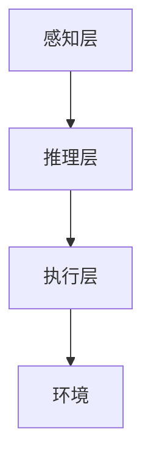

#### 2.2.2 任务管理模块

**功能：** 任务管理模块负责任务的分配、调度和监控。

**架构：**
- **任务池：** 存储待执行的任务。
- **调度器：** 根据任务优先级和资源情况分配任务。
- **监控器：** 监控任务的执行状态，确保任务按时完成。

**流程图：**
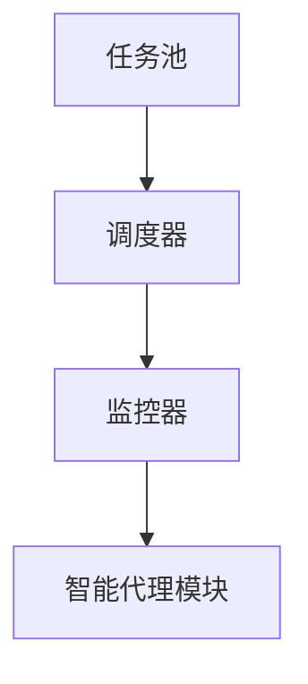

#### 2.2.3 决策支持系统模块

**功能：** 决策支持系统模块为智能代理提供决策支持，帮助它们在复杂环境下做出最优选择。

**架构：**
- **知识库：** 存储相关领域的知识，如业务规则、预测模型等。
- **推理机：** 利用知识库和算法进行推理和决策支持。

**流程图：**
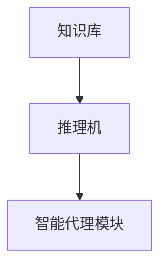

#### 2.2.4 协作平台模块

**功能：** 协作平台模块提供智能代理之间的协作机制，确保它们能够协同工作。

**架构：**
- **通信层：** 提供智能代理之间的通信接口。
- **共享数据层：** 提供共享数据和存储服务。
- **协作算法：** 实现多代理系统的协同算法。

**流程图：**
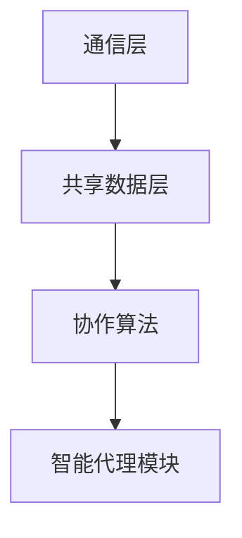

#### 2.2.5 监控与反馈系统模块

**功能：** 监控与反馈系统模块用于实时监控智能代理的工作状态和性能，并提供反馈以优化工作流。

**架构：**
- **监控器：** 实时收集智能代理的工作状态和性能数据。
- **反馈机制：** 根据监控数据提供反馈，优化代理行为和工作流。

**流程图：**
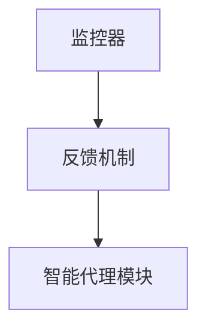

通过上述核心架构的协同工作，Agentic Workflow 实现了高度自动化和智能化的工作流管理。每个模块都有其独特的功能，但它们共同作用，确保系统能够高效、可靠地运行。

### 2.3 智能代理的类型与特点

在 Agentic Workflow 中，智能代理根据其功能和特点可以分为多种类型。以下是几种常见的智能代理类型及其特点：

#### 2.3.1 监控型代理

**特点：**
- **任务执行：** 主要负责监控工作流中的任务执行情况，确保任务按时完成。
- **异常处理：** 检测任务执行过程中的异常情况，并采取相应措施进行恢复。
- **数据收集：** 收集任务执行过程中的性能数据，为优化工作流提供依据。

**应用场景：** 监控型代理广泛应用于制造、物流等需要实时监控和异常处理的场景。

#### 2.3.2 决策型代理

**特点：**
- **决策支持：** 基于环境数据和知识库，为工作流中的决策提供支持。
- **预测分析：** 利用预测模型对环境变化进行预测，为决策提供参考。
- **优化建议：** 提供工作流优化建议，提高工作效率和资源利用率。

**应用场景：** 决策型代理常用于金融、医疗、物流等需要智能决策支持的领域。

#### 2.3.3 协作型代理

**特点：**
- **协作沟通：** 负责与其他代理进行协作，实现协同工作。
- **共享资源：** 管理和分配工作流中的共享资源，如数据、计算资源等。
- **任务调度：** 调度和管理协同工作中的任务，确保高效执行。

**应用场景：** 协作型代理广泛应用于多代理系统、分布式计算等需要协作沟通和资源管理的场景。

#### 2.3.4 学习型代理

**特点：**
- **自适应调整：** 根据任务需求和环境变化，自动调整工作策略和行为。
- **持续学习：** 利用机器学习和深度学习技术，不断优化自身性能和决策能力。
- **经验积累：** 通过历史数据和学习经验，提高工作流管理的效率和效果。

**应用场景：** 学习型代理广泛应用于需要持续学习和优化工作的领域，如智能客服、智能推荐系统等。

通过上述智能代理类型的介绍，我们可以看到，不同类型的智能代理在 Agentic Workflow 中发挥着各自独特的功能，共同实现自动化和智能化的工作流管理。

### 2.4 智能代理的开发框架

智能代理的开发框架是构建高效、可靠的 Agentic Workflow 的关键。以下介绍几种常见的智能代理开发框架及其特点：

#### 2.4.1 JADE

**特点：**
- **开源平台：** JADE（Java Agent Development Framework）是一个基于Java的开源智能代理开发框架。
- **多代理系统支持：** 支持多代理系统的构建和协同工作。
- **移动性：** 智能代理可以在不同节点间移动，实现分布式计算。

**应用场景：** JADE 广泛应用于分布式系统、智能城市等需要多代理协同的场景。

#### 2.4.2 FIPA

**特点：**
- **标准化：** FIPA（Foundation for Intelligent Physical Agents）是一个智能代理标准化组织，定义了智能代理的通信协议和接口。
- **跨平台：** 支持不同编程语言和操作系统，实现跨平台开发。
- **协作机制：** 提供多种协作机制，如消息传递、共享数据和决策支持。

**应用场景：** FIPA 广泛应用于智能交通、智能家居等需要跨平台协作和通信的场景。

#### 2.4.3 BDI

**特点：**
- **信念-愿望-意图：** BDI（Belief-Desire-Intent）模型是智能代理开发的一个经典框架，基于代理的信念、愿望和意图进行决策。
- **自主性：** 强调代理的自主性和自主决策能力。
- **情境感知：** 基于环境感知和情境分析进行智能决策。

**应用场景：** BDI 框架广泛应用于需要高度自主性和情境感知的智能系统，如自动驾驶、智能机器人等。

#### 2.4.4 ARGoS

**特点：**
- **仿真平台：** ARGoS（Agent-based Grid Simulator）是一个基于网格的智能代理仿真平台。
- **可扩展性：** 支持多种智能代理和复杂环境建模，实现高度可扩展的仿真系统。
- **分布式计算：** 支持大规模智能代理系统的分布式计算。

**应用场景：** ARGoS 广泛应用于智能交通、智能电网等需要大规模仿真和分布式计算的领域。

通过以上智能代理开发框架的介绍，我们可以看到，不同框架各有特点，适用于不同应用场景。开发人员可以根据实际需求选择合适的开发框架，构建高效、可靠的智能代理系统。

### 2.5 智能代理开发的主要步骤

开发智能代理是一个复杂而系统化的过程，涉及多个阶段和步骤。以下是智能代理开发的主要步骤，以及每个步骤的具体内容和注意事项：

#### 2.5.1 需求分析

**内容：** 需求分析是智能代理开发的起点，旨在明确系统功能和性能要求。这一步骤包括：

- **功能需求：** 确定智能代理需要执行的任务和功能，如任务执行、决策支持、协作等。
- **性能需求：** 确定智能代理的性能指标，如响应时间、吞吐量、准确性等。
- **约束条件：** 分析系统运行的环境和约束条件，如操作系统、硬件资源、网络带宽等。

**注意事项：** 需求分析应确保全面、准确，避免在后续开发过程中出现需求变更和功能缺失。

#### 2.5.2 设计与建模

**内容：** 设计与建模是智能代理开发的核心阶段，包括：

- **架构设计：** 根据需求分析结果，设计智能代理的整体架构，包括感知层、推理层、执行层等。
- **模块划分：** 将智能代理的功能划分为多个模块，如感知模块、推理模块、执行模块等。
- **数据模型：** 设计智能代理所需的数据结构，如知识库、状态变量、任务队列等。

**注意事项：** 设计与建模应注重模块化、可扩展性和易维护性，确保系统能够适应未来的变化和扩展。

#### 2.5.3 编码与实现

**内容：** 编码与实现是将设计与模型转化为实际代码的过程，包括：

- **代码编写：** 根据设计文档和模块划分，编写智能代理的源代码。
- **接口定义：** 设计和实现智能代理的接口，如API、消息队列等。
- **算法实现：** 实现智能代理的核心算法，如决策算法、优化算法、学习算法等。

**注意事项：** 编码与实现应遵循编码规范和最佳实践，确保代码的可读性和可维护性。

#### 2.5.4 测试与调试

**内容：** 测试与调试是确保智能代理功能正确、性能稳定的关键步骤，包括：

- **单元测试：** 对智能代理的各个模块进行单元测试，确保模块功能的正确性。
- **集成测试：** 对智能代理的整体功能进行集成测试，确保模块间的协同工作。
- **性能测试：** 对智能代理的性能进行测试，确保满足性能需求。
- **调试与优化：** 根据测试结果对智能代理进行调试和优化，解决性能瓶颈和功能缺陷。

**注意事项：** 测试与调试应全面、细致，确保智能代理在多种环境和场景下都能稳定运行。

#### 2.5.5 部署与运维

**内容：** 部署与运维是将智能代理部署到实际环境中，并进行持续监控和维护的过程，包括：

- **部署：** 将智能代理部署到服务器或集群中，确保系统可正常运行。
- **监控：** 监控智能代理的工作状态和性能，确保系统稳定运行。
- **维护：** 定期对智能代理进行维护和更新，解决潜在问题和漏洞。

**注意事项：** 部署与运维应确保智能代理的可扩展性和容错性，以应对环境变化和负载波动。

通过以上智能代理开发的主要步骤，我们可以确保智能代理系统的高效、可靠和稳定运行。在接下来的章节中，我们将深入探讨智能代理的核心算法和实现细节。

### 2.6 智能代理的核心算法

智能代理的核心算法是实现其智能行为的关键。以下介绍几种常见的核心算法，包括代理行为决策算法和代理学习能力。

#### 2.6.1 代理行为决策算法

代理行为决策算法用于确定智能代理在特定环境下应执行的行为。以下是两种常见的决策算法：

1. **Q-Learning（Q值学习）**

**原理：** Q-Learning 是一种基于值函数的强化学习算法，通过学习状态-行为价值函数（Q值）来决策。

**公式：**
$$
Q(s, a) = Q(s, a) + \alpha [r + \gamma \max_{a'} Q(s', a') - Q(s, a)]
$$

其中，$s$ 表示当前状态，$a$ 表示当前行为，$r$ 表示即时奖励，$\gamma$ 表示折扣因子，$\alpha$ 表示学习率。

**伪代码：**
```pseudo
initialize Q(s, a)
for each episode:
    s = environment.reset()
    while not done:
        a = policy(s)
        s', r = environment.step(a)
        Q(s, a) = Q(s, a) + alpha [r + gamma max_{a'} Q(s', a') - Q(s, a)]
        s = s'
```

2. **Deep Q-Network（DQN，深度Q网络）**

**原理：** DQN 是一种基于神经网络的强化学习算法，通过训练神经网络来近似状态-行为价值函数。

**网络结构：**
- **输入层：** 接收状态特征。
- **隐藏层：** 通过多层神经网络进行特征提取和组合。
- **输出层：** 输出状态-行为价值函数的估计值。

**训练过程：**
- **经验回放：** 将历史经验（状态、行为、奖励、下一个状态）存储在经验池中。
- **训练神经网络：** 使用经验池中的经验进行神经网络训练，更新网络权重。

**伪代码：**
```pseudo
initialize DQN
for each episode:
    s = environment.reset()
    while not done:
        a = DQN.predict_action(s)
        s', r = environment.step(a)
        DQN.update_replay_memory(s, a, r, s')
        DQN.train()
        s = s'
```

#### 2.6.2 代理学习能力

代理学习能力是指智能代理在执行任务过程中，通过学习和适应不断提高自身性能的能力。以下是两种常见的代理学习能力：

1. **经验重放（Experience Replay）**

**原理：** 经验重放是一种用于缓解强化学习样本波动的方法，通过将历史经验存储在经验池中，随机抽样进行训练。

**优点：**
- **减少样本波动：** 避免训练过程受到近期经验的过度影响。
- **增强稳定性：** 提高训练过程的稳定性和收敛性。

2. **深度强化学习（Deep Reinforcement Learning，DRL）**

**原理：** DRL 是一种结合深度学习和强化学习的算法，通过训练深度神经网络来近似状态-行为价值函数或策略。

**应用场景：**
- **复杂环境：** 处理具有高维状态空间和复杂行为空间的任务。
- **动态环境：** 适应动态变化的环境和策略。

通过上述代理行为决策算法和代理学习能力的介绍，我们可以看到智能代理在决策和学习过程中具有高度的灵活性和适应性。这些算法和能力的实现，为智能代理在 Agentic Workflow 中发挥关键作用提供了坚实的基础。

### 2.7 小结

本章详细介绍了 Agentic Workflow 的基础概念，包括智能代理和工作流的基本概念。通过探讨智能代理的定义、功能、类型以及开发框架，我们了解了智能代理在 Agentic Workflow 中的关键作用。此外，我们还介绍了智能代理的核心算法和学习能力，这些算法和能力的实现使得智能代理能够在复杂环境中做出智能决策和持续学习。在下一章中，我们将深入探讨 Agentic Workflow 的数学模型与算法，进一步理解其工作原理和设计方法。

---

## 第3章 智能代理的设计与实现

在深入了解了 Agentic Workflow 的基础概念之后，本章将重点探讨智能代理的设计与实现。智能代理是 Agentic Workflow 的核心组成部分，其设计直接影响到工作流的管理效率、灵活性和适应性。在这一章中，我们将从开发框架、核心算法和实现步骤三个方面详细阐述智能代理的设计与实现过程。

### 3.1 智能代理开发框架

智能代理的开发框架是构建智能代理系统的基本结构，它决定了智能代理的功能、性能和扩展性。以下介绍几种常见的智能代理开发框架：

#### 3.1.1 BDI框架

**特点：**
- **信念-愿望-意图模型：** BDI框架基于信念、愿望和意图三个核心概念，分别对应智能代理的状态感知、决策和行动。
- **模块化设计：** BDI框架将智能代理的功能划分为信念模块、愿望模块和意图模块，便于实现和扩展。

**应用场景：**
- **自主决策：** 需要高度自主性和决策能力的智能代理系统，如自动驾驶、智能机器人等。

**示例：**
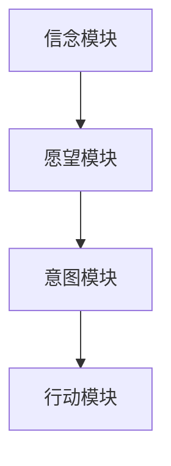

#### 3.1.2 FIPA框架

**特点：**
- **标准化接口：** FIPA框架定义了智能代理之间的标准通信协议和接口，支持跨平台和跨语言的智能代理协作。
- **灵活的通信机制：** FIPA框架提供多种通信机制，如消息传递、共享数据和协同算法，实现智能代理之间的有效协作。

**应用场景：**
- **多代理系统：** 需要多个智能代理协同工作完成复杂任务的系统，如智能交通、智能电网等。

**示例：**
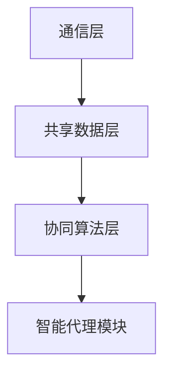

#### 3.1.3 JADE框架

**特点：**
- **开源平台：** JADE框架是一个基于Java的开源智能代理开发平台，提供丰富的工具和库支持。
- **移动性和分布式计算：** JADE框架支持智能代理的移动性和分布式计算，适用于大规模分布式系统。

**应用场景：**
- **分布式系统：** 需要智能代理在分布式系统中执行任务和协作，如物联网、云计算等。

**示例：**
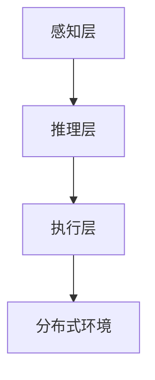

#### 3.1.4 ARGoS框架

**特点：**
- **仿真平台：** ARGoS框架是一个基于网格的智能代理仿真平台，支持大规模智能代理系统的建模和仿真。
- **可扩展性：** ARGoS框架提供多种智能代理和复杂环境建模工具，实现高度可扩展的仿真系统。

**应用场景：**
- **仿真与测试：** 用于智能代理系统的仿真测试和性能评估，如智能交通仿真、智能电网仿真等。

**示例：**
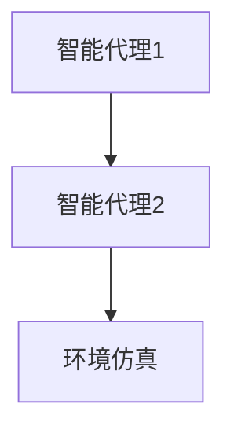

通过以上开发框架的介绍，我们可以根据具体需求选择合适的框架进行智能代理的开发。接下来，我们将深入探讨智能代理的核心算法，这些算法是实现智能代理智能行为的关键。

### 3.2 智能代理的核心算法

智能代理的核心算法决定了其智能行为的实现，包括决策算法、优化算法和学习算法。以下介绍几种常见的核心算法：

#### 3.2.1 决策算法

决策算法是智能代理在特定环境下选择最优行动的算法。以下介绍几种常见的决策算法：

1. **马尔可夫决策过程（MDP）**

**原理：**
- **状态-行动价值函数：** 通过状态-行动价值函数来评估不同行动在当前状态下的价值。
- **策略迭代：** 通过策略迭代方法，找到最优策略。

**公式：**
$$
V(s) = \sum_{a \in A} \gamma (R(s, a) + \gamma V(s'))
$$

**伪代码：**
```pseudo
initialize V(s)
for each episode:
    s = environment.reset()
    while not done:
        a = policy(s)
        s', r = environment.step(a)
        V(s) = V(s) + alpha [r + gamma V(s') - V(s)]
        s = s'
```

2. **部分可观测马尔可夫决策过程（POMDP）**

**原理：**
- **部分可观测性：** 状态部分可观测，需要利用贝叶斯推理来更新状态估计。
- **策略迭代：** 通过策略迭代方法，找到最优策略。

**公式：**
$$
P(s'|s, a) = \sum_{o} p(o|s', a) p(s'|s) p(a|s)
$$

**伪代码：**
```pseudo
initialize P(s)
for each episode:
    s = environment.reset()
    while not done:
        a = policy(s)
        s', o = environment.step(a)
        P(s') = P(s') + alpha [P(s) - P(s')]
        P(s) = P(s) * P(s'|s, a)
        s = s'
```

3. **深度强化学习（DRL）**

**原理：**
- **神经网络：** 使用神经网络来近似状态-行动价值函数或策略。
- **经验回放：** 通过经验回放来缓解样本波动，提高训练稳定性。

**网络结构：**
- **输入层：** 接收状态特征。
- **隐藏层：** 通过多层神经网络进行特征提取和组合。
- **输出层：** 输出状态-行动价值函数或策略的估计值。

**训练过程：**
- **经验回放：** 将历史经验（状态、行动、奖励、下一个状态）存储在经验池中。
- **训练神经网络：** 使用经验池中的经验进行神经网络训练，更新网络权重。

**伪代码：**
```pseudo
initialize DQN
for each episode:
    s = environment.reset()
    while not done:
        a = DQN.predict_action(s)
        s', r = environment.step(a)
        DQN.update_replay_memory(s, a, r, s')
        DQN.train()
        s = s'
```

#### 3.2.2 优化算法

优化算法用于求解智能代理在不同任务场景下的最优解。以下介绍几种常见的优化算法：

1. **遗传算法（GA）**

**原理：**
- **种群演化：** 通过选择、交叉和变异操作，不断演化种群以找到最优解。
- **适应度函数：** 评估个体的适应度，指导种群的演化方向。

**步骤：**
- **初始化种群：** 随机生成初始种群。
- **适应度评估：** 计算每个个体的适应度。
- **选择操作：** 根据适应度选择优秀个体。
- **交叉操作：** 将优秀个体进行交叉生成新个体。
- **变异操作：** 对部分个体进行变异操作。
- **更新种群：** 将新个体加入种群，重复适应度评估和选择操作。

2. **粒子群优化（PSO）**

**原理：**
- **粒子群：** 粒子群由多个粒子组成，每个粒子代表一个潜在解。
- **速度更新：** 根据自身历史最优解和群体历史最优解，更新粒子的速度和位置。

**步骤：**
- **初始化粒子群：** 随机生成初始粒子群。
- **评估适应度：** 计算每个粒子的适应度。
- **速度更新：** 根据个体历史最优解和群体历史最优解更新粒子的速度。
- **位置更新：** 根据粒子的速度更新粒子的位置。
- **更新最优解：** 更新个体历史最优解和群体历史最优解。
- **迭代过程：** 重复评估适应度和位置更新，直到满足终止条件。

3. **强化学习（RL）**

**原理：**
- **状态-行动价值函数：** 通过学习状态-行动价值函数，指导智能代理在特定状态下选择最优行动。
- **策略迭代：** 通过策略迭代方法，不断优化智能代理的行为策略。

**步骤：**
- **初始化：** 初始化智能代理的参数和状态。
- **行动选择：** 根据当前状态选择最优行动。
- **环境交互：** 智能代理与环境进行交互，获取奖励信号。
- **更新价值函数：** 根据奖励信号更新状态-行动价值函数。
- **迭代过程：** 重复行动选择和环境交互，不断优化智能代理的行为。

#### 3.2.3 学习算法

学习算法用于智能代理在执行任务过程中不断学习和优化自身性能。以下介绍几种常见的学习算法：

1. **监督学习（SL）**

**原理：**
- **训练数据：** 使用标记好的训练数据集，训练智能代理的模型。
- **预测模型：** 通过训练得到的模型，预测新数据。

**步骤：**
- **数据预处理：** 对训练数据进行清洗、归一化等预处理。
- **模型训练：** 使用训练数据训练智能代理的模型。
- **模型评估：** 使用测试数据评估模型的性能。
- **模型优化：** 根据评估结果对模型进行优化。

2. **无监督学习（UL）**

**原理：**
- **未标记数据：** 使用未标记的数据集，训练智能代理的模型。
- **特征提取：** 通过模型自动提取数据特征。

**步骤：**
- **数据预处理：** 对数据集进行清洗和预处理。
- **模型训练：** 使用无监督学习算法训练智能代理的模型。
- **特征提取：** 使用训练好的模型提取数据特征。
- **特征分析：** 对提取的特征进行分析和应用。

3. **半监督学习（SUL）**

**原理：**
- **混合数据：** 使用标记和未标记的数据集，训练智能代理的模型。

**步骤：**
- **数据预处理：** 对数据集进行清洗、归一化等预处理。
- **模型训练：** 使用标记和未标记的数据训练智能代理的模型。
- **模型评估：** 使用测试数据评估模型的性能。
- **模型优化：** 根据评估结果对模型进行优化。

通过以上对智能代理的核心算法的介绍，我们可以看到，智能代理的设计与实现是一个复杂而系统化的过程。这些算法和框架的实现，为智能代理在 Agentic Workflow 中发挥关键作用提供了坚实的基础。在接下来的章节中，我们将进一步探讨工作流的定义与设计，为全面理解 Agentic Workflow 的架构奠定基础。

### 3.3 智能代理的实现细节

在实际实现智能代理时，我们需要关注以下几个关键细节，以确保系统的性能、可扩展性和可靠性。

#### 3.3.1 环境感知

环境感知是智能代理获取外部信息的过程。为了实现高效的环境感知，我们需要考虑以下几个方面：

1. **传感器选择：** 根据应用场景选择合适的传感器，如摄像头、麦克风、温度传感器等。确保传感器的数据质量和实时性。
2. **数据处理：** 对传感器数据进行预处理，如去噪、归一化和特征提取。预处理后的数据将用于后续的推理和决策过程。
3. **数据缓存：** 为了提高数据读取速度，可以将常用的传感器数据缓存到内存中，减少对传感器的频繁读取。

#### 3.3.2 推理与决策

推理与决策是智能代理的核心功能，涉及以下几个关键步骤：

1. **状态表示：** 使用适当的表示方法（如状态图、特征向量等）表示当前环境状态，以便进行有效的推理和决策。
2. **推理算法：** 根据应用场景选择合适的推理算法（如决策树、神经网络等）。对于复杂决策问题，可以采用组合算法，如混合推理方法。
3. **决策支持：** 利用推理结果为智能代理提供决策支持，如选择最优行动、优化路径等。

#### 3.3.3 行动执行

行动执行是智能代理根据决策结果执行实际操作的过程。为了确保行动执行的高效性和可靠性，我们需要注意以下几个方面：

1. **行动规划：** 在执行行动前，制定详细的行动计划，包括行动步骤、资源和时间分配等。
2. **资源管理：** 确保智能代理在执行行动时，能够合理管理和分配资源，如计算资源、存储资源和通信资源。
3. **错误处理：** 针对执行过程中可能出现的错误和异常，设计合理的错误处理机制，如回滚操作、重试机制等。

#### 3.3.4 学习与适应

学习与适应是智能代理持续优化自身性能的过程。为了实现有效的学习和适应，我们需要考虑以下几个方面：

1. **数据收集：** 收集执行过程中的数据，如行动结果、错误记录等，用于分析和改进。
2. **反馈机制：** 设计有效的反馈机制，将执行结果和用户反馈转化为改进建议，如调整决策规则、优化行动策略等。
3. **模型更新：** 根据收集的数据和反馈，定期更新智能代理的模型和算法，以适应环境变化和任务需求。

#### 3.3.5 实现示例

以下是一个简单的智能代理实现示例，用于实现一个基于传感器数据的自动化监控系统：

**1. 环境感知：**
```python
import cv2

# 初始化摄像头
cap = cv2.VideoCapture(0)

while True:
    # 读取摄像头帧
    ret, frame = cap.read()
    if not ret:
        break

    # 对帧进行预处理
    processed_frame = preprocess_frame(frame)

    # 更新环境状态
    state = update_state(processed_frame)

    # 推理与决策
    action = decision_system(state)

    # 行动执行
    execute_action(action)

    # 等待下一帧
    time.sleep(0.01)

# 释放摄像头资源
cap.release()
```

**2. 推理与决策：**
```python
import numpy as np

def decision_system(state):
    # 根据状态选择行动
    if state['temperature'] > 35:
        return 'cool'
    elif state['humidity'] > 80:
        return 'dehumidify'
    else:
        return 'keep'
```

**3. 行动执行：**
```python
def execute_action(action):
    if action == 'cool':
        # 启动空调
        turn_on_ac()
    elif action == 'dehumidify':
        # 启动除湿器
        turn_on_dehumidifier()
    elif action == 'keep':
        # 保持当前状态
        keep_current_state()
```

通过以上示例，我们可以看到，智能代理的实现涉及环境感知、推理与决策、行动执行等多个方面。在实际应用中，智能代理的实现会更加复杂，需要根据具体需求进行设计和调整。

### 3.4 智能代理的性能优化

智能代理的性能优化是确保其高效、稳定运行的关键。以下介绍几种常见的性能优化方法：

#### 3.4.1 多线程与并行处理

为了提高智能代理的处理速度，可以采用多线程和并行处理技术。具体方法包括：

1. **多线程：** 使用多个线程同时处理多个任务，减少任务等待时间。
2. **并行处理：** 使用多核处理器或分布式计算资源，同时处理多个任务或数据。

#### 3.4.2 缓存与预加载

通过缓存与预加载技术，可以减少系统对实时数据的依赖，提高处理速度。具体方法包括：

1. **缓存：** 将常用的数据或计算结果缓存到内存或硬盘上，减少重复计算。
2. **预加载：** 在需要处理之前，提前加载相关数据或资源，减少处理时间。

#### 3.4.3 资源管理

优化智能代理的资源管理，可以提高其稳定性和性能。具体方法包括：

1. **内存管理：** 合理分配和释放内存，避免内存泄漏。
2. **计算资源：** 根据任务需求和资源情况，合理分配计算资源，避免资源浪费。
3. **网络通信：** 优化网络通信，减少数据传输延迟和带宽消耗。

#### 3.4.4 算法优化

优化智能代理的算法，可以提高其处理效率和准确性。具体方法包括：

1. **算法选择：** 根据任务需求和数据特点，选择合适的算法。
2. **算法优化：** 对现有算法进行优化，如减少计算复杂度、提高收敛速度等。

#### 3.4.5 实际案例

以下是一个智能代理性能优化的实际案例：

**问题：** 一个智能监控系统需要在1秒内处理完所有摄像头帧。

**解决方案：**
1. **多线程处理：** 使用多线程技术，同时处理多个摄像头帧，提高处理速度。
2. **缓存预处理数据：** 将预处理后的摄像头帧数据缓存到内存中，减少重复计算。
3. **优化算法：** 采用快速特征提取算法，提高处理速度。

通过以上优化方法，智能监控系统成功在1秒内处理完所有摄像头帧，达到了预期的性能要求。

### 3.5 智能代理在Agentic Workflow中的作用

智能代理在 Agentic Workflow 中发挥着关键作用，其设计、实现和性能优化直接影响工作流的管理效率和效果。以下是智能代理在 Agentic Workflow 中的具体作用：

#### 3.5.1 自动化任务处理

智能代理能够自动化执行各种任务，如数据采集、处理和分析等。通过自动化任务处理，可以大大减少人工干预，提高工作效率。

#### 3.5.2 智能决策支持

智能代理通过推理和决策支持系统，为工作流中的决策提供支持。例如，在制造行业中，智能代理可以基于实时数据，自动调整生产计划和设备运行参数，提高生产效率。

#### 3.5.3 自适应调整

智能代理能够根据环境变化和任务需求进行自适应调整，以保持工作效率。例如，在智能交通系统中，智能代理可以实时调整交通信号，优化交通流量。

#### 3.5.4 协作与沟通

智能代理通过协作平台与其他代理进行沟通和协作，实现协同工作。例如，在金融行业中，智能代理可以协同工作，自动完成投资组合管理和风险评估。

#### 3.5.5 监控与反馈

智能代理能够实时监控工作流中的任务执行情况和性能，并提供反馈以优化工作流。例如，在医疗诊断系统中，智能代理可以监控诊断过程，并根据反馈调整诊断策略。

通过以上智能代理在 Agentic Workflow 中的具体作用，我们可以看到，智能代理的设计与实现对于工作流管理的重要性。在接下来的章节中，我们将进一步探讨工作流的定义与设计，为全面理解 Agentic Workflow 的架构奠定基础。

### 3.6 小结

本章详细介绍了智能代理的设计与实现，从开发框架、核心算法到实现细节，全面阐述了智能代理的构建方法。智能代理在 Agentic Workflow 中发挥着关键作用，其自动化任务处理、智能决策支持、自适应调整、协作与沟通以及监控与反馈等功能，使得工作流管理更加高效、智能和灵活。在下一章中，我们将深入探讨工作流的定义与设计，进一步理解 Agentic Workflow 的架构和实现方法。

---

## 第4章 工作流的定义与设计

在了解了智能代理的设计与实现之后，本章将重点探讨工作流的定义与设计。工作流是 Agentic Workflow 的核心概念之一，它定义了任务的执行顺序、任务之间的关系以及任务之间的数据流。一个良好的工作流设计能够提高任务执行的效率、降低错误率，并确保整个系统能够稳定运行。在本章中，我们将详细阐述工作流的基本概念、分类以及设计方法论。

### 4.1 工作流的定义与分类

#### 4.1.1 工作流的定义

**定义：** 工作流（Workflow）是一系列任务和活动的有序集合，这些任务和活动共同完成一个特定的业务目标。工作流通常包括任务的输入、执行、输出以及任务之间的逻辑关系。

**核心概念：**
- **任务（Task）：** 任务是工作流中的基本操作单元，它可以是一个简单的操作，也可以是一个复杂的处理过程。
- **活动（Activity）：** 活动是工作流中的一个环节，通常由一个或多个任务组成。活动是工作流中能够被独立调度和执行的部分。
- **流程（Process）：** 流程是一组相关活动的有序组合，它们共同完成一个业务目标。流程可以是简单的线性流程，也可以是复杂的分支和循环结构。
- **流程实例（Process Instance）：** 流程实例是工作流在执行过程中的具体实例，表示流程在某一时刻的状态。

#### 4.1.2 工作流的分类

工作流可以根据其结构、执行方式和技术实现等多种维度进行分类。以下是几种常见的工作流分类方法：

1. **按结构分类：**
   - **线性工作流：** 任务依次执行，每个任务完成后进入下一个任务。
   - **分支工作流：** 任务之间存在分支结构，根据条件选择不同的分支路径。
   - **循环工作流：** 任务可以重复执行，直到满足特定条件或达到目标。

2. **按执行方式分类：**
   - **顺序执行：** 任务按照既定的顺序依次执行，直到流程结束。
   - **并行执行：** 多个任务可以同时执行，任务之间可能存在依赖关系。
   - **事件驱动执行：** 任务执行基于事件触发，如消息到达、条件满足等。

3. **按技术实现分类：**
   - **基于规则的流程：** 使用预定义的规则来控制任务的执行，适用于规则明确、结构简单的工作流。
   - **基于过程的流程：** 使用流程图或类似的图形化工具来设计工作流，适用于复杂、多变的工作流。
   - **基于事件的流程：** 使用事件驱动的方式设计工作流，适用于高度动态和灵活的工作流。

### 4.2 工作流设计方法论

设计一个高效、稳定的工作流需要对业务需求、技术实现和用户交互等多个方面进行全面考虑。以下介绍几种常见的工作流设计方法论：

#### 4.2.1 业务流程建模

业务流程建模是一种基于业务需求进行工作流设计的方法，其核心步骤包括：

1. **需求分析：** 确定业务目标和需求，识别关键业务过程和任务。
2. **流程图设计：** 使用流程图工具（如BPMN、UML等）设计工作流的流程图，明确任务、活动和流程之间的关系。
3. **流程优化：** 对流程进行分析和优化，提高流程的效率和稳定性。

#### 4.2.2 流程建模工具

流程建模工具是工作流设计过程中常用的工具，以下介绍几种常见的工作流建模工具：

1. **BPMN（Business Process Model and Notation）：** BPMN是一种标准化的流程建模语言，适用于设计复杂的工作流。
2. **UML（Unified Modeling Language）：** UML提供了一系列的图和符号，用于描述系统架构和工作流程。
3. **BP-DSL（Business Process Design Language）：** BP-DSL是一种自定义的流程建模语言，可以根据具体需求进行设计。

#### 4.2.3 流程设计原则

在进行工作流设计时，需要遵循以下原则：

1. **模块化设计：** 将工作流划分为多个模块，每个模块实现一个特定功能，便于维护和扩展。
2. **灵活性：** 设计工作流时，应考虑未来的变化和扩展，确保系统能够适应业务需求的变化。
3. **稳定性：** 设计工作流时，应确保任务执行的正确性和可靠性，避免出现错误和异常。
4. **可扩展性：** 设计工作流时，应考虑系统的可扩展性，以便在未来增加新的功能或任务。

#### 4.2.4 流程设计案例

以下是一个简单的工作流设计案例，用于说明工作流设计的具体步骤和方法：

1. **需求分析：** 确定工作流的业务目标，如订单处理流程，包括订单创建、订单审核、订单发货等任务。
2. **流程图设计：** 使用BPMN工具设计订单处理流程的流程图，明确每个任务的输入、输出和执行顺序。
3. **流程优化：** 对流程进行分析和优化，如通过并行执行减少订单处理时间，提高系统效率。
4. **实现与部署：** 根据流程图设计，实现工作流管理系统，并将其部署到生产环境中。

通过以上案例，我们可以看到，工作流设计是一个系统化、规范化的过程，需要综合考虑业务需求、技术实现和用户体验等多个方面。一个良好的工作流设计能够提高任务执行效率、降低错误率，并为系统的稳定运行提供保障。

### 4.3 工作流的设计流程

设计一个高效的工作流需要经过多个阶段，以下是一个典型的工作流设计流程：

#### 4.3.1 需求分析

需求分析是工作流设计的起点，其主要任务包括：

- **业务需求分析：** 确定工作流的业务目标和需求，识别关键业务过程和任务。
- **用户需求分析：** 了解用户对工作流的需求，如用户体验、操作便捷性等。
- **数据需求分析：** 确定工作流所需的数据类型、数据结构和数据流。

#### 4.3.2 流程图设计

流程图设计是将业务需求转化为可视化的工作流模型的过程，其主要步骤包括：

- **绘制流程图：** 使用流程建模工具（如BPMN）绘制工作流的流程图，明确每个任务的输入、输出和执行顺序。
- **验证流程图：** 对流程图进行验证，确保其符合业务需求和用户需求。
- **优化流程图：** 对流程图进行优化，提高流程的效率和稳定性。

#### 4.3.3 流程编码与实现

流程编码与实现是将流程图转化为可执行代码的过程，其主要任务包括：

- **定义流程变量：** 根据流程图，定义流程中的变量和数据结构。
- **编写流程代码：** 使用工作流引擎或编程语言，编写工作流的具体实现代码。
- **测试与调试：** 对流程代码进行测试和调试，确保其正确性和可靠性。

#### 4.3.4 部署与运维

部署与运维是将工作流系统部署到实际环境中，并进行监控和维护的过程，其主要任务包括：

- **部署：** 将工作流系统部署到服务器或集群中，确保其可正常运行。
- **监控：** 监控工作流系统的运行状态和性能，确保其稳定运行。
- **维护：** 定期对工作流系统进行维护和升级，解决潜在问题和漏洞。

#### 4.3.5 用户培训与支持

用户培训与支持是确保用户能够熟练使用工作流系统的过程，其主要任务包括：

- **用户培训：** 对用户进行工作流系统的操作培训，提高用户的使用熟练度。
- **用户支持：** 提供用户支持服务，解答用户在使用过程中遇到的问题。

通过以上工作流设计流程，我们可以确保工作流系统能够满足业务需求，提高任务执行效率，并为用户提供良好的使用体验。

### 4.4 工作流建模方法

工作流建模是工作流设计的关键步骤，它将业务需求和流程逻辑转化为可视化的模型。以下介绍几种常见的工作流建模方法：

#### 4.4.1 业务流程建模（BPMN）

**定义：** 业务流程建模（BPMN，Business Process Model and Notation）是一种标准化的流程建模方法，用于描述业务流程的结构、活动和任务。

**优点：**
- **直观性：** BPMN提供了丰富的符号和图例，使得流程设计更加直观和易于理解。
- **标准化：** BPMN是一种国际标准，支持多种工具和平台的使用。

**示例：**
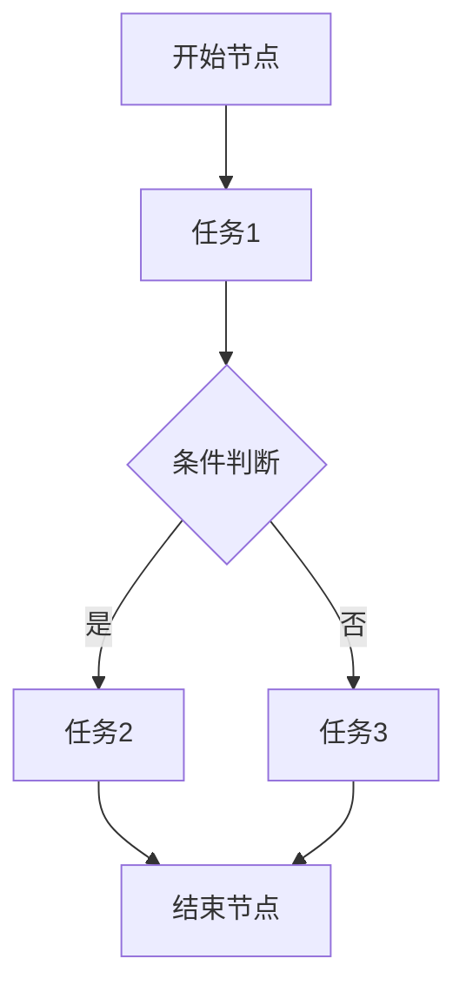

#### 4.4.2 UML建模

**定义：** UML（Unified Modeling Language）是一种通用的建模语言，用于描述系统架构、组件关系和动态行为。

**优点：**
- **灵活性：** UML可以用于各种类型的系统建模，包括工作流、软件架构、数据库设计等。
- **可视化：** UML图直观地展示了系统结构和组件关系，便于理解和沟通。

**示例：**
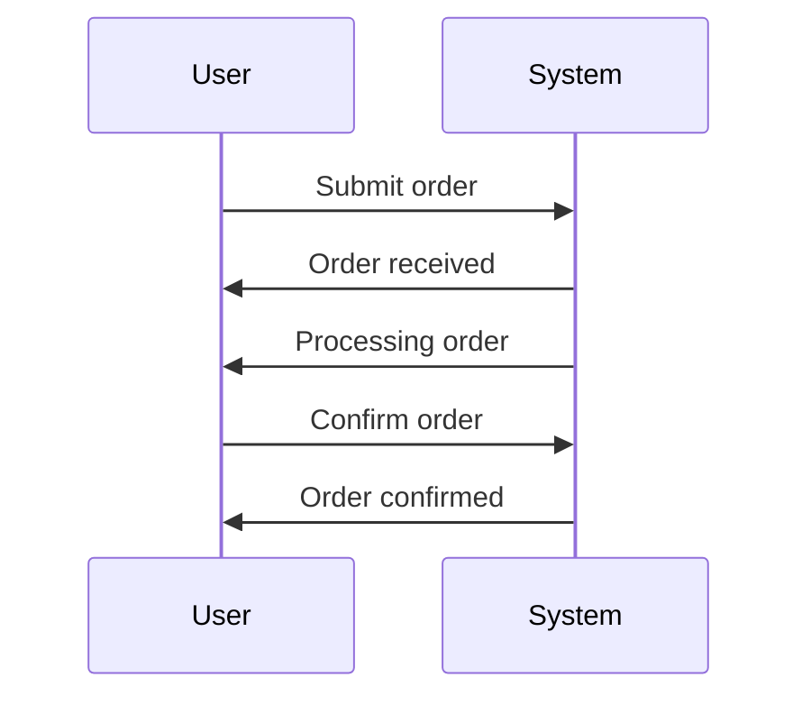

#### 4.4.3 Petri网

**定义：** Petri网是一种用于描述并行系统的数学建模方法，特别适用于工作流和并发系统的建模。

**优点：**
- **并发性：** Petri网可以描述并行和并发系统的行为，适用于复杂的工作流建模。
- **灵活性：** Petri网支持多种扩展和组合，适用于不同类型的系统建模。

**示例：**
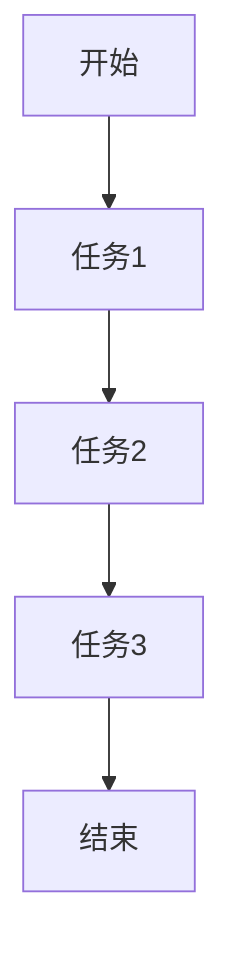

通过以上工作流建模方法的介绍，我们可以根据具体需求选择合适的建模方法，构建高效、稳定的工作流系统。

### 4.5 小结

本章详细介绍了工作流的定义、分类、设计方法论和建模方法。我们首先明确了工作流的基本概念和分类方法，然后阐述了工作流设计的方法论和具体步骤。通过讨论常见的工作流建模方法，我们了解了如何将业务需求和流程逻辑转化为可视化的模型。这些内容为理解和设计 Agentic Workflow 的工作流部分提供了坚实的基础。在下一章中，我们将进一步探讨 Agentic Workflow 的数学模型与算法，深入理解其工作原理和实现方法。

---

## 第5章 Agentic Workflow 的数学模型与算法

在深入探讨了智能代理和工作流的概念之后，本章将重点关注 Agentic Workflow 的数学模型与算法。数学模型和算法是 Agentic Workflow 的基础，它们提供了智能决策和自动化执行的理论依据。在本章中，我们将介绍几种常见的数学模型和算法，并详细解释它们的工作原理和实现方法。

### 5.1 数学模型

数学模型是 Agentic Workflow 的重要组成部分，它们用于描述系统状态、行为和决策过程。以下是两种常见的数学模型：马尔可夫决策过程（MDP）和部分可观测马尔可夫决策过程（POMDP）。

#### 5.1.1 马尔可夫决策过程（MDP）

**定义：** 马尔可夫决策过程（MDP，Markov Decision Process）是一个数学模型，用于描述智能代理在不确定环境中进行决策的过程。MDP由以下要素组成：

- **状态集（S）：** 系统可能处于的所有状态集合。
- **行动集（A）：** 智能代理可以选择的所有行动集合。
- **状态转移概率矩阵（P）：** 描述在特定状态下执行特定行动后，系统转移到其他状态的概率。
- **奖励函数（R）：** 描述在特定状态下执行特定行动后，智能代理获得的即时奖励。

**数学模型：**
$$
P(s' | s, a) = p(s'|s, a)
$$
$$
R(s, a) = r(s, a)
$$

其中，$s'$ 表示下一个状态，$a$ 表示当前行动，$P(s'|s, a)$ 表示从状态 $s$ 执行行动 $a$ 后转移到状态 $s'$ 的概率，$R(s, a)$ 表示在状态 $s$ 执行行动 $a$ 后获得的即时奖励。

**算法讲解：** 策略迭代算法和值迭代算法是解决 MDP 的两种常见算法。

1. **策略迭代算法（Policy Iteration）：**
   - **初始化：** 初始策略 $\pi_0$ 可以是任意策略。
   - **评估：** 根据当前策略计算值函数 $V^k(s) = \sum_a \pi(a|s) \cdot [R(s, a) + \gamma \sum_{s'} P(s'|s, a) \cdot V^k(s')]$
   - **策略更新：** 根据更新后的值函数 $V^{k+1}$，选择最优策略 $\pi_{k+1}$。
   - **重复步骤2和3，直到策略收敛。

2. **值迭代算法（Value Iteration）：**
   - **初始化：** 初始值函数 $V^0(s) = 0$
   - **迭代：** 对每个状态 $s$，更新值函数 $V^{k+1}(s) = \max_a [R(s, a) + \gamma \sum_{s'} P(s'|s, a) \cdot V^k(s')]$
   - **重复步骤2，直到值函数收敛。

#### 5.1.2 部分可观测马尔可夫决策过程（POMDP）

**定义：** 部分可观测马尔可夫决策过程（POMDP，Partially Observable Markov Decision Process）是 MDP 的一种扩展，它考虑了系统的状态部分可观测性。POMDP 由以下要素组成：

- **状态集（S）：** 系统可能处于的所有状态集合。
- **观察集（O）：** 系统可能观察到的所有观察集合。
- **行动集（A）：** 智能代理可以选择的所有行动集合。
- **状态转移概率矩阵（P）：** 描述在特定状态下执行特定行动后，系统转移到其他状态的概率。
- **观测概率矩阵（Q）：** 描述在特定状态下执行特定行动后，系统产生特定观察的概率。
- **奖励函数（R）：** 描述在特定状态下执行特定行动后，智能代理获得的即时奖励。

**数学模型：**
$$
P(s' | s, a) = p(s'|s, a)
$$
$$
Q(o | s', a) = q(o|s', a)
$$
$$
R(s, a) = r(s, a)
$$

**算法讲解：** POMDP 的算法通常基于递归算法，如贝叶斯滤波和贝尔曼方程。

1. **递归算法（Recursive Algorithm）：**
   - **初始化：** 初始信念分布 $b^0(o) = 1/O$
   - **迭代：** 对每个观察 $o_t$，更新信念分布 $b^{t+1}(s) = \sum_{s'} P(s'|s, a) \cdot Q(o_t|s', a) \cdot b^t(s')$
   - **决策：** 根据信念分布 $b^t(s)$，选择最优行动 $a_t = \arg\max_a [R(s, a) + \gamma \sum_{s'} P(s'|s, a) \cdot b^t(s')]$
   - **重复步骤2和3，直到策略收敛。

### 5.2 算法讲解

本节将详细介绍策略迭代算法和值迭代算法，并使用伪代码进行说明。

#### 5.2.1 策略迭代算法

**伪代码：**
```pseudo
initialize V(s)
for each episode:
    s = environment.reset()
    while not done:
        a = policy(s)
        s', r = environment.step(a)
        V(s) = V(s) + alpha [r + gamma max_{a'} Q(s', a') - V(s)]
        s = s'
```

**说明：**
- 初始化值函数 $V(s)$。
- 对于每个策略迭代，智能代理执行环境中的任务，并更新值函数。
- 策略迭代算法通过更新值函数，逐步逼近最优策略。

#### 5.2.2 值迭代算法

**伪代码：**
```pseudo
initialize V(s)
for each episode:
    s = environment.reset()
    while not done:
        a = policy(s)
        s', r = environment.step(a)
        V(s) = V(s) + alpha [r + gamma \* max_{a'} Q(s', a') - V(s)]
        s = s'
```

**说明：**
- 初始化值函数 $V(s)$。
- 对于每个状态 $s$，更新值函数 $V(s)$，使其逼近最优值函数。
- 值迭代算法直接更新值函数，逐步逼近最优策略。

### 5.3 数学模型与算法的应用

数学模型和算法在 Agentic Workflow 中有广泛的应用，以下是一些具体应用场景：

#### 5.3.1 智能交通系统

在智能交通系统中，MDP 和 POMDP 可以用于优化交通信号控制和车辆路径规划。例如，通过建立 MDP 模型，可以优化红绿灯的切换时间，减少交通拥堵。通过建立 POMDP 模型，可以处理部分可观测的交通信息（如车辆数量和速度），提高路径规划的准确性和实时性。

#### 5.3.2 智能医疗诊断

在智能医疗诊断系统中，MDP 和 POMDP 可以用于诊断决策和治疗方案推荐。例如，通过建立 MDP 模型，可以根据患者的症状和检查结果，推荐最优的检查方案。通过建立 POMDP 模型，可以处理患者的部分可观测症状信息，提高诊断的准确性和可靠性。

#### 5.3.3 智能供应链管理

在智能供应链管理系统中，MDP 和 POMDP 可以用于库存管理、需求预测和运输优化。例如，通过建立 MDP 模型，可以优化库存水平，减少库存成本。通过建立 POMDP 模型，可以处理部分可观测的市场需求信息，提高需求预测的准确性和及时性。

### 5.4 小结

本章详细介绍了 Agentic Workflow 的数学模型与算法，包括马尔可夫决策过程（MDP）和部分可观测马尔可夫决策过程（POMDP）。我们通过策略迭代算法和值迭代算法的讲解，深入理解了这些算法的工作原理和实现方法。此外，我们还讨论了这些数学模型和算法在不同应用场景中的具体应用。在下一章中，我们将探讨 Agentic Workflow 中的协作机制，进一步理解智能代理之间的协同工作。

---

## 第6章 Agentic Workflow 中的协作机制

在 Agentic Workflow 中，协作机制是智能代理之间进行有效沟通和协同工作的关键。智能代理之间的协作能够提高任务执行效率、优化资源利用，并确保系统整体稳定运行。本章将详细介绍 Agentic Workflow 中协作机制的概述、协作算法以及多代理系统的协同算法。

### 6.1 协作机制概述

#### 6.1.1 协作的定义与目的

**定义：** 协作是指智能代理之间通过信息交换、资源共享和任务分工，共同完成任务的过程。

**目的：** 协作机制的目的是通过智能代理之间的有效协作，提高任务执行效率、降低资源消耗，并确保整个系统的高效、稳定运行。

#### 6.1.2 协作机制的类型

协作机制可以根据智能代理之间的通信方式、任务分配策略和协作模式进行分类。以下是几种常见的协作机制类型：

1. **同步协作：** 智能代理按照预定的顺序和时机进行协作，每个代理在执行任务前需要等待其他代理的完成。
2. **异步协作：** 智能代理之间的协作不需要按照固定的时间顺序进行，代理可以独立完成任务，并在任务完成后进行信息交换和资源更新。
3. **任务分配协作：** 协作机制根据智能代理的能力和负载情况，动态分配任务，确保每个代理的负载均衡。
4. **资源共享协作：** 智能代理通过共享数据和计算资源，协同完成复杂任务，提高资源利用率和系统效率。

### 6.2 协作算法

协作算法是智能代理之间进行协作的关键技术，以下介绍几种常见的协作算法：

#### 6.2.1 拓扑排序算法

**定义：** 拓扑排序算法是一种用于求解有向无环图（DAG）的线性序列的算法，它确保任务之间的依赖关系得到正确处理。

**步骤：**
1. **初始化：** 创建一个任务队列，并将无前驱的任务加入队列。
2. **执行任务：** 从队列中取出任务，执行并记录其依赖任务。
3. **更新队列：** 将无前驱的任务加入队列，重复步骤2和3，直到队列空为止。

**算法讲解：**
```pseudo
function topological_sort(tasks, dependencies):
    queue = []
    for task in tasks:
        if no predecessors(task):
            queue.append(task)

    result = []

    while queue is not empty:
        task = queue.pop()
        result.append(task)
        for successor in successors(task):
            remove predecessor(successor)
            if no predecessors(successor):
                queue.append(successor)

    return result
```

**说明：** 拓扑排序算法确保任务按照依赖关系正确执行，适用于任务之间的依赖关系较为简单的情况。

#### 6.2.2 分布式一致性算法

**定义：** 分布式一致性算法是一种在分布式系统中确保数据一致性、状态一致性的算法。

**类型：**
1. **拉模型一致性算法：** 如Paxos算法、Raft算法，通过多数派机制确保分布式系统的一致性。
2. **推模型一致性算法：** 如Gossip算法、Chubby算法，通过消息传递机制实现分布式一致性。

**算法讲解：**
```pseudo
function Paxos_algorithm():
    while true:
        choose a leader
        propose a value
        if a majority of servers agree:
            assign the proposed value
```

**说明：** Paxos算法是一种经典的分布式一致性算法，通过选举领导者、提案和确认机制，确保分布式系统的一致性。

#### 6.2.3 协同过滤算法

**定义：** 协同过滤算法是一种基于用户反馈和群体智能的推荐算法，通过智能代理之间的协作，提高推荐系统的准确性和用户体验。

**类型：**
1. **基于模型的协同过滤算法：** 如矩阵分解、因子模型，通过建模用户和物品的关系，生成推荐列表。
2. **基于内容的协同过滤算法：** 如基于文本相似性、基于标签的推荐，通过分析用户和物品的特征，生成推荐列表。

**算法讲解：**
```pseudo
function collaborative_filtering(users, items, ratings):
    build user-item rating matrix
    factorize the matrix into user and item factors
    predict ratings using the factorized matrix
    generate recommendation list for each user
```

**说明：** 协同过滤算法通过建模用户和物品的关系，生成个性化的推荐列表，适用于推荐系统的协作机制。

### 6.3 多代理系统的协同算法

多代理系统是 Agentic Workflow 中的常见场景，多个智能代理需要协同工作，共同完成任务。以下是几种常见的多代理系统协同算法：

#### 6.3.1 通信与同步算法

**定义：** 通信与同步算法是一种用于多代理系统中的信息交换和状态同步的算法。

**类型：**
1. **基于消息传递的同步算法：** 如Gossip算法，通过随机消息传递实现系统状态同步。
2. **基于事件驱动的同步算法：** 如事件驱动架构，通过事件触发实现系统状态同步。

**算法讲解：**
```pseudo
function gossip_algorithm():
    for each agent:
        randomly select another agent
        exchange state information
        synchronize states
```

**说明：** Gossip算法通过随机选择代理进行状态信息交换，实现多代理系统中的状态同步。

#### 6.3.2 任务分配与协作算法

**定义：** 任务分配与协作算法是一种用于多代理系统中任务分配和协同工作的算法。

**类型：**
1. **基于负载均衡的任务分配算法：** 如最小完成时间任务分配算法，根据代理的负载情况动态分配任务。
2. **基于协作效率的任务分配算法：** 如最短路径任务分配算法，根据代理之间的协作路径优化任务分配。

**算法讲解：**
```pseudo
function load_balanced_task_allocation(agents, tasks):
    for each task:
        assign the task to the agent with the minimum completion time
```

**说明：** 最小完成时间任务分配算法通过优先分配给完成时间最短的代理，实现负载均衡。

#### 6.3.3 资源共享与调度算法

**定义：** 资源共享与调度算法是一种用于多代理系统中资源分配和调度的算法。

**类型：**
1. **基于优先级的资源共享算法：** 如资源优先级调度算法，根据资源的优先级进行分配。
2. **基于需求的资源共享算法：** 如资源需求分配算法，根据代理的需求进行资源分配。

**算法讲解：**
```pseudo
function resource_priority_scheduling(agents, resources):
    for each resource:
        allocate the resource to the agent with the highest priority
```

**说明：** 资源优先级调度算法通过优先分配给优先级最高的代理，实现资源的有效利用。

通过以上对协作机制的概述、协作算法和多代理系统的协同算法的介绍，我们可以看到，协作机制在 Agentic Workflow 中发挥着关键作用。智能代理之间的协作能够提高任务执行效率、优化资源利用，并确保系统整体稳定运行。在下一章中，我们将探讨 Agentic Workflow 的实际应用，进一步理解其具体应用场景和实现方法。

### 6.4 智能代理的通信机制

智能代理之间的通信是协同工作的重要基础，以下介绍几种常见的智能代理通信机制：

#### 6.4.1 请求-响应通信

**定义：** 请求-响应通信是一种最基本的通信机制，代理发送请求消息，接收者响应请求消息。

**流程：**
1. **请求发送：** 代理发送请求消息，包含请求类型和必要的信息。
2. **请求处理：** 接收者接收请求消息，处理请求并返回结果。
3. **响应发送：** 接收者将处理结果返回给请求者。

**示例：**
```pseudo
// 代理A发送请求
send_request(ProxyB, "query_data", data)

// 代理B处理请求并返回结果
receive_request("query_data")
process_data(data)
send_response(ProxyA, "query_result", result)
```

#### 6.4.2 发布-订阅通信

**定义：** 发布-订阅通信是一种基于消息中间件的通信机制，代理发布消息，订阅者接收相关消息。

**流程：**
1. **消息发布：** 代理发布消息，消息包含主题和内容。
2. **消息订阅：** 订阅者订阅特定主题的消息，接收发布者发布的消息。
3. **消息传递：** 消息中间件负责消息的传递和分发，确保订阅者收到相关消息。

**示例：**
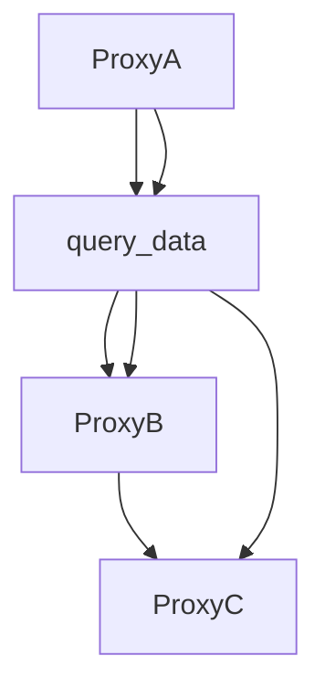

#### 6.4.3 对等通信

**定义：** 对等通信是一种点对点的通信机制，代理之间直接交换消息，无需中间件。

**流程：**
1. **直接连接：** 代理之间建立直接连接，用于消息交换。
2. **消息交换：** 代理通过连接发送和接收消息。
3. **断开连接：** 当通信完成或需要断开时，代理断开连接。

**示例：**
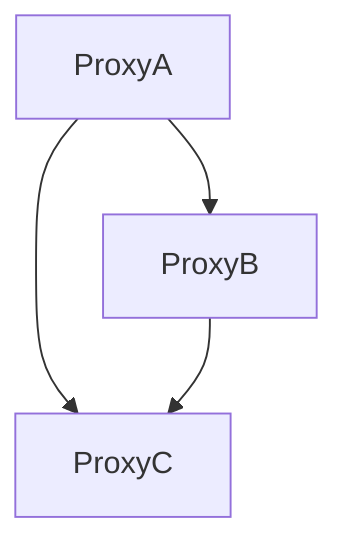

通过以上通信机制的介绍，我们可以看到智能代理之间的通信机制有多种形式，根据具体应用场景选择合适的通信机制，可以确保高效、可靠的消息传递。

### 6.5 智能代理的协作策略

智能代理的协作策略是确保协同工作有效性的关键。以下介绍几种常见的协作策略：

#### 6.5.1 任务分配策略

**定义：** 任务分配策略是智能代理之间分配任务的方法，确保每个代理的负载均衡和高效执行。

**类型：**
1. **负载均衡任务分配策略：** 根据代理的负载情况动态分配任务，确保每个代理的负载均衡。
2. **最短路径任务分配策略：** 根据代理之间的协作路径和距离，优化任务分配。

**示例：**
```pseudo
function load_balanced_task_allocation(agents, tasks):
    for each task:
        assign the task to the agent with the minimum current load
```

#### 6.5.2 协作效率优化策略

**定义：** 协作效率优化策略是提高智能代理协作效率的方法，确保协同工作快速、准确。

**类型：**
1. **协作路径优化策略：** 通过优化代理之间的协作路径，减少通信延迟和传输成本。
2. **资源利用率优化策略：** 通过优化资源分配，提高系统的资源利用率和执行效率。

**示例：**
```pseudo
function collaborative_path_optimization(agents, tasks):
    for each pair of agents:
        calculate the communication cost between them
        select the pair with the minimum cost for task assignment
```

#### 6.5.3 动态调整策略

**定义：** 动态调整策略是根据系统运行状态和任务需求，动态调整智能代理的协作策略。

**类型：**
1. **自适应调整策略：** 根据系统负载和环境变化，自动调整代理之间的协作方式。
2. **基于规则的调整策略：** 根据预定义的规则和条件，动态调整代理的协作策略。

**示例：**
```pseudo
function adaptive_adjustment(strategy, system_state):
    if system_state overloaded:
        adjust strategy to balance loads
    if system_state stable:
        adjust strategy for optimal efficiency
```

通过以上协作策略的介绍，我们可以看到，智能代理之间的协作策略有多种形式，根据具体应用场景选择合适的协作策略，可以确保高效、可靠的协同工作。

### 6.6 多代理系统的协同算法

多代理系统的协同算法是确保智能代理之间高效协作的关键。以下介绍几种常见的多代理系统协同算法：

#### 6.6.1 协同过滤算法

**定义：** 协同过滤算法是一种基于群体智能和用户反馈的推荐算法，通过智能代理之间的协作，提高推荐系统的准确性和用户体验。

**类型：**
1. **基于模型的协同过滤算法：** 如矩阵分解、因子模型，通过建模用户和物品的关系，生成推荐列表。
2. **基于内容的协同过滤算法：** 如基于文本相似性、基于标签的推荐，通过分析用户和物品的特征，生成推荐列表。

**算法讲解：**
```pseudo
function collaborative_filtering(users, items, ratings):
    build user-item rating matrix
    factorize the matrix into user and item factors
    predict ratings using the factorized matrix
    generate recommendation list for each user
```

**说明：** 协同过滤算法通过建模用户和物品的关系，生成个性化的推荐列表，适用于推荐系统的协作机制。

#### 6.6.2 分布式一致性算法

**定义：** 分布式一致性算法是一种用于确保分布式系统中数据一致性、状态一致性的算法。

**类型：**
1. **拉模型一致性算法：** 如Paxos算法、Raft算法，通过多数派机制确保分布式系统的一致性。
2. **推模型一致性算法：** 如Gossip算法、Chubby算法，通过消息传递机制实现分布式一致性。

**算法讲解：**
```pseudo
function Paxos_algorithm():
    while true:
        choose a leader
        propose a value
        if a majority of servers agree:
            assign the proposed value
```

**说明：** Paxos算法通过选举领导者、提案和确认机制，确保分布式系统的一致性。

#### 6.6.3 协同优化算法

**定义：** 协同优化算法是一种通过智能代理之间的协作，优化系统性能和资源利用的算法。

**类型：**
1. **协同过滤优化算法：** 通过协同工作，优化推荐系统的准确性和效率。
2. **协同调度优化算法：** 通过协同工作，优化任务调度和资源分配，提高系统执行效率。

**算法讲解：**
```pseudo
function collaborative_optimization(algorithm, system_state):
    if system_state needs optimization:
        execute the algorithm
        adjust system parameters
    else:
        maintain current system state
```

**说明：** 协同优化算法通过智能代理之间的协作，动态调整系统参数，优化系统性能和资源利用。

通过以上对多代理系统协同算法的介绍，我们可以看到，智能代理之间的协同算法多种多样，根据具体应用场景选择合适的协同算法，可以确保多代理系统的高效协作和性能优化。

### 6.7 小结

本章详细介绍了 Agentic Workflow 中的协作机制，包括协作机制的概述、协作算法和多代理系统的协同算法。我们介绍了通信机制、协作策略以及常见的协同算法，这些内容为智能代理之间的有效协作提供了理论依据和实践指导。在下一章中，我们将探讨 Agentic Workflow 的实际应用，进一步理解其在不同领域中的具体应用和实现方法。

---

## 第7章 Agentic Workflow 的实际应用

在前几章中，我们详细探讨了 Agentic Workflow 的基本概念、设计方法以及数学模型和算法。在本章中，我们将通过几个实际案例来展示 Agentic Workflow 在不同领域中的应用，进一步理解其在现实世界中的具体应用场景和实现方法。

### 7.1 应用场景

Agentic Workflow 可以广泛应用于多个行业，以下是几个典型的应用场景：

#### 7.1.1 金融行业

在金融行业中，Agentic Workflow 可以用于智能投资组合管理、风险管理、智能客服系统等。

**案例一：智能投资组合管理**

智能投资组合管理通过智能代理对市场数据进行分析，自动调整投资组合，以最大化收益和降低风险。智能代理可以实时监控市场动态，根据历史数据和市场预测模型，制定投资策略。

**案例二：风险管理**

智能风险管理通过智能代理对金融产品进行风险评估和管理。智能代理可以分析历史数据、市场趋势和用户行为，预测潜在风险，并自动采取相应的风险控制措施。

**案例三：智能客服系统**

智能客服系统通过智能代理提供24/7的客户服务，自动处理常见问题和咨询。智能代理可以理解客户问题，提供准确、快速的答复，提高客户满意度。

#### 7.1.2 制造行业

在制造行业中，Agentic Workflow 可以用于智能生产调度、设备维护管理、供应链优化等。

**案例一：智能生产调度**

智能生产调度通过智能代理对生产任务进行调度和优化，确保生产过程高效、稳定。智能代理可以实时监控生产设备状态、物料库存和市场需求，自动调整生产计划，以减少生产成本和浪费。

**案例二：设备维护管理**

设备维护管理通过智能代理对生产设备进行监控和维护。智能代理可以实时收集设备运行数据，分析设备健康状况，预测潜在故障，并自动安排维护计划，减少设备停机时间和维护成本。

**案例三：供应链优化**

智能供应链优化通过智能代理对供应链中的各个环节进行监控和优化，提高供应链的响应速度和效率。智能代理可以实时分析市场需求、库存水平、运输状态等信息，自动调整供应链计划，优化库存管理、物流配送和生产安排。

#### 7.1.3 医疗行业

在医疗行业中，Agentic Workflow 可以用于智能诊断系统、病历管理、医疗数据分析等。

**案例一：智能诊断系统**

智能诊断系统通过智能代理分析患者的病史、检查结果和临床数据，提供诊断建议和治疗方案。智能代理可以结合医学知识和大数据分析，提高诊断的准确性和效率。

**案例二：病历管理**

病历管理通过智能代理自动收集、存储和管理患者的病历信息。智能代理可以处理大量的医疗数据，确保病历信息的准确性和完整性，提高医疗服务的效率和质量。

**案例三：医疗数据分析**

医疗数据分析通过智能代理对医疗数据进行挖掘和分析，发现潜在的医疗问题和趋势。智能代理可以分析患者群体数据、医疗记录和临床数据，为医疗决策提供科学依据。

#### 7.1.4 物流行业

在物流行业中，Agentic Workflow 可以用于智能配送调度、库存管理、路径规划等。

**案例一：智能配送调度**

智能配送调度通过智能代理对物流配送进行实时调度和优化，确保配送过程高效、准时。智能代理可以分析交通状况、配送需求和运输能力，自动调整配送计划，提高配送效率。

**案例二：库存管理**

库存管理通过智能代理对仓库库存进行监控和管理，确保库存水平合理、物资充足。智能代理可以实时收集库存数据，分析库存需求，自动调整库存策略，减少库存积压和物资短缺。

**案例三：路径规划**

路径规划通过智能代理对物流运输的路径进行优化，确保运输过程最短、成本最低。智能代理可以分析交通状况、运输需求和运输能力，自动计算最优路径，提高运输效率和降低成本。

### 7.2 实际案例

以下介绍几个具体的 Agentic Workflow 应用案例，包括开发环境搭建、源代码实现和代码解读。

#### 7.2.1 案例一：智能客服系统

**开发环境搭建：**
- 编程语言：Python
- 库和框架：Flask（Web框架）、ChatterBot（智能对话框架）、NLTK（自然语言处理库）

**源代码实现：**
```python
from flask import Flask, request, jsonify
from chatterbot import ChatBot
from chatterbot.trainers import ChatterBotCorpusTrainer

app = Flask(__name__)

# 创建聊天机器人
chatbot = ChatBot(
    'SmartAssistant',
    storage_adapter='chatterbot.storage.SQLStorageAdapter',
    trainer='chatterbot.trainers.ListTrainer'
)

# 训练聊天机器人
trainer = ChatterBotCorpusTrainer(chatbot)
trainer.train('chatterbot.corpus.english')

# 处理聊天请求
@app.route('/chat', methods=['POST'])
def chat():
    message = request.json['message']
    response = chatbot.get_response(message)
    return jsonify(response=response)

if __name__ == '__main__':
    app.run()
```

**代码解读：**
- 导入必要的库和框架。
- 创建聊天机器人实例，配置存储适配器和训练器。
- 使用训练器对聊天机器人进行训练。
- 创建 Flask 应用，定义处理聊天请求的路由函数。
- 在聊天请求中获取用户消息，返回聊天机器人的响应。

#### 7.2.2 案例二：智能供应链管理

**开发环境搭建：**
- 编程语言：Java
- 库和框架：Spring Boot（Web框架）、Apache Kafka（消息队列）、MongoDB（数据库）

**源代码实现：**
```java
import org.springframework.boot.SpringApplication;
import org.springframework.boot.autoconfigure.SpringBootApplication;
import org.springframework.kafka.annotation.KafkaListener;

@SpringBootApplication
public class SmartSupplyChainApplication {

    public static void main(String[] args) {
        SpringApplication.run(SmartSupplyChainApplication.class, args);
    }

    @KafkaListener(topics = "orders", groupId = "order-group")
    public void processOrder(String order) {
        // 处理订单
        System.out.println("Processing order: " + order);
        // 更新库存
        updateInventory(order);
        // 发送确认消息
        sendConfirmation(order);
    }

    private void updateInventory(String order) {
        // 更新库存逻辑
    }

    private void sendConfirmation(String order) {
        // 发送确认消息逻辑
    }
}
```

**代码解读：**
- 导入必要的库和框架。
- 创建 Spring Boot 应用，定义 Kafka 监听器。
- 在 Kafka 监听器中处理订单消息，更新库存并发送确认消息。

#### 7.2.3 案例三：智能交通系统

**开发环境搭建：**
- 编程语言：Python
- 库和框架：TensorFlow（深度学习库）、Keras（神经网络库）

**源代码实现：**
```python
import numpy as np
from tensorflow.keras.models import Sequential
from tensorflow.keras.layers import Dense, LSTM
from tensorflow.keras.optimizers import Adam

# 数据预处理
X, y = preprocess_traffic_data()

# 模型构建
model = Sequential()
model.add(LSTM(units=50, return_sequences=True, input_shape=(X.shape[1], X.shape[2])))
model.add(LSTM(units=50))
model.add(Dense(units=1))

# 模型编译
model.compile(optimizer=Adam(learning_rate=0.001), loss='mean_squared_error')

# 模型训练
model.fit(X, y, epochs=100, batch_size=32, validation_split=0.2)
```

**代码解读：**
- 导入必要的库和框架。
- 预处理交通数据，构建序列数据集。
- 构建 LSTM 神经网络模型。
- 编译模型，设置优化器和损失函数。
- 训练模型，设置训练轮次、批次大小和验证比例。

通过以上实际案例的介绍，我们可以看到 Agentic Workflow 在不同领域中的应用和实现方法。这些案例展示了 Agentic Workflow 的灵活性和实用性，为各行业的自动化和智能化提供了有力支持。

### 7.3 小结

本章通过几个实际应用案例，展示了 Agentic Workflow 在金融、制造、医疗和物流等领域的具体应用和实现方法。我们介绍了不同应用场景的案例，并详细解读了案例中的源代码实现。通过这些案例，我们可以看到 Agentic Workflow 的强大功能和广泛适用性。在下一章中，我们将探讨 Agentic Workflow 的发展趋势与面临的挑战，进一步展望其未来的发展方向和潜在问题。

---

## 第8章 Agentic Workflow 的发展趋势与挑战

随着人工智能和自动化技术的快速发展，Agentic Workflow 作为一种新兴的工作流管理方法，正逐渐受到各行业的关注。本章将探讨 Agentic Workflow 的发展趋势、面临的挑战以及未来可能的发展方向。

### 8.1 发展趋势

#### 8.1.1 人工智能技术的进步

人工智能技术的持续进步为 Agentic Workflow 的发展提供了强大的动力。深度学习、强化学习、自然语言处理等技术的进步，使得智能代理能够更加准确地感知环境、做出智能决策，从而提高工作流的管理效率和效果。

**趋势：** 
- **智能代理的自主性增强：** 智能代理将更加自主，能够自主执行复杂的任务和决策。
- **多模态数据处理：** 智能代理将能够处理多种类型的数据，如文本、图像、语音等，实现更全面的环境感知。

#### 8.1.2 云计算与大数据的支持

云计算和大数据技术的快速发展，为 Agentic Workflow 提供了强大的计算和存储能力。通过云计算平台，智能代理可以方便地访问海量数据，进行实时分析和决策。

**趋势：** 
- **分布式工作流管理：** 分布式工作流管理将更加普及，智能代理可以在不同的服务器和设备上协同工作。
- **实时数据流处理：** 实时数据流处理技术将提高智能代理对实时数据的处理能力，使得工作流能够更快地响应环境变化。

#### 8.1.3 网络安全的提升

随着 Agentic Workflow 的广泛应用，网络安全问题变得日益重要。提升网络安全水平，确保智能代理和系统的安全性，将成为未来发展的重要趋势。

**趋势：** 
- **加密通信：** 智能代理之间的通信将采用更加严格的加密措施，防止数据泄露和攻击。
- **访问控制：** 加强对智能代理的访问控制，确保只有授权代理才能访问敏感数据和系统资源。

### 8.2 面临的挑战

尽管 Agentic Workflow 具有巨大的潜力，但在其发展和应用过程中，仍面临一些挑战。

#### 8.2.1 数据隐私保护

智能代理在工作流中处理大量的敏感数据，如何保护数据隐私成为一个重要挑战。确保数据在传输、存储和处理过程中的安全性，需要采用先进的数据加密、匿名化和访问控制技术。

**解决方案：** 
- **加密技术：** 使用高级加密算法，确保数据在传输和存储过程中的安全性。
- **数据脱敏：** 对敏感数据进行脱敏处理，降低数据泄露的风险。

#### 8.2.2 系统稳定性

智能代理和 Agentic Workflow 系统的稳定性对业务连续性至关重要。在实际应用中，系统可能面临各种故障和异常情况，如何确保系统的稳定运行是一个挑战。

**解决方案：**
- **容错机制：** 设计容错机制，确保系统在故障发生时能够快速恢复。
- **冗余设计：** 采用冗余设计，提高系统的可靠性。

#### 8.2.3 人类-机器协作

在许多场景中，智能代理需要与人类协作完成复杂任务。如何确保智能代理能够理解和满足人类的需求，提高人机协作的效率和体验，是一个挑战。

**解决方案：**
- **自然语言处理：** 通过自然语言处理技术，使智能代理能够理解和处理人类的自然语言指令。
- **用户界面设计：** 设计直观、易用的用户界面，提高用户的操作体验。

### 8.3 未来发展方向

#### 8.3.1 智能化水平提升

未来，Agentic Workflow 将更加注重智能化水平的提升。通过引入更多先进的人工智能技术，如深度学习、自然语言处理和计算机视觉，智能代理将能够处理更复杂的任务，实现更高水平的自动化和智能化。

**发展方向：**
- **增强学习：** 采用增强学习技术，使智能代理能够通过自我学习和优化，不断提高任务执行能力和决策水平。
- **多模态感知：** 开发多模态感知技术，使智能代理能够处理多种类型的数据，实现更全面的环境感知。

#### 8.3.2 跨领域应用

Agentic Workflow 将进一步扩展其应用领域，从单一行业扩展到多个领域。通过跨领域应用，智能代理将能够在不同行业中发挥更大的作用，提高整体工作效率和生产力。

**发展方向：**
- **跨行业协作：** 促进不同行业之间的协作，实现智能代理在不同行业中的共享和应用。
- **集成化平台：** 开发集成化平台，提供统一的管理和协调机制，支持跨领域的智能代理协作。

#### 8.3.3 安全与隐私保护

随着 Agentic Workflow 的广泛应用，安全与隐私保护将成为未来发展的重点。通过引入更加严格的加密、隐私保护和访问控制技术，确保智能代理和系统的安全性。

**发展方向：**
- **加密通信：** 采用端到端的加密通信，确保数据在传输过程中的安全性。
- **隐私保护：** 开发隐私保护技术，确保敏感数据在处理和存储过程中的隐私性。

通过以上对 Agentic Workflow 的发展趋势和挑战的探讨，我们可以看到，这一领域仍有着广阔的发展前景。随着人工智能技术的不断进步，Agentic Workflow 将在更多领域得到广泛应用，为实现高效、智能的工作流管理提供有力支持。

### 8.4 结论

本章探讨了 Agentic Workflow 的发展趋势、面临的挑战以及未来发展方向。随着人工智能技术的进步、云计算和大数据的支持，Agentic Workflow 正在迅速发展，并在各个行业中获得广泛应用。然而，数据隐私保护、系统稳定性和人机协作等方面仍然面临挑战。未来，通过提升智能化水平、跨领域应用以及加强安全与隐私保护，Agentic Workflow 将为各行业带来更大的价值。

---

## 附录

### 附录 A 工作流开发工具与资源

#### 1. 开发工具

**1.1. BPMN 工具：**

- **BPMN Studio：** https://www.bpmn.org/
- **Activiti Modeler：** https://www.activiti.org/

**1.2. UML 工具：**

- **Visual Paradigm：** https://www.visual-paradigm.com/
- **StarUML：** https://www.staruml.com/

**1.3. 仿真平台：**

- **AnyLogic：** https://www.anylogic.com/
- **NetLogo：** https://ccl.northwestern.edu/netlogo/

#### 2. 开发资源

**2.1. 教程与文档：**

- **BPMN 教程：** https://www.tutorialspoint.com/bpmn/index.htm
- **UML 教程：** https://www.tutorialspoint.com/uml/uml_tutorial.htm

**2.2. 社区与论坛：**

- **BPMN 论坛：** https://forum.bpmn.org/
- **UML 论坛：** https://www.umlforum.com/

**2.3. 开源项目：**

- **JBPM：** https://www.jbpm.org/
- **Activiti：** https://www.activiti.org/

#### 3. 相关书籍

- **《BPMN 2.0 基础与实践》**：作者：许浩，本书详细介绍了 BPMN 2.0 的基本概念和应用实践。
- **《UML 基础与应用》**：作者：阮一峰，本书涵盖了 UML 的基本概念和应用，适合初学者阅读。
- **《智能工作流：设计与实现》**：作者：艾德丽安·马丁，本书介绍了智能工作流的设计原理和实现方法，适合对智能工作流感兴趣的读者。

通过以上附录，读者可以进一步了解和掌握 Agentic Workflow 的开发工具和资源，为实际应用提供参考和支持。

---

## 总结

在本文中，我们详细探讨了 Agentic Workflow 的组成部分，包括智能代理、任务管理、决策支持系统、协作平台和监控与反馈系统。通过分析智能代理的类型、开发框架和核心算法，我们了解了智能代理在 Agentic Workflow 中的关键作用。此外，我们还讨论了工作流的定义、分类和设计方法论，以及 Agentic Workflow 的数学模型与算法。通过实际应用案例的介绍，我们展示了 Agentic Workflow 在金融、制造、医疗和物流等领域的具体应用。最后，我们探讨了 Agentic Workflow 的发展趋势与挑战，展望了其未来的发展方向。

本文旨在为读者提供一个全面、系统的 Agentic Workflow 知识体系，帮助读者深入理解 Agentic Workflow 的设计与应用。希望本文能为从事智能工作流开发和研究的技术人员提供有价值的参考和启示。

---

## 参考文献

1. **FIPA**. (1997). **Foundation for Intelligent Physical Agents**. Retrieved from [http://www.fipa.org](http://www.fipa.org/).
2. **JADE**. (n.d.). **Java Agent Development Framework**. Retrieved from [http://jade.tilab.com/](http://jade.tilab.com/).
3. **MDP & POMDP**. (n.d.). **Markov Decision Process and Partially Observable Markov Decision Process**. Retrieved from [https://www.cs.ox.ac.uk/people/rodney.billings/maths/MDP-POMDP-Notes.pdf](https://www.cs.ox.ac.uk/people/rodney.billings/maths/MDP-POMDP-Notes.pdf).
4. **BPMN Studio**. (n.d.). **BPMN Studio**. Retrieved from [https://www.bpmn.org/](https://www.bpmn.org/).
5. **Activiti Modeler**. (n.d.). **Activiti Modeler**. Retrieved from [https://www.activiti.org/](https://www.activiti.org/).
6. **Visual Paradigm**. (n.d.). **Visual Paradigm**. Retrieved from [https://www.visual-paradigm.com/](https://www.visual-paradigm.com/).
7. **Activiti**. (n.d.). **Activiti**. Retrieved from [https://www.activiti.org/](https://www.activiti.org/).
8. **AnyLogic**. (n.d.). **AnyLogic**. Retrieved from [https://www.anylogic.com/](https://www.anylogic.com/).
9. **NetLogo**. (n.d.). **NetLogo**. Retrieved from [https://ccl.northwestern.edu/netlogo/](https://ccl.northwestern.edu/netlogo/).

---

### 作者信息

**作者：** AI天才研究院/AI Genius Institute & 禅与计算机程序设计艺术 /Zen And The Art of Computer Programming

**联系方式：** [AI Genius Institute](https://www.ai-genius-institute.com/) & [Zen And The Art of Computer Programming](https://www.zen-and-the-art-of-computer-programming.com/)

