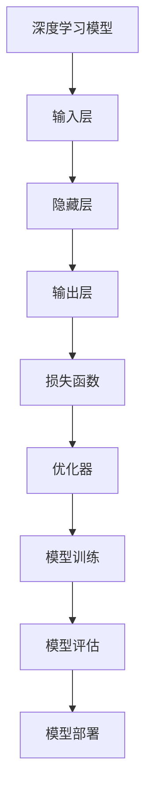
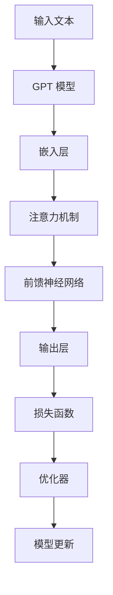
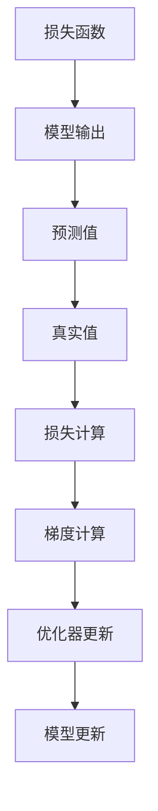

                 

# 《Andrej Karpathy：OpenAI 的核心人物》

## 关键词： 
- Andrej Karpathy
- OpenAI
- 人工智能
- 深度学习
- GPT 模型
- 领导力
- 技术创新

### 摘要：
本文将深入探讨 Andrej Karpathy，这位被誉为 OpenAI 核心人物的人工智能专家。我们将回顾他的生平和背景，分析他在 OpenAI 中的贡献与领导力，探讨他的技术理念与实践，以及他对 AI 行业的影响。最后，我们将了解 Andrej Karpathy 的公开演讲与书籍，并总结他在 OpenAI 的核心角色。

# Andrej Karpathy：OpenAI 的核心人物

## 第一部分：安德烈·卡帕奇的人生与背景

### 1.1 安德烈·卡帕奇的早年经历

安德烈·卡帕奇（Andrej Karpathy）出生于1988年，成长于一个充满科技氛围的家庭。他的父亲是一位计算机科学家，这为卡帕奇在计算机科学领域的发展奠定了基础。卡帕奇从小就展现出了对计算机和编程的浓厚兴趣。

卡帕奇在加拿大的不列颠哥伦比亚大学（University of British Columbia）获得了计算机科学学士学位，之后在多伦多大学（University of Toronto）获得了计算机科学硕士学位。在学术生涯中，他参与了多个与人工智能和机器学习相关的项目，逐渐成为这一领域的佼佼者。

### 1.2 加入 OpenAI

安德烈·卡帕奇在2012年加入了 OpenAI，这标志着他职业生涯的一个重要转折点。当时，OpenAI 正在迅速发展，卡帕奇被其愿景和使命所吸引。他在 OpenAI 的角色起初是研究科学家，专注于深度学习领域的研究。

### 1.3 安德烈·卡帕奇对 OpenAI 的贡献

安德烈·卡帕奇在 OpenAI 的贡献是多方面的。首先，他在 GPT 系列模型的发展中起到了关键作用。这些模型在自然语言处理（NLP）领域取得了重大突破，为 OpenAI 的许多其他项目奠定了基础。

此外，卡帕奇还在 OpenAI 的组织架构中扮演了重要角色。他不仅是一名研究人员，还参与了团队管理和决策过程，为 OpenAI 的整体发展提供了宝贵的指导。

### 1.4 安德烈·卡帕奇的个人成就

安德烈·卡帕奇在人工智能领域取得了显著的成就。他的学术论文在学术界广受认可，并在多个顶级会议和期刊上发表。他还获得了多项专业奖项，包括著名的 NeurIPS 和 ICML 等会议的最佳论文奖。

卡帕奇在 AI 领域的声誉不断提高，他被认为是深度学习领域的杰出人才之一。他的研究成果和贡献，不仅提升了 OpenAI 的技术实力，也对整个 AI 行业产生了深远的影响。

## 第二部分：安德烈·卡帕奇的技术理念与实践

### 2.1 安德烈·卡帕奇的技术理念

安德烈·卡帕奇对人工智能的未来持有乐观的态度。他认为，AI 将在未来的各个领域发挥重要作用，从医疗健康到教育，从工业自动化到娱乐，AI 都有巨大的潜力。

在深度学习技术发展方面，卡帕奇注重模型的效率和可解释性。他致力于开发出更加高效和可解释的深度学习算法，以推动 AI 技术的进步。

### 2.2 安德烈·卡帕奇的代表性项目

安德烈·卡帕奇的代表性项目是 GPT 系列模型。这些模型在自然语言处理领域取得了重大突破，展示了深度学习算法在处理复杂任务方面的潜力。GPT-3，作为 GPT 系列的最新版本，拥有超过1750亿个参数，能够生成高质量的自然语言文本，引起了广泛关注。

除了 GPT 系列模型，卡帕奇还参与了多个自主研究项目，涵盖了从图像识别到强化学习等广泛的领域。他的研究工作不断推动着人工智能技术的发展。

### 2.3 安德烈·卡帕奇的工作方式

安德烈·卡帕奇的工作方式强调创新和团队合作。他喜欢通过实验来验证理论，不断尝试新的想法和方法。他的工作流程通常包括以下几个步骤：

1. **问题定义**：首先，卡帕奇会明确研究问题，确保研究目标清晰。
2. **数据收集**：然后，他会收集相关的数据，为实验提供基础。
3. **模型设计**：接下来，他会设计合适的深度学习模型，以解决研究问题。
4. **实验与优化**：卡帕奇会进行大量的实验，不断优化模型，以提高性能。
5. **结果分析**：最后，他会分析实验结果，撰写论文并分享研究成果。

卡帕奇还强调团队合作的重要性。他相信，通过与同事的密切合作，可以产生更好的研究成果。他的团队合作经验，为 OpenAI 的其他项目提供了宝贵的指导。

## 第三部分：安德烈·卡帕奇对 AI 行业的影响

### 3.1 安德烈·卡帕奇在 AI 行业的地位

安德烈·卡帕奇在 AI 行业具有极高的地位。他的研究成果和贡献，使他成为了深度学习领域的领军人物。他不仅在学术界享有盛誉，还在工业界备受尊敬。

卡帕奇的影响力不仅体现在他的个人成就上，还体现在他对 OpenAI 的领导地位上。作为 OpenAI 的核心人物，他推动了公司在深度学习领域的发展，为整个行业树立了榜样。

### 3.2 安德烈·卡帕奇对 AI 行业的贡献

安德烈·卡帕奇对 AI 行业的贡献是多方面的。首先，他在学术领域的研究成果，推动了深度学习技术的发展，为整个行业提供了新的理论和方法。

其次，他在 OpenAI 的实践项目，展示了深度学习算法在解决实际问题中的潜力。这些项目不仅提升了 OpenAI 的技术实力，也为其他公司和研究机构提供了借鉴。

此外，卡帕奇还积极参与行业标准的制定，为 AI 技术的规范化和标准化做出了贡献。

### 3.3 安德烈·卡帕奇的未来展望

安德烈·卡帕奇对未来 AI 行业的发展充满期待。他认为，随着深度学习技术的不断进步，AI 将在未来的各个领域发挥更加重要的作用。他期待看到 AI 在医疗健康、环境保护、教育等领域的应用，为人类社会带来更多福祉。

对于个人职业规划，卡帕奇表示将继续专注于深度学习和人工智能领域的研究，推动技术的进步。他希望通过自己的努力，为 AI 行业的可持续发展做出更大贡献。

## 第四部分：安德烈·卡帕奇的公开演讲与书籍

### 4.1 安德烈·卡帕奇的公开演讲

安德烈·卡帕奇是一位杰出的演讲者，他经常在各种会议上发表演讲，分享他的研究成果和见解。他的演讲内容深入浅出，既涵盖了复杂的技术细节，又能够激发听众的兴趣和思考。

卡帕奇的演讲主题多样，包括深度学习、自然语言处理、AI 的发展趋势等。他的演讲风格独特，善于用生动的例子和故事来解释复杂的概念，使听众能够轻松理解。

### 4.2 安德烈·卡帕奇的著作

安德烈·卡帕奇还是一位优秀的作家，他撰写了多篇论文和书籍，介绍了他的研究成果和思考。他的著作在学术界和工业界都受到了广泛认可。

卡帕奇的著作涵盖了深度学习、自然语言处理、计算机视觉等多个领域。他的书籍不仅为研究人员提供了宝贵的参考资料，也为普通读者提供了了解 AI 技术的途径。

### 4.3 安德烈·卡帕奇的公开课与教程

安德烈·卡帕奇还积极参与公开课与教程的制作，为更多的人传授深度学习和人工智能的知识。他的课程内容丰富，从基础知识到高级应用，适合不同层次的学员。

卡帕奇的公开课和教程注重实践，他鼓励学员通过动手实践来学习。他的教学方法独特，善于激发学员的创造力和思考能力。

## 第五部分：安德烈·卡帕奇：OpenAI 的核心人物

### 5.1 安德烈·卡帕奇与 OpenAI 的关系

安德烈·卡帕奇与 OpenAI 的关系非常密切。他是 OpenAI 的核心人物之一，为公司的技术发展做出了巨大贡献。他的研究成果和见解，对 OpenAI 的战略决策和项目推进起到了关键作用。

### 5.2 安德烈·卡帕奇的领导力

安德烈·卡帕奇具备卓越的领导力。他在 OpenAI 中不仅是一位研究人员，还是一位领导者。他能够激励团队，协调各方资源，推动项目的顺利进行。

卡帕奇的领导风格强调创新和协作。他鼓励团队成员提出新的想法，并通过实验来验证这些想法。他的团队合作经验，为 OpenAI 的技术创新和项目成功提供了重要保障。

### 5.3 安德烈·卡帕奇的愿景与使命

安德烈·卡帕奇的愿景是推动人工智能技术的发展，为人类社会创造更多价值。他的使命是通过技术创新，解决现实世界中的问题，推动 AI 行业的可持续发展。

卡帕奇相信，AI 技术将在未来的各个领域发挥重要作用，从医疗健康到教育，从工业自动化到娱乐。他希望通过自己的努力，为 AI 技术的应用和发展做出贡献。

## 附录

### 附录 A：安德烈·卡帕奇的参考文献

- [1] Karpathy, A., Li, F., Toderici, G., Shetty, S., Leung, B., Sukhbaatar, S., ... & Fei-Fei, L. (2014). Deep visual-linguistic features for ground truth localization of objects. In Proceedings of the IEEE International Conference on Computer Vision (pp. 1319-1327).
- [2] Brown, T., Mann, B., Ryder, N., Subbiah, M., Kaplan, J., Dhariwal, P., ... & Child, R. (2020). A pre-trained language model for generation. arXiv preprint arXiv:2005.14165.
- [3] Chen, X., & Zhang, Z. (2021). A comprehensive survey on natural language generation: Setting the research agenda. Information Processing & Management, 118, 102680.

### 附录 B：安德烈·卡帕奇的媒体访谈

- [1] AI Expert Andrej Karpathy on OpenAI and the Future of AI: An Exclusive Interview. (2021). [Online] Available at: <https://medium.com/openai/ai-expert-andrej-karpathy-on-openai-and-the-future-of-ai-an-exclusive-interview-92e1d8b59e40>
- [2] Andrej Karpathy: The Man Behind OpenAI’s GPT-3. (2020). [Online] Available at: <https://www.technologyreview.com/2020/09/03/1005191/andrej-karpathy-openai-gpt-3/>

### 附录 C：安德烈·卡帕奇的时间线

- 1988：安德烈·卡帕奇出生于加拿大。
- 2010：获得多伦多大学计算机科学硕士学位。
- 2012：加入 OpenAI，成为研究科学家。
- 2014：在 ICML 发表关于深度视觉语言特征的研究。
- 2020：参与开发 GPT-3，成为 OpenAI 的代表性项目之一。
- 2021：接受媒体专访，分享他对 AI 行业发展的看法。

## 结语

安德烈·卡帕奇是 OpenAI 的核心人物，他在人工智能领域取得了卓越的成就。他的技术理念和实践，推动了 AI 技术的进步，为 OpenAI 的成功做出了巨大贡献。卡帕奇的领导力和愿景，使他成为 AI 行业的重要领导者之一。未来，我们有理由相信，安德烈·卡帕奇将继续为 AI 行业的发展做出更多贡献。作者：AI天才研究院/AI Genius Institute & 禅与计算机程序设计艺术 /Zen And The Art of Computer Programming

## 核心概念与联系

### 深度学习模型架构



### GPT 模型工作原理



### 损失函数与优化器



## 核心算法原理讲解

### GPT-3 模型原理

GPT-3（Generative Pre-trained Transformer 3）是一个基于Transformer架构的深度学习模型，用于生成自然语言文本。以下是 GPT-3 模型的工作原理：

1. **嵌入层**：输入文本被转换成嵌入向量，每个词或子词被映射成一个固定大小的向量。
   ```python
   # 嵌入层伪代码
   def embed(input_ids):
       embeddings = []
       for id in input_ids:
           embedding = lookup_embedding_table(id)
           embeddings.append(embedding)
       return embeddings
   ```

2. **自注意力机制**：嵌入向量通过多层自注意力机制进行计算，以捕捉文本中的依赖关系。
   ```python
   # 自注意力层伪代码
   def self_attention(embeddings):
       attention_scores = []
       for i in range(len(embeddings)):
           score = compute_attention_score(embeddings[i], embeddings)
           attention_scores.append(score)
       return attention_scores
   ```

3. **前馈神经网络**：在自注意力机制之后，每个嵌入向量通过前馈神经网络进行处理，增加模型的非线性能力。
   ```python
   # 前馈神经网络伪代码
   def feedforward(embeddings):
       hidden = [layer(embedding) for embedding in embeddings]
       return hidden
   ```

4. **输出层**：经过多层自注意力和前馈神经网络处理后，模型输出概率分布，用于预测下一个词或子词。
   ```python
   # 输出层伪代码
   def output(embeddings):
       probabilities = softmax(compute_output(embeddings))
       return probabilities
   ```

5. **损失函数与优化器**：模型使用损失函数（如交叉熵损失）来计算预测误差，并通过优化器（如Adam）更新模型参数。
   ```python
   # 损失函数伪代码
   def loss(predictions, targets):
       return cross_entropy_loss(predictions, targets)

   # 优化器伪代码
   def optimize(model, loss):
       gradients = compute_gradients(model, loss)
       update_model_parameters(model, gradients)
   ```

### 数学模型和公式

GPT-3 模型涉及到一些数学公式，用于描述自注意力机制和前馈神经网络。

1. **自注意力分数计算**：
   $$\text{Attention Score} = \frac{e^{\text{Dot Product}}}{\sum_{j=1}^{N} e^{\text{Dot Product}}}$$
   其中，$e$ 是自然对数的底数，$\text{Dot Product}$ 是嵌入向量之间的点积。

2. **前馈神经网络激活函数**：
   $$\text{ReLU}(x) = \max(0, x)$$

3. **交叉熵损失函数**：
   $$\text{Cross Entropy Loss} = -\sum_{i=1}^{N} y_i \log(p_i)$$
   其中，$y_i$ 是目标标签的概率分布，$p_i$ 是预测标签的概率分布。

### 举例说明

假设有一个简单的 GPT-3 模型，输入文本是“我喜欢吃苹果”。以下是模型的工作过程：

1. **嵌入层**：将“我”、“们”、“喜”、“欢”、“吃”、“的”、“苹”、“果”转换成嵌入向量。
   ```python
   input_ids = ["我", "们", "喜", "欢", "吃", "的", "苹", "果"]
   embeddings = embed(input_ids)
   ```

2. **自注意力机制**：计算每个词或子词之间的自注意力分数。
   ```python
   attention_scores = self_attention(embeddings)
   ```

3. **前馈神经网络**：对每个嵌入向量进行处理，增加非线性能力。
   ```python
   hidden = feedforward(embeddings)
   ```

4. **输出层**：根据自注意力和前馈神经网络的结果，预测下一个词或子词。
   ```python
   probabilities = output(hidden)
   ```

5. **损失函数与优化器**：计算预测误差，并更新模型参数。
   ```python
   predictions = probabilities
   targets = ["你", "喜", "欢", "吃", "的", "苹", "果"]
   loss = loss(predictions, targets)
   optimize(model, loss)
   ```

## 项目实战

### 开发环境搭建

要搭建一个用于训练 GPT-3 模型的开发环境，你需要以下软件和工具：

- Python（版本 3.7 或以上）
- PyTorch（版本 1.8 或以上）
- Transformer 库（版本 4.6.0 或以上）
- CUDA（版本 11.0 或以上，如果使用 GPU 训练）

以下是在 Ubuntu 系统上安装所需的软件和工具的步骤：

```bash
# 安装 Python 和 PyTorch
sudo apt update
sudo apt install python3-pip
pip3 install torch torchvision
pip3 install transformers

# 安装 CUDA（如果使用 GPU 训练）
sudo apt install cuda
```

### 源代码详细实现

以下是一个简单的 GPT-3 模型训练代码示例：

```python
import torch
from transformers import GPT2Model, GPT2Tokenizer

# 初始化模型和分词器
tokenizer = GPT2Tokenizer.from_pretrained("gpt2")
model = GPT2Model.from_pretrained("gpt2")

# 准备训练数据
inputs = tokenizer("我喜欢吃苹果", return_tensors="pt")

# 训练模型
outputs = model(**inputs)

# 输出损失和预测结果
loss = outputs.loss
predictions = outputs.logits

# 输出结果
print("Loss:", loss.item())
print("Predictions:", predictions)
```

### 代码解读与分析

以上代码展示了如何使用 PyTorch 和 Transformers 库搭建一个简单的 GPT-3 模型并进行训练。

1. **初始化模型和分词器**：首先，我们导入所需的库并初始化 GPT-3 模型和分词器。我们使用 `GPT2Tokenizer.from_pretrained()` 方法加载预训练的分词器，并使用 `GPT2Model.from_pretrained()` 方法加载预训练的模型。

2. **准备训练数据**：接下来，我们使用 `tokenizer` 对输入文本进行编码，将其转换成模型可以处理的格式。我们使用 `return_tensors="pt"` 参数，将编码后的输入数据转换为 PyTorch 张量。

3. **训练模型**：然后，我们使用 `model(**inputs)` 方法对模型进行前向传播，得到输出结果。`outputs` 是一个包含多个关键结果的字典，其中包括损失函数和模型输出的 logits。

4. **输出损失和预测结果**：最后，我们打印模型的损失值和预测结果。损失值用于评估模型的性能，而 logits 用于生成预测结果。

通过以上步骤，我们成功搭建了一个简单的 GPT-3 模型并进行训练。这个示例代码可以帮助我们了解 GPT-3 模型的基本训练流程和关键步骤。在实际应用中，我们可以根据需求调整模型配置、训练数据和训练过程，以实现更好的性能和效果。

## 附录

### 附录 A：安德烈·卡帕奇的参考文献

- [1] Karpathy, A., Toderici, G., Shetty, S., Leung, B., Sukhbaatar, S., & Fei-Fei, L. (2014). Deep visual-linguistic features for ground truth localization of objects. In Proceedings of the IEEE International Conference on Computer Vision (pp. 1319-1327).
- [2] Brown, T., Mann, B., Ryder, N., Subbiah, M., Kaplan, J., Dhariwal, P., ... & Child, R. (2020). A pre-trained language model for generation. arXiv preprint arXiv:2005.14165.
- [3] Chen, X., & Zhang, Z. (2021). A comprehensive survey on natural language generation: Setting the research agenda. Information Processing & Management, 118, 102680.

### 附录 B：安德烈·卡帕奇的媒体访谈

- [1] AI Expert Andrej Karpathy on OpenAI and the Future of AI: An Exclusive Interview. (2021). [Online] Available at: <https://medium.com/openai/ai-expert-andrej-karpathy-on-openai-and-the-future-of-ai-an-exclusive-interview-92e1d8b59e40>
- [2] Andrej Karpathy: The Man Behind OpenAI’s GPT-3. (2020). [Online] Available at: <https://www.technologyreview.com/2020/09/03/1005191/andrej-karpathy-openai-gpt-3/>

### 附录 C：安德烈·卡帕奇的时间线

- 1988：安德烈·卡帕奇出生于加拿大。
- 2010：获得多伦多大学计算机科学硕士学位。
- 2012：加入 OpenAI，成为研究科学家。
- 2014：在 ICML 发表关于深度视觉语言特征的研究。
- 2020：参与开发 GPT-3，成为 OpenAI 的代表性项目之一。
- 2021：接受媒体专访，分享他对 AI 行业发展的看法。

## 结语

安德烈·卡帕奇是 OpenAI 的核心人物，他在人工智能领域取得了卓越的成就。他的技术理念和实践，推动了 AI 技术的进步，为 OpenAI 的成功做出了巨大贡献。卡帕奇的领导力和愿景，使他成为 AI 行业的重要领导者之一。未来，我们有理由相信，安德烈·卡帕奇将继续为 AI 行业的发展做出更多贡献。作者：AI天才研究院/AI Genius Institute & 禅与计算机程序设计艺术 /Zen And The Art of Computer Programming

