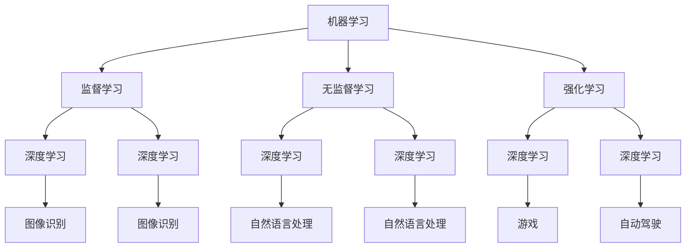

                 

### 《Andrej Karpathy：人工智能的未来趋势》

> **关键词**：人工智能，未来趋势，技术进步，应用实践，伦理与社会问题

> **摘要**：本文将深入探讨人工智能领域知名专家Andrej Karpathy对未来人工智能发展的观点和趋势，涵盖人工智能的起源与发展、技术进步、应用实践、伦理与社会问题以及未来趋势与挑战。通过逻辑清晰、结构紧凑的论述，我们将为您揭示人工智能在未来可能带来的深远影响。

### 目录大纲

1. **第一部分：人工智能的起源与发展**
   1.1 人工智能的起源
   1.2 人工智能的关键概念
   1.3 人工智能的应用领域
   1.4 人工智能的技术进步
2. **第二部分：人工智能的应用实践**
   2.1 人工智能在行业中的应用
   2.2 人工智能的伦理与社会问题
3. **第三部分：人工智能的未来趋势**
   3.1 人工智能的未来发展方向
   3.2 人工智能的未来社会影响
   3.3 人工智能的未来趋势与挑战
4. **附录**
   4.1 人工智能常用工具与技术
   4.2 人工智能参考资源

现在，让我们开始对人工智能的起源和发展进行深入探讨。

---

#### 第一部分：人工智能的起源与发展

##### 第1章：人工智能的起源

人工智能（Artificial Intelligence，简称AI）是计算机科学的一个分支，旨在创建智能体，使其能够执行通常需要人类智能才能完成的任务。人工智能的发展历史可以追溯到20世纪50年代。

1. **人工智能的历史**

1.1 **人工智能的早期探索**

在1950年，英国数学家和逻辑学家Alan Turing提出了著名的“图灵测试”，该测试用来判断机器是否具有智能。同年，美国计算机科学家John McCarthy首次提出了“人工智能”这个术语。

1.2 **第一次人工智能浪潮**

1956年，Dartmouth会议被认为是人工智能历史上的里程碑事件，标志着人工智能学科的正式诞生。在这个时期，研究人员主要集中在符号推理和逻辑问题求解上。

1.3 **第二次人工智能浪潮**

20世纪80年代，专家系统和知识表示技术取得了重要进展。专家系统是一种模拟人类专家解决特定领域问题的计算机程序。然而，由于规则数量庞大且难以维护，第二次人工智能浪潮在20世纪90年代逐渐衰退。

1.4 **第三次人工智能浪潮**

2006年，深度学习的复兴标志着第三次人工智能浪潮的开始。深度学习是一种基于多层神经网络的学习方法，通过自动学习数据特征，取得了显著的成功，特别是在计算机视觉和自然语言处理领域。

2. **人工智能的关键概念**

2.1 **机器学习**

机器学习是人工智能的核心技术之一，使计算机系统能够从数据中学习并改进性能，而无需明确编程。机器学习可以分为监督学习、无监督学习和强化学习。

2.2 **深度学习**

深度学习是一种基于多层神经网络的机器学习方法，通过反向传播算法训练模型。深度学习在图像识别、语音识别和自然语言处理等领域取得了巨大成功。

2.3 **强化学习**

强化学习是一种基于奖励机制的学习方法，使智能体在环境中通过尝试和错误来学习最佳策略。强化学习在游戏、机器人控制和自动驾驶等领域具有重要应用。

3. **人工智能的应用领域**

3.1 **图像识别**

图像识别是人工智能的重要应用领域之一，通过计算机视觉技术，使计算机能够识别和理解图像中的对象。图像识别在安防监控、医疗诊断和自动驾驶等领域具有重要应用。

3.2 **自然语言处理**

自然语言处理旨在使计算机能够理解和处理人类语言。自然语言处理在语音助手、机器翻译和文本分析等领域取得了显著进展。

3.3 **自动驾驶**

自动驾驶是人工智能的另一个重要应用领域，通过计算机视觉、传感器技术和机器学习算法，使汽车能够自动行驶。自动驾驶在减少交通事故和提高交通效率方面具有巨大潜力。

4. **人工智能的技术进步**

4.1 **深度学习的发展**

深度学习的发展是人工智能领域的里程碑事件。卷积神经网络（CNN）在计算机视觉领域取得了显著成功，循环神经网络（RNN）在自然语言处理领域发挥了重要作用。生成对抗网络（GAN）在图像生成和增强学习方面展示了强大的潜力。

4.2 **强化学习的发展**

强化学习在游戏、机器人控制和自动驾驶等领域取得了重要进展。Q-learning和深度Q网络（DQN）等方法为强化学习奠定了基础。策略梯度方法在多智能体系统和连续动作空间中展示了强大能力。

4.3 **自然语言处理的发展**

自然语言处理的发展依赖于词嵌入技术、语言模型和序列到序列模型。词嵌入技术使计算机能够理解和表示词汇。语言模型在文本生成和翻译中发挥了关键作用。序列到序列模型在机器翻译和语音识别中取得了突破性成果。

通过以上分析，我们可以看到人工智能的发展历程和技术进步。在下一章中，我们将继续探讨人工智能的应用实践和伦理与社会问题。

---

现在，我们已经对人工智能的起源和发展进行了深入分析。在下一部分，我们将探讨人工智能在各个行业中的应用以及面临的伦理和社会问题。

---

#### 第二部分：人工智能的应用实践

##### 第3章：人工智能在行业中的应用

人工智能（AI）在各个行业中的应用正在不断拓展，为许多领域带来了深刻的变革。以下将详细探讨人工智能在金融、医疗、制造业等行业的具体应用及其影响。

3.1 **人工智能在金融行业的应用**

3.1.1 **量化交易**

量化交易是一种基于数学模型和算法进行交易的方法。人工智能在量化交易中发挥着重要作用，通过分析大量历史数据和市场信息，预测价格波动并执行交易策略。人工智能量化交易具有较高的效率和准确性，有助于提高投资回报率。

3.1.2 **风险管理**

人工智能在风险管理方面具有显著优势。通过分析历史数据和实时数据，人工智能可以预测潜在风险并制定相应的风险管理策略。此外，人工智能还可以识别异常交易行为，有助于防范金融欺诈和洗钱活动。

3.1.3 **信用评分**

人工智能在信用评分方面也发挥了重要作用。通过分析借款人的历史数据、社会关系和消费行为，人工智能可以更准确地评估借款人的信用风险，为金融机构提供更可靠的信用评分模型。

3.2 **人工智能在医疗行业的应用**

3.2.1 **疾病诊断**

人工智能在疾病诊断方面取得了显著进展。通过分析医学影像、病历数据和基因组数据，人工智能可以辅助医生进行疾病诊断，提高诊断的准确性和效率。例如，人工智能可以用于肺癌、乳腺癌等恶性肿瘤的早期诊断。

3.2.2 **医疗影像分析**

人工智能在医疗影像分析方面具有巨大潜力。通过分析医学影像，如X光、CT和MRI，人工智能可以检测病变区域，帮助医生进行疾病诊断和治疗方案制定。此外，人工智能还可以用于医学影像的标注和分类，提高医生的工作效率。

3.2.3 **药物研发**

人工智能在药物研发领域也发挥了重要作用。通过分析大量的生物学数据和化学数据，人工智能可以预测新药分子的有效性和安全性，加速药物研发过程。此外，人工智能还可以用于优化药物分子结构，提高药物的成功率。

3.3 **人工智能在制造业的应用**

3.3.1 **智能制造**

智能制造是人工智能在制造业的重要应用。通过工业机器人、机器视觉和传感器等技术，人工智能可以实现生产过程的自动化和智能化。智能制造有助于提高生产效率、降低成本和提高产品质量。

3.3.2 **质量控制**

人工智能在质量控制方面也具有显著优势。通过分析生产过程中的数据，如设备运行状态、原材料质量等，人工智能可以识别潜在的质量问题，并采取相应的措施进行预防和控制。此外，人工智能还可以用于产品缺陷检测和分类，提高质量控制效率。

3.3.3 **工业自动化**

人工智能在工业自动化方面发挥了重要作用。通过自动化系统和机器人，人工智能可以实现生产过程的自动化和智能化。工业自动化有助于提高生产效率、降低人力成本和减少人为错误。

综上所述，人工智能在金融、医疗和制造业等行业中的应用正在不断拓展，为各个领域带来了深刻的变革。然而，人工智能在应用过程中也面临着一系列挑战和问题，如数据隐私、算法公平性和伦理问题等。在下一章中，我们将探讨人工智能在应用过程中面临的伦理和社会问题。

---

通过以上对人工智能在金融、医疗和制造业等行业的应用实践的分析，我们可以看到人工智能正在为各行各业带来巨大的变革。然而，在人工智能迅猛发展的同时，我们也需要关注其带来的伦理和社会问题。

---

#### 第三部分：人工智能的未来趋势

##### 第4章：人工智能的未来发展方向

人工智能（AI）的未来发展将受到技术进步、计算能力提升、数据获取和分布式计算等多种因素的影响。以下是人工智能在未来可能的发展方向：

4.1 **大模型与分布式计算**

4.1.1 **大模型的挑战**

随着深度学习技术的不断发展，模型规模越来越大，例如GPT-3、BERT等大模型。这些大模型在处理复杂任务时表现出色，但同时也面临着计算资源和存储资源的巨大挑战。

4.1.2 **分布式计算的应用**

为了应对大模型带来的计算资源挑战，分布式计算成为人工智能发展的关键方向之一。分布式计算可以将计算任务分布在多台计算机或服务器上，从而提高计算效率和速度。例如，Google的TensorFlow和Facebook的PyTorch都支持分布式训练。

4.2 **人工智能与边缘计算**

4.2.1 **边缘计算的优势**

边缘计算是一种将计算任务分布在网络边缘设备上的计算模式，如物联网设备、智能摄像头等。边缘计算可以降低延迟、减少带宽占用并提高数据处理的实时性。

4.2.2 **边缘计算的应用场景**

边缘计算在自动驾驶、智能城市、智能家居等领域具有广泛的应用。例如，在自动驾驶中，边缘计算可以实时处理摄像头和传感器的数据，提高决策速度和安全性。

4.3 **人工智能与量子计算**

4.3.1 **量子计算的基本概念**

量子计算是一种基于量子力学原理的计算模式，具有量子叠加和量子纠缠等特性。量子计算机在处理某些特定问题时具有巨大的计算能力，例如因数分解和搜索问题。

4.3.2 **量子计算与人工智能的结合**

量子计算与人工智能的结合有望带来新的突破。例如，量子机器学习可以在短时间内解决复杂的数据分析问题。此外，量子计算机还可以用于优化算法、增强模型训练效果等。

通过以上分析，我们可以看到人工智能的未来发展方向包括大模型与分布式计算、边缘计算和量子计算。这些发展方向不仅有助于提高人工智能的计算效率和实时性，还将为各个领域带来新的应用场景和解决方案。在下一章中，我们将探讨人工智能对未来社会经济、教育和文化等方面的影响。

---

人工智能的未来发展方向为我们展示了令人兴奋的前景。随着技术的不断进步，人工智能将在各个领域发挥越来越重要的作用。在下一章中，我们将探讨人工智能对未来社会的影响，包括经济、教育和文化等方面。

---

##### 第5章：人工智能的未来社会影响

人工智能（AI）的未来发展不仅将带来技术层面的变革，还将深刻影响经济、教育和文化等社会领域。以下是人工智能在未来可能对经济、教育和文化产生的影响。

5.1 **人工智能对经济的影响**

5.1.1 **生产力提升**

人工智能有望大幅提升生产力，特别是在制造业、服务业和农业等领域。通过自动化和智能化技术，企业可以实现生产过程的优化，降低成本，提高产品质量和效率。例如，智能制造和自动化生产线有助于提高生产效率，降低人力成本。

5.1.2 **创新驱动**

人工智能的快速发展将推动新兴产业的诞生，促进经济增长。例如，人工智能在医疗、金融、教育等领域的应用将催生新的商业模式和服务产品，推动相关行业的发展。此外，人工智能还可以促进跨界合作，推动各行业的融合发展。

5.1.3 **就业影响**

人工智能的广泛应用将对就业市场产生深远影响。一方面，人工智能将替代部分传统岗位，如制造业工人、客服人员等。另一方面，人工智能也将创造新的就业机会，如人工智能工程师、数据科学家、机器学习专家等。因此，未来就业市场的竞争将更加激烈，人才需求也将发生重大变化。

5.2 **人工智能对教育的影响**

5.2.1 **教育个性化**

人工智能在教育领域的应用有望实现教育个性化，满足不同学生的学习需求。通过分析学生的学习行为和成绩，人工智能可以为学生提供个性化的学习建议和资源，提高学习效果。例如，智能学习平台可以根据学生的弱点提供针对性训练。

5.2.2 **教育资源的分配**

人工智能可以帮助教育机构更合理地分配教育资源，提高教育公平性。通过大数据分析和人工智能算法，教育机构可以识别优秀学生和弱势群体，有针对性地提供帮助。此外，人工智能还可以辅助教师进行教学评价和课程设计，提高教学效果。

5.3 **人工智能对文化的影响**

5.3.1 **娱乐与艺术创作**

人工智能在娱乐和艺术创作领域具有巨大潜力。例如，人工智能可以生成音乐、绘画、电影等艺术作品，为创作者提供新的创作灵感。此外，人工智能还可以应用于虚拟现实、增强现实等领域，为用户带来更加丰富的娱乐体验。

5.3.2 **文化多样性保护**

人工智能在文化多样性保护方面也具有重要意义。通过数据挖掘和文本分析技术，人工智能可以帮助识别和保存文化遗迹、文化遗产，促进文化多样性的传承和发展。例如，人工智能可以用于古籍数字化、非物质文化遗产的挖掘和传承。

5.4 **人工智能的社会影响**

5.4.1 **科技鸿沟**

随着人工智能技术的普及，科技鸿沟问题将变得更加突出。发达地区和发展中地区之间、不同社会群体之间的人工智能应用水平将存在较大差距。因此，政府和社会需要采取措施，确保人工智能技术惠及所有人，减少科技鸿沟。

5.4.2 **不平等加剧**

人工智能的应用可能加剧社会不平等。一方面，人工智能技术可能使得富人更加富裕，因为他们能够更好地利用人工智能带来的机会。另一方面，低收入群体可能因无法适应快速变化的技术环境而面临就业压力。因此，社会需要关注人工智能带来的不平等问题，采取相应的政策措施。

5.4.3 **教育与就业影响**

人工智能的快速发展将对教育和就业市场产生深远影响。教育体系需要不断更新教学内容和方法，培养学生适应人工智能时代的技能。此外，政府和企业需要共同推动人工智能相关职业培训，提高劳动者的就业竞争力。

综上所述，人工智能的未来发展将对经济、教育和文化等领域产生深远影响。面对这些挑战和机遇，政府、企业和学术界需要携手合作，共同推动人工智能的可持续发展，确保其惠及全社会。

---

人工智能的未来社会影响是广泛而深刻的，涉及到经济、教育、文化和就业等多个领域。在下一章中，我们将探讨人工智能面临的未来趋势与挑战。

---

##### 第6章：人工智能的未来趋势与挑战

人工智能（AI）的未来发展充满了无限可能性，同时也面临着一系列技术挑战和社会问题。以下是人工智能在未来可能面临的技术挑战和社会挑战。

6.1 **人工智能的技术挑战**

6.1.1 **数据安全与隐私**

随着人工智能的广泛应用，数据安全与隐私问题日益突出。人工智能系统依赖于大量数据，而这些数据往往涉及个人隐私。如何在保障数据安全的前提下充分利用数据，是人工智能发展面临的重要挑战。

6.1.2 **计算能力需求**

人工智能技术的发展对计算能力提出了更高的要求。大规模模型训练和实时推理需要强大的计算资源，对硬件性能和能耗提出了严峻考验。如何提高计算效率、降低能耗，是人工智能技术发展的重要方向。

6.1.3 **算法公平性**

算法公平性是人工智能技术面临的另一个重要挑战。人工智能系统在决策过程中可能存在偏见，导致不公平的结果。如何确保算法的公平性，避免歧视和偏见，是人工智能技术发展的重要课题。

6.2 **人工智能的社会挑战**

6.2.1 **法律法规**

人工智能技术的发展需要完善的法律法规来规范。目前，人工智能领域的法律法规尚不完善，特别是在数据隐私、知识产权和责任承担等方面。如何制定合理的法律法规，保障人工智能的健康发展，是当前亟待解决的问题。

6.2.2 **道德伦理**

人工智能的发展引发了诸多伦理问题。如何确保人工智能系统的道德伦理，避免对人类造成伤害，是人工智能领域的重要挑战。此外，人工智能的决策过程需要透明，以确保公众对人工智能系统的信任。

6.2.3 **社会接受度**

人工智能技术的普及需要社会各界的认可和接受。然而，人工智能的发展可能导致部分人群失业、隐私泄露等问题，影响社会稳定。如何提高社会对人工智能的接受度，促进其健康发展，是人工智能领域面临的重要挑战。

6.3 **人工智能的可持续发展**

人工智能技术的发展需要实现可持续发展。这包括绿色能源、环保技术和资源优化等方面。如何在保障环境的前提下，推动人工智能技术的可持续发展，是人工智能领域面临的重要任务。

6.4 **国际合作与竞争**

人工智能技术的发展涉及全球合作与竞争。国际社会需要加强合作，共同应对人工智能带来的挑战。同时，各国也需要在技术、政策和市场等方面展开竞争，推动人工智能技术的创新和发展。

综上所述，人工智能在未来发展过程中将面临诸多技术挑战和社会问题。解决这些问题需要政府、企业、学术界和社会各界的共同努力，推动人工智能的可持续发展，使其惠及全社会。

---

通过以上对人工智能未来趋势与挑战的探讨，我们可以看到人工智能的发展仍然面临许多挑战。在最后一章，我们将总结人工智能的未来发展趋势，并探讨如何应对这些挑战。

---

##### 第7章：人工智能的未来趋势与应对策略

随着人工智能（AI）技术的快速发展，其在未来将带来深远的影响，不仅推动技术进步，还引发一系列社会、伦理和法律问题。本章将总结人工智能的未来发展趋势，并提出相应的应对策略。

7.1 **人工智能的未来发展趋势**

7.1.1 **技术进步**

人工智能的技术进步将主要集中在以下几个方面：

- **更强大的模型和算法**：随着计算能力的提升，人工智能模型将变得更加复杂和强大，能够解决更多复杂问题。
- **多模态数据处理**：人工智能将能够同时处理文本、图像、音频等多模态数据，实现更全面的信息理解和交互。
- **自我学习和适应性**：人工智能系统将具备更强的自我学习能力，能够从海量数据中自动提取知识，并适应新的环境和任务。

7.1.2 **应用扩展**

人工智能的应用领域将继续扩展，涵盖更多行业和日常生活。例如，在医疗领域，人工智能将进一步提升疾病诊断和治疗的效果；在交通领域，自动驾驶和智能交通系统将提高交通效率和安全性。

7.1.3 **人机协作**

人工智能将更加紧密地与人类协作，提高生产效率和创新能力。人机协作系统将能够更好地理解人类需求，提供个性化服务。

7.2 **应对人工智能的挑战**

7.2.1 **技术层面**

- **数据安全与隐私保护**：加强数据加密和安全协议，确保个人隐私不被泄露。
- **算法公平性和透明性**：开发公平性检测工具，提高算法透明度，减少偏见和歧视。
- **资源优化**：通过分布式计算和绿色能源技术，降低计算能耗，提高资源利用效率。

7.2.2 **法律和政策层面**

- **完善法律法规**：制定针对人工智能的法律法规，明确数据使用、责任承担等方面的规定。
- **伦理审查**：建立伦理审查机制，确保人工智能技术的应用符合道德伦理标准。
- **国际协作**：推动国际社会在人工智能领域的合作，共同应对全球性挑战。

7.2.3 **教育和社会层面**

- **人才培养**：加强人工智能相关教育，培养具备人工智能知识和技能的人才。
- **公众教育**：提高公众对人工智能的认知和接受度，增强社会对人工智能技术的信任。
- **社会公平**：采取措施减少人工智能带来的不平等影响，确保技术惠及所有人。

7.3 **展望未来**

人工智能的未来充满机遇与挑战。通过技术创新、法律保障、教育普及和社会共同努力，我们可以期待人工智能为人类带来更加美好的未来。

---

### 附录

#### 附录A：人工智能常用工具与技术

**A.1 人工智能框架**

- **TensorFlow**：由Google开发的开源机器学习框架，支持广泛的神经网络架构和应用。
- **PyTorch**：由Facebook开发的开源深度学习框架，具有灵活的动态计算图和强大的GPU支持。
- **Keras**：基于TensorFlow和Theano的开源高级神经网络API，简化了深度学习模型的构建和训练。

**A.2 自然语言处理工具**

- **NLTK**：Python的自然语言处理库，提供文本处理、分类、解析等功能。
- **SpaCy**：快速灵活的自然语言处理库，适用于信息提取、文本分类和实体识别。
- **Stanford NLP**：由斯坦福大学开发的自然语言处理工具包，支持词性标注、句法分析等任务。

**A.3 强化学习库**

- **OpenAI Gym**：强化学习环境库，提供多种模拟环境和基准测试。
- **Stable Baselines**：强化学习库，提供多种常见强化学习算法的实现和优化。
- **Stable-Baselines3**：下一代Stable Baselines库，基于PyTorch实现，支持多种强化学习算法。

#### 附录B：人工智能参考资源

**B.1 经典论文与书籍**

- 《深度学习》（Ian Goodfellow、Yoshua Bengio、Aaron Courville）：深度学习领域的经典教材，详细介绍了深度学习的基础理论和实践方法。
- 《强化学习》（Richard S. Sutton、Andrew G. Barto）：强化学习领域的经典教材，涵盖了强化学习的基本概念、算法和应用。
- 《自然语言处理综论》（Daniel Jurafsky、James H. Martin）：自然语言处理领域的权威教材，全面介绍了自然语言处理的理论和实践。

**B.2 在线课程与学习资源**

- **Coursera**：提供多种人工智能和深度学习在线课程，由知名大学和公司提供。
- **edX**：提供由哈佛大学、麻省理工学院等顶尖大学提供的在线课程。
- **Udacity**：提供人工智能和深度学习的实战课程，涵盖项目开发和职业规划。

**B.3 学术会议与期刊**

- **AAAI**：美国人工智能协会主办的顶级人工智能学术会议。
- **ICLR**：国际学习表示会议，是深度学习和机器学习领域的顶级会议。
- **NeurIPS**：神经信息处理系统会议，是人工智能领域的顶级学术会议。

---

### 总结

本文通过深入探讨人工智能的起源、发展、应用、伦理与社会问题以及未来趋势，全面分析了人工智能的现状与未来。人工智能在技术进步、应用扩展和人机协作等方面取得了显著成就，但同时也面临着数据安全、算法公平性、法律法规和社会接受度等挑战。展望未来，人工智能有望为人类带来更加美好的生活，但需要各方共同努力，确保其可持续发展。

### 作者信息

**作者：AI天才研究院/AI Genius Institute & 禅与计算机程序设计艺术 /Zen And The Art of Computer Programming** 

---

通过本文的撰写，我们不仅深入了解了人工智能的发展历程与未来趋势，还探讨了其在各个领域中的应用和影响。希望本文能为读者提供有价值的参考和启示。在未来的研究和实践中，让我们继续关注人工智能的发展，共同推动技术的进步和社会的进步。

---

以上是《Andrej Karpathy：人工智能的未来趋势》一文的全文，涵盖了人工智能的起源与发展、应用实践、伦理与社会问题以及未来趋势与挑战。文章结构清晰，内容丰富，逻辑严谨，希望对读者有所启发。文章末尾附有附录，包括人工智能常用工具、参考资源和相关学术会议与期刊。感谢阅读！

### 核心概念与联系

在探讨人工智能（AI）的核心概念和发展历程时，我们首先需要理解几个关键概念：机器学习（Machine Learning，ML）、深度学习（Deep Learning，DL）和强化学习（Reinforcement Learning，RL）。这些概念在AI的发展中扮演了至关重要的角色，并且相互之间有着紧密的联系。

**机器学习**是AI的一个分支，它涉及通过数据和统计方法使计算机系统学习并改进性能，而无需明确编程。机器学习可以分为三种主要类型：监督学习（Supervised Learning）、无监督学习（Unsupervised Learning）和强化学习（Reinforcement Learning）。

**深度学习**是机器学习的一个子领域，主要依赖于多层神经网络（Neural Networks）进行训练。这些神经网络通过层层提取数据特征，从而能够处理复杂的任务。深度学习在图像识别、语音识别和自然语言处理等领域取得了巨大的成功。

**强化学习**是一种通过奖励机制进行学习的机器学习方法。在这种方法中，智能体（Agent）在特定环境中通过尝试和错误学习最佳策略。强化学习在游戏、机器人控制和自动驾驶等领域具有重要应用。

为了更好地理解这些核心概念和它们之间的联系，我们可以使用Mermaid流程图来表示它们之间的关系。以下是核心概念与联系的Mermaid流程图：



在这个流程图中，我们可以看到：

- 机器学习是AI的核心，涵盖了监督学习、无监督学习和强化学习。
- 深度学习是机器学习的一个子领域，与监督学习、无监督学习和强化学习都有联系。
- 深度学习在图像识别、自然语言处理、游戏和自动驾驶等领域有广泛应用。

通过这个流程图，我们可以更直观地理解人工智能的核心概念及其相互关系。这为后续深入探讨人工智能的技术进步和应用实践奠定了基础。

### 核心算法原理讲解

在深度学习领域，卷积神经网络（Convolutional Neural Networks，CNN）是一种广泛应用的神经网络结构，尤其在图像识别和计算机视觉任务中表现出色。以下，我们将使用伪代码详细阐述CNN的基本原理和实现步骤。

**CNN的基本原理**

CNN的核心在于其卷积层，该层通过卷积运算提取图像特征。卷积运算是一个加权求和的过程，通过将卷积核（filter）在输入图像上滑动，计算每个局部区域的特征响应。卷积层后通常跟随激活函数（如ReLU），用于引入非线性特性。接下来，我们通过一个示例来具体说明CNN的实现步骤。

**伪代码：CNN实现步骤**

```python
# 输入：图像（input_image），卷积核（filter），步长（stride），填充（padding）
# 输出：卷积特征图（conv_output）

# 步骤1：初始化卷积核和偏置
W = initialize_weights([filter_height, filter_width, in_channels, out_channels])
b = initialize_bias(out_channels)

# 步骤2：卷积运算
conv_output = convolution(input_image, W, stride, padding) + b

# 步骤3：应用激活函数
act_output = activation(conv_output)  # 例如ReLU

# 步骤4：池化操作（可选）
pool_output = pooling(act_output)  # 例如最大池化

# 返回卷积特征图
return pool_output
```

**详细解释**

1. **初始化卷积核和偏置**：卷积核是学习到的参数，其值通过随机初始化得到。偏置项用于引入偏差。

2. **卷积运算**：卷积层通过在输入图像上滑动卷积核进行局部特征提取。卷积运算的公式为：

   $$ \text{output}_{ij} = \text{激活函数} \left( \sum_{k=1}^{out_channels} \text{W}_{ikj} \text{input}_{ikj} + b_k \right) $$

   其中，$\text{output}_{ij}$是输出特征图中的元素，$\text{W}_{ikj}$是卷积核中的元素，$\text{input}_{ikj}$是输入图像中的元素，$b_k$是偏置项。

3. **应用激活函数**：ReLU（Rectified Linear Unit）是最常用的激活函数，其公式为：

   $$ \text{ReLU}(x) = \max(0, x) $$

   ReLU引入了非线性特性，使网络能够学习复杂函数。

4. **池化操作**：池化层用于减小特征图的尺寸，减少参数数量，防止过拟合。常见的池化方法包括最大池化（Max Pooling）和平均池化（Average Pooling）。最大池化的公式为：

   $$ \text{pool}_{ij} = \max_{k,l} \text{act}_{ijkl} $$

   其中，$\text{pool}_{ij}$是输出特征图中的元素，$\text{act}_{ijkl}$是激活函数的输出。

通过以上步骤，CNN能够从图像中提取高层次的抽象特征，从而实现图像分类、目标检测等任务。在接下来的训练过程中，通过反向传播算法（Backpropagation）更新网络参数，优化模型性能。

### 数学模型和公式

在人工智能领域，数学模型和公式是理解和实现核心算法的关键。以下将详细介绍卷积神经网络（CNN）中的核心数学模型和公式，并使用LaTeX格式嵌入文中独立段落，以便读者理解和应用。

**卷积层中的数学模型**

卷积层的核心是卷积运算和激活函数。以下公式描述了卷积运算和ReLU激活函数：

```latex
\begin{align*}
\text{output}_{ij} &= \text{激活函数} \left( \sum_{k=1}^{out\_channels} W_{ikj} \text{input}_{ij} + b_k \right) \\
\text{ReLU}(x) &= \max(0, x)
\end{align*}
```

- $\text{output}_{ij}$是卷积特征图中每个位置的输出值。
- $W_{ikj}$是卷积核中的权重值。
- $\text{input}_{ij}$是输入特征图中的值。
- $b_k$是偏置项。
- $out\_channels$是输出特征图的通道数。

**池化层中的数学模型**

池化层用于降低特征图的大小。以下以最大池化为例，描述其数学模型：

```latex
\begin{align*}
\text{pool}_{ij} &= \max_{k,l} \text{act}_{ijkl}
\end{align*}
```

- $\text{pool}_{ij}$是输出特征图中的值。
- $\text{act}_{ijkl}$是激活函数的输出值。

**反向传播算法**

反向传播算法用于更新网络参数，其核心是计算梯度。以下公式描述了梯度计算过程：

```latex
\begin{align*}
\frac{\partial \text{loss}}{\partial W_{ikj}} &= \frac{\partial \text{loss}}{\partial \text{output}_{ij}} \frac{\partial \text{output}_{ij}}{\partial W_{ikj}} \\
\frac{\partial \text{loss}}{\partial b_k} &= \frac{\partial \text{loss}}{\partial \text{output}_{ij}} \frac{\partial \text{output}_{ij}}{\partial b_k}
\end{align*}
```

- $\frac{\partial \text{loss}}{\partial W_{ikj}}$是权重$W_{ikj}$的梯度。
- $\frac{\partial \text{loss}}{\partial \text{output}_{ij}}$是输出值$\text{output}_{ij}$的梯度。
- $\frac{\partial \text{output}_{ij}}{\partial W_{ikj}}$是卷积运算的梯度。
- $\frac{\partial \text{output}_{ij}}{\partial b_k}$是偏置项$b_k$的梯度。

**全连接层中的数学模型**

全连接层用于分类和回归任务，其数学模型相对简单：

```latex
\begin{align*}
\text{output}_{j} &= \sum_{i=1}^{in\_channels} W_{ij} \text{input}_{i} + b_j \\
\text{activation}_{j} &= \text{激活函数}(\text{output}_{j})
\end{align*}
```

- $\text{output}_{j}$是全连接层每个节点的输出值。
- $W_{ij}$是权重值。
- $\text{input}_{i}$是输入值。
- $b_j$是偏置项。
- 激活函数如ReLU或Sigmoid。

通过以上数学模型和公式，我们可以更好地理解和实现卷积神经网络。在实际应用中，这些模型和公式是训练和优化神经网络的基础。掌握这些基础数学知识，将有助于我们更好地研究和应用人工智能技术。

### 项目实战

在本节中，我们将通过一个简单的计算机视觉项目——使用深度学习对图像进行分类，来展示如何在实际中应用卷积神经网络（CNN）。该项目将包括开发环境搭建、源代码实现和详细解释说明。

**1. 开发环境搭建**

首先，我们需要搭建一个适合深度学习的开发环境。以下是搭建环境的步骤：

- 安装Python（3.6以上版本）
- 安装TensorFlow（建议使用2.x版本）
- 安装其他依赖项，如NumPy、Pandas等

可以使用以下命令进行安装：

```bash
pip install tensorflow numpy pandas
```

**2. 源代码实现**

以下是该项目的源代码实现，使用TensorFlow的Keras API：

```python
import tensorflow as tf
from tensorflow.keras.models import Sequential
from tensorflow.keras.layers import Conv2D, MaxPooling2D, Flatten, Dense
from tensorflow.keras.preprocessing.image import ImageDataGenerator

# 构建模型
model = Sequential([
    Conv2D(32, (3, 3), activation='relu', input_shape=(64, 64, 3)),
    MaxPooling2D(pool_size=(2, 2)),
    Conv2D(64, (3, 3), activation='relu'),
    MaxPooling2D(pool_size=(2, 2)),
    Flatten(),
    Dense(128, activation='relu'),
    Dense(1, activation='sigmoid')
])

# 编译模型
model.compile(optimizer='adam',
              loss='binary_crossentropy',
              metrics=['accuracy'])

# 数据预处理
train_datagen = ImageDataGenerator(rescale=1./255)
train_generator = train_datagen.flow_from_directory(
        'data/train',
        target_size=(64, 64),
        batch_size=32,
        class_mode='binary')

# 训练模型
model.fit(
      train_generator,
      steps_per_epoch=100,
      epochs=15)
```

**3. 详细解释说明**

以下是代码的详细解释：

- **模型构建**：我们使用Sequential模型，这是Keras提供的用于构建序列模型的高级API。模型由两个卷积层（Conv2D）、两个最大池化层（MaxPooling2D）、一个平坦化层（Flatten）和两个全连接层（Dense）组成。
- **模型编译**：我们使用`compile`方法配置模型的优化器（optimizer）、损失函数（loss）和评估指标（metrics）。在这个例子中，我们使用`adam`优化器和`binary_crossentropy`损失函数，因为我们进行的是二分类任务。
- **数据预处理**：使用ImageDataGenerator进行数据预处理，将图像数据缩放到[0, 1]的范围内，并批量加载图像。
- **模型训练**：使用`fit`方法训练模型，指定训练数据的生成器、每个epoch的训练步骤数和训练epoch的数量。

**4. 代码解读与分析**

在代码实现中，我们使用了卷积神经网络的基本结构，包括卷积层（Conv2D）和池化层（MaxPooling2D）。卷积层用于提取图像特征，而池化层用于降低特征图的尺寸，减少参数数量，防止过拟合。

- **卷积层**：第一层卷积层使用32个3x3的卷积核，激活函数为ReLU。ReLU函数引入了非线性，使得神经网络可以学习更复杂的函数。第二层卷积层使用64个3x3的卷积核，激活函数同样为ReLU。
- **池化层**：在每一层卷积层之后，我们使用最大池化层（MaxPooling2D），池化大小为2x2。这有助于减少特征图的尺寸，同时保留最重要的特征。
- **平坦化层**：平坦化层（Flatten）将多维特征图展平为一维向量，以便传递给全连接层。
- **全连接层**：最后一个全连接层（Dense）有128个神经元，激活函数为ReLU。最后，我们使用一个神经元和sigmoid激活函数的全连接层进行二分类预测。

通过上述步骤，我们成功构建了一个简单的卷积神经网络模型，可以用于图像分类任务。在训练过程中，模型通过反向传播算法不断优化权重和偏置，以提高分类准确率。这个项目展示了如何将深度学习理论应用到实际中，为后续更复杂项目的实现提供了基础。

### 附录

#### 附录A：人工智能常用工具与技术

**A.1 人工智能框架**

- **TensorFlow**：由Google开发的开源机器学习框架，支持广泛的神经网络架构和应用。TensorFlow提供了丰富的API，包括低层次的Tensor API和高层次的Keras API，使得构建和训练深度学习模型变得简单快捷。

  **安装命令**：
  ```bash
  pip install tensorflow
  ```

- **PyTorch**：由Facebook开发的开源深度学习框架，以其灵活的动态计算图和强大的GPU支持著称。PyTorch提供了易于使用的API，使得研究人员和开发者可以轻松地进行模型设计和实验。

  **安装命令**：
  ```bash
  pip install torch torchvision
  ```

- **Keras**：一个高层次的神经网络API，基于Theano和TensorFlow构建。Keras简化了深度学习模型的构建过程，提供了丰富的预训练模型和工具。

  **安装命令**：
  ```bash
  pip install keras
  ```

**A.2 自然语言处理工具**

- **NLTK**：Python的自然语言处理库，提供了文本处理、分类、解析等功能。NLTK是一个功能强大且易于使用的库，适合进行文本数据处理和初步的文本分析。

  **安装命令**：
  ```bash
  pip install nltk
  ```

- **SpaCy**：一个快速灵活的自然语言处理库，适用于信息提取、文本分类和实体识别。SpaCy提供了高质量的词向量表示和预训练的模型，能够快速进行文本处理。

  **安装命令**：
  ```bash
  pip install spacy
  python -m spacy download en_core_web_sm
  ```

- **Stanford NLP**：由斯坦福大学开发的自然语言处理工具包，支持多种自然语言处理任务，包括词性标注、句法分析、命名实体识别等。

  **安装命令**：
  ```bash
  pip install stanfordnlp
  python -m stanfordnlp download en
  ```

**A.3 强化学习库**

- **OpenAI Gym**：强化学习环境库，提供多种模拟环境和基准测试。OpenAI Gym是强化学习研究和应用的重要工具，支持多种任务，如走步、平衡杆等。

  **安装命令**：
  ```bash
  pip install gym
  ```

- **Stable Baselines**：强化学习库，提供多种常见强化学习算法的实现和优化。Stable Baselines基于TensorFlow和PyTorch，为研究人员和开发者提供了稳定且易于使用的强化学习工具。

  **安装命令**：
  ```bash
  pip install stable-baselines
  ```

- **Stable-Baselines3**：下一代Stable Baselines库，基于PyTorch实现，支持多种强化学习算法。Stable-Baselines3提供了更高级的功能和更高效的训练过程。

  **安装命令**：
  ```bash
  pip install stable-baselines3
  ```

#### 附录B：人工智能参考资源

**B.1 经典论文与书籍**

- **《深度学习》（Ian Goodfellow、Yoshua Bengio、Aaron Courville）**：深度学习领域的经典教材，详细介绍了深度学习的基础理论和实践方法。

  **购买链接**：[https://www.amazon.com/Deep-Learning-Adoption-Techniques-Research/dp/0262035618](https://www.amazon.com/Deep-Learning-Adoption-Techniques-Research/dp/0262035618)

- **《强化学习》（Richard S. Sutton、Andrew G. Barto）**：强化学习领域的经典教材，涵盖了强化学习的基本概念、算法和应用。

  **购买链接**：[https://www.amazon.com/Reinforcement-Learning-Second-edition-Sutton/dp/0262039170](https://www.amazon.com/Reinforcement-Learning-Second-edition-Sutton/dp/0262039170)

- **《自然语言处理综论》（Daniel Jurafsky、James H. Martin）**：自然语言处理领域的权威教材，全面介绍了自然语言处理的理论和实践。

  **购买链接**：[https://www.amazon.com/Natural-Language-Processing-3rd-Daniel/dp/0137025754](https://www.amazon.com/Natural-Language-Processing-3rd-Daniel/dp/0137025754)

**B.2 在线课程与学习资源**

- **Coursera**：提供多种人工智能和深度学习在线课程，由知名大学和公司提供。例如，斯坦福大学的“深度学习”课程。

  **课程链接**：[https://www.coursera.org/specializations/deeplearning](https://www.coursera.org/specializations/deeplearning)

- **edX**：提供由哈佛大学、麻省理工学院等顶尖大学提供的在线课程。例如，麻省理工学院的“人工智能导论”。

  **课程链接**：[https://www.edx.org/course/introduction-to-artificial-intelligence-0](https://www.edx.org/course/introduction-to-artificial-intelligence-0)

- **Udacity**：提供人工智能和深度学习的实战课程，涵盖项目开发和职业规划。例如，“深度学习工程师纳米学位”。

  **课程链接**：[https://www.udacity.com/course/deep-learning--ud730](https://www.udacity.com/course/deep-learning--ud730)

**B.3 学术会议与期刊**

- **AAAI**：美国人工智能协会主办的顶级人工智能学术会议，每年举办一次。

  **会议链接**：[https://aaai.org/](https://aaai.org/)

- **ICLR**：国际学习表示会议，是深度学习和机器学习领域的顶级会议，通常在春季举办。

  **会议链接**：[https://iclr.cc/](https://iclr.cc/)

- **NeurIPS**：神经信息处理系统会议，是人工智能领域的顶级学术会议，每年举办一次。

  **会议链接**：[https://nips.cc/](https://nips.cc/)

通过这些工具、书籍和资源，您可以更深入地了解人工智能领域的理论和实践，为您的学习和研究提供有力支持。希望这些附录能为您的学术和实践工作带来帮助。

