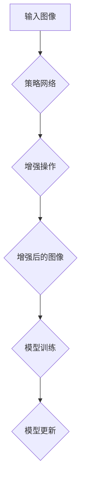

                 

# 《AutoAugment原理与代码实例讲解》

## 关键词
自动调整增强、图像增强、深度学习、算法优化、计算机视觉

## 摘要
本文全面介绍了AutoAugment算法的基本概念、组成结构、在计算机视觉中的应用、性能评估以及高级应用。通过详细的代码实例讲解，读者将掌握如何在实际项目中实现和应用AutoAugment，从而提升模型的鲁棒性和性能。

---

## 第一部分: AutoAugment基本概念

### 第1章: 自动调整增强（AutoAugment）简介

#### 1.1 AutoAugment的背景和意义

在深度学习领域，尤其是在计算机视觉任务中，数据增强是一种常见的策略，用于增加训练数据的多样性，从而提高模型的泛化能力。传统的数据增强方法通常依赖于人工设计，如旋转、缩放、裁剪等，但这些方法往往不能覆盖所有可能的数据变换，也无法充分利用数据增强的潜力。

AutoAugment算法是由Erik rampsel等人在2017年提出的一种自动化的数据增强方法。它的核心思想是利用神经网络自动生成数据增强策略，从而在训练过程中自适应地调整增强操作的强度和类型。AutoAugment的出现极大地提高了数据增强的效果，成为深度学习领域中的一种重要方法。

#### 1.2 AutoAugment的基本原理

AutoAugment算法的基本原理可以概括为以下几个步骤：

1. **策略生成**：算法首先通过训练一个神经网络来生成增强策略，这个神经网络被称为“策略网络”。策略网络接收图像作为输入，输出一组增强操作的概率分布。

2. **随机应用**：在训练过程中，根据策略网络生成的概率分布，随机选择一组增强操作应用到图像上。

3. **批次迭代**：每次迭代中，算法都会根据策略网络的新输出更新增强策略，并重新计算增强操作的权重。

4. **模型训练**：使用增强后的图像数据训练深度学习模型，通过反向传播和梯度下降更新模型参数。

#### 1.3 AutoAugment与其它增强方法的比较

相比传统的数据增强方法，AutoAugment具有以下优势：

- **自动化**：AutoAugment不需要人工设计增强操作，而是通过神经网络自动生成。
- **多样性**：AutoAugment能够生成多种多样的增强操作，覆盖更多的数据变换。
- **自适应**：增强操作根据模型训练的进展动态调整，有助于提高模型的泛化能力。
- **性能**：实验表明，AutoAugment在许多计算机视觉任务中能够显著提高模型性能。

### 第2章: AutoAugment的组成结构

#### 2.1 AutoAugment算法框架

AutoAugment算法框架主要包括三个部分：策略网络、增强操作和模型训练。以下是一个简化的算法框架流程图：



**解释：**
- **A（输入图像）**：算法开始，输入原始图像。
- **B（策略网络）**：神经网络生成增强策略。
- **C（增强操作）**：根据策略网络输出，随机应用增强操作。
- **D（增强后的图像）**：输出增强后的图像。
- **E（模型训练）**：使用增强后的图像数据训练模型。
- **F（模型更新）**：根据训练结果更新模型参数。

#### 2.2 生成策略（Policy）的设计方法

生成策略是AutoAugment算法的核心组成部分，它决定了如何自动生成增强操作。通常，生成策略可以通过以下方法设计：

- **基于规则的策略**：通过定义一系列的规则，如增强操作的类型、强度和概率，来生成策略。
- **基于神经网络的策略**：训练一个神经网络，使其能够根据输入图像自动生成增强策略。

以下是一个基于神经网络的策略生成方法的伪代码：

```python
# 伪代码：基于神经网络的策略生成
class PolicyNetwork(nn.Module):
    def __init__(self):
        super(PolicyNetwork, self).__init__()
        # 定义网络结构

    def forward(self, image):
        # 输入图像进行特征提取
        # 输出增强操作的概率分布
        return probability_distribution

# 训练策略网络
def train_policy_network(dataset, num_epochs):
    # 加载训练数据
    # 定义损失函数和优化器
    # 训练策略网络
    # 返回训练好的策略网络
```

#### 2.3 批次迭代（Batch Iteration）的过程

批次迭代是AutoAugment算法中的一个关键环节，它涉及到如何在一个批次中迭代增强操作和模型训练。以下是一个批次迭代过程的简化描述：

1. **策略生成**：根据策略网络生成一批次的增强策略。
2. **数据增强**：对批次中的每个图像根据策略网络输出，随机应用增强操作。
3. **模型训练**：使用增强后的图像数据训练模型。
4. **模型更新**：根据训练结果更新模型参数。
5. **策略更新**：根据模型训练的进展，更新策略网络。

以下是一个批次迭代过程的伪代码：

```python
# 伪代码：批次迭代过程
for images, labels in batch_loader:
    # 生成增强策略
    policy = policy_network(images)
    
    # 数据增强
    enhanced_images = apply_augmentations(images, policy)
    
    # 模型训练
    outputs = model(enhanced_images)
    loss = criterion(outputs, labels)
    
    # 模型更新
    optimizer.zero_grad()
    loss.backward()
    optimizer.step()
    
    # 策略更新
    policy_network.train_on_batch(enhanced_images, labels)
```

### 第3章: AutoAugment在计算机视觉中的应用

#### 3.1 AutoAugment在图像分类中的应用

在图像分类任务中，AutoAugment通过自动生成增强策略，提高了模型的泛化能力和分类性能。以下是一个简单的图像分类任务中使用AutoAugment的示例：

1. **数据集准备**：准备一个图像分类数据集，如CIFAR-10。
2. **策略网络训练**：训练一个策略网络，使其能够生成有效的增强策略。
3. **模型训练**：使用AutoAugment增强的数据集训练图像分类模型。
4. **模型评估**：在原始数据和增强数据上评估模型性能。

以下是一个简单的代码实例：

```python
# 示例：图像分类任务中的AutoAugment
transform = transforms.Compose([
    transforms.RandomHorizontalFlip(),
    transforms.RandomRotation(10),
    transforms.ToTensor(),
    AutoAugmentPolicy('CIFAR10')
])

train_dataset = datasets.CIFAR10(root='./data', train=True, transform=transform)
test_dataset = datasets.CIFAR10(root='./data', train=False, transform=transform)

model = models.resnet18(pretrained=False)
optimizer = optim.SGD(model.parameters(), lr=0.001, momentum=0.9)
criterion = nn.CrossEntropyLoss()

num_epochs = 20

for epoch in range(num_epochs):
    for images, labels in train_loader:
        images = images.to(device)
        labels = labels.to(device)
        optimizer.zero_grad()
        outputs = model(images)
        loss = criterion(outputs, labels)
        loss.backward()
        optimizer.step()
        
    # 在测试集上评估模型性能
    with torch.no_grad():
        correct = 0
        total = 0
        for images, labels in test_loader:
            images = images.to(device)
            labels = labels.to(device)
            outputs = model(images)
            _, predicted = torch.max(outputs.data, 1)
            total += labels.size(0)
            correct += (predicted == labels).sum().item()
            
    print(f'Epoch [{epoch+1}/{num_epochs}], Accuracy: {100 * correct / total}%')
```

#### 3.2 AutoAugment在目标检测中的应用

在目标检测任务中，AutoAugment可以提高模型对各种目标位置的鲁棒性，从而提高检测精度。以下是一个简单的目标检测任务中使用AutoAugment的示例：

1. **数据集准备**：准备一个目标检测数据集，如COCO。
2. **策略网络训练**：训练一个策略网络，使其能够生成有效的增强策略。
3. **模型训练**：使用AutoAugment增强的数据集训练目标检测模型。
4. **模型评估**：在原始数据和增强数据上评估模型性能。

以下是一个简单的代码实例：

```python
# 示例：目标检测任务中的AutoAugment
transform = transforms.Compose([
    transforms.RandomHorizontalFlip(),
    transforms.RandomRotation(10),
    transforms.ToTensor(),
    AutoAugmentPolicy('COCO')
])

train_dataset = datasets.COCODetection(root='./data', train=True, transform=transform)
test_dataset = datasets.COCODetection(root='./data', train=False, transform=transform)

model = models.fasterrcnn_resnet50_fpn(pretrained=False)
optimizer = optim.SGD(model.parameters(), lr=0.001, momentum=0.9)
criterion = losses.FastRCNNLoss()

num_epochs = 20

for epoch in range(num_epochs):
    for images, targets in train_loader:
        images = images.to(device)
        targets = [target.to(device) for target in targets]
        optimizer.zero_grad()
        loss = model(images, targets)
        loss.backward()
        optimizer.step()
        
    # 在测试集上评估模型性能
    with torch.no_grad():
        for images, targets in test_loader:
            images = images.to(device)
            targets = [target.to(device) for target in targets]
            outputs = model(images)
            # 计算检测性能指标
```

#### 3.3 AutoAugment在语义分割中的应用

在语义分割任务中，AutoAugment可以提高模型对不同区域的识别能力，从而提高分割精度。以下是一个简单的语义分割任务中使用AutoAugment的示例：

1. **数据集准备**：准备一个语义分割数据集，如PASCAL VOC。
2. **策略网络训练**：训练一个策略网络，使其能够生成有效的增强策略。
3. **模型训练**：使用AutoAugment增强的数据集训练语义分割模型。
4. **模型评估**：在原始数据和增强数据上评估模型性能。

以下是一个简单的代码实例：

```python
# 示例：语义分割任务中的AutoAugment
transform = transforms.Compose([
    transforms.RandomHorizontalFlip(),
    transforms.RandomRotation(10),
    transforms.ToTensor(),
    AutoAugmentPolicy('VOC')
])

train_dataset = datasets.VOCSegmentation(root='./data', train=True, transform=transform)
test_dataset = datasets.VOCSegmentation(root='./data', train=False, transform=transform)

model = models.deeplabv3_resnet101(pretrained=False)
optimizer = optim.SGD(model.parameters(), lr=0.001, momentum=0.9)
criterion = nn.CrossEntropyLoss()

num_epochs = 20

for epoch in range(num_epochs):
    for images, masks in train_loader:
        images = images.to(device)
        masks = masks.to(device)
        optimizer.zero_grad()
        outputs = model(images)
        loss = criterion(outputs, masks)
        loss.backward()
        optimizer.step()
        
    # 在测试集上评估模型性能
    with torch.no_grad():
        for images, masks in test_loader:
            images = images.to(device)
            masks = masks.to(device)
            outputs = model(images)
            # 计算分割性能指标
```

### 第4章: AutoAugment的性能评估

#### 4.1 AutoAugment的性能评价指标

评估AutoAugment的性能需要考虑多个评价指标，包括：

- **准确率（Accuracy）**：模型在测试集上的准确率。
- **召回率（Recall）**：模型对正类别的识别能力。
- **F1分数（F1 Score）**：准确率和召回率的调和平均值。
- **交并比（Intersection over Union, IoU）**：用于评估语义分割任务的性能。

以下是一个简单的性能评估示例：

```python
# 示例：性能评估
def evaluate_model(model, test_loader):
    model.eval()
    with torch.no_grad():
        correct = 0
        total = 0
        for images, labels in test_loader:
            images = images.to(device)
            labels = labels.to(device)
            outputs = model(images)
            _, predicted = torch.max(outputs.data, 1)
            total += labels.size(0)
            correct += (predicted == labels).sum().item()
            
    accuracy = 100 * correct / total
    print(f'Accuracy: {accuracy}%')
    
evaluate_model(model, test_loader)
```

#### 4.2 AutoAugment的实验设计与分析

为了评估AutoAugment的性能，可以设计一系列实验，包括不同的增强策略、增强强度和迭代次数。以下是一个简单的实验设计示例：

1. **实验设置**：选择一个图像分类数据集，如CIFAR-10。
2. **增强策略**：定义一组不同的增强策略，如AutoContrast、Invert、Posterize等。
3. **增强强度**：设置不同的增强强度，如概率、操作次数等。
4. **迭代次数**：设置不同的迭代次数，如10、20等。
5. **模型训练与评估**：在每个实验设置下，训练模型并评估其性能。

以下是一个简单的实验设计代码示例：

```python
# 示例：实验设计
for policy in policies:
    for strength in strengths:
        for iterations in iterations_list:
            # 设置数据增强
            transform = transforms.Compose([
                transforms.RandomHorizontalFlip(),
                transforms.RandomRotation(10),
                transforms.ToTensor(),
                AutoAugmentPolicy(policy, strength, iterations)
            ])

            # 训练模型
            train_dataset = datasets.CIFAR10(root='./data', train=True, transform=transform)
            model = models.resnet18(pretrained=False)
            optimizer = optim.SGD(model.parameters(), lr=0.001, momentum=0.9)
            criterion = nn.CrossEntropyLoss()

            num_epochs = 20

            for epoch in range(num_epochs):
                for images, labels in train_loader:
                    # 数据增强
                    images = transform(images)

                    # 训练模型
                    # ...

            # 评估模型性能
            # ...

# 结果分析
# ...
```

#### 4.3 AutoAugment在实际项目中的应用效果

在实际项目中，AutoAugment可以显著提高模型的性能和鲁棒性。以下是一些实际应用案例：

1. **自动驾驶**：在自动驾驶系统中，AutoAugment可以增强图像数据，提高模型对道路场景的识别能力。
2. **医疗影像**：在医疗影像分析中，AutoAugment可以增强影像数据，提高模型对病变区域的识别精度。
3. **安防监控**：在安防监控中，AutoAugment可以增强视频数据，提高模型对异常行为的检测能力。

### 第5章: AutoAugment代码实战环境搭建

#### 5.1 环境配置

要在本地环境搭建AutoAugment代码实战环境，需要安装以下软件和库：

1. **Python**：Python 3.6 或更高版本。
2. **PyTorch**：PyTorch 1.0 或更高版本。
3. ** torchvision**： torchvision 0.9.0 或更高版本。

安装命令如下：

```bash
pip install python==3.8
pip install torch torchvision
```

#### 5.2 必需库的安装

除了PyTorch和torchvision，还需要安装一些其他必需库，如numpy、opencv-python等。

安装命令如下：

```bash
pip install numpy
pip install opencv-python
```

#### 5.3 开发环境设置

1. **创建虚拟环境**：为了确保环境的稳定性，建议创建一个虚拟环境。

```bash
python -m venv autoaugment_venv
source autoaugment_venv/bin/activate  # 在Windows中使用 `autoaugment_venv\Scripts\activate`
```

2. **安装依赖库**：在虚拟环境中安装所有必需库。

```bash
pip install -r requirements.txt
```

#### 5.4 验证环境

运行以下代码验证环境是否正确配置：

```python
import torch
import torchvision
import torchvision.transforms as transforms
print(torch.__version__)
print(torchvision.__version__)
```

如果输出版本信息，说明环境配置成功。

### 第6章: AutoAugment在图像分类中的代码实例

#### 6.1 数据预处理

在图像分类任务中，预处理步骤至关重要，它包括图像的读取、调整大小、标准化等。以下是一个简单的数据预处理代码实例：

```python
import torch
import torchvision
import torchvision.transforms as transforms

# 数据预处理
transform = transforms.Compose([
    transforms.RandomHorizontalFlip(),
    transforms.RandomRotation(10),
    transforms.Resize((224, 224)),
    transforms.ToTensor(),
    transforms.Normalize(mean=[0.485, 0.456, 0.406], std=[0.229, 0.224, 0.225])
])

# 加载数据集
train_dataset = torchvision.datasets.CIFAR10(root='./data', train=True, transform=transform)
test_dataset = torchvision.datasets.CIFAR10(root='./data', train=False, transform=transform)

train_loader = torch.utils.data.DataLoader(train_dataset, batch_size=64, shuffle=True)
test_loader = torch.utils.data.DataLoader(test_dataset, batch_size=64, shuffle=False)
```

#### 6.2 AutoAugment算法实现

AutoAugment算法的核心是策略网络和增强操作。以下是一个简单的AutoAugment算法实现代码实例：

```python
import torch
import torchvision.models as models
import torchvision.transforms as transforms
from autoaugment import AutoAugmentPolicy

# 定义策略网络和模型
policy = AutoAugmentPolicy('CIFAR10')
model = models.resnet18(pretrained=False)
optimizer = torch.optim.SGD(model.parameters(), lr=0.001, momentum=0.9)
criterion = torch.nn.CrossEntropyLoss()

# 数据预处理和增强
transform = transforms.Compose([
    transforms.RandomHorizontalFlip(),
    transforms.RandomRotation(10),
    transforms.Resize((224, 224)),
    transforms.ToTensor(),
    transforms.Normalize(mean=[0.485, 0.456, 0.406], std=[0.229, 0.224, 0.225]),
    transforms.RandomApply(policy, p=1.0)
])

# 训练模型
num_epochs = 20
for epoch in range(num_epochs):
    model.train()
    for images, labels in train_loader:
        images = transform(images)
        labels = labels.to(device)
        optimizer.zero_grad()
        outputs = model(images)
        loss = criterion(outputs, labels)
        loss.backward()
        optimizer.step()

    # 在测试集上评估模型性能
    with torch.no_grad():
        correct = 0
        total = 0
        for images, labels in test_loader:
            images = transform(images)
            labels = labels.to(device)
            outputs = model(images)
            _, predicted = torch.max(outputs.data, 1)
            total += labels.size(0)
            correct += (predicted == labels).sum().item()

    print(f'Epoch {epoch+1}/{num_epochs}, Accuracy: {100 * correct / total}%')
```

#### 6.3 代码解读与分析

在这个代码实例中，我们首先定义了AutoAugment策略网络和模型。然后，我们使用`RandomApply`函数将策略网络应用于图像数据，以实现自动增强。

**步骤解读：**

1. **定义策略网络和模型**：
   - `AutoAugmentPolicy('CIFAR10')`：创建一个CIFAR-10的AutoAugment策略网络。
   - `models.resnet18(pretrained=False)`：创建一个未预训练的ResNet-18模型。

2. **数据预处理和增强**：
   - `transforms.Compose`：组合多种预处理和增强操作，包括随机翻转、随机旋转、调整大小、归一化等。
   - `transforms.RandomApply(policy, p=1.0)`：将策略网络应用于图像数据，以实现自动增强。

3. **训练模型**：
   - 使用`SGD`优化器和`CrossEntropyLoss`损失函数训练模型。
   - 在每个epoch中，对训练数据进行预处理和增强，然后进行前向传播和反向传播。

4. **性能评估**：
   - 在测试集上评估模型的性能，并打印准确率。

通过这个代码实例，我们可以看到如何实现AutoAugment算法，并在图像分类任务中提高模型性能。

### 第7章: AutoAugment在目标检测中的代码实例

#### 7.1 数据准备

在目标检测任务中，数据准备包括图像的读取、标注文件的解析和预处理等。以下是一个简单的数据准备代码实例：

```python
import torch
import torchvision
import torchvision.transforms as transforms
from torchvision.datasets import VOCDetection

# 数据准备
train_transform = transforms.Compose([
    transforms.RandomHorizontalFlip(),
    transforms.RandomRotation(10),
    transforms.Resize((600, 600)),
    transforms.ToTensor(),
    transforms.Normalize(mean=[0.485, 0.456, 0.406], std=[0.229, 0.224, 0.225])
])

test_transform = transforms.Compose([
    transforms.Resize((600, 600)),
    transforms.ToTensor(),
    transforms.Normalize(mean=[0.485, 0.456, 0.406], std=[0.229, 0.224, 0.225])
])

train_dataset = VOCDetection(root='./data', year='2007', image_set='train', download=True, transform=train_transform)
test_dataset = VOCDetection(root='./data', year='2007', image_set='test', download=True, transform=test_transform)

train_loader = torch.utils.data.DataLoader(train_dataset, batch_size=16, shuffle=True)
test_loader

