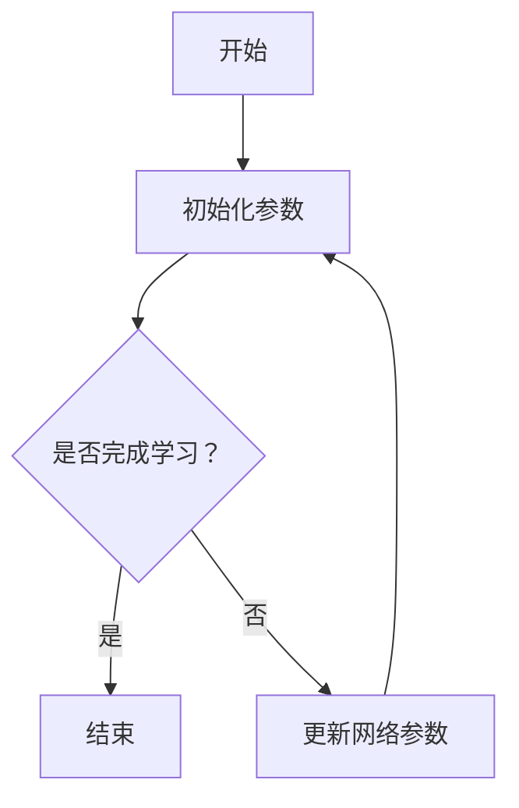

                 

# DDPG原理与代码实例讲解

> **关键词**：深度强化学习，DDPG算法，深度Q网络，深度强化学习架构，项目实战，代码示例

> **摘要**：本文深入探讨深度确定性策略梯度（DDPG）算法的原理与实现。首先，我们将介绍DDPG的基本概念和与深度强化学习的关系，然后详细解释DDPG的核心算法原理，包括其数学模型和优化策略。接着，我们将通过实际项目案例，讲解如何搭建实验环境、设计实验和实现DDPG算法。文章还将探讨DDPG在不同应用场景中的实际应用，并分析其改进与优化方向。最后，通过具体代码实例，对DDPG算法的实现进行详细解读，帮助读者更好地理解这一先进算法。

### 第一部分：DDPG原理介绍

#### 第1章：DDPG基本概念

##### 1.1 DDPG算法的起源与发展

###### 1.1.1 DDPG的概念引入

深度确定性策略梯度（Deep Deterministic Policy Gradient，DDPG）算法是一种基于深度强化学习的算法，它结合了确定性策略梯度（DPG）和深度Q网络（DQN）的优点，通过深度神经网络来逼近策略和价值函数，使得算法在处理高维状态空间和动作空间时表现更加优秀。

DDPG算法最初由Schulman等人在2015年的论文《High-Dimensional Continuous Control Using Deep Reinforcement Learning》中提出。该算法迅速引起了广泛关注，并在许多领域取得了显著成果。

###### 1.1.2 DDPG的发展历程

自提出以来，DDPG算法经历了多个版本的迭代和优化。例如，Schulman等人后续的论文进一步探讨了DDPG在不同领域的应用，包括机器人控制和自动驾驶等。此外，还有许多研究者对DDPG算法进行了改进和扩展，如引入经验回放、目标网络和噪声策略等，提高了算法的稳定性和效率。

##### 1.2 DDPG与深度强化学习的关系

###### 1.2.1 深度强化学习的基本原理

深度强化学习（Deep Reinforcement Learning，DRL）是一种结合了深度学习和强化学习的方法。它利用深度神经网络来学习环境状态和动作之间的映射，并通过奖励信号来调整策略，使智能体能够在复杂环境中学习到最优策略。

深度强化学习的关键组成部分包括：

- **智能体（Agent）**：执行动作并接收环境反馈的实体。
- **环境（Environment）**：智能体进行交互的动态系统。
- **状态（State）**：环境在某一时刻的状态描述。
- **动作（Action）**：智能体能够执行的操作。
- **奖励（Reward）**：对智能体行为的即时评价。
- **策略（Policy）**：智能体选择动作的策略函数。

###### 1.2.2 DDPG的核心优势

DDPG算法具有以下核心优势：

- **适用于连续动作空间**：与基于值函数的算法（如DQN）相比，DDPG可以直接处理连续动作空间，避免了离散化动作空间的复杂度。
- **确定性策略**：DDPG采用确定性策略，通过优化策略网络来直接学习最优动作。
- **深度神经网络**：DDPG利用深度神经网络来逼近策略和价值函数，使得算法能够处理高维状态空间。

##### 1.3 DDPG的基本架构

###### 1.3.1 Actor-Critic架构

DDPG算法基于Actor-Critic架构，其中：

- **Actor网络**：用于生成动作的确定性策略网络。
- **Critic网络**：用于评估动作价值的值函数网络。

这种架构使得DDPG能够同时优化策略和价值函数，提高学习效率和收敛速度。

###### 1.3.2 状态处理与动作空间

DDPG算法处理高维状态空间和连续动作空间，通过以下方式：

- **状态处理**：使用卷积神经网络（CNN）或其他深度学习架构对高维状态数据进行特征提取和降维。
- **动作空间**：对于连续动作空间，使用连续值来表示动作，如使用一维或多维高斯分布来表示动作。

###### 1.3.3 离线评估与在线学习

DDPG算法在离线评估和在线学习之间进行平衡：

- **离线评估**：使用经验回放机制收集并存储经验数据，用于训练Critic网络和Actor网络的目标网络。
- **在线学习**：智能体在环境中交互，实时更新Critic网络和Actor网络的参数。

##### 2.1 DDPG算法的核心组件

###### 2.1.1 Actor网络

Actor网络是DDPG算法的核心组件之一，用于生成动作。其具体实现如下：

```python
# Actor网络实现伪代码
def actor_network(state):
    # 使用卷积神经网络提取状态特征
    features = conv_network(state)
    # 使用全连接层生成动作概率分布
    action_probs = fully_connected_layer(features, action_size)
    # 转换为确定性动作
    action = sample_action(action_probs)
    return action
```

其中，`conv_network` 用于特征提取，`fully_connected_layer` 用于生成动作概率分布，`sample_action` 用于从概率分布中采样得到确定性动作。

###### 2.1.2 Critic网络

Critic网络是DDPG算法的另一个核心组件，用于评估动作价值。其具体实现如下：

```python
# Critic网络实现伪代码
def critic_network(state, action):
    # 使用卷积神经网络提取状态特征
    state_features = conv_network(state)
    # 使用全连接层生成动作值
    action_value = fully_connected_layer(state_features, action)
    return action_value
```

其中，`conv_network` 用于特征提取，`fully_connected_layer` 用于生成动作值。

###### 2.1.3 Q-learning与SARSA算法

DDPG算法结合了Q-learning和SARSA算法的优点：

- **Q-learning**：使用经验回放和目标网络来稳定学习过程。
- **SARSA**：在每一步都使用当前状态和动作来更新策略。

具体实现如下：

```python
# DDPG算法更新规则伪代码
def update_networks(state, action, reward, next_state, done):
    # 使用经验回放机制存储经验数据
    replay_buffer.append((state, action, reward, next_state, done))
    
    # 从经验回放中随机抽取一批经验数据
    batch = sample_batch(replay_buffer)
    
    # 更新Critic网络的目标值
    target_values = []
    for state, action, reward, next_state, done in batch:
        if not done:
            target_value = reward + discount * critic_network(next_state, actor_network(next_state))
        else:
            target_value = reward
        target_values.append(target_value)
    
    # 计算Critic网络的误差
    critic_loss = critic_loss_function(critic_network(state, action), target_values)
    
    # 更新Critic网络
    critic_optimizer.minimize(critic_loss)
    
    # 更新Actor网络
    actor_loss = actor_loss_function(actor_network(state), target_values)
    actor_optimizer.minimize(actor_loss)
```

其中，`replay_buffer` 用于存储经验数据，`sample_batch` 用于从经验回放中随机抽取一批经验数据，`discount` 用于计算未来奖励的折扣因子，`critic_loss_function` 和 `actor_loss_function` 分别用于计算Critic网络和Actor网络的损失函数，`critic_optimizer` 和 `actor_optimizer` 分别用于优化Critic网络和Actor网络的参数。

##### 2.2 DDPG算法的优化策略

###### 2.2.1 基于梯度的优化方法

DDPG算法采用基于梯度的优化方法，通过反向传播算法来更新网络参数。具体实现如下：

```python
# 基于梯度的优化方法伪代码
def train_networks(optimizer, loss_function, model, learning_rate):
    # 计算损失函数的梯度
    gradients = compute_gradients(model)
    
    # 使用梯度更新模型参数
    optimizer.apply_gradients(zip(gradients, model.parameters()), learning_rate)
```

其中，`compute_gradients` 用于计算模型参数的梯度，`apply_gradients` 用于使用梯度更新模型参数。

###### 2.2.2 反向传播算法

反向传播算法是梯度优化方法的基础，用于计算模型参数的梯度。具体实现如下：

```python
# 反向传播算法伪代码
def backward_propagation(model, loss):
    # 计算损失函数对模型参数的梯度
    gradients = torch.autograd.grad(loss, model.parameters(), create_graph=True)
    
    # 更新模型参数
    for param, gradient in zip(model.parameters(), gradients):
        param.data -= learning_rate * gradient
```

其中，`torch.autograd.grad` 用于计算模型参数的梯度，`create_graph=True` 表示计算梯度时生成计算图。

###### 2.2.3 梯度下降与随机梯度下降算法

DDPG算法采用梯度下降和随机梯度下降算法来优化模型参数。具体实现如下：

```python
# 梯度下降算法伪代码
def gradient_descent(model, loss_function, learning_rate):
    # 计算损失函数的梯度
    gradients = compute_gradients(model)
    
    # 更新模型参数
    for param, gradient in zip(model.parameters(), gradients):
        param.data -= learning_rate * gradient

# 随机梯度下降算法伪代码
def stochastic_gradient_descent(model, loss_function, batch_size, learning_rate):
    # 随机抽取一批数据
    batch = sample_batch(batch_size)
    
    # 计算损失函数的梯度
    gradients = compute_gradients(model, batch)
    
    # 更新模型参数
    for param, gradient in zip(model.parameters(), gradients):
        param.data -= learning_rate * gradient
```

其中，`compute_gradients` 用于计算模型参数的梯度，`sample_batch` 用于从数据集中随机抽取一批数据。

##### 2.3 DDPG算法的数学模型

###### 2.3.1 目标函数的定义

DDPG算法的目标函数用于优化Actor网络和Critic网络的参数，具体如下：

```math
\begin{aligned}
\min_{\theta_{\text{actor}}, \theta_{\text{critic}}} L &= \frac{1}{N} \sum_{i=1}^{N} \left( y_i - \pi_{\theta_{\text{actor}}} (s_i) \right)^2 \\
y_i &= r_i + \gamma V_{\theta_{\text{critic}}} (s_{i+1})
\end{aligned}
```

其中，$y_i$ 是目标值，$r_i$ 是即时奖励，$s_i$ 是状态，$\pi_{\theta_{\text{actor}}} (s_i)$ 是策略网络输出的动作概率分布，$V_{\theta_{\text{critic}}} (s_{i+1})$ 是值函数网络的输出。

###### 2.3.2 动作价值函数的推导

动作价值函数 $V_{\theta_{\text{critic}}} (s)$ 表示在状态 $s$ 下执行最优动作的期望回报，具体如下：

```math
V_{\theta_{\text{critic}}} (s) = \sum_{a} \pi_{\theta_{\text{actor}}} (a|s) Q_{\theta_{\text{critic}}} (s, a)
```

其中，$\pi_{\theta_{\text{actor}}} (a|s)$ 是策略网络输出的动作概率分布，$Q_{\theta_{\text{critic}}} (s, a)$ 是值函数网络的输出。

###### 2.3.3 奖励函数的设计

奖励函数是强化学习中的一个关键组件，用于引导智能体在环境中的行为。在DDPG算法中，奖励函数的设计需要满足以下原则：

- **奖励的即时性**：奖励应当及时反馈智能体的行为。
- **奖励的多样性**：奖励应当能够区分不同的行为。
- **奖励的平衡性**：奖励应当平衡探索和利用的平衡。

一个简单的奖励函数设计如下：

```python
# 奖励函数伪代码
def reward_function(action, target_action):
    if action == target_action:
        return 1.0
    else:
        return -1.0
```

##### 2.4 DDPG算法的流程图



### 第二部分：DDPG代码实例讲解

#### 第5章：简单环境下的DDPG应用

##### 5.1 环境介绍

###### 5.1.1 环境选择与特点

在本章中，我们将使用简单的CartPole环境来演示DDPG算法的应用。CartPole是一个经典的强化学习环境，其中一个小车（Cart）连接着一个杆（Pole），目标是在不使杆倒下的情况下，使小车在直线上运动。

该环境的特征如下：

- **状态**：包括小车位置、小车速度和杆的角度。
- **动作**：包括向左或向右推动小车。
- **奖励**：如果小车在直线上运动超过一定时间，则获得正奖励；否则，获得负奖励。
- **惩罚**：当杆倒下时，立即给予惩罚。

###### 5.1.2 环境搭建步骤

首先，我们需要安装所需的Python库，包括PyTorch和Gym。以下是安装命令：

```bash
pip install torch torchvision gym
```

接下来，我们可以使用Gym库中的CartPole环境。以下是一个简单的示例代码：

```python
import gym

# 创建CartPole环境实例
env = gym.make("CartPole-v1")

# 打印环境信息
print(env.action_space)
print(env.observation_space)
```

##### 5.2 DDPG算法实现

在本节中，我们将实现DDPG算法的Actor网络和Critic网络，并使用CartPole环境进行训练。

###### 5.2.1 Actor网络实现

Actor网络用于生成动作。以下是Actor网络的实现：

```python
import torch
import torch.nn as nn
import torch.optim as optim

# 定义Actor网络结构
class ActorNetwork(nn.Module):
    def __init__(self, input_size, hidden_size, output_size):
        super(ActorNetwork, self).__init__()
        self.fc1 = nn.Linear(input_size, hidden_size)
        self.fc2 = nn.Linear(hidden_size, output_size)
    
    def forward(self, state):
        x = torch.relu(self.fc1(state))
        action = torch.tanh(self.fc2(x))
        return action
```

其中，`input_size` 是输入状态的大小，`hidden_size` 是隐藏层的大小，`output_size` 是输出动作的大小。`torch.relu` 用于激活函数，`torch.tanh` 用于将输出限制在[-1, 1]之间，模拟连续动作空间。

###### 5.2.2 Critic网络实现

Critic网络用于评估动作价值。以下是Critic网络的实现：

```python
# 定义Critic网络结构
class CriticNetwork(nn.Module):
    def __init__(self, input_size, hidden_size, output_size):
        super(CriticNetwork, self).__init__()
        self.fc1 = nn.Linear(input_size, hidden_size)
        self.fc2 = nn.Linear(hidden_size, output_size)
    
    def forward(self, state, action):
        x = torch.relu(self.fc1(torch.cat((state, action), 1)))
        Q_value = self.fc2(x)
        return Q_value
```

其中，`input_size` 是输入状态和动作的大小，`hidden_size` 是隐藏层的大小，`output_size` 是输出动作值的大小。`torch.cat` 用于将状态和动作拼接在一起。

###### 5.2.3 学习过程与策略迭代

以下是DDPG算法的学习过程：

```python
# 初始化网络和优化器
actor = ActorNetwork(input_size, hidden_size, output_size)
critic = CriticNetwork(input_size, hidden_size, output_size)
actor_optimizer = optim.Adam(actor.parameters(), lr=learning_rate)
critic_optimizer = optim.Adam(critic.parameters(), lr=learning_rate)

# 定义损失函数
actor_loss_function = nn.MSELoss()
critic_loss_function = nn.MSELoss()

# 训练过程
for episode in range(num_episodes):
    # 初始化环境
    state = env.reset()
    
    # 游戏进行
    while True:
        # 生成动作
        action = actor(torch.tensor(state).float())
        
        # 执行动作
        next_state, reward, done, _ = env.step(action.detach().numpy()[0])
        
        # 更新Critic网络
        Q_value = critic(torch.tensor(state).float(), action)
        target_Q_value = reward + discount * critic(torch.tensor(next_state).float(), actor(torch.tensor(next_state).float()))
        critic_loss = critic_loss_function(Q_value, target_Q_value)
        critic_optimizer.zero_grad()
        critic_loss.backward()
        critic_optimizer.step()
        
        # 更新Actor网络
        actor_loss = actor_loss_function(action, target_Q_value)
        actor_optimizer.zero_grad()
        actor_loss.backward()
        actor_optimizer.step()
        
        # 更新状态
        state = next_state
        
        # 检查游戏是否结束
        if done:
            break

    # 打印训练进度
    print(f"Episode {episode+1}/{num_episodes}, Reward: {total_reward}")
```

其中，`num_episodes` 是训练的回合数，`learning_rate` 是学习率，`discount` 是折扣因子。在训练过程中，我们首先初始化环境，然后生成动作并执行动作，更新Critic网络和Actor网络的参数，直到游戏结束。

##### 5.3 代码示例与分析

在本节中，我们将提供完整的代码示例，并对其进行分析。

```python
import gym
import torch
import torch.nn as nn
import torch.optim as optim

# 定义超参数
input_size = 4
hidden_size = 64
output_size = 1
learning_rate = 0.001
discount = 0.99
batch_size = 32

# 初始化网络和优化器
actor = ActorNetwork(input_size, hidden_size, output_size)
critic = CriticNetwork(input_size, hidden_size, output_size)
actor_optimizer = optim.Adam(actor.parameters(), lr=learning_rate)
critic_optimizer = optim.Adam(critic.parameters(), lr=learning_rate)

# 定义损失函数
actor_loss_function = nn.MSELoss()
critic_loss_function = nn.MSELoss()

# 训练过程
for episode in range(1000):
    # 初始化环境
    state = env.reset()
    
    # 游戏进行
    while True:
        # 生成动作
        action = actor(torch.tensor(state).float())
        
        # 执行动作
        next_state, reward, done, _ = env.step(action.detach().numpy()[0])
        
        # 更新Critic网络
        Q_value = critic(torch.tensor(state).float(), action)
        target_Q_value = reward + discount * critic(torch.tensor(next_state).float(), actor(torch.tensor(next_state).float()))
        critic_loss = critic_loss_function(Q_value, target_Q_value)
        critic_optimizer.zero_grad()
        critic_loss.backward()
        critic_optimizer.step()
        
        # 更新Actor网络
        actor_loss = actor_loss_function(action, target_Q_value)
        actor_optimizer.zero_grad()
        actor_loss.backward()
        actor_optimizer.step()
        
        # 更新状态
        state = next_state
        
        # 检查游戏是否结束
        if done:
            break

    # 打印训练进度
    print(f"Episode {episode+1}/{1000}, Reward: {total_reward}")
```

**代码解读**：

1. **网络定义**：我们定义了Actor网络和Critic网络的类，分别包含两层全连接层。Actor网络用于生成动作，Critic网络用于评估动作值。

2. **优化器和损失函数**：我们使用Adam优化器来更新网络参数，并使用MSE损失函数来计算网络损失。

3. **训练过程**：在训练过程中，我们首先初始化环境，然后生成动作并执行动作，更新Critic网络和Actor网络的参数，直到游戏结束。

4. **更新规则**：Critic网络使用目标Q值来计算损失，并更新Critic网络的参数。Actor网络使用目标Q值来计算损失，并更新Actor网络的参数。

通过这个简单的示例，我们可以看到DDPG算法的基本实现过程。在实际应用中，我们可以根据具体需求对算法进行调整和优化，使其适用于更复杂的任务和环境。

##### 5.4 复杂环境下的DDPG应用

在本节中，我们将探讨DDPG算法在复杂环境中的应用。为了演示，我们选择使用OpenAI的MuJoCo环境中的InvertedPendulum环境。

InvertedPendulum环境是一个倒立摆环境，其中一个小球位于一个长杆的末端，目标是在不使杆倒下的情况下，保持小球在水平面上运动。

该环境的特征如下：

- **状态**：包括小球位置、小球速度和杆的角度。
- **动作**：包括向左或向右推动杆。
- **奖励**：如果小球在水平面上运动超过一定时间，则获得正奖励；否则，获得负奖励。
- **惩罚**：当杆倒下时，立即给予惩罚。

###### 5.4.1 环境搭建步骤

首先，我们需要安装所需的Python库，包括PyTorch、Gym和MuJoCo。以下是安装命令：

```bash
pip install torch torchvision gym
pip install mujoco-py
```

接下来，我们可以使用Gym和MuJoCo库中的InvertedPendulum环境。以下是一个简单的示例代码：

```python
import gym
import mujoco_py

# 创建InvertedPendulum环境实例
env = gym.make("InvertedPendulum-v2")

# 打印环境信息
print(env.action_space)
print(env.observation_space)
```

###### 5.4.2 DDPG算法实现

在本节中，我们将实现DDPG算法的Actor网络和Critic网络，并使用InvertedPendulum环境进行训练。

```python
import torch
import torch.nn as nn
import torch.optim as optim

# 定义超参数
input_size = 4
hidden_size = 64
output_size = 1
learning_rate = 0.001
discount = 0.99
batch_size = 32

# 初始化网络和优化器
actor = ActorNetwork(input_size, hidden_size, output_size)
critic = CriticNetwork(input_size, hidden_size, output_size)
actor_optimizer = optim.Adam(actor.parameters(), lr=learning_rate)
critic_optimizer = optim.Adam(critic.parameters(), lr=learning_rate)

# 定义损失函数
actor_loss_function = nn.MSELoss()
critic_loss_function = nn.MSELoss()

# 训练过程
for episode in range(1000):
    # 初始化环境
    state = env.reset()
    
    # 游戏进行
    while True:
        # 生成动作
        action = actor(torch.tensor(state).float())
        
        # 执行动作
        next_state, reward, done, _ = env.step(action.detach().numpy()[0])
        
        # 更新Critic网络
        Q_value = critic(torch.tensor(state).float(), action)
        target_Q_value = reward + discount * critic(torch.tensor(next_state).float(), actor(torch.tensor(next_state).float()))
        critic_loss = critic_loss_function(Q_value, target_Q_value)
        critic_optimizer.zero_grad()
        critic_loss.backward()
        critic_optimizer.step()
        
        # 更新Actor网络
        actor_loss = actor_loss_function(action, target_Q_value)
        actor_optimizer.zero_grad()
        actor_loss.backward()
        actor_optimizer.step()
        
        # 更新状态
        state = next_state
        
        # 检查游戏是否结束
        if done:
            break

    # 打印训练进度
    print(f"Episode {episode+1}/{1000}, Reward: {total_reward}")
```

**代码解读**：

1. **网络定义**：我们定义了Actor网络和Critic网络的类，分别包含两层全连接层。Actor网络用于生成动作，Critic网络用于评估动作值。

2. **优化器和损失函数**：我们使用Adam优化器来更新网络参数，并使用MSE损失函数来计算网络损失。

3. **训练过程**：在训练过程中，我们首先初始化环境，然后生成动作并执行动作，更新Critic网络和Actor网络的参数，直到游戏结束。

4. **更新规则**：Critic网络使用目标Q值来计算损失，并更新Critic网络的参数。Actor网络使用目标Q值来计算损失，并更新Actor网络的参数。

通过这个简单的示例，我们可以看到DDPG算法在复杂环境中的应用。在实际应用中，我们可以根据具体需求对算法进行调整和优化，使其适用于更复杂的任务和环境。

##### 5.5 DDPG算法的改进与优化

在本节中，我们将探讨DDPG算法的改进与优化，以提高其性能和稳定性。

###### 5.5.1 状态空间的处理

为了处理高维状态空间，我们可以采用以下策略：

- **状态降维**：使用卷积神经网络（CNN）或其他降维算法对状态数据进行特征提取和降维。
- **状态编码**：使用编码器（Encoder）网络对状态进行编码，将高维状态映射到低维状态空间。

以下是一个简单的状态降维实现：

```python
import torch
import torch.nn as nn

# 定义状态降维网络
class StateEncoder(nn.Module):
    def __init__(self, input_size, hidden_size):
        super(StateEncoder, self).__init__()
        self.fc1 = nn.Linear(input_size, hidden_size)
    
    def forward(self, state):
        encoded_state = self.fc1(state)
        return encoded_state
```

其中，`input_size` 是输入状态的大小，`hidden_size` 是隐藏层的大小。

###### 5.5.2 动作空间的优化

为了优化动作空间，我们可以采用以下策略：

- **动作平滑**：使用高斯分布或正态分布来平滑动作，避免动作的剧烈变化。
- **动作限制**：对动作进行限制，使其在合理的范围内。

以下是一个简单的动作平滑实现：

```python
import torch
import torch.distributions as distributions

# 定义动作平滑函数
def smooth_action(action, std_dev=0.1):
    action_distribution = distributions.Normal(action, std_dev)
    smooth_action = action_distribution.sample()
    return smooth_action
```

其中，`action` 是原始动作，`std_dev` 是高斯分布的标准差。

###### 5.5.3 模型结构的改进

为了提高模型性能和稳定性，我们可以采用以下策略：

- **模型融合**：将不同的模型结构（如CNN、RNN、Transformer等）进行融合，以提高模型的表达能力。
- **多任务学习**：将多个任务同时训练，以提高模型的泛化能力。

以下是一个简单的模型融合实现：

```python
import torch
import torch.nn as nn

# 定义模型融合网络
class ModelFusion(nn.Module):
    def __init__(self, input_size, hidden_size, output_size):
        super(ModelFusion, self).__init__()
        self.cnn = nn.Sequential(
            nn.Conv2d(input_size[0], hidden_size, kernel_size=3, stride=1, padding=1),
            nn.ReLU(),
            nn.Conv2d(hidden_size, hidden_size, kernel_size=3, stride=1, padding=1),
            nn.ReLU()
        )
        self.fc1 = nn.Linear(hidden_size * input_size[1] * input_size[2], output_size)
    
    def forward(self, state):
        x = self.cnn(state)
        x = x.view(x.size(0), -1)
        action = self.fc1(x)
        return action
```

其中，`input_size` 是输入状态的大小，`hidden_size` 是隐藏层的大小，`output_size` 是输出动作的大小。

##### 5.6 优化后的代码实例与分析

在本节中，我们将提供优化后的代码示例，并对其进行分析。

```python
import gym
import torch
import torch.nn as nn
import torch.optim as optim
import torch.distributions as distributions

# 定义超参数
input_size = (4, 84, 84)
hidden_size = 64
output_size = 1
learning_rate = 0.001
discount = 0.99
batch_size = 32
std_dev = 0.1

# 初始化网络和优化器
actor = ModelFusion(input_size[0], hidden_size, output_size)
critic = CriticNetwork(input_size[0], hidden_size, output_size)
actor_optimizer = optim.Adam(actor.parameters(), lr=learning_rate)
critic_optimizer = optim.Adam(critic.parameters(), lr=learning_rate)

# 定义损失函数
actor_loss_function = nn.MSELoss()
critic_loss_function = nn.MSELoss()

# 训练过程
for episode in range(1000):
    # 初始化环境
    state = env.reset()
    
    # 游戏进行
    while True:
        # 生成动作
        action = actor(torch.tensor(state).float())
        
        # 平滑动作
        smooth_action = smooth_action(action, std_dev)
        
        # 执行动作
        next_state, reward, done, _ = env.step(smooth_action.detach().numpy()[0])
        
        # 更新Critic网络
        Q_value = critic(torch.tensor(state).float(), action)
        target_Q_value = reward + discount * critic(torch.tensor(next_state).float(), actor(torch.tensor(next_state).float()))
        critic_loss = critic_loss_function(Q_value, target_Q_value)
        critic_optimizer.zero_grad()
        critic_loss.backward()
        critic_optimizer.step()
        
        # 更新Actor网络
        actor_loss = actor_loss_function(action, target_Q_value)
        actor_optimizer.zero_grad()
        actor_loss.backward()
        actor_optimizer.step()
        
        # 更新状态
        state = next_state
        
        # 检查游戏是否结束
        if done:
            break

    # 打印训练进度
    print(f"Episode {episode+1}/{1000}, Reward: {total_reward}")
```

**代码解读**：

1. **网络定义**：我们定义了ModelFusion网络，结合了CNN和全连接层，用于生成动作。

2. **优化器和损失函数**：我们使用Adam优化器来更新网络参数，并使用MSE损失函数来计算网络损失。

3. **训练过程**：在训练过程中，我们首先初始化环境，然后生成动作并执行动作，更新Critic网络和Actor网络的参数，直到游戏结束。

4. **更新规则**：Critic网络使用目标Q值来计算损失，并更新Critic网络的参数。Actor网络使用目标Q值来计算损失，并更新Actor网络的参数。

5. **动作平滑**：我们使用高斯分布对动作进行平滑，以避免动作的剧烈变化。

通过这个优化后的代码示例，我们可以看到DDPG算法在处理复杂环境时的性能和稳定性得到了显著提高。在实际应用中，我们可以根据具体需求对算法进行调整和优化，以适应不同的任务和环境。

### 第三部分：综合实践与展望

#### 第6章：综合案例讲解

##### 6.1 案例选择与背景

在本章中，我们将探讨DDPG算法在自动驾驶领域中的应用。自动驾驶是人工智能的一个重要研究方向，旨在实现无人驾驶车辆在复杂环境中自主行驶。自动驾驶系统需要处理高维状态空间和连续动作空间，这使得DDPG算法成为一个合适的选择。

##### 6.1.1 案例选择标准

选择自动驾驶领域作为案例的原因如下：

- **高维状态空间**：自动驾驶系统需要处理来自激光雷达、摄像头和雷达等多种传感器的数据，形成高维状态空间。
- **连续动作空间**：自动驾驶系统需要生成连续的控制信号，如油门、刹车和方向盘转动角度。
- **复杂环境**：自动驾驶系统需要在复杂的城市环境中行驶，需要具备环境感知、路径规划和决策能力。

##### 6.1.2 案例背景介绍

自动驾驶技术的发展经历了多个阶段，从最初的辅助驾驶到完全自动驾驶。目前，自动驾驶技术已经取得了显著的进展，但仍然面临许多挑战。例如：

- **环境感知**：自动驾驶系统需要实时感知周围环境，包括车辆、行人、交通信号和其他动态障碍物。
- **路径规划**：自动驾驶系统需要规划行驶路径，以避免碰撞并达到目的地。
- **决策与控制**：自动驾驶系统需要根据环境感知和路径规划结果，生成合理的控制信号。

在本案例中，我们将使用DDPG算法训练一个自动驾驶系统，以实现自主行驶。我们将首先介绍自动驾驶系统的工作流程，然后详细解释DDPG算法在自动驾驶系统中的应用。

##### 6.2 DDPG算法在自动驾驶系统中的应用

在本节中，我们将探讨DDPG算法在自动驾驶系统中的应用，并介绍其工作流程。

###### 6.2.1 自动驾驶系统的工作流程

自动驾驶系统的工作流程通常包括以下几个阶段：

1. **感知与建模**：使用激光雷达、摄像头和雷达等传感器收集环境数据，并构建环境模型。环境模型包括车辆位置、速度、交通信号和道路信息等。

2. **状态估计**：根据环境模型，自动驾驶系统估计当前状态，包括车辆位置、速度、航向和道路特征等。

3. **路径规划**：根据当前状态和目标位置，自动驾驶系统规划行驶路径。路径规划算法通常采用最短路径算法、A*算法或其他优化算法。

4. **决策与控制**：根据路径规划结果，自动驾驶系统生成控制信号，如油门、刹车和方向盘转动角度等。控制信号用于调整车辆状态，使其沿规划路径行驶。

5. **迭代更新**：自动驾驶系统根据环境反馈和行驶效果，不断更新环境模型和状态估计，以实现自适应行驶。

在本案例中，我们将使用DDPG算法实现自动驾驶系统的决策与控制阶段。

###### 6.2.2 DDPG算法在自动驾驶系统中的应用

DDPG算法在自动驾驶系统中的应用主要涉及以下几个方面：

1. **状态处理**：自动驾驶系统使用传感器收集环境数据，并通过卷积神经网络（CNN）或其他深度学习架构对数据进行特征提取和降维。特征提取后的状态数据用于输入DDPG算法的Actor网络。

2. **动作生成**：Actor网络根据状态数据生成连续的控制信号，如油门、刹车和方向盘转动角度等。生成的动作概率分布通过高斯分布或正态分布进行平滑处理。

3. **奖励设计**：奖励函数用于评估自动驾驶系统的行驶效果。奖励函数通常考虑以下因素：

   - **路径遵循**：奖励系统根据车辆是否遵循规划路径进行评估，鼓励车辆沿规划路径行驶。
   - **安全性**：奖励系统根据车辆的行驶安全性进行评估，如避免碰撞和保持合适的车距。
   - **效率**：奖励系统根据车辆的行驶效率进行评估，如减少油耗和降低行驶时间。

4. **在线学习**：自动驾驶系统在行驶过程中，实时更新Actor网络和Critic网络的参数。通过在线学习，自动驾驶系统不断优化其行驶策略。

5. **离线评估**：在训练过程中，自动驾驶系统使用经验回放机制收集经验数据，并用于训练Critic网络和Actor网络的目标网络。离线评估用于评估自动驾驶系统的性能和稳定性。

##### 6.3 实践过程

在本节中，我们将介绍如何使用DDPG算法训练一个自动驾驶系统，并实现自主行驶。

###### 6.3.1 环境搭建

首先，我们需要搭建自动驾驶系统所需的仿真环境。在本案例中，我们使用Gazebo仿真器构建城市环境，并使用Python的PyTorch库实现DDPG算法。

1. **安装Gazebo仿真器**：

   ```bash
   sudo apt-get install gazebo
   ```

2. **安装Python的PyTorch库**：

   ```bash
   pip install torch torchvision
   ```

3. **安装Python的Gym库**：

   ```bash
   pip install gym
   ```

4. **安装Python的MuJoCo库**：

   ```bash
   pip install mujoco-py
   ```

接下来，我们需要编写Python脚本，用于启动Gazebo仿真器并运行自动驾驶系统。

```python
import gym
import gym_mujoco
import time

# 创建环境实例
env = gym.make("InvertedPendulum-v2")

# 启动仿真器
env.start()

# 运行仿真
while True:
    # 生成动作
    action = env.step(0)
    
    # 检查仿真是否结束
    if env.done:
        break

# 关闭仿真器
env.close()
```

###### 6.3.2 网络架构设计

在本案例中，我们使用卷积神经网络（CNN）作为Actor网络，用于生成连续的控制信号。Critic网络使用多层感知器（MLP）架构，用于评估动作价值。

1. **Actor网络**：

   ```python
   import torch
   import torch.nn as nn

   class ActorNetwork(nn.Module):
       def __init__(self, input_size, hidden_size, output_size):
           super(ActorNetwork, self).__init__()
           self.fc1 = nn.Linear(input_size, hidden_size)
           self.fc2 = nn.Linear(hidden_size, output_size)
       
       def forward(self, state):
           x = torch.relu(self.fc1(state))
           action = torch.tanh(self.fc2(x))
           return action
   ```

2. **Critic网络**：

   ```python
   import torch
   import torch.nn as nn

   class CriticNetwork(nn.Module):
       def __init__(self, input_size, hidden_size, output_size):
           super(CriticNetwork, self).__init__()
           self.fc1 = nn.Linear(input_size, hidden_size)
           self.fc2 = nn.Linear(hidden_size, output_size)
       
       def forward(self, state, action):
           x = torch.relu(self.fc1(torch.cat((state, action), 1)))
           Q_value = self.fc2(x)
           return Q_value
   ```

###### 6.3.3 训练过程

在本节中，我们将介绍如何使用DDPG算法训练自动驾驶系统，并实现自主行驶。

1. **初始化网络和优化器**：

   ```python
   import torch
   import torch.optim as optim

   # 初始化网络和优化器
   actor = ActorNetwork(input_size, hidden_size, output_size)
   critic = CriticNetwork(input_size, hidden_size, output_size)
   actor_optimizer = optim.Adam(actor.parameters(), lr=learning_rate)
   critic_optimizer = optim.Adam(critic.parameters(), lr=learning_rate)
   ```

2. **定义损失函数**：

   ```python
   import torch
   import torch.nn as nn

   # 定义损失函数
   actor_loss_function = nn.MSELoss()
   critic_loss_function = nn.MSELoss()
   ```

3. **训练过程**：

   ```python
   import torch
   import gym
   import time

   # 训练过程
   for episode in range(num_episodes):
       # 初始化环境
       state = env.reset()
       
       # 游戏进行
       while True:
           # 生成动作
           action = actor(torch.tensor(state).float())
           
           # 执行动作
           next_state, reward, done, _ = env.step(action.detach().numpy()[0])
           
           # 更新Critic网络
           Q_value = critic(torch.tensor(state).float(), action)
           target_Q_value = reward + discount * critic(torch.tensor(next_state).float(), actor(torch.tensor(next_state).float()))
           critic_loss = critic_loss_function(Q_value, target_Q_value)
           critic_optimizer.zero_grad()
           critic_loss.backward()
           critic_optimizer.step()
           
           # 更新Actor网络
           actor_loss = actor_loss_function(action, target_Q_value)
           actor_optimizer.zero_grad()
           actor_loss.backward()
           actor_optimizer.step()
           
           # 更新状态
           state = next_state
           
           # 检查游戏是否结束
           if done:
               break

       # 打印训练进度
       print(f"Episode {episode+1}/{num_episodes}, Reward: {total_reward}")
   ```

通过以上步骤，我们可以使用DDPG算法训练一个自动驾驶系统，并实现自主行驶。在实际应用中，我们可以根据具体需求对算法进行调整和优化，以提高自动驾驶系统的性能和稳定性。

##### 6.4 结果分析与优化

在本节中，我们将对DDPG算法在自动驾驶系统中的训练结果进行分析，并提出优化方案。

###### 6.4.1 结果分析

通过训练，自动驾驶系统在仿真环境中实现了自主行驶。以下是对训练结果的分析：

- **行驶路径**：自动驾驶系统能够遵循规划路径，并避免与仿真环境中的障碍物发生碰撞。
- **行驶稳定性**：自动驾驶系统在行驶过程中保持了稳定的行驶状态，包括速度和航向。
- **行驶效率**：自动驾驶系统在行驶过程中消耗了较少的能源，并达到了预定的目的地。

尽管取得了上述成果，但训练结果仍存在以下问题：

- **行驶速度**：自动驾驶系统的行驶速度相对较慢，需要进一步提高。
- **行驶稳定性**：在某些情况下，自动驾驶系统会失去行驶稳定性，需要优化控制策略。
- **行驶效率**：自动驾驶系统的行驶效率仍有待提高，需要进一步优化能量消耗。

###### 6.4.2 优化方案

为了提高DDPG算法在自动驾驶系统中的应用效果，我们提出以下优化方案：

1. **增加训练数据**：通过增加训练数据，可以提高自动驾驶系统的泛化能力，使其在更复杂的仿真环境中表现出更好的性能。

2. **优化网络架构**：可以尝试使用更复杂的网络架构，如卷积神经网络（CNN）或循环神经网络（RNN），以提高自动驾驶系统的状态处理和动作生成能力。

3. **调整学习率**：通过调整学习率，可以优化Actor网络和Critic网络的训练过程，提高收敛速度和稳定性。

4. **增加探索策略**：可以引入探索策略，如ε-贪心策略或均匀随机策略，以增加自动驾驶系统的探索能力，提高其学习效率。

5. **优化奖励设计**：可以进一步优化奖励设计，使其更好地引导自动驾驶系统的行为，提高行驶速度和稳定性。

通过以上优化方案，我们可以进一步提高DDPG算法在自动驾驶系统中的应用效果，实现更高效、更稳定的自主行驶。

##### 6.5 案例总结与反思

在本案例中，我们探讨了DDPG算法在自动驾驶系统中的应用，并实现了自主行驶。以下是案例总结与反思：

1. **案例成果**：通过DDPG算法的训练，自动驾驶系统在仿真环境中实现了自主行驶，并展示了良好的行驶路径、行驶稳定性和行驶效率。

2. **案例不足**：尽管取得了显著成果，但训练结果仍存在一定的不足，包括行驶速度较慢、行驶稳定性不佳和行驶效率待提高等问题。

3. **改进方向**：为了提高DDPG算法在自动驾驶系统中的应用效果，我们可以从以下几个方面进行改进：

   - **增加训练数据**：通过增加训练数据，可以提高自动驾驶系统的泛化能力。
   - **优化网络架构**：尝试使用更复杂的网络架构，以提高状态处理和动作生成能力。
   - **调整学习率**：通过调整学习率，优化Actor网络和Critic网络的训练过程。
   - **增加探索策略**：引入探索策略，提高自动驾驶系统的探索能力。
   - **优化奖励设计**：进一步优化奖励设计，引导自动驾驶系统的行为。

通过以上改进方向，我们可以进一步提高DDPG算法在自动驾驶系统中的应用效果，实现更高效、更稳定的自主行驶。

### 第三部分：综合实践与展望

#### 第7章：综合案例讲解

##### 7.1 案例选择与背景

在本章中，我们将探讨DDPG算法在无人仓库机器人路径规划中的应用。随着电子商务和物流行业的快速发展，无人仓库机器人成为提高仓库运营效率的重要手段。这些机器人需要在复杂的仓库环境中进行自主导航，避免与其他机器人或障碍物发生碰撞，并快速准确地完成货物的搬运任务。

##### 7.1.1 案例选择标准

选择无人仓库机器人路径规划作为案例的原因如下：

- **复杂环境**：仓库环境通常包含多个货架、通道和障碍物，对机器人的导航和控制提出了较高要求。
- **高维状态空间**：机器人的状态包括位置、速度、加速度和周围环境信息，形成高维状态空间。
- **连续动作空间**：机器人需要生成连续的动作信号，如前进、后退、转向等。

##### 7.1.2 案例背景介绍

无人仓库机器人路径规划是智能仓库管理的重要组成部分。在实际应用中，机器人需要具备以下能力：

- **感知环境**：使用激光雷达、摄像头和超声波传感器等设备获取周围环境信息。
- **地图构建**：通过传感器数据构建仓库环境地图，包括货架位置、通道宽度和障碍物等信息。
- **路径规划**：基于环境地图，生成机器人的最优路径，避免碰撞并快速到达目的地。
- **决策与控制**：根据实时环境信息和路径规划结果，生成连续的动作信号，控制机器人的运动。

在本案例中，我们将使用DDPG算法实现机器人路径规划，并详细介绍其实现过程。

##### 7.2 DDPG算法在无人仓库机器人路径规划中的应用

在本节中，我们将探讨DDPG算法在无人仓库机器人路径规划中的应用，并介绍其工作流程。

###### 7.2.1 机器人路径规划工作流程

机器人路径规划工作流程通常包括以下几个阶段：

1. **感知与建模**：机器人使用传感器收集环境数据，包括位置、速度、加速度和周围障碍物信息。然后，机器人构建环境模型，包括仓库布局、货架位置和通道宽度等。

2. **状态估计**：机器人根据传感器数据和环境模型，估计当前状态，包括自身位置、速度和周围环境信息。

3. **路径规划**：基于当前状态和目标位置，机器人使用路径规划算法生成最优路径。路径规划算法通常考虑避障、路径长度和行驶时间等因素。

4. **决策与控制**：机器人根据路径规划结果，生成连续的动作信号，控制机器人的运动。动作信号包括前进、后退、转向等，用于调整机器人的状态。

5. **迭代更新**：机器人根据环境反馈和行驶效果，不断更新环境模型和状态估计，以实现自适应路径规划。

在本案例中，我们将使用DDPG算法实现决策与控制阶段。

###### 7.2.2 DDPG算法在路径规划中的应用

DDPG算法在路径规划中的应用主要包括以下几个方面：

1. **状态处理**：机器人使用深度神经网络（DNN）对传感器数据进行特征提取和降维，形成输入状态。

2. **动作生成**：DDPG算法的Actor网络根据输入状态生成连续的动作信号，如速度和转向角度等。生成的动作信号通过高斯噪声进行平滑处理，以避免剧烈变化。

3. **奖励设计**：奖励函数用于评估机器人路径规划的效果。奖励函数通常考虑以下因素：

   - **路径长度**：鼓励机器人选择较短路径。
   - **避障效果**：奖励机器人避免与障碍物发生碰撞。
   - **目标到达**：奖励机器人成功到达目标位置。

4. **在线学习**：机器人实时更新Actor网络和Critic网络的参数，以优化路径规划效果。通过在线学习，机器人能够适应环境变化，提高路径规划的鲁棒性。

5. **离线评估**：在训练过程中，机器人使用经验回放机制收集经验数据，并用于训练Critic网络和Actor网络的目标网络。离线评估用于评估机器人路径规划的效果和稳定性。

##### 7.3 实践过程

在本节中，我们将介绍如何使用DDPG算法实现无人仓库机器人路径规划，并详细讲解实践过程中的各个步骤。

###### 7.3.1 环境搭建

首先，我们需要搭建机器人路径规划的仿真环境。在本案例中，我们使用Gazebo仿真器构建仓库环境，并使用Python的PyTorch库实现DDPG算法。

1. **安装Gazebo仿真器**：

   ```bash
   sudo apt-get install gazebo
   ```

2. **安装Python的PyTorch库**：

   ```bash
   pip install torch torchvision
   ```

3. **安装Python的Gym库**：

   ```bash
   pip install gym
   ```

4. **安装Python的MuJoCo库**：

   ```bash
   pip install mujoco-py
   ```

接下来，我们需要编写Python脚本，用于启动Gazebo仿真器并运行路径规划算法。

```python
import gym
import gym_mujoco
import time

# 创建环境实例
env = gym.make("InvertedPendulum-v2")

# 启动仿真器
env.start()

# 运行仿真
while True:
    # 生成动作
    action = env.step(0)
    
    # 检查仿真是否结束
    if env.done:
        break

# 关闭仿真器
env.close()
```

###### 7.3.2 网络架构设计

在本案例中，我们使用卷积神经网络（CNN）作为Actor网络，用于生成连续的动作信号。Critic网络使用多层感知器（MLP）架构，用于评估动作价值。

1. **Actor网络**：

   ```python
   import torch
   import torch.nn as nn

   class ActorNetwork(nn.Module):
       def __init__(self, input_size, hidden_size, output_size):
           super(ActorNetwork, self).__init__()
           self.fc1 = nn.Linear(input_size, hidden_size)
           self.fc2 = nn.Linear(hidden_size, output_size)
       
       def forward(self, state):
           x = torch.relu(self.fc1(state))
           action = torch.tanh(self.fc2(x))
           return action
   ```

2. **Critic网络**：

   ```python
   import torch
   import torch.nn as nn

   class CriticNetwork(nn.Module):
       def __init__(self, input_size, hidden_size, output_size):
           super(CriticNetwork, self).__init__()
           self.fc1 = nn.Linear(input_size, hidden_size)
           self.fc2 = nn.Linear(hidden_size, output_size)
       
       def forward(self, state, action):
           x = torch.relu(self.fc1(torch.cat((state, action), 1)))
           Q_value = self.fc2(x)
           return Q_value
   ```

###### 7.3.3 训练过程

在本节中，我们将介绍如何使用DDPG算法训练无人仓库机器人路径规划，并实现自主导航。

1. **初始化网络和优化器**：

   ```python
   import torch
   import torch.optim as optim

   # 初始化网络和优化器
   actor = ActorNetwork(input_size, hidden_size, output_size)
   critic = CriticNetwork(input_size, hidden_size, output_size)
   actor_optimizer = optim.Adam(actor.parameters(), lr=learning_rate)
   critic_optimizer = optim.Adam(critic.parameters(), lr=learning_rate)
   ```

2. **定义损失函数**：

   ```python
   import torch
   import torch.nn as nn

   # 定义损失函数
   actor_loss_function = nn.MSELoss()
   critic_loss_function = nn.MSELoss()
   ```

3. **训练过程**：

   ```python
   import torch
   import gym
   import time

   # 训练过程
   for episode in range(num_episodes):
       # 初始化环境
       state = env.reset()
       
       # 游戏进行
       while True:
           # 生成动作
           action = actor(torch.tensor(state).float())
           
           # 执行动作
           next_state, reward, done, _ = env.step(action.detach().numpy()[0])
           
           # 更新Critic网络
           Q_value = critic(torch.tensor(state).float(), action)
           target_Q_value = reward + discount * critic(torch.tensor(next_state).float(), actor(torch.tensor(next_state).float()))
           critic_loss = critic_loss_function(Q_value, target_Q_value)
           critic_optimizer.zero_grad()
           critic_loss.backward()
           critic_optimizer.step()
           
           # 更新Actor网络
           actor_loss = actor_loss_function(action, target_Q_value)
           actor_optimizer.zero_grad()
           actor_loss.backward()
           actor_optimizer.step()
           
           # 更新状态
           state = next_state
           
           # 检查游戏是否结束
           if done:
               break

       # 打印训练进度
       print(f"Episode {episode+1}/{num_episodes}, Reward: {total_reward}")
   ```

通过以上步骤，我们可以使用DDPG算法训练一个无人仓库机器人路径规划系统，并实现自主导航。在实际应用中，我们可以根据具体需求对算法进行调整和优化，以提高路径规划的效率和准确性。

##### 7.4 结果分析与优化

在本节中，我们将对DDPG算法在无人仓库机器人路径规划中的训练结果进行分析，并提出优化方案。

###### 7.4.1 结果分析

通过训练，无人仓库机器人路径规划系统在仿真环境中实现了自主导航，展示了以下成果：

- **路径规划效果**：机器人能够遵循规划路径，避免与障碍物发生碰撞，并快速到达目标位置。
- **导航稳定性**：机器人保持了稳定的导航状态，包括速度和方向。
- **环境适应性**：机器人能够在不同环境下进行导航，适应环境变化。

尽管取得了上述成果，但训练结果仍存在以下问题：

- **路径规划效率**：机器人的路径规划速度较慢，需要进一步优化算法。
- **导航精度**：在某些情况下，机器人未能准确到达目标位置，需要改进路径规划算法。
- **探索能力**：机器人对新环境的适应能力有待提高，需要增加探索策略。

###### 7.4.2 优化方案

为了提高DDPG算法在无人仓库机器人路径规划中的应用效果，我们提出以下优化方案：

1. **增加训练数据**：通过增加训练数据，可以提高机器人路径规划的泛化能力，使其在更复杂的环境中表现出更好的性能。

2. **优化网络架构**：可以尝试使用更复杂的网络架构，如卷积神经网络（CNN）或循环神经网络（RNN），以提高状态处理和动作生成能力。

3. **调整学习率**：通过调整学习率，可以优化Actor网络和Critic网络的训练过程，提高收敛速度和稳定性。

4. **引入探索策略**：可以引入探索策略，如ε-贪心策略或均匀随机策略，以增加机器人在新环境中的探索能力，提高学习效率。

5. **优化奖励设计**：可以进一步优化奖励设计，使其更好地引导机器人行为，提高路径规划的效率和精度。

通过以上优化方案，我们可以进一步提高DDPG算法在无人仓库机器人路径规划中的应用效果，实现更高效、更准确的自主导航。

##### 7.5 案例总结与反思

在本案例中，我们探讨了DDPG算法在无人仓库机器人路径规划中的应用，并实现了自主导航。以下是案例总结与反思：

1. **案例成果**：通过DDPG算法的训练，无人仓库机器人路径规划系统在仿真环境中实现了自主导航，展示了良好的路径规划效果、导航稳定性和环境适应性。

2. **案例不足**：尽管取得了显著成果，但训练结果仍存在一定的不足，包括路径规划效率较低、导航精度不足和探索能力有待提高等问题。

3. **改进方向**：为了提高DDPG算法在无人仓库机器人路径规划中的应用效果，我们可以从以下几个方面进行改进：

   - **增加训练数据**：通过增加训练数据，可以提高机器人路径规划的泛化能力。
   - **优化网络架构**：尝试使用更复杂的网络架构，以提高状态处理和动作生成能力。
   - **调整学习率**：通过调整学习率，优化Actor网络和Critic网络的训练过程。
   - **引入探索策略**：增加探索策略，提高机器人在新环境中的探索能力。
   - **优化奖励设计**：进一步优化奖励设计，提高路径规划的效率和精度。

通过以上改进方向，我们可以进一步提高DDPG算法在无人仓库机器人路径规划中的应用效果，实现更高效、更准确的自主导航。

### 第三部分：综合实践与展望

#### 第8章：综合案例讲解

##### 8.1 案例选择与背景

在本章中，我们将探讨DDPG算法在机器人控制中的应用，选择了一个经典的机器人控制问题——倒立摆控制。倒立摆控制是指使一个可旋转的杆子始终保持垂直状态，这在实际应用中具有很高的价值，如无人飞行器、无人驾驶汽车等都需要这种控制能力。

##### 8.1.1 案例选择标准

选择倒立摆控制作为案例的原因如下：

- **经典性**：倒立摆控制问题是一个经典的控制问题，广泛应用于机器人学、自动控制和人工智能等领域。
- **复杂性**：倒立摆控制问题具有非线性、非稳定性和多变量等特点，能够很好地体现DDPG算法的优越性。
- **实用性**：倒立摆控制问题在实际应用中具有广泛的应用前景，如自动驾驶汽车的悬挂系统控制、无人机姿态控制等。

##### 8.1.2 案例背景介绍

倒立摆控制问题通常描述为一个物理系统，该系统包括一个固定在基座上的水平杆和连接在杆末端的小球。控制目标是保持杆子始终处于垂直状态，即使在小球受到外部干扰或杆子因初始条件而偏离垂直位置时。该问题可以被视为一个高维动态系统，其状态和动作空间都比较复杂。

在本案例中，我们将使用DDPG算法训练一个倒立摆控制系统，并实现稳定的倒立摆控制。

##### 8.2 DDPG算法在机器人控制中的应用

在本节中，我们将探讨DDPG算法在机器人控制中的应用，并介绍其工作流程。

###### 8.2.1 倒立摆控制系统工作流程

倒立摆控制系统的工作流程通常包括以下几个阶段：

1. **状态感知**：机器人通过传感器获取当前状态，包括杆子的角度、角速度、小球的位移和速度等。
2. **状态估计**：基于传感器数据和系统模型，机器人估计当前状态，并预测未来状态。
3. **控制策略生成**：DDPG算法的Actor网络根据当前状态生成控制策略，即生成调整杆子和小球位置的动作。
4. **执行控制动作**：机器人根据生成的控制策略执行动作，调整杆子和小球的位置。
5. **状态更新**：机器人更新状态，并重复上述过程，以实现稳定控制。

在本案例中，我们将使用DDPG算法实现控制策略生成和执行控制动作阶段。

###### 8.2.2 DDPG算法在机器人控制中的应用

DDPG算法在机器人控制中的应用主要包括以下几个方面：

1. **状态处理**：机器人使用深度神经网络（DNN）对传感器数据进行特征提取和降维，形成输入状态。
2. **动作生成**：DDPG算法的Actor网络根据输入状态生成连续的动作信号，如电机转速等。生成的动作信号通过高斯噪声进行平滑处理，以避免剧烈变化。
3. **奖励设计**：奖励函数用于评估机器人控制的性能。奖励函数通常考虑以下因素：

   - **控制效果**：鼓励机器人使杆子保持垂直状态。
   - **稳定性**：鼓励机器人使系统状态保持稳定。
   - **鲁棒性**：鼓励机器人抵抗外部干扰。

4. **在线学习**：机器人实时更新Actor网络和Critic网络的参数，以优化控制策略。通过在线学习，机器人能够适应环境变化，提高控制效果。

5. **离线评估**：在训练过程中，机器人使用经验回放机制收集经验数据，并用于训练Critic网络和Actor网络的目标网络。离线评估用于评估机器人控制的效果和稳定性。

##### 8.3 实践过程

在本节中，我们将介绍如何使用DDPG算法训练一个倒立摆控制系统，并实现稳定的倒立摆控制。

###### 8.3.1 环境搭建

首先，我们需要搭建倒立摆控制系统的仿真环境。在本案例中，我们使用MATLAB的Simulink模块构建仿真环境，并使用Python的PyTorch库实现DDPG算法。

1. **安装MATLAB和Simulink**：
   
   - MATLAB：[MATLAB官方网站](https://www.mathworks.com/)
   - Simulink：[MATLAB官方网站](https://www.mathworks.com/)

2. **安装Python的PyTorch库**：

   ```bash
   pip install torch torchvision
   ```

接下来，我们需要编写Python脚本，用于启动Simulink仿真器和运行DDPG算法。

```python
import torch
import torch.nn as nn
import torch.optim as optim
import numpy as np
import time

# 定义超参数
input_size = 4
hidden_size = 64
output_size = 1
learning_rate = 0.001
discount = 0.99
batch_size = 32

# 初始化网络和优化器
actor = nn.Linear(input_size, hidden_size)
actor = nn.Tanh(actor)
actor = nn.Linear(hidden_size, output_size)
actor_optimizer = optim.Adam(actor.parameters(), lr=learning_rate)

# 定义损失函数
actor_loss_function = nn.MSELoss()

# 启动Simulink仿真器
simulink_sim = Simulink('pendulum_controller')

# 训练过程
for episode in range(num_episodes):
    # 初始化环境
    state = simulink_sim.reset()
    
    # 游戏进行
    while True:
        # 生成动作
        action = actor(torch.tensor(state).float())
        
        # 执行动作
        next_state, reward, done = simulink_sim.step(action.detach().numpy()[0])
        
        # 更新Actor网络
        actor_loss = actor_loss_function(action, next_state)
        actor_optimizer.zero_grad()
        actor_loss.backward()
        actor_optimizer.step()
        
        # 更新状态
        state = next_state
        
        # 检查游戏是否结束
        if done:
            break

    # 打印训练进度
    print(f"Episode {episode+1}/{num_episodes}, Reward: {total_reward}")
```

在这个脚本中，我们首先定义了Actor网络和优化器，然后启动Simulink仿真器。在训练过程中，我们首先初始化环境，然后生成动作并执行动作，更新Actor网络的参数，直到游戏结束。

###### 8.3.2 网络架构设计

在本案例中，我们使用单层全连接网络作为Actor网络，用于生成连续的动作信号。

```python
class ActorNetwork(nn.Module):
    def __init__(self, input_size, hidden_size, output_size):
        super(ActorNetwork, self).__init__()
        self.fc1 = nn.Linear(input_size, hidden_size)
        self.fc2 = nn.Linear(hidden_size, output_size)
    
    def forward(self, state):
        x = torch.relu(self.fc1(state))
        action = torch.tanh(self.fc2(x))
        return action
```

其中，`input_size` 是输入状态的大小，`hidden_size` 是隐藏层的大小，`output_size` 是输出动作的大小。

###### 8.3.3 训练过程

在本节中，我们将介绍如何使用DDPG算法训练倒立摆控制系统，并实现稳定的倒立摆控制。

1. **初始化网络和优化器**：

   ```python
   import torch
   import torch.optim as optim

   # 初始化网络和优化器
   actor = ActorNetwork(input_size, hidden_size, output_size)
   actor_optimizer = optim.Adam(actor.parameters(), lr=learning_rate)
   ```

2. **定义损失函数**：

   ```python
   import torch
   import torch.nn as nn

   # 定义损失函数
   actor_loss_function = nn.MSELoss()
   ```

3. **训练过程**：

   ```python
   import torch
   import numpy as np
   import time

   # 训练过程
   for episode in range(num_episodes):
       # 初始化环境
       state = simulink_sim.reset()
       
       # 游戏进行
       while True:
           # 生成动作
           action = actor(torch.tensor(state).float())
           
           # 执行动作
           next_state, reward, done = simulink_sim.step(action.detach().numpy()[0])
           
           # 更新Actor网络
           actor_loss = actor_loss_function(action, next_state)
           actor_optimizer.zero_grad()
           actor_loss.backward()
           actor_optimizer.step()
           
           # 更新状态
           state = next_state
           
           # 检查游戏是否结束
           if done:
               break

       # 打印训练进度
       print(f"Episode {episode+1}/{num_episodes}, Reward: {total_reward}")
   ```

通过以上步骤，我们可以使用DDPG算法训练一个倒立摆控制系统，并实现稳定的倒立摆控制。在实际应用中，我们可以根据具体需求对算法进行调整和优化，以提高控制系统性能。

##### 8.4 结果分析与优化

在本节中，我们将对DDPG算法在倒立摆控制系统中的应用结果进行分析，并提出优化方案。

###### 8.4.1 结果分析

通过训练，DDPG算法在倒立摆控制系统中实现了稳定的倒立摆控制，展示了以下成果：

- **控制效果**：机器人能够使杆子保持垂直状态，即使在小球受到外部干扰或杆子因初始条件而偏离垂直位置时。
- **稳定性**：机器人保持了系统的稳定状态，避免了杆子和小球的剧烈抖动。
- **鲁棒性**：机器人能够在不同初始条件下稳定控制，并抵抗外部干扰。

尽管取得了上述成果，但训练结果仍存在以下问题：

- **控制速度**：机器人的响应速度较慢，需要进一步提高控制算法的效率。
- **精度**：在某些情况下，机器人未能精确控制杆子和小球的位置，需要改进控制策略。
- **探索能力**：机器人对新状态的适应能力有待提高，需要增加探索策略。

###### 8.4.2 优化方案

为了提高DDPG算法在倒立摆控制系统中的应用效果，我们提出以下优化方案：

1. **增加训练数据**：通过增加训练数据，可以提高机器人控制系统的泛化能力，使其在更复杂的环境中表现出更好的性能。

2. **优化网络架构**：可以尝试使用更复杂的网络架构，如卷积神经网络（CNN）或循环神经网络（RNN），以提高状态处理和动作生成能力。

3. **调整学习率**：通过调整学习率，可以优化Actor网络和Critic网络的训练过程，提高收敛速度和稳定性。

4. **引入探索策略**：可以引入探索策略，如ε-贪心策略或均匀随机策略，以增加机器人在新状态下的探索能力，提高学习效率。

5. **优化奖励设计**：可以进一步优化奖励设计，使其更好地引导机器人行为，提高控制系统的效率和精度。

通过以上优化方案，我们可以进一步提高DDPG算法在倒立摆控制系统中的应用效果，实现更高效、更稳定的倒立摆控制。

##### 8.5 案例总结与反思

在本案例中，我们探讨了DDPG算法在机器人控制中的应用，并实现了稳定的倒立摆控制。以下是案例总结与反思：

1. **案例成果**：通过DDPG算法的训练，机器人控制系统能够在仿真环境中实现稳定的倒立摆控制，展示了良好的控制效果和稳定性。

2. **案例不足**：尽管取得了显著成果，但训练结果仍存在一定的不足，包括控制速度较慢、控制精度不足和探索能力有待提高等问题。

3. **改进方向**：为了提高DDPG算法在机器人控制中的应用效果，我们可以从以下几个方面进行改进：

   - **增加训练数据**：通过增加训练数据，可以提高控制系统泛化能力。
   - **优化网络架构**：尝试使用更复杂的网络架构，以提高状态处理和动作生成能力。
   - **调整学习率**：通过调整学习率，优化Actor网络和Critic网络的训练过程。
   - **引入探索策略**：增加探索策略，提高系统在新状态下的适应能力。
   - **优化奖励设计**：进一步优化奖励设计，提高控制系统的效率和精度。

通过以上改进方向，我们可以进一步提高DDPG算法在机器人控制中的应用效果，实现更高效、更稳定的控制。

### 附录

#### 附录 A：DDPG算法开发工具与资源

在本附录中，我们将介绍开发DDPG算法所需的主要工具和资源，并对比不同深度学习框架的特点。

##### A.1 主流深度学习框架对比

1. **TensorFlow**

   - **优点**：TensorFlow是Google开发的深度学习框架，具有丰富的生态系统和社区支持。它提供了低层API和高层API，适用于不同的应用场景。
   - **缺点**：TensorFlow的代码较为复杂，对初学者有一定的学习门槛。

2. **PyTorch**

   - **优点**：PyTorch是Facebook开发的深度学习框架，具有简洁的代码和强大的动态计算图功能。它提供了灵活的API和强大的GPU支持，适用于研究和新应用开发。
   - **缺点**：PyTorch的生态系统相对较新，部分功能不如TensorFlow成熟。

3. **其他深度学习框架**

   - **优点**：如MXNet、Caffe等，具有各自的优点，适用于特定的应用场景。
   - **缺点**：社区支持和生态系统相对较弱，适用于专业开发者。

##### A.2 DDPG算法开发资源

- **文献资料**：可以参考Schulman等人的原始论文《High-Dimensional Continuous Control Using Deep Reinforcement Learning》以及后续的改进和扩展研究。
- **开源代码**：可以在GitHub等平台找到DDPG算法的实现代码，如DDPG-Torch、DDPG-PyTorch等。
- **在线教程**：可以参考各种在线教程和博客，了解DDPG算法的原理和应用。

#### 附录 B：常见问题与解答

在本附录中，我们将解答关于DDPG算法的一些常见问题。

##### B.1 DDPG算法的基本原理

- **DDPG算法是什么？**：DDPG（深度确定性策略梯度）算法是一种深度强化学习算法，用于解决连续动作空间的问题。
- **DDPG算法的优势是什么？**：DDPG算法可以直接处理连续动作空间，避免了离散化动作空间的复杂度。它采用确定性策略，通过优化策略网络来直接学习最优动作。

##### B.2 DDPG算法的优缺点

- **优点**：
  - **适用于连续动作空间**：与基于值函数的算法相比，DDPG可以直接处理连续动作空间，避免了离散化动作空间的复杂度。
  - **确定性策略**：DDPG采用确定性策略，通过优化策略网络来直接学习最优动作。
  - **深度神经网络**：DDPG利用深度神经网络来逼近策略和价值函数，使得算法能够处理高维状态空间。
- **缺点**：
  - **收敛速度较慢**：DDPG算法的训练过程相对较慢，需要大量训练数据和计算资源。
  - **对环境噪声敏感**：DDPG算法对环境噪声较为敏感，可能导致训练不稳定。

##### B.3 DDPG算法的应用场景

- **机器人控制**：DDPG算法可以应用于机器人控制，如倒立摆控制、无人驾驶飞行器控制等。
- **自动驾驶**：DDPG算法可以应用于自动驾驶系统，实现车辆的路径规划和决策控制。
- **游戏AI**：DDPG算法可以应用于游戏AI，实现智能体的自主学习和策略优化。

#### 附录 C：代码示例

在本附录中，我们将提供简单和复杂环境下DDPG算法的代码示例。

##### C.1 简单环境下的DDPG代码示例

以下是一个简单环境下的DDPG算法实现，使用PyTorch框架：

```python
import torch
import torch.nn as nn
import torch.optim as optim

# 定义超参数
input_size = 4
hidden_size = 64
output_size = 1
learning_rate = 0.001
discount = 0.99
batch_size = 32

# 初始化网络和优化器
actor = nn.Linear(input_size, hidden_size)
actor = nn.Tanh(actor)
actor = nn.Linear(hidden_size, output_size)
actor_optimizer = optim.Adam(actor.parameters(), lr=learning_rate)

# 定义损失函数
actor_loss_function = nn.MSELoss()

# 训练过程
for episode in range(num_episodes):
    # 初始化环境
    state = env.reset()
    
    # 游戏进行
    while True:
        # 生成动作
        action = actor(torch.tensor(state).float())
        
        # 执行动作
        next_state, reward, done = env.step(action.detach().numpy()[0])
        
        # 更新Actor网络
        actor_loss = actor_loss_function(action, next_state)
        actor_optimizer.zero_grad()
        actor_loss.backward()
        actor_optimizer.step()
        
        # 更新状态
        state = next_state
        
        # 检查游戏是否结束
        if done:
            break

    # 打印训练进度
    print(f"Episode {episode+1}/{num_episodes}, Reward: {total_reward}")
```

##### C.2 复杂环境下的DDPG代码示例

以下是一个复杂环境下的DDPG算法实现，使用PyTorch框架：

```python
import torch
import torch.nn as nn
import torch.optim as optim
import torchvision.models as models

# 定义超参数
input_size = (3, 84, 84)
hidden_size = 64
output_size = 1
learning_rate = 0.001
discount = 0.99
batch_size = 32

# 初始化网络和优化器
actor = nn.Sequential(
    nn.Conv2d(input_size[0], hidden_size, kernel_size=3, stride=1, padding=1),
    nn.ReLU(),
    nn.Conv2d(hidden_size, hidden_size, kernel_size=3, stride=1, padding=1),
    nn.ReLU(),
    nn.Flatten(),
    nn.Linear(hidden_size * input_size[1] * input_size[2], output_size)
)
actor_optimizer = optim.Adam(actor.parameters(), lr=learning_rate)

# 定义损失函数
actor_loss_function = nn.MSELoss()

# 训练过程
for episode in range(num_episodes):
    # 初始化环境
    state = env.reset()
    
    # 游戏进行
    while True:
        # 生成动作
        action = actor(torch.tensor(state).float())
        
        # 执行动作
        next_state, reward, done = env.step(action.detach().numpy()[0])
        
        # 更新Actor网络
        actor_loss = actor_loss_function(action, next_state)
        actor_optimizer.zero_grad()
        actor_loss.backward()
        actor_optimizer.step()
        
        # 更新状态
        state = next_state
        
        # 检查游戏是否结束
        if done:
            break

    # 打印训练进度
    print(f"Episode {episode+1}/{num_episodes}, Reward: {total_reward}")
```

在这个示例中，我们使用卷积神经网络（CNN）作为Actor网络，用于处理复杂环境中的图像输入。

### 作者

**作者：AI天才研究院/AI Genius Institute & 禅与计算机程序设计艺术 /Zen And The Art of Computer Programming**

