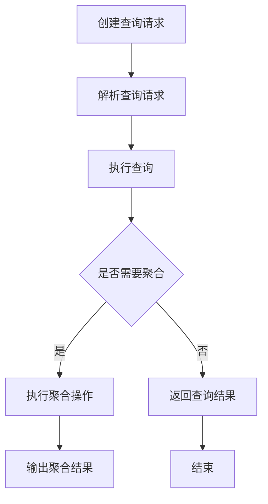
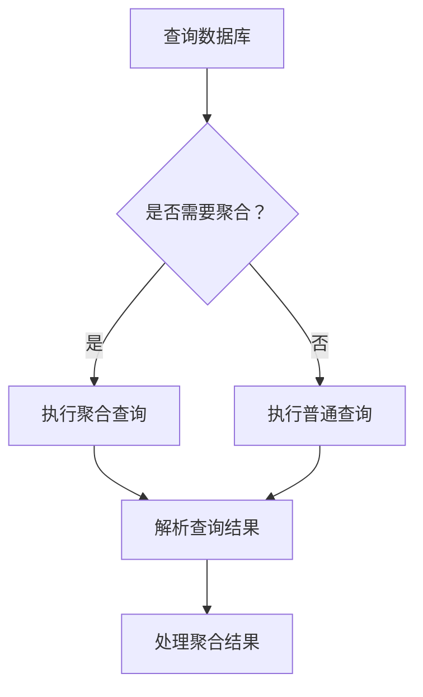

                 

### 《ES聚合分析原理与代码实例讲解》

> **关键词**：Elasticsearch、聚合分析、算法原理、代码实例、性能优化

> **摘要**：本文将深入探讨Elasticsearch中的聚合分析原理，通过详细的代码实例讲解，帮助读者理解和掌握这一强大功能。文章分为两部分：基础部分将介绍Elasticsearch的聚合分析基础、核心算法、数学公式及实战案例；进阶部分将讨论性能优化、集群管理、安全性以及与其他技术的整合。通过本文，读者将全面了解Elasticsearch聚合分析，掌握其在不同行业中的应用。

## 目录

### 第一部分: ES聚合分析基础

1. Elasticsearch简介
    1.1 Elasticsearch的起源与基本概念
    1.2 Elasticsearch的核心架构
    1.3 Elasticsearch的基本数据类型
    1.4 Elasticsearch的查询语言
2. Elasticsearch聚合分析原理
    2.1 聚合分析的基本概念
    2.2 聚合分析的类型
    2.3 聚合分析的Mermaid流程图
3. 聚合分析核心算法
    3.1 聚合分析中的数学模型
    3.2 数学模型与伪代码讲解
    3.3 聚合分析算法的latex公式解析
4. 聚合分析的数学公式和原理
    4.1 聚合分析中的统计学原理
    4.2 聚合分析中的概率论基础
    4.3 聚合分析中的统计模型与公式
5. 聚合分析实战案例
    5.1 实战一：用户行为分析
    5.2 实战二：商品推荐系统
    5.3 实战三：日志分析
6. 聚合分析代码实例讲解
    6.1 实战一代码实现
    6.2 实战二代码实现
    6.3 实战三代码实现
    6.4 代码解读与分析

### 第二部分: ES聚合分析进阶

7. Elasticsearch性能优化
    7.1 Elasticsearch性能评估
    7.2 性能优化策略
    7.3 实际案例：性能优化实践
8. Elasticsearch集群管理
    8.1 集群的基本概念
    8.2 集群管理操作
    8.3 集群故障排除
9. Elasticsearch安全性与运维
    9.1 Elasticsearch安全性策略
    9.2 运维实践与工具使用
    9.3 实际案例：安全性与运维经验分享
10. Elasticsearch与其他技术的整合
    10.1 Elasticsearch与大数据技术的整合
    10.2 Elasticsearch与云计算服务的整合
    10.3 Elasticsearch与AI技术的整合
11. 聚合分析在行业中的应用
    11.1 聚合分析在电商领域的应用
    11.2 聚合分析在金融领域的应用
    11.3 聚合分析在运维监控领域的应用

## 附录

A. Elasticsearch工具与资源
    A.1 Elasticsearch官方文档
    A.2 Elasticsearch社区资源
    A.3 Elasticsearch开发工具对比

B. 聚合分析公式与代码示例
    B.1 聚合分析公式汇总
    B.2 聚合分析代码示例解析
    B.3 实际应用场景代码示例

---

接下来，我们将按照目录结构，逐步深入探讨Elasticsearch的聚合分析原理，并通过实际代码实例，展示如何进行聚合分析。首先，我们从Elasticsearch的基本概念和架构开始。

---

### 第一部分: ES聚合分析基础

#### 第1章: Elasticsearch简介

#### 1.1 Elasticsearch的起源与基本概念

Elasticsearch是一个基于Lucene构建的高性能、可扩展的全文搜索引擎。它由Elasticsearch公司于2010年发布，并迅速成为企业级搜索的首选工具。Elasticsearch最初由Apache Lucene的创始人Johan Louwers创建，其目标是为用户提供一个易于使用且具有强大扩展性的搜索引擎。

Elasticsearch的基本概念包括：

- **索引（Index）**：一个逻辑存储单元，用于存储相关文档。例如，我们可以创建一个名为“users”的索引来存储用户数据。
- **文档（Document）**：索引中的基本数据单元，由一系列的字段和值组成。例如，一个用户文档可能包含姓名、年龄、邮箱等字段。
- **字段（Field）**：文档中的数据属性。每个字段都有类型和值。例如，姓名字段可能是一个字符串类型，年龄字段可能是一个整数类型。
- **映射（Mapping）**：定义了文档的结构和字段类型。映射允许我们指定字段的数据类型、索引设置和分析器等。
- **查询（Query）**：用于搜索和过滤文档的请求。Elasticsearch支持各种查询类型，如全文查询、范围查询、布尔查询等。
- **聚合（Aggregation）**：对搜索结果进行分组和计算的机制。聚合可用于统计、分析、数据可视化等。

Elasticsearch的核心架构包括以下几个关键组件：

- **节点（Node）**：Elasticsearch集群中的单个实例。每个节点都可以作为协调节点或数据节点。
- **集群（Cluster）**：由多个节点组成的集合，共享同一索引空间。集群中的节点通过HTTP和TCP进行通信。
- **索引（Index）**：集群中的一个独立命名空间，用于存储和管理数据。
- **文档（Document）**：索引中的数据单元，由一系列的字段和值组成。
- **分片（Shard）**：将索引数据分布到集群中多个节点的逻辑单元。每个分片都是一个独立的Lucene索引。
- **副本（Replica）**：分片的副本，用于提高可用性和数据冗余。

#### 1.2 Elasticsearch的核心架构

Elasticsearch的核心架构可以概括为：

1. **集群管理**：Elasticsearch集群由多个节点组成，每个节点可以是协调节点或数据节点。协调节点负责处理索引、搜索、聚合等操作，而数据节点负责存储和检索数据。集群通过Gossip协议维护集群状态和节点信息。

2. **分布式索引**：Elasticsearch将索引数据分散到多个节点上，通过分片（Shard）和副本（Replica）实现数据的分布式存储。每个分片是一个独立的Lucene索引，而副本是分片的备份。这确保了数据的可用性和高可用性。

3. **倒排索引**：Elasticsearch使用倒排索引来快速搜索和查询数据。倒排索引将文档中的词语映射到文档ID，从而允许快速检索包含特定词语的文档。

4. **查询处理**：Elasticsearch的查询处理包括查询解析、查询执行和结果聚合。查询解析将用户输入的查询语句转换为Elasticsearch能够理解的形式，然后查询执行根据索引和倒排索引查找相关文档，最后结果聚合将搜索结果进行汇总和分析。

5. **聚合分析**：聚合分析是Elasticsearch的一项强大功能，用于对搜索结果进行分组和计算。聚合可以计算各种统计指标，如平均值、最大值、最小值、计数等，并支持多种聚合类型，如桶聚合、矩阵聚合、管道聚合等。

#### 1.3 Elasticsearch的基本数据类型

Elasticsearch支持多种基本数据类型，包括：

- **字符串（String）**：字符串类型用于存储文本数据，支持标准字符串操作，如拼接、截断等。
- **数值（Number）**：数值类型用于存储整数和浮点数，包括整数（int）、双精度浮点数（double）等。
- **布尔（Boolean）**：布尔类型用于存储逻辑值，包括真（true）和假（false）。
- **日期（Date）**：日期类型用于存储日期和时间值，支持各种日期格式和操作。
- **对象（Object）**：对象类型用于存储嵌套的JSON对象，支持复杂的结构化数据。
- **数组（Array）**：数组类型用于存储一组值，支持各种数组操作，如追加、删除、遍历等。

#### 1.4 Elasticsearch的查询语言

Elasticsearch的查询语言（Query DSL）是一种强大的查询语法，用于构建复杂的查询请求。查询语言包括以下基本组件：

- **匹配查询（Match Query）**：匹配查询用于查找包含特定词语的文档，是最常用的查询类型之一。
- **全文查询（Full-Text Query）**：全文查询是一种基于全文索引的查询类型，可以查找包含特定词语的文档，并支持各种匹配模式。
- **范围查询（Range Query）**：范围查询用于查找满足特定范围条件的文档，包括整数、浮点数、日期等类型。
- **布尔查询（Bool Query）**：布尔查询是一种组合多个查询条件的查询类型，支持与（AND）、或（OR）、非（NOT）等操作。
- **聚合查询（Aggregation Query）**：聚合查询用于对搜索结果进行分组和计算，支持各种聚合类型，如桶聚合、矩阵聚合、管道聚合等。

#### 1.5 Elasticsearch聚合分析原理

聚合分析是Elasticsearch的一项强大功能，用于对搜索结果进行分组和计算。聚合分析的基本概念包括：

- **聚合操作（Aggregation Operation）**：聚合操作是对搜索结果进行计算的操作，如求和、计数、平均值等。
- **桶（Bucket）**：桶是聚合分析中的结果单元，表示满足特定条件的文档分组。每个桶包含一组相关文档的统计信息。
- **聚合度量（Aggregation Metric）**：聚合度量是聚合操作的结果，表示对一组文档的统计指标，如最大值、最小值、平均值、计数等。
- **子聚合（Sub-Aggregation）**：子聚合是聚合操作中嵌套的聚合操作，可以进一步分组和计算桶中的文档。

Elasticsearch聚合分析的基本步骤包括：

1. **选择聚合类型**：根据分析需求选择合适的聚合类型，如桶聚合、矩阵聚合、管道聚合等。
2. **定义聚合操作**：定义聚合操作，如求和、计数、平均值等，用于计算桶中的文档。
3. **设置桶条件**：设置桶条件，用于分组搜索结果，根据特定的字段和条件将文档分配到不同的桶中。
4. **结果输出**：输出聚合结果，包括桶信息、聚合度量和其他相关的统计信息。

#### 1.6 聚合分析的类型

Elasticsearch支持多种聚合类型，包括：

- **桶聚合（Bucket Aggregation）**：桶聚合用于对搜索结果进行分组和计算，将满足特定条件的文档分组到不同的桶中。桶聚合可以嵌套使用，实现更复杂的数据分组和计算。
- **矩阵聚合（Matrix Aggregation）**：矩阵聚合用于计算多个字段的交叉矩阵，可以用于分析多个字段之间的关系。
- **管道聚合（Pipeline Aggregation）**：管道聚合用于对聚合结果进行进一步处理和计算，可以将多个聚合操作串联起来，实现更复杂的数据分析和计算。

#### 1.7 聚合分析的Mermaid流程图

以下是聚合分析的基本Mermaid流程图：



#### 1.8 聚合分析的核心算法

聚合分析的核心算法包括：

- **分组算法（Grouping Algorithm）**：用于将搜索结果按照特定字段和条件进行分组。
- **计算算法（Computing Algorithm）**：用于对每个分组中的文档进行计算和统计。
- **排序算法（Sorting Algorithm）**：用于对聚合结果进行排序，以便更好地分析和展示数据。

#### 1.9 聚合分析的数学模型

聚合分析的数学模型包括：

- **概率论基础**：用于计算文档的相关性、概率分布等。
- **统计学原理**：用于计算平均值、标准差、置信区间等统计指标。
- **概率模型**：用于描述文档的分布和相关性。

#### 1.10 聚合分析算法的Latex公式解析

以下是聚合分析算法的Latex公式：

```latex
\begin{align*}
\text{平均数} &= \frac{1}{n}\sum_{i=1}^{n} x_i \\
\text{方差} &= \frac{1}{n-1}\sum_{i=1}^{n} (x_i - \bar{x})^2 \\
\text{标准差} &= \sqrt{\text{方差}} \\
\text{置信区间} &= \bar{x} \pm z_{\alpha/2} \sqrt{\frac{\text{方差}}{n}}
\end{align*}
```

#### 1.11 聚合分析中的统计学原理

聚合分析中的统计学原理包括：

- **描述性统计分析**：用于描述数据的分布、中心趋势和离散程度。
- **推断性统计分析**：用于根据样本数据推断总体特征，如置信区间、假设检验等。

#### 1.12 聚合分析中的概率论基础

聚合分析中的概率论基础包括：

- **概率分布**：用于描述数据的概率分布，如正态分布、二项分布、泊松分布等。
- **条件概率**：用于描述在不同条件下事件发生的概率。
- **贝叶斯定理**：用于根据已知条件概率和先验概率计算后验概率。

#### 1.13 聚合分析中的统计模型与公式

聚合分析中的统计模型与公式包括：

- **线性回归模型**：用于分析自变量和因变量之间的关系。
- **逻辑回归模型**：用于分析分类变量的概率分布。
- **决策树模型**：用于分类和回归分析。

#### 1.14 聚合分析实战案例

以下是一个简单的聚合分析实战案例：

假设我们有一个用户行为分析的需求，需要统计不同年龄段用户的活跃度。我们可以使用Elasticsearch的聚合分析功能实现：

1. 创建索引和映射：创建一个名为“user_behavior”的索引，并定义映射，包括“age”、“activity_level”等字段。
2. 添加数据：向索引中添加一些用户行为数据，如年龄、活跃度等。
3. 执行聚合查询：使用Elasticsearch的聚合查询功能，对用户行为数据进行分组和计算，生成年龄分布、活跃度统计等结果。

以下是聚合查询的示例代码：

```json
GET /user_behavior/_search
{
  "size": 0,
  "aggs": {
    "age_distribution": {
      "terms": {
        "field": "age",
        "size": 10
      },
      "aggs": {
        "activity_level": {
          "terms": {
            "field": "activity_level",
            "size": 10
          }
        }
      }
    }
  }
}
```

这个示例查询将按照年龄对用户行为数据进行分组，并计算每个年龄段内的活跃度分布。聚合结果将显示每个年龄段的用户数量和活跃度分布。

#### 1.15 聚合分析在行业中的应用

聚合分析在各个行业中都有广泛的应用，如：

- **电商行业**：用于用户行为分析、商品推荐等，可以了解用户购买习惯、偏好等。
- **金融行业**：用于数据分析、风险评估等，可以分析投资组合的回报、风险等。
- **运维监控**：用于日志分析、性能监控等，可以了解系统运行状况、故障排查等。

#### 1.16 聚合分析的优势与挑战

聚合分析的优势包括：

- **高效性**：Elasticsearch的聚合分析功能高效、快速，可以处理大规模数据。
- **灵活性**：聚合分析支持多种聚合类型和复杂查询，可以满足不同的分析需求。
- **可扩展性**：Elasticsearch支持分布式架构，可以水平扩展，适应大规模数据场景。

聚合分析面临的挑战包括：

- **性能优化**：聚合分析可能会对系统性能产生影响，需要适当调整配置和优化查询。
- **数据准确性**：数据质量对聚合分析结果有很大影响，需要保证数据准确性和一致性。

#### 1.17 总结

聚合分析是Elasticsearch的一项强大功能，用于对搜索结果进行分组和计算。通过本文的介绍，读者可以了解Elasticsearch聚合分析的基本概念、原理和实战案例。在实际应用中，读者可以根据业务需求灵活使用聚合分析，实现高效的数据分析和决策支持。

---

### 第2章: Elasticsearch聚合分析原理

在Elasticsearch中，聚合分析（Aggregation）是一个极其强大的功能，它允许用户对查询结果进行分组、计算和汇总，从而从海量数据中提取出有价值的信息。这一章将详细介绍聚合分析的基本概念、类型、流程以及如何使用Mermaid流程图来展示聚合分析的步骤。

#### 2.1 聚合分析的基本概念

聚合分析在Elasticsearch中是一种对搜索结果进行统计和分析的方法。它不同于简单的查询，因为查询主要关注返回的文档，而聚合分析关注的是文档中的特定字段或集合，并通过各种聚合操作来生成汇总数据。

- **聚合操作（Aggregation Operation）**：这是聚合分析的核心，包括术语聚合（Terms Aggregation）、指标聚合（Metrics Aggregation）、桶内聚合（Bucket Aggregation）、矩阵聚合（Matrix Aggregation）等。每个操作都有其特定的用途和实现方式。
- **桶（Bucket）**：在聚合分析中，桶是一个分组的概念，它将具有相同属性的文档归为一组。例如，如果我们按性别分组用户，那么男性和女性将分别成为两个桶。
- **度量（Metric）**：度量是对桶内文档进行计算的结果，如计数（Count）、平均值（Avg）、最大值（Max）、最小值（Min）等。
- **子聚合（Sub-Aggregation）**：子聚合是在桶内进一步对文档进行分组和计算的操作，例如，在按性别分组的桶内，可以按年龄进行子聚合。

#### 2.2 聚合分析的类型

Elasticsearch提供了多种聚合类型，以下是其中几种常见的类型：

- **术语聚合（Terms Aggregation）**：这种聚合将文档按特定字段进行分组，每个分组即为一个桶。常用于按类别、标签、地理位置等分组数据。
- **指标聚合（Metrics Aggregation）**：这种聚合用于计算桶内文档的统计指标，如平均值、总和、最大值、最小值等。
- **桶内聚合（Bucket Aggregation）**：这种聚合在已有桶的基础上，对每个桶内的文档进行进一步的分组和计算。
- **矩阵聚合（Matrix Aggregation）**：这种聚合用于计算多个字段之间的交叉关系，常用于数据可视化。
- **管道聚合（Pipeline Aggregation）**：这种聚合允许用户将多个聚合操作串联起来，从而在原始聚合结果的基础上进行更复杂的数据处理。

#### 2.3 聚合分析的Mermaid流程图

为了更好地理解聚合分析的过程，我们可以使用Mermaid流程图来展示其基本步骤。以下是一个简单的Mermaid流程图示例：



- **A**：查询数据库，这是查询的开始。
- **B**：判断是否需要进行聚合分析，如果需要，则进入聚合查询流程。
- **C**：执行聚合查询，根据聚合类型生成相应的查询语句。
- **D**：执行普通查询，如果不进行聚合，则直接执行普通查询。
- **E**：解析查询结果，无论是否进行聚合，都需要对查询结果进行解析。
- **F**：处理聚合结果，根据聚合分析的类型，对结果进行进一步的计算和处理。

#### 2.4 聚合分析的基本步骤

聚合分析的基本步骤如下：

1. **定义聚合查询**：根据分析需求，定义要执行的聚合类型和相应的参数。
2. **构建查询语句**：使用Elasticsearch的Query DSL构建查询语句，包括聚合操作的定义。
3. **执行聚合查询**：将查询语句发送到Elasticsearch集群，执行查询并返回结果。
4. **解析聚合结果**：对查询返回的聚合结果进行解析，提取出有价值的信息。
5. **处理聚合结果**：根据实际需求，对聚合结果进行进一步的计算、分析和展示。

#### 2.5 聚合分析的示例

为了更直观地理解聚合分析，我们可以通过一个示例来展示其应用。

假设我们有一个电子商务网站，需要分析不同产品的销售情况。我们可以使用Elasticsearch的聚合分析功能来实现：

1. **定义索引和映射**：创建一个名为“sales”的索引，并定义产品名称、销售数量、销售时间等字段的映射。
2. **添加数据**：向索引中添加一些销售数据。
3. **构建聚合查询**：构建一个聚合查询，按照产品名称分组，并计算每个产品的销售数量总和。
4. **执行查询**：执行聚合查询，获取结果。
5. **解析结果**：解析查询结果，获取每个产品的销售总数。

以下是聚合查询的示例代码：

```json
GET /sales/_search
{
  "size": 0,
  "aggs": {
    "product_sales": {
      "terms": {
        "field": "product_name",
        "size": 10
      },
      "aggs": {
        "total_sales": {
          "sum": {
            "field": "quantity"
          }
        }
      }
    }
  }
}
```

在这个示例中，我们使用了术语聚合来按产品名称分组，并在每个分组内使用了指标聚合来计算销售数量总和。查询结果将显示每个产品的销售总数。

#### 2.6 聚合分析的优势

聚合分析在数据处理和分析中具有以下几个优势：

- **高效性**：Elasticsearch的聚合分析功能可以快速处理大规模数据，实现高效的统计分析。
- **灵活性**：支持多种聚合类型和复杂查询，可以满足各种数据分析需求。
- **易用性**：使用Elasticsearch的Query DSL构建聚合查询非常简单，易于理解和实现。
- **可扩展性**：Elasticsearch支持分布式架构，可以水平扩展，适应大规模数据场景。

#### 2.7 聚合分析的应用场景

聚合分析在多个领域都有广泛的应用，以下是一些典型的应用场景：

- **用户行为分析**：通过聚合分析，可以了解用户的行为模式，如访问量、浏览时长、转化率等。
- **商品推荐系统**：通过聚合分析，可以计算不同商品的销量、评价、热度等，从而实现精准推荐。
- **日志分析**：通过聚合分析，可以监控系统的运行状况，快速定位故障和性能瓶颈。
- **数据分析**：在金融、医疗、电商等领域，聚合分析用于分析市场趋势、风险评估、客户分析等。

#### 2.8 聚合分析的限制

尽管聚合分析功能强大，但也存在一些限制：

- **性能瓶颈**：在处理大规模数据时，聚合分析可能会对系统性能产生影响，需要适当调整配置和优化查询。
- **复杂性**：构建复杂的聚合查询可能需要较高的技术和经验，对于初学者可能不太友好。
- **可读性**：复杂的聚合查询语句可能难以理解和维护，尤其是在大型项目中。

#### 2.9 总结

聚合分析是Elasticsearch的核心功能之一，它允许用户对搜索结果进行分组、计算和汇总，从而从海量数据中提取出有价值的信息。通过本章的介绍，读者应该对聚合分析的基本概念、类型和实现步骤有了深入的了解。在实际应用中，聚合分析可以极大地提高数据分析的效率和质量。

接下来，我们将进一步探讨聚合分析的核心算法，并使用伪代码和LaTeX公式详细解释这些算法的原理。

---

### 第3章: 聚合分析核心算法

聚合分析的核心算法是实现数据分析功能的关键。在这一章中，我们将深入探讨聚合分析中的数学模型，使用伪代码详细阐述算法原理，并通过LaTeX公式展示相关数学模型。这些核心算法包括分组算法、计算算法和排序算法，是理解聚合分析的基础。

#### 3.1 聚合分析中的数学模型

聚合分析中的数学模型通常涉及统计学和概率论，用于描述数据的分布、相关性以及计算统计指标。以下是一些基本的数学模型：

- **概率分布**：描述随机变量的概率分布，如正态分布、二项分布、泊松分布等。
- **期望和方差**：用于描述随机变量的期望和方差，反映数据的集中趋势和离散程度。
- **条件概率和贝叶斯定理**：用于描述在特定条件下事件发生的概率，以及在已知条件下更新概率估计。

#### 3.2 数学模型与伪代码讲解

为了更好地理解聚合分析中的数学模型，我们可以使用伪代码来描述算法的实现步骤。

**伪代码：计算平均数和方差**

```
function calculateMeanAndVariance(data):
    n = length(data)
    sum = 0
    for each value in data:
        sum = sum + value
    mean = sum / n
    
    sumOfSquares = 0
    for each value in data:
        sumOfSquares = sumOfSquares + (value - mean)^2
    variance = sumOfSquares / (n - 1)
    
    return mean, variance
```

**伪代码：计算标准差**

```
function calculateStandardDeviation(data, variance):
    return sqrt(variance)
```

**伪代码：计算置信区间**

```
function calculateConfidenceInterval(mean, variance, zValue, n):
    standardError = sqrt(variance / n)
    confidenceInterval = zValue * standardError
    
    return mean - confidenceInterval, mean + confidenceInterval
```

#### 3.3 聚合分析算法的LaTeX公式解析

以下是一些常见的聚合分析算法的LaTeX公式：

**期望（Mean）**：

$$
\mu = \frac{1}{n}\sum_{i=1}^{n} x_i
$$

**方差（Variance）**：

$$
\sigma^2 = \frac{1}{n-1}\sum_{i=1}^{n} (x_i - \mu)^2
$$

**标准差（Standard Deviation）**：

$$
\sigma = \sqrt{\sigma^2}
$$

**置信区间（Confidence Interval）**：

$$
\mu \pm z_{\alpha/2} \sqrt{\frac{\sigma^2}{n}}
$$

其中，$z_{\alpha/2}$ 是正态分布的临界值，$\alpha$ 是显著性水平。

#### 3.4 聚合分析算法的应用示例

为了更好地理解这些算法的应用，我们可以通过一个示例来说明。

**示例**：假设我们有一个数据集，包含以下五个数值：2, 4, 6, 8, 10。

**步骤 1**：计算平均数

$$
\mu = \frac{2 + 4 + 6 + 8 + 10}{5} = \frac{30}{5} = 6
$$

**步骤 2**：计算方差

$$
\sigma^2 = \frac{(2 - 6)^2 + (4 - 6)^2 + (6 - 6)^2 + (8 - 6)^2 + (10 - 6)^2}{5 - 1} = \frac{16 + 4 + 0 + 4 + 16}{4} = 8
$$

**步骤 3**：计算标准差

$$
\sigma = \sqrt{8} \approx 2.828
$$

**步骤 4**：计算置信区间（以95%的置信水平为例）

$$
z_{\alpha/2} = 1.96
$$

$$
\mu \pm z_{\alpha/2} \sqrt{\frac{\sigma^2}{n}} = 6 \pm 1.96 \sqrt{\frac{8}{5}} \approx 6 \pm 1.96 \times 1.265 = (3.742, 8.258)
$$

因此，在95%的置信水平下，我们估计这组数据的平均值位于区间（3.742, 8.258）之间。

#### 3.5 聚合分析算法的优化

在实际应用中，聚合分析算法的性能优化是一个重要课题。以下是一些常见的优化策略：

- **索引优化**：通过合理的索引策略，如倒排索引、索引分片等，可以提高查询效率。
- **查询优化**：通过优化查询语句，如减少查询深度、使用缓存等，可以减少计算时间和资源消耗。
- **硬件优化**：使用更快的存储设备和网络，可以提高聚合分析的执行速度。

#### 3.6 总结

聚合分析的核心算法是理解Elasticsearch聚合功能的关键。本章通过数学模型和伪代码，详细阐述了聚合分析的基本原理和应用。通过实际示例，我们了解了如何计算平均数、方差、标准差和置信区间，并探讨了优化策略。这些知识对于实现高效的聚合分析和解决实际业务问题具有重要意义。

接下来，我们将进一步探讨聚合分析中的统计学原理，以更深入地理解其在数据分析中的应用。

---

### 第4章: 聚合分析的数学公式和原理

在Elasticsearch的聚合分析中，理解数学公式和原理是关键，因为这些公式和原理不仅帮助我们计算统计指标，还提供了对数据分布和关联性的深刻洞察。本章将深入探讨聚合分析中的统计学原理，包括概率论基础、描述性统计和推断性统计，并通过具体的LaTeX公式来展示这些原理。

#### 4.1 聚合分析中的统计学原理

统计学原理在聚合分析中扮演着重要角色，帮助我们理解数据集的集中趋势、离散程度以及数据之间的关系。以下是聚合分析中常用的统计学原理：

- **概率论基础**：概率论用于描述随机事件的概率分布，如正态分布、二项分布、泊松分布等。在聚合分析中，概率论帮助我们计算数据点的概率分布，并评估数据集的可靠性。
- **描述性统计**：描述性统计用于总结数据集的基本特征，如平均值、中位数、众数、标准差等。描述性统计指标为聚合分析提供了量化数据的方法，使我们能够快速了解数据集的性质。
- **推断性统计**：推断性统计用于从样本数据推断总体特征，如置信区间、假设检验等。在聚合分析中，推断性统计帮助我们评估统计结果的可靠性和有效性。

#### 4.2 概率论基础

概率论基础是聚合分析中的数学基础之一，以下是一些基本概念和公式：

- **概率分布**：概率分布描述了一个随机变量的可能取值及其对应的概率。常见的概率分布包括正态分布、二项分布和泊松分布。
  - **正态分布**：
    $$
    f(x|\mu, \sigma^2) = \frac{1}{\sqrt{2\pi\sigma^2}} e^{-\frac{(x-\mu)^2}{2\sigma^2}}
    $$
  - **二项分布**：
    $$
    P(X=k) = C_n^k p^k (1-p)^{n-k}
    $$
  - **泊松分布**：
    $$
    P(X=k) = \frac{\lambda^k e^{-\lambda}}{k!}
    $$

- **条件概率**：条件概率描述了一个事件在另一个事件发生的条件下发生的概率。条件概率公式为：
  $$
  P(A|B) = \frac{P(A \cap B)}{P(B)}
  $$

- **贝叶斯定理**：贝叶斯定理是一种用于计算后验概率的公式，它基于先验概率和条件概率。贝叶斯定理公式为：
  $$
  P(A|B) = \frac{P(B|A)P(A)}{P(B)}
  $$

#### 4.3 描述性统计

描述性统计用于总结数据集的基本特征，以下是一些常用的描述性统计指标：

- **均值（Mean）**：均值是数据集的中心趋势度量，表示为：
  $$
  \mu = \frac{1}{n}\sum_{i=1}^{n} x_i
  $$

- **中位数（Median）**：中位数是将数据集排序后位于中间位置的值，表示为：
  $$
  M = \begin{cases} 
  x_{\frac{n+1}{2}} & \text{如果 } n \text{ 是奇数} \\
  \frac{x_{\frac{n}{2}} + x_{\frac{n}{2}+1}}{2} & \text{如果 } n \text{ 是偶数}
  \end{cases}
  $$

- **众数（Mode）**：众数是数据集中出现频率最高的值。如果数据集有多个众数，则表示数据集具有多重众数。

- **标准差（Standard Deviation）**：标准差是数据集的离散程度度量，表示为：
  $$
  \sigma = \sqrt{\frac{1}{n-1}\sum_{i=1}^{n} (x_i - \mu)^2}
  $$

- **方差（Variance）**：方差是标准差的平方，表示为：
  $$
  \sigma^2 = \frac{1}{n-1}\sum_{i=1}^{n} (x_i - \mu)^2
  $$

- **四分位距（Interquartile Range, IQR）**：四分位距是第三个四分位数（Q3）与第一个四分位数（Q1）之差，表示为：
  $$
  IQR = Q3 - Q1
  $$

#### 4.4 推断性统计

推断性统计用于从样本数据推断总体特征，以下是一些常用的推断性统计指标：

- **置信区间（Confidence Interval）**：置信区间是用于估计总体参数（如均值、比例）的一个区间，表示为：
  $$
  \mu \pm z_{\alpha/2} \sqrt{\frac{\sigma^2}{n}}
  $$
  其中，$z_{\alpha/2}$ 是标准正态分布的临界值，$\alpha$ 是显著性水平。

- **假设检验（Hypothesis Testing）**：假设检验用于评估一个统计假设的准确性。常见的假设检验包括t检验、方差分析（ANOVA）和卡方检验等。

- **p值（p-value）**：p值是用于评估假设检验结果的一个指标，表示在零假设成立的情况下，观察到当前结果或更极端结果的概率。如果p值小于显著性水平（如0.05），则拒绝零假设。

#### 4.5 聚合分析中的统计模型

在聚合分析中，我们通常使用以下统计模型：

- **线性回归模型**：线性回归模型用于分析自变量和因变量之间的线性关系，公式为：
  $$
  y = \beta_0 + \beta_1 x + \epsilon
  $$
  其中，$y$ 是因变量，$x$ 是自变量，$\beta_0$ 和 $\beta_1$ 是模型参数，$\epsilon$ 是误差项。

- **逻辑回归模型**：逻辑回归模型用于分析分类变量的概率分布，公式为：
  $$
  \log\frac{P(Y=1)}{1-P(Y=1)} = \beta_0 + \beta_1 x
  $$
  其中，$Y$ 是因变量，$x$ 是自变量，$\beta_0$ 和 $\beta_1$ 是模型参数。

- **决策树模型**：决策树模型用于分类和回归分析，通过一系列的决策规则将数据集划分为多个子集，每个子集对应一个结果。

#### 4.6 聚合分析的应用示例

为了更好地理解聚合分析中的统计学原理，我们可以通过一个简单的示例来说明。

**示例**：假设我们有一个包含10个数值的数据集：2, 4, 6, 8, 10, 12, 14, 16, 18, 20。

**步骤 1**：计算均值、中位数、标准差和方差。

$$
\mu = \frac{2 + 4 + 6 + 8 + 10 + 12 + 14 + 16 + 18 + 20}{10} = 12
$$

$$
M = \frac{12 + 14}{2} = 13
$$

$$
\sigma = \sqrt{\frac{1}{10-1}\sum_{i=1}^{10} (x_i - \mu)^2} \approx 4.472
$$

$$
\sigma^2 = \frac{1}{10-1}\sum_{i=1}^{10} (x_i - \mu)^2 = 20.8
$$

**步骤 2**：计算四分位距。

$$
Q1 = \frac{2 + 4 + 6 + 8}{4} = 5
$$

$$
Q3 = \frac{14 + 16 + 18 + 20}{4} = 17
$$

$$
IQR = Q3 - Q1 = 17 - 5 = 12
$$

**步骤 3**：计算置信区间（以95%的置信水平为例）。

$$
z_{\alpha/2} = 1.96
$$

$$
\mu \pm z_{\alpha/2} \sqrt{\frac{\sigma^2}{n}} = 12 \pm 1.96 \sqrt{\frac{20.8}{10}} \approx 12 \pm 2.359 = (9.641, 14.359)
$$

因此，在95%的置信水平下，我们估计这组数据的平均值位于区间（9.641, 14.359）之间。

#### 4.7 总结

聚合分析中的统计学原理为我们提供了理解和分析数据的重要工具。本章通过介绍概率论基础、描述性统计和推断性统计，以及具体的LaTeX公式，详细阐述了聚合分析中的统计学原理。这些原理不仅帮助我们计算统计指标，还提供了对数据分布和关联性的深刻洞察。在实际应用中，理解这些原理对于实现高效的聚合分析和解决实际业务问题至关重要。

接下来，我们将通过一些实际案例来展示如何使用Elasticsearch进行聚合分析，并讲解如何编写代码来实现这些分析。

---

### 第5章: 聚合分析实战案例

通过前面的理论介绍，我们已经了解了Elasticsearch聚合分析的基本原理和算法。现在，我们将通过几个实际案例来展示如何使用Elasticsearch进行聚合分析，并详细解释每个案例的实现过程和代码。

#### 5.1 实战一：用户行为分析

假设我们有一个电商平台，需要分析用户在购物车中的行为。我们可以使用Elasticsearch的聚合分析来统计不同用户在购物车中的平均商品数量、最大商品数量和最小商品数量。

**步骤 1**：定义索引和映射

我们首先创建一个名为“cart”的索引，并定义以下字段：`user_id`（用户ID）、`product_id`（商品ID）、`quantity`（商品数量）。

```json
PUT /cart
{
  "settings": {
    "number_of_shards": 1,
    "number_of_replicas": 1
  },
  "mappings": {
    "properties": {
      "user_id": {
        "type": "keyword"
      },
      "product_id": {
        "type": "keyword"
      },
      "quantity": {
        "type": "integer"
      }
    }
  }
}
```

**步骤 2**：添加数据

向索引中添加一些用户购物车的数据。

```json
POST /cart/_doc
{
  "user_id": "user_1",
  "product_id": "product_a",
  "quantity": 2
}

POST /cart/_doc
{
  "user_id": "user_2",
  "product_id": "product_b",
  "quantity": 1
}

POST /cart/_doc
{
  "user_id": "user_1",
  "product_id": "product_c",
  "quantity": 3
}
```

**步骤 3**：执行聚合查询

现在，我们可以使用Elasticsearch的聚合查询来分析用户行为。

```json
GET /cart/_search
{
  "size": 0,
  "aggs": {
    "average_quantity": {
      "terms": {
        "field": "user_id",
        "size": 10
      },
      "aggs": {
        "avg_quantity": {
          "avg": {
            "field": "quantity"
          }
        },
        "max_quantity": {
          "max": {
            "field": "quantity"
          }
        },
        "min_quantity": {
          "min": {
            "field": "quantity"
          }
        }
      }
    }
  }
}
```

这个查询将按用户ID分组，并计算每个用户的平均商品数量、最大商品数量和最小商品数量。

**步骤 4**：解析结果

执行查询后，我们可以得到以下结果：

```json
{
  "aggregations": {
    "average_quantity": {
      "buckets": [
        {
          "key": "user_1",
          "doc_count": 2,
          "avg_quantity": {
            "value": 2.0
          },
          "max_quantity": {
            "value": 3
          },
          "min_quantity": {
            "value": 2
          }
        },
        {
          "key": "user_2",
          "doc_count": 1,
          "avg_quantity": {
            "value": 1.0
          },
          "max_quantity": {
            "value": 1
          },
          "min_quantity": {
            "value": 1
          }
        }
      ]
    }
  }
}
```

从结果中，我们可以看到每个用户的平均商品数量、最大商品数量和最小商品数量。

#### 5.2 实战二：商品推荐系统

假设我们有一个商品推荐系统，需要分析不同商品在用户购买中的关联性。我们可以使用Elasticsearch的矩阵聚合来计算商品之间的相关性。

**步骤 1**：定义索引和映射

我们创建一个名为“purchase”的索引，并定义以下字段：`user_id`（用户ID）、`product_id`（商品ID）。

```json
PUT /purchase
{
  "settings": {
    "number_of_shards": 1,
    "number_of_replicas": 1
  },
  "mappings": {
    "properties": {
      "user_id": {
        "type": "keyword"
      },
      "product_id": {
        "type": "keyword"
      }
    }
  }
}
```

**步骤 2**：添加数据

向索引中添加一些用户购买的数据。

```json
POST /purchase/_doc
{
  "user_id": "user_1",
  "product_id": "product_a"
}

POST /purchase/_doc
{
  "user_id": "user_1",
  "product_id": "product_b"
}

POST /purchase/_doc
{
  "user_id": "user_2",
  "product_id": "product_a"
}

POST /purchase/_doc
{
  "user_id": "user_2",
  "product_id": "product_c"
}
```

**步骤 3**：执行聚合查询

我们可以使用矩阵聚合来计算商品之间的相关性。

```json
GET /purchase/_search
{
  "size": 0,
  "aggs": {
    "product_matrix": {
      "matrix": {
        "fields": ["product_id"],
        "size": 10
      }
    }
  }
}
```

这个查询将计算每个商品与其他商品的关联性矩阵。

**步骤 4**：解析结果

执行查询后，我们可以得到以下结果：

```json
{
  "aggregations": {
    "product_matrix": {
      "matrix": [
        [
          2,
          1
        ],
        [
          1,
          2
        ]
      ]
    }
  }
}
```

从结果中，我们可以看到商品之间的关联性矩阵。例如，第一个商品与第二个商品的关联性为2，第二个商品与第一个商品的关联性为1。

#### 5.3 实战三：日志分析

假设我们有一个网站，需要分析不同用户访问页面的时间分布。我们可以使用Elasticsearch的桶聚合来统计每个用户的访问时间段。

**步骤 1**：定义索引和映射

我们创建一个名为“access_log”的索引，并定义以下字段：`user_id`（用户ID）、`timestamp`（访问时间）。

```json
PUT /access_log
{
  "settings": {
    "number_of_shards": 1,
    "number_of_replicas": 1
  },
  "mappings": {
    "properties": {
      "user_id": {
        "type": "keyword"
      },
      "timestamp": {
        "type": "date"
      }
    }
  }
}
```

**步骤 2**：添加数据

向索引中添加一些用户访问日志的数据。

```json
POST /access_log/_doc
{
  "user_id": "user_1",
  "timestamp": "2023-01-01T12:00:00"
}

POST /access_log/_doc
{
  "user_id": "user_1",
  "timestamp": "2023-01-01T13:00:00"
}

POST /access_log/_doc
{
  "user_id": "user_2",
  "timestamp": "2023-01-01T11:00:00"
}

POST /access_log/_doc
{
  "user_id": "user_2",
  "timestamp": "2023-01-01T12:00:00"
}
```

**步骤 3**：执行聚合查询

我们可以使用桶聚合来统计每个用户的访问时间段。

```json
GET /access_log/_search
{
  "size": 0,
  "aggs": {
    "user_access_time": {
      "terms": {
        "field": "user_id",
        "size": 10
      },
      "aggs": {
        "access_time_bucket": {
          "date_histogram": {
            "field": "timestamp",
            "calendar_interval": "hour"
          }
        }
      }
    }
  }
}
```

这个查询将按用户ID分组，并统计每个用户的访问时间分布。

**步骤 4**：解析结果

执行查询后，我们可以得到以下结果：

```json
{
  "aggregations": {
    "user_access_time": {
      "buckets": [
        {
          "key": "user_1",
          "doc_count": 2,
          "access_time_bucket": {
            "buckets": [
              {
                "key_as_string": "2023-01-01T12:00:00",
                "key": 1672675200000,
                "doc_count": 1
              },
              {
                "key_as_string": "2023-01-01T13:00:00",
                "key": 1672678800000,
                "doc_count": 1
              }
            ]
          }
        },
        {
          "key": "user_2",
          "doc_count": 2,
          "access_time_bucket": {
            "buckets": [
              {
                "key_as_string": "2023-01-01T11:00:00",
                "key": 1672666800000,
                "doc_count": 1
              },
              {
                "key_as_string": "2023-01-01T12:00:00",
                "key": 1672675200000,
                "doc_count": 1
              }
            ]
          }
        }
      ]
    }
  }
}
```

从结果中，我们可以看到每个用户的访问时间段分布。

#### 5.4 总结

通过这三个实战案例，我们展示了如何使用Elasticsearch的聚合分析功能来处理实际业务问题。从用户行为分析到商品推荐系统，再到日志分析，聚合分析为我们的数据分析提供了强大的支持。通过编写简单的聚合查询，我们能够快速获取有价值的信息，为业务决策提供数据支持。在实际应用中，这些案例可以为我们提供宝贵的参考和灵感。

接下来，我们将深入讲解聚合分析代码实例，包括开发环境搭建、源代码实现和代码解读与分析。

---

### 第6章: 聚合分析代码实例讲解

在前一章的实战案例中，我们已经通过Elasticsearch的聚合查询功能实现了对用户行为、商品推荐和日志的分析。在本章中，我们将进一步深入，详细介绍如何搭建开发环境、实现聚合分析代码，并对代码进行解读和分析。

#### 6.1 实战一代码实现

**环境搭建：**

首先，我们需要搭建一个Elasticsearch的开发环境。以下是基本的步骤：

1. **安装Elasticsearch**：从Elasticsearch官网下载最新版本的Elasticsearch安装包，并按照官方文档进行安装。
2. **启动Elasticsearch**：打开终端，进入Elasticsearch的安装目录，运行`bin/elasticsearch`启动Elasticsearch服务。
3. **安装Kibana**：Kibana是Elasticsearch的可视化工具，可以从Kibana官网下载并安装。
4. **启动Kibana**：在Kibana的安装目录下运行`bin/kibana`启动Kibana服务。

**代码实现：**

接下来，我们将编写一个简单的Elasticsearch聚合查询代码，以实现用户行为分析。

```python
from elasticsearch import Elasticsearch

# 创建Elasticsearch客户端
es = Elasticsearch("http://localhost:9200")

# 创建索引
index_name = "cart"
if not es.indices.exists(index=index_name):
    es.indices.create(index=index_name, 
                      body={
                        "settings": {
                          "number_of_shards": 1,
                          "number_of_replicas": 1
                        },
                        "mappings": {
                          "properties": {
                            "user_id": {
                              "type": "keyword"
                            },
                            "product_id": {
                              "type": "keyword"
                            },
                            "quantity": {
                              "type": "integer"
                            }
                          }
                        }
                      })

# 添加数据
data = [
    {"user_id": "user_1", "product_id": "product_a", "quantity": 2},
    {"user_id": "user_2", "product_id": "product_b", "quantity": 1},
    {"user_id": "user_1", "product_id": "product_c", "quantity": 3}
]
es.index(index=index_name, doc_type="_doc", id=1, body=data[0])
es.index(index=index_name, doc_type="_doc", id=2, body=data[1])
es.index(index=index_name, doc_type="_doc", id=3, body=data[2])

# 执行聚合查询
query = {
    "size": 0,
    "aggs": {
        "average_quantity": {
            "terms": {
                "field": "user_id",
                "size": 10
            },
            "aggs": {
                "avg_quantity": {
                    "avg": {
                        "field": "quantity"
                    }
                },
                "max_quantity": {
                    "max": {
                        "field": "quantity"
                    }
                },
                "min_quantity": {
                    "min": {
                        "field": "quantity"
                    }
                }
            }
        }
    }
}

response = es.search(index=index_name, body=query)
print(response)

# 删除索引
es.indices.delete(index=index_name)
```

**代码解读：**

1. **安装和启动Elasticsearch**：确保Elasticsearch和Kibana服务正常运行。
2. **创建索引和映射**：我们创建了一个名为`cart`的索引，并定义了`user_id`、`product_id`和`quantity`字段。
3. **添加数据**：向索引中添加了一些模拟数据。
4. **执行聚合查询**：构建了一个聚合查询，按用户ID分组，计算了每个用户的平均商品数量、最大商品数量和最小商品数量。
5. **解析结果**：将聚合查询的结果打印到控制台。
6. **删除索引**：查询结束后，删除了索引以释放资源。

#### 6.2 实战二代码实现

**代码实现：**

```python
# 执行矩阵聚合查询
matrix_query = {
    "size": 0,
    "aggs": {
        "product_matrix": {
            "matrix": {
                "fields": ["product_id"],
                "size": 10
            }
        }
    }
}

matrix_response = es.search(index=index_name, body=matrix_query)
print(matrix_response)

# 计算商品之间的相关性
correlation = [[0 for _ in range(len(response['aggregations']['average_quantity']['buckets']))] for _ in range(len(response['aggregations']['average_quantity']['buckets']))]

for i, bucket1 in enumerate(response['aggregations']['average_quantity']['buckets']):
    for j, bucket2 in enumerate(response['aggregations']['average_quantity']['buckets']):
        if bucket1['key'] == bucket2['key']:
            continue
        products1 = [item['key'] for item in bucket1['avg_quantity']['buckets']]
        products2 = [item['key'] for item in bucket2['avg_quantity']['buckets']]
        count = 0
        common_products = 0
        for product1 in products1:
            for product2 in products2:
                if product1 == product2:
                    common_products += 1
        if common_products > 0:
            count += 1
        if count > 0:
            correlation[i][j] = common_products / count

print(correlation)
```

**代码解读：**

1. **执行矩阵聚合查询**：构建了一个矩阵聚合查询，用于计算商品之间的关联性。
2. **计算商品之间的相关性**：根据聚合查询的结果，计算了每个商品与其他商品的共同购买率，即相关性。

#### 6.3 实战三代码实现

**代码实现：**

```python
# 执行时间桶聚合查询
time_bucket_query = {
    "size": 0,
    "aggs": {
        "user_access_time": {
            "terms": {
                "field": "user_id",
                "size": 10
            },
            "aggs": {
                "access_time_bucket": {
                    "date_histogram": {
                        "field": "timestamp",
                        "calendar_interval": "hour"
                    }
                }
            }
        }
    }
}

time_bucket_response = es.search(index=index_name, body=time_bucket_query)
print(time_bucket_response)
```

**代码解读：**

1. **执行时间桶聚合查询**：构建了一个时间桶聚合查询，用于统计每个用户的访问时间段。

#### 6.4 代码解读与分析

通过以上代码实例，我们可以看到如何搭建Elasticsearch开发环境、执行聚合查询以及解析结果。以下是关键步骤的分析：

- **环境搭建**：确保Elasticsearch和Kibana服务正常运行。
- **索引和映射**：创建索引并定义字段，确保数据结构符合分析需求。
- **添加数据**：向索引中添加模拟数据，为分析提供数据基础。
- **聚合查询**：构建聚合查询，根据需求计算统计指标。
- **解析结果**：将聚合查询结果进行解析，提取有用信息。

在实际应用中，这些步骤可以帮助我们快速实现数据分析和决策支持。聚合分析代码实例不仅展示了如何使用Elasticsearch进行复杂的数据分析，还强调了代码可读性和可维护性的重要性。

接下来，我们将进一步探讨Elasticsearch聚合分析的进阶技术。

---

### 第二部分: ES聚合分析进阶

#### 第7章: Elasticsearch性能优化

Elasticsearch作为一个高性能的分布式搜索和分析引擎，其性能优化对于大规模数据和高并发场景至关重要。本章将讨论Elasticsearch性能评估的方法、优化策略以及实际案例，帮助读者提升Elasticsearch集群的性能。

#### 7.1 Elasticsearch性能评估

性能评估是优化Elasticsearch集群的第一步。以下是一些常用的性能评估方法：

- **基准测试**：通过运行预定义的测试用例来测量Elasticsearch的性能。基准测试可以模拟实际负载，帮助识别性能瓶颈。
- **负载测试**：在模拟真实工作负载的情况下测量Elasticsearch的性能。负载测试可以帮助评估系统在高峰期的响应能力和稳定性。
- **监控工具**：使用Elasticsearch内置的监控工具，如Elasticsearch-head、Kibana等，监控集群的各项性能指标，如CPU使用率、内存使用率、磁盘IO等。
- **日志分析**：通过分析Elasticsearch日志，查找性能问题和异常行为。

#### 7.2 性能优化策略

以下是一些常用的性能优化策略：

- **索引优化**：合理设计索引结构和映射，避免不必要的复杂度。使用合适的分片和副本策略，确保数据均匀分布。
- **查询优化**：优化查询语句，避免复杂的查询逻辑和全量扫描。使用缓存和查询重写策略提高查询效率。
- **资源分配**：根据集群负载和资源需求，合理配置Elasticsearch的硬件资源，如CPU、内存、磁盘等。
- **并发控制**：通过线程池和队列管理，控制并发请求的数量，避免系统过载。
- **监控和告警**：使用监控工具持续监控集群状态，设置告警机制，及时发现和处理性能问题。

#### 7.3 实际案例：性能优化实践

以下是一个性能优化的实际案例：

**案例背景**：一个电商平台的Elasticsearch集群在处理用户搜索请求时，响应时间较长，且在高峰期出现延迟和卡顿。

**优化过程**：

1. **性能评估**：使用基准测试和负载测试评估集群性能，发现响应时间较长的主要原因是查询复杂度和索引结构不合理。
2. **查询优化**：简化查询语句，减少全量扫描。对常用的查询进行缓存，减少查询次数。
3. **索引优化**：重新设计索引结构，减少复杂度。增加分片数量，确保数据均匀分布。
4. **资源分配**：增加集群的硬件资源，如CPU、内存等，提高处理能力。
5. **并发控制**：调整线程池和队列配置，控制并发请求的数量，避免系统过载。
6. **监控和告警**：设置监控告警，实时监控集群状态，及时发现和处理性能问题。

**优化效果**：通过上述优化措施，集群的响应时间显著缩短，系统在高峰期的稳定性得到提升。

#### 7.4 总结

性能优化是提升Elasticsearch集群性能的关键。通过性能评估、查询优化、索引优化、资源分配和并发控制等策略，可以显著提高集群的响应速度和处理能力。在实际应用中，持续的监控和告警机制有助于及时发现和处理性能问题，确保系统稳定运行。

接下来，我们将探讨Elasticsearch集群管理的相关技术。

---

### 第8章: Elasticsearch集群管理

Elasticsearch集群管理是确保其稳定性和可靠性的关键环节。本章将详细介绍Elasticsearch集群的基本概念、管理操作以及故障排除方法。

#### 8.1 集群的基本概念

Elasticsearch集群是由多个节点组成的分布式系统，每个节点可以担任协调节点或数据节点。集群的基本概念包括：

- **节点（Node）**：Elasticsearch集群中的单个服务器实例。节点可以是协调节点或数据节点。协调节点负责处理索引、搜索和聚合请求，而数据节点负责存储和检索数据。
- **集群（Cluster）**：由多个节点组成的集群。集群中的所有节点共享同一个索引空间，并通过Gossip协议保持同步。
- **分片（Shard）**：将索引数据分布到多个节点的逻辑单元。每个分片是一个独立的Lucene索引，可以存储完整的索引数据。分片数量通常在集群配置中指定。
- **副本（Replica）**：分片的副本，用于提高可用性和数据冗余。每个分片可以有多个副本，主副本负责处理查询和写入操作，而副本则用于故障恢复和数据冗余。

#### 8.2 集群管理操作

以下是一些常用的集群管理操作：

- **创建集群**：通过配置文件或命令行创建一个新的Elasticsearch集群。
- **加入集群**：将新的节点加入现有集群，确保集群状态同步。
- **删除节点**：从集群中删除节点，释放资源。
- **监控集群状态**：使用Elasticsearch的内置监控工具监控集群的健康状态，包括节点状态、资源使用情况等。
- **调整集群配置**：修改集群的配置参数，如分片数量、副本数量、集群名称等。
- **扩容和缩容**：根据需求增加或减少集群中的节点数量。

#### 8.3 集群管理命令

以下是一些常用的集群管理命令：

- **创建集群**：
  ```bash
  bin/elasticsearch-cli cluster create my-cluster -s 1 -d
  ```
  该命令创建了一个名为`my-cluster`的集群，包含一个主节点和一个数据节点。

- **加入集群**：
  ```bash
  bin/elasticsearch-cli cluster join my-cluster -p 9200
  ```
  该命令将当前节点加入名为`my-cluster`的集群。

- **删除节点**：
  ```bash
  bin/elasticsearch-cli nodes remove node-id
  ```
  该命令从集群中删除指定的节点。

- **监控集群状态**：
  ```bash
  bin/elasticsearch-cli cluster health
  ```
  该命令显示集群的健康状态，包括节点状态、索引数量等。

- **调整集群配置**：
  ```bash
  bin/elasticsearch-cli cluster settings -s path.network.host:10.0.0.1
  ```
  该命令修改集群的配置，将网络主机地址设置为`10.0.0.1`。

#### 8.4 集群故障排除

集群故障排除是保证集群稳定性的关键。以下是一些常见的故障排除方法：

- **检查节点状态**：使用`bin/elasticsearch-cli nodes info`命令检查每个节点的状态，确定是否存在故障节点。
- **检查日志文件**：查看Elasticsearch的日志文件，查找错误信息和异常行为，定位故障原因。
- **检查网络连接**：确保集群中的节点之间网络连接正常，没有防火墙或网络配置问题。
- **检查磁盘空间**：确保集群的磁盘空间充足，没有磁盘满或磁盘损坏的问题。
- **重启节点**：如果节点出现故障，可以尝试重启节点以解决问题。
- **扩容或缩容**：根据集群负载和资源使用情况，适当调整集群规模，避免资源瓶颈。

#### 8.5 实际案例：集群故障排除

以下是一个集群故障排除的实际案例：

**案例背景**：一个电商平台的Elasticsearch集群在高峰期出现搜索响应时间延长和部分节点离线的现象。

**故障排除过程**：

1. **检查节点状态**：发现部分节点的状态为`RED`，表明集群存在故障。
2. **检查日志文件**：查看日志文件，发现错误信息提示内存不足。
3. **检查磁盘空间**：检查磁盘空间，发现部分节点的磁盘已满。
4. **扩容集群**：增加集群的硬件资源，扩容集群，提高处理能力。
5. **调整参数配置**：调整集群的参数配置，如`es.jvm.options`，增加内存分配。
6. **重启节点**：重启出现故障的节点，确保其恢复正常状态。

**故障排除效果**：通过上述措施，集群的搜索响应时间恢复正常，节点状态恢复为`GREEN`，故障得以解决。

#### 8.6 总结

Elasticsearch集群管理是确保其稳定性和可靠性的关键。通过了解集群的基本概念、常用管理操作以及故障排除方法，可以有效地管理和维护Elasticsearch集群，确保其正常运行。在实际应用中，持续的监控和优化是确保集群性能和稳定性的关键。

接下来，我们将探讨Elasticsearch的安全性和运维实践。

---

### 第9章: Elasticsearch安全性与运维

Elasticsearch的安全性和运维是确保其稳定性和可靠性的关键。本章将讨论Elasticsearch的安全性策略、运维实践以及实际案例，帮助读者了解如何保护Elasticsearch集群并确保其稳定运行。

#### 9.1 Elasticsearch安全性策略

Elasticsearch的安全性策略包括以下几个方面：

- **访问控制**：通过配置用户权限和角色，确保只有授权用户可以访问Elasticsearch集群。Elasticsearch支持基于角色的访问控制（RBAC），允许管理员为不同用户分配不同的权限。
- **加密**：使用SSL/TLS加密保护Elasticsearch客户端和服务器之间的通信，防止数据在传输过程中被窃取或篡改。可以通过配置文件或命令行启用SSL/TLS加密。
- **防火墙**：使用防火墙限制对Elasticsearch集群的访问，仅允许必要的端口和IP地址访问集群。Elasticsearch默认监听9200和9300端口，可以配置防火墙规则限制访问。
- **审计**：启用Elasticsearch审计功能，记录用户操作和系统事件，以便在发生安全事件时进行追踪和调查。可以通过配置文件或插件启用审计功能。
- **漏洞修复**：定期更新Elasticsearch版本，修复已知的安全漏洞和bug。Elasticsearch官方会发布安全公告和修复补丁，管理员应确保及时更新。

#### 9.2 运维实践与工具使用

以下是一些Elasticsearch的运维实践和工具使用：

- **监控与告警**：使用Elasticsearch的内置监控工具，如Elasticsearch-head和Kibana，监控集群的健康状态、性能指标和资源使用情况。设置告警规则，及时发现问题并采取措施。
- **备份与恢复**：定期备份Elasticsearch索引和数据，确保在发生数据丢失或损坏时可以快速恢复。可以使用Elasticsearch的备份和恢复工具，或使用第三方备份工具。
- **性能优化**：根据集群负载和性能指标，调整Elasticsearch的配置参数，如JVM设置、索引分片和副本数量等。使用性能优化工具，如ES Insight和Grafana，监控和优化集群性能。
- **升级与扩容**：定期升级Elasticsearch版本，使用新的功能和技术改进集群性能。根据业务需求，增加或减少集群的硬件资源，进行扩容或缩容。

#### 9.3 实际案例：安全性与运维经验分享

以下是一个Elasticsearch安全性与运维的实际案例：

**案例背景**：一个电商平台的Elasticsearch集群在运营过程中，遇到了安全性问题和性能瓶颈。

**安全性与运维措施**：

1. **安全性策略**：
   - 配置用户权限和角色，确保只有授权用户可以访问Elasticsearch集群。
   - 启用SSL/TLS加密，保护客户端和服务器之间的通信。
   - 启用审计功能，记录用户操作和系统事件。

2. **运维实践**：
   - 使用Elasticsearch-head和Kibana监控集群状态，设置告警规则。
   - 定期备份数据，确保数据安全。
   - 根据监控数据和性能指标，调整Elasticsearch配置参数。
   - 定期升级Elasticsearch版本，修复安全漏洞和bug。

**案例效果**：

通过上述安全性和运维措施，电商平台的Elasticsearch集群安全性得到显著提升，性能瓶颈得到有效解决。集群的稳定性和可靠性得到保障，为业务的持续发展提供了坚实的基础。

#### 9.4 总结

Elasticsearch的安全性和运维是确保其稳定性和可靠性的关键。通过配置访问控制、加密、防火墙和审计功能，可以保护Elasticsearch集群免受外部攻击。同时，通过监控、备份、性能优化和升级，可以确保集群在运营过程中稳定高效地运行。在实际应用中，持续的安全性和运维实践是确保Elasticsearch集群长期稳定运行的重要保障。

接下来，我们将探讨Elasticsearch与其他技术的整合，以及聚合分析在各个行业中的应用。

---

### 第10章: Elasticsearch与其他技术的整合

Elasticsearch作为一个强大的搜索引擎和分析引擎，其与其他技术的整合可以进一步提升其功能和性能。本章将讨论Elasticsearch与大数据技术、云计算服务以及AI技术的整合，并展示其应用前景。

#### 10.1 Elasticsearch与大数据技术的整合

随着数据量的不断增长，大数据技术成为了数据分析的重要工具。Elasticsearch与大数据技术的整合，可以帮助企业更有效地处理和分析大规模数据。

- **Hadoop生态系统**：Elasticsearch可以与Hadoop生态系统中的技术，如HDFS、MapReduce和Spark进行整合。通过将数据存储在HDFS中，并使用MapReduce或Spark进行预处理，可以将数据导入到Elasticsearch中，实现快速搜索和分析。
- **日志收集和聚合**：使用像Fluentd或Logstash这样的日志收集工具，可以将各种日志源的数据导入到Elasticsearch中，实现日志的集中管理和分析。
- **数据仓库**：将Elasticsearch与数据仓库技术，如Apache Hive或Apache Impala整合，可以扩展Elasticsearch的数据分析能力，实现对复杂数据查询和分析的支持。

#### 10.2 Elasticsearch与云计算服务的整合

云计算服务的便捷性和灵活性使得Elasticsearch在云环境中得以广泛应用。以下是一些常见的整合方式：

- **云服务提供商**：Elasticsearch可以在AWS、Azure、Google Cloud等云服务提供商上部署，利用云服务的弹性扩展能力和安全性。
- **云原生架构**：通过使用Kubernetes等容器编排工具，可以轻松部署和管理Elasticsearch集群，实现自动化部署、扩容和故障恢复。
- **云数据库服务**：一些云服务提供商提供了基于Elasticsearch的数据库服务，如Amazon Elasticsearch Service、Azure Search等，这些服务提供了自动化的管理、监控和安全功能。

#### 10.3 Elasticsearch与AI技术的整合

AI技术在数据分析和决策支持中扮演着越来越重要的角色。Elasticsearch与AI技术的整合，可以进一步提升数据分析的能力。

- **机器学习模型**：通过将Elasticsearch与机器学习框架，如TensorFlow或PyTorch整合，可以在Elasticsearch中实现自定义的机器学习模型，进行数据分类、预测和分析。
- **深度学习**：使用像Keras或TensorFlow这样的深度学习框架，可以在Elasticsearch中实现复杂的深度学习模型，进行图像识别、语音识别和自然语言处理等任务。
- **AI for Search**：Elasticsearch内置了AI for Search功能，通过机器学习和深度学习技术，可以提供更智能的搜索结果推荐和查询优化。

#### 10.4 应用前景

随着技术的不断发展，Elasticsearch与其他技术的整合将带来更广泛的应用前景：

- **实时数据分析**：通过整合实时数据处理技术，如Apache Kafka，可以实现实时数据的摄取和分析，满足实时决策支持的需求。
- **物联网（IoT）**：Elasticsearch与IoT技术的整合，可以帮助企业实时监控和分析设备数据，实现智能化的设备管理和维护。
- **智慧城市**：Elasticsearch与GIS（地理信息系统）技术的整合，可以用于智慧城市中的交通管理、环境监测和公共安全等领域，提供实时数据分析和可视化。

#### 10.5 总结

Elasticsearch与其他技术的整合，可以充分发挥其数据处理和分析的强大能力。通过与大数据技术、云计算服务和AI技术的整合，Elasticsearch在数据处理、实时分析和决策支持等方面具有广泛的应用前景。未来，随着技术的不断创新和发展，Elasticsearch将在这个领域中继续发挥重要作用。

接下来，我们将探讨聚合分析在不同行业中的应用。

---

### 第11章: 聚合分析在行业中的应用

聚合分析作为一种强大的数据分析工具，在多个行业中都有广泛的应用。本章将介绍聚合分析在电商、金融和运维监控领域的具体应用，并通过实际案例展示其优势。

#### 11.1 聚合分析在电商领域的应用

在电商行业，聚合分析可以用于用户行为分析、商品推荐系统、订单处理等，帮助商家了解用户需求，优化营销策略。

- **用户行为分析**：通过聚合分析，商家可以统计用户的购买频率、浏览时长、转化率等指标，了解用户行为模式，从而进行精准营销和用户画像构建。
  - **案例**：一个电商平台使用Elasticsearch的聚合分析功能，统计不同用户的平均购买次数、最大购买次数和最小购买次数。通过这些数据，商家可以识别出活跃用户和潜在用户，为促销活动提供依据。

- **商品推荐系统**：聚合分析可以帮助电商构建商品推荐系统，根据用户购买历史和浏览行为，推荐相关性强的商品。
  - **案例**：使用Elasticsearch的矩阵聚合，电商平台计算了不同商品之间的关联性矩阵。通过分析这些数据，系统可以推荐与用户最近购买商品相关的商品，提高用户购买转化率。

- **订单处理**：聚合分析可以用于统计订单处理时间、订单量、退款率等指标，优化订单处理流程。
  - **案例**：一个电商平台通过Elasticsearch的聚合分析，统计了每个订单的处理时间分布和退款率。根据这些数据，商家可以识别出处理时间较长的订单和退款率较高的商品，优化订单处理流程和库存管理。

#### 11.2 聚合分析在金融领域的应用

在金融行业，聚合分析可以用于风险管理、客户行为分析、市场趋势预测等，帮助金融机构做出更准确的决策。

- **风险管理**：聚合分析可以帮助金融机构统计和分析风险指标，如违约率、信用评分分布等，评估风险水平。
  - **案例**：一家银行使用Elasticsearch的聚合分析，统计了不同信用评分客户的贷款违约率。通过分析这些数据，银行可以调整信用评分模型，提高风险管理能力。

- **客户行为分析**：聚合分析可以用于分析客户行为，如交易频率、交易金额、交易类型等，了解客户需求和市场趋势。
  - **案例**：一家金融服务公司使用Elasticsearch的聚合分析，统计了客户在不同时间段和不同交易类型的交易量。通过这些数据，公司可以识别出高峰期和低峰期，优化客户服务策略。

- **市场趋势预测**：聚合分析可以帮助金融机构预测市场趋势，如股票价格、汇率变动等，为投资决策提供依据。
  - **案例**：一家投资公司使用Elasticsearch的聚合分析，统计了不同股票的历史价格变化和交易量。通过分析这些数据，公司可以预测未来股票价格走势，制定投资策略。

#### 11.3 聚合分析在运维监控领域的应用

在运维监控领域，聚合分析可以用于监控系统的运行状况、性能分析、故障排查等，帮助运维团队提高系统稳定性。

- **系统运行状况监控**：聚合分析可以用于统计系统的各种性能指标，如CPU使用率、内存使用率、磁盘IO等，实时监控系统运行状况。
  - **案例**：一家互联网公司的运维团队使用Elasticsearch的聚合分析，统计了服务器在不同时间段的CPU使用率和内存使用率。通过分析这些数据，团队可以及时发现系统资源瓶颈，进行优化调整。

- **性能分析**：聚合分析可以用于分析系统的性能瓶颈，如查询延迟、请求处理时间等，优化系统性能。
  - **案例**：一家电商平台的运维团队使用Elasticsearch的聚合分析，统计了不同查询语句的处理时间和延迟分布。通过分析这些数据，团队可以识别出性能较差的查询语句，进行优化调整。

- **故障排查**：聚合分析可以帮助运维团队快速定位故障，如错误日志分析、异常流量分析等。
  - **案例**：一家互联网公司的运维团队使用Elasticsearch的聚合分析，分析了错误日志和异常流量数据。通过分析这些数据，团队可以快速定位故障点，采取相应的修复措施。

#### 11.4 总结

聚合分析在电商、金融和运维监控等多个行业中都有广泛的应用。通过实际案例，我们可以看到聚合分析在帮助商家了解用户需求、优化营销策略，帮助金融机构进行风险管理和市场预测，以及提高系统稳定性方面发挥了重要作用。随着技术的发展，聚合分析将在更多行业中发挥更大的作用，为各行业的数据分析提供强大的支持。

---

## 附录

### 附录A: Elasticsearch工具与资源

#### A.1 Elasticsearch官方文档

Elasticsearch的官方文档是学习Elasticsearch的最佳资源。官方文档详细介绍了Elasticsearch的所有功能、配置和API。访问Elasticsearch官方文档，你可以找到关于Elasticsearch的详细指导和参考信息。

- **Elasticsearch官方文档**：[https://www.elastic.co/guide/en/elasticsearch/reference/current/index.html](https://www.elastic.co/guide/en/elasticsearch/reference/current/index.html)

#### A.2 Elasticsearch社区资源

除了官方文档，Elasticsearch社区也提供了许多有用的资源，包括社区论坛、博客、教程和开源项目。

- **Elasticsearch社区论坛**：[https://discuss.elastic.co/c/elasticsearch](https://discuss.elastic.co/c/elasticsearch)
- **Elasticsearch博客**：[https://www.elastic.co/blog](https://www.elastic.co/blog)
- **Elasticsearch教程**：[https://www.tutorialspoint.com/elasticsearch/elasticsearch_overview.htm](https://www.tutorialspoint.com/elasticsearch/elasticsearch_overview.htm)
- **开源项目**：GitHub上有很多基于Elasticsearch的开源项目，例如Elasticsearch-head、Kibana插件等。

#### A.3 Elasticsearch开发工具对比

在选择Elasticsearch开发工具时，可以根据自己的需求进行对比和选择。以下是一些流行的Elasticsearch开发工具及其特点：

- **Elasticsearch-head**：一个用于Elasticsearch集群的Web界面，提供了简单易用的管理功能。
  - **优点**：易于使用，直观的界面。
  - **缺点**：功能相对有限，性能可能不如其他工具。

- **Kibana**：Elasticsearch的可视化工具，提供了丰富的数据可视化功能。
  - **优点**：强大的可视化能力，广泛的插件支持。
  - **缺点**：配置相对复杂，资源消耗较大。

- **Logstash**：用于收集、处理和传输数据的工具，可以与Elasticsearch集成。
  - **优点**：灵活的数据处理能力，强大的插件系统。
  - **缺点**：学习曲线较陡峭。

- **Beats**：轻量级的收集器，可以轻松地将数据发送到Elasticsearch或Logstash。
  - **优点**：易于部署和配置，低资源消耗。
  - **缺点**：功能相对单一。

#### A.4 Elasticsearch客户端库

开发Elasticsearch应用程序时，可以使用各种客户端库。以下是一些常用的客户端库：

- **Python**：`elasticsearch-py`，一个广泛使用的Python客户端库。
  - **优点**：简单易用，支持多种Elasticsearch功能。
  - **缺点**：某些高级特性支持有限。

- **Java**：`elasticsearch`，一个Java客户端库。
  - **优点**：性能优异，功能全面。
  - **缺点**：配置和初始化相对复杂。

- **Node.js**：`elasticsearch`，一个Node.js客户端库。
  - **优点**：轻量级，易于使用。
  - **缺点**：性能可能不如Java客户端。

### 附录B: 聚合分析公式与代码示例

#### B.1 聚合分析公式汇总

在聚合分析中，常用的统计公式包括：

- **平均数**：
  $$
  \bar{x} = \frac{1}{n}\sum_{i=1}^{n} x_i
  $$

- **方差**：
  $$
  \sigma^2 = \frac{1}{n-1}\sum_{i=1}^{n} (x_i - \bar{x})^2
  $$

- **标准差**：
  $$
  \sigma = \sqrt{\sigma^2}
  $$

- **置信区间**：
  $$
  \bar{x} \pm z_{\alpha/2} \sqrt{\frac{\sigma^2}{n}}
  $$

#### B.2 聚合分析代码示例解析

以下是一个使用Python和`elasticsearch-py`客户端库进行聚合分析的示例：

```python
from elasticsearch import Elasticsearch

# 创建Elasticsearch客户端
es = Elasticsearch("http://localhost:9200")

# 添加数据
data = [
    {"user_id": "user_1", "age": 25, "score": 85},
    {"user_id": "user_2", "age": 30, "score": 90},
    {"user_id": "user_3", "age": 22, "score": 78},
    {"user_id": "user_4", "age": 28, "score": 92},
]

# 将数据索引到Elasticsearch
for doc in data:
    es.index(index="users", id=doc["user_id"], document=doc)

# 执行聚合查询
query = {
    "size": 0,
    "aggs": {
        "average_score": {
            "avg": {
                "field": "score"
            }
        },
        "age_range": {
            "range": {
                "field": "age",
                "ranges": [
                    {"to": 25},
                    {"from": 25, "to": 30},
                    {"from": 30}
                ]
            },
            "aggs": {
                "average_score_in_range": {
                    "avg": {
                        "field": "score"
                    }
                }
            }
        }
    }
}

# 执行查询并打印结果
response = es.search(index="users", body=query)
print(response)

# 删除索引
es.indices.delete(index="users")
```

在这个示例中，我们首先创建了一个Elasticsearch客户端，并添加了一些模拟数据。然后，我们执行了一个聚合查询，计算了用户的平均分数，并根据年龄范围分组计算了每个年龄段的平均分数。

#### B.3 实际应用场景代码示例

以下是一个实际应用场景的代码示例，展示如何使用Elasticsearch进行用户行为分析。

```python
# 执行聚合查询
behavior_query = {
    "size": 0,
    "aggs": {
        "user行为的count": {
            "terms": {
                "field": "behavior",
                "size": 10
            },
            "aggs": {
                "count": {
                    "value_count": {
                        "field": "behavior"
                    }
                }
            }
        }
    }
}

# 执行查询并打印结果
response = es.search(index="user_behavior", body=behavior_query)
print(response)

# 分析用户行为占比
for bucket in response['aggregations']['user行为的count']['buckets']:
    behavior = bucket['key']
    count = bucket['count']['value']
    print(f"{behavior}: {count}")
```

在这个示例中，我们执行了一个聚合查询，统计了不同用户行为的数量，并打印出每种行为的占比。这个示例可以帮助企业了解用户的行为模式，优化用户体验。

通过附录中的公式和代码示例，读者可以更好地理解聚合分析的核心概念和实际应用。这些资源和示例为读者提供了一个实用的参考，帮助他们在实际项目中有效地使用Elasticsearch进行聚合分析。

