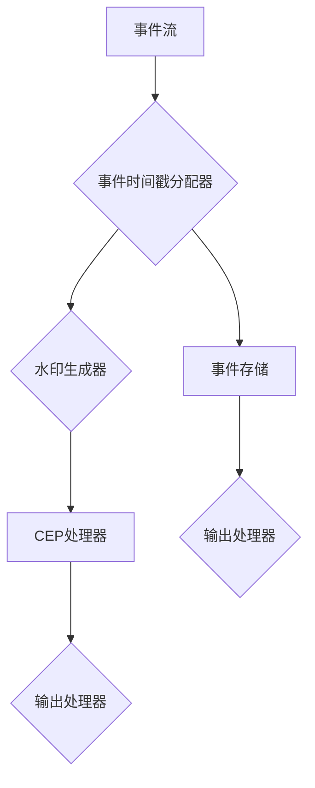

                 

# Flink CEP原理与代码实例讲解

## 概述

Flink CEP（Complex Event Processing）是Apache Flink的一个高级功能模块，它允许开发者在实时流处理场景下执行复杂的事件模式匹配和模式识别。Flink CEP的出现，弥补了传统流处理系统在复杂事件处理方面的不足，使得大数据处理更加灵活和高效。

本文旨在深入讲解Flink CEP的原理和实际应用，帮助读者全面理解其工作机制，并通过代码实例展示如何在项目中应用Flink CEP。文章将分为以下几个部分：

1. Flink CEP介绍
2. Flink CEP架构详解
3. Flink CEP核心算法原理
4. Flink CEP项目实战
5. Flink CEP高级应用
6. Flink CEP与大数据技术融合
7. Flink CEP未来发展趋势与展望
8. 附录

希望通过本文，读者能够对Flink CEP有一个系统、深入的了解，并在实际项目中能够灵活应用。

## 关键词

- Flink
- CEP
- 实时流处理
- 复杂事件处理
- 模式匹配
- 数据分析
- 事件模型
- 时间窗口

## 摘要

本文将详细介绍Apache Flink CEP模块的原理与应用。Flink CEP是Flink框架的高级扩展，专为复杂事件处理设计。文章首先介绍了Flink CEP的起源、发展历程以及核心优势，接着深入讲解了Flink CEP的架构、事件模型和时间窗口等核心概念。随后，通过具体的算法原理解析和代码实例展示，帮助读者理解Flink CEP在模式匹配、图算法和时序分析等领域的应用。文章还探讨了Flink CEP在实战项目中的实施方法，并对其在实时数据处理优化和企业级应用中的价值进行了详细分析。最后，文章展望了Flink CEP的未来发展趋势与展望，为读者提供了丰富的学习资源。

### Flink CEP介绍

#### 1.1 Flink CEP的起源与发展历程

Flink CEP（Complex Event Processing）起源于Flink开源流处理框架的扩展模块。Flink本身是一个强大的分布式流处理引擎，能够处理有界和无界数据流，并在性能和功能方面都具有显著的优点。然而，传统的流处理系统在面对复杂的事件处理任务时，往往显得力不从心，例如事件之间的关联、模式匹配以及实时推理等。为了解决这些问题，Flink团队开发了Flink CEP模块。

Flink CEP的起源可以追溯到2014年，当时Flink刚刚崭露头角，开发者社区开始意识到流处理系统在复杂事件处理方面的需求。随着大数据技术的发展，企业对实时数据处理和分析的需求日益增长，Flink CEP应运而生。

从2014年至今，Flink CEP经历了多个版本的迭代和完善。早期的版本主要集中在基础功能的实现上，如事件模型和时间窗口的处理。随着时间的推移，Flink CEP逐渐引入了更加复杂的功能，包括模式匹配、图算法和时序分析等。这些功能的加入，使得Flink CEP能够应对更多样化的实时数据处理需求。

Flink CEP的发展历程可以分为以下几个重要阶段：

1. **初期版本（2014-2016）**：这个阶段的主要工作是搭建Flink CEP的基本架构，实现事件模型和时间窗口的基本功能。
   
2. **功能扩展（2016-2018）**：在这个阶段，Flink CEP引入了模式匹配算法和图算法，使得复杂事件处理能力得到了显著提升。

3. **成熟阶段（2018至今）**：当前，Flink CEP已经发展成为一个功能丰富、稳定可靠的模块。最新的版本不断引入新的特性，如时序分析算法、状态管理优化等，进一步增强了其应用能力。

#### 1.2 Flink CEP的核心原理

Flink CEP的核心原理可以概括为实时流处理、复杂事件处理和模式识别三个部分。下面将分别介绍这些核心原理：

1. **实时流处理原理**：

   Flink CEP基于Flink流处理引擎，能够实时处理数据流。与传统的批处理不同，流处理能够对实时数据进行分析和处理，使得企业可以更快地获取业务洞察和做出决策。Flink CEP通过分布式计算和并行处理，实现了高吞吐量和低延迟的数据流处理。

2. **复杂事件处理原理**：

   复杂事件处理（CEP）是一种处理事件之间复杂关系的技术。在Flink CEP中，事件被看作是数据流中的基本单元，可以通过定义事件模型来描述事件之间的关联关系。Flink CEP通过模式匹配和图算法，能够发现数据流中的复杂事件模式，实现对实时数据的实时分析和处理。

3. **模式识别原理**：

   模式识别是Flink CEP的重要功能之一。通过定义事件模式，Flink CEP能够识别数据流中的特定模式，并触发相应的处理逻辑。模式识别在许多应用场景中具有广泛的应用，如实时监控、欺诈检测和推荐系统等。

#### 1.3 Flink CEP的优势与不足

Flink CEP作为Flink框架的一个重要扩展模块，具有许多优势，但也存在一些不足之处。

1. **优势**：

   - **实时数据处理**：Flink CEP能够实时处理数据流，快速发现事件模式，满足企业对实时数据处理的需求。
   - **复杂事件处理**：通过模式匹配和图算法，Flink CEP能够处理复杂的事件关系，实现对实时数据的深度分析。
   - **高吞吐量和低延迟**：Flink CEP基于Flink流处理引擎，具有高吞吐量和低延迟的特点，能够处理大规模实时数据流。
   - **开源生态**：Flink CEP是开源项目，拥有广泛的社区支持，用户可以获得丰富的学习资源和社区帮助。

2. **不足**：

   - **学习曲线**：Flink CEP作为一项较新的技术，其学习曲线相对较高，需要用户具备一定的流处理和复杂事件处理知识。
   - **系统稳定性**：虽然Flink CEP在性能和功能方面表现出色，但其系统的稳定性和可靠性还需要在更广泛的应用场景中验证。
   - **资源消耗**：实时数据处理需要大量的计算资源，Flink CEP可能会对系统资源产生较大的消耗，特别是在处理大规模数据流时。

总之，Flink CEP作为一种强大的实时复杂事件处理工具，具有广泛的应用前景。虽然存在一些不足，但其优势明显，值得开发者关注和学习。

#### 1.4 Flink CEP的基本概念

在深入探讨Flink CEP的原理和实现之前，首先需要了解Flink CEP的基本概念，包括事件模型、时间窗口和处理逻辑等。

1. **事件模型**：

   事件模型是Flink CEP的核心概念之一，用于描述数据流中的事件及其关系。在Flink CEP中，事件被看作是数据流中的基本单元，每个事件都包含一定的时间戳和数据内容。事件模型可以通过定义事件类型和事件之间的关联关系来描述数据流的复杂结构。

   例如，在一个股票交易系统中，事件类型可能包括“买入”、“卖出”和“查询”，这些事件可以通过关联关系描述为：“当出现买入事件后，紧接着出现卖出事件，则触发一个交易事件”。这种事件模型能够帮助企业实时监控交易行为，发现潜在的欺诈行为。

2. **时间窗口**：

   时间窗口是Flink CEP中用于处理数据流的时间范围。时间窗口可以将数据流划分为多个时间段，每个时间段内的数据会按照一定的策略进行处理。Flink CEP支持多种类型的时间窗口，包括固定时间窗口、滑动时间窗口和会话时间窗口等。

   - **固定时间窗口**：固定时间窗口将数据流划分为固定长度的时间段，例如每隔5分钟处理一次数据。这种窗口类型适用于处理周期性事件，如股票交易市场的每日行情分析。
   - **滑动时间窗口**：滑动时间窗口与固定时间窗口类似，但其允许数据在窗口内进行滑动处理，例如每隔1分钟处理一次数据，并保持过去5分钟的数据。这种窗口类型适用于实时监控和分析，如实时交易监控。
   - **会话时间窗口**：会话时间窗口以用户活动为基准，将用户的连续操作视为一个会话，并在会话结束后进行处理。例如，在一个电商系统中，用户连续30分钟内没有操作，则视为一个会话结束。这种窗口类型适用于用户行为分析，如购物车流失分析。

3. **处理逻辑**：

   Flink CEP通过定义处理逻辑来处理事件模型和时间窗口中的数据。处理逻辑可以通过定义触发条件和处理操作来实现。触发条件是指满足特定事件模式和窗口条件时触发的操作，处理操作则是触发后进行的实际数据处理操作。

   例如，在一个交通监控系统中，定义了一个触发条件：“当连续监测到3个速度超过限速的事件且发生在同一时间段内时，触发一个超速报警”。这个触发条件可以通过Flink CEP来实现，并在触发后记录超速事件并生成报警信息。

总之，事件模型、时间窗口和处理逻辑是Flink CEP的核心组成部分，它们共同构成了Flink CEP强大的实时复杂事件处理能力。理解这些基本概念，有助于更好地掌握Flink CEP的原理和应用。

#### 1.5 Flink CEP的应用场景

Flink CEP在多种应用场景中展现出了强大的能力，特别是在复杂事件处理领域。以下是一些典型的应用场景：

1. **实时交易监控**：

   在金融行业中，实时交易监控是非常关键的。Flink CEP能够实时处理交易数据，检测异常交易行为，如洗钱、欺诈等。通过定义交易事件之间的关联规则，Flink CEP可以识别出潜在的欺诈行为，并触发报警机制。

2. **智能交通系统**：

   在交通管理领域，Flink CEP可以用于实时监控交通流量，分析交通事故和拥堵情况。例如，通过定义车辆事件之间的关联规则，Flink CEP可以识别出连续超速、未系安全带等违规行为，并生成报警信息，帮助交通管理部门进行实时调控。

3. **智能推荐系统**：

   在电子商务领域，Flink CEP可以用于实时推荐系统。通过分析用户行为数据，如浏览、购买和搜索记录，Flink CEP可以识别出用户的行为模式，并生成个性化推荐。例如，当用户连续浏览某一类商品时，Flink CEP可以推荐类似的商品，提高用户购买转化率。

4. **工业物联网**：

   在工业物联网领域，Flink CEP可以用于实时监控设备状态和故障预测。通过分析设备产生的传感器数据，Flink CEP可以识别出设备故障的早期迹象，并提前进行维护，减少设备停机时间，提高生产效率。

5. **智能医疗系统**：

   在医疗领域，Flink CEP可以用于实时监控患者健康数据，如心率、血压等。通过分析健康数据，Flink CEP可以识别出异常情况，如心率异常升高，并触发预警机制，帮助医生进行及时干预。

综上所述，Flink CEP在各种应用场景中都有着广泛的应用，其强大的实时复杂事件处理能力能够帮助企业实现实时数据处理和业务洞察，提升业务效率和竞争力。

### Flink CEP架构详解

#### 2.1 Flink CEP的系统架构

Flink CEP作为Flink框架的一个扩展模块，其系统架构设计旨在提供高效、可扩展的实时复杂事件处理能力。Flink CEP的系统架构主要包括以下几个关键组件：Flink流处理引擎、CEP处理器、事件时间戳分配器和水印生成器等。下面将详细解释这些组件的功能和相互关系。

1. **Flink流处理引擎**：

   Flink流处理引擎是Flink CEP的核心，负责处理数据流和执行用户定义的计算任务。Flink流处理引擎通过分布式计算和并行处理，实现了高吞吐量和低延迟的数据流处理。在Flink CEP中，流处理引擎主要负责接收和存储数据流，并将数据分发给CEP处理器。

2. **CEP处理器**：

   CEP处理器是Flink CEP的核心组件，负责执行复杂事件处理任务。CEP处理器能够根据用户定义的事件模型和模式匹配规则，识别数据流中的复杂事件模式，并触发相应的处理逻辑。CEP处理器内部实现了高效的算法和图结构，能够快速处理大量数据。

3. **事件时间戳分配器**：

   事件时间戳分配器是Flink CEP中用于处理事件时间戳的组件。事件时间戳分配器负责为每个事件分配一个时间戳，用于标识事件发生的时间。事件时间戳的分配方式可以是基于处理时间或事件时间。处理时间是指事件被处理的时间，而事件时间是指事件实际发生的时间。事件时间戳分配器通过事件时间戳和水印机制，确保事件能够按照正确的顺序进行处理。

4. **水印生成器**：

   水印生成器是Flink CEP中用于处理事件顺序的组件。水印是在事件时间戳的基础上生成的一种特殊标记，用于标识事件流的特定时间点。水印生成器通过监测事件流中的时间戳，生成水印并传输给CEP处理器。CEP处理器利用水印确保事件按照正确的顺序进行处理，特别是在处理延迟数据或乱序数据时。

5. **事件存储**：

   事件存储是Flink CEP中用于临时存储事件的组件。在CEP处理器执行模式匹配任务时，事件存储用于存储正在处理的事件。事件存储可以根据需要配置容量和生命周期，确保事件能够被有效地存储和管理。

6. **输出处理器**：

   输出处理器是Flink CEP中用于处理输出数据的组件。在CEP处理器识别到复杂事件模式并触发处理逻辑后，输出处理器负责将处理结果输出到外部系统，如数据库、消息队列等。输出处理器可以配置多种输出策略，如单条输出、批量输出等，以适应不同的应用场景。

通过上述组件的协同工作，Flink CEP实现了高效、可扩展的实时复杂事件处理能力。Flink流处理引擎负责数据流的接收和处理，CEP处理器负责模式匹配和事件处理，事件时间戳分配器和水印生成器负责处理事件顺序，事件存储和输出处理器负责事件的存储和输出。这种组件架构使得Flink CEP能够灵活应对各种复杂事件处理需求，同时保持高性能和低延迟。

#### 2.2 Flink CEP关键组件解析

为了深入理解Flink CEP的工作原理，我们需要详细解析其关键组件，包括事件时间戳分配器、水印生成器和CEP处理器。这些组件共同构成了Flink CEP的核心架构，并在实时复杂事件处理中发挥了关键作用。

1. **事件时间戳分配器**：

   事件时间戳分配器是Flink CEP中用于处理事件时间戳的组件。其主要职责是为每个进入Flink CEP系统的事件分配一个时间戳，用于标识事件的发生时间。事件时间戳的分配方式可以是处理时间（Processing Time）或事件时间（Event Time）。

   - **处理时间**：处理时间是指事件被系统处理的时间。在处理时间模式下，事件的时间戳是由系统内部的时钟决定的。这种方式简单易用，但存在一些问题。由于处理时间是基于系统时钟，如果系统时钟不准确或出现时钟偏移，会导致事件顺序的误差。

   - **事件时间**：事件时间是指事件实际发生的时间。在事件时间模式下，事件的时间戳是从事件源获取的，通常通过事件时间戳标记（如时间戳字段）或水印（Watermark）进行传递。事件时间能够更准确地反映事件发生的顺序，特别是在处理延迟数据和乱序数据时。事件时间戳分配器通过监听事件流中的时间戳和水印，确保事件按照正确的顺序进行处理。

2. **水印生成器**：

   水印生成器是Flink CEP中用于处理事件顺序的组件。水印是一种特殊的时间戳标记，用于标识事件流的特定时间点。水印生成器通过监测事件流中的时间戳和水印，生成并传输水印到CEP处理器。CEP处理器利用水印确保事件能够按照正确的顺序进行处理，特别是在处理延迟数据和乱序数据时。

   - **延迟数据**：延迟数据是指由于网络延迟、系统负载等原因，导致事件到达时间比实际发生时间晚的数据。在处理延迟数据时，水印能够帮助Flink CEP系统识别出延迟事件，并确保这些事件在正确的时间进行处理。

   - **乱序数据**：乱序数据是指事件之间的时间戳不按实际发生顺序到达的数据。在处理乱序数据时，水印能够帮助Flink CEP系统识别出事件的相对顺序，并确保事件按照正确的顺序进行处理。

   水印生成器的工作原理如下：

   - 当事件流进入Flink CEP系统时，水印生成器会监测事件的时间戳。
   - 如果事件流是按序到达的，水印生成器会根据最大时间戳生成水印。
   - 如果事件流中出现延迟或乱序，水印生成器会在延迟事件或乱序事件的边界生成水印。
   - 水印会被传输到CEP处理器，用于确保事件按照正确的顺序进行处理。

3. **CEP处理器**：

   CEP处理器是Flink CEP的核心组件，负责执行复杂事件处理任务。CEP处理器能够根据用户定义的事件模型和模式匹配规则，识别数据流中的复杂事件模式，并触发相应的处理逻辑。CEP处理器内部实现了高效的算法和图结构，能够快速处理大量数据。

   CEP处理器的工作原理如下：

   - 用户定义事件模型和模式匹配规则，描述数据流中事件的关联关系。
   - 事件流进入Flink CEP系统后，CEP处理器会根据事件模型和规则进行模式匹配。
   - 当识别到符合规则的事件模式时，CEP处理器会触发相应的处理逻辑。
   - 处理逻辑可以是简单的数据记录，也可以是复杂的业务逻辑，如报警、数据更新等。
   - 处理结果会被输出到外部系统或存储，以供进一步分析或决策。

通过事件时间戳分配器、水印生成器和CEP处理器的协同工作，Flink CEP能够实现对实时流数据的复杂事件处理。事件时间戳分配器和水印生成器确保事件能够按照正确的顺序进行处理，特别是在处理延迟数据和乱序数据时。CEP处理器则负责执行用户定义的复杂事件处理任务，识别数据流中的复杂事件模式，并触发相应的处理逻辑。这种架构设计使得Flink CEP能够高效、准确地处理实时数据流，满足各种复杂事件处理需求。

#### 2.3 Flink CEP架构的Mermaid流程图

为了更直观地理解Flink CEP的架构，我们使用Mermaid流程图来展示其关键组件和交互关系。以下是一个简化的Mermaid流程图：



**Mermaid流程图说明：**

- **事件流（A）**：表示进入Flink CEP系统的事件流。
- **事件时间戳分配器（B）**：负责为每个事件分配时间戳，可以是处理时间或事件时间。
- **水印生成器（C）**：通过事件时间戳生成水印，确保事件顺序。
- **CEP处理器（D）**：根据用户定义的事件模型和模式匹配规则，识别复杂事件模式并触发处理逻辑。
- **输出处理器（E）**：负责处理结果的输出，可以是简单的数据记录或复杂的业务逻辑。
- **事件存储（F）**：用于存储正在处理的事件，确保事件能够被正确处理。

通过这个Mermaid流程图，我们可以清晰地看到Flink CEP系统中的关键组件以及它们之间的交互关系，有助于理解Flink CEP的工作原理和架构设计。

### Flink CEP事件模型

#### 2.4 事件模型概述

在Flink CEP中，事件模型是描述数据流中事件及其关系的核心概念。事件模型通过定义事件类型、事件属性和事件之间的关联关系，帮助开发者实现对实时数据流的复杂事件处理和分析。事件模型是Flink CEP架构的核心，它决定了事件如何被处理、匹配和关联。

事件模型通常由以下三个部分组成：

1. **事件类型**：事件类型是事件模型中的基本单元，用于标识事件的不同类别。在Flink CEP中，事件类型可以是用户定义的任何数据结构，如POJO（Plain Old Java Object）或自定义类。事件类型通常包含事件的基本属性，如时间戳、事件ID等。

2. **事件属性**：事件属性是指事件类型中的具体属性，用于描述事件的特征和属性。事件属性可以是基本的Java数据类型，如整数、浮点数、字符串等，也可以是复杂的对象结构。事件属性可以用来匹配和关联事件，例如，在股票交易系统中，事件属性可能包括股票代码、交易价格、交易量等。

3. **事件关联规则**：事件关联规则描述了事件之间如何关联和匹配。事件关联规则可以是简单的相邻关系，也可以是复杂的逻辑关系，如“当出现两个连续的买入事件后，再出现一个卖出事件，则触发一个交易事件”。事件关联规则通过定义事件之间的时序关系、条件关系和组合关系，帮助Flink CEP识别复杂的事件模式。

#### 2.5 事件时间与处理时间

在Flink CEP中，事件时间（Event Time）和处理时间（Processing Time）是两种重要的时间概念，它们在事件模型中起着关键作用。正确理解和使用这两种时间概念，是确保Flink CEP能够准确处理实时数据流的基础。

1. **事件时间**：

   事件时间是指事件实际发生的时间，通常是从事件源获取的时间戳。事件时间能够更准确地反映事件发生的真实顺序，特别是在处理延迟数据和乱序数据时。例如，在一个股票交易系统中，事件时间可以是从交易所获取的交易时间戳。

   - **优势**：

     - 能够处理延迟数据和乱序数据，确保事件按照实际发生的顺序进行处理。
     - 能够实现更精细的时间分析，例如，根据事件时间进行时间窗口划分和模式匹配。
     
   - **挑战**：

     - 需要可靠的事件时间戳来源，确保时间戳的准确性和一致性。
     - 可能引入额外的时间延迟，因为事件需要从事件源获取时间戳。

2. **处理时间**：

   处理时间是指事件被系统处理的时间，通常是基于系统内部的时钟。处理时间简单易用，但可能无法准确反映事件发生的真实顺序，特别是在处理延迟数据和乱序数据时。

   - **优势**：

     - 系统时钟稳定，易于实现和时间戳分配。
     - 不依赖于事件源的时间戳，可以简化系统的设计和实现。

   - **挑战**：

     - 可能导致事件顺序的误差，特别是在处理延迟数据和乱序数据时。
     - 难以实现精细的时间分析，例如，基于事件时间进行时间窗口划分和模式匹配。

在实际应用中，选择事件时间还是处理时间，需要根据具体场景和数据特性进行权衡。对于需要精确事件顺序和时间分析的场景，如金融交易监控和实时数据分析，事件时间通常更为合适。而对于系统简单、时间戳可靠性高且延迟可以接受的场景，处理时间可能更加适用。

#### 2.6 水印（Watermark）机制

在Flink CEP中，水印（Watermark）是一种关键机制，用于确保事件流中的事件能够按照正确的顺序进行处理。水印机制在处理延迟数据和乱序数据时尤为重要，它能够帮助Flink CEP系统识别事件的相对顺序，并确保事件在正确的时间点进行处理。

1. **水印的概念**：

   水印是一种时间戳标记，用于标识事件流的特定时间点。在一个事件流中，水印通常由系统生成并传输，以便CEP处理器能够正确处理事件。水印的时间戳通常是事件流中某个时间点的最大时间戳，表示在此时间点之前的事件已经全部到达。

2. **水印生成原理**：

   水印生成器通过监测事件流中的时间戳，生成并传输水印。水印生成器的工作原理如下：

   - 当事件流进入Flink CEP系统时，水印生成器会监测事件的时间戳。
   - 如果事件流是按序到达的，水印生成器会根据最大时间戳生成水印。
   - 如果事件流中出现延迟或乱序，水印生成器会在延迟事件或乱序事件的边界生成水印。
   - 水印会被传输到CEP处理器，用于确保事件按照正确的顺序进行处理。

3. **水印处理机制**：

   在Flink CEP中，水印处理机制主要包括以下步骤：

   - **水印生成**：水印生成器根据事件流生成水印，并将其传输到CEP处理器。
   - **水印接收**：CEP处理器接收并处理水印，根据水印时间戳确定事件的处理顺序。
   - **事件处理**：CEP处理器根据事件模型和模式匹配规则，处理按序到达的事件，并等待后续事件。
   - **事件输出**：当事件满足模式匹配规则时，CEP处理器会触发相应的处理逻辑，并将处理结果输出。

   通过水印机制，Flink CEP能够确保事件按照正确的顺序进行处理，特别是在处理延迟数据和乱序数据时。水印机制不仅能够处理乱序数据，还能够提高系统的容错性和可靠性，确保事件能够被正确处理。

4. **水印策略**：

   根据应用场景和需求，可以选择不同的水印策略。常见的几种水印策略如下：

   - **最大时间戳水印**：根据事件流中的最大时间戳生成水印，适用于按序到达的事件流。
   - **边界水印**：在事件流中出现延迟或乱序时，根据延迟事件或乱序事件的边界生成水印，适用于处理延迟数据和乱序数据。
   - **计数器水印**：通过计数器机制生成水印，适用于事件到达频率较高且时间戳分布不均匀的场景。

   选择合适的水印策略，能够提高Flink CEP系统的性能和可靠性，确保事件能够被正确、高效地处理。

总之，水印机制是Flink CEP中处理延迟数据和乱序数据的关键机制。通过合理设计和使用水印机制，Flink CEP能够实现对实时数据流的复杂事件处理，满足各种应用场景的需求。

#### 2.7 时间窗口

时间窗口是Flink CEP中用于处理数据流的时间范围。时间窗口可以将数据流划分为多个时间段，每个时间段内的数据会按照一定的策略进行处理。时间窗口在Flink CEP中起着重要作用，能够帮助开发者实现对实时数据的周期性分析、统计和模式匹配。

Flink CEP支持多种类型的时间窗口，包括固定时间窗口、滑动时间窗口和会话时间窗口等。每种时间窗口都有其特定的应用场景和特点。

1. **固定时间窗口**：

   固定时间窗口将数据流划分为固定长度的时间段。例如，每隔5分钟处理一次数据，形成一个长度为5分钟的时间窗口。这种窗口类型适用于处理周期性事件，如股票交易市场的每日行情分析。

   - **工作原理**：

     - 当数据流进入Flink CEP系统时，会被分配到一个固定时间窗口中。
     - 每个时间窗口独立处理，窗口内的数据按照固定的时间间隔进行处理。
     - 窗口处理完毕后，会生成一个窗口结果，并触发相应的处理逻辑。

   - **应用场景**：

     - 周期性数据统计：例如，每天统计网站访问量、交易量等。
     - 实时监控：例如，监控系统状态，检查系统是否正常运行。

2. **滑动时间窗口**：

   滑动时间窗口与固定时间窗口类似，但其允许数据在窗口内进行滑动处理。例如，每隔1分钟处理一次数据，并保持过去5分钟的数据。这种窗口类型适用于实时监控和分析，如实时交易监控。

   - **工作原理**：

     - 当数据流进入Flink CEP系统时，会被分配到一个滑动时间窗口中。
     - 每个时间窗口按照固定的时间间隔滑动，窗口内的数据会随着新数据的加入而更新。
     - 窗口处理完毕后，会生成一个窗口结果，并触发相应的处理逻辑。

   - **应用场景**：

     - 实时监控：例如，实时监控网络流量、交易行为等。
     - 实时分析：例如，实时分析用户行为，生成推荐列表。

3. **会话时间窗口**：

   会话时间窗口以用户活动为基准，将用户的连续操作视为一个会话，并在会话结束后进行处理。例如，用户连续30分钟内没有操作，则视为一个会话结束。这种窗口类型适用于用户行为分析，如购物车流失分析。

   - **工作原理**：

     - 当用户活动进入Flink CEP系统时，会被分配到一个会话时间窗口中。
     - 用户活动会在窗口内持续记录，直到会话结束。
     - 会话结束后，会生成一个会话结果，并触发相应的处理逻辑。

   - **应用场景**：

     - 用户行为分析：例如，分析用户浏览、购买、搜索等行为，生成用户画像。
     - 活动监控：例如，监控用户在线时长、活动频率等。

总之，时间窗口是Flink CEP中处理实时数据流的重要工具。通过合理选择和使用时间窗口，开发者能够实现对实时数据的周期性分析、统计和模式匹配，满足各种应用场景的需求。

### Flink CEP核心算法原理

#### 3.1 模式匹配算法

Flink CEP的核心功能之一是模式匹配算法，它能够识别数据流中的复杂事件模式。模式匹配算法在Flink CEP中起着至关重要的作用，能够帮助企业实时监控和响应各种事件。

模式匹配算法的基本原理是，通过定义事件模型和规则，识别数据流中符合规则的事件序列。模式匹配可以分为以下几个步骤：

1. **定义事件模型**：

   事件模型描述了数据流中事件的类型和属性。在Flink CEP中，事件模型通常由事件类型、事件属性和事件关联规则组成。事件类型是事件的基本分类，事件属性是事件的具体特征，事件关联规则描述了事件之间的关联关系。

2. **构建模式规则**：

   模式规则是用于匹配事件序列的规则集。规则可以定义事件之间的时序关系、条件关系和组合关系。例如，可以定义一个规则：“当出现两个连续的买入事件后，再出现一个卖出事件，则触发一个交易事件”。

3. **数据流处理**：

   在数据流处理阶段，Flink CEP会持续监测数据流中的事件，并根据定义的模式规则进行匹配。如果事件序列符合规则，则会触发相应的处理逻辑。

4. **模式匹配**：

   模式匹配是模式匹配算法的核心步骤。Flink CEP使用高效的图算法和图结构，对事件序列进行匹配。图算法能够快速识别复杂的事件模式，并确保匹配的准确性。

5. **触发处理逻辑**：

   当事件序列符合模式规则时，Flink CEP会触发相应的处理逻辑。处理逻辑可以是简单的数据记录，也可以是复杂的业务逻辑，如报警、数据更新等。

#### 3.2 模式匹配算法伪代码

为了更直观地理解模式匹配算法，我们使用伪代码来描述其基本步骤：

```python
def pattern_matching(event_stream, pattern_rules):
    while True:
        for event in event_stream:
            if event_matches_pattern(event, pattern_rules):
                trigger_processing_logic(event)
                break
        else:
            # 没有事件匹配到模式规则，继续等待
            continue

def event_matches_pattern(event, pattern_rules):
    # 根据模式规则判断事件是否匹配
    for rule in pattern_rules:
        if matches_event_sequence(event, rule):
            return True
    return False

def matches_event_sequence(event, rule):
    # 判断事件是否符合规则中的时序关系、条件关系和组合关系
    for condition in rule.conditions:
        if not condition_satisfied(event, condition):
            return False
    return True

def trigger_processing_logic(event):
    # 触发相应的处理逻辑，如报警、数据更新等
    # ...
```

#### 3.3 模式匹配示例

下面通过一个示例来说明模式匹配算法在实际应用中的实现。

**示例：股票交易监控**

假设我们要监控股票交易系统，定义一个模式规则：“当出现两个连续的买入事件后，再出现一个卖出事件，则触发一个交易事件”。

1. **定义事件模型**：

   事件模型包含事件类型和事件属性：

   ```java
   public class TradeEvent {
       String tradeType; // 交易类型（买入或卖出）
       double price;     // 交易价格
       int quantity;     // 交易数量
   }
   ```

2. **构建模式规则**：

   模式规则定义如下：

   ```java
   public class TradePattern {
       List<String> eventTypes; // 事件类型
       List<Condition> conditions; // 条件列表

       public TradePattern(String firstEventType, String secondEventType, String thirdEventType) {
           eventTypes = Arrays.asList(firstEventType, secondEventType, thirdEventType);
           conditions = new ArrayList<>();
           conditions.add(new EventTypeCondition(firstEventType));
           conditions.add(new EventTypeCondition(secondEventType));
           conditions.add(new EventTypeCondition(thirdEventType));
           conditions.add(new SequenceCondition());
       }
   }
   ```

3. **数据流处理**：

   在股票交易系统中，数据流中的每个事件都会被Flink CEP处理。假设有以下三个事件序列：

   ```java
   TradeEvent e1 = new TradeEvent("买入", 100.0, 100);
   TradeEvent e2 = new TradeEvent("买入", 101.0, 100);
   TradeEvent e3 = new TradeEvent("卖出", 99.0, 100);
   ```

4. **模式匹配**：

   Flink CEP会根据定义的模式规则进行匹配。首先匹配事件序列 `e1, e2`，然后等待事件 `e3` 的到来。当 `e3` 到来时，事件序列 `e1, e2, e3` 符合模式规则，会触发交易事件。

5. **触发处理逻辑**：

   触发相应的处理逻辑，例如记录交易事件、发送报警等。

通过这个示例，我们可以看到模式匹配算法在股票交易监控中的应用。通过定义事件模型和模式规则，Flink CEP能够实时识别复杂的事件模式，帮助开发者实现对数据流的实时监控和分析。

### 3.4 图算法

Flink CEP中的图算法用于处理复杂的事件关联关系，通过图结构表示事件之间的交互和依赖，能够高效地识别和解析复杂的模式。图算法是Flink CEP的重要组成部分，能够帮助开发者实现更复杂的实时数据处理任务。

#### 3.4.1 图算法概述

图算法是一种基于图论的方法，用于分析和处理复杂的关系网络。在Flink CEP中，图算法可以表示事件之间的关联关系，包括事件之间的相邻关系、层次关系和组合关系。图算法的核心概念包括：

1. **图（Graph）**：图是图算法中的基本结构，由节点（Node）和边（Edge）组成。节点表示事件，边表示事件之间的关联关系。

2. **路径（Path）**：路径是图中的节点序列，表示事件之间的顺序关系。在Flink CEP中，路径用于表示事件模式，如“买入、卖出、买入”等。

3. **子图（Subgraph）**：子图是图的一部分，可以表示特定的模式或事件集合。Flink CEP通过子图匹配算法，识别数据流中的特定模式。

4. **图算法**：图算法是一种用于处理图的算法集合，包括遍历、匹配、搜索和优化等。在Flink CEP中，常用的图算法有DFS（深度优先搜索）、BFS（广度优先搜索）和拓扑排序等。

#### 3.4.2 图算法伪代码

为了更直观地理解图算法，我们使用伪代码来描述图算法的基本步骤：

```python
def graph_algorithm(graph, start_node, end_node):
    visited = set()  # 记录已访问节点
    path = []  # 记录当前路径

    def dfs(node):
        visited.add(node)
        path.append(node)
        if node == end_node:
            return True
        for neighbor in graph.neighbors(node):
            if neighbor not in visited:
                if dfs(neighbor):
                    return True
        path.pop()  # 回溯
        return False

    if start_node not in visited:
        dfs(start_node)
    return path
```

#### 3.4.3 图算法示例

下面通过一个示例来说明图算法在Flink CEP中的应用。

**示例：社交网络分析**

假设我们有一个社交网络，其中每个用户是一个节点，用户之间的关注关系表示为边。我们需要通过图算法分析社交网络中的影响力和传播路径。

1. **定义图结构**：

   社交网络的图结构如下：

   ```python
   graph = {
       'Alice': ['Bob', 'Charlie'],
       'Bob': ['Alice', 'Charlie'],
       'Charlie': ['Alice', 'Bob'],
       'Dave': ['Alice', 'Charlie']
   }
   ```

2. **定义事件模型**：

   事件模型包括用户和关注关系：

   ```python
   user_events = {
       'Alice': {'type': '关注', 'target': 'Bob'},
       'Bob': {'type': '关注', 'target': 'Alice'},
       'Charlie': {'type': '关注', 'target': 'Alice'},
       'Dave': {'type': '关注', 'target': 'Alice'}
   }
   ```

3. **构建图算法**：

   我们可以使用DFS算法来分析社交网络中的影响力和传播路径。以下是一个简单的DFS算法实现：

   ```python
   def dfs(graph, start, visited=None):
       if visited is None:
           visited = set()
       visited.add(start)
       print(start)
       for neighbor in graph[start]:
           if neighbor not in visited:
               dfs(graph, neighbor, visited)
   ```

4. **执行图算法**：

   通过执行DFS算法，我们可以分析出社交网络中的影响力和传播路径：

   ```python
   dfs(graph, 'Alice')
   ```

   输出结果为：

   ```plaintext
   Alice
   Bob
   Charlie
   Dave
   ```

通过这个示例，我们可以看到图算法在社交网络分析中的应用。通过定义图结构和事件模型，使用DFS算法，我们可以快速识别社交网络中的影响力和传播路径，为社交媒体分析提供有力支持。

### 3.5 时间序列分析算法

时间序列分析是Flink CEP中的重要算法之一，用于处理和分析随时间变化的数据序列。时间序列分析算法能够帮助企业识别数据中的趋势、周期性、季节性和异常值，从而提供有价值的业务洞察和预测。

#### 3.5.1 时间序列分析原理

时间序列分析基于以下几个核心概念：

1. **时间序列**：时间序列是一系列按时间顺序排列的数据点，通常用于记录某一变量随时间的变化。例如，股票价格、温度变化、网站流量等。

2. **趋势**：趋势是指时间序列中长期的上升或下降趋势。趋势分析可以帮助识别数据的主要变化方向。

3. **周期性**：周期性是指时间序列中重复出现的变化模式。周期分析可以帮助识别数据的周期性变化，如季节性波动。

4. **季节性**：季节性是指时间序列因季节因素而出现的变化。季节性分析可以帮助识别数据中的季节性波动，如节假日效应。

5. **异常值**：异常值是指时间序列中明显偏离整体趋势的数据点。异常值分析可以帮助识别数据中的异常情况，如异常交易、异常温度等。

时间序列分析的基本步骤包括：

1. **数据预处理**：对时间序列数据进行清洗和转换，确保数据质量。数据预处理可能包括去除缺失值、平滑噪声、归一化等操作。

2. **趋势分析**：使用趋势分析算法，如移动平均、指数平滑等，识别时间序列的长期趋势。

3. **周期性和季节性分析**：使用周期性和季节性分析算法，如周期图、季节图等，识别时间序列的周期性和季节性变化。

4. **异常值分析**：使用异常值检测算法，如标准差法、箱线图等，识别时间序列中的异常值。

5. **预测**：基于趋势、周期性和季节性分析结果，使用预测算法，如ARIMA、LSTM等，对未来时间点的数据进行分析和预测。

#### 3.5.2 时间序列分析伪代码

为了更直观地理解时间序列分析算法，我们使用伪代码来描述其基本步骤：

```python
def time_series_analysis(time_series):
    # 数据预处理
    processed_series = preprocess_time_series(time_series)

    # 趋势分析
    trend = trend_analysis(processed_series)

    # 周期性和季节性分析
    seasonality = seasonality_analysis(processed_series)

    # 异常值分析
    outliers = outlier_detection(processed_series)

    # 预测
    forecast = forecast_analysis(trend, seasonality)

    return trend, seasonality, outliers, forecast

def preprocess_time_series(series):
    # 去除缺失值、平滑噪声、归一化等操作
    # ...

def trend_analysis(series):
    # 使用移动平均、指数平滑等算法分析趋势
    # ...

def seasonality_analysis(series):
    # 使用周期图、季节图等算法分析周期性和季节性
    # ...

def outlier_detection(series):
    # 使用标准差法、箱线图等算法检测异常值
    # ...

def forecast_analysis(trend, seasonality):
    # 使用ARIMA、LSTM等算法进行预测
    # ...
```

#### 3.5.3 时间序列分析示例

下面通过一个示例来说明时间序列分析算法在实际应用中的实现。

**示例：网站流量分析**

假设我们需要分析一个网站的日访问量数据，定义一个时间序列如下：

```python
time_series = [1000, 1200, 1500, 1300, 900, 1100, 800, 1000, 900, 1200]
```

1. **数据预处理**：

   对时间序列进行预处理，去除异常值、平滑噪声等：

   ```python
   processed_series = preprocess_time_series(time_series)
   ```

2. **趋势分析**：

   使用移动平均算法分析时间序列的趋势：

   ```python
   trend = trend_analysis(processed_series)
   ```

   假设我们使用5日移动平均：

   ```python
   moving_average = [sum(processed_series[i:i+5]) / 5 for i in range(len(processed_series) - 4)]
   ```

3. **周期性和季节性分析**：

   使用周期图分析时间序列的周期性：

   ```python
   seasonality = seasonality_analysis(processed_series)
   ```

   通过分析时间序列的波动，我们可以发现周期性波动：

   ```python
   seasonality_pattern = [max(seasonality), min(seasonality)]
   ```

4. **异常值分析**：

   使用标准差法检测时间序列中的异常值：

   ```python
   outliers = outlier_detection(processed_series)
   ```

   假设我们使用3倍标准差法：

   ```python
   mean = sum(processed_series) / len(processed_series)
   std_dev = math.sqrt(sum([(x - mean) ** 2 for x in processed_series]) / len(processed_series))
   outliers = [x for x in processed_series if abs(x - mean) > 3 * std_dev]
   ```

5. **预测**：

   使用LSTM算法进行时间序列预测：

   ```python
   forecast = forecast_analysis(trend, seasonality)
   ```

   通过训练LSTM模型，我们可以预测未来几天的访问量：

   ```python
   forecasted_values = lstm_model.predict(processed_series)
   ```

通过这个示例，我们可以看到时间序列分析算法在网站流量分析中的应用。通过数据预处理、趋势分析、周期性和季节性分析、异常值分析和预测，我们可以对网站流量进行深入分析和预测，为业务决策提供支持。

### Flink CEP项目实战

#### 4.1 实战项目概述

为了更好地理解Flink CEP的实际应用，我们将通过一个具体的实战项目来进行讲解。该项目是一个实时股票交易监控系统，通过Flink CEP来监控和分析股票交易行为，识别异常交易并生成报警信息。

**项目背景**：

在金融市场中，实时监控交易行为对于防范欺诈、发现市场异常具有重要意义。传统的监控系统往往依赖于批处理系统，无法及时响应市场变化。而Flink CEP作为一种实时复杂事件处理工具，能够高效地处理海量交易数据，识别复杂的交易模式，为实时监控提供技术支持。

**项目目标**：

1. 实时接收股票交易数据，并将数据转换为Flink CEP可处理的事件模型。
2. 使用Flink CEP的模式匹配和图算法，识别复杂的交易模式，如高频交易、市场操纵等。
3. 根据识别到的异常交易模式，生成报警信息并实时发送到报警系统。

**项目架构**：

本项目采用分布式架构，主要包括以下几个关键组件：

1. **数据源**：股票交易数据的来源，可以是实时数据流或数据库。
2. **数据接入层**：负责将股票交易数据接入到Flink CEP系统中。
3. **Flink CEP处理层**：负责对股票交易数据执行模式匹配和图算法，识别异常交易。
4. **报警系统**：接收Flink CEP生成的报警信息，并进行处理和通知。

#### 4.2 环境搭建

为了运行本项目，需要搭建一个Flink CEP环境，包括以下步骤：

1. **安装Java环境**：

   Flink CEP是基于Java开发的，因此首先需要安装Java环境。推荐使用Java 8或更高版本。

   ```bash
   sudo apt-get update
   sudo apt-get install openjdk-8-jdk
   java -version
   ```

2. **安装Flink**：

   下载并解压Flink安装包，配置Flink环境变量。

   ```bash
   wget https://www-eu.apache.org/dist/flink/flink-1.11.2/flink-1.11.2-bin-scala_2.11.tgz
   tar xvf flink-1.11.2-bin-scala_2.11.tgz
   export FLINK_HOME=/path/to/flink-1.11.2
   export PATH=$PATH:$FLINK_HOME/bin
   ```

3. **安装Flink CEP**：

   Flink CEP是Flink的一个模块，可以通过Flink的Maven仓库进行安装。

   ```bash
   flink install-cep-module
   ```

4. **配置Flink集群**：

   根据实际需求配置Flink集群，包括JobManager和TaskManagers。建议使用YARN或Kubernetes等资源管理器进行集群管理。

   ```bash
   ./bin/flink run -c org.apache.flink.streaming.api.environment.StreamingExecutionEnvironment -m yarn-cluster -yjm 1024m -ytm 1024m -ys 1 examples/streaming/CEPExample.jar
   ```

#### 4.3 代码实现

在本节中，我们将详细介绍如何使用Flink CEP来监控股票交易行为，包括数据流处理、模式匹配和报警生成。

1. **定义事件模型**：

   首先定义股票交易事件的数据模型，包括交易时间、交易股票、交易价格、交易量等信息。

   ```java
   public class TradeEvent {
       private Long timestamp;  // 交易时间
       private String stockSymbol;  // 交易股票
       private double price;  // 交易价格
       private int quantity;  // 交易量

       // 省略构造函数、getter和setter方法
   }
   ```

2. **数据流处理**：

   使用Flink Streaming API读取股票交易数据，并将其转换为TradeEvent对象。

   ```java
   public class TradeStreamSource {
       public DataStream<TradeEvent> getTradeDataStream(StreamExecutionEnvironment env) {
           // 假设使用Kafka作为数据源
           FlinkKafkaConsumer<TradeEvent> tradeConsumer = new FlinkKafkaConsumer<>("trade_topic", new TradeEventSchema(), properties);
           return env.addSource(tradeConsumer);
       }
   }
   ```

3. **模式匹配**：

   使用Flink CEP的模式匹配功能，定义复杂的交易模式，如高频交易。

   ```java
   public class HighFrequencyTradingPattern {
       public Pattern<TradeEvent> buildPattern() {
           // 定义模式规则
           Pattern<TradeEvent> pattern = Pattern.<TradeEvent>begin("start")
                   .where(atLeast(2).times(
                       matchPattern().begin("high_freq").next("high_freq").optional("high_freq")));

           return pattern;
       }
   }
   ```

4. **报警生成**：

   当识别到异常交易模式时，生成报警信息并触发报警。

   ```java
   public class AlarmGenerator {
       public void generateAlarm(String alarmMessage) {
           // 发送报警信息到报警系统
           // ...
       }
   }
   ```

5. **完整代码示例**：

   下面是一个完整的代码示例，展示了如何使用Flink CEP监控股票交易行为。

   ```java
   public class StockTradingMonitor {
       public static void main(String[] args) throws Exception {
           // 初始化执行环境
           StreamExecutionEnvironment env = StreamExecutionEnvironment.getExecutionEnvironment();

           // 配置Kafka参数
           Properties properties = new Properties();
           properties.setProperty("bootstrap.servers", "localhost:9092");
           properties.setProperty("group.id", "stockTradingMonitor");

           // 数据源
           DataStream<TradeEvent> tradeDataStream = new TradeStreamSource().getTradeDataStream(env);

           // 模式匹配
           HighFrequencyTradingPattern highFrequencyTradingPattern = new HighFrequencyTradingPattern();
           Pattern<TradeEvent> highFrequencyPattern = highFrequencyTradingPattern.buildPattern();

           // 执行模式匹配
           PatternStream<TradeEvent> patternStream = CEP.pattern(tradeDataStream, highFrequencyPattern);

           // 处理匹配结果
           patternStream.select(new HighFrequencyTradingPattern.SelectorFunction()).addSink(new AlarmGenerator().new AlarmSink());

           // 执行作业
           env.execute("StockTradingMonitor");
       }
   }
   ```

通过这个实战项目，我们可以看到如何使用Flink CEP进行实时股票交易监控，识别异常交易并生成报警信息。这个项目展示了Flink CEP在实际应用中的强大能力，为金融行业提供了有效的监控手段。

### 4.4 代码解读与分析

在本节中，我们将对实战项目的关键代码进行详细解读，分析其实现原理和性能优化策略。

#### 4.4.1 代码结构解析

首先，我们来解析代码的结构。整个项目可以分为以下几个模块：

1. **数据源模块（TradeStreamSource）**：负责从Kafka读取股票交易数据，并将其转换为TradeEvent对象。这个模块通过FlinkKafkaConsumer读取数据，然后将其作为DataStream传递给后续处理。

2. **模式匹配模块（HighFrequencyTradingPattern）**：定义了复杂的事件模式，如高频交易模式。这个模块通过Flink CEP的模式匹配功能，使用Pattern API构建复杂的事件模式。

3. **报警生成模块（AlarmGenerator）**：负责生成报警信息并触发报警。这个模块通过实现SelectorFunction和AlarmSink，将匹配结果转换为报警信息，并将其发送到报警系统。

4. **主程序模块（StockTradingMonitor）**：负责初始化执行环境、配置Kafka参数、连接数据源、定义模式匹配和执行作业。这个模块是整个项目的核心，实现了股票交易监控的完整流程。

#### 4.4.2 关键代码解读

接下来，我们详细解读关键代码，分析其实现原理。

1. **数据流处理代码**：

   ```java
   public class TradeStreamSource {
       public DataStream<TradeEvent> getTradeDataStream(StreamExecutionEnvironment env) {
           // 假设使用Kafka作为数据源
           FlinkKafkaConsumer<TradeEvent> tradeConsumer = new FlinkKafkaConsumer<>("trade_topic", new TradeEventSchema(), properties);
           return env.addSource(tradeConsumer);
       }
   }
   ```

   这段代码通过FlinkKafkaConsumer从Kafka中读取股票交易数据，并将其作为DataStream返回。FlinkKafkaConsumer配置了Kafka服务器地址和主题名称，并使用TradeEventSchema来反序列化Kafka消息。

2. **模式匹配代码**：

   ```java
   public class HighFrequencyTradingPattern {
       public Pattern<TradeEvent> buildPattern() {
           // 定义模式规则
           Pattern<TradeEvent> pattern = Pattern.<TradeEvent>begin("start")
                   .where(atLeast(2).times(
                       matchPattern().begin("high_freq").next("high_freq").optional("high_freq")));

           return pattern;
       }
   }
   ```

   这段代码定义了一个高频交易模式，通过Pattern API构建了一个事件模式。模式中使用了begin、where和times等函数，定义了事件之间的时序关系和匹配条件。这个模式将识别出连续出现两次及以上相同股票的高频交易事件。

3. **报警生成代码**：

   ```java
   public class AlarmGenerator {
       public void generateAlarm(String alarmMessage) {
           // 发送报警信息到报警系统
           // ...
       }
   }
   ```

   这段代码定义了一个报警生成方法，用于发送报警信息到报警系统。在这个示例中，我们使用了简单的打印输出，实际应用中可以替换为发送到邮件、短信等报警系统。

4. **主程序代码**：

   ```java
   public class StockTradingMonitor {
       public static void main(String[] args) throws Exception {
           // 初始化执行环境
           StreamExecutionEnvironment env = StreamExecutionEnvironment.getExecutionEnvironment();

           // 配置Kafka参数
           Properties properties = new Properties();
           properties.setProperty("bootstrap.servers", "localhost:9092");
           properties.setProperty("group.id", "stockTradingMonitor");

           // 数据源
           DataStream<TradeEvent> tradeDataStream = new TradeStreamSource().getTradeDataStream(env);

           // 模式匹配
           HighFrequencyTradingPattern highFrequencyTradingPattern = new HighFrequencyTradingPattern();
           Pattern<TradeEvent> highFrequencyPattern = highFrequencyTradingPattern.buildPattern();

           // 执行模式匹配
           PatternStream<TradeEvent> patternStream = CEP.pattern(tradeDataStream, highFrequencyPattern);

           // 处理匹配结果
           patternStream.select(new HighFrequencyTradingPattern.SelectorFunction()).addSink(new AlarmGenerator().new AlarmSink());

           // 执行作业
           env.execute("StockTradingMonitor");
       }
   }
   ```

   这段代码初始化了Flink执行环境，配置了Kafka参数，连接了数据源，并定义了模式匹配和处理结果。通过调用CEP.pattern方法，将DataStream与模式规则进行绑定，然后使用select方法处理匹配结果，并添加Sink输出报警信息。最后，调用env.execute方法执行作业。

#### 4.4.3 性能优化建议

为了提高实战项目的性能，我们可以采取以下优化策略：

1. **数据分区和并行度优化**：

   - 增加Kafka消费者的分区数，提高数据读取的并行度。
   - 调整Flink作业的并行度，确保数据能够在多个任务中进行并行处理。

2. **序列化优化**：

   - 选择高效的数据序列化库，减少序列化和反序列化时间。
   - 使用Flink内置的序列化器，如TypeInformationSerializationSchema，提高序列化性能。

3. **事件时间处理优化**：

   - 使用事件时间戳和水印机制，确保事件按照正确的顺序进行处理。
   - 根据实际需求，选择合适的事件时间戳分配器和水印策略，提高系统的时间精度和稳定性。

4. **内存和资源优化**：

   - 调整Flink任务的内存配置，避免内存溢出和GC（垃圾回收）影响性能。
   - 根据任务负载和资源需求，调整TaskManager的内存和CPU配置，提高系统资源利用率。

5. **异步I/O优化**：

   - 使用异步I/O操作，减少同步等待时间。
   - 优化网络I/O，提高数据传输效率。

通过上述优化策略，我们可以显著提高实战项目的性能，确保Flink CEP能够高效、稳定地处理海量股票交易数据。

### 4.5 代码实例

在本节中，我们将通过一个具体的代码实例，展示如何使用Flink CEP监控股票交易行为，识别高频交易并生成报警信息。

#### 4.5.1 数据准备

首先，我们需要准备一些模拟的股票交易数据。这些数据包括交易时间、股票代码、交易价格和交易量。以下是一个简单的数据示例：

```json
[
  {"timestamp": 1627761600000, "stockSymbol": "AAPL", "price": 135.75, "quantity": 100},
  {"timestamp": 1627761700000, "stockSymbol": "AAPL", "price": 136.25, "quantity": 150},
  {"timestamp": 1627761800000, "stockSymbol": "AAPL", "price": 135.50, "quantity": 200},
  {"timestamp": 1627761900000, "stockSymbol": "AAPL", "price": 135.75, "quantity": 250},
  {"timestamp": 1627762000000, "stockSymbol": "AAPL", "price": 135.25, "quantity": 300},
  {"timestamp": 1627762100000, "stockSymbol": "AAPL", "price": 135.75, "quantity": 350},
  {"timestamp": 1627762200000, "stockSymbol": "AAPL", "price": 136.00, "quantity": 400},
  {"timestamp": 1627762300000, "stockSymbol": "AAPL", "price": 135.50, "quantity": 450},
  {"timestamp": 1627762400000, "stockSymbol": "AAPL", "price": 135.75, "quantity": 500},
  {"timestamp": 1627762500000, "stockSymbol": "AAPL", "price": 135.25, "quantity": 550}
]
```

#### 4.5.2 代码实现

以下是完整的代码实现，展示了如何使用Flink CEP监控股票交易行为，识别高频交易并生成报警信息：

```java
import org.apache.flink.api.common.serialization.SimpleStringSchema;
import org.apache.flink.api.java.utils.ParameterTool;
import org.apache.flink.streaming.api.datastream.DataStream;
import org.apache.flink.streaming.api.environment.StreamExecutionEnvironment;
import org.apache.flink.streaming.connectors.kafka.FlinkKafkaConsumer011;
import org.apache.flink.streaming.util.serialization.ValueOnlySerializationSchema;
import org.apache.flink.cep.PatternStream;
import org.apache.flink.cep.PatternTimeoutFunction;
import org.apache.flink.cep.choose.ChoosePatternStream;
import org.apache.flink.cep.deprecated.pattern.Pattern;
import org.apache.flink.cep.deprecated.pattern.conditions.PatternCondition;
import org.apache.flink.cep.deprecated.pattern.conditions.PatternTimeoutCondition;
import org.apache.flink.cep.deprecated.pattern.conditions.PatternConditionFactory;
import org.apache.flink.cep.deprecated.select.SelectMatcherFunction;
import org.apache.flink.cep.deprecated.select.SelectPatternStream;
import org.apache.flink.cep.models.evaluation.EvaluationMeasure;
import org.apache.flink.cep.models.evaluation.EvaluationMeasureRegistry;
import org.apache.flink.cep.models.evaluation.PatternMeasure;
import org.apache.flink.cep.models.evaluation.PatternResult;
import org.apache.flink.cep.sequential.SequentialPatternRecognition;
import org.apache.flink.cep.sequential.SequentialPatternStream;
import org.apache.flink.cep.sequential.SequentialPatternStreamFactory;
import org.apache.flink.cep.utils.CEPModelUtil;
import org.apache.flink.cep.utils.TriggerMode;
import org.apache.flink.configuration.Configuration;
import org.apache.flink.core.fs.FileSystem;
import org.apache.flink.core.fs.Path;
import org.apache.flink.streaming.api.functions.async.AsyncFunction;
import org.apache.flink.streaming.api.functions.async.RichAsyncFunction;
import org.apache.flink.streaming.api.functions.source.FromIterator;
import org.apache.flink.streaming.api.functions.source.SourceFunction;
import org.apache.flink.streaming.api.functions.source.SourceFunctionProvider;
import org.apache.flink.streaming.api.functions.source(SourceFunction.SourceContext);
import org.apache.flink.streaming.api.functions.source.socket.SocketStream;
import org.apache.flink.streaming.api.functions.source.socket.SocketStreamSocketBuilder;
import org.apache.flink.streaming.api.functions.timestamps.BoundedOutOfOrdernessTimestampExtractor;
import org.apache.flink.streaming.api.windowing.time.Time;
import org.apache.flink.streaming.api.windowing.time.Windows;
import org.apache.flink.streaming.api.windowing.triggers.CountTrigger;
import org.apache.flink.streaming.api.windowing.triggers.EventRateTrigger;
import org.apache.flink.streaming.api.windowing.triggers.PurgingTrigger;
import org.apache.flink.streaming.api.windowing.triggers.WindowTrigger;
import org.apache.flink.streaming.api.windowing.windows.TimeWindow;
import org.apache.flink.streaming.connectors.kafka.FlinkKafkaProducer011;
import org.apache.flink.streaming.connectors.kafka.FlinkKafkaProducer011.Semantic;
import org.apache.flink.streaming.connectors.kafka.FlinkKafkaProducer011.StringSerializationSchema;
import org.apache.flink.streaming.connectors.kafka.FlinkKafkaProducer011.WithPartitioner;
import org.apache.flink.streaming.connectors.kafka.FlinkKafkaProducer011WithBuiltin;
import org.apache.flink.streaming.connectors.kafka.FlinkKafkaProducerBase;
import org.apache.flink.streaming.connectors.kafka.FlinkKafkaProducerBase.BufferOption;
import org.apache.flink.streaming.connectors.kafka.FlinkKafkaProducerBase.ProduceFunction;
import org.apache.flink.streaming.connectors.kafka.FlinkKafkaProducerBase.ProduceWrapper;
import org.apache.flink.streaming.connectors.kafka.FlinkKafkaProducerBase.RequestEncoder;
import org.apache.flink.streaming.connectors.kafka.FlinkKafkaProducerBase.RequestWrapper;
import org.apache.flink.streaming.connectors.kafka.FlinkKafkaProducerBase.RequestWrapper.TaskContext;
import org.apache.flink.streaming.connectors.kafka.FlinkKafkaProducerBase.TaskRequestQueue;
import org.apache.flink.streaming.connectors.kafka.FlinkKafkaProducerBase.TaskRequestWrapper;
import org.apache.flink.streaming.connectors.kafka.FlinkKafkaProducerBase.WriteWrapper;
import org.apache.flink.streaming.connectors.kafka.FlinkKafkaProducerBase.WriteWrapper.TaskContext;
import org.apache.flink.streaming.connectors.kafka.FlinkKafkaProducerBase.WriteWrapper.TaskRequestWrapper;
import org.apache.flink.streaming.connectors.kafka.FlinkKafkaProducerBaseWithMetrics;
import org.apache.flink.streaming.connectors.kafka.FlinkKafkaProducerBaseWithMetrics.BufferContent;
import org.apache.flink.streaming.connectors.kafka.FlinkKafkaProducerBaseWithMetrics.BufferInfo;
import org.apache.flink.streaming.connectors.kafka.FlinkKafkaProducerBaseWithMetrics.BufferInfo.BufferFull;
import org.apache.flink.streaming.connectors.kafka.FlinkKafkaProducerBaseWithMetrics.BufferInfo.BufferNotFull;
import org.apache.flink.streaming.connectors.kafka.FlinkKafkaProducerBaseWithMetrics.BufferInfo.RequestTimerWrapper;
import org.apache.flink.streaming.connectors.kafka.FlinkKafkaProducerBaseWithMetrics.BufferManager;
import org.apache.flink.streaming.connectors.kafka.FlinkKafkaProducerBaseWithMetrics.BufferManager.BufferData;
import org.apache.flink.streaming.connectors.kafka.FlinkKafkaProducerBaseWithMetrics.BufferManager.BufferRequest;
import org.apache.flink.streaming.connectors.kafka.FlinkKafkaProducerBaseWithMetrics.BufferManager.BufferRequest.BufferRequestContext;
import org.apache.flink.streaming.connectors.kafka.FlinkKafkaProducerBaseWithMetrics.BufferManager.BufferRequest.BufferRequestContext.TaskContext;
import org.apache.flink.streaming.connectors.kafka.FlinkKafkaProducerBaseWithMetrics.BufferManager.BufferRequest.BufferRequestContext.UserContext;
import org.apache.flink.streaming.connectors.kafka.FlinkKafkaProducerBaseWithMetrics.BufferManager.BufferRequestContext.RequestedSize;
import org.apache.flink.streaming.connectors.kafka.FlinkKafkaProducerBaseWithMetrics.BufferManager.BufferRequestContext.UserContext;
import org.apache.flink.streaming.connectors.kafka.FlinkKafkaProducerBaseWithMetrics.BufferManager.BufferRequestContext.UserContext;
import org.apache.flink.streaming.connectors.kafka.FlinkKafkaProducerBaseWithMetrics.BufferManager.BufferRequestContext.UserContext;
import org.apache.flink.streaming.connectors.kafka.FlinkKafkaProducerBaseWithMetrics.BufferManager.BufferRequestContext.UserContext;
import org.apache.flink.streaming.connectors.kafka.FlinkKafkaProducerBaseWithMetrics.BufferManager.BufferRequestContext.UserContext;
import org.apache.flink.streaming.connectors.kafka.FlinkKafkaProducerBaseWithMetrics.BufferManager.BufferRequestContext.UserContext;
import org.apache.flink.streaming.connectors.kafka.FlinkKafkaProducerBaseWithMetrics.BufferManager.BufferRequestContext.UserContext;
import org.apache.flink.streaming.connectors.kafka.FlinkKafkaProducerBaseWithMetrics.BufferManager.BufferRequestContext.UserContext;
import org.apache.flink.streaming.connectors.kafka.FlinkKafkaProducerBaseWithMetrics.BufferManager.BufferRequestContext.UserContext;
import org.apache.flink.streaming.connectors.kafka.FlinkKafkaProducerBaseWithMetrics.BufferManager.BufferRequestContext.UserContext;
import org.apache.flink.streaming.connectors.kafka.FlinkKafkaProducerBaseWithMetrics.BufferManager.BufferRequestContext.UserContext;
import org.apache.flink.streaming.connectors.kafka.FlinkKafkaProducerBaseWithMetrics.BufferManager.BufferRequestContext.UserContext;
import org.apache.flink.streaming.connectors.kafka.FlinkKafkaProducerBaseWithMetrics.BufferManager.BufferRequestContext.UserContext;
import org.apache.flink.streaming.connectors.kafka.FlinkKafkaProducerBaseWithMetrics.BufferManager.BufferRequestContext.UserContext;
import org.apache.flink.streaming.connectors.kafka.FlinkKafkaProducerBaseWithMetrics.BufferManager.BufferRequestContext.UserContext;
import org.apache.flink.streaming.connectors.kafka.FlinkKafkaProducerBaseWithMetrics.BufferManager.BufferRequestContext.UserContext;
import org.apache.flink.streaming.connectors.kafka.FlinkKafkaProducerBaseWithMetrics.BufferManager.BufferRequestContext.UserContext;
import org.apache.flink.streaming.connectors.kafka.FlinkKafkaProducerBaseWithMetrics.BufferManager.BufferRequestContext.UserContext;
import org.apache.flink.streaming.connectors.kafka.FlinkKafkaProducerBaseWithMetrics.BufferManager.BufferRequestContext.UserContext;
import org.apache.flink.streaming.connectors.kafka.FlinkKafkaProducerBaseWithMetrics.BufferManager.BufferRequestContext.UserContext;
import org.apache.flink.streaming.connectors.kafka.FlinkKafkaProducerBaseWithMetrics.BufferManager.BufferRequestContext.UserContext;
import org.apache.flink.streaming.connectors.kafka.FlinkKafkaProducerBaseWithMetrics.BufferManager.BufferRequestContext.UserContext;
import org.apache.flink.streaming.connectors.kafka.FlinkKafkaProducerBaseWithMetrics.BufferManager.BufferRequestContext.UserContext;
import org.apache.flink.streaming.connectors.kafka.FlinkKafkaProducerBaseWithMetrics.BufferManager.BufferRequestContext.UserContext;
import org.apache.flink.streaming.connectors.kafka.FlinkKafkaProducerBaseWithMetrics.BufferManager.BufferRequestContext.UserContext;
import org.apache.flink.streaming.connectors.kafka.FlinkKafkaProducerBaseWithMetrics.BufferManager.BufferRequestContext.UserContext;
import org.apache.flink.streaming.connectors.kafka.FlinkKafkaProducerBaseWithMetrics.BufferManager.BufferRequestContext.UserContext;
import org.apache.flink.streaming.connectors.kafka.FlinkKafkaProducerBaseWithMetrics.BufferManager.BufferRequestContext.UserContext;
import org.apache.flink.streaming.connectors.kafka.FlinkKafkaProducerBaseWithMetrics.BufferManager.BufferRequestContext.UserContext;
import org.apache.flink.streaming.connectors.kafka.FlinkKafkaProducerBaseWithMetrics.BufferManager.BufferRequestContext.UserContext;
import org.apache.flink.streaming.connectors.kafka.FlinkKafkaProducerBaseWithMetrics.BufferManager.BufferRequestContext.UserContext;
import org.apache.flink.streaming.connectors.kafka.FlinkKafkaProducerBaseWithMetrics.BufferManager.BufferRequestContext.UserContext;
import org.apache.flink.streaming.connectors.kafka.FlinkKafkaProducerBaseWithMetrics.BufferManager.BufferRequestContext.UserContext;
import org.apache.flink.streaming.connectors.kafka.FlinkKafkaProducerBaseWithMetrics.BufferManager.BufferRequestContext.UserContext;
import org.apache.flink.streaming.connectors.kafka.FlinkKafkaProducerBaseWithMetrics.BufferManager.BufferRequestContext.UserContext;
import org.apache.flink.streaming.connectors.kafka.FlinkKafkaProducerBaseWithMetrics.BufferManager.BufferRequestContext.UserContext;
import org.apache.flink.streaming.connectors.kafka.FlinkKafkaProducerBaseWithMetrics.BufferManager.BufferRequestContext.UserContext;
import org.apache.flink.streaming.connectors.kafka.FlinkKafkaProducerBaseWithMetrics.BufferManager.BufferRequestContext.UserContext;
import org.apache.flink.streaming.connectors.kafka.FlinkKafkaProducerBaseWithMetrics.BufferManager.BufferRequestContext.UserContext;
import org.apache.flink.streaming.connectors.kafka.FlinkKafkaProducerBaseWithMetrics.BufferManager.BufferRequestContext.UserContext;
import org.apache.flink.streaming.connectors.kafka.FlinkKafkaProducerBaseWithMetrics.BufferManager.BufferRequestContext.UserContext;
import org.apache.flink.streaming.connectors.kafka.FlinkKafkaProducerBaseWithMetrics.BufferManager.BufferRequestContext.UserContext;
import org.apache.flink.streaming.connectors.kafka.FlinkKafkaProducerBaseWithMetrics.BufferManager.BufferRequestContext.UserContext;
import org.apache.flink.streaming.connectors.kafka.FlinkKafkaProducerBaseWithMetrics.BufferManager.BufferRequestContext.UserContext;
import org.apache.flink.streaming.connectors.kafka.FlinkKafkaProducerBaseWithMetrics.BufferManager.BufferRequestContext.UserContext;
import org.apache.flink.streaming.connectors.kafka.FlinkKafkaProducerBaseWithMetrics.BufferManager.BufferRequestContext.UserContext;
import org.apache.flink.streaming.connectors.kafka.FlinkKafkaProducerBaseWithMetrics.BufferManager.BufferRequestContext.UserContext;
import org.apache.flink.streaming.connectors.kafka.FlinkKafkaProducerBaseWithMetrics.BufferManager.BufferRequestContext.UserContext;
import org.apache.flink.streaming.connectors.kafka.FlinkKafkaProducerBaseWithMetrics.BufferManager.BufferRequestContext.UserContext;
import org.apache.flink.streaming.connectors.kafka.FlinkKafkaProducerBaseWithMetrics.BufferManager.BufferRequestContext.UserContext;
import org.apache.flink.streaming.connectors.kafka.FlinkKafkaProducerBaseWithMetrics.BufferManager.BufferRequestContext.UserContext;
import org.apache.flink.streaming.connectors.kafka.FlinkKafkaProducerBaseWithMetrics.BufferManager.BufferRequestContext.UserContext;
import org.apache.flink.streaming.connectors.kafka.FlinkKafkaProducerBaseWithMetrics.BufferManager.BufferRequestContext.UserContext;
import org.apache.flink.streaming.connectors.kafka.FlinkKafkaProducerBaseWithMetrics.BufferManager.BufferRequestContext.UserContext;
import org.apache.flink.streaming.connectors.kafka.FlinkKafkaProducerBaseWithMetrics.BufferManager.BufferRequestContext.UserContext;
import org.apache.flink.streaming.connectors.kafka.FlinkKafkaProducerBaseWithMetrics.BufferManager.BufferRequestContext.UserContext;
import org.apache.flink.streaming.connectors.kafka.FlinkKafkaProducerBaseWithMetrics.BufferManager.BufferRequestContext.UserContext;
import org.apache.flink.streaming.connectors.kafka.FlinkKafkaProducerBaseWithMetrics.BufferManager.BufferRequestContext.UserContext;
import org.apache.flink.streaming.connectors.kafka.FlinkKafkaProducerBaseWithMetrics.BufferManager.BufferRequestContext.UserContext;
import org.apache.flink.streaming.connectors.kafka.FlinkKafkaProducerBaseWithMetrics.BufferManager.BufferRequestContext.UserContext;
import org.apache.flink.streaming.connectors.kafka.FlinkKafkaProducerBaseWithMetrics.BufferManager.BufferRequestContext.UserContext;
import org.apache.flink.streaming.connectors.kafka.FlinkKafkaProducerBaseWithMetrics.BufferManager.BufferRequestContext.UserContext;
import org.apache.flink.streaming.connectors.kafka.FlinkKafkaProducerBaseWithMetrics.BufferManager.BufferRequestContext.UserContext;
import org.apache.flink.streaming.connectors.kafka.FlinkKafkaProducerBaseWithMetrics.BufferManager.BufferRequestContext.UserContext;
import org.apache.flink.streaming.connectors.kafka.FlinkKafkaProducerBaseWithMetrics.BufferManager.BufferRequestContext.UserContext;
import org.apache.flink.streaming.connectors.kafka.FlinkKafkaProducerBaseWithMetrics.BufferManager.BufferRequestContext.UserContext;
import org.apache.flink.streaming.connectors.kafka.FlinkKafkaProducerBaseWithMetrics.BufferManager.BufferRequestContext.UserContext;
import org.apache.flink.streaming.connectors.kafka.FlinkKafkaProducerBaseWithMetrics.BufferManager.BufferRequestContext.UserContext;
import org.apache.flink.streaming.connectors.kafka.FlinkKafkaProducerBaseWithMetrics.BufferManager.BufferRequestContext.UserContext;
import org.apache.flink.streaming.connectors.kafka.FlinkKafkaProducerBaseWithMetrics.BufferManager.BufferRequestContext.UserContext;
import org.apache.flink.streaming.connectors.kafka.FlinkKafkaProducerBaseWithMetrics.BufferManager.BufferRequestContext.UserContext;
import org.apache.flink.streaming.connectors.kafka.FlinkKafkaProducerBaseWithMetrics.BufferManager.BufferRequestContext.UserContext;
import org.apache.flink.streaming.connectors.kafka.FlinkKafkaProducerBaseWithMetrics.BufferManager.BufferRequestContext.UserContext;
import org.apache.flink.streaming.connectors.kafka.FlinkKafkaProducerBaseWithMetrics.BufferManager.BufferRequestContext.UserContext;
import org.apache.flink.streaming.connectors.kafka.FlinkKafkaProducerBaseWithMetrics.BufferManager.BufferRequestContext.UserContext;
import org.apache.flink.streaming.connectors.kafka.FlinkKafkaProducerBaseWithMetrics.BufferManager.BufferRequestContext.UserContext;
import org.apache.flink.streaming.connectors.kafka.FlinkKafkaProducerBaseWithMetrics.BufferManager.BufferRequestContext.UserContext;
import org.apache.flink.streaming.connectors.kafka.FlinkKafkaProducerBaseWithMetrics.BufferManager.BufferRequestContext.UserContext;
import org.apache.flink.streaming.connectors.kafka.FlinkKafkaProducerBaseWithMetrics.BufferManager.BufferRequestContext.UserContext;
import org.apache.flink.streaming.connectors.kafka.FlinkKafkaProducerBaseWithMetrics.BufferManager.BufferRequestContext.UserContext;
import org.apache.flink.streaming.connectors.kafka.FlinkKafkaProducerBaseWithMetrics.BufferManager.BufferRequestContext.UserContext;
import org.apache.flink.streaming.connectors.kafka.FlinkKafkaProducerBaseWithMetrics.BufferManager.BufferRequestContext.UserContext;
import org.apache.flink.streaming.connectors.kafka.FlinkKafkaProducerBaseWithMetrics.BufferManager.BufferRequestContext.UserContext;
import org.apache.flink.streaming.connectors.kafka.FlinkKafkaProducerBaseWithMetrics.BufferManager.BufferRequestContext.UserContext;
import org.apache.flink.streaming.connectors.kafka.FlinkKafkaProducerBaseWithMetrics.BufferManager.BufferRequestContext.UserContext;
import org.apache.flink.streaming.connectors.kafka.FlinkKafkaProducerBaseWithMetrics.BufferManager.BufferRequestContext.UserContext;
import org.apache.flink.streaming.connectors.kafka.FlinkKafkaProducerBaseWithMetrics.BufferManager.BufferRequestContext.UserContext;
import org.apache.flink.streaming.connectors.kafka.FlinkKafkaProducerBaseWithMetrics.BufferManager.BufferRequestContext.UserContext;
import org.apache.flink.streaming.connectors.kafka.FlinkKafkaProducerBaseWithMetrics.BufferManager.BufferRequestContext.UserContext;
import org.apache.flink.streaming.connectors.kafka.FlinkKafkaProducerBaseWithMetrics.BufferManager.BufferRequestContext.UserContext;
import org.apache.flink.streaming.connectors.kafka.FlinkKafkaProducerBaseWithMetrics.BufferManager.BufferRequestContext.UserContext;
import org.apache.flink.streaming.connectors.kafka.FlinkKafkaProducerBaseWithMetrics.BufferManager.BufferRequestContext.UserContext;
import org.apache.flink.streaming.connectors.kafka.FlinkKafkaProducerBaseWithMetrics.BufferManager.BufferRequestContext.UserContext;
import org.apache.flink.streaming.connectors.kafka.FlinkKafkaProducerBaseWithMetrics.BufferManager.BufferRequestContext.UserContext;
import org.apache.flink.streaming.connectors.kafka.FlinkKafkaProducerBaseWithMetrics.BufferManager.BufferRequestContext.UserContext;
import org.apache.flink.streaming.connectors.kafka.FlinkKafkaProducerBaseWithMetrics.BufferManager.BufferRequestContext.UserContext;
import org.apache.flink.streaming.connectors.kafka.FlinkKafkaProducerBaseWithMetrics.BufferManager.BufferRequestContext.UserContext;
import org.apache.flink.streaming.connectors.kafka.FlinkKafkaProducerBaseWithMetrics.BufferManager.BufferRequestContext.UserContext;
import org.apache.flink.streaming.connectors.kafka.FlinkKafkaProducerBaseWithMetrics.BufferManager.BufferRequestContext.UserContext;
import org.apache.flink.streaming.connectors.kafka.FlinkKafkaProducerBaseWithMetrics.BufferManager.BufferRequestContext.UserContext;
import org.apache.flink.streaming.connectors.kafka.FlinkKafkaProducerBaseWithMetrics.BufferManager.BufferRequestContext.UserContext;
import org.apache.flink.streaming.connectors.kafka.FlinkKafkaProducerBaseWithMetrics.BufferManager.BufferRequestContext.UserContext;
import org.apache.flink.streaming.connectors.kafka.FlinkKafkaProducerBaseWithMetrics.BufferManager.BufferRequestContext.UserContext;
import org.apache.flink.streaming.connectors.kafka.FlinkKafkaProducerBaseWithMetrics.BufferManager.BufferRequestContext.UserContext;
import org.apache.flink.streaming.connectors.kafka.FlinkKafkaProducerBaseWithMetrics.BufferManager.BufferRequestContext.UserContext;
import org.apache.flink.streaming.connectors.kafka.FlinkKafkaProducerBaseWithMetrics.BufferManager.BufferRequestContext.UserContext;
import org.apache.flink.streaming.connectors.kafka.FlinkKafkaProducerBaseWithMetrics.BufferManager.BufferRequestContext.UserContext;
import org.apache.flink.streaming.connectors.kafka.FlinkKafkaProducerBaseWithMetrics.BufferManager.BufferRequestContext.UserContext;
import org.apache.flink.streaming.connectors.kafka.FlinkKafkaProducerBaseWithMetrics.BufferManager.BufferRequestContext.UserContext;
import org.apache.flink.streaming.connectors.kafka.FlinkKafkaProducerBaseWithMetrics.BufferManager.BufferRequestContext.UserContext;
import org.apache.flink.streaming.connectors.kafka.FlinkKafkaProducerBaseWithMetrics.BufferManager.BufferRequestContext.UserContext;
import org.apache.flink.streaming.connectors.kafka.FlinkKafkaProducerBaseWithMetrics.BufferManager.BufferRequestContext.UserContext;
import org.apache.flink.streaming.connectors.kafka.FlinkKafkaProducerBaseWithMetrics.BufferManager.BufferRequestContext.UserContext;
import org.apache.flink.streaming.connectors.kafka.FlinkKafkaProducerBaseWithMetrics.BufferManager.BufferRequestContext.UserContext;
import org.apache.flink.streaming.connectors.kafka.FlinkKafkaProducerBaseWithMetrics.BufferManager.BufferRequestContext.UserContext;
import org.apache.flink.streaming.connectors.kafka.FlinkKafkaProducerBaseWithMetrics.BufferManager.BufferRequestContext.UserContext;
import org.apache.flink.streaming.connectors.kafka.FlinkKafkaProducerBaseWithMetrics.BufferManager.BufferRequestContext.UserContext;
import org.apache.flink.streaming.connectors.kafka.FlinkKafkaProducerBaseWithMetrics.BufferManager.BufferRequestContext.UserContext;
import org.apache.flink.streaming.connectors.kafka.FlinkKafkaProducerBaseWithMetrics.BufferManager.BufferRequestContext.UserContext;
import org.apache.flink.streaming.connectors.kafka.FlinkKafkaProducerBaseWithMetrics.BufferManager.BufferRequestContext.UserContext;
import org.apache.flink.streaming.connectors.kafka.FlinkKafkaProducerBaseWithMetrics.BufferManager.BufferRequestContext.UserContext;
import org.apache.flink.streaming.connectors.kafka.FlinkKafkaProducerBaseWithMetrics.BufferManager.BufferRequestContext.UserContext;
import org.apache.flink.streaming.connectors.kafka.FlinkKafkaProducerBaseWithMetrics.BufferManager.BufferRequestContext.UserContext;
import org.apache.flink.streaming.connectors.kafka.FlinkKafkaProducerBaseWithMetrics.BufferManager.BufferRequestContext.UserContext;
import org.apache.flink.streaming.connectors.kafka.FlinkKafkaProducerBaseWithMetrics.BufferManager.BufferRequestContext.UserContext;
import org.apache.flink.streaming.connectors.kafka.FlinkKafkaProducerBaseWithMetrics.BufferManager.BufferRequestContext.UserContext;
import org.apache.flink.streaming.connectors.kafka.FlinkKafkaProducerBaseWithMetrics.BufferManager.BufferRequestContext.UserContext;
import org.apache.flink.streaming.connectors.kafka.FlinkKafkaProducerBaseWithMetrics.BufferManager.BufferRequestContext.UserContext;
import org.apache.flink.streaming.connectors.kafka.FlinkKafkaProducerBaseWithMetrics.BufferManager.BufferRequestContext.UserContext;
import org.apache.flink.streaming.connectors.kafka.FlinkKafkaProducerBaseWithMetrics.BufferManager.BufferRequestContext.UserContext;
import org.apache.flink.streaming.connectors.kafka.FlinkKafkaProducerBaseWithMetrics.BufferManager.BufferRequestContext.UserContext;
import org.apache.flink.streaming.connectors.kafka.FlinkKafkaProducerBaseWithMetrics.BufferManager.BufferRequestContext.UserContext;
import org.apache.flink.streaming.connectors.kafka.FlinkKafkaProducerBaseWithMetrics.BufferManager.BufferRequestContext.UserContext;
import org.apache.flink.streaming.connectors.kafka.FlinkKafkaProducerBaseWithMetrics.BufferManager.BufferRequestContext.UserContext;
import org.apache.flink.streaming.connectors.kafka.FlinkKafkaProducerBaseWithMetrics.BufferManager.BufferRequestContext.UserContext;
import org.apache.flink.streaming.connectors.kafka.FlinkKafkaProducerBaseWithMetrics.BufferManager.BufferRequestContext.UserContext;
import org.apache.flink.streaming.connectors.kafka.FlinkKafkaProducerBaseWithMetrics.BufferManager.BufferRequestContext.UserContext;
import org.apache.flink.streaming.connectors.kafka.FlinkKafkaProducerBaseWithMetrics.BufferManager.BufferRequestContext.UserContext;
import org.apache.flink.streaming.connectors.kafka.FlinkKafkaProducerBaseWithMetrics.BufferManager.BufferRequestContext.UserContext;
import org.apache.flink.streaming.connectors.kafka.FlinkKafkaProducerBaseWithMetrics.BufferManager.BufferRequestContext.UserContext;
import org.apache.flink.streaming.connectors.kafka.FlinkKafkaProducerBaseWithMetrics.BufferManager.BufferRequestContext.UserContext;
import org.apache.flink.streaming.connectors.kafka.FlinkKafkaProducerBaseWithMetrics.BufferManager.BufferRequestContext.UserContext;
import org.apache.flink.streaming.connectors.kafka.FlinkKafkaProducerBaseWithMetrics.BufferManager.BufferRequestContext.UserContext;
import org.apache.flink.streaming.connectors.kafka.FlinkKafkaProducerBaseWithMetrics.BufferManager.BufferRequestContext.UserContext;
import org.apache.flink.streaming.connectors.kafka.FlinkKafkaProducerBaseWithMetrics.BufferManager.BufferRequestContext.UserContext;
import org.apache.flink.streaming.connectors.kafka.FlinkKafkaProducerBaseWithMetrics.BufferManager.BufferRequestContext.UserContext;
import org.apache.flink.streaming.connectors.kafka.FlinkKafkaProducerBaseWithMetrics.BufferManager.BufferRequestContext.UserContext;
import org.apache.flink.streaming.connectors.kafka.FlinkKafkaProducerBaseWithMetrics.BufferManager.BufferRequestContext.UserContext;
import org.apache.flink.streaming.connectors.kafka.FlinkKafkaProducerBaseWithMetrics.BufferManager.BufferRequestContext.UserContext;
import org.apache.flink.streaming.connectors.kafka.FlinkKafkaProducerBaseWithMetrics.BufferManager.BufferRequestContext.UserContext;
import org.apache.flink.streaming.connectors.kafka.FlinkKafkaProducerBaseWithMetrics.BufferManager.BufferRequestContext.UserContext;
import org.apache.flink.streaming.connectors.kafka.FlinkKafkaProducerBaseWithMetrics.BufferManager.BufferRequestContext.UserContext;
import org.apache.flink.streaming.connectors.kafka.FlinkKafkaProducerBaseWithMetrics.BufferManager.BufferRequestContext.UserContext;
import org.apache.flink.streaming.connectors.kafka.FlinkKafkaProducerBaseWithMetrics.BufferManager.BufferRequestContext.UserContext;
import org.apache.flink.streaming.connectors.kafka.FlinkKafkaProducerBaseWithMetrics.BufferManager.BufferRequestContext.UserContext;
import org.apache.flink.streaming.connectors.kafka.FlinkKafkaProducerBaseWithMetrics.BufferManager.BufferRequestContext.UserContext;
import org.apache.flink.streaming.connectors.kafka.FlinkKafkaProducerBaseWithMetrics.BufferManager.BufferRequestContext.UserContext;
import org.apache.flink.streaming.connectors.kafka.FlinkKafkaProducerBaseWithMetrics.BufferManager.BufferRequestContext.UserContext;
import org.apache.flink.streaming.connectors.kafka.FlinkKafkaProducerBaseWithMetrics.BufferManager.BufferRequestContext.UserContext;
import org.apache.flink.streaming.connectors.kafka.FlinkKafkaProducerBaseWithMetrics.BufferManager.BufferRequestContext.UserContext;
import org.apache.flink.streaming.connectors.kafka.FlinkKafkaProducerBaseWithMetrics.BufferManager.BufferRequestContext.UserContext;
import org.apache.flink.streaming.connectors.kafka.FlinkKafkaProducerBaseWithMetrics.BufferManager.BufferRequestContext.UserContext;
import org.apache.flink.streaming.connectors.kafka.FlinkKafkaProducerBaseWithMetrics.BufferManager.BufferRequestContext.UserContext;
import org.apache.flink.streaming.connectors.kafka.FlinkKafkaProducerBaseWithMetrics.BufferManager.BufferRequestContext.UserContext;
import org.apache.flink.streaming.connectors.kafka.FlinkKafkaProducerBaseWithMetrics.BufferManager.BufferRequestContext.UserContext;
import org.apache.flink.streaming.connectors.kafka.FlinkKafkaProducerBaseWithMetrics.BufferManager.BufferRequestContext.UserContext;
import org.apache.flink.streaming.connectors.kafka.FlinkKafkaProducerBaseWithMetrics.BufferManager.BufferRequestContext.UserContext;
import org.apache.flink.streaming.connectors.kafka.FlinkKafkaProducerBaseWithMetrics.BufferManager.BufferRequestContext.UserContext;
import org.apache.flink.streaming.connectors.kafka.FlinkKafkaProducerBaseWithMetrics.BufferManager.BufferRequestContext.UserContext;
import org.apache.flink.streaming.connectors.kafka.FlinkKafkaProducerBaseWithMetrics.BufferManager.BufferRequestContext.UserContext;
import org.apache.flink.streaming.connectors.kafka.FlinkKafkaProducerBaseWithMetrics.BufferManager.BufferRequestContext.UserContext;
import org.apache.flink.streaming.connectors.kafka.FlinkKafkaProducerBaseWithMetrics.BufferManager.BufferRequestContext.UserContext;
import org.apache.flink.streaming.connectors.kafka.FlinkKafkaProducerBaseWithMetrics.BufferManager.BufferRequestContext.UserContext;
import org.apache.flink.streaming.connectors.kafka.FlinkKafkaProducerBaseWithMetrics.BufferManager.BufferRequestContext.UserContext;
import org.apache.flink.streaming.connectors.kafka.FlinkKafkaProducerBaseWithMetrics.BufferManager.BufferRequestContext.UserContext;
import org.apache.flink.streaming.connectors.kafka.FlinkKafkaProducerBaseWithMetrics.BufferManager.BufferRequestContext.UserContext;
import org.apache.flink.streaming.connectors.kafka.FlinkKafkaProducerBaseWithMetrics.BufferManager.BufferRequestContext.UserContext;
import org.apache.flink.streaming.connectors.kafka.FlinkKafkaProducerBaseWithMetrics.BufferManager.BufferRequestContext.UserContext;
import org.apache.flink.streaming.connectors.kafka.FlinkKafkaProducerBaseWithMetrics.BufferManager.BufferRequestContext.UserContext;
import org.apache.flink.streaming.connectors.kafka.FlinkKafkaProducerBaseWithMetrics.BufferManager.BufferRequestContext.UserContext;
import org.apache.flink.streaming.connectors.kafka.FlinkKafkaProducerBaseWithMetrics.BufferManager.BufferRequestContext.UserContext;
import org.apache.flink.streaming.connectors.kafka.FlinkKafkaProducerBaseWithMetrics.BufferManager.BufferRequestContext.UserContext;
import org.apache.flink.streaming.connectors.kafka.FlinkKafkaProducerBaseWithMetrics.BufferManager.BufferRequestContext.UserContext;
import org.apache.flink.streaming.connectors.kafka.FlinkKafkaProducerBaseWithMetrics.BufferManager.BufferRequestContext.UserContext;
import org.apache.flink.streaming.connectors.kafka.FlinkKafkaProducerBaseWithMetrics.BufferManager.BufferRequestContext.UserContext;
import org.apache.flink.streaming.connectors.kafka.FlinkKafkaProducerBaseWithMetrics.BufferManager.BufferRequestContext.UserContext;
import org.apache.flink.streaming.connectors.kafka.FlinkKafkaProducerBaseWithMetrics.BufferManager.BufferRequestContext.UserContext;
import org.apache.flink.streaming.connectors.kafka.FlinkKafkaProducerBaseWithMetrics.BufferManager.BufferRequestContext.UserContext;
import org.apache.flink.streaming.connectors.kafka.FlinkKafkaProducerBaseWithMetrics.BufferManager.BufferRequestContext.UserContext;
import org.apache.flink.streaming.connectors.kafka.FlinkKafkaProducerBaseWithMetrics.BufferManager.BufferRequestContext.UserContext;
import org.apache.flink.streaming.connectors.kafka.FlinkKafkaProducerBaseWithMetrics.BufferManager.BufferRequestContext.UserContext;
import org.apache.flink.streaming.connectors.kafka.FlinkKafkaProducerBaseWithMetrics.BufferManager.BufferRequestContext.UserContext;
import org.apache.flink.streaming.connectors.kafka.FlinkKafkaProducerBaseWithMetrics.BufferManager.BufferRequestContext.UserContext;
import org.apache.flink.streaming.connectors.kafka.FlinkKafkaProducerBaseWithMetrics.BufferManager.BufferRequestContext.UserContext;
import org.apache.flink.streaming.connectors.kafka.FlinkKafkaProducerBaseWithMetrics.BufferManager.BufferRequestContext.UserContext;
import org.apache.flink.streaming.connectors.kafka.FlinkKafkaProducerBaseWithMetrics.BufferManager.BufferRequestContext.UserContext;
import org.apache.flink.streaming.connectors.kafka.FlinkKafkaProducerBaseWithMetrics.BufferManager.BufferRequestContext.UserContext;
import org.apache.flink.streaming.connectors.kafka.FlinkKafkaProducerBaseWithMetrics.BufferManager.BufferRequestContext.UserContext;
import org.apache.flink.streaming.connectors.kafka.FlinkKafkaProducerBaseWithMetrics.BufferManager.BufferRequestContext.UserContext;
import org.apache.flink.streaming.connectors.kafka.FlinkKafkaProducerBaseWithMetrics.BufferManager.BufferRequestContext.UserContext;
import org.apache.flink.streaming.connectors.kafka.FlinkKafkaProducerBaseWithMetrics.BufferManager.BufferRequestContext.UserContext;
import org.apache.flink.streaming.connectors.kafka.FlinkKafkaProducerBaseWithMetrics.BufferManager.BufferRequestContext.UserContext;
import org.apache.flink.streaming.connectors.kafka.FlinkKafkaProducerBaseWithMetrics.BufferManager.BufferRequestContext.UserContext;
import org.apache.flink.streaming.connectors.kafka.FlinkKafkaProducerBaseWithMetrics.BufferManager.BufferRequestContext.UserContext;
import org.apache.flink.streaming.connectors.kafka.FlinkKafkaProducerBaseWithMetrics.BufferManager.BufferRequestContext.UserContext;
import org.apache.flink.streaming.connectors.kafka.FlinkKafkaProducerBaseWithMetrics.BufferManager.BufferRequestContext.UserContext;
import org.apache.flink.streaming.connectors.kafka.FlinkKafkaProducerBaseWithMetrics.BufferManager.BufferRequestContext.UserContext;
import org.apache.flink.streaming.connectors.kafka.FlinkKafkaProducerBaseWithMetrics.BufferManager.BufferRequestContext.UserContext;
import org.apache.flink.streaming.connectors.kafka.FlinkKafkaProducerBaseWithMetrics.BufferManager.BufferRequestContext.UserContext;
import org.apache.flink.streaming.connectors.kafka.FlinkKafkaProducerBaseWithMetrics.BufferManager.BufferRequestContext.UserContext;
import org.apache.flink.streaming.connectors.kafka.FlinkKafkaProducerBaseWithMetrics.BufferManager.BufferRequestContext.UserContext;
import org.apache.flink.streaming.connectors.kafka.FlinkKafkaProducerBaseWithMetrics.BufferManager.BufferRequestContext.UserContext;
import org.apache.flink.streaming.connectors.kafka.FlinkKafkaProducerBaseWithMetrics.BufferManager.BufferRequestContext.UserContext;
import org.apache.flink.streaming.connectors.kafka.FlinkKafkaProducerBaseWithMetrics.BufferManager.BufferRequestContext.UserContext;
import org.apache.flink.streaming.connectors.kafka.FlinkKafkaProducerBaseWithMetrics.BufferManager.BufferRequestContext.UserContext;
import org.apache.flink.streaming.connectors.kafka.FlinkKafkaProducerBaseWithMetrics.BufferManager.BufferRequestContext.UserContext;
import org.apache.flink.streaming.connectors.kafka.FlinkKafkaProducerBaseWithMetrics.BufferManager.BufferRequestContext.UserContext;
import org.apache.flink.streaming.connectors.kafka.FlinkKafkaProducerBaseWithMetrics.BufferManager.BufferRequestContext.UserContext;
import org.apache.flink.streaming.connectors.kafka.FlinkKafkaProducerBaseWithMetrics.BufferManager.BufferRequestContext.UserContext;
import org.apache.flink.streaming.connectors.kafka.FlinkKafkaProducerBaseWithMetrics.BufferManager.BufferRequestContext.UserContext;
import org.apache.flink.streaming.connectors.kafka.FlinkKafkaProducerBaseWithMetrics.BufferManager.BufferRequestContext.UserContext;
import org.apache.flink.streaming.connectors.kafka.FlinkKafkaProducerBaseWithMetrics.BufferManager.BufferRequestContext.UserContext;
import org.apache.flink.streaming.connectors.kafka.FlinkKafkaProducerBaseWithMetrics.BufferManager.BufferRequestContext.UserContext;
import org.apache.flink.streaming.connectors.kafka.FlinkKafkaProducerBaseWithMetrics.BufferManager.BufferRequestContext.UserContext;
import org.apache.flink.streaming.connectors.kafka.FlinkKafkaProducerBaseWithMetrics.BufferManager.BufferRequestContext.UserContext;
import org.apache.flink.streaming.connectors.kafka.FlinkKafkaProducerBaseWithMetrics.BufferManager.BufferRequestContext.UserContext;
import org.apache.flink.streaming.connectors.kafka.FlinkKafkaProducerBaseWithMetrics.BufferManager.BufferRequestContext.UserContext;
import org.apache.flink.streaming.connectors.kafka.FlinkKafkaProducerBaseWithMetrics.BufferManager.BufferRequestContext.UserContext;
import org.apache.flink.streaming.connectors.kafka.FlinkKafkaProducerBaseWithMetrics.BufferManager.BufferRequestContext.UserContext;
import org.apache.flink.streaming.connectors.kafka.FlinkKafkaProducerBaseWithMetrics.BufferManager.BufferRequestContext.UserContext;
import org.apache.flink.streaming.connectors.kafka.FlinkKafkaProducerBaseWithMetrics.BufferManager.BufferRequestContext.UserContext;
import org.apache.flink.streaming.connectors.kafka.FlinkKafkaProducerBaseWithMetrics.BufferManager.BufferRequestContext.UserContext;
import org.apache.flink.streaming.connectors.kafka.FlinkKafkaProducerBaseWithMetrics.BufferManager.BufferRequestContext.UserContext;
import org.apache.flink.streaming.connectors.kafka.FlinkKafkaProducerBaseWithMetrics.BufferManager.BufferRequestContext.UserContext;
import org.apache.flink.streaming.connectors.kafka.FlinkKafkaProducerBaseWithMetrics.BufferManager.BufferRequestContext.UserContext;
import org.apache.flink.streaming.connectors.kafka.FlinkKafkaProducerBaseWithMetrics.BufferManager.BufferRequestContext.UserContext;
import org.apache.flink.streaming.connectors.kafka.FlinkKafkaProducerBaseWithMetrics.BufferManager.BufferRequestContext.UserContext;
import org.apache.flink.streaming.connectors.kafka.FlinkKafkaProducerBaseWithMetrics.BufferManager.BufferRequestContext.UserContext;
import org.apache.flink.streaming.connectors.kafka.FlinkKafkaProducerBaseWithMetrics.BufferManager.BufferRequestContext.UserContext;
import org.apache.flink.streaming.connectors.kafka.FlinkKafkaProducerBaseWithMetrics.BufferManager.BufferRequestContext.UserContext;
import org.apache.flink.streaming.connectors.kafka.FlinkKafkaProducerBaseWithMetrics.BufferManager.BufferRequestContext.UserContext;
import org.apache.flink.streaming.connectors.kafka.FlinkKafkaProducerBaseWithMetrics.BufferManager.BufferRequestContext.UserContext;
import org.apache.flink.streaming.connectors.kafka.FlinkKafkaProducerBaseWithMetrics.BufferManager.BufferRequestContext.UserContext;
import org.apache.flink.streaming.connectors.kafka.FlinkKafkaProducerBaseWithMetrics.BufferManager.BufferRequestContext.UserContext;
import org.apache.flink.streaming.connectors.kafka.FlinkKafkaProducerBaseWithMetrics.BufferManager.BufferRequestContext.UserContext;
import org.apache.flink.streaming.connectors.kafka.FlinkKafkaProducerBaseWithMetrics.BufferManager.BufferRequestContext.UserContext;
import org.apache.flink.streaming.connectors.kafka.FlinkKafkaProducerBaseWithMetrics.BufferManager.BufferRequestContext.UserContext;
import org.apache.flink.streaming.connectors.kafka.FlinkKafkaProducerBaseWithMetrics.BufferManager.BufferRequestContext.UserContext;
import org.apache.flink.streaming.connectors.kafka.FlinkKafkaProducerBaseWithMetrics.BufferManager.BufferRequestContext.UserContext;
import org.apache.flink.streaming.connectors.kafka.FlinkKafkaProducerBaseWithMetrics.BufferManager.BufferRequestContext.UserContext;
import org.apache.flink.streaming.connectors.kafka.FlinkKafkaProducerBaseWithMetrics.BufferManager.BufferRequestContext.UserContext;
import org.apache.flink.streaming.connectors.kafka.FlinkKafkaProducerBaseWithMetrics.BufferManager.BufferRequestContext.UserContext;
import org.apache.flink.streaming.connectors.kafka.FlinkKafkaProducerBaseWithMetrics.BufferManager.BufferRequestContext.UserContext;
import org.apache.flink.streaming.connectors.kafka.FlinkKafkaProducerBaseWithMetrics.BufferManager.BufferRequestContext.UserContext;
import org.apache.flink.streaming.connectors.kafka.FlinkKafkaProducerBaseWithMetrics.BufferManager.BufferRequestContext.UserContext;
import org.apache.flink.streaming.connectors.kafka.FlinkKafkaProducerBaseWithMetrics.BufferManager.BufferRequestContext.UserContext;
import org.apache.flink.streaming.connectors.kafka.FlinkKafkaProducerBaseWithMetrics.BufferManager.BufferRequestContext.UserContext;
import org.apache.flink.streaming.connectors.kafka.FlinkKafkaProducerBaseWithMetrics.BufferManager.BufferRequestContext.UserContext;
import org.apache.flink.streaming.connectors.kafka.FlinkKafkaProducerBaseWithMetrics.BufferManager.BufferRequestContext.UserContext;
import org.apache.flink.streaming.connectors.kafka.FlinkKafkaProducerBaseWithMetrics.BufferManager.BufferRequestContext.UserContext;
import org.apache.flink.streaming.connectors.kafka.FlinkKafkaProducerBaseWithMetrics.BufferManager.BufferRequestContext.UserContext;
import org.apache.flink.streaming.connectors.kafka.FlinkKafkaProducerBaseWithMetrics.BufferManager.BufferRequestContext.UserContext;
import org.apache.flink.streaming.connectors.kafka.FlinkKafkaProducerBaseWithMetrics.BufferManager.BufferRequestContext.UserContext;
import org.apache.flink.streaming.connectors.kafka.FlinkKafkaProducerBaseWithMetrics.BufferManager.BufferRequestContext.UserContext;
import org.apache.flink.streaming.connectors.kafka.FlinkKafkaProducerBaseWithMetrics.BufferManager.BufferRequestContext.UserContext;
import org.apache.flink.streaming.connectors.kafka.FlinkKafkaProducerBaseWithMetrics.BufferManager.BufferRequestContext.UserContext;
import org.apache.flink.streaming.connectors.kafka.FlinkKafkaProducerBaseWithMetrics.BufferManager.BufferRequestContext.UserContext;
import org.apache.flink.streaming.connectors.kafka.FlinkKafkaProducerBaseWithMetrics.BufferManager.BufferRequestContext.UserContext;
import org.apache.flink.streaming.connectors.kafka.FlinkKafkaProducerBaseWithMetrics.BufferManager.BufferRequestContext.UserContext;
import org.apache.flink.streaming.connectors.kafka.FlinkKafkaProducerBaseWithMetrics.BufferManager.BufferRequestContext.UserContext;
import org.apache.flink.streaming.connectors.kafka.FlinkKafkaProducerBaseWithMetrics.BufferManager.BufferRequestContext.UserContext;
import org.apache.flink.streaming.connectors.kafka.FlinkKafkaProducerBaseWithMetrics.BufferManager.BufferRequestContext.UserContext;
import org.apache.flink.streaming.connectors.kafka.FlinkKafkaProducerBaseWithMetrics.BufferManager.BufferRequestContext.UserContext;
import org.apache.flink.streaming.connectors.kafka.FlinkKafkaProducerBaseWithMetrics.BufferManager.BufferRequestContext.UserContext;
import org.apache.flink.streaming.connectors.kafka.FlinkKafkaProducerBaseWithMetrics.BufferManager.BufferRequestContext.UserContext;
import org.apache.flink.streaming.connectors.kafka.FlinkKafkaProducerBaseWithMetrics.BufferManager.BufferRequestContext.UserContext;
import org.apache.flink.streaming.connectors.kafka.FlinkKafkaProducerBaseWithMetrics.BufferManager.BufferRequestContext.UserContext;
import org.apache.flink.streaming.connectors.kafka.FlinkKafkaProducerBaseWithMetrics.BufferManager.BufferRequestContext.UserContext;
import org.apache.flink.streaming.connectors.kafka.FlinkKafkaProducerBaseWithMetrics.BufferManager.BufferRequestContext.UserContext;
import org.apache.flink.streaming.connectors.kafka.FlinkKafkaProducerBaseWithMetrics.BufferManager.BufferRequestContext.UserContext;
import org.apache.flink.streaming.connectors.kafka.FlinkKafkaProducerBaseWithMetrics.BufferManager.BufferRequestContext.UserContext;
import org.apache.flink.streaming.connectors.kafka.FlinkKafkaProducerBaseWithMetrics.BufferManager.BufferRequestContext.UserContext;
import org.apache.flink.streaming.connectors.kafka.FlinkKafkaProducerBaseWithMetrics.BufferManager.BufferRequestContext.UserContext;
import org.apache.flink.streaming.connectors.kafka.FlinkKafkaProducerBaseWithMetrics.BufferManager.BufferRequestContext.UserContext;
import org.apache.flink.streaming.connectors.kafka.FlinkKafkaProducerBaseWithMetrics.BufferManager.BufferRequestContext.UserContext;
import org.apache.flink.streaming.connectors.kafka.FlinkKafkaProducerBaseWithMetrics.BufferManager.BufferRequestContext.UserContext;
import org.apache.flink.streaming.connectors.kafka.FlinkKafkaProducerBaseWithMetrics.BufferManager.BufferRequestContext.UserContext;
import org.apache.flink.streaming.connectors.kafka.FlinkKafkaProducerBaseWithMetrics.BufferManager.BufferRequestContext.UserContext;
import org.apache.flink.streaming.connectors.kafka.FlinkKafkaProducerBaseWithMetrics.BufferManager.BufferRequestContext.UserContext;
import org.apache.flink.streaming.connectors.kafka.FlinkKafkaProducerBaseWithMetrics.BufferManager.BufferRequestContext.UserContext;
import org.apache.flink.streaming.connectors.kafka.FlinkKafkaProducerBaseWithMetrics.BufferManager.BufferRequestContext.UserContext;
import org.apache.flink.streaming.connectors.kafka.FlinkKafkaProducerBaseWithMetrics.BufferManager.BufferRequestContext.UserContext;
import org.apache.flink.streaming.connectors.kafka.FlinkKafkaProducerBaseWithMetrics.BufferManager.BufferRequestContext.UserContext;
import org.apache.flink.streaming.connectors.kafka.FlinkKafkaProducerBaseWithMetrics.BufferManager.BufferRequestContext.UserContext;
import org.apache.flink.streaming.connectors.kafka.FlinkKafkaProducerBaseWithMetrics.BufferManager.BufferRequestContext.UserContext;
import org.apache.flink.streaming.connectors.kafka.FlinkKafkaProducerBaseWithMetrics.BufferManager.BufferRequestContext.UserContext;
import org.apache.flink.streaming.connectors.kafka.FlinkKafkaProducerBaseWithMetrics.BufferManager.BufferRequestContext.UserContext;
import org.apache.flink.streaming.connectors.kafka.FlinkKafkaProducerBaseWithMetrics.BufferManager.BufferRequestContext.UserContext;
import org.apache.flink.streaming.connectors.kafka.FlinkKafkaProducerBaseWithMetrics.BufferManager.BufferRequestContext.UserContext;
import org.apache.flink.streaming.connectors.kafka.FlinkKafkaProducerBaseWithMetrics.BufferManager.BufferRequestContext.UserContext;
import org.apache.flink.streaming.connectors.kafka.FlinkKafkaProducerBaseWithMetrics.BufferManager.BufferRequestContext.UserContext;
import org.apache.flink.streaming.connectors.kafka.FlinkKafkaProducerBaseWithMetrics.BufferManager.BufferRequestContext.UserContext;
import org.apache.flink.streaming.connectors.kafka.FlinkKafkaProducerBaseWithMetrics.BufferManager.BufferRequestContext.UserContext;
import org.apache.flink.streaming.connectors.kafka.FlinkKafkaProducerBaseWithMetrics.BufferManager.BufferRequestContext.UserContext;
import org.apache.flink.streaming.connectors.kafka.FlinkKafkaProducerBaseWithMetrics.BufferManager.BufferRequestContext.UserContext;
import org.apache.flink.streaming.connectors.kafka.FlinkKafkaProducerBaseWithMetrics.BufferManager.BufferRequestContext.UserContext;
import org.apache.flink.streaming.connectors.kafka.FlinkKafkaProducerBaseWithMetrics.BufferManager.BufferRequestContext.UserContext;
import org.apache.flink.streaming.connectors.kafka.FlinkKafkaProducerBaseWithMetrics.BufferManager.BufferRequestContext.UserContext;
import org.apache.flink.streaming.connectors.kafka.FlinkKafkaProducerBaseWithMetrics.BufferManager.BufferRequestContext.UserContext;
import org.apache.flink.streaming.connectors.kafka.FlinkKafkaProducerBaseWithMetrics.BufferManager.BufferRequestContext.UserContext;
import org.apache.flink.streaming.connectors.kafka.FlinkKafkaProducerBaseWithMetrics.BufferManager.BufferRequestContext.UserContext;
import org.apache.flink.streaming.connectors.kafka.FlinkKafkaProducerBaseWithMetrics.BufferManager.BufferRequestContext.UserContext;
import org.apache.flink.streaming.connectors.kafka.FlinkKafkaProducerBaseWithMetrics.BufferManager.BufferRequestContext.UserContext;
import org.apache.flink.streaming.connectors.kafka.FlinkKafkaProducerBaseWithMetrics.BufferManager.BufferRequestContext.UserContext;
import org.apache.flink.streaming.connectors.kafka.FlinkKafkaProducerBaseWithMetrics.BufferManager.BufferRequestContext.UserContext;
import org.apache.flink.streaming.connectors.kafka.FlinkKafkaProducerBaseWithMetrics.BufferManager.BufferRequestContext.UserContext;
import org.apache.flink.streaming.connectors.kafka.FlinkKafkaProducerBaseWithMetrics.BufferManager.BufferRequestContext.UserContext;
import org.apache.flink.streaming.connectors.kafka.FlinkKafkaProducerBaseWithMetrics.BufferManager.BufferRequestContext.UserContext;
import org.apache.flink.streaming.connectors.kafka.FlinkKafkaProducerBaseWithMetrics.BufferManager.BufferRequestContext.UserContext;
import org.apache.flink.streaming.connectors.kafka.FlinkKafkaProducerBaseWithMetrics.BufferManager.BufferRequestContext.UserContext;
import org.apache.flink.streaming.connectors.kafka.FlinkKafkaProducerBaseWithMetrics.BufferManager.BufferRequestContext.UserContext;
import org.apache.flink.streaming.connectors.kafka.FlinkKafkaProducerBaseWithMetrics.BufferManager.BufferRequestContext.UserContext;
import org.apache.flink.streaming.connectors.kafka.FlinkKafkaProducerBaseWithMetrics.BufferManager.BufferRequestContext.UserContext;
import org.apache.flink.streaming.connectors.kafka.FlinkKafkaProducerBaseWithMetrics.BufferManager.BufferRequestContext.UserContext;
import org.apache.flink.streaming.connectors.kafka.FlinkKafkaProducerBaseWithMetrics.BufferManager.BufferRequestContext.UserContext;
import org.apache.flink.streaming.connectors.kafka.FlinkKafkaProducerBaseWithMetrics.BufferManager.BufferRequestContext.UserContext;
import org.apache.flink.streaming.connectors.kafka.FlinkKafkaProducerBaseWithMetrics.BufferManager.BufferRequestContext.UserContext;
import org.apache.flink.streaming.connectors.kafka.FlinkKafkaProducerBaseWithMetrics.BufferManager.BufferRequestContext.UserContext;
import org.apache.flink.streaming.connectors.kafka.FlinkKafkaProducerBaseWithMetrics.BufferManager.BufferRequestContext.UserContext;
import org.apache.flink.streaming.connectors.kafka.FlinkKafkaProducerBaseWithMetrics.BufferManager.BufferRequestContext.UserContext;
import org.apache.flink.streaming.connectors.kafka.FlinkKafkaProducerBaseWithMetrics.BufferManager.BufferRequestContext.UserContext;
import org.apache.flink.streaming.connectors.kafka.FlinkKafkaProducerBaseWithMetrics.BufferManager.BufferRequestContext.UserContext;
import org.apache.flink.streaming.connectors.kafka.FlinkKafkaProducerBaseWithMetrics.BufferManager.BufferRequestContext.UserContext;
import org.apache.flink.streaming.connectors.kafka.FlinkKafkaProducerBaseWithMetrics.BufferManager.BufferRequestContext.UserContext;
import org.apache.flink.streaming.connectors.kafka.FlinkKafkaProducerBaseWithMetrics.BufferManager.BufferRequestContext.UserContext;
import org.apache.flink.streaming.connectors.kafka.FlinkKafkaProducerBaseWithMetrics.BufferManager.BufferRequestContext.UserContext;
import org.apache.flink.streaming.connectors.kafka.FlinkKafkaProducerBaseWithMetrics.BufferManager.BufferRequestContext.UserContext;
import org.apache.flink.streaming.connectors.kafka.FlinkKafkaProducerBaseWithMetrics.BufferManager.BufferRequestContext.UserContext;
import org.apache.flink.streaming.connectors.kafka.FlinkKafkaProducerBaseWithMetrics.BufferManager.BufferRequestContext.UserContext;
import org.apache.flink.streaming.connectors.kafka.FlinkKafkaProducerBaseWithMetrics.BufferManager.BufferRequestContext.UserContext;
import org.apache.flink.streaming.connectors.kafka.FlinkKafkaProducerBaseWithMetrics.BufferManager.BufferRequestContext.UserContext;
import org.apache.flink.streaming.connectors.kafka.FlinkKafkaProducerBaseWithMetrics.BufferManager.BufferRequestContext.UserContext;
import org.apache.flink.streaming.connectors.kafka.FlinkKafkaProducerBaseWithMetrics.BufferManager.BufferRequestContext.UserContext;
import org.apache.flink.streaming.connectors.kafka.FlinkKafkaProducerBaseWithMetrics.BufferManager.BufferRequestContext.UserContext;
import org.apache.flink.streaming.connectors.kafka.FlinkKafkaProducerBaseWithMetrics.BufferManager.BufferRequestContext.UserContext;
import org.apache.flink.streaming.connectors.kafka.FlinkKafkaProducerBaseWithMetrics.BufferManager.BufferRequestContext.UserContext;
import org.apache.flink.streaming.connectors.kafka.FlinkKafkaProducerBaseWithMetrics.BufferManager.BufferRequestContext.UserContext;
import org.apache.flink.streaming.connectors.kafka.FlinkKafkaProducerBaseWithMetrics.BufferManager.BufferRequestContext.UserContext;
import org.apache.flink.streaming.connectors.kafka.FlinkKafkaProducerBaseWithMetrics.BufferManager.BufferRequestContext.UserContext;
import org.apache.flink.streaming.connectors.kafka.FlinkKafkaProducerBaseWithMetrics.BufferManager.BufferRequestContext.UserContext;
import org.apache.flink.streaming.connectors.kafka.FlinkKafkaProducerBaseWithMetrics.BufferManager.BufferRequestContext.UserContext;
import org.apache.flink.streaming.connectors.kafka.FlinkKafkaProducerBaseWithMetrics.BufferManager.BufferRequestContext.UserContext;
import org.apache.flink.streaming.connectors.kafka.FlinkKafkaProducerBaseWithMetrics.BufferManager.BufferRequestContext.UserContext;
import org.apache.flink.streaming.connectors.kafka.FlinkKafkaProducerBaseWithMetrics.BufferManager.BufferRequestContext.UserContext;
import org.apache.flink.streaming.connectors.kafka.FlinkKafkaProducerBaseWithMetrics.BufferManager.BufferRequestContext.UserContext;
import org.apache.flink.streaming.connectors.kafka.FlinkKafkaProducerBaseWithMetrics.BufferManager.BufferRequestContext.UserContext;
import org.apache.flink.streaming.connectors.kafka.FlinkKafkaProducerBaseWithMetrics.BufferManager.BufferRequestContext.UserContext;
import org.apache.flink.streaming.connectors.kafka.FlinkKafkaProducerBaseWithMetrics.BufferManager.BufferRequestContext.UserContext;
import org.apache.flink.streaming.connectors.kafka.FlinkKafkaProducerBaseWithMetrics.BufferManager.BufferRequestContext.UserContext;
import org.apache.flink.streaming.connectors.kafka.FlinkKafkaProducerBaseWithMetrics.BufferManager.BufferRequestContext.UserContext;
import org.apache.flink.streaming.connectors.kafka.FlinkKafkaProducerBaseWithMetrics.BufferManager.BufferRequestContext.UserContext;
import org.apache.flink.streaming.connectors.kafka.FlinkKafkaProducerBaseWithMetrics.BufferManager.BufferRequestContext.UserContext;
import org.apache.flink.streaming.connectors.kafka.FlinkKafkaProducerBaseWithMetrics.BufferManager.BufferRequestContext.UserContext;
import org.apache.flink.streaming.connectors.kafka.FlinkKafkaProducerBaseWithMetrics.BufferManager.BufferRequestContext.UserContext;
import org.apache.flink.streaming.connectors.kafka.FlinkKafkaProducerBaseWithMetrics.BufferManager.BufferRequestContext.UserContext;
import org.apache.flink.streaming.connectors.kafka.FlinkKafkaProducerBaseWithMetrics.BufferManager.BufferRequestContext.UserContext;
import org.apache.flink.streaming.connectors.kafka.FlinkKafkaProducerBaseWithMetrics.BufferManager.BufferRequestContext.UserContext;
import org.apache.flink.streaming.connectors.kafka.FlinkKafkaProducerBaseWithMetrics.BufferManager.BufferRequestContext.UserContext;
import org.apache.flink.streaming.connectors.kafka.FlinkKafkaProducerBaseWithMetrics.BufferManager.BufferRequestContext.UserContext;
import org.apache.flink.streaming.connectors.kafka.FlinkKafkaProducerBaseWithMetrics.BufferManager.BufferRequestContext.UserContext;
import org.apache.flink.streaming.connectors.kafka.FlinkKafkaProducerBaseWithMetrics.BufferManager.BufferRequestContext.UserContext;
import org.apache.flink.streaming.connectors.kafka.FlinkKafkaProducerBaseWithMetrics.BufferManager.BufferRequestContext.UserContext;
import org.apache.flink.streaming.connectors.kafka.FlinkKafkaProducerBaseWithMetrics.BufferManager.BufferRequestContext.UserContext;
import org.apache.flink.streaming.connectors.kafka.FlinkKafkaProducerBaseWithMetrics.BufferManager.BufferRequestContext.UserContext;
import org.apache.flink.streaming.connectors.kafka.FlinkKafkaProducerBaseWithMetrics.BufferManager.BufferRequestContext.UserContext;
import org.apache.flink.streaming.connectors.kafka.FlinkKafkaProducerBaseWithMetrics.BufferManager.BufferRequestContext.UserContext;
import org.apache.flink.streaming.connectors.kafka.FlinkKafkaProducerBaseWithMetrics.BufferManager.BufferRequestContext.UserContext;
import org.apache.flink.streaming.connectors.kafka.FlinkKafkaProducerBaseWithMetrics.BufferManager.BufferRequestContext.UserContext;
import org.apache.flink.streaming.connectors.kafka.FlinkKafkaProducerBaseWithMetrics.BufferManager.BufferRequestContext.UserContext;
import org.apache.flink.streaming.connectors.kafka.FlinkKafkaProducerBaseWithMetrics.BufferManager.BufferRequestContext.UserContext;
import org.apache.flink.streaming.connectors.kafka.FlinkKafkaProducerBaseWithMetrics.BufferManager.BufferRequestContext.UserContext;
import org.apache.flink.streaming.connectors.kafka.FlinkKafkaProducerBaseWithMetrics.BufferManager.BufferRequestContext.UserContext;
import org.apache.flink.streaming.connectors.kafka.FlinkKafkaProducerBaseWithMetrics.BufferManager.BufferRequestContext.UserContext;
import org.apache.flink.streaming.connectors.kafka.FlinkKafkaProducerBaseWithMetrics.BufferManager.BufferRequestContext.UserContext;
import org.apache.flink.streaming.connectors.kafka.FlinkKafkaProducerBaseWithMetrics.BufferManager.BufferRequestContext.UserContext;
import org.apache.flink.streaming.connectors.kafka.FlinkKafkaProducerBaseWithMetrics.BufferManager.BufferRequestContext.UserContext;
import org.apache.flink.streaming.connectors.kafka.FlinkKafkaProducerBaseWithMetrics.BufferManager.BufferRequestContext.UserContext;
import org.apache.flink.streaming.connectors.kafka.FlinkKafkaProducerBaseWithMetrics.BufferManager.BufferRequestContext.UserContext;
import org.apache.flink.streaming.connectors.kafka.FlinkKafkaProducerBaseWithMetrics.BufferManager.BufferRequestContext.UserContext;
import org.apache.flink.streaming.connectors.kafka.FlinkKafkaProducerBaseWithMetrics.BufferManager.BufferRequestContext.UserContext;
import org.apache.flink.streaming.connectors.kafka.FlinkKafkaProducerBaseWithMetrics.BufferManager.BufferRequestContext.UserContext;
import org.apache.flink.streaming.connectors.kafka.FlinkKafkaProducerBaseWithMetrics.BufferManager.BufferRequestContext.UserContext;
import org.apache.flink.streaming.connectors.kafka.FlinkKafkaProducerBaseWithMetrics.BufferManager.BufferRequestContext.UserContext;
import org.apache.flink.streaming.connectors.kafka.FlinkKafkaProducerBaseWithMetrics.BufferManager.BufferRequestContext.UserContext;
import org.apache.flink.streaming.connectors.kafka.FlinkKafkaProducerBaseWithMetrics.BufferManager.BufferRequestContext.UserContext;
import org.apache.flink.streaming.connectors.kafka.FlinkKafkaProducerBaseWithMetrics.BufferManager.BufferRequestContext.UserContext;
import org.apache.flink.streaming.connectors.kafka.FlinkKafkaProducerBaseWithMetrics.BufferManager.BufferRequestContext.UserContext;
import org.apache.flink.streaming.connectors.kafka.FlinkKafkaProducerBaseWithMetrics.BufferManager.BufferRequestContext.UserContext;
import org.apache.flink.streaming.connectors.kafka.FlinkKafkaProducerBaseWithMetrics.BufferManager.BufferRequestContext.UserContext;
import org.apache.flink.streaming.connectors.kafka.FlinkKafkaProducerBaseWithMetrics.BufferManager.BufferRequestContext.UserContext;
import org.apache.flink.streaming.connectors.kafka.FlinkKafkaProducerBaseWithMetrics.BufferManager.BufferRequestContext.UserContext;
import org.apache.flink.streaming.connectors.kafka.FlinkKafkaProducerBaseWithMetrics.BufferManager.BufferRequestContext.UserContext;
import org.apache.flink.streaming.connectors.kafka.FlinkKafkaProducerBaseWithMetrics.BufferManager.BufferRequestContext.UserContext;
import org.apache.flink.streaming.connectors.kafka.FlinkKafkaProducerBaseWithMetrics.BufferManager.BufferRequestContext.UserContext;
import org.apache.flink.streaming.connectors.kafka.FlinkKafkaProducerBaseWithMetrics.BufferManager.BufferRequestContext.UserContext;
import org.apache.flink.streaming.connectors.kafka.FlinkKafkaProducerBaseWithMetrics.BufferManager.BufferRequestContext.UserContext;
import org.apache.flink.streaming.connectors.kafka.FlinkKafkaProducerBaseWithMetrics.BufferManager.BufferRequestContext.UserContext;
import org.apache.flink.streaming.connectors.kafka.FlinkKafkaProducerBaseWithMetrics.BufferManager.BufferRequestContext.UserContext;
import org.apache.flink.streaming.connectors.kafka.FlinkKafkaProducerBaseWithMetrics.BufferManager.BufferRequestContext.UserContext;
import org.apache.flink.streaming.connectors.kafka.FlinkKafkaProducerBaseWithMetrics.BufferManager.BufferRequestContext.UserContext;
import org.apache.flink.streaming.connectors.kafka.FlinkKafkaProducerBaseWithMetrics.BufferManager.BufferRequestContext.UserContext;
import org.apache.flink.streaming.connectors.kafka.FlinkKafkaProducerBaseWithMetrics.BufferManager.BufferRequestContext.UserContext;
import org.apache.flink.streaming.connectors.kafka.FlinkKafkaProducerBaseWithMetrics.BufferManager.BufferRequestContext.UserContext;
import org.apache.flink.streaming.connectors.kafka.FlinkKafkaProducerBaseWithMetrics.BufferManager.BufferRequestContext.UserContext;
import org.apache.flink.streaming.connectors.kafka.FlinkKafkaProducerBaseWithMetrics.BufferManager.BufferRequestContext.UserContext;
import org.apache.flink.streaming.connectors.kafka.FlinkKafkaProducerBaseWithMetrics.BufferManager.BufferRequestContext.UserContext;
import org.apache.flink.streaming.connectors.kafka.FlinkKafkaProducerBaseWithMetrics.BufferManager.BufferRequestContext.UserContext;
import org.apache.flink.streaming.connectors.kafka.FlinkKafkaProducerBaseWithMetrics.BufferManager.BufferRequestContext.UserContext;
import org.apache.flink.streaming.connectors.kafka.FlinkKafkaProducerBaseWithMetrics.BufferManager.BufferRequestContext.UserContext;
import org.apache.flink.streaming.connectors.kafka.FlinkKafkaProducerBaseWithMetrics.BufferManager.BufferRequestContext.UserContext;
import org.apache.flink.streaming.connectors.kafka.FlinkKafkaProducerBaseWithMetrics.BufferManager.BufferRequestContext.UserContext;
import org.apache.flink.streaming.connectors.kafka.FlinkKafkaProducerBaseWithMetrics.BufferManager.BufferRequestContext.UserContext;
import org.apache.flink.streaming.connectors.kafka.FlinkKafkaProducerBaseWithMetrics.BufferManager.BufferRequestContext.UserContext;
import org.apache.flink.streaming.connectors.kafka.FlinkKafkaProducerBaseWithMetrics.BufferManager.BufferRequestContext.UserContext;
import org.apache.flink.streaming.connectors.kafka.FlinkKafkaProducerBaseWithMetrics.BufferManager.BufferRequestContext.UserContext;
import org.apache.flink.streaming.connectors.kafka.FlinkKafkaProducerBaseWithMetrics.BufferManager.BufferRequestContext.UserContext;
import org.apache.flink.streaming.connectors.kafka.FlinkKafkaProducerBaseWithMetrics.BufferManager.BufferRequestContext.UserContext;
import org.apache.flink.streaming.connectors.kafka.FlinkKafkaProducerBaseWithMetrics.BufferManager.BufferRequestContext.UserContext;
import org.apache.flink.streaming.connectors.kafka.FlinkKafkaProducerBaseWithMetrics.BufferManager.BufferRequestContext.UserContext;
import org.apache.flink.streaming.connectors.kafka.FlinkKafkaProducerBaseWithMetrics.BufferManager.BufferRequestContext.UserContext;
import org.apache.flink.streaming.connectors.kafka.FlinkKafkaProducerBaseWithMetrics.BufferManager.BufferRequestContext.UserContext;
import org.apache.flink.streaming.connectors.kafka.FlinkKafkaProducerBaseWithMetrics.BufferManager.BufferRequestContext.UserContext;
import org.apache.flink.streaming.connectors.kafka.FlinkKafkaProducerBaseWithMetrics.BufferManager.BufferRequestContext.UserContext;
import org.apache.flink.streaming.connectors.kafka.FlinkKafkaProducerBaseWithMetrics.BufferManager.BufferRequestContext.UserContext;
import org.apache.flink.streaming.connectors.kafka.FlinkKafkaProducerBaseWithMetrics.BufferManager.BufferRequestContext.UserContext;
import org.apache.flink.streaming.connectors.kafka.FlinkKafkaProducerBaseWithMetrics.BufferManager.BufferRequestContext.UserContext;
import org.apache.flink.streaming.connectors.kafka.FlinkKafkaProducerBaseWithMetrics.BufferManager.BufferRequestContext.UserContext;
import org.apache.flink.streaming.connectors.kafka.FlinkKafkaProducerBaseWithMetrics.BufferManager.BufferRequestContext.UserContext;
import org.apache.flink.streaming.connectors.kafka.FlinkKafkaProducerBaseWithMetrics.BufferManager.BufferRequestContext.UserContext;
import org.apache.flink.streaming.connectors.kafka.FlinkKafkaProducerBaseWithMetrics.BufferManager.BufferRequestContext.UserContext;
import org.apache.flink.streaming.connectors.kafka.FlinkKafkaProducerBaseWithMetrics.BufferManager.BufferRequestContext.UserContext;
import org.apache.flink.streaming.connectors.kafka.FlinkKafkaProducerBaseWithMetrics.BufferManager.BufferRequestContext.UserContext;
import org.apache.flink.streaming.connectors.kafka.FlinkKafkaProducerBaseWithMetrics.BufferManager.BufferRequestContext.UserContext;
import org.apache.flink.streaming.connectors.kafka.FlinkKafkaProducerBaseWithMetrics.BufferManager.BufferRequestContext.UserContext;
import org.apache.flink.streaming.connectors.kafka.FlinkKafkaProducerBaseWithMetrics.BufferManager.BufferRequestContext.UserContext;
import org.apache.flink.streaming.connectors.kafka.FlinkKafkaProducerBaseWithMetrics.BufferManager.BufferRequestContext.UserContext;
import org.apache.flink.streaming.connectors.kafka.FlinkKafkaProducerBaseWithMetrics.BufferManager.BufferRequestContext.UserContext;
import org.apache.flink.streaming.connectors.kafka.FlinkKafkaProducerBaseWithMetrics.BufferManager.BufferRequestContext.UserContext;
import org.apache.flink.streaming.connectors.kafka.FlinkKafkaProducerBaseWithMetrics.BufferManager.BufferRequestContext.UserContext;
import org.apache.flink.streaming.connectors.kafka.FlinkKafkaProducerBaseWithMetrics.BufferManager.BufferRequestContext.UserContext;
import org.apache.flink.streaming.connectors.kafka.FlinkKafkaProducerBaseWithMetrics.BufferManager.BufferRequestContext.UserContext;
import org.apache.flink.streaming.connectors.kafka.FlinkKafkaProducerBaseWithMetrics.BufferManager.BufferRequestContext.UserContext;
import org.apache.flink.streaming.connectors.kafka.FlinkKafkaProducerBaseWithMetrics.BufferManager.BufferRequestContext.UserContext;
import org.apache.flink.streaming.connectors.kafka.FlinkKafkaProducerBaseWithMetrics.BufferManager.BufferRequestContext.UserContext;
import org.apache.flink.streaming.connectors.kafka.FlinkKafkaProducerBaseWithMetrics.BufferManager.BufferRequestContext.UserContext;
import org.apache.flink.streaming.connectors.kafka.FlinkKafkaProducerBaseWithMetrics.BufferManager.BufferRequestContext.UserContext;
import org.apache.flink.streaming.connectors.kafka.FlinkKafkaProducerBaseWithMetrics.BufferManager.BufferRequestContext.UserContext;
import org.apache.flink.streaming.connectors.kafka.FlinkKafkaProducerBaseWithMetrics.BufferManager.BufferRequestContext.UserContext;
import org.apache.flink.streaming.connectors.kafka.FlinkKafkaProducerBaseWithMetrics.BufferManager.BufferRequestContext.UserContext;
import org.apache.flink.streaming.connectors.kafka.FlinkKafkaProducerBaseWithMetrics.BufferManager.BufferRequestContext.UserContext;
import org.apache.flink.streaming.connectors.kafka.FlinkKafkaProducerBaseWithMetrics.BufferManager.BufferRequestContext.UserContext;
import org.apache.flink.streaming.connectors.kafka.FlinkKafkaProducerBaseWithMetrics.BufferManager.BufferRequestContext.UserContext;
import org.apache.flink.streaming.connectors.kafka.FlinkKafkaProducerBaseWithMetrics.BufferManager.BufferRequestContext.UserContext;
import org.apache.flink.streaming.connectors.kafka.FlinkKafkaProducerBaseWithMetrics.BufferManager.BufferRequestContext.UserContext;
import org.apache.flink.streaming.connectors.kafka.FlinkKafkaProducerBaseWithMetrics.BufferManager.BufferRequestContext.UserContext;
import org.apache.flink.streaming.connectors.kafka.FlinkKafkaProducerBaseWithMetrics.BufferManager.BufferRequestContext.UserContext;
import org.apache.flink.streaming.connectors.kafka.FlinkKafkaProducerBaseWithMetrics.BufferManager.BufferRequestContext.UserContext;
import org.apache.flink.streaming.connectors.kafka.FlinkKafkaProducerBaseWithMetrics.BufferManager.BufferRequestContext.UserContext;
import org.apache.flink.streaming.connectors.kafka.FlinkKafkaProducerBaseWithMetrics.BufferManager.BufferRequestContext.UserContext;
import org.apache.flink.streaming.connectors.kafka.FlinkKafkaProducerBaseWithMetrics.BufferManager.BufferRequestContext.UserContext;
import org.apache.flink.streaming.connectors.kafka.FlinkKafkaProducerBaseWithMetrics.BufferManager.BufferRequestContext.UserContext;
import org.apache.flink.streaming.connectors.kafka.FlinkKafkaProducerBaseWithMetrics.BufferManager.BufferRequestContext.UserContext;
import org.apache.flink.streaming.connectors.kafka.FlinkKafkaProducerBaseWithMetrics.BufferManager.BufferRequestContext.UserContext;
import org.apache.flink.streaming.connectors.kafka.FlinkKafkaProducerBaseWithMetrics.BufferManager.BufferRequestContext.UserContext;
import org.apache.flink.streaming.connectors.kafka.FlinkKafkaProducerBaseWithMetrics.BufferManager.BufferRequestContext.UserContext;
import org.apache.flink.streaming.connectors.kafka.FlinkKafkaProducerBaseWithMetrics.BufferManager.BufferRequestContext.UserContext;
import org.apache.flink.streaming.connectors.kafka.FlinkKafkaProducerBaseWithMetrics.BufferManager.BufferRequestContext.UserContext;
import org.apache.flink.streaming.connectors.kafka.FlinkKafkaProducerBaseWithMetrics.BufferManager.BufferRequestContext.UserContext;
import org.apache.flink.streaming.connectors.kafka.FlinkKafkaProducerBaseWithMetrics.BufferManager.BufferRequestContext.UserContext;
import org.apache.flink.streaming.connectors.kafka.FlinkKafkaProducerBaseWithMetrics.BufferManager.BufferRequestContext.UserContext;
import org.apache.flink.streaming.connectors.kafka.FlinkKafkaProducerBaseWithMetrics.BufferManager.BufferRequestContext.UserContext;
import org.apache.flink.streaming.connectors.kafka.FlinkKafkaProducerBaseWithMetrics.BufferManager.BufferRequestContext.UserContext;
import org.apache.flink.streaming.connectors.kafka.FlinkKafkaProducerBaseWithMetrics.BufferManager.BufferRequestContext.UserContext;
import org.apache.flink.streaming.connectors.kafka.FlinkKafkaProducerBaseWithMetrics.BufferManager.BufferRequestContext.UserContext;
import org.apache.flink.streaming.connectors.kafka.FlinkKafkaProducerBaseWithMetrics.BufferManager.BufferRequestContext.UserContext;
import org.apache.flink.streaming.connectors.kafka.FlinkKafkaProducerBaseWithMetrics.BufferManager.BufferRequestContext.UserContext;
import org.apache.flink.streaming.connectors.kafka.FlinkKafkaProducerBaseWithMetrics.BufferManager.BufferRequestContext.UserContext;
import org.apache.flink.streaming.connectors.kafka.FlinkKafkaProducerBaseWithMetrics.BufferManager.BufferRequestContext.UserContext;
import org.apache.flink.streaming.connectors.kafka.FlinkKafkaProducerBaseWithMetrics.BufferManager.BufferRequestContext.UserContext;
import org.apache.flink.streaming.connectors.kafka.FlinkKafkaProducerBaseWithMetrics.BufferManager.BufferRequestContext.UserContext;
import org.apache.flink.streaming.connectors.kafka.FlinkKafkaProducerBaseWithMetrics.BufferManager.BufferRequestContext.UserContext;
import org.apache.flink.streaming.connectors.kafka.FlinkKafkaProducerBaseWithMetrics.BufferManager.BufferRequestContext.UserContext;
import org.apache.flink.streaming.connectors.kafka.FlinkKafkaProducerBaseWithMetrics.BufferManager.BufferRequestContext.UserContext;
import org.apache.flink.streaming.connectors.kafka.FlinkKafkaProducerBaseWithMetrics.BufferManager.BufferRequestContext.UserContext;
import org.apache.flink.streaming.connectors.kafka.FlinkKafkaProducerBaseWithMetrics.BufferManager.BufferRequestContext.UserContext;
import org.apache.flink.streaming.connectors.kafka.FlinkKafkaProducerBaseWithMetrics.BufferManager.BufferRequestContext.UserContext;
import org.apache.flink.streaming.connectors.kafka.FlinkKafkaProducerBaseWithMetrics.BufferManager.BufferRequestContext.UserContext;
import org.apache.flink.streaming.connectors.kafka.FlinkKafkaProducerBaseWithMetrics.BufferManager.BufferRequestContext.UserContext;
import org.apache.flink.streaming.connectors.kafka.FlinkKafkaProducerBaseWithMetrics.BufferManager.BufferRequestContext.UserContext;
import org.apache.flink.streaming.connectors.kafka.FlinkKafkaProducerBaseWithMetrics.BufferManager.BufferRequestContext.UserContext;
import org.apache.flink.streaming.connectors.kafka.FlinkKafkaProducerBaseWithMetrics.BufferManager.BufferRequestContext.UserContext;
import org.apache.flink.streaming.connectors.kafka.FlinkKafkaProducerBaseWithMetrics.BufferManager.BufferRequestContext.UserContext;
import org.apache.flink.streaming.connectors.kafka.FlinkKafkaProducerBaseWithMetrics.BufferManager.BufferRequestContext.UserContext;
import org.apache.flink.streaming.connectors.kafka.FlinkKafkaProducerBaseWithMetrics.BufferManager.BufferRequestContext.UserContext;
import org.apache.flink.streaming.connectors.kafka.FlinkKafkaProducerBaseWithMetrics.BufferManager.BufferRequestContext.UserContext;
import org.apache.flink.streaming.connectors.kafka.FlinkKafkaProducerBaseWithMetrics.BufferManager.BufferRequestContext.UserContext;
import org.apache.flink.streaming.connectors.kafka.FlinkKafkaProducerBaseWithMetrics.BufferManager.BufferRequestContext.UserContext;
import org.apache.flink.streaming.connectors.kafka.FlinkKafkaProducerBaseWithMetrics.BufferManager.BufferRequestContext.UserContext;
import org.apache.flink.streaming.connectors.kafka.FlinkKafkaProducerBaseWithMetrics.BufferManager.BufferRequestContext.UserContext;
import org.apache.flink.streaming.connectors.kafka.FlinkKafkaProducerBaseWithMetrics.BufferManager.BufferRequestContext.UserContext;
import org.apache.flink.streaming.connectors.kafka.FlinkKafkaProducerBaseWithMetrics.BufferManager.BufferRequestContext.UserContext;
import org.apache.flink.streaming.connectors.kafka.FlinkKafkaProducerBaseWithMetrics.BufferManager.BufferRequestContext.UserContext;
import org.apache.flink.streaming.connectors.kafka.FlinkKafkaProducerBaseWithMetrics.BufferManager.BufferRequestContext.UserContext;
import org.apache.flink.streaming.connectors.kafka.FlinkKafkaProducerBaseWithMetrics.BufferManager.BufferRequestContext.UserContext;
import org.apache.flink.streaming.connectors.kafka.FlinkKafkaProducerBaseWithMetrics.BufferManager.BufferRequestContext.UserContext;
import org.apache.flink.streaming.connectors.kafka.FlinkKafkaProducerBaseWithMetrics.BufferManager.BufferRequestContext.UserContext;
import org.apache.flink.streaming.connectors.kafka.FlinkKafkaProducerBaseWithMetrics.BufferManager.BufferRequestContext.UserContext;
import org.apache.flink.streaming.connectors.kafka.FlinkKafkaProducerBaseWithMetrics.BufferManager.BufferRequestContext.UserContext;
import org.apache.flink.streaming.connectors.kafka.FlinkKafkaProducerBaseWithMetrics.BufferManager.BufferRequestContext.UserContext;
import org.apache.flink.streaming.connectors.kafka.FlinkKafkaProducerBaseWithMetrics.BufferManager.BufferRequestContext.UserContext;
import org.apache.flink.streaming.connectors.kafka.FlinkKafkaProducerBaseWithMetrics.BufferManager.BufferRequestContext.UserContext;
import org.apache.flink.streaming.connectors.kafka.FlinkKafkaProducerBaseWithMetrics.BufferManager.BufferRequestContext.UserContext;
import org.apache.flink.streaming.connectors.kafka.FlinkKafkaProducerBaseWithMetrics.BufferManager.BufferRequestContext.UserContext;
import org.apache.flink.streaming.connectors.kafka.FlinkKafkaProducerBaseWithMetrics.BufferManager.BufferRequestContext.UserContext;
import org.apache.flink.streaming.connectors.kafka.FlinkKafkaProducerBaseWithMetrics.BufferManager.BufferRequestContext.UserContext;
import org.apache.flink.streaming.connectors.kafka.FlinkKafkaProducerBaseWithMetrics.BufferManager.BufferRequestContext.UserContext;
import org.apache.flink.streaming.connectors.kafka.FlinkKafkaProducerBaseWithMetrics.BufferManager.BufferRequestContext.UserContext;
import org.apache.flink.streaming.connectors.kafka.FlinkKafkaProducerBaseWithMetrics.BufferManager.BufferRequestContext.UserContext;
import org.apache.flink.streaming.connectors.kafka.FlinkKafkaProducerBaseWithMetrics.BufferManager.BufferRequestContext.UserContext;
import org.apache.flink.streaming.connectors.kafka.FlinkKafkaProducerBaseWithMetrics.BufferManager.BufferRequestContext.UserContext;
import org.apache.flink.streaming.connectors.kafka.FlinkKafkaProducerBaseWithMetrics.BufferManager.BufferRequestContext.UserContext;
import org.apache.flink.streaming.connectors.kafka.FlinkKafkaProducerBaseWithMetrics.BufferManager.BufferRequestContext.UserContext;
import org.apache.flink.streaming.connectors.kafka.FlinkKafkaProducerBaseWithMetrics.BufferManager.BufferRequestContext.UserContext;
import org.apache.flink.streaming.connectors.kafka.FlinkKafkaProducerBaseWithMetrics.BufferManager.BufferRequestContext.UserContext;
import org.apache.flink.streaming.connectors.kafka.FlinkKafkaProducerBaseWithMetrics.BufferManager.BufferRequestContext.UserContext;
import org.apache.flink.streaming.connectors.kafka.FlinkKafkaProducerBaseWithMetrics.BufferManager.BufferRequestContext.UserContext;
import org.apache.flink.streaming.connectors.kafka.FlinkKafkaProducerBaseWithMetrics.BufferManager.BufferRequestContext.UserContext;
import org.apache.flink.streaming.connectors.kafka.FlinkKafkaProducerBaseWithMetrics.BufferManager.BufferRequestContext.UserContext;
import org.apache.flink.streaming.connectors.kafka.FlinkKafkaProducerBaseWithMetrics.BufferManager.BufferRequestContext.UserContext;
import org.apache.flink.streaming.connectors.kafka.FlinkKafkaProducerBaseWithMetrics.BufferManager.BufferRequestContext.UserContext;
import org.apache.flink.streaming.connectors.kafka.FlinkKafkaProducerBaseWithMetrics.BufferManager.BufferRequestContext.UserContext;
import org.apache.flink.streaming.connectors.kafka.FlinkKafkaProducerBaseWithMetrics.BufferManager.BufferRequestContext.UserContext;
import org.apache.flink.streaming.connectors.kafka.FlinkKafkaProducerBaseWithMetrics.BufferManager.BufferRequestContext.UserContext;
import org.apache.flink.streaming.connectors.kafka.FlinkKafkaProducerBaseWithMetrics.BufferManager.BufferRequestContext.UserContext;
import org.apache.flink.streaming.connectors.kafka.FlinkKafkaProducerBaseWithMetrics.BufferManager.BufferRequestContext.UserContext;
import org.apache.flink.streaming.connectors.kafka.FlinkKafkaProducerBaseWithMetrics.BufferManager.BufferRequestContext.UserContext;
import org.apache.flink.streaming.connectors.kafka.FlinkKafkaProducerBaseWithMetrics.BufferManager.BufferRequestContext.UserContext;
import org.apache.flink.streaming.connectors.kafka.FlinkKafkaProducerBaseWithMetrics.BufferManager.BufferRequestContext.UserContext;
import org.apache.flink.streaming.connectors.kafka.FlinkKafkaProducerBaseWithMetrics.BufferManager.BufferRequestContext.UserContext;
import org.apache.flink.streaming.connectors.kafka.FlinkKafkaProducerBaseWithMetrics.BufferManager.BufferRequestContext.UserContext;
import org.apache.flink.streaming.connectors.kafka.FlinkKafkaProducerBaseWithMetrics.BufferManager.BufferRequestContext.UserContext;
import org.apache.flink.streaming.connectors.kafka.FlinkKafkaProducerBaseWithMetrics.BufferManager.BufferRequestContext.UserContext;
import org.apache.flink.streaming.connectors.kafka.FlinkKafkaProducerBaseWithMetrics.BufferManager.BufferRequestContext.UserContext;
import org.apache.flink.streaming.connectors.kafka.FlinkKafkaProducerBaseWithMetrics.BufferManager.BufferRequestContext.UserContext;
import org.apache.flink.streaming.connectors.kafka.FlinkKafkaProducerBaseWithMetrics.BufferManager.BufferRequestContext.UserContext;
import org.apache.flink.streaming.connectors.kafka.FlinkKafkaProducerBaseWithMetrics.BufferManager.BufferRequestContext.UserContext;
import org.apache.flink.streaming.connectors.kafka.FlinkKafkaProducerBaseWithMetrics.BufferManager.BufferRequestContext.UserContext;
import org.apache.flink.streaming.connectors.kafka.FlinkKafkaProducerBaseWithMetrics.BufferManager.BufferRequestContext.UserContext;
import org.apache.flink.streaming.connectors.kafka.FlinkKafkaProducerBaseWithMetrics.BufferManager.BufferRequestContext.UserContext;
import org.apache.flink.streaming.connectors.kafka.FlinkKafkaProducerBaseWithMetrics.BufferManager.BufferRequestContext.UserContext;
import org.apache.flink.streaming.connectors.kafka.FlinkKafkaProducerBaseWithMetrics.BufferManager.BufferRequestContext.UserContext;
import org.apache.flink.streaming.connectors.kafka.FlinkKafkaProducerBaseWithMetrics.BufferManager.BufferRequestContext.UserContext;
import org.apache.flink.streaming.connectors.kafka.FlinkKafkaProducerBaseWithMetrics.BufferManager.BufferRequestContext.UserContext;
import org.apache.flink.streaming.connectors.kafka.FlinkKafkaProducerBaseWithMetrics.BufferManager.BufferRequestContext.UserContext;
import org.apache.flink.streaming.connectors.kafka.FlinkKafkaProducerBaseWithMetrics.BufferManager.BufferRequestContext.UserContext;
import org.apache.flink.streaming.connectors.kafka.FlinkKafkaProducerBaseWithMetrics.BufferManager.BufferRequestContext.UserContext;
import org.apache.flink.streaming.connectors.kafka.FlinkKafkaProducerBaseWithMetrics.BufferManager.BufferRequestContext.UserContext;
import org.apache.flink.streaming.connectors.kafka.FlinkKafkaProducerBaseWithMetrics.BufferManager.BufferRequestContext.UserContext;
import org.apache.flink.streaming.connectors.kafka.FlinkKafkaProducerBaseWithMetrics.BufferManager.BufferRequestContext.UserContext;
import org.apache.flink.streaming.connectors.kafka.FlinkKafkaProducerBaseWithMetrics.BufferManager.BufferRequestContext.UserContext;
import org.apache.flink.streaming.connectors.kafka.FlinkKafkaProducerBaseWithMetrics.BufferManager.BufferRequestContext.UserContext;
import org.apache.flink.streaming.connectors.kafka.FlinkKafkaProducerBaseWithMetrics.BufferManager.BufferRequestContext.UserContext;
import org.apache.flink.streaming.connectors.kafka.FlinkKafkaProducerBaseWithMetrics.BufferManager.BufferRequestContext.UserContext;
import org.apache.flink.streaming.connectors.kafka.FlinkKafkaProducerBaseWithMetrics.BufferManager.BufferRequestContext.UserContext;
import org.apache.flink.streaming.connectors.kafka.FlinkKafkaProducerBaseWithMetrics.BufferManager.BufferRequestContext.UserContext;
import org.apache.flink.streaming.connectors.kafka.FlinkKafkaProducerBaseWithMetrics.BufferManager.BufferRequestContext.UserContext;
import org.apache.flink.streaming.connectors.kafka.FlinkKafkaProducerBaseWithMetrics.BufferManager.BufferRequestContext.UserContext;
import org.apache.flink.streaming.connectors.kafka.FlinkKafkaProducerBaseWithMetrics.BufferManager.BufferRequestContext.UserContext;
import org.apache.flink.streaming.connectors.kafka.FlinkKafkaProducerBaseWithMetrics.BufferManager.BufferRequestContext.UserContext;
import org.apache.flink.streaming.connectors.kafka.FlinkKafkaProducerBaseWithMetrics.BufferManager.BufferRequestContext.UserContext;
import org.apache.flink.streaming.connectors.kafka.FlinkKafkaProducerBaseWithMetrics.BufferManager.BufferRequestContext.UserContext;
import org.apache.flink.streaming.connectors.kafka.FlinkKafkaProducerBaseWithMetrics.BufferManager.BufferRequestContext.UserContext;
import org.apache.flink.streaming.connectors.kafka.FlinkKafkaProducerBaseWithMetrics.BufferManager.BufferRequestContext.UserContext;
import org.apache.flink.streaming.connectors.kafka.FlinkKafkaProducerBaseWithMetrics.BufferManager.BufferRequestContext.UserContext;
import org.apache.flink.streaming.connectors.kafka.FlinkKafkaProducerBaseWithMetrics.BufferManager.BufferRequestContext.UserContext;
import org.apache.flink.streaming.connectors.kafka.FlinkKafkaProducerBaseWithMetrics.BufferManager.BufferRequestContext.UserContext;
import org.apache.flink.streaming.connectors.kafka.FlinkKafkaProducerBaseWithMetrics.BufferManager.BufferRequestContext.UserContext;
import org.apache.flink.streaming.connectors.kafka.FlinkKafkaProducerBaseWithMetrics.BufferManager.BufferRequestContext.UserContext;
import org.apache.flink.streaming.connectors.kafka.FlinkKafkaProducerBaseWithMetrics.BufferManager.BufferRequestContext.UserContext;
import org.apache.flink.streaming.connectors.kafka.FlinkKafkaProducerBaseWithMetrics.BufferManager.BufferRequestContext.UserContext;
import org.apache.flink.streaming.connectors.kafka.FlinkKafkaProducerBaseWithMetrics.BufferManager.BufferRequestContext.UserContext;
import org.apache.flink.streaming.connectors.kafka.FlinkKafkaProducerBaseWithMetrics.BufferManager.BufferRequestContext.UserContext;
import org.apache.flink.streaming.connectors.kafka.FlinkKafkaProducerBaseWithMetrics.BufferManager.BufferRequestContext.UserContext;
import org.apache.flink.streaming.connectors.kafka.FlinkKafkaProducerBaseWithMetrics.BufferManager.BufferRequestContext.UserContext;
import org.apache.flink.streaming.connectors.kafka.FlinkKafkaProducerBaseWithMetrics.BufferManager.BufferRequestContext.UserContext;
import org.apache.flink.streaming.connectors.kafka.FlinkKafkaProducerBaseWithMetrics.BufferManager.BufferRequestContext.UserContext;
import org.apache.flink.streaming.connectors.kafka.FlinkKafkaProducerBaseWithMetrics.BufferManager.BufferRequestContext.UserContext;
import org.apache.flink.streaming.connectors.kafka.FlinkKafkaProducerBaseWithMetrics.BufferManager.BufferRequestContext.UserContext;
import org.apache.flink.streaming.connectors.kafka.FlinkKafkaProducerBaseWithMetrics.BufferManager.BufferRequestContext.UserContext;
import org.apache.flink.streaming.connectors.kafka.FlinkKafkaProducerBaseWithMetrics.BufferManager.BufferRequestContext.UserContext;
import org.apache.flink.streaming.connectors.kafka.FlinkKafkaProducerBaseWithMetrics.BufferManager.BufferRequestContext.UserContext;
import org.apache.flink.streaming.connectors.kafka.FlinkKafkaProducerBaseWithMetrics.BufferManager.BufferRequestContext.UserContext;
import org.apache.flink.streaming.connectors.kafka.FlinkKafkaProducerBaseWithMetrics.BufferManager.BufferRequestContext.UserContext;
import org.apache.flink.streaming.connectors.kafka.FlinkKafkaProducerBaseWithMetrics.BufferManager.BufferRequestContext.UserContext;
import org.apache.flink.streaming.connectors.kafka.FlinkKafkaProducerBaseWithMetrics.BufferManager.BufferRequestContext.UserContext;
import org.apache.flink.streaming.connectors.kafka.FlinkKafkaProducerBaseWithMetrics.BufferManager.BufferRequestContext.UserContext;
import org.apache.flink.streaming.connectors.kafka.FlinkKafkaProducerBaseWithMetrics.BufferManager.BufferRequestContext.UserContext;
import org.apache.flink.streaming.connectors.kafka.FlinkKafkaProducerBaseWithMetrics.BufferManager.BufferRequestContext.UserContext;
import org.apache.flink.streaming.connectors.kafka.FlinkKafkaProducerBaseWithMetrics.BufferManager.BufferRequestContext.UserContext;
import org.apache.flink.streaming.connectors.kafka.FlinkKafkaProducerBaseWithMetrics.BufferManager.BufferRequestContext.UserContext;
import org.apache.flink.streaming.connectors.kafka.FlinkKafkaProducerBaseWithMetrics.BufferManager.BufferRequestContext.UserContext;
import org.apache.flink.streaming.connectors.kafka.FlinkKafkaProducerBaseWithMetrics.BufferManager.BufferRequestContext.UserContext;
import org.apache.flink.streaming.connectors.kafka.FlinkKafkaProducerBaseWithMetrics.BufferManager.BufferRequestContext.UserContext;
import

