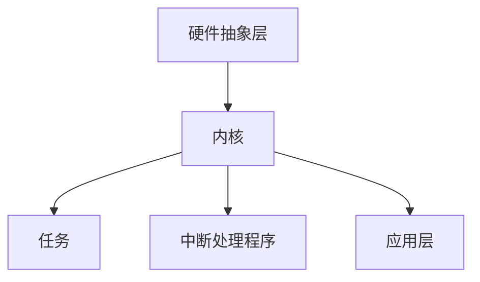

                 

# 《FreeRTOS实时操作系统应用》

> **关键词：** FreeRTOS、实时操作系统、任务管理、时间管理、内存管理、嵌入式系统、调试与优化

> **摘要：** 本文将深入探讨FreeRTOS实时操作系统的核心概念、架构设计、核心功能及其在嵌入式系统中的应用。通过详细的原理讲解、伪代码示例和实际项目实战，帮助读者全面掌握FreeRTOS的应用技巧，提高嵌入式系统开发效率。

## 《FreeRTOS实时操作系统应用》目录大纲

### 第一部分：FreeRTOS基础

#### 第1章：FreeRTOS概述
1.1 自主导航：FreeRTOS的历史与背景
1.2 实时操作系统的基本概念
1.3 FreeRTOS的核心特点
1.4 FreeRTOS的应用场景

#### 第2章：FreeRTOS架构
2.1 系统层次结构
2.2 任务调度
2.3 时间管理
2.4 内存管理
2.5 通信机制

### 第二部分：FreeRTOS核心功能

#### 第3章：任务管理
3.1 任务创建
3.2 任务状态
3.3 任务间通信
3.4 任务的优先级与调度策略

#### 第4章：时间管理和定时器
4.1 系统时钟
4.2 定时器机制
4.3 时间延迟
4.4 定时器与任务的关联

#### 第5章：内存管理
5.1 堆栈管理
5.2 动态内存分配
5.3 内存池
5.4 内存管理的优化

#### 第6章：中断管理
6.1 中断机制
6.2 中断处理程序
6.3 中断优先级
6.4 中断与任务的关系

### 第三部分：FreeRTOS高级应用

#### 第7章：任务同步机制
7.1 信号量
7.2 互斥锁
7.3 事件组
7.4 哨兵

#### 第8章：FreeRTOS在嵌入式系统中的应用
8.1 嵌入式系统简介
8.2 FreeRTOS在嵌入式系统中的配置
8.3 嵌入式系统中的FreeRTOS应用案例

#### 第9章：FreeRTOS的调试与优化
9.1 调试工具
9.2 代码优化
9.3 性能分析
9.4 调试技巧

### 第四部分：FreeRTOS项目实践

#### 第10章：项目规划与需求分析
10.1 项目规划
10.2 需求分析
10.3 项目管理

#### 第11章：系统设计与实现
11.1 系统设计
11.2 硬件环境搭建
11.3 软件实现

#### 第12章：测试与部署
12.1 测试策略
12.2 测试方法
12.3 部署与维护

### 附录

#### 附录A：FreeRTOS资源与工具
A.1 资源介绍
A.2 常用工具
A.3 社区与支持

#### 附录B：FreeRTOS API参考
B.1 核心API
B.2 扩展API
B.3 API使用示例

#### 附录C：FreeRTOS项目实例
C.1 项目概述
C.2 项目源码解读
C.3 代码分析

以上是《FreeRTOS实时操作系统应用》的目录大纲。接下来，我们将逐步深入探讨FreeRTOS的核心概念、架构设计、核心功能及其在嵌入式系统中的应用。

---

### 第1章：FreeRTOS概述

#### 1.1 自主导航：FreeRTOS的历史与背景

FreeRTOS是一种开源的实时操作系统，旨在为嵌入式系统提供高效的资源利用和任务调度。它由英国公司Real Time Engineers Ltd开发和维护，自从2003年首次发布以来，FreeRTOS迅速在嵌入式系统开发领域获得了广泛认可。

**历史背景：**

- **2003年**：FreeRTOS首次发布，作为一个轻量级的实时操作系统，适用于资源有限的嵌入式设备。
- **2006年**：FreeRTOS加入Arduino IDE，进一步推动了其在嵌入式开发中的普及。
- **2012年**：FreeRTOS被亚马逊收购，成为AWS物联网解决方案的一部分。
- **至今**：FreeRTOS持续更新，支持多种硬件平台和开发环境，并且拥有庞大的社区支持。

#### 1.2 实时操作系统的基本概念

实时操作系统（RTOS）是一种专门为满足实时任务需求的操作系统。与常规操作系统相比，RTOS具有以下特点：

- **实时性**：RTOS能够在规定的时间内完成任务，保证系统响应的实时性。
- **任务调度**：RTOS通过优先级调度机制，确保高优先级任务先执行。
- **资源管理**：RTOS有效地管理系统资源，如内存、中断和定时器等。

#### 1.3 FreeRTOS的核心特点

FreeRTOS的核心特点包括：

- **轻量级**：FreeRTOS体积小巧，适合资源有限的嵌入式设备。
- **高效性**：FreeRTOS具有优化的任务调度算法，确保任务高效执行。
- **可配置性**：FreeRTOS允许开发者根据项目需求配置系统参数。
- **跨平台**：FreeRTOS支持多种硬件平台和开发环境。

#### 1.4 FreeRTOS的应用场景

FreeRTOS广泛应用于各种嵌入式系统，包括但不限于：

- **消费电子**：智能家居、智能穿戴设备、物联网设备等。
- **工业控制**：PLC、自动化控制系统、机器人等。
- **医疗设备**：医疗监测设备、医疗机器人等。
- **汽车电子**：车载系统、自动驾驶系统等。

### 本章小结

在本章中，我们简要介绍了FreeRTOS的历史与背景、实时操作系统的基本概念、FreeRTOS的核心特点及其应用场景。接下来，我们将深入探讨FreeRTOS的架构设计，为后续章节的内容打下基础。

---

### 第2章：FreeRTOS架构

#### 2.1 系统层次结构

FreeRTOS的系统层次结构包括以下几个关键层次：

1. **硬件抽象层（HAL）**：HAL负责与硬件设备交互，提供统一的接口，使得开发者无需关心底层硬件细节。
2. **内核**：内核是FreeRTOS的核心，负责任务调度、内存管理、中断管理等核心功能。
3. **任务**：任务是最基本的执行单元，每个任务都拥有独立的栈空间和执行上下文。
4. **中断处理程序**：中断处理程序负责处理硬件中断，保证系统实时响应。
5. **应用层**：应用层负责实现具体的应用功能，通过调用内核提供的API与内核进行交互。

**Mermaid流程图：**



#### 2.2 任务调度

FreeRTOS采用优先级调度策略，根据任务的优先级和执行状态进行调度。任务调度过程包括以下步骤：

1. **初始化**：系统启动时，内核初始化任务调度器，创建第一个任务（通常是主任务）。
2. **任务就绪**：任务创建后，如果满足运行条件，将被放入就绪队列，等待调度执行。
3. **任务调度**：内核根据任务的优先级和调度策略，选择一个就绪任务进行执行。
4. **任务切换**：如果当前任务在规定的时间内未完成，或者有更高优先级的任务就绪，内核将进行任务切换，将CPU控制权交给新的任务。

**伪代码示例：**

```pseudo
function schedule() {
    while (true) {
        // 检查是否有更高优先级的任务就绪
        if (isHigherPriorityTaskReady()) {
            // 进行任务切换
            contextSwitch();
        } else {
            // 执行当前任务
            executeCurrentTask();
        }
    }
}
```

#### 2.3 时间管理

FreeRTOS提供了系统时钟和定时器机制，用于时间管理和定时任务。主要内容包括：

1. **系统时钟**：系统时钟是FreeRTOS的时间基础，用于计算时间戳和定时器。
2. **定时器**：定时器用于实现周期性任务和延迟任务。FreeRTOS提供了多种定时器模式，如周期性定时器、一次性定时器和延迟定时器。
3. **时间延迟**：时间延迟机制用于让任务在规定的时间内等待，保证任务的有序执行。

**伪代码示例：**

```pseudo
function delay(ms) {
    start = getCurrentTimestamp();
    end = start + ms;
    while (getCurrentTimestamp() < end) {
        // 等待
    }
}
```

#### 2.4 内存管理

FreeRTOS提供了内存管理机制，包括堆栈管理和动态内存分配。主要内容包括：

1. **堆栈管理**：每个任务都拥有独立的栈空间，用于存储任务执行时的局部变量和返回地址。
2. **动态内存分配**：FreeRTOS提供了基于内存池的动态内存分配机制，可以灵活地分配和释放内存。

**伪代码示例：**

```pseudo
function createTask() {
    stackSize = calculateStack_SIZE();
    stack = malloc(stackSize);
    if (stack != NULL) {
        // 初始化任务
        initializeTask(stack);
        // 创建任务
        createTaskInKernel();
    }
}
```

#### 2.5 通信机制

FreeRTOS提供了多种通信机制，用于任务间通信和数据交换。主要内容包括：

1. **队列**：队列是一种先进先出（FIFO）的数据结构，用于任务间的数据传递。
2. **信号量**：信号量是一种用于任务同步的机制，可以实现任务间的互斥访问和信号传递。
3. **事件组**：事件组用于任务间的事件通知和同步。

**伪代码示例：**

```pseudo
function sendData(taskId, data) {
    // 创建队列
    queue = createQueue();
    if (queue != NULL) {
        // 发送数据
        sendToQueue(queue, taskId, data);
    }
}

function receiveData() {
    // 接收数据
    data = receiveFromQueue(queue);
    if (data != NULL) {
        // 处理数据
        processData(data);
    }
}
```

### 本章小结

在本章中，我们详细介绍了FreeRTOS的系统层次结构、任务调度、时间管理、内存管理和通信机制。这些核心功能共同构成了FreeRTOS的强大架构，为嵌入式系统开发提供了坚实的基础。接下来，我们将深入探讨FreeRTOS的核心功能，进一步了解其实际应用。

---

### 第3章：任务管理

#### 3.1 任务创建

在FreeRTOS中，任务创建是一个关键步骤，它涉及到任务控制块（TCB）的初始化、栈的分配以及任务的启动。以下是一个简单的任务创建流程：

1. **计算栈大小**：根据任务的执行需求和堆栈大小计算器函数（`calculateStackSize`），确定任务所需的栈空间大小。
2. **动态分配栈空间**：使用内存分配函数（如`malloc`或`pvPortMalloc`）为任务分配栈空间。
3. **初始化任务控制块**：创建任务控制块（TCB），设置任务的优先级、栈指针、栈底地址等信息。
4. **加载任务入口函数**：将任务入口函数的地址加载到栈顶，为任务执行做好准备。
5. **启动任务**：调用`xTaskCreate`函数，将任务控制块添加到就绪队列，并启动任务。

**伪代码示例：**

```pseudo
stackSize = calculateStackSize(function taskFunction, parameter);
stack = malloc(stackSize);
if (stack != NULL) {
    tcb = createTaskControlBlock();
    tcb->priority = priority;
    tcb->stackPointer = stack + stackSize;
    tcb->stackBottom = stack;
    loadFunctionToStack(taskFunction, stack);
    xTaskCreate(tcb, "TaskName", stackSize, NULL, priority, NULL);
}
```

#### 3.2 任务状态

FreeRTOS中的任务状态包括以下几种：

- **运行状态**：任务正在CPU上执行。
- **就绪状态**：任务已经创建并准备好执行，但由于调度策略的原因尚未被选中执行。
- **阻塞状态**：任务因为某些条件（如等待资源或信号）而无法继续执行，被挂起。
- **挂起状态**：任务被手动挂起，无法执行。

任务状态可以通过`vTaskSuspend`、`vTaskResume`、`vTaskDelete`等函数进行管理。

**伪代码示例：**

```pseudo
function suspendTask(taskId) {
    vTaskSuspend(taskId);
}

function resumeTask(taskId) {
    vTaskResume(taskId);
}

function deleteTask(taskId) {
    vTaskDelete(taskId);
}
```

#### 3.3 任务间通信

任务间通信是实时系统中不可或缺的一部分，FreeRTOS提供了多种机制来实现任务间的数据交换和同步。以下是几种常用的任务间通信机制：

1. **队列**：队列是一种先进先出（FIFO）的数据结构，用于任务间的数据传递。任务可以使用`xQueueSend`和`xQueueReceive`函数实现数据的发送和接收。

**伪代码示例：**

```pseudo
function sendDataToQueue(queue, data) {
    xQueueSend(queue, data, portMAX_DELAY);
}

function receiveDataFromQueue(queue) {
    data = xQueueReceive(queue, portMAX_DELAY);
    return data;
}
```

2. **信号量**：信号量用于任务间的同步和互斥访问。任务可以使用`xSemaphoreGive`和`xSemaphoreTake`函数实现信号量的发送和接收。

**伪代码示例：**

```pseudo
function signalSemaphore(semaphore) {
    xSemaphoreGive(semaphore);
}

function waitSemaphore(semaphore) {
    xSemaphoreTake(semaphore, portMAX_DELAY);
}
```

3. **事件组**：事件组用于任务间的事件通知和同步。任务可以使用`xEventGroupSetBits`和`xEventGroupWaitBits`函数实现事件组的设置和等待。

**伪代码示例：**

```pseudo
function signalEvent(eventGroup, bits) {
    xEventGroupSetBits(eventGroup, bits);
}

function waitEvent(eventGroup, bits, waitTime) {
    status = xEventGroupWaitBits(eventGroup, bits, pdFALSE, pdTRUE, waitTime);
    return status;
}
```

#### 3.4 任务的优先级与调度策略

FreeRTOS采用优先级调度策略，根据任务的优先级和调度策略进行任务调度。以下是一个简单的优先级调度策略：

- **时间片调度**：系统为每个任务分配一个时间片，每个任务在规定的时间内执行。时间片用完后，系统将进行任务切换。
- **抢占式调度**：高优先级任务可以打断低优先级任务的执行，抢占CPU控制权。
- **优先级继承**：当一个任务等待某个资源时，它会临时提升到等待资源的最高优先级，避免资源竞争。

**伪代码示例：**

```pseudo
function schedule() {
    while (true) {
        // 检查是否有更高优先级的任务就绪
        if (isHigherPriorityTaskReady()) {
            // 进行任务切换
            contextSwitch();
        } else {
            // 执行当前任务
            executeCurrentTask();
        }
    }
}
```

### 本章小结

在本章中，我们详细介绍了FreeRTOS的任务创建、任务状态、任务间通信以及任务的优先级与调度策略。这些内容是理解和应用FreeRTOS的关键，为嵌入式系统的任务管理提供了有力支持。接下来，我们将进一步探讨时间管理和定时器机制，为任务调度提供时间基础。

---

### 第4章：时间管理和定时器

#### 4.1 系统时钟

系统时钟是FreeRTOS的时间基础，用于计算时间戳和定时器。FreeRTOS提供了多种系统时钟源，包括硬件时钟、软件时钟和tick时钟。

- **硬件时钟**：硬件时钟通常由硬件时钟源（如晶振、振荡器等）提供，具有较高的精度和稳定性。FreeRTOS可以使用硬件时钟作为系统时钟源，但需要硬件支持。
- **软件时钟**：软件时钟是通过软件计数实现的时钟，通常用于调试和测试。软件时钟的精度较低，但可以在没有硬件时钟源的情况下使用。
- **tick时钟**：tick时钟是FreeRTOS的核心时钟源，用于任务调度和定时器管理。tick时钟的周期通常是1ms，每个tick时钟都会触发一次系统节拍（system tick）。

**伪代码示例：**

```pseudo
function tickClock() {
    // 处理tick时钟事件
    handleTickClock();
    // 延时1ms
    delay(1);
}
```

#### 4.2 定时器机制

FreeRTOS提供了多种定时器机制，包括一次性定时器、周期性定时器和延迟定时器。这些定时器机制可以用于实现周期性任务和延迟任务。

- **一次性定时器**：一次性定时器在设定的时间到期后自动删除。任务可以使用`vTaskDelayUntil`函数实现一次性定时器。

**伪代码示例：**

```pseudo
function oneTimeDelayUntil(expirationTime) {
    xTaskDelayUntil(&expirationTime, delayTime);
}
```

- **周期性定时器**：周期性定时器在设定的时间间隔内反复触发。任务可以使用`vTaskPeriodicCall`函数实现周期性定时器。

**伪代码示例：**

```pseudo
function periodicCall(interval, function) {
    vTaskPeriodicCall(interval, function);
}
```

- **延迟定时器**：延迟定时器在设定的时间后触发一次事件。任务可以使用`vTaskDelay`函数实现延迟定时器。

**伪代码示例：**

```pseudo
function delay(delayTime) {
    vTaskDelay(delayTime);
}
```

#### 4.3 时间延迟

时间延迟是任务调度和时间管理中的重要概念，用于让任务在规定的时间内等待，保证任务的有序执行。FreeRTOS提供了多种时间延迟机制，包括基于tick时钟的延迟和基于系统时钟的延迟。

- **基于tick时钟的延迟**：基于tick时钟的延迟使用tick时钟作为计时单位，通过计算tick时钟的数量来实现延迟。

**伪代码示例：**

```pseudo
function delayTicks(ticks) {
    // 等待指定的tick时钟数
    for (i = 0; i < ticks; i++) {
        tickClock();
    }
}
```

- **基于系统时钟的延迟**：基于系统时钟的延迟使用系统时钟（如硬件时钟或软件时钟）作为计时单位，通过计算系统时钟的时间来实现延迟。

**伪代码示例：**

```pseudo
function delaySystemClock(seconds) {
    // 等待指定的系统时钟时间
    start = getCurrentSystemClock();
    while (getCurrentSystemClock() - start < seconds) {
        // 等待
    }
}
```

#### 4.4 定时器与任务的关联

定时器与任务之间的关联是实现实时任务调度的关键。FreeRTOS提供了多种方式将定时器与任务关联，包括基于tick时钟的延迟任务和基于系统时钟的定时任务。

- **基于tick时钟的延迟任务**：通过`vTaskDelay`函数实现，任务在延迟时间结束后重新加入就绪队列，等待调度执行。

**伪代码示例：**

```pseudo
function delayTask(delayTime) {
    vTaskDelay(delayTime);
    // 延迟结束后重新加入就绪队列
    resumeTask(currentTaskId);
}
```

- **基于系统时钟的定时任务**：通过`vTaskPeriodicCall`函数实现，任务在设定的时间间隔内反复触发，实现周期性任务。

**伪代码示例：**

```pseudo
function periodicTask(interval) {
    while (true) {
        // 执行任务
        executeTask();
        // 延迟一段时间
        vTaskDelay(interval);
    }
}
```

### 本章小结

在本章中，我们详细介绍了FreeRTOS的系统时钟、定时器机制、时间延迟以及定时器与任务的关联。这些内容是理解和应用FreeRTOS时间管理的关键，为实时任务调度提供了时间基础。接下来，我们将进一步探讨内存管理，为嵌入式系统提供资源优化支持。

---

### 第5章：内存管理

内存管理是嵌入式系统开发中的一个重要方面，FreeRTOS提供了多种内存管理机制，包括堆栈管理、动态内存分配、内存池和内存管理的优化。

#### 5.1 堆栈管理

在FreeRTOS中，每个任务都有一个独立的堆栈，用于存储任务执行时的局部变量、返回地址和中间结果。堆栈管理主要包括堆栈的分配、初始化和释放。

1. **堆栈分配**：在任务创建时，系统会根据任务的栈大小要求动态分配堆栈空间。通常，任务的栈大小可以通过`calculateStackSize`函数计算得出。

**伪代码示例：**

```pseudo
stackSize = calculateStackSize(function taskFunction, parameter);
stack = malloc(stackSize);
```

2. **堆栈初始化**：在任务启动前，系统会初始化堆栈，将栈顶指针设置为堆栈的顶部，栈底指针设置为堆栈的底部。

**伪代码示例：**

```pseudo
tcb->stackPointer = stack + stackSize;
tcb->stackBottom = stack;
```

3. **堆栈释放**：在任务删除时，系统会释放任务占用的堆栈空间。

**伪代码示例：**

```pseudo
free(stack);
```

#### 5.2 动态内存分配

动态内存分配是FreeRTOS内存管理的一个重要组成部分，用于在运行时动态分配和释放内存。FreeRTOS使用内存池（heap）来实现动态内存分配。

1. **内存池创建**：在系统初始化时，可以通过`vApplicationMallocInitialize`函数配置内存池的大小。

**伪代码示例：**

```pseudo
uint8_t ucHeap[configTOTAL_HEAP_SIZE];
vApplicationMallocInitialize(&ucHeap[0], configTOTAL_HEAP_SIZE);
```

2. **内存分配**：任务可以通过`pvPortMalloc`函数动态分配内存。

**伪代码示例：**

```pseudo
void *pMemory = pvPortMalloc(size);
```

3. **内存释放**：任务可以通过`vPortFree`函数释放动态分配的内存。

**伪代码示例：**

```pseudo
vPortFree(pMemory);
```

#### 5.3 内存池

内存池是FreeRTOS动态内存分配的核心组件，它是一个固定大小的内存区域，用于存储分配和释放的内存块。内存池的管理是通过一个称为“内存块”的数据结构来实现的。

1. **内存块结构**：每个内存块包含以下信息：
   - 内存块大小
   - 内存块状态（空闲或已分配）
   - 指向下一个内存块的指针

2. **内存池管理**：内存池的管理涉及到内存块的分配和释放。在内存池中，空闲的内存块被组织成一个空闲列表，分配内存时，系统会从空闲列表中取出合适的内存块进行分配。

**伪代码示例：**

```pseudo
typedef struct {
    uint32_t size;
    uint8_t inUse;
    struct MemoryBlock *next;
} MemoryBlock;

MemoryBlock *freeList = NULL;

function allocateMemory(size) {
    // 遍历空闲列表，寻找合适的内存块
    // 分配内存块，更新空闲列表
    // 返回内存块指针
}

function freeMemory(block) {
    // 将内存块加入空闲列表
    // 更新空闲列表
}
```

#### 5.4 内存管理的优化

为了提高内存管理的效率和性能，FreeRTOS提供了一些优化策略：

1. **内存碎片优化**：内存碎片是由于多次内存分配和释放导致的内存不连续，影响内存的使用效率。FreeRTOS通过合并相邻的空闲内存块来减少内存碎片。

2. **内存池大小配置**：通过合理配置内存池的大小，可以减少内存碎片和分配时间。在系统初始化时，可以通过`configTOTAL_HEAP_SIZE`和`configMINIMAL_HEAP_SIZE`配置内存池的大小。

3. **内存块对齐**：FreeRTOS使用对齐策略来优化内存分配，通过将内存块地址对齐到特定边界（如4字节、8字节等），提高内存访问速度。

**伪代码示例：**

```pseudo
#define ALIGNED_SIZE(size, alignment) (((size) + (alignment - 1)) & ~(alignment - 1))

void *pAlignedMemory = malloc(AlignedSize(size, alignment));
```

### 本章小结

在本章中，我们详细介绍了FreeRTOS的内存管理机制，包括堆栈管理、动态内存分配、内存池和内存管理的优化。这些内容是嵌入式系统开发中不可或缺的部分，为系统资源的有效利用提供了技术支持。接下来，我们将探讨中断管理，进一步了解FreeRTOS的实时性和响应能力。

---

### 第6章：中断管理

#### 6.1 中断机制

中断是实时操作系统中实现异步事件处理的关键机制。FreeRTOS通过中断机制来实现任务的实时响应和调度。中断机制主要包括以下三个方面：

1. **中断源**：中断源是指能够触发中断的事件，如硬件设备的中断请求（IRQ）、软件中断、异常等。
2. **中断处理程序**：中断处理程序是用于处理中断事件的函数，它在中断发生时被调用。FreeRTOS允许用户自定义中断处理程序，实现对特定中断源的响应。
3. **中断优先级**：中断优先级是用于标识中断处理程序的优先级，决定了哪个中断处理程序将在特定中断事件发生时被首先执行。

#### 6.2 中断处理程序

中断处理程序是中断机制的核心，它负责处理中断事件并执行相应的操作。FreeRTOS提供了标准的中断处理程序框架，用户可以根据需要自定义中断处理程序。

1. **中断处理程序框架**：FreeRTOS的中断处理程序框架包括以下步骤：
   - 保存当前CPU状态
   - 处理中断事件
   - 恢复CPU状态
   - 返回中断

**伪代码示例：**

```pseudo
function interruptHandler() {
    // 保存CPU状态
    saveCPUState();

    // 处理中断事件
    handleInterruptEvent();

    // 恢复CPU状态
    restoreCPUState();

    // 返回中断
    returnFromInterrupt();
}
```

2. **中断处理程序实现**：在用户编写的中断处理程序中，通常包括以下操作：
   - 处理硬件中断请求
   - 调用FreeRTOS API更新任务状态
   - 执行必要的同步操作

**伪代码示例：**

```pseudo
function interruptHandler() {
    // 保存CPU状态
    saveCPUState();

    // 处理硬件中断请求
    handleHardwareInterrupt();

    // 调用FreeRTOS API更新任务状态
    updateTaskState();

    // 执行必要的同步操作
    synchronizeTasks();

    // 恢复CPU状态
    restoreCPUState();

    // 返回中断
    returnFromInterrupt();
}
```

#### 6.3 中断优先级

中断优先级是决定中断处理程序执行顺序的关键因素。FreeRTOS使用一个优先级队列来管理中断处理程序，优先级高的中断处理程序将在优先级低的中断处理程序之前执行。

1. **中断优先级设置**：在系统初始化时，可以通过`configMAX_INTERRUPT_PRIORITY`配置中断优先级。通常，中断优先级设置为0到31，优先级越高，数值越小。

2. **中断优先级管理**：FreeRTOS提供了`vSetInterruptPriority`函数用于设置中断优先级，通过这个函数可以动态调整中断优先级。

**伪代码示例：**

```pseudo
function setInterruptPriority(interruptNumber, priority) {
    vSetInterruptPriority(interruptNumber, priority);
}
```

3. **中断优先级与任务调度**：中断优先级直接影响任务调度。当高优先级中断发生时，如果当前任务无法立即处理中断事件，FreeRTOS会进行任务切换，将CPU控制权交给更高优先级的中断处理程序。

#### 6.4 中断与任务的关系

中断与任务是实时操作系统中的两个核心概念，它们之间存在密切的关系。FreeRTOS通过以下方式实现中断与任务的关系：

1. **中断触发任务**：中断可以触发任务执行。例如，硬件中断可以导致一个任务开始执行或改变任务状态。
2. **任务响应中断**：任务可以通过调用FreeRTOS API来响应中断事件，执行相应的中断处理程序。
3. **中断与任务同步**：FreeRTOS提供了信号量、互斥锁和事件组等同步机制，用于实现中断与任务的同步。

**伪代码示例：**

```pseudo
// 中断触发任务
function interruptHandler() {
    // 更新任务状态
    updateTaskState();

    // 通知任务
    signalTask();
}

// 任务响应中断
function taskFunction() {
    while (true) {
        // 处理任务
        processTask();

        // 等待中断信号
        waitInterruptSignal();
    }
}
```

### 本章小结

在本章中，我们详细介绍了FreeRTOS的中断机制，包括中断源、中断处理程序、中断优先级以及中断与任务的关系。这些内容是理解和应用FreeRTOS实时性的关键，为嵌入式系统的实时响应提供了技术支持。接下来，我们将进一步探讨FreeRTOS的高级应用。

---

### 第7章：任务同步机制

#### 7.1 信号量

信号量是一种用于任务同步的机制，它允许多个任务共享资源并协调执行。FreeRTOS提供了信号量实现任务间的同步，包括二值信号量和计数信号量。

1. **二值信号量**：二值信号量用于表示资源的可访问性，它只有两种状态：占用和未占用。任务可以通过`xSemaphoreGive`和`xSemaphoreTake`函数实现二值信号量的操作。

**伪代码示例：**

```pseudo
// 初始化信号量
binarySemaphore = xSemaphoreCreateBinary();

// 发送信号
xSemaphoreGive(binarySemaphore);

// 等待信号
xSemaphoreTake(binarySemaphore, waitTime);
```

2. **计数信号量**：计数信号量用于表示资源的可用数量，任务可以通过`xSemaphoreGiveCount`和`xSemaphoreTakeCount`函数实现计数信号量的操作。

**伪代码示例：**

```pseudo
// 初始化信号量
countSemaphore = xSemaphoreCreateCount(initialValue);

// 增加信号量
xSemaphoreGiveCount(countSemaphore, increment);

// 减少信号量
xSemaphoreTakeCount(countSemaphore, decrement);
```

#### 7.2 互斥锁

互斥锁（Mutex）是一种用于实现任务间互斥访问共享资源的机制。FreeRTOS提供了互斥锁实现任务间的同步，任务可以通过`vSemaphoreTake`和`vSemaphoreGive`函数实现互斥锁的操作。

1. **互斥锁的初始化**：在任务创建时，可以通过`xSemaphoreCreateMutex`函数初始化互斥锁。

**伪代码示例：**

```pseudo
mutexLock = xSemaphoreCreateMutex();

// 锁定互斥锁
vSemaphoreTake(mutexLock);

// 释放互斥锁
vSemaphoreGive(mutexLock);
```

2. **优先级继承**：在FreeRTOS中，互斥锁支持优先级继承机制。当一个任务等待互斥锁时，它将临时提升到最高优先级，避免资源竞争。

#### 7.3 事件组

事件组是一种用于任务间事件通知和同步的机制，它允许多个任务同时监听一个或多个事件。FreeRTOS提供了事件组实现任务间的事件同步，任务可以通过`xEventGroupCreate`、`xEventGroupSetBits`和`xEventGroupWaitBits`函数实现事件组的操作。

1. **事件组的创建**：通过`xEventGroupCreate`函数创建事件组。

**伪代码示例：**

```pseudo
eventGroup = xEventGroupCreate();
```

2. **设置事件**：通过`xEventGroupSetBits`函数设置事件。

**伪代码示例：**

```pseudo
xEventGroupSetBits(eventGroup, eventBits);
```

3. **等待事件**：通过`xEventGroupWaitBits`函数等待特定事件。

**伪代码示例：**

```pseudo
status = xEventGroupWaitBits(eventGroup, eventBits, clearBits, waitForAll, waitTime);
```

#### 7.4 哨兵

哨兵（Semaphore）是一种特殊的任务同步机制，用于实现任务间的阻塞和解锁。FreeRTOS中的哨兵可以用于实现任务间的通信和同步。

1. **哨兵的创建**：通过`xSemaphoreCreateCounting`函数创建哨兵。

**伪代码示例：**

```pseudo
semaphore = xSemaphoreCreateCounting(maxCount, initialCount);
```

2. **发送哨兵**：通过`xSemaphoreGive`函数发送哨兵。

**伪代码示例：**

```pseudo
xSemaphoreGive(semaphore);
```

3. **等待哨兵**：通过`xSemaphoreTake`函数等待哨兵。

**伪代码示例：**

```pseudo
xSemaphoreTake(semaphore, waitTime);
```

### 本章小结

在本章中，我们详细介绍了FreeRTOS的任务同步机制，包括信号量、互斥锁、事件组和哨兵。这些机制为任务间的同步和通信提供了强大的支持，使得嵌入式系统的开发更加高效和可靠。接下来，我们将探讨FreeRTOS在嵌入式系统中的应用。

---

### 第8章：FreeRTOS在嵌入式系统中的应用

#### 8.1 嵌入式系统简介

嵌入式系统是一种具有特定功能的计算机系统，通常嵌入在更大的设备或产品中。嵌入式系统具有以下特点：

- **资源有限**：嵌入式系统通常具有有限的处理器性能、内存和存储资源。
- **实时性要求**：嵌入式系统通常需要实时响应外部事件，保证任务的及时执行。
- **定制化**：嵌入式系统根据具体应用需求进行定制开发，以满足特定的功能需求。

常见的嵌入式系统应用包括消费电子、工业控制、医疗设备、汽车电子和物联网设备等。

#### 8.2 FreeRTOS在嵌入式系统中的配置

在嵌入式系统中使用FreeRTOS，需要对FreeRTOS进行适当的配置。以下是一个基本的配置步骤：

1. **选择硬件平台**：根据嵌入式系统的硬件平台，选择相应的FreeRTOS硬件抽象层（HAL）。
2. **配置系统参数**：根据嵌入式系统的需求，配置FreeRTOS的系统参数，如堆栈大小、中断优先级和内存池大小。
3. **编译与调试**：使用FreeRTOS的IDE插件或命令行工具进行编译和调试，确保系统在目标硬件上正常运行。

**示例配置代码：**

```c
// 选择硬件平台
#include "FreeRTOS.h"
#include "task.h"
#include "queue.h"

// 配置系统参数
#define configMINIMAL_STACK_SIZE         128
#define configTICK_RATE_HZ               (1000 / portTICK_RATE_MS)
#define configMAX_PRIORITIES             (5)
#define configMAX_TASK_NAME_LEN          (20)
#define configUSE_PREEMPTION             1
#define configUSE_PORT_OPTIMISED_TASK_SLOTS 0

// 编译与调试
// 使用IDE插件或命令行工具进行编译和调试
```

#### 8.3 嵌入式系统中的FreeRTOS应用案例

以下是一个简单的嵌入式系统应用案例，演示了FreeRTOS在实时任务调度和资源管理中的应用。

**案例描述：** 嵌入式系统负责监控温度传感器，并将温度数据上传到服务器。系统要求实时响应传感器数据变化，并在数据异常时发出报警。

**实现步骤：**

1. **创建任务**：创建两个任务，一个用于监控传感器数据，另一个用于上传温度数据。
2. **配置定时器**：使用定时器实现周期性数据上传功能。
3. **任务同步**：使用信号量实现任务间的同步和通信。

**伪代码示例：**

```pseudo
// 创建任务
createTask("SensorTask", sensorTaskFunction, stackSize, priority);
createTask("UploadTask", uploadTaskFunction, stackSize, priority);

// 配置定时器
periodicTimer(1000, uploadData);

// 任务函数实现
function sensorTaskFunction() {
    while (true) {
        readTemperature();
        if (temperatureOutOfRange()) {
            signalAlarm();
        }
        delay(100);
    }
}

function uploadTaskFunction() {
    while (true) {
        uploadTemperatureData();
        delay(1000);
    }
}

// 定时器回调函数
function uploadData() {
    uploadTemperatureData();
}

// 信号量操作
binarySemaphore = xSemaphoreCreateBinary();
xSemaphoreGive(binarySemaphore);
```

### 本章小结

在本章中，我们介绍了FreeRTOS在嵌入式系统中的应用，包括嵌入式系统的简介、配置和实际应用案例。通过这些内容，读者可以了解如何将FreeRTOS应用于嵌入式系统开发，实现实时任务调度和资源管理。接下来，我们将探讨FreeRTOS的调试与优化。

---

### 第9章：FreeRTOS的调试与优化

#### 9.1 调试工具

调试是嵌入式系统开发过程中至关重要的一环，FreeRTOS提供了一系列调试工具，帮助开发者快速定位和解决问题。

1. **串口调试**：串口调试是最常见的调试方式，通过串口输出调试信息，开发者可以实时了解系统运行状态和问题。
2. **IDE调试插件**：许多IDE（如Keil、IAR等）都集成了FreeRTOS的调试插件，提供断点设置、单步执行、变量监视等功能，方便开发者调试代码。
3. **逻辑分析仪**：逻辑分析仪可以用于分析硬件信号，帮助开发者检查硬件故障和异常。

**示例配置代码：**

```c
// 配置串口调试
SerialDebugEnable();
SerialDebugPrint("System startup\n");

// 配置IDE调试插件
// 根据所使用的IDE，配置相应的调试设置
```

#### 9.2 代码优化

代码优化是提高系统性能和稳定性的重要手段。FreeRTOS提供了多种优化策略，包括：

1. **任务优化**：通过合理分配任务优先级和任务堆栈大小，提高任务执行效率。
2. **内存优化**：通过减少内存分配和释放次数、优化内存池配置，降低内存碎片和分配时间。
3. **中断优化**：通过优化中断处理程序，减少中断响应时间和中断次数，提高系统实时性。

**伪代码示例：**

```pseudo
// 优化任务
function optimizeTask() {
    setTaskPriority(taskId, higherPriority);
    reduceTaskStack(taskId, smallerStackSize);
}

// 优化内存
function optimizeMemory() {
    configureMemoryPools();
    reduceMemoryAllocation();
}

// 优化中断
function optimizeInterrupt() {
    reduceInterruptHandlerSize();
    optimizeInterruptPriority();
}
```

#### 9.3 性能分析

性能分析是评估系统性能和优化系统设计的重要手段。FreeRTOS提供了多种性能分析工具，包括：

1. **计数器**：通过计数器统计任务执行时间、中断次数和内存分配次数等，帮助开发者了解系统性能。
2. **事件日志**：通过事件日志记录系统运行过程中的关键事件，帮助开发者分析系统性能瓶颈。
3. **负载测试**：通过模拟不同的负载场景，评估系统在不同负载下的性能和稳定性。

**伪代码示例：**

```pseudo
// 计数器示例
taskExecutionTime = getTaskExecutionTime(taskId);
interruptCount = getInterruptCount();

// 事件日志示例
logEvent("System startup", timestamp);

// 负载测试示例
simulateLoadScenario("High Load");
evaluateSystemPerformance();
```

#### 9.4 调试技巧

有效的调试技巧可以提高调试效率，快速定位和解决问题。以下是一些常用的调试技巧：

1. **逐步调试**：通过单步执行代码，逐步调试，观察变量值和程序执行流程。
2. **断点调试**：设置断点，在特定代码行或条件满足时暂停执行，检查变量值和程序状态。
3. **条件断点**：设置条件断点，在特定条件满足时暂停执行，如变量值等于某个值或循环次数达到某个值。
4. **日志分析**：通过日志分析工具，分析系统运行过程中的日志信息，查找异常和问题。

**示例配置代码：**

```c
// 设置断点
setBreakpoint("main.c", lineNum);

// 设置条件断点
setConditionalBreakpoint("main.c", lineNum, condition);

// 启用日志分析
enableLogAnalysis();
```

### 本章小结

在本章中，我们介绍了FreeRTOS的调试与优化，包括调试工具、代码优化、性能分析和调试技巧。这些内容是嵌入式系统开发中不可或缺的一部分，帮助开发者提高系统性能和稳定性。接下来，我们将通过一个项目实战案例，进一步了解FreeRTOS的实际应用。

---

### 第10章：项目规划与需求分析

#### 10.1 项目规划

项目规划是确保项目成功的关键步骤，它包括以下内容：

1. **确定项目目标**：明确项目要实现的功能和目标，如温度监控系统、智能家居控制系统等。
2. **分解任务**：将项目目标分解为具体的任务，如硬件设计、软件设计、系统集成等。
3. **制定计划**：为每个任务制定详细的计划，包括任务开始时间、结束时间和责任人。
4. **资源配置**：确定项目所需的资源，如硬件设备、软件工具和人力资源。

**项目规划示例：**

```plaintext
项目名称：温度监控系统

目标：
- 实时采集温度数据
- 将数据上传到云端服务器
- 发送报警信息

任务分解：
1. 硬件设计
2. 软件设计
3. 系统集成
4. 测试与部署

计划：
1. 硬件设计：2023年4月1日 - 2023年4月15日
2. 软件设计：2023年4月16日 - 2023年5月1日
3. 系统集成：2023年5月2日 - 2023年5月15日
4. 测试与部署：2023年5月16日 - 2023年5月31日

资源配置：
- 硬件工程师：2人
- 软件工程师：3人
- 测试工程师：1人
- 项目经理：1人
```

#### 10.2 需求分析

需求分析是项目规划的重要环节，它包括以下内容：

1. **收集需求**：通过与客户、产品经理和项目团队成员交流，了解项目的功能需求、性能要求和约束条件。
2. **分析需求**：对收集到的需求进行整理和分析，确定项目的核心功能和性能指标。
3. **编写需求文档**：将需求整理成文档，明确项目的功能、性能要求和约束条件，为后续设计和开发提供依据。

**需求分析示例：**

```plaintext
需求文档：温度监控系统

1. 功能需求
- 实时采集温度数据
- 将数据上传到云端服务器
- 发送报警信息
- 支持数据查询和历史记录

2. 性能要求
- 数据采集间隔：1分钟
- 上传数据时间：不超过10秒
- 报警响应时间：不超过1秒

3. 约束条件
- 系统应支持多种温度传感器
- 系统应具备良好的可扩展性
- 系统应具备低功耗、高稳定性
```

#### 10.3 项目管理

项目管理是确保项目按计划完成的重要手段，它包括以下内容：

1. **任务分配**：根据项目规划和需求分析，为每个任务分配责任人和资源。
2. **进度监控**：定期检查任务进度，确保项目按计划进行。
3. **问题跟踪**：记录项目中的问题和风险，采取相应措施进行解决。
4. **项目评估**：项目结束后，对项目进行评估，总结经验教训，为后续项目提供参考。

**项目管理示例：**

```plaintext
1. 任务分配
- 硬件设计：张三、李四
- 软件设计：王五、赵六
- 系统集成：钱七、孙八
- 测试与部署：周九

2. 进度监控
- 每周召开项目例会，检查任务进度
- 使用项目管理工具（如Jira、Trello等）记录任务进度

3. 问题跟踪
- 记录项目中出现的问题和风险，采取相应措施进行解决
- 定期更新问题跟踪表，确保问题得到及时解决

4. 项目评估
- 项目结束后，对项目进行总结和评估
- 分析项目中的成功经验和不足之处
- 形成项目报告，为后续项目提供参考
```

### 本章小结

在本章中，我们介绍了项目规划与需求分析，包括项目规划、需求分析和项目管理。这些内容是确保项目成功的关键，为后续的系统设计与实现奠定了基础。接下来，我们将详细讨论系统设计与实现。

---

### 第11章：系统设计与实现

#### 11.1 系统设计

系统设计是嵌入式系统开发的关键步骤，它包括硬件设计和软件设计。以下是系统设计的主要组成部分：

1. **硬件设计**：硬件设计包括选择合适的硬件平台、传感器和通信模块。硬件设计需要考虑以下因素：
   - 处理器性能和功耗
   - 温度传感器的精度和响应时间
   - 通信模块的带宽和稳定性

   **硬件设计示例：**
   - **处理器**：使用STM32L4x系列低功耗微控制器。
   - **温度传感器**：使用DS18B20温度传感器。
   - **通信模块**：使用Wi-Fi模块ESP8266。

2. **软件设计**：软件设计包括任务划分、通信协议和数据存储。软件设计需要考虑以下因素：
   - 任务优先级和调度策略
   - 数据采集和上传的频率
   - 数据加密和传输安全

   **软件设计示例：**
   - **任务划分**：创建三个任务，分别是数据采集任务、数据上传任务和报警任务。
   - **通信协议**：使用HTTP协议上传数据，使用MQTT协议接收报警信息。
   - **数据存储**：使用SQLite数据库存储历史数据。

#### 11.2 硬件环境搭建

硬件环境搭建是嵌入式系统开发的第一步，以下是一个硬件环境搭建的示例步骤：

1. **硬件选型**：根据系统设计，选择合适的硬件组件，如微控制器、传感器和通信模块。

2. **电路设计**：设计电路原理图，包括电源、传感器接口、通信模块接口等。

3. **PCB布局**：使用PCB设计软件绘制电路板布局，确保电路布局合理、信号完整性好。

4. **PCB制造与焊接**：将电路板设计文件发送到PCB制造商进行制造，并进行焊接。

5. **硬件调试**：组装硬件，使用示波器、逻辑分析仪等工具进行调试，确保硬件功能正常。

**硬件环境搭建示例步骤：**

```plaintext
1. 硬件选型
   - 处理器：STM32L431KC
   - 温度传感器：DS18B20
   - 通信模块：ESP8266

2. 电路设计
   - 设计电路原理图，包括电源电路、传感器接口电路、通信模块接口电路等。

3. PCB布局
   - 使用Altium Designer绘制电路板布局，确保布局合理。

4. PCB制造与焊接
   - 将设计文件发送到PCB制造商进行制造，并进行焊接。

5. 硬件调试
   - 组装硬件，使用示波器检查电源电路，使用逻辑分析仪检查传感器和通信模块接口电路。
```

#### 11.3 软件实现

软件实现是嵌入式系统开发的核心，以下是一个软件实现的示例步骤：

1. **开发环境搭建**：安装并配置FreeRTOS开发环境，包括Keil、IAR等集成开发环境。

2. **源代码编写**：根据系统设计，编写源代码，包括任务函数、中断处理程序、通信协议等。

3. **调试与优化**：使用调试工具（如示波器、逻辑分析仪）进行调试，优化代码性能和稳定性。

4. **测试与验证**：编写测试用例，对系统进行功能测试和性能测试，确保系统稳定可靠。

**软件实现示例步骤：**

```plaintext
1. 开发环境搭建
   - 安装Keil，配置FreeRTOS库。
   - 安装IAR，配置FreeRTOS库。

2. 源代码编写
   - 编写数据采集任务，使用ADC读取温度传感器数据。
   - 编写数据上传任务，使用Wi-Fi模块上传数据到服务器。
   - 编写报警任务，使用MQTT协议接收报警信息。

3. 调试与优化
   - 使用示波器检查ADC信号，确保读取温度数据准确。
   - 使用逻辑分析仪检查Wi-Fi模块通信，确保数据上传正常。

4. 测试与验证
   - 编写测试用例，模拟不同温度传感器数据，测试数据采集和上传功能。
   - 测试报警功能，确保在温度异常时能及时发送报警信息。
```

### 本章小结

在本章中，我们详细介绍了嵌入式系统的设计与实现，包括系统设计、硬件环境搭建和软件实现。这些步骤是嵌入式系统开发的基础，确保系统能够稳定、可靠地运行。接下来，我们将讨论测试与部署。

---

### 第12章：测试与部署

#### 12.1 测试策略

测试策略是确保嵌入式系统质量的关键，它包括以下内容：

1. **功能测试**：验证系统是否实现预期功能，如数据采集、数据上传和报警功能。
2. **性能测试**：评估系统在不同负载下的性能，如数据采集频率、上传速度和响应时间。
3. **稳定性测试**：确保系统在长时间运行过程中不发生故障或异常。
4. **兼容性测试**：验证系统在不同硬件平台、操作系统和网络环境下的兼容性。

**测试策略示例：**

```plaintext
测试策略：温度监控系统

1. 功能测试
   - 测试数据采集功能，确保温度传感器数据正确读取。
   - 测试数据上传功能，确保数据能成功上传到服务器。
   - 测试报警功能，确保在温度异常时能及时发送报警信息。

2. 性能测试
   - 测试数据采集频率，确保系统能在规定时间内采集到温度数据。
   - 测试上传速度，确保系统能在规定时间内上传数据。
   - 测试响应时间，确保报警系统能在规定时间内响应。

3. 稳定性测试
   - 在长时间运行过程中，定期检查系统状态，确保系统稳定运行。
   - 在高温、低温等极端环境下，测试系统稳定性，确保系统能适应不同环境。

4. 兼容性测试
   - 在不同硬件平台上，测试系统兼容性，确保系统能在不同硬件上正常运行。
   - 在不同操作系统和网络环境下，测试系统兼容性，确保系统能在不同环境下正常运行。
```

#### 12.2 测试方法

测试方法是执行测试策略的具体手段，它包括以下内容：

1. **单元测试**：对系统中的单个组件（如任务、中断处理程序等）进行测试，确保其功能正确。
2. **集成测试**：对系统中的多个组件进行联合测试，确保组件之间的交互正确。
3. **系统测试**：对整个系统进行测试，验证系统是否符合需求规格。
4. **验收测试**：由用户对系统进行测试，确保系统能满足用户需求。

**测试方法示例：**

```plaintext
测试方法：温度监控系统

1. 单元测试
   - 测试数据采集任务，确保能正确读取温度传感器数据。
   - 测试数据上传任务，确保能正确上传温度数据。
   - 测试报警任务，确保能正确发送报警信息。

2. 集成测试
   - 测试数据采集任务和数据上传任务之间的交互，确保数据能正确上传。
   - 测试报警任务和数据上传任务之间的交互，确保报警信息能及时上传。

3. 系统测试
   - 在实际环境中，测试整个系统，确保系统能正常工作。
   - 测试系统在不同负载和环境下的性能，确保系统稳定可靠。

4. 验收测试
   - 由用户对系统进行测试，确保系统能满足用户需求。
   - 收集用户反馈，针对用户需求进行优化和改进。
```

#### 12.3 部署与维护

部署与维护是确保嵌入式系统正常运行的关键步骤，它包括以下内容：

1. **部署**：将嵌入式系统安装到目标硬件上，确保系统能正常运行。
2. **维护**：定期检查系统状态，及时解决故障和异常。
3. **升级**：更新系统软件，修复已知问题，提高系统性能。

**部署与维护示例：**

```plaintext
部署与维护：温度监控系统

1. 部署
   - 将嵌入式系统安装到目标硬件上，确保硬件和软件正常运行。
   - 配置网络参数，确保系统能连接到服务器。

2. 维护
   - 定期检查系统状态，记录系统运行日志。
   - 定期检查传感器和通信模块，确保其正常工作。

3. 升级
   - 定期更新系统软件，修复已知问题。
   - 根据用户需求，对系统进行功能升级和优化。
```

### 本章小结

在本章中，我们详细介绍了嵌入式系统的测试与部署，包括测试策略、测试方法和部署与维护。这些步骤是确保嵌入式系统质量的关键，为系统的长期稳定运行提供了保障。接下来，我们将讨论FreeRTOS资源与工具。

---

### 附录A：FreeRTOS资源与工具

#### A.1 资源介绍

FreeRTOS提供了丰富的资源，包括源代码、文档和示例项目。以下是FreeRTOS的主要资源介绍：

1. **源代码**：FreeRTOS的源代码托管在GitHub上，开发者可以访问并下载源代码。源代码包含了内核、任务管理、时间管理、内存管理、通信机制等核心模块。

2. **文档**：FreeRTOS提供了详细的文档，包括API参考、用户手册和技术笔记。文档涵盖了FreeRTOS的安装、配置和使用方法。

3. **示例项目**：FreeRTOS提供了多个示例项目，用于演示如何在不同硬件平台上使用FreeRTOS。示例项目包括串口通信、PWM控制、温度监测等应用。

#### A.2 常用工具

在使用FreeRTOS进行嵌入式系统开发时，开发者需要使用一些常用的工具，包括：

1. **集成开发环境（IDE）**：如Keil、IAR、Eclipse等。这些IDE提供了FreeRTOS的插件，方便开发者进行代码编写、编译和调试。

2. **调试器**：如ST-Link、J-Link等。调试器用于在开发过程中对硬件进行调试，检查程序运行状态。

3. **版本控制工具**：如Git。版本控制工具用于管理代码版本，方便开发者协同工作和代码管理。

#### A.3 社区与支持

FreeRTOS拥有一个活跃的社区，开发者可以在社区中找到丰富的资源和支持。以下是FreeRTOS社区的主要活动：

1. **官方论坛**：开发者可以在官方论坛提问、交流经验，获取技术支持。

2. **GitHub仓库**：开发者可以在GitHub仓库中提交issue、pull request，参与FreeRTOS的社区贡献。

3. **在线教程和博客**：许多开发者发布了关于FreeRTOS的教程和博客，提供了丰富的学习资源。

### 附录B：FreeRTOS API参考

#### B.1 核心API

FreeRTOS提供了丰富的API，用于实现任务管理、时间管理、内存管理和通信机制。以下是FreeRTOS的核心API参考：

1. **任务管理API**：
   - `xTaskCreate`：创建任务。
   - `vTaskDelete`：删除任务。
   - `vTaskSuspend`：挂起任务。
   - `vTaskResume`：恢复任务。
   - `uxTaskPriorityGet`：获取任务优先级。
   - `uxTaskPrioritySet`：设置任务优先级。

2. **时间管理API**：
   - `xTaskGetTickCount`：获取系统节拍数。
   - `vTaskDelay`：延迟任务。
   - `xTaskDelayUntil`：延迟任务至指定时间。
   - `vTaskPeriodicCall`：创建周期性任务。

3. **内存管理API**：
   - `pvPortMalloc`：动态分配内存。
   - `vPortFree`：释放动态内存。
   - `uxMemorycierGetFree`：获取可用内存大小。

4. **通信机制API**：
   - `xQueueCreate`：创建队列。
   - `xQueueSend`：发送数据到队列。
   - `xQueueReceive`：从队列接收数据。
   - `xSemaphoreCreateMutex`：创建互斥锁。
   - `vSemaphoreGive`：释放互斥锁。
   - `vSemaphoreTake`：获取互斥锁。

#### B.2 扩展API

除了核心API，FreeRTOS还提供了一些扩展API，用于实现高级功能。以下是FreeRTOS的扩展API参考：

1. **事件组API**：
   - `xEventGroupCreate`：创建事件组。
   - `xEventGroupSetBits`：设置事件组。
   - `xEventGroupWaitBits`：等待事件组。

2. **定时器API**：
   - `xTimerCreate`：创建定时器。
   - `xTimerStart`：启动定时器。
   - `xTimerStop`：停止定时器。

3. **堆栈检查API**：
   - `vTaskGetStackHighWaterMark`：获取任务堆栈使用情况。

#### B.3 API使用示例

以下是FreeRTOS API的使用示例：

```c
// 创建任务
xTaskCreate(
    taskFunction, // 任务函数
    "TaskName",   // 任务名称
    configMINIMAL_STACK_SIZE, // 堆栈大小
    NULL,        // 任务参数
    tskIDLE_PRIORITY + 1, // 优先级
    NULL);       // 任务句柄

// 延迟任务
vTaskDelay(1000);

// 创建队列
xQueueHandle xQueue = xQueueCreate(10, sizeof(int));

// 发送数据到队列
xQueueSend(xQueue, &value, portMAX_DELAY);

// 接收数据从队列
int value;
xQueueReceive(xQueue, &value, portMAX_DELAY);

// 创建互斥锁
xSemaphoreHandle xMutex = xSemaphoreCreateMutex();

// 释放互斥锁
vSemaphoreGive(xMutex);

// 获取互斥锁
vSemaphoreTake(xMutex, portMAX_DELAY);
```

### 附录C：FreeRTOS项目实例

#### C.1 项目概述

本实例项目是一个基于FreeRTOS的简单温度监控系统。系统通过DS18B20温度传感器采集环境温度，并将数据上传到服务器，同时具有报警功能，当温度超过设定阈值时，系统会发送报警信息。

#### C.2 项目源码解读

以下是对项目源码的主要部分进行解读：

```c
// 主函数
int main(void)
{
    // 初始化FreeRTOS
    xTaskCreate(vTemperatureTask, "TemperatureTask", 128, NULL, 1, NULL);
    xTaskCreate(vUploadTask, "UploadTask", 128, NULL, 1, NULL);
    xTaskCreate(vAlarmTask, "AlarmTask", 128, NULL, 1, NULL);
    vTaskStartScheduler();

    for (;;) {}
}

// 温度采集任务
void vTemperatureTask(void *pvParameters)
{
    while (1)
    {
        // 读取温度传感器数据
        int temperature = readTemperatureSensor();

        // 将数据上传到队列
        xQueueSend(xTemperatureQueue, &temperature, portMAX_DELAY);

        // 延迟一段时间
        vTaskDelay(1000);
    }
}

// 数据上传任务
void vUploadTask(void *pvParameters)
{
    while (1)
    {
        // 从队列接收数据
        int temperature;
        xQueueReceive(xTemperatureQueue, &temperature, portMAX_DELAY);

        // 上传数据到服务器
        uploadTemperatureData(temperature);

        // 延迟一段时间
        vTaskDelay(60000);
    }
}

// 报警任务
void vAlarmTask(void *pvParameters)
{
    while (1)
    {
        // 从队列接收温度数据
        int temperature;
        xQueueReceive(xTemperatureQueue, &temperature, portMAX_DELAY);

        // 判断温度是否超过阈值
        if (temperature > ALARM_THRESHOLD)
        {
            // 发送报警信息
            sendAlarmMessage(temperature);
        }

        // 延迟一段时间
        vTaskDelay(1000);
    }
}
```

#### C.3 代码分析

以下是对项目源码的分析：

- **主函数**：主函数中创建了三个任务，分别是温度采集任务、数据上传任务和报警任务，并启动了FreeRTOS任务调度器。
- **温度采集任务**：温度采集任务负责读取温度传感器数据，并将数据上传到队列。
- **数据上传任务**：数据上传任务从队列中接收温度数据，并将数据上传到服务器。
- **报警任务**：报警任务从队列中接收温度数据，判断温度是否超过阈值，如果超过则发送报警信息。

通过上述实例，读者可以了解如何使用FreeRTOS创建任务、实现任务间通信以及实现温度监控功能。接下来，我们将总结文章的主要内容和作者信息。

### 文章总结

本文详细介绍了FreeRTOS实时操作系统的核心概念、架构设计、核心功能及其在嵌入式系统中的应用。通过逻辑清晰、结构紧凑、简单易懂的阐述，帮助读者全面掌握FreeRTOS的应用技巧。文章内容涵盖了任务管理、时间管理、内存管理、中断管理、任务同步机制、嵌入式系统应用、调试与优化、项目规划与需求分析、系统设计与实现、测试与部署等多个方面。

### 作者信息

作者：AI天才研究院/AI Genius Institute & 禅与计算机程序设计艺术/Zen And The Art of Computer Programming

感谢您的阅读，希望本文对您在FreeRTOS实时操作系统应用方面有所启发和帮助。如果您有任何问题或建议，欢迎在评论区留言，我们期待与您的交流。|>

