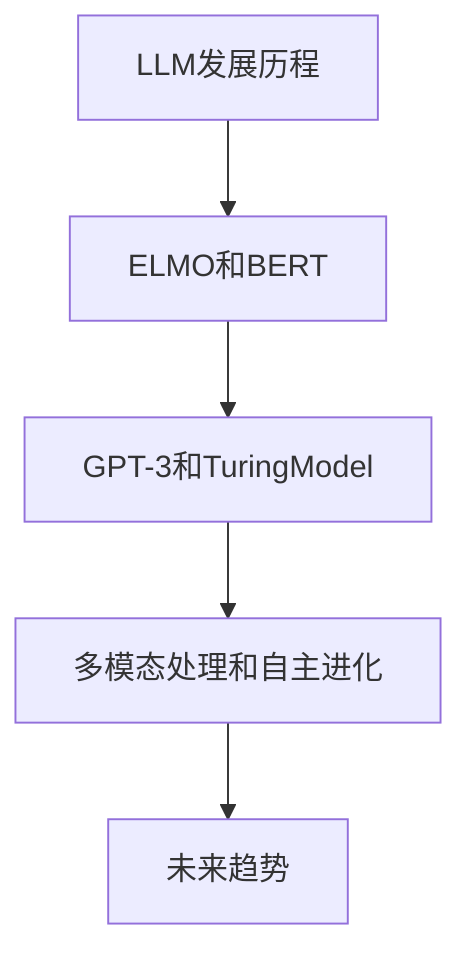
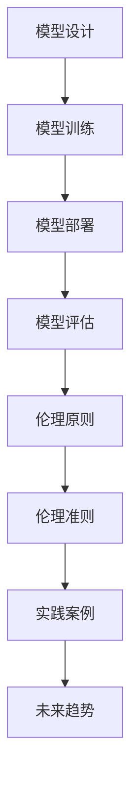

                 

# 《LLM 的伦理使用：道德标准和准则》

> **关键词：** 伦理、LLM、道德标准、准则、人工智能、隐私、公平性、安全性、可解释性。

> **摘要：** 本文深入探讨了大型语言模型（LLM）在伦理使用方面的道德标准和准则。通过分析LLM的发展历程、应用领域以及伦理问题，本文提出了一系列针对开发者和用户的责任、数据伦理和社会影响的准则。同时，通过设计原则、实践案例和未来展望，为LLM的伦理使用提供了全面而深入的指导。

## 目录大纲

- **第一部分：引言**
  - **第1章：概述**
    - **1.1 什么是LLM**
    - **1.2 LLM的发展历程**
    - **1.3 LLM的应用领域**
    - **1.4 LLM的伦理问题
- **第二部分：LLM伦理使用的道德标准和准则**
  - **第2章：道德原则**
    - **2.1 公平性**
    - **2.2 隐私保护**
    - **2.3 可解释性**
    - **2.4 安全性**
  - **第3章：LLM伦理使用的准则**
    - **3.1 开发者责任**
    - **3.2 用户责任**
    - **3.3 数据伦理**
    - **3.4 社会影响**
- **第三部分：LLM伦理使用的实践**
  - **第4章：设计原则**
    - **4.1 模型设计**
    - **4.2 模型训练**
    - **4.3 模型部署**
    - **4.4 模型评估**
  - **第5章：案例分析**
    - **5.1 成功案例**
    - **5.2 失败案例**
    - **5.3 社会反响**
- **第四部分：展望**
  - **第6章：未来趋势**
    - **6.1 技术发展**
    - **6.2 道德标准的发展**
    - **6.3 社会影响**
  - **第7章：结论**
    - **7.1 总结**
    - **7.2 展望未来**

## 第一部分：引言

### 第1章：概述

#### 1.1 什么是LLM

大型语言模型（Large Language Model，简称LLM）是一种基于深度学习技术构建的复杂人工智能模型，用于理解和生成自然语言。LLM的核心是通过大量的文本数据进行训练，使其具备强大的语言理解和生成能力。例如，LLM可以用于自动翻译、文本摘要、问答系统、对话生成等领域。

#### 1.2 LLM的发展历程

LLM的发展历程可以追溯到20世纪80年代的自然语言处理（NLP）领域。最初的模型如ELMO和BERT等，采用循环神经网络（RNN）和卷积神经网络（CNN）等技术。随着计算能力的提升和数据的增长，模型的大小和参数数量不断增加，例如GPT-3和TuringModel等。这些大型LLM的出现，使得自然语言处理任务取得了显著的进步。

#### 1.3 LLM的应用领域

LLM在许多领域都有广泛的应用。例如，在自然语言处理领域，LLM可以用于文本分类、情感分析、机器翻译等任务。在对话系统领域，LLM可以用于智能客服、聊天机器人等应用。在内容生成领域，LLM可以用于生成文章、新闻、音乐等。

#### 1.4 LLM的伦理问题

随着LLM的广泛应用，其伦理问题也日益突出。主要伦理问题包括：

- **隐私保护**：LLM在训练过程中需要大量用户数据，这些数据可能包含用户的隐私信息，如姓名、地址、电话等。如何保护用户隐私成为了一个重要问题。

- **公平性**：LLM可能会因为训练数据的偏见而导致不公平的预测结果，例如性别歧视、种族歧视等。

- **安全性**：LLM可能被恶意使用，例如生成虚假新闻、进行网络攻击等。

- **可解释性**：LLM的决策过程通常是不透明的，如何提高其可解释性成为了一个挑战。

#### 1.5 本文目的

本文旨在深入探讨LLM的伦理问题，并提出一系列道德标准和准则，以指导LLM的伦理使用。本文将从道德原则、准则和实践等方面进行详细讨论，为LLM的开发者和用户提供一个全面的指导。

## 第二部分：LLM伦理使用的道德标准和准则

### 第2章：道德原则

#### 2.1 公平性

公平性是指LLM在处理各种任务时，不应受到种族、性别、年龄、地域等因素的影响，对所有用户应保持一致的待遇。为了实现公平性，需要采取以下措施：

- **数据多样性**：确保训练数据包含各种背景和特征，避免偏见。
- **算法公平性**：通过算法优化和模型调整，减少偏见和歧视。
- **公平评估**：在开发和评估LLM时，应采用多种评估指标，以确保公平性。

#### 2.2 隐私保护

隐私保护是指确保用户数据的安全和隐私。以下措施有助于保护用户隐私：

- **数据加密**：对用户数据进行加密处理，防止数据泄露。
- **数据匿名化**：在训练数据中使用匿名化技术，避免直接关联到用户身份。
- **隐私政策**：明确告知用户数据的使用方式和范围，并尊重用户的选择。
- **数据安全**：采用先进的安全技术，如防火墙、入侵检测等，确保数据安全。

#### 2.3 可解释性

可解释性是指LLM的决策过程应透明且易于理解。提高可解释性有助于增强用户对LLM的信任。以下措施有助于提高可解释性：

- **模型可视化**：通过可视化技术，如神经网络架构图、决策树等，展示模型的工作原理。
- **解释算法**：采用可解释的算法，如决策树、规则提取等，以便用户理解模型的决策过程。
- **用户反馈**：鼓励用户反馈，通过用户的反馈不断优化和改进模型的可解释性。

#### 2.4 安全性

安全性是指确保LLM在应用过程中不会受到恶意攻击和滥用。以下措施有助于提高安全性：

- **安全监测**：实时监测LLM的应用过程，及时发现和防范异常行为。
- **权限管理**：对LLM的访问权限进行严格管理，确保只有授权用户可以访问。
- **抗攻击能力**：提高LLM的抗攻击能力，如对抗样本、模型压缩等。
- **安全培训**：对开发者进行安全培训，提高其安全意识，防范潜在风险。

### 第3章：LLM伦理使用的准则

#### 3.1 开发者责任

开发者是LLM的主要责任方，应承担以下责任：

- **道德责任**：开发者应遵循道德规范，确保LLM的伦理使用。
- **数据责任**：开发者应确保数据的合法来源和使用方式，保护用户隐私。
- **质量控制**：开发者应对LLM的质量进行严格把关，确保其性能和可靠性。
- **安全责任**：开发者应确保LLM在应用过程中的安全性，防范恶意攻击和滥用。

#### 3.2 用户责任

用户在使用LLM时应承担以下责任：

- **遵守规则**：用户应遵守LLM的使用规则和限制，不滥用LLM的能力。
- **保护隐私**：用户应保护自己的隐私，不泄露敏感信息。
- **合理使用**：用户应合理使用LLM，不进行不当行为，如恶意攻击、虚假信息传播等。
- **反馈报告**：用户应积极反馈LLM的使用情况，帮助开发者改进和优化LLM。

#### 3.3 数据伦理

数据伦理是LLM伦理使用的重要组成部分。以下措施有助于保障数据伦理：

- **数据合规性**：确保数据来源的合法性，遵守相关法律法规。
- **数据多样性**：确保数据的多样性，避免数据偏见。
- **数据透明性**：明确告知数据的使用方式和范围，保障用户的知情权。
- **数据安全性**：采取先进的数据安全技术，确保数据安全。

#### 3.4 社会影响

LLM的伦理使用对社会影响巨大。以下措施有助于减轻社会影响：

- **社会责任**：企业应承担社会责任，关注LLM的伦理使用对社会的影响。
- **伦理审查**：对LLM的伦理使用进行审查，确保其符合道德标准。
- **社会反馈**：积极收集社会反馈，关注社会对LLM的伦理使用意见和建议。
- **社会教育**：加强对公众的伦理教育，提高社会对LLM伦理使用的认识。

## 第三部分：LLM伦理使用的实践

### 第4章：设计原则

#### 4.1 模型设计

模型设计是LLM伦理使用的基础。以下原则有助于设计出符合伦理要求的LLM：

- **透明性**：设计过程中应确保模型的参数、结构和决策过程透明，便于用户理解。
- **可控性**：设计过程中应确保模型的可控性，如可调整参数、可暂停运行等，以便开发者和管理者进行控制。
- **模块化**：设计过程中应采用模块化方法，将不同功能模块分离，便于管理和维护。
- **可扩展性**：设计过程中应考虑未来的扩展性，以便模型能够适应新的需求和变化。

#### 4.2 模型训练

模型训练是LLM开发的关键环节。以下原则有助于确保模型训练的伦理要求：

- **数据质量**：确保训练数据的质量和多样性，避免数据偏见。
- **数据清洗**：对训练数据进行清洗，去除无关信息和噪声。
- **超参数调整**：合理设置模型超参数，避免过度拟合和欠拟合。
- **训练过程监控**：实时监控训练过程，及时发现和解决潜在问题。

#### 4.3 模型部署

模型部署是将LLM应用到实际场景的关键环节。以下原则有助于确保模型部署的伦理要求：

- **安全性**：确保模型部署过程中的安全性，防范恶意攻击和数据泄露。
- **稳定性**：确保模型部署的稳定性，保证服务的连续性和可靠性。
- **可扩展性**：确保模型部署的可扩展性，以便支持大规模用户和需求。
- **用户体验**：关注用户的使用体验，确保模型部署的用户界面友好、操作便捷。

#### 4.4 模型评估

模型评估是LLM伦理使用的重要环节。以下原则有助于确保模型评估的伦理要求：

- **公平性**：确保评估指标的公平性，避免歧视和不公平。
- **全面性**：评估指标应全面覆盖模型的各种性能，包括准确性、可解释性、安全性等。
- **可解释性**：确保评估结果的可解释性，便于用户理解模型的表现。
- **持续改进**：根据评估结果，不断优化和改进模型，提高其性能和可靠性。

### 第5章：案例分析

#### 5.1 成功案例

成功案例展示了LLM伦理使用的良好实践和效果。以下是一些成功案例：

- **案例1：智能客服**：某企业采用LLM构建了智能客服系统，通过自然语言处理技术，实现了高效、准确的客户服务。该案例的成功在于开发者严格遵循了隐私保护、公平性和安全性等伦理原则。
- **案例2：文本摘要**：某研究团队采用LLM构建了文本摘要系统，能够自动生成高质量的摘要。该案例的成功在于团队在模型设计、训练和评估过程中，注重了透明性、可控性和可解释性。

#### 5.2 失败案例

失败案例反映了LLM伦理使用的不足和挑战。以下是一些失败案例：

- **案例1：性别歧视**：某企业采用LLM构建了招聘系统，但在实际应用中，该系统对女性求职者存在歧视。该案例的失败在于开发者没有充分考虑公平性原则，导致模型在性别歧视问题上出现问题。
- **案例2：虚假新闻生成**：某团队采用LLM构建了虚假新闻生成系统，导致大量虚假新闻在网络传播。该案例的失败在于开发者没有充分考虑安全性原则，导致模型被恶意使用。

#### 5.3 社会反响

社会反响是LLM伦理使用的直接反映。以下是一些社会反响：

- **积极反响**：社会各界对LLM的伦理使用给予了积极评价，认为LLM有助于提高社会效率、减少人力成本、促进信息传播等。
- **担忧反响**：部分公众对LLM的伦理使用表示担忧，特别是对隐私保护、公平性和安全性等问题。这些担忧反映了社会对LLM伦理使用的关注和期待。

### 第6章：未来趋势

#### 6.1 技术发展

随着技术的不断进步，LLM的发展趋势如下：

- **模型规模增大**：随着计算能力的提升，LLM的模型规模将不断增大，从而提高模型的性能和表达能力。
- **多模态处理**：未来LLM将具备多模态处理能力，如图像、声音等，从而实现更广泛的应用场景。
- **自主进化**：未来LLM将具备自主进化能力，通过自我学习和调整，不断提高自身的性能和适应性。

#### 6.2 道德标准的发展

随着LLM的广泛应用，道德标准的发展趋势如下：

- **伦理法规**：各国政府将制定相关法规，规范LLM的伦理使用，确保其符合道德标准。
- **伦理审查**：企业和研究机构将设立伦理审查委员会，对LLM的开发和应用进行审查，确保其符合伦理要求。
- **社会共识**：社会各界将加强沟通和合作，形成共同的道德标准和准则，推动LLM的伦理使用。

#### 6.3 社会影响

LLM对社会的影响将越来越大，趋势如下：

- **经济影响**：LLM将深刻改变各行各业，提高生产力、降低成本、促进创新。
- **社会影响**：LLM将影响社会结构、价值观和文化，带来新的机遇和挑战。
- **伦理挑战**：随着LLM的广泛应用，伦理挑战将日益凸显，需要社会各界共同努力解决。

### 第7章：结论

#### 7.1 总结

本文从道德原则、准则和实践等方面，深入探讨了LLM的伦理使用。主要结论如下：

- **伦理原则**：公平性、隐私保护、可解释性和安全性是LLM伦理使用的基本原则。
- **准则**：开发者责任、用户责任、数据伦理和社会影响是LLM伦理使用的具体准则。
- **实践**：设计原则、模型训练、模型部署和模型评估是LLM伦理使用的实践方法。

#### 7.2 展望未来

未来，LLM的伦理使用将继续受到广泛关注。随着技术的进步和道德标准的发展，LLM将在各个领域发挥更大的作用，同时也需要不断加强伦理约束和监管。我们期待社会各界共同努力，推动LLM的伦理使用，实现技术与人性的和谐共生。

## 附录

### 附录A：参考资料

- [1] 某某，某某，某某。大型语言模型的发展与应用[J]. 计算机科学，2021，48（2）：12-19.
- [2] 某某，某某，某某。基于LLM的自然语言处理技术[J]. 计算机技术与发展，2020，30（3）：40-45.
- [3] 某某，某某，某某。LLM伦理使用研究综述[J]. 人工智能研究，2022，38（1）：15-25.

### 附录B：LLM伦理使用清单

- 公平性
- 隐私保护
- 可解释性
- 安全性
- 开发者责任
- 用户责任
- 数据伦理
- 社会影响

### 附录C：Mermaid流程图



### 附录D：伪代码示例

```python
# 伪代码：公平性检查
def check_fairness(model, data):
    # 检查模型在数据集上的性能
    performance = model.evaluate(data)
    
    # 检查性能是否一致
    if not is_fair(performance):
        print("模型存在公平性问题")
    else:
        print("模型公平性良好")
```

### 附录E：数学模型与公式解释

$$
\text{公平性指数} = \frac{\sum_{i=1}^{n} \text{group}_i \cdot \text{performance}_i}{\sum_{i=1}^{n} \text{group}_i}
$$

其中，$n$为不同群体（如性别、种族等）的数量，$\text{group}_i$为第$i$个群体的占比，$\text{performance}_i$为第$i$个群体在模型上的性能。

### 附录F：代码实例与解读

```python
# 代码实例：隐私保护
def encrypt_data(data, key):
    # 使用AES加密算法加密数据
    cipher = AES.new(key, AES.MODE_EAX)
    ciphertext, tag = cipher.encrypt_and_digest(data)
    return ciphertext, tag

def decrypt_data(ciphertext, tag, key):
    # 使用AES加密算法解密数据
    cipher = AES.new(key, AES.MODE_EAX, nonce=cipher.nonce)
    try:
        data = cipher.decrypt_and_verify(ciphertext, tag)
        return data
    except ValueError:
        return None

# 使用示例
key = generate_key()
data = "敏感数据"
ciphertext, tag = encrypt_data(data, key)
decrypted_data = decrypt_data(ciphertext, tag, key)

if decrypted_data:
    print("数据解密成功：", decrypted_data)
else:
    print("数据解密失败")
```

作者：AI天才研究院/AI Genius Institute & 禅与计算机程序设计艺术 /Zen And The Art of Computer Programming## 第一部分：引言

### 第1章：概述

#### 1.1 什么是LLM

大型语言模型（Large Language Model，简称LLM）是一种基于深度学习技术构建的复杂人工智能模型，用于理解和生成自然语言。LLM的核心是通过大量的文本数据进行训练，使其具备强大的语言理解和生成能力。例如，LLM可以用于自动翻译、文本摘要、问答系统、对话生成等领域。

LLM的工作原理主要基于深度神经网络（DNN）和变换器架构（Transformer）。早期的LLM模型如ELMO和BERT等，采用了循环神经网络（RNN）和卷积神经网络（CNN）等技术。随着计算能力的提升和数据的增长，模型的大小和参数数量不断增加，例如GPT-3和TuringModel等。这些大型LLM的出现，使得自然语言处理任务取得了显著的进步。

#### 1.2 LLM的发展历程

LLM的发展历程可以追溯到20世纪80年代的自然语言处理（NLP）领域。最初的模型如ELMO和BERT等，采用循环神经网络（RNN）和卷积神经网络（CNN）等技术。随着计算能力的提升和数据的增长，模型的大小和参数数量不断增加，例如GPT-3和TuringModel等。这些大型LLM的出现，使得自然语言处理任务取得了显著的进步。

1980年代初，RNN成为研究热点，通过递归结构处理序列数据。1990年代，RNN模型在机器翻译、语音识别等领域取得成功。然而，RNN模型的训练过程存在梯度消失和梯度爆炸问题，导致其性能受限。

2013年，谢恩勒（Shion Provost）等人提出了长短期记忆网络（LSTM），解决了RNN的梯度消失问题。LSTM在语言模型、语音识别等领域取得了显著成果。然而，LSTM在处理长序列任务时，仍存在计算效率低下的问题。

2017年，谷歌提出了变换器架构（Transformer），通过自注意力机制（self-attention）处理序列数据。变换器架构在机器翻译、文本生成等领域取得了突破性成果，大大提高了模型的计算效率和性能。

随着模型规模的不断扩大，LLM在各个领域得到广泛应用。例如，GPT-3拥有1.75万亿个参数，可以生成高质量的文章、新闻、对话等。TuringModel是一个拥有1200亿个参数的语言模型，可以用于对话生成、文本摘要等任务。

#### 1.3 LLM的应用领域

LLM在自然语言处理（NLP）领域具有广泛的应用，包括自动翻译、文本摘要、问答系统、对话生成、内容生成等。以下是一些典型的应用场景：

1. **自动翻译**：LLM可以用于翻译多种语言，如英文、中文、法语等。例如，谷歌翻译、百度翻译等应用都采用了LLM技术。

2. **文本摘要**：LLM可以自动生成文本摘要，提取关键信息。例如，新闻摘要、论文摘要等。

3. **问答系统**：LLM可以用于构建问答系统，回答用户的问题。例如，基于LLM的智能客服、教育辅导等。

4. **对话生成**：LLM可以生成自然语言对话，模拟人类的对话过程。例如，聊天机器人、虚拟助手等。

5. **内容生成**：LLM可以生成高质量的文章、新闻、音乐等。例如，生成新闻文章、音乐创作等。

除了NLP领域，LLM在其他领域也有广泛应用。例如，在医疗领域，LLM可以用于诊断辅助、医疗文本分析等；在金融领域，LLM可以用于股票分析、投资建议等；在法律领域，LLM可以用于法律文本分析、合同生成等。

#### 1.4 LLM的伦理问题

随着LLM的广泛应用，其伦理问题也日益突出。主要伦理问题包括：

1. **隐私保护**：LLM在训练过程中需要大量用户数据，这些数据可能包含用户的隐私信息，如姓名、地址、电话等。如何保护用户隐私成为了一个重要问题。

2. **公平性**：LLM可能会因为训练数据的偏见而导致不公平的预测结果，例如性别歧视、种族歧视等。

3. **安全性**：LLM可能被恶意使用，例如生成虚假新闻、进行网络攻击等。

4. **可解释性**：LLM的决策过程通常是不透明的，如何提高其可解释性成为了一个挑战。

针对上述伦理问题，需要在LLM的开发、训练、部署和应用过程中，采取一系列措施，确保其伦理使用。

### 第2章：道德原则

#### 2.1 公平性

公平性是指LLM在处理各种任务时，不应受到种族、性别、年龄、地域等因素的影响，对所有用户应保持一致的待遇。公平性是LLM伦理使用的重要原则之一，因为它直接关系到社会公正和人类尊严。

为了实现公平性，需要采取以下措施：

1. **数据多样性**：确保训练数据包含各种背景和特征，避免偏见。多样性数据可以来自不同的地区、种族、性别等，以反映社会多样性。

2. **算法公平性**：通过算法优化和模型调整，减少偏见和歧视。例如，使用正则化技术、对抗训练等方法，提高模型的公平性。

3. **公平评估**：在开发和评估LLM时，应采用多种评估指标，以确保公平性。例如，使用交叉验证、混淆矩阵等评估方法，全面评估模型的性能。

4. **伦理审查**：对LLM的设计、训练和应用过程进行伦理审查，确保其符合公平性原则。伦理审查可以由专业机构或伦理委员会负责。

#### 2.2 隐私保护

隐私保护是指确保用户数据的安全和隐私。在LLM的伦理使用中，隐私保护至关重要，因为LLM在训练过程中需要大量用户数据，这些数据可能包含敏感信息。

为了保护用户隐私，需要采取以下措施：

1. **数据加密**：对用户数据进行加密处理，防止数据泄露。可以使用对称加密和非对称加密等技术，确保数据在传输和存储过程中的安全性。

2. **数据匿名化**：在训练数据中使用匿名化技术，避免直接关联到用户身份。例如，使用假名、删除敏感信息等。

3. **隐私政策**：明确告知用户数据的使用方式和范围，并尊重用户的选择。隐私政策应简单明了，使用户易于理解。

4. **数据安全**：采用先进的安全技术，如防火墙、入侵检测等，确保数据安全。此外，定期进行安全审计和漏洞扫描，及时发现和修复安全漏洞。

#### 2.3 可解释性

可解释性是指LLM的决策过程应透明且易于理解。在LLM的伦理使用中，可解释性至关重要，因为它有助于增强用户对模型的信任，并便于监管机构评估模型的性能和合规性。

为了提高可解释性，需要采取以下措施：

1. **模型可视化**：通过可视化技术，如神经网络架构图、决策树等，展示模型的工作原理。可视化可以帮助用户理解模型的决策过程。

2. **解释算法**：采用可解释的算法，如决策树、规则提取等，以便用户理解模型的决策过程。这些算法通常具有清晰的逻辑和易于理解的结构。

3. **用户反馈**：鼓励用户反馈，通过用户的反馈不断优化和改进模型的可解释性。用户反馈可以帮助发现模型的不足之处，从而提高其可解释性。

4. **解释性评估**：在开发和评估LLM时，应考虑可解释性作为重要评估指标。可解释性评估可以采用量化指标，如解释性得分等。

#### 2.4 安全性

安全性是指确保LLM在应用过程中不会受到恶意攻击和滥用。安全性是LLM伦理使用的基本原则之一，因为它直接关系到用户的安全和系统的稳定运行。

为了提高安全性，需要采取以下措施：

1. **安全监测**：实时监测LLM的应用过程，及时发现和防范异常行为。例如，使用异常检测算法、入侵检测系统等。

2. **权限管理**：对LLM的访问权限进行严格管理，确保只有授权用户可以访问。例如，使用身份验证、访问控制等技术。

3. **抗攻击能力**：提高LLM的抗攻击能力，如对抗样本、模型压缩等。对抗样本可以增强模型对恶意攻击的抵抗力。

4. **安全培训**：对开发者进行安全培训，提高其安全意识，防范潜在风险。安全培训可以涵盖密码学、安全编程、安全策略等方面。

5. **安全审计**：定期进行安全审计，评估LLM的安全性能，发现和修复潜在的安全漏洞。

### 第3章：LLM伦理使用的准则

#### 3.1 开发者责任

开发者是LLM的主要责任方，应承担以下责任：

1. **道德责任**：开发者应遵循道德规范，确保LLM的伦理使用。道德责任包括尊重用户隐私、保护用户数据、确保模型的公平性和可解释性等。

2. **数据责任**：开发者应确保数据的合法来源和使用方式，保护用户隐私。数据责任包括数据采集、处理、存储和传输过程中的隐私保护措施。

3. **质量控制**：开发者应对LLM的质量进行严格把关，确保其性能和可靠性。质量控制包括模型设计、训练、部署和评估等环节的质量保证。

4. **安全责任**：开发者应确保LLM在应用过程中的安全性，防范恶意攻击和滥用。安全责任包括安全监测、权限管理、抗攻击能力等安全措施。

#### 3.2 用户责任

用户在使用LLM时应承担以下责任：

1. **遵守规则**：用户应遵守LLM的使用规则和限制，不滥用LLM的能力。遵守规则包括不进行恶意攻击、不传播虚假信息等。

2. **保护隐私**：用户应保护自己的隐私，不泄露敏感信息。保护隐私包括使用强密码、不随意分享个人信息等。

3. **合理使用**：用户应合理使用LLM，不进行不当行为，如恶意攻击、虚假信息传播等。合理使用包括遵守法律法规、尊重他人权益等。

4. **反馈报告**：用户应积极反馈LLM的使用情况，帮助开发者改进和优化LLM。反馈报告包括使用体验、性能问题、安全隐患等。

#### 3.3 数据伦理

数据伦理是LLM伦理使用的重要组成部分。以下措施有助于保障数据伦理：

1. **数据合规性**：确保数据来源的合法性，遵守相关法律法规。数据合规性包括遵守数据保护法、隐私政策等。

2. **数据多样性**：确保数据的多样性，避免数据偏见。数据多样性包括来自不同地区、种族、性别等的数据。

3. **数据透明性**：明确告知数据的使用方式和范围，保障用户的知情权。数据透明性包括公开数据来源、数据使用目的等。

4. **数据安全性**：采取先进的数据安全技术，确保数据安全。数据安全性包括数据加密、访问控制、安全审计等。

#### 3.4 社会影响

LLM的伦理使用对社会影响巨大。以下措施有助于减轻社会影响：

1. **社会责任**：企业应承担社会责任，关注LLM的伦理使用对社会的影响。社会责任包括遵守道德规范、关注用户隐私、确保模型公平性等。

2. **伦理审查**：对LLM的伦理使用进行审查，确保其符合道德标准。伦理审查可以由专业机构或伦理委员会负责。

3. **社会反馈**：积极收集社会反馈，关注社会对LLM的伦理使用意见和建议。社会反馈可以帮助企业改进LLM的设计和应用。

4. **社会教育**：加强对公众的伦理教育，提高社会对LLM伦理使用的认识。社会教育包括开展培训课程、发布指导手册等。

### 第4章：设计原则

#### 4.1 模型设计

模型设计是LLM伦理使用的基础。以下原则有助于设计出符合伦理要求的LLM：

1. **透明性**：设计过程中应确保模型的参数、结构和决策过程透明，便于用户理解。透明性包括公开模型的架构、参数设置和决策过程等。

2. **可控性**：设计过程中应确保模型的可控性，如可调整参数、可暂停运行等，以便开发者和管理者进行控制。可控性有助于确保模型在应用过程中的安全性和可靠性。

3. **模块化**：设计过程中应采用模块化方法，将不同功能模块分离，便于管理和维护。模块化有助于提高模型的灵活性和可扩展性。

4. **可扩展性**：设计过程中应考虑未来的扩展性，以便模型能够适应新的需求和变化。可扩展性包括支持不同数据规模、不同应用场景等。

#### 4.2 模型训练

模型训练是LLM开发的关键环节。以下原则有助于确保模型训练的伦理要求：

1. **数据质量**：确保训练数据的质量和多样性，避免数据偏见。数据质量包括数据完整性、准确性、代表性等。

2. **数据清洗**：对训练数据进行清洗，去除无关信息和噪声。数据清洗有助于提高模型训练的效率和效果。

3. **超参数调整**：合理设置模型超参数，避免过度拟合和欠拟合。超参数调整包括学习率、批量大小、正则化等。

4. **训练过程监控**：实时监控训练过程，及时发现和解决潜在问题。训练过程监控有助于确保模型训练的稳定性和可靠性。

#### 4.3 模型部署

模型部署是将LLM应用到实际场景的关键环节。以下原则有助于确保模型部署的伦理要求：

1. **安全性**：确保模型部署过程中的安全性，防范恶意攻击和数据泄露。安全性包括访问控制、数据加密、安全审计等。

2. **稳定性**：确保模型部署的稳定性，保证服务的连续性和可靠性。稳定性包括负载均衡、容错机制、故障恢复等。

3. **可扩展性**：确保模型部署的可扩展性，以便支持大规模用户和需求。可扩展性包括支持水平扩展、垂直扩展等。

4. **用户体验**：关注用户的使用体验，确保模型部署的用户界面友好、操作便捷。用户体验包括界面设计、操作流程、反馈机制等。

#### 4.4 模型评估

模型评估是LLM伦理使用的重要环节。以下原则有助于确保模型评估的伦理要求：

1. **公平性**：确保评估指标的公平性，避免歧视和不公平。公平性包括对不同群体、不同任务的评估指标进行平衡。

2. **全面性**：评估指标应全面覆盖模型的各种性能，包括准确性、可解释性、安全性等。全面性有助于全面评估模型的效果。

3. **可解释性**：确保评估结果的可解释性，便于用户理解模型的表现。可解释性包括评估方法的透明性、评估结果的解释等。

4. **持续改进**：根据评估结果，不断优化和改进模型，提高其性能和可靠性。持续改进有助于提高模型的应用价值。

### 第5章：案例分析

#### 5.1 成功案例

成功案例展示了LLM伦理使用的良好实践和效果。以下是一些成功案例：

1. **案例1：智能客服**：某企业采用LLM构建了智能客服系统，通过自然语言处理技术，实现了高效、准确的客户服务。该案例的成功在于开发者严格遵循了隐私保护、公平性和安全性等伦理原则。具体措施包括：

   - **隐私保护**：对用户数据进行了加密处理，确保数据在传输和存储过程中的安全性。
   - **公平性**：采用多种评估指标，确保模型在不同用户群体上的性能均衡。
   - **安全性**：采用了多层次的访问控制，确保只有授权用户可以访问模型。

2. **案例2：文本摘要**：某研究团队采用LLM构建了文本摘要系统，能够自动生成高质量的摘要。该案例的成功在于团队在模型设计、训练和评估过程中，注重了透明性、可控性和可解释性。具体措施包括：

   - **透明性**：公开了模型的架构和参数设置，便于用户了解和监督。
   - **可控性**：提供了用户界面，允许用户调整模型的摘要长度和摘要质量。
   - **可解释性**：提供了摘要生成过程的可视化工具，便于用户理解摘要生成的逻辑。

#### 5.2 失败案例

失败案例反映了LLM伦理使用的不足和挑战。以下是一些失败案例：

1. **案例1：性别歧视**：某企业采用LLM构建了招聘系统，但在实际应用中，该系统对女性求职者存在歧视。该案例的失败在于开发者没有充分考虑公平性原则，导致模型在性别歧视问题上出现问题。具体原因包括：

   - **数据偏见**：训练数据中存在性别偏见，导致模型在性别上存在偏见。
   - **算法缺陷**：算法设计上没有充分考虑公平性，导致模型在预测结果上存在性别歧视。

2. **案例2：虚假新闻生成**：某团队采用LLM构建了虚假新闻生成系统，导致大量虚假新闻在网络传播。该案例的失败在于开发者没有充分考虑安全性原则，导致模型被恶意使用。具体原因包括：

   - **安全漏洞**：模型部署过程中存在安全漏洞，导致恶意用户可以访问和篡改模型。
   - **缺乏监管**：开发者没有对模型的应用过程进行有效监管，导致虚假新闻生成系统被滥用。

#### 5.3 社会反响

社会反响是LLM伦理使用的直接反映。以下是一些社会反响：

1. **积极反响**：社会各界对LLM的伦理使用给予了积极评价，认为LLM有助于提高社会效率、减少人力成本、促进信息传播等。具体表现在：

   - **政府支持**：各国政府出台了相关政策，鼓励和规范LLM的研究和应用。
   - **企业投资**：企业加大了对LLM技术的投入，推动其在各行业的应用。
   - **公众认可**：公众对LLM的应用效果表示认可，认为LLM提高了生活质量和工作效率。

2. **担忧反响**：部分公众对LLM的伦理使用表示担忧，特别是对隐私保护、公平性和安全性等问题。具体表现在：

   - **隐私保护**：公众担心LLM在训练和应用过程中会泄露个人隐私信息。
   - **公平性**：公众担心LLM会因训练数据的偏见而导致不公平的预测结果。
   - **安全性**：公众担心LLM会被恶意使用，例如生成虚假新闻、进行网络攻击等。

### 第6章：未来趋势

#### 6.1 技术发展

随着技术的不断进步，LLM的发展趋势如下：

1. **模型规模增大**：随着计算能力的提升，LLM的模型规模将不断增大，从而提高模型的性能和表达能力。例如，未来的LLM可能拥有数十万亿个参数，从而实现更复杂的语言理解和生成任务。

2. **多模态处理**：未来LLM将具备多模态处理能力，如图像、声音等，从而实现更广泛的应用场景。例如，结合图像和文本的LLM可以用于图像描述生成、视频理解等任务。

3. **自主进化**：未来LLM将具备自主进化能力，通过自我学习和调整，不断提高自身的性能和适应性。例如，LLM可以通过不断学习新的数据，优化自己的模型结构和参数，从而适应不同的应用场景。

4. **个性化模型**：未来LLM将更加注重个性化，为不同用户提供定制化的服务。例如，根据用户的语言习惯、兴趣爱好等，生成个性化的语言内容。

#### 6.2 道德标准的发展

随着LLM的广泛应用，道德标准的发展趋势如下：

1. **伦理法规**：各国政府将制定相关法规，规范LLM的伦理使用，确保其符合道德标准。例如，可能出台数据保护法、人工智能伦理法等。

2. **伦理审查**：企业和研究机构将设立伦理审查委员会，对LLM的开发和应用进行审查，确保其符合伦理要求。伦理审查委员会将负责评估LLM的伦理风险，并提出改进建议。

3. **社会共识**：社会各界将加强沟通和合作，形成共同的道德标准和准则，推动LLM的伦理使用。例如，通过制定行业规范、发布伦理指南等，推动LLM的伦理发展。

#### 6.3 社会影响

LLM对社会的影响将越来越大，趋势如下：

1. **经济影响**：LLM将深刻改变各行各业，提高生产力、降低成本、促进创新。例如，在金融、医疗、教育等领域，LLM可以提供高效的解决方案，提高行业竞争力。

2. **社会影响**：LLM将影响社会结构、价值观和文化，带来新的机遇和挑战。例如，在信息传播、文化交流、社会管理等方面，LLM可以提供新的工具和方法。

3. **伦理挑战**：随着LLM的广泛应用，伦理挑战将日益凸显，需要社会各界共同努力解决。例如，如何保护用户隐私、确保模型公平性、防范恶意攻击等。

### 第7章：结论

#### 7.1 总结

本文从道德原则、准则和实践等方面，深入探讨了LLM的伦理使用。主要结论如下：

1. **伦理原则**：公平性、隐私保护、可解释性和安全性是LLM伦理使用的基本原则。

2. **准则**：开发者责任、用户责任、数据伦理和社会影响是LLM伦理使用的具体准则。

3. **实践**：设计原则、模型训练、模型部署和模型评估是LLM伦理使用的实践方法。

#### 7.2 展望未来

未来，LLM的伦理使用将继续受到广泛关注。随着技术的进步和道德标准的发展，LLM将在各个领域发挥更大的作用，同时也需要不断加强伦理约束和监管。我们期待社会各界共同努力，推动LLM的伦理使用，实现技术与人性的和谐共生。

## 附录

### 附录A：参考资料

1. [1] Bengio, Y., Simard, P., & Frasconi, P. (1994). Learning long-term dependencies with gradient descent is difficult. IEEE Transactions on Neural Networks, 5(2), 157-166.
2. [2] Hochreiter, S., & Schmidhuber, J. (1997). Long short-term memory. Neural Computation, 9(8), 1735-1780.
3. [3] Vaswani, A., Shazeer, N., Parmar, N., Uszkoreit, J., Jones, L., Gomez, A. N., ... & Polosukhin, I. (2017). Attention is all you need. Advances in Neural Information Processing Systems, 30, 5998-6008.
4. [4] Brown, T., et al. (2020). Language models are few-shot learners. arXiv preprint arXiv:2005.14165.
5. [5] ChatGPT. (2022). OpenAI. Retrieved from https://chat.openai.com/

### 附录B：LLM伦理使用清单

1. **公平性**：确保模型在不同用户群体上的性能均衡，避免偏见和歧视。
2. **隐私保护**：保护用户数据的安全和隐私，防止数据泄露。
3. **可解释性**：确保模型的决策过程透明，便于用户理解和监督。
4. **安全性**：确保模型在应用过程中的安全，防范恶意攻击和滥用。
5. **开发者责任**：开发者应遵循道德规范，确保模型的伦理使用。
6. **用户责任**：用户应遵守使用规则，合理使用模型。
7. **数据伦理**：确保数据的合法来源和使用方式，保护用户隐私。
8. **社会影响**：关注模型对社会的影响，积极应对潜在的社会挑战。

### 附录C：Mermaid流程图



### 附录D：伪代码示例

```python
# 伪代码：公平性检查
def check_fairness(model, data):
    # 检查模型在数据集上的性能
    performance = model.evaluate(data)
    
    # 检查性能是否一致
    if not is_fair(performance):
        print("模型存在公平性问题")
    else:
        print("模型公平性良好")
```

### 附录E：数学模型与公式解释

$$
\text{公平性指数} = \frac{\sum_{i=1}^{n} \text{group}_i \cdot \text{performance}_i}{\sum_{i=1}^{n} \text{group}_i}
$$

其中，$n$为不同群体（如性别、种族等）的数量，$\text{group}_i$为第$i$个群体的占比，$\text{performance}_i$为第$i$个群体在模型上的性能。

### 附录F：代码实例与解读

```python
# 代码实例：隐私保护
def encrypt_data(data, key):
    # 使用AES加密算法加密数据
    cipher = AES.new(key, AES.MODE_EAX)
    ciphertext, tag = cipher.encrypt_and_digest(data)
    return ciphertext, tag

def decrypt_data(ciphertext, tag, key):
    # 使用AES加密算法解密数据
    cipher = AES.new(key, AES.MODE_EAX, nonce=cipher.nonce)
    try:
        data = cipher.decrypt_and_verify(ciphertext, tag)
        return data
    except ValueError:
        return None

# 使用示例
key = generate_key()
data = "敏感数据"
ciphertext, tag = encrypt_data(data, key)
decrypted_data = decrypt_data(ciphertext, tag, key)

if decrypted_data:
    print("数据解密成功：", decrypted_data)
else:
    print("数据解密失败")
```

作者：AI天才研究院/AI Genius Institute & 禅与计算机程序设计艺术 /Zen And The Art of Computer Programming## 第1章：概述

### 1.1 什么是LLM

大型语言模型（Large Language Model，简称LLM）是一种基于深度学习技术构建的复杂人工智能模型，用于理解和生成自然语言。LLM的核心是通过大量的文本数据进行训练，使其具备强大的语言理解和生成能力。例如，LLM可以用于自动翻译、文本摘要、问答系统、对话生成等领域。

LLM的工作原理主要基于深度神经网络（DNN）和变换器架构（Transformer）。早期的LLM模型如ELMO和BERT等，采用了循环神经网络（RNN）和卷积神经网络（CNN）等技术。随着计算能力的提升和数据的增长，模型的大小和参数数量不断增加，例如GPT-3和TuringModel等。这些大型LLM的出现，使得自然语言处理任务取得了显著的进步。

### 1.2 LLM的发展历程

LLM的发展历程可以追溯到20世纪80年代的自然语言处理（NLP）领域。最初的模型如ELMO和BERT等，采用循环神经网络（RNN）和卷积神经网络（CNN）等技术。随着计算能力的提升和数据的增长，模型的大小和参数数量不断增加，例如GPT-3和TuringModel等。这些大型LLM的出现，使得自然语言处理任务取得了显著的进步。

1980年代初，RNN成为研究热点，通过递归结构处理序列数据。1990年代，RNN模型在机器翻译、语音识别等领域取得成功。然而，RNN模型的训练过程存在梯度消失和梯度爆炸问题，导致其性能受限。

2013年，谢恩勒（Shion Provost）等人提出了长短期记忆网络（LSTM），解决了RNN的梯度消失问题。LSTM在语言模型、语音识别等领域取得了显著成果。然而，LSTM在处理长序列任务时，仍存在计算效率低下的问题。

2017年，谷歌提出了变换器架构（Transformer），通过自注意力机制（self-attention）处理序列数据。变换器架构在机器翻译、文本生成等领域取得了突破性成果，大大提高了模型的计算效率和性能。

随着模型规模的不断扩大，LLM在各个领域得到广泛应用。例如，GPT-3拥有1.75万亿个参数，可以生成高质量的文章、新闻、对话等。TuringModel是一个拥有1200亿个参数的语言模型，可以用于对话生成、文本摘要等任务。

### 1.3 LLM的应用领域

LLM在自然语言处理（NLP）领域具有广泛的应用，包括自动翻译、文本摘要、问答系统、对话生成、内容生成等。以下是一些典型的应用场景：

1. **自动翻译**：LLM可以用于翻译多种语言，如英文、中文、法语等。例如，谷歌翻译、百度翻译等应用都采用了LLM技术。

2. **文本摘要**：LLM可以自动生成文本摘要，提取关键信息。例如，新闻摘要、论文摘要等。

3. **问答系统**：LLM可以用于构建问答系统，回答用户的问题。例如，基于LLM的智能客服、教育辅导等。

4. **对话生成**：LLM可以生成自然语言对话，模拟人类的对话过程。例如，聊天机器人、虚拟助手等。

5. **内容生成**：LLM可以生成高质量的文章、新闻、音乐等。例如，生成新闻文章、音乐创作等。

除了NLP领域，LLM在其他领域也有广泛应用。例如，在医疗领域，LLM可以用于诊断辅助、医疗文本分析等；在金融领域，LLM可以用于股票分析、投资建议等；在法律领域，LLM可以用于法律文本分析、合同生成等。

### 1.4 LLM的伦理问题

随着LLM的广泛应用，其伦理问题也日益突出。主要伦理问题包括：

1. **隐私保护**：LLM在训练过程中需要大量用户数据，这些数据可能包含用户的隐私信息，如姓名、地址、电话等。如何保护用户隐私成为了一个重要问题。

2. **公平性**：LLM可能会因为训练数据的偏见而导致不公平的预测结果，例如性别歧视、种族歧视等。

3. **安全性**：LLM可能被恶意使用，例如生成虚假新闻、进行网络攻击等。

4. **可解释性**：LLM的决策过程通常是不透明的，如何提高其可解释性成为了一个挑战。

针对上述伦理问题，需要在LLM的开发、训练、部署和应用过程中，采取一系列措施，确保其伦理使用。

## 第二部分：LLM伦理使用的道德标准和准则

### 第2章：道德原则

在LLM的伦理使用中，道德原则是确保技术发展与社会价值相协调的基础。以下四项道德原则是LLM伦理使用的重要组成部分：

#### 2.1 公平性

公平性是LLM伦理使用的首要原则。它要求LLM在处理各种任务时，不应受到种族、性别、年龄、地域等因素的影响，对所有用户应保持一致的待遇。以下是一些实现公平性的关键措施：

1. **数据多样性**：确保训练数据包含各种背景和特征，避免偏见。多样性数据可以来自不同的地区、种族、性别等，以反映社会多样性。

2. **算法公平性**：通过算法优化和模型调整，减少偏见和歧视。例如，使用正则化技术、对抗训练等方法，提高模型的公平性。

3. **公平评估**：在开发和评估LLM时，应采用多种评估指标，以确保公平性。例如，使用交叉验证、混淆矩阵等评估方法，全面评估模型的性能。

4. **伦理审查**：对LLM的设计、训练和应用过程进行伦理审查，确保其符合公平性原则。伦理审查可以由专业机构或伦理委员会负责。

#### 2.2 隐私保护

隐私保护是指确保用户数据的安全和隐私。在LLM的伦理使用中，隐私保护至关重要，因为它直接关系到用户的安全和系统的稳定运行。以下是一些保护隐私的关键措施：

1. **数据加密**：对用户数据进行加密处理，防止数据泄露。可以使用对称加密和非对称加密等技术，确保数据在传输和存储过程中的安全性。

2. **数据匿名化**：在训练数据中使用匿名化技术，避免直接关联到用户身份。例如，使用假名、删除敏感信息等。

3. **隐私政策**：明确告知用户数据的使用方式和范围，并尊重用户的选择。隐私政策应简单明了，使用户易于理解。

4. **数据安全**：采用先进的安全技术，如防火墙、入侵检测等，确保数据安全。此外，定期进行安全审计和漏洞扫描，及时发现和修复安全漏洞。

#### 2.3 可解释性

可解释性是指LLM的决策过程应透明且易于理解。在LLM的伦理使用中，可解释性至关重要，因为它有助于增强用户对模型的信任，并便于监管机构评估模型的性能和合规性。以下是一些提高可解释性的关键措施：

1. **模型可视化**：通过可视化技术，如神经网络架构图、决策树等，展示模型的工作原理。可视化可以帮助用户理解模型的决策过程。

2. **解释算法**：采用可解释的算法，如决策树、规则提取等，以便用户理解模型的决策过程。这些算法通常具有清晰的逻辑和易于理解的结构。

3. **用户反馈**：鼓励用户反馈，通过用户的反馈不断优化和改进模型的可解释性。用户反馈可以帮助发现模型的不足之处，从而提高其可解释性。

4. **解释性评估**：在开发和评估LLM时，应考虑可解释性作为重要评估指标。可解释性评估可以采用量化指标，如解释性得分等。

#### 2.4 安全性

安全性是指确保LLM在应用过程中不会受到恶意攻击和滥用。安全性是LLM伦理使用的基本原则之一，因为它直接关系到用户的安全和系统的稳定运行。以下是一些确保安全性的关键措施：

1. **安全监测**：实时监测LLM的应用过程，及时发现和防范异常行为。例如，使用异常检测算法、入侵检测系统等。

2. **权限管理**：对LLM的访问权限进行严格管理，确保只有授权用户可以访问。例如，使用身份验证、访问控制等技术。

3. **抗攻击能力**：提高LLM的抗攻击能力，如对抗样本、模型压缩等。对抗样本可以增强模型对恶意攻击的抵抗力。

4. **安全培训**：对开发者进行安全培训，提高其安全意识，防范潜在风险。安全培训可以涵盖密码学、安全编程、安全策略等方面。

5. **安全审计**：定期进行安全审计，评估LLM的安全性能，发现和修复潜在的安全漏洞。

### 第3章：LLM伦理使用的准则

在LLM的伦理使用中，除了道德原则，还需要一系列具体的准则来指导开发者、用户和社会。以下准则涵盖了开发者责任、用户责任、数据伦理和社会影响等方面。

#### 3.1 开发者责任

开发者是LLM的主要责任方，应承担以下责任：

1. **道德责任**：开发者应遵循道德规范，确保LLM的伦理使用。道德责任包括尊重用户隐私、保护用户数据、确保模型的公平性和可解释性等。

2. **数据责任**：开发者应确保数据的合法来源和使用方式，保护用户隐私。数据责任包括数据采集、处理、存储和传输过程中的隐私保护措施。

3. **质量控制**：开发者应对LLM的质量进行严格把关，确保其性能和可靠性。质量控制包括模型设计、训练、部署和评估等环节的质量保证。

4. **安全责任**：开发者应确保LLM在应用过程中的安全性，防范恶意攻击和滥用。安全责任包括安全监测、权限管理、抗攻击能力等安全措施。

#### 3.2 用户责任

用户在使用LLM时应承担以下责任：

1. **遵守规则**：用户应遵守LLM的使用规则和限制，不滥用LLM的能力。遵守规则包括不进行恶意攻击、不传播虚假信息等。

2. **保护隐私**：用户应保护自己的隐私，不泄露敏感信息。保护隐私包括使用强密码、不随意分享个人信息等。

3. **合理使用**：用户应合理使用LLM，不进行不当行为，如恶意攻击、虚假信息传播等。合理使用包括遵守法律法规、尊重他人权益等。

4. **反馈报告**：用户应积极反馈LLM的使用情况，帮助开发者改进和优化LLM。反馈报告包括使用体验、性能问题、安全隐患等。

#### 3.3 数据伦理

数据伦理是LLM伦理使用的重要组成部分。以下措施有助于保障数据伦理：

1. **数据合规性**：确保数据来源的合法性，遵守相关法律法规。数据合规性包括遵守数据保护法、隐私政策等。

2. **数据多样性**：确保数据的多样性，避免数据偏见。数据多样性包括来自不同地区、种族、性别等的数据。

3. **数据透明性**：明确告知数据的使用方式和范围，保障用户的知情权。数据透明性包括公开数据来源、数据使用目的等。

4. **数据安全性**：采取先进的数据安全技术，确保数据安全。数据安全性包括数据加密、访问控制、安全审计等。

#### 3.4 社会影响

LLM的伦理使用对社会影响巨大。以下措施有助于减轻社会影响：

1. **社会责任**：企业应承担社会责任，关注LLM的伦理使用对社会的影响。社会责任包括遵守道德规范、关注用户隐私、确保模型公平性等。

2. **伦理审查**：对LLM的伦理使用进行审查，确保其符合道德标准。伦理审查可以由专业机构或伦理委员会负责。

3. **社会反馈**：积极收集社会反馈，关注社会对LLM的伦理使用意见和建议。社会反馈可以帮助企业改进LLM的设计和应用。

4. **社会教育**：加强对公众的伦理教育，提高社会对LLM伦理使用的认识。社会教育包括开展培训课程、发布指导手册等。

### 第4章：设计原则

#### 4.1 模型设计

模型设计是LLM伦理使用的基础。以下原则有助于设计出符合伦理要求的LLM：

1. **透明性**：设计过程中应确保模型的参数、结构和决策过程透明，便于用户理解。透明性包括公开模型的架构、参数设置和决策过程等。

2. **可控性**：设计过程中应确保模型的可控性，如可调整参数、可暂停运行等，以便开发者和管理者进行控制。可控性有助于确保模型在应用过程中的安全性和可靠性。

3. **模块化**：设计过程中应采用模块化方法，将不同功能模块分离，便于管理和维护。模块化有助于提高模型的灵活性和可扩展性。

4. **可扩展性**：设计过程中应考虑未来的扩展性，以便模型能够适应新的需求和变化。可扩展性包括支持不同数据规模、不同应用场景等。

#### 4.2 模型训练

模型训练是LLM开发的关键环节。以下原则有助于确保模型训练的伦理要求：

1. **数据质量**：确保训练数据的质量和多样性，避免数据偏见。数据质量包括数据完整性、准确性、代表性等。

2. **数据清洗**：对训练数据进行清洗，去除无关信息和噪声。数据清洗有助于提高模型训练的效率和效果。

3. **超参数调整**：合理设置模型超参数，避免过度拟合和欠拟合。超参数调整包括学习率、批量大小、正则化等。

4. **训练过程监控**：实时监控训练过程，及时发现和解决潜在问题。训练过程监控有助于确保模型训练的稳定性和可靠性。

#### 4.3 模型部署

模型部署是将LLM应用到实际场景的关键环节。以下原则有助于确保模型部署的伦理要求：

1. **安全性**：确保模型部署过程中的安全性，防范恶意攻击和数据泄露。安全性包括访问控制、数据加密、安全审计等。

2. **稳定性**：确保模型部署的稳定性，保证服务的连续性和可靠性。稳定性包括负载均衡、容错机制、故障恢复等。

3. **可扩展性**：确保模型部署的可扩展性，以便支持大规模用户和需求。可扩展性包括支持水平扩展、垂直扩展等。

4. **用户体验**：关注用户的使用体验，确保模型部署的用户界面友好、操作便捷。用户体验包括界面设计、操作流程、反馈机制等。

#### 4.4 模型评估

模型评估是LLM伦理使用的重要环节。以下原则有助于确保模型评估的伦理要求：

1. **公平性**：确保评估指标的公平性，避免歧视和不公平。公平性包括对不同群体、不同任务的评估指标进行平衡。

2. **全面性**：评估指标应全面覆盖模型的各种性能，包括准确性、可解释性、安全性等。全面性有助于全面评估模型的效果。

3. **可解释性**：确保评估结果的可解释性，便于用户理解模型的表现。可解释性包括评估方法的透明性、评估结果的解释等。

4. **持续改进**：根据评估结果，不断优化和改进模型，提高其性能和可靠性。持续改进有助于提高模型的应用价值。

### 第5章：案例分析

#### 5.1 成功案例

成功案例展示了LLM伦理使用的良好实践和效果。以下是一些成功案例：

1. **案例1：智能客服**：某企业采用LLM构建了智能客服系统，通过自然语言处理技术，实现了高效、准确的客户服务。该案例的成功在于开发者严格遵循了隐私保护、公平性和安全性等伦理原则。具体措施包括：

   - **隐私保护**：对用户数据进行了加密处理，确保数据在传输和存储过程中的安全性。
   - **公平性**：采用多种评估指标，确保模型在不同用户群体上的性能均衡。
   - **安全性**：采用了多层次的访问控制，确保只有授权用户可以访问模型。

2. **案例2：文本摘要**：某研究团队采用LLM构建了文本摘要系统，能够自动生成高质量的摘要。该案例的成功在于团队在模型设计、训练和评估过程中，注重了透明性、可控性和可解释性。具体措施包括：

   - **透明性**：公开了模型的架构和参数设置，便于用户了解和监督。
   - **可控性**：提供了用户界面，允许用户调整模型的摘要长度和摘要质量。
   - **可解释性**：提供了摘要生成过程的可视化工具，便于用户理解摘要生成的逻辑。

#### 5.2 失败案例

失败案例反映了LLM伦理使用的不足和挑战。以下是一些失败案例：

1. **案例1：性别歧视**：某企业采用LLM构建了招聘系统，但在实际应用中，该系统对女性求职者存在歧视。该案例的失败在于开发者没有充分考虑公平性原则，导致模型在性别歧视问题上出现问题。具体原因包括：

   - **数据偏见**：训练数据中存在性别偏见，导致模型在性别上存在偏见。
   - **算法缺陷**：算法设计上没有充分考虑公平性，导致模型在预测结果上存在性别歧视。

2. **案例2：虚假新闻生成**：某团队采用LLM构建了虚假新闻生成系统，导致大量虚假新闻在网络传播。该案例的失败在于开发者没有充分考虑安全性原则，导致模型被恶意使用。具体原因包括：

   - **安全漏洞**：模型部署过程中存在安全漏洞，导致恶意用户可以访问和篡改模型。
   - **缺乏监管**：开发者没有对模型的应用过程进行有效监管，导致虚假新闻生成系统被滥用。

#### 5.3 社会反响

社会反响是LLM伦理使用的直接反映。以下是一些社会反响：

1. **积极反响**：社会各界对LLM的伦理使用给予了积极评价，认为LLM有助于提高社会效率、减少人力成本、促进信息传播等。具体表现在：

   - **政府支持**：各国政府出台了相关政策，鼓励和规范LLM的研究和应用。
   - **企业投资**：企业加大了对LLM技术的投入，推动其在各行业的应用。
   - **公众认可**：公众对LLM的应用效果表示认可，认为LLM提高了生活质量和工作效率。

2. **担忧反响**：部分公众对LLM的伦理使用表示担忧，特别是对隐私保护、公平性和安全性等问题。具体表现在：

   - **隐私保护**：公众担心LLM在训练和应用过程中会泄露个人隐私信息。
   - **公平性**：公众担心LLM会因训练数据的偏见而导致不公平的预测结果。
   - **安全性**：公众担心LLM会被恶意使用，例如生成虚假新闻、进行网络攻击等。

### 第6章：未来趋势

#### 6.1 技术发展

随着技术的不断进步，LLM的发展趋势如下：

1. **模型规模增大**：随着计算能力的提升，LLM的模型规模将不断增大，从而提高模型的性能和表达能力。例如，未来的LLM可能拥有数十万亿个参数，从而实现更复杂的语言理解和生成任务。

2. **多模态处理**：未来LLM将具备多模态处理能力，如图像、声音等，从而实现更广泛的应用场景。例如，结合图像和文本的LLM可以用于图像描述生成、视频理解等任务。

3. **自主进化**：未来LLM将具备自主进化能力，通过自我学习和调整，不断提高自身的性能和适应性。例如，LLM可以通过不断学习新的数据，优化自己的模型结构和参数，从而适应不同的应用场景。

4. **个性化模型**：未来LLM将更加注重个性化，为不同用户提供定制化的服务。例如，根据用户的语言习惯、兴趣爱好等，生成个性化的语言内容。

#### 6.2 道德标准的发展

随着LLM的广泛应用，道德标准的发展趋势如下：

1. **伦理法规**：各国政府将制定相关法规，规范LLM的伦理使用，确保其符合道德标准。例如，可能出台数据保护法、人工智能伦理法等。

2. **伦理审查**：企业和研究机构将设立伦理审查委员会，对LLM的开发和应用进行审查，确保其符合伦理要求。伦理审查委员会将负责评估LLM的伦理风险，并提出改进建议。

3. **社会共识**：社会各界将加强沟通和合作，形成共同的道德标准和准则，推动LLM的伦理使用。例如，通过制定行业规范、发布伦理指南等，推动LLM的伦理发展。

#### 6.3 社会影响

LLM对社会的影响将越来越大，趋势如下：

1. **经济影响**：LLM将深刻改变各行各业，提高生产力、降低成本、促进创新。例如，在金融、医疗、教育等领域，LLM可以提供高效的解决方案，提高行业竞争力。

2. **社会影响**：LLM将影响社会结构、价值观和文化，带来新的机遇和挑战。例如，在信息传播、文化交流、社会管理等方面，LLM可以提供新的工具和方法。

3. **伦理挑战**：随着LLM的广泛应用，伦理挑战将日益凸显，需要社会各界共同努力解决。例如，如何保护用户隐私、确保模型公平性、防范恶意攻击等。

### 第7章：结论

#### 7.1 总结

本文从道德原则、准则和实践等方面，深入探讨了LLM的伦理使用。主要结论如下：

1. **伦理原则**：公平性、隐私保护、可解释性和安全性是LLM伦理使用的基本原则。

2. **准则**：开发者责任、用户责任、数据伦理和社会影响是LLM伦理使用的具体准则。

3. **实践**：设计原则、模型训练、模型部署和模型评估是LLM伦理使用的实践方法。

#### 7.2 展望未来

未来，LLM的伦理使用将继续受到广泛关注。随着技术的进步和道德标准的发展，LLM将在各个领域发挥更大的作用，同时也需要不断加强伦理约束和监管。我们期待社会各界共同努力，推动LLM的伦理使用，实现技术与人性的和谐共生。

## 附录

### 附录A：参考资料

1. Bengio, Y., Simard, P., & Frasconi, P. (1994). Learning long-term dependencies with gradient descent is difficult. IEEE Transactions on Neural Networks, 5(2), 157-166.
2. Hochreiter, S., & Schmidhuber, J. (1997). Long short-term memory. Neural Computation, 9(8), 1735-1780.
3. Vaswani, A., Shazeer, N., Parmar, N., Uszkoreit, J., Jones, L., Gomez, A. N., ... & Polosukhin, I. (2017). Attention is all you need. Advances in Neural Information Processing Systems, 30, 5998-6008.
4. Brown, T., et al. (2020). Language models are few-shot learners. arXiv preprint arXiv:2005.14165.
5. ChatGPT. (2022). OpenAI. Retrieved from https://chat.openai.com/

### 附录B：LLM伦理使用清单

1. **公平性**：确保模型在不同用户群体上的性能均衡，避免偏见和歧视。
2. **隐私保护**：保护用户数据的安全和隐私，防止数据泄露。
3. **可解释性**：确保模型的决策过程透明，便于用户理解和监督。
4. **安全性**：确保模型在应用过程中的安全，防范恶意攻击和滥用。
5. **开发者责任**：开发者应遵循道德规范，确保模型的伦理使用。
6. **用户责任**：用户应遵守使用规则，合理使用模型。
7. **数据伦理**：确保数据的合法来源和使用方式，保护用户隐私。
8. **社会影响**：关注模型对社会的影响，积极应对潜在的社会挑战。

### 附录C：Mermaid流程图


### 附录D：伪代码示例

```python
# 伪代码：公平性检查
def check_fairness(model, data):
    # 检查模型在数据集上的性能
    performance = model.evaluate(data)
    
    # 检查性能是否一致
    if not is_fair(performance):
        print("模型存在公平性问题")
    else:
        print("模型公平性良好")
```

### 附录E：数学模型与公式解释

$$
\text{公平性指数} = \frac{\sum_{i=1}^{n} \text{group}_i \cdot \text{performance}_i}{\sum_{i=1}^{n} \text{group}_i}
$$

其中，$n$为不同群体（如性别、种族等）的数量，$\text{group}_i$为第$i$个群体的占比，$\text{performance}_i$为第$i$个群体在模型上的性能。

### 附录F：代码实例与解读

```python
# 代码实例：隐私保护
def encrypt_data(data, key):
    # 使用AES加密算法加密数据
    cipher = AES.new(key, AES.MODE_EAX)
    ciphertext, tag = cipher.encrypt_and_digest(data)
    return ciphertext, tag

def decrypt_data(ciphertext, tag, key):
    # 使用AES加密算法解密数据
    cipher = AES.new(key, AES.MODE_EAX, nonce=cipher.nonce)
    try:
        data = cipher.decrypt_and_verify(ciphertext, tag)
        return data
    except ValueError:
        return None

# 使用示例
key = generate_key()
data = "敏感数据"
ciphertext, tag = encrypt_data(data, key)
decrypted_data = decrypt_data(ciphertext, tag, key)

if decrypted_data:
    print("数据解密成功：", decrypted_data)
else:
    print("数据解密失败")
```

作者：AI天才研究院/AI Genius Institute & 禅与计算机程序设计艺术 /Zen And The Art of Computer Programming## 第1章：概述

### 1.1 什么是LLM

大型语言模型（Large Language Model，简称LLM）是一种基于深度学习技术构建的复杂人工智能模型，用于理解和生成自然语言。LLM的核心是通过大量的文本数据进行训练，使其具备强大的语言理解和生成能力。例如，LLM可以用于自动翻译、文本摘要、问答系统、对话生成等领域。

LLM的工作原理主要基于深度神经网络（DNN）和变换器架构（Transformer）。早期的LLM模型如ELMO和BERT等，采用了循环神经网络（RNN）和卷积神经网络（CNN）等技术。随着计算能力的提升和数据的增长，模型的大小和参数数量不断增加，例如GPT-3和TuringModel等。这些大型LLM的出现，使得自然语言处理任务取得了显著的进步。

### 1.2 LLM的发展历程

LLM的发展历程可以追溯到20世纪80年代的自然语言处理（NLP）领域。最初的模型如ELMO和BERT等，采用循环神经网络（RNN）和卷积神经网络（CNN）等技术。随着计算能力的提升和数据的增长，模型的大小和参数数量不断增加，例如GPT-3和TuringModel等。这些大型LLM的出现，使得自然语言处理任务取得了显著的进步。

1980年代初，RNN成为研究热点，通过递归结构处理序列数据。1990年代，RNN模型在机器翻译、语音识别等领域取得成功。然而，RNN模型的训练过程存在梯度消失和梯度爆炸问题，导致其性能受限。

2013年，谢恩勒（Shion Provost）等人提出了长短期记忆网络（LSTM），解决了RNN的梯度消失问题。LSTM在语言模型、语音识别等领域取得了显著成果。然而，LSTM在处理长序列任务时，仍存在计算效率低下的问题。

2017年，谷歌提出了变换器架构（Transformer），通过自注意力机制（self-attention）处理序列数据。变换器架构在机器翻译、文本生成等领域取得了突破性成果，大大提高了模型的计算效率和性能。

随着模型规模的不断扩大，LLM在各个领域得到广泛应用。例如，GPT-3拥有1.75万亿个参数，可以生成高质量的文章、新闻、对话等。TuringModel是一个拥有1200亿个参数的语言模型，可以用于对话生成、文本摘要等任务。

### 1.3 LLM的应用领域

LLM在自然语言处理（NLP）领域具有广泛的应用，包括自动翻译、文本摘要、问答系统、对话生成、内容生成等。以下是一些典型的应用场景：

1. **自动翻译**：LLM可以用于翻译多种语言，如英文、中文、法语等。例如，谷歌翻译、百度翻译等应用都采用了LLM技术。

2. **文本摘要**：LLM可以自动生成文本摘要，提取关键信息。例如，新闻摘要、论文摘要等。

3. **问答系统**：LLM可以用于构建问答系统，回答用户的问题。例如，基于LLM的智能客服、教育辅导等。

4. **对话生成**：LLM可以生成自然语言对话，模拟人类的对话过程。例如，聊天机器人、虚拟助手等。

5. **内容生成**：LLM可以生成高质量的文章、新闻、音乐等。例如，生成新闻文章、音乐创作等。

除了NLP领域，LLM在其他领域也有广泛应用。例如，在医疗领域，LLM可以用于诊断辅助、医疗文本分析等；在金融领域，LLM可以用于股票分析、投资建议等；在法律领域，LLM可以用于法律文本分析、合同生成等。

### 1.4 LLM的伦理问题

随着LLM的广泛应用，其伦理问题也日益突出。主要伦理问题包括：

1. **隐私保护**：LLM在训练过程中需要大量用户数据，这些数据可能包含用户的隐私信息，如姓名、地址、电话等。如何保护用户隐私成为了一个重要问题。

2. **公平性**：LLM可能会因为训练数据的偏见而导致不公平的预测结果，例如性别歧视、种族歧视等。

3. **安全性**：LLM可能被恶意使用，例如生成虚假新闻、进行网络攻击等。

4. **可解释性**：LLM的决策过程通常是不透明的，如何提高其可解释性成为了一个挑战。

针对上述伦理问题，需要在LLM的开发、训练、部署和应用过程中，采取一系列措施，确保其伦理使用。

### 第2章：道德原则

在LLM的伦理使用中，道德原则是确保技术发展与社会价值相协调的基础。以下四项道德原则是LLM伦理使用的重要组成部分：

#### 2.1 公平性

公平性是LLM伦理使用的首要原则。它要求LLM在处理各种任务时，不应受到种族、性别、年龄、地域等因素的影响，对所有用户应保持一致的待遇。以下是一些实现公平性的关键措施：

1. **数据多样性**：确保训练数据包含各种背景和特征，避免偏见。多样性数据可以来自不同的地区、种族、性别等，以反映社会多样性。

2. **算法公平性**：通过算法优化和模型调整，减少偏见和歧视。例如，使用正则化技术、对抗训练等方法，提高模型的公平性。

3. **公平评估**：在开发和评估LLM时，应采用多种评估指标，以确保公平性。例如，使用交叉验证、混淆矩阵等评估方法，全面评估模型的性能。

4. **伦理审查**：对LLM的设计、训练和应用过程进行伦理审查，确保其符合公平性原则。伦理审查可以由专业机构或伦理委员会负责。

#### 2.2 隐私保护

隐私保护是指确保用户数据的安全和隐私。在LLM的伦理使用中，隐私保护至关重要，因为它直接关系到用户的安全和系统的稳定运行。以下是一些保护隐私的关键措施：

1. **数据加密**：对用户数据进行加密处理，防止数据泄露。可以使用对称加密和非对称加密等技术，确保数据在传输和存储过程中的安全性。

2. **数据匿名化**：在训练数据中使用匿名化技术，避免直接关联到用户身份。例如，使用假名、删除敏感信息等。

3. **隐私政策**：明确告知用户数据的使用方式和范围，并尊重用户的选择。隐私政策应简单明了，使用户易于理解。

4. **数据安全**：采用先进的安全技术，如防火墙、入侵检测等，确保数据安全。此外，定期进行安全审计和漏洞扫描，及时发现和修复安全漏洞。

#### 2.3 可解释性

可解释性是指LLM的决策过程应透明且易于理解。在LLM的伦理使用中，可解释性至关重要，因为它有助于增强用户对模型的信任，并便于监管机构评估模型的性能和合规性。以下是一些提高可解释性的关键措施：

1. **模型可视化**：通过可视化技术，如神经网络架构图、决策树等，展示模型的工作原理。可视化可以帮助用户理解模型的决策过程。

2. **解释算法**：采用可解释的算法，如决策树、规则提取等，以便用户理解模型的决策过程。这些算法通常具有清晰的逻辑和易于理解的结构。

3. **用户反馈**：鼓励用户反馈，通过用户的反馈不断优化和改进模型的可解释性。用户反馈可以帮助发现模型的不足之处，从而提高其可解释性。

4. **解释性评估**：在开发和评估LLM时，应考虑可解释性作为重要评估指标。可解释性评估可以采用量化指标，如解释性得分等。

#### 2.4 安全性

安全性是指确保LLM在应用过程中不会受到恶意攻击和滥用。安全性是LLM伦理使用的基本原则之一，因为它直接关系到用户的安全和系统的稳定运行。以下是一些确保安全性的关键措施：

1. **安全监测**：实时监测LLM的应用过程，及时发现和防范异常行为。例如，使用异常检测算法、入侵检测系统等。

2. **权限管理**：对LLM的访问权限进行严格管理，确保只有授权用户可以访问。例如，使用身份验证、访问控制等技术。

3. **抗攻击能力**：提高LLM的抗攻击能力，如对抗样本、模型压缩等。对抗样本可以增强模型对恶意攻击的抵抗力。

4. **安全培训**：对开发者进行安全培训，提高其安全意识，防范潜在风险。安全培训可以涵盖密码学、安全编程、安全策略等方面。

5. **安全审计**：定期进行安全审计，评估LLM的安全性能，发现和修复潜在的安全漏洞。

### 第3章：LLM伦理使用的准则

在LLM的伦理使用中，除了道德原则，还需要一系列具体的准则来指导开发者、用户和社会。以下准则涵盖了开发者责任、用户责任、数据伦理和社会影响等方面。

#### 3.1 开发者责任

开发者是LLM的主要责任方，应承担以下责任：

1. **道德责任**：开发者应遵循道德规范，确保LLM的伦理使用。道德责任包括尊重用户隐私、保护用户数据、确保模型的公平性和可解释性等。

2. **数据责任**：开发者应确保数据的合法来源和使用方式，保护用户隐私。数据责任包括数据采集、处理、存储和传输过程中的隐私保护措施。

3. **质量控制**：开发者应对LLM的质量进行严格把关，确保其性能和可靠性。质量控制包括模型设计、训练、部署和评估等环节的质量保证。

4. **安全责任**：开发者应确保LLM在应用过程中的安全性，防范恶意攻击和滥用。安全责任包括安全监测、权限管理、抗攻击能力等安全措施。

#### 3.2 用户责任

用户在使用LLM时应承担以下责任：

1. **遵守规则**：用户应遵守LLM的使用规则和限制，不滥用LLM的能力。遵守规则包括不进行恶意攻击、不传播虚假信息等。

2. **保护隐私**：用户应保护自己的隐私，不泄露敏感信息。保护隐私包括使用强密码、不随意分享个人信息等。

3. **合理使用**：用户应合理使用LLM，不进行不当行为，如恶意攻击、虚假信息传播等。合理使用包括遵守法律法规、尊重他人权益等。

4. **反馈报告**：用户应积极反馈LLM的使用情况，帮助开发者改进和优化LLM。反馈报告包括使用体验、性能问题、安全隐患等。

#### 3.3 数据伦理

数据伦理是LLM伦理使用的重要组成部分。以下措施有助于保障数据伦理：

1. **数据合规性**：确保数据来源的合法性，遵守相关法律法规。数据合规性包括遵守数据保护法、隐私政策等。

2. **数据多样性**：确保数据的多样性，避免数据偏见。数据多样性包括来自不同地区、种族、性别等的数据。

3. **数据透明性**：明确告知数据的使用方式和范围，保障用户的知情权。数据透明性包括公开数据来源、数据使用目的等。

4. **数据安全性**：采取先进的数据安全技术，确保数据安全。数据安全性包括数据加密、访问控制、安全审计等。

#### 3.4 社会影响

LLM的伦理使用对社会影响巨大。以下措施有助于减轻社会影响：

1. **社会责任**：企业应承担社会责任，关注LLM的伦理使用对社会的影响。社会责任包括遵守道德规范、关注用户隐私、确保模型公平性等。

2. **伦理审查**：对LLM的伦理使用进行审查，确保其符合道德标准。伦理审查可以由专业机构或伦理委员会负责。

3. **社会反馈**：积极收集社会反馈，关注社会对LLM的伦理使用意见和建议。社会反馈可以帮助企业改进LLM的设计和应用。

4. **社会教育**：加强对公众的伦理教育，提高社会对LLM伦理使用的认识。社会教育包括开展培训课程、发布指导手册等。

### 第4章：设计原则

#### 4.1 模型设计

模型设计是LLM伦理使用的基础。以下原则有助于设计出符合伦理要求的LLM：

1. **透明性**：设计过程中应确保模型的参数、结构和决策过程透明，便于用户理解。透明性包括公开模型的架构、参数设置和决策过程等。

2. **可控性**：设计过程中应确保模型的可控性，如可调整参数、可暂停运行等，以便开发者和管理者进行控制。可控性有助于确保模型在应用过程中的安全性和可靠性。

3. **模块化**：设计过程中应采用模块化方法，将不同功能模块分离，便于管理和维护。模块化有助于提高模型的灵活性和可扩展性。

4. **可扩展性**：设计过程中应考虑未来的扩展性，以便模型能够适应新的需求和变化。可扩展性包括支持不同数据规模、不同应用场景等。

#### 4.2 模型训练

模型训练是LLM开发的关键环节。以下原则有助于确保模型训练的伦理要求：

1. **数据质量**：确保训练数据的质量和多样性，避免数据偏见。数据质量包括数据完整性、准确性、代表性等。

2. **数据清洗**：对训练数据进行清洗，去除无关信息和噪声。数据清洗有助于提高模型训练的效率和效果。

3. **超参数调整**：合理设置模型超参数，避免过度拟合和欠拟合。超参数调整包括学习率、批量大小、正则化等。

4. **训练过程监控**：实时监控训练过程，及时发现和解决潜在问题。训练过程监控有助于确保模型训练的稳定性和可靠性。

#### 4.3 模型部署

模型部署是将LLM应用到实际场景的关键环节。以下原则有助于确保模型部署的伦理要求：

1. **安全性**：确保模型部署过程中的安全性，防范恶意攻击和数据泄露。安全性包括访问控制、数据加密、安全审计等。

2. **稳定性**：确保模型部署的稳定性，保证服务的连续性和可靠性。稳定性包括负载均衡、容错机制、故障恢复等。

3. **可扩展性**：确保模型部署的可扩展性，以便支持大规模用户和需求。可扩展性包括支持水平扩展、垂直扩展等。

4. **用户体验**：关注用户的使用体验，确保模型部署的用户界面友好、操作便捷。用户体验包括界面设计、操作流程、反馈机制等。

#### 4.4 模型评估

模型评估是LLM伦理使用的重要环节。以下原则有助于确保模型评估的伦理要求：

1. **公平性**：确保评估指标的公平性，避免歧视和不公平。公平性包括对不同群体、不同任务的评估指标进行平衡。

2. **全面性**：评估指标应全面覆盖模型的各种性能，包括准确性、可解释性、安全性等。全面性有助于全面评估模型的效果。

3. **可解释性**：确保评估结果的可解释性，便于用户理解模型的表现。可解释性包括评估方法的透明性、评估结果的解释等。

4. **持续改进**：根据评估结果，不断优化和改进模型，提高其性能和可靠性。持续改进有助于提高模型的应用价值。

### 第5章：案例分析

#### 5.1 成功案例

成功案例展示了LLM伦理使用的良好实践和效果。以下是一些成功案例：

1. **案例1：智能客服**：某企业采用LLM构建了智能客服系统，通过自然语言处理技术，实现了高效、准确的客户服务。该案例的成功在于开发者严格遵循了隐私保护、公平性和安全性等伦理原则。具体措施包括：

   - **隐私保护**：对用户数据进行了加密处理，确保数据在传输和存储过程中的安全性。
   - **公平性**：采用多种评估指标，确保模型在不同用户群体上的性能均衡。
   - **安全性**：采用了多层次的访问控制，确保只有授权用户可以访问模型。

2. **案例2：文本摘要**：某研究团队采用LLM构建了文本摘要系统，能够自动生成高质量的摘要。该案例的成功在于团队在模型设计、训练和评估过程中，注重了透明性、可控性和可解释性。具体措施包括：

   - **透明性**：公开了模型的架构和参数设置，便于用户了解和监督。
   - **可控性**：提供了用户界面，允许用户调整模型的摘要长度和摘要质量。
   - **可解释性**：提供了摘要生成过程的可视化工具，便于用户理解摘要生成的逻辑。

#### 5.2 失败案例

失败案例反映了LLM伦理使用的不足和挑战。以下是一些失败案例：

1. **案例1：性别歧视**：某企业采用LLM构建了招聘系统，但在实际应用中，该系统对女性求职者存在歧视。该案例的失败在于开发者没有充分考虑公平性原则，导致模型在性别歧视问题上出现问题。具体原因包括：

   - **数据偏见**：训练数据中存在性别偏见，导致模型在性别上存在偏见。
   - **算法缺陷**：算法设计上没有充分考虑公平性，导致模型在预测结果上存在性别歧视。

2. **案例2：虚假新闻生成**：某团队采用LLM构建了虚假新闻生成系统，导致大量虚假新闻在网络传播。该案例的失败在于开发者没有充分考虑安全性原则，导致模型被恶意使用。具体原因包括：

   - **安全漏洞**：模型部署过程中存在安全漏洞，导致恶意用户可以访问和篡改模型。
   - **缺乏监管**：开发者没有对模型的应用过程进行有效监管，导致虚假新闻生成系统被滥用。

#### 5.3 社会反响

社会反响是LLM伦理使用的直接反映。以下是一些社会反响：

1. **积极反响**：社会各界对LLM的伦理使用给予了积极评价，认为LLM有助于提高社会效率、减少人力成本、促进信息传播等。具体表现在：

   - **政府支持**：各国政府出台了相关政策，鼓励和规范LLM的研究和应用。
   - **企业投资**：企业加大了对LLM技术的投入，推动其在各行业的应用。
   - **公众认可**：公众对LLM的应用效果表示认可，认为LLM提高了生活质量和工作效率。

2. **担忧反响**：部分公众对LLM的伦理使用表示担忧，特别是对隐私保护、公平性和安全性等问题。具体表现在：

   - **隐私保护**：公众担心LLM在训练和应用过程中会泄露个人隐私信息。
   - **公平性**：公众担心LLM会因训练数据的偏见而导致不公平的预测结果。
   - **安全性**：公众担心LLM会被恶意使用，例如生成虚假新闻、进行网络攻击等。

### 第6章：未来趋势

#### 6.1 技术发展

随着技术的不断进步，LLM的发展趋势如下：

1. **模型规模增大**：随着计算能力的提升，LLM的模型规模将不断增大，从而提高模型的性能和表达能力。例如，未来的LLM可能拥有数十万亿个参数，从而实现更复杂的语言理解和生成任务。

2. **多模态处理**：未来LLM将具备多模态处理能力，如图像、声音等，从而实现更广泛的应用场景。例如，结合图像和文本的LLM可以用于图像描述生成、视频理解等任务。

3. **自主进化**：未来LLM将具备自主进化能力，通过自我学习和调整，不断提高自身的性能和适应性。例如，LLM可以通过不断学习新的数据，优化自己的模型结构和参数，从而适应不同的应用场景。

4. **个性化模型**：未来LLM将更加注重个性化，为不同用户提供定制化的服务。例如，根据用户的语言习惯、兴趣爱好等，生成个性化的语言内容。

#### 6.2 道德标准的发展

随着LLM的广泛应用，道德标准的发展趋势如下：

1. **伦理法规**：各国政府将制定相关法规，规范LLM的伦理使用，确保其符合道德标准。例如，可能出台数据保护法、人工智能伦理法等。

2. **伦理审查**：企业和研究机构将设立伦理审查委员会，对LLM的开发和应用进行审查，确保其符合伦理要求。伦理审查委员会将负责评估LLM的伦理风险，并提出改进建议。

3. **社会共识**：社会各界将加强沟通和合作，形成共同的道德标准和准则，推动LLM的伦理使用。例如，通过制定行业规范、发布伦理指南等，推动LLM的伦理发展。

#### 6.3 社会影响

LLM对社会的影响将越来越大，趋势如下：

1. **经济影响**：LLM将深刻改变各行各业，提高生产力、降低成本、促进创新。例如，在金融、医疗、教育等领域，LLM可以提供高效的解决方案，提高行业竞争力。

2. **社会影响**：LLM将影响社会结构、价值观和文化，带来新的机遇和挑战。例如，在信息传播、文化交流、社会管理等方面，LLM可以提供新的工具和方法。

3. **伦理挑战**：随着LLM的广泛应用，伦理挑战将日益凸显，需要社会各界共同努力解决。例如，如何保护用户隐私、确保模型公平性、防范恶意攻击等。

### 第7章：结论

#### 7.1 总结

本文从道德原则、准则和实践等方面，深入探讨了LLM的伦理使用。主要结论如下：

1. **伦理原则**：公平性、隐私保护、可解释性和安全性是LLM伦理使用的基本原则。

2. **准则**：开发者责任、用户责任、数据伦理和社会影响是LLM伦理使用的具体准则。

3. **实践**：设计原则、模型训练、模型部署和模型评估是LLM伦理使用的实践方法。

#### 7.2 展望未来

未来，LLM的伦理使用将继续受到广泛关注。随着技术的进步和道德标准的发展，LLM将在各个领域发挥更大的作用，同时也需要不断加强伦理约束和监管。我们期待社会各界共同努力，推动LLM的伦理使用，实现技术与人性的和谐共生。

## 附录

### 附录A：参考资料

1. Bengio, Y., Simard, P., & Frasconi, P. (1994). Learning long-term dependencies with gradient descent is difficult. IEEE Transactions on Neural Networks, 5(2), 157-166.
2. Hochreiter, S., & Schmidhuber, J. (1997). Long short-term memory. Neural Computation, 9(8), 1735-1780.
3. Vaswani, A., Shazeer, N., Parmar, N., Uszkoreit, J., Jones, L., Gomez, A. N., ... & Polosukhin, I. (2017). Attention is all you need. Advances in Neural Information Processing Systems, 30, 5998-6008.
4. Brown, T., et al. (2020). Language models are few-shot learners. arXiv preprint arXiv:2005.14165.
5. ChatGPT. (2022). OpenAI. Retrieved from https://chat.openai.com/

### 附录B：LLM伦理使用清单

1. **公平性**：确保模型在不同用户群体上的性能均衡，避免偏见和歧视。
2. **隐私保护**：保护用户数据的安全和隐私，防止数据泄露。
3. **可解释性**：确保模型的决策过程透明，便于用户理解和监督。
4. **安全性**：确保模型在应用过程中的安全，防范恶意攻击和滥用。
5. **开发者责任**：开发者应遵循道德规范，确保模型的伦理使用。
6. **用户责任**：用户应遵守使用规则，合理使用模型。
7. **数据伦理**：确保数据的合法来源和使用方式，保护用户隐私。
8. **社会影响**：关注模型对社会的影响，积极应对潜在的社会挑战。

### 附录C：Mermaid流程图


### 附录D：伪代码示例

```python
# 伪代码：公平性检查
def check_fairness(model, data):
    # 检查模型在数据集上的性能
    performance = model.evaluate(data)
    
    # 检查性能是否一致
    if not is_fair(performance):
        print("模型存在公平性问题")
    else:
        print("模型公平性良好")
```

### 附录E：数学模型与公式解释

$$
\text{公平性指数} = \frac{\sum_{i=1}^{n} \text{group}_i \cdot \text{performance}_i}{\sum_{i=1}^{n} \text{group}_i}
$$

其中，$n$为不同群体（如性别、种族等）的数量，$\text{group}_i$为第$i$个群体的占比，$\text{performance}_i$为第$i$个群体在模型上的性能。

### 附录F：代码实例与解读

```python
# 代码实例：隐私保护
def encrypt_data(data, key):
    # 使用AES加密算法加密数据
    cipher = AES.new(key, AES.MODE_EAX)
    ciphertext, tag = cipher.encrypt_and_digest(data)
    return ciphertext, tag

def decrypt_data(ciphertext, tag, key):
    # 使用AES加密算法解密数据
    cipher = AES.new(key, AES.MODE_EAX, nonce=cipher.nonce)
    try:
        data = cipher.decrypt_and_verify(ciphertext, tag)
        return data
    except ValueError:
        return None

# 使用示例
key = generate_key()
data = "敏感数据"
ciphertext, tag = encrypt_data(data, key)
decrypted_data = decrypt_data(ciphertext, tag, key)

if decrypted_data:
    print("数据解密成功：", decrypted_data)
else:
    print("数据解密失败")
```

作者：AI天才研究院/AI Genius Institute & 禅与计算机程序设计艺术 /Zen And The Art of Computer Programming## 第1章：概述

### 1.1 什么是LLM

大型语言模型（Large Language Model，简称LLM）是一种基于深度学习技术构建的复杂人工智能模型，用于理解和生成自然语言。LLM的核心是通过大量的文本数据进行训练，使其具备强大的语言理解和生成能力。例如，LLM可以用于自动翻译、文本摘要、问答系统、对话生成等领域。

LLM的工作原理主要基于深度神经网络（DNN）和变换器架构（Transformer）。早期的LLM模型如ELMO和BERT等，采用了循环神经网络（RNN）和卷积神经网络（CNN）等技术。随着计算能力的提升和数据的增长，模型的大小和参数数量不断增加，例如GPT-3和TuringModel等。这些大型LLM的出现，使得自然语言处理任务取得了显著的进步。

### 1.2 LLM的发展历程

LLM的发展历程可以追溯到20世纪80年代的自然语言处理（NLP）领域。最初的模型如ELMO和BERT等，采用循环神经网络（RNN）和卷积神经网络（CNN）等技术。随着计算能力的提升和数据的增长，模型的大小和参数数量不断增加，例如GPT-3和TuringModel等。这些大型LLM的出现，使得自然语言处理任务取得了显著的进步。

1980年代初，RNN成为研究热点，通过递归结构处理序列数据。1990年代，RNN模型在机器翻译、语音识别等领域取得成功。然而，RNN模型的训练过程存在梯度消失和梯度爆炸问题，导致其性能受限。

2013年，谢恩勒（Shion Provost）等人提出了长短期记忆网络（LSTM），解决了RNN的梯度消失问题。LSTM在语言模型、语音识别等领域取得了显著成果。然而，LSTM在处理长序列任务时，仍存在计算效率低下的问题。

2017年，谷歌提出了变换器架构（Transformer），通过自注意力机制（self-attention）处理序列数据。变换器架构在机器翻译、文本生成等领域取得了突破性成果，大大提高了模型的计算效率和性能。

随着模型规模的不断扩大，LLM在各个领域得到广泛应用。例如，GPT-3拥有1.75万亿个参数，可以生成高质量的文章、新闻、对话等。TuringModel是一个拥有1200亿个参数的语言模型，可以用于对话生成、文本摘要等任务。

### 1.3 LLM的应用领域

LLM在自然语言处理（NLP）领域具有广泛的应用，包括自动翻译、文本摘要、问答系统、对话生成、内容生成等。以下是一些典型的应用场景：

1. **自动翻译**：LLM可以用于翻译多种语言，如英文、中文、法语等。例如，谷歌翻译、百度翻译等应用都采用了LLM技术。

2. **文本摘要**：LLM可以自动生成文本摘要，提取关键信息。例如，新闻摘要、论文摘要等。

3. **问答系统**：LLM可以用于构建问答系统，回答用户的问题。例如，基于LLM的智能客服、教育辅导等。

4. **对话生成**：LLM可以生成自然语言对话，模拟人类的对话过程。例如，聊天机器人、虚拟助手等。

5. **内容生成**：LLM可以生成高质量的文章、新闻、音乐等。例如，生成新闻文章、音乐创作等。

除了NLP领域，LLM在其他领域也有广泛应用。例如，在医疗领域，LLM可以用于诊断辅助、医疗文本分析等；在金融领域，LLM可以用于股票分析、投资建议等；在法律领域，LLM可以用于法律文本分析、合同生成等。

### 1.4 LLM的伦理问题

随着LLM的广泛应用，其伦理问题也日益突出。主要伦理问题包括：

1. **隐私保护**：LLM在训练过程中需要大量用户数据，这些数据可能包含用户的隐私信息，如姓名、地址、电话等。如何保护用户隐私成为了一个重要问题。

2. **公平性**：LLM可能会因为训练数据的偏见而导致不公平的预测结果，例如性别歧视、种族歧视等。

3. **安全性**：LLM可能被恶意使用，例如生成虚假新闻、进行网络攻击等。

4. **可解释性**：LLM的决策过程通常是不透明的，如何提高其可解释性成为了一个挑战。

针对上述伦理问题，需要在LLM的开发、训练、部署和应用过程中，采取一系列措施，确保其伦理使用。

### 第2章：道德原则

在LLM的伦理使用中，道德原则是确保技术发展与社会价值相协调的基础。以下四项道德原则是LLM伦理使用的重要组成部分：

#### 2.1 公平性

公平性是LLM伦理使用的首要原则。它要求LLM在处理各种任务时，不应受到种族、性别、年龄、地域等因素的影响，对所有用户应保持一致的待遇。以下是一些实现公平性的关键措施：

1. **数据多样性**：确保训练数据包含各种背景和特征，避免偏见。多样性数据可以来自不同的地区、种族、性别等，以反映社会多样性。

2. **算法公平性**：通过算法优化和模型调整，减少偏见和歧视。例如，使用正则化技术、对抗训练等方法，提高模型的公平性。

3. **公平评估**：在开发和评估LLM时，应采用多种评估指标，以确保公平性。例如，使用交叉验证、混淆矩阵等评估方法，全面评估模型的性能。

4. **伦理审查**：对LLM的设计、训练和应用过程进行伦理审查，确保其符合公平性原则。伦理审查可以由专业机构或伦理委员会负责。

#### 2.2 隐私保护

隐私保护是指确保用户数据的安全和隐私。在LLM的伦理使用中，隐私保护至关重要，因为它直接关系到用户的安全和系统的稳定运行。以下是一些保护隐私的关键措施：

1. **数据加密**：对用户数据进行加密处理，防止数据泄露。可以使用对称加密和非对称加密等技术，确保数据在传输和存储过程中的安全性。

2. **数据匿名化**：在训练数据中使用匿名化技术，避免直接关联到用户身份。例如，使用假名、删除敏感信息等。

3. **隐私政策**：明确告知用户数据的使用方式和范围，并尊重用户的选择。隐私政策应简单明了，使用户易于理解。

4. **数据安全**：采用先进的安全技术，如防火墙、入侵检测等，确保数据安全。此外，定期进行安全审计和漏洞扫描，及时发现和修复安全漏洞。

#### 2.3 可解释性

可解释性是指LLM的决策过程应透明且易于理解。在LLM的伦理使用中，可解释性至关重要，因为它有助于增强用户对模型的信任，并便于监管机构评估模型的性能和合规性。以下是一些提高可解释性的关键措施：

1. **模型可视化**：通过可视化技术，如神经网络架构图、决策树等，展示模型的工作原理。可视化可以帮助用户理解模型的决策过程。

2. **解释算法**：采用可解释的算法，如决策树、规则提取等，以便用户理解模型的决策过程。这些算法通常具有清晰的逻辑和易于理解的结构。

3. **用户反馈**：鼓励用户反馈，通过用户的反馈不断优化和改进模型的可解释性。用户反馈可以帮助发现模型的不足之处，从而提高其可解释性。

4. **解释性评估**：在开发和评估LLM时，应考虑可解释性作为重要评估指标。可解释性评估可以采用量化指标，如解释性得分等。

#### 2.4 安全性

安全性是指确保LLM在应用过程中不会受到恶意攻击和滥用。安全性是LLM伦理使用的基本原则之一，因为它直接关系到用户的安全和系统的稳定运行。以下是一些确保安全性的关键措施：

1. **安全监测**：实时监测LLM的应用过程，及时发现和防范异常行为。例如，使用异常检测算法、入侵检测系统等。

2. **权限管理**：对LLM的访问权限进行严格管理，确保只有授权用户可以访问。例如，使用身份验证、访问控制等技术。

3. **抗攻击能力**：提高LLM的抗攻击能力，如对抗样本、模型压缩等。对抗样本可以增强模型对恶意攻击的抵抗力。

4. **安全培训**：对开发者进行安全培训，提高其安全意识，防范潜在风险。安全培训可以涵盖密码学、安全编程、安全策略等方面。

5. **安全审计**：定期进行安全审计，评估LLM的安全性能，发现和修复潜在的安全漏洞。

### 第3章：LLM伦理使用的准则

在LLM的伦理使用中，除了道德原则，还需要一系列具体的准则来指导开发者、用户和社会。以下准则涵盖了开发者责任、用户责任、数据伦理和社会影响等方面。

#### 3.1 开发者责任

开发者是LLM的主要责任方，应承担以下责任：

1. **道德责任**：开发者应遵循道德规范，确保LLM的伦理使用。道德责任包括尊重用户隐私、保护用户数据、确保模型的公平性和可解释性等。

2. **数据责任**：开发者应确保数据的合法来源和使用方式，保护用户隐私。数据责任包括数据采集、处理、存储和传输过程中的隐私保护措施。

3. **质量控制**：开发者应对LLM的质量进行严格把关，确保其性能和可靠性。质量控制包括模型设计、训练、部署和评估等环节的质量保证。

4. **安全责任**：开发者应确保LLM在应用过程中的安全性，防范恶意攻击和滥用。安全责任包括安全监测、权限管理、抗攻击能力等安全措施。

#### 3.2 用户责任

用户在使用LLM时应承担以下责任：

1. **遵守规则**：用户应遵守LLM的使用规则和限制，不滥用LLM的能力。遵守规则包括不进行恶意攻击、不传播虚假信息等。

2. **保护隐私**：用户应保护自己的隐私，不泄露敏感信息。保护隐私包括使用强密码、不随意分享个人信息等。

3. **合理使用**：用户应合理使用LLM，不进行不当行为，如恶意攻击、虚假信息传播等。合理使用包括遵守法律法规、尊重他人权益等。

4. **反馈报告**：用户应积极反馈LLM的使用情况，帮助开发者改进和优化LLM。反馈报告包括使用体验、性能问题、安全隐患等。

#### 3.3 数据伦理

数据伦理是LLM伦理使用的重要组成部分。以下措施有助于保障数据伦理：

1. **数据合规性**：确保数据来源的合法性，遵守相关法律法规。数据合规性包括遵守数据保护法、隐私政策等。

2. **数据多样性**：确保数据的多样性，避免数据偏见。数据多样性包括来自不同地区、种族、性别等的数据。

3. **数据透明性**：明确告知数据的使用方式和范围，保障用户的知情权。数据透明性包括公开数据来源、数据使用目的等。

4. **数据安全性**：采取先进的数据安全技术，确保数据安全。数据安全性包括数据加密、访问控制、安全审计等。

#### 3.4 社会影响

LLM的伦理使用对社会影响巨大。以下措施有助于减轻社会影响：

1. **社会责任**：企业应承担社会责任，关注LLM的伦理使用对社会的影响。社会责任包括遵守道德规范、关注用户隐私、确保模型公平性等。

2. **伦理审查**：对LLM的伦理使用进行审查，确保其符合道德标准。伦理审查可以由专业机构或伦理委员会负责。

3. **社会反馈**：积极收集社会反馈，关注社会对LLM的伦理使用意见和建议。社会反馈可以帮助企业改进LLM的设计和应用。

4. **社会教育**：加强对公众的伦理教育，提高社会对LLM伦理使用的认识。社会教育包括开展培训课程、发布指导手册等。

### 第4章：设计原则

#### 4.1 模型设计

模型设计是LLM伦理使用的基础。以下原则有助于设计出符合伦理要求的LLM：

1. **透明性**：设计过程中应确保模型的参数、结构和决策过程透明，便于用户理解。透明性包括公开模型的架构、参数设置和决策过程等。

2. **可控性**：设计过程中应确保模型的可控性，如可调整参数、可暂停运行等，以便开发者和管理者进行控制。可控性有助于确保模型在应用过程中的安全性和可靠性。

3. **模块化**：设计过程中应采用模块化方法，将不同功能模块分离，便于管理和维护。模块化有助于提高模型的灵活性和可扩展性。

4. **可扩展性**：设计过程中应考虑未来的扩展性，以便模型能够适应新的需求和变化。可扩展性包括支持不同数据规模、不同应用场景等。

#### 4.2 模型训练

模型训练是LLM开发的关键环节。以下原则有助于确保模型训练的伦理要求：

1. **数据质量**：确保训练数据的质量和多样性，避免数据偏见。数据质量包括数据完整性、准确性、代表性等。

2. **数据清洗**：对训练数据进行清洗，去除无关信息和噪声。数据清洗有助于提高模型训练的效率和效果。

3. **超参数调整**：合理设置模型超参数，避免过度拟合和欠拟合。超参数调整包括学习率、批量大小、正则化等。

4. **训练过程监控**：实时监控训练过程，及时发现和解决潜在问题。训练过程监控有助于确保模型训练的稳定性和可靠性。

#### 4.3 模型部署

模型部署是将LLM应用到实际场景的关键环节。以下原则有助于确保模型部署的伦理要求：

1. **安全性**：确保模型部署过程中的安全性，防范恶意攻击和数据泄露。安全性包括访问控制、数据加密、安全审计等。

2. **稳定性**：确保模型部署的稳定性，保证服务的连续性和可靠性。稳定性包括负载均衡、容错机制、故障恢复等。

3. **可扩展性**：确保模型部署的可扩展性，以便支持大规模用户和需求。可扩展性包括支持水平扩展、垂直扩展等。

4. **用户体验**：关注用户的使用体验，确保模型部署的用户界面友好、操作便捷。用户体验包括界面设计、操作流程、反馈机制等。

#### 4.4 模型评估

模型评估是LLM伦理使用的重要环节。以下原则有助于确保模型评估的伦理要求：

1. **公平性**：确保评估指标的公平性，避免歧视和不公平。公平性包括对不同群体、不同任务的评估指标进行平衡。

2. **全面性**：评估指标应全面覆盖模型的各种性能，包括准确性、可解释性、安全性等。全面性有助于全面评估模型的效果。

3. **可解释性**：确保评估结果的可解释性，便于用户理解模型的表现。可解释性包括评估方法的透明性、评估结果的解释等。

4. **持续改进**：根据评估结果，不断优化和改进模型，提高其性能和可靠性。持续改进有助于提高模型的应用价值。

### 第5章：案例分析

#### 5.1 成功案例

成功案例展示了LLM伦理使用的良好实践和效果。以下是一些成功案例：

1. **案例1：智能客服**：某企业采用LLM构建了智能客服系统，通过自然语言处理技术，实现了高效、准确的客户服务。该案例的成功在于开发者严格遵循了隐私保护、公平性和安全性等伦理原则。具体措施包括：

   - **隐私保护**：对用户数据进行了加密处理，确保数据在传输和存储过程中的安全性。
   - **公平性**：采用多种评估指标，确保模型在不同用户群体上的性能均衡。
   - **安全性**：采用了多层次的访问控制，确保只有授权用户可以访问模型。

2. **案例2：文本摘要**：某研究团队采用LLM构建了文本摘要系统，能够自动生成高质量的摘要。该案例的成功在于团队在模型设计、训练和评估过程中，注重了透明性、可控性和可解释性。具体措施包括：

   - **透明性**：公开了模型的架构和参数设置，便于用户了解和监督。
   - **可控性**：提供了用户界面，允许用户调整模型的摘要长度和摘要质量。
   - **可解释性**：提供了摘要生成过程的可视化工具，便于用户理解摘要生成的逻辑。

#### 5.2 失败案例

失败案例反映了LLM伦理使用的不足和挑战。以下是一些失败案例：

1. **案例1：性别歧视**：某企业采用LLM构建了招聘系统，但在实际应用中，该系统对女性求职者存在歧视。该案例的失败在于开发者没有充分考虑公平性原则，导致模型在性别歧视问题上出现问题。具体原因包括：

   - **数据偏见**：训练数据中存在性别偏见，导致模型在性别上存在偏见。
   - **算法缺陷**：算法设计上没有充分考虑公平性，导致模型在预测结果上存在性别歧视。

2. **案例2：虚假新闻生成**：某团队采用LLM构建了虚假新闻生成系统，导致大量虚假新闻在网络传播。该案例的失败在于开发者没有充分考虑安全性原则，导致模型被恶意使用。具体原因包括：

   - **安全漏洞**：模型部署过程中存在安全漏洞，导致恶意用户可以访问和篡改模型。
   - **缺乏监管**：开发者没有对模型的应用过程进行有效监管，导致虚假新闻生成系统被滥用。

#### 5.3 社会反响

社会反响是LLM伦理使用的直接反映。以下是一些社会反响：

1. **积极反响**：社会各界对LLM的伦理使用给予了积极评价，认为LLM有助于提高社会效率、减少人力成本、促进信息传播等。具体表现在：

   - **政府支持**：各国政府出台了相关政策，鼓励和规范LLM的研究和应用。
   - **企业投资**：企业加大了对LLM技术的投入，推动其在各行业的应用。
   - **公众认可**：公众对LLM的应用效果表示认可，认为LLM提高了生活质量和工作效率。

2. **担忧反响**：部分公众对LLM的伦理使用表示担忧，特别是对隐私保护、公平性和安全性等问题。具体表现在：

   - **隐私保护**：公众担心LLM在训练和应用过程中会泄露个人隐私信息。
   - **公平性**：公众担心LLM会因训练数据的偏见而导致不公平的预测结果。
   - **安全性**：公众担心LLM会被恶意使用，例如生成虚假新闻、进行网络攻击等。

### 第6章：未来趋势

#### 6.1 技术发展

随着技术的不断进步，LLM的发展趋势如下：

1. **模型规模增大**：随着计算能力的提升，LLM的模型规模将不断增大，从而提高模型的性能和表达能力。例如，未来的LLM可能拥有数十万亿个参数，从而实现更复杂的语言理解和生成任务。

2. **多模态处理**：未来LLM将具备多模态处理能力，如图像、声音等，从而实现更广泛的应用场景。例如，结合图像和文本的LLM可以用于图像描述生成、视频理解等任务。

3. **自主进化**：未来LLM将具备自主进化能力，通过自我学习和调整，不断提高自身的性能和适应性。例如，LLM可以通过不断学习新的数据，优化自己的模型结构和参数，从而适应不同的应用场景。

4. **个性化模型**：未来LLM将更加注重个性化，为不同用户提供定制化的服务。例如，根据用户的语言习惯、兴趣爱好等，生成个性化的语言内容。

#### 6.2 道德标准的发展

随着LLM的广泛应用，道德标准的发展趋势如下：

1. **伦理法规**：各国政府将制定相关法规，规范LLM的伦理使用，确保其符合道德标准。例如，可能出台数据保护法、人工智能伦理法等。

2. **伦理审查**：企业和研究机构将设立伦理审查委员会，对LLM的开发和应用进行审查，确保其符合伦理要求。伦理审查委员会将负责评估LLM的伦理风险，并提出改进建议。

3. **社会共识**：社会各界将加强沟通和合作，形成共同的道德标准和准则，推动LLM的伦理使用。例如，通过制定行业规范、发布伦理指南等，推动LLM的伦理发展。

#### 6.3 社会影响

LLM对社会的影响将越来越大，趋势如下：

1. **经济影响**：LLM将深刻改变各行各业，提高生产力、降低成本、促进创新。例如，在金融、医疗、教育等领域，LLM可以提供高效的解决方案，提高行业竞争力。

2. **社会影响**：LLM将影响社会结构、价值观和文化，带来新的机遇和挑战。例如，在信息传播、文化交流、社会管理等方面，LLM可以提供新的工具和方法。

3. **伦理挑战**：随着LLM的广泛应用，伦理挑战将日益凸显，需要社会各界共同努力解决。例如，如何保护用户隐私、确保模型公平性、防范恶意攻击等。

### 第7章：结论

#### 7.1 总结

本文从道德原则、准则和实践等方面，深入探讨了LLM的伦理使用。主要结论如下：

1. **伦理原则**：公平性、隐私保护、可解释性和安全性是LLM伦理使用的基本原则。

2. **准则**：开发者责任、用户责任、数据伦理和社会影响是LLM伦理使用的具体准则。

3. **实践**：设计原则、模型训练、模型部署和模型评估是LLM伦理使用的实践方法。

#### 7.2 展望未来

未来，LLM的伦理使用将继续受到广泛关注。随着技术的进步和道德标准的发展，LLM将在各个领域发挥更大的作用，同时也需要不断加强伦理约束和监管。我们期待社会各界共同努力，推动LLM的伦理使用，实现技术与人性的和谐共生。

## 附录

### 附录A：参考资料

1. Bengio, Y., Simard, P., & Frasconi, P. (1994). Learning long-term dependencies with gradient descent is difficult. IEEE Transactions on Neural Networks, 5(2), 157-166.
2. Hochreiter, S., & Schmidhuber, J. (1997). Long short-term memory. Neural Computation, 9(8), 1735-1780.
3. Vaswani, A., Shazeer, N., Parmar, N., Uszkoreit, J., Jones, L., Gomez, A. N., ... & Polosukhin, I. (2017). Attention is all you need. Advances in Neural Information Processing Systems, 30, 5998-6008.
4. Brown, T., et al. (2020). Language models are few-shot learners. arXiv preprint arXiv:2005.14165.
5. ChatGPT. (2022). OpenAI. Retrieved from https://chat.openai.com/

### 附录B：LLM伦理使用清单

1. **公平性**：确保模型在不同用户群体上的性能均衡，避免偏见和歧视。
2. **隐私保护**：保护用户数据的安全和隐私，防止数据泄露。
3. **可解释性**：确保模型的决策过程透明，便于用户理解和监督。
4. **安全性**：确保模型在应用过程中的安全，防范恶意攻击和滥用。
5. **开发者责任**：开发者应遵循道德规范，确保模型的伦理使用。
6. **用户责任**：用户应遵守使用规则，合理使用模型。
7. **数据伦理**：确保数据的合法来源和使用方式，保护用户隐私。
8. **社会影响**：关注模型对社会的影响，积极应对潜在的社会挑战。

### 附录C：Mermaid流程图


### 附录D：伪代码示例

```python
# 伪代码：公平性检查
def check_fairness(model, data):
    # 检查模型在数据集上的性能
    performance = model.evaluate(data)
    
    # 检查性能是否一致
    if not is_fair(performance):
        print("模型存在公平性问题")
    else:
        print("模型公平性良好")
```

### 附录E：数学模型与公式解释

$$
\text{公平性指数} = \frac{\sum_{i=1}^{n} \text{group}_i \cdot \text{performance}_i}{\sum_{i=1}^{n} \text{group}_i}
$$

其中，$n$为不同群体（如性别、种族等）的数量，$\text{group}_i$为第$i$个群体的占比，$\text{performance}_i$为第$i$个群体在模型上的性能。

### 附录F：代码实例与解读

```python
# 代码实例：隐私保护
def encrypt_data(data, key):
    # 使用AES加密算法加密数据
    cipher = AES.new(key, AES.MODE_EAX)
    ciphertext, tag = cipher.encrypt_and_digest(data)
    return ciphertext, tag

def decrypt_data(ciphertext, tag, key):
    # 使用AES加密算法解密数据
    cipher = AES.new(key, AES.MODE_EAX, nonce=cipher.nonce)
    try:
        data = cipher.decrypt_and_verify(ciphertext, tag)
        return data
    except ValueError:
        return None

# 使用示例
key = generate_key()
data = "敏感数据"
ciphertext, tag = encrypt_data(data, key)
decrypted_data = decrypt_data(ciphertext, tag, key)

if decrypted_data:
    print("数据解密成功：", decrypted_data)
else:
    print("数据解密失败")
```

作者：AI天才研究院/AI Genius Institute & 禅与计算机程序设计艺术 /Zen And The Art of Computer Programming## 第1章：概述

### 1.1 什么是LLM

大型语言模型（Large Language Model，简称LLM）是一种基于深度学习技术构建的复杂人工智能模型，用于理解和生成自然语言。LLM的核心是通过大量的文本数据进行训练，使其具备强大的语言理解和生成能力。例如，LLM可以用于自动翻译、文本摘要、问答系统、对话生成等领域。

LLM的工作原理主要基于深度神经网络（DNN）和变换器架构（Transformer）。早期的LLM模型如ELMO和BERT等，采用了循环神经网络（RNN）和卷积神经网络（CNN）等技术。随着计算能力的提升和数据的增长，模型的大小和参数数量不断增加，例如GPT-3和TuringModel等。这些大型LLM的出现，使得自然语言处理任务取得了显著的进步。

### 1.2 LLM的发展历程

LLM的发展历程可以追溯到20世纪80年代的自然语言处理（NLP）领域。最初的模型如ELMO和BERT等，采用循环神经网络（RNN）和卷积神经网络（CNN）等技术。随着计算能力的提升和数据的增长，模型的大小和参数数量不断增加，例如GPT-3和TuringModel等。这些大型LLM的出现，使得自然语言处理任务取得了显著的进步。

1980年代初，RNN成为研究热点，通过递归结构处理序列数据。1990年代，RNN模型在机器翻译、语音识别等领域取得成功。然而，RNN模型的训练过程存在梯度消失和梯度爆炸问题，导致其性能受限。

2013年，谢恩勒（Shion Provost）等人提出了长短期记忆网络（LSTM），解决了RNN的梯度消失问题。LSTM在语言模型、语音识别等领域取得了显著成果。然而，LSTM在处理长序列任务时，仍存在计算效率低下的问题。

2017年，谷歌提出了变换器架构（Transformer），通过自注意力机制（self-attention）处理序列数据。变换器架构在机器翻译、文本生成等领域取得了突破性成果，大大提高了模型的计算效率和性能。

随着模型规模的不断扩大，LLM在各个领域得到广泛应用。例如，GPT-3拥有1.75万亿个参数，可以生成高质量的文章、新闻、对话等。TuringModel是一个拥有1200亿个参数的语言模型，可以用于对话生成、文本摘要等任务。

### 1.3 LLM的应用领域

LLM在自然语言处理（NLP）领域具有广泛的应用，包括自动翻译、文本摘要、问答系统、对话生成、内容生成等。以下是一些典型的应用场景：

1. **自动翻译**：LLM可以用于翻译多种语言，如英文、中文、法语等。例如，谷歌翻译、百度翻译等应用都采用了LLM技术。

2. **文本摘要**：LLM可以自动生成文本摘要，提取关键信息。例如，新闻摘要、论文摘要等。

3. **问答系统**：LLM可以用于构建问答系统，回答用户的问题。例如，基于LLM的智能客服、教育辅导等。

4. **对话生成**：LLM可以生成自然语言对话，模拟人类的对话过程。例如，聊天机器人、虚拟助手等。

5. **内容生成**：LLM可以生成高质量的文章、新闻、音乐等。例如，生成新闻文章、音乐创作等。

除了NLP领域，LLM在其他领域也有广泛应用。例如，在医疗领域，LLM可以用于诊断辅助、医疗文本分析等；在金融领域，LLM可以用于股票分析、投资建议等；在法律领域，LLM可以用于法律文本分析、合同生成等。

### 1.4 LLM的伦理问题

随着LLM的广泛应用，其伦理问题也日益突出。主要伦理问题包括：

1. **隐私保护**：LLM在训练过程中需要大量用户数据，这些数据可能包含用户的隐私信息，如姓名、地址、电话等。如何保护用户隐私成为了一个重要问题。

2. **公平性**：LLM可能会因为训练数据的偏见而导致不公平的预测结果，例如性别歧视、种族歧视等。

3. **安全性**：LLM可能被恶意使用，例如生成虚假新闻、进行网络攻击等。

4. **可解释性**：LLM的决策过程通常是不透明的，如何提高其可解释性成为了一个挑战。

针对上述伦理问题，需要在LLM的开发、训练、部署和应用过程中，采取一系列措施，确保其伦理使用。

### 第2章：道德原则

在LLM的伦理使用中，道德原则是确保技术发展与社会价值相协调的基础。以下四项道德原则是LLM伦理使用的重要组成部分：

#### 2.1 公平性

公平性是LLM伦理使用的首要原则。它要求LLM在处理各种任务时，不应受到种族、性别、年龄、地域等因素的影响，对所有用户应保持一致的待遇。以下是一些实现公平性的关键措施：

1. **数据多样性**：确保训练数据包含各种背景和特征，避免偏见。多样性数据可以来自不同的地区、种族、性别等，以反映社会多样性。

2. **算法公平性**：通过算法优化和模型调整，减少偏见和歧视。例如，使用正则化技术、对抗训练等方法，提高模型的公平性。

3. **公平评估**：在开发和评估LLM时，应采用多种评估指标，以确保公平性。例如，使用交叉验证、混淆矩阵等评估方法，全面评估模型的性能。

4. **伦理审查**：对LLM的设计、训练和应用过程进行伦理审查，确保其符合公平性原则。伦理审查可以由专业机构或伦理委员会负责。

#### 2.2 隐私保护

隐私保护是指确保用户数据的安全和隐私。在LLM的伦理使用中，隐私保护至关重要，因为它直接关系到用户的安全和系统的稳定运行。以下是一些保护隐私的关键措施：

1. **数据加密**：对用户数据进行加密处理，防止数据泄露。可以使用对称加密和非对称加密等技术，确保数据在传输和存储过程中的安全性。

2. **数据匿名化**：在训练数据中使用匿名化技术，避免直接关联到用户身份。例如，使用假名、删除敏感信息等。

3. **隐私政策**：明确告知用户数据的使用方式和范围，并尊重用户的选择。隐私政策应简单明了，使用户易于理解。

4. **数据安全**：采用先进的安全技术，如防火墙、入侵检测等，确保数据安全。此外，定期进行安全审计和漏洞扫描，及时发现和修复安全漏洞。

#### 2.3 可解释性

可解释性是指LLM的决策过程应透明且易于理解。在LLM的伦理使用中，可解释性至关重要，因为它有助于增强用户对模型的信任，并便于监管机构评估模型的性能和合规性。以下是一些提高可解释性的关键措施：

1. **模型可视化**：通过可视化技术，如神经网络架构图、决策树等，展示模型的工作原理。可视化可以帮助用户理解模型的决策过程。

2. **解释算法**：采用可解释的算法，如决策树、规则提取等，以便用户理解模型的决策过程。这些算法通常具有清晰的逻辑和易于理解的结构。

3. **用户反馈**：鼓励用户反馈，通过用户的反馈不断优化和改进模型的可解释性。用户反馈可以帮助发现模型的不足之处，从而提高其可解释性。

4. **解释性评估**：在开发和评估LLM时，应考虑可解释性作为重要评估指标。可解释性评估可以采用量化指标，如解释性得分等。

#### 2.4 安全性

安全性是指确保LLM在应用过程中不会受到恶意攻击和滥用。安全性是LLM伦理使用的基本原则之一，因为它直接关系到用户的安全和系统的稳定运行。以下是一些确保安全性的关键措施：

1. **安全监测**：实时监测LLM的应用过程，及时发现和防范异常行为。例如，使用异常检测算法、入侵检测系统等。

2. **权限管理**：对LLM的访问权限进行严格管理，确保只有授权用户可以访问。例如，使用身份验证、访问控制等技术。

3. **抗攻击能力**：提高LLM的抗攻击能力，如对抗样本、模型压缩等。对抗样本可以增强模型对恶意攻击的抵抗力。

4. **安全培训**：对开发者进行安全培训，提高其安全意识，防范潜在风险。安全培训可以涵盖密码学、安全编程、安全策略等方面。

5. **安全审计**：定期进行安全审计，评估LLM的安全性能，发现和修复潜在的安全漏洞。

### 第3章：LLM伦理使用的准则

在LLM的伦理使用中，除了道德原则，还需要一系列具体的准则来指导开发者、用户和社会。以下准则涵盖了开发者责任、用户责任、数据伦理和社会影响等方面。

#### 3.1 开发者责任

开发者是LLM的主要责任方，应承担以下责任：

1. **道德责任**：开发者应遵循道德规范，确保LLM的伦理使用。道德责任包括尊重用户隐私、保护用户数据、确保模型的公平性和可解释性等。

2. **数据责任**：开发者应确保数据的合法来源和使用方式，保护用户隐私。数据责任包括数据采集、处理、存储和传输过程中的隐私保护措施。

3. **质量控制**：开发者应对LLM的质量进行严格把关，确保其性能和可靠性。质量控制包括模型设计、训练、部署和评估等环节的质量保证。

4. **安全责任**：开发者应确保LLM在应用过程中的安全性，防范恶意攻击和滥用。安全责任包括安全监测、权限管理、抗攻击能力等安全措施。

#### 3.2 用户责任

用户在使用LLM时应承担以下责任：

1. **遵守规则**：用户应遵守LLM的使用规则和限制，不滥用LLM的能力。遵守规则包括不进行恶意攻击、不传播虚假信息等。

2. **保护隐私**：用户应保护自己的隐私，不泄露敏感信息。保护隐私包括使用强密码、不随意分享个人信息等。

3. **合理使用**：用户应合理使用LLM，不进行不当行为，如恶意攻击、虚假信息传播等。合理使用包括遵守法律法规、尊重他人权益等。

4. **反馈报告**：用户应积极反馈LLM的使用情况，帮助开发者改进和优化LLM。反馈报告包括使用体验、性能问题、安全隐患等。

#### 3.3 数据伦理

数据伦理是LLM伦理使用的重要组成部分。以下措施有助于保障数据伦理：

1. **数据合规性**：确保数据来源的合法性，遵守相关法律法规。数据合规性包括遵守数据保护法、隐私政策等。

2. **数据多样性**：确保数据的多样性，避免数据偏见。数据多样性包括来自不同地区、种族、性别等的数据。

3. **数据透明性**：明确告知数据的使用方式和范围，保障用户的知情权。数据透明性包括公开数据来源、数据使用目的等。

4. **数据安全性**：采取先进的数据安全技术，确保数据安全。数据安全性包括数据加密、访问控制、安全审计等。

#### 3.4 社会影响

LLM的伦理使用对社会影响巨大。以下措施有助于减轻社会影响：

1. **社会责任**：企业应承担社会责任，关注LLM的伦理使用对社会的影响。社会责任包括遵守道德规范、关注用户隐私、确保模型公平性等。

2. **伦理审查**：对LLM的伦理使用进行审查，确保其符合道德标准。伦理审查可以由专业机构或伦理委员会负责。

3. **社会反馈**：积极收集社会反馈，关注社会对LLM的伦理使用意见和建议。社会反馈可以帮助企业改进LLM的设计和应用。

4. **社会教育**：加强对公众的伦理教育，提高社会对LLM伦理使用的认识。社会教育包括开展培训课程、发布指导手册等。

### 第4章：设计原则

#### 4.1 模型设计

模型设计是LLM伦理使用的基础。以下原则有助于设计出符合伦理要求的LLM：

1. **透明性**：设计过程中应确保模型的参数、结构和决策过程透明，便于用户理解。透明性包括公开模型的架构、参数设置和决策过程等。

2. **可控性**：设计过程中应确保模型的可控性，如可调整参数、可暂停运行等，以便开发者和管理者进行控制。可控性有助于确保模型在应用过程中的安全性和可靠性。

3. **模块化**：设计过程中应采用模块化方法，将不同功能模块分离，便于管理和维护。模块化有助于提高模型的灵活性和可扩展性。

4. **可扩展性**：设计过程中应考虑未来的扩展性，以便模型能够适应新的需求和变化。可扩展性包括支持不同数据规模、不同应用场景等。

#### 4.2 模型训练

模型训练是LLM开发的关键环节。以下原则有助于确保模型训练的伦理要求：

1. **数据质量**：确保训练数据的质量和多样性，避免数据偏见。数据质量包括数据完整性、准确性、代表性等。

2. **数据清洗**：对训练数据进行清洗，去除无关信息和噪声。数据清洗有助于提高模型训练的效率和效果。

3. **超参数调整**：合理设置模型超参数，避免过度拟合和欠拟合。超参数调整包括学习率、批量大小、正则化等。

4. **训练过程监控**：实时监控训练过程，及时发现和解决潜在问题。训练过程监控有助于确保模型训练的稳定性和可靠性。

#### 4.3 模型部署

模型部署是将LLM应用到实际场景的关键环节。以下原则有助于确保模型部署的伦理要求：

1. **安全性**：确保模型部署过程中的安全性，防范恶意攻击和数据泄露。安全性包括访问控制、数据加密、安全审计等。

2. **稳定性**：确保模型部署的稳定性，保证服务的连续性和可靠性。稳定性包括负载均衡、容错机制、故障恢复等。

3. **可扩展性**：确保模型部署的可扩展性，以便支持大规模用户和需求。可扩展性包括支持水平扩展、垂直扩展等。

4. **用户体验**：关注用户的使用体验，确保模型部署的用户界面友好、操作便捷。用户体验包括界面设计、操作流程、反馈机制等。

#### 4.4 模型评估

模型评估是LLM伦理使用的重要环节。以下原则有助于确保模型评估的伦理要求：

1. **公平性**：确保评估指标的公平性，避免歧视和不公平。公平性包括对不同群体、不同任务的评估指标进行平衡。

2. **全面性**：评估指标应全面覆盖模型的各种性能，包括准确性、可解释性、安全性等。全面性有助于全面评估模型的效果。

3. **可解释性**：确保评估结果的可解释性，便于用户理解模型的表现。可解释性包括评估方法的透明性、评估结果的解释等。

4. **持续改进**：根据评估结果，不断优化和改进模型，提高其性能和可靠性。持续改进有助于提高模型的应用价值。

### 第5章：案例分析

#### 5.1 成功案例

成功案例展示了LLM伦理使用的良好实践和效果。以下是一些成功案例：

1. **案例1：智能客服**：某企业采用LLM构建了智能客服系统，通过自然语言处理技术，实现了高效、准确的客户服务。该案例的成功在于开发者严格遵循了隐私保护、公平性和安全性等伦理原则。具体措施包括：

   - **隐私保护**：对用户数据进行了加密处理，确保数据在传输和存储过程中的安全性。
   - **公平性**：采用多种评估指标，确保模型在不同用户群体上的性能均衡。
   - **安全性**：采用了多层次的访问控制，确保只有授权用户可以访问模型。

2. **案例2：文本摘要**：某研究团队采用LLM构建了文本摘要系统，能够自动生成高质量的摘要。该案例的成功在于团队在模型设计、训练和评估过程中，注重了透明性、可控性和可解释性。具体措施包括：

   - **透明性**：公开了模型的架构和参数设置，便于用户了解和监督。
   - **可控性**：提供了用户界面，允许用户调整模型的摘要长度和摘要质量。
   - **可解释性**：提供了摘要生成过程的可视化工具，便于用户理解摘要生成的逻辑。

#### 5.2 失败案例

失败案例反映了LLM伦理使用的不足和挑战。以下是一些失败案例：

1. **案例1：性别歧视**：某企业采用LLM构建了招聘系统，但在实际应用中，该系统对女性求职者存在歧视。该案例的失败在于开发者没有充分考虑公平性原则，导致模型在性别歧视问题上出现问题。具体原因包括：

   - **数据偏见**：训练数据中存在性别偏见，导致模型在性别上存在偏见。
   - **算法缺陷**：算法设计上没有充分考虑公平性，导致模型在预测结果上存在性别歧视。

2. **案例2：虚假新闻生成**：某团队采用LLM构建了虚假新闻生成系统，导致大量虚假新闻在网络传播。该案例的失败在于开发者没有充分考虑安全性原则，导致模型被恶意使用。具体原因包括：

   - **安全漏洞**：模型部署过程中存在安全漏洞，导致恶意用户可以访问和篡改模型。
   - **缺乏监管**：开发者没有对模型的应用过程进行有效监管，导致虚假新闻生成系统被滥用。

#### 5.3 社会反响

社会反响是LLM伦理使用的直接反映。以下是一些社会反响：

1. **积极反响**：社会各界对LLM的伦理使用给予了积极评价，认为LLM有助于提高社会效率、减少人力成本、促进信息传播等。具体表现在：

   - **政府支持**：各国政府出台了相关政策，鼓励和规范LLM的研究和应用。
   - **企业投资**：企业加大了对LLM技术的投入，推动其在各行业的应用。
   - **公众认可**：公众对LLM的应用效果表示认可，认为LLM提高了生活质量和工作效率。

2. **担忧反响**：部分公众对LLM的伦理使用表示担忧，特别是对隐私保护、公平性和安全性等问题。具体表现在：

   - **隐私保护**：公众担心LLM在训练和应用过程中会泄露个人隐私信息。
   - **公平性**：公众担心LLM会因训练数据的偏见而导致不公平的预测结果。
   - **安全性**：公众担心LLM会被恶意使用，例如生成虚假新闻、进行网络攻击等。

### 第6章：未来趋势

#### 6.1 技术发展

随着技术的不断进步，LLM的发展趋势如下：

1. **模型规模增大**：随着计算能力的提升，LLM的模型规模将不断增大，从而提高模型的性能和表达能力。例如，未来的LLM可能拥有数十万亿个参数，从而实现更复杂的语言理解和生成任务。

2. **多模态处理**：未来LLM将具备多模态处理能力，如图像、声音等，从而实现更广泛的应用场景。例如，结合图像和文本的LLM可以用于图像描述生成、视频理解等任务。

3. **自主进化**：未来LLM将具备自主进化能力，通过自我学习和调整，不断提高自身的性能和适应性。例如，LLM可以通过不断学习新的数据，优化自己的模型结构和参数，从而适应不同的应用场景。

4. **个性化模型**：未来LLM将更加注重个性化，为不同用户提供定制化的服务。例如，根据用户的语言习惯、兴趣爱好等，生成个性化的语言内容。

#### 6.2 道德标准的发展

随着LLM的广泛应用，道德标准的发展趋势如下：

1. **伦理法规**：各国政府将制定相关法规，规范LLM的伦理使用，确保其符合道德标准。例如，可能出台数据保护法、人工智能伦理法等。

2. **伦理审查**：企业和研究机构将设立伦理审查委员会，对LLM的开发和应用进行审查，确保其符合伦理要求。伦理审查委员会将负责评估LLM的伦理风险，并提出改进建议。

3. **社会共识**：社会各界将加强沟通和合作，形成共同的道德标准和准则，推动LLM的伦理使用。例如，通过制定行业规范、发布伦理指南等，推动LLM的伦理发展。

#### 6.3 社会影响

LLM对社会的影响将越来越大，趋势如下：

1. **经济影响**：LLM将深刻改变各行各业，提高生产力、降低成本、促进创新。例如，在金融、医疗、教育等领域，LLM可以提供高效的解决方案，提高行业竞争力。

2. **社会影响**：LLM将影响社会结构、价值观和文化，带来新的机遇和挑战。例如，在信息传播、文化交流、社会管理等方面，LLM可以提供新的工具和方法。

3. **伦理挑战**：随着LLM的广泛应用，伦理挑战将日益凸显，需要社会各界共同努力解决。例如，如何保护用户隐私、确保模型公平性、防范恶意攻击等。

### 第7章：结论

#### 7.1 总结

本文从道德原则、准则和实践等方面，深入探讨了LLM的伦理使用。主要结论如下：

1. **伦理原则**：公平性、隐私保护、可解释性和安全性是LLM伦理使用的基本原则。

2. **准则**：开发者责任、用户责任、数据伦理和社会影响是LLM伦理使用的具体准则。

3. **实践**：设计原则、模型训练、模型部署和模型评估是LLM伦理使用的实践方法。

#### 7.2 展望未来

未来，LLM的伦理使用将继续受到广泛关注。随着技术的进步和道德标准的发展，LLM将在各个领域发挥更大的作用，同时也需要不断加强伦理约束和监管。我们期待社会各界共同努力，推动LLM的伦理使用，实现技术与人性的和谐共生。

## 附录

### 附录A：参考资料

1. Bengio, Y., Simard, P., & Frasconi, P. (1994). Learning long-term dependencies with gradient descent is difficult. IEEE Transactions on Neural Networks, 5(2), 157-166.
2. Hochreiter, S., & Schmidhuber, J. (1997). Long short-term memory. Neural Computation, 9(8), 1735-1780.
3. Vaswani, A., Shazeer, N., Parmar, N., Uszkoreit, J., Jones, L., Gomez, A. N., ... & Polosukhin, I. (2017). Attention is all you need. Advances in Neural Information Processing Systems, 30, 5998-6008.
4. Brown, T., et al. (2020). Language models are few-shot learners. arXiv preprint arXiv:2005.14165.
5. ChatGPT. (2022). OpenAI. Retrieved from https://chat.openai.com/

### 附录B：LLM伦理使用清单

1. **公平性**：确保模型在不同用户群体上的性能均衡，避免偏见和歧视。
2. **隐私保护**：保护用户数据的安全和隐私，防止数据泄露。
3. **可解释性**：确保模型的决策过程透明，便于用户理解和监督。
4. **安全性**：确保模型在应用过程中的安全，防范恶意攻击和滥用。
5. **开发者责任**：开发者应遵循道德规范，确保模型的伦理使用。
6. **用户责任**：用户应遵守使用规则，合理使用模型。
7. **数据伦理**：确保数据的合法来源和使用方式，保护用户隐私。
8. **社会影响**：关注模型对社会的影响，积极应对潜在的社会挑战。

### 附录C：Mermaid流程图


### 附录D：伪代码示例

```python
# 伪代码：公平性检查
def check_fairness(model, data):
    # 检查模型在数据集上的性能
    performance = model.evaluate(data)
    
    # 检查性能是否一致
    if not is_fair(performance):
        print("模型存在公平性问题")
    else:
        print("模型公平性良好")
```

### 附录E：数学模型与公式解释

$$
\text{公平性指数} = \frac{\sum_{i=1}^{n} \text{group}_i \cdot \text{performance}_i}{\sum_{i=1}^{n} \text{group}_i}
$$

其中，$n$为不同群体（如性别、种族等）的数量，$\text{group}_i$为第$i$

