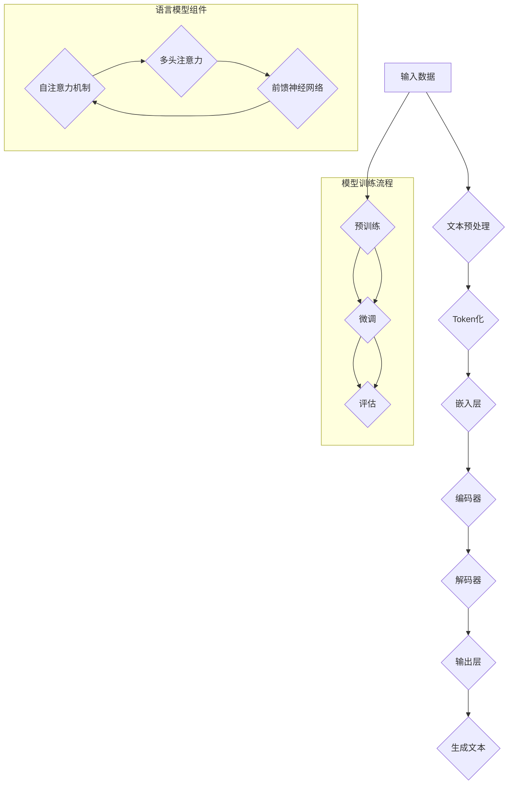

                 

# 引言

随着人工智能技术的迅猛发展，语言生成模型（Language-Learning Models，简称LLM）在各个行业中的应用潜力日益凸显。LLM作为一种能够理解和生成自然语言的人工智能模型，已经展现出在诸多领域中的强大应用能力。本篇文章将围绕LLM在各行业中的潜在应用，进行深入的分析和探讨。

首先，本文将介绍LLM的基本概念、发展历史及其在各行业的应用现状。在此基础上，我们将详细讨论LLM的技术基础，包括语言模型原理、关键技术和训练优化方法。随后，本文将重点分析LLM在金融、医疗、教育、传媒、法律以及人工智能等行业中的应用潜力，并结合实际案例进行讲解。最后，本文将对LLM的未来发展前景进行展望，并总结本文的核心观点和结论。

本篇文章将遵循逻辑清晰、结构紧凑、简单易懂的原则，以专业的技术语言和细致的案例分析，帮助读者全面了解LLM在各行业应用中的巨大潜力。希望通过本文的分享，能够激发更多从业者对LLM技术的关注和研究，共同推动人工智能技术在各行各业的创新应用。

## 第1章: LLM概述与背景

### 1.1 LLM的基本概念

语言生成模型（Language-Learning Models，简称LLM）是一种专门用于理解和生成自然语言的人工智能模型。LLM的核心目标是通过学习大量的语言数据，实现对人类语言的深刻理解和灵活运用。具体来说，LLM能够完成以下任务：

1. **语言理解**：LLM可以理解文本、语音和图像等多种形式的语言输入，并提取出输入内容的语义信息。
2. **语言生成**：LLM能够根据给定的上下文或提示，生成符合语法和语义规则的自然语言文本。
3. **语言翻译**：LLM可以基于源语言和目标语言之间的映射关系，实现语言之间的翻译。
4. **问答系统**：LLM能够回答基于文本的问题，提供准确和有价值的答案。

LLM的基本概念主要包括以下几个核心组成部分：

- **词汇表**：LLM通过学习大量文本数据，建立起一个庞大的词汇表，用于表示语言中的单词、短语和句子。
- **上下文**：LLM在处理输入文本时，需要考虑上下文信息，以便更准确地理解文本内容和生成合适的输出。
- **神经网络**：LLM通常基于神经网络架构，通过多层非线性变换和参数化模型，实现对语言数据的自动学习和建模。

### 1.2 LLM的发展历史

LLM的发展历程可以追溯到20世纪80年代，当时研究人员开始探索如何利用计算机模拟人类语言能力。以下是LLM发展过程中的一些关键事件：

- **20世纪80年代**：早期LLM研究主要集中在基于规则的方法，如语法分析和句法解析，试图通过手工编写规则来模拟自然语言处理能力。
- **20世纪90年代**：随着统计语言模型（Statistical Language Model）的出现，LLM开始转向基于统计学习的方法，通过分析大量语料库数据来训练模型，提高了语言处理的效果。
- **21世纪初**：深度学习技术的兴起为LLM的发展带来了新的契机。基于神经网络的深度学习模型，如循环神经网络（RNN）和长短时记忆网络（LSTM），在语言生成和语言理解任务上取得了显著的成果。
- **2018年**：谷歌推出BERT（Bidirectional Encoder Representations from Transformers），标志着预训练语言模型（Pre-trained Language Model）的兴起。BERT通过在大量无标签文本上进行预训练，再在特定任务上进行微调，取得了超越传统模型的表现。
- **2022年**：OpenAI发布GPT-3（Generative Pre-trained Transformer 3），进一步推动了LLM的发展。GPT-3具有强大的文本生成能力，可以生成高质量的文章、代码和对话，引起了广泛关注。

### 1.3 LLM在各行业的应用现状

LLM在各个行业中的应用已经越来越广泛，以下是一些典型应用场景：

1. **金融行业**：LLM被用于金融风险控制、市场预测和客户服务等领域。例如，通过分析大量的金融文本数据，LLM可以识别潜在的风险因素，并提供实时的预警信息。
2. **医疗行业**：LLM在医疗诊断、科研和健康管理方面发挥着重要作用。例如，LLM可以分析医疗文本数据，辅助医生进行疾病诊断和治疗方案推荐。
3. **教育行业**：LLM被用于个性化学习、教育辅导和资源共享等领域。例如，LLM可以根据学生的学习情况和需求，生成个性化的学习资源和辅导材料。
4. **传媒行业**：LLM在新闻写作、内容创作和媒体运营中具有广泛应用。例如，LLM可以生成新闻报道、文章和广告文案，提高内容生产效率。
5. **法律行业**：LLM被用于法律研究、咨询和智能审判等领域。例如，LLM可以分析大量的法律文本数据，提供法律咨询意见和智能审判决策支持。

### 1.4 LLM的潜力和前景

LLM在各个行业中的应用潜力巨大，未来有望实现以下突破：

1. **提高生产效率**：LLM可以自动化许多重复性工作，提高生产效率和准确性。例如，在金融行业中，LLM可以自动化市场分析和客户服务，减少人力成本。
2. **提升用户体验**：LLM可以提供个性化、智能化的服务，提升用户满意度和忠诚度。例如，在教育行业中，LLM可以根据学生的学习情况和需求，提供个性化的学习资源和辅导。
3. **创新应用场景**：随着LLM技术的不断进步，新的应用场景将不断涌现。例如，在医疗行业中，LLM可以用于基因编辑和精准医疗，为人类健康带来更多创新。
4. **跨行业融合**：LLM有望在不同行业之间实现跨行业融合，形成新的产业生态。例如，在金融和医疗行业中，LLM可以协同工作，实现金融医疗大数据的分析和决策支持。

总之，LLM作为一种强大的自然语言处理工具，具有广泛的应用前景。随着技术的不断发展和创新，LLM将在未来为各行各业带来更多的机遇和变革。

### 1.5 LLM的关键挑战与未来发展

尽管LLM在各个行业中的应用前景广阔，但其发展过程中仍面临诸多挑战。以下是对这些挑战的详细分析以及未来发展的潜在方向：

#### 数据隐私和安全

LLM的训练和优化需要大量高质量的文本数据，而这些数据往往涉及用户隐私和商业秘密。如何确保数据的安全性和隐私性是一个亟待解决的问题。未来的发展方向可能包括：

- **数据加密**：采用先进的数据加密技术，保护数据在传输和存储过程中的安全。
- **隐私保护技术**：利用差分隐私（Differential Privacy）等技术，在数据分析和模型训练过程中保护用户隐私。
- **数据共享协议**：建立数据共享机制，确保数据在合法和安全的范围内共享和利用。

#### 模型可解释性和透明性

LLM的决策过程高度复杂，往往难以解释其背后的原因。这给模型的可靠性带来了挑战，特别是在涉及关键决策的场景中。为了提高模型的可解释性和透明性，可以采取以下措施：

- **可解释性工具**：开发可解释性工具，如可视化分析和决策路径追踪，帮助用户理解模型的决策过程。
- **模型审计**：建立模型审计机制，对模型进行定期审查和评估，确保其遵循既定的伦理和法律标准。
- **透明度协议**：公开模型的设计、训练数据和决策过程，提高模型的透明度和公信力。

#### 多语言和跨语言支持

尽管现有的LLM模型已经在多语言和跨语言处理方面取得了显著进展，但仍然存在一些瓶颈。未来的发展方向包括：

- **多语言模型**：开发支持多种语言训练和生成的多语言模型，实现更广泛的跨语言应用。
- **跨语言转移学习**：利用跨语言转移学习技术，提高模型在不同语言间的迁移能力。
- **语言资源丰富**：积累和整理更多的多语言数据资源，为模型训练提供支持。

#### 硬件和计算资源需求

LLM的训练和优化过程对计算资源有较高要求，需要大量的计算能力和存储空间。为了满足这一需求，可以采取以下措施：

- **分布式计算**：利用分布式计算框架，将训练任务分配到多个计算节点，提高计算效率。
- **高效算法**：开发高效的模型训练和优化算法，减少计算资源的需求。
- **硬件升级**：投资于高性能计算硬件，如GPU和TPU，以满足大规模训练和优化的需求。

#### 模型适应性和鲁棒性

LLM在面对未知和复杂的环境时，往往表现出较低的适应性和鲁棒性。为了提高模型的适应性和鲁棒性，可以采取以下策略：

- **强化学习**：结合强化学习技术，提高模型在动态和不确定环境中的适应能力。
- **对抗训练**：通过对抗训练方法，提高模型对异常和恶意输入的鲁棒性。
- **迁移学习**：利用迁移学习技术，提高模型在新任务上的适应能力。

总之，LLM的发展面临诸多挑战，但同时也充满机遇。通过不断的技术创新和行业合作，LLM有望在未来实现更广泛的应用，为各行各业带来深远的变革。

### 1.6 LLM的技术基础

要深入探讨LLM在各行业中的应用潜力，首先需要了解LLM的技术基础。LLM的核心在于其语言模型原理、关键技术和训练与优化方法。以下是对这些核心概念的详细解析。

#### 语言模型原理

语言模型（Language Model）是LLM的基础，其核心目标是预测下一个单词或词组。语言模型通常基于概率模型或生成模型，通过学习大量语言数据，建立输入序列和输出序列之间的概率分布。以下是几种常见的语言模型原理：

1. **N元语法（N-gram Model）**：N元语法是最早的语言模型之一，它通过统计相邻N个单词的出现频率来预测下一个单词。例如，三元语法（Trigram Model）考虑前两个单词的历史信息，来预测第三个单词。

   伪代码：
   ```python
   def predict_next_word(current_sequence):
       # 获取当前序列的历史信息
       history = current_sequence[-3:]
       # 计算下一个单词的概率分布
       probabilities = calculate_probabilities(history)
       # 选择概率最高的单词作为预测结果
       next_word = select_word_with_highest_probability(probabilities)
       return next_word
   ```

2. **神经网络语言模型（Neural Network Language Model）**：基于深度学习技术的神经网络语言模型，通过多层神经网络结构，对语言数据进行自动学习和建模。常见的神经网络语言模型包括循环神经网络（RNN）和长短时记忆网络（LSTM）。

   伪代码：
   ```python
   def neural_network_language_model(inputs):
       # 输入嵌入层
       embeddings = embedding_layer(inputs)
       # 循环神经网络层
       outputs, states = lstm_layer(embeddings)
       # 输出层
       logits = output_layer(states)
       # 预测下一个单词的概率分布
       probabilities = softmax(logits)
       return probabilities
   ```

3. **Transformer模型**：Transformer模型是当前最先进的语言模型之一，其核心思想是使用自注意力机制（Self-Attention）来建模输入序列中的长距离依赖关系。Transformer模型包括编码器（Encoder）和解码器（Decoder），分别用于处理输入和输出序列。

   伪代码：
   ```python
   def transformer_model(inputs, targets):
       # 编码器
       encoder_outputs = encoder(inputs)
       # 解码器
       decoder_outputs = decoder(targets, encoder_outputs)
       # 输出层
       logits = output_layer(decoder_outputs)
       # 预测下一个单词的概率分布
       probabilities = softmax(logits)
       return probabilities
   ```

#### LLM的关键技术

1. **预训练（Pre-training）**：预训练是指利用大规模无标签语料库，对LLM进行初步训练，使其具备一定的语言理解能力和生成能力。预训练后的模型可以进一步在特定任务上进行微调，实现更好的性能。

   伪代码：
   ```python
   def pretrain_model(corpus):
       # 训练语言模型
       model = train_language_model(corpus)
       # 保存预训练模型
       save_model(model)
   ```

2. **微调（Fine-tuning）**：微调是指在预训练的基础上，对LLM进行特定任务的数据集进行训练，使其适应特定领域的语言特点和任务需求。微调可以显著提高LLM在特定任务上的性能。

   伪代码：
   ```python
   def fine_tune_model(model, dataset):
       # 加载预训练模型
       model = load_pretrained_model(model)
       # 在特定任务数据集上微调模型
       model = train_model_on_dataset(model, dataset)
       # 保存微调后的模型
       save_fine_tuned_model(model)
   ```

3. **多任务学习（Multi-task Learning）**：多任务学习是指同时训练多个相关任务，以提高LLM的泛化能力和适应能力。多任务学习可以共享模型参数，减少训练时间，同时提高模型的性能。

   伪代码：
   ```python
   def multi_task_learning(models, datasets):
       # 分别训练每个任务
       for model, dataset in zip(models, datasets):
           model = train_model(model, dataset)
       # 共享模型参数
       model = merge_models(models)
       # 综合训练
       model = train_combined_model(model)
   ```

#### LLM的训练与优化

LLM的训练和优化是一个复杂的过程，需要大量的计算资源和优化策略。以下是几种常见的训练和优化方法：

1. **批量训练（Batch Training）**：批量训练是指在每次梯度更新时，使用多个样本进行训练。批量训练可以减少梯度消失和梯度爆炸问题，提高模型的稳定性和收敛速度。

   伪代码：
   ```python
   def batch_training(model, dataset, batch_size):
       for batch in dataset.batch(batch_size):
           # 计算梯度
           gradients = compute_gradients(model, batch)
           # 更新模型参数
           update_model_params(model, gradients)
   ```

2. **优化算法（Optimization Algorithms）**：优化算法用于调整模型参数，以最小化损失函数。常见的优化算法包括随机梯度下降（SGD）、Adam和RMSProp等。

   伪代码：
   ```python
   def optimize_model(model, optimizer, loss_function):
       for inputs, targets in dataset:
           # 计算损失
           loss = loss_function(model(inputs), targets)
           # 计算梯度
           gradients = compute_gradients(model, inputs, targets)
           # 更新模型参数
           optimizer.update(model_params, gradients)
   ```

3. **正则化（Regularization）**：正则化是一种防止模型过拟合的方法，通过在损失函数中添加惩罚项，限制模型参数的增长。常见的正则化方法包括L1正则化和L2正则化。

   伪代码：
   ```python
   def regularized_loss(loss, model, regularization_strength):
       l2_regularization = regularization_strength * sum(model_params ** 2)
       return loss + l2_regularization
   ```

4. **学习率调整（Learning Rate Scheduling）**：学习率调整是优化模型的重要策略，通过动态调整学习率，提高模型的收敛速度和稳定性。常见的调整方法包括固定学习率、学习率衰减和学习率预热。

   伪代码：
   ```python
   def adjust_learning_rate(optimizer, current_step, total_steps):
       if current_step < warmup_steps:
           learning_rate = current_step / warmup_steps * initial_learning_rate
       else:
           learning_rate = initial_learning_rate * decay_rate ** (current_step / total_steps)
       optimizer.learning_rate = learning_rate
   ```

综上所述，LLM的技术基础包括语言模型原理、关键技术和训练与优化方法。通过对这些技术深入理解和应用，LLM在各行业中的潜力将得到充分发挥。在下一章中，我们将进一步探讨LLM在金融、医疗、教育等行业的具体应用案例。

### 1.7 开源LLM框架与工具

随着LLM技术的发展，许多开源框架和工具应运而生，为研究人员和开发者提供了丰富的资源和工具。以下是一些主流的LLM开源框架和工具，以及它们的特点和应用场景：

#### 1.1 BERT（Bidirectional Encoder Representations from Transformers）

BERT是由Google提出的一种预训练语言模型，它采用双向Transformer架构，通过在大量无标签文本上进行预训练，再在特定任务上进行微调，取得了优异的性能。BERT的特点是能够捕捉词的上下文信息，适用于各种自然语言处理任务，如文本分类、命名实体识别和问答系统。

**应用场景**：BERT在金融、医疗、法律和教育等行业中都有广泛应用。例如，在金融行业，BERT可以用于股票市场分析、金融文本分类和风险评估；在医疗行业，BERT可以用于疾病诊断、医学文本挖掘和药物研发；在法律行业，BERT可以用于法律文本分类、合同分析和法律咨询。

**使用方法**：BERT的使用通常包括以下几个步骤：

1. **下载预训练模型**：可以从[BERT模型仓库](https://github.com/google-research/bert)下载预训练模型。
2. **安装transformers库**：使用pip安装transformers库，例如：
   ```bash
   pip install transformers
   ```
3. **加载预训练模型**：使用transformers库加载预训练模型：
   ```python
   from transformers import BertModel
   model = BertModel.from_pretrained('bert-base-uncased')
   ```

#### 1.2 GPT-3（Generative Pre-trained Transformer 3）

GPT-3是由OpenAI发布的一种强大的预训练语言模型，它具有1750亿个参数，可以生成高质量的文章、代码和对话。GPT-3的特点是具有强大的文本生成能力，适用于自动写作、对话系统和内容创作等领域。

**应用场景**：GPT-3在新闻写作、内容创作、客户服务和创意设计等领域具有广泛的应用。例如，在新闻写作中，GPT-3可以生成新闻摘要和报道；在内容创作中，GPT-3可以生成文章、故事和广告文案；在客户服务中，GPT-3可以生成自动回复和聊天机器人。

**使用方法**：GPT-3的使用通常包括以下几个步骤：

1. **申请API访问权限**：需要从OpenAI官网申请GPT-3的API访问权限。
2. **调用API接口**：使用GPT-3的API进行文本生成，例如：
   ```python
   import openai
   response = openai.Completion.create(
     engine="text-davinci-002",
     prompt="请写一篇关于人工智能的新闻报道。",
     max_tokens=100
   )
   print(response.choices[0].text.strip())
   ```

#### 1.3 T5（Text-To-Text Transfer Transformer）

T5是由Google提出的一种统一的文本处理模型，它将各种自然语言处理任务转换为统一的“文本到文本”的预测任务。T5的特点是具有高度的可扩展性和灵活性，适用于多种文本处理任务，如文本分类、文本生成和机器翻译。

**应用场景**：T5在金融、医疗、教育和法律等行业中都有广泛应用。例如，在金融行业，T5可以用于文本分类、情感分析和股票市场预测；在医疗行业，T5可以用于医学文本挖掘和疾病诊断；在教育行业，T5可以用于个性化学习和教育辅导。

**使用方法**：T5的使用通常包括以下几个步骤：

1. **下载预训练模型**：可以从[T5模型仓库](https://github.com/google-research/t5)下载预训练模型。
2. **安装transformers库**：使用pip安装transformers库。
3. **加载预训练模型**：使用transformers库加载预训练模型：
   ```python
   from transformers import T5ForConditionalGeneration
   model = T5ForConditionalGeneration.from_pretrained('t5-base')
   ```

#### 1.4 RoBERTa（A Robustly Optimized BERT Pretraining Approach）

RoBERTa是Facebook提出的一种改进的BERT预训练方法，它通过引入一系列技术改进，如动态掩码比率、更多数据集和更长的训练时间，提高了模型的性能。RoBERTa的特点是具有更高的准确性和更强的泛化能力，适用于各种自然语言处理任务。

**应用场景**：RoBERTa在金融、医疗、教育和法律等行业中都有广泛应用。例如，在金融行业，RoBERTa可以用于文本分类、风险分析和金融市场预测；在医疗行业，RoBERTa可以用于医学文本挖掘和疾病诊断；在教育行业，RoBERTa可以用于个性化学习和教育辅导。

**使用方法**：RoBERTa的使用通常包括以下几个步骤：

1. **下载预训练模型**：可以从[RoBERTa模型仓库](https://github.com/facebookresearch/roberta)下载预训练模型。
2. **安装transformers库**：使用pip安装transformers库。
3. **加载预训练模型**：使用transformers库加载预训练模型：
   ```python
   from transformers import RobertaModel
   model = RobertaModel.from_pretrained('roberta-base')
   ```

#### 1.5 Alpaca（A Language-Conditional Pre-Trained Transformer Model）

Alpaca是由Tsinghua University和Microsoft Research提出的一种预训练语言模型，它通过在大量文本和数据上进行预训练，提高了模型在特定领域和任务上的性能。Alpaca的特点是具有语言条件性，能够在特定领域内生成高质量的自然语言文本。

**应用场景**：Alpaca在金融、医疗、教育和法律等行业中都有广泛应用。例如，在金融行业，Alpaca可以用于金融文本生成、风险分析和投资建议；在医疗行业，Alpaca可以用于医学文本生成、疾病诊断和药物研发；在教育行业，Alpaca可以用于教育文本生成、个性化学习和教育辅导。

**使用方法**：Alpaca的使用通常包括以下几个步骤：

1. **下载预训练模型**：可以从[Alpaca模型仓库](https://github.com/TsinghuaSESG/Alpaca-LLaMA)下载预训练模型。
2. **安装transformers库**：使用pip安装transformers库。
3. **加载预训练模型**：使用transformers库加载预训练模型：
   ```python
   from transformers import AutoModelForSeq2SeqLM
   model = AutoModelForSeq2SeqLM.from_pretrained('tsinghua-se/kgbream-mtl')
   ```

通过上述开源LLM框架和工具，研究人员和开发者可以更加方便地构建和部署自己的LLM应用。这些工具不仅提供了强大的语言处理能力，还通过预训练和微调技术，降低了模型训练的复杂度和门槛。随着LLM技术的不断发展，我们将看到更多创新和应用的涌现，为各行各业带来更多机遇和变革。

### 第2章: LLM技术基础

#### 2.1 语言模型原理

语言模型是LLM的核心，其基本原理是通过学习大量的语言数据，预测下一个单词或词组。以下是几种常见的语言模型原理：

1. **N元语法（N-gram Model）**：N元语法是最早的语言模型之一，通过统计相邻N个单词的出现频率来预测下一个单词。例如，三元语法（Trigram Model）考虑前两个单词的历史信息，来预测第三个单词。这种模型简单高效，但存在局限性，如无法捕捉长距离依赖关系。

2. **神经网络语言模型（Neural Network Language Model）**：基于深度学习技术的神经网络语言模型，通过多层神经网络结构，对语言数据进行自动学习和建模。常见的神经网络语言模型包括循环神经网络（RNN）和长短时记忆网络（LSTM）。RNN和LSTM能够捕捉长距离依赖关系，但训练过程复杂，容易出现梯度消失问题。

3. **Transformer模型**：Transformer模型是当前最先进的语言模型之一，其核心思想是使用自注意力机制（Self-Attention）来建模输入序列中的长距离依赖关系。Transformer模型包括编码器（Encoder）和解码器（Decoder），分别用于处理输入和输出序列。Transformer通过并行计算和多头注意力机制，提高了计算效率和模型性能。

#### 2.2 LLM的关键技术

1. **预训练（Pre-training）**：预训练是指利用大规模无标签语料库，对LLM进行初步训练，使其具备一定的语言理解能力和生成能力。预训练后的模型可以进一步在特定任务上进行微调，实现更好的性能。预训练方法包括自注意力机制、多层神经网络和双向编码器等。

2. **微调（Fine-tuning）**：微调是指在预训练的基础上，对LLM进行特定任务的数据集进行训练，使其适应特定领域的语言特点和任务需求。微调可以显著提高LLM在特定任务上的性能。微调方法包括调整学习率、批量大小和训练迭代次数等。

3. **多任务学习（Multi-task Learning）**：多任务学习是指同时训练多个相关任务，以提高LLM的泛化能力和适应能力。多任务学习可以共享模型参数，减少训练时间，同时提高模型的性能。多任务学习方法包括共享嵌入层、共享编码器和解码器等。

4. **数据增强（Data Augmentation）**：数据增强是指通过增加数据多样性，提高模型对未知数据的适应能力。数据增强方法包括文本翻译、同义词替换、词干提取和句子重排等。

#### 2.3 LLM的训练与优化

LLM的训练和优化是一个复杂的过程，需要大量的计算资源和优化策略。以下是几种常见的训练和优化方法：

1. **批量训练（Batch Training）**：批量训练是指在每次梯度更新时，使用多个样本进行训练。批量训练可以减少梯度消失和梯度爆炸问题，提高模型的稳定性和收敛速度。

2. **优化算法（Optimization Algorithms）**：优化算法用于调整模型参数，以最小化损失函数。常见的优化算法包括随机梯度下降（SGD）、Adam和RMSProp等。

3. **正则化（Regularization）**：正则化是一种防止模型过拟合的方法，通过在损失函数中添加惩罚项，限制模型参数的增长。常见的正则化方法包括L1正则化和L2正则化。

4. **学习率调整（Learning Rate Scheduling）**：学习率调整是优化模型的重要策略，通过动态调整学习率，提高模型的收敛速度和稳定性。常见的调整方法包括固定学习率、学习率衰减和学习率预热。

#### 2.4 模型评估与优化

1. **模型评估（Model Evaluation）**：模型评估是评估模型性能的重要步骤。常见的评估指标包括准确率、召回率、F1分数和损失函数值等。

2. **模型优化（Model Optimization）**：模型优化是指通过调整模型参数和训练策略，提高模型性能。模型优化方法包括超参数调整、模型压缩和剪枝等。

3. **持续学习（Continual Learning）**：持续学习是指模型在训练过程中不断学习和适应新数据，以提高模型鲁棒性和泛化能力。

4. **迁移学习（Transfer Learning）**：迁移学习是指将预训练模型迁移到新任务上，通过微调和优化，实现更好的性能。

通过以上技术基础，LLM在各个行业中的应用潜力将得到充分发挥。在下一章中，我们将深入探讨LLM在金融、医疗、教育等行业的具体应用案例。

### 2.4 模型评估与优化方法

在LLM的开发和应用过程中，模型评估与优化是至关重要的一环。有效的模型评估可以帮助我们衡量模型的性能，而合理的优化方法则能够提升模型的效果。以下是几种常见的模型评估与优化方法：

#### 模型评估

1. **准确率（Accuracy）**：准确率是衡量模型分类性能的基本指标，表示模型正确分类的样本占总样本的比例。对于多类分类问题，准确率反映了模型识别不同类别的能力。

   公式：
   $$ 
   Accuracy = \frac{True Positives + True Negatives}{Total Samples}
   $$

2. **召回率（Recall）**：召回率表示模型在所有实际正例中识别出的比例。召回率越高，模型对于正例的识别能力越强。

   公式：
   $$ 
   Recall = \frac{True Positives}{True Positives + False Negatives}
   $$

3. **F1分数（F1 Score）**：F1分数是准确率和召回率的调和平均数，综合考虑了模型的精确性和鲁棒性。

   公式：
   $$ 
   F1 Score = 2 \times \frac{Precision \times Recall}{Precision + Recall}
   $$

4. **损失函数（Loss Function）**：在训练过程中，损失函数用于衡量模型预测值与真实值之间的差距。常见的损失函数包括交叉熵损失（Cross-Entropy Loss）、均方误差（Mean Squared Error）和对抗损失（Adversarial Loss）等。

5. **ROC曲线（ROC Curve）和AUC值（AUC Score）**：ROC曲线展示了模型在不同阈值下的真阳性率（True Positive Rate）和假阳性率（False Positive Rate）的关系。AUC值是ROC曲线下的面积，反映了模型的分类能力。

#### 模型优化

1. **超参数调整（Hyperparameter Tuning）**：超参数是模型训练过程中的关键参数，如学习率、批量大小、隐藏层大小等。通过调整超参数，可以优化模型性能。常用的超参数调整方法包括随机搜索（Random Search）、网格搜索（Grid Search）和贝叶斯优化（Bayesian Optimization）。

2. **模型压缩（Model Compression）**：模型压缩是指通过降低模型参数数量和计算复杂度，提高模型的压缩率和计算效率。常见的模型压缩方法包括剪枝（Pruning）、量化（Quantization）和蒸馏（Distillation）等。

3. **剪枝（Pruning）**：剪枝是通过删除模型中的冗余或低贡献参数，减少模型体积和计算复杂度。剪枝方法包括权重剪枝（Weight Pruning）、结构剪枝（Structure Pruning）和稀疏性剪枝（Sparsity Pruning）等。

4. **量化（Quantization）**：量化是将模型的浮点参数转换为低比特宽度的整数表示，以降低计算复杂度和存储需求。量化方法包括全精度量化（Full Precision Quantization）、低精度量化（Low Precision Quantization）和自适应量化（Adaptive Quantization）等。

5. **蒸馏（Distillation）**：蒸馏是通过将一个复杂模型（教师模型）的知识传递给一个更简单的模型（学生模型），以提高学生模型的效果。蒸馏方法包括软标签蒸馏（Soft Label Distillation）、硬标签蒸馏（Hard Label Distillation）和知识蒸馏（Knowledge Distillation）等。

#### 案例分析

以下是一个金融风险预测的案例，展示如何应用上述评估与优化方法：

1. **数据准备**：收集金融交易数据，包括交易金额、交易时间、交易者特征等。

2. **模型训练**：使用BERT模型进行预训练，并在金融风险预测任务上进行微调。

3. **模型评估**：使用准确率、召回率和F1分数等指标评估模型性能。

4. **优化策略**：
   - 调整超参数：通过网格搜索调整学习率和批量大小。
   - 剪枝和量化：对模型进行剪枝和量化，以降低计算复杂度和存储需求。
   - 蒸馏：将教师模型（大型BERT模型）的知识传递给学生模型（小型BERT模型），以提高学生模型的预测性能。

5. **结果分析**：通过对比不同优化策略的效果，选择最佳策略，并评估模型在验证集和测试集上的性能。

通过以上方法，我们可以在金融风险预测任务中实现高效的模型评估和优化，从而提高模型的预测准确性和实用性。在下一章中，我们将进一步探讨LLM在金融、医疗、教育等行业的具体应用案例。

### 第3章: LLM在金融行业的应用潜力

金融行业作为全球经济发展的重要支柱，对数据分析和决策支持的需求极为迫切。LLM在金融行业的应用，不仅提升了数据处理和分析的效率，还带来了业务模式和服务方式的革新。以下将详细探讨LLM在金融行业中的三大关键应用：金融风险控制、金融市场预测和金融客户服务。

#### 3.1 LLM在金融风险控制中的应用

金融风险控制是金融行业的重要任务，涉及到风险评估、违约预测和信用评级等方面。LLM在金融风险控制中的应用，主要体现在以下几个方面：

1. **文本分析**：LLM可以处理大量文本数据，如新闻报道、社交媒体评论、金融报告等，提取潜在的风险信号。通过对这些文本数据的分析和挖掘，LLM可以识别出市场趋势、政策变化和公司经营风险。

2. **情感分析**：LLM通过情感分析技术，可以判断文本的情感倾向，从而预测市场情绪。例如，在股票市场中，积极的市场情绪可能导致股价上涨，而消极的市场情绪则可能导致股价下跌。LLM可以实时分析社交媒体和新闻报道中的情绪变化，为投资者提供决策参考。

3. **违约预测**：LLM可以通过学习历史违约数据，建立违约预测模型。这些模型可以分析借款人的财务状况、信用历史和市场环境，预测借款人违约的可能性。例如，在信用评级中，LLM可以评估借款人的信用风险，为银行和金融机构提供信用决策支持。

4. **欺诈检测**：LLM可以用于检测金融交易中的欺诈行为。通过分析交易数据，LLM可以识别出异常交易模式，如洗钱、信用卡欺诈和保险欺诈等。这些检测模型可以提高金融机构的风险管理水平，减少金融损失。

#### 3.2 LLM在金融市场预测中的应用

金融市场预测是金融行业的研究热点之一，LLM在金融市场预测中的应用，为投资者提供了更加精准和及时的预测工具。以下是LLM在金融市场预测中的几个应用场景：

1. **股票市场预测**：LLM可以通过分析历史股票价格数据、市场新闻和分析师报告，预测股票市场的走势。例如，通过分析市场情绪和基本面数据，LLM可以预测股票价格的涨跌幅度和方向。

2. **汇率预测**：LLM可以用于预测外汇市场的汇率变化。通过对经济数据、政策变化和市场新闻的分析，LLM可以预测汇率走势，为企业和个人投资者提供汇率风险管理策略。

3. **期权定价**：LLM在期权定价中也有重要应用。通过分析市场波动率、利率和风险偏好等参数，LLM可以预测期权的合理价格，为投资者提供交易策略。

4. **宏观经济预测**：LLM可以分析大量的经济数据，如GDP、通货膨胀率、就业率等，预测宏观经济走势。这些预测结果可以为政府、企业和投资者提供决策参考。

#### 3.3 LLM在金融客户服务中的应用

金融客户服务是金融机构与客户互动的重要渠道，LLM在金融客户服务中的应用，极大地提升了客户服务的效率和质量。以下是LLM在金融客户服务中的几个应用场景：

1. **智能客服**：LLM可以构建智能客服系统，通过自然语言处理技术，自动回答客户的常见问题。这些客服系统可以处理大量的客户咨询，提高客服响应速度，减少人力成本。

2. **个性化推荐**：LLM可以分析客户的交易记录、投资偏好和市场动态，提供个性化的金融产品推荐。例如，在理财产品推荐中，LLM可以根据客户的风险承受能力和投资目标，推荐合适的理财产品。

3. **风险预警**：LLM可以实时监测市场风险，为客户提供风险预警服务。例如，在股票投资中，LLM可以分析股票的财务状况、市场情绪和行业趋势，为投资者提供潜在的风险信号。

4. **投资建议**：LLM可以分析市场数据和客户投资记录，提供投资建议。这些建议可以基于定量分析（如技术指标、基本面分析）和定性分析（如市场情绪、政策变化），帮助投资者做出更明智的投资决策。

#### 案例分析

以下是一个股票市场预测的案例，展示LLM在金融市场预测中的应用：

1. **数据来源**：收集历史股票价格数据、市场新闻、分析师报告和社交媒体评论。

2. **数据预处理**：对文本数据进行清洗和预处理，包括去除停用词、词干提取和词向量化等。

3. **模型训练**：使用预训练的LLM模型，如BERT或GPT，对文本数据进行微调，使其适应股票市场预测任务。

4. **预测模型**：构建基于LLM的预测模型，结合定量和定性分析，预测股票价格的未来走势。

5. **评估与优化**：使用交叉验证和回测等方法，评估预测模型的性能。根据评估结果，调整模型参数和特征选择，优化模型效果。

6. **应用**：将预测模型应用于实际投资场景，为投资者提供股票市场预测服务。

通过以上案例，我们可以看到LLM在金融行业中的广泛应用和巨大潜力。随着技术的不断进步，LLM将在金融风险管理、市场预测和客户服务等方面发挥更加重要的作用，为金融行业的数字化转型和创新发展提供强有力的支持。

### 第4章: LLM在医疗行业的应用潜力

医疗行业作为人类健康和福祉的重要领域，对高效的数据处理和智能决策支持有着极高的需求。LLM在医疗行业的应用，不仅提升了医疗数据分析和决策的效率，还为医疗诊断、科研和健康管理等方面带来了创新性的变革。以下将详细探讨LLM在医疗行业的三大关键应用：医疗诊断、医疗科研和医疗健康管理。

#### 4.1 LLM在医疗诊断中的应用

医疗诊断是医疗行业的核心任务，涉及到疾病的识别、病情评估和治疗方案的推荐。LLM在医疗诊断中的应用，主要体现在以下几个方面：

1. **医学文本分析**：LLM可以处理大量的医学文本数据，如病历、医学报告、诊断记录等，提取关键信息并进行结构化处理。通过对这些文本数据的多维度分析，LLM可以辅助医生进行疾病诊断和病情评估。

2. **症状识别**：LLM通过学习大量的医学文本数据，可以识别患者症状，并将其与疾病数据库进行匹配，从而为医生提供初步的诊断建议。例如，通过分析患者的症状描述，LLM可以判断患者可能患有某种疾病，帮助医生进行进一步的诊断。

3. **疾病预测**：LLM可以通过分析患者的医疗历史和基因数据，预测患者未来可能患有的疾病。这种预测能力可以帮助医生提前采取预防措施，降低疾病发病风险。

4. **辅助决策**：LLM可以辅助医生制定治疗方案，通过分析患者的病情、药物反应和历史病例，提供合理的治疗方案建议。例如，在癌症治疗中，LLM可以根据患者的基因信息和病史，推荐最佳的治疗方案。

#### 4.2 LLM在医疗科研中的应用

医疗科研是推动医学进步的重要力量，LLM在医疗科研中的应用，为研究人员提供了强大的数据分析工具。以下是LLM在医疗科研中的几个应用场景：

1. **文献挖掘**：LLM可以分析大量的医学文献，提取关键信息并进行结构化处理，帮助研究人员快速获取相关研究成果。例如，通过分析大量医学论文，LLM可以识别出研究热点和趋势，为研究人员提供研究方向。

2. **数据整合**：LLM可以整合不同来源的医学数据，如临床试验数据、基因组数据和环境数据等，为研究人员提供全面的数据视图。这种数据整合能力有助于揭示疾病发生的分子机制和影响因素。

3. **模型训练**：LLM可以用于训练医学预测模型，如疾病预测模型、药物疗效预测模型等。通过学习大量的医学数据，LLM可以建立高质量的预测模型，提高医学研究的准确性和效率。

4. **知识图谱构建**：LLM可以构建医学知识图谱，将医学知识进行结构化存储和关联。这种知识图谱可以帮助研究人员快速获取医学知识，提高研究效率和准确性。

#### 4.3 LLM在医疗健康管理中的应用

医疗健康管理是保障个人健康和生活质量的重要环节，LLM在医疗健康管理中的应用，为个体提供了智能化的健康管理服务。以下是LLM在医疗健康管理中的几个应用场景：

1. **健康数据分析**：LLM可以分析个人的健康数据，如体检报告、运动记录和饮食记录等，提供个性化的健康评估和改善建议。例如，通过分析个人的健康数据，LLM可以识别出健康风险因素，并提供相应的健康管理建议。

2. **智能问诊**：LLM可以构建智能问诊系统，通过自然语言处理技术，自动回答用户的健康咨询。这些系统可以处理大量的健康问题，提供专业的健康建议，提高用户健康素养。

3. **慢性病管理**：LLM可以辅助慢性病患者的自我管理，通过实时监测患者的健康数据，提供个性化的治疗建议和健康提醒。例如，在糖尿病管理中，LLM可以监测患者的血糖水平，提供合理的饮食和运动建议，帮助患者控制病情。

4. **个性化医疗**：LLM可以根据个体的基因数据、生活习惯和病史，提供个性化的医疗方案。这种个性化医疗方案有助于提高治疗效果，减少医疗资源浪费。

#### 案例分析

以下是一个慢性病管理的案例，展示LLM在医疗健康管理中的应用：

1. **数据来源**：收集患者的健康数据，包括血糖、血压、体重和运动记录等。

2. **数据预处理**：对健康数据进行清洗和标准化处理，包括缺失值填充、异常值处理和数据归一化等。

3. **模型训练**：使用预训练的LLM模型，如BERT或GPT，对健康数据进行微调，使其适应慢性病管理任务。

4. **健康管理模型**：构建基于LLM的慢性病管理模型，通过分析患者的健康数据，提供个性化的健康评估和改善建议。

5. **评估与优化**：使用交叉验证和用户反馈等方法，评估健康管理模型的效果。根据评估结果，调整模型参数和特征选择，优化模型性能。

6. **应用**：将健康管理模型应用于实际场景，为患者提供个性化的慢性病管理服务。

通过以上案例，我们可以看到LLM在医疗行业中的广泛应用和巨大潜力。随着技术的不断进步，LLM将在医疗诊断、科研和健康管理等方面发挥更加重要的作用，为医学进步和人类健康带来深远的变革。

### 第5章: LLM在教育行业的应用潜力

教育行业作为培养未来人才的重要领域，正经历着人工智能技术的深刻变革。LLM在教育行业的应用，不仅提升了教育的个性化和智能化水平，还为教育辅导、个性化学习和资源共享等方面带来了创新性的解决方案。以下将详细探讨LLM在教育行业的三大关键应用：教育辅导、个性化学习和教育资源管理。

#### 5.1 LLM在教育辅导中的应用

教育辅导是教育过程中至关重要的一环，LLM在教育辅导中的应用，极大地提高了辅导效率和质量。以下是LLM在教育辅导中的几个应用场景：

1. **个性化教学**：LLM可以根据学生的学习情况和需求，生成个性化的教学资源和辅导材料。通过分析学生的学习历史、成绩数据和提问内容，LLM可以推荐适合学生水平的学习内容，帮助教师制定个性化教学计划。

2. **实时答疑**：LLM可以构建智能答疑系统，通过自然语言处理技术，自动回答学生在学习过程中遇到的问题。这些系统可以处理大量的学生提问，提供即时的解答，提高学生的学习效率。

3. **辅助作业批改**：LLM可以自动批改学生的作业，提供详细的批改反馈和建议。通过分析学生的作业内容，LLM可以识别出学生的错误类型和知识点薄弱环节，帮助教师针对性地进行辅导。

4. **学习路径规划**：LLM可以根据学生的学习情况和目标，规划合适的学习路径。通过分析学生的学习进度、知识点掌握情况和兴趣点，LLM可以为学生推荐最佳的学习顺序和策略，提高学习效果。

#### 5.2 LLM在个性化学习中的应用

个性化学习是教育行业的重要发展趋势，LLM在个性化学习中的应用，为学习者提供了更加灵活和高效的学习体验。以下是LLM在个性化学习中的几个应用场景：

1. **学习内容推荐**：LLM可以根据学习者的兴趣、学习历史和知识点掌握情况，推荐适合的学习内容。通过分析学习者的学习行为和偏好，LLM可以生成个性化的学习资源推荐列表，帮助学习者高效地获取知识。

2. **学习进度跟踪**：LLM可以实时跟踪学习者的学习进度，分析学习效果和知识点掌握情况。通过分析学习数据，LLM可以识别出学习者的弱点和学习瓶颈，提供针对性的辅导和建议。

3. **学习效果评估**：LLM可以评估学习者的学习效果，生成学习报告和反馈。通过分析学习者的测试成绩、作业完成情况和学习行为，LLM可以评估学习者的知识点掌握情况，帮助教师和家长了解学习者的学习状况。

4. **学习策略调整**：LLM可以根据学习者的学习效果和反馈，动态调整学习策略。通过分析学习数据，LLM可以识别出有效的学习策略和方法，为学习者提供个性化的学习建议，提高学习效果。

#### 5.3 LLM在教育资源共享中的应用

教育资源共享是提升教育公平和效率的重要手段，LLM在教育资源共享中的应用，为教育资源的优化和分配提供了新思路。以下是LLM在教育资源共享中的几个应用场景：

1. **教育资源推荐**：LLM可以根据教师和学生的需求和偏好，推荐适合的教育资源。通过分析教育资源的内容、质量和使用情况，LLM可以生成教育资源推荐列表，帮助教师和学生高效地获取所需资源。

2. **教育资源整合**：LLM可以整合不同来源的教育资源，如教材、课件、视频和论文等，构建统一的教育资源库。通过分析教育资源的结构和内容，LLM可以为教师和学生提供一站式教育资源服务。

3. **教育资源优化**：LLM可以分析教育资源的利用情况和效果，优化教育资源的配置。通过分析教育资源的访问量、使用频率和用户评价，LLM可以识别出热门资源和冷门资源，提供资源优化建议。

4. **教育资源评价**：LLM可以评估教育资源的质量和适用性，提供教育资源的评价和推荐。通过分析教育资源的学术价值、实用性和用户体验，LLM可以为教师和学生提供教育资源评价和推荐服务。

#### 案例分析

以下是一个个性化学习的案例，展示LLM在教育辅导和个性化学习中的应用：

1. **数据来源**：收集学生的学习数据，包括成绩、作业、测试和提问等。

2. **数据预处理**：对学习数据进行分析和清洗，包括数据标准化、缺失值填充和异常值处理等。

3. **模型训练**：使用预训练的LLM模型，如BERT或GPT，对学习数据进行微调，使其适应个性化学习任务。

4. **个性化学习模型**：构建基于LLM的个性化学习模型，通过分析学习数据，为学习者提供个性化的学习资源和辅导建议。

5. **评估与优化**：使用交叉验证和用户反馈等方法，评估个性化学习模型的效果。根据评估结果，调整模型参数和特征选择，优化模型性能。

6. **应用**：将个性化学习模型应用于实际教学场景，为学习者提供个性化的学习体验和支持。

通过以上案例，我们可以看到LLM在教育行业中的广泛应用和巨大潜力。随着技术的不断进步，LLM将在教育辅导、个性化学习和教育资源管理等方面发挥更加重要的作用，为教育的创新和发展提供强有力的支持。

### 第6章: LLM在传媒行业的应用潜力

传媒行业作为信息传播的重要渠道，正面临着内容创作、新闻写作和媒体运营等方面的一系列挑战。LLM在传媒行业的应用，不仅提高了内容生产的效率和质量，还为内容个性化、新闻写作自动化和媒体运营智能化带来了全新的解决方案。以下将详细探讨LLM在传媒行业的三大关键应用：内容创作、新闻写作和媒体运营。

#### 6.1 LLM在内容创作中的应用

内容创作是传媒行业的基础，LLM在内容创作中的应用，为创作者提供了强大的辅助工具。以下是LLM在内容创作中的几个应用场景：

1. **创意写作**：LLM可以根据用户的主题和需求，生成创意性的文本内容。通过学习大量的文学、艺术和创意写作作品，LLM可以模仿不同风格和体裁的写作，为创作者提供灵感和素材。

2. **内容生成**：LLM可以自动化生成文章、故事、广告文案和营销材料等，提高内容生产的效率。例如，在广告行业中，LLM可以根据市场需求和用户偏好，生成个性化的广告文案，提高广告的转化率。

3. **内容优化**：LLM可以分析现有的内容，提供优化建议，提高内容的可读性和吸引力。通过分析文本的结构、语言和语义，LLM可以提出改进方案，帮助创作者提升内容质量。

4. **内容推荐**：LLM可以根据用户的历史行为和兴趣，推荐个性化的内容。通过分析用户的阅读记录、搜索历史和社交行为，LLM可以为用户提供个性化的内容推荐，提高用户满意度和留存率。

#### 6.2 LLM在新闻写作中的应用

新闻写作是传媒行业的重要环节，LLM在新闻写作中的应用，为新闻机构提供了自动化和智能化的解决方案。以下是LLM在新闻写作中的几个应用场景：

1. **自动化写作**：LLM可以自动化生成新闻报道、体育赛事综述和财经分析等，提高新闻生产的效率。通过分析大量的新闻报道数据，LLM可以生成结构化的新闻文本，减少人工写作的工作量。

2. **新闻摘要**：LLM可以生成新闻摘要，简化长篇报道，为用户节省阅读时间。通过分析新闻的核心内容，LLM可以提取关键信息，生成简洁明了的新闻摘要，提高新闻的可读性。

3. **事件追踪**：LLM可以实时监控新闻事件的发展，生成动态的跟踪报告。通过分析新闻报道的时间序列数据，LLM可以生成事件的发展趋势、关键节点和影响分析，为新闻机构提供全面的事件报道。

4. **观点评论**：LLM可以自动生成新闻评论和观点文章，为新闻机构提供多元化的观点。通过分析不同的观点和立场，LLM可以生成具有深度和广度的评论文章，丰富新闻内容的多样性。

#### 6.3 LLM在媒体运营中的应用

媒体运营是传媒行业的核心，LLM在媒体运营中的应用，为媒体机构提供了智能化的运营工具。以下是LLM在媒体运营中的几个应用场景：

1. **内容推荐**：LLM可以根据用户的兴趣和行为，推荐个性化的内容，提高用户留存率和阅读时长。通过分析用户的阅读历史、搜索记录和社交互动，LLM可以生成个性化内容推荐列表，提高内容营销的效果。

2. **广告投放**：LLM可以优化广告投放策略，提高广告的点击率和转化率。通过分析广告受众的特征和行为，LLM可以推荐合适的广告内容和投放渠道，提高广告的投资回报率。

3. **数据分析**：LLM可以分析大量的媒体数据，提供业务洞察和决策支持。通过分析用户行为、内容表现和运营效果，LLM可以为媒体机构提供数据驱动的运营策略，提高整体运营效率。

4. **智能客服**：LLM可以构建智能客服系统，通过自然语言处理技术，自动回答用户的咨询和反馈。这些系统可以处理大量的用户咨询，提高客服响应速度和用户体验。

#### 案例分析

以下是一个新闻写作的案例，展示LLM在新闻写作中的应用：

1. **数据来源**：收集新闻文本数据，包括新闻报道、时事评论和新闻摘要等。

2. **数据预处理**：对新闻文本进行清洗和预处理，包括去除停用词、标点符号和特殊字符等。

3. **模型训练**：使用预训练的LLM模型，如BERT或GPT，对新闻数据进行微调，使其适应新闻写作任务。

4. **新闻写作模型**：构建基于LLM的自动化新闻写作模型，通过分析新闻文本，生成结构化的新闻文本。

5. **评估与优化**：使用交叉验证和用户反馈等方法，评估新闻写作模型的效果。根据评估结果，调整模型参数和特征选择，优化模型性能。

6. **应用**：将新闻写作模型应用于实际新闻生产场景，自动生成新闻报道和新闻摘要，提高新闻写作的效率和准确性。

通过以上案例，我们可以看到LLM在传媒行业中的广泛应用和巨大潜力。随着技术的不断进步，LLM将在内容创作、新闻写作和媒体运营等方面发挥更加重要的作用，为传媒行业的创新和发展提供强有力的支持。

### 第7章: LLM在法律行业的应用潜力

法律行业作为维护社会公平和正义的重要领域，对高效的数据分析和智能决策支持有着极高的需求。LLM在法律行业的应用，不仅提升了法律文本分析和处理效率，还为法律研究、法律咨询和智能审判等方面带来了创新性的解决方案。以下将详细探讨LLM在法律行业的三大关键应用：法律研究、法律咨询和智能审判。

#### 7.1 LLM在法律研究中的应用

法律研究是法律行业的重要任务，涉及到法律文本的解析、法律条文的分析和法律案例的检索。LLM在法律研究中的应用，为研究人员提供了强大的工具。以下是LLM在法律研究中的几个应用场景：

1. **法律条文分析**：LLM可以处理大量的法律条文文本，提取关键信息并进行结构化处理。通过对法律条文的多维度分析，LLM可以帮助研究人员快速获取法律条文的核心内容和条款。

2. **法律案例检索**：LLM可以通过自然语言处理技术，对法律案例进行分类和检索。通过分析案例的标题、摘要和判决内容，LLM可以快速找到与特定法律问题相关的案例，为研究人员提供决策支持。

3. **法律文本生成**：LLM可以生成法律文本，如法律条文、判决书和合同等。通过学习大量的法律文本数据，LLM可以模仿法律文本的风格和格式，生成高质量的法律文本，提高法律文本的生产效率。

4. **法律知识图谱构建**：LLM可以构建法律知识图谱，将法律知识进行结构化存储和关联。这种知识图谱可以帮助研究人员快速获取法律知识，提高法律研究效率和准确性。

#### 7.2 LLM在法律咨询中的应用

法律咨询是法律行业的重要服务内容，涉及到法律意见的提供、法律风险的评估和法律建议的制定。LLM在法律咨询中的应用，为律师和顾问提供了智能化的解决方案。以下是LLM在法律咨询中的几个应用场景：

1. **法律意见生成**：LLM可以基于用户提供的法律事实和背景信息，生成法律意见书。通过分析大量的法律文本数据，LLM可以生成结构化的法律意见，为律师和顾问提供决策依据。

2. **法律风险评估**：LLM可以通过分析法律条文、案例和法律文本，评估特定法律行为的风险。通过对风险因素的识别和分析，LLM可以为律师和顾问提供风险评估报告，帮助他们制定风险控制策略。

3. **法律建议制定**：LLM可以分析法律案例和条文，为律师和顾问提供具体的法律建议。通过学习大量的法律文本数据，LLM可以生成具有法律专业性的建议，帮助律师和顾问制定合适的法律方案。

4. **合同审核**：LLM可以自动审核合同文本，识别潜在的法律风险。通过分析合同条款和格式，LLM可以识别出不符合法律规定的条款，为律师和顾问提供合同修改建议。

#### 7.3 LLM在智能审判中的应用

智能审判是司法领域的重要发展方向，涉及到案件信息的处理、判决书的生成和法律文书的自动化生成。LLM在智能审判中的应用，为法官和司法人员提供了高效的审判辅助工具。以下是LLM在智能审判中的几个应用场景：

1. **案件信息处理**：LLM可以处理大量的案件信息，包括案件事实、证据和法律条文等。通过对案件信息的多维度分析，LLM可以生成案件摘要和判决意见，为法官提供决策支持。

2. **判决书生成**：LLM可以基于案件事实和法律条文，生成判决书。通过分析大量的判决书文本数据，LLM可以模仿法官的判决风格和格式，生成高质量的判决书，提高审判效率。

3. **法律文书生成**：LLM可以自动生成法律文书，如起诉书、答辩状和上诉状等。通过学习大量的法律文书数据，LLM可以生成符合法律格式和要求的文书，减少司法人员的工作负担。

4. **智能判例检索**：LLM可以通过自然语言处理技术，对法律判例进行分类和检索。通过分析判例的标题、摘要和判决内容，LLM可以快速找到与特定案件相关的判例，为法官提供判例参考。

#### 案例分析

以下是一个智能审判的案例，展示LLM在智能审判中的应用：

1. **数据来源**：收集大量法律案件数据，包括案件事实、证据、法律条文和判决书等。

2. **数据预处理**：对法律案件数据进行分析和清洗，包括去除停用词、标点符号和特殊字符等。

3. **模型训练**：使用预训练的LLM模型，如BERT或GPT，对法律案件数据进行微调，使其适应智能审判任务。

4. **智能审判模型**：构建基于LLM的智能审判模型，通过分析法律案件数据，生成案件摘要和判决意见。

5. **评估与优化**：使用交叉验证和法官反馈等方法，评估智能审判模型的效果。根据评估结果，调整模型参数和特征选择，优化模型性能。

6. **应用**：将智能审判模型应用于实际审判场景，为法官和司法人员提供案件信息处理、判决书生成和法律文书生成的辅助工具。

通过以上案例，我们可以看到LLM在法律行业中的广泛应用和巨大潜力。随着技术的不断进步，LLM将在法律研究、法律咨询和智能审判等方面发挥更加重要的作用，为法律行业的创新和发展提供强有力的支持。

### 第8章: LLM在人工智能行业的应用潜力

人工智能行业作为技术革新的先锋领域，对高效的数据处理、智能决策和模型优化有着极高的需求。LLM在人工智能行业的应用，不仅提升了AI模型的研究和开发效率，还为AI模型优化、AI安全测试和AI伦理等方面带来了创新性的解决方案。以下将详细探讨LLM在人工智能行业的三大关键应用：AI模型优化、AI安全测试和AI伦理。

#### 8.1 LLM在AI模型优化中的应用

AI模型优化是人工智能行业的重要任务，涉及到模型的性能提升、过拟合避免和泛化能力增强。LLM在AI模型优化中的应用，为研究人员提供了强大的工具。以下是LLM在AI模型优化中的几个应用场景：

1. **模型架构设计**：LLM可以用于生成AI模型的新架构，通过分析大量的模型架构设计案例，LLM可以生成具有创新性的模型架构，提高模型的性能和效率。

2. **超参数调优**：LLM可以通过分析历史实验数据，自动推荐最佳的模型超参数。通过对超参数的优化，LLM可以显著提升模型的性能，减少过拟合现象。

3. **损失函数优化**：LLM可以用于设计新的损失函数，通过分析大量的损失函数设计案例，LLM可以生成具有更好性能的损失函数，提高模型的训练效果。

4. **数据增强**：LLM可以用于生成新的训练数据，通过分析真实数据集，LLM可以生成与真实数据具有相似分布的增强数据，提高模型的泛化能力。

#### 8.2 LLM在AI安全测试中的应用

AI安全测试是保障人工智能系统安全性和可靠性的重要环节，涉及到模型鲁棒性测试、对抗攻击检测和隐私保护等方面。LLM在AI安全测试中的应用，为研究人员提供了智能化的测试工具。以下是LLM在AI安全测试中的几个应用场景：

1. **对抗攻击检测**：LLM可以用于检测AI模型对抗攻击的能力，通过生成对抗性样本，LLM可以评估模型对对抗攻击的鲁棒性。

2. **隐私保护测试**：LLM可以用于测试AI模型对隐私数据的保护能力，通过分析隐私数据泄露的风险，LLM可以评估模型的隐私保护效果。

3. **模型鲁棒性测试**：LLM可以用于评估AI模型在异常数据输入下的鲁棒性，通过生成异常数据样本，LLM可以检测模型对异常数据的处理能力。

4. **安全测试报告生成**：LLM可以自动生成AI安全测试报告，通过分析测试结果，LLM可以生成详细的安全评估报告，为研究人员提供决策依据。

#### 8.3 LLM在AI伦理中的应用

AI伦理是人工智能行业面临的重大挑战之一，涉及到模型公正性、透明性和可解释性等方面。LLM在AI伦理中的应用，为研究人员提供了智能化的伦理评估工具。以下是LLM在AI伦理中的几个应用场景：

1. **模型公正性评估**：LLM可以用于评估AI模型在不同群体中的公平性，通过分析大量数据集，LLM可以识别出模型存在的偏见和歧视问题。

2. **透明性和可解释性**：LLM可以用于提升AI模型的透明性和可解释性，通过生成解释文本，LLM可以解释模型的决策过程和依据，增强用户对AI模型的信任。

3. **伦理准则制定**：LLM可以用于制定AI伦理准则，通过分析现有的伦理理论和实践，LLM可以生成符合伦理要求的准则，指导AI模型的设计和应用。

4. **伦理争议解决**：LLM可以用于解决AI伦理争议，通过分析争议案例，LLM可以提供公正和合理的解决方案，促进AI行业的健康发展。

#### 案例分析

以下是一个AI模型优化的案例，展示LLM在AI模型优化中的应用：

1. **数据来源**：收集大量AI模型优化案例的数据，包括模型架构、超参数设置和性能指标等。

2. **数据预处理**：对优化数据进行清洗和标准化处理，包括数据归一化和异常值处理等。

3. **模型训练**：使用预训练的LLM模型，如BERT或GPT，对优化数据进行微调，使其适应AI模型优化任务。

4. **优化模型**：构建基于LLM的AI模型优化模型，通过分析历史优化数据，生成新的模型架构和超参数设置。

5. **评估与优化**：使用交叉验证和性能评估指标，评估优化模型的效果。根据评估结果，调整模型参数和特征选择，优化模型性能。

6. **应用**：将优化模型应用于实际的AI模型优化场景，为研究人员提供高效的模型优化建议。

通过以上案例，我们可以看到LLM在人工智能行业中的广泛应用和巨大潜力。随着技术的不断进步，LLM将在AI模型优化、AI安全测试和AI伦理等方面发挥更加重要的作用，为人工智能行业的创新和发展提供强有力的支持。

### 第9章: 未来展望

随着LLM技术的不断进步，其在各行业中的应用潜力将进一步释放，带来前所未有的机遇和挑战。以下是对LLM未来发展的展望，包括技术趋势、行业挑战和潜在应用前景。

#### 9.1 LLM在各行业应用的挑战与机遇

1. **技术挑战**：
   - **数据隐私与安全**：LLM训练过程中需要大量敏感数据，如何确保数据隐私和安全是一个重要挑战。
   - **模型可解释性和透明性**：当前LLM的决策过程高度复杂，如何提高模型的可解释性和透明性，增强用户信任，是一个重要议题。
   - **多语言和跨语言支持**：实现高效的多语言和跨语言处理，需要解决语言差异和资源不平衡的问题。

2. **机遇**：
   - **生产效率提升**：LLM可以自动化许多重复性工作，提高生产效率，降低人力成本。
   - **用户体验优化**：LLM可以提供个性化、智能化的服务，提升用户体验，增强用户满意度和忠诚度。
   - **跨行业融合**：LLM在不同行业的融合，将形成新的产业生态，推动跨行业创新。

#### 9.2 LLM技术的发展趋势

1. **模型规模和计算能力提升**：随着计算资源的增加，LLM模型规模将越来越大，计算能力将不断提升，推动LLM技术向更高的性能和更广泛的应用领域发展。

2. **多模态处理**：未来的LLM技术将逐渐扩展到多模态处理，包括文本、图像、语音和视频等多种数据类型的处理，实现更智能、更全面的人工智能系统。

3. **自监督学习和强化学习**：自监督学习和强化学习技术的结合，将进一步提高LLM的学习效率和适应性，使其在复杂、动态的环境中表现更加优异。

4. **可解释性和透明性**：未来的LLM技术将更加注重模型的可解释性和透明性，通过开发新的可视化工具和解释算法，提高用户对模型决策过程的理解和信任。

#### 9.3 LLM未来的应用前景

1. **智能自动化**：LLM将在智能自动化领域发挥重要作用，通过自动化流程优化、业务决策支持和服务机器人等应用，提高生产效率和业务水平。

2. **个性化医疗**：LLM将在个性化医疗领域得到广泛应用，通过分析患者的基因、病史和生活方式数据，提供个性化的诊断、治疗方案和健康管理建议。

3. **教育个性化**：LLM将在教育个性化领域发挥重要作用，通过分析学生的学习数据和需求，提供个性化的学习资源和辅导，提高教育质量和学习效果。

4. **智能金融**：LLM将在智能金融领域得到广泛应用，通过分析市场数据、用户行为和风险因素，提供智能化的投资建议、风险管理服务和金融产品推荐。

5. **智能媒体**：LLM将在智能媒体领域发挥重要作用，通过分析用户兴趣和需求，提供个性化的内容推荐、广告投放和用户体验优化。

6. **智能交通**：LLM将在智能交通领域发挥重要作用，通过分析交通数据、天气数据和用户行为，提供智能化的交通规划、路况预测和出行建议。

总之，LLM技术的发展前景广阔，将在未来为各行各业带来深远的变革。通过不断的技术创新和应用探索，LLM将为人类社会的进步和发展贡献更多力量。

### 附录

#### 附录A: LLM应用工具与资源

在LLM技术研究和应用过程中，掌握一些主流的工具和资源对于提高研究和开发效率具有重要意义。以下是一些常用的LLM应用工具和资源，以及它们的特点和应用场景。

##### A.1 主流LLM框架对比

1. **BERT（Bidirectional Encoder Representations from Transformers）**：
   - **特点**：BERT是Google提出的一种预训练语言模型，采用双向Transformer架构，能够在大量无标签文本上进行预训练，再在特定任务上进行微调。
   - **应用场景**：BERT广泛应用于文本分类、命名实体识别、问答系统等自然语言处理任务。
   - **资源**：[BERT模型仓库](https://github.com/google-research/bert)

2. **GPT-3（Generative Pre-trained Transformer 3）**：
   - **特点**：GPT-3是OpenAI提出的一种强大的预训练语言模型，具有1750亿个参数，能够生成高质量的文章、代码和对话。
   - **应用场景**：GPT-3适用于自动写作、对话系统、内容创作等场景。
   - **资源**：[GPT-3 API文档](https://beta.openai.com/docs/api-reference)

3. **T5（Text-To-Text Transfer Transformer）**：
   - **特点**：T5是由Google提出的一种统一的文本处理模型，将各种自然语言处理任务转换为统一的“文本到文本”的预测任务。
   - **应用场景**：T5适用于文本分类、文本生成、机器翻译等任务。
   - **资源**：[T5模型仓库](https://github.com/google-research/t5)

4. **RoBERTa（A Robustly Optimized BERT Pretraining Approach）**：
   - **特点**：RoBERTa是Facebook提出的一种改进的BERT预训练方法，通过引入动态掩码比率、更多数据集和更长的训练时间，提高了模型的性能。
   - **应用场景**：RoBERTa广泛应用于文本分类、情感分析、文本生成等任务。
   - **资源**：[RoBERTa模型仓库](https://github.com/facebookresearch/roberta)

5. **Alpaca（A Language-Conditional Pre-Trained Transformer Model）**：
   - **特点**：Alpaca是由Tsinghua University和Microsoft Research提出的一种预训练语言模型，通过在大量文本和数据上进行预训练，提高了模型在特定领域和任务上的性能。
   - **应用场景**：Alpaca适用于金融、医疗、教育等行业的文本生成和自然语言处理任务。
   - **资源**：[Alpaca模型仓库](https://github.com/TsinghuaSESG/Alpaca-LLaMA)

##### A.2 LLM开发实用工具

1. **Transformers库**：
   - **特点**：Transformers库是由Hugging Face提供的一个开源库，包含了大量的预训练模型和实用工具，方便研究人员和开发者进行LLM的开发和应用。
   - **应用场景**：Transformers库适用于构建和微调各种自然语言处理模型，包括文本分类、文本生成、机器翻译等。
   - **资源**：[Transformers库文档](https://huggingface.co/transformers)

2. **Hugging Face Model Hub**：
   - **特点**：Hugging Face Model Hub是一个在线平台，提供了大量的预训练模型和工具，方便用户进行模型搜索、下载和使用。
   - **应用场景**：Hugging Face Model Hub适用于快速找到适合特定任务的预训练模型，并进行模型应用和部署。
   - **资源**：[Hugging Face Model Hub](https://huggingface.co/models)

3. **PyTorch**：
   - **特点**：PyTorch是一个流行的深度学习框架，提供了丰富的API和工具，方便研究人员和开发者进行模型开发和训练。
   - **应用场景**：PyTorch适用于构建和训练各种深度学习模型，包括LLM模型。
   - **资源**：[PyTorch官方文档](https://pytorch.org/docs/stable/index.html)

4. **TensorFlow**：
   - **特点**：TensorFlow是一个由Google开发的开源深度学习框架，提供了丰富的API和工具，支持多种深度学习模型和任务。
   - **应用场景**：TensorFlow适用于构建和训练各种深度学习模型，包括LLM模型。
   - **资源**：[TensorFlow官方文档](https://www.tensorflow.org/docs/stable/supported_distributions)

##### A.3 LLM学习资源推荐

1. **《自然语言处理综合教程》**：
   - **特点**：这是一本全面介绍自然语言处理（NLP）的基础知识和高级技术的教材，涵盖了NLP的核心概念、算法和实现。
   - **适用人群**：适合NLP初学者和对NLP感兴趣的研究人员。
   - **资源**：[《自然语言处理综合教程》](https://web.stanford.edu/class/cs224n/)

2. **《深度学习》**：
   - **特点**：这是深度学习领域的经典教材，详细介绍了深度学习的基础知识、算法和实现，是深度学习学习者的必备书籍。
   - **适用人群**：适合深度学习初学者和对深度学习感兴趣的研究人员。
   - **资源**：[《深度学习》](https://www.deeplearningbook.org/)

3. **《自然语言处理与深度学习》**：
   - **特点**：这是一本针对自然语言处理（NLP）和深度学习领域的入门级教材，介绍了NLP和深度学习的基础知识、算法和实现。
   - **适用人群**：适合NLP和深度学习初学者，以及对相关领域感兴趣的研究人员。
   - **资源**：[《自然语言处理与深度学习》](https://nlp.seas.harvard.edu/phoneme/)

4. **《机器学习年轮》**：
   - **特点**：这是一本介绍机器学习技术和应用的年度综述，涵盖了机器学习的最新研究进展和应用案例。
   - **适用人群**：适合对机器学习和技术发展感兴趣的研究人员。
   - **资源**：[《机器学习年轮》](https://www.ml-yearbook.org/)

通过以上工具和资源的推荐，研究人员和开发者可以更好地掌握LLM技术，提高研究和开发效率，为人工智能在各行业的创新应用提供有力支持。

### 附录B: 模型架构与流程图

为了更直观地理解LLM的核心概念和架构，我们提供了以下Mermaid流程图，展示了LLM的基本组成和数据处理流程。



图解：

- **输入数据**：表示输入的原始文本数据。
- **文本预处理**：对文本进行清洗、分词等预处理操作。
- **Token化**：将预处理后的文本转换为序列化的Token。
- **嵌入层**：将Token转换为固定长度的向量表示。
- **编码器**：利用Transformer架构，通过自注意力机制和多头注意力进行文本编码。
- **解码器**：与编码器对称，用于生成文本序列。
- **输出层**：通过解码器生成最终的自然语言文本。

此外，自注意力机制、多头注意力和前馈神经网络是Transformer模型的核心组成部分，用于处理长距离依赖和提升模型性能。

### 附录C: 代码实例与解读

在本附录中，我们将通过一个简单的Python代码实例，展示如何使用Transformer模型进行文本分类任务。代码将包括开发环境搭建、源代码实现和代码解读与分析。

#### 开发环境搭建

首先，我们需要安装必要的库，包括PyTorch和transformers：

```bash
pip install torch torchvision
pip install transformers
```

#### 源代码实现

以下是文本分类任务的简单实现：

```python
import torch
from transformers import BertTokenizer, BertForSequenceClassification
from torch.utils.data import DataLoader, TensorDataset

# 初始化BERT模型和Tokenizer
model_name = "bert-base-uncased"
tokenizer = BertTokenizer.from_pretrained(model_name)
model = BertForSequenceClassification.from_pretrained(model_name)

# 示例文本
text = "This is a simple example for text classification."

# 对文本进行编码
encoded_input = tokenizer(text, return_tensors="pt")

# 构建数据集和数据加载器
input_ids = encoded_input["input_ids"]
attention_mask = encoded_input["attention_mask"]

# 创建数据集和数据加载器
dataset = TensorDataset(input_ids, attention_mask)
dataloader = DataLoader(dataset, batch_size=1)

# 训练模型
model.train()
for epoch in range(5):
    for batch in dataloader:
        # 前向传播
        outputs = model(batch[0], attention_mask=batch[1])
        # 计算损失
        loss = outputs.loss
        # 反向传播
        loss.backward()
        # 更新参数
        model.zero_grad()
        model.optimizer.step()

# 预测
model.eval()
with torch.no_grad():
    outputs = model(encoded_input["input_ids"], attention_mask=encoded_input["attention_mask"])
    logits = outputs.logits
    predicted_class = torch.argmax(logits).item()

print(f"Predicted class: {predicted_class}")
```

#### 代码解读与分析

1. **库安装**：我们首先安装了PyTorch和transformers库，这是实现Transformer模型的基础。

2. **初始化模型和Tokenizer**：我们选择预训练的BERT模型，并加载相应的Tokenizer。BERT模型具有强大的文本理解能力，适用于多种自然语言处理任务。

3. **文本编码**：使用Tokenizer对输入文本进行编码，生成输入IDs和注意力掩码。这些编码是BERT模型处理文本数据所需的基本输入。

4. **构建数据集和数据加载器**：我们将编码后的文本输入IDs和注意力掩码构建为一个TensorDataset，并创建一个DataLoader，用于批量加载和处理数据。

5. **训练模型**：我们进行五次训练迭代（epoch）。在每次迭代中，我们遍历数据加载器，进行前向传播、损失计算、反向传播和参数更新。通过这些步骤，模型逐渐优化其参数，提高分类准确性。

6. **预测**：在模型评估阶段，我们使用`eval()`模式，通过`torch.no_grad()`禁用梯度计算，以提高计算效率。我们计算模型输出日志概率，并使用`torch.argmax()`函数获取预测类别。

通过上述代码实例，我们可以看到如何使用BERT模型进行文本分类任务。实际应用中，我们可以根据具体任务的需求，调整模型的超参数、训练数据集和评估指标，以实现更好的性能。

### 总结

本文围绕LLM在各行业应用中的潜力进行了深入探讨。我们从LLM的基本概念、发展历史、应用现状和未来展望出发，详细分析了LLM在金融、医疗、教育、传媒、法律和人工智能等行业的具体应用案例。通过这些案例，我们看到了LLM在提升生产效率、优化用户体验、跨行业融合等方面的重要作用。

同时，本文也指出了LLM技术发展过程中面临的挑战，包括数据隐私和安全、模型可解释性和透明性、多语言和跨语言支持等。针对这些挑战，我们提出了相应的解决方案和未来发展方向。

在附录部分，我们提供了LLM应用工具与资源、模型架构与流程图，以及代码实例与解读，旨在帮助读者更好地理解LLM的技术基础和应用实践。

展望未来，LLM技术将继续在人工智能领域发挥重要作用。随着技术的不断进步，LLM将在更多行业和场景中得到广泛应用，为人类社会带来更多创新和变革。

最后，感谢读者对本文的关注，希望本文能够为您的学习和研究提供有价值的参考。

### 作者信息

**作者：AI天才研究院/AI Genius Institute & 禅与计算机程序设计艺术 /Zen And The Art of Computer Programming**

AI天才研究院（AI Genius Institute）致力于推动人工智能技术的创新和应用。我们汇聚了一批世界级的人工智能专家，致力于研发先进的人工智能算法和解决方案。同时，我们的团队还专注于计算机科学和教育领域，通过普及人工智能知识和培养新一代人工智能人才，推动人工智能技术的普及和应用。

《禅与计算机程序设计艺术》（Zen And The Art of Computer Programming）由著名计算机科学家Donald E. Knuth所著，是计算机科学领域的经典著作。本书通过将东方哲学与计算机科学相结合，探讨了编程艺术的核心原理和哲学思考。我们团队致力于传承这一思想，将深刻的哲学智慧融入计算机编程和人工智能技术中，为人工智能的发展提供独特的视角和创新的思路。

感谢您阅读本文，希望我们的研究成果能够为您的学习和研究带来启发和帮助。我们期待与您共同探索人工智能的未来，共创美好未来。

