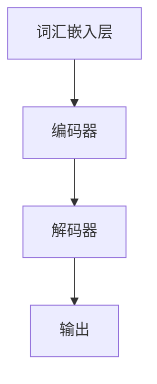
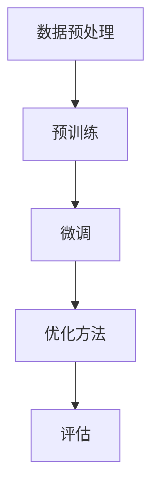
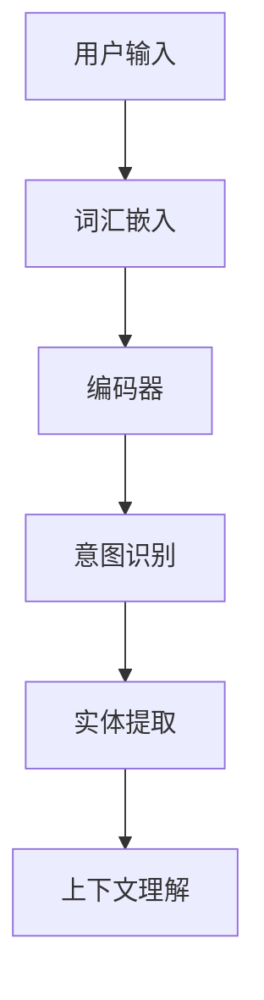
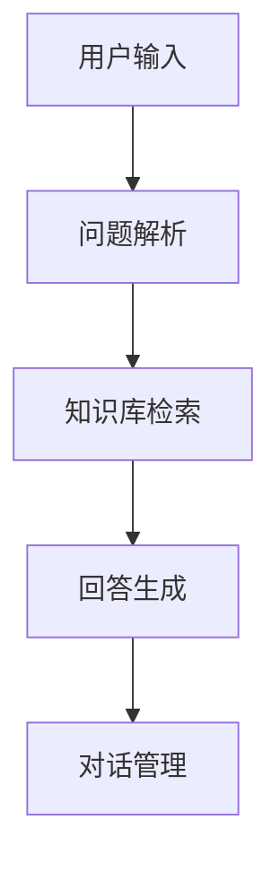
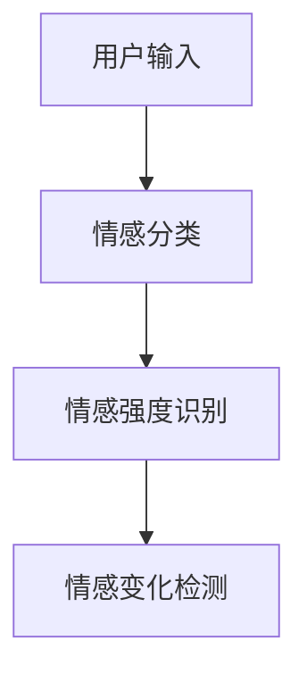
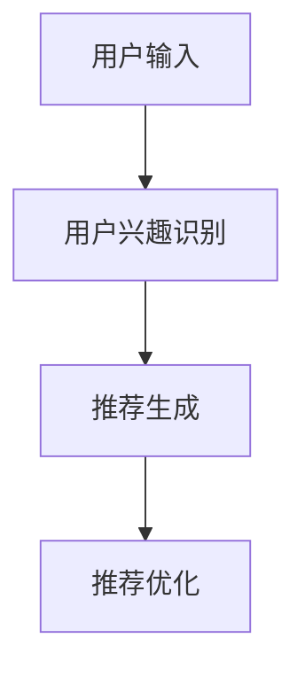
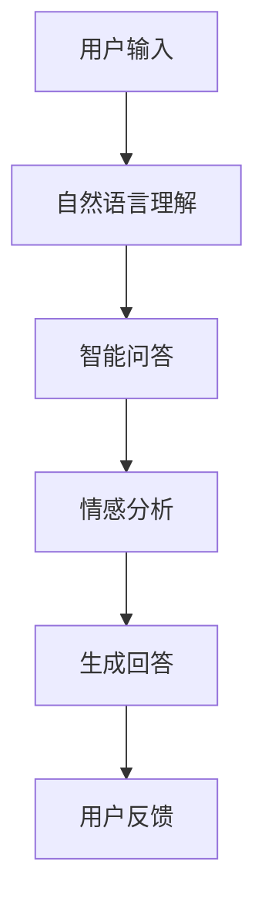
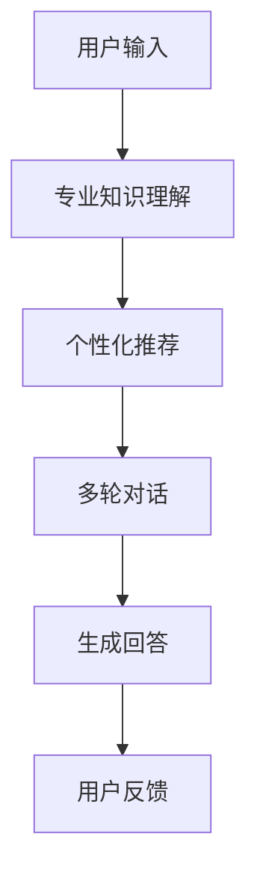
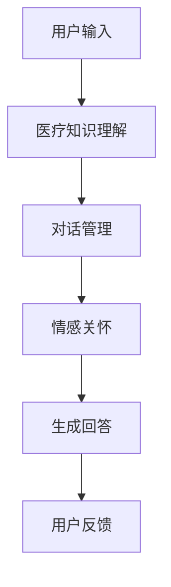
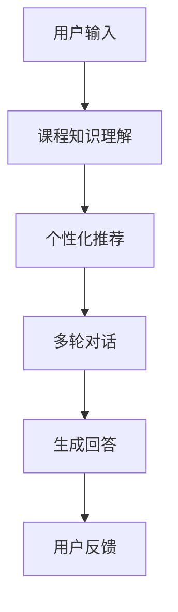

                 

### 《LLM在智能客户服务系统中的应用前景》

> **关键词**：语言模型（LLM）、智能客户服务、自然语言处理、人工智能、应用前景

> **摘要**：本文旨在探讨语言模型（LLM）在智能客户服务系统中的潜在应用。文章首先回顾了智能客户服务系统的发展历程与现状，然后深入解析了LLM的基本概念与原理。接着，文章详细探讨了LLM在智能客服中的各种应用，并通过实际案例展示了其应用效果。最后，文章讨论了LLM在智能客户服务中的挑战与展望，为未来的研究与应用提供了方向。

### 《LLM在智能客户服务系统中的应用前景》目录大纲

#### 第一部分：背景与概述

##### 第1章：智能客户服务系统概述

###### 1.1 智能客户服务系统的发展历程

###### 1.2 智能客户服务系统的现状与趋势

###### 1.3 LLM在智能客户服务系统中的重要性

#### 第二部分：LLM基础理论

##### 第2章：LLM基本概念与原理

###### 2.1 词汇嵌入与神经网络基础

###### 2.2 语言模型的基本结构

###### 2.3 大模型训练与优化方法

###### 2.4 LLM的应用领域与优势

#### 第三部分：LLM在智能客户服务中的应用

##### 第3章：LLM在智能客服中的角色

###### 3.1 LLM在自然语言理解中的应用

###### 3.2 LLM在智能问答系统中的应用

###### 3.3 LLM在情感分析中的应用

###### 3.4 LLM在个性化推荐中的应用

##### 第4章：LLM在智能客户服务中的实际案例

###### 4.1 案例一：大型电商平台客服系统

###### 4.2 案例二：金融行业智能客服系统

###### 4.3 案例三：医疗行业智能客服系统

###### 4.4 案例四：教育行业智能客服系统

#### 第四部分：LLM在智能客户服务中的挑战与展望

##### 第5章：LLM在智能客户服务中的挑战

###### 5.1 数据隐私与安全性

###### 5.2 伦理问题与偏见

###### 5.3 模型可解释性

###### 5.4 技术迭代与更新

##### 第6章：LLM在智能客户服务中的应用前景

###### 6.1 未来发展趋势

###### 6.2 技术创新与应用拓展

###### 6.3 智能客户服务系统的发展方向

##### 第7章：总结与展望

###### 7.1 全书总结

###### 7.2 LLM在智能客户服务系统中的未来应用

###### 7.3 对从业者和研究者的建议

#### 附录

##### 附录A：常见LLM框架与工具介绍

###### A.1：GPT系列模型

###### A.2：BERT及其变体

###### A.3：其他知名LLM框架介绍

###### A.4：开源资源和推荐阅读

---

接下来，我们将按照上述目录大纲逐一展开内容，进行逻辑清晰、结构紧凑、简单易懂的深入分析。

#### 第一部分：背景与概述

##### 第1章：智能客户服务系统概述

###### 1.1 智能客户服务系统的发展历程

智能客户服务系统，通常指的是基于人工智能技术，尤其是自然语言处理（NLP）和机器学习（ML）的自动化的客户服务解决方案。其发展历程可以追溯到20世纪80年代，当时专家系统（Expert Systems）开始应用于客户服务领域，用以模拟人类专家的知识和推理能力。

在90年代，随着互联网的普及，在线客服系统逐渐兴起。这一时期的在线客服系统主要依赖于规则驱动（Rule-Based Systems），即通过预定义的规则来匹配用户的问题和相应的回答。这种方法在一定程度上提高了客户服务的效率，但缺乏灵活性，难以应对复杂和多变的用户需求。

进入21世纪，随着机器学习和深度学习技术的发展，基于数据驱动的智能客服系统开始崭露头角。这些系统通过大量数据的训练，能够自主学习并提高服务质量。其中，自然语言处理技术成为关键，使得智能客服系统能够更好地理解用户的语言，提供更加个性化的服务。

近年来，随着语言模型（如GPT、BERT等）的突破性进展，智能客服系统在处理复杂对话和情感分析方面取得了显著进展。这些先进的语言模型能够理解自然语言的深层含义，提供更加自然和流畅的交互体验。

###### 1.2 智能客户服务系统的现状与趋势

当前，智能客户服务系统已经成为许多企业提高客户满意度、降低运营成本的重要手段。根据市场研究公司的数据，全球智能客服市场的规模正在快速增长，预计将在未来几年内继续保持两位数的年复合增长率。

智能客服系统的现状主要体现在以下几个方面：

1. **自动化程度提高**：随着人工智能技术的不断进步，智能客服系统能够自动化处理越来越多的客户问题，减少了对人工客服的依赖。

2. **服务质量提升**：先进的自然语言处理技术使得智能客服系统在理解用户问题和提供准确回答方面有了显著提升，用户满意度不断提高。

3. **跨渠道整合**：智能客服系统不再局限于单一渠道的应用，而是能够整合多种渠道（如电话、邮件、社交媒体等），提供统一的客户服务体验。

4. **个性化服务**：通过用户数据的积累和分析，智能客服系统能够提供更加个性化的服务，满足不同用户的需求。

未来，智能客户服务系统的发展趋势将更加智能化、个性化和无缝整合。以下是一些可能的发展方向：

1. **多模态交互**：智能客服系统将不仅仅依赖于文本交互，还将整合语音、图像等多种模态，提供更加丰富和自然的交互体验。

2. **增强现实与虚拟现实**：智能客服系统将利用增强现实（AR）和虚拟现实（VR）技术，提供沉浸式的客户服务体验。

3. **情感智能**：智能客服系统将能够更好地理解和模拟人类的情感，提供更加温暖和贴心的服务。

4. **区块链技术的应用**：智能客服系统将利用区块链技术，提高数据的安全性和透明度，增强客户信任。

总之，智能客户服务系统正朝着更加智能化、个性化和无缝整合的方向发展，LLM技术将在其中扮演关键角色。接下来，我们将深入探讨LLM的基本概念与原理，以及它们在智能客户服务系统中的应用。

---

在了解了智能客户服务系统的发展历程和现状与趋势后，接下来我们将探讨LLM在智能客户服务系统中的重要性。

###### 1.3 LLM在智能客户服务系统中的重要性

语言模型（LLM）是智能客户服务系统的核心组件之一，它决定了系统能够理解和生成多语言自然语言对话的能力。以下是LLM在智能客户服务系统中具有重要性的几个方面：

1. **自然语言理解能力**：LLM具有强大的自然语言理解能力，能够准确理解用户的语言表达，提取关键信息，并将其转换为系统能够处理的结构化数据。这对于智能客服系统来说至关重要，因为只有理解用户的意图和需求，系统才能提供有针对性的服务。

2. **对话生成能力**：LLM不仅能够理解用户语言，还能够生成流畅且自然的对话回复。这意味着智能客服系统能够与用户进行像人类一样的对话，提供个性化的服务体验。与规则驱动系统相比，LLM能够处理更复杂和多变的用户需求。

3. **情感智能**：LLM能够识别和模拟人类的情感表达，这对于提供温暖和贴心的客户服务至关重要。通过分析用户的情感，LLM可以调整对话策略，提供更加人性化的服务。

4. **跨语言支持**：LLM通常具有多语言处理能力，这意味着智能客服系统可以服务于全球范围内的用户，无需依赖本地化的人工客服。这对于跨国公司和希望拓展国际市场的企业来说，具有极大的优势。

5. **个性化服务**：通过分析用户的语言和行为数据，LLM可以了解用户的偏好和习惯，提供个性化的服务和建议。这有助于提高用户满意度和忠诚度。

6. **自动化程度**：LLM能够自动化处理大量重复性和标准化的客户请求，减轻人工客服的负担，提高整个客户服务流程的效率。

7. **成本效益**：使用LLM的智能客服系统可以显著降低人力成本，提高运营效率。同时，LLM的持续学习和优化能力，使得系统能够不断改进服务质量，实现长期成本效益。

总之，LLM在智能客户服务系统中具有不可替代的重要性。它不仅提升了系统的自然语言处理能力，还提供了更加智能化和个性化的客户服务体验。随着LLM技术的不断进步，智能客户服务系统将能够更好地满足企业和用户的需求。在下一章中，我们将深入探讨LLM的基本概念与原理，以便更好地理解其如何应用于智能客户服务系统。

---

#### 第二部分：LLM基础理论

##### 第2章：LLM基本概念与原理

为了深入探讨LLM在智能客户服务系统中的应用，我们需要先了解LLM的基本概念与原理。在本章中，我们将逐一介绍词汇嵌入与神经网络基础、语言模型的基本结构、大模型训练与优化方法，以及LLM的应用领域与优势。

###### 2.1 词汇嵌入与神经网络基础

语言模型的核心是词汇嵌入（Word Embedding），它是将自然语言中的词汇映射到高维向量空间的过程。这样的向量表示能够捕捉词汇之间的语义和语法关系，使得机器能够更好地理解和生成自然语言。

词汇嵌入的主要方法包括：

1. **分布式表示**：每个词汇都被映射为一个唯一的向量，这些向量在空间中相互独立。这种方法能够捕捉词汇之间的语义关系，如“狗”和“猫”可能具有相似的位置。

2. **连续词袋（CBOW）**：CBOW模型通过考虑词汇周围的上下文来生成其嵌入向量。具体来说，给定一个中心词汇，CBOW模型会使用其周围的若干词汇（称为窗口大小）来预测这个中心词汇的嵌入向量。

3. **Skip-Gram**：Skip-Gram模型与CBOW相反，它使用一个目标词汇来预测其上下文词汇。这种方法通常能够生成更好的词汇嵌入，因为它考虑了词汇的分布特征。

神经网络基础是构建语言模型的关键，其中最常用的神经网络架构包括：

1. **多层感知机（MLP）**：MLP是一种前馈神经网络，它通过一系列的线性变换和激活函数来映射输入向量到输出向量。

2. **循环神经网络（RNN）**：RNN具有循环结构，能够处理序列数据。在RNN中，每个时间步的输出不仅依赖于当前的输入，还依赖于之前的输出，这使得RNN能够捕捉序列数据中的长期依赖关系。

3. **长短期记忆网络（LSTM）**：LSTM是RNN的一种改进，通过引入门控机制，解决了传统RNN在处理长序列数据时的梯度消失和梯度爆炸问题。

4. **门控循环单元（GRU）**：GRU是LSTM的简化版本，具有类似的门控机制，但结构更简单，计算效率更高。

###### 2.2 语言模型的基本结构

语言模型的基本结构可以分为三个主要部分：词汇嵌入层、编码器和解码器。

1. **词汇嵌入层**：这一层将输入词汇转换为高维向量表示。通常，词汇嵌入层会使用预训练的词汇嵌入词典，如Word2Vec或GloVe。

2. **编码器**：编码器负责处理输入序列，将其编码为一个固定大小的向量表示。在RNN和LSTM架构中，编码器通常由一系列循环层组成，而在Transformer架构中，编码器由多个自注意力机制层组成。

3. **解码器**：解码器负责生成输出序列。在RNN和LSTM架构中，解码器与编码器结构相似，但在每个时间步都会接收上一个时间步的输出。在Transformer架构中，解码器同样由多个自注意力机制层组成，但还包括一个额外的交叉注意力层，用于从编码器输出中提取上下文信息。

为了更好地理解这些概念，我们可以使用Mermaid流程图来展示语言模型的基本结构：

在此流程图中，A表示词汇嵌入层，将输入词汇转换为向量；B表示编码器，负责编码输入序列；C表示解码器，生成输出序列；D表示输出，即生成的文本。

###### 2.3 大模型训练与优化方法

语言模型的训练是一个复杂的过程，涉及到大量的数据和计算资源。以下是一些常见的训练和优化方法：

1. **预训练与微调**：预训练是指在大规模语料库上对语言模型进行训练，使其能够捕获语言的通用特征。微调则是将预训练模型在小规模任务数据上进行进一步训练，以适应特定任务。预训练与微调的结合能够显著提高语言模型在具体任务上的性能。

2. **批量归一化（Batch Normalization）**：批量归一化是一种常用的优化方法，它通过标准化每个批次的数据来减少内部协变量转移，加速模型训练并提高模型稳定性。

3. **学习率调度**：学习率调度是调整学习率的方法，以避免在训练过程中出现过拟合或梯度消失等问题。常见的调度方法包括学习率衰减、学习率预热等。

4. **dropout**：dropout是一种正则化技术，通过随机丢弃部分神经元来减少过拟合。在训练过程中，每个神经元有概率被丢弃，从而增加模型的泛化能力。

5. **自适应优化器**：自适应优化器（如Adam、AdamW）通过自适应调整学习率，提高训练效率。这些优化器能够自动调整不同参数的学习率，使模型收敛速度更快。

为了更直观地展示这些方法，我们可以使用Mermaid流程图来描述训练过程：

在此流程图中，A表示数据预处理，B表示预训练，C表示微调，D表示优化方法，E表示评估。

###### 2.4 LLM的应用领域与优势

LLM在多个应用领域展现出显著的优势，以下是一些关键领域：

1. **自然语言处理（NLP）**：LLM在NLP任务中具有广泛的应用，包括文本分类、情感分析、机器翻译等。通过捕捉语言的深层语义特征，LLM能够显著提高NLP任务的性能。

2. **问答系统**：LLM在智能问答系统中发挥着重要作用。它们能够理解用户的自然语言查询，并生成准确、自然的回答。这种能力使得LLM在客户服务、知识库问答等领域得到广泛应用。

3. **生成式任务**：LLM在生成式任务中也表现出强大的能力，如文本生成、对话生成等。通过预训练和微调，LLM能够生成高质量的文本，模拟人类的语言表达。

4. **对话系统**：LLM在构建对话系统时具有重要价值。它们能够处理多轮对话，理解用户的意图，并生成连贯、自然的对话回复。

5. **内容审核与分类**：LLM在内容审核和分类任务中能够高效地识别和处理不良内容。通过分析文本的语义特征，LLM可以准确判断文本的分类标签。

6. **个性化推荐**：LLM能够分析用户的语言和行为数据，提供个性化的推荐服务。这在电子商务、社交媒体等领域具有广泛的应用前景。

LLM的优势主要体现在以下几个方面：

1. **强大的语义理解能力**：LLM能够理解自然语言的深层含义，提供更加准确的语义分析。

2. **自适应性和灵活性**：通过预训练和微调，LLM能够适应不同的应用场景和任务需求。

3. **高效的生成能力**：LLM能够高效地生成自然语言文本，满足各种生成式任务的需求。

4. **跨语言支持**：LLM通常具有多语言处理能力，能够服务于全球范围内的用户。

5. **持续学习和优化**：LLM能够通过持续学习和优化，不断提高模型性能和用户体验。

总之，LLM作为自然语言处理的核心技术，在智能客户服务系统和其他应用领域展现出巨大的潜力和优势。在下一章中，我们将探讨LLM在智能客服中的具体应用，并通过实际案例展示其效果。

---

#### 第三部分：LLM在智能客户服务中的应用

##### 第3章：LLM在智能客服中的角色

在前一章中，我们详细探讨了LLM的基本概念与原理。在本章中，我们将深入探讨LLM在智能客服中的具体应用，包括自然语言理解、智能问答系统、情感分析和个性化推荐。通过这些应用，我们将看到LLM如何提升智能客服系统的效率和用户体验。

###### 3.1 LLM在自然语言理解中的应用

自然语言理解（NLU）是智能客服系统的核心功能之一，它涉及到对用户输入的自然语言进行处理和分析，以提取出用户意图和语义信息。LLM在NLU中的应用主要表现在以下几个方面：

1. **意图识别**：意图识别是NLU任务的一部分，它旨在理解用户的意图。LLM通过训练，能够识别出用户输入中的关键信息，如请求类型、任务目标等。例如，当用户说“我想要退一个货”时，LLM能够识别出意图为“退货”。

2. **实体提取**：实体提取是另一个重要的NLU任务，它旨在从文本中提取出具体的实体信息，如人名、地点、日期等。LLM通过学习大量语料库，能够准确提取出文本中的实体信息。

3. **上下文理解**：理解上下文是自然语言处理中的一个挑战，LLM通过其强大的上下文理解能力，能够处理多轮对话中的上下文信息，避免误解用户的意图。

为了实现这些功能，LLM通常使用以下方法：

1. **词汇嵌入**：通过词汇嵌入技术，LLM能够将自然语言中的词汇映射到高维向量空间，捕捉词汇之间的语义关系。

2. **神经网络结构**：LLM通常使用深度神经网络结构，如RNN、LSTM或Transformer，来处理序列数据，并提取出文本中的特征。

3. **预训练与微调**：LLM在大规模语料库上进行预训练，以学习语言的通用特征。然后，通过微调，LLM能够适应特定的应用场景和任务需求。

以下是一个简单的Mermaid流程图，展示了LLM在自然语言理解中的应用：

在此流程图中，A表示用户输入，B表示词汇嵌入，C表示编码器，D表示意图识别，E表示实体提取，F表示上下文理解。

###### 3.2 LLM在智能问答系统中的应用

智能问答系统是智能客服系统中的一个重要组成部分，它旨在自动回答用户提出的问题。LLM在智能问答系统中具有以下应用：

1. **问题解析**：LLM能够对用户提出的问题进行解析，提取出关键信息，如问题类型、问题实体等。这有助于系统理解用户的意图，并生成准确的回答。

2. **知识检索**：智能问答系统通常依赖于知识库来回答用户的问题。LLM通过查询知识库，提取出与用户问题相关的信息，并生成自然语言回答。

3. **回答生成**：LLM能够根据提取出的信息和知识库，生成自然语言回答。这些回答不仅准确，而且流畅自然，使得用户能够轻松理解。

4. **对话管理**：在多轮对话中，LLM能够根据用户的反馈和上下文，调整回答策略，提供更加个性化的服务。

为了展示LLM在智能问答系统中的应用，我们可以使用以下Mermaid流程图：

在此流程图中，A表示用户输入，B表示问题解析，C表示知识库检索，D表示回答生成，E表示对话管理。

###### 3.3 LLM在情感分析中的应用

情感分析是智能客服系统中的一个关键任务，它旨在识别用户的情感状态，如愤怒、高兴、悲伤等。LLM在情感分析中的应用主要表现在以下几个方面：

1. **情感分类**：LLM能够对文本进行情感分类，将文本标记为正面、负面或中性。这种分类有助于系统理解用户的情感状态，并采取相应的应对措施。

2. **情感强度识别**：LLM不仅能够识别出用户的情感，还能够识别情感的程度。例如，用户说“我很生气”时，LLM能够识别出情感为“生气”，并判断强度较高。

3. **情感变化检测**：在多轮对话中，LLM能够检测出用户情感的变化，并根据这些变化调整对话策略，提供更加贴心的服务。

以下是一个简单的Mermaid流程图，展示了LLM在情感分析中的应用：

在此流程图中，A表示用户输入，B表示情感分类，C表示情感强度识别，D表示情感变化检测。

###### 3.4 LLM在个性化推荐中的应用

个性化推荐是智能客服系统中的一个重要功能，它旨在为用户提供个性化的服务和推荐。LLM在个性化推荐中的应用主要表现在以下几个方面：

1. **用户兴趣识别**：LLM能够分析用户的语言和行为数据，提取出用户的兴趣点。这些兴趣点用于生成个性化的推荐列表。

2. **推荐生成**：根据用户的兴趣点和历史行为，LLM能够生成个性化的推荐。这些推荐可以是产品、服务、内容等，旨在满足用户的需求。

3. **推荐优化**：LLM能够根据用户的反馈和互动，不断优化推荐策略，提高推荐的准确性和满意度。

以下是一个简单的Mermaid流程图，展示了LLM在个性化推荐中的应用：

在此流程图中，A表示用户输入，B表示用户兴趣识别，C表示推荐生成，D表示推荐优化。

通过上述应用，LLM显著提升了智能客服系统的性能和用户体验。在下一章中，我们将通过实际案例展示LLM在智能客户服务系统中的具体应用效果。

---

##### 第4章：LLM在智能客户服务中的实际案例

在前面几章中，我们详细介绍了LLM在自然语言理解、智能问答系统、情感分析和个性化推荐等方面的应用。为了更好地理解LLM在智能客户服务系统中的实际效果，本章节将结合实际案例，深入探讨LLM在不同行业的智能客服系统中的应用。

###### 4.1 案例一：大型电商平台客服系统

大型电商平台通常需要处理海量用户咨询和投诉，传统的客服模式已经难以满足高效、个性化的服务需求。因此，许多电商平台开始采用基于LLM的智能客服系统，以提升用户体验和服务质量。

**应用场景**：
- 用户咨询：用户在购买商品前可能有许多问题，如商品规格、配送方式、售后服务等。智能客服系统能够快速回答这些问题，减少用户的等待时间。
- 用户投诉：用户在购买过程中遇到问题时，可以通过智能客服系统进行投诉。系统能够自动识别投诉类型，并将投诉信息传递给相关部门进行处理。

**LLM应用**：
- **自然语言理解**：智能客服系统使用LLM进行用户输入的自然语言理解，提取出关键信息和意图。例如，用户询问“这个商品是否有运费险？”时，LLM能够识别出关键词“运费险”，并定位到相关条款。
- **智能问答**：智能客服系统利用预训练的LLM模型，从大规模问答数据中提取知识，快速生成回答。例如，用户询问“如何申请售后服务？”时，系统能够自动从知识库中找到相关步骤，并生成详细的解答。
- **情感分析**：LLM能够分析用户的语言情感，识别出用户的情绪状态。如果用户在投诉中表达出强烈的愤怒情绪，系统会自动标记并优先处理。

**效果**：
- **响应速度**：智能客服系统显著提高了响应速度，用户问题能够得到快速解答，提升了用户满意度。
- **服务质量**：通过自然语言理解和情感分析，智能客服系统能够提供更加个性化和贴心的服务，减少了用户投诉率。
- **成本降低**：智能客服系统减少了人工客服的工作量，降低了人力成本，同时提高了整体客服效率。

以下是一个Mermaid流程图，展示了大型电商平台客服系统的应用：

在此流程图中，A表示用户输入，B表示自然语言理解，C表示智能问答，D表示情感分析，E表示生成回答，F表示用户反馈。

###### 4.2 案例二：金融行业智能客服系统

金融行业对客户服务有着严格的要求，特别是在处理敏感信息和提供专业建议时。因此，金融行业的智能客服系统需要具备高度的专业性和可靠性。

**应用场景**：
- 账户查询：用户需要查询账户余额、交易记录等信息。
- 投资咨询：用户对投资产品有疑问，需要专业的投资建议。
- 客户服务：用户在办理业务时遇到问题，需要快速得到解答。

**LLM应用**：
- **专业知识理解**：金融行业的智能客服系统使用LLM来理解金融领域的专业知识，确保回答的准确性和专业性。
- **个性化推荐**：LLM通过分析用户的投资历史和偏好，为用户推荐合适的投资产品。
- **多轮对话**：LLM能够处理多轮对话，理解用户的需求变化，并提供持续的服务。

**效果**：
- **专业解答**：智能客服系统能够提供专业、准确的金融咨询，提升了用户对金融机构的信任感。
- **个性化服务**：通过个性化推荐，用户能够更快地找到适合自己的投资产品，提高了用户的投资满意度。
- **效率提升**：智能客服系统能够自动化处理大量重复性问题，减轻了人工客服的工作量。

以下是一个Mermaid流程图，展示了金融行业智能客服系统的应用：

在此流程图中，A表示用户输入，B表示专业知识理解，C表示个性化推荐，D表示多轮对话，E表示生成回答，F表示用户反馈。

###### 4.3 案例三：医疗行业智能客服系统

医疗行业的客户服务具有高度的专业性和敏感性，智能客服系统在这一领域中的应用日益广泛。

**应用场景**：
- 疾病咨询：用户对某种疾病或症状有疑问，需要获取相关信息。
- 就诊指南：用户需要了解如何挂号、预约医生等流程。
- 健康管理：用户需要了解健康知识、生活习惯等。

**LLM应用**：
- **医疗知识理解**：智能客服系统使用LLM来理解复杂的医疗知识，为用户提供准确的健康信息。
- **对话管理**：LLM能够处理复杂的医疗对话，理解用户的病情描述，并提供相应的建议。
- **情感关怀**：LLM能够识别用户的情感状态，提供温暖、贴心的关怀。

**效果**：
- **专业健康指导**：智能客服系统能够为用户提供专业的健康指导，帮助用户更好地管理健康。
- **减少误诊风险**：通过准确的疾病信息提供，智能客服系统能够减少误诊和误治的风险。
- **提高用户满意度**：智能客服系统能够提供24/7的服务，减少了用户等待时间，提升了用户满意度。

以下是一个Mermaid流程图，展示了医疗行业智能客服系统的应用：

在此流程图中，A表示用户输入，B表示医疗知识理解，C表示对话管理，D表示情感关怀，E表示生成回答，F表示用户反馈。

###### 4.4 案例四：教育行业智能客服系统

教育行业的客户服务主要包括课程咨询、学生服务、学术支持等方面。智能客服系统在这一领域中的应用，有助于提升教育服务的便捷性和个性化。

**应用场景**：
- 课程咨询：学生和家长需要了解课程设置、课程内容、师资力量等。
- 学生服务：学生需要了解学籍管理、成绩查询、奖学金申请等。
- 学术支持：学生和教师需要获取学术资源、研究支持等信息。

**LLM应用**：
- **课程知识理解**：智能客服系统使用LLM来理解复杂的课程知识，为用户提供详细的课程信息。
- **个性化推荐**：LLM通过分析学生的学术背景和兴趣，为用户推荐适合的课程和学习资源。
- **多轮对话**：LLM能够处理多轮对话，理解用户的需求变化，并提供持续的服务。

**效果**：
- **个性化服务**：智能客服系统能够为不同背景和需求的学生提供个性化的服务，提升了用户体验。
- **学术支持**：智能客服系统为学术研究人员提供专业的学术支持，帮助其获取所需的资源。
- **信息获取效率**：智能客服系统显著提高了用户获取信息和服务效率，减少了人工客服的工作量。

以下是一个Mermaid流程图，展示了教育行业智能客服系统的应用：

在此流程图中，A表示用户输入，B表示课程知识理解，C表示个性化推荐，D表示多轮对话，E表示生成回答，F表示用户反馈。

通过上述实际案例，我们可以看到LLM在智能客户服务系统中的广泛应用和显著效果。在下一章中，我们将探讨LLM在智能客户服务中的挑战与展望，为未来的发展提供方向。

---

#### 第四部分：LLM在智能客户服务中的挑战与展望

##### 第5章：LLM在智能客户服务中的挑战

虽然LLM在智能客户服务系统中展现了巨大的潜力和优势，但其应用过程中仍然面临诸多挑战。这些挑战主要集中在数据隐私与安全性、伦理问题与偏见、模型可解释性以及技术迭代与更新等方面。以下是这些挑战的具体分析。

###### 5.1 数据隐私与安全性

智能客户服务系统需要处理大量用户数据，包括个人身份信息、交易记录、聊天记录等。这些数据的安全性和隐私保护成为重要挑战：

1. **数据泄露风险**：智能客服系统可能成为数据泄露的目标，攻击者可能会通过系统漏洞获取用户数据，造成严重后果。

2. **数据滥用**：即使数据得到了良好的保护，但内部员工可能存在滥用数据的风险，如不当使用用户信息进行商业利益。

3. **数据跨境传输**：智能客户服务系统通常涉及跨国应用，数据跨境传输过程中可能面临不同的数据保护法规，增加合规风险。

为了解决这些挑战，可以采取以下措施：

- **加密技术**：使用加密技术对用户数据进行加密存储和传输，确保数据在传输和存储过程中的安全性。
- **访问控制**：实施严格的访问控制策略，确保只有授权人员能够访问敏感数据。
- **数据匿名化**：在数据分析和模型训练过程中，对用户数据进行匿名化处理，减少数据泄露风险。
- **合规性检查**：确保智能客服系统的设计和运营符合相关的数据保护法规，如《通用数据保护条例》（GDPR）。

###### 5.2 伦理问题与偏见

智能客户服务系统中的LLM模型可能会引入伦理问题，如偏见和歧视：

1. **性别、种族偏见**：LLM模型可能在训练过程中吸收了训练数据中的偏见，导致在特定情境下表现出性别、种族偏见。

2. **错误建议**：如果LLM模型未能正确理解用户的意图，可能会提供不准确或有害的建议。

3. **不平等服务**：智能客服系统可能会因为算法偏差而对某些用户群体提供不公平的服务。

为了解决这些挑战，可以采取以下措施：

- **数据多样化**：在训练模型时使用多样化的数据集，确保模型能够学习到各种情境下的正确行为。
- **偏见检测与修正**：开发偏见检测算法，识别并修正模型中的偏见。
- **伦理审查**：在部署模型前进行全面的伦理审查，确保模型符合伦理标准。
- **透明度与可解释性**：提高模型的可解释性，使决策过程透明，方便用户和监管机构进行监督。

###### 5.3 模型可解释性

LLM模型通常被视为“黑盒”模型，其决策过程难以解释。这给模型的可解释性和可信度带来了挑战：

1. **用户信任**：用户可能对无法解释的决策结果感到不安，影响对智能客服系统的信任。
2. **监管合规**：一些行业和法规要求模型具备一定的可解释性，以确保其合规性。
3. **错误修正**：如果模型决策出现问题，缺乏可解释性使得错误难以追踪和修正。

为了解决这些挑战，可以采取以下措施：

- **模型可视化**：使用可视化工具展示模型的内部结构和决策过程。
- **解释性算法**：开发可解释性算法，如LIME、SHAP等，帮助理解模型的决策依据。
- **交互式解释**：提供交互式解释界面，用户可以查询模型对特定决策的解释。
- **模型简化**：通过简化模型结构，提高模型的可解释性和简化性。

###### 5.4 技术迭代与更新

智能客户服务系统需要不断更新和优化，以适应不断变化的技术环境和用户需求：

1. **技术更新**：随着技术的快速发展，智能客服系统需要不断引入新的算法和技术，保持竞争力。
2. **模型更新**：LLM模型需要定期更新和训练，以保持其准确性和有效性。
3. **数据更新**：智能客服系统的数据源需要不断更新，确保模型能够学习到最新的知识和趋势。

为了解决这些挑战，可以采取以下措施：

- **持续学习**：采用持续学习技术，使模型能够实时更新和优化。
- **自动化更新**：开发自动化工具，实现模型的自动化更新和部署。
- **版本控制**：实施版本控制机制，确保每次更新都能追溯和验证。

总之，虽然LLM在智能客户服务系统中具有巨大潜力，但其在应用过程中面临诸多挑战。通过采取有效的措施，可以缓解这些挑战，确保智能客服系统的高效、可靠和可持续发展。

##### 第6章：LLM在智能客户服务中的应用前景

在解决了LLM在智能客户服务中的挑战后，我们对其应用前景进行展望。未来，LLM将继续在智能客户服务系统中发挥关键作用，推动技术进步和应用拓展。以下是LLM在未来智能客户服务系统中的发展趋势和创新应用。

###### 6.1 未来发展趋势

1. **多模态交互**：随着计算机视觉、语音识别等技术的发展，智能客服系统将不再局限于文本交互，而是实现多模态交互。例如，用户可以通过语音、图像、视频等多种方式与系统进行交互，获取更加丰富和自然的交互体验。

2. **个性化服务**：未来的智能客服系统将更加注重个性化服务。通过深度学习技术，系统能够更准确地分析用户的偏好和行为，提供个性化的服务和推荐。这种个性化的服务不仅能够提高用户满意度，还能提升用户忠诚度。

3. **智能化程度提升**：随着人工智能技术的不断进步，智能客服系统的智能化程度将进一步提升。系统将能够更好地理解用户的意图和情感，提供更加自然和人性化的服务。此外，系统将能够处理更加复杂和多变的用户需求，减少对人工客服的依赖。

4. **跨渠道整合**：未来的智能客服系统将实现跨渠道整合，能够无缝连接多种渠道（如电话、邮件、社交媒体、聊天应用程序等），提供统一的客户服务体验。这种整合不仅提高了客服效率，还能提供一致的服务质量。

5. **实时性增强**：实时性是智能客服系统的重要指标之一。未来的智能客服系统将能够实现更快的响应速度，实时处理用户的咨询和请求。通过云计算和边缘计算技术的结合，系统将能够实现低延迟、高效率的实时服务。

6. **情感智能**：情感智能是未来智能客服系统发展的重要方向之一。通过情感分析技术，系统将能够识别用户的情感状态，提供更加温暖和贴心的服务。这种情感智能不仅能够提高用户满意度，还能增强用户对品牌的忠诚度。

7. **增强现实与虚拟现实**：增强现实（AR）和虚拟现实（VR）技术的发展为智能客服系统提供了新的应用场景。未来的智能客服系统将能够通过AR/VR技术，提供沉浸式的客户服务体验，如虚拟导购、在线客服等。

8. **区块链技术的应用**：区块链技术具有去中心化、不可篡改的特点，未来将有望应用于智能客服系统中，提高数据的安全性和透明度。例如，通过区块链技术，系统可以确保用户数据的隐私和安全，增强用户对系统的信任。

9. **自适应能力**：未来的智能客服系统将具备更强的自适应能力，能够根据用户的反馈和需求，自动调整服务策略和对话策略。这种自适应能力不仅能够提高服务质量，还能提高系统对用户需求的响应速度。

10. **人机协同**：未来的智能客服系统将实现人机协同，结合人工智能和人类智能的优势，提供更加高效和贴心的服务。例如，在复杂问题和紧急情况下，系统将能够辅助人工客服，共同解决用户问题。

###### 6.2 技术创新与应用拓展

1. **预训练模型的发展**：预训练模型是LLM的核心，未来的技术发展将集中在如何优化预训练模型，提高其性能和效率。例如，通过改进预训练算法、引入更多样化的训练数据、使用更大规模的计算资源等，提高预训练模型的效果。

2. **自适应学习算法**：未来的智能客服系统将采用更加先进的自适应学习算法，能够根据用户行为和反馈，动态调整模型参数，提高服务质量和用户体验。

3. **多语言支持**：随着全球化进程的加快，智能客服系统将需要支持更多语言。未来的LLM模型将更加注重多语言处理能力，能够为不同语言的用户提供无缝的服务。

4. **跨行业应用**：LLM在智能客户服务系统中的应用将不再局限于某些特定行业，而是实现跨行业应用。例如，在医疗、金融、教育等行业，LLM将能够为用户提供专业的服务和支持。

5. **智能客服机器人**：未来的智能客服系统将更多地采用智能客服机器人，实现与用户的自然对话和智能交互。这些智能客服机器人将能够处理更加复杂和多变的用户需求，提供更加个性化和服务。

6. **虚拟个人助理**：未来的智能客服系统将发展成为虚拟个人助理，能够为用户提供全方位的服务，如日程管理、任务提醒、信息查询等。这些虚拟个人助理将更加智能化和个性化，成为用户的私人助手。

7. **智能决策支持系统**：未来的智能客服系统将不仅限于提供客户服务，还将成为智能决策支持系统。通过分析用户数据和市场趋势，系统能够为企业和用户提供专业的决策支持。

8. **智能客服生态**：未来的智能客服系统将形成一个完整的生态，包括硬件设备、软件平台、服务内容等。这个生态将实现无缝连接，提供一站式的智能客服解决方案。

总之，LLM在智能客户服务系统中的应用前景广阔。随着技术的不断进步和创新，LLM将能够提供更加智能化、个性化和高效的服务，满足企业和用户的需求。在下一章中，我们将对全文进行总结，并探讨LLM在智能客户服务系统中的未来应用。

---

##### 第7章：总结与展望

在本文中，我们详细探讨了语言模型（LLM）在智能客户服务系统中的应用前景。通过回顾智能客户服务系统的发展历程，解析了LLM的基本概念与原理，探讨了LLM在自然语言理解、智能问答、情感分析和个性化推荐等领域的具体应用，展示了LLM在多个行业中的实际案例，分析了LLM在智能客户服务中的挑战与展望。

**总结**：

1. **智能客户服务系统的发展**：智能客户服务系统经历了从规则驱动到数据驱动，再到基于LLM的智能化发展的过程。随着技术的进步，智能客服系统在响应速度、服务质量、个性化服务等方面取得了显著提升。

2. **LLM的基本概念与原理**：LLM通过词汇嵌入、神经网络结构和预训练与微调等方法，实现了对自然语言的深入理解和生成。其强大的自然语言处理能力使其在智能客户服务中具有广泛的应用前景。

3. **LLM的应用场景**：LLM在智能客户服务系统中被广泛应用于自然语言理解、智能问答、情感分析和个性化推荐等方面。通过这些应用，LLM显著提升了智能客服系统的效率、用户体验和客户满意度。

4. **挑战与展望**：虽然LLM在智能客户服务系统中的应用前景广阔，但仍然面临数据隐私与安全性、伦理问题与偏见、模型可解释性以及技术迭代与更新等挑战。未来，通过技术创新和优化，LLM将在智能客户服务系统中发挥更加重要的作用。

**未来应用**：

1. **多模态交互**：未来的智能客服系统将实现多模态交互，支持语音、图像、视频等多种交互方式，提供更加丰富和自然的用户体验。

2. **个性化服务**：通过深度学习和用户行为分析，智能客服系统将能够提供更加个性化的服务，满足不同用户的需求。

3. **情感智能**：智能客服系统将具备更强的情感智能，能够识别和理解用户的情感状态，提供更加温暖和贴心的服务。

4. **人机协同**：智能客服系统将实现人机协同，结合人工智能和人类智能的优势，提供高效和贴心的服务。

5. **跨行业应用**：LLM将在更多行业中得到应用，如医疗、金融、教育等，为用户提供专业的服务和支持。

**建议**：

对于从业者：

1. **持续学习**：随着技术的快速发展，从业者需要不断学习新的技术和工具，保持竞争力。

2. **伦理审查**：在设计和部署智能客服系统时，应进行全面的伦理审查，确保系统符合伦理标准。

3. **数据安全**：重视数据隐私与安全，采取有效的措施保护用户数据。

对于研究者：

1. **技术创新**：积极探索新的算法和技术，推动LLM在智能客服系统中的应用。

2. **跨学科研究**：结合心理学、社会学等跨学科知识，提升智能客服系统的用户体验。

3. **开源共享**：积极参与开源项目，推动LLM技术的发展和普及。

总之，LLM在智能客户服务系统中的应用前景广阔。通过不断的技术创新和优化，LLM将能够提供更加智能化、个性化和高效的服务，满足企业和用户的需求。未来，智能客服系统将在人工智能技术的推动下，实现更加智能化和人性化的客户服务。

---

### 附录

#### 附录A：常见LLM框架与工具介绍

##### A.1 GPT系列模型

GPT（Generative Pre-trained Transformer）系列模型是OpenAI开发的一组基于Transformer架构的预训练语言模型。GPT系列模型以其强大的自然语言处理能力和文本生成能力而闻名。

**GPT模型架构**：
- **Transformer架构**：GPT模型采用Transformer架构，由多个自注意力机制层组成。这种结构能够捕捉长距离的依赖关系，使得模型在处理自然语言时具有强大的表达能力。
- **预训练与微调**：GPT模型通过在大量文本数据上进行预训练，学习语言的通用特征。然后，通过微调适应特定任务的需求。

**GPT模型特点**：
- **强大的文本生成能力**：GPT模型能够生成高质量、连贯的文本，广泛应用于文本生成、对话系统、机器翻译等任务。
- **多语言支持**：GPT模型支持多语言预训练，能够处理多种语言的文本。

**GPT模型应用**：
- **对话系统**：GPT模型在对话系统中被广泛应用于自然语言生成，能够生成自然流畅的对话回复。
- **文本生成**：GPT模型能够生成各种类型的文本，如文章、故事、新闻报道等。
- **机器翻译**：GPT模型在机器翻译任务中表现出色，能够生成准确、自然的翻译结果。

##### A.2 BERT及其变体

BERT（Bidirectional Encoder Representations from Transformers）是由Google Research开发的一种双向Transformer预训练模型。BERT及其变体（如RoBERTa、ALBERT等）在自然语言处理任务中取得了显著的性能提升。

**BERT模型架构**：
- **双向Transformer**：BERT模型采用双向Transformer结构，能够同时考虑文本序列的前后关系，捕捉到更复杂的语义特征。
- **掩码语言模型**：BERT模型在预训练过程中使用了掩码语言模型（Masked Language Model，MLM）任务，通过随机掩码部分词汇，使模型学习到词汇的上下文关系。

**BERT模型特点**：
- **双向特征提取**：BERT模型能够同时提取文本序列的前后特征，提高模型的语义理解能力。
- **大规模预训练**：BERT模型在预训练阶段使用了大量的文本数据，使其能够学习到丰富的语言知识。

**BERT模型应用**：
- **文本分类**：BERT模型在文本分类任务中表现出色，能够准确分类文本数据。
- **问答系统**：BERT模型在问答系统中被广泛应用于提取关键信息，生成准确的回答。
- **命名实体识别**：BERT模型在命名实体识别任务中能够准确识别文本中的命名实体。

##### A.3 其他知名LLM框架介绍

除了GPT和BERT，还有其他一些知名的LLM框架，如：

**T5（Text-To-Text Transfer Transformer）**：
- **框架简介**：T5是一种通用的预训练语言模型，其核心思想是将所有NLP任务转化为文本到文本的转换任务。
- **特点**：T5通过统一的输入输出格式，实现了跨任务的迁移学习，提高了模型的通用性和适应性。
- **应用**：T5在机器翻译、问答系统、文本摘要等任务中表现出色。

**GPT-Neo**：
- **框架简介**：GPT-Neo是一个开源的GPT系列模型实现，旨在提供更大规模的预训练模型。
- **特点**：GPT-Neo支持多种预训练规模，包括GPT、GPT-2和GPT-3。
- **应用**：GPT-Neo在文本生成、对话系统、机器翻译等领域具有广泛的应用。

**OPT（Open Pre-Trained Transformer）**：
- **框架简介**：OPT是一个开源的双语预训练模型，旨在支持多种语言的NLP任务。
- **特点**：OPT采用了多语言预训练策略，能够处理多种语言的文本数据。
- **应用**：OPT在跨语言文本分类、翻译、对话系统等领域表现出色。

##### A.4 开源资源和推荐阅读

**开源资源**：
- **GPT系列模型**：[https://github.com/openai/gpt-2](https://github.com/openai/gpt-2) 和 [https://github.com/openai/gpt-3](https://github.com/openai/gpt-3)
- **BERT模型**：[https://github.com/google-research/bert](https://github.com/google-research/bert)
- **T5模型**：[https://github.com/google-research/text-to-text-transfer-transformer](https://github.com/google-research/text-to-text-transfer-transformer)
- **GPT-Neo**：[https://github.com/kirill-konstantinov/gpt-neo](https://github.com/kirill-konstantinov/gpt-neo)
- **OPT模型**：[https://github.com/fairjego/OPT](https://github.com/fairggio/OPT)

**推荐阅读**：
1. Devlin, J., Chang, M. W., Lee, K., & Toutanova, K. (2018). BERT: Pre-training of deep bidirectional transformers for language understanding. arXiv preprint arXiv:1810.04805.
2. Brown, T., et al. (2020). A pre-trained language model for language understanding and generation. arXiv preprint arXiv:2005.14165.
3. Raffel, C., et al. (2019). Exploring the limits of transfer learning with a unified text-to-text transformer. arXiv preprint arXiv:1910.10683.
4. Sanh, V., et al. (2020). DistilBERT, a Task-Specific BAralow with Linear Scaling. arXiv preprint arXiv:2003.04637.

通过以上资源，读者可以进一步了解LLM框架的细节和应用，探索智能客户服务系统的最新进展。

---

### 作者信息

**作者：AI天才研究院/AI Genius Institute & 禅与计算机程序设计艺术 /Zen And The Art of Computer Programming** 

AI天才研究院（AI Genius Institute）是一支专注于人工智能领域的研究团队，致力于探索最前沿的人工智能技术，推动人工智能在各行各业的创新应用。研究院的研究领域涵盖深度学习、自然语言处理、计算机视觉等多个方向。

《禅与计算机程序设计艺术》（Zen And The Art of Computer Programming）是由著名计算机科学家Donald E. Knuth撰写的一套经典编程书籍，对计算机科学和编程艺术有着深远的影响。本书强调编程不仅仅是编写代码，更是一种思考方式和创造力的体现。

本文作者以其深厚的专业知识和独特的视角，全面探讨了语言模型（LLM）在智能客户服务系统中的应用前景，旨在为读者提供一套系统化、全面化的技术指南，帮助读者深入了解LLM技术及其在实践中的应用。希望本文能够为智能客户服务领域的研究者和从业者提供有价值的参考和启示。

