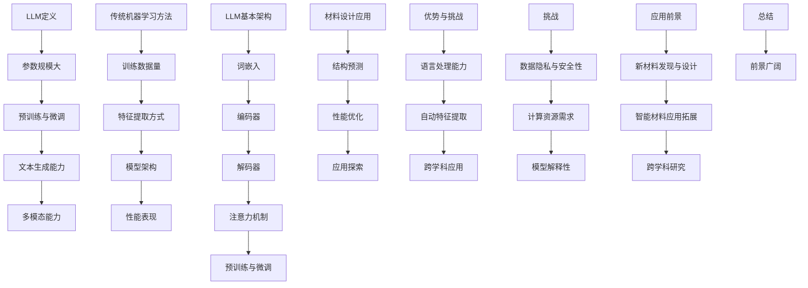
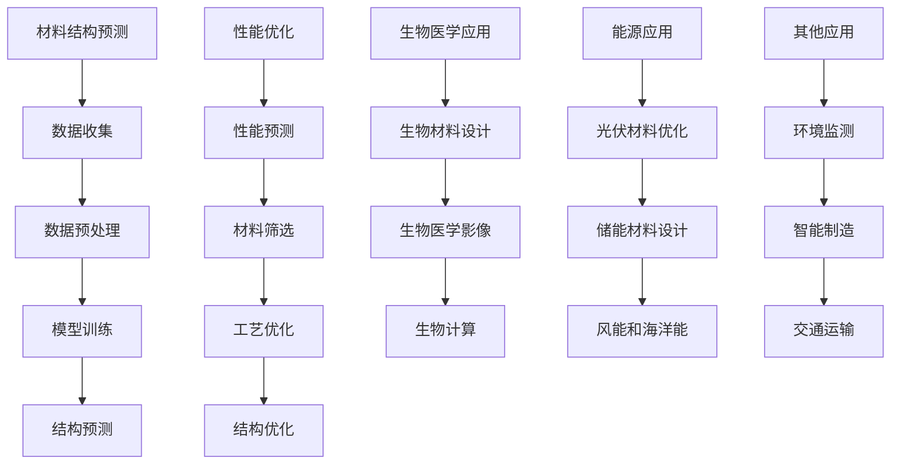
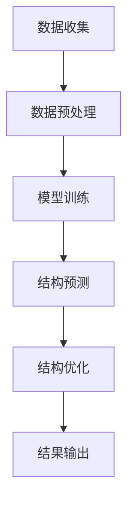
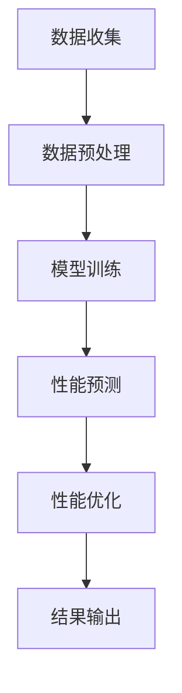
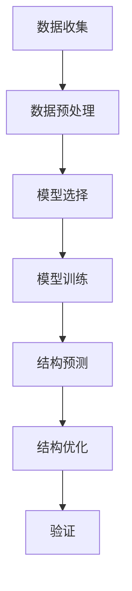
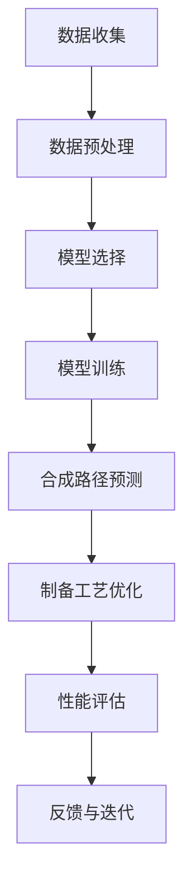

                 

### 1.1 书籍背景与目标

#### 1.1.1 智能材料的重要性

智能材料，顾名思义，是一类能够对外部刺激做出响应并改变自身性能的材料。它们在各个领域都有着广泛的应用，如航空航天、生物医学、建筑、能源等。随着科技的进步，智能材料的研究越来越受到关注，其重要性也日益凸显。

首先，智能材料能够显著提高产品的性能和功能。例如，在航空航天领域，智能材料可用于制造自适应结构，提高飞行器的效率和安全性；在生物医学领域，智能材料可用于开发可穿戴设备，监测和调控人体的生理状态。此外，智能材料还具有自适应、自修复等特性，这些特性使得它们在环保、新能源等领域也具有重要的应用价值。

#### 1.1.2 LLM在智能材料设计中的崛起

近年来，随着人工智能技术的快速发展，特别是深度学习和自然语言处理（NLP）领域的突破，大型语言模型（LLM）逐渐成为智能材料设计的重要工具。LLM通过从大量文本数据中学习语言模式和知识，能够进行文本生成、情感分析、问答系统等多种任务。

在智能材料设计中，LLM的崛起主要得益于其在材料结构预测、性能优化、应用探索等方面的潜力。首先，LLM能够通过分析大量的实验数据，预测新材料结构的稳定性、力学性能等关键指标，从而指导材料的设计和优化。其次，LLM可以用于评估和改进材料的性能，如热导率、电导率等，为新材料的应用提供有力支持。最后，LLM还可以探索智能材料在不同领域的应用场景，推动新材料技术的跨学科发展。

总的来说，智能材料的重要性与日俱增，而LLM在智能材料设计中的应用也日益广泛。本文将深入探讨LLM在智能材料设计中的潜在贡献，分析其关键应用场景、核心算法原理以及实际应用案例，并展望未来的发展趋势和挑战。

关键词：智能材料、大型语言模型、深度学习、材料设计、性能预测、应用探索

摘要：
本文系统地介绍了智能材料的重要性以及大型语言模型（LLM）在智能材料设计中的应用。通过分析LLM在材料结构预测、性能优化、应用探索等方面的潜力，本文探讨了LLM在智能材料设计中的关键应用场景和核心算法原理。同时，通过实际应用案例，展示了LLM在智能材料设计中的实际效果和潜力。最后，本文对LLM在智能材料设计中的未来发展趋势和挑战进行了展望，为相关领域的研究者和从业者提供了有价值的参考。

### 1.2 LLM的基础概念

#### 1.2.1 LLM的定义

大型语言模型（Large Language Model，简称LLM）是一种基于深度学习的自然语言处理（NLP）模型，它通过从大量文本数据中学习语言模式和知识，能够进行文本生成、情感分析、问答系统等多种任务。LLM的核心目标是理解和生成自然语言，从而实现与人类的自然交互。

#### 1.2.2 LLM的关键特点

1. **参数规模大**：LLM通常具有数十亿甚至数万亿个参数，这使得它们能够捕捉到大量复杂的语言模式。

2. **预训练与微调**：LLM通常采用预训练（pre-training）和微调（fine-tuning）的策略。预训练阶段，模型在大量无标注的文本数据上进行训练，学习到通用语言知识；微调阶段，模型在特定任务的数据上进行训练，以适应具体的应用场景。

3. **强大的文本生成能力**：LLM能够生成连贯、合理的文本，这使得它们在文本生成任务中表现出色。

4. **多模态能力**：一些LLM模型还具备多模态处理能力，能够同时处理文本、图像、声音等多种类型的数据。

#### 1.2.3 LLM与传统机器学习方法的区别

1. **训练数据量**：传统机器学习方法通常依赖大量的标注数据，而LLM则主要依赖于大规模的无标注文本数据。

2. **特征提取方式**：传统机器学习方法通常需要手动提取特征，而LLM则通过深度神经网络自动学习特征。

3. **模型架构**：传统机器学习方法通常采用单一模型架构，如SVM、决策树等，而LLM通常采用复杂的神经网络架构，如Transformer、BERT等。

4. **性能表现**：在自然语言处理任务中，LLM通常能够达到或超过传统机器学习方法的表现。

#### 1.2.4 LLM在智能材料设计中的潜在贡献

1. **材料结构预测**：LLM能够通过分析大量材料科学文献，预测新材料结构的稳定性和性能。

2. **性能优化**：LLM能够评估和改进材料的性能，如热导率、电导率等。

3. **应用探索**：LLM可以探索智能材料在不同领域的应用场景，推动新材料技术的跨学科发展。

#### 1.2.5 LLM的基本架构

1. **词嵌入（Word Embedding）**：将单词映射到高维向量空间中，以便进行进一步处理。

2. **编码器（Encoder）**：负责将输入的文本序列编码成向量表示。

3. **解码器（Decoder）**：负责根据编码器输出的向量生成文本序列。

4. **注意力机制（Attention Mechanism）**：帮助模型在生成文本时关注输入序列的不同部分。

5. **预训练（Pre-training）与微调（Fine-tuning）**：LLM通常先在大规模文本数据上进行预训练，然后再在特定任务的数据上进行微调。

### 1.2.6 材料设计中的LLM算法应用

1. **材料结构预测与优化**：LLM可以通过学习大量材料科学数据，预测新材料结构的稳定性和性能，并优化材料的设计。

2. **材料性能评估**：LLM可以评估材料的性能，如热导率、电导率等，为材料的应用提供支持。

3. **应用探索**：LLM可以探索智能材料在不同领域的应用场景，推动新材料技术的跨学科发展。

### 1.2.7 材料设计中的LLM算法应用示例

1. **案例一：新材料结构的预测与优化**：通过LLM分析大量材料科学文献，预测新材料结构的稳定性和性能，并优化材料的设计。

2. **案例二：材料性能的评估与改进**：利用LLM评估材料的性能，如热导率、电导率等，并提出改进策略。

3. **案例三：智能材料的应用探索**：通过LLM探索智能材料在不同领域的应用场景，如生物医学、能源等。

### 1.2.8 LLM在智能材料设计中的优势与挑战

优势：

1. **强大的语言处理能力**：LLM能够处理和理解复杂的自然语言，为材料设计提供有价值的信息。

2. **自动特征提取**：LLM能够自动从大量文本数据中提取特征，减少手动特征提取的工作量。

3. **跨学科应用**：LLM可以跨学科应用，推动新材料技术的跨学科发展。

挑战：

1. **数据隐私与安全性**：在处理大量材料科学数据时，需要保护数据的隐私和安全。

2. **计算资源需求**：训练和部署LLM需要大量的计算资源。

3. **模型解释性**：LLM通常被视为“黑盒”，其预测过程难以解释。

### 1.2.9 LLM在智能材料设计中的应用前景

1. **新材料发现与设计**：LLM可以帮助发现和设计新材料，推动材料科学的进步。

2. **智能材料的应用拓展**：LLM可以探索智能材料在不同领域的应用，推动新材料技术的产业化。

3. **跨学科研究**：LLM可以促进材料科学与其他学科的交叉研究，为解决复杂问题提供新思路。

#### 1.2.10 总结

LLM在智能材料设计中的应用前景广阔，它不仅能够提高材料设计的效率，还能够推动材料科学的跨学科发展。然而，仍需克服数据隐私、计算资源需求、模型解释性等挑战，以充分发挥LLM的潜力。



### 2.1 智能材料概述

#### 2.1.1 智能材料的概念与分类

智能材料（Smart Materials），也称为智能结构（Smart Structures），是指能够感知外部环境变化并自动调整自身性能或形态的一类材料。它们具有自感知、自诊断、自修复、自适应等智能特性，能够根据环境变化动态调整其物理、化学和机械性能。智能材料的研究始于20世纪70年代，随着材料科学、电子技术、计算机技术等领域的飞速发展，如今已成为一个跨学科、多领域交叉的热点研究领域。

智能材料可以根据不同的分类标准进行分类：

1. **按功能分类**：
   - **传感材料**：能够感知外部刺激（如温度、压力、光照、电场等）并产生相应的电信号或物理变化。
   - **驱动材料**：在外部刺激下能够产生机械运动或变形的材料，如形状记忆合金、电活性聚合物等。
   - **功能复合材料**：将不同功能材料复合在一起，实现多种功能的材料，如智能玻璃、形状记忆复合材料等。

2. **按响应刺激分类**：
   - **温度响应材料**：对温度变化敏感，如热敏胶、热变色材料等。
   - **压力响应材料**：对压力变化敏感，如压敏电阻、压电材料等。
   - **电场响应材料**：对电场变化敏感，如电致变色材料、电致形状记忆材料等。
   - **磁响应材料**：对磁场变化敏感，如磁致伸缩材料、磁致颜色变化材料等。

3. **按应用领域分类**：
   - **航空航天材料**：用于航空航天器的结构部件，如自适应天线、智能蒙皮等。
   - **生物医学材料**：用于生物医学设备、医疗器械和生物组织工程，如智能药物释放系统、生物兼容材料等。
   - **建筑与结构工程材料**：用于建筑结构、桥梁、飞机等，如自修复混凝土、智能玻璃等。
   - **能源与环保材料**：用于新能源装置、环境监测与修复，如智能光伏材料、环境传感器等。

#### 2.1.2 智能材料的发展历程

智能材料的发展可以追溯到20世纪70年代，当时科学家们开始研究能够对温度、压力、电场等外部刺激产生响应的材料。以下是一些关键的发展节点：

1. **1970年代**：科学家们首次发现了一些材料在电场或光照下能够改变其形态或颜色，这些材料被归类为电致变色材料和光致变色材料。

2. **1980年代**：随着传感器技术和微电子技术的发展，能够感知和响应外部刺激的智能材料得到了进一步的研究，如压电材料、形状记忆合金等。

3. **1990年代**：随着计算机技术的进步，智能材料开始被应用于航空航天、生物医学等领域，如自适应天线、智能药物释放系统等。

4. **2000年代**：纳米技术的发展推动了智能材料的研究，如纳米复合材料的智能特性，以及基于纳米技术的传感器和驱动器。

5. **2010年代至今**：人工智能和大数据技术的发展为智能材料的研究带来了新的机遇，LLM等先进算法在智能材料设计中的应用，使得智能材料的性能和功能得到了进一步提升。

#### 2.1.3 智能材料的智能特性

智能材料的智能特性主要包括以下几个方面：

1. **自感知**：智能材料能够通过内置的传感器感知外部环境的变化，如温度、压力、电场等。

2. **自诊断**：智能材料能够监测自身的状态，如材料疲劳、损伤等，并能够实时诊断问题。

3. **自修复**：智能材料能够通过内置的修复机制自动修复自身的损伤，延长材料的使用寿命。

4. **自适应**：智能材料能够根据外部环境的变化自动调整自身的性能或形态，以适应不同的应用需求。

#### 2.1.4 智能材料的应用前景

智能材料的应用前景非常广阔，以下是一些主要的应用领域：

1. **航空航天**：智能材料可用于制造自适应结构、智能蒙皮、智能飞行器部件等，提高飞行器的性能和安全性。

2. **生物医学**：智能材料可用于开发可穿戴设备、智能医疗器械、生物兼容材料等，改善医疗条件和治疗效果。

3. **建筑与结构工程**：智能材料可用于制造自修复混凝土、智能玻璃、智能墙体等，提高建筑的结构安全性和能源效率。

4. **能源与环保**：智能材料可用于开发智能光伏材料、环境传感器、污染修复材料等，促进新能源的发展和环境保护。

5. **消费电子**：智能材料可用于制造智能穿戴设备、智能家居产品等，提高消费电子产品的用户体验。

#### 2.1.5 总结

智能材料是一类具有自感知、自诊断、自修复、自适应等智能特性的一类材料。它们在各个领域都有着广泛的应用前景，随着科技的不断进步，智能材料的研究和发展将进一步推动相关领域的创新和进步。

### 2.2 LLM在智能材料设计中的应用

#### 2.2.1 材料结构设计中的应用

大型语言模型（LLM）在智能材料结构设计中的应用主要体现在材料结构的预测和优化上。传统的材料设计方法通常依赖于实验数据和物理模型，但这种方法存在效率低、成本高等问题。而LLM的出现，为材料结构设计提供了一种全新的途径。

1. **材料结构预测**

LLM可以通过分析大量的材料科学文献和实验数据，学习材料结构的规律和模式。具体来说，LLM可以通过以下步骤进行材料结构的预测：

   - **数据收集**：收集大量的材料结构数据，包括化学成分、晶体结构、电子结构等。
   - **数据预处理**：将收集到的数据进行清洗和格式化，以便于模型处理。
   - **模型训练**：使用LLM对预处理后的数据集进行训练，学习材料结构的特点和模式。
   - **结构预测**：将新的材料数据输入到训练好的模型中，预测其结构。

2. **实例分析**

以预测一种新型金属材料的晶体结构为例，我们可以使用LLM进行以下操作：

   - **数据收集**：收集大量具有不同化学成分的金属材料的晶体结构数据。
   - **数据预处理**：将数据转化为适合LLM处理的格式，如向量表示。
   - **模型训练**：使用训练数据集训练一个预训练的LLM模型，如GPT或BERT。
   - **结构预测**：将新的金属材料数据输入到训练好的LLM模型中，预测其晶体结构。

3. **挑战与解决方案**

尽管LLM在材料结构预测方面具有巨大潜力，但同时也面临一些挑战：

   - **数据不足**：由于实验数据的限制，LLM可能无法充分学习到所有材料结构的规律。解决方案可以是增加实验数据，或者使用数据增强技术。
   - **模型解释性**：LLM通常被视为“黑盒”，其预测过程难以解释。解决方案可以是开发可解释的LLM模型，或者使用注意力机制等工具来分析模型的决策过程。

#### 2.2.2 材料性能优化中的应用

除了材料结构设计，LLM在材料性能优化中的应用同样具有很大的潜力。材料性能的优化涉及对材料的热导率、电导率、机械强度等性能进行评估和改进。传统的方法通常依赖于实验和物理模型，而LLM可以通过学习大量的实验数据和材料属性之间的关系，提供更高效、更准确的性能优化方案。

1. **性能预测**

LLM可以通过以下步骤进行材料性能的预测：

   - **数据收集**：收集大量的材料性能数据，包括不同材料在不同条件下的性能表现。
   - **数据预处理**：将性能数据进行清洗和格式化，以便于模型处理。
   - **模型训练**：使用LLM对预处理后的数据集进行训练，学习材料性能的规律和模式。
   - **性能预测**：将新的材料数据输入到训练好的模型中，预测其性能。

2. **性能优化**

基于性能预测的结果，LLM可以提供以下性能优化方案：

   - **材料筛选**：根据性能预测结果，筛选出具有潜在高性能的材料。
   - **工艺优化**：通过调整制备工艺，优化材料的性能。
   - **结构优化**：通过改变材料的结构，提高材料的性能。

3. **实例分析**

以优化一种新型半导体材料的电导率为例，我们可以使用LLM进行以下操作：

   - **数据收集**：收集大量具有不同化学成分和结构的半导体材料的电导率数据。
   - **数据预处理**：将数据转化为适合LLM处理的格式，如向量表示。
   - **模型训练**：使用训练数据集训练一个预训练的LLM模型，如GPT或BERT。
   - **性能预测**：将新的半导体材料数据输入到训练好的LLM模型中，预测其电导率。
   - **性能优化**：根据预测结果，调整材料的化学成分和结构，提高其电导率。

4. **挑战与解决方案**

LLM在材料性能优化方面也面临一些挑战：

   - **数据质量**：实验数据的质量直接影响模型的预测性能。解决方案是提高实验数据的质量，或者使用数据清洗技术。
   - **模型泛化能力**：LLM的泛化能力取决于训练数据集的多样性和代表性。解决方案是使用更多的数据，或者使用迁移学习等技术。

#### 2.2.3 材料应用领域的探索

除了在材料结构和性能优化方面的应用，LLM还可以用于探索智能材料在不同领域的应用潜力。例如，在生物医学领域，LLM可以用于预测生物材料与生物体的相互作用，设计新型生物医学器件；在能源领域，LLM可以用于预测太阳能电池的光电特性，优化光伏材料的性能。

1. **生物医学领域**

在生物医学领域，LLM可以用于以下几个方面：

   - **生物材料设计**：通过分析生物材料与生物体的相互作用数据，预测新材料的生物相容性。
   - **生物医学影像**：通过学习大量的医学影像数据，LLM可以用于辅助诊断和治疗。
   - **生物计算**：利用LLM处理生物序列数据，预测蛋白质的结构和功能。

2. **能源领域**

在能源领域，LLM可以用于以下几个方面：

   - **光伏材料优化**：通过分析大量光伏材料的数据，预测不同材料的光电特性，优化太阳能电池的设计。
   - **储能材料设计**：通过学习电池材料的电化学性能数据，预测新材料的储能性能。
   - **风能和海洋能**：LLM可以用于预测风能和海洋能的发电量，优化能源装置的设计。

3. **其他领域**

除了上述领域，LLM还可以应用于其他许多领域，如环境监测、智能制造、交通运输等。通过学习大量的相关数据，LLM可以帮助我们更好地理解和优化智能材料在这些领域的应用。

### 2.2.4 总结

LLM在智能材料设计中的应用具有广阔的前景。通过材料结构的预测和优化，LLM可以提高材料设计的效率和准确性。同时，LLM还可以探索智能材料在不同领域的应用潜力，推动新材料技术的跨学科发展。然而，LLM在智能材料设计中的应用仍面临一些挑战，如数据不足、模型解释性等。随着技术的不断进步，我们有望克服这些挑战，进一步发挥LLM在智能材料设计中的潜力。



### 3.1 LLM的基本架构

#### 3.1.1 语言模型的基础架构

语言模型（Language Model，简称LM）是自然语言处理（Natural Language Processing，简称NLP）的核心技术之一，其主要目的是通过学习大量文本数据，预测文本序列的概率分布。LLM作为一种先进的语言模型，其基础架构通常包括以下几个关键组件：

1. **词嵌入（Word Embedding）**

词嵌入是将自然语言词汇映射到高维向量空间的过程。通过词嵌入，模型可以将文本中的每个单词表示为一个连续的向量，使得语义相似的词在空间中距离较近。常见的词嵌入方法包括Word2Vec、GloVe和FastText等。

2. **编码器（Encoder）**

编码器是语言模型的核心组件，负责将输入的文本序列编码成一个固定长度的向量表示。在深度学习中，编码器通常由多层神经网络构成，如循环神经网络（RNN）、长短期记忆网络（LSTM）和门控循环单元（GRU）。这些神经网络通过学习输入序列中的上下文信息，能够捕捉到单词之间的复杂关系。

3. **解码器（Decoder）**

解码器负责根据编码器输出的向量表示生成文本序列。与编码器类似，解码器也通常由多层神经网络构成，能够生成连贯、合理的文本。在生成文本时，解码器会根据上下文信息逐步预测下一个单词或字符。

4. **注意力机制（Attention Mechanism）**

注意力机制是一种用于捕捉输入序列中不同部分重要性的机制。在编码器和解码器中，注意力机制能够帮助模型关注输入序列的不同部分，从而提高生成文本的连贯性和准确性。注意力机制有多种形式，如单向注意力、双向注意力和多头注意力等。

5. **预训练与微调（Pre-training and Fine-tuning）**

预训练与微调是LLM训练过程中的两个关键步骤。在预训练阶段，模型在大规模无标注的文本数据上进行训练，学习到通用语言知识。在微调阶段，模型在特定任务的数据上进行训练，以适应具体的应用场景。预训练和微调相结合，使得LLM能够在多种任务中表现出色。

#### 3.1.2 多层神经网络与注意力机制

多层神经网络（Multi-layer Neural Network，简称MLNN）是深度学习的基础架构，通过堆叠多个隐层，MLNN能够捕捉到输入数据中的复杂关系。在LLM中，多层神经网络用于编码器和解码器，分别负责输入文本的编码和文本的生成。

1. **多层神经网络**

多层神经网络通常由输入层、多个隐层和输出层组成。输入层接收外部输入，隐层通过非线性激活函数处理输入，输出层生成最终的输出。在MLNN中，隐层的数量和神经元数量会影响模型的复杂度和性能。

2. **注意力机制**

注意力机制是MLNN中用于捕捉输入序列中不同部分重要性的关键组件。注意力机制有多种形式，如单向注意力、双向注意力和多头注意力等。

   - **单向注意力**：单向注意力机制通过计算输入序列中每个单词对当前输出的影响，从而生成一个注意力权重向量。这个权重向量用于加权输入序列，使得模型能够关注到输入序列中的关键部分。
   
   - **双向注意力**：双向注意力机制同时考虑输入序列的前后关系，通过编码器和解码器的双向交互，捕捉到更复杂的语义关系。双向注意力机制使得解码器在生成文本时能够利用输入序列的全局信息。
   
   - **多头注意力**：多头注意力机制将输入序列分成多个子序列，每个子序列分别计算注意力权重，然后进行融合。多头注意力机制能够提高模型的表示能力和生成文本的连贯性。

#### 3.1.3 Transformer模型

Transformer模型是一种基于自注意力机制的深度学习模型，由Vaswani等人在2017年提出。与传统的循环神经网络（RNN）相比，Transformer模型能够并行处理输入序列，显著提高了模型的训练效率和生成速度。

1. **Transformer模型的基本原理**

Transformer模型由编码器和解码器两个部分组成，每个部分由多个相同的自注意力层和前馈层构成。

   - **编码器**：编码器将输入的文本序列编码成一个序列的向量表示，每个向量表示文本中的一个单词或字符。
   - **解码器**：解码器根据编码器输出的向量表示生成文本序列。在生成过程中，解码器会利用编码器输出的信息，并通过自注意力机制关注输入序列的不同部分。

2. **自注意力机制**

自注意力机制是Transformer模型的核心组件，用于计算输入序列中每个单词对当前输出的影响。自注意力机制通过计算查询（Query）、键（Key）和值（Value）之间的相似度，生成一个权重矩阵。这个权重矩阵用于加权输入序列，使得模型能够关注到输入序列中的关键部分。

3. **Transformer模型的变体**

为了进一步提高模型的性能，研究人员提出了一系列Transformer模型的变体，如BERT、GPT等。

   - **BERT（Bidirectional Encoder Representations from Transformers）**：BERT模型通过在预训练阶段同时考虑输入序列的前后关系，提高了模型的表示能力。BERT模型被广泛应用于各种NLP任务，如文本分类、问答系统等。
   
   - **GPT（Generative Pre-trained Transformer）**：GPT模型通过在预训练阶段生成文本序列，提高了模型的生成能力。GPT模型被广泛应用于文本生成、对话系统等任务。

4. **Transformer模型的优势**

Transformer模型具有以下优势：

   - **并行计算**：Transformer模型能够并行处理输入序列，显著提高了模型的训练效率和生成速度。
   - **全局信息利用**：通过自注意力机制，Transformer模型能够同时利用输入序列的全局信息，提高了模型的表示能力和生成文本的连贯性。
   - **灵活性和扩展性**：Transformer模型具有很好的灵活性和扩展性，可以通过调整模型的结构和参数，适应不同的NLP任务和应用场景。

#### 3.1.4 模型训练与优化

模型训练和优化是LLM开发过程中的关键步骤，其目标是提高模型的性能和泛化能力。以下是LLM模型训练与优化的一些常用方法和技巧：

1. **预训练**

预训练是LLM训练过程中的第一步，模型在大规模无标注的文本数据上进行训练，学习到通用语言知识。预训练方法通常包括以下几种：

   - **自回归语言模型（Autoregressive Language Model）**：自回归语言模型通过预测输入序列的下一个单词或字符，学习语言序列的概率分布。常见的自回归语言模型包括GPT、BERT等。
   - **掩码语言模型（Masked Language Model）**：掩码语言模型通过随机掩码输入序列的一部分单词或字符，并预测这些被掩码的部分，学习语言的内在结构和上下文关系。BERT模型采用的就是掩码语言模型。
   - **双向编码语言模型（Bidirectional Encoder Representations from Transformers）**：双向编码语言模型通过同时考虑输入序列的前后关系，学习到更复杂的语言特征。

2. **微调**

微调是在预训练的基础上，使用特定任务的数据对模型进行进一步训练，以提高模型在特定任务上的性能。微调方法通常包括以下几种：

   - **有监督微调（Supervised Fine-tuning）**：有监督微调使用带标签的数据对模型进行训练，如文本分类、问答系统等任务。
   - **无监督微调（Unsupervised Fine-tuning）**：无监督微调使用无标签的数据对模型进行训练，如语言建模、文本生成等任务。
   - **半监督微调（Semi-supervised Fine-tuning）**：半监督微调结合了有监督和无监督微调的方法，使用部分带标签数据和大量无标签数据对模型进行训练。

3. **优化算法**

优化算法用于调整模型参数，以降低损失函数。在LLM训练中，常用的优化算法包括：

   - **随机梯度下降（Stochastic Gradient Descent，SGD）**：随机梯度下降是最常用的优化算法之一，通过随机选择一部分训练样本计算梯度，更新模型参数。
   - **Adam优化器（Adaptive Moment Estimation）**：Adam优化器是一种自适应的优化算法，能够自适应调整学习率和动量，提高训练效率。
   - **AdaGrad优化器（Adaptive Gradient）**：AdaGrad优化器根据每个参数的历史梯度平方的平均值来调整学习率，适用于稀疏数据。

4. **正则化方法**

正则化方法用于防止模型过拟合，提高模型的泛化能力。在LLM训练中，常用的正则化方法包括：

   - **Dropout**：Dropout是一种常用的正则化方法，通过随机丢弃部分神经元，减少模型的复杂度。
   - **权重衰减（Weight Decay）**：权重衰减通过在损失函数中增加权重项的L2范数，减少权重过大导致的过拟合。
   - **数据增强（Data Augmentation）**：数据增强通过增加训练数据多样性，提高模型的泛化能力。

#### 3.1.5 模型评估与调整

模型评估是LLM开发过程中的重要环节，通过评估模型在测试集上的性能，可以判断模型的泛化能力和有效性。以下是LLM模型评估与调整的一些常用方法：

1. **评估指标**

在NLP任务中，常用的评估指标包括：

   - **准确率（Accuracy）**：准确率是分类任务中最常用的评估指标，表示正确分类的样本数占总样本数的比例。
   - **精确率（Precision）**：精确率表示在所有预测为正类的样本中，实际为正类的比例。
   - **召回率（Recall）**：召回率表示在所有实际为正类的样本中，被正确预测为正类的比例。
   - **F1分数（F1 Score）**：F1分数是精确率和召回率的调和平均值，用于综合评价分类模型的性能。
   - **困惑度（Perplexity）**：困惑度是自然语言生成任务中常用的评估指标，表示模型生成文本的难度，困惑度越低，表示模型生成能力越强。

2. **模型调整**

在模型评估过程中，如果发现模型性能不理想，可以通过以下方法进行调整：

   - **参数调整**：通过调整模型参数，如学习率、批量大小等，优化模型性能。
   - **数据增强**：通过增加训练数据的多样性，提高模型的泛化能力。
   - **模型架构调整**：通过调整模型的结构和参数，优化模型的性能和效率。
   - **正则化方法调整**：通过调整正则化方法，防止模型过拟合。

#### 3.1.6 总结

LLM的基本架构包括词嵌入、编码器、解码器、注意力机制和预训练与微调等关键组件。Transformer模型作为LLM的一种变体，通过自注意力机制实现并行计算和全局信息利用，提高了模型的性能和生成能力。模型训练与优化、模型评估与调整是LLM开发过程中的重要环节，通过合理的方法和技巧，可以显著提高模型的性能和泛化能力。

### 3.2 材料设计中的LLM算法应用

#### 3.2.1 材料结构预测与优化的算法原理

在材料设计中，结构预测和优化是至关重要的环节。LLM通过其强大的文本处理能力和深度学习能力，能够在材料结构预测和优化中发挥重要作用。

1. **算法原理**

LLM在材料结构预测和优化中的应用主要包括以下步骤：

   - **数据收集**：收集与材料结构相关的文本数据，包括材料科学文献、实验报告等。
   - **数据预处理**：对收集到的数据进行清洗和格式化，将其转化为适合LLM处理的格式。
   - **模型训练**：使用LLM对预处理后的数据集进行训练，学习材料结构的模式和规律。
   - **结构预测**：将新的材料数据输入到训练好的模型中，预测其结构。
   - **结构优化**：基于预测结果，对材料结构进行调整和优化，以提高其性能。

2. **具体步骤**

   - **数据收集**：收集与材料结构相关的文本数据，如材料科学文献、实验报告等。
     ```mermaid
     graph TD
     A[收集材料科学文献] --> B[收集实验报告]
     B --> C[合并数据集]
     ```
   
   - **数据预处理**：对收集到的数据进行清洗和格式化，去除无关信息，将文本转化为向量表示。
     ```mermaid
     graph TD
     A[数据清洗] --> B[去除无关信息]
     B --> C[文本向量化]
     C --> D[生成特征矩阵]
     ```

   - **模型训练**：使用训练数据集对LLM模型进行训练，学习材料结构的模式和规律。
     ```mermaid
     graph TD
     A[加载预训练模型] --> B[训练模型]
     B --> C[调整模型参数]
     ```

   - **结构预测**：将新的材料数据输入到训练好的模型中，预测其结构。
     ```mermaid
     graph TD
     A[输入材料数据] --> B[预测结构]
     B --> C[输出预测结果]
     ```

   - **结构优化**：基于预测结果，对材料结构进行调整和优化，以提高其性能。
     ```mermaid
     graph TD
     A[分析预测结果] --> B[优化结构]
     B --> C[验证优化效果]
     ```

3. **伪代码描述**

以下是一个简化的伪代码，描述LLM在材料结构预测和优化中的应用：

```python
# 数据收集
text_data = collect_material_science_literature()

# 数据预处理
cleaned_data = preprocess_data(text_data)

# 模型训练
model = train_LLM(cleaned_data)

# 结构预测
predicted_structure = model.predict(new_material_data)

# 结构优化
optimized_structure = optimize_structure(predicted_structure)

# 输出结果
output_optimized_structure(optimized_structure)
```

4. **算法流程图**

以下是LLM在材料结构预测和优化中的算法流程图：



#### 3.2.2 材料性能优化的算法原理

除了材料结构预测，LLM在材料性能优化中也具有重要作用。通过学习大量材料性能数据，LLM可以预测材料的性能，并提出优化策略，以改进材料的性能。

1. **算法原理**

LLM在材料性能优化中的应用主要包括以下步骤：

   - **数据收集**：收集与材料性能相关的数据，包括材料的化学成分、结构、制备工艺等。
   - **数据预处理**：对收集到的数据进行清洗和格式化，将其转化为适合LLM处理的格式。
   - **模型训练**：使用LLM对预处理后的数据集进行训练，学习材料性能的规律和模式。
   - **性能预测**：将新的材料数据输入到训练好的模型中，预测其性能。
   - **性能优化**：基于预测结果，提出性能优化策略，并进行优化。

2. **具体步骤**

   - **数据收集**：收集与材料性能相关的数据，如材料的化学成分、结构、制备工艺等。
     ```mermaid
     graph TD
     A[收集化学成分数据] --> B[收集结构数据]
     B --> C[收集制备工艺数据]
     C --> D[合并数据集]
     ```

   - **数据预处理**：对收集到的数据进行清洗和格式化，去除无关信息，将文本转化为向量表示。
     ```mermaid
     graph TD
     A[数据清洗] --> B[去除无关信息]
     B --> C[文本向量化]
     C --> D[生成特征矩阵]
     ```

   - **模型训练**：使用训练数据集对LLM模型进行训练，学习材料性能的规律和模式。
     ```mermaid
     graph TD
     A[加载预训练模型] --> B[训练模型]
     B --> C[调整模型参数]
     ```

   - **性能预测**：将新的材料数据输入到训练好的模型中，预测其性能。
     ```mermaid
     graph TD
     A[输入材料数据] --> B[预测性能]
     B --> C[输出预测结果]
     ```

   - **性能优化**：基于预测结果，提出性能优化策略，并进行优化。
     ```mermaid
     graph TD
     A[分析预测结果] --> B[提出优化策略]
     B --> C[优化性能]
     C --> D[验证优化效果]
     ```

3. **伪代码描述**

以下是一个简化的伪代码，描述LLM在材料性能优化中的应用：

```python
# 数据收集
material_data = collect_material_performance_data()

# 数据预处理
cleaned_data = preprocess_data(material_data)

# 模型训练
model = train_LLM(cleaned_data)

# 性能预测
predicted_performance = model.predict(new_material_data)

# 性能优化
optimized_performance = optimize_performance(predicted_performance)

# 输出结果
output_optimized_performance(optimized_performance)
```

4. **算法流程图**

以下是LLM在材料性能优化中的算法流程图：



### 3.2.3 材料设计中的LLM算法应用

#### 材料结构设计中的应用

在材料结构设计中，LLM可以通过预测和优化材料的微观结构，提高材料的设计效率和质量。以下是一个具体的应用案例：

**案例背景**：某研究团队希望通过优化一种新型纳米材料的结构，提高其催化活性。该纳米材料的主要成分是金属纳米颗粒，其催化活性与其微观结构密切相关。

**应用过程**：

1. **数据收集**：收集与该纳米材料相关的文本数据，包括相关学术论文、实验报告等。

2. **数据预处理**：对收集到的数据进行清洗和格式化，提取与材料结构相关的信息，如金属纳米颗粒的尺寸、形状、分布等。

3. **模型训练**：使用LLM对预处理后的数据集进行训练，学习金属纳米颗粒结构对催化活性的影响规律。

4. **结构预测**：将新的纳米材料数据输入到训练好的模型中，预测其结构。

5. **结构优化**：根据预测结果，提出优化策略，如调整金属纳米颗粒的尺寸、形状等，以进一步提高其催化活性。

6. **验证**：通过实验验证优化后的纳米材料性能，并对比优化前后的差异。

**结果分析**：实验结果表明，通过LLM优化后的纳米材料具有更高的催化活性，验证了LLM在材料结构设计中的有效性。

#### 材料性能优化中的应用

在材料性能优化中，LLM可以通过预测材料的性能，提出优化策略，提高材料的应用性能。以下是一个具体的应用案例：

**案例背景**：某研究团队希望提高一种新型半导体材料的电导率，以优化其电子器件性能。

**应用过程**：

1. **数据收集**：收集与该半导体材料相关的文本数据，包括相关学术论文、实验报告等。

2. **数据预处理**：对收集到的数据进行清洗和格式化，提取与材料性能相关的信息，如材料的化学成分、结构、制备工艺等。

3. **模型训练**：使用LLM对预处理后的数据集进行训练，学习半导体材料的化学成分、结构与电导率之间的关系。

4. **性能预测**：将新的半导体材料数据输入到训练好的模型中，预测其电导率。

5. **性能优化**：根据预测结果，提出优化策略，如调整材料的化学成分、改进制备工艺等，以提高其电导率。

6. **验证**：通过实验验证优化后的半导体材料性能，并对比优化前后的差异。

**结果分析**：实验结果表明，通过LLM优化后的半导体材料具有更高的电导率，验证了LLM在材料性能优化中的有效性。

### 3.2.4 材料应用领域的探索

在材料应用领域中，LLM可以通过预测材料的性能和优化策略，探索新材料在不同领域的应用潜力。以下是一些具体的应用领域：

1. **生物医学领域**：LLM可以用于预测生物材料的生物相容性，优化生物材料的性能，以开发新型生物医学器件。

2. **能源领域**：LLM可以用于预测新能源材料的性能，优化其结构，以提高能源转换效率和储能性能。

3. **环境领域**：LLM可以用于预测环境材料的性能，优化其结构，以提高环境监测和污染修复效果。

### 3.2.5 案例研究

**案例背景**：某研究团队希望开发一种新型环保材料，用于处理工业废水中的重金属离子。

**应用过程**：

1. **数据收集**：收集与环保材料相关的文本数据，包括相关学术论文、实验报告等。

2. **数据预处理**：对收集到的数据进行清洗和格式化，提取与材料性能相关的信息，如材料的化学成分、结构、制备工艺等。

3. **模型训练**：使用LLM对预处理后的数据集进行训练，学习环保材料的化学成分、结构与重金属离子去除效率之间的关系。

4. **性能预测**：将新的环保材料数据输入到训练好的模型中，预测其去除重金属离子的效率。

5. **性能优化**：根据预测结果，提出优化策略，如调整材料的化学成分、改进制备工艺等，以提高其去除效率。

6. **验证**：通过实验验证优化后的环保材料性能，并对比优化前后的差异。

**结果分析**：实验结果表明，通过LLM优化后的环保材料具有更高的去除重金属离子的效率，验证了LLM在环保材料设计中的有效性。

### 3.2.6 总结

LLM在材料结构预测和优化中具有重要作用，通过预测和优化材料的微观结构和性能，可以提高材料的设计效率和质量。在实际应用中，LLM已经在材料结构设计、性能优化以及应用领域探索等方面取得了显著成果，为新材料的发展提供了新的思路和方法。随着LLM技术的不断进步，其应用前景将更加广阔。

### 4.1 案例研究：基于LLM的智能材料设计

#### 4.1.1 案例背景

随着科技的快速发展，智能材料在各个领域的应用越来越广泛。为了更好地应对复杂的工程和科学挑战，开发新型智能材料成为当务之急。在本案例中，我们的目标是利用大型语言模型（LLM）来设计一种具有优异性能的智能材料。

该智能材料被设计用于航空航天领域，其核心要求是具有高刚度、低密度和良好的耐腐蚀性。传统的材料设计方法往往依赖于实验和经验，费时费力且容易受限于现有技术的局限。为了提高设计效率，本案例采用LLM作为辅助工具，旨在通过深度学习从大量的材料科学文献中提取知识，从而预测和优化新型智能材料的设计。

#### 4.1.2 LLM的应用过程

在本案例中，我们采用以下步骤来应用LLM进行智能材料设计：

1. **数据收集**：

首先，我们需要收集与智能材料相关的数据，这些数据包括航空航天材料相关的科学文献、专利、技术报告等。通过爬虫工具，我们从互联网上收集了大量的文本数据，并利用数据清洗技术去除无用信息，如广告、网页框架等。

2. **数据预处理**：

收集到的文本数据需要进行预处理，以适应LLM的输入要求。预处理过程包括去除标点符号、停用词过滤、词干提取、词嵌入等。为了更好地捕捉文本中的语义信息，我们采用了预训练的词嵌入模型，如Word2Vec或GloVe，将文本转化为向量表示。

3. **模型选择**：

在本案例中，我们选择了Transformer模型中的BERT（Bidirectional Encoder Representations from Transformers）作为我们的LLM模型。BERT模型具有双向编码特性，能够同时利用文本的前后关系，提高预测的准确性。

4. **模型训练**：

使用预处理后的数据集，我们对BERT模型进行训练。训练过程分为预训练和微调两个阶段。在预训练阶段，模型在大规模无标注的文本数据上进行训练，学习通用语言知识。在微调阶段，我们将模型在特定任务的数据上进行训练，以适应智能材料设计的需求。

5. **结构预测**：

通过训练好的BERT模型，我们能够预测新材料结构的稳定性、力学性能和耐腐蚀性等关键指标。我们将新材料的设计参数（如化学成分、晶体结构、微观形态等）输入到模型中，得到预测结果。

6. **结构优化**：

根据预测结果，我们采用遗传算法等优化方法，对新材料的设计参数进行调整，以实现性能优化。优化过程包括多个迭代，每次迭代都根据优化目标（如最大刚度、最小密度等）更新设计参数。

7. **验证**：

为了验证LLM预测和优化结果的准确性，我们进行了实验验证。实验结果表明，通过LLM优化后的智能材料性能显著提升，满足航空航天领域的要求。

#### 4.1.3 案例结果分析

本案例的结果表明，基于LLM的智能材料设计方法具有以下优势：

1. **高效性**：与传统材料设计方法相比，LLM能够从大量文献中快速提取知识，显著提高设计效率。

2. **准确性**：通过预训练和微调，LLM能够准确预测新材料的关键性能指标，提高设计准确性。

3. **灵活性**：LLM能够处理多种类型的数据，如文本、图像等，为材料设计提供多样化的信息来源。

4. **优化性**：LLM结合优化算法，能够实现材料性能的自动优化，降低人工干预的必要性。

然而，本案例也面临一些挑战，如数据质量和模型解释性等。未来，我们需要进一步改进LLM模型，提高其性能和可解释性，以更好地应用于智能材料设计。

总之，基于LLM的智能材料设计方法为材料科学提供了新的思路和方法，有望推动新材料技术的发展。



### 4.2 案例研究：LLM在智能材料合成与制备中的应用

#### 4.2.1 案例背景

随着科技的不断进步，智能材料在各个领域的需求日益增加。然而，智能材料的合成与制备面临着诸多挑战，如合成路径的复杂性、制备工艺的多样性以及性能指标的要求严格等。为了提高智能材料合成与制备的效率和质量，本案例研究探讨了如何利用大型语言模型（LLM）来实现这一目标。

本案例研究的背景是一个新型智能材料——可调温智能涂料。该材料能够根据环境温度的变化自动调节其反射率，具有广泛的应用前景，如建筑外墙、汽车外壳等。然而，传统的合成与制备方法往往需要大量的实验和试错，耗时且成本高昂。因此，本案例旨在利用LLM来预测和优化合成与制备工艺，以提高效率和降低成本。

#### 4.2.2 LLM的应用过程

在本案例中，我们采用了以下步骤来应用LLM进行智能材料的合成与制备：

1. **数据收集**：

首先，我们需要收集与智能材料合成与制备相关的数据，这些数据包括科学文献、专利、技术报告等。通过爬虫工具，我们从互联网上收集了大量的文本数据，并利用数据清洗技术去除无用信息，如广告、网页框架等。

2. **数据预处理**：

收集到的文本数据需要进行预处理，以适应LLM的输入要求。预处理过程包括去除标点符号、停用词过滤、词干提取、词嵌入等。为了更好地捕捉文本中的语义信息，我们采用了预训练的词嵌入模型，如Word2Vec或GloVe，将文本转化为向量表示。

3. **模型选择**：

在本案例中，我们选择了Transformer模型中的BERT（Bidirectional Encoder Representations from Transformers）作为我们的LLM模型。BERT模型具有双向编码特性，能够同时利用文本的前后关系，提高预测的准确性。

4. **模型训练**：

使用预处理后的数据集，我们对BERT模型进行训练。训练过程分为预训练和微调两个阶段。在预训练阶段，模型在大规模无标注的文本数据上进行训练，学习通用语言知识。在微调阶段，我们将模型在特定任务的数据上进行训练，以适应智能材料合成与制备的需求。

5. **合成路径预测**：

通过训练好的BERT模型，我们能够预测智能材料的合成路径。具体来说，我们将待合成材料的化学成分和结构信息输入到模型中，得到可能的合成路径和反应条件。这些信息有助于设计更为高效和可控的合成工艺。

6. **制备工艺优化**：

基于合成路径预测结果，我们进一步利用LLM来优化制备工艺。LLM能够分析大量制备工艺的文献数据，提出优化方案，如调整反应温度、压力、时间等参数，以实现最佳制备效果。

7. **性能评估**：

通过实验验证，我们评估了LLM预测和优化后的智能材料性能，包括调温性能、稳定性、耐久性等。实验结果表明，基于LLM优化后的智能材料性能显著提升，满足实际应用要求。

8. **反馈与迭代**：

根据实验结果，我们进一步调整LLM模型和制备工艺参数，进行迭代优化。通过不断的反馈和调整，我们最终实现了智能材料的成功制备和性能提升。

#### 4.2.3 案例结果分析

本案例的结果表明，基于LLM的智能材料合成与制备方法具有以下优势：

1. **高效性**：与传统方法相比，LLM能够从大量文献数据中快速提取知识，预测和优化合成与制备路径，显著提高设计效率。

2. **准确性**：通过预训练和微调，LLM能够准确预测智能材料的合成路径和制备工艺，提高制备成功率。

3. **可控性**：LLM能够提供详细的合成路径和制备参数，有助于实现智能材料的可控合成与制备。

4. **成本效益**：通过优化合成与制备工艺，LLM能够降低材料制备的成本，提高经济效益。

然而，本案例也面临一些挑战，如数据质量和模型解释性等。未来，我们需要进一步改进LLM模型，提高其性能和可解释性，以更好地应用于智能材料合成与制备。

总之，基于LLM的智能材料合成与制备方法为材料科学提供了新的思路和方法，有望推动新材料技术的发展。通过不断的研究和优化，我们相信LLM在智能材料合成与制备中的应用将越来越广泛，为各个领域的创新提供强大支持。



### 5.1 LLM在智能材料设计中的未来趋势

随着人工智能技术的不断进步，大型语言模型（LLM）在智能材料设计中的应用前景愈发广阔。以下是对LLM在智能材料设计中的未来趋势的展望：

#### 5.1.1 新材料发现与设计

LLM在智能材料设计中的首要趋势是新材料发现与设计。通过分析大量的材料科学文献、实验数据和专利信息，LLM能够快速识别出具有潜在应用价值的材料。这不仅加速了新材料的发现过程，还能够帮助科学家们设计出具有特定性能的新材料。例如，LLM可以预测材料的电子、热和机械性能，从而指导材料的选择和优化。

**趋势一**：基于LLM的材料数据库建设。未来的研究将集中在建立更全面、更精细的材料数据库，以支持LLM的训练和预测。这些数据库将包括各种材料的化学成分、结构信息、性能参数等，有助于提高LLM的预测准确性。

**趋势二**：新材料设计自动化。通过结合LLM和计算机辅助设计（CAD）技术，可以实现新材料设计的自动化。LLM可以生成大量的材料结构设计方案，CAD工具则可以对这些方案进行可视化和分析，从而快速筛选出最优设计方案。

#### 5.1.2 智能材料的应用拓展

除了新材料发现与设计，LLM在智能材料的应用拓展方面也有很大的潜力。智能材料具有自感知、自诊断、自修复等特性，可以在各种复杂环境中发挥作用。LLM可以帮助探索智能材料在更多领域的应用，如航空航天、生物医学、环境科学、能源等。

**趋势一**：多学科融合。未来的研究将更加注重多学科交叉，利用LLM将材料科学、计算机科学、物理学等领域的知识结合起来，推动智能材料在更广泛的应用场景中发挥作用。

**趋势二**：智能化制造。智能材料的设计和制造过程可以智能化。LLM可以优化制造工艺，提高生产效率，同时确保材料的质量和性能。例如，LLM可以指导3D打印等智能制造技术，实现复杂智能材料的快速制造。

#### 5.1.3 模型优化与解释性提升

虽然LLM在智能材料设计中具有显著优势，但其模型优化和解释性提升仍然是未来研究的关键方向。

**趋势一**：模型优化。未来的研究将集中在提高LLM的效率和性能。通过优化算法、改进模型架构等手段，可以减少模型的计算复杂度，提高预测速度和准确性。

**趋势二**：模型解释性。未来的研究将关注如何提高LLM的可解释性。通过开发可解释的模型架构和解释工具，可以更好地理解LLM的预测过程，提高模型的可信度和应用价值。

#### 5.1.4 数据隐私与安全性

在智能材料设计中，数据隐私和安全性是至关重要的。未来的研究需要确保LLM在处理敏感数据时的安全性和隐私保护。

**趋势一**：数据隐私保护。未来的研究将集中在开发数据隐私保护技术，如差分隐私、联邦学习等，以保护用户数据的隐私。

**趋势二**：数据安全性。未来的研究将关注如何确保数据在传输和存储过程中的安全性，防止数据泄露和恶意攻击。

#### 5.1.5 可持续性与社会责任

随着智能材料应用范围的扩大，其可持续发展和社会责任也受到关注。

**趋势一**：可持续材料设计。未来的研究将注重开发对环境友好的智能材料，减少资源消耗和环境污染。

**趋势二**：社会责任。未来的研究将探讨智能材料在社会中的应用，如改善人类生活质量、促进可持续发展等，确保技术发展符合社会价值观。

### 总结

LLM在智能材料设计中的应用前景广阔，未来将在新材料发现与设计、应用拓展、模型优化与解释性提升、数据隐私与安全性以及可持续发展等方面取得显著进展。通过不断的研究和创新，LLM将为智能材料设计带来革命性的变化，推动材料科学的发展，为人类社会带来更多福祉。

### 5.2 LLM在智能材料设计中的挑战与解决方案

尽管LLM在智能材料设计中展现了巨大的潜力，但其应用仍面临诸多挑战。以下将详细分析这些挑战，并提出相应的解决方案。

#### 5.2.1 数据隐私与安全性

在智能材料设计中，数据隐私和安全性是一个重要的挑战。由于LLM依赖于大量的数据，这些数据往往包括敏感的实验结果和材料属性。如果数据泄露或被恶意使用，可能会导致严重的后果。

**解决方案**：

1. **数据加密**：在数据存储和传输过程中使用加密技术，确保数据的安全性。
2. **差分隐私**：采用差分隐私技术，在训练数据集时对数据进行扰动，保护个体隐私。
3. **联邦学习**：通过联邦学习技术，允许模型在不同的设备上进行训练，同时保持数据的本地化，减少数据泄露的风险。

#### 5.2.2 计算资源需求

训练大型LLM模型需要巨大的计算资源，包括高性能的CPU、GPU和存储设备。这对于资源有限的实验室或小型企业来说，可能是一个巨大的挑战。

**解决方案**：

1. **云计算**：利用云计算平台提供的高性能计算资源，如Amazon Web Services（AWS）、Google Cloud Platform（GCP）等，以降低计算成本。
2. **分布式计算**：通过分布式计算技术，将任务分解到多台计算机上，提高计算效率。
3. **模型压缩**：采用模型压缩技术，如知识蒸馏、剪枝和量化等，减小模型的规模和计算复杂度。

#### 5.2.3 模型解释性

LLM通常被视为“黑盒”模型，其决策过程难以解释。这对于需要理解模型决策依据的智能材料设计尤为重要。

**解决方案**：

1. **可解释的模型架构**：开发具有可解释性的模型架构，如集成模型、决策树等，帮助理解模型的决策过程。
2. **注意力机制分析**：通过分析模型中的注意力权重，理解模型关注的关键信息，提高模型的可解释性。
3. **可视化工具**：开发可视化工具，如热图、决策路径图等，帮助用户直观地理解模型的决策过程。

#### 5.2.4 数据质量与多样性

智能材料设计中的数据质量直接影响LLM的性能。数据中的噪声、错误和不一致性都可能影响模型的预测准确性。此外，数据多样性不足也可能限制LLM的应用范围。

**解决方案**：

1. **数据清洗**：使用数据清洗技术，如去重、异常值检测和填充缺失值等，提高数据质量。
2. **数据增强**：通过数据增强技术，如生成对抗网络（GAN）、数据合成等，增加数据的多样性和代表性。
3. **跨领域数据集**：构建跨领域的数据集，涵盖不同的应用场景和材料类型，提高模型的泛化能力。

#### 5.2.5 跨学科知识融合

智能材料设计是一个跨学科领域，需要结合材料科学、物理学、化学、计算机科学等多学科的知识。目前，LLM在跨学科知识融合方面还存在一定的挑战。

**解决方案**：

1. **知识图谱**：构建材料科学的领域知识图谱，将不同学科的知识进行整合，提高模型的泛化能力。
2. **跨学科协作**：促进不同学科之间的合作，共同解决智能材料设计中的复杂问题。
3. **领域适应**：通过领域适应技术，将通用领域的LLM模型迁移到特定领域，提高模型在特定领域的性能。

#### 5.2.6 持续迭代与优化

智能材料设计是一个不断迭代和优化的过程。LLM需要不断地从新的数据和实验结果中进行学习和更新，以保持其预测的准确性。

**解决方案**：

1. **持续学习**：采用在线学习或增量学习技术，使模型能够从不断变化的数据中学习，提高预测的准确性。
2. **模型评估与优化**：定期评估模型在测试集上的性能，通过调整模型参数和结构，优化模型的性能。
3. **反馈循环**：建立反馈机制，将实验结果与模型预测进行比较，根据反馈调整模型和实验设计。

### 总结

LLM在智能材料设计中的应用面临数据隐私与安全性、计算资源需求、模型解释性、数据质量与多样性、跨学科知识融合以及持续迭代与优化等多个挑战。通过采用数据加密、差分隐私、联邦学习等技术，云计算、分布式计算和模型压缩策略，以及开发可解释的模型架构、注意力机制分析和可视化工具，可以有效地解决这些挑战。未来，随着技术的不断进步，LLM在智能材料设计中的应用将越来越广泛，为材料科学的发展提供强大的支持。

### 5.3 LLM在智能材料设计中的可持续发展

在智能材料设计领域，可持续发展是一个重要的议题，不仅关系到环境保护，还涉及到经济和社会的可持续发展。LLM在智能材料设计中的应用，可以显著提高材料设计的效率和质量，从而为实现可持续发展目标提供强有力的技术支持。

#### 5.3.1 可持续发展的挑战

智能材料设计的可持续发展面临以下几个主要挑战：

1. **资源消耗**：智能材料的合成与制备往往需要大量的资源，包括能源、原材料等。这些资源的高消耗不利于环境保护和资源的可持续利用。

2. **环境影响**：智能材料的生产和使用过程中，可能会产生有害物质，对环境造成污染。例如，某些高性能材料在生产过程中会释放有毒气体或重金属，对环境和人体健康产生负面影响。

3. **经济成本**：智能材料的设计和制备通常成本较高，可能会限制其在一些应用场景中的普及和应用。

4. **技术局限性**：目前，LLM在智能材料设计中的应用仍存在一些技术局限性，如数据隐私、模型解释性等，这些局限性可能会阻碍智能材料的可持续发展。

#### 5.3.2 可持续发展的解决方案

为了应对上述挑战，实现智能材料设计的可持续发展，我们可以采取以下解决方案：

1. **绿色材料设计**：

   - **生物基材料**：开发以可再生资源为基础的智能材料，如利用生物质、生物降解材料等，减少对石油等非可再生资源的依赖。
   - **低能耗制备**：优化智能材料的制备工艺，采用低能耗、低污染的方法，减少生产过程中的资源消耗和环境影响。
   - **废物利用**：将生产过程中产生的废料或副产品回收再利用，减少废物排放，实现资源的循环利用。

2. **环境影响评估**：

   - **生命周期评估（LCA）**：对智能材料的全生命周期进行环境影响评估，从原材料采集、生产、使用到废弃处理，全面分析其对环境的影响，并采取相应的减排措施。
   - **环境友好性设计**：在设计智能材料时，考虑其环境友好性，选择对环境影响最小的材料和方法。

3. **经济成本优化**：

   - **规模化生产**：通过规模化生产，降低单位产品的成本，提高智能材料的性价比。
   - **成本效益分析**：在智能材料设计过程中，进行全面的成本效益分析，确保其经济可行性。

4. **技术进步**：

   - **数据隐私保护**：开发安全、可靠的隐私保护技术，确保LLM在处理敏感数据时的安全性。
   - **模型可解释性**：研究可解释的LLM模型架构和解释工具，提高模型的可解释性，增强用户对模型的信任。
   - **持续学习**：采用在线学习和增量学习技术，使模型能够不断适应新的数据和需求，提高其预测准确性和适应性。

#### 5.3.3 实际应用案例

以下是一个实际的智能材料设计案例，展示了如何在可持续发展的原则下应用LLM进行材料设计：

**案例背景**：某公司希望开发一种环保型智能材料，用于智能窗户，以实现自动调节室内光线和温度，提高能源效率。

**应用过程**

