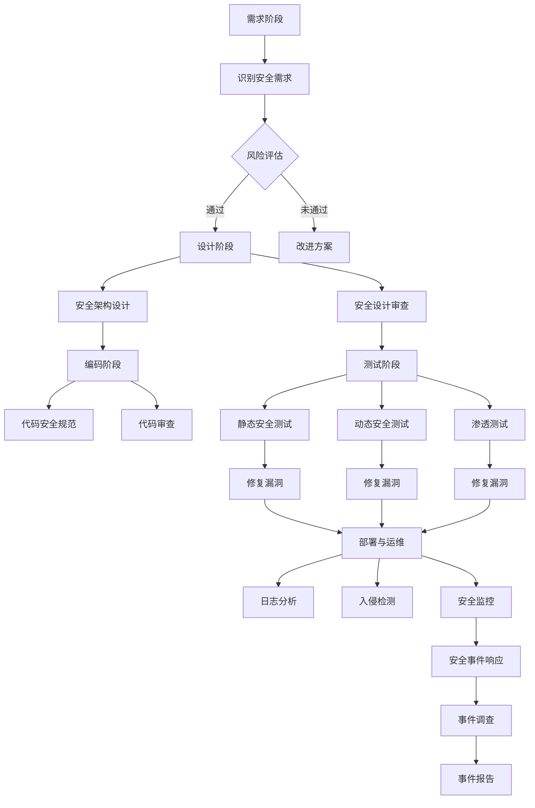

                 

# 第一部分：背景与概念介绍

## 第1章：LLM与持续安全概述

### 1.1.1 什么是LLM

自然语言处理（Natural Language Processing，NLP）是人工智能（Artificial Intelligence，AI）的一个重要分支，其主要目的是让计算机能够理解、处理和生成自然语言。近年来，随着深度学习的飞速发展，基于深度学习的语言模型（Language Model，LLM）取得了显著的成果，如Google的BERT、OpenAI的GPT-3等。LLM通过学习大规模语言数据，能够生成高质量的自然语言文本，从而在机器翻译、文本摘要、问答系统等领域表现出色。

LLM通常由多个层次组成，包括词嵌入层、编码层和解码层。词嵌入层将输入的单词映射为向量表示，编码层将词向量序列编码为固定长度的上下文向量，解码层则根据上下文向量生成输出序列。这种层次化的结构使得LLM能够捕获输入文本的长期依赖关系，从而生成更加自然的语言。

### 1.1.2 持续安全的概念

持续安全（Continuous Security）是一种将安全性与敏捷开发流程紧密结合的方法。传统的安全开发模式通常将安全作为开发流程的一个阶段，即开发完成后，再进行安全测试和修复。这种模式往往导致安全问题和漏洞在开发过程中被忽视，直至产品发布时才被发现，从而增加了安全风险。

持续安全则通过在开发周期的各个阶段（包括需求、设计、编码、测试和部署）引入安全措施，实现对安全问题的持续监控和快速响应。这种方法不仅可以提前发现和修复安全问题，还能确保在产品迭代过程中，安全性能始终得到保持和提升。

### 1.1.3 为什么需要在LLM应用中关注持续安全

随着LLM技术的广泛应用，其在各个领域的价值也逐渐凸显。然而，LLM应用在带来便利的同时，也面临着诸多安全挑战。以下是为什么在LLM应用中需要关注持续安全的几个原因：

1. **数据泄露风险**：LLM应用通常涉及大规模数据集的训练和推理，这些数据可能包括敏感个人信息、商业机密等。如果数据泄露，将对个人隐私和企业利益造成严重损害。

2. **模型篡改和对抗攻击**：攻击者可以通过篡改模型输入或输出，实现对LLM应用的恶意控制。例如，通过构造特定的输入文本，使得模型生成具有误导性的输出。

3. **网络安全威胁**：LLM应用往往通过网络进行部署和访问，这使得其容易受到网络攻击，如DDoS攻击、数据窃取等。

4. **伦理道德问题**：LLM生成的内容可能涉及虚假信息、歧视性言论等，这不仅损害用户权益，还可能对社会造成负面影响。

因此，为了确保LLM应用的安全、可靠和合规，必须在开发过程中引入持续安全策略。

## 第2章：敏捷开发与安全

### 2.1.1 敏捷开发的核心理念

敏捷开发（Agile Development）是一种以人为核心、迭代和渐进的方式推进项目开发的软件开发方法。其核心理念包括以下几个方面：

1. **客户合作**：敏捷开发强调与客户的紧密合作，通过快速迭代和持续交付，确保开发工作始终符合客户需求。

2. **响应变化**：敏捷开发认识到需求的变化是不可避免的，因此其核心在于快速响应变化，以适应不断变化的市场和技术环境。

3. **团队协作**：敏捷开发鼓励跨职能团队的合作，通过透明的工作流程和共享的责任，提高团队的整体效率。

4. **迭代开发**：敏捷开发将项目划分为多个迭代周期，每个迭代周期都包含需求分析、设计、编码、测试和部署等阶段，确保项目逐步推进，并及时发现问题。

5. **持续改进**：敏捷开发强调通过不断回顾和改进，提高团队的工作效率和产品质量。

### 2.1.2 敏捷开发中的安全问题

尽管敏捷开发具有诸多优点，但在实际应用中，安全问题往往被忽视。以下是敏捷开发中常见的几个安全问题：

1. **安全需求的变更管理**：在敏捷开发中，需求变更频繁，安全需求可能被忽视或推迟实施，导致安全漏洞无法及时发现和修复。

2. **安全测试的覆盖不足**：敏捷开发强调快速迭代，安全测试可能无法在每次迭代中都得到充分覆盖，从而增加安全风险。

3. **安全团队的参与度**：在敏捷开发中，安全团队往往被边缘化，安全专家的意见和建议难以得到充分重视，影响安全策略的制定和执行。

4. **安全工具的不足**：敏捷开发往往注重工具的灵活性和可定制性，可能忽视安全工具的引入和集成，导致安全措施难以落实。

### 2.1.3 如何在敏捷流程中集成安全

为了在敏捷开发中有效集成安全，需要采取以下措施：

1. **安全需求的明确和优先级**：在项目开始时，明确安全需求，并将其纳入迭代计划。确保安全需求与其他业务需求同等重要，优先考虑实施。

2. **安全活动的规划和执行**：在每次迭代计划中，规划安全活动，包括安全测试、安全培训和风险评估等。确保安全活动与开发工作同步进行。

3. **安全工具的支持**：引入安全工具，如静态代码分析、动态测试工具和漏洞扫描器等，提高安全测试的覆盖率和效率。

4. **安全团队的参与**：确保安全团队在开发流程中的积极参与，提供安全咨询和培训，协助解决安全问题。

5. **安全文化的培养**：通过安全培训和文化建设，提高团队成员的安全意识，形成安全共同责任。

通过以上措施，可以在敏捷开发中实现安全与开发的平衡，确保项目的安全性和可靠性。

## 第二部分：LLM应用的常见安全问题

### 第3章：数据安全

#### 3.1.1 数据泄露的风险与防范

数据泄露是LLM应用面临的主要安全风险之一。在LLM应用中，训练数据集通常包含大量敏感信息，如个人身份信息、财务数据、医疗记录等。如果这些数据泄露，不仅会导致用户隐私受损，还可能引发严重的法律和商业后果。

#### 风险防范措施：

1. **数据加密**：对敏感数据进行加密，确保数据在存储和传输过程中无法被未经授权的用户读取。常用的加密算法包括AES、RSA等。

2. **访问控制**：实施严格的访问控制策略，确保只有经过授权的用户才能访问敏感数据。访问控制可以基于角色、权限和加密密钥等实现。

3. **数据脱敏**：在训练数据集中，对敏感信息进行脱敏处理，如使用假名、掩码等技术，降低数据泄露的风险。

4. **数据备份与恢复**：定期备份数据，并确保备份数据的安全性。在数据丢失或损坏时，能够快速恢复数据。

5. **安全审计**：对数据访问和操作进行审计，及时发现和防范潜在的安全威胁。

#### 3.1.2 数据隐私保护方法

在LLM应用中，数据隐私保护是一个重要的课题。以下是一些常用的数据隐私保护方法：

1. **同态加密**：同态加密是一种能够在加密状态下进行计算的技术，允许在加密数据上进行操作，而不会泄露原始数据。这种方法在保护数据隐私方面具有显著优势。

2. **差分隐私**：差分隐私是一种通过在数据集上引入随机噪声来保护个体隐私的方法。这种方法能够确保在数据分析过程中，无法通过单个数据点的信息推断出个体身份。

3. **联邦学习**：联邦学习是一种分布式机器学习方法，可以在不共享原始数据的情况下，通过聚合模型参数来训练全局模型。这种方法能够保护数据隐私，同时提高模型性能。

4. **匿名化**：通过匿名化技术，将数据中的个人身份信息进行替换或删除，降低数据泄露的风险。

#### 3.1.3 数据访问控制策略

数据访问控制是确保LLM应用中数据安全的关键措施。以下是一些常用的数据访问控制策略：

1. **基于角色的访问控制（RBAC）**：根据用户的角色分配访问权限，确保用户只能访问与其角色相关的数据。

2. **基于属性的访问控制（ABAC）**：根据用户的属性（如部门、职位等）和资源的属性（如访问时间、访问频率等）来决定访问权限。

3. **多因素认证**：结合多种认证方式，如密码、指纹、面部识别等，提高认证的安全性。

4. **数据生命周期管理**：对数据从创建、存储、访问到销毁的全生命周期进行管理，确保数据在各个阶段的安全性。

5. **日志审计**：对数据访问和操作进行日志记录，便于事后审计和追溯。

### 第4章：模型安全

#### 4.1.1 模型篡改与对抗攻击

模型篡改和对抗攻击是LLM应用面临的另一个重要安全威胁。模型篡改是指攻击者通过恶意输入或篡改模型参数，使得模型输出不符合预期。对抗攻击则是指攻击者通过构造特定的输入，使得模型无法正常工作或生成错误的结果。

#### 风险防范措施：

1. **对抗训练**：通过在训练数据集中添加对抗样本，提高模型的鲁棒性，使其能够抵御对抗攻击。

2. **模型验证**：对模型进行定期的安全验证，确保模型输出的准确性和稳定性。

3. **输入过滤**：对输入进行严格的过滤和验证，防止恶意输入进入模型。

4. **模型加密**：对模型参数和权重进行加密，防止攻击者获取模型内部信息。

5. **多模型融合**：通过融合多个模型的预测结果，提高模型的鲁棒性和安全性。

#### 4.1.2 模型降权与防御策略

模型降权是指通过恶意输入或篡改模型参数，降低模型预测准确性的攻击方式。模型降权可能对LLM应用的性能产生严重影响，影响用户体验和业务价值。

#### 防御策略：

1. **模型加固**：通过改进模型架构和算法，提高模型对降权攻击的抵抗力。

2. **实时监控**：对模型输出进行实时监控，一旦发现异常，立即采取措施进行防御。

3. **输入验证**：对输入进行严格的验证和过滤，防止恶意输入进入模型。

4. **多模型融合**：通过融合多个模型的预测结果，提高模型对降权攻击的抵抗力。

5. **动态调整**：根据模型的实时性能，动态调整模型参数和训练策略，提高模型的鲁棒性。

#### 4.1.3 模型安全性评估方法

对LLM应用进行模型安全性评估是确保其安全性的重要环节。以下是一些常用的模型安全性评估方法：

1. **漏洞扫描**：使用自动化工具对模型进行漏洞扫描，发现潜在的安全漏洞。

2. **渗透测试**：模拟攻击者进行渗透测试，评估模型的安全性。

3. **对抗测试**：通过构造对抗样本，评估模型对对抗攻击的抵抗力。

4. **安全性测试框架**：使用安全性测试框架，对模型进行全面的评估和测试。

5. **实时监控与报警**：对模型输出进行实时监控，一旦发现异常，立即报警并采取措施。

### 第5章：网络安全

#### 5.1.1 网络安全的基本原则

网络安全是保障LLM应用安全的重要组成部分。以下是一些网络安全的基本原则：

1. **保密性**：确保数据在传输和存储过程中不会被未经授权的用户访问。

2. **完整性**：确保数据在传输和存储过程中不会被篡改或破坏。

3. **可用性**：确保网络服务在需要时能够正常访问和使用。

4. **可控性**：确保网络资源的访问和使用受到严格的控制和监督。

5. **可审查性**：对网络活动和操作进行记录和审计，确保在发生安全事件时能够进行追溯和调查。

#### 5.1.2 常见的网络攻击手段

以下是一些常见的网络攻击手段：

1. **分布式拒绝服务（DDoS）攻击**：攻击者通过大量无效请求占用目标服务器的资源，使其无法正常服务。

2. **数据窃取**：攻击者通过窃取敏感数据，如用户密码、信用卡信息等，进行非法牟利。

3. **钓鱼攻击**：攻击者通过伪造合法网站或邮件，诱骗用户输入个人信息。

4. **中间人攻击**：攻击者截获并篡改网络传输的数据，从而获取敏感信息。

5. **恶意软件攻击**：攻击者通过恶意软件，如病毒、木马等，控制目标系统，进行非法操作。

#### 5.1.3 安全防护措施

以下是一些常用的网络安全防护措施：

1. **防火墙**：通过防火墙限制网络流量，防止未经授权的访问。

2. **入侵检测与防御系统**：实时监控网络流量和系统行为，发现并阻止潜在的安全威胁。

3. **数据加密**：对敏感数据进行加密，确保数据在传输和存储过程中无法被窃取或篡改。

4. **安全策略与合规性**：制定严格的网络安全策略，确保网络设备和服务的合规性。

5. **安全培训与意识**：对员工进行安全培训，提高其安全意识和应对能力。

6. **安全审计与监控**：定期进行安全审计和监控，及时发现和防范潜在的安全风险。

### 第三部分：安全集成到敏捷流程中

#### 第6章：敏捷开发流程中的安全活动

#### 6.1.1 需求阶段的关注点

在敏捷开发的需求阶段，安全活动主要集中在以下几个方面：

1. **安全需求的识别**：与业务团队和利益相关者密切合作，识别并记录安全需求，确保安全需求与业务目标一致。

2. **风险评估**：对项目进行风险评估，识别潜在的安全威胁和风险，制定相应的风险管理计划。

3. **安全需求的优先级**：确保安全需求与其他业务需求同等重要，根据风险评估结果，确定安全需求的优先级。

4. **安全规范和标准**：制定安全规范和标准，确保项目开发和运维过程中遵循最佳安全实践。

#### 6.1.2 设计阶段的防御措施

在设计阶段，安全活动主要包括以下几个方面：

1. **安全架构设计**：在设计系统架构时，考虑安全需求，确保系统架构具有良好的安全性和可扩展性。

2. **安全设计审查**：对设计文档进行安全设计审查，识别潜在的安全隐患和漏洞，并提出改进建议。

3. **安全接口设计**：设计安全接口和协议，确保数据传输和存储的安全性。

4. **安全控制策略**：制定安全控制策略，包括访问控制、身份验证、授权等，确保系统资源的访问和使用受到严格控制。

#### 6.1.3 编码阶段的代码安全规范

在编码阶段，安全活动主要集中在以下几个方面：

1. **代码安全规范**：制定代码安全规范，包括输入验证、输出编码、错误处理等，确保代码具有良好的安全性。

2. **静态代码分析**：使用静态代码分析工具，对代码进行安全分析，识别潜在的安全漏洞和问题。

3. **动态代码分析**：通过动态代码分析工具，运行代码，捕捉运行时错误和安全漏洞。

4. **代码审查**：组织代码审查会议，对代码进行安全审查，确保代码遵循安全规范和标准。

#### 第7章：测试与监控

#### 7.1.1 安全测试方法与工具

在测试阶段，安全测试是确保LLM应用安全性的关键环节。以下是一些常用的安全测试方法与工具：

1. **静态安全测试**：通过分析代码的语法和结构，发现潜在的安全漏洞和问题。常用的工具包括SonarQube、Fortify等。

2. **动态安全测试**：通过运行代码，捕捉运行时错误和安全漏洞。常用的工具包括OWASP ZAP、Burp Suite等。

3. **渗透测试**：模拟攻击者的行为，对系统进行攻击，评估系统的安全性。常用的工具包括Metasploit、Nessus等。

4. **自动化安全测试**：使用自动化工具，对代码和系统进行定期安全测试，提高测试效率和覆盖范围。常用的工具包括Selenium、Appium等。

#### 7.1.2 持续监控与响应策略

持续监控是确保LLM应用安全性的重要手段。以下是一些持续监控与响应策略：

1. **日志分析**：对系统日志进行实时分析，识别异常行为和潜在的安全威胁。

2. **入侵检测系统**：部署入侵检测系统（IDS），实时监控网络流量和系统行为，发现并阻止攻击行为。

3. **安全信息与事件管理（SIEM）**：集成多种安全工具和日志数据，实现统一的安全事件监控和响应。

4. **安全事件响应**：制定安全事件响应计划，确保在发生安全事件时能够迅速响应，降低事件影响。

#### 7.1.3 安全事件的应急处理

安全事件应急处理是确保LLM应用安全性的最后防线。以下是一些安全事件应急处理步骤：

1. **事件识别**：及时发现安全事件，包括漏洞利用、数据泄露、恶意软件攻击等。

2. **事件响应**：启动安全事件响应计划，采取措施阻止攻击行为，降低事件影响。

3. **事件调查**：对安全事件进行调查，分析事件原因和影响，采取改进措施，防止类似事件再次发生。

4. **事件报告**：编写安全事件报告，记录事件经过、影响和应对措施，确保事件得到妥善处理。

### 第8章：案例研究

#### 8.1.1 某公司如何集成安全到LLM应用开发中

某公司是一家专注于自然语言处理技术的初创公司，其核心产品是一款基于大型语言模型的问答系统。为了确保产品的安全性，公司在敏捷开发流程中引入了持续安全策略。

1. **需求阶段**：
   - 公司在项目启动时，组织了需求评审会议，与客户和利益相关者共同识别和记录安全需求。
   - 通过风险评估，识别了数据泄露、模型篡改、网络安全等潜在风险，并制定了相应的风险管理计划。

2. **设计阶段**：
   - 公司在设计系统架构时，充分考虑了安全性需求，确保系统具有良好的安全性和可扩展性。
   - 进行了安全设计审查，识别了潜在的安全隐患和漏洞，并提出了改进建议。
   - 设计了安全接口和协议，确保数据传输和存储的安全性。
   - 制定了安全控制策略，包括访问控制、身份验证、授权等，确保系统资源的访问和使用受到严格控制。

3. **编码阶段**：
   - 公司制定了代码安全规范，包括输入验证、输出编码、错误处理等，确保代码具有良好的安全性。
   - 使用静态代码分析工具，对代码进行安全分析，识别潜在的安全漏洞和问题。
   - 通过动态代码分析工具，运行代码，捕捉运行时错误和安全漏洞。
   - 组织了代码审查会议，对代码进行安全审查，确保代码遵循安全规范和标准。

4. **测试阶段**：
   - 公司进行了静态安全测试、动态安全测试和渗透测试，全面评估了系统的安全性。
   - 使用自动化安全测试工具，对代码和系统进行定期安全测试，提高测试效率和覆盖范围。

5. **部署与运维阶段**：
   - 公司部署了入侵检测系统（IDS）和日志分析工具，实时监控网络流量和系统行为，发现并阻止攻击行为。
   - 制定了安全事件响应计划，确保在发生安全事件时能够迅速响应，降低事件影响。
   - 对系统进行定期安全审计和监控，及时发现和防范潜在的安全风险。

#### 8.1.2 案例分析：成功与失败的经验教训

在集成安全到LLM应用开发的过程中，公司取得了一些成功的经验，同时也面临了一些挑战。

1. **成功经验**：
   - 通过在需求阶段识别和记录安全需求，确保了安全需求与业务目标的一致性。
   - 在设计阶段，充分考虑了安全性需求，确保了系统架构的安全性和可扩展性。
   - 通过制定代码安全规范和进行代码审查，提高了代码的安全性。
   - 定期进行安全测试和监控，确保了系统的持续安全性。

2. **失败经验**：
   - 在敏捷开发中，安全需求的变更管理不够严格，导致部分安全需求被忽视。
   - 在测试阶段，安全测试覆盖不足，未能及时发现部分潜在的安全漏洞。
   - 安全团队在项目中的参与度不高，导致安全问题的发现和解决效率较低。

#### 8.1.3 启示与未来趋势

通过该案例，我们可以得出以下启示：

1. **安全与敏捷开发的结合**：在敏捷开发中，安全不应被视为附加任务，而应作为开发流程的一部分，与业务目标和需求紧密结合。

2. **持续安全监控与改进**：安全不是一次性任务，而应贯穿于整个开发周期。定期进行安全测试和监控，确保系统的持续安全性。

3. **安全团队的积极参与**：安全团队应在项目中发挥核心作用，提供安全咨询和支持，确保安全需求得到充分重视和实施。

未来，随着AI技术的不断发展，LLM应用在各个领域的应用将越来越广泛。因此，持续安全将成为LLM应用开发的重要方向。以下是一些未来趋势：

1. **自动化安全测试**：自动化安全测试工具和技术的不断发展，将提高安全测试的效率和覆盖范围。

2. **安全人工智能**：利用AI技术，开发具有自我保护能力的安全系统，提高系统的安全性和防御能力。

3. **安全合规性**：随着法规和标准的不断完善，LLM应用的安全合规性将成为重要议题，需要企业加强安全合规性管理。

### 附录

#### 附录A：安全工具与资源

在LLM应用开发中，使用合适的工具和资源对于确保应用的安全性至关重要。以下是一些常用的安全工具和资源：

1. **静态代码分析工具**：
   - **SonarQube**：一款流行的静态代码分析工具，支持多种编程语言，能够识别代码中的潜在安全漏洞。
   - **Fortify**：一款强大的静态代码分析工具，提供丰富的安全报告和修复建议。

2. **动态测试工具**：
   - **OWASP ZAP**：一款开源的动态测试工具，能够发现Web应用的多种安全漏洞。
   - **Burp Suite**：一款专业的Web应用安全测试工具，提供丰富的测试功能。

3. **渗透测试工具**：
   - **Metasploit**：一款强大的渗透测试框架，支持多种攻击和漏洞利用。
   - **Nessus**：一款流行的漏洞扫描工具，能够识别网络中的安全漏洞。

4. **日志分析工具**：
   - **ELK Stack**：一款基于Elasticsearch、Logstash和Kibana的日志分析平台，能够实时监控和分析日志数据。
   - **Splunk**：一款专业的日志分析和监控工具，提供强大的数据处理和分析功能。

5. **安全培训资源**：
   - **OWASP Foundation**：OWASP提供了一个丰富的安全资源库，包括安全指南、工具和培训材料。
   - **SANS Institute**：SANS提供各种安全培训课程和认证，帮助提高安全意识和技能。

通过使用这些工具和资源，开发者可以更好地确保LLM应用的安全性，降低安全风险。

### Mermaid 流程图

以下是一个简单的Mermaid流程图，展示了LLM应用开发中的安全活动：



### 伪代码

以下是一些用于实现数据加密与解密的伪代码示例：

```python
// 数据加密
function encryptData(data, key) {
    // 使用AES加密算法
    encryptedData = AES_encrypt(data, key)
    return encryptedData
}

// 数据解密
function decryptData(encryptedData, key) {
    // 使用AES解密算法
    decryptedData = AES_decrypt(encryptedData, key)
    return decryptedData
}
```

以下是一些用于实现模型降权检测的伪代码示例：

```python
// 模型降权检测
function detectModelDowngrade(model, input) {
    // 计算模型输入前的特征值
    originalFeatures = extractFeatures(input)
    
    // 计算模型输入后的预测结果
    predictedResult = model.predict(input)
    
    // 如果预测结果与原始特征值不一致，则可能发生了模型降权
    if (predictedResult != originalFeatures) {
        // 执行防御措施，例如重新训练模型
        retrainModel(model)
    }
}
```

### 数学模型和数学公式

在LLM应用中，数学模型和公式是非常重要的组成部分。以下是一个用于计算交叉熵损失函数的数学公式：

$$
\text{交叉熵损失函数} = -\sum_{i=1}^{n} y_i \log(p_i)
$$

其中，$y_i$ 是目标标签，$p_i$ 是模型预测的概率。

以下是一个用于模型降权检测的数学模型：

$$
y' = y \cdot \exp(-\lambda)
$$

其中，$y$ 是原始预测结果，$y'$ 是降权后的预测结果，$\lambda$ 是降权系数。

通过这些数学模型和公式，可以更准确地评估和检测LLM应用中的安全问题。

### 项目实战

以下是一个用于实现数据加密与解密的项目实战：

#### 开发环境：
- Python
- PyCryptoDome 库

#### 实现步骤：

1. **导入必要的库**：

```python
from Crypto.Cipher import AES
from Crypto.Random import get_random_bytes
```

2. **创建加密与解密函数**：

```python
def encryptData(data, key):
    cipher = AES.new(key, AES.MODE_EAX)
    ciphertext, tag = cipher.encrypt_and_digest(data)
    return ciphertext, tag

def decryptData(encryptedData, key, tag):
    cipher = AES.new(key, AES.MODE_EAX, nonce=cipher.nonce)
    data = cipher.decrypt_and_verify(encryptedData, tag)
    return data
```

3. **测试加密与解密**：

```python
key = get_random_bytes(16)
data = b"敏感数据"

encryptedData, tag = encryptData(data, key)
print(f"Encrypted Data: {encryptedData.hex()}")

decryptedData = decryptData(encryptedData, key, tag)
print(f"Decrypted Data: {decryptedData}")
```

以下是一个用于实现模型降权检测的项目实战：

#### 开发环境：
- Python
- Scikit-learn 库

#### 实现步骤：

1. **导入必要的库**：

```python
from sklearn.ensemble import RandomForestClassifier
from sklearn.datasets import load_iris
```

2. **准备数据**：

```python
iris = load_iris()
X, y = iris.data, iris.target
```

3. **训练模型**：

```python
model = RandomForestClassifier()
model.fit(X, y)
```

4. **模型降权检测**：

```python
def detectModelDowngrade(model, X, y):
    original_predictions = model.predict(X)
    model.fit(X, y)  # 重新训练模型
    downgrade_predictions = model.predict(X)
    
    if not np.array_equal(original_predictions, downgrade_predictions):
        print("模型可能发生了降权")
    else:
        print("模型没有发生降权")

detectModelDowngrade(model, X, y)
```

### 代码解读与分析

#### 数据加密与解密

在这个实战中，我们使用了PyCryptoDome库中的AES算法来实现数据加密与解密。加密函数`encryptData`接受数据`data`和密钥`key`，使用AES算法进行加密，并返回加密后的数据`ciphertext`和解密标签`tag`。解密函数`decryptData`接受加密后的数据`encryptedData`、密钥`key`和解密标签`tag`，使用AES算法进行解密，并返回原始数据。

加密和解密过程的关键在于密钥的安全性和算法的正确使用。在测试中，我们首先生成了一个随机密钥`key`，并将一段敏感数据`data`进行加密。然后，使用相同的密钥和解密标签进行解密，验证加密和解密过程是否正确。

#### 模型降权检测

在这个实战中，我们使用了Scikit-learn库中的`RandomForestClassifier`来训练一个模型，并实现了模型降权检测。降权检测的基本原理是：首先使用原始数据训练模型，记录下模型的预测结果。然后，再次使用相同的原始数据进行训练，比较两次预测结果是否一致。如果不一致，则说明模型可能发生了降权。

检测函数`detectModelDowngrade`首先使用原始数据`X`和标签`y`训练模型，记录下模型的原始预测结果。然后，再次使用原始数据进行训练，比较两次预测结果。如果两次预测结果不一致，说明模型可能发生了降权，并输出相应的提示信息。

通过这两个实战，我们可以看到在LLM应用中，数据加密与解密以及模型降权检测都是实现持续安全的重要手段。这些实战不仅展示了如何实现具体的安全功能，还提供了代码解读与分析，帮助我们更好地理解安全技术在LLM应用开发中的应用。

### 结论

本文详细探讨了LLM应用的持续安全问题，并介绍了如何将安全集成到敏捷开发流程中。通过分析数据安全、模型安全和网络安全等常见问题，我们提出了相应的防范措施和解决方案。同时，通过具体的案例研究和项目实战，展示了如何在实际开发过程中实现持续安全。

随着LLM技术的不断发展和应用范围的扩大，持续安全将成为确保应用可靠性和合规性的重要保障。未来，我们需要继续探索和引入新的安全技术和方法，以应对不断变化的安全威胁。

作者：AI天才研究院/AI Genius Institute & 禅与计算机程序设计艺术 /Zen And The Art of Computer Programming

