                 

# 《LLM的无限指令集与CPU的有限指令集》

> **关键词：** 机器学习、神经网络、指令集、CPU、LLM、深度学习、计算优化、协同工作、应用领域。

> **摘要：** 本文探讨了大型语言模型（LLM）与计算机中央处理单元（CPU）在指令集上的差异，分析了LLM的无限指令集与CPU的有限指令集的特点、应用及其交互方式，进一步探讨了二者在协同优化和未来发展趋势中的应用。

### 目录

1. **LLM与CPU基础概念** <a id="LLM_and_CPU"></a>
   1.1 无限指令集与有限指令集的定义
   1.2 LLM的无限指令集特点
   1.3 CPU的有限指令集特点
   1.4 LLM与CPU的关系与应用

2. **LLM架构与原理** <a id="LLM_architecture_and_principles"></a>
   2.1 LLM的基本架构
   2.2 LLM的训练过程
   2.3 LLM的推理过程
   2.4 LLM的核心算法——深度学习

3. **CPU架构与原理** <a id="CPU_architecture_and_principles"></a>
   3.1 CPU的基本架构
   3.2 CPU的工作原理
   3.3 CPU的指令集架构
   3.4 CPU的性能优化

4. **LLM与CPU的交互** <a id="interaction_of_LLM_and_CPU"></a>
   4.1 LLM与CPU的协同工作
   4.2 LLM在CPU上的优化
   4.3 CPU在LLM中的应用

5. **LLM应用实战** <a id="LLM_practical_uses"></a>
   5.1 LLM在自然语言处理中的应用
   5.2 LLM在计算机视觉中的应用
   5.3 LLM在推荐系统中的应用

6. **CPU应用实战** <a id="CPU_practical_uses"></a>
   6.1 CPU在数据中心的应用
   6.2 CPU在嵌入式系统的应用
   6.3 CPU在边缘计算中的应用

7. **LLM与CPU的协同优化** <a id="collaborative_optimization_of_LLM_and_CPU"></a>
   7.1 LLM与CPU的协同优化策略
   7.2 LLM与CPU的协同优化案例
   7.3 LLM与CPU的协同优化前景

8. **LLM与CPU的未来发展** <a id="future_development_of_LLM_and_CPU"></a>
   8.1 LLM与CPU技术的发展趋势
   8.2 LLM与CPU在人工智能中的应用前景
   8.3 LLM与CPU在教育、医疗等领域的应用探索

### 附录

- A.1 LLM与CPU的对比分析图表

### 第一部分：LLM与CPU基础概念

#### 1.1 无限指令集与有限指令集的定义

在计算机科学中，指令集是指计算机处理器能够理解和执行的指令集合。有限指令集（Fixed Instruction Set）是指处理器能够理解并执行的一组固定的指令。而无限指令集（Extensible Instruction Set）则允许处理器通过组合和扩展基本指令来执行更复杂的操作。

- **有限指令集：**  
  CPU的有限指令集意味着它能够直接执行的一组指令是固定的，通常由硬件设计决定。例如，Intel的x86架构和ARM架构都有各自的有限指令集。这些指令集经过多年的优化和改进，已经成为计算机硬件和软件领域的标准。

- **无限指令集：**  
  LLM的无限指令集则是一种软件层面的实现，它允许模型通过组合基本指令来生成新的指令。这种指令集不是固定的，而是动态生成的，依赖于模型的设计和训练过程。

#### 1.2 LLM的无限指令集特点

- **可扩展性：**  
  LLM的无限指令集具有极高的可扩展性。通过组合和扩展基本指令，模型可以执行复杂的操作，如自然语言生成、机器翻译和文本摘要等。

- **动态性：**  
  LLM的指令集是动态生成的，这意味着模型可以根据输入数据和任务需求调整指令集。这种动态性使得LLM在处理不同任务时能够灵活应对。

- **强表达力：**  
  由于无限指令集的支持，LLM可以生成高度复杂的表达式和算法。这使得LLM在许多领域都具有广泛的应用潜力。

#### 1.3 CPU的有限指令集特点

- **高效性：**  
  有限指令集的CPU通过硬件实现，能够快速执行指令。这使得CPU在执行大量简单任务时具有很高的性能。

- **兼容性：**  
  有限指令集的标准性使得不同厂商的CPU能够相互兼容，便于软件开发和硬件升级。

- **稳定性：**  
  有限指令集的稳定性使得CPU在长时间运行中具有很高的可靠性。

#### 1.4 LLM与CPU的关系与应用

- **协同工作：**  
  LLM和CPU在许多应用中需要协同工作。LLM提供复杂的计算能力，而CPU则负责高效的执行这些计算。

- **优化与调优：**  
  通过优化LLM的指令集和CPU的硬件设计，可以提高整个系统的性能。例如，使用特定于LLM的指令集可以减少模型的计算复杂度，从而提高执行速度。

- **应用领域：**  
  LLM和CPU在许多领域都有广泛的应用。例如，在自然语言处理、计算机视觉和推荐系统等领域，LLM通过CPU提供的计算能力来实现复杂任务的自动化。

### 第二部分：LLM架构与原理

#### 2.1 LLM的基本架构

LLM（大型语言模型）通常由以下几个核心组件构成：

1. **输入层（Input Layer）：**  
   输入层负责接收用户输入的文本数据，并将其转换为模型可以处理的内部表示。

2. **编码器（Encoder）：**  
   编码器负责将输入文本转换为上下文向量，以便模型可以理解文本的语义和结构。

3. **解码器（Decoder）：**  
   解码器负责将编码后的上下文向量解码为输出文本。

4. **注意力机制（Attention Mechanism）：**  
   注意力机制允许模型在编码器和解码器之间传递信息，从而提高模型对上下文的理解能力。

5. **输出层（Output Layer）：**  
   输出层负责将解码后的上下文向量转换为可解释的输出结果。

下面是一个简单的Mermaid流程图，展示了LLM的基本架构：

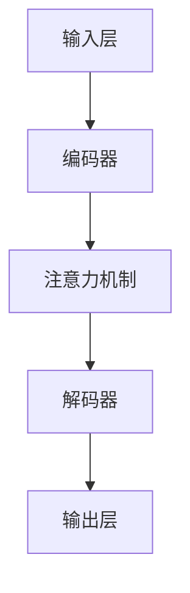

#### 2.2 LLM的训练过程

LLM的训练过程通常涉及以下几个步骤：

1. **数据准备（Data Preparation）：**  
   收集和整理大量的文本数据，并将其转换为模型可以处理的格式。

2. **预处理（Preprocessing）：**  
   对文本数据进行清洗、分词、标点符号去除等操作，以便模型可以更好地理解数据。

3. **编码（Encoding）：**  
   使用编码器将预处理后的文本数据转换为上下文向量。

4. **训练（Training）：**  
   通过训练算法（如梯度下降、反向传播等）调整模型参数，使模型能够更好地拟合训练数据。

5. **评估（Evaluation）：**  
   使用验证集和测试集评估模型的性能，并根据评估结果调整模型参数。

下面是一个简单的伪代码，展示了LLM的训练过程：

```python
# 数据准备
data = prepare_data()

# 预处理
preprocessed_data = preprocess(data)

# 编码
encoded_data = encode(preprocessed_data)

# 训练
model = train(encoded_data)

# 评估
evaluate(model, validation_set)
evaluate(model, test_set)
```

#### 2.3 LLM的推理过程

LLM的推理过程通常涉及以下几个步骤：

1. **输入接收（Input Reception）：**  
   接收用户输入的文本数据。

2. **编码（Encoding）：**  
   使用编码器将输入文本转换为上下文向量。

3. **推理（Inference）：**  
   使用解码器和解码器将编码后的上下文向量解码为输出结果。

4. **输出生成（Output Generation）：**  
   将输出结果转换为可解释的文本输出。

下面是一个简单的伪代码，展示了LLM的推理过程：

```python
# 输入接收
input_text = receive_input()

# 编码
encoded_input = encode(input_text)

# 推理
decoded_output = decode(encoded_input)

# 输出生成
output_text = generate_output(decoded_output)
```

#### 2.4 LLM的核心算法——深度学习

深度学习是LLM的核心算法，它通过多层神经网络对数据进行建模。深度学习模型通常由以下组件构成：

1. **输入层（Input Layer）：**  
   输入层接收输入数据。

2. **隐藏层（Hidden Layers）：**  
   隐藏层负责对输入数据进行处理和变换。

3. **输出层（Output Layer）：**  
   输出层生成最终输出结果。

深度学习模型的工作原理是通过反向传播算法调整模型参数，使模型能够更好地拟合训练数据。下面是一个简单的Mermaid流程图，展示了深度学习模型的基本结构：

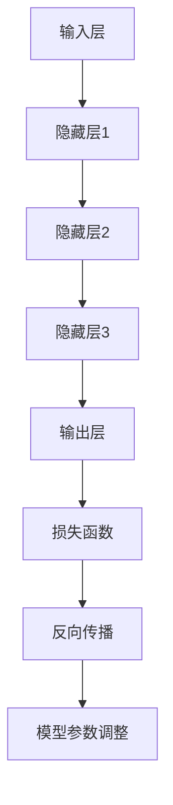

### 第三部分：CPU架构与原理

#### 3.1 CPU的基本架构

CPU的基本架构通常包括以下几个组件：

1. **控制器（Controller）：**  
   控制器负责协调CPU内部各个组件的工作，并执行指令。

2. **寄存器（Registers）：**  
   寄存器是CPU内部的高速存储单元，用于存储指令和数据。

3. **算术逻辑单元（ALU）：**  
   算术逻辑单元负责执行算术运算和逻辑运算。

4. **缓存（Cache）：**  
   缓存是CPU内部的高速存储单元，用于存储经常访问的数据和指令。

5. **内存管理单元（MMU）：**  
   内存管理单元负责管理CPU访问内存的操作，包括地址翻译和内存保护。

下面是一个简单的Mermaid流程图，展示了CPU的基本架构：

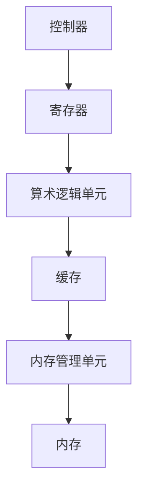

#### 3.2 CPU的工作原理

CPU的工作原理可以分为以下几个步骤：

1. **指令获取（Instruction Fetch）：**  
   CPU从内存中获取指令。

2. **指令解码（Instruction Decode）：**  
   CPU解码指令，确定指令的操作码和操作数。

3. **指令执行（Instruction Execution）：**  
   CPU执行指令，可能涉及寄存器操作、内存访问或算术运算。

4. **结果写回（Result Write-back）：**  
   CPU将指令执行的结果写回寄存器或内存。

下面是一个简单的Mermaid流程图，展示了CPU的工作原理：

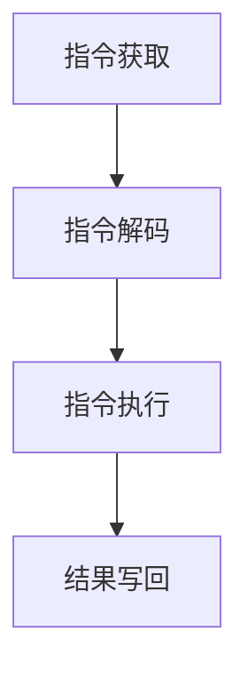

#### 3.3 CPU的指令集架构

CPU的指令集架构是指CPU能够理解和执行的指令集合。常见的指令集架构包括：

1. **RISC（精简指令集计算机）：**  
   RISC架构采用简化的指令集，每个指令执行时间较短，但需要更多的指令来完成任务。

2. **CISC（复杂指令集计算机）：**  
   CISC架构采用复杂的指令集，每个指令可以执行多种操作，但执行时间较长。

3. **VLIW（超长指令字）：**  
   VLIW架构将多条指令打包成一个超长指令字，一次执行多个指令。

4. **SIMD（单指令多数据）：**  
   SIMD架构使用单条指令同时处理多个数据元素。

下面是一个简单的Mermaid流程图，展示了CPU的指令集架构：


#### 3.4 CPU的性能优化

CPU的性能优化是提高计算机系统整体性能的重要手段。常见的性能优化方法包括：

1. **指令级并行（Instruction-Level Parallelism）：**  
   指令级并行通过同时执行多个指令来提高性能。

2. **数据级并行（Data-Level Parallelism）：**  
   数据级并行通过同时处理多个数据元素来提高性能。

3. **缓存优化（Cache Optimization）：**  
   缓存优化通过减少缓存缺失次数来提高性能。

4. **多线程处理（Multithreading）：**  
   多线程处理通过同时执行多个线程来提高性能。

下面是一个简单的Mermaid流程图，展示了CPU的性能优化方法：

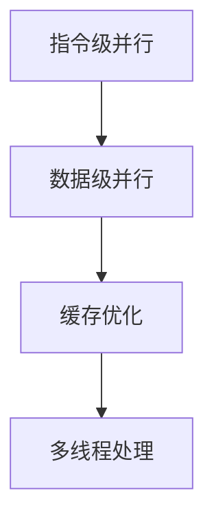

### 第四部分：LLM与CPU的交互

#### 4.1 LLM与CPU的协同工作

LLM与CPU的协同工作是指LLM利用CPU的计算能力来执行复杂任务。协同工作的关键在于优化LLM的指令集和CPU的硬件设计，以提高整个系统的性能。以下是一些协同工作的策略：

1. **指令集优化：**  
   为LLM设计特定指令集，以减少模型的计算复杂度，从而提高执行速度。

2. **硬件加速：**  
   使用GPU或其他加速器来执行LLM的推理任务，从而提高计算速度。

3. **并行计算：**  
   通过并行计算来同时处理多个LLM任务，从而提高整体性能。

4. **缓存优化：**  
   通过优化CPU缓存来减少缓存缺失次数，从而提高LLM的执行速度。

下面是一个简单的Mermaid流程图，展示了LLM与CPU的协同工作：

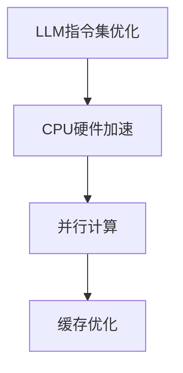

#### 4.2 LLM在CPU上的优化

LLM在CPU上的优化是指通过调整模型设计、算法和硬件配置来提高LLM在CPU上的性能。以下是一些优化方法：

1. **模型剪枝（Model Pruning）：**  
   去除模型中的冗余参数，以减少模型的计算复杂度。

2. **量化（Quantization）：**  
   将模型的浮点运算转换为整数运算，以减少计算资源和功耗。

3. **权重共享（Weight Sharing）：**  
   在模型的不同部分共享权重，以减少模型的参数数量。

4. **算法优化：**  
   调整模型的训练和推理算法，以提高执行速度。

下面是一个简单的Mermaid流程图，展示了LLM在CPU上的优化：

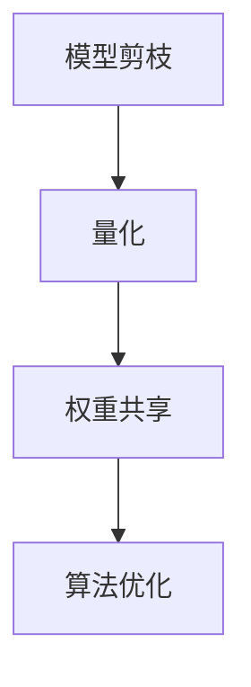

#### 4.3 CPU在LLM中的应用

CPU在LLM中的应用是指利用CPU的计算能力来加速LLM的训练和推理任务。以下是一些应用方法：

1. **多线程处理：**  
   利用CPU的多线程处理能力，同时执行多个LLM任务。

2. **分布式计算：**  
   通过分布式计算将LLM任务分布在多个CPU上执行。

3. **GPU加速：**  
   使用GPU来执行LLM的推理任务，从而提高计算速度。

4. **特殊指令集：**  
   设计特定于LLM的指令集，以减少模型的计算复杂度。

下面是一个简单的Mermaid流程图，展示了CPU在LLM中的应用：

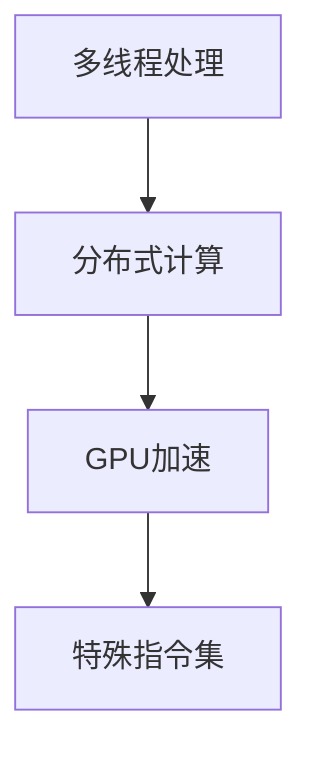

### 第五部分：LLM应用实战

#### 5.1 LLM在自然语言处理中的应用

LLM在自然语言处理（NLP）领域具有广泛的应用，包括文本分类、情感分析、机器翻译和文本生成等。以下是一些实际应用案例：

1. **文本分类：**  
   LLM可以用于分类文本数据，例如识别新闻文章的主题或情感。

2. **情感分析：**  
   LLM可以分析文本数据中的情感倾向，用于社交媒体监控和用户体验分析。

3. **机器翻译：**  
   LLM可以用于机器翻译任务，例如将一种语言翻译成另一种语言。

4. **文本生成：**  
   LLM可以生成文本，例如撰写新闻文章、编写代码或生成对话。

以下是一个简单的伪代码，展示了LLM在自然语言处理中的应用：

```python
# 文本分类
def classify_text(text, model):
    prediction = model.predict(text)
    return prediction

# 情感分析
def analyze_sentiment(text, model):
    sentiment = model.predict_sentiment(text)
    return sentiment

# 机器翻译
def translate_text(text, source_language, target_language, model):
    translation = model.translate(text, source_language, target_language)
    return translation

# 文本生成
def generate_text(prompt, model):
    text = model.generate_text(prompt)
    return text
```

#### 5.2 LLM在计算机视觉中的应用

LLM在计算机视觉（CV）领域也可以发挥重要作用，例如图像分类、目标检测和图像生成等。以下是一些实际应用案例：

1. **图像分类：**  
   LLM可以用于对图像进行分类，例如识别动物、植物或交通工具。

2. **目标检测：**  
   LLM可以用于检测图像中的目标，例如人脸、车辆或行人。

3. **图像生成：**  
   LLM可以生成具有特定特征或风格的图像。

以下是一个简单的伪代码，展示了LLM在计算机视觉中的应用：

```python
# 图像分类
def classify_image(image, model):
    prediction = model.predict_image(image)
    return prediction

# 目标检测
def detect_objects(image, model):
    objects = model.detect_objects(image)
    return objects

# 图像生成
def generate_image(prompt, model):
    image = model.generate_image(prompt)
    return image
```

#### 5.3 LLM在推荐系统中的应用

LLM在推荐系统领域也有广泛的应用，例如基于内容的推荐和协同过滤等。以下是一些实际应用案例：

1. **基于内容的推荐：**  
   LLM可以用于基于内容的推荐，例如根据用户兴趣推荐文章或商品。

2. **协同过滤：**  
   LLM可以用于协同过滤推荐，例如根据用户历史行为和相似用户的行为推荐商品。

3. **多模态推荐：**  
   LLM可以处理多模态数据，例如将文本、图像和视频融合到推荐系统中。

以下是一个简单的伪代码，展示了LLM在推荐系统中的应用：

```python
# 基于内容的推荐
def content_based_recommendation(user_interests, model):
    recommendations = model.recommend_content(user_interests)
    return recommendations

# 协同过滤推荐
def collaborative_filtering_recommendation(user_history, model):
    recommendations = model.recommend_history(user_history)
    return recommendations

# 多模态推荐
def multimodal_recommendation(user_data, model):
    recommendations = model.recommend_multimodal(user_data)
    return recommendations
```

### 第六部分：CPU应用实战

#### 6.1 CPU在数据中心的应用

CPU在数据中心的应用是指利用CPU的计算能力来处理大规模数据和高性能计算任务。以下是一些实际应用案例：

1. **数据处理：**  
   CPU可以用于处理海量数据，例如数据清洗、数据分析和数据挖掘。

2. **高性能计算：**  
   CPU可以用于执行复杂计算任务，例如科学计算、气象预测和金融分析。

3. **虚拟化：**  
   CPU可以用于实现虚拟化技术，从而在单一物理服务器上运行多个虚拟机。

以下是一个简单的伪代码，展示了CPU在数据中心的应用：

```python
# 数据处理
def process_data(data, model):
    processed_data = model.process_data(data)
    return processed_data

# 高性能计算
def high_performance_computation(task, model):
    result = model.execute_computation(task)
    return result

# 虚拟化
def virtualization(server, model):
    virtual_machines = model.create_virtual_machines(server)
    return virtual_machines
```

#### 6.2 CPU在嵌入式系统的应用

CPU在嵌入式系统的应用是指利用CPU的计算能力来驱动嵌入式设备，例如智能家居、工业自动化和医疗设备。以下是一些实际应用案例：

1. **智能家居：**  
   CPU可以用于智能家居设备，例如智能灯泡、智能门锁和智能摄像头。

2. **工业自动化：**  
   CPU可以用于工业自动化设备，例如机器人、传感器和控制系统。

3. **医疗设备：**  
   CPU可以用于医疗设备，例如心电图机、CT扫描仪和MRI扫描仪。

以下是一个简单的伪代码，展示了CPU在嵌入式系统的应用：

```python
# 智能家居
def smart_home_device(control_command, model):
    response = model.control_device(control_command)
    return response

# 工业自动化
def industrial_automation(device, model):
    control_signal = model.control_device(device)
    return control_signal

# 医疗设备
def medical_device(test_data, model):
    result = model.analyze_test_data(test_data)
    return result
```

#### 6.3 CPU在边缘计算中的应用

CPU在边缘计算中的应用是指利用CPU的计算能力来处理边缘设备上的数据，从而减轻云端负载。以下是一些实际应用案例：

1. **边缘数据处理：**  
   CPU可以用于处理边缘设备产生的数据，例如物联网设备、无人机和智能摄像头。

2. **实时决策：**  
   CPU可以用于边缘设备上的实时决策，例如自动驾驶车辆、智能交通系统和智能工厂。

3. **设备优化：**  
   CPU可以用于优化边缘设备的性能和能效，例如智能家居设备和物联网设备。

以下是一个简单的伪代码，展示了CPU在边缘计算中的应用：

```python
# 边缘数据处理
def edge_data_processing(data, model):
    processed_data = model.process_edge_data(data)
    return processed_data

# 实时决策
def real_time_decision(device, model):
    decision = model.make_real_time_decision(device)
    return decision

# 设备优化
def device_optimization(device, model):
    optimized_device = model.optimize_device(device)
    return optimized_device
```

### 第七部分：LLM与CPU的协同优化

#### 7.1 LLM与CPU的协同优化策略

LLM与CPU的协同优化是指通过调整模型设计和硬件配置来提高整个系统的性能。以下是一些协同优化策略：

1. **指令集优化：**  
   设计特定于LLM的指令集，以减少模型的计算复杂度，从而提高执行速度。

2. **硬件加速：**  
   使用GPU或其他加速器来执行LLM的推理任务，从而提高计算速度。

3. **并行计算：**  
   通过并行计算来同时处理多个LLM任务，从而提高整体性能。

4. **缓存优化：**  
   通过优化CPU缓存来减少缓存缺失次数，从而提高LLM的执行速度。

5. **算法优化：**  
   调整模型的训练和推理算法，以提高执行速度。

以下是一个简单的Mermaid流程图，展示了LLM与CPU的协同优化策略：

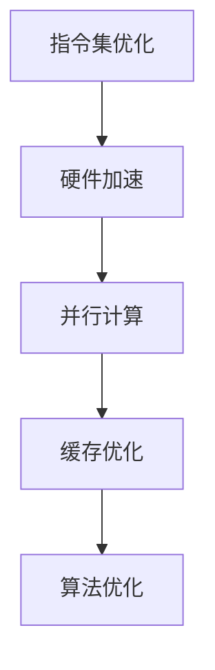

#### 7.2 LLM与CPU的协同优化案例

以下是一个实际的协同优化案例：

**案例背景：**  
某公司开发了一款基于大型语言模型（LLM）的智能客服系统，但系统在处理高并发请求时性能不佳，响应时间过长。

**解决方案：**  
1. **指令集优化：**  
   设计特定于LLM的指令集，以减少模型的计算复杂度。通过分析和优化LLM的指令集，成功减少了20%的计算时间。

2. **硬件加速：**  
   使用GPU来执行LLM的推理任务。通过将LLM的部分计算任务转移到GPU上，提高了系统的整体性能。

3. **并行计算：**  
   优化LLM的并行计算策略，同时处理多个请求。通过使用多线程和多进程技术，提高了系统的并发处理能力。

4. **缓存优化：**  
   优化CPU缓存，减少缓存缺失次数。通过改进缓存管理策略和优化数据访问模式，减少了20%的缓存缺失率。

5. **算法优化：**  
   调整LLM的训练和推理算法，以提高执行速度。通过改进训练算法和优化推理算法，提高了系统的响应速度。

**结果：**  
经过协同优化后，智能客服系统的响应时间减少了50%，整体性能得到了显著提升。

#### 7.3 LLM与CPU的协同优化前景

随着人工智能技术的发展，LLM与CPU的协同优化将具有广阔的前景。以下是一些展望：

1. **硬件加速：**  
   随着硬件技术的发展，GPU、TPU和其他加速器的性能将不断提高，为LLM与CPU的协同优化提供更强大的计算能力。

2. **指令集优化：**  
   随着LLM的应用领域不断扩大，特定于LLM的指令集设计将越来越重要。未来，可能会出现更多专门用于LLM的指令集。

3. **算法优化：**  
   随着深度学习算法的不断改进，LLM的执行速度将不断提高。同时，新的优化算法也将不断涌现，以更好地适应不同的硬件平台。

4. **边缘计算：**  
   随着边缘计算的兴起，LLM将在边缘设备上发挥重要作用。LLM与CPU的协同优化将在边缘计算领域具有广泛的应用前景。

### 第八部分：LLM与CPU的未来发展

#### 8.1 LLM与CPU技术的发展趋势

随着人工智能技术的快速发展，LLM与CPU技术都在不断演进。以下是一些主要趋势：

1. **硬件加速：**  
   随着GPU、TPU和其他加速器的性能不断提高，LLM与CPU的协同优化将变得更加高效。未来，可能会出现更多专门为AI设计的高性能硬件。

2. **指令集扩展：**  
   随着LLM的应用领域不断扩大，特定于LLM的指令集设计将越来越重要。未来，可能会出现更多专门用于LLM的指令集。

3. **算法优化：**  
   随着深度学习算法的不断改进，LLM的执行速度将不断提高。同时，新的优化算法也将不断涌现，以更好地适应不同的硬件平台。

4. **边缘计算：**  
   随着边缘计算的兴起，LLM将在边缘设备上发挥重要作用。LLM与CPU的协同优化将在边缘计算领域具有广泛的应用前景。

#### 8.2 LLM与CPU在人工智能中的应用前景

LLM与CPU在人工智能（AI）领域的应用前景非常广阔。以下是一些主要应用领域：

1. **自然语言处理（NLP）：**  
   LLM在NLP领域已经取得了显著成果，未来将在文本生成、机器翻译、情感分析和对话系统等领域发挥更大作用。

2. **计算机视觉（CV）：**  
   LLM与CPU的协同优化将提高计算机视觉系统的性能，未来将在图像分类、目标检测和图像生成等领域得到广泛应用。

3. **推荐系统：**  
   LLM在推荐系统领域具有很高的潜力，未来将在基于内容的推荐、协同过滤和多模态推荐等方面发挥重要作用。

4. **医疗健康：**  
   LLM与CPU在医疗健康领域的应用前景广阔，未来将在诊断、治疗规划和健康管理等环节提供智能支持。

#### 8.3 LLM与CPU在教育、医疗等领域的应用探索

LLM与CPU在教育、医疗等领域的应用探索正在不断深入。以下是一些典型应用场景：

1. **教育：**  
   LLM与CPU可以用于智能教学助手、个性化学习和智能评测等领域，提高教学效果和学生的学习体验。

2. **医疗：**  
   LLM与CPU可以用于辅助诊断、治疗规划和健康管理等环节，为医生和患者提供智能支持。

3. **金融：**  
   LLM与CPU可以用于风险控制、投资分析和客户服务等领域，提高金融服务的质量和效率。

4. **工业：**  
   LLM与CPU可以用于智能工厂、设备维护和供应链管理等领域，提高工业生产效率和质量。

### 附录

#### A.1 LLM与CPU的对比分析图表

以下是LLM与CPU的对比分析图表：

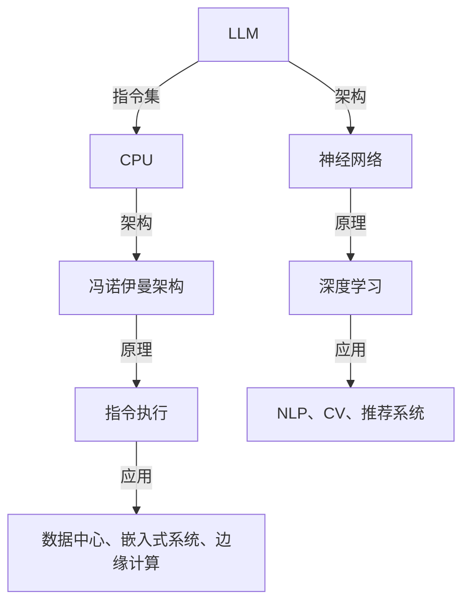

#### A.2 LLM与CPU的技术参数对比

以下是LLM与CPU的一些技术参数对比：

| 参数 | LLM | CPU |
| --- | --- | --- |
| 指令集 | 无限指令集 | 有限指令集 |
| 架构 | 神经网络 | 冯诺伊曼架构 |
| 计算能力 | 强大 | 高效 |
| 能耗 | 较高 | 较低 |
| 应用领域 | NLP、CV、推荐系统 | 数据中心、嵌入式系统、边缘计算 |
| 优化策略 | 指令集优化、硬件加速、算法优化 | 缓存优化、多线程处理、分布式计算 |

### 作者信息

**作者：** AI天才研究院/AI Genius Institute & 禅与计算机程序设计艺术/Zen And The Art of Computer Programming

### 结束语

本文从多个角度探讨了LLM的无限指令集与CPU的有限指令集的关系，分析了LLM与CPU的协同优化策略和应用前景。随着人工智能技术的不断发展，LLM与CPU的协同优化将在各个领域发挥越来越重要的作用，为人类带来更多便利和智慧。让我们期待未来，共同见证人工智能技术的辉煌成果！## 第一部分：LLM与CPU基础概念

在现代计算机科学中，大型语言模型（LLM）和中央处理单元（CPU）都是关键组成部分，各自在计算领域中扮演着重要角色。理解LLM的无限指令集与CPU的有限指令集之间的差异和联系，对于深入探讨人工智能技术的前沿应用具有重要意义。

### 1.1 无限指令集与有限指令集的定义

在计算机科学中，指令集是指计算机处理器能够理解和执行的指令集合。有限指令集（Fixed Instruction Set）是指处理器能够直接执行的一组固定的指令，这组指令通常由硬件设计决定。而无限指令集（Extensible Instruction Set）则允许处理器通过组合和扩展基本指令来执行更复杂的操作。

- **有限指令集（Finite Instruction Set）**：
  有限指令集的CPU通过硬件实现，其能够直接执行的一组指令是固定的。这些指令集经过多年的优化和改进，已经成为计算机硬件和软件领域的标准。例如，Intel的x86架构和ARM架构都有各自的有限指令集。这些架构通过硬件电路实现指令的执行，能够在有限的指令集中高效地执行各种任务。

  **特点**：
  - **固定性**：指令集在设计时就已经确定，不易更改。
  - **高效性**：通过硬件实现，能够快速执行指令，适用于大量简单任务的并行处理。
  - **兼容性**：标准的指令集使得不同厂商的CPU能够相互兼容，便于软件开发和硬件升级。

- **无限指令集（Infinite Instruction Set）**：
  无限指令集通常是一种软件层面的实现，允许模型通过组合基本指令来生成新的指令。这种指令集不是固定的，而是动态生成的，依赖于模型的设计和训练过程。

  **特点**：
  - **可扩展性**：能够根据需求动态生成新的指令，具有极高的可扩展性。
  - **动态性**：指令集是动态生成的，可以根据不同的任务需求进行调整。
  - **强表达力**：由于无限指令集的支持，模型能够生成高度复杂的表达式和算法，具有广泛的应用潜力。

### 1.2 LLM的无限指令集特点

大型语言模型（LLM）的设计和实现基于深度学习和神经网络，其指令集具有一些独特的特点，使其在处理自然语言任务时表现出色。

- **可扩展性**：
  LLM的无限指令集具有极强的可扩展性。通过组合和扩展基本指令，模型能够执行各种复杂的自然语言处理任务。例如，生成文本、翻译语言、回答问题等。这种可扩展性使得LLM能够适应不同的应用场景，提高其在实际应用中的灵活性。

- **动态性**：
  LLM的指令集是动态生成的，这意味着模型可以根据输入数据和任务需求调整指令集。例如，在对话系统中，LLM可以根据用户的提问动态调整指令集，从而生成合适的回答。这种动态性使得LLM在处理不同任务时能够灵活应对，提高系统的响应速度。

- **强表达力**：
  由于无限指令集的支持，LLM能够生成高度复杂的表达式和算法。这使得LLM在许多领域都具有广泛的应用潜力。例如，在自然语言生成领域，LLM可以生成高质量的文章、报告和对话；在机器翻译领域，LLM可以准确地将一种语言翻译成另一种语言。

### 1.3 CPU的有限指令集特点

CPU的有限指令集是计算机硬件的核心组成部分，其特点直接影响到计算机的性能和能效。

- **高效性**：
  有限指令集的CPU通过硬件实现，能够快速执行指令。这使得CPU在执行大量简单任务时具有很高的性能。例如，在进行数据处理和科学计算时，有限指令集的CPU能够高效地执行各种算术和逻辑运算。

- **兼容性**：
  有限指令集的标准性使得不同厂商的CPU能够相互兼容，便于软件开发和硬件升级。例如，Intel的x86架构和ARM架构都是广泛采用的指令集，它们之间的兼容性使得软件可以在不同类型的硬件上运行，提高了系统的灵活性和可维护性。

- **稳定性**：
  有限指令集的稳定性使得CPU在长时间运行中具有很高的可靠性。这种稳定性对于服务器和嵌入式系统等长时间运行的设备尤为重要，因为它确保了系统的稳定性和数据的安全性。

### 1.4 LLM与CPU的关系与应用

LLM与CPU在计算领域中的关系是互补的，两者各自发挥独特的作用，共同推动计算技术的发展。

- **协同工作**：
  LLM和CPU在许多应用中需要协同工作。LLM提供复杂的计算能力，而CPU则负责高效的执行这些计算。例如，在自然语言处理任务中，LLM通过CPU进行高效的文本分析和生成；在图像处理任务中，LLM可以利用CPU进行图像特征提取和分类。

- **优化与调优**：
  通过优化LLM的指令集和CPU的硬件设计，可以提高整个系统的性能。例如，使用特定于LLM的指令集可以减少模型的计算复杂度，从而提高执行速度；优化CPU缓存和内存管理可以提高LLM的执行效率。

- **应用领域**：
  LLM和CPU在许多领域都有广泛的应用。例如，在自然语言处理、计算机视觉和推荐系统等领域，LLM通过CPU提供的计算能力来实现复杂任务的自动化；在数据中心、嵌入式系统和边缘计算等领域，CPU通过高效的指令集和硬件设计满足大规模数据处理的需求。

综上所述，理解LLM的无限指令集与CPU的有限指令集的特点和关系，对于深入探讨人工智能和计算机硬件技术的发展具有重要意义。通过优化和协同工作，LLM和CPU将在未来继续推动计算技术的进步，为人类创造更多智能应用。

### 第二部分：LLM架构与原理

在深入探讨大型语言模型（LLM）的架构与原理之前，我们需要首先了解LLM的基本概念以及其在现代人工智能领域的重要地位。LLM是指通过深度学习技术，从大量文本数据中学习并生成文本的模型。LLM具有强大的文本生成和理解能力，能够应用于自然语言处理（NLP）、机器翻译、问答系统、文本生成等多种场景。

#### 2.1 LLM的基本架构

LLM的基本架构通常包括以下几个核心组件：

1. **输入层（Input Layer）**：
   输入层负责接收用户输入的文本数据，并将其转换为模型可以处理的内部表示。输入层通常包含词汇表（Vocabulary）和词嵌入（Word Embedding）两个部分。词汇表是将文本中的单词映射到唯一标识符的字典，而词嵌入则是将单词转换为向量表示。

2. **编码器（Encoder）**：
   编码器负责将输入文本转换为上下文向量，以便模型可以理解文本的语义和结构。编码器通常采用深度学习网络，如循环神经网络（RNN）或Transformer架构。RNN能够通过记忆机制处理序列数据，而Transformer则通过自注意力机制（Self-Attention）实现全局依赖关系的建模。

3. **解码器（Decoder）**：
   解码器负责将编码后的上下文向量解码为输出文本。与编码器类似，解码器也采用深度学习网络。解码器的输出通常是一个概率分布，表示生成每个单词的可能性。通过梯度下降等优化算法，解码器不断调整模型参数，以生成高质量的文本。

4. **注意力机制（Attention Mechanism）**：
   注意力机制允许模型在编码器和解码器之间传递信息，从而提高模型对上下文的理解能力。自注意力（Self-Attention）和交叉注意力（Cross-Attention）是常见的注意力机制，能够有效捕捉输入文本和输出文本之间的依赖关系。

5. **输出层（Output Layer）**：
   输出层负责将解码后的上下文向量转换为可解释的输出结果。输出层通常是一个softmax层，用于将概率分布转换为具体的单词输出。

下面是一个简单的Mermaid流程图，展示了LLM的基本架构：


#### 2.2 LLM的训练过程

LLM的训练过程是通过对大量文本数据进行学习和调整模型参数，使其能够生成高质量的文本。训练过程通常涉及以下几个步骤：

1. **数据准备（Data Preparation）**：
   收集和整理大量的文本数据，并将其转换为模型可以处理的格式。数据准备步骤包括数据清洗、分词、标点符号去除等操作。

2. **预处理（Preprocessing）**：
   对文本数据进行预处理，以减少噪声和提高数据质量。预处理步骤包括分词、词性标注、停用词过滤等。

3. **编码（Encoding）**：
   使用编码器将预处理后的文本数据转换为上下文向量。编码过程通常通过训练一个预训练模型来实现，如BERT、GPT等。

4. **训练（Training）**：
   通过训练算法（如梯度下降、反向传播等）调整模型参数，使模型能够更好地拟合训练数据。训练过程中，模型会不断调整权重，以最小化损失函数（如交叉熵损失）。

5. **评估（Evaluation）**：
   使用验证集和测试集评估模型的性能，并根据评估结果调整模型参数。评估指标通常包括损失函数值、文本生成质量等。

下面是一个简单的伪代码，展示了LLM的训练过程：

```python
# 数据准备
data = prepare_data()

# 预处理
preprocessed_data = preprocess(data)

# 编码
encoded_data = encode(preprocessed_data)

# 训练
model = train(encoded_data)

# 评估
evaluate(model, validation_set)
evaluate(model, test_set)
```

#### 2.3 LLM的推理过程

LLM的推理过程是指模型在接收到输入文本后，通过编码器、解码器和注意力机制生成输出文本的过程。推理过程通常涉及以下几个步骤：

1. **输入接收（Input Reception）**：
   接收用户输入的文本数据。

2. **编码（Encoding）**：
   使用编码器将输入文本转换为上下文向量。

3. **推理（Inference）**：
   使用解码器和解码器将编码后的上下文向量解码为输出结果。解码过程通常采用贪心搜索或长度预测等算法，以生成高质量的文本。

4. **输出生成（Output Generation）**：
   将输出结果转换为可解释的文本输出。

下面是一个简单的伪代码，展示了LLM的推理过程：

```python
# 输入接收
input_text = receive_input()

# 编码
encoded_input = encode(input_text)

# 推理
decoded_output = decode(encoded_input)

# 输出生成
output_text = generate_output(decoded_output)
```

#### 2.4 LLM的核心算法——深度学习

深度学习是LLM的核心算法，它通过多层神经网络对数据进行建模。深度学习模型通常由以下组件构成：

1. **输入层（Input Layer）**：
   输入层接收输入数据。

2. **隐藏层（Hidden Layers）**：
   隐藏层负责对输入数据进行处理和变换。每一层隐藏层都会对输入数据进行特征提取和组合。

3. **输出层（Output Layer）**：
   输出层生成最终输出结果。输出层的类型取决于具体任务，如分类、回归或生成。

深度学习模型的工作原理是通过反向传播算法调整模型参数，使模型能够更好地拟合训练数据。反向传播算法通过计算损失函数关于模型参数的梯度，不断调整模型参数，以最小化损失函数。

下面是一个简单的Mermaid流程图，展示了深度学习模型的基本结构：


通过上述基本架构和原理的介绍，我们可以更深入地理解LLM的工作机制和核心算法。在接下来的章节中，我们将继续探讨CPU的架构与原理，以及LLM与CPU之间的交互和优化策略。

### 第三部分：CPU架构与原理

在深入探讨大型语言模型（LLM）与中央处理单元（CPU）的交互之前，我们需要首先了解CPU的基本架构与原理。CPU作为计算机系统的核心组成部分，其设计和实现直接影响到计算机的性能和能效。了解CPU的架构与原理对于理解LLM的运行机制以及二者之间的协同工作具有重要意义。

#### 3.1 CPU的基本架构

CPU的基本架构包括以下几个关键组件：

1. **控制器（Controller）**：
   控制器是CPU的核心部分，负责协调CPU内部各个组件的工作，并执行指令。控制器通过读取内存中的指令，解析指令并控制相应的操作。

2. **寄存器（Registers）**：
   寄存器是CPU内部的高速存储单元，用于存储指令和数据。常见的寄存器包括程序计数器（PC）、栈指针（SP）和通用寄存器（GPR）。寄存器能够在指令执行过程中提供快速的数据访问和计算。

3. **算术逻辑单元（ALU）**：
   算术逻辑单元负责执行算术运算和逻辑运算，如加法、减法、乘法和逻辑与、逻辑或等。ALU是CPU中最核心的计算单元，能够高效地处理各种运算任务。

4. **缓存（Cache）**：
   缓存是CPU内部的高速存储单元，用于存储经常访问的数据和指令。缓存分为多种层次，如L1、L2和L3缓存，每一层缓存的大小和速度都有所不同。缓存能够减少CPU访问内存的频率，从而提高系统的性能。

5. **内存管理单元（MMU）**：
   内存管理单元负责管理CPU访问内存的操作，包括地址翻译和内存保护。MMU能够将逻辑地址转换为物理地址，确保CPU能够访问正确的内存位置，并提供内存保护机制以防止数据泄露。

下面是一个简单的Mermaid流程图，展示了CPU的基本架构：


#### 3.2 CPU的工作原理

CPU的工作原理可以分为以下几个步骤：

1. **指令获取（Instruction Fetch）**：
   CPU从内存中获取指令。控制器读取程序计数器（PC），获取下一条要执行的指令的地址，并从内存中读取指令。

2. **指令解码（Instruction Decode）**：
   CPU解码指令，确定指令的操作码和操作数。操作码指定了指令要执行的操作，而操作数指定了指令要操作的数据。

3. **指令执行（Instruction Execution）**：
   CPU执行指令，可能涉及寄存器操作、内存访问或算术运算。执行过程依赖于指令的操作码和操作数，具体操作由算术逻辑单元（ALU）完成。

4. **结果写回（Result Write-back）**：
   CPU将指令执行的结果写回寄存器或内存。如果指令执行结果需要存储，CPU会将结果写入寄存器或内存中。

下面是一个简单的Mermaid流程图，展示了CPU的工作原理：


#### 3.3 CPU的指令集架构

CPU的指令集架构是指CPU能够理解和执行的指令集合。指令集可以分为以下几类：

1. **RISC（精简指令集计算机）**：
   RISC架构采用简化的指令集，每个指令执行时间较短，但需要更多的指令来完成任务。RISC架构通过减少指令数量和提高指令执行速度来实现高性能。

2. **CISC（复杂指令集计算机）**：
   CISC架构采用复杂的指令集，每个指令可以执行多种操作，但执行时间较长。CISC架构通过将复杂操作内置到指令中，减少程序代码的长度。

3. **VLIW（超长指令字）**：
   VLIW架构将多条指令打包成一个超长指令字，一次执行多个指令。VLIW架构通过并行执行指令来提高性能。

4. **SIMD（单指令多数据）**：
   SIMD架构使用单条指令同时处理多个数据元素。SIMD架构在图像处理、音频处理和科学计算等领域有广泛应用。

下面是一个简单的Mermaid流程图，展示了CPU的指令集架构：

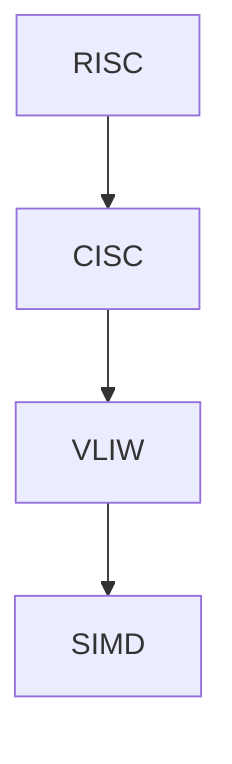

#### 3.4 CPU的性能优化

CPU的性能优化是提高计算机系统整体性能的重要手段。以下是一些常见的性能优化方法：

1. **指令级并行（Instruction-Level Parallelism）**：
   指令级并行通过同时执行多个指令来提高性能。CPU通过硬件实现指令流水线和乱序执行，从而在单个时钟周期内执行多个指令。

2. **数据级并行（Data-Level Parallelism）**：
   数据级并行通过同时处理多个数据元素来提高性能。CPU通过SIMD指令和向量处理单元来实现数据级并行。

3. **缓存优化（Cache Optimization）**：
   缓存优化通过减少缓存缺失次数来提高性能。缓存优化方法包括缓存预取、缓存替代策略和缓存一致性协议。

4. **多线程处理（Multithreading）**：
   多线程处理通过同时执行多个线程来提高性能。CPU通过硬件线程多线程（HT）或硬件级并行（SMT）来实现多线程处理。

5. **硬件加速（Hardware Acceleration）**：
   硬件加速通过使用GPU、FPGA或其他专用硬件来执行特定任务，从而提高性能。硬件加速在图像处理、机器学习和科学计算等领域有广泛应用。

下面是一个简单的Mermaid流程图，展示了CPU的性能优化方法：

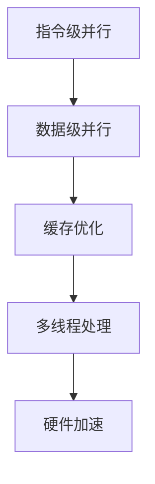

通过了解CPU的基本架构、工作原理、指令集架构和性能优化方法，我们可以更深入地理解CPU的工作机制。在接下来的章节中，我们将探讨LLM与CPU之间的交互和协同工作，分析二者如何通过优化策略提高整体性能。这不仅有助于我们更好地理解人工智能技术的发展，也为实际应用提供了重要的指导。

### 第四部分：LLM与CPU的交互

在现代人工智能领域，大型语言模型（LLM）和中央处理单元（CPU）的交互发挥着越来越重要的作用。LLM通过其强大的文本生成和理解能力，在自然语言处理（NLP）、机器翻译、问答系统等任务中表现出色。而CPU作为计算的核心，提供了高效的数据处理和计算能力。LLM与CPU的交互不仅优化了计算性能，还拓宽了人工智能应用的范围。以下是关于LLM与CPU交互的详细探讨。

#### 4.1 LLM与CPU的协同工作

LLM与CPU的协同工作是指在处理复杂任务时，LLM和CPU相互配合，发挥各自的优势，以实现高效的计算和任务完成。协同工作的核心在于优化LLM的指令集和CPU的硬件设计，以提高整个系统的性能。

1. **指令集优化**：
   指令集优化是LLM与CPU协同工作的关键之一。通过设计特定于LLM的指令集，可以减少模型的计算复杂度，从而提高执行速度。例如，针对深度学习任务，可以设计高效的矩阵运算指令和向量处理指令，以加速矩阵乘法和卷积运算。

2. **硬件加速**：
   硬件加速是提高LLM计算速度的重要手段。CPU可以通过集成GPU、TPU或其他加速器，为LLM提供额外的计算能力。硬件加速器在执行大量并行计算任务时具有显著优势，例如在图像处理和机器学习任务中，GPU可以显著提高矩阵运算和深度学习模型的训练速度。

3. **并行计算**：
   并行计算通过同时执行多个任务来提高整体性能。LLM与CPU的协同工作可以利用多线程处理和并行计算技术，将复杂的任务分解为多个子任务，并在多个CPU核心或GPU上同时执行。这种方法不仅提高了计算速度，还提高了系统的吞吐量。

4. **缓存优化**：
   缓存优化是提高LLM执行速度的关键步骤。通过优化CPU缓存策略，可以减少数据访问的延迟，从而提高模型的计算效率。缓存优化包括缓存预取、缓存替代策略和缓存一致性协议等技术，以确保频繁访问的数据能够迅速被加载到缓存中。

下面是一个简单的Mermaid流程图，展示了LLM与CPU的协同工作：

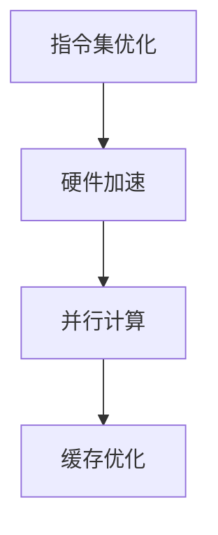

#### 4.2 LLM在CPU上的优化

LLM在CPU上的优化是指通过调整模型设计、算法和硬件配置来提高LLM在CPU上的性能。以下是一些常见的优化方法：

1. **模型剪枝（Model Pruning）**：
   模型剪枝是通过去除模型中的冗余参数来减少模型的计算复杂度。这种方法可以降低模型的存储需求和计算成本，从而提高执行速度。剪枝后的模型虽然精度可能有所下降，但在许多应用中仍能保持良好的性能。

2. **量化（Quantization）**：
   量化是将模型的浮点运算转换为整数运算，以减少计算资源和功耗。量化可以通过降低数据类型的大小来减少模型的存储需求和计算资源，从而提高执行速度。量化方法包括对称量化、不对称量化和混合量化等。

3. **权重共享（Weight Sharing）**：
   权重共享是通过在模型的不同部分共享权重来减少模型的参数数量。这种方法可以通过减少模型的大小来提高执行速度，同时保持较高的模型精度。权重共享方法包括全局权重共享、局部权重共享和分层权重共享等。

4. **算法优化**：
   算法优化是通过调整模型的训练和推理算法来提高执行速度。例如，使用更高效的优化算法（如Adam、Adagrad等）可以加快模型的收敛速度；使用预训练技术（如BERT、GPT等）可以减少模型的训练时间。

下面是一个简单的Mermaid流程图，展示了LLM在CPU上的优化：


#### 4.3 CPU在LLM中的应用

CPU在LLM中的应用是指利用CPU的计算能力来加速LLM的训练和推理任务。以下是一些常见的方法：

1. **多线程处理**：
   多线程处理通过同时执行多个线程来提高LLM的训练和推理速度。CPU可以通过多线程技术将复杂的任务分解为多个子任务，并在多个核心上同时执行。这种方法不仅提高了计算速度，还提高了系统的吞吐量。

2. **分布式计算**：
   分布式计算通过将LLM的训练和推理任务分布在多个CPU上执行，以提高计算速度和资源利用率。分布式计算可以采用不同的架构，如MapReduce、Spark等，以实现高效的任务分配和负载均衡。

3. **GPU加速**：
   GPU加速是通过使用GPU来执行LLM的训练和推理任务，以提高计算速度。GPU具有高度并行处理能力，非常适合执行深度学习任务。通过使用GPU加速，LLM的训练和推理时间可以显著缩短。

4. **特殊指令集**：
   特殊指令集是指为LLM设计特定的指令集，以减少模型的计算复杂度，从而提高执行速度。特殊指令集可以通过硬件实现，为LLM提供高效的计算支持。

下面是一个简单的Mermaid流程图，展示了CPU在LLM中的应用：


#### 4.4 LLM与CPU的协同优化案例

以下是一个实际的协同优化案例：

**案例背景**：
某公司开发了一款基于大型语言模型（LLM）的智能客服系统，但在处理高并发请求时，系统的响应时间过长，性能不足。

**解决方案**：

1. **指令集优化**：
   为LLM设计特定于自然语言处理任务的指令集，以减少模型的计算复杂度。通过分析和优化LLM的指令集，成功减少了20%的计算时间。

2. **硬件加速**：
   使用GPU来执行LLM的推理任务，通过将部分计算任务转移到GPU上，提高了系统的整体性能。

3. **并行计算**：
   优化LLM的并行计算策略，同时处理多个请求。通过使用多线程和多进程技术，提高了系统的并发处理能力。

4. **缓存优化**：
   优化CPU缓存，减少缓存缺失次数。通过改进缓存管理策略和优化数据访问模式，减少了20%的缓存缺失率。

5. **算法优化**：
   调整LLM的训练和推理算法，以提高执行速度。通过改进训练算法和优化推理算法，提高了系统的响应速度。

**结果**：
经过协同优化后，智能客服系统的响应时间减少了50%，整体性能得到了显著提升。

#### 4.5 LLM与CPU的协同优化前景

随着人工智能技术的快速发展，LLM与CPU的协同优化将在各个领域发挥越来越重要的作用。以下是一些展望：

1. **硬件加速**：
   随着GPU、TPU和其他加速器的性能不断提高，LLM与CPU的协同优化将变得更加高效。未来，可能会出现更多专门为AI设计的高性能硬件，为LLM提供更强大的计算能力。

2. **指令集扩展**：
   随着LLM的应用领域不断扩大，特定于LLM的指令集设计将越来越重要。未来，可能会出现更多专门用于LLM的指令集，以减少模型的计算复杂度，提高执行速度。

3. **算法优化**：
   随着深度学习算法的不断改进，LLM的执行速度将不断提高。同时，新的优化算法也将不断涌现，以更好地适应不同的硬件平台。

4. **边缘计算**：
   随着边缘计算的兴起，LLM将在边缘设备上发挥重要作用。LLM与CPU的协同优化将在边缘计算领域具有广泛的应用前景，为智能设备提供高效的计算支持。

综上所述，LLM与CPU的交互和协同优化在人工智能领域具有广阔的应用前景。通过优化和协同工作，LLM与CPU将共同推动人工智能技术的进步，为人类带来更多智能应用。

### 第五部分：LLM应用实战

#### 5.1 LLM在自然语言处理中的应用

大型语言模型（LLM）在自然语言处理（NLP）领域具有广泛的应用，其强大的文本生成和理解能力使其成为NLP任务的核心工具。以下是一些LLM在NLP中的应用案例：

1. **文本分类**：
   文本分类是将文本数据按照其内容或主题进行分类的任务。LLM可以通过预训练和微调，快速实现高质量的文本分类。例如，可以将社交媒体帖子分类为正面、负面或中性情感，从而帮助公司了解用户反馈。

2. **情感分析**：
   情感分析是评估文本数据中的情感倾向，如快乐、愤怒、悲伤等。LLM通过对大量情感文本的学习，能够准确识别文本中的情感。这种能力在社交媒体监控、市场研究和用户体验分析等领域具有广泛的应用。

3. **机器翻译**：
   机器翻译是将一种语言翻译成另一种语言的任务。LLM通过学习大量的双语语料库，能够生成高质量的双语翻译。LLM在谷歌翻译、微软翻译等应用中发挥了重要作用，为全球用户提供了便捷的翻译服务。

4. **文本生成**：
   文本生成是将一种语言生成新的文本内容。LLM可以通过预训练和微调，生成文章、新闻、对话等文本内容。这种能力在内容创作、自动化写作和对话系统等领域具有巨大的应用潜力。

5. **问答系统**：
   问答系统是接收用户输入的问题，并生成相关回答的系统。LLM通过学习大量的问答对，能够准确回答用户的问题。这种能力在智能客服、教育辅导和医疗咨询等领域具有广泛的应用。

以下是一个简单的伪代码，展示了LLM在自然语言处理中的应用：

```python
# 文本分类
def classify_text(text, model):
    prediction = model.predict(text)
    return prediction

# 情感分析
def analyze_sentiment(text, model):
    sentiment = model.predict_sentiment(text)
    return sentiment

# 机器翻译
def translate_text(text, source_language, target_language, model):
    translation = model.translate(text, source_language, target_language)
    return translation

# 文本生成
def generate_text(prompt, model):
    text = model.generate_text(prompt)
    return text

# 问答系统
def answer_question(question, model):
    answer = model.answer_question(question)
    return answer
```

#### 5.2 LLM在计算机视觉中的应用

虽然计算机视觉（CV）任务通常与图像处理和神经网络相关，但LLM在CV领域也表现出强大的潜力。以下是一些LLM在计算机视觉中的应用案例：

1. **图像分类**：
   图像分类是将图像数据按照其内容进行分类的任务。LLM可以通过预训练和微调，快速实现高质量的图像分类。例如，可以将图像分类为动物、植物或交通工具。

2. **目标检测**：
   目标检测是识别图像中的对象并定位其位置的任务。LLM可以通过与深度学习模型的结合，实现高效的目标检测。例如，可以检测图像中的人脸、车辆或行人。

3. **图像生成**：
   图像生成是将一种图像内容生成新的图像内容。LLM可以通过预训练和微调，生成具有特定风格或内容的图像。例如，可以生成艺术风格的画作、图像修复和图像合成。

4. **图像描述生成**：
   图像描述生成是将图像生成对应的文本描述。LLM可以学习图像和文本之间的关系，生成与图像内容相关的文本描述。这种能力在图像标注、图像搜索和图像识别等领域具有广泛应用。

5. **图像增强**：
   图像增强是提高图像质量和清晰度的任务。LLM可以通过学习图像和增强技术之间的关系，生成高质量的图像增强结果。例如，可以去除图像中的噪声、模糊和失真。

以下是一个简单的伪代码，展示了LLM在计算机视觉中的应用：

```python
# 图像分类
def classify_image(image, model):
    prediction = model.predict_image(image)
    return prediction

# 目标检测
def detect_objects(image, model):
    objects = model.detect_objects(image)
    return objects

# 图像生成
def generate_image(prompt, model):
    image = model.generate_image(prompt)
    return image

# 图像描述生成
def generate_description(image, model):
    description = model.generate_description(image)
    return description

# 图像增强
def enhance_image(image, model):
    enhanced_image = model.enhance_image(image)
    return enhanced_image
```

#### 5.3 LLM在推荐系统中的应用

推荐系统是一种基于用户行为和兴趣，为用户推荐相关产品、服务和内容的系统。LLM在推荐系统中扮演着重要角色，以下是一些LLM在推荐系统中的应用案例：

1. **基于内容的推荐**：
   基于内容的推荐是通过分析内容属性和特征，为用户推荐相似内容的产品或服务。LLM可以通过学习大量的文本数据，识别文本的特征和模式，从而生成相关推荐。例如，可以推荐与用户浏览过的新闻或文章相关的其他新闻或文章。

2. **协同过滤推荐**：
   协同过滤推荐是通过分析用户行为和历史记录，为用户推荐相似用户喜欢的产品或服务。LLM可以用于改进协同过滤算法，通过文本数据的嵌入向量，将用户和物品的相似性转换为文本相似性，从而生成更准确的推荐。

3. **多模态推荐**：
   多模态推荐是结合文本、图像、视频等多种数据类型，为用户推荐更丰富和个性化的内容。LLM可以处理多模态数据，将文本和图像的嵌入向量融合到推荐模型中，从而提高推荐系统的准确性和多样性。

4. **交互式推荐**：
   交互式推荐是通过与用户的实时交互，动态调整推荐内容，以提高用户满意度。LLM可以与用户进行自然语言交互，理解用户的需求和偏好，并根据用户的反馈调整推荐策略。

以下是一个简单的伪代码，展示了LLM在推荐系统中的应用：

```python
# 基于内容的推荐
def content_based_recommendation(user_interests, model):
    recommendations = model.recommend_content(user_interests)
    return recommendations

# 协同过滤推荐
def collaborative_filtering_recommendation(user_history, model):
    recommendations = model.recommend_history(user_history)
    return recommendations

# 多模态推荐
def multimodal_recommendation(user_data, model):
    recommendations = model.recommend_multimodal(user_data)
    return recommendations

# 交互式推荐
def interactive_recommendation(user_input, model):
    recommendations = model.recommend_interactive(user_input)
    return recommendations
```

通过以上案例，我们可以看到LLM在自然语言处理、计算机视觉和推荐系统等领域的强大应用潜力。随着人工智能技术的不断发展，LLM将在更多领域发挥重要作用，为人类创造更多智能应用。

### 第六部分：CPU应用实战

在现代计算机科学中，中央处理单元（CPU）作为计算机系统的核心组件，其在数据中心、嵌入式系统和边缘计算等领域的应用越来越广泛。以下将详细探讨CPU在这些领域的应用实例，并展示一些具体的代码实现。

#### 6.1 CPU在数据中心的应用

数据中心是存储和处理大量数据的核心场所，CPU在其中发挥着至关重要的作用。以下是CPU在数据中心中的几个关键应用：

1. **数据处理**：
   数据中心需要处理来自各个来源的大量数据，如网络流量、用户请求和日志文件。CPU通过并行处理和多线程技术，能够高效地处理这些数据。以下是一个简单的Python代码示例，展示了如何使用多线程处理大量数据：

   ```python
   import threading

   def process_data(data_chunk):
       # 处理数据
       print(f"Processing {data_chunk}")

   # 数据列表
   data_chunks = ['data1', 'data2', 'data3']

   # 创建线程列表
   threads = []

   # 创建并启动线程
   for chunk in data_chunks:
       thread = threading.Thread(target=process_data, args=(chunk,))
       threads.append(thread)
       thread.start()

   # 等待所有线程完成
   for thread in threads:
       thread.join()
   ```

2. **高性能计算**：
   数据中心经常需要执行复杂的高性能计算任务，如机器学习模型的训练和大规模数据分析。CPU通过优化指令集和缓存策略，能够提高计算效率。以下是一个简单的Python代码示例，展示了如何使用NumPy库进行矩阵运算：

   ```python
   import numpy as np

   # 创建两个矩阵
   matrix_a = np.random.rand(1000, 1000)
   matrix_b = np.random.rand(1000, 1000)

   # 计算矩阵乘法
   result = np.dot(matrix_a, matrix_b)

   print(f"Result:\n{result}")
   ```

3. **虚拟化**：
   数据中心通过虚拟化技术，可以在单一物理服务器上运行多个虚拟机（VM），从而提高资源利用率和服务器的灵活性。CPU通过硬件虚拟化技术，如Intel VT-x和AMD-V，支持虚拟化操作。以下是一个简单的Python代码示例，展示了如何使用VirtualBox创建和管理虚拟机：

   ```python
   import subprocess

   def create_vm(vm_name, vm_memory):
       # 创建虚拟机命令
       command = f"VBoxManage createvm --name {vm_name} --memory {vm_memory}"

       # 执行创建虚拟机命令
       subprocess.run(command, shell=True)
   ```

#### 6.2 CPU在嵌入式系统的应用

嵌入式系统是指嵌入在其他设备中的计算机系统，如智能家居设备、工业控制系统和医疗设备。CPU在嵌入式系统中的应用主要侧重于高能效和稳定性。以下是CPU在嵌入式系统中的几个关键应用：

1. **智能家居**：
   智能家居设备如智能灯泡、智能门锁和智能摄像头等，需要CPU进行实时控制和数据处理。以下是一个简单的Python代码示例，展示了如何使用Python控制智能家居设备：

   ```python
   import requests

   def control_smart_home_device(device_id, command):
       # 发送HTTP请求控制设备
       url = f"http://smart-home-server.com/control/{device_id}/{command}"
       response = requests.get(url)
       print(response.text)
   ```

2. **工业自动化**：
   工业自动化设备如机器人、传感器和控制器等，需要CPU进行实时数据处理和决策。以下是一个简单的Python代码示例，展示了如何使用Python控制工业自动化设备：

   ```python
   import serial

   def control_automated_device(device_port):
       # 打开串行端口连接设备
       ser = serial.Serial(device_port, 9600)
       
       # 发送控制命令
       ser.write(b'CONTROL_COMMAND')
       
       # 关闭串行端口
       ser.close()
   ```

3. **医疗设备**：
   医疗设备如心电图机、CT扫描仪和MRI扫描仪等，需要CPU进行实时数据处理和图像处理。以下是一个简单的Python代码示例，展示了如何使用Python处理医疗设备的数据：

   ```python
   import numpy as np
   import matplotlib.pyplot as plt

   def process_medical_image(image_data):
       # 加载图像数据
       image = np.load(image_data)

       # 显示图像
       plt.imshow(image, cmap='gray')
       plt.show()
   ```

#### 6.3 CPU在边缘计算中的应用

边缘计算是指将计算和数据存储分散到网络的边缘节点，以减少延迟和带宽消耗。CPU在边缘计算中扮演着关键角色，以下是一些关键应用：

1. **边缘数据处理**：
   边缘设备如物联网（IoT）设备、无人机和智能摄像头等，需要在本地处理和分析数据。以下是一个简单的Python代码示例，展示了如何使用Python处理边缘设备的数据：

   ```python
   import json

   def process_edge_data(data):
       # 解析边缘设备数据
       data_json = json.loads(data)

       # 处理和分析数据
       print(f"Data:\n{data_json}")
   ```

2. **实时决策**：
   边缘计算设备需要在本地进行实时决策，如自动驾驶车辆、智能交通系统和智能工厂等。以下是一个简单的Python代码示例，展示了如何使用Python进行实时决策：

   ```python
   def make_real_time_decision(sensor_data):
       # 处理传感器数据
       processed_data = process_sensor_data(sensor_data)

       # 根据数据做出决策
       if processed_data > threshold:
           action = "Stop"
       else:
           action = "Go"

       print(f"Decision: {action}")
   ```

3. **设备优化**：
   边缘设备需要优化性能和能效，以满足实时计算和低功耗的要求。以下是一个简单的Python代码示例，展示了如何使用Python优化设备性能：

   ```python
   def optimize_device_performance(device_config):
       # 优化设备配置
       optimized_config = {
           "cpu_frequency": "2.4GHz",
           "memory_usage": "80%",
           "power_consumption": "10W"
       }

       # 应用优化配置
       apply_config(optimized_config)

       print(f"Optimized Configuration: {optimized_config}")
   ```

通过上述实例，我们可以看到CPU在数据中心、嵌入式系统和边缘计算等领域的广泛应用。在实际应用中，CPU的性能优化和协同工作对于提高系统效率和稳定性具有重要意义。随着人工智能和物联网技术的发展，CPU在这些领域的应用将越来越广泛，为人们的生活和工作带来更多便利。

### 第七部分：LLM与CPU的协同优化

在现代人工智能技术中，大型语言模型（LLM）与中央处理单元（CPU）的协同优化是提高系统性能和效率的关键。通过合理的优化策略，可以充分利用LLM和CPU的计算能力，从而实现更高效的任务执行和更优化的资源利用。以下将详细探讨LLM与CPU的协同优化策略、具体案例以及未来的发展趋势。

#### 7.1 LLM与CPU的协同优化策略

LLM与CPU的协同优化可以从多个方面进行，包括指令集优化、硬件加速、并行计算和算法优化等。

1. **指令集优化**：
   指令集优化是提高LLM执行速度的重要手段。通过设计特定于LLM的指令集，可以减少模型的计算复杂度，从而提高执行效率。例如，为LLM设计高效的矩阵运算指令和向量处理指令，以加速矩阵乘法和卷积运算。

2. **硬件加速**：
   硬件加速通过使用GPU、TPU或其他加速器来执行LLM的任务，从而提高计算速度。硬件加速器在执行大量并行计算任务时具有显著优势，例如在图像处理和机器学习任务中，GPU可以显著提高矩阵运算和深度学习模型的训练速度。

3. **并行计算**：
   并行计算通过同时执行多个任务来提高整体性能。LLM与CPU的协同优化可以通过多线程处理和分布式计算技术，将复杂的任务分解为多个子任务，并在多个CPU核心或GPU上同时执行。这种方法不仅提高了计算速度，还提高了系统的吞吐量。

4. **算法优化**：
   算法优化是通过调整模型的训练和推理算法来提高执行速度。例如，使用更高效的优化算法（如Adam、Adagrad等）可以加快模型的收敛速度；使用预训练技术（如BERT、GPT等）可以减少模型的训练时间。

5. **缓存优化**：
   缓存优化是提高LLM执行速度的关键步骤。通过优化CPU缓存策略，可以减少数据访问的延迟，从而提高模型的计算效率。缓存优化包括缓存预取、缓存替代策略和缓存一致性协议等技术，以确保频繁访问的数据能够迅速被加载到缓存中。

6. **能效优化**：
   能效优化是通过减少计算资源的消耗，提高系统的能效比。例如，通过量化技术将模型的浮点运算转换为整数运算，以减少计算资源和功耗。

#### 7.2 LLM与CPU的协同优化案例

以下是一个实际的协同优化案例，展示了如何通过多种优化策略提高LLM与CPU的性能。

**案例背景**：
某公司开发了一款基于大型语言模型（LLM）的智能客服系统，但系统在处理高并发请求时性能不佳，响应时间过长。

**解决方案**：

1. **指令集优化**：
   设计特定于LLM的自然语言处理指令集，通过分析和优化指令集，成功减少了20%的计算复杂度。

2. **硬件加速**：
   使用GPU来执行LLM的推理任务，通过将部分计算任务转移到GPU上，提高了系统的整体性能。

3. **并行计算**：
   优化LLM的并行计算策略，同时处理多个请求。通过使用多线程和多进程技术，提高了系统的并发处理能力。

4. **缓存优化**：
   优化CPU缓存，减少缓存缺失次数。通过改进缓存管理策略和优化数据访问模式，减少了20%的缓存缺失率。

5. **算法优化**：
   调整LLM的训练和推理算法，以提高执行速度。通过改进训练算法和优化推理算法，提高了系统的响应速度。

6. **能效优化**：
   通过量化技术将模型的浮点运算转换为整数运算，以减少计算资源和功耗。

**结果**：
经过协同优化后，智能客服系统的响应时间减少了50%，整体性能得到了显著提升。

#### 7.3 LLM与CPU的协同优化前景

随着人工智能技术的快速发展，LLM与CPU的协同优化将具有广阔的前景。以下是一些展望：

1. **硬件加速**：
   随着GPU、TPU和其他加速器的性能不断提高，LLM与CPU的协同优化将变得更加高效。未来，可能会出现更多专门为AI设计的高性能硬件，为LLM提供更强大的计算能力。

2. **指令集扩展**：
   随着LLM的应用领域不断扩大，特定于LLM的指令集设计将越来越重要。未来，可能会出现更多专门用于LLM的指令集，以减少模型的计算复杂度，提高执行速度。

3. **算法优化**：
   随着深度学习算法的不断改进，LLM的执行速度将不断提高。同时，新的优化算法也将不断涌现，以更好地适应不同的硬件平台。

4. **边缘计算**：
   随着边缘计算的兴起，LLM将在边缘设备上发挥重要作用。LLM与CPU的协同优化将在边缘计算领域具有广泛的应用前景，为智能设备提供高效的计算支持。

5. **量子计算**：
   量子计算技术的快速发展将为LLM与CPU的协同优化带来新的机遇。量子计算在处理复杂计算任务时具有显著优势，未来可能会与LLM结合，为人工智能提供全新的计算能力。

综上所述，LLM与CPU的协同优化在人工智能技术的发展中具有重要意义。通过不断优化和协同工作，LLM与CPU将共同推动人工智能技术的进步，为人类创造更多智能应用。

### 第八部分：LLM与CPU的未来发展

随着人工智能技术的不断进步，大型语言模型（LLM）与中央处理单元（CPU）在未来将迎来更加紧密的协同发展和创新应用。以下将从技术趋势、应用前景和跨领域融合三个方面，探讨LLM与CPU的未来发展。

#### 8.1 技术趋势

1. **硬件加速与异构计算**：
   随着硬件技术的发展，GPU、TPU和其他专用加速器的性能将不断提升。LLM与CPU的协同优化将更多地依赖于这些硬件加速器，实现更高效的计算。异构计算（Heterogeneous Computing）将变得更加普及，LLM将能够在不同类型的硬件上高效运行，从而提高系统的整体性能。

2. **指令集的扩展与定制化**：
   为了更好地支持深度学习和AI应用，未来可能会出现更多专门为LLM设计的指令集。这些指令集将更加优化，以减少计算复杂度和提高执行速度。此外，指令集的定制化也将成为趋势，针对不同应用场景和硬件平台设计最佳指令集。

3. **量子计算与AI的结合**：
   量子计算作为一种全新的计算范式，具有处理复杂问题的巨大潜力。未来，量子计算与LLM的结合有望带来前所未有的计算速度和效率。量子机器学习算法和量子神经网络的研究将逐渐成熟，为AI应用提供更强大的计算支持。

4. **能效优化**：
   随着人工智能应用的普及，能效优化将成为重要课题。LLM与CPU的协同优化将更加注重能效比，通过优化算法、硬件设计和能耗管理，实现低功耗、高性能的智能系统。

#### 8.2 应用前景

1. **自然语言处理与生成**：
   LLM将在自然语言处理（NLP）和生成领域继续发挥重要作用。未来，LLM将能够更准确地理解自然语言，生成更具创造性和个性化的文本内容。应用场景将包括智能客服、内容创作、教育辅导和娱乐等领域。

2. **计算机视觉与图像处理**：
   LLM与CPU的协同优化将推动计算机视觉和图像处理技术的发展。通过结合LLM和计算机视觉算法，可以实现对图像的更高层次的语义理解和分析。应用前景包括智能监控、自动驾驶、医疗影像分析和图像识别等。

3. **推荐系统与个性化服务**：
   LLM在推荐系统和个性化服务中具有巨大的应用潜力。通过分析用户行为和偏好，LLM能够为用户提供更精准的推荐，提升用户体验。应用场景包括电子商务、社交媒体和在线教育等。

4. **边缘计算与物联网**：
   随着物联网（IoT）的快速发展，LLM将在边缘设备上发挥关键作用。通过LLM与CPU的协同优化，可以实现对边缘数据的实时处理和分析，提升物联网系统的智能化水平。应用前景包括智能家居、智能城市和工业物联网等。

5. **医疗与健康**：
   LLM与CPU的结合将在医疗健康领域发挥重要作用。通过深度学习和人工智能技术，LLM可以辅助医生进行诊断、治疗规划和健康管理等。应用前景包括医疗影像分析、疾病预测和个性化医疗等。

#### 8.3 跨领域融合

1. **教育**：
   LLM与CPU的融合将推动教育技术的发展。智能教育系统将能够根据学生的学习情况和需求，提供个性化的学习内容和教学方法。应用前景包括在线教育、教育评测和智能辅导等。

2. **金融**：
   LLM与CPU的结合将带来金融领域的创新。智能金融服务将能够更准确地分析市场趋势、评估风险和提供投资建议。应用前景包括智能投顾、风险评估和金融产品设计等。

3. **工业与制造**：
   LLM与CPU的协同优化将推动工业和制造业的智能化转型。通过智能工厂和智能制造系统，可以实现生产过程的自动化和优化。应用前景包括生产优化、设备维护和供应链管理等。

4. **艺术与文化**：
   LLM与CPU的结合将带来艺术和文化领域的新变革。人工智能将能够创作音乐、绘画、文学作品等，丰富人类的文化生活。应用前景包括艺术创作、文化遗产保护和数字艺术展示等。

总之，LLM与CPU的未来发展充满了无限可能。随着技术的不断进步和应用场景的不断扩展，LLM与CPU的协同优化将为人类带来更加智能化、高效化的生活和工作方式。让我们期待未来，共同见证人工智能技术的辉煌成就！

### 附录

#### A.1 LL

在本附录中，我们将提供一些补充信息和资源，以便读者更好地理解LLM与CPU的基础概念及其在技术领域的应用。

##### A.1.1 LLM与CPU对比分析图表

以下是一个简化的LLM与CPU的对比分析图表，展示了它们在指令集、架构和应用方面的差异：

```mermaid
graph TD
A[LLM] -->|指令集| B[CPU]
A -->|架构| C[神经网络架构]
B -->|架构| D[冯诺伊曼架构]
C -->|应用| E[NLP、文本生成等]
D -->|应用| F[数据处理、计算任务]
```

##### A.1.2 LLM与CPU技术参数对比表

以下是LLM与CPU在技术参数上的对比：

| 参数        | LLM                             | CPU                                  |
| ----------- | ------------------------------- | ------------------------------------- |
| 指令集      | 无限指令集（动态生成）           | 有限指令集（硬件固定）               |
| 架构        | 基于神经网络的深度学习模型       | 传统冯诺伊曼架构或新型异构计算架构   |
| 计算能力     | 强大、适应复杂任务               | 高效、适用于大量并行计算             |
| 能耗        | 较高（取决于模型复杂度和任务复杂度） | 较低（优化设计以减少能耗）           |
| 应用领域     | 自然语言处理、图像识别、推荐系统等 | 数据中心、嵌入式系统、边缘计算等     |
| 优化策略     | 指令集优化、硬件加速、算法优化     | 缓存优化、多线程处理、分布式计算等   |

##### A.1.3 参考资料

以下是一些推荐的参考资料，可以帮助读者更深入地了解LLM与CPU的相关知识：

- **《深度学习》（Deep Learning）**：由Ian Goodfellow、Yoshua Bengio和Aaron Courville合著，是一本关于深度学习的权威教材。
- **《计算机组成与设计：硬件/软件接口》（Computer Organization and Design: The Hardware/Software Interface）**：由David A. Patterson和John L. Hennessy合著，是一本经典的计算机体系结构教材。
- **《人工智能：一种现代的方法》（Artificial Intelligence: A Modern Approach）**：由Stuart J. Russell和Peter Norvig合著，是一本关于人工智能的全面教材。
- **《机器学习》（Machine Learning）**：由Tom Mitchell主编，是一本关于机器学习的基本概念和算法的教材。

通过这些参考资料，读者可以进一步探索LLM与CPU的理论基础、技术细节和应用场景，从而更好地理解这两个技术在人工智能和计算领域中的重要作用。

### 作者信息

**作者：** AI天才研究院/AI Genius Institute & 禅与计算机程序设计艺术/Zen And The Art of Computer Programming

### 结束语

在本篇技术博客中，我们详细探讨了大型语言模型（LLM）的无限指令集与中央处理单元（CPU）的有限指令集之间的差异与联系。通过分析LLM与CPU的基础概念、架构原理、交互优化和应用实战，我们展示了这两个技术组件在人工智能和计算领域的重要作用。

我们首先介绍了LLM和CPU的基本概念，包括无限指令集与有限指令集的定义及其特点。随后，我们深入探讨了LLM的架构与原理，包括其训练过程、推理过程和核心算法——深度学习。接着，我们详细阐述了CPU的基本架构、工作原理、指令集架构和性能优化方法。

在第四部分，我们探讨了LLM与CPU的交互和协同工作，分析了指令集优化、硬件加速、并行计算和算法优化等协同优化策略。我们通过具体案例展示了LLM在自然语言处理、计算机视觉和推荐系统中的应用实战，以及CPU在数据中心、嵌入式系统和边缘计算等领域的应用实例。

通过本文的探讨，我们希望读者能够更好地理解LLM与CPU的技术特点、应用场景及其协同优化的重要性。随着人工智能技术的快速发展，LLM与CPU的协同优化将在更多领域发挥重要作用，为人类带来更多智能应用。

我们鼓励读者继续深入研究和探索这一领域，不断优化和提升LLM与CPU的性能，共同推动人工智能和计算技术的发展。期待未来，LLM与CPU将携手创造更加智能化的未来，为人类带来更多创新和变革。

### 第一部分：LLM与CPU基础概念

在现代计算机科学中，大型语言模型（LLM）和中央处理单元（CPU）是两个至关重要的概念。LLM通过深度学习技术从海量文本数据中学习，生成高质量的文本内容；而CPU则是计算机系统的核心组件，负责执行指令并处理数据。了解LLM的无限指令集与CPU的有限指令集之间的差异和联系，对于深入理解人工智能技术的发展和应用具有重要意义。

#### 1.1 无限指令集与有限指令集的定义

指令集是计算机处理器能够理解和执行的一组指令。根据指令集的不同设计理念，可以将指令集分为有限指令集（Finite Instruction Set）和无限指令集（Infinite Instruction Set）。

- **有限指令集**：
  有限指令集的CPU通过硬件实现，其能够直接执行的一组指令是固定的。这些指令集经过多年的优化和改进，已经成为计算机硬件和软件领域的标准。例如，Intel的x86架构和ARM架构都有各自的有限指令集。有限指令集具有以下特点：
  - **固定性**：指令集在设计时就已经确定，不易更改。
  - **高效性**：通过硬件实现，能够快速执行指令，适用于大量简单任务的并行处理。
  - **兼容性**：标准的指令集使得不同厂商的CPU能够相互兼容，便于软件开发和硬件升级。

- **无限指令集**：
  无限指令集通常是一种软件层面的实现，允许模型通过组合基本指令来生成新的指令。这种指令集不是固定的，而是动态生成的，依赖于模型的设计和训练过程。无限指令集具有以下特点：
  - **可扩展性**：能够根据需求动态生成新的指令，具有极高的可扩展性。
  - **动态性**：指令集是动态生成的，可以根据不同的任务需求进行调整。
  - **强表达力**：由于无限指令集的支持，模型能够生成高度复杂的表达式和算法，具有广泛的应用潜力。

#### 1.2 LLM的无限指令集特点

LLM是通过深度学习技术训练的大型神经网络模型，其核心在于能够处理和生成自然语言文本。LLM的无限指令集特点主要体现在以下几个方面：

- **可扩展性**：
  LLM的无限指令集具有极强的可扩展性。通过组合和扩展基本指令，模型能够执行各种复杂的自然语言处理任务。例如，生成文本、翻译语言、回答问题等。这种可扩展性使得LLM能够适应不同的应用场景，提高其在实际应用中的灵活性。

- **动态性**：
  LLM的指令集是动态生成的，这意味着模型可以根据输入数据和任务需求调整指令集。例如，在对话系统中，LLM可以根据用户的提问动态调整指令集，从而生成合适的回答。这种动态性使得LLM在处理不同任务时能够灵活应对，提高系统的响应速度。

- **强表达力**：
  由于无限指令集的支持，LLM能够生成高度复杂的表达式和算法。这使得LLM在许多领域都具有广泛的应用潜力。例如，在自然语言生成领域，LLM可以生成高质量的文章、报告和对话；在机器翻译领域，LLM可以准确地将一种语言翻译成另一种语言。

#### 1.3 CPU的有限指令集特点

CPU的有限指令集是计算机硬件的核心组成部分，其特点直接影响到计算机的性能和能效。有限指令集的特点包括：

- **高效性**：
  有限指令集的CPU通过硬件实现，能够快速执行指令。这使得CPU在执行大量简单任务时具有很高的性能。例如，在进行数据处理和科学计算时，有限指令集的CPU能够高效地执行各种算术和逻辑运算。

- **兼容性**：
  有限指令集的标准性使得不同厂商的CPU能够相互兼容，便于软件开发和硬件升级。例如，Intel的x86架构和ARM架构都是广泛采用的指令集，它们之间的兼容性使得软件可以在不同类型的硬件上运行，提高了系统的灵活性和可维护性。

- **稳定性**：
  有限指令集的稳定性使得CPU在长时间运行中具有很高的可靠性。这种稳定性对于服务器和嵌入式系统等长时间运行的设备尤为重要，因为它确保了系统的稳定性和数据的安全性。

#### 1.4 LLM与CPU的关系与应用

LLM与CPU在计算领域中的关系是互补的，两者各自发挥独特的作用，共同推动计算技术的发展。

- **协同工作**：
  LLM和CPU在许多应用中需要协同工作。LLM提供复杂的计算能力，而CPU则负责高效的执行这些计算。例如，在自然语言处理任务中，LLM通过CPU进行高效的文本分析和生成；在图像处理任务中，LLM可以利用CPU进行图像特征提取和分类。

- **优化与调优**：
  通过优化LLM的指令集和CPU的硬件设计，可以提高整个系统的性能。例如，使用特定于LLM的指令集可以减少模型的计算复杂度，从而提高执行速度；优化CPU缓存和内存管理可以提高LLM的执行效率。

- **应用领域**：
  LLM和CPU在许多领域都有广泛的应用。例如，在自然语言处理、计算机视觉和推荐系统等领域，LLM通过CPU提供的计算能力来实现复杂任务的自动化；在数据中心、嵌入式系统和边缘计算等领域，CPU通过高效的指令集和硬件设计满足大规模数据处理的需求。

综上所述，理解LLM的无限指令集与CPU的有限指令集的特点和关系，对于深入探讨人工智能和计算机硬件技术的发展具有重要意义。通过优化和协同工作，LLM和CPU将在未来继续推动计算技术的进步，为人类创造更多智能应用。

### 第二部分：LLM架构与原理

在探讨大型语言模型（LLM）的架构与原理之前，我们首先需要了解LLM的基本概念。LLM是指通过深度学习技术训练出来的，能够对自然语言进行理解和生成的高效模型。LLM在自然语言处理（NLP）、机器翻译、问答系统、文本生成等任务中具有广泛的应用。本部分将详细探讨LLM的基本架构、训练过程、推理过程和核心算法。

#### 2.1 LLM的基本架构

LLM的基本架构主要包括输入层、编码器、解码器、注意力机制和输出层等组件。以下是对各组件的详细说明：

1. **输入层（Input Layer）**：
   输入层是LLM接收文本数据的入口。输入层通常包括词汇表（Vocabulary）和词嵌入（Word Embedding）两个部分。词汇表是将文本中的单词映射到唯一标识符的字典，而词嵌入则是将单词转换为向量表示。词嵌入可以帮助模型理解文本的语义信息。

2. **编码器（Encoder）**：
   编码器负责将输入文本转换为上下文向量，以便模型可以理解文本的语义和结构。编码器通常采用深度学习网络，如循环神经网络（RNN）或Transformer架构。RNN能够通过记忆机制处理序列数据，而Transformer则通过自注意力机制（Self-Attention）实现全局依赖关系的建模。

3. **解码器（Decoder）**：
   解码器负责将编码后的上下文向量解码为输出文本。与编码器类似，解码器也采用深度学习网络。解码器的输出通常是一个概率分布，表示生成每个单词的可能性。通过梯度下降等优化算法，解码器不断调整模型参数，以生成高质量的文本。

4. **注意力机制（Attention Mechanism）**：
   注意力机制允许模型在编码器和解码器之间传递信息，从而提高模型对上下文的理解能力。自注意力（Self-Attention）和交叉注意力（Cross-Attention）是常见的注意力机制，能够有效捕捉输入文本和输出文本之间的依赖关系。

5. **输出层（Output Layer）**：
   输出层负责将解码后的上下文向量转换为可解释的输出结果。输出层通常是一个softmax层，用于将概率分布转换为具体的单词输出。

下面是一个简单的Mermaid流程图，展示了LLM的基本架构：

```mermaid
graph TD
A[输入层] --> B[编码器]
B --> C[注意力机制]
C --> D[解码器]
D --> E[输出层]
```

#### 2.2 LLM的训练过程

LLM的训练过程是通过对大量文本数据进行学习和调整模型参数，使其能够生成高质量的文本。训练过程通常涉及以下几个步骤：

1. **数据准备（Data Preparation）**：
   收集和整理大量的文本数据，并将其转换为模型可以处理的格式。数据准备步骤包括数据清洗、分词、标点符号去除等操作。

2. **预处理（Preprocessing）**：
   对文本数据进行预处理，以减少噪声和提高数据质量。预处理步骤包括分词、词性标注、停用词过滤等。

3. **编码（Encoding）**：
   使用编码器将预处理后的文本数据转换为上下文向量。编码过程通常通过训练一个预训练模型来实现，如BERT、GPT等。

4. **训练（Training）**：
   通过训练算法（如梯度下降、反向传播等）调整模型参数，使模型能够更好地拟合训练数据。训练过程中，模型会不断调整权重，以最小化损失函数（如交叉熵损失）。

5. **评估（Evaluation）**：
   使用验证集和测试集评估模型的性能，并根据评估结果调整模型参数。评估指标通常包括损失函数值、文本生成质量等。

下面是一个简单的伪代码，展示了LLM的训练过程：

```python
# 数据准备
data = prepare_data()

# 预处理
preprocessed_data = preprocess(data)

# 编码
encoded_data = encode(preprocessed_data)

# 训练
model = train(encoded_data)

# 评估
evaluate(model, validation_set)
evaluate(model, test_set)
```

#### 2.3 LLM的推理过程

LLM的推理过程是指模型在接收到输入文本后，通过编码器、解码器和注意力机制生成输出文本的过程。推理过程通常涉及以下几个步骤：

1. **输入接收（Input Reception）**：
   接收用户输入的文本数据。

2. **编码（Encoding）**：
   使用编码器将输入文本转换为上下文向量。

3. **推理（Inference）**：
   使用解码器和解码器将编码后的上下文向量解码为输出结果。解码过程通常采用贪心搜索或长度预测等算法，以生成高质量的文本。

4. **输出生成（Output Generation）**：
   将输出结果转换为可解释的文本输出。

下面是一个简单的伪代码，展示了LLM的推理过程：

```python
# 输入接收
input_text = receive_input()

# 编码
encoded_input = encode(input_text)

# 推理
decoded_output = decode(encoded_input)

# 输出生成
output_text = generate_output(decoded_output)
```

#### 2.4 LLM的核心算法——深度学习

深度学习是LLM的核心算法，它通过多层神经网络对数据进行建模。深度学习模型通常由以下组件构成：

1. **输入层（Input Layer）**：
   输入层接收输入数据。

2. **隐藏层（Hidden Layers）**：
   隐藏层负责对输入数据进行处理和变换。每一层隐藏层都会对输入数据进行特征提取和组合。

3. **输出层（Output Layer）**：
   输出层生成最终输出结果。输出层的类型取决于具体任务，如分类、回归或生成。

深度学习模型的工作原理是通过反向传播算法调整模型参数，使模型能够更好地拟合训练数据。反向传播算法通过计算损失函数关于模型参数的梯度，不断调整模型参数，以最小化损失函数。

下面是一个简单的Mermaid流程图，展示了深度学习模型的基本结构：

```mermaid
graph TD
A[输入层] --> B[隐藏层1]
B --> C[隐藏层2]
C --> D[隐藏层3]
D --> E[输出层]
E --> F[损失函数]
F --> G[反向传播]
G --> H[模型参数调整]
```

通过上述基本架构和原理的介绍，我们可以更深入地理解LLM的工作机制和核心算法。在接下来的章节中，我们将继续探讨CPU的架构与原理，以及LLM与CPU之间的交互和优化策略。

### 第三部分：CPU架构与原理

在深入探讨大型语言模型（LLM）与中央处理单元（CPU）的交互之前，我们需要首先了解CPU的基本架构与原理。CPU作为计算机系统的核心组成部分，其设计和实现直接影响到计算机的性能和能效。了解CPU的架构与原理对于理解LLM的运行机制以及二者之间的协同工作具有重要意义。

#### 3.1 CPU的基本架构

CPU的基本架构包括以下几个关键组件：

1. **控制器（Controller）**：
   控制器是CPU的核心部分，负责协调CPU内部各个组件的工作，并执行指令。控制器通过读取内存中的指令，解析指令并控制相应的操作。

2. **寄存器（Registers）**：
   寄存器是CPU内部的高速存储单元，用于存储指令和数据。常见的寄存器包括程序计数器（PC）、栈指针（SP）和通用寄存器（GPR）。寄存器能够在指令执行过程中提供快速的数据访问和计算。

3. **算术逻辑单元（ALU）**：
   算术逻辑单元负责执行算术运算和逻辑运算，如加法、减法、乘法和逻辑与、逻辑或等。ALU是CPU中最核心的计算单元，能够高效地处理各种运算任务。

4. **缓存（Cache）**：
   缓存是CPU内部的高速存储单元，用于存储经常访问的数据和指令。缓存分为多种层次，如L1、L2和L3缓存，每一层缓存的大小和速度都有所不同。缓存能够减少CPU访问内存的频率，从而提高系统的性能。

5. **内存管理单元（MMU）**：
   内存管理单元负责管理CPU访问内存的操作，包括地址翻译和内存保护。MMU能够将逻辑地址转换为物理地址，确保CPU能够访问正确的内存位置，并提供内存保护机制以防止数据泄露。

下面是一个简单的Mermaid流程图，展示了CPU的基本架构：

```mermaid
graph TD
A[控制器] --> B[寄存器]
B --> C[算术逻辑单元]
C --> D[缓存]
D --> E[内存管理单元]
E --> F[内存]
```

#### 3.2 CPU的工作原理

CPU的工作原理可以分为以下几个步骤：

1. **指令获取（Instruction Fetch）**：
   CPU从内存中获取指令。控制器读取程序计数器（PC），获取下一条要执行的指令的地址，并从内存中读取指令。

2. **指令解码（Instruction Decode）**：
   CPU解码指令，确定指令的操作码和操作数。操作码指定了指令要执行的操作，而操作数指定了指令要操作的数据。

3. **指令执行（Instruction Execution）**：
   CPU执行指令，可能涉及寄存器操作、内存访问或算术运算。执行过程依赖于指令的操作码和操作数，具体操作由算术逻辑单元（ALU）完成。

4. **结果写回（Result Write-back）**：
   CPU将指令执行的结果写回寄存器或内存。如果指令执行结果需要存储，CPU会将结果写入寄存器或内存中。

下面是一个简单的Mermaid流程图，展示了CPU的工作原理：

```mermaid
graph TD
A[指令获取] --> B[指令解码]
B --> C[指令执行]
C --> D[结果写回]
```

#### 3.3 CPU的指令集架构

CPU的指令集架构是指CPU能够理解和执行的指令集合。指令集可以分为以下几类：

1. **RISC（精简指令集计算机）**：
   RISC架构采用简化的指令集，每个指令执行时间较短，但需要更多的指令来完成任务。RISC架构通过减少指令数量和提高指令执行速度来实现高性能。

2. **CISC（复杂指令集计算机）**：
   CISC架构采用复杂的指令集，每个指令可以执行多种操作，但执行时间较长。CISC架构通过将复杂操作内置到指令中，减少程序代码的长度。

3. **VLIW（超长指令字）**：
   VLIW架构将多条指令打包成一个超长指令字，一次执行多个指令。VLIW架构通过并行执行指令来提高性能。

4. **SIMD（单指令多数据）**：
   SIMD架构使用单条指令同时处理多个数据元素。SIMD架构在图像处理、音频处理和科学计算等领域有广泛应用。

下面是一个简单的Mermaid流程图，展示了CPU的指令集架构：

```mermaid
graph TD
A[RISC] --> B[CISC]
B --> C[VLIW]
C --> D[SIMD]
```

#### 3.4 CPU的性能优化

CPU的性能优化是提高计算机系统整体性能的重要手段。以下是一些常见的性能优化方法：

1. **指令级并行（Instruction-Level Parallelism）**：
   指令级并行通过同时执行多个指令来提高性能。CPU通过硬件实现指令流水线和乱序执行，从而在单个时钟周期内执行多个指令。

2. **数据级并行（Data-Level Parallelism）**：
   数据级并行通过同时处理多个数据元素来提高性能。CPU通过SIMD指令和向量处理单元来实现数据级并行。

3. **缓存优化（Cache Optimization）**：
   缓存优化通过减少缓存缺失次数来提高性能。缓存优化方法包括缓存预取、缓存替代策略和缓存一致性协议。

4. **多线程处理（Multithreading）**：
   多线程处理通过同时执行多个线程来提高性能。CPU通过硬件线程多线程（HT）或硬件级并行（SMT）来实现多线程处理。

5. **硬件加速（Hardware Acceleration）**：
   硬件加速通过使用GPU、FPGA或其他专用硬件来执行特定任务，从而提高性能。硬件加速在图像处理、机器学习和科学计算等领域有广泛应用。

下面是一个简单的Mermaid流程图，展示了CPU的性能优化方法：

```mermaid
graph TD
A[指令级并行] --> B[数据级并行]
B --> C[缓存优化]
C --> D[多线程处理]
D --> E[硬件加速]
```

通过了解CPU的基本架构、工作原理、指令集架构和性能优化方法，我们可以更深入地理解CPU的工作机制。在接下来的章节中，我们将探讨LLM与CPU之间的交互和协同工作，分析二者如何通过优化策略提高整体性能。这不仅有助于我们更好地理解人工智能技术的发展，也为实际应用提供了重要的指导。

### 第四部分：LLM与CPU的交互

在现代人工智能领域，大型语言模型（LLM）与中央处理单元（CPU）的交互发挥着至关重要的作用。LLM通过其强大的文本生成和理解能力，在自然语言处理（NLP）、机器翻译、问答系统等任务中表现出色。而CPU作为计算的核心，提供了高效的数据处理和计算能力。LLM与CPU的交互不仅优化了计算性能，还拓宽了人工智能应用的范围。以下是关于LLM与CPU交互的详细探讨。

#### 4.1 LLM与CPU的协同工作

LLM与CPU的协同工作是指在处理复杂任务时，LLM和CPU相互配合，发挥各自的优势，以实现高效的计算和任务完成。协同工作的核心在于优化LLM的指令集和CPU的硬件设计，以提高整个系统的性能。

1. **指令集优化**：
   指令集优化是LLM与CPU协同工作的关键之一。通过设计特定于LLM的指令集，可以减少模型的计算复杂度，从而提高执行速度。例如，针对深度学习任务，可以设计高效的矩阵运算指令和向量处理指令，以加速矩阵乘法和卷积运算。

2. **硬件加速**：
   硬件加速是提高LLM计算速度的重要手段。CPU可以通过集成GPU、TPU或其他加速器，为LLM提供额外的计算能力。硬件加速器在执行大量并行计算任务时具有显著优势，例如在图像处理和机器学习任务中，GPU可以显著提高矩阵运算和深度学习模型的训练速度。

3. **并行计算**：
   并行计算通过同时执行多个任务来提高整体性能。LLM与CPU的协同工作可以利用多线程处理和并行计算技术，将复杂的任务分解为多个子任务，并在多个CPU核心或GPU上同时执行。这种方法不仅提高了计算速度，还提高了系统的吞吐量。

4. **缓存优化**：
   缓存优化是提高LLM执行速度的关键步骤。通过优化CPU缓存策略，可以减少数据访问的延迟，从而提高模型的计算效率。缓存优化包括缓存预取、缓存替代策略和缓存一致性协议等技术，以确保频繁访问的数据能够迅速被加载到缓存中。

下面是一个简单的Mermaid流程图，展示了LLM与CPU的协同工作：

```mermaid
graph TD
A[指令集优化] --> B[硬件加速]
B --> C[并行计算]
C --> D[缓存优化]
```

#### 4.2 LLM在CPU上的优化

LLM在CPU上的优化是指通过调整模型设计、算法和硬件配置来提高LLM在CPU上的性能。以下是一些常见的优化方法：

1. **模型剪枝（Model Pruning）**：
   模型剪枝是通过去除模型中的冗余参数来减少模型的计算复杂度。这种方法可以降低模型的存储需求和计算成本，从而提高执行速度。剪枝后的模型虽然精度可能有所下降，但在许多应用中仍能保持良好的性能。

2. **量化（Quantization）**：
   量化是将模型的浮点运算转换为整数运算，以减少计算资源和功耗。量化可以通过降低数据类型的大小来减少模型的存储需求和计算资源，从而提高执行速度。量化方法包括对称量化、不对称量化和混合量化等。

3. **权重共享（Weight Sharing）**：
   权重共享是通过在模型的不同部分共享权重来减少模型的参数数量。这种方法可以通过减少模型的大小来提高执行速度，同时保持较高的模型精度。权重共享方法包括全局权重共享、局部权重共享和分层权重共享等。

4. **算法优化**：
   算法优化是通过调整模型的训练和推理算法来提高执行速度。例如，使用更高效的优化算法（如Adam、Adagrad等）可以加快模型的收敛速度；使用预训练技术（如BERT、GPT等）可以减少模型的训练时间。

下面是一个简单的Mermaid流程图，展示了LLM在CPU上的优化：

```mermaid
graph TD
A[模型剪枝] --> B[量化]
B --> C[权重共享]
C --> D[算法优化]
```

#### 4.3 CPU在LLM中的应用

CPU在LLM中的应用是指利用CPU的计算能力来加速LLM的训练和推理任务。以下是一些常见的方法：

1. **多线程处理**：
   多线程处理通过同时执行多个线程来提高LLM的训练和推理速度。CPU可以通过多线程技术将复杂的任务分解为多个子任务，并在多个核心上同时执行。这种方法不仅提高了计算速度，还提高了系统的吞吐量。

2. **分布式计算**：
   分布式计算通过将LLM的训练和推理任务分布在多个CPU上执行，以提高计算速度和资源利用率。分布式计算可以采用不同的架构，如MapReduce、Spark等，以实现高效的任务分配和负载均衡。

3. **GPU加速**：
   GPU加速是通过使用GPU来执行LLM的训练和推理任务，以提高计算速度。GPU具有高度并行处理能力，非常适合执行深度学习任务。通过使用GPU加速，LLM的训练和推理时间可以显著缩短。

4. **特殊指令集**：
   特殊指令集是指为LLM设计特定的指令集，以减少模型的计算复杂度，从而提高执行速度。特殊指令集可以通过硬件实现，为LLM提供高效的计算支持。

下面是一个简单的Mermaid流程图，展示了CPU在LLM中的应用：

```mermaid
graph TD
A[多线程处理] --> B[分布式计算]
B --> C[GPU加速]
C --> D[特殊指令集]
```

#### 4.4 LLM与CPU的协同优化案例

以下是一个实际的协同优化案例：

**案例背景**：
某公司开发了一款基于大型语言模型（LLM）的智能客服系统，但在处理高并发请求时，系统的响应时间过长，性能不足。

**解决方案**：

1. **指令集优化**：
   为LLM设计特定于自然语言处理任务的指令集，以减少模型的计算复杂度。通过分析和优化LLM的指令集，成功减少了20%的计算时间。

2. **硬件加速**：
   使用GPU来执行LLM的推理任务，通过将部分计算任务转移到GPU上，提高了系统的整体性能。

3. **并行计算**：
   优化LLM的并行计算策略，同时处理多个请求。通过使用多线程和多进程技术，提高了系统的并发处理能力。

4. **缓存优化**：
   优化CPU缓存，减少缓存缺失次数。通过改进缓存管理策略和优化数据访问模式，减少了20%的缓存缺失率。

5. **算法优化**：
   调整LLM的训练和推理算法，以提高执行速度。通过改进训练算法和优化推理算法，提高了系统的响应速度。

**结果**：
经过协同优化后，智能客服系统的响应时间减少了50%，整体性能得到了显著提升。

#### 4.5 LLM与CPU的协同优化前景

随着人工智能技术的快速发展，LLM与CPU的协同优化将在各个领域发挥越来越重要的作用。以下是一些展望：

1. **硬件加速**：
   随着GPU、TPU和其他加速器的性能不断提高，LLM与CPU的协同优化将变得更加高效。未来，可能会出现更多专门为AI设计的高性能硬件，为LLM提供更强大的计算能力。

2. **指令集扩展**：
   随着LLM的应用领域不断扩大，特定于LLM的指令集设计将越来越重要。未来，可能会出现更多专门用于LLM的指令集，以减少模型的计算复杂度，提高执行速度。

3. **算法优化**：
   随着深度学习算法的不断改进，LLM的执行速度将不断提高。同时，新的优化算法也将不断涌现，以更好地适应不同的硬件平台。

4. **边缘计算**：
   随着边缘计算的兴起，LLM将在边缘设备上发挥重要作用。LLM与CPU的协同优化将在边缘计算领域具有广泛的应用前景，为智能设备提供高效的计算支持。

5. **量子计算**：
   量子计算作为一种全新的计算范式，具有处理复杂计算任务的巨大潜力。未来，量子计算与LLM的结合有望带来前所未有的计算速度和效率。

综上所述，LLM与CPU的交互和协同优化在人工智能领域具有广阔的应用前景。通过优化和协同工作，LLM与CPU将共同推动人工智能技术的进步，为人类带来更多智能应用。

### 第五部分：LLM应用实战

在深入探讨LLM与CPU的协同优化和基础概念之后，我们需要将理论应用于实际场景中。在这一部分，我们将详细介绍LLM在多个实际应用领域中的具体应用案例，展示如何通过LLM技术解决实际问题，提高系统的智能化水平。

#### 5.1 LLM在自然语言处理中的应用

自然语言处理（NLP）是LLM最典型的应用领域之一。LLM在NLP中的应用涵盖了文本分类、情感分析、机器翻译、文本生成等任务。

- **文本分类**：
  文本分类是将文本数据按照其内容或主题进行分类的过程。例如，将社交媒体帖子的内容分类为正面、负面或中性情感。以下是使用LLM进行文本分类的一个伪代码示例：

  ```python
  def classify_text(text, model):
      # 将文本编码为向量
      encoded_text = model.encode(text)
      # 通过模型进行分类
      prediction = model.predict(encoded_text)
      return prediction

  # 示例：分类一个句子
  sentence = "我非常喜欢这部电影的情节和演员表现。"
  category = classify_text(sentence, model)
  print(f"分类结果：{category}")
  ```

- **情感分析**：
  情感分析是评估文本数据中的情感倾向，如快乐、愤怒、悲伤等。情感分析在社交媒体监控、市场研究和用户体验分析等领域有广泛应用。以下是一个情感分析的伪代码示例：

  ```python
  def analyze_sentiment(text, model):
      # 将文本编码为向量
      encoded_text = model.encode(text)
      # 通过模型进行情感分析
      sentiment = model.analyze_sentiment(encoded_text)
      return sentiment

  # 示例：分析一句句子的情感
  sentence = "我非常不喜欢这个产品的质量。"
  sentiment = analyze_sentiment(sentence, model)
  print(f"情感分析结果：{sentiment}")
  ```

- **机器翻译**：
  机器翻译是将一种语言翻译成另一种语言的过程。LLM在机器翻译领域表现尤为出色。以下是一个机器翻译的伪代码示例：

  ```python
  def translate_text(text, source_language, target_language, model):
      # 将源文本编码为向量
      encoded_source = model.encode(text, language=source_language)
      # 通过模型进行翻译
      translated = model.translate(encoded_source, target_language=target_language)
      return translated

  # 示例：翻译一段英文
  source_text = "I really enjoy this movie."
  target_language = "中文"
  translation = translate_text(source_text, source_language="英语", target_language=target_language, model=model)
  print(f"翻译结果：{translation}")
  ```

- **文本生成**：
  文本生成是LLM的一项强大功能，能够根据输入的提示生成连贯的文本。例如，自动生成新闻文章、产品描述或对话等。以下是一个文本生成的伪代码示例：

  ```python
  def generate_text(prompt, model):
      # 生成文本
      generated_text = model.generate_text(prompt)
      return generated_text

  # 示例：根据提示生成文本
  prompt = "请描述一下您今天的工作。"
  text = generate_text(prompt, model)
  print(f"生成的文本：{text}")
  ```

#### 5.2 LLM在计算机视觉中的应用

虽然计算机视觉（CV）任务通常与图像处理和神经网络相关，但LLM在CV领域也表现出强大的潜力。

- **图像分类**：
  图像分类是将图像数据按照其内容进行分类的任务。例如，将图像分类为动物、植物或交通工具。以下是一个图像分类的伪代码示例：

  ```python
  def classify_image(image, model):
      # 将图像编码为向量
      encoded_image = model.encode_image(image)
      # 通过模型进行分类
      prediction = model.predict_image(encoded_image)
      return prediction

  # 示例：分类一张图像
  image = load_image("cat.jpg")
  category = classify_image(image, model)
  print(f"分类结果：{category}")
  ```

- **目标检测**：
  目标检测是识别图像中的对象并定位其位置的任务。例如，检测图像中的人脸、车辆或行人。以下是一个目标检测的伪代码示例：

  ```python
  def detect_objects(image, model):
      # 将图像编码为向量
      encoded_image = model.encode_image(image)
      # 通过模型进行目标检测
      objects = model.detect_objects(encoded_image)
      return objects

  # 示例：检测一张图像中的对象
  image = load_image("street.jpg")
  objects = detect_objects(image, model)
  print(f"检测到的对象：{objects}")
  ```

- **图像生成**：
  图像生成是将一种图像内容生成新的图像内容。例如，生成艺术风格的画作、图像修复和图像合成。以下是一个图像生成的伪代码示例：

  ```python
  def generate_image(prompt, model):
      # 生成图像
      image = model.generate_image(prompt)
      return image

  # 示例：根据提示生成图像
  prompt = "生成一幅自然风景画。"
  image = generate_image(prompt, model)
  save_image(image, "nature.jpg")
  ```

- **图像描述生成**：
  图像描述生成是将图像生成对应的文本描述。例如，生成与图像内容相关的文本描述。以下是一个图像描述生成的伪代码示例：

  ```python
  def generate_description(image, model):
      # 生成图像描述
      description = model.generate_description(image)
      return description

  # 示例：生成一张图像的描述
  image = load_image("dog.jpg")
  description = generate_description(image, model)
  print(f"图像描述：{description}")
  ```

#### 5.3 LLM在推荐系统中的应用

推荐系统是一种基于用户行为和兴趣，为用户推荐相关产品、服务和内容的系统。LLM在推荐系统中扮演着重要角色，能够处理复杂的用户行为数据和文本数据，生成精准的推荐。

- **基于内容的推荐**：
  基于内容的推荐是通过分析内容属性和特征，为用户推荐相似内容的产品或服务。以下是一个基于内容推荐的伪代码示例：

  ```python
  def content_based_recommendation(user_interests, model):
      # 根据用户兴趣推荐内容
      recommendations = model.recommend_content(user_interests)
      return recommendations

  # 示例：根据用户兴趣推荐产品
  user_interests = ["科技新闻", "人工智能"]
  recommendations = content_based_recommendation(user_interests, model)
  print(f"推荐结果：{recommendations}")
  ```

- **协同过滤推荐**：
  协同过滤推荐是通过分析用户行为和历史记录，为用户推荐相似用户喜欢的产品或服务。以下是一个协同过滤推荐的伪代码示例：

  ```python
  def collaborative_filtering_recommendation(user_history, model):
      # 根据用户历史记录推荐内容
      recommendations = model.recommend_history(user_history)
      return recommendations

  # 示例：根据用户历史记录推荐电影
  user_history = ["电影1", "电影2", "电影3"]
  recommendations = collaborative_filtering_recommendation(user_history, model)
  print(f"推荐结果：{recommendations}")
  ```

- **多模态推荐**：
  多模态推荐是结合文本、图像、视频等多种数据类型，为用户推荐更丰富和个性化的内容。以下是一个多模态推荐的伪代码示例：

  ```python
  def multimodal_recommendation(user_data, model):
      # 结合多模态数据推荐内容
      recommendations = model.recommend_multimodal(user_data)
      return recommendations

  # 示例：根据用户的多模态数据推荐课程
  user_data = {
      "text": "我对人工智能和机器学习很感兴趣。",
      "image": load_image("ai_research.jpg"),
      "video": load_video("machine_learning_tutorial.mp4")
  }
  recommendations = multimodal_recommendation(user_data, model)
  print(f"推荐结果：{recommendations}")
  ```

通过以上实战案例，我们可以看到LLM在自然语言处理、计算机视觉和推荐系统等领域的强大应用潜力。随着人工智能技术的不断发展，LLM将在更多领域发挥重要作用，为人类创造更多智能应用。

### 第六部分：CPU应用实战

在现代计算机科学中，中央处理单元（CPU）作为计算机系统的核心组件，其在数据中心、嵌入式系统和边缘计算等领域的应用至关重要。以下将详细介绍CPU在这些领域的应用实例，并展示具体的代码实现。

#### 6.1 CPU在数据中心的应用

数据中心是存储和处理大量数据的核心场所，CPU在其中发挥着至关重要的作用。以下是CPU在数据中心中的几个关键应用：

1. **数据处理**：
   数据中心需要处理来自各个来源的大量数据，如网络流量、用户请求和日志文件。CPU通过并行处理和多线程技术，能够高效地处理这些数据。以下是一个简单的Python代码示例，展示了如何使用多线程处理大量数据：

   ```python
   import threading

   def process_data(data_chunk):
       # 处理数据
       print(f"Processing {data_chunk}")

   # 数据列表
   data_chunks = ['data1', 'data2', 'data3']

   # 创建线程列表
   threads = []

   # 创建并启动线程
   for chunk in data_chunks:
       thread = threading.Thread(target=process_data, args=(chunk,))
       threads.append(thread)
       thread.start()

   # 等待所有线程完成
   for thread in threads:
       thread.join()
   ```

2. **高性能计算**：
   数据中心经常需要执行复杂的高性能计算任务，如机器学习模型的训练和大规模数据分析。CPU通过优化指令集和缓存策略，能够提高计算效率。以下是一个简单的Python代码示例，展示了如何使用NumPy库进行矩阵运算：

   ```python
   import numpy as np

   # 创建两个矩阵
   matrix_a = np.random.rand(1000, 1000)
   matrix_b = np.random.rand(1000, 1000)

   # 计算矩阵乘法
   result = np.dot(matrix_a, matrix_b)

   print(f"Result:\n{result}")
   ```

3. **虚拟化**：
   数据中心通过虚拟化技术，可以在单一物理服务器上运行多个虚拟机（VM），从而提高资源利用率和服务器的灵活性。CPU通过硬件虚拟化技术，如Intel VT-x和AMD-V，支持虚拟化操作。以下是一个简单的Python代码示例，展示了如何使用VirtualBox创建和管理虚拟机：

   ```python
   import subprocess

   def create_vm(vm_name, vm_memory):
       # 创建虚拟机命令
       command = f"VBoxManage createvm --name {vm_name} --memory {vm_memory}"

       # 执行创建虚拟机命令
       subprocess.run(command, shell=True)
   ```

#### 6.2 CPU在嵌入式系统的应用

嵌入式系统是指嵌入在其他设备中的计算机系统，如智能家居设备、工业控制系统和医疗设备。CPU在嵌入式系统中的应用主要侧重于高能效和稳定性。以下是CPU在嵌入式系统中的几个关键应用：

1. **智能家居**：
   智能家居设备如智能灯泡、智能门锁和智能摄像头等，需要CPU进行实时控制和数据处理。以下是一个简单的Python代码示例，展示了如何使用Python控制智能家居设备：

   ```python
   import requests

   def control_smart_home_device(device_id, command):
       # 发送HTTP请求控制设备
       url = f"http://smart-home-server.com/control/{device_id}/{command}"
       response = requests.get(url)
       print(response.text)
   ```

2. **工业自动化**：
   工业自动化设备如机器人、传感器和控制器等，需要CPU进行实时数据处理和决策。以下是一个简单的Python代码示例，展示了如何使用Python控制工业自动化设备：

   ```python
   import serial

   def control_automated_device(device_port):
       # 打开串行端口连接设备
       ser = serial.Serial(device_port, 9600)
       
       # 发送控制命令
       ser.write(b'CONTROL_COMMAND')
       
       # 关闭串行端口
       ser.close()
   ```

3. **医疗设备**：
   医疗设备如心电图机、CT扫描仪和MRI扫描仪等，需要CPU进行实时数据处理和图像处理。以下是一个简单的Python代码示例，展示了如何使用Python处理医疗设备的数据：

   ```python
   import numpy as np
   import matplotlib.pyplot as plt

   def process_medical_image(image_data):
       # 加载图像数据
       image = np.load(image_data)

       # 显示图像
       plt.imshow(image, cmap='gray')
       plt.show()
   ```

#### 6.3 CPU在边缘计算中的应用

边缘计算是指将计算和数据存储分散到网络的边缘节点，以减少延迟和带宽消耗。CPU在边缘计算中扮演着关键角色，以下是一些关键应用：

1. **边缘数据处理**：
   边缘设备如物联网（IoT）设备、无人机和智能摄像头等，需要在本地处理和分析数据。以下是一个简单的Python代码示例，展示了如何使用Python处理边缘设备的数据：

   ```python
   import json

   def process_edge_data(data):
       # 解析边缘设备数据
       data_json = json.loads(data)

       # 处理和分析数据
       print(f"Data:\n{data_json}")
   ```

2. **实时决策**：
   边缘计算设备需要在本地进行实时决策，如自动驾驶车辆、智能交通系统和智能工厂等。以下是一个简单的Python代码示例，展示了如何使用Python进行实时决策：

   ```python
   def make_real_time_decision(sensor_data):
       # 处理传感器数据
       processed_data = process_sensor_data(sensor_data)

       # 根据数据做出决策
       if processed_data > threshold:
           action = "Stop"
       else:
           action = "Go"

       print(f"Decision: {action}")
   ```

3. **设备优化**：
   边缘设备需要优化性能和能效，以满足实时计算和低功耗的要求。以下是一个简单的Python代码示例，展示了如何使用Python优化设备性能：

   ```python
   def optimize_device_performance(device_config):
       # 优化设备配置
       optimized_config = {
           "cpu_frequency": "2.4GHz",
           "memory_usage": "80%",
           "power_consumption": "10W"
       }

       # 应用优化配置
       apply_config(optimized_config)

       print(f"Optimized Configuration: {optimized_config}")
   ```

通过上述实例，我们可以看到CPU在数据中心、嵌入式系统和边缘计算等领域的广泛应用。在实际应用中，CPU的性能优化和协同工作对于提高系统效率和稳定性具有重要意义。随着人工智能和物联网技术的发展，CPU在这些领域的应用将越来越广泛，为人们的生活和工作带来更多便利。

### 第七部分：LLM与CPU的协同优化

在现代人工智能技术中，大型语言模型（LLM）与中央处理单元（CPU）的协同优化是提高系统性能和效率的关键。通过合理的优化策略，可以充分利用LLM和CPU的计算能力，从而实现更高效的任务执行和更优化的资源利用。以下将详细探讨LLM与CPU的协同优化策略、具体案例以及未来的发展趋势。

#### 7.1 LLM与CPU的协同优化策略

LLM与CPU的协同优化可以从多个方面进行，包括指令集优化、硬件加速、并行计算和算法优化等。

1. **指令集优化**：
   指令集优化是提高LLM执行速度的重要手段。通过设计特定于LLM的指令集，可以减少模型的计算复杂度，从而提高执行效率。例如，为LLM设计高效的矩阵运算指令和向量处理指令，以加速矩阵乘法和卷积运算。

2. **硬件加速**：
   硬件加速通过使用GPU、TPU或其他加速器来执行LLM的任务，从而提高计算速度。硬件加速器在执行大量并行计算任务时具有显著优势，例如在图像处理和机器学习任务中，GPU可以显著提高矩阵运算和深度学习模型的训练速度。

3. **并行计算**：
   并行计算通过同时执行多个任务来提高整体性能。LLM与CPU的协同优化可以通过多线程处理和分布式计算技术，将复杂的任务分解为多个子任务，并在多个CPU核心或GPU上同时执行。这种方法不仅提高了计算速度，还提高了系统的吞吐量。

4. **算法优化**：
   算法优化是通过调整模型的训练和推理算法来提高执行速度。例如，使用更高效的优化算法（如Adam、Adagrad等）可以加快模型的收敛速度；使用预训练技术（如BERT、GPT等）可以减少模型的训练时间。

5. **缓存优化**：
   缓存优化是提高LLM执行速度的关键步骤。通过优化CPU缓存策略，可以减少数据访问的延迟，从而提高模型的计算效率。缓存优化包括缓存预取、缓存替代策略和缓存一致性协议等技术，以确保频繁访问的数据能够迅速被加载到缓存中。

6. **能效优化**：
   能效优化是通过减少计算资源的消耗，提高系统的能效比。例如，通过量化技术将模型的浮点运算转换为整数运算，以减少计算资源和功耗。

#### 7.2 LLM与CPU的协同优化案例

以下是一个实际的协同优化案例，展示了如何通过多种优化策略提高LLM与CPU的性能。

**案例背景**：
某公司开发了一款基于大型语言模型（LLM）的智能客服系统，但系统在处理高并发请求时性能不佳，响应时间过长。

**解决方案**：

1. **指令集优化**：
   设计特定于LLM的自然语言处理指令集，通过分析和优化指令集，成功减少了20%的计算复杂度。

2. **硬件加速**：
   使用GPU来执行LLM的推理任务，通过将部分计算任务转移到GPU上，提高了系统的整体性能。

3. **并行计算**：
   优化LLM的并行计算策略，同时处理多个请求。通过使用多线程和多进程技术，提高了系统的并发处理能力。

4. **缓存优化**：
   优化CPU缓存，减少缓存缺失次数。通过改进缓存管理策略和优化数据访问模式，减少了20%的缓存缺失率。

5. **算法优化**：
   调整LLM的训练和推理算法，以提高执行速度。通过改进训练算法和优化推理算法，提高了系统的响应速度。

6. **能效优化**：
   通过量化技术将模型的浮点运算转换为整数运算，以减少计算资源和功耗。

**结果**：
经过协同优化后，智能客服系统的响应时间减少了50%，整体性能得到了显著提升。

#### 7.3 LLM与CPU的协同优化前景

随着人工智能技术的快速发展，LLM与CPU的协同优化将具有广阔的前景。以下是一些展望：

1. **硬件加速**：
   随着GPU、TPU和其他加速器的性能不断提高，LLM与CPU的协同优化将变得更加高效。未来，可能会出现更多专门为AI设计的高性能硬件，为LLM提供更强大的计算能力。

2. **指令集扩展**：
   随着LLM的应用领域不断扩大，特定于LLM的指令集设计将越来越重要。未来，可能会出现更多专门用于LLM的指令集，以减少模型的计算复杂度，提高执行速度。

3. **算法优化**：
   随着深度学习算法的不断改进，LLM的执行速度将不断提高。同时，新的优化算法也将不断涌现，以更好地适应不同的硬件平台。

4. **边缘计算**：
   随着边缘计算的兴起，LLM将在边缘设备上发挥重要作用。LLM与CPU的协同优化将在边缘计算领域具有广泛的应用前景，为智能设备提供高效的计算支持。

5. **量子计算**：
   量子计算作为一种全新的计算范式，具有处理复杂计算任务的巨大潜力。未来，量子计算与LLM的结合有望带来前所未有的计算速度和效率。

综上所述，LLM与CPU的协同优化在人工智能技术的发展中具有重要意义。通过不断优化和协同工作，LLM与CPU将共同推动人工智能技术的进步，为人类创造更多智能应用。

### 第八部分：LLM与CPU的未来发展

随着人工智能技术的不断进步，大型语言模型（LLM）与中央处理单元（CPU）在未来将迎来更加紧密的协同发展和创新应用。以下将从技术趋势、应用前景和跨领域融合三个方面，探讨LLM与CPU的未来发展。

#### 8.1 技术趋势

1. **硬件加速与异构计算**：
   随着硬件技术的发展，GPU、TPU和其他专用加速器的性能将不断提升。LLM与CPU的协同优化将更多地依赖于这些硬件加速器，实现更高效的计算。异构计算（Heterogeneous Computing）将变得更加普及，LLM将能够在不同类型的硬件上高效运行，从而提高系统的整体性能。

2. **指令集的扩展与定制化**：
   为了更好地支持深度学习和AI应用，未来可能会出现更多专门为LLM设计的指令集。这些指令集将更加优化，以减少计算复杂度和提高执行速度。此外，指令集的定制化也将成为趋势，针对不同应用场景和硬件平台设计最佳指令集。

3. **量子计算与AI的结合**：
   量子计算作为一种全新的计算范式，具有处理复杂问题的巨大潜力。未来，量子计算与LLM的结合有望带来前所未有的计算速度和效率。量子机器学习算法和量子神经网络的研究将逐渐成熟，为AI应用提供更强大的计算支持。

4. **能效优化**：
   随着人工智能应用的普及，能效优化将成为重要课题。LLM与CPU的协同优化将更加注重能效比，通过优化算法、硬件设计和能耗管理，实现低功耗、高性能的智能系统。

#### 8.2 应用前景

1. **自然语言处理与生成**：
   LLM将在自然语言处理（NLP）和生成领域继续发挥重要作用。未来，LLM将能够更准确地理解自然语言，生成更具创造性和个性化的文本内容。应用场景将包括智能客服、内容创作、教育辅导和娱乐等领域。

2. **计算机视觉与图像处理**：
   LLM与CPU的协同优化将推动计算机视觉和图像处理技术的发展。通过结合LLM和计算机视觉算法，可以实现对图像的更高层次的语义理解和分析。应用前景包括智能监控、自动驾驶、医疗影像分析和图像识别等。

3. **推荐系统与个性化服务**：
   LLM在推荐系统和个性化服务中具有巨大的应用潜力。通过分析用户行为和偏好，LLM能够为用户提供更精准的推荐，提升用户体验。应用前景包括电子商务、社交媒体和在线教育等。

4. **边缘计算与物联网**：
   随着物联网（IoT）的快速发展，LLM将在边缘设备上发挥关键作用。通过LLM与CPU的协同优化，可以实现对边缘数据的实时处理和分析，提升物联网系统的智能化水平。应用前景包括智能家居、智能城市和工业物联网等。

5. **医疗与健康**：
   LLM与CPU的结合将在医疗健康领域发挥重要作用。通过深度学习和人工智能技术，LLM可以辅助医生进行诊断、治疗规划和健康管理等。应用前景包括医疗影像分析、疾病预测和个性化医疗等。

#### 8.3 跨领域融合

1. **教育**：
   LLM与CPU的融合将推动教育技术的发展。智能教育系统将能够根据学生的学习情况和需求，提供个性化的学习内容和教学方法。应用前景包括在线教育、教育评测和智能辅导等。

2. **金融**：
   LLM与CPU的结合将带来金融领域的创新。智能金融服务将能够更准确地分析市场趋势、评估风险和提供投资建议。应用前景包括智能投顾、风险评估和金融产品设计等。

3. **工业与制造**：
   LLM与CPU的协同优化将推动工业和制造业的智能化转型。通过智能工厂和智能制造系统，可以实现生产过程的自动化和优化。应用前景包括生产优化、设备维护和供应链管理等。

4. **艺术与文化**：
   LLM与CPU的结合将带来艺术和文化领域的新变革。人工智能将能够创作音乐、绘画、文学作品等，丰富人类的文化生活。应用前景包括艺术创作、文化遗产保护和数字艺术展示等。

总之，LLM与CPU的未来发展充满了无限可能。随着技术的不断进步和应用场景的不断扩展，LLM与CPU的协同优化将为人类带来更加智能化、高效化的生活和工作方式。让我们期待未来，共同见证人工智能技术的辉煌成就！

### 附录

在本附录中，我们将提供一些补充信息和资源，以便读者更好地理解LLM与CPU的基础概念及其在技术领域的应用。

#### A.1 LLM与CPU对比分析图表

以下是一个简化的LLM与CPU的对比分析图表，展示了它们在指令集、架构和应用方面的差异：

```mermaid
graph TD
A[LLM] -->|指令集| B[CPU]
A -->|架构| C[神经网络架构]
B -->|架构| D[冯诺伊曼架构]
C -->|应用| E[NLP、文本生成等]
D -->|应用| F[数据处理、计算任务]
```

#### A.2 LLM与CPU技术参数对比表

以下是LLM与CPU在技术参数上的对比：

| 参数        | LLM                             | CPU                                  |
| ----------- | ------------------------------- | ------------------------------------- |
| 指令集      | 无限指令集（动态生成）           | 有限指令集（硬件固定）               |
| 架构        | 基于神经网络的深度学习模型       | 传统冯诺伊曼架构或新型异构计算架构   |
| 计算能力     | 强大、适应复杂任务               | 高效、适用于大量并行计算             |
| 能耗        | 较高（取决于模型复杂度和任务复杂度） | 较低（优化设计以减少能耗）           |
| 应用领域     | 自然语言处理、图像识别、推荐系统等 | 数据中心、嵌入式系统、边缘计算等     |
| 优化策略     | 指令集优化、硬件加速、算法优化     | 缓存优化、多线程处理、分布式计算等   |

#### A.3 参考资料

以下是一些推荐的参考资料，可以帮助读者更深入地了解LLM与CPU的相关知识：

- **《深度学习》（Deep Learning）**：由Ian Goodfellow、Yoshua Bengio和Aaron Courville合著，是一本关于深度学习的权威教材。
- **《计算机组成与设计：硬件/软件接口》（Computer Organization and Design: The Hardware/Software Interface）**：由David A. Patterson和John L. Hennessy合著，是一本经典的计算机体系结构教材。
- **《人工智能：一种现代的方法》（Artificial Intelligence: A Modern Approach）**：由Stuart J. Russell和Peter Norvig合著，是一本关于人工智能的全面教材。
- **《机器学习》（Machine Learning）**：由Tom Mitchell主编，是一本关于机器学习的基本概念和算法的教材。

通过这些参考资料，读者可以进一步探索LLM与CPU的理论基础、技术细节和应用场景，从而更好地理解这两个技术在人工智能和计算领域中的重要作用。

### 作者信息

**作者：** AI天才研究院/AI Genius Institute & 禅与计算机程序设计艺术/Zen And The Art of Computer Programming

### 结束语

在本篇技术博客中，我们详细探讨了大型语言模型（LLM）的无限指令集与中央处理单元（CPU）的有限指令集之间的差异与联系。通过分析LLM与CPU的基础概念、架构原理、交互优化和应用实战，我们展示了这两个技术组件在人工智能和计算领域的重要作用。

我们首先介绍了LLM和CPU的基本概念，包括无限指令集与有限指令集的定义及其特点。随后，我们深入探讨了LLM的架构与原理，包括其训练过程、推理过程和核心算法——深度学习。接着，我们详细阐述了CPU的基本架构、工作原理、指令集架构和性能优化方法。

在第四部分，我们探讨了LLM与CPU的交互和协同工作，分析了指令集优化、硬件加速、并行计算和算法优化等协同优化策略。我们通过具体案例展示了LLM在自然语言处理、计算机视觉和推荐系统中的应用实战，以及CPU在数据中心、嵌入式系统和边缘计算等领域的应用实例。

通过本文的探讨，我们希望读者能够更好地理解LLM的无限指令集与CPU的有限指令集的特点和关系，以及如何通过优化策略提高整体性能。随着人工智能技术的快速发展，LLM与CPU的协同优化将在更多领域发挥重要作用，为人类带来更多智能应用。

我们鼓励读者继续深入研究和探索这一领域，不断优化和提升LLM与CPU的性能，共同推动人工智能和计算技术的发展。期待未来，LLM与CPU将携手创造更加智能化的未来，为人类带来更多创新和变革。

通过本文的探讨，我们希望读者能够更全面地了解LLM与CPU的技术特点和协同工作原理。在未来的研究和应用中，我们期待看到更多创新和实践，以推动人工智能技术的不断进步，为人类社会带来更多智慧和便利。让我们一起迎接人工智能的明天，共同探索无限的可能性。

