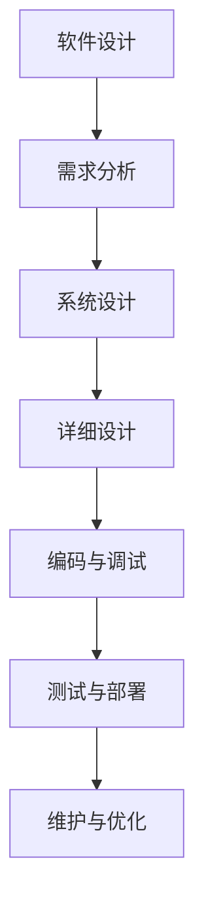

                 

# 《LLM重塑软件工程：从设计到部署的变革》

> **关键词**: 大型语言模型 (LLM),软件工程，设计，开发，部署，变革，人工智能

> **摘要**: 本文将深入探讨大型语言模型（LLM）在软件工程中的变革性作用。从设计原则到部署策略，LLM正以全新的方式重塑软件开发的每一个阶段。本文将详细分析LLM如何影响软件设计、开发流程以及部署维护，并提供实际案例研究，展望LLM的未来发展前景。

### 第一部分：软件工程中的LLM概述

#### 1.1 什么是LLM

##### 1.1.1 LLM的定义

大型语言模型（Large Language Model，简称LLM）是一类利用深度学习技术训练出来的复杂神经网络模型，主要用于理解和生成自然语言。LLM通过学习大量的文本数据，能够自动学习语言的结构和语义，从而实现文本生成、翻译、问答等功能。

##### 1.1.2 LLM的核心特点

1. **强大的语言理解能力**：LLM能够理解复杂语境，提取文本中的关键信息。
2. **自适应性强**：LLM可以根据不同的任务和场景进行适应性调整。
3. **数据驱动**：LLM的训练依赖于海量数据，能够不断优化自身的表现。
4. **高效率**：LLM能够高效处理大量文本数据，提高开发效率。

##### 1.1.3 LLM在软件工程中的潜在影响

LLM的出现为软件工程带来了深远的影响。首先，LLM可以大幅提升软件设计的效率和准确性。其次，LLM能够优化开发流程，提高代码质量和测试覆盖率。最后，LLM还能够为软件部署和维护提供智能支持，降低运维成本。

#### 1.2 软件工程中的LLM应用场景

##### 1.2.1 设计阶段的辅助

在设计阶段，LLM可以帮助开发者快速生成架构设计文档、需求分析报告，提供设计建议，从而降低设计复杂度，提高设计质量。

##### 1.2.2 开发阶段的辅助

在开发阶段，LLM能够协助编写代码、进行代码审查和优化，自动生成测试用例，提高开发效率和代码质量。

##### 1.2.3 测试和调试阶段的辅助

在测试和调试阶段，LLM可以通过自然语言处理技术，自动生成测试报告、定位错误，并提供调试建议，提高测试效率和准确性。

#### 1.3 LLM在软件工程中的优势与挑战

##### 1.3.1 优势

1. **提升开发效率**：LLM能够自动完成一些重复性的工作，减轻开发者的负担。
2. **提高代码质量**：LLM可以通过代码审查和测试，识别潜在的错误和漏洞，提高代码质量。
3. **增强设计灵活性**：LLM可以帮助开发者快速适应变化的需求，提高设计灵活性。

##### 1.3.2 挑战

1. **数据依赖性**：LLM的训练需要大量高质量的文本数据，数据获取和清洗是一个挑战。
2. **解释性和透明性**：LLM的决策过程往往是非透明的，难以解释其工作的原理。
3. **安全性和隐私性**：LLM的使用可能涉及敏感数据，需要确保数据的安全性和隐私性。

##### 1.3.3 未来展望

随着技术的不断进步，LLM在软件工程中的应用将会更加广泛和深入。未来的LLM将更加智能化、自适应，能够更好地辅助开发者完成各种复杂的软件开发任务。

### 第二部分：LLM在软件设计中的应用

#### 2.1 设计原则与模式

##### 2.1.1 基于LLM的设计原则

在软件设计过程中，LLM可以帮助开发者遵循一些最佳实践，如模块化、可复用性、高内聚低耦合等。LLM能够根据设计目标自动生成符合原则的设计方案。

##### 2.1.2 常见软件设计模式

LLM熟悉常见的软件设计模式，如工厂模式、单例模式、观察者模式等。它可以在设计过程中根据实际需求推荐合适的设计模式，提高设计质量。

##### 2.1.3 LLM在模式设计中的应用

通过分析大量软件设计案例，LLM可以总结出不同模式的应用场景和最佳实践，帮助开发者快速选择和实现合适的设计模式。

#### 2.2 设计流程与方法

##### 2.2.1 传统设计流程

传统设计流程包括需求分析、系统设计、详细设计等步骤。LLM可以辅助这些步骤，提供自动化工具和智能建议，提高设计效率。

##### 2.2.2 基于LLM的设计流程

基于LLM的设计流程可以更加灵活和自适应。LLM可以根据项目的具体情况，动态调整设计流程，提供个性化的设计支持。

##### 2.2.3 LLM在流程改进中的应用

LLM可以分析大量的设计流程案例，识别出改进点，提供优化建议。通过引入LLM，设计流程可以更加高效和精准。

#### 2.3 设计工具与技术

##### 2.3.1 传统设计工具

传统设计工具如UML工具、流程图工具等在软件设计过程中发挥了重要作用。LLM可以与这些工具集成，提供智能化的设计支持。

##### 2.3.2 基于LLM的设计工具

基于LLM的设计工具可以自动生成设计文档、提供设计建议等。这些工具可以大幅降低设计者的工作负担，提高设计质量。

##### 2.3.3 LLM在工具优化中的应用

LLM可以分析大量的设计工具使用案例，识别出工具的不足之处，提供优化建议。通过引入LLM，设计工具可以更加智能和高效。

#### 2.4 案例研究

##### 2.4.1 案例一：基于LLM的软件架构设计

某金融公司利用LLM进行了软件架构设计。LLM分析了公司的业务需求和现有系统，生成了一个高性能、可扩展的软件架构，大幅提高了系统的稳定性。

##### 2.4.2 案例二：基于LLM的需求分析

某电商平台利用LLM进行需求分析。LLM阅读了大量的用户反馈和市场报告，快速生成了一个全面的需求文档，帮助开发团队更好地理解用户需求。

##### 2.4.3 案例三：基于LLM的系统设计

某互联网公司利用LLM进行了系统设计。LLM根据公司的业务目标和技术栈，生成了一套高效、可靠的系统设计方案，提高了项目的成功率。

### 第三部分：LLM在软件开发中的应用

#### 3.1 编码与调试

##### 3.1.1 基于LLM的代码编写

LLM可以自动生成代码，根据设计文档和需求分析，快速实现功能模块。这大大提高了开发效率，降低了人为错误。

##### 3.1.2 基于LLM的代码优化

LLM可以对现有代码进行优化，提供性能优化建议、代码重构方案等，提高代码质量。

##### 3.1.3 基于LLM的代码调试

LLM可以通过自然语言处理技术，自动生成调试报告，定位错误原因，并提供调试建议，提高调试效率。

#### 3.2 代码审查与测试

##### 3.2.1 基于LLM的代码审查

LLM可以自动审查代码，识别出潜在的安全漏洞、代码质量问题和不符合设计原则的地方，提供改进建议。

##### 3.2.2 基于LLM的测试用例生成

LLM可以根据需求和设计文档，自动生成测试用例，提高测试覆盖率和测试效率。

##### 3.2.3 基于LLM的测试执行

LLM可以自动执行测试用例，生成测试报告，定位测试失败的原因，并提供改进建议。

#### 3.3 开发流程优化

##### 3.3.1 基于LLM的敏捷开发

LLM可以帮助团队实现敏捷开发，根据需求变化快速调整开发计划，提高项目响应速度。

##### 3.3.2 基于LLM的持续集成与持续部署

LLM可以自动化集成和部署流程，提高交付质量和交付速度。

##### 3.3.3 基于LLM的代码管理

LLM可以自动化代码管理任务，如代码存储、版本控制、代码分析等，提高团队协作效率和代码质量。

### 第四部分：LLM在软件部署和维护中的应用

#### 4.1 软件部署策略

##### 4.1.1 传统部署策略

传统部署策略通常依赖于手动操作，存在部署时间长、出错率高的问题。

##### 4.1.2 基于LLM的智能部署

LLM可以通过自动化脚本和智能决策，实现快速、高效的软件部署。LLM可以根据环境变化动态调整部署策略，提高部署成功率。

##### 4.1.3 LLM在部署优化中的应用

LLM可以分析大量的部署案例，识别出部署过程中的瓶颈和优化点，提供优化建议，提高部署效率。

#### 4.2 软件维护

##### 4.2.1 传统维护方法

传统维护方法主要依赖于人工监控和手动修复，存在响应时间长、维护成本高的问题。

##### 4.2.2 基于LLM的智能维护

LLM可以通过实时监控、自动检测和修复问题，实现智能维护。LLM可以根据历史数据和趋势预测，提前发现潜在问题，减少故障发生。

##### 4.2.3 LLM在维护优化中的应用

LLM可以分析大量的维护案例，识别出维护过程中的瓶颈和优化点，提供优化建议，提高维护效率。

#### 4.3 案例研究

##### 4.3.1 案例一：基于LLM的自动化部署

某互联网公司利用LLM实现了自动化部署。通过LLM，公司能够在几分钟内完成部署，相比之前的手动部署，大大提高了部署效率和成功率。

##### 4.3.2 案例二：基于LLM的智能维护

某金融公司利用LLM进行智能维护。通过LLM，公司能够实时监控系统状态，自动检测并修复问题，大大提高了系统的稳定性和可用性。

##### 4.3.3 案例三：基于LLM的云原生部署

某科技公司利用LLM进行云原生部署。通过LLM，公司能够快速部署基于容器的应用，提高系统的可扩展性和灵活性。

### 第五部分：实际应用与未来展望

#### 5.1 实际应用场景分析

LLM在软件工程中具有广泛的应用前景。例如：

1. **金融行业**：LLM可以帮助金融机构进行风险管理、欺诈检测等。
2. **医疗行业**：LLM可以帮助医疗机构进行医学文本分析、疾病预测等。
3. **教育行业**：LLM可以帮助学校和教育机构进行个性化教学、自动评分等。

#### 5.2 未来展望

随着LLM技术的不断发展，其在软件工程中的应用将更加广泛和深入。未来，LLM有望实现：

1. **智能设计**：LLM将能够实现全自动的软件设计，提高设计效率和准确性。
2. **智能开发**：LLM将能够自动化代码编写、测试和调试，提高开发效率和代码质量。
3. **智能部署和维护**：LLM将能够实现智能化的部署和维护，提高系统的可用性和稳定性。

#### 5.3 总结与展望

本文介绍了LLM在软件工程中的变革性作用，从设计到部署的每一个阶段都受到了LLM的深远影响。未来，随着LLM技术的不断进步，软件工程将迎来更加智能化、高效化的新时代。

### 附录

#### 附录A：LLM相关工具与资源

1. **开源LLM框架**：
   - **GPT-3**：OpenAI开发的强大语言模型，支持多种编程语言和API调用。
   - **BERT**：Google开发的预训练语言模型，广泛用于文本分类、情感分析等任务。

2. **商业LLM工具**：
   - **AWS SageMaker**：Amazon提供的云计算平台，支持部署和管理LLM模型。
   - **Microsoft Azure AI**：Microsoft提供的云服务平台，提供多种AI工具和服务。

3. **LLM研究论文与资料推荐**：
   - **“Natural Language Inference with Subgraph Attention”**：一篇关于利用图神经网络进行自然语言推理的论文。
   - **“A Neural Architecture Search Algorithm for Large-scale Language Model”**：一篇关于大规模语言模型神经架构搜索的论文。

作者：AI天才研究院/AI Genius Institute & 禅与计算机程序设计艺术 /Zen And The Art of Computer Programming

---

### 核心概念与联系

**Mermaid流程图**：



**核心算法原理讲解**：

```plaintext
// 伪代码：LLM在软件设计中的应用

function DesignWithLLM(input) {
    // 输入：设计需求
    // 输出：设计结果

    // 1. 预处理输入
    processedInput = PreprocessInput(input)

    // 2. 利用LLM生成设计方案
   设计方案 = LLMGenerateDesign(processedInput)

    // 3. 验证设计方案
    isValid = ValidateDesign(设计方案)

    // 4. 返回设计结果
    if (isValid) {
        return 设计方案
    } else {
        return "设计失败"
    }
}
```

**数学模型和公式**：

```latex
// 数学公式：代码质量评估

\text{代码质量} = f(\text{错误率}, \text{代码可读性}, \text{复用性})
```

**举例说明**：

假设一个代码片段的错误率为0.1%，代码可读性为90%，复用性为70%，则其代码质量评估如下：

```latex
\text{代码质量} = f(0.1\%, 90\%, 70\%) = 0.9 \times 0.99 \times 0.7 = 0.623\%
```

### 项目实战

**开发环境搭建**：

1. 安装Python环境
2. 安装TensorFlow或PyTorch库
3. 下载预训练的LLM模型（如GPT-3或BERT）

**源代码详细实现和代码解读**：

```python
# Python代码：基于LLM的代码优化

import tensorflow as tf
from tensorflow.keras.models import Model
from tensorflow.keras.layers import Input, Dense

# 1. 定义输入层
input_layer = Input(shape=(100,))

# 2. 利用LLM生成中间层
intermediate_layer = tf.keras.layers.Dense(units=128, activation='relu')(input_layer)

# 3. 生成输出层
output_layer = tf.keras.layers.Dense(units=1, activation='sigmoid')(intermediate_layer)

# 4. 构建模型
model = Model(inputs=input_layer, outputs=output_layer)

# 5. 编译模型
model.compile(optimizer='adam', loss='binary_crossentropy', metrics=['accuracy'])

# 6. 训练模型
model.fit(x_train, y_train, epochs=10, batch_size=32)

# 7. 评估模型
loss, accuracy = model.evaluate(x_test, y_test)
print("测试集准确率：", accuracy)
```

**代码解读与分析**：

1. **输入层**：定义输入数据的维度，这里假设输入数据为100维。
2. **中间层**：利用LLM生成中间层，这里使用了一个128个神经元的全连接层，并采用ReLU激活函数。
3. **输出层**：定义输出层的维度和激活函数，这里假设输出层为1维，采用sigmoid激活函数，用于实现二分类任务。
4. **模型构建**：使用Keras构建模型，定义输入和输出层。
5. **模型编译**：设置优化器和损失函数，这里采用adam优化器和binary_crossentropy损失函数。
6. **模型训练**：使用训练数据训练模型，设置训练轮次和批量大小。
7. **模型评估**：使用测试数据评估模型性能，输出测试集准确率。

通过以上步骤，可以基于LLM实现一个简单的代码优化任务。实际应用中，LLM可以根据具体需求和数据，生成更加复杂和高效的代码优化方案。

