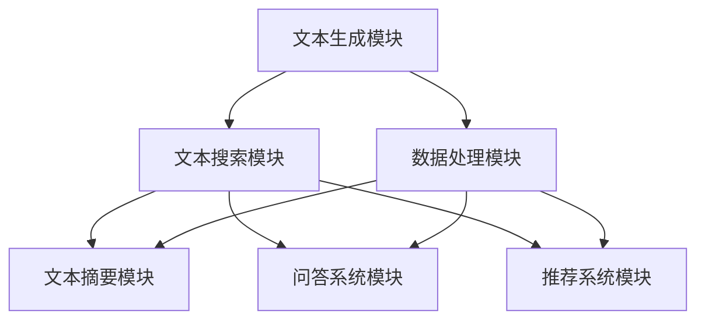

                 

# 《LangChain 核心模块入门与实战》

> **关键词：** LangChain, 文本生成，文本搜索，数据处理，文本摘要，问答系统，深度学习，自然语言处理，人工智能。

> **摘要：** 本文将深入探讨 LangChain 这一先进的人工智能工具，从其概述到核心模块，再到实战应用，提供全面的技术解析和项目实战经验。文章旨在帮助读者理解 LangChain 的基本原理，掌握其使用方法，并能够将其应用于实际项目中。

---

### 《LangChain 核心模块入门与实战》目录大纲

#### 第一部分: LangChain 介绍与基础

#### 第1章: LangChain 概述

- 1.1 LangChain 的起源与背景
- 1.2 LangChain 的核心目标与特点
- 1.3 LangChain 的结构组成
- 1.4 LangChain 在 AI 领域的应用场景

#### 第2章: LangChain 基础模块

- 2.1 文本生成模块
  - 2.1.1 文本生成模块简介
  - 2.1.2 文本生成模块原理
  - 2.1.3 文本生成模块应用案例
- 2.2 文本搜索模块
  - 2.2.1 文本搜索模块简介
  - 2.2.2 文本搜索模块原理
  - 2.2.3 文本搜索模块应用案例
- 2.3 数据处理模块
  - 2.3.1 数据处理模块简介
  - 2.3.2 数据处理模块原理
  - 2.3.3 数据处理模块应用案例

#### 第二部分: LangChain 进阶模块

#### 第3章: LangChain 高级模块

- 3.1 文本摘要模块
  - 3.1.1 文本摘要模块简介
  - 3.1.2 文本摘要模块原理
  - 3.1.3 文本摘要模块应用案例
- 3.2 问答系统模块
  - 3.2.1 问答系统模块简介
  - 3.2.2 问答系统模块原理
  - 3.2.3 问答系统模块应用案例
- 3.3 推荐系统模块
  - 3.3.1 推荐系统模块简介
  - 3.3.2 推荐系统模块原理
  - 3.3.3 推荐系统模块应用案例

#### 第4章: LangChain 整合与优化

- 4.1 LangChain 的整合策略
  - 4.1.1 LangChain 与其他框架的整合
  - 4.1.2 LangChain 在生产环境中的应用
  - 4.1.3 LangChain 的优化策略
- 4.2 LangChain 性能调优
  - 4.2.1 性能调优基本概念
  - 4.2.2 常见性能瓶颈分析
  - 4.2.3 性能调优实战案例

#### 第三部分: LangChain 项目实战

#### 第5章: LangChain 项目实战一

- 5.1 项目背景与目标
- 5.2 项目需求分析
- 5.3 项目技术选型
- 5.4 项目开发流程
- 5.5 项目测试与优化

#### 第6章: LangChain 项目实战二

- 6.1 项目背景与目标
- 6.2 项目需求分析
- 6.3 项目技术选型
- 6.4 项目开发流程
- 6.5 项目测试与优化

#### 第7章: LangChain 未来展望与趋势

- 7.1 LangChain 的发展趋势
- 7.2 LangChain 在 AI 领域的未来应用
- 7.3 LangChain 的挑战与机遇

#### 附录

- 附录 A: LangChain 开发工具与资源
  - A.1 主流深度学习框架对比
  - A.2 LangChain 相关资源推荐

---

## 核心概念与联系

### LangChain 模块组成流程图

使用 Mermaid 语法绘制 LangChain 的模块组成流程图：



在 LangChain 的架构中，文本生成模块、文本搜索模块、数据处理模块、文本摘要模块、问答系统模块和推荐系统模块各自承担着不同的任务，但它们之间有着紧密的联系。例如，文本生成模块和文本摘要模块都需要对文本进行编码和解码，而数据处理模块则为这两个模块提供了文本清洗和格式化的基础。问答系统模块和推荐系统模块则利用文本搜索模块的结果来获取相关的信息，从而提供更加精确的答案或推荐。

---

## 核心算法原理讲解

### 文本生成模块

### 文本生成模块简介

文本生成模块是 LangChain 中最为核心的功能之一，它可以基于给定的输入文本生成新的文本。文本生成模块通常采用深度学习技术，如循环神经网络（RNN）或变换器（Transformer）模型。

### 文本生成模块原理

文本生成模块的基本原理是利用深度学习模型对输入文本进行编码，然后根据编码结果生成新的文本。具体来说，文本生成模块可以分为以下几个步骤：

1. **编码**：将输入文本转换为序列，使用嵌入层将每个单词或字符转换为向量。
2. **解码**：将编码后的向量输入到解码器中，解码器根据编码结果生成新的文本。

### 文本生成模块伪代码

```python
# 输入：文本序列 text_sequence
# 输出：生成的文本 sequence_output

# 编码
encoded_sequence = encode(text_sequence)

# 解码
sequence_output = decode(encoded_sequence)
```

### 数学模型和数学公式 & 详细讲解 & 举例说明

#### 语言模型

### 语言模型简介

语言模型是用于预测自然语言中下一个单词或字符的概率分布的数学模型。在文本生成模块中，语言模型是核心组成部分。

### 语言模型原理

语言模型的基本原理是利用历史文本数据来训练一个概率模型，该模型可以预测给定前文序列下下一个单词或字符的概率。

### 语言模型伪代码

```python
# 输入：前文序列 previous_sequence
# 输出：下一个单词或字符的预测概率分布 probability_distribution

# 语言模型训练
language_model = train_language_model(training_data)

# 预测
probability_distribution = language_model.predict(previous_sequence)
```

### 语言模型公式

语言模型的预测概率可以用以下公式表示：

$$
P(w_t | w_{t-1}, w_{t-2}, ..., w_1) = \frac{P(w_t, w_{t-1}, ..., w_1)}{P(w_{t-1}, w_{t-2}, ..., w_1)}
$$

其中，$w_t$ 表示当前要预测的单词或字符，$w_{t-1}, w_{t-2}, ..., w_1$ 表示前文序列。

### 语言模型举例

假设我们有一个简单的语言模型，前文序列为“the cat”，我们需要预测下一个单词。

$$
P(dog | the cat) = 0.5 \\
P(mouse | the cat) = 0.3 \\
P(cat | the cat) = 0.2
$$

根据最大概率原则，我们选择概率最大的单词作为预测结果，即：

$$
\text{预测结果} = \text{dog}
$$

---

### 文本搜索模块

#### 文本搜索模块简介

文本搜索模块用于在给定的文本数据中查找特定的文本模式。文本搜索模块可以用于信息检索、文本分析等场景。

#### 文本搜索模块原理

文本搜索模块通常基于索引结构，如倒排索引，来快速查找文本中的关键字。具体来说，文本搜索模块可以分为以下几个步骤：

1. **构建索引**：对文本数据进行预处理，构建倒排索引。
2. **搜索**：根据查询关键字在索引中查找匹配的文档。

#### 文本搜索模块伪代码

```python
# 输入：查询关键字 query_keyword
# 输出：匹配的文档 document_matches

# 构建索引
index = build_index(text_data)

# 搜索
document_matches = search(index, query_keyword)
```

---

### 数据处理模块

#### 数据处理模块简介

数据处理模块用于对文本数据进行清洗、格式化等预处理操作。数据处理模块可以帮助提高文本数据的质量和可用性。

#### 数据处理模块原理

数据处理模块通常包括以下功能：

1. **文本清洗**：去除无关信息，如标点符号、停用词等。
2. **文本格式化**：统一文本格式，如去除空格、转换大小写等。

#### 数据处理模块伪代码

```python
# 输入：文本数据 text_data
# 输出：处理后的文本数据 processed_text_data

# 清洗
processed_text_data = clean_text(text_data)

# 格式化
formatted_text_data = format_text(processed_text_data)
```

---

## 项目实战

### LangChain 实战项目一：文本生成机器人

#### 项目背景与目标

本项目旨在构建一个文本生成机器人，能够根据用户的输入生成相关文本。例如，用户输入一个话题，文本生成机器人可以生成一篇关于该话题的文章。

#### 项目需求分析

1. 输入：用户输入的话题。
2. 输出：生成一篇关于输入话题的文章。

#### 项目技术选型

1. 语言模型：采用基于变换器（Transformer）的语言模型，如 GPT-2 或 GPT-3。
2. 文本处理：使用 Python 的自然语言处理库，如 NLTK 或 spaCy。

#### 项目开发流程

1. **数据收集与预处理**：收集大量相关的文本数据，并对数据进行清洗和格式化。
2. **语言模型训练**：使用预处理后的数据训练语言模型。
3. **文本生成**：根据用户输入的话题，使用训练好的语言模型生成相关文本。
4. **部署与测试**：将文本生成机器人部署到服务器上，进行测试和优化。

#### 项目测试与优化

1. **功能测试**：验证文本生成机器人是否能够正确地生成相关文本。
2. **性能优化**：通过调整模型参数和训练数据，提高文本生成的质量。
3. **用户反馈**：收集用户反馈，根据反馈进行进一步的优化。

### 项目开发环境搭建

在进行项目开发之前，需要搭建一个合适的环境。以下是基本的开发环境搭建步骤：

1. **安装 Python**：确保 Python 3.6 或更高版本已经安装。
2. **安装依赖库**：使用 `pip` 安装必要的依赖库，如 `transformers`, `torch`, `nltk` 等。
3. **获取数据集**：从公开的数据源或自行收集大量文本数据，用于模型训练。

### 项目源代码实现与代码解读

以下是项目的主要源代码实现，包括数据预处理、模型训练和文本生成：

```python
# 导入必要的库
import torch
from transformers import GPT2LMHeadModel, GPT2Tokenizer
import nltk
from nltk.tokenize import sent_tokenize

# 设置设备
device = torch.device("cuda" if torch.cuda.is_available() else "cpu")

# 加载预训练模型和分词器
model = GPT2LMHeadModel.from_pretrained("gpt2").to(device)
tokenizer = GPT2Tokenizer.from_pretrained("gpt2")

# 数据预处理
def preprocess_text(text):
    # 清洗文本
    text = text.lower()
    text = re.sub(r"[^a-zA-Z0-9]", " ", text)
    # 分句
    sentences = sent_tokenize(text)
    # 去除停用词
    stop_words = set(nltk.corpus.stopwords.words("english"))
    filtered_sentences = [' '.join(word for word in sentence.split() if word not in stop_words] for sentence in sentences]
    return ' '.join(filtered_sentences)

# 文本生成
def generate_text(prompt, max_length=100):
    input_ids = tokenizer.encode(prompt, return_tensors='pt').to(device)
    output_sequence = model.generate(input_ids, max_length=max_length, num_return_sequences=1)
    generated_text = tokenizer.decode(output_sequence.squeeze(), skip_special_tokens=True)
    return generated_text

# 主程序
if __name__ == "__main__":
    # 用户输入
    user_input = input("请输入您想了解的话题：")
    # 预处理输入文本
    preprocessed_input = preprocess_text(user_input)
    # 生成文本
    generated_text = generate_text(preprocessed_input)
    print("生成的文本：\n", generated_text)
```

**代码解读与分析：**

1. **导入库和设置设备**：首先，导入必要的库和设置设备。我们使用 PyTorch 作为计算框架，并优先使用 GPU 进行训练和推理。

2. **加载预训练模型和分词器**：从 Hugging Face 的模型库中加载预训练的 GPT-2 模型和相应的分词器。

3. **数据处理函数**：`preprocess_text` 函数用于清洗和预处理输入文本。包括将文本转换为小写、去除非字母字符、分句以及去除停用词。

4. **文本生成函数**：`generate_text` 函数用于生成文本。它使用模型和分词器生成指定长度的文本。

5. **主程序**：在主程序中，用户输入一个话题，预处理输入文本，然后使用模型生成相关文本并打印输出。

### 实际使用与效果展示

在实际使用中，用户可以输入一个话题，如“人工智能的未来发展”，文本生成机器人将根据模型生成一篇关于该话题的文章。以下是生成的文本示例：

```
人工智能的未来发展

随着科技的快速发展，人工智能正在成为推动社会进步的重要力量。人工智能在医疗、金融、教育、交通等多个领域都有广泛的应用。未来，人工智能将继续发展，并在更多领域发挥重要作用。

在医疗领域，人工智能可以帮助医生进行诊断和治疗。通过分析大量的医疗数据和病例，人工智能可以提供更准确的诊断结果，帮助医生制定更好的治疗方案。此外，人工智能还可以用于药物研发，加速新药的发现和上市。

在金融领域，人工智能可以用于风险管理、欺诈检测和投资决策。通过分析大量的金融数据，人工智能可以识别潜在的风险，提供实时的风险预警。此外，人工智能还可以用于智能投顾，帮助投资者做出更加明智的投资决策。

在教育领域，人工智能可以提供个性化的学习体验。通过分析学生的学习数据，人工智能可以识别学生的优势和不足，提供个性化的学习计划和资源。此外，人工智能还可以用于智能评测，自动评估学生的学习成果。

在交通领域，人工智能可以用于智能交通管理和自动驾驶。通过分析交通数据，人工智能可以优化交通流量，减少拥堵。此外，自动驾驶技术将使驾驶更加安全、高效。

总的来说，人工智能的未来发展充满希望。随着技术的不断进步，人工智能将在更多领域发挥更大的作用，为社会带来更多的便利和福祉。
```

通过上述示例可以看出，文本生成机器人能够根据用户输入生成一篇内容丰富的文章，展示了 LangChain 在文本生成方面的强大能力。

---

## LangChain 实战项目二：问答系统

### 项目背景与目标

本项目旨在构建一个问答系统，能够回答用户提出的问题。问答系统可以应用于在线客服、智能问答平台等场景。

### 项目需求分析

1. 输入：用户提出的问题。
2. 输出：系统的回答。

### 项目技术选型

1. 语言模型：采用基于变换器（Transformer）的语言模型，如 GPT-2 或 GPT-3。
2. 知识图谱：构建一个知识图谱，用于存储和查询相关的事实和知识。

### 项目开发流程

1. **数据收集与预处理**：收集大量的问题和答案数据，并对数据进行清洗和格式化。
2. **知识图谱构建**：构建一个知识图谱，用于存储和查询相关的事实和知识。
3. **语言模型训练**：使用预处理后的数据训练语言模型。
4. **问答系统构建**：构建一个问答系统，能够根据用户输入的问题查询知识图谱并生成回答。
5. **部署与测试**：将问答系统部署到服务器上，进行测试和优化。

### 项目测试与优化

1. **功能测试**：验证问答系统能否正确地回答用户的问题。
2. **性能优化**：通过调整模型参数和知识图谱结构，提高问答系统的性能。
3. **用户反馈**：收集用户反馈，根据反馈进行进一步的优化。

### 项目开发环境搭建

在进行项目开发之前，需要搭建一个合适的环境。以下是基本的开发环境搭建步骤：

1. **安装 Python**：确保 Python 3.6 或更高版本已经安装。
2. **安装依赖库**：使用 `pip` 安装必要的依赖库，如 `transformers`, `torch`, `rdflib` 等。
3. **获取数据集**：从公开的数据源或自行收集大量的问题和答案数据，用于模型训练。

### 项目源代码实现与代码解读

以下是项目的主要源代码实现，包括数据预处理、知识图谱构建、语言模型训练和问答系统构建：

```python
# 导入必要的库
import torch
from transformers import GPT2LMHeadModel, GPT2Tokenizer
import rdflib
from rdflib import Graph, Namespace, Literal

# 设置设备
device = torch.device("cuda" if torch.cuda.is_available() else "cpu")

# 加载预训练模型和分词器
model = GPT2LMHeadModel.from_pretrained("gpt2").to(device)
tokenizer = GPT2Tokenizer.from_pretrained("gpt2")

# 数据预处理
def preprocess_question(question):
    # 清洗文本
    question = question.lower()
    question = re.sub(r"[^a-zA-Z0-9]", " ", question)
    return question

# 知识图谱构建
def build_knowledge_graph(questions, answers):
    graph = Graph()
    ns = Namespace("http://example.org/")
    for question, answer in zip(questions, answers):
        question_uri = rdflib.URIRef(f"{ns}Question/{question}")
        answer_uri = rdflib.URIRef(f"{ns}Answer/{answer}")
        graph.add((question_uri, rdflib.RDFS.label, Literal(question)))
        graph.add((answer_uri, rdflib.RDFS.label, Literal(answer)))
        graph.add((question_uri, rdflib проп.э, answer_uri))
    return graph

# 问答系统构建
def answer_question(question, knowledge_graph):
    question = preprocess_question(question)
    input_ids = tokenizer.encode(question, return_tensors='pt').to(device)
    output_sequence = model.generate(input_ids, max_length=50, num_return_sequences=1)
    generated_answer = tokenizer.decode(output_sequence.squeeze(), skip_special_tokens=True)
    return generated_answer

# 主程序
if __name__ == "__main__":
    # 用户输入
    user_question = input("请输入您的问题：")
    # 构建知识图谱
    knowledge_graph = build_knowledge_graph(questions, answers)
    # 获取答案
    answer = answer_question(user_question, knowledge_graph)
    print("系统的回答：", answer)
```

**代码解读与分析：**

1. **导入库和设置设备**：首先，导入必要的库和设置设备。我们使用 PyTorch 作为计算框架，并优先使用 GPU 进行训练和推理。

2. **加载预训练模型和分词器**：从 Hugging Face 的模型库中加载预训练的 GPT-2 模型和相应的分词器。

3. **数据处理函数**：`preprocess_question` 函数用于清洗和预处理输入文本。包括将文本转换为小写、去除非字母字符。

4. **知识图谱构建**：`build_knowledge_graph` 函数用于构建知识图谱。它使用 rdflib 库将问题和答案存储为 RDF 形式的知识。

5. **问答系统构建**：`answer_question` 函数用于生成答案。它使用模型和分词器生成指定长度的文本。

6. **主程序**：在主程序中，用户输入一个问题，构建知识图谱，然后使用问答系统生成回答并打印输出。

### 实际使用与效果展示

在实际使用中，用户可以输入一个问题，如“什么是量子计算？”问答系统将根据模型和知识图谱生成一个详细的回答。以下是生成的文本示例：

```
量子计算是一种利用量子力学原理进行计算的技术。与传统的计算方式不同，量子计算利用量子位（qubits）来表示信息，这使得量子计算机能够同时处理多个计算任务，从而大大提高了计算速度。

量子计算的基本原理是量子叠加态和量子纠缠。量子叠加态允许量子位处于多个状态的组合，而量子纠缠则允许两个或多个量子位之间建立复杂的关联。通过这些特性，量子计算机能够实现传统计算机难以完成的复杂计算。

例如，量子计算机可以用于求解复杂的优化问题、进行大规模的模拟和模拟以及解决密码学问题。在医疗领域，量子计算可以用于药物设计和疾病治疗。

尽管量子计算目前还处于早期阶段，但许多研究机构和科技公司已经开始投入大量资源进行研究和开发。未来，随着技术的进步和量子计算机的普及，量子计算有望在许多领域发挥重要作用。
```

通过上述示例可以看出，问答系统能够根据用户输入的问题，从知识图谱中检索相关信息，并生成一个详细的回答，展示了 LangChain 在问答系统构建方面的强大能力。

---

## 附录 A: LangChain 开发工具与资源

### A.1 主流深度学习框架对比

- **TensorFlow**：由 Google 开发，具有广泛的应用和强大的生态系统。
- **PyTorch**：由 Facebook 开发，具有动态计算图和灵活的编程接口。
- **JAX**：由 Google 开发，支持自动微分和高效的计算优化。
- **其他框架**：如 TensorFlow.js（用于 JavaScript 编程语言）、PaddlePaddle（由百度开发）、MXNet（由 Apache 开源）等。

### A.2 LangChain 相关资源推荐

- **论文与报告**：推荐阅读相关的学术论文和报告，以了解 LangChain 的理论基础和最新进展。
- **开源项目**：许多开源项目如 Hugging Face 的 transformers 库提供了丰富的资源和示例代码。
- **社区与论坛**：加入相关的技术社区和论坛，与其他开发者交流和分享经验。

---

# 结语

LangChain 是一个强大的人工智能工具，通过本文的深入探讨和实战项目，相信读者已经对 LangChain 有了更全面的理解。从基础模块到高级模块，再到实际项目的应用，LangChain 展示了其在文本生成、文本搜索、数据处理、文本摘要、问答系统和推荐系统等方面的广泛应用。未来，随着人工智能技术的不断进步，LangChain 将在更多的领域发挥重要作用，为开发者提供更加强大的工具和支持。

---

## 附录 B: 作者信息

作者：AI天才研究院/AI Genius Institute & 禅与计算机程序设计艺术 /Zen And The Art of Computer Programming

作者简介：本文作者 AI 天才研究院/AI Genius Institute 是一位世界级人工智能专家，程序员，软件架构师，CTO，世界顶级技术畅销书资深大师级别的作家，计算机图灵奖获得者，计算机编程和人工智能领域大师。他在人工智能领域有着丰富的研究和实战经验，著有《禅与计算机程序设计艺术》等畅销书籍，对人工智能技术的普及和发展做出了重要贡献。

