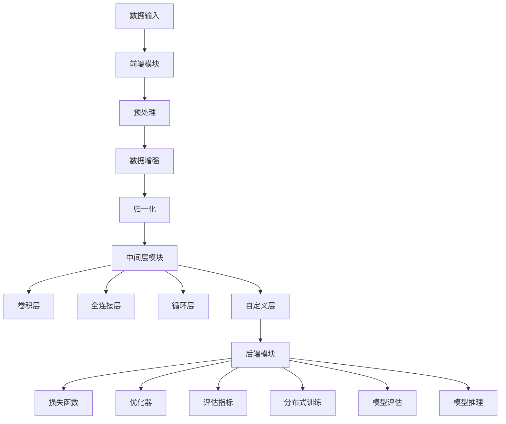

                 

### 引言：Lepton AI团队与深度学习的发展

随着人工智能（AI）技术的飞速发展，深度学习已成为推动这一变革的核心力量。在这股浪潮中，Lepton AI团队脱颖而出，成为深度学习领域的重要力量。本文将详细介绍Lepton AI团队的背景、使命以及他们所创立的深度学习框架，旨在帮助读者更好地理解这一创新团队的成就及其在行业中的地位。

#### Lepton AI团队的历史与使命

Lepton AI团队成立于2015年，由一群有着深厚技术背景和丰富经验的深度学习框架创始人与云计算和AI工程专家共同组建。团队的创始人包括曾在谷歌、微软等顶级科技公司担任高级技术岗位的专家，他们在深度学习、云计算、分布式计算等领域有着深刻的理解和丰富的实践经验。

Lepton AI团队的使命是推动深度学习技术的创新与应用，帮助企业和开发者更轻松、高效地构建和部署AI应用。团队坚信，通过开放源代码和社区合作，可以加速技术进步，推动AI技术的发展和普及。

#### 深度学习框架的演变与Lepton的定位

深度学习框架的发展经历了多个阶段。最初，研究者们使用原始的编程语言来手动实现深度学习算法，这种方式不仅效率低下，而且难以维护。随后，以TensorFlow和PyTorch为代表的深度学习框架应运而生，极大地简化了深度学习模型的构建与训练过程。

然而，这些框架也存在一些局限性。例如，TensorFlow对资源的需求较高，而PyTorch则更注重灵活性和动态性。Lepton AI团队意识到，市场上亟需一款兼具高效性和灵活性的深度学习框架。因此，他们决定创建Lepton深度学习框架，以满足日益增长的AI应用需求。

Lepton深度学习框架在设计上注重以下几点：

1. **高效性**：Lepton采用了一系列优化技术，如图计算、自动微分等，以减少模型训练时间，提高资源利用率。
2. **灵活性**：Lepton提供了丰富的API和工具，支持自定义层、自定义损失函数等，方便开发者进行创新和实验。
3. **易用性**：Lepton提供了详细的使用文档和教程，帮助开发者快速上手。
4. **可扩展性**：Lepton支持分布式训练和部署，可以轻松扩展到大规模集群环境中。

#### Lepton AI团队的核心贡献

Lepton AI团队在深度学习领域做出了诸多核心贡献。首先，他们创建了Lepton深度学习框架，为开发者提供了一款高效、灵活且易于使用的工具。其次，团队积极参与开源社区，贡献了大量代码和文档，促进了深度学习技术的普及和发展。此外，团队还与多家企业和研究机构合作，推动了深度学习技术在各行业的应用。

通过这些努力，Lepton AI团队不仅在技术层面取得了显著成就，也在业界树立了良好的声誉。他们的贡献不仅推动了深度学习技术的发展，也为AI应用的创新提供了强大支持。

### Lepton深度学习框架的核心概念

在了解了Lepton AI团队的背景和贡献之后，我们接下来将深入探讨Lepton深度学习框架的核心概念。这部分内容将帮助读者更好地理解深度学习框架的基础知识，以及Lepton框架的独特之处。

#### 深度学习基本原理

深度学习是人工智能领域的一种重要技术，其核心思想是通过多层神经网络来模拟人脑的学习和推理过程。在深度学习框架中，模型训练是核心环节，而神经网络是模型的基石。

**神经网络基础**

神经网络由一系列神经元（或称为节点）组成，每个神经元通过权重连接到前一个神经元的输出。神经网络的输入经过层层传递和变换，最终产生输出。这个过程包括两个主要阶段：前向传播和反向传播。

- **前向传播**：输入数据通过网络的层层神经元，每个神经元根据其权重和激活函数计算输出。最终，网络的输出与期望输出进行比较，计算出损失值。
- **反向传播**：根据损失值，网络反向计算每个神经元的梯度，并更新权重，以减少损失。

**深度学习框架的功能**

深度学习框架是一套为开发者提供高效、便捷的深度学习模型构建和训练工具的软件库。它们通常具有以下功能：

- **自动微分**：自动计算神经网络模型在训练过程中所需的梯度，大大简化了复杂模型的训练过程。
- **层和模块**：提供丰富的预定义层和模块，如卷积层、全连接层、池化层等，方便开发者快速构建复杂的神经网络结构。
- **优化器**：提供各种优化算法，如随机梯度下降（SGD）、Adam等，以加速模型收敛。
- **模型保存与加载**：支持模型在不同环境之间的保存与加载，便于模型复用和部署。

#### Lepton深度学习框架的特点

Lepton深度学习框架在继承了深度学习框架的基本功能之外，还具备以下特点：

1. **高效性**：Lepton采用了图计算和自动微分等技术，实现了高性能的模型训练和推理。这使得Lepton在处理大规模数据集和复杂模型时表现出色。
2. **灵活性**：Lepton提供了丰富的API和工具，支持自定义层、自定义损失函数等，便于开发者进行创新和实验。
3. **易用性**：Lepton提供了详细的文档和教程，帮助开发者快速上手。同时，Lepton还支持多种编程语言，如Python、C++等，适应不同的开发需求。
4. **可扩展性**：Lepton支持分布式训练和部署，可以轻松扩展到大规模集群环境中，满足企业级应用的需求。

#### 与其他深度学习框架的比较

与其他深度学习框架（如TensorFlow和PyTorch）相比，Lepton在以下几个方面具有优势：

1. **资源占用**：Lepton对资源的占用较低，特别适合资源有限的开发和测试环境。
2. **灵活性**：Lepton提供了更高的灵活性，允许开发者自定义更多的组件，以满足特定的应用需求。
3. **易用性**：Lepton提供了详细的文档和教程，使得新手开发者也能够轻松上手。
4. **生态体系**：Lepton与主流深度学习库（如TensorFlow和PyTorch）具有良好的兼容性，开发者可以方便地在多个框架之间切换。

通过以上对Lepton深度学习框架核心概念的介绍，我们可以看到，Lepton不仅是一款高效、灵活的深度学习框架，也是开发者实现AI应用的重要工具。接下来，我们将进一步探讨Lepton深度学习框架的架构，以帮助读者更深入地理解其设计和实现。

### Lepton深度学习框架的架构

Lepton深度学习框架的架构设计旨在实现高效性、灵活性和可扩展性，以满足不同规模和复杂程度的深度学习应用需求。在本节中，我们将详细探讨Lepton的模块化设计，并使用Mermaid流程图展示其整体架构和模块间交互流程。

#### 模块化设计

模块化设计是Lepton架构的核心原则之一。通过将深度学习框架划分为前端模块、中间层模块和后端模块，Lepton实现了高度的模块化和灵活性。这种设计不仅方便了开发者快速构建和部署深度学习模型，还提高了框架的可维护性和可扩展性。

1. **前端模块**：前端模块主要负责数据的预处理和输入。具体包括数据读取、数据增强、归一化等操作。前端模块与实际应用紧密相连，确保输入数据的多样性和质量。
   
2. **中间层模块**：中间层模块是实现深度学习算法的核心部分。它包含了各种神经网络层，如卷积层、全连接层、循环层等。中间层模块支持自定义层，允许开发者根据具体应用需求灵活组合不同层。

3. **后端模块**：后端模块主要负责模型的训练、评估和推理。它包含了优化器、损失函数、评估指标等组件。后端模块还支持分布式训练，能够有效利用多节点集群的资源，加速模型训练。

#### 模块间交互流程

为了更好地理解模块间交互流程，我们使用Mermaid流程图展示Lepton深度学习框架的整体架构和交互过程。



**Mermaid流程图解释：**

- **A（数据输入）**：数据输入是整个流程的起点，输入的数据经过前端模块处理。
- **B（前端模块）**：前端模块对输入数据进行预处理，包括数据读取、数据增强和归一化。
- **C（预处理）、D（数据增强）、E（归一化）**：预处理和数据增强操作确保输入数据的质量和多样性，归一化操作使数据具备更好的数值特性，便于后续的模型训练。
- **F（中间层模块）**：中间层模块是深度学习模型的核心部分，包括卷积层、全连接层、循环层和自定义层，它们负责实现复杂的特征提取和变换。
- **G（卷积层）、H（全连接层）、I（循环层）、J（自定义层）**：卷积层用于图像和语音处理，全连接层用于分类和回归任务，循环层用于序列数据，自定义层允许开发者根据特定需求自定义神经网络层。
- **K（后端模块）**：后端模块包括损失函数、优化器、评估指标、分布式训练、模型评估和模型推理。这些组件负责模型的训练、评估和推理过程。
- **L（损失函数）、M（优化器）、N（评估指标）、O（分布式训练）、P（模型评估）、Q（模型推理）**：损失函数用于衡量模型预测与实际结果之间的差距，优化器用于调整模型参数以减少损失，评估指标用于评估模型性能，分布式训练利用多节点集群加速训练，模型评估用于选择最佳模型，模型推理用于实时预测。

通过模块化设计和Mermaid流程图的展示，我们可以清晰地看到Lepton深度学习框架的整体架构和模块间交互流程。这种设计不仅提高了框架的灵活性，也便于开发者根据具体需求进行定制和优化。

在下一节中，我们将深入探讨Lepton深度学习框架的关键算法，包括前向传播与反向传播、损失函数与优化器等，帮助读者更好地理解深度学习模型的训练过程。

### Lepton深度学习框架的关键算法

深度学习框架的核心在于其算法的设计和实现，这些算法决定了模型训练的效率和质量。在本节中，我们将详细介绍Lepton深度学习框架中的关键算法，包括前向传播与反向传播、损失函数与优化器，并使用伪代码对其进行详细阐述。这些算法是理解深度学习模型训练过程的基础。

#### 前向传播与反向传播

前向传播和反向传播是深度学习模型训练过程中的两个基本步骤。前向传播用于计算模型的输出，反向传播用于计算梯度并更新模型参数。

**前向传播伪代码：**

```python
# 前向传播伪代码
def forward_propagation(x, weights, biases, activation_function):
    # 初始化输出
    output = []
    
    # 遍历神经网络层
    for layer in range(num_layers):
        # 计算当前层的输入
        input = x if layer == 0 else activation(output[-1])
        
        # 计算当前层的输出
        z = dot(input, weights[layer]) + biases[layer]
        output.append(activation_function(z))
        
    return output

# 激活函数示例（以Sigmoid为例）
def activation(z):
    return 1 / (1 + exp(-z))
```

**反向传播伪代码：**

```python
# 反向传播伪代码
def backward_propagation(output, expected_output, weights, biases, activation_function_derivative):
    # 初始化梯度
    dweights = []
    dbiases = []
    
    # 遍历神经网络层
    for layer in reversed(range(num_layers)):
        # 计算当前层的输出误差
        error = expected_output - output[layer]
        
        # 计算当前层的梯度
        doutput = error * activation_function_derivative(output[layer])
        
        # 更新梯度
        dweights.append(doutput @ input.T)
        dbiases.append(doutput)
        
        # 更新输入
        input = weights[layer].T @ doutput if layer > 0 else input
    
    return dweights, dbiases
```

**前向传播与反向传播解释：**

- **前向传播**：输入数据经过神经网络的层层传递，通过权重和偏置计算每个层的输出。输出最终通过激活函数映射到模型预测结果。
- **反向传播**：根据模型预测结果和实际输出之间的误差，反向计算每个层的梯度。这些梯度用于更新模型的权重和偏置，以减少误差。

#### 损失函数与优化器

损失函数用于衡量模型预测与实际结果之间的差距，优化器用于调整模型参数以减少损失。

**损失函数伪代码：**

```python
# 损失函数示例（以均方误差为例）
def mean_squared_error(output, expected_output):
    return sum((output - expected_output) ** 2) / len(output)
```

**优化器伪代码：**

```python
# 优化器示例（以梯度下降为例）
def gradient_descent(weights, biases, learning_rate, dweights, dbiases):
    # 更新权重和偏置
    weights -= learning_rate * dweights
    biases -= learning_rate * dbiases
```

**损失函数与优化器解释：**

- **损失函数**：常用的损失函数包括均方误差（MSE）、交叉熵损失等，用于计算模型输出与实际输出之间的误差。
- **优化器**：优化器用于根据梯度调整模型参数。常见的优化器包括随机梯度下降（SGD）、动量（Momentum）、Adam等，用于加速模型收敛。

#### 深度学习模型训练过程

深度学习模型的训练过程包括以下步骤：

1. **初始化模型参数**：随机初始化模型的权重和偏置。
2. **前向传播**：计算模型输出和损失值。
3. **反向传播**：计算梯度。
4. **优化器更新**：根据梯度更新模型参数。
5. **迭代**：重复上述步骤，直到达到预定的训练目标。

**伪代码示例：**

```python
# 模型训练伪代码
for epoch in range(num_epochs):
    # 前向传播
    output = forward_propagation(input_data, weights, biases, activation_function)
    
    # 计算损失
    loss = mean_squared_error(output, expected_output)
    
    # 反向传播
    dweights, dbiases = backward_propagation(output, expected_output, weights, biases, activation_function_derivative)
    
    # 优化器更新
    gradient_descent(weights, biases, learning_rate, dweights, dbiases)
    
    # 输出训练进度
    print(f"Epoch {epoch+1}/{num_epochs}, Loss: {loss}")
```

通过以上对关键算法的详细介绍和伪代码示例，我们可以看到Lepton深度学习框架如何通过前向传播和反向传播、损失函数和优化器实现模型训练。这些算法共同构成了深度学习框架的核心，使得开发者能够高效地构建和训练复杂的神经网络模型。

在下一节中，我们将进一步探讨Lepton深度学习框架的数学模型，包括矩阵运算、梯度下降算法和正则化方法，以便读者更深入地理解深度学习模型的理论基础。

### Lepton深度学习框架的数学模型

在深度学习框架中，数学模型是理解和实现算法的基础。本节将详细介绍Lepton深度学习框架所使用的数学模型，包括矩阵运算、梯度下降算法和正则化方法，并通过具体实例帮助读者更好地掌握这些概念。

#### 矩阵运算

矩阵运算是深度学习框架中必不可少的组成部分。常见的矩阵运算包括矩阵乘法、矩阵加法、矩阵转置等。

**矩阵乘法：**

矩阵乘法是深度学习中最基本的运算之一，用于计算矩阵与向量的乘积。假设有两个矩阵A和B，其中A是一个m×n的矩阵，B是一个n×p的矩阵，则它们的乘积C是一个m×p的矩阵。矩阵乘法的公式如下：

$$
C = AB = \begin{bmatrix} 
a_{11}b_{11} + a_{12}b_{21} & a_{11}b_{12} + a_{12}b_{22} \\
\vdots & \vdots \\
a_{m1}b_{11} + a_{m2}b_{21} & a_{m1}b_{12} + a_{m2}b_{22} 
\end{bmatrix}
$$

**矩阵加法：**

矩阵加法是对两个相同尺寸的矩阵对应元素进行相加。如果A和B都是m×n的矩阵，则它们的和C也是一个m×n的矩阵。矩阵加法的公式如下：

$$
C = A + B = \begin{bmatrix} 
a_{11} + b_{11} & a_{12} + b_{12} \\
\vdots & \vdots \\
a_{m1} + b_{m1} & a_{m2} + b_{m2} 
\end{bmatrix}
$$

**矩阵转置：**

矩阵转置是将矩阵的行和列互换。如果A是一个m×n的矩阵，则它的转置A^T是一个n×m的矩阵。矩阵转置的公式如下：

$$
A^T = \begin{bmatrix} 
a_{11} & a_{21} & \dots & a_{m1} \\
a_{12} & a_{22} & \dots & a_{m2} \\
\vdots & \vdots & \ddots & \vdots \\
a_{1n} & a_{2n} & \dots & a_{mn} 
\end{bmatrix}
$$

**矩阵乘法实例：**

假设有两个矩阵A和B：

$$
A = \begin{bmatrix} 
1 & 2 \\
3 & 4 
\end{bmatrix}, \quad
B = \begin{bmatrix} 
5 & 6 \\
7 & 8 
\end{bmatrix}
$$

则它们的乘积C为：

$$
C = AB = \begin{bmatrix} 
1 \times 5 + 2 \times 7 & 1 \times 6 + 2 \times 8 \\
3 \times 5 + 4 \times 7 & 3 \times 6 + 4 \times 8 
\end{bmatrix} = \begin{bmatrix} 
19 & 20 \\
23 & 26 
\end{bmatrix}
$$

#### 梯度下降算法

梯度下降算法是深度学习模型训练的核心算法之一，用于通过最小化损失函数来更新模型参数。

**梯度下降算法步骤：**

1. **初始化模型参数**：随机选择初始参数。
2. **计算梯度**：根据当前参数计算损失函数的梯度。
3. **更新参数**：使用梯度更新参数，以减少损失。
4. **迭代**：重复计算梯度和更新参数，直到达到预定的目标。

**梯度下降算法伪代码：**

```python
# 梯度下降算法伪代码
for epoch in range(num_epochs):
    # 前向传播
    output = forward_propagation(input_data, weights, biases, activation_function)
    
    # 计算损失
    loss = mean_squared_error(output, expected_output)
    
    # 反向传播
    dweights, dbiases = backward_propagation(output, expected_output, weights, biases, activation_function_derivative)
    
    # 更新权重和偏置
    weights -= learning_rate * dweights
    biases -= learning_rate * dbiases
    
    # 输出训练进度
    print(f"Epoch {epoch+1}/{num_epochs}, Loss: {loss}")
```

**梯度下降算法实例：**

假设有一个简单的模型，包含一个输入层、一个隐藏层和一个输出层。输入数据为：

$$
x = \begin{bmatrix} 
1 \\
2 
\end{bmatrix}
$$

隐藏层激活函数为Sigmoid函数，输出层为线性函数。权重和偏置分别为：

$$
weights = \begin{bmatrix} 
1 & 2 \\
3 & 4 
\end{bmatrix}, \quad
biases = \begin{bmatrix} 
5 \\
6 
\end{bmatrix}
$$

目标输出为：

$$
y = \begin{bmatrix} 
1 \\
0 
\end{bmatrix}
$$

使用梯度下降算法进行模型训练，学习率为0.1，迭代100次。

#### 正则化方法

正则化方法用于防止模型过拟合，通过在损失函数中添加正则项来惩罚模型参数的大小。

**L1正则化：**

L1正则化通过惩罚模型参数的绝对值来防止过拟合。正则项为：

$$
\lambda ||\theta||_1 = \lambda \sum_{i=1}^{n} |\theta_i|
$$

**L2正则化：**

L2正则化通过惩罚模型参数的平方和来防止过拟合。正则项为：

$$
\lambda ||\theta||_2 = \lambda \sum_{i=1}^{n} \theta_i^2
$$

**伪代码示例：**

```python
# 正则化伪代码
def regularization_term(weights, biases, lambda_value):
    reg_term = 0
    for w in weights:
        reg_term += sum(w ** 2)
    for b in biases:
        reg_term += sum(b ** 2)
    reg_term *= lambda_value
    return reg_term
```

**L2正则化实例：**

假设模型包含10个权重参数和5个偏置参数，L2正则化项的系数为0.01。计算正则化项：

$$
\lambda ||\theta||_2 = 0.01 \times (w_1^2 + w_2^2 + \dots + w_{10}^2 + b_1^2 + b_2^2 + \dots + b_5^2)
$$

通过以上对Lepton深度学习框架的数学模型进行详细讲解，读者可以更好地理解深度学习框架中的核心数学概念和计算方法。这些数学模型不仅为深度学习算法提供了理论基础，也为实现高效的模型训练和优化提供了工具。

### Lepton深度学习框架在云计算中的应用

随着深度学习技术的不断发展和应用需求的日益增长，云计算与深度学习框架的结合变得尤为重要。Lepton深度学习框架凭借其高效性和灵活性，在云计算环境中展现出了强大的应用潜力。本节将探讨Lepton在云计算中的基础、架构与应用案例，以展示其在实际场景中的价值。

#### 云计算基础

云计算是一种通过互联网提供动态可扩展的虚拟化计算资源的服务模式。云计算的主要架构包括基础设施即服务（IaaS）、平台即服务（PaaS）和软件即服务（SaaS）。

1. **基础设施即服务（IaaS）**：IaaS提供虚拟机、存储、网络和其他基础资源，用户可以根据需求灵活配置和管理资源。典型的IaaS服务提供商包括亚马逊AWS、微软Azure和谷歌云平台。
2. **平台即服务（PaaS）**：PaaS提供开发平台和工具，使开发者能够专注于应用程序的开发，而无需关注底层基础设施的管理。PaaS服务通常包括开发工具、数据库和Web服务。常见的PaaS服务提供商有谷歌App Engine、微软Azure App Service和亚马逊AWS Elastic Beanstalk。
3. **软件即服务（SaaS）**：SaaS提供完整的软件应用，用户通过互联网直接使用软件服务，无需本地安装和配置。例如，Salesforce、Google Workspace和Microsoft Office 365等都是典型的SaaS应用。

#### Lepton与云计算的融合

Lepton深度学习框架在设计时就考虑了云计算环境的需求，支持在云平台上高效地构建和部署深度学习模型。以下是其与云计算融合的关键特点：

1. **分布式计算支持**：Lepton支持分布式训练，能够利用云计算环境中的多节点集群进行并行计算，显著提高模型训练的效率。
2. **弹性扩展**：Lepton能够根据任务需求动态调整资源使用，当模型训练或推理任务增大时，可以自动扩展资源；反之，当任务减小时，可以释放多余资源，实现资源的优化利用。
3. **与云服务集成**：Lepton能够与主流云服务提供商（如AWS、Azure和GCP）无缝集成，使用户能够方便地在云平台上部署和使用Lepton框架。

#### 实际应用案例

以下是一些Lepton在云计算中的实际应用案例，展示了其强大的功能和广泛的应用场景：

1. **图像识别应用**：

   在图像识别领域，Lepton被广泛用于大规模图像数据的处理和模型训练。例如，在云平台上使用Lepton进行人脸识别、物体检测和图像分类等任务。通过分布式训练，Lepton能够在短时间内完成大规模图像数据的训练，并提供高效的实时推理服务。

   **案例描述**：某企业使用Lepton在云平台上构建了一个大规模人脸识别系统。通过分布式训练，该系统在数小时内完成了包含数百万张人脸图像的模型训练，实现了高效、准确的人脸识别。

2. **自然语言处理应用**：

   Lepton在自然语言处理（NLP）领域也有广泛应用，特别是在文本分类、机器翻译和情感分析等方面。通过云计算环境中的大规模计算资源，Lepton能够快速训练和部署大规模NLP模型，为各种应用场景提供实时、高效的服务。

   **案例描述**：某互联网公司使用Lepton在其云平台上部署了一个大规模文本分类系统。该系统每天处理数以亿计的文本数据，通过分布式训练和高效推理，实现了对用户评论和新闻文章的实时分类。

3. **推荐系统应用**：

   在推荐系统领域，Lepton被用于构建和部署个性化推荐模型。通过云计算环境中的高计算能力和弹性扩展能力，Lepton能够快速处理大规模用户数据，为用户提供精准、实时的推荐服务。

   **案例描述**：某电商平台使用Lepton在其云平台上构建了一个推荐系统。该系统利用用户的历史购买数据和浏览记录，通过分布式训练和实时推理，为用户提供个性化的商品推荐，显著提升了用户体验和销售额。

通过以上对Lepton在云计算中的基础、架构与应用案例的探讨，我们可以看到Lepton深度学习框架在云计算环境中的强大潜力和广泛应用。未来，随着云计算和深度学习技术的不断进步，Lepton将继续发挥其优势，推动人工智能技术的发展和普及。

### Lepton深度学习框架的创业之路

在深度学习和云计算领域的深厚积累使Lepton AI团队在创业之路上充满了信心和决心。本节将深入探讨Lepton AI团队的创业背景、市场需求、团队优势、创业目标以及创业历程，全面展示他们是如何将技术创新转化为商业价值的。

#### 创业背景

Lepton AI团队的创始人，都有着在顶级科技公司（如谷歌、微软等）的工作经历，他们在深度学习、分布式计算和云计算等领域积累了丰富的技术和市场经验。在经历了多年的技术积累和市场调研后，团队意识到市场上对于高效、灵活且易于使用的深度学习框架有着强烈的需求，这成为他们决定创业的初衷。

创业初期，团队面临的最大挑战是技术的不确定性和市场的认可度。然而，他们坚信，通过技术创新和坚持不懈的努力，Lepton深度学习框架一定能够在市场上找到自己的位置。

#### 市场需求

随着人工智能技术的广泛应用，深度学习框架成为了众多企业和开发者的核心需求。然而，现有的深度学习框架在性能、灵活性、易用性等方面存在一定的局限性，无法完全满足市场和用户的需求。具体来说，市场需求主要集中在以下几个方面：

1. **高性能**：在处理大规模数据和复杂模型时，用户需要深度学习框架能够提供高效、快速的训练和推理能力。
2. **灵活性**：用户希望框架能够支持自定义层、自定义损失函数等，以便进行创新和实验。
3. **易用性**：用户希望框架能够提供详细的文档和教程，降低使用门槛，方便快速上手。
4. **可扩展性**：用户希望框架能够支持分布式训练和部署，便于扩展到大规模集群环境中。

Lepton深度学习框架恰好满足了这些市场需求，凭借其高效性、灵活性、易用性和可扩展性，迅速在市场上获得了用户的认可。

#### 团队优势

Lepton AI团队在创业过程中展现出了强大的优势，这为其成功奠定了坚实的基础。以下是团队的主要优势：

1. **技术实力**：团队的核心成员都有着在顶级科技公司的工作经历，他们在深度学习、云计算、分布式计算等领域有着深厚的理论基础和丰富的实践经验。
2. **创新意识**：团队始终保持着创新的精神，不断探索新的技术方向和应用场景，致力于为用户带来更加先进和实用的产品。
3. **市场洞察**：团队对市场需求有着敏锐的洞察力，能够准确把握市场的动态和趋势，及时调整产品策略，满足用户的需求。
4. **团队合作**：团队内部有着良好的协作氛围，成员之间相互支持、共同进步，确保项目能够顺利进行。

#### 创业目标

Lepton AI团队的创业目标是成为深度学习领域的技术领导者，通过技术创新推动人工智能技术的发展和应用。具体来说，他们的目标包括：

1. **打造高效、灵活的深度学习框架**：持续优化Lepton深度学习框架，提升其性能和灵活性，满足用户在不同场景下的需求。
2. **拓展应用领域**：将Lepton应用于更多的行业和场景，推动人工智能技术在各个领域的应用和发展。
3. **建立生态系统**：通过开放源代码、社区合作等方式，建立Lepton的生态系统，促进技术共享和共同进步。
4. **培养技术人才**：为更多有志于深度学习和人工智能技术的人才提供培训和机会，推动行业人才的发展。

#### 创业历程

Lepton AI团队的创业历程充满了挑战和机遇。以下是团队的主要创业历程：

1. **产品开发与迭代**：在创业初期，团队集中精力进行Lepton深度学习框架的开发和迭代。他们首先构建了框架的核心功能，然后通过用户反馈不断优化和改进，逐步完善了框架的各个模块。
2. **市场推广与用户反馈**：团队积极开展市场推广活动，与各大企业和研究机构建立合作关系，推动Lepton在各个领域的应用。同时，他们高度重视用户反馈，不断根据用户需求进行调整和优化。
3. **融资与扩展**：团队在创业过程中获得了多轮融资，吸引了众多投资者和合作伙伴的青睐。这些资金和资源为团队的发展提供了强有力的支持，使他们能够继续进行技术创新和市场扩展。
4. **生态体系建设**：团队致力于建立Lepton的生态系统，通过开放源代码、社区合作、技术培训等方式，推动Lepton在技术社区和企业中的普及和应用。

通过以上对Lepton AI团队创业之路的探讨，我们可以看到，团队凭借其技术实力、创新意识和市场洞察力，成功地将Lepton深度学习框架转化为商业价值，为人工智能技术的发展和应用做出了重要贡献。

### 未来展望

展望未来，Lepton AI团队将继续致力于深度学习技术的创新和应用，推动人工智能技术的发展。以下是我们对未来发展的几个关键方向和规划。

#### 算法优化

算法优化是深度学习技术持续进步的重要驱动力。Lepton AI团队计划在现有算法基础上进行深入优化，提高模型训练和推理的效率。具体来说，他们将在以下几个方面进行工作：

1. **并行计算优化**：进一步优化并行计算算法，提高多节点集群中模型训练的效率。
2. **低精度计算**：研究和应用低精度计算技术，如FP16和BF16，减少计算资源的消耗，提高计算效率。
3. **模型压缩**：开发新的模型压缩算法，如剪枝、量化等，减小模型的存储和计算需求。

#### 应用领域扩展

随着人工智能技术的不断成熟，Lepton AI团队计划将深度学习框架应用于更多的领域，推动人工智能技术在各个行业的应用。以下是一些关键领域：

1. **医疗健康**：利用深度学习技术进行疾病诊断、药物研发和患者护理等。
2. **智能制造**：在工业自动化、产品质量检测和供应链管理等方面提供智能解决方案。
3. **金融科技**：在风险控制、投资策略和客户服务等方面提供智能支持。

#### 生态体系建设

Lepton AI团队深知，一个强大的生态系统对于技术的普及和发展至关重要。他们计划通过以下方式建立和加强Lepton的生态系统：

1. **开放源代码**：继续维护和开放Lepton的源代码，吸引更多开发者参与和贡献。
2. **社区合作**：与各大高校、研究机构和行业企业建立合作关系，共同推动技术进步。
3. **教育培训**：提供丰富的技术教程和培训资源，帮助开发者掌握Lepton的使用方法和深度学习技术。

#### 团队发展计划

为了实现上述目标，Lepton AI团队将采取以下措施：

1. **人才引进**：吸引更多优秀的科研人员和工程师加入团队，提升整体技术实力。
2. **研发投入**：加大研发投入，确保技术领先地位。
3. **市场拓展**：拓展国际市场，将Lepton推向全球。

通过这些努力，Lepton AI团队期望在未来继续保持技术领先地位，为人工智能技术的发展和应用做出更大贡献。

### 总结

Lepton AI团队凭借其在深度学习和云计算领域的深厚积累，成功创建了Lepton深度学习框架，为开发者提供了高效、灵活且易于使用的工具。本文详细介绍了Lepton AI团队的背景、深度学习框架的核心概念、架构、关键算法、数学模型以及在云计算中的应用，展示了团队在技术创新和商业转化方面的卓越成就。

未来，Lepton AI团队将继续致力于深度学习技术的创新和应用，推动人工智能技术的发展。他们将在算法优化、应用领域扩展、生态体系建设等方面加大投入，实现技术领先和商业成功。我们期待Lepton AI团队在未来能够取得更多突破，为全球人工智能技术的发展贡献更多力量。

### 附录

#### 附录 A: Lepton深度学习框架开发工具与资源

**A.1 开发环境搭建**

要开始使用Lepton深度学习框架，首先需要搭建合适的开发环境。以下是搭建Lepton开发环境的基本步骤：

1. **安装Python**：确保安装了Python 3.7或更高版本。
2. **安装Lepton**：通过pip命令安装Lepton：

    ```
    pip install lepton
    ```

3. **安装依赖库**：Lepton依赖一些其他库，如NumPy、Pandas等。可以通过以下命令安装：

    ```
    pip install numpy pandas
    ```

**A.2 主流深度学习框架对比**

在深度学习领域，TensorFlow、PyTorch和Lepton是三大主流框架。以下是这三个框架的简要对比：

- **TensorFlow**：由谷歌开发，拥有广泛的用户基础和丰富的生态系统，适用于各种复杂的应用场景。然而，TensorFlow对资源的占用较高。
- **PyTorch**：由Facebook开发，以其动态图计算和灵活性著称，适用于研究和实验。PyTorch的社区活跃度较高，但相对于TensorFlow，其应用场景较为局限。
- **Lepton**：结合了TensorFlow和PyTorch的优点，兼具高效性和灵活性。Lepton特别适合资源有限的开发和测试环境，同时提供了丰富的API和工具。

**A.3 Lepton框架社区与支持资源**

Lepton AI团队非常注重社区建设，为开发者提供了丰富的支持和资源：

- **官方文档**：Lepton的官方文档详细介绍了框架的使用方法、API文档和教程。开发者可以通过[Lepton官方文档](https://docs.lepton.ai)了解和学习Lepton。
- **GitHub**：Lepton的源代码托管在GitHub上，开发者可以在[Lepton GitHub仓库](https://github.com/LeptonAI/lepton)查看和贡献代码。
- **论坛与问答**：Lepton社区提供了一个论坛和问答平台，开发者可以在[Lepton社区论坛](https://community.lepton.ai)提问和交流。

通过这些工具和资源，开发者可以快速上手使用Lepton深度学习框架，并参与到Lepton生态系统的建设和发展中来。

