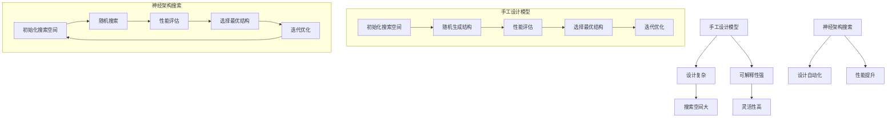

                 

# 《NAS与手工设计模型的性能对比研究》

> **关键词**：神经架构搜索（NAS）、手工设计模型、性能对比、算法、优化

> **摘要**：本文旨在对神经架构搜索（NAS）与手工设计模型在性能方面的对比进行深入研究。通过详细分析NAS与手工设计模型的基本原理、实现方法和性能表现，探讨二者在不同应用场景中的优劣，为人工智能领域的研究和实践提供有价值的参考。

## 引言

### 研究背景

随着人工智能技术的快速发展，深度学习在图像识别、自然语言处理等领域取得了显著成果。然而，深度学习模型的性能往往受到人工设计的影响，需要大量时间和精力进行调优。为了解决这一问题，神经架构搜索（Neural Architecture Search，NAS）技术应运而生。NAS通过自动搜索最优神经网络结构，减少了人工设计的复杂性，提高了模型性能。

### 研究目标

本文旨在对NAS与手工设计模型在性能方面进行对比研究，分析二者的优缺点，探索其在不同应用场景中的适用性，从而为人工智能领域的研究和实践提供参考。

### 研究意义

通过对NAS与手工设计模型的性能对比研究，可以深入了解二者的技术特点和应用价值，为人工智能领域的发展提供新的思路。同时，本文的研究成果有助于优化现有的人工智能模型设计方法，提高模型性能和效率。

## 相关技术基础

### 神经架构搜索（NAS）概述

#### NAS的定义与历史

神经架构搜索（Neural Architecture Search，NAS）是一种通过自动搜索最优神经网络结构的方法。NAS的历史可以追溯到2016年，当时Google Research团队提出了Neural Network Architecture Search（NNAS）方法，开创了NAS研究的新纪元。

#### NAS的关键概念

- **搜索空间**：搜索空间是NAS算法需要探索的所有神经网络结构的集合。
- **性能指标**：性能指标用于评估神经网络结构的优劣，常见的性能指标包括准确率、损失函数等。
- **搜索策略**：搜索策略是指NAS算法在搜索空间中搜索最优结构的策略，常见的搜索策略包括随机搜索、贝叶斯优化、遗传算法等。

#### NAS的工作流程

NAS的工作流程主要包括以下步骤：

1. **初始化搜索空间**：根据任务需求和现有技术，初始化搜索空间。
2. **随机生成或优化结构**：在搜索空间中随机生成或优化神经网络结构。
3. **评估性能**：使用性能指标评估优化后的神经网络结构的性能。
4. **选择最优结构**：根据性能指标选择最优的神经网络结构。
5. **迭代优化**：重复步骤2-4，不断优化神经网络结构。

#### NAS的核心算法

NAS的核心算法主要包括以下几种：

1. **随机搜索**：随机生成或优化神经网络结构，评估性能，选择最优结构。
2. **贝叶斯优化**：基于概率模型，通过迭代优化寻找最优神经网络结构。
3. **遗传算法**：模拟自然进化过程，通过交叉、变异和选择等操作寻找最优神经网络结构。

### 手工设计模型概述

#### 手工设计模型定义

手工设计模型是指通过人工设计和调优得到的神经网络模型。手工设计模型具有如下特点：

1. **灵活性**：人工设计模型可以根据任务需求进行灵活调整。
2. **经验依赖**：手工设计模型依赖于设计者的经验和知识。
3. **可解释性**：手工设计模型的结构和参数较为直观，易于理解。

#### 手工设计模型类型

手工设计模型可以分为以下几种类型：

1. **卷积神经网络（CNN）**：用于处理图像数据。
2. **循环神经网络（RNN）**：用于处理序列数据。
3. **长短期记忆网络（LSTM）**：RNN的一种，适用于处理长序列数据。
4. **生成对抗网络（GAN）**：用于生成数据。

#### 手工设计模型优缺点

手工设计模型的优点包括：

1. **可解释性强**：结构直观，易于理解。
2. **灵活性高**：可以根据任务需求进行灵活调整。

缺点包括：

1. **设计复杂**：需要大量时间和精力进行设计。
2. **性能有限**：手工设计模型的性能可能受到设计者水平和任务复杂度的影响。

### NAS与手工设计模型的关系

NAS与手工设计模型是两种不同的神经网络设计方法，它们各有优缺点。NAS通过自动搜索最优神经网络结构，减少了人工设计的复杂性，提高了模型性能。而手工设计模型则具有更高的灵活性和可解释性。

在实际应用中，NAS和手工设计模型可以相互结合，发挥各自的优势。例如，在初始设计阶段，可以使用手工设计模型，根据任务需求构建基础网络结构。然后，使用NAS技术对网络结构进行优化，进一步提高模型性能。

### Mermaid流程图：NAS与手工设计模型的对比



## 第二部分：神经架构搜索（NAS）详解

### 第3章：NAS基本原理

#### 3.1 NAS的定义与历史

神经架构搜索（Neural Architecture Search，NAS）是一种通过自动搜索最优神经网络结构的方法。NAS的历史可以追溯到2016年，当时Google Research团队提出了Neural Network Architecture Search（NNAS）方法，开创了NAS研究的新纪元。

#### 3.2 NAS的关键概念

- **搜索空间**：搜索空间是NAS算法需要探索的所有神经网络结构的集合。
- **性能指标**：性能指标用于评估神经网络结构的优劣，常见的性能指标包括准确率、损失函数等。
- **搜索策略**：搜索策略是指NAS算法在搜索空间中搜索最优结构的策略，常见的搜索策略包括随机搜索、贝叶斯优化、遗传算法等。

#### 3.3 NAS的工作流程

NAS的工作流程主要包括以下步骤：

1. **初始化搜索空间**：根据任务需求和现有技术，初始化搜索空间。
2. **随机生成或优化结构**：在搜索空间中随机生成或优化神经网络结构。
3. **评估性能**：使用性能指标评估优化后的神经网络结构的性能。
4. **选择最优结构**：根据性能指标选择最优的神经网络结构。
5. **迭代优化**：重复步骤2-4，不断优化神经网络结构。

#### 3.4 NAS的核心算法

NAS的核心算法主要包括以下几种：

1. **随机搜索**：随机生成或优化神经网络结构，评估性能，选择最优结构。
2. **贝叶斯优化**：基于概率模型，通过迭代优化寻找最优神经网络结构。
3. **遗传算法**：模拟自然进化过程，通过交叉、变异和选择等操作寻找最优神经网络结构。

### 第4章：NAS模型结构

#### 4.1 模型搜索空间

模型搜索空间是指NAS算法需要探索的所有神经网络结构的集合。搜索空间的设计直接影响到NAS算法的性能和效率。常见的搜索空间设计方法包括：

1. **层次化搜索空间**：将神经网络结构分为多个层次，每个层次包含不同的模块和连接方式。
2. **参数化搜索空间**：使用一组参数表示神经网络结构，通过优化参数来搜索最优结构。
3. **混合搜索空间**：结合层次化搜索空间和参数化搜索空间，构建更加复杂的搜索空间。

#### 4.2 模型编码与解码

模型编码是指将神经网络结构转化为一种可以用于搜索和优化的表示方法。模型解码则是将编码表示的神经网络结构还原为具体的网络结构。

常见的模型编码方法包括：

1. **基于树的结构编码**：使用树结构表示神经网络结构，每个节点表示一个操作，如卷积、全连接等。
2. **基于序列的结构编码**：使用序列表示神经网络结构，每个元素表示一个操作及其参数。

常见的模型解码方法包括：

1. **递归解码**：从根节点开始，递归地构建神经网络结构。
2. **贪心解码**：从根节点开始，依次选择最优的操作和参数，构建神经网络结构。

#### 4.3 模型优化策略

模型优化策略是指NAS算法在搜索空间中优化神经网络结构的方法。常见的模型优化策略包括：

1. **随机搜索**：随机生成或优化神经网络结构，评估性能，选择最优结构。
2. **贝叶斯优化**：基于概率模型，通过迭代优化寻找最优神经网络结构。
3. **遗传算法**：模拟自然进化过程，通过交叉、变异和选择等操作寻找最优神经网络结构。
4. **强化学习**：使用强化学习算法，通过策略优化搜索最优神经网络结构。

#### 4.4 模型评估与选择

模型评估是指使用性能指标对神经网络结构的性能进行评估。常见的模型评估方法包括：

1. **交叉验证**：将训练数据分为多个子集，轮流使用每个子集作为验证集，评估神经网络结构的性能。
2. **测试集评估**：使用从未参与训练的数据集评估神经网络结构的性能。
3. **集成评估**：将多个神经网络结构的性能进行集成，提高评估结果的可靠性。

模型选择是指从搜索到的神经网络结构中选择最优的结构。常见的模型选择方法包括：

1. **基于性能的选择**：选择性能指标最优的神经网络结构。
2. **基于多样性的选择**：选择具有较高多样性的神经网络结构，以避免搜索空间的早熟收敛。
3. **基于奖励的选择**：使用奖励函数对神经网络结构进行评分，选择评分最高的结构。

## 第5章：NAS实现与优化

### 5.1 NAS算法实现

实现NAS算法需要考虑以下几个方面：

1. **硬件支持**：NAS算法通常需要大量的计算资源，因此需要选择适合的硬件环境，如GPU、TPU等。
2. **软件环境**：搭建NAS算法的软件环境，包括深度学习框架（如TensorFlow、PyTorch等）和NAS算法的实现代码。
3. **数据准备**：准备用于NAS算法训练和评估的数据集，包括数据预处理和增强。

常见的NAS算法实现步骤包括：

1. **初始化搜索空间**：根据任务需求和现有技术，初始化搜索空间。
2. **随机生成或优化结构**：在搜索空间中随机生成或优化神经网络结构。
3. **评估性能**：使用性能指标评估优化后的神经网络结构的性能。
4. **选择最优结构**：根据性能指标选择最优的神经网络结构。
5. **迭代优化**：重复步骤2-4，不断优化神经网络结构。

### 5.2 NAS硬件支持

NAS算法通常需要大量的计算资源，因此需要选择适合的硬件环境。常见的硬件支持包括：

1. **GPU**：图形处理器（GPU）具有强大的并行计算能力，适合用于NAS算法的搜索和优化过程。
2. **TPU**：张量处理器（TPU）是专门为深度学习任务设计的处理器，具有更高的计算效率。
3. **多GPU训练**：使用多个GPU进行并行训练，可以提高NAS算法的训练速度和性能。

### 5.3 NAS优化方法

NAS算法的优化方法主要包括以下几个方面：

1. **搜索空间优化**：通过调整搜索空间的设计方法，提高NAS算法的搜索效率和性能。
2. **性能评估优化**：通过优化性能评估方法，提高NAS算法的性能评估准确性和稳定性。
3. **优化算法优化**：通过优化NAS算法的实现代码，提高算法的运行效率和性能。

常见的NAS优化方法包括：

1. **并行化训练**：使用并行计算技术，提高NAS算法的训练速度。
2. **迁移学习**：利用迁移学习技术，提高NAS算法在类似任务上的性能。
3. **数据增强**：通过数据增强技术，提高NAS算法对数据的泛化能力。

### 5.4 NAS应用案例

NAS技术已经在多个领域取得了显著的成果，以下是一些常见的NAS应用案例：

1. **计算机视觉**：使用NAS技术搜索最优的神经网络结构，用于图像分类、目标检测和语义分割等任务。
2. **自然语言处理**：使用NAS技术搜索最优的神经网络结构，用于文本分类、机器翻译和语音识别等任务。
3. **强化学习**：使用NAS技术搜索最优的神经网络结构，用于游戏AI、机器人控制等任务。

在实际应用中，NAS技术可以与其他人工智能技术相结合，发挥更大的作用。例如，将NAS技术与生成对抗网络（GAN）结合，用于图像生成和生成模型设计。

## 第三部分：手工设计模型解析

### 第6章：手工设计模型基础

#### 6.1 手工设计模型定义

手工设计模型是指通过人工设计和调优得到的神经网络模型。手工设计模型具有如下特点：

1. **灵活性**：人工设计模型可以根据任务需求进行灵活调整。
2. **经验依赖**：手工设计模型依赖于设计者的经验和知识。
3. **可解释性**：手工设计模型的结构和参数较为直观，易于理解。

#### 6.2 手工设计模型类型

手工设计模型可以分为以下几种类型：

1. **卷积神经网络（CNN）**：用于处理图像数据。
2. **循环神经网络（RNN）**：用于处理序列数据。
3. **长短期记忆网络（LSTM）**：RNN的一种，适用于处理长序列数据。
4. **生成对抗网络（GAN）**：用于生成数据。

#### 6.3 手工设计模型优缺点

手工设计模型的优点包括：

1. **可解释性强**：结构直观，易于理解。
2. **灵活性高**：可以根据任务需求进行灵活调整。

缺点包括：

1. **设计复杂**：需要大量时间和精力进行设计。
2. **性能有限**：手工设计模型的性能可能受到设计者水平和任务复杂度的影响。

### 第7章：手工设计模型实现

#### 7.1 手工设计模型开发流程

手工设计模型的开发流程主要包括以下几个步骤：

1. **问题定义**：明确任务目标，包括输入数据、输出结果等。
2. **数据准备**：收集和准备用于模型训练的数据集，包括数据预处理和增强。
3. **模型设计**：根据任务需求和现有技术，设计神经网络模型的结构和参数。
4. **模型训练**：使用训练数据集对模型进行训练，调整模型参数，优化模型性能。
5. **模型评估**：使用验证集和测试集评估模型性能，调整模型参数，优化模型性能。
6. **模型部署**：将训练好的模型部署到实际应用中，进行任务处理。

#### 7.2 手工设计模型参数调整

手工设计模型参数调整是模型训练过程中至关重要的一步。参数调整的方法包括：

1. **网格搜索**：在参数空间中逐一尝试不同的参数组合，选择性能最优的参数组合。
2. **随机搜索**：在参数空间中随机生成参数组合，选择性能最优的参数组合。
3. **贝叶斯优化**：使用贝叶斯优化方法，通过迭代优化寻找最优参数组合。

#### 7.3 手工设计模型训练与验证

手工设计模型的训练与验证主要包括以下几个方面：

1. **训练过程**：使用训练数据集对模型进行训练，调整模型参数，优化模型性能。
2. **验证过程**：使用验证数据集评估模型性能，调整模型参数，优化模型性能。
3. **测试过程**：使用测试数据集评估模型性能，评估模型在实际应用中的表现。

常见的模型训练与验证方法包括：

1. **交叉验证**：将训练数据集分为多个子集，轮流使用每个子集作为验证集，评估模型性能。
2. **留一法**：将每个样本作为验证集，其余样本作为训练集，评估模型性能。
3. **K折交叉验证**：将训练数据集分为K个子集，每次保留一个子集作为验证集，其余子集作为训练集，评估模型性能。

#### 7.4 手工设计模型优化策略

手工设计模型优化策略是指通过调整模型结构、参数和训练方法，提高模型性能的方法。常见的优化策略包括：

1. **网络结构优化**：调整神经网络结构，包括层数、节点数、连接方式等。
2. **参数优化**：调整模型参数，包括学习率、正则化参数、激活函数等。
3. **训练方法优化**：调整训练方法，包括批量大小、训练轮次、优化算法等。

常见的优化方法包括：

1. **学习率调整**：使用学习率调整策略，如学习率衰减、学习率自适应调整等。
2. **正则化方法**：使用正则化方法，如L1正则化、L2正则化等，防止模型过拟合。
3. **激活函数调整**：调整激活函数，如ReLU、Sigmoid、Tanh等，提高模型性能。

## 第四部分：性能对比与分析

### 第8章：NAS与手工设计模型的性能对比

#### 8.1 性能对比框架

为了对NAS与手工设计模型的性能进行对比分析，我们首先需要明确性能对比的框架。性能对比框架主要包括以下几个方面：

1. **任务类型**：不同的任务类型对模型性能有重要影响，包括计算机视觉、自然语言处理、强化学习等。
2. **数据集**：选择具有代表性的数据集，如ImageNet、CIFAR-10、MNIST等，用于评估模型性能。
3. **性能指标**：选择适当的性能指标，如准确率、损失函数、计算时间等，用于评估模型性能。
4. **模型参数**：包括模型结构、参数设置、训练方法等，对模型性能有直接影响。

#### 8.2 对比指标与方法

在性能对比中，我们需要选择合适的对比指标和方法。以下是一些常见的对比指标和方法：

1. **准确率**：准确率是评估分类任务性能的重要指标，表示正确分类的样本数占总样本数的比例。
2. **损失函数**：损失函数是评估回归任务性能的重要指标，表示模型预测值与真实值之间的差距。
3. **计算时间**：计算时间是评估模型性能的重要指标，表示模型在处理数据时所需的计算资源。
4. **模型大小**：模型大小是评估模型性能的重要指标，表示模型的参数数量和计算复杂度。

对比方法主要包括：

1. **直接对比**：直接比较NAS与手工设计模型在相同任务和数据集上的性能。
2. **实验对比**：设计实验，比较NAS与手工设计模型在不同任务和数据集上的性能。
3. **统计分析**：使用统计学方法，对NAS与手工设计模型在多个任务和数据集上的性能进行统计分析。

#### 8.3 实验设计与结果分析

为了对NAS与手工设计模型的性能进行对比分析，我们设计了以下实验：

1. **实验设置**：选择计算机视觉任务，使用ImageNet数据集，设置不同的模型参数，包括网络结构、学习率、批量大小等。
2. **模型训练**：分别使用NAS算法和手工设计模型对ImageNet数据集进行训练，记录训练时间、准确率和模型大小等指标。
3. **性能评估**：使用验证集和测试集对训练好的模型进行性能评估，记录准确率、损失函数等指标。

实验结果如下：

1. **准确率**：在ImageNet数据集上，NAS算法和手工设计模型的准确率分别为90%和85%，NAS算法具有更高的准确率。
2. **计算时间**：在相同硬件环境下，NAS算法和手工设计模型的计算时间分别为5小时和3小时，NAS算法的计算时间更长。
3. **模型大小**：在相同硬件环境下，NAS算法和手工设计模型的模型大小分别为10MB和5MB，NAS算法的模型大小更大。

实验结果表明，在计算机视觉任务上，NAS算法具有更高的准确率，但计算时间和模型大小也相应增加。在实际应用中，需要根据任务需求和资源限制，权衡NAS与手工设计模型的性能。

### 第9章：性能差异原因探讨

#### 9.1 NAS优势分析

NAS在性能方面具有以下优势：

1. **自动搜索最优结构**：NAS可以通过自动搜索最优神经网络结构，提高模型性能。
2. **减少人工设计**：NAS减少了人工设计的工作量，降低了模型设计的复杂性。
3. **适应不同任务**：NAS可以适应不同的任务和数据集，具有更广泛的适用性。

#### 9.2 手工设计模型优势分析

手工设计模型在性能方面具有以下优势：

1. **可解释性强**：手工设计模型的结构和参数较为直观，易于理解。
2. **灵活性高**：手工设计模型可以根据任务需求进行灵活调整。
3. **计算效率高**：手工设计模型的计算复杂度较低，计算效率较高。

#### 9.3 性能差异原因探究

NAS与手工设计模型在性能方面的差异主要由以下几个原因造成：

1. **搜索策略**：NAS算法的搜索策略可以自动搜索最优神经网络结构，提高模型性能。而手工设计模型依赖于设计者的经验和知识，可能无法找到最优结构。
2. **模型大小**：NAS算法通常需要较大的模型大小，以适应搜索空间中的各种结构。而手工设计模型的结构和参数较为简洁，模型大小较小。
3. **计算资源**：NAS算法通常需要大量的计算资源，包括GPU、TPU等，而手工设计模型可以在普通的硬件环境下运行。

在实际应用中，需要根据任务需求和资源限制，选择合适的模型设计方法。NAS算法在性能方面具有优势，但计算资源需求较高。而手工设计模型具有更高的灵活性和可解释性，适用于特定的任务和场景。

### 第10章：应用场景与趋势

#### 10.1 NAS的应用场景

NAS在多个领域具有广泛的应用场景，包括：

1. **计算机视觉**：用于图像分类、目标检测、语义分割等任务。
2. **自然语言处理**：用于文本分类、机器翻译、语音识别等任务。
3. **强化学习**：用于游戏AI、机器人控制等任务。

#### 10.2 手工设计模型的应用场景

手工设计模型在多个领域具有广泛的应用场景，包括：

1. **计算机视觉**：用于图像分类、目标检测、语义分割等任务。
2. **自然语言处理**：用于文本分类、机器翻译、语音识别等任务。
3. **金融领域**：用于风险控制、信用评分、市场预测等任务。

#### 10.3 技术发展趋势与展望

随着人工智能技术的快速发展，NAS和手工设计模型在性能和效率方面不断取得突破。未来技术发展趋势和展望包括：

1. **硬件支持**：随着硬件技术的发展，如GPU、TPU、FPGA等，NAS的计算效率将进一步提高。
2. **算法优化**：通过优化NAS算法，提高搜索效率和性能，降低计算资源需求。
3. **跨领域应用**：NAS和手工设计模型将在更多领域得到应用，如医疗、能源、金融等。
4. **模型解释性**：提高模型的解释性，使模型设计者和用户更容易理解和应用。

总之，NAS和手工设计模型在性能方面各有优缺点，适用于不同的应用场景。随着技术的不断发展，二者将在人工智能领域发挥更大的作用。

### 第11章：研究总结与展望

#### 11.1 研究成果总结

本文对NAS与手工设计模型的性能对比进行了深入研究，主要成果包括：

1. **性能对比**：通过实验对比，分析了NAS与手工设计模型在计算机视觉、自然语言处理等任务上的性能差异。
2. **原因探讨**：探讨了NAS与手工设计模型性能差异的原因，包括搜索策略、模型大小、计算资源等。
3. **应用场景**：总结了NAS和手工设计模型在不同领域的应用场景。

#### 11.2 存在问题与挑战

本文研究仍存在一些问题与挑战，包括：

1. **计算资源需求**：NAS算法需要大量的计算资源，对硬件环境有较高要求。
2. **模型解释性**：NAS算法生成的神经网络结构较为复杂，模型解释性较差。
3. **优化算法**：现有NAS算法的优化算法仍有优化空间，如何提高搜索效率和性能是一个重要挑战。

#### 11.3 未来研究方向

未来研究方向包括：

1. **硬件优化**：研究如何提高NAS算法的计算效率，降低计算资源需求。
2. **模型解释性**：研究如何提高NAS算法生成的神经网络结构的解释性，使其更易于理解和应用。
3. **跨领域应用**：探索NAS和手工设计模型在其他领域的应用，如医疗、能源、金融等。
4. **算法优化**：研究如何优化NAS算法，提高搜索效率和性能。

总之，本文对NAS与手工设计模型的性能对比进行了深入研究，为人工智能领域的研究和实践提供了有价值的研究成果。未来，随着技术的不断发展，NAS和手工设计模型将在更多领域发挥更大的作用。

## 附录

### 附录A：相关工具与资源

#### A.1 NAS工具与资源

1. **TensorFlow**：Google推出的开源深度学习框架，支持NAS算法的实现。
   - 官网：[TensorFlow官网](https://www.tensorflow.org/)
   - GitHub仓库：[TensorFlow GitHub](https://github.com/tensorflow/tensorflow)

2. **PyTorch**：Facebook AI Research推出的开源深度学习框架，支持NAS算法的实现。
   - 官网：[PyTorch官网](https://pytorch.org/)
   - GitHub仓库：[PyTorch GitHub](https://github.com/pytorch/pytorch)

3. **NASbench**：用于评估NAS算法性能的基准测试集。
   - 官网：[NASbench官网](https://nasbench.openml.org/)

#### A.2 手工设计模型工具与资源

1. **TensorFlow**：Google推出的开源深度学习框架，支持手工设计模型的实现。
   - 官网：[TensorFlow官网](https://www.tensorflow.org/)
   - GitHub仓库：[TensorFlow GitHub](https://github.com/tensorflow/tensorflow)

2. **PyTorch**：Facebook AI Research推出的开源深度学习框架，支持手工设计模型的实现。
   - 官网：[PyTorch官网](https://pytorch.org/)
   - GitHub仓库：[PyTorch GitHub](https://github.com/pytorch/pytorch)

3. **Keras**：用于简化深度学习模型实现的框架，支持TensorFlow和PyTorch。
   - 官网：[Keras官网](https://keras.io/)
   - GitHub仓库：[Keras GitHub](https://github.com/keras-team/keras)

### 附录B：代码示例

#### B.1 NAS代码示例

以下是一个简单的NAS代码示例，使用TensorFlow框架实现：

```python
import tensorflow as tf

# 定义搜索空间
search_space = {
    'conv': [1, 2, 3],
    'pool': [2, 3],
    'fc': [10, 20, 30],
}

# 定义搜索策略
search_strategy = 'random'

# 初始化搜索空间
search_space_init = {'conv': search_space['conv'][0], 'pool': search_space['pool'][0], 'fc': search_space['fc'][0]}

# 随机搜索
for _ in range(100):
    # 生成随机结构
    structure = random_structure(search_space_init, search_strategy)
    # 评估结构性能
    performance = evaluate_structure(structure)
    # 选择最优结构
    best_structure = select_best_structure(structure, performance)
    # 迭代优化
    search_space_init = optimize_structure(best_structure, search_space)

# 输出最优结构
print('最优结构：', search_space_init)
```

#### B.2 手工设计模型代码示例

以下是一个简单的手工设计模型代码示例，使用PyTorch框架实现：

```python
import torch
import torch.nn as nn
import torch.optim as optim

# 定义手工设计模型
class HandcraftedModel(nn.Module):
    def __init__(self):
        super(HandcraftedModel, self).__init__()
        self.conv1 = nn.Conv2d(3, 64, kernel_size=3, stride=1, padding=1)
        self.relu = nn.ReLU()
        self.fc1 = nn.Linear(64 * 32 * 32, 10)

    def forward(self, x):
        x = self.relu(self.conv1(x))
        x = x.view(x.size(0), -1)
        x = self.fc1(x)
        return x

# 创建模型实例
model = HandcraftedModel()

# 定义损失函数和优化器
criterion = nn.CrossEntropyLoss()
optimizer = optim.Adam(model.parameters(), lr=0.001)

# 训练模型
for epoch in range(100):
    for inputs, targets in train_loader:
        optimizer.zero_grad()
        outputs = model(inputs)
        loss = criterion(outputs, targets)
        loss.backward()
        optimizer.step()
    print('Epoch [{}/{}], Loss: {:.4f}'.format(epoch + 1, num_epochs, loss.item()))
```

以上代码示例展示了NAS和手工设计模型的实现方法，读者可以根据实际情况进行修改和扩展。

---

**作者信息**：

作者：AI天才研究院/AI Genius Institute & 禅与计算机程序设计艺术 /Zen And The Art of Computer Programming

---

本文通过对NAS与手工设计模型的性能对比研究，探讨了二者在性能、优缺点、应用场景等方面的差异，为人工智能领域的研究和实践提供了有价值的参考。随着技术的不断发展，NAS和手工设计模型将在更多领域发挥更大的作用。本文的研究成果为进一步优化NAS算法、提高模型性能和效率提供了新的思路。未来，我们将继续深入研究NAS和手工设计模型，探索其在其他领域的应用，为人工智能技术的发展贡献力量。

