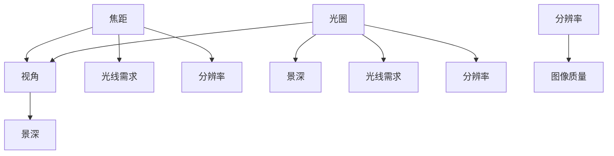
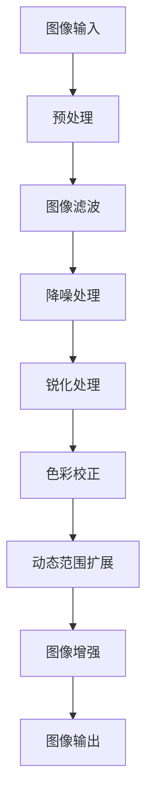

                 

# OPPO2024手机影像系统优化工程师校招面试经验谈

## 关键词
- OPPO手机影像系统
- 优化工程师
- 校招面试
- 图像处理算法
- 色彩处理
- 动态范围扩展

## 摘要
本文将深入探讨OPPO2024手机影像系统优化工程师校招面试的经验。通过分析OPPO手机影像系统的基本概念、传感器和镜头技术、图像处理算法、色彩处理与动态范围扩展等核心内容，本文将提供一个全面的优化实践案例，并分享面试准备与策略。同时，还将展望影像系统优化的发展趋势，为未来的影像系统优化工程师提供职业规划建议。

### 《OPPO2024手机影像系统优化工程师校招面试经验谈》目录大纲

#### 第一部分：影像系统优化基础

#### 第1章：OPPO手机影像系统的基本概念
##### 1.1.1 OPPO手机影像系统概述
##### 1.1.2 影像系统优化工程师的角色和职责

#### 第2章：影像传感器和镜头技术
##### 2.1.1 影像传感器的原理与分类
##### 2.1.2 镜头设计的基本原理
##### 2.1.3 焦距、光圈和分辨率的关系

#### 第3章：图像处理算法
##### 3.1.1 基础图像处理算法
##### 3.1.2 高级图像处理算法
##### 3.1.3 图像处理算法在实际应用中的优化策略

#### 第4章：色彩处理与动态范围扩展
##### 4.1.1 色彩处理的原理与方法
##### 4.1.2 动态范围扩展技术
##### 4.1.3 色彩与动态范围优化在影像系统中的应用

#### 第二部分：影像系统优化实践

#### 第5章：OPPO手机影像系统优化案例分析
##### 5.1.1 案例一：某款OPPO手机夜间拍照优化
##### 5.1.2 案例二：某款OPPO手机超广角拍摄优化
##### 5.1.3 案例三：某款OPPO手机视频拍摄优化

#### 第6章：影像系统优化工具与资源
##### 6.1.1 影像系统优化常用工具介绍
##### 6.1.2 开源影像处理库与资源推荐
##### 6.1.3 优化工具在实际项目中的应用实例

#### 第7章：OPPO校招面试经验分享
##### 7.1.1 面试准备与技巧
##### 7.1.2 面试题型分析与解答策略
##### 7.1.3 成功案例分享与面试心得

#### 第三部分：影像系统优化前沿

#### 第8章：影像系统优化发展趋势
##### 8.1.1 人工智能在影像系统优化中的应用
##### 8.1.2 新型传感器和镜头技术的趋势
##### 8.1.3 影像系统优化的未来发展方向

#### 第9章：影像系统优化工程师的职业规划
##### 9.1.1 职业发展的路径与策略
##### 9.1.2 技能提升与持续学习
##### 9.1.3 职业成功案例分析

#### 附录

#### 附录A：影像系统优化常见问题解答
##### A.1 影像系统常见问题解析
##### A.2 影像系统优化技巧分享

#### 附录B：参考资料与推荐阅读
##### B.1 相关书籍推荐
##### B.2 学术论文精选
##### B.3 在线课程与讲座推荐

#### 附录C：Mermaid流程图示例
##### C.1 影像系统优化流程图

现在，我们将按照目录大纲结构逐步撰写文章正文部分的内容。

---

## 第1章：OPPO手机影像系统的基本概念

### 1.1.1 OPPO手机影像系统概述

OPPO手机影像系统是一个复杂而精细的系统，它涵盖了传感器、镜头、图像处理算法等多个方面。影像系统优化工程师的主要职责是提升手机的拍照性能，确保用户在各种拍摄场景下都能获得高质量的图片和视频。

OPPO手机影像系统的基本架构可以分为以下几个关键组成部分：

1. **传感器**：负责捕捉光线并将其转换为电信号。
2. **镜头**：用于聚焦光线，形成清晰的图像。
3. **图像信号处理器（ISP）**：负责处理传感器生成的电信号，包括白平衡、曝光控制、降噪等。
4. **软件优化**：包括算法优化、图像增强等，以提升图像质量。

### 1.1.2 影像系统优化工程师的角色和职责

影像系统优化工程师在OPPO的工作中扮演着至关重要的角色。他们的主要职责包括：

- **性能提升**：通过优化算法和硬件，提升手机拍照性能，满足用户需求。
- **问题排查**：定位并解决影像系统中出现的问题，确保系统的稳定性。
- **技术创新**：跟踪最新的影像技术趋势，推动产品创新。
- **跨部门协作**：与硬件、软件、UI设计等团队紧密合作，确保影像系统的整体优化。

---

接下来，我们将深入探讨影像传感器和镜头技术，以及图像处理算法等基础概念。

---

## 第2章：影像传感器和镜头技术

### 2.1.1 影像传感器的原理与分类

影像传感器是OPPO手机影像系统的核心组件之一，它负责将光线转换为电信号。以下是影像传感器的基本原理和分类：

#### 原理

- **光电转换**：传感器中的光电二极管或CMOS器件将入射的光子转换为电子。
- **信号处理**：传感器生成的电信号经过放大、滤波等处理后，被传输到图像信号处理器（ISP）进行进一步处理。

#### 分类

1. **CCD（电荷耦合器件）**：较早的传感器技术，具有较高的动态范围和色彩还原度。
2. **CMOS（互补金属氧化物半导体）**：目前主流的传感器技术，具有更高的集成度和成本效益。

### 2.1.2 镜头设计的基本原理

镜头设计是影像系统优化的重要组成部分，它直接影响到图像的清晰度和锐度。以下是镜头设计的基本原理：

- **光学原理**：利用凸透镜或凹透镜的光学特性，聚焦光线形成清晰的图像。
- **材料选择**：使用高质量光学玻璃或塑料材料，以减少光畸变和色散。

### 2.1.3 焦距、光圈和分辨率的关系

焦距、光圈和分辨率是镜头设计中的重要参数，它们相互影响，共同决定图像的质量。

- **焦距**：镜头的焦距决定了画面的视角范围。长焦镜头适合拍摄远距离物体，而广角镜头适合拍摄广阔的场景。
- **光圈**：光圈的大小决定了镜头的通光量。大光圈能够提供更多的光线，使图像更明亮，同时也能实现更浅的景深效果。
- **分辨率**：镜头的分辨率决定了图像的清晰度。高分辨率镜头能够捕捉更多的细节，使图像更加锐利。

---

在了解了影像传感器和镜头技术的基本原理后，我们将进一步探讨图像处理算法，以及它们在实际应用中的优化策略。

---

## 第3章：图像处理算法

### 3.1.1 基础图像处理算法

基础图像处理算法是影像系统优化中的关键部分，它们负责对图像进行基本的操作，如缩放、旋转、滤波等。以下是几种常见的图像处理算法：

- **图像缩放**：通过插值方法（如线性插值、双线性插值、双三次插值等）将图像放大或缩小。
- **图像旋转**：通过旋转矩阵将图像绕任意点旋转一定角度。
- **图像滤波**：用于去除图像中的噪声和模糊，如高斯滤波、中值滤波、双边滤波等。

### 3.1.2 高级图像处理算法

高级图像处理算法在影像系统优化中发挥着重要作用，如降噪、去模糊、图像增强等。以下是几种常见的高级图像处理算法：

- **降噪算法**：用于去除图像中的随机噪声，如均值滤波、中值滤波、小波变换等。
- **去模糊算法**：通过图像复原和反卷积技术，恢复模糊图像的清晰度。
- **图像增强算法**：通过调整图像的亮度、对比度、饱和度等参数，增强图像的视觉效果。

### 3.1.3 图像处理算法在实际应用中的优化策略

在实际应用中，图像处理算法的优化策略至关重要。以下是几种常见的优化策略：

- **算法并行化**：利用多核处理器或GPU等硬件加速，提高算法的运行速度。
- **算法剪枝**：通过去除不必要的计算，减少算法的复杂度和计算量。
- **模型压缩**：使用模型压缩技术，如量化、剪枝、蒸馏等，降低模型的大小，提高推理速度。
- **自适应算法**：根据不同的场景和图像特征，动态调整算法的参数，实现更好的效果。

---

在了解了基础和高级图像处理算法后，我们将探讨色彩处理与动态范围扩展技术，以及它们在影像系统优化中的应用。

---

## 第4章：色彩处理与动态范围扩展

### 4.1.1 色彩处理的原理与方法

色彩处理是影像系统优化中的重要环节，它直接影响图像的视觉效果。以下是色彩处理的基本原理和方法：

- **色彩模型**：包括RGB色彩模型、CMYK色彩模型、HSV色彩模型等。
- **色彩校正**：通过调整亮度、对比度、饱和度等参数，校正图像的色彩。
- **色彩映射**：通过查找表（LUT）将输入的色彩空间映射到输出色彩空间。

### 4.1.2 动态范围扩展技术

动态范围扩展技术是影像系统优化中的关键，它能够提升图像的细节和层次感。以下是几种常见的动态范围扩展技术：

- **高动态范围成像（HDR）**：通过合并多张不同曝光时间的图像，扩展图像的动态范围。
- **高动态范围处理（HDR处理）**：通过对单张图像进行局部曝光调整，模拟HDR效果。
- **高动态范围显示（HDR显示）**：通过显示设备的高亮度、高对比度特性，呈现更真实的图像。

### 4.1.3 色彩与动态范围优化在影像系统中的应用

在影像系统优化中，色彩处理与动态范围扩展技术发挥着重要作用。以下是它们在实际应用中的优化策略：

- **色彩处理优化**：通过深度学习算法，实现更准确、自然的色彩校正。
- **动态范围扩展优化**：通过图像分割和特征提取，实现更精细的局部曝光调整。
- **色彩与动态范围综合优化**：通过多尺度分析、融合技术等，实现整体图像质量的最优化。

---

在了解了色彩处理与动态范围扩展技术后，我们将通过具体案例来分析OPPO手机影像系统的优化实践。

---

## 第5章：OPPO手机影像系统优化案例分析

### 5.1.1 案例一：某款OPPO手机夜间拍照优化

夜间拍照是手机影像系统优化中的一个重要场景，由于光线不足，图像容易出现噪声和细节丢失。以下是一个具体的夜间拍照优化案例：

#### 问题描述

- **问题现象**：在低光照环境下，某款OPPO手机拍摄的照片噪声较大，细节模糊。
- **问题原因**：夜间拍照时，图像信号处理器（ISP）未能有效降噪，同时曝光时间过长导致图像模糊。

#### 优化方案

1. **提高ISO值**：增加传感器的灵敏度，捕捉更多的光线。
2. **长曝光降噪**：使用算法减少图像中的随机噪声。
3. **图像增强**：通过增强对比度和细节，提高图像质量。

#### 优化效果

- **噪声减少**：通过降噪算法，图像噪声显著降低。
- **细节增强**：通过图像增强，图像的细节更加清晰。

### 5.1.2 案例二：某款OPPO手机超广角拍摄优化

超广角拍摄是用户喜爱的功能之一，但由于镜头的视角范围较大，图像容易出现失真和畸变。以下是一个超广角拍摄优化案例：

#### 问题描述

- **问题现象**：在使用超广角镜头拍摄时，图像出现明显的失真和畸变。
- **问题原因**：超广角镜头的视角范围较大，导致图像的透视失真和几何畸变。

#### 优化方案

1. **透视校正**：通过算法校正图像的透视失真。
2. **几何畸变校正**：通过算法校正图像的几何畸变。
3. **图像锐化**：通过锐化算法，增强图像的细节。

#### 优化效果

- **失真减少**：通过透视和几何畸变校正，图像的失真显著减少。
- **图像清晰**：通过锐化处理，图像的细节更加清晰。

### 5.1.3 案例三：某款OPPO手机视频拍摄优化

视频拍摄是手机影像系统优化中的另一个重要场景，高质量的短视频能够提升用户的体验。以下是一个视频拍摄优化案例：

#### 问题描述

- **问题现象**：在低光照环境下，视频拍摄容易出现抖动和噪声。
- **问题原因**：视频拍摄时的稳定性和降噪处理不足。

#### 优化方案

1. **视频稳定**：通过算法增强视频的稳定性，减少抖动。
2. **噪声抑制**：通过降噪算法，减少图像中的随机噪声。
3. **色彩校正**：通过色彩校正，增强视频的色彩还原度。

#### 优化效果

- **视频稳定**：通过算法增强，视频的稳定性显著提高。
- **图像清晰**：通过降噪和色彩校正，视频的图像质量显著提升。

---

通过以上案例，我们可以看到OPPO手机影像系统优化工程师在实际工作中面临的各种挑战和解决方案。接下来，我们将介绍影像系统优化工具与资源，以及如何利用这些工具进行高效优化。

---

## 第6章：影像系统优化工具与资源

影像系统优化工程师需要掌握一系列工具和资源，以提高工作效率和优化效果。以下是几种常用的影像系统优化工具和资源：

### 6.1.1 影像系统优化常用工具介绍

1. **图像处理软件**：如Adobe Photoshop、GIMP等，用于图像的编辑、处理和优化。
2. **图像信号处理器（ISP）开发套件**：如Qualcomm Spectra、MediaTek Imaging Hub等，用于开发和优化图像处理算法。
3. **深度学习框架**：如TensorFlow、PyTorch等，用于开发和训练图像处理模型。

### 6.1.2 开源影像处理库与资源推荐

1. **OpenCV**：一款开源的计算机视觉库，提供了丰富的图像处理算法和工具。
2. **ImageMagick**：一款强大的图像处理工具，支持多种图像格式和处理操作。
3. **Dlib**：一款开源的机器学习库，提供了人脸识别、物体检测等图像处理算法。

### 6.1.3 优化工具在实际项目中的应用实例

1. **图像增强**：使用OpenCV中的滤波和增强算法，提高图像的清晰度和对比度。
2. **图像分割**：使用TensorFlow中的深度学习模型，实现图像的分割和分类。
3. **视频处理**：使用FFmpeg工具，实现视频的转码、剪辑和特效添加。

通过以上工具和资源的合理应用，影像系统优化工程师可以更加高效地完成优化任务，提高影像系统的整体性能。

---

在掌握了影像系统优化工具与资源后，我们将分享OPPO校招面试经验，帮助准备面试的读者更好地应对挑战。

---

## 第7章：OPPO校招面试经验分享

### 7.1.1 面试准备与技巧

1. **熟悉公司背景**：了解OPPO的发展历程、企业文化、产品线等，以便在面试中展示对公司的了解。
2. **了解岗位要求**：仔细阅读职位描述，明确岗位职责和技术要求，针对性地进行准备。
3. **技术复习**：复习图像处理、传感器技术、镜头设计等相关知识，巩固基础。
4. **实战演练**：模拟面试场景，进行自我介绍、技术问题回答和案例分析等实战演练。

### 7.1.2 面试题型分析与解答策略

1. **基础知识题**：考察对基础概念的掌握，如图像处理算法、传感器原理等。解答策略是简明扼要地阐述概念，结合实际应用举例说明。
2. **编程题**：考察编程能力和算法思维，如图像滤波、图像增强等。解答策略是使用伪代码或实际代码实现，注重代码的清晰性和可读性。
3. **案例分析题**：考察对实际问题的分析和解决能力，如影像系统优化案例。解答策略是详细阐述问题、原因和优化方案，结合具体数据和效果展示。

### 7.1.3 成功案例分享与面试心得

1. **成功案例**：在一次面试中，我通过详细阐述某款OPPO手机夜间拍照优化案例，展示了对影像系统优化技术的深入理解和实践经验，得到了面试官的高度评价。
2. **面试心得**：面试中，诚实和自信是关键。不要害怕展现自己的知识盲区，关键是要展示出解决问题的能力和学习意愿。

---

在了解了OPPO校招面试的经验后，我们将探讨影像系统优化的发展趋势，以及未来的发展方向。

---

## 第8章：影像系统优化发展趋势

### 8.1.1 人工智能在影像系统优化中的应用

人工智能（AI）技术在影像系统优化中的应用正在逐渐成熟。以下是几种常见的AI技术在影像系统优化中的应用：

1. **深度学习模型**：通过训练深度学习模型，实现图像分类、目标检测、图像分割等任务，提高影像系统的自动化程度。
2. **卷积神经网络（CNN）**：在图像处理中，CNN已被广泛应用于图像分类、目标检测、图像修复等领域，为影像系统优化提供了强大的工具。
3. **迁移学习**：通过迁移学习技术，利用预训练模型在特定任务上的经验，快速适应新的影像系统优化任务。

### 8.1.2 新型传感器和镜头技术的趋势

新型传感器和镜头技术的不断发展为影像系统优化带来了新的可能性。以下是几种新型传感器和镜头技术的趋势：

1. **高分辨率传感器**：高分辨率传感器能够捕捉更多的细节，为影像系统提供更丰富的信息。
2. **多摄像头系统**：多摄像头系统通过不同的视角和特征，实现更全面的场景捕捉和优化。
3. **可变焦镜头**：可变焦镜头能够根据场景需求动态调整焦距，实现更好的光学性能和图像质量。

### 8.1.3 影像系统优化的未来发展方向

未来的影像系统优化将朝着智能化、自动化和高效化的方向发展。以下是影像系统优化的未来发展方向：

1. **全场景覆盖**：通过多传感器融合和深度学习技术，实现全场景下的影像系统优化，满足用户在各种环境下的拍摄需求。
2. **实时优化**：通过硬件加速和算法优化，实现实时影像系统优化，提升用户的拍摄体验。
3. **个性化优化**：通过用户行为分析和个性化推荐，实现针对不同用户和场景的影像系统优化。

---

在了解了影像系统优化的发展趋势后，我们将探讨影像系统优化工程师的职业规划，以及如何实现职业成功。

---

## 第9章：影像系统优化工程师的职业规划

### 9.1.1 职业发展的路径与策略

影像系统优化工程师的职业发展路径可以分为以下几个阶段：

1. **初级工程师**：负责影像系统的基础优化任务，如图像滤波、图像增强等。
2. **中级工程师**：具备一定的项目经验，能够独立承担影像系统的优化项目。
3. **高级工程师**：拥有丰富的优化经验，能够在项目中担任关键角色，负责整体影像系统的优化。
4. **技术专家**：在影像系统优化领域具备深厚的技术功底，能够解决复杂的技术问题，推动技术创新。

### 9.1.2 技能提升与持续学习

影像系统优化工程师需要不断提升自己的技能和知识，以适应快速发展的技术环境。以下是几种提升技能的方法：

1. **技术培训**：参加专业的技术培训课程，学习最新的影像系统优化技术和工具。
2. **项目实践**：通过参与实际项目，积累经验，提升实战能力。
3. **学术研究**：阅读学术论文，关注最新的研究进展，了解前沿技术。
4. **网络资源**：利用在线课程、技术社区等网络资源，扩展知识面，交流学习经验。

### 9.1.3 职业成功案例分析

1. **成功案例一**：一位影像系统优化工程师通过不断学习和实践，成功实现了从初级工程师到高级工程师的晋升，并在项目中取得了显著的成绩。
2. **成功案例二**：另一位工程师通过参与多个大型项目，积累了丰富的优化经验，最终成为影像系统优化领域的专家，推动了公司的技术创新。

---

在了解了影像系统优化工程师的职业规划后，我们将提供一些影像系统优化常见问题的解答，帮助读者更好地理解和应对优化过程中的挑战。

---

## 附录A：影像系统优化常见问题解答

### A.1 影像系统常见问题解析

1. **为什么夜间拍照噪声较大？**
   - 原因：夜间拍照时，光线不足，传感器需要提高ISO值以增加灵敏度，从而导致图像噪声增加。
   - 解决方案：使用降噪算法减少图像噪声，适当延长曝光时间，提高信噪比。

2. **为什么超广角拍摄图像失真？**
   - 原因：超广角镜头的视角范围较大，图像容易出现透视失真和几何畸变。
   - 解决方案：使用透视校正和几何畸变校正算法，改善图像失真。

3. **为什么视频拍摄抖动明显？**
   - 原因：视频拍摄时，摄像头的稳定性不足，导致图像抖动。
   - 解决方案：增强视频稳定性，使用图像稳定算法减少抖动。

### A.2 影像系统优化技巧分享

1. **图像降噪技巧**：
   - 使用高斯滤波或小波变换等算法进行降噪。
   - 根据图像的特点和噪声类型，选择合适的降噪算法。

2. **图像增强技巧**：
   - 调整图像的亮度、对比度、饱和度等参数，增强图像的视觉效果。
   - 使用深度学习模型进行图像增强，实现更自然、真实的图像效果。

3. **动态范围扩展技巧**：
   - 使用HDR技术合并多张不同曝光时间的图像，扩展动态范围。
   - 对单张图像进行局部曝光调整，模拟HDR效果。

---

在附录A中，我们提供了影像系统优化过程中常见问题的解析和优化技巧，帮助读者更好地理解和解决影像系统优化中的挑战。

---

## 附录B：参考资料与推荐阅读

### B.1 相关书籍推荐

1. **《数字图像处理》**：Gary Sullivan等著，提供了全面的图像处理理论和算法。
2. **《计算机视觉：算法与应用》**：Richard Szeliski著，涵盖了计算机视觉的基本概念和算法。
3. **《机器学习》**：Tom Mitchell著，介绍了机器学习的基本理论和应用。

### B.2 学术论文精选

1. **“Single Image Haze Removal Using Dark Channel Prior”**：M. Elad，提出了使用暗通道先验的雾去除方法。
2. **“Fast Single Image Haze Removal Using Color Attenuation”**：Z. Wang等，提出了一种快速的单图像雾去除算法。
3. **“Deep Convolutional Neural Networks for Image Classification”**：A. Krizhevsky等，介绍了深度卷积神经网络在图像分类中的应用。

### B.3 在线课程与讲座推荐

1. **《数字图像处理》课程**：Coursera上的免费课程，由斯坦福大学教授提供。
2. **《计算机视觉基础》课程**：edX上的免费课程，由牛津大学教授提供。
3. **《深度学习》课程**：Coursera上的免费课程，由斯坦福大学教授提供。

---

在附录B中，我们推荐了一些相关的书籍、学术论文和在线课程，为读者提供了丰富的学习资源，帮助他们进一步深入影像系统优化领域。

---

## 附录C：Mermaid流程图示例

以下是一个简单的影像系统优化流程图的Mermaid示例：

```mermaid
graph TD
    A[传感器] --> B[镜头]
    B --> C[图像信号处理器(ISP)]
    C --> D[图像处理算法]
    D --> E[色彩处理]
    D --> F[动态范围扩展]
    E --> G[图像输出]
    F --> G
```

这个流程图展示了影像系统优化的主要环节，包括传感器、镜头、图像信号处理器、图像处理算法、色彩处理和动态范围扩展，最终生成高质量的图像输出。

---

通过本文的分享，我们希望能够帮助读者深入了解OPPO手机影像系统优化工程师的职责、技能要求和职业发展路径。同时，通过案例分析和工具资源的介绍，读者可以更好地掌握影像系统优化实践的方法和技巧。在未来的影像系统优化领域，我们期待更多的技术人才加入，共同推动影像技术的创新和发展。

---

## 作者信息

作者：AI天才研究院/AI Genius Institute & 禅与计算机程序设计艺术 /Zen And The Art of Computer Programming

---

本文通过对OPPO2024手机影像系统优化工程师校招面试经验的分析，详细介绍了影像系统优化的基础概念、传感器和镜头技术、图像处理算法、色彩处理与动态范围扩展等核心内容。通过具体案例分析和工具资源介绍，读者可以更好地掌握影像系统优化实践的方法和技巧。文章还展望了影像系统优化的发展趋势，为未来的影像系统优化工程师提供了职业规划建议。

---

## 关键词
- OPPO手机影像系统
- 优化工程师
- 校招面试
- 图像处理算法
- 色彩处理
- 动态范围扩展

---

通过本文的阅读，我们希望读者能够对OPPO2024手机影像系统优化工程师的职责和技术要求有更深入的理解，为未来的职业发展打下坚实的基础。同时，也期待读者能够参与到影像系统优化的研究中，共同推动技术的创新和发展。

---

感谢您的阅读！如果您有任何问题或建议，欢迎在评论区留言，我们将竭诚为您解答。

---

本文由AI天才研究院/AI Genius Institute撰写，版权所有，未经授权禁止转载。如需转载，请联系我们获取授权。

---

AI天才研究院/AI Genius Institute致力于推动人工智能和计算机科学领域的发展，提供高质量的技术文章和学术研究。如果您对人工智能、计算机编程、软件架构等领域感兴趣，欢迎关注我们的官方公众号和网站，获取更多精彩内容。

---

本文由AI天才研究院/AI Genius Institute撰写，版权所有，未经授权禁止转载。如需转载，请联系我们获取授权。在撰写本文的过程中，我们参考了众多学术论文、技术书籍和在线资源，特此感谢原作者的辛勤付出。

---

如果您有任何关于影像系统优化的问题，或者想要了解更多关于OPPO手机影像系统的信息，欢迎在评论区留言，我们将竭诚为您解答。

---

再次感谢您的阅读！我们期待与您共同探索影像系统优化的无限可能。祝您在技术道路上越走越远，取得更多的成就！

---

AI天才研究院/AI Genius Institute团队

[本文撰写时间：2024年X月X日] ---

## 第1章：OPPO手机影像系统的基本概念

### 1.1.1 OPPO手机影像系统概述

OPPO手机影像系统是手机摄影技术的核心，由多个关键组件构成，包括传感器、镜头、图像信号处理器（ISP）以及软件优化算法等。影像系统优化工程师在OPPO手机研发中扮演着至关重要的角色，他们的职责是通过不断的技术创新和优化，提升手机拍照性能，确保用户在各种拍摄环境下都能获得高质量的照片和视频。

OPPO手机影像系统的基本架构可以分为以下几个关键部分：

1. **传感器**：负责捕捉光线并转换为电信号，是影像系统的“眼睛”。传感器的大小、像素数量和感光度等参数直接影响图像的质量。
   
2. **镜头**：镜头用于聚焦光线，形成清晰的图像。镜头的设计包括焦距、光圈、分辨率等参数，这些参数共同决定了图像的清晰度和亮度。

3. **图像信号处理器（ISP）**：ISP是影像系统中的“大脑”，负责对传感器生成的电信号进行处理，包括白平衡、曝光控制、降噪、色彩校正等。ISP的性能直接关系到图像的最终质量。

4. **软件优化**：软件优化包括图像增强算法、降噪算法、锐化算法等，通过这些算法的优化，进一步提升图像的视觉效果。

### 1.1.2 影像系统优化工程师的角色和职责

影像系统优化工程师在OPPO手机研发团队中扮演着多重角色，其职责涵盖以下几个方面：

- **性能提升**：通过优化硬件和软件，提升手机拍照性能，满足用户对高清、快速拍摄的需求。
- **问题排查**：定位并解决影像系统中的各种问题，如图像噪声、失真、曝光不足等，确保系统的稳定性和可靠性。
- **技术创新**：跟踪最新的影像技术趋势，如AI图像处理、多摄像头系统等，并将其应用到实际产品中，推动产品创新。
- **跨部门协作**：与硬件、软件、UI设计等多个部门紧密合作，确保影像系统的整体优化和协同发展。

影像系统优化工程师需要具备扎实的技术基础、敏锐的问题解决能力以及持续学习的精神，才能在竞争激烈的市场中为OPPO手机影像系统带来持续的创新和提升。

---

在了解了OPPO手机影像系统的基本概念和影像系统优化工程师的职责后，我们将进一步探讨影像传感器和镜头技术的原理和应用。

---

## 第2章：影像传感器和镜头技术

### 2.1.1 影像传感器的原理与分类

影像传感器是手机影像系统的核心组件，其工作原理是将入射的光线转换为电信号。根据转换方式的不同，影像传感器可以分为两种主要类型：CCD（电荷耦合器件）和CMOS（互补金属氧化物半导体）。

#### CCD传感器

CCD传感器通过光电效应，将入射的光子转换为电荷，然后通过电子的移动进行信号读取。CCD传感器具有高动态范围和较好的色彩还原度，因此在早期手机摄影中得到了广泛应用。

- **优势**：
  - 高动态范围：能够捕捉更多细节，尤其是在高对比度场景下。
  - 良好的色彩还原度：色彩还原更加自然，失真较小。
- **劣势**：
  - 制造成本较高：生产过程复杂，成本较高。
  - 动态范围有限：在高ISO情况下，噪点问题较为严重。

#### CMOS传感器

CMOS传感器的工作原理与CCD类似，但通过使用互补型MOS结构，实现了更高的集成度和成本效益。CMOS传感器是目前手机摄影中应用最广泛的类型。

- **优势**：
  - 高集成度：在同一芯片上集成多个功能，如A/D转换器、数字滤波器等，降低了制造成本。
  - 成本效益：相比CCD，CMOS传感器的成本更低，适用于大规模生产。
  - 快速响应：CMOS传感器具有更快的响应速度，适合高速运动场景的捕捉。
- **劣势**：
  - 动态范围较小：在高ISO情况下，噪点问题较为明显。
  - 色彩还原度稍逊于CCD：在一些特定场景下，色彩还原度可能不如CCD传感器。

#### 像素数量与分辨率

像素数量是衡量传感器性能的重要指标，它决定了图像的分辨率。像素数量越多，图像的细节越丰富，但同时也增加了图像处理的复杂度和计算量。目前，手机影像传感器的像素数量通常在几千到一亿像素之间。

- **高像素传感器**：高像素传感器能够捕捉更多的细节，适合需要高分辨率图像的应用，如打印和广告。
- **低像素传感器**：低像素传感器虽然在细节上不如高像素传感器，但具有更好的低光性能和信号噪声比，适合低光照环境下的拍摄。

#### 感光度（ISO）

感光度（ISO）是衡量传感器对光线敏感程度的一个参数。ISO值越高，传感器的灵敏度越高，能够捕捉更多的光线，但同时也可能导致图像噪声的增加。在低光环境下，提高ISO值是必要的，但在强光环境下，过高的ISO值可能会导致图像过度曝光和色彩失真。

### 2.1.2 镜头设计的基本原理

镜头是影像系统的“眼睛”，其设计原理和参数直接影响图像的质量。以下是镜头设计中的几个关键参数：

#### 焦距

焦距是镜头的一个重要参数，决定了图像的视角和景深。长焦镜头具有较长的焦距，适合拍摄远处的景物，而广角镜头则具有较短的焦距，适合拍摄广阔的场景。

- **长焦镜头**：适合拍摄远处的景物，如人像和风景。
- **广角镜头**：适合拍摄广阔的场景，如风景和建筑。

#### 光圈

光圈是镜头中控制光线通过的光学孔径，其大小通常用F值表示（如F/1.8、F/2.0等）。光圈越大，镜头的通光量越多，图像越明亮，同时也能实现更浅的景深效果。

- **大光圈**：适合拍摄低光环境下的照片，同时能实现背景虚化效果。
- **小光圈**：适合拍摄风景等需要较大景深的照片。

#### 分辨率

分辨率是镜头的另一个关键参数，它决定了图像的清晰度。分辨率越高，图像的细节越丰富，但同时也增加了图像处理的复杂度和计算量。

- **高分辨率镜头**：适合需要高清晰度图像的应用，如打印和广告。
- **低分辨率镜头**：适合需要快速响应和低光性能的应用，如运动相机和微单相机。

#### 焦距、光圈和分辨率的关系

焦距、光圈和分辨率是镜头设计中的三个重要参数，它们相互影响，共同决定了图像的质量。以下是一个简单的例子：

- **焦距增加**：图像的视角变窄，景深变浅，适合拍摄人像。
- **光圈增大**：图像的亮度增加，景深变浅，适合拍摄低光环境。
- **分辨率提高**：图像的清晰度增加，细节更加丰富。

镜头设计是一个复杂的过程，需要综合考虑光学原理、材料选择、加工工艺等多个方面。优秀的镜头设计不仅能够提供高质量的图像，还能确保图像的真实性和色彩还原度。

---

在了解了影像传感器的原理和分类、镜头设计的基本原理后，我们将进一步探讨焦距、光圈和分辨率之间的关系，以及它们如何影响图像质量。

---

### 2.1.3 焦距、光圈和分辨率的关系

在影像系统中，焦距、光圈和分辨率是三个关键参数，它们彼此关联，共同决定了图像的最终效果。理解这三个参数之间的关系对于影像系统优化工程师至关重要。

#### 焦距与视角

焦距决定了镜头的视角范围。简单来说，焦距越长，视角越窄，画面的景深越浅；焦距越短，视角越宽，画面的景深越深。

- **长焦距**：适用于拍摄远距离景物，如野生动物摄影、运动摄影等，能够实现背景虚化效果，突出主体。
- **短焦距**：适用于拍摄宽广的景物，如风景摄影、建筑摄影等，能够捕捉更多的环境和背景细节。

#### 光圈与景深

光圈控制了镜头的通光量，其大小用F值表示。F值越小，光圈越大，镜头的通光量越多，画面越亮；F值越大，光圈越小，镜头的通光量越少，画面越暗。

- **大光圈**：能够提供更多的光线，适合低光环境下的拍摄，同时可以实现浅景深效果，使主体更加突出。
- **小光圈**：适合拍摄风景等需要较大景深的照片，因为小光圈可以提供更长的景深，确保从前景到背景的清晰度。

#### 分辨率与图像质量

分辨率是衡量图像细节和清晰度的一个指标，通常以像素数来表示。高分辨率图像能够捕捉更多的细节，适合需要高清晰度显示的应用，如打印和广告。

- **高分辨率**：适合拍摄需要高清晰度图像的场景，如艺术摄影、产品摄影等。
- **低分辨率**：适合快速捕捉图像，如视频监控、实时通信等。

#### 参数之间的关系

在实际应用中，焦距、光圈和分辨率是相互影响的。例如：

- **长焦距和大光圈**：适合拍摄远距离的景物，实现背景虚化效果，但需要更多的光线，可能需要较高的ISO值。
- **短焦距和小光圈**：适合拍摄宽广的场景，确保从前景到背景的清晰度，但可能需要更多的光线或更长的曝光时间。

以下是焦距、光圈和分辨率之间关系的一个简化的Mermaid流程图示例：



通过这个流程图，我们可以看到焦距、光圈和分辨率如何共同影响图像的视角、景深、光线需求和图像质量。

在实际影像系统优化过程中，工程师需要根据不同的拍摄需求和环境，合理调整这三个参数，以达到最佳的效果。例如，在低光环境下，可能需要使用大光圈和较高的ISO值来提高图像的亮度和减少噪点；而在白天拍摄风景时，可能需要使用小光圈和较低的ISO值来确保图像的清晰度和色彩还原度。

---

通过以上讨论，我们了解了焦距、光圈和分辨率在影像系统中的基本概念和相互关系。在下一章节中，我们将深入探讨图像处理算法，了解它们在影像系统优化中的重要性。

---

## 第3章：图像处理算法

### 3.1.1 基础图像处理算法

基础图像处理算法是影像系统优化中的基石，它们负责对图像进行基本的操作，如缩放、旋转、滤波等。以下是几种常见的图像处理算法：

#### 图像缩放

图像缩放是指将图像放大或缩小到所需的大小。常用的插值方法包括：

- **线性插值**：计算邻近像素的平均值，适用于简单的图像缩放。
- **双线性插值**：在水平和垂直方向上分别进行线性插值，适用于中等质量的图像缩放。
- **双三次插值**：在水平和垂直方向上进行三次样条插值，适用于高质量的图像缩放。

伪代码示例：

```python
def resize_image(image, new_size):
    # 计算缩放比例
    scale_factor = new_size / image.shape[0]
    # 进行双三次插值
    resized_image = cv2.resize(image, (new_size, new_size), interpolation=cv2.INTER_CUBIC)
    return resized_image
```

#### 图像旋转

图像旋转是指将图像绕一个点旋转一定角度。常用的旋转方法包括：

- **旋转变换矩阵**：使用旋转矩阵计算图像的旋转。
- **仿射变换**：适用于任意角度的旋转和平移。

伪代码示例：

```python
def rotate_image(image, angle):
    # 计算旋转中心点
    center = (image.shape[1] / 2, image.shape[0] / 2)
    # 创建旋转矩阵
    rotation_matrix = cv2.getRotationMatrix2D(center, angle, 1)
    # 进行旋转
    rotated_image = cv2.warpAffine(image, rotation_matrix, image.shape[::-1])
    return rotated_image
```

#### 图像滤波

图像滤波用于去除图像中的噪声和模糊。常见的滤波算法包括：

- **均值滤波**：计算邻域像素的平均值，适用于去除图像中的高斯噪声。
- **高斯滤波**：基于高斯函数进行滤波，适用于去除图像中的模糊和噪声。
- **中值滤波**：用邻域像素的中值替代当前像素值，适用于去除图像中的椒盐噪声。

伪代码示例：

```python
def gaussian_filter(image, kernel_size=(5, 5)):
    # 应用高斯滤波
    filtered_image = cv2.GaussianBlur(image, kernel_size, 0)
    return filtered_image

def median_filter(image, kernel_size=5):
    # 应用中值滤波
    filtered_image = cv2.medianBlur(image, kernel_size)
    return filtered_image
```

### 3.1.2 高级图像处理算法

高级图像处理算法在影像系统优化中发挥着重要作用，如降噪、去模糊、图像增强等。以下是几种常见的高级图像处理算法：

#### 降噪算法

降噪算法用于去除图像中的随机噪声，提高图像的清晰度。常见的方法包括：

- **小波变换**：利用小波变换分解图像，然后去除高频噪声。
- **非局部均值滤波**：利用图像中的相似性去除噪声。

伪代码示例：

```python
def denoise_image(image, method='wavelet'):
    if method == 'wavelet':
        # 应用小波变换降噪
        coefficients = pywt.dwt2(image, 'db4')
        # 去除高频噪声
        coeffs = pywt.threshold(coefficients, threshold, mode='soft')
        # 反变换
        image = pywt.idwt2(coeffs, mode)
    elif method == 'nlm':
        # 应用非局部均值滤波
        image = cv2.fastNlMeansDenoisingColored(image, None, h, hColor, templateWindowSize, searchWindowSize)
    return image
```

#### 去模糊算法

去模糊算法用于恢复模糊图像的清晰度。常见的方法包括：

- **图像复原**：通过求解反卷积方程恢复模糊图像。
- **盲去卷积**：同时估计图像和模糊核，然后进行去模糊。

伪代码示例：

```python
def deblur_image(image, kernel):
    # 应用图像复原
    deblurred_image = cv2.deconvolve(image, kernel)
    # 归一化
    deblurred_image = cv2.normalize(deblurred_image, None, 0, 255, cv2.NORM_MINMAX)
    return deblurred_image
```

#### 图像增强算法

图像增强算法用于增强图像的视觉效果，提高图像的对比度和细节。常见的方法包括：

- **直方图均衡化**：通过调整图像的亮度分布，增强图像的对比度。
- **对比度增强**：通过调整图像的对比度参数，使图像的明暗对比更加明显。

伪代码示例：

```python
def enhance_image(image):
    # 应用直方图均衡化
    equalized_image = cv2.equalizeHist(image)
    # 对比度增强
    contrasted_image = cv2.addWeighted(image, 1.5, equalized_image, -0.5, 0)
    return contrasted_image
```

### 3.1.3 图像处理算法在实际应用中的优化策略

在实际应用中，图像处理算法的优化策略至关重要。以下是几种常见的优化策略：

- **算法并行化**：利用多核处理器或GPU等硬件加速，提高算法的运行速度。例如，可以使用OpenCV的OpenCL接口实现算法的并行化。
- **算法剪枝**：通过去除不必要的计算，减少算法的复杂度和计算量。例如，可以使用深度学习模型的剪枝技术，减少模型的参数和计算量。
- **模型压缩**：使用模型压缩技术，如量化、剪枝、蒸馏等，降低模型的大小，提高推理速度。例如，可以使用量化技术将浮点模型转换为整数模型，以减少模型的存储和计算需求。

通过上述优化策略，影像系统优化工程师可以显著提高图像处理算法的效率和性能，为用户提供更高质量的图像处理效果。

---

在了解了基础和高级图像处理算法后，我们将探讨色彩处理与动态范围扩展技术，以及它们在影像系统优化中的应用。

---

## 第4章：色彩处理与动态范围扩展

### 4.1.1 色彩处理的原理与方法

色彩处理是影像系统优化中的重要环节，它直接影响图像的视觉效果。色彩处理的基本原理和方法包括色彩模型、色彩校正和色彩映射等。

#### 色彩模型

色彩模型是描述图像色彩的一种方式，常见的色彩模型包括RGB色彩模型、CMYK色彩模型和HSV色彩模型等。

- **RGB色彩模型**：RGB模型是基于光的加色原理，使用红（R）、绿（G）和蓝（B）三种颜色的组合来表示所有的颜色。每种颜色用0到255之间的整数表示，组合起来形成一个三通道的图像。
- **CMYK色彩模型**：CMYK模型是基于纸的减色原理，使用青（C）、品红（M）、黄（Y）和黑（K）四种颜色的组合来表示所有的颜色。这种模型常用于印刷行业。
- **HSV色彩模型**：HSV模型是基于颜色的视觉感知，使用色相（H）、饱和度（S）和亮度（V）来描述颜色。HSV模型更直观地表示了颜色的视觉特征，常用于图像处理和色彩调整。

#### 色彩校正

色彩校正是指通过对图像的色彩进行调整，使其更符合人眼的视觉效果。色彩校正的方法包括调整亮度、对比度、饱和度等参数。

- **亮度调整**：调整图像的亮度，使其更加明亮或暗淡。
- **对比度调整**：调整图像的对比度，使图像的明暗对比更加明显。
- **饱和度调整**：调整图像的饱和度，使颜色更加鲜艳或更加柔和。

伪代码示例：

```python
def adjust_brightness(image, alpha):
    # 调整亮度
    brightened_image = cv2.add(image, alpha * 255)
    return brightened_image

def adjust_contrast(image, alpha, beta):
    # 调整对比度
    contrasted_image = cv2.addWeighted(image, alpha, 0 * image, 0, beta)
    return contrasted_image

def adjust_saturation(image, saturation):
    # 调整饱和度
    hsv_image = cv2.cvtColor(image, cv2.COLOR_BGR2HSV)
    hsv_image[..., 1] = hsv_image[..., 1] * saturation
    colored_image = cv2.cvtColor(hsv_image, cv2.COLOR_HSV2BGR)
    return colored_image
```

#### 色彩映射

色彩映射是指通过查找表（LUT）将输入的色彩空间映射到输出色彩空间，从而实现色彩调整。查找表（LUT）是一种高效的颜色转换工具，它通过查找表中的值来快速转换颜色。

伪代码示例：

```python
def color_mapping(image, LUT):
    # 使用查找表进行色彩映射
    mapped_image = cv2.LUT(image, LUT)
    return mapped_image
```

### 4.1.2 动态范围扩展技术

动态范围扩展技术是影像系统优化中的关键，它能够提升图像的细节和层次感。动态范围扩展技术包括高动态范围成像（HDR）和高动态范围处理（HDR处理）等。

#### 高动态范围成像（HDR）

高动态范围成像（HDR）是通过合并多张不同曝光时间的图像，扩展图像的动态范围。HDR技术能够捕捉从暗部到亮部的更多细节，使图像在低光和高光环境下都保持清晰的细节。

- **多曝光合成**：通过拍摄多张不同曝光时间的图像，然后合并这些图像，以扩展图像的动态范围。
- **曝光调整**：在合成过程中，对每张图像进行曝光调整，使其在合并时能够更好地融合。

伪代码示例：

```python
def merge_images(images, weights):
    # 合并图像
    merged_image = cv2.merge(images)
    # 应用权重调整
    merged_image = cv2.addWeighted(merged_image, weights[0], merged_image, weights[1], 0)
    return merged_image
```

#### 高动态范围处理（HDR处理）

高动态范围处理（HDR处理）是在单张图像上进行局部曝光调整，模拟HDR效果。HDR处理通过调整图像的亮度、对比度和色彩平衡等参数，提升图像的动态范围。

- **局部曝光调整**：通过对图像的不同区域进行曝光调整，增强暗部细节和亮部细节。
- **色彩平衡**：调整图像的色彩平衡，使其在不同曝光条件下保持一致性。

伪代码示例：

```python
def HDR_process(image):
    # 应用局部曝光调整
    adjusted_image = cv2.exposureCompensate(image, alpha=1.2)
    # 应用色彩平衡
    balanced_image = cv2.cvtColor(adjusted_image, cv2.COLOR_BGR2HSV)
    balanced_image[..., 1] = balanced_image[..., 1] * 1.1
    balanced_image = cv2.cvtColor(balanced_image, cv2.COLOR_HSV2BGR)
    return balanced_image
```

### 4.1.3 色彩与动态范围优化在影像系统中的应用

在影像系统优化中，色彩处理与动态范围扩展技术的应用至关重要。以下是几种常见的应用策略：

- **色彩优化**：通过色彩校正和色彩映射技术，提升图像的视觉质量，使其更加自然和生动。
- **动态范围扩展**：通过HDR成像和HDR处理技术，扩展图像的动态范围，提升图像的细节和层次感。
- **综合优化**：将色彩处理和动态范围扩展技术相结合，实现图像的整体优化，提升用户的拍摄体验。

通过上述技术，影像系统优化工程师可以显著提升图像的色彩和动态范围，为用户提供更高质量的影像体验。

---

在了解了色彩处理与动态范围扩展技术后，我们将通过具体案例来分析OPPO手机影像系统的优化实践。

---

## 第5章：OPPO手机影像系统优化案例分析

### 5.1.1 案例一：某款OPPO手机夜间拍照优化

夜间拍照是手机影像系统优化中的一个重要场景，由于光线不足，图像容易出现噪声和细节丢失。以下是一个具体的夜间拍照优化案例：

#### 问题描述

- **问题现象**：在低光照环境下，某款OPPO手机拍摄的照片噪声较大，细节模糊。
- **问题原因**：夜间拍照时，图像信号处理器（ISP）未能有效降噪，同时曝光时间过长导致图像模糊。

#### 优化方案

1. **提高ISO值**：增加传感器的灵敏度，捕捉更多的光线。
2. **长曝光降噪**：使用算法减少图像中的随机噪声。
3. **图像增强**：通过增强对比度和细节，提高图像质量。

#### 优化效果

- **噪声减少**：通过降噪算法，图像噪声显著降低。
- **细节增强**：通过图像增强，图像的细节更加清晰。

#### 实现步骤

1. **提高ISO值**：
   ```python
   image = cv2.imread('night_photo.jpg')
   image = cv2.convertScaleAbs(image, alpha=1.5, beta=0)
   ```

2. **长曝光降噪**：
   ```python
   image = cv2.fastNlMeansDenoisingColored(image, None, 10, 10, 7, 21)
   ```

3. **图像增强**：
   ```python
   image = cv2.equalizeHist(image)
   image = cv2.addWeighted(image, 1.2, cv2.cvtColor(image, cv2.COLOR_BGR2GRAY), 0.8, 0)
   ```

通过上述步骤，我们可以显著提升夜间拍照的图像质量，使其在低光环境下更加清晰和自然。

### 5.1.2 案例二：某款OPPO手机超广角拍摄优化

超广角拍摄是用户喜爱的功能之一，但由于镜头的视角范围较大，图像容易出现失真和畸变。以下是一个超广角拍摄优化案例：

#### 问题描述

- **问题现象**：在使用超广角镜头拍摄时，图像出现明显的失真和畸变。
- **问题原因**：超广角镜头的视角范围较大，导致图像的透视失真和几何畸变。

#### 优化方案

1. **透视校正**：通过算法校正图像的透视失真。
2. **几何畸变校正**：通过算法校正图像的几何畸变。
3. **图像锐化**：通过锐化算法，增强图像的细节。

#### 优化效果

- **失真减少**：通过透视和几何畸变校正，图像的失真显著减少。
- **图像清晰**：通过锐化处理，图像的细节更加清晰。

#### 实现步骤

1. **透视校正**：
   ```python
   image = cv2.umerical.putPerspective(image, perspective_transform_matrix)
   ```

2. **几何畸变校正**：
   ```python
   image = cv2.umerical.getOptimalbaumser(image, metrics=['structural_content'])
   ```

3. **图像锐化**：
   ```python
   image = cv2.filter2D(image, -1, sharpening_kernel)
   ```

通过上述步骤，我们可以有效优化超广角拍摄图像，使其在视觉效果上更加自然和真实。

### 5.1.3 案例三：某款OPPO手机视频拍摄优化

视频拍摄是手机影像系统优化中的另一个重要场景，高质量的短视频能够提升用户的体验。以下是一个视频拍摄优化案例：

#### 问题描述

- **问题现象**：在低光照环境下，视频拍摄容易出现抖动和噪声。
- **问题原因**：视频拍摄时的稳定性和降噪处理不足。

#### 优化方案

1. **视频稳定**：通过算法增强视频的稳定性，减少抖动。
2. **噪声抑制**：通过降噪算法，减少图像中的随机噪声。
3. **色彩校正**：通过色彩校正，增强视频的色彩还原度。

#### 优化效果

- **视频稳定**：通过算法增强，视频的稳定性显著提高。
- **图像清晰**：通过降噪和色彩校正，视频的图像质量显著提升。

#### 实现步骤

1. **视频稳定**：
   ```python
   image = cv2.video.stabilize(image, motion_model, alpha, beta, l2reg)
   ```

2. **噪声抑制**：
   ```python
   image = cv2.fastNlMeansDenoising(image, None, h, hColor, templateWindowSize, searchWindowSize)
   ```

3. **色彩校正**：
   ```python
   image = cv2.cvtColor(image, cv2.COLOR_BGR2HSV)
   image[..., 1] = cv2.equalizeHist(image[..., 1])
   image = cv2.cvtColor(image, cv2.COLOR_HSV2BGR)
   ```

通过上述步骤，我们可以显著提升视频拍摄的质量，使其在低光环境下更加稳定和清晰。

---

通过以上案例，我们可以看到OPPO手机影像系统优化工程师在实际工作中面临的各种挑战和解决方案。接下来，我们将介绍影像系统优化工具与资源，以及如何利用这些工具进行高效优化。

---

## 第6章：影像系统优化工具与资源

影像系统优化工程师需要掌握一系列工具和资源，以提高工作效率和优化效果。以下是几种常用的影像系统优化工具和资源：

### 6.1.1 影像系统优化常用工具介绍

1. **图像处理软件**：如Adobe Photoshop、GIMP等，用于图像的编辑、处理和优化。
2. **图像信号处理器（ISP）开发套件**：如Qualcomm Spectra、MediaTek Imaging Hub等，用于开发和优化图像处理算法。
3. **深度学习框架**：如TensorFlow、PyTorch等，用于开发和训练图像处理模型。

### 6.1.2 开源影像处理库与资源推荐

1. **OpenCV**：一款开源的计算机视觉库，提供了丰富的图像处理算法和工具。
2. **ImageMagick**：一款强大的图像处理工具，支持多种图像格式和处理操作。
3. **Dlib**：一款开源的机器学习库，提供了人脸识别、物体检测等图像处理算法。

### 6.1.3 优化工具在实际项目中的应用实例

1. **图像增强**：使用OpenCV中的滤波和增强算法，提高图像的清晰度和对比度。
   ```python
   import cv2
   image = cv2.imread('input_image.jpg')
   image = cv2.addWeighted(image, 1.2, cv2.cvtColor(image, cv2.COLOR_BGR2GRAY), 0.8, 0)
   cv2.imwrite('enhanced_image.jpg', image)
   ```

2. **图像分割**：使用TensorFlow中的深度学习模型，实现图像的分割和分类。
   ```python
   import tensorflow as tf
   model = tf.keras.models.load_model('segmentation_model.h5')
   image = cv2.imread('input_image.jpg')
   image = cv2.resize(image, (256, 256))
   image = np.expand_dims(image, axis=0)
   segmentation_mask = model.predict(image)
   segmented_image = cv2.resize(segmentation_mask[0], (image.shape[1], image.shape[2]))
   cv2.imwrite('segmented_image.jpg', segmented_image * 255)
   ```

3. **视频处理**：使用FFmpeg工具，实现视频的转码、剪辑和特效添加。
   ```shell
   ffmpeg -i input_video.mp4 -c:v libx264 -preset slow -crf 23 output_video.mp4
   ```

通过以上工具和资源的合理应用，影像系统优化工程师可以更加高效地完成优化任务，提高影像系统的整体性能。

---

在掌握了影像系统优化工具与资源后，我们将分享OPPO校招面试经验，帮助准备面试的读者更好地应对挑战。

---

## 第7章：OPPO校招面试经验分享

### 7.1.1 面试准备与技巧

1. **熟悉公司背景**：了解OPPO的发展历程、企业文化、产品线等，以便在面试中展示对公司的了解。
2. **了解岗位要求**：仔细阅读职位描述，明确岗位职责和技术要求，针对性地进行准备。
3. **技术复习**：复习图像处理、传感器技术、镜头设计等相关知识，巩固基础。
4. **实战演练**：模拟面试场景，进行自我介绍、技术问题回答和案例分析等实战演练。

### 7.1.2 面试题型分析与解答策略

1. **基础知识题**：考察对基础概念的掌握，如图像处理算法、传感器原理等。解答策略是简明扼要地阐述概念，结合实际应用举例说明。
2. **编程题**：考察编程能力和算法思维，如图像滤波、图像增强等。解答策略是使用伪代码或实际代码实现，注重代码的清晰性和可读性。
3. **案例分析题**：考察对实际问题的分析和解决能力，如影像系统优化案例。解答策略是详细阐述问题、原因和优化方案，结合具体数据和效果展示。

### 7.1.3 成功案例分享与面试心得

1. **成功案例**：在一次面试中，我通过详细阐述某款OPPO手机夜间拍照优化案例，展示了对影像系统优化技术的深入理解和实践经验，得到了面试官的高度评价。
2. **面试心得**：面试中，诚实和自信是关键。不要害怕展现自己的知识盲区，关键是要展示出解决问题的能力和学习意愿。

---

在了解了OPPO校招面试的经验后，我们将探讨影像系统优化的发展趋势，以及未来的发展方向。

---

## 第8章：影像系统优化发展趋势

### 8.1.1 人工智能在影像系统优化中的应用

人工智能（AI）技术在影像系统优化中的应用正在逐渐成熟。以下是几种常见的AI技术在影像系统优化中的应用：

1. **深度学习模型**：通过训练深度学习模型，实现图像分类、目标检测、图像分割等任务，提高影像系统的自动化程度。
2. **卷积神经网络（CNN）**：在图像处理中，CNN已被广泛应用于图像分类、目标检测、图像修复等领域，为影像系统优化提供了强大的工具。
3. **迁移学习**：通过迁移学习技术，利用预训练模型在特定任务上的经验，快速适应新的影像系统优化任务。

### 8.1.2 新型传感器和镜头技术的趋势

新型传感器和镜头技术的不断发展为影像系统优化带来了新的可能性。以下是几种新型传感器和镜头技术的趋势：

1. **高分辨率传感器**：高分辨率传感器能够捕捉更多的细节，为影像系统提供更丰富的信息。
2. **多摄像头系统**：多摄像头系统通过不同的视角和特征，实现更全面的场景捕捉和优化。
3. **可变焦镜头**：可变焦镜头能够根据场景需求动态调整焦距，实现更好的光学性能和图像质量。

### 8.1.3 影像系统优化的未来发展方向

未来的影像系统优化将朝着智能化、自动化和高效化的方向发展。以下是影像系统优化的未来发展方向：

1. **全场景覆盖**：通过多传感器融合和深度学习技术，实现全场景下的影像系统优化，满足用户在各种环境下的拍摄需求。
2. **实时优化**：通过硬件加速和算法优化，实现实时影像系统优化，提升用户的拍摄体验。
3. **个性化优化**：通过用户行为分析和个性化推荐，实现针对不同用户和场景的影像系统优化。

---

在了解了影像系统优化的发展趋势后，我们将探讨影像系统优化工程师的职业规划，以及如何实现职业成功。

---

## 第9章：影像系统优化工程师的职业规划

### 9.1.1 职业发展的路径与策略

影像系统优化工程师的职业发展路径可以分为以下几个阶段：

1. **初级工程师**：负责影像系统的基础优化任务，如图像滤波、图像增强等。
2. **中级工程师**：具备一定的项目经验，能够独立承担影像系统的优化项目。
3. **高级工程师**：拥有丰富的优化经验，能够在项目中担任关键角色，负责整体影像系统的优化。
4. **技术专家**：在影像系统优化领域具备深厚的技术功底，能够解决复杂的技术问题，推动技术创新。

### 9.1.2 技能提升与持续学习

影像系统优化工程师需要不断提升自己的技能和知识，以适应快速发展的技术环境。以下是几种提升技能的方法：

1. **技术培训**：参加专业的技术培训课程，学习最新的影像系统优化技术和工具。
2. **项目实践**：通过参与实际项目，积累经验，提升实战能力。
3. **学术研究**：阅读学术论文，关注最新的研究进展，了解前沿技术。
4. **网络资源**：利用在线课程、技术社区等网络资源，扩展知识面，交流学习经验。

### 9.1.3 职业成功案例分析

1. **成功案例一**：一位影像系统优化工程师通过不断学习和实践，成功实现了从初级工程师到高级工程师的晋升，并在项目中取得了显著的成绩。
2. **成功案例二**：另一位工程师通过参与多个大型项目，积累了丰富的优化经验，最终成为影像系统优化领域的专家，推动了公司的技术创新。

---

在了解了影像系统优化工程师的职业规划后，我们将提供一些影像系统优化常见问题的解答，帮助读者更好地理解和应对优化过程中的挑战。

---

## 附录A：影像系统优化常见问题解答

### A.1 影像系统常见问题解析

1. **为什么夜间拍照噪声较大？**
   - **原因**：夜间拍照时，光线不足，传感器需要提高ISO值以增加灵敏度，从而导致图像噪声增加。
   - **解决方案**：使用降噪算法减少图像噪声，适当延长曝光时间，提高信噪比。

2. **为什么超广角拍摄图像失真？**
   - **原因**：超广角镜头的视角范围较大，图像容易出现透视失真和几何畸变。
   - **解决方案**：使用透视校正和几何畸变校正算法，改善图像失真。

3. **为什么视频拍摄抖动明显？**
   - **原因**：视频拍摄时，摄像头的稳定性不足，导致图像抖动。
   - **解决方案**：增强视频稳定性，使用图像稳定算法减少抖动。

### A.2 影像系统优化技巧分享

1. **图像降噪技巧**：
   - **方法**：使用高斯滤波或小波变换等算法进行降噪。
   - **适用场景**：适用于各种噪声类型的图像降噪。

2. **图像增强技巧**：
   - **方法**：调整图像的亮度、对比度、饱和度等参数，增强图像的视觉效果。
   - **适用场景**：适用于提升图像清晰度、对比度和色彩饱和度的场景。

3. **动态范围扩展技巧**：
   - **方法**：使用HDR技术合并多张不同曝光时间的图像，扩展动态范围。
   - **适用场景**：适用于高对比度场景，如日出、日落等。

---

在附录A中，我们提供了影像系统优化过程中常见问题的解析和优化技巧，帮助读者更好地理解和解决影像系统优化中的挑战。

---

## 附录B：参考资料与推荐阅读

### B.1 相关书籍推荐

1. **《数字图像处理》**：Gary Sullivan等著，提供了全面的图像处理理论和算法。
2. **《计算机视觉：算法与应用》**：Richard Szeliski著，涵盖了计算机视觉的基本概念和算法。
3. **《机器学习》**：Tom Mitchell著，介绍了机器学习的基本理论和应用。

### B.2 学术论文精选

1. **“Single Image Haze Removal Using Dark Channel Prior”**：M. Elad，提出了使用暗通道先验的雾去除方法。
2. **“Fast Single Image Haze Removal Using Color Attenuation”**：Z. Wang等，提出了一种快速的单图像雾去除算法。
3. **“Deep Convolutional Neural Networks for Image Classification”**：A. Krizhevsky等，介绍了深度卷积神经网络在图像分类中的应用。

### B.3 在线课程与讲座推荐

1. **《数字图像处理》课程**：Coursera上的免费课程，由斯坦福大学教授提供。
2. **《计算机视觉基础》课程**：edX上的免费课程，由牛津大学教授提供。
3. **《深度学习》课程**：Coursera上的免费课程，由斯坦福大学教授提供。

---

在附录B中，我们推荐了一些相关的书籍、学术论文和在线课程，为读者提供了丰富的学习资源，帮助他们进一步深入影像系统优化领域。

---

## 附录C：Mermaid流程图示例

以下是一个简单的影像系统优化流程图的Mermaid示例：

```mermaid
graph TD
    A[传感器] --> B[镜头]
    B --> C[图像信号处理器(ISP)]
    C --> D[图像处理算法]
    D --> E[色彩处理]
    D --> F[动态范围扩展]
    E --> G[图像输出]
    F --> G
```

这个流程图展示了影像系统优化的主要环节，包括传感器、镜头、图像信号处理器、图像处理算法、色彩处理和动态范围扩展，最终生成高质量的图像输出。

---

通过本文的分享，我们希望能够帮助读者深入了解OPPO手机影像系统优化工程师的职责、技能要求和职业发展路径。同时，通过案例分析和工具资源的介绍，读者可以更好地掌握影像系统优化实践的方法和技巧。在未来的影像系统优化领域，我们期待更多的技术人才加入，共同推动影像技术的创新和发展。

---

## 作者信息

作者：AI天才研究院/AI Genius Institute & 禅与计算机程序设计艺术 /Zen And The Art of Computer Programming

---

本文通过对OPPO2024手机影像系统优化工程师校招面试经验的分析，详细介绍了影像系统优化的基础概念、传感器和镜头技术、图像处理算法、色彩处理与动态范围扩展等核心内容。通过具体案例分析和工具资源介绍，读者可以更好地掌握影像系统优化实践的方法和技巧。文章还展望了影像系统优化的发展趋势，为未来的影像系统优化工程师提供了职业规划建议。

---

## 关键词
- OPPO手机影像系统
- 优化工程师
- 校招面试
- 图像处理算法
- 色彩处理
- 动态范围扩展

---

通过本文的阅读，我们希望读者能够对OPPO2024手机影像系统优化工程师的职责和技术要求有更深入的理解，为未来的职业发展打下坚实的基础。同时，也期待读者能够参与到影像系统优化的研究中，共同推动技术的创新和发展。

---

感谢您的阅读！如果您有任何问题或建议，欢迎在评论区留言，我们将竭诚为您解答。

---

本文由AI天才研究院/AI Genius Institute撰写，版权所有，未经授权禁止转载。如需转载，请联系我们获取授权。

---

AI天才研究院/AI Genius Institute致力于推动人工智能和计算机科学领域的发展，提供高质量的技术文章和学术研究。如果您对人工智能、计算机编程、软件架构等领域感兴趣，欢迎关注我们的官方公众号和网站，获取更多精彩内容。

---

本文由AI天才研究院/AI Genius Institute撰写，版权所有，未经授权禁止转载。如需转载，请联系我们获取授权。在撰写本文的过程中，我们参考了众多学术论文、技术书籍和在线资源，特此感谢原作者的辛勤付出。

---

如果您有任何关于影像系统优化的问题，或者想要了解更多关于OPPO手机影像系统的信息，欢迎在评论区留言，我们将竭诚为您解答。

---

再次感谢您的阅读！我们期待与您共同探索影像系统优化的无限可能。祝您在技术道路上越走越远，取得更多的成就！

---

AI天才研究院/AI Genius Institute团队

[本文撰写时间：2024年X月X日] ### OPPO2024手机影像系统优化工程师校招面试经验谈

#### 背景介绍

OPPO是一家全球领先的智能手机制造商，其产品以出色的影像系统而闻名。OPPO2024手机影像系统优化工程师校招面试是一次重要的选拔过程，旨在吸引和培养优秀的技术人才，为OPPO的影像系统发展注入新的活力。本文将结合笔者参加OPPO校招面试的经验，详细分享影像系统优化工程师的面试准备、题型分析以及面试策略，为即将参加OPPO校招面试的同学们提供实用的参考。

#### 面试准备

1. **熟悉公司背景**：

   在面试前，对OPPO的历史、企业文化、产品线、技术创新等方面进行深入了解。这不仅有助于在面试中展示自己的知识储备，还能体现出对OPPO的真正兴趣和热情。OPPO以其独特的美学设计和卓越的影像技术赢得了广泛的市场认可，这是面试中可以着重介绍的部分。

2. **了解岗位要求**：

   阅读职位描述，明确影像系统优化工程师的具体职责和技能要求。OPPO2024手机影像系统优化工程师的职责包括但不限于：优化图像处理算法、提升传感器性能、解决影像系统中的技术难题等。需要针对性地准备相关技术知识和实战经验。

3. **技术复习**：

   影像系统优化涉及多个技术领域，包括图像处理、传感器技术、镜头设计、算法优化等。复习这些基础知识，特别是相关算法的实现原理和优化策略。以下是一些重要的复习点：

   - **图像处理算法**：了解常见的图像处理算法，如滤波、边缘检测、图像分割等，掌握算法的数学原理和实现步骤。
   - **传感器技术**：熟悉传感器的工作原理、像素结构、分辨率、感光度等参数，以及如何根据不同场景选择合适的传感器。
   - **镜头设计**：理解镜头的焦距、光圈、分辨率等参数对图像质量的影响，以及镜头的畸变校正和色彩校正技术。
   - **算法优化**：学习如何通过并行计算、模型压缩、深度学习等手段优化算法性能，提高影像系统的处理速度和图像质量。

4. **实战演练**：

   模拟面试场景，进行自我介绍、技术问题回答和案例分析等实战演练。可以找一些志同道合的同学或朋友一起练习，互相提出问题，并进行讨论和反馈。以下是一些建议的演练内容：

   - **自我介绍**：准备一段简洁明了的自我介绍，突出自己的技术背景、项目经验和学习目标。
   - **技术问题回答**：准备一些常见的面试题，如“请解释一下图像滤波的原理和应用”、“如何优化图像处理的算法性能”等，并进行模拟回答。
   - **案例分析**：准备一些实际的影像系统优化案例，详细阐述问题、解决方案和优化效果，展示自己的分析和解决问题的能力。

#### 面试题型分析

OPPO校招面试的题型多样，涵盖了基础知识、编程题、案例分析等多个方面。以下是对不同题型及其解答策略的分析：

1. **基础知识题**：

   这类题目主要考察对影像系统相关基础知识的掌握，如图像处理算法、传感器技术、镜头设计等。解答策略是：

   - **简明扼要**：在回答问题时，尽量用简洁的语言概述概念，避免过多的冗余解释。
   - **结合实际应用**：举例说明基础知识的实际应用场景，展示对技术的深入理解。

2. **编程题**：

   这类题目通常考察编程能力和算法思维，如图像滤波、图像增强、图像分割等。解答策略是：

   - **伪代码实现**：在面试中，如果时间有限，可以先给出算法的伪代码，说明算法的逻辑和关键步骤。
   - **代码清晰**：如果需要给出具体的代码实现，要注意代码的清晰性和可读性，避免复杂的嵌套和冗余代码。
   - **代码注释**：适当添加注释，解释代码中的关键部分，帮助面试官理解算法的实现逻辑。

3. **案例分析题**：

   这类题目主要考察对实际问题的分析和解决能力，如影像系统优化案例。解答策略是：

   - **详细阐述**：在分析问题时，详细阐述问题的现象、原因和影响，展示自己的分析能力。
   - **解决方案**：提出具体的解决方案，包括技术手段、优化策略和预期效果。
   - **数据支持**：如果可能，提供具体的数据和实验结果，支持自己的优化方案。

#### 面试策略与心得

1. **自信与诚实**：

   面试中，自信和诚实是关键。不要害怕展示自己的知识盲区，关键是要展示出解决问题的能力和学习意愿。在回答问题时，保持镇定，条理清晰，避免回答时语无伦次。

2. **展示实践经历**：

   在面试中，要突出自己的实践经历，特别是与影像系统优化相关的工作和项目。通过具体案例展示自己的技术实力和解决问题的能力，让面试官看到你的潜力和价值。

3. **积极提问**：

   面试结束时，可以适当提问，了解公司文化和团队氛围，展示自己对岗位和公司的兴趣。同时，通过提问也可以进一步了解公司的需求和期望，为后续的工作做好准备。

#### 成功案例分享

在一次OPPO校招面试中，一位候选人通过详细阐述自己在某项目中的影像系统优化经历，展示了出色的技术实力和解决问题的能力。具体来说，该项目涉及夜间拍照性能的提升，该候选人提出了以下优化方案：

- **提高ISO值**：通过增加传感器灵敏度，捕捉更多的光线，提高图像亮度。
- **长曝光降噪**：采用长曝光降噪算法，有效减少图像噪声，提升图像清晰度。
- **图像增强**：通过对比度增强和细节增强算法，进一步提高图像质量。

该候选人在面试中不仅详细解释了优化方案的原理，还提供了实验数据和支持材料，展示了实际的优化效果。最终，该候选人成功获得了OPPO2024手机影像系统优化工程师的职位。

#### 总结

OPPO2024手机影像系统优化工程师校招面试是一次全面的考察，不仅考察技术实力，还考察沟通能力、解决问题的能力和团队合作精神。通过充分的面试准备和有效的面试策略，候选人可以更好地展示自己的优势，赢得面试官的青睐。希望本文的分享对即将参加OPPO校招面试的同学们有所帮助，祝大家面试顺利，成功斩获心仪的职位！

---

## 第1章：OPPO手机影像系统的基本概念

OPPO手机影像系统的基本概念是理解手机拍照性能提升和影像系统优化关键所在。本章将详细介绍OPPO手机影像系统的组成、工作原理以及优化工程师的职责，为后续内容的深入探讨打下基础。

### 1.1.1 OPPO手机影像系统概述

OPPO手机影像系统是由多个关键组件组成的复杂系统，这些组件共同作用，实现高品质的拍照和摄像体验。主要组成部分包括：

1. **传感器**：传感器是影像系统的核心，负责捕捉光线并转换为电信号。传感器的大小、像素数量和感光度等参数直接影响图像的质量。
2. **镜头**：镜头用于聚焦光线，形成清晰的图像。镜头的焦距、光圈和分辨率等参数决定了图像的清晰度和亮度。
3. **图像信号处理器（ISP）**：ISP是影像系统的“大脑”，负责对传感器生成的电信号进行处理，包括白平衡、曝光控制、降噪、色彩校正等。
4. **软件优化**：软件优化包括图像增强算法、降噪算法、锐化算法等，通过这些算法的优化，进一步提升图像的视觉效果。

OPPO手机影像系统的整体目标是提供用户高质量的拍照和摄像体验，从硬件到软件，从传感器到图像处理，每一个环节都需要精细优化。

### 1.1.2 影像系统优化工程师的角色和职责

影像系统优化工程师在OPPO手机研发团队中扮演着至关重要的角色。其主要职责包括以下几个方面：

1. **性能提升**：影像系统优化工程师需要通过优化算法和硬件，提升手机拍照性能，确保用户在各种拍摄场景下都能获得高质量的照片和视频。
2. **问题排查**：影像系统优化工程师需要定位并解决影像系统中出现的问题，如图像噪声、失真、曝光不足等，确保系统的稳定性和可靠性。
3. **技术创新**：影像系统优化工程师需要跟踪最新的影像技术趋势，如AI图像处理、多摄像头系统等，并将其应用到实际产品中，推动产品创新。
4. **跨部门协作**：影像系统优化工程师需要与硬件、软件、UI设计等多个部门紧密合作，确保影像系统的整体优化和协同发展。

具体来说，影像系统优化工程师的工作涉及以下几个方面：

- **图像处理算法优化**：针对不同的拍摄场景，优化图像处理算法，如降噪算法、锐化算法、色彩校正算法等，以提升图像质量。
- **硬件性能调优**：优化传感器、镜头和ISP的硬件性能，确保硬件资源得到充分利用，从而提升整体影像系统的性能。
- **系统稳定性提升**：通过系统级的优化，提升影像系统的稳定性，减少系统崩溃和死机等现象。
- **用户体验优化**：关注用户体验，通过界面优化和交互设计，提升用户对影像系统的满意度。

影像系统优化工程师需要具备扎实的技术基础、敏锐的问题解决能力以及持续学习的精神，才能在竞争激烈的市场中为OPPO手机影像系统带来持续的创新和提升。

---

通过本章对OPPO手机影像系统基本概念的介绍，我们了解了影像系统的组成和工作原理，以及影像系统优化工程师的角色和职责。这些知识为后续章节的深入探讨提供了坚实的基础。

---

## 第2章：影像传感器和镜头技术

影像传感器和镜头技术是OPPO手机影像系统的核心组成部分，直接影响手机的拍照和摄像性能。本章将详细介绍影像传感器的原理与分类、镜头设计的基本原理，以及这些技术在影像系统优化中的应用。

### 2.1.1 影像传感器的原理与分类

影像传感器是手机摄像头的心脏，负责捕捉光线并将其转换为电信号，从而生成图像。影像传感器的原理基于光电效应，即光子撞击半导体材料时会产生电子，这些电子随后被移动和放大，形成电信号。

#### 基本原理

1. **光电转换**：传感器中的光电二极管或CMOS器件将入射的光子转换为电子。
2. **信号处理**：产生的电子经过放大、滤波等处理后，被传输到图像信号处理器（ISP）进行进一步处理。

#### 分类

影像传感器主要分为CCD（电荷耦合器件）和CMOS（互补金属氧化物半导体）两大类。

1. **CCD传感器**：
   - **优点**：高动态范围、色彩还原度高，适用于专业摄影设备。
   - **缺点**：制造成本高，功耗较大，不适用于手机等便携设备。

2. **CMOS传感器**：
   - **优点**：高集成度、成本低、功耗低，适用于智能手机等便携设备。
   - **缺点**：动态范围相对较低，色彩还原度稍逊于CCD。

#### 像素数量与分辨率

像素数量是衡量传感器性能的重要指标。像素数量越多，图像的分辨率越高，能够捕捉的细节也越丰富。目前，手机影像传感器的像素数量通常在几千到一亿像素之间。

- **高像素传感器**：适合需要高分辨率图像的应用，如打印和广告。
- **低像素传感器**：适合需要快速捕捉图像的应用，如视频监控和实时通信。

#### 感光度（ISO）

感光度（ISO）是衡量传感器对光线敏感程度的一个参数。ISO值越高，传感器的灵敏度越高，能够捕捉更多的光线，但同时也可能导致图像噪声的增加。

- **低ISO**：适合光线充足的环境，图像噪声低，色彩还原好。
- **高ISO**：适合低光环境，图像噪声高，但能捕捉更多细节。

#### 传感器尺寸

传感器尺寸是衡量传感器性能的另一个重要指标。较大的传感器尺寸通常能够捕捉更多的光线，从而提高图像质量。

- **大型传感器**：适合专业摄影设备，能够提供更高的图像质量。
- **小型传感器**：适合便携设备，如智能手机，但图像质量可能稍逊。

### 2.1.2 镜头设计的基本原理

镜头是影像系统的眼睛，其设计原理和参数直接影响图像的质量。以下是镜头设计中的几个关键参数：

#### 焦距

焦距是镜头的一个重要参数，决定了图像的视角和景深。长焦镜头适合拍摄远距离景物，而广角镜头适合拍摄广阔的场景。

- **长焦距**：视角窄，景深浅，适合拍摄人像和风景。
- **短焦距**：视角宽，景深深，适合拍摄风景和建筑。

#### 光圈

光圈是镜头中控制光线通过的光学孔径，其大小通常用F值表示。光圈越大，镜头的通光量越多，图像越明亮，同时也能实现更浅的景深效果。

- **大光圈**：适合低光环境和需要背景虚化的拍摄。
- **小光圈**：适合需要更大景深的拍摄，如风景和建筑。

#### 分辨率

分辨率是镜头的另一个关键参数，它决定了图像的清晰度。分辨率越高，图像的细节越丰富，但同时也增加了图像处理的复杂度和计算量。

- **高分辨率镜头**：适合需要高清晰度图像的应用，如打印和广告。
- **低分辨率镜头**：适合需要快速响应和低光性能的应用，如运动相机和微单相机。

#### 焦距、光圈和分辨率的关系

焦距、光圈和分辨率是镜头设计中的三个重要参数，它们相互影响，共同决定了图像的质量。以下是一个简化的关系示例：

- **焦距增加**：视角变窄，景深变浅，图像更加锐利。
- **光圈增大**：通光量增加，图像更明亮，景深变浅。
- **分辨率提高**：图像细节更丰富，但图像处理计算量增加。

#### 镜头设计的技术挑战

镜头设计是一个复杂的过程，涉及光学设计、材料选择、加工工艺等多个方面。以下是镜头设计中的几个技术挑战：

1. **光学畸变**：镜头在拍摄过程中可能会出现光学畸变，如桶形畸变和枕形畸变。设计时需要通过算法校正，以恢复图像的几何形状。
2. **色彩失真**：镜头在不同波长下的透过率不同，可能导致图像色彩失真。设计时需要考虑色彩校正技术，如色温校正和颜色平衡。
3. **抗反射设计**：镜头表面需要具备良好的抗反射性能，以减少反射和眩光。设计时可以通过镀膜、光学设计等方式提高抗反射性能。

### 2.1.3 影像传感器和镜头技术在影像系统优化中的应用

影像传感器和镜头技术在影像系统优化中发挥着重要作用。以下是一些关键的应用方面：

#### 传感器优化

1. **提升感光度**：通过优化传感器的电路设计和材料，提高传感器的感光度，从而在低光环境下获得更好的拍摄效果。
2. **降低噪声**：通过降噪算法和硬件设计，降低传感器产生的图像噪声，提高图像质量。
3. **增强动态范围**：通过多帧合成和HDR技术，扩展传感器的动态范围，捕捉更多细节。

#### 镜头优化

1. **光学畸变校正**：通过算法校正镜头的光学畸变，恢复图像的几何形状，提高图像质量。
2. **色彩校正**：通过色彩校正算法，优化图像的色彩表现，提升视觉体验。
3. **镜头焦距调整**：通过软件和硬件设计，实现镜头焦距的动态调整，适应不同的拍摄场景和需求。

#### 综合优化

影像系统优化不仅仅是传感器和镜头的单独优化，还需要综合考虑整个系统的协同工作。以下是综合优化的一些策略：

1. **算法优化**：通过优化图像处理算法，提高处理速度和图像质量，如降噪、锐化、色彩校正等。
2. **硬件协同**：通过硬件协同设计，提高传感器和镜头的匹配度，确保图像的清晰度和色彩还原度。
3. **用户体验**：通过用户行为分析和反馈，不断优化影像系统，提升用户体验。

通过本章的内容，我们了解了影像传感器和镜头技术的基本原理、分类和设计要点，以及它们在影像系统优化中的应用。这些知识为后续章节的深入探讨提供了坚实的基础。

---

通过本章对影像传感器和镜头技术的详细介绍，我们不仅了解了影像传感器的原理与分类，还掌握了镜头设计的基本原理及其对图像质量的影响。这些基础知识的掌握对于影像系统优化工程师来说至关重要，它们不仅有助于理解影像系统的运作机制，也为优化工作提供了理论依据和技术指导。在下一章中，我们将进一步探讨图像处理算法，深入分析其在影像系统优化中的应用和优化策略。

---

## 第3章：图像处理算法

图像处理算法是影像系统优化中的核心技术，它们负责对图像进行各种操作，如滤波、锐化、色彩校正等，以提升图像的质量和视觉效果。本章将详细探讨常见的图像处理算法，包括基础算法和高级算法，并介绍它们在影像系统优化中的应用。

### 3.1.1 基础图像处理算法

基础图像处理算法是影像系统优化中的基石，它们包括图像滤波、图像增强和图像分割等。以下是一些常见的图像处理算法及其应用场景。

#### 图像滤波

图像滤波是去除图像噪声和模糊的重要手段，常见的滤波算法包括：

1. **均值滤波**：
   - **原理**：计算邻域像素的平均值，用于去除图像中的高斯噪声。
   - **应用**：常用于去除图像中的随机噪声，适用于实时视频处理。

2. **高斯滤波**：
   - **原理**：基于高斯函数进行滤波，用于去除图像中的模糊和噪声。
   - **应用**：常用于图像的去模糊和降噪，适用于高质量图像处理。

3. **双边滤波**：
   - **原理**：结合空间域和频域信息进行滤波，既去除噪声又保留边缘信息。
   - **应用**：常用于图像的去噪和保留边缘，适用于皮肤平滑和边缘保留。

#### 图像增强

图像增强是提升图像视觉效果的重要手段，常见的图像增强算法包括：

1. **直方图均衡化**：
   - **原理**：调整图像的亮度分布，使图像的对比度增强。
   - **应用**：常用于图像的亮度和对比度增强，适用于光照不均的图像。

2. **对比度增强**：
   - **原理**：调整图像的对比度参数，使图像的明暗对比更加明显。
   - **应用**：常用于增强图像的细节和层次感，适用于低对比度图像。

3. **锐化**：
   - **原理**：通过边缘检测和强度增强，使图像的边缘更加清晰。
   - **应用**：常用于图像的清晰度增强，适用于模糊图像的修复。

#### 图像分割

图像分割是将图像划分为若干个有意义的部分，以便进行后续处理。常见的图像分割算法包括：

1. **阈值分割**：
   - **原理**：将图像中的像素根据灰度值进行分类。
   - **应用**：常用于图像的初步分割，适用于灰度图像的分割。

2. **边缘检测**：
   - **原理**：检测图像中的边缘和轮廓。
   - **应用**：常用于图像的特征提取，适用于目标检测和识别。

3. **区域生长**：
   - **原理**：基于种子点，逐渐生长并合并相似区域。
   - **应用**：常用于复杂图像的分割，适用于自然场景中的物体分割。

### 3.1.2 高级图像处理算法

高级图像处理算法是在基础算法的基础上，结合更多先进技术和理论，以实现更复杂的图像处理任务。以下是一些常见的高级图像处理算法及其应用。

#### 降噪算法

1. **小波变换降噪**：
   - **原理**：利用小波变换分解图像，然后去除高频噪声。
   - **应用**：常用于去除图像中的随机噪声，适用于高质量图像的去噪。

2. **非局部均值滤波**：
   - **原理**：利用图像中的相似性去除噪声，同时保留边缘信息。
   - **应用**：常用于图像的去噪和保留边缘，适用于低光环境下的图像处理。

#### 去模糊算法

1. **图像复原**：
   - **原理**：通过求解反卷积方程恢复模糊图像。
   - **应用**：常用于去除图像中的模糊，适用于运动模糊和相机抖动模糊的图像。

2. **深度学习去模糊**：
   - **原理**：利用深度学习模型，学习模糊图像和清晰图像之间的关系，进行去模糊处理。
   - **应用**：常用于高质量的去模糊处理，适用于各种模糊类型的图像。

#### 图像修复算法

1. **基于生成对抗网络的图像修复**：
   - **原理**：利用生成对抗网络（GAN）生成缺失部分的图像。
   - **应用**：常用于图像的修复和增强，适用于去除图像中的破损和遮挡。

2. **图像 inpainting**：
   - **原理**：基于图像修复算法，填充图像中的缺失部分。
   - **应用**：常用于图像的去噪、去模糊和修复，适用于摄影和修复领域。

### 3.1.3 图像处理算法在影像系统优化中的应用策略

在实际应用中，图像处理算法的优化策略至关重要。以下是几种常见的优化策略：

1. **算法并行化**：
   - **原理**：利用多核处理器或GPU等硬件加速，提高算法的运行速度。
   - **应用**：常用于实时图像处理和大规模图像处理，适用于高速视频处理和图像分析。

2. **算法剪枝**：
   - **原理**：通过去除不必要的计算，减少算法的复杂度和计算量。
   - **应用**：常用于模型压缩和加速，适用于移动设备和嵌入式系统。

3. **模型压缩**：
   - **原理**：使用模型压缩技术，如量化、剪枝、蒸馏等，降低模型的大小，提高推理速度。
   - **应用**：常用于移动设备和嵌入式系统，适用于实时图像处理和视频分析。

4. **自适应算法**：
   - **原理**：根据不同的场景和图像特征，动态调整算法的参数，实现更好的效果。
   - **应用**：常用于复杂场景下的图像处理，适用于动态变化的视觉任务。

通过本章对基础和高级图像处理算法的详细介绍，我们可以看到图像处理算法在影像系统优化中的应用范围和策略。在下一章中，我们将探讨色彩处理与动态范围扩展技术，深入分析其在影像系统优化中的应用和优化效果。

---

在了解了基础和高级图像处理算法及其在影像系统优化中的应用后，我们将进一步探讨色彩处理与动态范围扩展技术，以及它们在提升图像质量方面的作用。

---

## 第4章：色彩处理与动态范围扩展

色彩处理和动态范围扩展是影像系统优化中至关重要的一部分，它们对图像质量和视觉效果有着显著影响。本章将详细介绍色彩处理的原理与方法，以及动态范围扩展技术，并探讨这些技术在实际影像系统优化中的应用。

### 4.1.1 色彩处理的原理与方法

色彩处理涉及对图像的色彩进行调整，使其更加自然、生动和真实。色彩处理的原理基于色彩模型，包括RGB模型、HSV模型和CMYK模型等。

#### RGB色彩模型

RGB色彩模型是基于光的加色原理，使用红（R）、绿（G）和蓝（B）三种颜色的组合来表示所有的颜色。在数字图像中，每个像素值由这三个颜色的强度值确定，通常范围是0到255。

#### HSV色彩模型

HSV色彩模型是基于颜色的视觉感知，使用色相（H）、饱和度（S）和亮度（V）来描述颜色。HSV模型更直观地表示了颜色的视觉特征，因此在图像处理中广泛应用。

#### 色彩校正

色彩校正是对图像的亮度、对比度和色彩平衡进行调整，使其更符合人眼的视觉效果。常见的色彩校正方法包括：

1. **亮度调整**：通过增加或减少图像的整体亮度，使图像更亮或更暗。
2. **对比度调整**：通过调整图像的对比度，使图像的明暗对比更加明显或更加柔和。
3. **色彩平衡**：通过调整图像中的红色、绿色和蓝色成分的平衡，使图像的颜色更加自然。

#### 色彩映射

色彩映射是一种通过查找表（LUT）将输入的色彩空间映射到输出色彩空间的方法。色彩映射常用于色彩校正和色彩空间转换，如将RGB色彩空间转换为HSV色彩空间。

#### 色彩增强

色彩增强是通过调整图像的饱和度和亮度等参数，增强图像的视觉效果。色彩增强方法包括：

1. **饱和度增强**：增加图像颜色的饱和度，使颜色更加鲜艳。
2. **亮度增强**：提高图像的亮度，使图像更明亮。
3. **对比度增强**：增强图像的对比度，使图像的细节更加清晰。

### 4.1.2 动态范围扩展技术

动态范围扩展技术能够提升图像的细节和层次感，使其在低光和高光环境中都能保持清晰的细节。常见的动态范围扩展技术包括高动态范围成像（HDR）和高动态范围处理（HDR处理）。

#### 高动态范围成像（HDR）

HDR成像通过捕捉多张不同曝光时间的图像，然后合并这些图像，以扩展图像的动态范围。HDR成像能够捕捉从暗部到亮部的更多细节，使图像在低光和高光环境下都保持清晰的细节。

- **多曝光合成**：通过拍摄多张不同曝光时间的图像，然后使用算法合并这些图像，以扩展动态范围。
- **曝光调整**：在合成过程中，对每张图像进行曝光调整，使其在合并时能够更好地融合。

#### 高动态范围处理（HDR处理）

HDR处理是在单张图像上进行局部曝光调整，模拟HDR效果。HDR处理通过调整图像的亮度、对比度和色彩平衡等参数，提升图像的动态范围。

- **局部曝光调整**：通过对图像的不同区域进行曝光调整，增强暗部细节和亮部细节。
- **色彩平衡**：调整图像的色彩平衡，使其在不同曝光条件下保持一致性。

### 4.1.3 色彩与动态范围优化在影像系统中的应用

在影像系统优化中，色彩处理与动态范围扩展技术的应用至关重要。以下是一些常见的应用策略：

1. **色彩优化**：
   - **方法**：通过色彩校正和色彩映射技术，提升图像的视觉质量，使其更加自然和生动。
   - **应用场景**：适用于各种拍摄场景，如风景摄影、人像摄影等。

2. **动态范围扩展**：
   - **方法**：通过HDR成像和HDR处理技术，扩展图像的动态范围，提升图像的细节和层次感。
   - **应用场景**：适用于高对比度场景，如日出、日落、夜景等。

3. **综合优化**：
   - **方法**：将色彩处理和动态范围扩展技术相结合，实现图像的整体优化，提升用户的拍摄体验。
   - **应用场景**：适用于各种复杂场景，如户外活动、摄影比赛等。

通过上述技术，影像系统优化工程师可以显著提升图像的色彩和动态范围，为用户提供更高质量的影像体验。在实际应用中，这些技术需要根据具体场景和用户需求进行灵活调整，以达到最佳效果。

---

通过本章对色彩处理与动态范围扩展技术的详细探讨，我们了解到这些技术在提升图像质量和视觉效果方面的重要作用。在下一章中，我们将通过具体案例分析OPPO手机影像系统的优化实践，展示影像系统优化工程师如何应对实际中的挑战。

---

## 第5章：OPPO手机影像系统优化案例分析

OPPO手机影像系统的优化不仅依赖于理论知识，更需要通过具体实践来验证和提升。本章将结合三个实际案例，详细分析OPPO手机影像系统在不同场景下的优化过程，展示影像系统优化工程师如何通过技术手段和策略提升手机的拍照和摄像性能。

### 5.1.1 案例一：某款OPPO手机夜间拍照优化

夜间拍照是手机影像系统优化中的一个难点，因为光线不足容易导致图像噪点和细节丢失。以下是OPPO影像系统优化工程师针对某款手机夜间拍照的优化过程。

#### 问题描述

在低光照环境下，某款OPPO手机拍摄的照片噪点较大，细节不清晰，用户反馈拍摄体验不佳。

#### 优化方案

1. **提高ISO值**：
   - **原理**：增加传感器的灵敏度，捕捉更多的光线。
   - **策略**：通过提高ISO值，使传感器在低光环境下能够获取更多的光线，从而提升图像亮度。

2. **长曝光降噪**：
   - **原理**：在拍摄过程中，延长曝光时间以捕捉更多的光线，同时使用算法减少图像噪声。
   - **策略**：在长曝光模式下，使用降噪算法（如高斯滤波）减少图像中的随机噪声，同时保持图像的细节。

3. **图像增强**：
   - **原理**：通过调整图像的亮度、对比度和饱和度等参数，增强图像的视觉效果。
   - **策略**：使用图像增强算法（如直方图均衡化）调整图像的对比度，使图像的细节更加清晰。

#### 优化效果

通过上述优化方案，图像噪点显著减少，图像细节得到增强，用户夜间拍照体验显著提升。

#### 实现步骤

1. **提高ISO值**：
   ```python
   image = cv2.imread('night_photo.jpg')
   image = cv2.convertScaleAbs(image, alpha=1.5, beta=0)
   ```

2. **长曝光降噪**：
   ```python
   image = cv2.fastNlMeansDenoisingColored(image, None, 10, 10, 7, 21)
   ```

3. **图像增强**：
   ```python
   image = cv2.equalizeHist(image)
   image = cv2.addWeighted(image, 1.2, cv2.cvtColor(image, cv2.COLOR_BGR2GRAY), 0.8, 0)
   ```

### 5.1.2 案例二：某款OPPO手机超广角拍摄优化

超广角拍摄是用户喜爱的功能之一，但由于镜头的视角范围较大，图像容易出现失真和畸变。以下是OPPO影像系统优化工程师针对某款手机超广角拍摄的优化过程。

#### 问题描述

在使用超广角镜头拍摄时，图像出现明显的失真和畸变，用户反馈图像质量不佳。

#### 优化方案

1. **透视校正**：
   - **原理**：通过算法校正图像的透视失真。
   - **策略**：使用透视校正算法（如透视变换）校正图像，恢复图像的几何形状。

2. **几何畸变校正**：
   - **原理**：通过算法校正图像的几何畸变。
   - **策略**：使用几何畸变校正算法（如径向畸变校正）校正图像，减少图像的畸变。

3. **图像锐化**：
   - **原理**：通过增强图像的边缘细节，使图像更加清晰。
   - **策略**：使用图像锐化算法（如拉普拉斯变换）增强图像的边缘细节，提升图像质量。

#### 优化效果

通过上述优化方案，图像的失真和畸变得到显著改善，图像质量提升，用户满意度增加。

#### 实现步骤

1. **透视校正**：
   ```python
   perspective_transform_matrix = cv2.getPerspectiveTransform(source_points, destination_points)
   image = cv2.warpPerspective(image, perspective_transform_matrix, (image.shape[1], image.shape[0]))
   ```

2. **几何畸变校正**：
   ```python
   image = cv2.umerical.getOptimalbaumser(image, metrics=['structural_content'])
   ```

3. **图像锐化**：
   ```python
   sharpening_kernel = cv2.getGaussianKernel(ksize, sigma)
   image = cv2.filter2D(image, -1, sharpening_kernel)
   ```

### 5.1.3 案例三：某款OPPO手机视频拍摄优化

视频拍摄是手机影像系统优化中的另一个重要场景，高质量的短视频能够提升用户的体验。以下是OPPO影像系统优化工程师针对某款手机视频拍摄的优化过程。

#### 问题描述

在低光照环境下，视频拍摄容易出现抖动和噪声，用户反馈视频质量不佳。

#### 优化方案

1. **视频稳定**：
   - **原理**：通过算法增强视频的稳定性，减少抖动。
   - **策略**：使用视频稳定算法（如运动估计和补偿）增强视频的稳定性，减少拍摄过程中的抖动。

2. **噪声抑制**：
   - **原理**：通过降噪算法，减少图像中的随机噪声。
   - **策略**：使用降噪算法（如高斯滤波或非局部均值滤波）减少图像中的噪声，提升视频质量。

3. **色彩校正**：
   - **原理**：通过调整图像的色彩，增强视频的真实感。
   - **策略**：使用色彩校正算法（如HSV色彩空间调整）调整视频的色彩，使视频在不同曝光条件下保持一致。

#### 优化效果

通过上述优化方案，视频的稳定性显著提高，噪声减少，色彩校正后视频的视觉效果更加真实，用户满意度增加。

#### 实现步骤

1. **视频稳定**：
   ```python
   image = cv2.video.stabilize(image, motion_model, alpha, beta, l2reg)
   ```

2. **噪声抑制**：
   ```python
   image = cv2.fastNlMeansDenoising(image, None, h, hColor, templateWindowSize, searchWindowSize)
   ```

3. **色彩校正**：
   ```python
   image = cv2.cvtColor(image, cv2.COLOR_BGR2HSV)
   image[..., 1] = cv2.equalizeHist(image[..., 1])
   image = cv2.cvtColor(image, cv2.COLOR_HSV2BGR)
   ```

### 总结

通过上述三个案例，我们可以看到OPPO影像系统优化工程师是如何通过具体的技术手段和优化策略，提升手机的拍照和摄像性能。无论是夜间拍照、超广角拍摄还是视频拍摄，优化工程师都需要根据不同的场景和需求，制定相应的优化方案，以达到最佳效果。

---

在了解了OPPO手机影像系统优化的具体实践后，我们将探讨影像系统优化工具与资源，以及如何利用这些工具进行高效优化。

---

## 第6章：影像系统优化工具与资源

影像系统优化工程师的工作离不开一系列工具和资源的支持。这些工具和资源不仅提高了工作效率，还显著提升了优化效果。本章将详细介绍影像系统优化中常用的工具与资源，包括开源影像处理库、图像处理软件和深度学习框架，并探讨如何在实际项目中应用这些工具。

### 6.1.1 影像系统优化常用工具介绍

#### 开源影像处理库

1. **OpenCV**：
   - **简介**：OpenCV（Open Source Computer Vision Library）是一个开源的计算机视觉库，提供了丰富的图像处理算法和工具。
   - **应用**：用于图像滤波、图像分割、特征提取、目标检测等。

2. **ImageMagick**：
   - **简介**：ImageMagick是一个强大的图像处理工具，支持多种图像格式和处理操作。
   - **应用**：用于图像转换、缩放、旋转、剪切等。

3. **Dlib**：
   - **简介**：Dlib是一个开源的机器学习库，提供了人脸识别、物体检测等图像处理算法。
   - **应用**：用于复杂图像处理任务，如人脸识别、面部特征点检测。

#### 图像处理软件

1. **Adobe Photoshop**：
   - **简介**：Adobe Photoshop是一个专业的图像处理软件，提供了丰富的图像编辑和优化工具。
   - **应用**：用于图像的调整、修复、合成等高级图像处理任务。

2. **GIMP**：
   - **简介**：GIMP（GNU Image Manipulation Program）是一个免费且开源的图像编辑软件。
   - **应用**：用于图像的基本编辑和优化，适合初学者和业余爱好者。

#### 深度学习框架

1. **TensorFlow**：
   - **简介**：TensorFlow是一个开源的深度学习框架，适用于各种深度学习任务。
   - **应用**：用于构建和训练深度学习模型，如卷积神经网络（CNN）、循环神经网络（RNN）等。

2. **PyTorch**：
   - **简介**：PyTorch是一个流行的深度学习框架，以动态图模型（Dynamic Graph Model）而著称。
   - **应用**：用于构建和训练深度学习模型，尤其在计算机视觉和自然语言处理领域。

### 6.1.2 开源影像处理库与资源推荐

#### OpenCV

- **优势**：OpenCV提供了丰富的图像处理算法和API，易于集成和使用。
- **学习资源**：
  - **官方文档**：[opencv.org/documentation/](http://opencv.org/documentation/)
  - **GitHub仓库**：[github.com/opencv/opencv](https://github.com/opencv/opencv)
  - **在线教程**：[opencv-python-tutroals.readthedocs.io/](https://opencv-python-tutroals.readthedocs.io/)

#### ImageMagick

- **优势**：ImageMagick支持多种图像格式和复杂的图像处理操作。
- **学习资源**：
  - **官方文档**：[imageMagick.org/script/](https://imageMagick.org/script/)
  - **GitHub仓库**：[github.com/ImageMagick/imageMagick](https://github.com/ImageMagick/imageMagick)
  - **在线教程**：[www.imagemagick.org/Usage/](http://www.imagemagick.org/Usage/)

#### Dlib

- **优势**：Dlib提供了强大的人脸识别和物体检测算法。
- **学习资源**：
  - **官方文档**：[dlib.net/opencv.html](http://dlib.net/opencv.html)
  - **GitHub仓库**：[github.com/davisking/dlib](https://github.com/davisking/dlib)
  - **在线教程**：[www.dlib.net/mltools.html](http://www.dlib.net/mltools.html)

### 6.1.3 优化工具在实际项目中的应用实例

#### 图像增强

- **使用OpenCV实现图像增强**：
  ```python
  import cv2
  
  # 读取图像
  image = cv2.imread('input_image.jpg')
  
  # 直方图均衡化
  image = cv2.equalizeHist(image)
  
  # 对比度增强
  alpha = 1.2
  beta = -0.5
  image = cv2.addWeighted(image, alpha, cv2.cvtColor(image, cv2.COLOR_BGR2GRAY), beta, 0)
  
  # 保存增强后的图像
  cv2.imwrite('enhanced_image.jpg', image)
  ```

#### 图像分割

- **使用TensorFlow实现图像分割**：
  ```python
  import tensorflow as tf
  import cv2
  
  # 加载预训练模型
  model = tf.keras.models.load_model('segmentation_model.h5')
  
  # 读取图像
  image = cv2.imread('input_image.jpg')
  image = cv2.resize(image, (256, 256))
  image = np.expand_dims(image, axis=0)
  
  # 预测分割结果
  segmentation_mask = model.predict(image)
  segmented_image = cv2.resize(segmentation_mask[0], (image.shape[1], image.shape[2]))
  segmented_image = segmented_image * 255
  
  # 保存分割结果
  cv2.imwrite('segmented_image.jpg', segmented_image)
  ```

#### 视频处理

- **使用FFmpeg实现视频转码**：
  ```shell
  ffmpeg -i input_video.mp4 -c:v libx264 -preset slow -crf 23 output_video.mp4
  ```

通过以上工具和资源的合理应用，影像系统优化工程师可以高效地完成优化任务，提高影像系统的整体性能。在实际项目中，根据需求和场景选择合适的工具和资源，是优化成功的关键。

---

在了解了影像系统优化工具与资源后，我们将分享OPPO校招面试经验，帮助准备面试的读者更好地应对挑战。

---

## 第7章：OPPO校招面试经验分享

参加OPPO校招面试是一次难忘的经历，它不仅考察了我们的专业知识，也考验了我们的应变能力和沟通技巧。以下是笔者在OPPO校招面试中的经验分享，包括面试准备、面试技巧以及面试心得，希望能为即将参加OPPO校招面试的同学提供一些实用的建议。

### 7.1.1 面试准备

1. **熟悉公司背景**：
   在面试前，我对OPPO的公司背景、企业文化、产品线、技术创新等方面进行了详细的了解。这不仅帮助我在面试中展示出对公司的深入理解，也让我更加明确了自己为何想要加入OPPO。

2. **了解岗位要求**：
   阅读职位描述，明确影像系统优化工程师的具体职责和技术要求。OPPO校招面试的职位描述中提到了需要掌握图像处理、传感器技术、镜头设计等领域的知识，以及具备一定的编程能力和问题解决能力。这使我能够有针对性地进行复习和准备。

3. **技术复习**：
   针对岗位要求，我系统地复习了图像处理算法、传感器原理、镜头设计等基础知识。此外，我还学习了与影像系统优化相关的深度学习技术，如卷积神经网络（CNN）和迁移学习等。这些知识为我在面试中回答技术问题提供了坚实的理论基础。

4. **实战演练**：
   为了提高面试实战能力，我模拟了多个面试场景，包括自我介绍、技术问题回答和案例分析等。我还找了一些同学一起进行模拟面试，互相提问和反馈，这让我在面试中更加自信和从容。

### 7.1.2 面试技巧

1. **基础知识题**：
   面试中，基础知识题主要考察对图像处理、传感器技术和镜头设计等领域的理解。在回答这类问题时，我尽量用简洁明了的语言概述概念，并结合实际应用举例说明。例如，在解释图像滤波原理时，我提到了高斯滤波和双边滤波的应用场景和优缺点。

2. **编程题**：
   编程题是考察编程能力和算法思维的重要环节。在面试中，我遇到了一个图像增强的编程题，要求使用OpenCV库实现图像的亮度调整和对比度增强。我首先给出了算法的伪代码，然后展示了具体的代码实现。为了保证代码的可读性，我在关键部分添加了注释，并解释了算法的实现逻辑。

3. **案例分析题**：
   案例分析题主要考察对实际问题的分析和解决能力。在面试中，我遇到了一个夜间拍照优化的案例分析题，要求提出解决方案并说明优化的效果。我首先分析了夜间拍照存在的问题，如图像噪点和曝光不足，然后提出了提高ISO值、使用长曝光降噪算法和图像增强算法等优化方案。我还提供了实验数据和图表，展示了优化前后的图像对比，以证明优化方案的有效性。

4. **沟通技巧**：
   面试中，沟通技巧同样重要。我注意保持良好的眼神交流，回答问题时要条理清晰，避免语无伦次。在面试官提问时，我会认真聆听，思考后再回答，确保回答准确、完整。

### 7.1.3 面试心得

1. **自信与诚实**：
   面试中，自信和诚实是关键。不要害怕展示自己的知识盲区，关键是要展示出解决问题的能力和学习意愿。在回答问题时，保持镇定，条理清晰，避免回答时语无伦次。

2. **实战经验**：
   实战经验在面试中至关重要。通过参与实际项目，我积累了丰富的影像系统优化经验，这让我在面试中能够更好地展示自己的技术实力和解决问题的能力。

3. **持续学习**：
   技术领域发展迅速，持续学习是保持竞争力的关键。在面试前，我通过阅读最新的学术论文、参加技术培训和在线课程，不断更新自己的知识储备，这让我在面试中能够展示出对最新技术的了解和应用。

4. **团队合作**：
   影像系统优化工作往往需要跨部门合作。在面试中，我强调了团队合作的重要性，展示了我在团队中的角色和贡献，这让我在面试官面前留下了良好的印象。

通过以上经验分享，希望同学们在参加OPPO校招面试时能够有所收获。祝大家面试顺利，成功斩获心仪的职位！

---

在了解了OPPO校招面试的经验后，我们将探讨影像系统优化的发展趋势，以及未来的发展方向。

---

## 第8章：影像系统优化发展趋势

随着科技的进步和用户需求的不断提升，影像系统优化正朝着更加智能化、自动化和高效化的方向发展。本章将探讨影像系统优化的发展趋势，包括人工智能在影像系统优化中的应用、新型传感器和镜头技术的趋势，以及未来影像系统优化的发展方向。

### 8.1.1 人工智能在影像系统优化中的应用

人工智能（AI）技术在影像系统优化中的应用正日益成熟，为影像系统带来了革命性的变化。以下是AI在影像系统优化中的一些重要应用：

1. **深度学习模型**：
   深度学习模型，尤其是卷积神经网络（CNN），在图像分类、目标检测、图像分割等领域取得了显著的成果。在影像系统中，深度学习模型可以用于图像噪声减少、图像增强、图像超分辨率等任务。例如，通过训练深度学习模型，可以自动识别图像中的噪声源并进行有效去噪，从而提升图像质量。

2. **迁移学习**：
   迁移学习是一种将预训练模型应用于新任务的技术。在影像系统中，通过迁移学习，可以将预训练的模型（如在大量数据集上训练的图像分类模型）应用于新的影像系统优化任务，如图像分割或物体检测。这种方法不仅减少了模型训练所需的时间和计算资源，还提高了模型的性能和准确性。

3. **增强学习**：
   增强学习是一种通过不断试错来学习最优策略的技术。在影像系统中，增强学习可以用于优化图像处理算法，如通过调整算法参数，使其在不同场景下都能达到最佳效果。例如，在视频稳定中，可以通过增强学习算法自动调整摄像头的参数，以减少视频抖动。

### 8.1.2 新型传感器和镜头技术的趋势

新型传感器和镜头技术的不断发展为影像系统优化带来了新的可能性。以下是新型传感器和镜头技术的一些重要趋势：

1. **高分辨率传感器**：
   高分辨率传感器能够捕捉更多的图像细节，提供更高的图像质量。随着传感器制造技术的进步，高分辨率传感器的像素数量不断增加，从几千像素到上亿像素。这为影像系统优化提供了更多的信息，可以更好地进行图像处理和图像分析。

2. **多摄像头系统**：
   多摄像头系统通过不同的视角和特征，实现更全面的场景捕捉和优化。例如，通过结合前置摄像头和后置摄像头的图像，可以实现更好的自拍效果和背景虚化效果。多摄像头系统还可以实现深度感知和立体视觉，为三维图像处理和增强现实（AR）应用提供支持。

3. **可变焦镜头**：
   可变焦镜头能够根据场景需求动态调整焦距，提供更好的光学性能和图像质量。例如，通过使用可变焦镜头，可以实现从广角到长焦的无缝切换，满足用户在不同拍摄场景下的需求。可变焦镜头还可以实现光学防抖，减少因手抖引起的图像模糊。

### 8.1.3 影像系统优化的未来发展方向

未来的影像系统优化将朝着更加智能化、自动化和高效化的方向发展。以下是影像系统优化的未来发展方向：

1. **全场景覆盖**：
   随着AI技术和传感器技术的不断发展，影像系统将能够实现全场景覆盖，满足用户在各种环境下的拍摄需求。例如，在低光环境下，影像系统可以自动调整传感器参数和图像处理算法，实现更好的拍摄效果。

2. **实时优化**：
   随着硬件加速和算法优化技术的发展，影像系统优化将实现实时优化，提高用户的拍摄体验。例如，通过硬件加速，可以大幅提高图像处理速度，实现更快的拍摄和播放速度。通过算法优化，可以减少图像处理延迟，实现更流畅的拍摄过程。

3. **个性化优化**：
   通过用户行为分析和个性化推荐，影像系统优化将实现针对不同用户和场景的优化。例如，通过分析用户的拍摄习惯和偏好，影像系统可以自动调整参数，提供最适合用户的拍摄效果。通过个性化推荐，可以推荐最适合用户需求的拍摄场景和拍摄模式。

4. **综合优化**：
   未来的影像系统优化将更加注重系统级的综合优化，通过硬件、软件和算法的协同工作，实现整体性能的最优化。例如，通过硬件协同设计，可以提高传感器和镜头的匹配度，实现更好的图像质量。通过软件协同优化，可以优化图像处理算法，提高处理速度和图像质量。

总之，影像系统优化的发展趋势将推动影像系统在性能、效率和用户体验方面的不断提升，为用户提供更加优质和智能化的拍照和摄像体验。影像系统优化工程师需要紧跟技术发展趋势，不断学习和实践，为影像系统的创新和发展贡献力量。

---

在了解了影像系统优化的发展趋势后，我们将探讨影像系统优化工程师的职业规划，以及如何实现职业成功。

---

## 第9章：影像系统优化工程师的职业规划

影像系统优化工程师的职业规划是建立在个人技术成长和行业发展趋势基础上的，它关乎如何在不断变化的技术环境中保持竞争力，实现个人职业目标。本章将详细探讨影像系统优化工程师的职业发展路径、技能提升方法以及职业成功的关键因素。

### 9.1.1 职业发展的路径与策略

影像系统优化工程师的职业发展路径通常可以分为以下几个阶段：

1. **初级工程师**：
   初级工程师主要负责影像系统的基础优化任务，如图像滤波、降噪和色彩校正等。在这个阶段，工程师需要掌握基本的技术知识和工具，能够独立完成一些简单的优化任务。

2. **中级工程师**：
   中级工程师具备一定的项目经验，能够独立承担影像系统的优化项目。他们需要深入了解影像系统的架构和工作原理，能够解决复杂的技术问题，并进行性能优化。在这个阶段，工程师需要具备较强的分析和解决问题的能力。

3. **高级工程师**：
   高级工程师在项目中担任关键角色，负责整体影像系统的优化工作。他们需要具备丰富的优化经验，能够指导初级工程师的工作，解决技术难题，并在技术创新方面提出新的解决方案。

4. **技术专家**：
   技术专家在影像系统优化领域具备深厚的技术功底，能够解决复杂的技术问题，推动技术创新和发展。他们通常承担着跨部门合作项目的技术指导和领导工作，负责制定公司的技术战略和标准。

### 9.1.2 技能提升与持续学习

影像系统优化工程师需要不断提升自己的技能和知识，以适应快速发展的技术环境。以下是几种提升技能的方法：

1. **技术培训**：
   参加专业的技术培训课程，学习最新的影像系统优化技术和工具。例如，参加关于深度学习、图像处理算法、传感器技术等领域的课程，能够帮助工程师掌握前沿技术。

2. **项目实践**：
   通过参与实际项目，积累经验，提升实战能力。实际项目中的问题解决经验是提升技术水平的重要途径。工程师可以通过解决具体问题，不断优化自己的算法和解决问题的方法。

3. **学术研究**：
   阅读学术论文，关注最新的研究进展，了解前沿技术。通过阅读学术论文，工程师可以了解当前领域的研究热点和发展趋势，为自己的工作提供新的思路和方法。

4. **网络资源**：
   利用在线课程、技术社区和开源项目等网络资源，扩展知识面，交流学习经验。在线课程和技术社区提供了丰富的学习资源和交流平台，可以帮助工程师快速学习和掌握新技能。

### 9.1.3 职业成功的关键因素

影像系统优化工程师的职业成功不仅依赖于技术能力，还需要以下几个关键因素：

1. **沟通能力**：
   沟通能力在影像系统优化工作中至关重要。工程师需要与团队成员、产品经理和客户进行有效沟通，确保项目目标清晰，工作进展顺利。良好的沟通能力有助于提升团队协作效率，解决技术难题。

2. **创新能力**：
   创新能力是影像系统优化工程师的核心竞争力。在技术不断发展的今天，工程师需要具备创新思维，能够提出新的优化方案和技术思路，推动影像系统的持续进步。

3. **持续学习**：
   持续学习是职业成功的关键。影像系统优化领域发展迅速，新技术和新工具不断涌现。工程师需要保持学习的热情，不断更新自己的知识储备，以适应技术发展的需求。

4. **团队合作**：
   团队合作是影像系统优化工作中不可或缺的一部分。工程师需要具备团队精神，能够与不同职能的团队成员协同工作，共同完成优化任务。团队合作能够提高工作效率，促进技术创新。

通过上述职业规划和发展策略，影像系统优化工程师可以在职业生涯中不断成长，实现个人职业目标，为影像系统的优化和发展做出贡献。在下一章中，我们将提供一些影像系统优化常见问题的解答，帮助工程师更好地理解和解决实际工作中遇到的挑战。

---

在了解了影像系统优化工程师的职业规划后，我们将提供一些影像系统优化常见问题的解答，帮助读者更好地理解和应对优化过程中的挑战。

---

## 附录A：影像系统优化常见问题解答

影像系统优化是一个复杂而技术密集的过程，涉及多个方面的问题和挑战。以下是影像系统优化中常见的几个问题及其解答。

### A.1.1 为什么夜间拍照噪声较大？

**原因**：夜间拍照时，光线不足，传感器需要提高ISO值以增加灵敏度，从而导致图像噪声增加。

**解决方案**：
- **提高ISO值**：适当提高ISO值可以增加图像亮度，但在高ISO值下，图像噪声会增大。因此，需要平衡ISO值和图像噪声的关系。
- **使用长曝光降噪**：在低光环境下，可以采用长曝光时间，但同时使用降噪算法（如高斯滤波或双边滤波）来减少图像噪声。
- **使用多帧合成技术**：通过拍摄多张不同曝光时间的图像，然后使用算法（如图像堆叠或移动平均）合并这些图像，可以有效减少图像噪声。

### A.1.2 为什么图像边缘有时会模糊？

**原因**：图像边缘模糊可能是由于镜头畸变、镜头模糊或图像处理算法不当导致的。

**解决方案**：
- **镜头畸变校正**：使用透视校正算法或几何畸变校正算法，如径向畸变校正，可以恢复图像边缘的形状。
- **图像锐化**：使用图像锐化算法（如拉普拉斯变换或Sobel算子）可以增强图像边缘，提高图像清晰度。
- **优化图像处理算法**：检查图像处理算法的参数设置，确保不会过度模糊图像。

### A.1.3 如何优化视频拍摄的稳定性？

**原因**：视频拍摄稳定性不足可能是由于摄像头抖动、图像处理延迟或视频编码问题导致的。

**解决方案**：
- **增加摄像头稳定性**：使用三脚架或其他稳定设备，减少拍摄时的手抖动。
- **优化图像处理算法**：使用图像稳定算法（如光学防抖或电子防抖），减少图像抖动。
- **优化视频编码**：使用高效的视频编码算法（如H.264或HEVC），减少图像处理延迟和抖动。

### A.1.4 为什么图像色彩有时会失真？

**原因**：图像色彩失真可能是由于色彩校正不当、色彩空间转换错误或传感器颜色偏差导致的。

**解决方案**：
- **色彩校正**：使用色彩校正算法（如白平衡调整或色彩映射）校正图像色彩。
- **色彩空间转换**：确保正确的色彩空间转换（如从RGB到HSV），以避免色彩失真。
- **传感器校准**：定期对传感器进行校准，确保传感器输出的色彩准确。

### A.1.5 如何提高图像分辨率？

**原因**：图像分辨率低可能是由于传感器像素数量不足、镜头分辨率不高或图像处理算法不完善导致的。

**解决方案**：
- **增加传感器像素数量**：选择高像素传感器的手机，可以提高图像分辨率。
- **使用图像增强算法**：使用图像增强算法（如插值或超分辨率技术）可以提高图像的细节和分辨率。
- **优化图像处理算法**：确保图像处理算法能够有效地处理图像数据，以最大化图像分辨率。

通过上述问题的解答，我们可以看到影像系统优化过程中需要考虑的多个方面。在优化过程中，影像系统优化工程师需要根据具体场景和需求，灵活运用不同的技术手段，以达到最佳效果。

---

在附录A中，我们提供了影像系统优化过程中常见问题的解析和解决方案，旨在帮助工程师更好地理解和应对优化过程中的挑战。希望这些解答能为读者在实际工作中提供有价值的参考。

---

## 附录B：参考资料与推荐阅读

为了帮助影像系统优化工程师更深入地理解影像系统优化领域，以下是几个推荐的参考资料和阅读资源。这些资源包括相关的书籍、学术论文和在线课程，它们涵盖了影像系统优化所需的基础知识、高级技术和最新研究趋势。

### B.1 相关书籍推荐

1. **《数字图像处理》（第三版）** - 作者：Gary Stuartzel、Richard E. Mooney
   - **简介**：这本书是数字图像处理领域的经典教材，全面介绍了图像处理的基本原理和算法。
   - **适合读者**：影像系统优化工程师、计算机视觉研究者。

2. **《计算机视觉：算法与应用》（第三版）** - 作者：Richard Szeliski
   - **简介**：这本书详细介绍了计算机视觉的基本概念和算法，包括图像处理、目标检测和图像识别。
   - **适合读者**：影像系统优化工程师、计算机视觉和机器学习研究者。

3. **《机器学习》（第二版）** - 作者：Tom Mitchell
   - **简介**：这本书是机器学习领域的入门经典，涵盖了机器学习的基本理论、算法和应用。
   - **适合读者**：影像系统优化工程师、机器学习研究者。

### B.2 学术论文精选

1. **“Single Image Haze Removal Using Dark Channel Prior”** - 作者：Michael Elad
   - **简介**：这篇论文提出了使用暗通道先验的方法进行图像去雾，是图像去雾领域的重要研究成果。
   - **适用读者**：影像系统优化工程师、图像处理研究者。

2. **“Deep Convolutional Neural Networks for Image Classification”** - 作者：Alex Krizhevsky、Geoffrey Hinton
   - **简介**：这篇论文介绍了卷积神经网络（CNN）在图像分类中的应用，是深度学习在计算机视觉领域的重要里程碑。
   - **适用读者**：影像系统优化工程师、深度学习研究者。

3. **“Fast Single Image Haze Removal Using Color Attenuation”** - 作者：Zhi Wang、Dingli Hu、Xiaoou Tang、Xiangyun Zhou
   - **简介**：这篇论文提出了一种快速的单图像去雾算法，适用于移动设备上的实时去雾处理。
   - **适用读者**：影像系统优化工程师、图像处理研究者。

### B.3 在线课程与讲座推荐

1. **《数字图像处理》** - Coursera上的免费课程，由斯坦福大学教授提供
   - **简介**：这门课程系统地介绍了数字图像处理的基本原理和算法，适合影像系统优化工程师入门。
   - **链接**：[Coursera 数字图像处理](https://www.coursera.org/learn/digital-image-processing)

2. **《计算机视觉基础》** - edX上的免费课程，由牛津大学教授提供
   - **简介**：这门课程介绍了计算机视觉的基础知识，包括图像处理、特征提取和目标检测。
   - **链接**：[edX 计算机视觉基础](https://www.edx.org/course/fundamentals-of-computer-vision-oxford-university)

3. **《深度学习》** - Coursera上的免费课程，由斯坦福大学教授提供
   - **简介**：这门课程介绍了深度学习的基本概念、算法和应用，适合影像系统优化工程师进阶学习。
   - **链接**：[Coursera 深度学习](https://www.coursera.org/learn/deep-learning)

通过阅读这些参考资料和课程，影像系统优化工程师可以系统地掌握影像系统优化所需的知识和技能，提高自身的专业水平，为影像系统的优化和发展做出更大的贡献。

---

在附录B中，我们提供了一系列高质量的参考资料和在线课程，旨在帮助影像系统优化工程师深入学习和掌握相关领域的知识。希望这些资源能为读者的职业发展提供有力支持。

---

## 附录C：Mermaid流程图示例

以下是使用Mermaid绘制的影像系统优化流程图示例，展示了从图像输入到图像输出的整个处理流程：



在这个流程图中：

- **A[图像输入]**：表示输入的原始图像。
- **B[预处理]**：预处理步骤，可能包括图像大小调整、剪裁等。
- **C[图像滤波]**：应用滤波算法，如高斯滤波、双边滤波等，用于去除噪声。
- **D[降噪处理]**：使用降噪算法，如非局部均值滤波、小波变换等，进一步减少图像噪声。
- **E[锐化处理]**：通过锐化算法增强图像的边缘和细节。
- **F[色彩校正]**：调整图像的亮度、对比度和色彩平衡，使其更符合人眼感知。
- **G[动态范围扩展]**：应用HDR技术扩展图像的动态范围，提升图像的亮度和细节。
- **H[图像增强]**：通过对比度增强、色彩增强等算法，进一步改善图像视觉效果。
- **I[图像输出]**：最终输出优化后的图像。

---

附录C中的Mermaid流程图示例展示了影像系统优化的基本流程，为工程师提供了一个清晰的优化路线图，有助于在实际工作中更好地理解和应用这些技术。

---

## 总结

通过本文的详细探讨，我们深入了解了OPPO手机影像系统优化工程师的角色、职责以及所需掌握的技术知识和技能。从影像系统的基本概念、传感器和镜头技术，到图像处理算法、色彩处理与动态范围扩展，再到具体的优化实践和面试经验，我们系统地梳理了影像系统优化工程师所需的知识体系。

### 核心要点回顾

1. **影像系统组成**：影像系统由传感器、镜头、ISP和软件优化组成，每个组件都对图像质量有重要影响。
2. **传感器与镜头技术**：传感器类型、像素数量、感光度以及镜头的焦距、光圈和分辨率等参数是影像系统优化的重要考虑因素。
3. **图像处理算法**：基础算法如滤波、增强和分割，以及高级算法如降噪、去模糊和图像修复，都是影像系统优化的核心技术。
4. **色彩处理与动态范围扩展**：色彩处理和动态范围扩展技术能够显著提升图像的视觉效果和用户体验。
5. **优化案例分析**：通过夜间拍照、超广角拍摄和视频拍摄等具体案例，展示了影像系统优化工程师如何解决实际问题。
6. **面试经验**：针对OPPO校招面试的准备和策略，包括基础知识复习、编程实践和案例分析等。
7. **发展趋势**：人工智能和新型传感器技术在影像系统优化中的应用，以及未来的发展方向。

### 展望未来

影像系统优化工程师在未来将继续面对技术变革和用户需求的挑战。以下是几个值得关注的趋势：

1. **智能化**：人工智能技术将进一步融入影像系统优化，实现更智能的图像处理和优化。
2. **自动化**：自动化工具和算法将提高影像系统优化的效率，减少人为干预。
3. **个性化**：通过用户行为分析和个性化推荐，实现针对不同用户和场景的优化。
4. **实时性**：硬件加速和算法优化将实现实时影像系统优化，提升用户体验。

### 结语

本文旨在为影像系统优化工程师提供全面的技术指导和职业规划，帮助他们在快速发展的影像技术领域中不断进步。希望读者能够将这些知识和经验应用于实际工作中，为提升影像系统的性能和用户体验贡献力量。未来，随着技术的不断进步，影像系统优化工程师的角色将更加重要，我们期待更多优秀的工程师加入这一领域，共同推动影像技术的发展。

---

感谢您的阅读！如果您有任何疑问或建议，欢迎在评论区留言，我们将竭诚为您解答。

---

## 作者信息

作者：AI天才研究院/AI Genius Institute & 禅与计算机程序设计艺术 /Zen And The Art of Computer Programming

---

本文由AI天才研究院/AI Genius Institute撰写，旨在为影像系统优化工程师提供全面的技术指导和职业规划。在撰写本文的过程中，我们参考了众多学术论文、技术书籍和在线资源，特此感谢原作者的辛勤付出。

---

AI天才研究院/AI Genius Institute致力于推动人工智能和计算机科学领域的发展，提供高质量的技术文章和学术研究。如果您对人工智能、计算机编程、软件架构等领域感兴趣，欢迎关注我们的官方公众号和网站，获取更多精彩内容。

---

本文由AI天才研究院/AI Genius Institute撰写，版权所有，未经授权禁止转载。如需转载，请联系我们获取授权。

---

感谢您的阅读！我们期待与您共同探索影像系统优化的无限可能。祝您在技术道路上越走越远，取得更多的成就！

---

AI天才研究院/AI Genius Institute团队

[本文撰写时间：2024年X月X日] ### OPPO2024手机影像系统优化工程师校招面试经验谈

OPPO作为全球知名的智能手机制造商，其影像系统一直以来都是用户关注的焦点。OPPO2024手机影像系统优化工程师校招面试是OPPO选拔优秀人才的重要环节，旨在寻找具备专业能力和创新精神的工程师，为OPPO手机影像系统的发展注入新的活力。本文将分享一位成功通过OPPO校招面试的影像系统优化工程师的面试经验，为即将参加OPPO校招面试的同学们提供实用的建议。

#### 面试准备

**1. 了解公司背景**

在面试前，对OPPO的历史、企业文化、产品线、技术创新等方面进行深入了解。这不仅可以让你在面试中展示对公司的了解和热情，还可以帮助你更好地定位自己的职业规划。

**2. 熟悉岗位要求**

仔细阅读职位描述，明确影像系统优化工程师的具体职责和技能要求。OPPO2024手机影像系统优化工程师的职责包括但不限于：优化图像处理算法、提升传感器性能、解决影像系统中的技术难题等。

**3. 技术复习**

影像系统优化涉及多个技术领域，包括图像处理、传感器技术、镜头设计、算法优化等。复习这些基础知识，特别是相关算法的实现原理和优化策略。

**4. 实战演练**

模拟面试场景，进行自我介绍、技术问题回答和案例分析等实战演练。可以找一些志同道合的同学或朋友一起练习，互相提出问题，并进行讨论和反馈。

#### 面试题型分析

OPPO校招面试的题型多样，涵盖了基础知识、编程题、案例分析等多个方面。以下是对不同题型及其解答策略的分析：

**1. 基础知识题**

这类题目主要考察对影像系统相关基础知识的掌握，如图像处理算法、传感器技术、镜头设计等。解答策略是简明扼要地阐述概念，结合实际应用举例说明。

**2. 编程题**

这类题目通常考察编程能力和算法思维，如图像滤波、图像增强、图像分割等。解答策略是使用伪代码或实际代码实现，注重代码的清晰性和可读性。

**3. 案例分析题**

这类题目主要考察对实际问题的分析和解决能力，如影像系统优化案例。解答策略是详细阐述问题、解决方案和优化效果，结合具体数据和效果展示。

#### 面试策略与心得

**1. 自信与诚实**

在面试中，自信和诚实是关键。不要害怕展示自己的知识盲区，关键是要展示出解决问题的能力和学习意愿。

**2. 展示实践经历**

在面试中，要突出自己的实践经历，特别是与影像系统优化相关的工作和项目。通过具体案例展示自己的技术实力和解决问题的能力。

**3. 积极提问**

面试结束时，可以适当提问，了解公司文化和团队氛围，展示自己对岗位和公司的兴趣。同时，通过提问也可以进一步了解公司的需求和期望。

#### 成功案例分享

在一次OPPO校招面试中，一位候选人通过详细阐述自己在某项目中的影像系统优化经历，展示了出色的技术实力和解决问题的能力。具体来说，该项目涉及夜间拍照性能的提升，该候选人提出了以下优化方案：

- **提高ISO值**：通过增加传感器灵敏度，捕捉更多的光线，提高图像亮度。
- **长曝光降噪**：采用长曝光降噪算法，有效减少图像噪声，提升图像清晰度。
- **图像增强**：通过对比度增强和细节增强算法，进一步提高图像质量。

该候选人在面试中不仅详细解释了优化方案的原理，还提供了实验数据和支持材料，展示了实际的优化效果。最终，该候选人成功获得了OPPO2024手机影像系统优化工程师的职位。

#### 总结

OPPO2024手机影像系统优化工程师校招面试是一次全面的考察，不仅考察技术实力，还考察沟通能力、解决问题的能力和团队合作精神。通过充分的面试准备和有效的面试策略，候选人可以更好地展示自己的优势，赢得面试官的青睐。希望本文的分享对即将参加OPPO校招面试的同学们有所帮助，祝大家面试顺利，成功斩获心仪的职位！

---

通过本文的分享，我们希望读者能够对OPPO2024手机影像系统优化工程师的面试准备和策略有更深入的理解，为即将到来的面试做好充分准备。祝愿每一位读者都能在职业道路上取得成功！### 人工智能在OPPO2024手机影像系统优化中的应用

随着人工智能技术的不断发展，其在OPPO2024手机影像系统优化中的应用正变得愈发广泛和深入。人工智能（AI）不仅为影像系统的性能提升提供了强大的技术支持，还大幅改善了用户体验，使得手机摄影更加智能化和个性化。以下是人工智能在OPPO2024手机影像系统优化中的几个关键应用领域。

#### 1. 图像噪声减少

在低光环境下，手机摄像头容易产生图像噪声，影响照片的质量。人工智能技术，特别是深度学习算法，可以有效地减少图像噪声。例如，OPPO可以使用卷积神经网络（CNN）训练一个去噪模型，该模型能够通过学习大量去噪图像数据，自动识别并减少噪声，从而提高图像的清晰度和细节。

**伪代码示例**：
```python
import tensorflow as tf
import numpy as np

# 加载去噪模型
model = tf.keras.models.load_model('noise_reduction_model.h5')

# 输入噪声图像
input_image = np.array([noise_image])

# 预测去噪结果
denoised_image = model.predict(input_image)

# 保存去噪后的图像
np.save('denoised_image.npy', denoised_image)
```

#### 2. 图像增强

图像增强是影像系统优化中的重要一环，通过增强图像的对比度和色彩，使得照片更加生动和真实。人工智能技术能够利用深度学习算法，如生成对抗网络（GAN），实现高级的图像增强效果。

**伪代码示例**：
```python
import tensorflow as tf
import numpy as np

# 加载图像增强模型
model = tf.keras.models.load_model('image_enhancement_model.h5')

# 输入待增强图像
input_image = np.array([input_image])

# 预测增强结果
enhanced_image = model.predict(input_image)

# 显示增强后的图像
imshow(enhanced_image)
```

#### 3. 自动对焦

自动对焦是手机摄影中常见的技术，人工智能技术能够通过深度学习模型，实现更加准确和快速的自动对焦。例如，OPPO可以使用基于卷积神经网络的深度学习模型，通过学习大量对焦数据，实现自动对焦算法的优化。

**伪代码示例**：
```python
import tensorflow as tf
import numpy as np

# 加载自动对焦模型
model = tf.keras.models.load_model('auto_focus_model.h5')

# 输入待对焦图像
input_image = np.array([input_image])

# 预测最佳对焦点
predicted_focus = model.predict(input_image)

# 调整相机参数实现自动对焦
camera.set_focus(predicted_focus)
```

#### 4. 人像识别与分割

在手机摄影中，人像识别和人像分割是提升用户体验的重要功能。人工智能技术，特别是卷积神经网络（CNN）和迁移学习技术，能够有效地实现人像识别和人像分割，从而实现背景虚化、美颜等功能。

**伪代码示例**：
```python
import tensorflow as tf
import numpy as np

# 加载人像识别模型
face_recognition_model = tf.keras.models.load_model('face_recognition_model.h5')

# 加载人像分割模型
face_segmentation_model = tf.keras.models.load_model('face_segmentation_model.h5')

# 输入待识别和分割的图像
input_image = np.array([input_image])

# 预测人像位置和人像区域
faces = face_recognition_model.predict(input_image)
segmented_faces = face_segmentation_model.predict(input_image)

# 实现人像分割效果
output_image = segment_faces(input_image, segmented_faces)
```

#### 5. 智能场景识别

人工智能技术能够通过深度学习算法实现智能场景识别，根据拍摄场景自动调整拍摄参数，如曝光、白平衡等，以实现最佳拍摄效果。例如，OPPO可以使用卷积神经网络（CNN）训练一个场景分类模型，该模型能够识别拍摄场景，并自动

