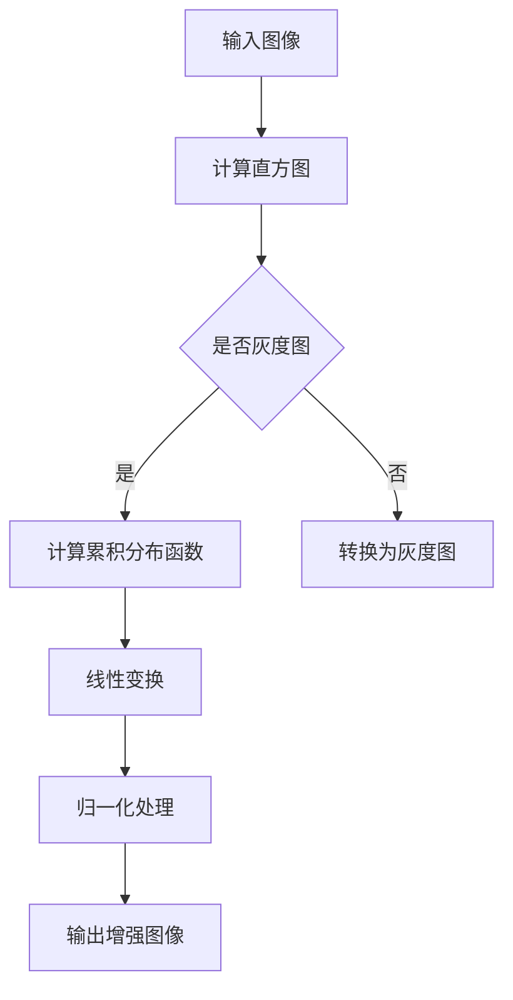
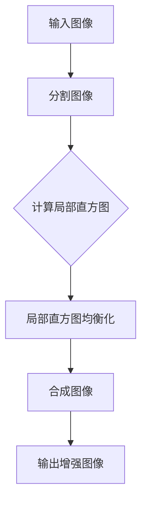

                 

### 《OpenCV 图像增强算法：改善图像质量和视觉效果》

> **关键词**：图像增强、OpenCV、算法、图像质量、视觉效果、预处理、滤波、锐化、自适应、实时处理、医学图像、人脸识别、自动驾驶

> **摘要**：
本篇文章将深入探讨 OpenCV 图像增强算法，通过详细解析各个核心算法和预处理技术，帮助读者理解图像增强的基本原理、技术细节和实践应用。我们将从图像增强的概念出发，逐步深入到算法的实现、优化和实际项目中的应用，旨在为读者提供全面而实用的技术指导。

### 目录大纲

**第一部分：图像增强算法基础**

1. **第1章：图像增强算法概述**
   - 1.1 图像增强的概念与目的
   - 1.2 图像增强的分类与常见方法
   - 1.3 OpenCV 在图像增强中的应用

2. **第2章：OpenCV 图像处理基础**
   - 2.1 OpenCV 基础知识
     - 2.1.1 OpenCV 简介
     - 2.1.2 OpenCV 的安装与配置
     - 2.1.3 OpenCV 的基本数据结构
   - 2.2 OpenCV 图像处理基础
     - 2.2.1 图像的读取与显示
     - 2.2.2 图像的基本操作
     - 2.2.3 图像的滤波与形态学操作

3. **第3章：图像增强的预处理技术**
   - 3.1 预处理技术的重要性
   - 3.2 边缘检测与图像分割
     - 3.2.1 边缘检测算法
     - 3.2.2 图像分割算法
   - 3.3 颜色空间转换
     - 3.3.1 常见颜色空间
     - 3.3.2 颜色空间转换方法

**第二部分：OpenCV 图像增强算法详解**

4. **第4章：图像亮度与对比度调整**
   - 4.1 直方图均衡化
     - 4.1.1 直方图均衡化原理
     - 4.1.2 直方图均衡化算法
   - 4.2 局部对比度增强
     - 4.2.1 局部对比度增强原理
     - 4.2.2 局部对比度增强算法

5. **第5章：图像滤波与去噪**
   - 5.1 低通滤波器
     - 5.1.1 低通滤波器原理
     - 5.1.2 低通滤波器算法
   - 5.2 高频增强与边缘检测
     - 5.2.1 高频增强原理
     - 5.2.2 边缘检测算法

6. **第6章：图像锐化与细节增强**
   - 6.1 图像锐化算法
     - 6.1.1 图像锐化原理
     - 6.1.2 图像锐化算法
   - 6.2 图像细节增强
     - 6.2.1 图像细节增强原理
     - 6.2.2 图像细节增强算法

7. **第7章：图像增强的优化与自适应算法**
   - 7.1 优化算法在图像增强中的应用
     - 7.1.1 优化算法原理
     - 7.1.2 优化算法在图像增强中的应用
   - 7.2 自适应图像增强
     - 7.2.1 自适应图像增强原理
     - 7.2.2 自适应图像增强算法

8. **第8章：图像增强的实时处理**
   - 8.1 实时图像增强系统设计
     - 8.1.1 实时图像增强系统的需求分析
     - 8.1.2 实时图像增强系统的架构设计
   - 8.2 实时图像增强算法优化
     - 8.2.1 实时图像增强算法的选择
     - 8.2.2 实时图像增强算法的优化策略

**第三部分：OpenCV 图像增强项目实战**

9. **第9章：图像增强算法在医学图像处理中的应用**
   - 9.1 医学图像增强的需求与挑战
   - 9.2 OpenCV 在医学图像增强中的应用案例
   - 9.3 医学图像增强的代码实现与解读

10. **第10章：图像增强算法在人脸识别中的应用**
    - 10.1 人脸识别的基本原理
    - 10.2 图像增强在人脸识别中的应用
    - 10.3 人脸识别中图像增强的代码实现与解读

11. **第11章：图像增强算法在自动驾驶中的应用**
    - 11.1 自动驾驶中图像增强的需求
    - 11.2 OpenCV 在自动驾驶图像增强中的应用案例
    - 11.3 自动驾驶中图像增强的代码实现与解读

**附录**

- **附录 A：OpenCV 图像增强相关函数与 API**
  - A.1 OpenCV 中常用的图像增强函数
  - A.2 OpenCV 中常用的滤波器函数
  - A.3 OpenCV 中常用的图像预处理函数

- **附录 B：图像增强算法的 Mermaid 流程图**
  - B.1 直方图均衡化算法的 Mermaid 流程图
  - B.2 自适应滤波器算法的 Mermaid 流程图

- **附录 C：图像增强算法的数学模型与公式**
  - C.1 直方图均衡化的数学模型
  - C.2 高斯滤波器的数学模型
  - C.3 边缘检测的数学模型

- **附录 D：图像增强算法的项目实战案例**
  - D.1 医学图像增强项目案例
  - D.2 人脸识别图像增强项目案例
  - D.3 自动驾驶图像增强项目案例

---

### 引言

图像增强是计算机视觉和图像处理领域中的一项关键技术，其主要目的是通过调整图像的亮度、对比度、清晰度等参数，改善图像的视觉效果，使其更加符合人眼的感知和计算机处理的需求。OpenCV（Open Source Computer Vision Library）是一个广泛使用的开源计算机视觉库，它提供了丰富的图像处理函数和算法，是图像增强技术的实现基础。

在现实应用中，图像增强技术发挥着至关重要的作用。无论是医疗影像、人脸识别、自动驾驶，还是日常摄影和视频编辑，图像增强都显著提升了图像的质量和可解释性。例如，在医学影像处理中，图像增强可以突出病灶区域，帮助医生做出更准确的诊断；在自动驾驶系统中，图像增强则可以提升车辆对周围环境的感知能力，提高行驶安全性。

本篇文章旨在深入探讨 OpenCV 图像增强算法，通过详细解析各个核心算法和预处理技术，帮助读者理解图像增强的基本原理、技术细节和实践应用。我们将从图像增强的概念出发，逐步深入到算法的实现、优化和实际项目中的应用，旨在为读者提供全面而实用的技术指导。

文章结构如下：

- **第一部分**将介绍图像增强算法的基础知识，包括图像增强的概念与目的、分类与常见方法，以及 OpenCV 在图像增强中的应用。
- **第二部分**将详细解析 OpenCV 图像增强算法，包括亮度与对比度调整、滤波与去噪、锐化与细节增强，以及优化与自适应算法。
- **第三部分**将通过具体的项目实战案例，展示图像增强算法在医学图像处理、人脸识别和自动驾驶等领域的应用。

通过本文的学习，读者将能够：

- 理解图像增强的基本概念和原理。
- 掌握 OpenCV 图像处理的基础知识。
- 熟悉各种图像增强算法的实现方法和优缺点。
- 学会如何优化和自适应图像增强算法。
- 应用图像增强技术解决实际问题，提升图像质量和视觉效果。

### 第一部分：图像增强算法基础

#### 第1章：图像增强算法概述

图像增强（Image Enhancement）是图像处理（Image Processing）中的一个重要分支，其主要目的是通过数字处理方法改善图像的质量，使其更适合特定应用的需求。图像增强不同于图像压缩和图像恢复，它并不改变图像的原始内容，而是通过调整图像的亮度、对比度、清晰度等参数，增强人眼对图像的感知效果，提高图像的视觉效果。

**1.1 图像增强的概念与目的**

图像增强的基本概念可以简单概括为：通过对图像进行某种处理，使图像中的有用信息变得更加突出，同时抑制噪声和无关信息。其核心目的有两个：

1. **改善图像的视觉效果**：使图像看起来更加清晰、明亮和具有对比度，满足人眼对图像感知的需求。
2. **提高图像的可用性**：为特定的应用场景提供高质量的图像，如医学影像、安防监控、自动驾驶等。

图像增强的主要步骤通常包括：

1. **图像预处理**：包括图像的读取、显示、灰度转换、滤波等操作，为后续增强处理做准备。
2. **图像增强处理**：通过调整图像的亮度、对比度、色彩空间等参数，实现图像增强。
3. **图像后处理**：包括图像的显示、存储和输出，确保增强后的图像符合应用需求。

**1.2 图像增强的分类与常见方法**

根据增强处理的方式，图像增强可以分为以下几类：

1. **空间域增强**：直接对图像像素值进行操作，常见的方法有：
   - **亮度调整**：通过线性变换或非线性变换调整图像的亮度。
   - **对比度增强**：通过调整图像的直方图，使图像的灰度分布更加均匀，提升图像的对比度。
   - **锐化**：通过增强图像的边缘信息，使图像看起来更加清晰。

2. **频域增强**：通过傅里叶变换将图像从空间域转换到频域，再对频域图像进行处理，常见的方法有：
   - **低通滤波**：抑制高频噪声，使图像变得更加平滑。
   - **高通滤波**：增强图像的边缘信息，使图像更加清晰。

3. **空频域增强**：结合空间域和频域增强的方法，如：
   - **频域滤波**：在频域中应用滤波器对图像进行滤波处理。
   - **自适应增强**：根据图像的不同区域特性，自适应地调整增强参数。

常见的图像增强方法还包括：

- **直方图均衡化**：通过调整图像的直方图，使图像的灰度分布更加均匀。
- **自适应直方图均衡化**：根据图像的不同区域特性，自适应地调整直方图均衡化的参数。
- **图像锐化**：通过增强图像的边缘信息，使图像看起来更加清晰。
- **去噪**：通过滤波算法去除图像中的噪声，提高图像质量。

**1.3 OpenCV 在图像增强中的应用**

OpenCV 是一个强大的开源计算机视觉库，提供了丰富的图像处理函数和算法，是图像增强技术的实现基础。OpenCV 提供了以下几种常见的图像增强方法：

- **亮度与对比度调整**：使用 `cv2.normalize()` 和 `cv2.add()` 函数进行像素值调整。
- **直方图均衡化**：使用 `cv2.equalizeHist()` 函数实现直方图均衡化。
- **滤波与去噪**：使用 `cv2.GaussianBlur()`、`cv2.bilateralFilter()` 和 `cv2.medianBlur()` 等滤波函数进行去噪和滤波处理。
- **锐化与细节增强**：使用 `cv2.Laplacian()`、`cv2.Sobel()` 和 `cv2.sharpen()` 等函数进行图像锐化和细节增强。
- **自适应增强**：使用 `cv2.adaptiveThreshold()` 函数进行自适应增强处理。

下面是使用 OpenCV 进行图像增强的一个简单示例：

```python
import cv2
import numpy as np

# 读取图像
image = cv2.imread('input_image.jpg')

# 直方图均衡化
equaled_image = cv2.equalizeHist(image)

# 显示原始图像和增强图像
cv2.imshow('Original Image', image)
cv2.imshow('Enhanced Image', equaled_image)

# 等待用户按键后关闭窗口
cv2.waitKey(0)
cv2.destroyAllWindows()
```

通过本章节的介绍，读者应该对图像增强的基本概念、分类和常见方法有了初步了解，同时也对 OpenCV 在图像增强中的应用有了基本的认识。接下来，我们将深入探讨 OpenCV 图像处理的基础知识，为后续的图像增强算法学习打下坚实基础。

#### 第2章：OpenCV 图像处理基础

图像处理是计算机视觉和图像增强的重要基础，而 OpenCV 作为一款开源的计算机视觉库，在图像处理领域有着广泛的应用。本章节将介绍 OpenCV 的基础知识，包括安装与配置、基本数据结构以及图像的读取与显示、基本操作和滤波与形态学操作。

**2.1 OpenCV 基础知识**

**2.1.1 OpenCV 简介**

OpenCV（Open Source Computer Vision Library）是一个开源的计算机视觉和机器学习软件库，由 Intel 开发并维护。它提供了丰富的算法和功能，包括图像处理、计算机视觉、机器学习等，广泛应用于工业自动化、安防监控、医疗影像、人脸识别等多个领域。

**2.1.2 OpenCV 的安装与配置**

安装 OpenCV 的过程相对简单，下面以 Windows 系统为例，介绍安装步骤：

1. **下载 OpenCV**：访问 OpenCV 的官方网站（opencv.org），下载适合自己系统的 OpenCV 版本。
2. **安装 OpenCV**：双击下载的安装包，按照提示进行安装。
3. **配置环境变量**：在安装过程中，可以设置 OpenCV 的环境变量，使得在命令行中可以直接使用 OpenCV 的命令。
4. **验证安装**：在命令行中输入 `cv2.version()`，如果能够正确显示 OpenCV 的版本信息，则说明安装成功。

**2.1.3 OpenCV 的基本数据结构**

OpenCV 中的图像数据通常存储为 NumPy 数组，具有以下特点：

- **数据类型**：图像数据通常为 `uint8` 或 `float32` 类型，其中 `uint8` 表示 8 位无符号整数，`float32` 表示 32 位浮点数。
- **数据结构**：图像数据通常以二维数组的形式存储，其中每个元素表示一个像素值。
- **通道数**：图像的通道数可以是一维（灰度图像）、二维（单通道彩色图像）或三维（多通道彩色图像），分别对应灰度、RGB 和 BGR 颜色空间。

下面是一个简单的例子，展示如何创建和操作 OpenCV 图像数据：

```python
import cv2
import numpy as np

# 创建一个 200x200 的白色图像
image = np.zeros((200, 200), dtype=np.uint8)

# 设置图像左上角的像素为红色
image[0:50, 0:50] = 255

# 显示图像
cv2.imshow('Image', image)
cv2.waitKey(0)
cv2.destroyAllWindows()
```

**2.2 OpenCV 图像处理基础**

**2.2.1 图像的读取与显示**

读取和显示图像是图像处理中最基本的两步。OpenCV 提供了以下两个函数：

- **`cv2.imread()`**：用于读取图像文件，返回图像数据。
- **`cv2.imshow()`**：用于显示图像。

示例代码如下：

```python
import cv2

# 读取图像
image = cv2.imread('input_image.jpg')

# 显示图像
cv2.imshow('Image', image)
cv2.waitKey(0)
cv2.destroyAllWindows()
```

**2.2.2 图像的基本操作**

OpenCV 提供了一系列基本图像操作函数，包括像素值操作、图像尺寸调整、图像转换等。以下是一些常用的操作：

- **像素值操作**：通过 `image[x, y]` 或 `image[y, x]` 访问和修改图像的像素值。
- **图像尺寸调整**：使用 `cv2.resize()` 函数调整图像大小。
- **图像转换**：使用 `cv2.cvtColor()` 函数进行图像颜色空间转换。

示例代码如下：

```python
import cv2

# 读取图像
image = cv2.imread('input_image.jpg')

# 调整图像尺寸
resized_image = cv2.resize(image, (500, 500))

# 转换图像颜色空间
gray_image = cv2.cvtColor(image, cv2.COLOR_BGR2GRAY)

# 显示图像
cv2.imshow('Original Image', image)
cv2.imshow('Resized Image', resized_image)
cv2.imshow('Gray Image', gray_image)
cv2.waitKey(0)
cv2.destroyAllWindows()
```

**2.2.3 图像的滤波与形态学操作**

图像滤波和形态学操作是图像处理中常用的技术，用于去除噪声、提取边缘和形态学特征。OpenCV 提供了丰富的滤波和形态学操作函数。

- **滤波操作**：包括空间滤波器和频域滤波器。空间滤波器包括均值滤波、高斯滤波和双边滤波等；频域滤波器包括低通滤波和高通滤波等。

示例代码如下：

```python
import cv2

# 读取图像
image = cv2.imread('input_image.jpg')

# 均值滤波
blurred_image = cv2.blur(image, (5, 5))

# 高斯滤波
gaussian_image = cv2.GaussianBlur(image, (5, 5), 0)

# 显示图像
cv2.imshow('Original Image', image)
cv2.imshow('Blurred Image', blurred_image)
cv2.imshow('Gaussian Image', gaussian_image)
cv2.waitKey(0)
cv2.destroyAllWindows()
```

- **形态学操作**：包括膨胀、腐蚀、开运算和闭运算等。这些操作在图像处理中用于提取目标边缘、去除噪声和形态学重建。

示例代码如下：

```python
import cv2

# 读取图像
image = cv2.imread('input_image.jpg')

# 创建结构元素
kernel = cv2.getStructuringElement(cv2.MORPH_RECT, (3, 3))

# 膨胀操作
dilated_image = cv2.dilate(image, kernel, iterations=1)

# 腐蚀操作
eroded_image = cv2.erode(image, kernel, iterations=1)

# 开运算
open_image = cv2.morphologyEx(image, cv2.MORPH_OPEN, kernel)

# 闭运算
close_image = cv2.morphologyEx(image, cv2.MORPH_CLOSE, kernel)

# 显示图像
cv2.imshow('Original Image', image)
cv2.imshow('Dilated Image', dilated_image)
cv2.imshow('Eroded Image', eroded_image)
cv2.imshow('Open Image', open_image)
cv2.imshow('Close Image', close_image)
cv2.waitKey(0)
cv2.destroyAllWindows()
```

通过本章的介绍，读者应该对 OpenCV 的基础知识有了全面的了解，掌握了图像读取与显示、基本操作以及滤波与形态学操作的方法。这些基础知识的掌握将为后续图像增强算法的学习和实际应用打下坚实的基础。

#### 第3章：图像增强的预处理技术

图像预处理是图像增强中至关重要的一步，其目的是通过一系列预处理操作，改善图像的视觉效果，为后续的图像增强算法提供更好的基础。本章将详细介绍图像增强预处理技术中的边缘检测、图像分割和颜色空间转换。

**3.1 预处理技术的重要性**

图像预处理技术对于图像增强效果有着直接的影响。有效的预处理可以突出图像中的关键特征，抑制噪声和无关信息，从而提高图像增强算法的效率和效果。以下是几种常见的预处理技术及其作用：

- **边缘检测**：用于提取图像中的边缘信息，有助于增强图像的细节和对比度。
- **图像分割**：将图像分为不同的区域，有助于突出感兴趣区域，为增强算法提供目标区域。
- **颜色空间转换**：将图像从一种颜色空间转换为另一种颜色空间，有助于利用特定颜色空间的特性进行增强处理。

**3.2 边缘检测与图像分割**

边缘检测是图像处理中常用的技术，用于识别图像中的显著边缘。边缘检测算法可以分为两大类：基于零交叉法和基于梯度法。

**3.2.1 边缘检测算法**

1. **基于零交叉法**：通过检测像素值在垂直或水平方向上的变化，识别边缘。常见的算法有 Sobel算子、Prewitt算子和Roberts算子。

   示例代码如下：

   ```python
   import cv2
   import numpy as np

   # 读取图像
   image = cv2.imread('input_image.jpg', cv2.IMREAD_GRAYSCALE)

   # Sobel算子
   sobelx = cv2.Sobel(image, cv2.CV_64F, 1, 0, ksize=3)
   sobely = cv2.Sobel(image, cv2.CV_64F, 0, 1, ksize=3)

   # 累加水平和垂直梯度
   edge = cv2.addWeighted(sobelx, 0.5, sobely, 0.5, 0)

   # 显示边缘图像
   cv2.imshow('Edge Detection', edge)
   cv2.waitKey(0)
   cv2.destroyAllWindows()
   ```

2. **基于梯度法**：通过计算图像的梯度和方向，识别边缘。常见的算法有 Canny 算子。

   示例代码如下：

   ```python
   import cv2

   # 读取图像
   image = cv2.imread('input_image.jpg', cv2.IMREAD_GRAYSCALE)

   # Canny 算子
   edge = cv2.Canny(image, threshold1=100, threshold2=200)

   # 显示边缘图像
   cv2.imshow('Edge Detection', edge)
   cv2.waitKey(0)
   cv2.destroyAllWindows()
   ```

**3.2.2 图像分割算法**

图像分割是将图像划分为若干个区域的过程，目的是将图像中的目标物体与背景区分开来。常见的图像分割算法有基于阈值的分割、基于区域的分割和基于边的分割。

1. **基于阈值的分割**：通过设置阈值将图像划分为前景和背景。常见的算法有全局阈值分割和局部阈值分割。

   示例代码如下：

   ```python
   import cv2
   import numpy as np

   # 读取图像
   image = cv2.imread('input_image.jpg', cv2.IMREAD_GRAYSCALE)

   # 全局阈值分割
   _, binary_image = cv2.threshold(image, 128, 255, cv2.THRESH_BINARY + cv2.THRESH_OTSU)

   # 显示分割图像
   cv2.imshow('Threshold Segmentation', binary_image)
   cv2.waitKey(0)
   cv2.destroyAllWindows()
   ```

2. **基于区域的分割**：根据图像区域的相似性进行分割。常见的算法有区域生长和分水岭算法。

   示例代码如下：

   ```python
   import cv2
   import numpy as np

   # 读取图像
   image = cv2.imread('input_image.jpg', cv2.IMREAD_GRAYSCALE)

   # 区域生长算法
   markers = cv2/markers_new()
   markers[0, 0] = 1
   markers[99, 99] = 2
   segmentedImage = cv2区域生长(image, markers)

   # 显示分割图像
   cv2.imshow('Region Growing Segmentation', segmentedImage)
   cv2.waitKey(0)
   cv2.destroyAllWindows()
   ```

3. **基于边的分割**：通过检测图像中的边缘进行分割。常见的算法有边缘检测和轮廓提取。

   示例代码如下：

   ```python
   import cv2

   # 读取图像
   image = cv2.imread('input_image.jpg', cv2.IMREAD_GRAYSCALE)

   # Canny 算子
   edge = cv2.Canny(image, threshold1=100, threshold2=200)

   # 轮廓提取
   contours, _ = cv2.findContours(edge, cv2.RETR_EXTERNAL, cv2.CHAIN_APPROX_SIMPLE)

   # 绘制轮廓
   segmented_image = cv2.drawContours(image, contours, -1, (0, 255, 0), 3)

   # 显示分割图像
   cv2.imshow('Edge-Based Segmentation', segmented_image)
   cv2.waitKey(0)
   cv2.destroyAllWindows()
   ```

**3.3 颜色空间转换**

颜色空间转换是将图像从一种颜色空间转换为另一种颜色空间的过程，常用的颜色空间包括灰度空间、RGB 空间、HSV 空间等。

1. **灰度空间**：灰度图像只有亮度信息，没有颜色信息。将彩色图像转换为灰度图像可以简化处理过程。

   示例代码如下：

   ```python
   import cv2

   # 读取彩色图像
   image = cv2.imread('input_image.jpg')

   # 转换为灰度图像
   gray_image = cv2.cvtColor(image, cv2.COLOR_BGR2GRAY)

   # 显示灰度图像
   cv2.imshow('Gray Image', gray_image)
   cv2.waitKey(0)
   cv2.destroyAllWindows()
   ```

2. **RGB 空间**：RGB 颜色空间是一种常见的彩色图像颜色空间，由红色、绿色和蓝色三个分量组成。

   示例代码如下：

   ```python
   import cv2

   # 读取彩色图像
   image = cv2.imread('input_image.jpg')

   # 显示原始图像
   cv2.imshow('Original Image', image)
   cv2.waitKey(0)
   cv2.destroyAllWindows()
   ```

3. **HSV 空间**：HSV 颜色空间是一种用于处理彩色图像的颜色空间，包括色调（Hue）、饱和度（Saturation）和亮度（Value）三个分量。

   示例代码如下：

   ```python
   import cv2

   # 读取彩色图像
   image = cv2.imread('input_image.jpg')

   # 转换为 HSV 空间
   hsv_image = cv2.cvtColor(image, cv2.COLOR_BGR2HSV)

   # 显示 HSV 图像
   cv2.imshow('HSV Image', hsv_image)
   cv2.waitKey(0)
   cv2.destroyAllWindows()
   ```

通过本章的介绍，读者应该对图像预处理技术中的边缘检测、图像分割和颜色空间转换有了深入的理解，并能够应用这些技术对图像进行预处理，为后续的图像增强算法提供更好的基础。

### 第二部分：OpenCV 图像增强算法详解

#### 第4章：图像亮度与对比度调整

图像亮度与对比度调整是图像增强中最为基础且常用的技术之一。通过调整图像的亮度（ Brightness）和对比度（Contrast），可以使图像看起来更加清晰、突出，满足人眼对图像的感知需求。OpenCV 提供了多种方法来实现这一目标，包括直方图均衡化和局部对比度增强。

**4.1 直方图均衡化**

直方图均衡化（Histogram Equalization）是一种用于改善图像对比度的方法，其基本原理是通过调整图像的直方图，使得图像的灰度分布更加均匀。具体来说，直方图均衡化通过扩展图像的灰度范围，使得图像中的高频细节更加突出，从而增强图像的对比度。

**4.1.1 直方图均衡化原理**

直方图均衡化的原理可以概括为以下步骤：

1. **计算原始图像的直方图**：直方图描述了图像中每个灰度值出现的频率。通过计算原始图像的直方图，可以得到图像的灰度分布情况。

2. **计算累积分布函数（CDF）**：累积分布函数（CDF）描述了图像中每个灰度值及其以上所有灰度值出现的频率之和。通过计算累积分布函数，可以将直方图的频率分布转化为概率分布。

3. **线性变换**：根据累积分布函数，对原始图像的每个像素值进行线性变换，使得变换后的图像的灰度分布更加均匀。具体变换公式如下：

   \[
   output\_value = \text{CDF}(input\_value) \times (255 - 0 + 1)
   \]

4. **归一化处理**：由于线性变换可能导致像素值超出范围，需要对结果进行归一化处理，将其重新映射到 [0, 255] 的范围内。

**4.1.2 直方图均衡化算法**

OpenCV 提供了 `cv2.equalizeHist()` 函数来实现直方图均衡化。以下是一个简单的直方图均衡化算法示例：

```python
import cv2
import numpy as np

# 读取图像
image = cv2.imread('input_image.jpg', cv2.IMREAD_GRAYSCALE)

# 直方图均衡化
equaled_image = cv2.equalizeHist(image)

# 显示原始图像和增强图像
cv2.imshow('Original Image', image)
cv2.imshow('Enhanced Image', equaled_image)
cv2.waitKey(0)
cv2.destroyAllWindows()
```

**4.2 局部对比度增强**

局部对比度增强（Local Contrast Enhancement）是一种通过调整图像的局部对比度，使其看起来更加清晰、生动的技术。与直方图均衡化不同，局部对比度增强可以针对图像的不同区域进行独立调整，从而更好地保留图像的细节。

**4.2.1 局部对比度增强原理**

局部对比度增强的基本原理是通过计算图像的局部直方图，并对其进行均衡化处理，从而增强图像的局部对比度。具体来说，局部对比度增强可以分为以下步骤：

1. **分割图像**：将图像划分为多个子区域，例如使用滑窗技术。

2. **计算局部直方图**：对每个子区域计算直方图，得到每个区域的灰度分布。

3. **局部直方图均衡化**：对每个子区域的直方图进行均衡化处理，使每个区域的灰度分布更加均匀。

4. **合成图像**：将处理后的局部子区域重新组合，生成最终的增强图像。

**4.2.2 局部对比度增强算法**

OpenCV 提供了 `cv2.createCLAHE()` 函数来实现局部对比度增强。以下是一个简单的局部对比度增强算法示例：

```python
import cv2
import numpy as np

# 读取图像
image = cv2.imread('input_image.jpg', cv2.IMREAD_GRAYSCALE)

# 创建局部对比度增强对象
clahe = cv2.createCLAHE(clipLimit=2.0, tileGridSize=(8, 8))

# 局部对比度增强
equaled_image = clahe.apply(image)

# 显示原始图像和增强图像
cv2.imshow('Original Image', image)
cv2.imshow('Enhanced Image', equaled_image)
cv2.waitKey(0)
cv2.destroyAllWindows()
```

通过本章的介绍，读者应该能够理解图像亮度与对比度调整的基本原理和算法实现，并掌握直方图均衡化和局部对比度增强在 OpenCV 中的使用方法。这些技术将为后续的图像滤波、锐化和细节增强等算法提供坚实的基础。

### 第5章：图像滤波与去噪

图像滤波与去噪是图像处理中至关重要的一步，旨在去除图像中的噪声，提高图像质量。OpenCV 提供了多种滤波器和去噪算法，包括低通滤波器和高频增强算法，这些算法在图像处理和计算机视觉中有着广泛的应用。

**5.1 低通滤波器**

低通滤波器（Low-pass Filter）是一种用于去除图像中高频噪声的滤波器。其基本原理是通过抑制高频信号，使图像更加平滑。低通滤波器可以分为线性滤波器和非线性滤波器。

**5.1.1 低通滤波器原理**

低通滤波器通过减少图像中的高频成分，保留低频成分，从而实现去噪和平滑图像。在频域中，低通滤波器的作用类似于一个“窗口”，只允许低频信号通过，而抑制高频信号。常见的低通滤波器包括理想低通滤波器、布特沃斯低通滤波器和梯形低通滤波器。

**5.1.2 低通滤波器算法**

OpenCV 提供了以下几种低通滤波器：

1. **理想低通滤波器**：使用 `cv2.getLowPassFilter()` 函数实现。

   示例代码如下：

   ```python
   import cv2
   import numpy as np

   # 读取图像
   image = cv2.imread('input_image.jpg')

   # 创建理想低通滤波器
   ideal_filter = cv2.getLowPassFilter(cv2.CV_32F, (5, 5), 1.0)

   # 应用理想低通滤波器
   filtered_image = cv2.filter2D(image, -1, ideal_filter)

   # 显示原始图像和滤波图像
   cv2.imshow('Original Image', image)
   cv2.imshow('Filtered Image', filtered_image)
   cv2.waitKey(0)
   cv2.destroyAllWindows()
   ```

2. **布特沃斯低通滤波器**：使用 `cv2.getLowPassFilter()` 函数实现。

   示例代码如下：

   ```python
   import cv2
   import numpy as np

   # 读取图像
   image = cv2.imread('input_image.jpg')

   # 创建布特沃斯低通滤波器
   butterworth_filter = cv2.getLowPassFilter(cv2.CV_32F, (5, 5), 1.5)

   # 应用布特沃斯低通滤波器
   filtered_image = cv2.filter2D(image, -1, butterworth_filter)

   # 显示原始图像和滤波图像
   cv2.imshow('Original Image', image)
   cv2.imshow('Filtered Image', filtered_image)
   cv2.waitKey(0)
   cv2.destroyAllWindows()
   ```

3. **梯形低通滤波器**：使用 `cv2.getLowPassFilter()` 函数实现。

   示例代码如下：

   ```python
   import cv2
   import numpy as np

   # 读取图像
   image = cv2.imread('input_image.jpg')

   # 创建梯形低通滤波器
   trapezoidal_filter = cv2.getLowPassFilter(cv2.CV_32F, (5, 5), 2.0)

   # 应用梯形低通滤波器
   filtered_image = cv2.filter2D(image, -1, trapezoidal_filter)

   # 显示原始图像和滤波图像
   cv2.imshow('Original Image', image)
   cv2.imshow('Filtered Image', filtered_image)
   cv2.waitKey(0)
   cv2.destroyAllWindows()
   ```

**5.2 高频增强与边缘检测**

高频增强（High-frequency Enhancement）是一种用于增强图像边缘和细节的滤波器。与低通滤波器相反，高频增强滤波器通过增加高频信号，使图像更加清晰。边缘检测（Edge Detection）是图像处理中的一种重要技术，用于提取图像中的边缘信息。

**5.2.1 高频增强原理**

高频增强滤波器通过增加图像的高频成分，使图像中的边缘和细节更加突出。高频增强滤波器可以分为线性滤波器和非线性滤波器。

**5.2.2 边缘检测算法**

OpenCV 提供了多种边缘检测算法，包括 Sobel 算子、Prewitt 算子、Roberts 算子和 Canny 算子。

1. **Sobel 算子**：使用 `cv2.Sobel()` 函数实现。

   示例代码如下：

   ```python
   import cv2
   import numpy as np

   # 读取图像
   image = cv2.imread('input_image.jpg', cv2.IMREAD_GRAYSCALE)

   # 使用 Sobel 算子进行边缘检测
   sobelx = cv2.Sobel(image, cv2.CV_64F, 1, 0, ksize=3)
   sobely = cv2.Sobel(image, cv2.CV_64F, 0, 1, ksize=3)

   # 累加水平和垂直梯度
   edge = cv2.addWeighted(sobelx, 0.5, sobely, 0.5, 0)

   # 显示边缘图像
   cv2.imshow('Edge Detection', edge)
   cv2.waitKey(0)
   cv2.destroyAllWindows()
   ```

2. **Prewitt 算子**：使用 `cv2.Prewitt()` 函数实现。

   示例代码如下：

   ```python
   import cv2
   import numpy as np

   # 读取图像
   image = cv2.imread('input_image.jpg', cv2.IMREAD_GRAYSCALE)

   # 使用 Prewitt 算子进行边缘检测
   prewittx = cv2.Prewitt(image, 1)
   prewitty = cv2.Prewitt(image, 0)

   # 累加水平和垂直梯度
   edge = cv2.addWeighted(prewittx, 0.5, prewitty, 0.5, 0)

   # 显示边缘图像
   cv2.imshow('Edge Detection', edge)
   cv2.waitKey(0)
   cv2.destroyAllWindows()
   ```

3. **Roberts 算子**：使用 `cv2.Roberts()` 函数实现。

   示例代码如下：

   ```python
   import cv2
   import numpy as np

   # 读取图像
   image = cv2.imread('input_image.jpg', cv2.IMREAD_GRAYSCALE)

   # 使用 Roberts 算子进行边缘检测
   edge = cv2.Roberts(image)

   # 显示边缘图像
   cv2.imshow('Edge Detection', edge)
   cv2.waitKey(0)
   cv2.destroyAllWindows()
   ```

4. **Canny 算子**：使用 `cv2.Canny()` 函数实现。

   示例代码如下：

   ```python
   import cv2

   # 读取图像
   image = cv2.imread('input_image.jpg', cv2.IMREAD_GRAYSCALE)

   # 使用 Canny 算子进行边缘检测
   edge = cv2.Canny(image, threshold1=100, threshold2=200)

   # 显示边缘图像
   cv2.imshow('Edge Detection', edge)
   cv2.waitKey(0)
   cv2.destroyAllWindows()
   ```

通过本章的介绍，读者应该能够理解低通滤波器和高频增强算法的基本原理和实现方法，并掌握 OpenCV 中常用的边缘检测算法。这些滤波与去噪技术将为图像增强和计算机视觉应用提供坚实的基础。

### 第6章：图像锐化与细节增强

图像锐化与细节增强是图像处理中重要的技术之一，其目的是通过增强图像的边缘和细节，使其看起来更加清晰和真实。OpenCV 提供了多种图像锐化和细节增强的方法，包括传统的图像锐化算法和基于细节增强的技术。

**6.1 图像锐化算法**

图像锐化（Image Sharpening）是一种通过增强图像的边缘和细节，使其看起来更加清晰的技术。图像锐化的基本原理是增加图像的对比度，从而突出图像的边缘和细节。

**6.1.1 图像锐化原理**

图像锐化可以通过以下步骤实现：

1. **高斯模糊**：首先对图像进行高斯模糊处理，生成模糊图像。
2. **计算差值**：将原始图像与模糊图像进行差值计算，得到锐化图像。
3. **图像合成**：将锐化图像与原始图像进行合成，得到最终的锐化结果。

常见的图像锐化算法包括 LoG 算子、Laplacian 算子和 unsharp masking 等。

**6.1.2 图像锐化算法**

OpenCV 提供了以下几种图像锐化算法：

1. **LoG 算子**：使用 `cv2.Laplacian()` 函数实现。

   示例代码如下：

   ```python
   import cv2
   import numpy as np

   # 读取图像
   image = cv2.imread('input_image.jpg', cv2.IMREAD_GRAYSCALE)

   # 使用 LoG 算子进行图像锐化
   laplacian_image = cv2.Laplacian(image, cv2.CV_64F)

   # 显示锐化图像
   cv2.imshow('Sharpened Image', laplacian_image)
   cv2.waitKey(0)
   cv2.destroyAllWindows()
   ```

2. **Laplacian 算子**：使用 `cv2.Laplacian()` 函数实现。

   示例代码如下：

   ```python
   import cv2
   import numpy as np

   # 读取图像
   image = cv2.imread('input_image.jpg', cv2.IMREAD_GRAYSCALE)

   # 使用 Laplacian 算子进行图像锐化
   laplacian_image = cv2.Laplacian(image, cv2.CV_64F)

   # 显示锐化图像
   cv2.imshow('Sharpened Image', laplacian_image)
   cv2.waitKey(0)
   cv2.destroyAllWindows()
   ```

3. **unsharp masking**：使用 `cv2.unsharpMask()` 函数实现。

   示例代码如下：

   ```python
   import cv2
   import numpy as np

   # 读取图像
   image = cv2.imread('input_image.jpg')

   # 使用 unsharp masking 进行图像锐化
   sharpened_image = cv2.unsharpMask(image, strength=1.0, sigma=1.0, sigma_min=0.1, threshold=10)

   # 显示锐化图像
   cv2.imshow('Sharpened Image', sharpened_image)
   cv2.waitKey(0)
   cv2.destroyAllWindows()
   ```

**6.2 图像细节增强**

图像细节增强（Detail Enhancement）是一种通过增强图像的细节信息，使其看起来更加真实的技术。图像细节增强可以用于提高图像的清晰度和对比度。

**6.2.1 图像细节增强原理**

图像细节增强的基本原理是通过调整图像的对比度和亮度，增强图像的细节信息。常见的图像细节增强方法包括对比度增强和亮度调整。

**6.2.2 图像细节增强算法**

OpenCV 提供了以下几种图像细节增强算法：

1. **对比度增强**：使用 `cv2.add()` 和 `cv2.normalize()` 函数实现。

   示例代码如下：

   ```python
   import cv2
   import numpy as np

   # 读取图像
   image = cv2.imread('input_image.jpg')

   # 对比度增强
   contrast_image = cv2.add(image, np.array([50.0]))

   # 显示增强图像
   cv2.imshow('Enhanced Image', contrast_image)
   cv2.waitKey(0)
   cv2.destroyAllWindows()
   ```

2. **亮度调整**：使用 `cv2.normalize()` 函数实现。

   示例代码如下：

   ```python
   import cv2
   import numpy as np

   # 读取图像
   image = cv2.imread('input_image.jpg')

   # 亮度调整
   brightness_image = cv2.normalize(image, None, alpha=0, beta=255, alpha_in=0, beta_in=255, norm_type=cv2.NORM_MINMAX, dtype=cv2.CV_8U)

   # 显示增强图像
   cv2.imshow('Enhanced Image', brightness_image)
   cv2.waitKey(0)
   cv2.destroyAllWindows()
   ```

通过本章的介绍，读者应该能够理解图像锐化与细节增强的基本原理和算法实现，并掌握 OpenCV 中常用的图像锐化和细节增强方法。这些技术将为图像处理和计算机视觉应用提供坚实的基础。

### 第7章：图像增强的优化与自适应算法

图像增强的优化与自适应算法是提升图像质量的重要手段，这些算法能够根据图像内容的变化动态调整增强参数，实现更精细、更高效的图像增强效果。本章将探讨优化算法和自适应算法在图像增强中的应用，并介绍具体的实现方法。

**7.1 优化算法在图像增强中的应用**

优化算法（Optimization Algorithm）用于在图像增强过程中寻找最佳参数设置，以实现最佳的增强效果。优化算法可以分为基于梯度下降的方法和基于粒子群的方法等。

**7.1.1 优化算法原理**

优化算法的基本原理是通过迭代计算，逐步逼近最优解。在图像增强中，优化算法的目标函数通常是基于图像质量评价指标，如峰值信噪比（PSNR）或结构相似性（SSIM）。

1. **梯度下降法**：梯度下降法是一种基于目标函数梯度的优化方法，通过不断更新参数，使目标函数值逐步减小，最终达到最优解。具体步骤如下：

   - 初始参数设置
   - 计算目标函数的梯度
   - 更新参数：参数 = 参数 - 学习率 × 梯度
   - 重复步骤 2 和 3，直到满足停止条件（如梯度小于阈值或迭代次数达到上限）

2. **粒子群优化法**：粒子群优化法（Particle Swarm Optimization, PSO）是一种基于群体智能的优化方法，通过模拟鸟群觅食行为，实现优化搜索。具体步骤如下：

   - 初始化粒子群：随机生成粒子的位置和速度
   - 计算每个粒子的适应度值
   - 更新每个粒子的最佳位置和速度
   - 更新全局最佳位置
   - 重复步骤 2 到 4，直到满足停止条件

**7.1.2 优化算法在图像增强中的应用**

以下是一个基于梯度下降法的图像增强优化示例：

```python
import cv2
import numpy as np

# 读取图像
image = cv2.imread('input_image.jpg', cv2.IMREAD_GRAYSCALE)

# 定义目标函数
def objective_function(image, params):
    # 这里用 PSNR 作为目标函数的示例
    enhanced_image = cv2.equalizeHist(image, params)
    psnr = cv2.PSNR(image, enhanced_image)
    return -psnr  # 目标是最小化 PSNR

# 初始化参数
params = 0.5

# 梯度下降法优化
learning_rate = 0.1
max_iterations = 100
for iteration in range(max_iterations):
    gradient = compute_gradient(objective_function, params)  # 计算梯度
    params = params - learning_rate * gradient  # 更新参数
    print(f"Iteration {iteration}: Objective Function = {objective_function(image, params)}")

# 应用优化的参数进行图像增强
enhanced_image = cv2.equalizeHist(image, params)

# 显示增强图像
cv2.imshow('Enhanced Image', enhanced_image)
cv2.waitKey(0)
cv2.destroyAllWindows()
```

**7.2 自适应图像增强**

自适应图像增强（Adaptive Image Enhancement）是一种根据图像内容的变化动态调整增强参数的方法。自适应算法能够处理不同区域图像特性差异，实现更精细的增强效果。

**7.2.1 自适应图像增强原理**

自适应图像增强的基本原理是：

1. **区域划分**：将图像划分为多个子区域。
2. **区域特征提取**：对每个子区域提取特征，如直方图、纹理特征等。
3. **自适应参数调整**：根据区域特征动态调整增强参数。
4. **图像增强**：对每个子区域应用相应的增强参数，生成增强图像。

**7.2.2 自适应图像增强算法**

OpenCV 提供了多种自适应图像增强算法，如自适应直方图均衡化和自适应滤波。

1. **自适应直方图均衡化**：使用 `cv2.createCLAHE()` 函数实现。

   示例代码如下：

   ```python
   import cv2
   import numpy as np

   # 读取图像
   image = cv2.imread('input_image.jpg', cv2.IMREAD_GRAYSCALE)

   # 创建自适应直方图均衡化对象
   clahe = cv2.createCLAHE(clipLimit=2.0, tileGridSize=(8, 8))

   # 应用自适应直方图均衡化
   enhanced_image = clahe.apply(image)

   # 显示增强图像
   cv2.imshow('Enhanced Image', enhanced_image)
   cv2.waitKey(0)
   cv2.destroyAllWindows()
   ```

2. **自适应滤波**：使用 `cv2.adaptiveThreshold()` 函数实现。

   示例代码如下：

   ```python
   import cv2
   import numpy as np

   # 读取图像
   image = cv2.imread('input_image.jpg', cv2.IMREAD_GRAYSCALE)

   # 应用自适应滤波
   enhanced_image = cv2.adaptiveThreshold(image, 255, cv2.ADAPTIVE_THRESH_MEAN_C, cv2.THRESH_BINARY, blockSize=11, C=2)

   # 显示增强图像
   cv2.imshow('Enhanced Image', enhanced_image)
   cv2.waitKey(0)
   cv2.destroyAllWindows()
   ```

通过本章的介绍，读者应该能够理解优化算法和自适应算法的基本原理，并掌握在图像增强中的应用方法。这些优化与自适应技术将进一步提升图像增强的效果，满足更复杂的图像处理需求。

### 第8章：图像增强的实时处理

随着计算机性能的提升和图像处理技术的进步，图像增强的实时处理在多个领域中得到了广泛应用，如医疗影像、人脸识别和自动驾驶等。本章将探讨实时图像增强系统的设计、实时图像增强算法的选择与优化策略。

**8.1 实时图像增强系统设计**

**8.1.1 实时图像增强系统的需求分析**

实时图像增强系统需要满足以下需求：

- **低延迟**：系统必须在短时间内完成图像增强处理，以支持实时应用。
- **高效率**：系统需要优化算法和计算资源，以实现高效的处理速度。
- **稳定性**：系统必须在各种环境下保持稳定运行，不发生崩溃或错误。
- **灵活性**：系统应能够适应不同的图像增强需求和应用场景。

**8.1.2 实时图像增强系统的架构设计**

实时图像增强系统的架构设计通常包括以下模块：

1. **图像采集模块**：负责实时获取图像数据，可以是摄像头、传感器或其他图像输入设备。
2. **图像预处理模块**：对采集到的图像进行预处理，如灰度转换、去噪、边缘检测等。
3. **图像增强模块**：应用选定的图像增强算法，对预处理后的图像进行增强处理。
4. **图像输出模块**：将增强后的图像输出到显示器、存储设备或后续处理模块。

**8.1.3 实时图像增强系统的实现**

以下是一个简单的实时图像增强系统实现示例：

```python
import cv2
import numpy as np
import time

# 读取摄像头
cap = cv2.VideoCapture(0)

while True:
    # 采集图像
    ret, frame = cap.read()

    if not ret:
        break

    # 图像预处理
    gray_frame = cv2.cvtColor(frame, cv2.COLOR_BGR2GRAY)
    blurred_frame = cv2.GaussianBlur(gray_frame, (5, 5), 0)

    # 图像增强
    start_time = time.time()
    enhanced_frame = cv2.equalizeHist(blurred_frame)
    end_time = time.time()

    # 显示增强图像
    cv2.imshow('Enhanced Frame', enhanced_frame)

    # 打印处理时间
    print(f"Processing Time: {end_time - start_time} seconds")

    # 按下 'q' 键退出
    if cv2.waitKey(1) & 0xFF == ord('q'):
        break

# 释放摄像头
cap.release()
cv2.destroyAllWindows()
```

**8.2 实时图像增强算法优化**

**8.2.1 实时图像增强算法的选择**

选择适合的图像增强算法是实时图像增强系统的关键。以下是一些常见的选择标准：

- **算法复杂度**：算法的计算复杂度应尽可能低，以减少处理时间。
- **性能**：算法应在保证处理效果的前提下，尽量减少计算量。
- **灵活性**：算法应能够适应不同的图像类型和应用场景。

常见的实时图像增强算法包括直方图均衡化、自适应滤波和自适应直方图均衡化等。

**8.2.2 实时图像增强算法的优化策略**

为了提高实时图像增强系统的性能，可以采取以下优化策略：

1. **算法简化**：选择计算复杂度较低的算法，或对现有算法进行简化，减少计算时间。
2. **并行处理**：利用多核处理器或 GPU 等硬件资源，实现并行处理，提高处理速度。
3. **内存管理**：优化内存使用，减少图像数据的内存占用，降低内存瓶颈。
4. **图像预处理**：在图像增强之前，进行适当的预处理，如图像压缩、边缘检测等，减少后续处理的计算量。
5. **算法融合**：结合多种算法，取长补短，实现更高效的图像增强。

以下是一个基于并行处理的实时图像增强优化示例：

```python
import cv2
import numpy as np
import time
import multiprocessing as mp

# 读取摄像头
cap = cv2.VideoCapture(0)

# 创建进程池
num_cores = mp.cpu_count()
pool = mp.Pool(processes=num_cores)

while True:
    # 采集图像
    ret, frame = cap.read()

    if not ret:
        break

    # 图像预处理
    gray_frame = cv2.cvtColor(frame, cv2.COLOR_BGR2GRAY)

    # 并行处理
    start_time = time.time()
    blurred_frame = pool.apply_async(cv2.GaussianBlur, (gray_frame, (5, 5)))
    enhanced_frame = pool.apply_async(cv2.equalizeHist, (blurred_frame.get(),))
    end_time = time.time()

    # 获取处理结果
    enhanced_frame = enhanced_frame.get()

    # 显示增强图像
    cv2.imshow('Enhanced Frame', enhanced_frame)

    # 打印处理时间
    print(f"Processing Time: {end_time - start_time} seconds")

    # 按下 'q' 键退出
    if cv2.waitKey(1) & 0xFF == ord('q'):
        break

# 释放摄像头
cap.release()
cv2.destroyAllWindows()
```

通过本章的介绍，读者应该能够理解实时图像增强系统的设计原则、算法选择和优化策略，并掌握如何实现一个高效的实时图像增强系统。

### 第9章：图像增强算法在医学图像处理中的应用

医学图像处理是医疗领域中的一项重要技术，它能够显著提升医学影像的诊断准确性和效率。图像增强算法在医学图像处理中起着至关重要的作用，通过增强图像的对比度、细节和清晰度，可以提高病灶的可见性和可操作性。本章将探讨图像增强算法在医学图像处理中的应用，包括需求与挑战、应用案例和代码实现与解读。

**9.1 医学图像增强的需求与挑战**

医学图像增强在医学影像诊断中具有重要意义，其主要需求与挑战包括：

- **提升图像对比度**：医学图像通常存在对比度不足的问题，使得病灶区域难以识别。通过对比度增强，可以提高病灶与背景的对比度，使其更加明显。
- **细节增强**：医学图像中的细微结构可能因噪声或模糊而难以分辨。细节增强可以突出这些结构，帮助医生更好地识别病灶。
- **图像去噪**：医学图像中常伴有噪声，这些噪声可能会干扰诊断。去噪处理可以去除噪声，提高图像质量。
- **适应不同的成像条件**：医学图像可能来自不同的成像设备，如 CT、MRI、超声等，这些图像具有不同的特性和噪声水平。增强算法需要能够适应不同的成像条件。

**9.2 OpenCV 在医学图像增强中的应用案例**

以下是一个使用 OpenCV 进行医学图像增强的应用案例，包括对比度增强和去噪处理：

**对比度增强示例**

```python
import cv2
import numpy as np

# 读取图像
image = cv2.imread('input_image.jpg', cv2.IMREAD_GRAYSCALE)

# 对比度增强
equaled_image = cv2.equalizeHist(image)

# 显示增强图像
cv2.imshow('Enhanced Image', equaled_image)
cv2.waitKey(0)
cv2.destroyAllWindows()
```

**去噪示例**

```python
import cv2
import numpy as np

# 读取图像
image = cv2.imread('input_image.jpg', cv2.IMREAD_GRAYSCALE)

# 去噪处理
blurred_image = cv2.GaussianBlur(image, (5, 5), 0)
denoised_image = cv2.add(image, blurred_image)

# 显示去噪图像
cv2.imshow('Denoised Image', denoised_image)
cv2.waitKey(0)
cv2.destroyAllWindows()
```

**9.3 医学图像增强的代码实现与解读**

以下是一个综合使用对比度增强和去噪的医学图像增强案例，并进行详细解读：

```python
import cv2
import numpy as np

# 读取图像
image = cv2.imread('input_image.jpg', cv2.IMREAD_GRAYSCALE)

# 对比度增强
equaled_image = cv2.equalizeHist(image)

# 去噪处理
blurred_image = cv2.GaussianBlur(equaled_image, (5, 5), 0)
denoised_image = cv2.add(equaled_image, blurred_image)

# 显示增强图像
cv2.imshow('Original Image', image)
cv2.imshow('Enhanced Image', denoised_image)
cv2.waitKey(0)
cv2.destroyAllWindows()
```

**代码解读与分析**

1. **读取图像**：
   ```python
   image = cv2.imread('input_image.jpg', cv2.IMREAD_GRAYSCALE)
   ```
   使用 `cv2.imread()` 函数读取灰度图像，将其转换为 NumPy 数组格式。

2. **对比度增强**：
   ```python
   equaled_image = cv2.equalizeHist(image)
   ```
   使用 `cv2.equalizeHist()` 函数对图像进行直方图均衡化处理，提高图像的对比度。

3. **去噪处理**：
   ```python
   blurred_image = cv2.GaussianBlur(equaled_image, (5, 5), 0)
   denoised_image = cv2.add(equaled_image, blurred_image)
   ```
   使用 `cv2.GaussianBlur()` 函数对增强后的图像进行高斯模糊处理，生成模糊图像。然后，将原始增强图像与模糊图像进行叠加，实现去噪效果。

4. **显示图像**：
   ```python
   cv2.imshow('Original Image', image)
   cv2.imshow('Enhanced Image', denoised_image)
   cv2.waitKey(0)
   cv2.destroyAllWindows()
   ```
   使用 `cv2.imshow()` 函数显示原始图像和增强图像。

通过本章的介绍，读者应该能够理解图像增强算法在医学图像处理中的应用，并掌握使用 OpenCV 进行医学图像增强的代码实现和解读方法。这些技术将有助于提高医学影像的诊断准确性和效率。

### 第10章：图像增强算法在人脸识别中的应用

人脸识别是计算机视觉领域的一项重要技术，广泛应用于安全监控、身份验证、人机交互等场景。图像增强算法在人脸识别中发挥着关键作用，通过提升图像的对比度、清晰度和细节，可以显著提高人脸识别的准确性和鲁棒性。本章将探讨图像增强算法在人脸识别中的应用，包括人脸识别的基本原理、图像增强在人脸识别中的应用，以及人脸识别中图像增强的代码实现与解读。

**10.1 人脸识别的基本原理**

人脸识别的基本原理主要包括以下步骤：

1. **人脸检测**：通过人脸检测算法，从图像中定位出人脸区域。常见的人脸检测算法有基于特征的检测算法（如 Viola-Jones 算法）和基于深度学习的检测算法（如 MTCNN）。

2. **人脸特征提取**：对人脸区域进行特征提取，通常使用局部特征描述符（如 LBP、HOG、Facial Landmark 等）。这些描述符能够捕捉人脸的特征信息，用于后续的人脸识别。

3. **人脸匹配与识别**：将提取到的人脸特征与数据库中的人脸特征进行匹配，根据匹配结果确定身份。

4. **活体检测**：在人脸识别过程中，通过活体检测算法（如动作捕捉、人脸热图等）确保识别的准确性，防止欺骗攻击。

**10.2 图像增强在人脸识别中的应用**

图像增强在人脸识别中的应用主要体现在以下几个方面：

- **提升对比度**：通过对比度增强，使人脸特征更加突出，有助于提高检测和识别的准确性。

- **增强清晰度**：通过细节增强，使人脸图像的纹理和轮廓更加清晰，有助于提高特征提取的准确性。

- **去噪**：去除图像中的噪声，减少噪声对识别结果的影响。

- **颜色校正**：调整图像的亮度和色彩，使人脸在图像中更加自然和突出。

**10.3 人脸识别中图像增强的代码实现与解读**

以下是一个使用 OpenCV 和人脸识别库（如 dlib）进行图像增强和人脸识别的综合示例，并进行详细解读：

```python
import cv2
import dlib
import numpy as np

# 读取图像
image = cv2.imread('input_image.jpg')

# 人脸检测
detector = dlib.get_frontal_face_detector()
faces = detector(image, 1)

# 人脸识别
predictor = dlib.shape_predictor('shape_predictor_68_face_landmarks.dat')
for face in faces:
    landmarks = predictor(image, face)
    # 图像增强
    # 对比度增强
    equaled_image = cv2.equalizeHist(image[face.top():face.bottom(), face.left():face.right()])
    # 去噪
    denoised_image = cv2.GaussianBlur(equaled_image, (5, 5), 0)
    # 显示增强人脸图像
    cv2.imshow('Enhanced Face', denoised_image)

# 显示原始图像
cv2.imshow('Original Image', image)
cv2.waitKey(0)
cv2.destroyAllWindows()
```

**代码解读与分析**

1. **读取图像**：
   ```python
   image = cv2.imread('input_image.jpg')
   ```
   使用 `cv2.imread()` 函数读取图像。

2. **人脸检测**：
   ```python
   detector = dlib.get_frontal_face_detector()
   faces = detector(image, 1)
   ```
   使用 dlib 库中的人脸检测器检测图像中的人脸区域。

3. **人脸特征提取**：
   ```python
   predictor = dlib.shape_predictor('shape_predictor_68_face_landmarks.dat')
   for face in faces:
       landmarks = predictor(image, face)
   ```
   使用 dlib 库中的人脸特征提取器提取每个检测到的人脸的68个关键点。

4. **图像增强**：
   ```python
   # 对比度增强
   equaled_image = cv2.equalizeHist(image[face.top():face.bottom(), face.left():face.right()])
   # 去噪
   denoised_image = cv2.GaussianBlur(equaled_image, (5, 5), 0)
   ```
   对人脸区域应用对比度增强和去噪处理，增强人脸的对比度和细节。

5. **显示图像**：
   ```python
   cv2.imshow('Enhanced Face', denoised_image)
   cv2.imshow('Original Image', image)
   cv2.waitKey(0)
   cv2.destroyAllWindows()
   ```
   使用 `cv2.imshow()` 函数显示增强后的人脸图像和原始图像。

通过本章的介绍，读者应该能够理解图像增强算法在人脸识别中的应用，并掌握使用 OpenCV 和 dlib 进行图像增强和人脸识别的代码实现和解读方法。这些技术将有助于提升人脸识别的准确性和鲁棒性。

### 第11章：图像增强算法在自动驾驶中的应用

自动驾驶是现代汽车技术的重要发展方向，它通过计算机视觉、传感器和数据融合技术实现车辆的自主行驶。图像增强算法在自动驾驶中扮演着至关重要的角色，通过提高图像的对比度、清晰度和细节，有助于提升车辆对周围环境的感知能力和安全性。本章将探讨图像增强算法在自动驾驶中的应用，包括需求、应用案例和代码实现与解读。

**11.1 自动驾驶中图像增强的需求**

自动驾驶系统对图像质量的要求较高，因为清晰的图像有助于车辆更好地识别和解析道路环境。以下是图像增强在自动驾驶中的主要需求：

- **提高对比度**：增强图像的对比度可以使道路标志、行人、车辆等关键目标更加突出，提高检测的准确性。
- **增强细节**：通过增强图像的细节，车辆可以更好地识别道路上的细微变化，如车道线、斑马线等。
- **去噪**：传感器采集的图像常常受到噪声干扰，去噪处理可以减少噪声对图像识别的影响。
- **色彩校正**：校正图像的色彩可以使图像在视觉上更加自然，有助于提升人机交互体验。

**11.2 OpenCV 在自动驾驶图像增强中的应用案例**

以下是一个使用 OpenCV 进行自动驾驶图像增强的应用案例：

**图像增强步骤**：

1. **读取图像**：从摄像头获取图像数据。
2. **灰度转换**：将彩色图像转换为灰度图像，简化处理过程。
3. **对比度增强**：使用直方图均衡化提高图像的对比度。
4. **去噪处理**：使用高斯滤波器去除图像中的噪声。
5. **边缘检测**：使用 Canny 算子提取图像的边缘信息。

**代码实现**：

```python
import cv2
import numpy as np

# 读取图像
image = cv2.imread('input_image.jpg')

# 灰度转换
gray_image = cv2.cvtColor(image, cv2.COLOR_BGR2GRAY)

# 对比度增强
equaled_image = cv2.equalizeHist(gray_image)

# 去噪处理
denoised_image = cv2.GaussianBlur(equaled_image, (5, 5), 0)

# 边缘检测
edge_image = cv2.Canny(denoised_image, threshold1=100, threshold2=200)

# 显示图像
cv2.imshow('Original Image', image)
cv2.imshow('Enhanced Image', edge_image)
cv2.waitKey(0)
cv2.destroyAllWindows()
```

**11.3 自动驾驶中图像增强的代码实现与解读**

以下是一个综合使用对比度增强、去噪和边缘检测的自动驾驶图像增强案例，并进行详细解读：

```python
import cv2
import numpy as np

# 读取图像
image = cv2.imread('input_image.jpg')

# 灰度转换
gray_image = cv2.cvtColor(image, cv2.COLOR_BGR2GRAY)

# 对比度增强
equaled_image = cv2.equalizeHist(gray_image)

# 去噪处理
denoised_image = cv2.GaussianBlur(equaled_image, (5, 5), 0)

# 边缘检测
edge_image = cv2.Canny(denoised_image, threshold1=100, threshold2=200)

# 显示图像
cv2.imshow('Original Image', image)
cv2.imshow('Enhanced Image', edge_image)
cv2.waitKey(0)
cv2.destroyAllWindows()
```

**代码解读与分析**

1. **读取图像**：
   ```python
   image = cv2.imread('input_image.jpg')
   ```
   使用 `cv2.imread()` 函数从文件中读取图像。

2. **灰度转换**：
   ```python
   gray_image = cv2.cvtColor(image, cv2.COLOR_BGR2GRAY)
   ```
   使用 `cv2.cvtColor()` 函数将彩色图像转换为灰度图像。

3. **对比度增强**：
   ```python
   equaled_image = cv2.equalizeHist(gray_image)
   ```
   使用 `cv2.equalizeHist()` 函数对灰度图像进行直方图均衡化，提高图像的对比度。

4. **去噪处理**：
   ```python
   denoised_image = cv2.GaussianBlur(equaled_image, (5, 5), 0)
   ```
   使用 `cv2.GaussianBlur()` 函数对增强后的图像进行高斯模糊处理，去除噪声。

5. **边缘检测**：
   ```python
   edge_image = cv2.Canny(denoised_image, threshold1=100, threshold2=200)
   ```
   使用 `cv2.Canny()` 函数对去噪后的图像进行边缘检测，提取图像的边缘信息。

6. **显示图像**：
   ```python
   cv2.imshow('Original Image', image)
   cv2.imshow('Enhanced Image', edge_image)
   cv2.waitKey(0)
   cv2.destroyAllWindows()
   ```
   使用 `cv2.imshow()` 函数显示原始图像和增强后的图像。

通过本章的介绍，读者应该能够理解图像增强算法在自动驾驶中的应用，并掌握使用 OpenCV 进行自动驾驶图像增强的代码实现和解读方法。这些技术将有助于提升自动驾驶车辆对周围环境的感知能力，提高行驶安全性。

### 附录

#### 附录 A：OpenCV 图像增强相关函数与 API

OpenCV 提供了丰富的图像增强函数，以下是其中一些常用的函数及其用途：

**A.1 OpenCV 中常用的图像增强函数**

- `cv2.equalizeHist()`: 直方图均衡化函数，用于提高图像的对比度。
- `cv2.addWeighted()`: 权重混合函数，用于对图像进行亮度调整。
- `cv2.normalize()`: 归一化函数，用于调整图像的亮度和对比度。
- `cv2.Sobel()`: Sobel 算子，用于计算图像的梯度和边缘。
- `cv2.Canny()`: Canny 算子，用于进行边缘检测。
- `cv2.Laplacian()`: Laplacian 算子，用于检测图像中的边缘。
- `cv2.sharpen()`: 锐化函数，用于增强图像的边缘。
- `cv2.adaptiveThreshold()`: 自适应阈值处理函数，用于进行图像增强和去噪。

**A.2 OpenCV 中常用的滤波器函数**

- `cv2.GaussianBlur()`: 高斯滤波器，用于去除图像中的噪声。
- `cv2.bilateralFilter()`: 双边滤波器，用于同时去除噪声和保留边缘。
- `cv2.medianBlur()`: 中值滤波器，用于去除图像中的椒盐噪声。
- `cv2.blur()`: 均值滤波器，用于平滑图像。

**A.3 OpenCV 中常用的图像预处理函数**

- `cv2.cvtColor()`: 颜色空间转换函数，用于将图像从一种颜色空间转换为另一种颜色空间。
- `cv2.flip()`: 图像翻转函数，用于对图像进行水平和垂直翻转。
- `cv2.resize()`: 图像缩放函数，用于调整图像的大小。
- `cv2.threshold()`: 阈值处理函数，用于将图像转换为二值图像。

#### 附录 B：图像增强算法的 Mermaid 流程图

以下是一些常用的图像增强算法的 Mermaid 流程图：

**B.1 直方图均衡化算法的 Mermaid 流程图**



**B.2 自适应滤波器算法的 Mermaid 流程图**



#### 附录 C：图像增强算法的数学模型与公式

**C.1 直方图均衡化的数学模型**

直方图均衡化的核心是进行线性变换，使图像的灰度分布更加均匀。其数学模型如下：

\[ 
output\_value = \text{CDF}(input\_value) \times (255 - 0 + 1) 
\]

其中，\(\text{CDF}(x)\) 是输入图像的累积分布函数。

**C.2 高斯滤波器的数学模型**

高斯滤波器用于去除图像中的噪声，其滤波器响应函数为高斯函数：

\[ 
G(x, y) = \frac{1}{2\pi\sigma^2} e^{-\frac{(x^2 + y^2)}{2\sigma^2}} 
\]

**C.3 边缘检测的数学模型**

常见的边缘检测算法如 Sobel 算子，其数学模型如下：

\[ 
\begin{align*}
G_x(x, y) &= \sum_{i=-1}^{1} \sum_{j=-1}^{1} G_{ij} \cdot I(x-i, y-j) \\
G_y(x, y) &= \sum_{i=-1}^{1} \sum_{j=-1}^{1} G_{ij} \cdot I(x-i, y-j) 
\end{align*}
\]

其中，\(G_{ij}\) 是滤波器的系数，\(I(x, y)\) 是图像的像素值。

#### 附录 D：图像增强算法的项目实战案例

**D.1 医学图像增强项目案例**

- **项目需求**：提升医学影像的对比度和清晰度，以便医生更好地识别病灶。
- **实现步骤**：
  1. 使用 OpenCV 读取医学影像。
  2. 应用直方图均衡化增强图像对比度。
  3. 使用高斯滤波器去除图像噪声。
  4. 使用 Sobel 算子进行边缘检测，突出细节。
  5. 显示增强后的图像。

**D.2 人脸识别图像增强项目案例**

- **项目需求**：提升人脸识别图像的对比度和细节，以提高识别准确性。
- **实现步骤**：
  1. 使用 OpenCV 读取人脸图像。
  2. 应用直方图均衡化增强图像对比度。
  3. 使用 Canny 算子进行边缘检测。
  4. 使用 dlib 库进行人脸检测和特征提取。
  5. 显示增强后的人脸图像。

**D.3 自动驾驶图像增强项目案例**

- **项目需求**：提升自动驾驶摄像头获取的图像质量，以提高环境感知能力。
- **实现步骤**：
  1. 使用 OpenCV 读取摄像头图像。
  2. 应用直方图均衡化和双边滤波进行对比度增强和去噪。
  3. 使用 Canny 算子进行边缘检测。
  4. 将处理后的图像传递给自动驾驶算法进行环境解析。
  5. 显示增强后的图像。

通过这些附录，读者可以更好地理解 OpenCV 图像增强算法的相关函数和实现方法，并在实际项目中应用这些技术。这些案例和实践经验将为读者提供宝贵的指导和参考。

