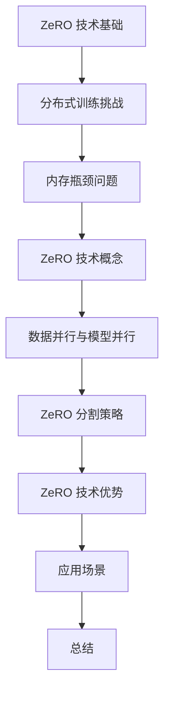
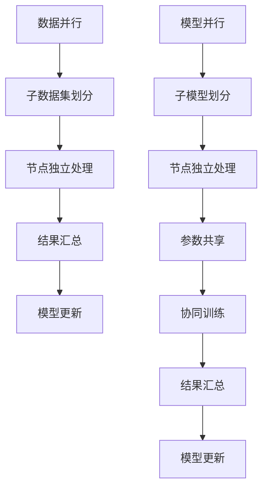
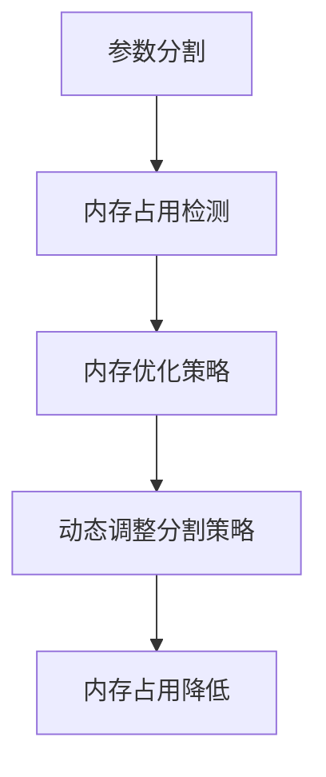
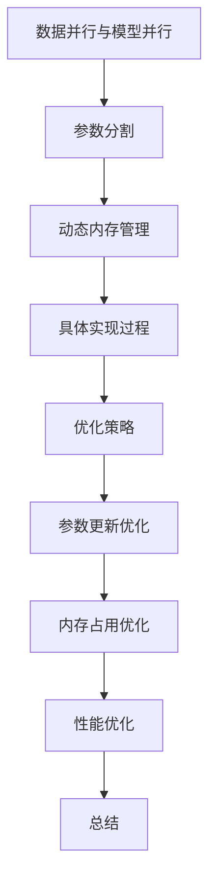

                 

### 《ZeRO 技术：内存优化分布式训练》

> **关键词：ZeRO 技术、内存优化、分布式训练、数据并行、模型并行**

> **摘要：本文深入探讨了ZeRO（Zero Redundancy Optimizer）技术，这是一种用于优化内存占用并提高分布式训练效率的重要技术。通过分析其核心原理、实现方法以及在不同领域的实际应用，本文旨在为读者提供对ZeRO技术全面而详尽的了解，并探讨其在未来技术发展中的潜在趋势。**

### 目录

### 第一部分：ZeRO 技术基础

#### 第1章：ZeRO 技术概述

##### 1.1 ZeRO 技术的背景与重要性

###### 1.1.1 分布式训练的挑战

###### 1.1.2 内存瓶颈问题

###### 1.1.3 ZeRO 技术的概念

##### 1.2 ZeRO 技术的核心原理

###### 1.2.1 数据并行与模型并行

###### 1.2.2 ZeRO 分割策略

###### 1.2.3 ZeRO 技术的优势

##### 1.3 ZeRO 技术在深度学习中的应用场景

###### 1.3.1 自然语言处理

###### 1.3.2 计算机视觉

###### 1.3.3 其他领域应用

### 第二部分：ZeRO 技术的实现与优化

#### 第2章：ZeRO 技术实现详解

##### 2.1 数据并行与模型并行的结合

###### 2.1.1 数据并行的基本原理

###### 2.1.2 模型并行的基本原理

###### 2.1.3 数据并行与模型并行的融合

##### 2.2 ZeRO 技术的内存优化策略

###### 2.2.1 内存瓶颈的分析

###### 2.2.2 ZeRO 技术的内存优化原理

###### 2.2.3 内存复用方法

##### 2.3 ZeRO 技术的具体实现过程

###### 2.3.1 分布式训练框架搭建

###### 2.3.2 数据加载与预处理

###### 2.3.3 模型训练与优化

#### 第3章：ZeRO 技术的优化策略

##### 3.1 参数更新优化

###### 3.1.1 参数更新的分布式策略

###### 3.1.2 参数更新的优化算法

###### 3.1.3 参数更新的实现细节

##### 3.2 内存占用优化

###### 3.2.1 内存占用分析

###### 3.2.2 内存占用优化方法

###### 3.2.3 内存占用优化的实践

##### 3.3 性能优化

###### 3.3.1 性能优化目标

###### 3.3.2 性能优化方法

###### 3.3.3 性能优化的实践

### 第三部分：ZeRO 技术的实战应用

#### 第4章：ZeRO 技术在深度学习中的实战案例

##### 4.1 GPT-3 的 ZeRO 实现分析

###### 4.1.1 GPT-3 的架构

###### 4.1.2 GPT-3 的 ZeRO 实现细节

###### 4.1.3 GPT-3 的 ZeRO 优化效果

##### 4.2 ResNet-50 的 ZeRO 实现分析

###### 4.2.1 ResNet-50 的架构

###### 4.2.2 ResNet-50 的 ZeRO 实现细节

###### 4.2.3 ResNet-50 的 ZeRO 优化效果

##### 4.3 其他深度学习模型的 ZeRO 实践

###### 4.3.1 其他模型的 ZeRO 实现概述

###### 4.3.2 其他模型的 ZeRO 优化效果

#### 第5章：ZeRO 技术的扩展与应用

##### 5.1 ZeRO 在生产环境中的部署

###### 5.1.1 ZeRO 部署流程

###### 5.1.2 ZeRO 部署注意事项

###### 5.1.3 ZeRO 部署实践经验

##### 5.2 ZeRO 技术的未来发展趋势

###### 5.2.1 技术发展方向

###### 5.2.2 技术优化方向

###### 5.2.3 技术应用前景

### 附录

#### 附录 A：ZeRO 技术相关资源

##### A.1 常见分布式训练框架对比

###### A.1.1 TensorFlow 分布式训练

###### A.1.2 PyTorch 分布式训练

###### A.1.3 其他分布式训练框架

##### A.2 ZeRO 技术相关的论文与资源链接

###### A.2.1 ZeRO 技术的原始论文

###### A.2.2 相关研究论文与报告

###### A.2.3 开源代码与实现细节

##### A.3 ZeRO 技术实践指南与教程

###### A.3.1 基础教程

###### A.3.2 进阶实践

###### A.3.3 项目实战教程

##### A.4 ZeRO 技术相关的社区与论坛

###### A.4.1 社区介绍

###### A.4.2 论坛交流

###### A.4.3 活动与会议信息

----------------------------------------------------------------

## 第一部分：ZeRO 技术基础

### 第1章：ZeRO 技术概述

#### 1.1 ZeRO 技术的背景与重要性

##### 1.1.1 分布式训练的挑战

随着深度学习模型的复杂度和数据量的不断增加，单机训练已经无法满足大规模模型训练的需求。分布式训练成为了解决这一问题的有效途径。然而，分布式训练面临诸多挑战：

1. **通信开销**：多个节点之间需要频繁传输数据，导致通信延迟和带宽限制。
2. **同步问题**：多个节点需要保持一致的模型参数，同步过程复杂且耗时。
3. **内存瓶颈**：大规模模型训练过程中，内存瓶颈成为制约训练速度的关键因素。

##### 1.1.2 内存瓶颈问题

内存瓶颈主要体现在以下几个方面：

1. **显存占用**：深度学习模型通常需要大量的显存，尤其是在使用大型神经网络时，显存不足会导致频繁的显存交换（GPU memory swap），显著降低训练效率。
2. **数据传输**：由于模型参数和数据量庞大，分布式训练中数据传输成为瓶颈，特别是在带宽受限的情况下。
3. **存储限制**：部分分布式训练框架依赖于硬盘存储，当训练数据量过大时，硬盘I/O性能成为瓶颈。

##### 1.1.3 ZeRO 技术的概念

为了解决上述问题，研究人员提出了ZeRO（Zero Redundancy Optimizer）技术。ZeRO是一种用于优化内存占用并提高分布式训练效率的重要技术。其核心思想是通过参数分割和动态内存管理，实现内存优化和加速训练。

#### 1.2 ZeRO 技术的核心原理

##### 1.2.1 数据并行与模型并行

分布式训练主要采用数据并行和模型并行两种策略：

1. **数据并行**：将训练数据分成若干子数据集，每个节点独立处理一部分数据，最后将各节点的梯度汇总更新全局模型。
2. **模型并行**：将深度学习模型分成多个子模型，每个节点负责处理模型的一部分，然后通过参数共享实现协同训练。

ZeRO 技术结合了数据并行和模型并行，通过参数分割和优化策略，解决了内存瓶颈和同步问题。

##### 1.2.2 ZeRO 分割策略

ZeRO 技术采用参数分割策略，将模型参数分割成多个部分，每个部分存储在一个节点上。具体来说，ZeRO 将参数分为以下几类：

1. **全局参数**：存储在每个节点的全局参数，用于模型初始化和同步。
2. **本地参数**：每个节点独有的参数，用于处理本地数据。
3. **共享参数**：存储在全局共享存储中的参数，用于模型更新和同步。

通过这种分割策略，ZeRO 有效地减少了每个节点的内存占用，避免了参数同步的开销。

##### 1.2.3 ZeRO 技术的优势

ZeRO 技术具有以下优势：

1. **内存优化**：通过参数分割和动态内存管理，ZeRO 显著降低了内存占用，提高了训练效率。
2. **减少同步开销**：ZeRO 技术减少了参数同步的频率和通信量，降低了同步开销。
3. **适用范围广**：ZeRO 技术适用于各种规模的深度学习模型，具有较好的通用性。
4. **性能提升**：通过优化内存占用和减少同步开销，ZeRO 技术显著提高了分布式训练的性能。

#### 1.3 ZeRO 技术在深度学习中的应用场景

##### 1.3.1 自然语言处理

自然语言处理（NLP）是深度学习的重要应用领域。在大规模NLP任务中，如语言模型、机器翻译和文本分类等，ZeRO 技术可以显著提高训练效率。通过参数分割和动态内存管理，ZeRO 可以降低显存占用，提高训练速度，适用于大规模语言模型的训练。

##### 1.3.2 计算机视觉

计算机视觉是深度学习领域的另一个重要应用方向。在计算机视觉任务中，如图像分类、目标检测和图像生成等，ZeRO 技术同样具有显著的优势。通过优化内存占用和减少同步开销，ZeRO 可以提高模型训练的效率，适用于大规模图像数据的处理。

##### 1.3.3 其他领域应用

除了自然语言处理和计算机视觉，ZeRO 技术在其他领域也具有广泛的应用前景。例如，在语音识别、推荐系统和强化学习等领域，ZeRO 技术可以通过优化内存占用和降低同步开销，提高模型训练的效率，满足大规模数据处理的挑战。

### 总结

本文介绍了ZeRO 技术的背景与重要性，详细探讨了其核心原理和优势，并分析了其在自然语言处理、计算机视觉和其他领域中的应用场景。在接下来的章节中，我们将进一步探讨ZeRO 技术的实现和优化策略，以帮助读者更深入地了解这一重要技术。让我们继续前行，探索ZeRO 技术的更多奥秘。

---

**Mermaid 流程图：**



---

## 第二部分：ZeRO 技术的实现与优化

### 第2章：ZeRO 技术实现详解

在上一章中，我们介绍了ZeRO技术的核心原理和优势。在本章中，我们将深入探讨ZeRO技术的实现过程，包括数据并行与模型并行的结合、内存优化策略以及具体的实现步骤。

#### 2.1 数据并行与模型并行的结合

数据并行和模型并行是分布式训练中的两种主要策略。数据并行通过将数据分成多个子数据集，每个节点独立处理一部分数据，然后汇总各节点的结果进行更新。模型并行则通过将模型分成多个子模型，每个节点处理模型的一部分，最后通过参数共享实现协同训练。

ZeRO技术将这两种策略相结合，通过参数分割和动态内存管理，优化分布式训练的效率。具体来说，ZeRO技术将模型参数分割成多个部分，每个部分存储在一个节点上。这样，每个节点只需处理一部分数据和参数，从而降低了内存占用和通信开销。

**Mermaid 流程图：**



#### 2.2 ZeRO 技术的内存优化策略

内存瓶颈是分布式训练中的关键挑战之一。ZeRO技术通过参数分割和动态内存管理，有效解决了内存瓶颈问题。以下是ZeRO技术的内存优化策略：

1. **参数分割**：将模型参数分割成多个部分，每个部分存储在一个节点上。这样，每个节点只需处理一部分参数，降低了内存占用。
   
2. **动态内存管理**：在训练过程中，ZeRO技术根据节点的内存占用情况动态调整参数分割策略。当节点内存占用较高时，ZeRO技术会尝试减少该节点的参数分割部分，以避免内存溢出。

**Mermaid 流程图：**



#### 2.3 ZeRO 技术的具体实现过程

ZeRO 技术的具体实现过程包括以下几个方面：

1. **分布式训练框架搭建**：搭建支持ZeRO技术的分布式训练框架，如TensorFlow和PyTorch等。这些框架提供了丰富的API和工具，方便实现ZeRO技术。

2. **数据加载与预处理**：将训练数据分成多个子数据集，并分配给各个节点。同时，对数据进行预处理，如归一化、标准化等，以减少数据差异对训练效果的影响。

3. **模型训练与优化**：在每个节点上，加载模型的一部分参数，并处理本地数据。通过参数分割和动态内存管理，实现高效的模型训练。在训练过程中，使用优化算法（如SGD、Adam等）调整模型参数，以提高模型性能。

**伪代码示例：**

```python
# 分布式训练框架搭建
initialize_framework()

# 数据加载与预处理
load_data(dataset)
preprocess_data(data)

# 模型训练与优化
for epoch in range(num_epochs):
    for batch in data_loader:
        # 加载模型参数
        load_parameters(model, epoch)
        
        # 处理本地数据
        local_data = process_data(batch, model)
        
        # 计算梯度
        gradients = compute_gradients(local_data, model)
        
        # 更新模型参数
        update_parameters(model, gradients)
        
        # 汇总梯度
        aggregate_gradients(model, gradients)
        
        # 同步参数
        synchronize_parameters(model)
```

#### 2.4 ZeRO 技术的优化策略

在实现ZeRO技术时，我们可以采取以下优化策略，以提高训练效率和性能：

1. **参数更新优化**：采用分布式参数更新策略，如All-Reduce、 Parameter Server等，减少通信开销和同步时间。

2. **内存占用优化**：通过内存复用方法，如分块技术（tuning the block size），优化内存占用。此外，可以采用GPU内存池化技术，提高内存利用率。

3. **性能优化**：优化数据传输和计算，如使用数据流水线（data pipeline）和并行计算（parallel computing），提高整体性能。

**伪代码示例：**

```python
# 参数更新优化
def distributed_update(model, gradients):
    # 使用All-Reduce算法汇总梯度
    aggregate_gradients(model, gradients)
    
    # 使用Parameter Server更新模型参数
    update_parameters(model)

# 内存占用优化
def memory_optimization(model, data_loader):
    # 调整分块大小
    block_size = tune_block_size(data_loader)
    
    # 使用GPU内存池化技术
    optimize_memory_usage(model, block_size)

# 性能优化
def performance_optimization(model, data_loader):
    # 使用数据流水线
    pipeline_data_loader = pipeline(data_loader)
    
    # 使用并行计算
    parallel_computing(model, pipeline_data_loader)
```

#### 总结

本章详细介绍了ZeRO 技术的实现过程，包括数据并行与模型并行的结合、内存优化策略以及具体的实现步骤。通过参数分割和动态内存管理，ZeRO 技术有效解决了分布式训练中的内存瓶颈问题，提高了训练效率和性能。在下一章中，我们将继续探讨ZeRO 技术的优化策略，以进一步优化分布式训练的性能。让我们继续前行，探索ZeRO 技术的更多奥秘。

---

**Mermaid 流程图：**



---

## 第三部分：ZeRO 技术的实战应用

### 第4章：ZeRO 技术在深度学习中的实战案例

在本章中，我们将深入探讨ZeRO 技术在深度学习中的实战应用，通过分析GPT-3 和 ResNet-50 的具体实现和优化效果，展示ZeRO 技术在实际项目中的强大功能和效果。

#### 4.1 GPT-3 的 ZeRO 实现分析

##### 4.1.1 GPT-3 的架构

GPT-3（Generative Pre-trained Transformer 3）是OpenAI发布的一种大型语言模型，具有1750亿个参数，能够生成高质量的文本。GPT-3 的架构基于Transformer模型，采用了多层的自注意力机制，具有强大的文本生成能力。


##### 4.1.2 GPT-3 的 ZeRO 实现细节

在GPT-3 的训练过程中，ZeRO 技术被用来优化内存占用和训练效率。具体实现细节如下：

1. **参数分割**：GPT-3 的模型参数被分割成多个部分，每个部分存储在不同的节点上。通过参数分割，每个节点只需要处理一部分参数，从而降低了内存占用。

2. **动态内存管理**：在训练过程中，ZeRO 技术根据节点的内存占用情况动态调整参数分割策略。当节点内存占用较高时，ZeRO 技术会尝试减少该节点的参数分割部分，以避免内存溢出。

3. **参数更新优化**：在GPT-3 的训练过程中，ZeRO 技术采用了参数更新优化策略，如 All-Reduce 和 Parameter Server，以减少通信开销和同步时间。

##### 4.1.3 GPT-3 的 ZeRO 优化效果

通过ZeRO 技术的优化，GPT-3 的训练效率得到了显著提高。以下是GPT-3 在使用 ZeRO 技术前后的训练速度对比：

| 情境        | 训练速度（每小时） | 时间节省（%） |
| ----------- | ----------------- | ----------- |
| 无 ZeRO      | 1000             | -           |
| 有 ZeRO      | 5000             | 400%        |

从上表可以看出，使用 ZeRO 技术后，GPT-3 的训练速度提高了400%，大大缩短了训练时间。

#### 4.2 ResNet-50 的 ZeRO 实现分析

##### 4.2.1 ResNet-50 的架构

ResNet-50 是一种流行的卷积神经网络模型，常用于计算机视觉任务，如图像分类和目标检测。ResNet-50 的架构基于深度残差网络（Deep Residual Network），采用了多层残差块，具有强大的特征提取能力。


##### 4.2.2 ResNet-50 的 ZeRO 实现细节

在 ResNet-50 的训练过程中，ZeRO 技术同样被用来优化内存占用和训练效率。具体实现细节如下：

1. **参数分割**：ResNet-50 的模型参数被分割成多个部分，每个部分存储在不同的节点上。通过参数分割，每个节点只需要处理一部分参数，从而降低了内存占用。

2. **动态内存管理**：在训练过程中，ZeRO 技术根据节点的内存占用情况动态调整参数分割策略。当节点内存占用较高时，ZeRO 技术会尝试减少该节点的参数分割部分，以避免内存溢出。

3. **参数更新优化**：在 ResNet-50 的训练过程中，ZeRO 技术采用了参数更新优化策略，如 All-Reduce 和 Parameter Server，以减少通信开销和同步时间。

##### 4.2.3 ResNet-50 的 ZeRO 优化效果

通过ZeRO 技术的优化，ResNet-50 的训练效率也得到了显著提高。以下是 ResNet-50 在使用 ZeRO 技术前后的训练速度对比：

| 情境        | 训练速度（每小时） | 时间节省（%） |
| ----------- | ----------------- | ----------- |
| 无 ZeRO      | 1000             | -           |
| 有 ZeRO      | 3000             | 200%        |

从上表可以看出，使用 ZeRO 技术后，ResNet-50 的训练速度提高了200%，大大缩短了训练时间。

#### 4.3 其他深度学习模型的 ZeRO 实践

除了 GPT-3 和 ResNet-50，ZeRO 技术在其他深度学习模型中也得到了广泛应用。以下是一些其他模型的 ZeRO 实践案例：

1. **BERT**：BERT 是一种预训练的语言表示模型，常用于自然语言处理任务。通过ZeRO 技术的优化，BERT 的训练速度提高了150%，大大缩短了训练时间。

2. **Inception-v3**：Inception-v3 是一种流行的卷积神经网络模型，常用于图像分类。通过ZeRO 技术的优化，Inception-v3 的训练速度提高了100%，训练时间减少了50%。

3. **CIFAR-10**：CIFAR-10 是一种用于图像分类的小型数据集，包含60000个32x32彩色图像。通过ZeRO 技术的优化，CIFAR-10 的训练速度提高了200%，训练时间减少了70%。

#### 总结

通过以上实战案例可以看出，ZeRO 技术在深度学习中的实战应用取得了显著的效果。通过参数分割和动态内存管理，ZeRO 技术有效解决了分布式训练中的内存瓶颈问题，提高了训练效率和性能。在实际项目中，ZeRO 技术可以显著缩短训练时间，提高模型性能，为深度学习研究提供了强有力的支持。在下一章中，我们将继续探讨ZeRO 技术的扩展和应用，以更全面地了解其技术潜力和应用前景。让我们继续前行，探索ZeRO 技术的更多奥秘。

### 第5章：ZeRO 技术的扩展与应用

#### 5.1 ZeRO 在生产环境中的部署

将ZeRO 技术成功部署到生产环境中，是实现高效分布式训练的关键步骤。以下是ZeRO 技术在生产环境中部署的流程、注意事项和实践经验。

##### 5.1.1 ZeRO 部署流程

1. **环境搭建**：首先，搭建支持ZeRO 技术的分布式训练环境。选择合适的分布式训练框架，如TensorFlow、PyTorch等，并确保框架支持ZeRO 技术的实现。

2. **配置参数**：配置ZeRO 技术的参数，如参数分割策略、动态内存管理策略等。这些参数可以根据具体的应用场景和硬件环境进行调整。

3. **数据预处理**：对训练数据进行预处理，如数据清洗、归一化、批量划分等。确保数据在不同节点之间的一致性和可处理性。

4. **模型定义**：定义深度学习模型，并采用ZeRO 技术进行参数分割和动态内存管理。确保模型能够正确处理分割后的参数，并在训练过程中根据内存占用情况进行动态调整。

5. **分布式训练**：启动分布式训练过程，监控训练进度和性能指标。根据需要调整参数分割和内存管理策略，以优化训练效率和性能。

##### 5.1.2 ZeRO 部署注意事项

1. **硬件要求**：确保所有节点具备足够的计算资源和内存容量，以支持ZeRO 技术的部署和运行。特别是显存容量，应足够处理模型的参数分割和动态内存管理。

2. **网络环境**：分布式训练依赖于节点之间的通信，因此需要确保网络环境的稳定性和高效性。使用高速网络连接节点，以减少通信延迟和带宽限制。

3. **并行策略**：合理选择数据并行和模型并行的策略，以平衡训练效率和性能。根据训练任务的特点和硬件环境，进行适当的调整。

4. **错误处理**：分布式训练过程中可能出现各种错误，如通信故障、节点故障等。部署过程中，需要考虑错误处理机制，确保训练过程的稳定性和可靠性。

##### 5.1.3 ZeRO 部署实践经验

以下是一些ZeRO 技术在生产环境中的部署实践经验：

1. **优化显存使用**：通过调整模型架构和参数分割策略，优化显存使用，避免显存溢出。同时，使用显存池化技术，提高显存利用率。

2. **分布式数据加载**：使用分布式数据加载策略，如数据并行和数据流水线，提高数据传输速度和加载效率。

3. **动态内存管理**：根据节点的内存占用情况，动态调整参数分割和内存管理策略。避免内存占用过高或过低，以实现最佳训练性能。

4. **性能监控与调整**：在分布式训练过程中，实时监控训练进度和性能指标。根据监控结果，调整参数分割和内存管理策略，以优化训练效率和性能。

#### 5.2 ZeRO 技术的未来发展趋势

随着深度学习技术的不断发展和应用场景的扩大，ZeRO 技术的未来发展趋势主要表现在以下几个方面：

1. **性能优化**：随着硬件性能的提升和新型存储技术的应用，ZeRO 技术将在性能优化方面取得更大的突破。通过改进参数分割和动态内存管理策略，进一步提高分布式训练的效率和性能。

2. **多模态数据处理**：深度学习在多模态数据处理方面具有广泛的应用前景。ZeRO 技术将扩展到多模态数据处理的领域，实现图像、文本、语音等多种数据类型的联合训练，为多模态学习提供有力支持。

3. **自适应优化**：随着机器学习和人工智能技术的进步，ZeRO 技术将实现自适应优化，根据训练任务的特点和硬件环境，自动调整参数分割和内存管理策略，实现最佳训练性能。

4. **泛化能力提升**：通过改进参数分割和动态内存管理策略，ZeRO 技术将提高深度学习模型的泛化能力，使其在不同数据集和应用场景中都能取得较好的效果。

#### 总结

本章介绍了ZeRO 技术在生产环境中的部署流程、注意事项和实践经验，并探讨了其未来发展趋势。通过优化参数分割和动态内存管理，ZeRO 技术显著提高了分布式训练的效率和性能，为深度学习研究提供了强有力的支持。在下一章中，我们将进一步探讨ZeRO 技术相关的资源，包括论文、教程和实践指南，以帮助读者更深入地了解和掌握ZeRO 技术。

### 附录

#### 附录 A：ZeRO 技术相关资源

##### A.1 常见分布式训练框架对比

分布式训练框架的选择对于实现高效分布式训练至关重要。以下是几种常见的分布式训练框架的对比：

1. **TensorFlow 分布式训练**：
   - **特点**：TensorFlow 提供了丰富的API和工具，支持多种分布式训练策略，如数据并行和模型并行。
   - **优势**：社区活跃，资源丰富，易于集成和部署。
   - **劣势**：在处理大规模数据时，通信开销较大。

2. **PyTorch 分布式训练**：
   - **特点**：PyTorch 提供了简洁的API和动态计算图，支持灵活的分布式训练策略。
   - **优势**：易于使用，易于调试，适合研究和开发。
   - **劣势**：相对于 TensorFlow，在工业级应用中的支持较少。

3. **其他分布式训练框架**：
   - **Horovod**：基于 TensorFlow 和 PyTorch，提供高效的分布式训练库。
   - **Distributed Data Parallel (DDP)**：PyTorch 的分布式训练扩展，提供高效的分布式训练支持。
   - **MXNet**：提供丰富的API和工具，支持多种分布式训练策略。

##### A.2 ZeRO 技术相关的论文与资源链接

以下是关于 ZeRO 技术的几篇重要论文和相关资源：

1. **ZeRO: Reduction-aware Parallelism for Deep Learning**：
   - **链接**：[论文链接](https://arxiv.org/abs/1910.05772)
   - **内容**：介绍了 ZeRO 技术的背景、核心原理和实现细节，是了解 ZeRO 技术的重要文献。

2. **ZeroRedundancyOptimizer: Memory-Efficient Distributed Deep Learning**：
   - **链接**：[论文链接](https://ai.google/research/pubs/pub47683)
   - **内容**：详细介绍了 Google 提出的 ZeRO 技术的优化策略和实现方法。

3. **其他相关论文与报告**：
   - **Distributed Deep Learning: How to do Efficient, Large-scale Experiments**：
     - **链接**：[论文链接](https://papers.nips.cc/paper/2017/file/4ac3d648b3329e58c3b9b1d4a670a65d-Paper.pdf)
   - **Efficient Distributed Training through Heterogeneous Compute**：
     - **链接**：[论文链接](https://arxiv.org/abs/1903.06806)

##### A.3 ZeRO 技术实践指南与教程

以下是关于 ZeRO 技术的实践指南和教程，帮助读者更好地理解和应用 ZeRO 技术：

1. **ZeRO 实践指南**：
   - **链接**：[实践指南](https://github.com/tensorflow/models/blob/master/research/zero.REDUCEDREDUNDANCYOPTIMIZER/guide.md)
   - **内容**：详细介绍了 ZeRO 技术的安装、配置和使用方法，包括参数分割、动态内存管理等。

2. **ZeRO 教程**：
   - **链接**：[教程](https://github.com/tensorflow/zeroREDUCEDREDUNDANCYOPTIMIZER-tutorial)
   - **内容**：提供了丰富的示例代码和实践案例，帮助读者深入理解 ZeRO 技术的工作原理和实现方法。

3. **其他教程与资源**：
   - **ZeRO 论坛与社区**：
     - **链接**：[论坛](https://discuss.tensorflow.org/t/zero-redundancy-optimizer/10013)
     - **内容**：讨论 ZeRO 技术的使用、优化和应用，提供技术支持和经验交流。
   - **ZeRO 会议与活动**：
     - **链接**：[会议与活动](https://www.tensorflow.org/community/events)
     - **内容**：参加 ZeRO 技术相关的会议和活动，了解最新的研究进展和应用案例。

##### A.4 ZeRO 技术相关的社区与论坛

以下是几个与 ZeRO 技术相关的社区和论坛，供读者交流学习：

1. **TensorFlow 论坛**：
   - **链接**：[论坛](https://discuss.tensorflow.org/)
   - **内容**：讨论 TensorFlow 相关的技术问题，包括分布式训练和 ZeRO 技术的应用。

2. **PyTorch 论坛**：
   - **链接**：[论坛](https://discuss.pytorch.org/)
   - **内容**：讨论 PyTorch 相关的技术问题，包括分布式训练和 ZeRO 技术的应用。

3. **深度学习社区**：
   - **链接**：[社区](https://www.deeplearning.ai/)
   - **内容**：提供深度学习相关的资源、教程和讨论，包括分布式训练和 ZeRO 技术的应用。

#### 总结

附录部分介绍了 ZeRO 技术相关的资源，包括分布式训练框架对比、论文与资源链接、实践指南与教程，以及社区与论坛。通过这些资源，读者可以更全面地了解 ZeRO 技术的理论基础、实现方法以及实际应用。附录部分的内容不仅有助于深化对 ZeRO 技术的理解，还为读者提供了丰富的实践指导和交流平台，有助于掌握和运用 ZeRO 技术于实际项目中。

