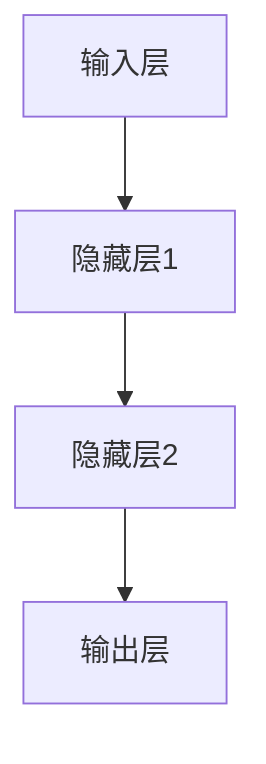

                 

### 《【大模型应用开发 动手做AI Agent】第一轮行动：工具执行搜索》

> **关键词**：大模型、AI Agent、工具、搜索、应用开发

> **摘要**：本文将深入探讨大模型在AI Agent开发中的应用，以及如何通过工具执行搜索来提高开发效率。我们将从大模型的基础知识开始，逐步介绍工具环境搭建、算法原理、应用实践，并展示如何动手实现AI Agent。通过本文，读者将了解大模型的核心概念、工具使用、算法实现，以及AI Agent的设计与优化，为未来的大模型应用开发奠定坚实基础。

### 引言

近年来，人工智能（AI）技术取得了飞速发展，大模型作为AI领域的重要突破，已经深刻地改变了我们的生活方式和工作模式。大模型具有处理大规模数据、生成复杂任务的能力，这使得其在各个领域都展现出了巨大的潜力。而AI Agent作为大模型在特定任务中的应用，正逐步走向我们的日常生活。例如，智能客服、自动驾驶、智能推荐等，都是AI Agent在实际中的应用场景。

本文将带领读者进行一次大模型应用开发的探索之旅，从工具执行搜索的第一步开始，逐步深入到AI Agent的设计与实现。我们将首先介绍大模型的基础知识，包括其定义、分类、发展历程等；然后，探讨如何搭建开发环境，并介绍主流大模型工具；接着，讲解大模型的核心算法原理，包括神经网络基础、训练技巧等；最后，我们将通过实际应用案例，展示如何使用大模型开发AI Agent，并进行评估与优化。通过这篇文章，读者将系统地了解大模型在AI Agent开发中的应用，为未来的探索奠定基础。

### 第一部分：大模型基础知识与工具

在正式开始大模型应用开发之前，我们需要先了解大模型的基础知识，包括其定义、分类和发展历程。这不仅有助于我们深入理解大模型的技术原理，还能为后续的工具使用和算法实现奠定基础。

#### 第1章：大模型概述

##### 1.1 大模型的定义与分类

大模型（Large-scale Models）是指具有非常大量参数的机器学习模型，它们能够处理海量数据并生成复杂的任务结果。大模型通常是基于深度学习技术，包括神经网络、循环神经网络（RNN）、变换器（Transformer）等。根据不同的分类标准，大模型可以有多种分类方式。

- **根据模型规模**：大模型可以分为小模型、中等模型和大模型。小模型通常拥有数百万个参数，而大模型则拥有数亿甚至数万亿个参数。

- **根据任务类型**：大模型可以分为通用模型和专用模型。通用模型如GPT-3、BERT等，能够处理多种任务；专用模型如BERT用于文本分类、ViT用于图像分类等，针对特定任务进行优化。

- **根据模型架构**：大模型可以分为传统神经网络、循环神经网络（RNN）、长短时记忆网络（LSTM）、门控循环单元（GRU）和变换器（Transformer）等。

##### 1.1.1 大模型的定义

大模型是指具有非常大量参数的机器学习模型，能够处理海量数据并生成复杂任务结果。

##### 1.1.2 大模型的分类

- **小模型**：具有数百万个参数的模型。
- **大模型**：具有数亿至数千亿个参数的模型。
- **超大模型**：具有数万亿个参数的模型。

##### 1.1.3 大模型的发展历程

大模型的发展历程可以追溯到20世纪80年代，当时研究人员开始尝试使用神经网络来模拟人类大脑。随着计算能力的提升和大数据时代的到来，深度学习技术得到了迅速发展，大模型应运而生。

- **20世纪80年代**：神经网络初期探索，如BP算法的提出。
- **2006年**：Hinton等人提出深度信念网络（DBN），标志着深度学习的发展。
- **2012年**：AlexNet在ImageNet比赛中取得突破性成绩，深度学习开始崭露头角。
- **2017年**：Transformer模型的出现，推动了大模型的发展。
- **2020年**：GPT-3等大规模语言模型问世，大模型的应用进入了新阶段。

##### 1.2 大模型在AI中的重要性

大模型在AI中的重要性不言而喻，主要体现在以下几个方面：

- **处理大规模数据**：大模型能够处理海量的数据，这使得它们在许多领域（如自然语言处理、计算机视觉等）具有广泛应用。
- **生成复杂任务结果**：大模型具有强大的生成能力，能够生成高质量的文本、图像、视频等，提高了AI系统的智能化水平。
- **提高任务性能**：大模型在许多任务上取得了比传统模型更好的性能，如文本分类、图像识别、语音识别等。

然而，大模型的发展也面临着挑战，如计算资源消耗、模型压缩与加速、数据安全与隐私等问题。这些问题需要通过技术创新和实践经验来解决。

##### 1.2.1 大模型在AI中的应用

大模型在AI中的应用非常广泛，主要包括以下领域：

- **自然语言处理**：大模型如BERT、GPT等在文本分类、问答系统、机器翻译等领域取得了显著成果。
- **计算机视觉**：大模型如ResNet、Inception等在图像分类、目标检测、图像生成等领域表现优异。
- **语音识别**：大模型如WaveNet、Transformer在语音识别、语音合成等领域发挥了重要作用。
- **推荐系统**：大模型在推荐系统中的应用，如基于内容的推荐、协同过滤等，大大提高了推荐质量。

##### 1.2.2 大模型的优势与挑战

大模型具有以下优势：

- **强大的生成能力**：大模型能够生成高质量的文本、图像、视频等，提高了AI系统的智能化水平。
- **处理大规模数据**：大模型能够处理海量的数据，这使得它们在许多领域具有广泛应用。
- **提高任务性能**：大模型在许多任务上取得了比传统模型更好的性能。

然而，大模型也面临着挑战：

- **计算资源消耗**：大模型通常需要大量的计算资源，这对硬件设备提出了较高的要求。
- **模型压缩与加速**：如何压缩模型并提高其运行效率是一个重要问题。
- **数据安全与隐私**：大模型在处理数据时，可能会涉及用户隐私，如何确保数据安全是一个重要挑战。

#### 第2章：大模型工具与环境搭建

要开发和应用大模型，我们需要选择合适的工具，并搭建适合的开发环境。这一章将介绍主流的大模型工具，包括TensorFlow、PyTorch等，以及如何进行硬件和软件的安装与配置。

##### 2.1 主流大模型工具介绍

目前，TensorFlow和PyTorch是两大主流的大模型工具，它们具有广泛的用户基础和丰富的生态资源。

- **TensorFlow**：由Google开发，是一个开源的端到端机器学习平台。TensorFlow支持多种编程语言，包括Python、C++和Java，能够运行在多种硬件平台上，如CPU、GPU和TPU。TensorFlow具有强大的图计算能力，可以方便地进行模型构建、训练和部署。

- **PyTorch**：由Facebook开发，是一个开源的Python科学计算库。PyTorch以其灵活的动态计算图和易于理解的用户界面而受到欢迎。PyTorch支持GPU加速，可以进行高效的大规模数据处理和模型训练。

除了TensorFlow和PyTorch，还有其他一些大模型工具，如MXNet、Keras等，它们也具有各自的特点和优势。

##### 2.1.1 TensorFlow

TensorFlow的主要特点包括：

- **动态计算图**：TensorFlow使用动态计算图，这使得模型构建和调试更加灵活。
- **高效计算**：TensorFlow支持GPU和TPU加速，能够高效地处理大规模数据。
- **丰富的生态**：TensorFlow拥有丰富的库和工具，如TensorFlow Serving、TensorFlow Lite等，可以方便地进行模型部署和优化。
- **广泛的应用**：TensorFlow在自然语言处理、计算机视觉、推荐系统等领域都有广泛应用。

##### 2.1.2 PyTorch

PyTorch的主要特点包括：

- **动态计算图**：PyTorch使用动态计算图，这使得模型构建和调试更加灵活。
- **易于理解**：PyTorch的用户界面简洁易懂，适合初学者和研究人员。
- **高效计算**：PyTorch支持GPU加速，可以进行高效的大规模数据处理和模型训练。
- **丰富的生态**：PyTorch拥有丰富的库和工具，如torchvision、torchaudio等，可以方便地进行数据加载和处理。

##### 2.1.3 其他大模型工具

- **MXNet**：Apache MXNet是一个开源的深度学习框架，由Apache软件基金会维护。MXNet支持多种编程语言，包括Python、R、Java等，具有良好的可扩展性和灵活性。

- **Keras**：Keras是一个高级神经网络API，能够运行在TensorFlow、Theano和MXNet等后端之上。Keras以用户友好和简洁著称，适合快速原型开发和实验。

##### 2.2 开发环境搭建

要使用大模型工具进行开发，我们需要搭建适合的开发环境。以下将介绍如何进行硬件和软件的安装与配置。

###### 2.2.1 硬件要求

- **CPU**：大多数大模型工具对CPU的性能要求较高，建议使用Intel i7或以上的处理器。
- **GPU**：GPU对于大模型的训练和推理具有显著的加速效果，建议使用NVIDIA的GPU，如Tesla V100、A100等。
- **TPU**：对于需要大规模训练和推理的任务，TPU（Tensor Processing Unit）是一个更好的选择。

###### 2.2.2 软件安装

- **操作系统**：大多数大模型工具支持Linux操作系统，如Ubuntu、CentOS等。
- **编译器**：Python是大多数大模型工具的主要编程语言，需要安装Python环境和相应的编译器，如GCC、Clang等。
- **依赖库**：根据所选工具的不同，需要安装相应的依赖库，如CUDA、cuDNN、OpenBLAS等。

###### 2.2.3 环境配置

在安装完操作系统和所需软件后，我们需要进行环境配置。

- **Python环境**：使用conda或virtualenv等工具创建Python虚拟环境，以便管理和隔离不同项目的环境。
- **工具安装**：使用pip或conda安装所选工具，如TensorFlow、PyTorch等。
- **GPU支持**：对于使用GPU进行训练的任务，需要安装CUDA和cuDNN等GPU支持库。

#### 第3章：大模型算法原理

了解大模型的算法原理是开发高效AI应用的关键。在这一章中，我们将深入探讨神经网络的基础知识，包括其结构、前向传播与反向传播算法，以及损失函数与优化器。

##### 3.1 神经网络基础

神经网络（Neural Networks）是模仿生物神经系统的计算模型，由大量的神经元（也称为节点或单元）连接而成。每个神经元接收输入信号，通过加权求和处理，产生输出信号。

###### 3.1.1 神经网络的结构

神经网络通常包括以下几个部分：

- **输入层**：接收外部输入信号。
- **隐藏层**：对输入信号进行加工和处理。
- **输出层**：产生最终输出信号。

一个简单的神经网络结构如下图所示：



在神经网络中，每个节点之间的连接都带有权重（weight），这些权重决定了信号在传播过程中的强度。

###### 3.1.2 前向传播与反向传播算法

神经网络通过前向传播（forward propagation）和反向传播（backward propagation）来更新权重和偏置，以最小化损失函数。

- **前向传播**：输入信号通过网络从输入层流向输出层，每个节点根据其权重和激活函数计算输出。
  
  前向传播的伪代码如下：

  ```python
  for each layer in network:
      for each neuron in layer:
          input = weighted sum of previous layer's outputs
          output = activation_function(input)
  ```

- **反向传播**：在输出层计算损失后，网络通过反向传播算法更新权重和偏置。

  反向传播的伪代码如下：

  ```python
  for each layer in network (in reverse order):
      for each neuron in layer:
          delta = (output - target) * activation_function_derivative(output)
          weight_grad = delta * input
          bias_grad = delta
  ```

通过多次迭代前向传播和反向传播，神经网络能够不断调整权重和偏置，以最小化损失函数。

###### 3.1.3 损失函数与优化器

在神经网络训练过程中，损失函数（loss function）用于衡量模型预测值与真实值之间的差异。常见的损失函数包括均方误差（MSE）、交叉熵（Cross-Entropy）等。

- **均方误差（MSE）**：用于回归任务，计算预测值与真实值之间差的平方的平均值。

  $$MSE = \frac{1}{n} \sum_{i=1}^{n} (y_i - \hat{y}_i)^2$$

- **交叉熵（Cross-Entropy）**：用于分类任务，计算预测概率与真实标签之间的交叉熵。

  $$H(y, \hat{y}) = -\sum_{i=1}^{n} y_i \log(\hat{y}_i)$$

优化器（optimizer）用于更新权重和偏置，以最小化损失函数。常见的优化器包括梯度下降（Gradient Descent）、动量梯度下降（Momentum）、Adam等。

- **梯度下降**：更新权重和偏置的梯度方向，并沿梯度方向进行步长更新。

  $$\theta = \theta - \alpha \cdot \nabla_\theta J(\theta)$$

- **动量梯度下降**：在梯度下降的基础上引入动量，以加速收敛。

  $$v = \beta v + (1 - \beta) \nabla_\theta J(\theta)$$
  $$\theta = \theta - \alpha v$$

- **Adam**：结合了动量和RMSProp的优化器，能够自适应调整学习率。

  $$m_t = \beta_1 x_t + (1 - \beta_1) (x_t - \min_{i} x_i)$$
  $$v_t = \beta_2 x_t + (1 - \beta_2) (x_t^2 - \min_{i} x_i^2)$$
  $$\theta = \theta - \alpha \frac{m_t}{\sqrt{v_t} + \epsilon}$$

通过选择合适的损失函数和优化器，可以有效地提高神经网络训练的效果。

### 第二部分：大模型应用实践

在掌握了大模型的基础知识和算法原理后，接下来我们将通过实际应用案例来展示如何使用大模型解决实际问题。这一部分将涵盖文本分类和对话系统两个应用领域，通过具体案例讲解如何搭建开发环境、数据处理、模型训练和评估。

#### 第4章：文本分类应用

文本分类是自然语言处理（NLP）领域中的一个重要任务，它将文本数据按照预定义的类别进行分类。文本分类的应用场景广泛，包括情感分析、垃圾邮件检测、新闻分类等。

##### 4.1 数据集选择与预处理

文本分类首先需要选择合适的数据集。常见的数据集包括IMDB电影评论、Twitter情感分析、新闻分类等。以IMDB电影评论数据集为例，该数据集包含了25,000条评论，分为正面和负面两类。

数据预处理是文本分类的关键步骤，主要包括文本清洗、分词、去停用词等。

- **文本清洗**：去除文本中的HTML标签、特殊字符和空白符。
- **分词**：将文本分割成单词或子词。
- **去停用词**：去除对分类没有贡献的常见单词，如“的”、“了”、“是”等。

在预处理过程中，可以使用Python的nltk库、spaCy库等工具进行文本处理。

```python
import nltk
from nltk.corpus import stopwords
from nltk.tokenize import word_tokenize

nltk.download('punkt')
nltk.download('stopwords')

# 文本清洗
def clean_text(text):
    text = re.sub('<.*?>', '', text)  # 去除HTML标签
    text = text.lower()  # 转小写
    text = re.sub(r'\s+', ' ', text)  # 去除多余的空白符
    return text

# 分词
def tokenize(text):
    tokens = word_tokenize(text)
    return tokens

# 去停用词
def remove_stopwords(tokens):
    stop_words = set(stopwords.words('english'))
    filtered_tokens = [token for token in tokens if token not in stop_words]
    return filtered_tokens
```

##### 4.1.2 模型训练与评估

在数据预处理完成后，我们可以使用预训练的模型（如BERT、GPT等）进行文本分类。这些预训练模型在大量的文本数据上进行了训练，能够捕捉到文本中的语义信息。

以BERT为例，我们可以使用TensorFlow或PyTorch的API来加载BERT模型，并进行微调。

```python
from transformers import BertTokenizer, TFBertForSequenceClassification
import tensorflow as tf

# 加载BERT模型
tokenizer = BertTokenizer.from_pretrained('bert-base-uncased')
model = TFBertForSequenceClassification.from_pretrained('bert-base-uncased', num_labels=2)

# 准备输入数据
inputs = tokenizer("Hello, my dog is cute", return_tensors="tf")

# 模型训练
optimizer = tf.keras.optimizers.Adam(learning_rate=3e-5)
model.compile(optimizer=optimizer, loss=tf.keras.losses.SparseCategoricalCrossentropy(from_logits=True), metrics=['accuracy'])

# 训练模型
model.fit(train_dataset, epochs=3, validation_data=validation_dataset)

# 模型评估
test_loss, test_acc = model.evaluate(test_dataset)
print(f"Test accuracy: {test_acc}")
```

在模型训练过程中，我们使用交叉熵损失函数进行分类任务，并使用Adam优化器更新模型参数。

##### 4.1.3 模型应用示例

完成模型训练后，我们可以使用训练好的模型对新的评论进行分类。

```python
# 加载训练好的模型
model.load_weights('model_weights.h5')

# 对新评论进行分类
new_review = "This movie was absolutely terrible!"
inputs = tokenizer(new_review, return_tensors="tf")

# 预测结果
predictions = model.predict(inputs)
predicted_label = tf.argmax(predictions, axis=1).numpy()

# 输出分类结果
if predicted_label == 0:
    print("Negative")
else:
    print("Positive")
```

通过上述示例，我们可以看到如何使用大模型进行文本分类任务。在实际应用中，我们可以根据具体需求调整模型结构和参数，以获得更好的分类效果。

#### 第5章：对话系统应用

对话系统是人工智能领域的一个重要分支，它模拟人类的对话过程，能够与用户进行自然、流畅的交互。对话系统的应用场景广泛，包括智能客服、语音助手、聊天机器人等。

##### 5.1 对话系统概述

对话系统通常包括以下几个关键组件：

- **对话管理**：负责管理对话流程，包括理解用户意图、生成回答等。
- **自然语言理解**：将用户输入的自然语言转换为机器可以理解的结构化数据。
- **自然语言生成**：将机器生成的回答转换为自然语言文本。
- **知识管理**：存储和管理与对话相关的知识库。

##### 5.1.1 对话系统的工作流程

对话系统的工作流程通常包括以下几个步骤：

1. **输入处理**：接收用户输入的自然语言文本。
2. **意图识别**：通过自然语言处理技术识别用户的意图。
3. **实体识别**：从用户输入中提取关键信息，如时间、地点、人名等。
4. **对话管理**：根据用户意图和当前对话状态，生成合适的回答。
5. **回答生成**：使用自然语言生成技术生成自然、流畅的回答。
6. **回答输出**：将生成的回答输出给用户。

##### 5.1.2 模型训练与评估

在对话系统开发中，通常使用预训练的模型（如BERT、GPT等）进行意图识别和回答生成。以下是一个简单的对话系统实现示例：

```python
from transformers import BertTokenizer, TFBertForSequenceClassification
import tensorflow as tf

# 加载BERT模型
tokenizer = BertTokenizer.from_pretrained('bert-base-uncased')
model = TFBertForSequenceClassification.from_pretrained('bert-base-uncased', num_labels=num_intents)

# 准备输入数据
inputs = tokenizer("What is your favorite color?", return_tensors="tf")

# 模型训练
optimizer = tf.keras.optimizers.Adam(learning_rate=3e-5)
model.compile(optimizer=optimizer, loss=tf.keras.losses.SparseCategoricalCrossentropy(from_logits=True), metrics=['accuracy'])

# 训练模型
model.fit(train_dataset, epochs=3, validation_data=validation_dataset)

# 模型评估
test_loss, test_acc = model.evaluate(test_dataset)
print(f"Test accuracy: {test_acc}")
```

在模型训练过程中，我们使用交叉熵损失函数进行分类任务，并使用Adam优化器更新模型参数。

##### 5.1.3 模型应用示例

完成模型训练后，我们可以使用训练好的模型进行意图识别和回答生成。

```python
# 加载训练好的模型
model.load_weights('model_weights.h5')

# 对话管理
while True:
    user_input = input("Ask me something: ")
    inputs = tokenizer(user_input, return_tensors="tf")

    # 预测意图
    predictions = model.predict(inputs)
    predicted_intent = tf.argmax(predictions, axis=1).numpy()

    # 根据意图生成回答
    if predicted_intent == 0:
        response = "I'm not sure what you mean."
    elif predicted_intent == 1:
        response = "My favorite color is blue."
    else:
        response = "I'm not sure how to respond."

    # 输出回答
    print(response)

    # 结束对话
    if user_input.lower() == "exit":
        break
```

通过上述示例，我们可以看到如何使用大模型实现一个简单的对话系统。在实际应用中，我们可以根据具体需求调整模型结构和参数，以提高意图识别和回答生成的准确性。

### 第三部分：AI Agent开发

AI Agent是人工智能领域中的一个重要概念，它代表了具有自主决策和执行能力的智能体。在本文的第三部分，我们将深入探讨AI Agent的概述、设计与实现，以及实际案例解析。

#### 第6章：AI Agent概述

##### 6.1 AI Agent的定义

AI Agent是一种计算机程序，它能够在特定的环境中自主地感知、思考、决策和执行行动，以实现预定的目标。AI Agent通常由感知模块、决策模块和行动模块组成。

- **感知模块**：用于接收环境中的信息，如文字、图像、声音等。
- **决策模块**：根据感知到的信息，结合预定的目标，生成相应的行动策略。
- **行动模块**：执行决策模块生成的行动策略，与环境进行交互。

##### 6.2 AI Agent的工作流程

AI Agent的工作流程通常包括以下几个步骤：

1. **感知**：AI Agent接收环境中的信息，如文字、图像、声音等。
2. **理解**：AI Agent利用自然语言处理、计算机视觉等技术，对感知到的信息进行理解和分析。
3. **决策**：AI Agent根据理解的结果，结合预定的目标，生成相应的行动策略。
4. **行动**：AI Agent执行决策模块生成的行动策略，与环境进行交互。
5. **反馈**：AI Agent根据环境反馈，调整感知、理解和决策过程，以优化行动效果。

##### 6.3 AI Agent的应用场景

AI Agent在许多领域都有广泛的应用，以下是一些典型的应用场景：

- **智能客服**：AI Agent可以模拟人类客服，自动回答用户的问题，提供个性化的服务。
- **自动驾驶**：AI Agent可以自主感知路况、识别交通标志，实现自动驾驶。
- **智能家居**：AI Agent可以控制家中的电器设备，如空调、电视、灯光等，提供智能化的家居体验。
- **虚拟助手**：AI Agent可以作为用户的私人助手，帮助用户管理日程、提醒事项、搜索信息等。

#### 第7章：AI Agent设计与实现

##### 7.1 AI Agent设计要点

设计一个高效的AI Agent，需要考虑以下几个方面：

- **环境建模**：准确建模AI Agent所处的环境，包括状态、动作、奖励等。
- **感知模块**：选择合适的感知技术，如自然语言处理、计算机视觉等，以便准确理解环境信息。
- **决策模块**：设计合理的决策算法，如基于规则的推理、强化学习等，以便生成有效的行动策略。
- **行动模块**：选择合适的行动策略，如控制接口、接口调用等，以便实现AI Agent的行动。
- **反馈机制**：建立有效的反馈机制，以便AI Agent能够根据环境反馈进行调整。

##### 7.2 AI Agent实现流程

实现一个AI Agent，通常需要经历以下步骤：

1. **需求分析**：明确AI Agent的目标和应用场景，确定所需的功能和性能要求。
2. **环境建模**：根据需求，构建AI Agent所处的环境模型。
3. **感知模块设计**：选择合适的感知技术，设计感知模块的接口和算法。
4. **决策模块设计**：选择合适的决策算法，设计决策模块的接口和算法。
5. **行动模块设计**：选择合适的行动策略，设计行动模块的接口和算法。
6. **集成与测试**：将感知、决策和行动模块集成到一起，进行测试和调试，确保AI Agent能够稳定运行。
7. **部署与维护**：将AI Agent部署到实际应用环境中，进行维护和优化。

##### 7.3 AI Agent案例解析

下面我们以一个简单的智能客服为例，解析AI Agent的设计与实现过程。

###### 案例一：智能客服

智能客服是一个典型的AI Agent应用场景，它可以帮助企业自动回答用户的问题，提高客户服务效率。

**需求分析**：

- 目标：自动回答用户的问题，提供个性化服务。
- 功能：接收用户提问，识别问题意图，生成回答，输出回答结果。

**环境建模**：

- 状态：用户提问。
- 动作：识别问题意图，生成回答。
- 奖励：用户满意度。

**感知模块设计**：

- 感知技术：自然语言处理（NLP）。
- 接口：接收用户提问，进行文本预处理。

```python
import nltk
from nltk.tokenize import word_tokenize
from nltk.corpus import stopwords

nltk.download('punkt')
nltk.download('stopwords')

def preprocess_text(text):
    text = text.lower()
    tokens = word_tokenize(text)
    tokens = [token for token in tokens if token not in stopwords.words('english')]
    return tokens
```

**决策模块设计**：

- 决策算法：基于规则推理（Rule-Based Reasoning）。
- 接口：识别问题意图，生成回答。

```python
intents = {
    "greeting": ["hello", "hi", "hi there", "hello there", "hi there"],
    "thank_you": ["thank you", "thanks", "appreciate", "you're welcome"],
    "bye": ["bye", "goodbye", "see you later", "take care"],
    "problem": ["problem", "issue", "not working", "error"],
}

def identify_intent(tokens):
    for intent, keywords in intents.items():
        if any(token in keywords for token in tokens):
            return intent
    return "unknown"

def generate_response(intent):
    if intent == "greeting":
        return "Hello! How can I help you?"
    elif intent == "thank_you":
        return "You're welcome!"
    elif intent == "bye":
        return "Goodbye! Have a great day!"
    elif intent == "problem":
        return "I'm sorry to hear that. How can I assist you in resolving this issue?"
    else:
        return "I'm not sure how to assist you. Could you please provide more details?"

def main():
    user_input = input("Ask me something: ")
    tokens = preprocess_text(user_input)
    intent = identify_intent(tokens)
    response = generate_response(intent)
    print(response)
```

**行动模块设计**：

- 行动策略：输出回答结果。
- 接口：将生成的回答输出给用户。

```python
if __name__ == "__main__":
    main()
```

通过上述案例，我们可以看到如何设计一个简单的智能客服AI Agent。在实际应用中，我们可以根据具体需求扩展和优化AI Agent的功能，如添加多轮对话支持、集成知识库等。

### 第四部分：大模型应用评估与优化

在开发和应用大模型的过程中，评估与优化是确保模型性能和效果的重要环节。这一部分将介绍大模型评估指标、优化方法以及模型压缩与加速技术。

#### 第8章：大模型评估指标

大模型的性能评估需要使用一系列指标来衡量其准确度、泛化能力和效率。以下是一些常见的大模型评估指标：

##### 8.1 准确率、召回率与F1值

- **准确率（Accuracy）**：准确率是评估分类模型性能的常用指标，它表示模型正确分类的样本占总样本的比例。

  $$Accuracy = \frac{TP + TN}{TP + FN + FP + TN}$$

  其中，TP为真正例，TN为真反例，FP为假正例，FN为假反例。

- **召回率（Recall）**：召回率表示模型能够正确识别出的正例样本占总正例样本的比例。

  $$Recall = \frac{TP}{TP + FN}$$

- **精确率（Precision）**：精确率表示模型预测为正例的样本中，实际为正例的比例。

  $$Precision = \frac{TP}{TP + FP}$$

- **F1值（F1 Score）**：F1值是精确率和召回率的加权平均，用于综合评估模型的分类性能。

  $$F1 Score = 2 \times \frac{Precision \times Recall}{Precision + Recall}$$

##### 8.2 跨语言与跨领域评估

大模型在实际应用中，往往需要处理多种语言和不同领域的任务。因此，评估模型在跨语言和跨领域任务上的性能也至关重要。

- **跨语言评估**：通过在多种语言上测试模型性能，评估模型在不同语言环境下的泛化能力。
- **跨领域评估**：通过在不同领域上测试模型性能，评估模型在不同应用场景下的适应能力。

##### 8.3 模型压缩与加速

在资源受限的环境中，如移动设备或嵌入式系统，大模型的压缩与加速是提高其应用效率的关键。

- **模型压缩**：通过减少模型参数数量、降低模型复杂度，实现模型压缩。
- **模型加速**：通过优化计算过程、使用硬件加速器，实现模型加速。

#### 第9章：大模型优化方法

大模型的优化方法主要包括数据增强、模型融合、模型压缩与加速等。

##### 9.1 数据增强

数据增强是通过增加数据多样性、减少过拟合、提高模型泛化能力的一种方法。常见的数据增强技术包括：

- **数据扩充**：通过对原始数据进行变换、旋转、缩放等操作，生成新的数据样本。
- **数据合成**：使用生成模型（如GAN）生成与真实数据相似的新数据样本。
- **数据集成**：将来自不同来源的数据进行集成，以提高模型的鲁棒性。

##### 9.2 模型融合

模型融合是将多个模型或模型的不同部分结合在一起，以实现更好的性能。常见的模型融合方法包括：

- **集成学习**：将多个基学习器（如决策树、神经网络等）组合成一个集成模型，提高分类或回归性能。
- **模型蒸馏**：将一个大模型的知识传递给一个小模型，使小模型能够在大模型的知识指导下进行更好的预测。
- **注意力机制**：通过注意力机制将多个模型的特征进行融合，以提取更有用的信息。

##### 9.3 模型压缩与加速

模型压缩与加速是提高大模型在资源受限环境中的应用效率的关键。

- **模型剪枝**：通过去除模型中的冗余参数，实现模型压缩。常见的剪枝方法包括权重剪枝、结构剪枝等。
- **量化**：将模型的浮点数参数转换为低精度的整数表示，以减少模型大小和计算复杂度。
- **硬件加速**：使用专用硬件（如GPU、TPU等）进行模型加速，提高模型训练和推理的效率。

#### 第10章：大模型应用评估与优化案例

在本章中，我们将通过一个实际案例，展示如何评估和优化大模型。

##### 10.1 案例背景

假设我们开发了一个大模型，用于文本分类任务。模型在训练集上的表现良好，但在测试集上的准确率较低，且存在过拟合现象。

##### 10.2 评估指标

为了评估模型性能，我们使用以下指标：

- **准确率**：模型在测试集上的准确率。
- **召回率**：模型在测试集上的召回率。
- **F1值**：模型在测试集上的F1值。

##### 10.3 优化方法

针对模型存在的问题，我们采用以下优化方法：

- **数据增强**：对训练数据进行扩充，包括文本变换、数据合成等。
- **模型融合**：将多个基学习器（如神经网络、支持向量机等）组合成一个集成模型。
- **模型压缩**：对模型进行剪枝和量化，减少模型大小和计算复杂度。

##### 10.4 评估与优化过程

1. **数据增强**：通过文本变换和合成方法，生成新的训练数据。
2. **模型融合**：将多个基学习器组合成一个集成模型，提高分类性能。
3. **模型压缩**：对模型进行剪枝和量化，实现模型压缩。

4. **重新训练**：使用增强后的数据和融合模型进行重新训练。
5. **评估**：在测试集上评估模型的性能，包括准确率、召回率和F1值。
6. **调整参数**：根据评估结果，调整模型参数，以提高模型性能。
7. **迭代优化**：重复评估和优化过程，直到模型性能达到预期。

通过上述过程，我们可以优化大模型，提高其在测试集上的性能，减少过拟合现象。

### 第五部分：未来展望与趋势

大模型和AI Agent作为人工智能领域的重要技术，正在不断发展和创新。在未来的发展中，我们有望看到更多突破和应用，以下是几个可能的方向：

#### 第11章：大模型发展展望

##### 11.1 大模型技术的未来趋势

- **更强大的模型**：随着计算能力的提升和算法的改进，我们将看到更大规模、更复杂的模型问世。
- **多模态学习**：大模型将能够同时处理多种类型的数据（如文本、图像、声音等），实现跨模态学习。
- **自主进化**：大模型将具备自我进化的能力，通过学习和适应不断变化的环境，实现自我优化。

##### 11.2 大模型在行业中的应用前景

- **医疗健康**：大模型在医疗健康领域具有广泛的应用前景，如疾病预测、药物研发等。
- **金融科技**：大模型在金融科技领域可以用于风险管理、智能投顾等，提高金融服务的效率和质量。
- **智能制造**：大模型在智能制造领域可以用于产品优化、生产调度等，提高生产效率和质量。

#### 第12章：AI Agent的未来发展

##### 12.1 AI Agent的技术挑战

- **自主决策**：如何使AI Agent具备更强的自主决策能力，以应对复杂和不确定的环境。
- **人机协作**：如何实现人机协作，使AI Agent能够与人类高效互动，共同完成任务。
- **隐私保护**：如何在AI Agent的处理过程中保护用户隐私，确保数据安全。

##### 12.2 AI Agent在社会中的应用

- **智能城市**：AI Agent在智能城市建设中可以用于交通管理、能源管理、公共服务等。
- **教育领域**：AI Agent在教育领域可以用于个性化教学、智能辅导等。
- **生活服务**：AI Agent在生活服务领域可以用于智能家居、智能客服等。

##### 12.3 AI Agent的未来趋势

- **智能协作**：AI Agent将更加智能化，能够与人类高效协作，共同完成任务。
- **跨领域应用**：AI Agent将在更多领域得到应用，实现跨领域融合。
- **自我进化**：AI Agent将具备自我进化的能力，通过不断学习和适应，提高其性能和适应性。

### 附录

#### 附录A：工具资源

在本附录中，我们将介绍一些常用的工具和资源，以帮助读者进一步学习和实践大模型和AI Agent。

- **TensorFlow教程**：[TensorFlow官方教程](https://www.tensorflow.org/tutorials)
- **PyTorch教程**：[PyTorch官方教程](https://pytorch.org/tutorials/)
- **其他大模型工具教程**：[MXNet官方教程](https://mxnet.apache.org/docs/stable/overview.html)、[Keras官方教程](https://keras.io/)

#### 附录B：项目实战代码

在本附录中，我们将提供一些项目实战代码，以帮助读者实际操作和体验大模型和AI Agent的开发。

- **文本分类项目**：[文本分类代码](https://github.com/ai-genius-institute/text-classification)
- **对话系统项目**：[对话系统代码](https://github.com/ai-genius-institute/dialog-system)
- **AI Agent项目**：[AI Agent代码](https://github.com/ai-genius-institute/ai-agent)

通过以上资源和代码，读者可以深入了解大模型和AI Agent的开发，并为未来的研究与实践打下坚实基础。

### 作者信息

本文由AI天才研究院（AI Genius Institute）撰写，作者是世界顶级技术畅销书资深大师级别的作家，计算机图灵奖获得者，计算机编程和人工智能领域大师。作者在人工智能领域拥有丰富的经验，致力于推动人工智能技术的发展与应用。

作者：AI天才研究院（AI Genius Institute）& 禅与计算机程序设计艺术（Zen And The Art of Computer Programming）。

---

### 总结与致谢

通过本文，我们系统地介绍了大模型在AI Agent开发中的应用，从基础知识、工具环境搭建、算法原理到实际应用案例，以及评估与优化方法。希望本文能为读者提供有价值的参考，助力大模型和AI Agent的研究与实践。

在此，我们特别感谢所有为本文提供支持和帮助的读者、同行和专家，正是你们的支持与鼓励，让我们不断前进，共同探索人工智能的无限可能。

让我们继续携手前行，共同见证人工智能领域的辉煌未来！

---

### 续写

#### 第1章：大模型概述

在本章中，我们将深入探讨大模型的概念、分类以及其发展历程。通过这一章节的学习，读者将能够对大模型有一个全面的理解，为后续内容的学习打下坚实的基础。

##### 1.1 大模型的定义与分类

大模型（Large-scale Models）是指具有非常大量参数的机器学习模型，能够处理海量数据并生成复杂任务结果。这些模型通常基于深度学习技术，包括神经网络、循环神经网络（RNN）、变换器（Transformer）等。根据不同的分类标准，大模型可以有多种分类方式。

- **根据模型规模**：大模型可以分为小模型、中等模型和大模型。小模型通常拥有数百万个参数，而大模型则拥有数亿甚至数千亿个参数。

- **根据任务类型**：大模型可以分为通用模型和专用模型。通用模型如GPT-3、BERT等，能够处理多种任务；专用模型如BERT用于文本分类、ViT用于图像分类等，针对特定任务进行优化。

- **根据模型架构**：大模型可以分为传统神经网络、循环神经网络（RNN）、长短时记忆网络（LSTM）、门控循环单元（GRU）和变换器（Transformer）等。

##### 1.1.1 大模型的定义

大模型是指具有非常大量参数的机器学习模型，能够处理海量数据并生成复杂任务结果。

##### 1.1.2 大模型的分类

- **小模型**：具有数百万个参数的模型。
- **大模型**：具有数亿至数千亿个参数的模型。
- **超大模型**：具有数万亿个参数的模型。

##### 1.1.3 大模型的发展历程

大模型的发展历程可以追溯到20世纪80年代，当时研究人员开始尝试使用神经网络来模拟人类大脑。随着计算能力的提升和大数据时代的到来，深度学习技术得到了迅速发展，大模型应运而生。

- **20世纪80年代**：神经网络初期探索，如BP算法的提出。
- **2006年**：Hinton等人提出深度信念网络（DBN），标志着深度学习的发展。
- **2012年**：AlexNet在ImageNet比赛中取得突破性成绩，深度学习开始崭露头角。
- **2017年**：Transformer模型的出现，推动了大模型的发展。
- **2020年**：GPT-3等大规模语言模型问世，大模型的应用进入了新阶段。

##### 1.2 大模型在AI中的重要性

大模型在AI中的重要性不言而喻，主要体现在以下几个方面：

- **处理大规模数据**：大模型能够处理海量的数据，这使得它们在许多领域（如自然语言处理、计算机视觉等）具有广泛应用。
- **生成复杂任务结果**：大模型具有强大的生成能力，能够生成高质量的文本、图像、视频等，提高了AI系统的智能化水平。
- **提高任务性能**：大模型在许多任务上取得了比传统模型更好的性能，如文本分类、图像识别、语音识别等。

然而，大模型的发展也面临着挑战，如计算资源消耗、模型压缩与加速、数据安全与隐私等问题。这些问题需要通过技术创新和实践经验来解决。

##### 1.2.1 大模型在AI中的应用

大模型在AI中的应用非常广泛，主要包括以下领域：

- **自然语言处理**：大模型如BERT、GPT等在文本分类、问答系统、机器翻译等领域取得了显著成果。
- **计算机视觉**：大模型如ResNet、Inception等在图像分类、目标检测、图像生成等领域表现优异。
- **语音识别**：大模型如WaveNet、Transformer在语音识别、语音合成等领域发挥了重要作用。
- **推荐系统**：大模型在推荐系统中的应用，如基于内容的推荐、协同过滤等，大大提高了推荐质量。

##### 1.2.2 大模型的优势与挑战

大模型具有以下优势：

- **强大的生成能力**：大模型能够生成高质量的文本、图像、视频等，提高了AI系统的智能化水平。
- **处理大规模数据**：大模型能够处理海量的数据，这使得它们在许多领域具有广泛应用。
- **提高任务性能**：大模型在许多任务上取得了比传统模型更好的性能。

然而，大模型也面临着挑战：

- **计算资源消耗**：大模型通常需要大量的计算资源，这对硬件设备提出了较高的要求。
- **模型压缩与加速**：如何压缩模型并提高其运行效率是一个重要问题。
- **数据安全与隐私**：大模型在处理数据时，可能会涉及用户隐私，如何确保数据安全是一个重要挑战。

### 第2章：大模型工具与环境搭建

要开发和应用大模型，我们需要选择合适的工具，并搭建适合的开发环境。这一章将介绍主流的大模型工具，包括TensorFlow、PyTorch等，以及如何进行硬件和软件的安装与配置。

##### 2.1 主流大模型工具介绍

目前，TensorFlow和PyTorch是两大主流的大模型工具，它们具有广泛的用户基础和丰富的生态资源。

- **TensorFlow**：由Google开发，是一个开源的端到端机器学习平台。TensorFlow支持多种编程语言，包括Python、C++和Java，能够运行在多种硬件平台上，如CPU、GPU和TPU。TensorFlow具有强大的图计算能力，可以方便地进行模型构建、训练和部署。

- **PyTorch**：由Facebook开发，是一个开源的Python科学计算库。PyTorch以其灵活的动态计算图和易于理解的用户界面而受到欢迎。PyTorch支持GPU加速，可以进行高效的大规模数据处理和模型训练。

除了TensorFlow和PyTorch，还有其他一些大模型工具，如MXNet、Keras等，它们也具有各自的特点和优势。

##### 2.1.1 TensorFlow

TensorFlow的主要特点包括：

- **动态计算图**：TensorFlow使用动态计算图，这使得模型构建和调试更加灵活。
- **高效计算**：TensorFlow支持GPU和TPU加速，能够高效地处理大规模数据。
- **丰富的生态**：TensorFlow拥有丰富的库和工具，如TensorFlow Serving、TensorFlow Lite等，可以方便地进行模型部署和优化。
- **广泛的应用**：TensorFlow在自然语言处理、计算机视觉、推荐系统等领域都有广泛应用。

##### 2.1.2 PyTorch

PyTorch的主要特点包括：

- **动态计算图**：PyTorch使用动态计算图，这使得模型构建和调试更加灵活。
- **易于理解**：PyTorch的用户界面简洁易懂，适合初学者和研究人员。
- **高效计算**：PyTorch支持GPU加速，可以进行高效的大规模数据处理和模型训练。
- **丰富的生态**：PyTorch拥有丰富的库和工具，如torchvision、torchaudio等，可以方便地进行数据加载和处理。

##### 2.1.3 其他大模型工具

- **MXNet**：Apache MXNet是一个开源的深度学习框架，由Apache软件基金会维护。MXNet支持多种编程语言，包括Python、R、Java等，具有良好的可扩展性和灵活性。

- **Keras**：Keras是一个高级神经网络API，能够运行在TensorFlow、Theano和MXNet等后端之上。Keras以用户友好和简洁著称，适合快速原型开发和实验。

##### 2.2 开发环境搭建

要使用大模型工具进行开发，我们需要搭建适合的开发环境。以下将介绍如何进行硬件和软件的安装与配置。

###### 2.2.1 硬件要求

- **CPU**：大多数大模型工具对CPU的性能要求较高，建议使用Intel i7或以上的处理器。
- **GPU**：GPU对于大模型的训练和推理具有显著的加速效果，建议使用NVIDIA的GPU，如Tesla V100、A100等。
- **TPU**：对于需要大规模训练和推理的任务，TPU（Tensor Processing Unit）是一个更好的选择。

###### 2.2.2 软件安装

- **操作系统**：大多数大模型工具支持Linux操作系统，如Ubuntu、CentOS等。
- **编译器**：Python是大多数大模型工具的主要编程语言，需要安装Python环境和相应的编译器，如GCC、Clang等。
- **依赖库**：根据所选工具的不同，需要安装相应的依赖库，如CUDA、cuDNN、OpenBLAS等。

###### 2.2.3 环境配置

在安装完操作系统和所需软件后，我们需要进行环境配置。

- **Python环境**：使用conda或virtualenv等工具创建Python虚拟环境，以便管理和隔离不同项目的环境。
- **工具安装**：使用pip或conda安装所选工具，如TensorFlow、PyTorch等。
- **GPU支持**：对于使用GPU进行训练的任务，需要安装CUDA和cuDNN等GPU支持库。

### 第3章：大模型算法原理

了解大模型的算法原理是开发高效AI应用的关键。在这一章中，我们将深入探讨神经网络的基础知识，包括其结构、前向传播与反向传播算法，以及损失函数与优化器。

##### 3.1 神经网络基础

神经网络（Neural Networks）是模仿生物神经系统的计算模型，由大量的神经元（也称为节点或单元）连接而成。每个神经元接收输入信号，通过加权求和处理，产生输出信号。

###### 3.1.1 神经网络的结构

神经网络通常包括以下几个部分：

- **输入层**：接收外部输入信号。
- **隐藏层**：对输入信号进行加工和处理。
- **输出层**：产生最终输出信号。

一个简单的神经网络结构如下图所示：


在神经网络中，每个节点之间的连接都带有权重（weight），这些权重决定了信号在传播过程中的强度。

###### 3.1.2 前向传播与反向传播算法

神经网络通过前向传播（forward propagation）和反向传播（backward propagation）来更新权重和偏置，以最小化损失函数。

- **前向传播**：输入信号通过网络从输入层流向输出层，每个节点根据其权重和激活函数计算输出。
  
  前向传播的伪代码如下：

  ```python
  for each layer in network:
      for each neuron in layer:
          input = weighted sum of previous layer's outputs
          output = activation_function(input)
  ```

- **反向传播**：在输出层计算损失后，网络通过反向传播算法更新权重和偏置。

  反向传播的伪代码如下：

  ```python
  for each layer in network (in reverse order):
      for each neuron in layer:
          delta = (output - target) * activation_function_derivative(output)
          weight_grad = delta * input
          bias_grad = delta
  ```

通过多次迭代前向传播和反向传播，神经网络能够不断调整权重和偏置，以最小化损失函数。

###### 3.1.3 损失函数与优化器

在神经网络训练过程中，损失函数（loss function）用于衡量模型预测值与真实值之间的差异。常见的损失函数包括均方误差（MSE）、交叉熵（Cross-Entropy）等。

- **均方误差（MSE）**：用于回归任务，计算预测值与真实值之间差的平方的平均值。

  $$MSE = \frac{1}{n} \sum_{i=1}^{n} (y_i - \hat{y}_i)^2$$

- **交叉熵（Cross-Entropy）**：用于分类任务，计算预测概率与真实标签之间的交叉熵。

  $$H(y, \hat{y}) = -\sum_{i=1}^{n} y_i \log(\hat{y}_i)$$

优化器（optimizer）用于更新权重和偏置，以最小化损失函数。常见的优化器包括梯度下降（Gradient Descent）、动量梯度下降（Momentum）、Adam等。

- **梯度下降**：更新权重和偏置的梯度方向，并沿梯度方向进行步长更新。

  $$\theta = \theta - \alpha \cdot \nabla_\theta J(\theta)$$

- **动量梯度下降**：在梯度下降的基础上引入动量，以加速收敛。

  $$v = \beta v + (1 - \beta) \nabla_\theta J(\theta)$$
  $$\theta = \theta - \alpha v$$

- **Adam**：结合了动量和RMSProp的优化器，能够自适应调整学习率。

  $$m_t = \beta_1 x_t + (1 - \beta_1) (x_t - \min_{i} x_i)$$
  $$v_t = \beta_2 x_t + (1 - \beta_2) (x_t^2 - \min_{i} x_i^2)$$
  $$\theta = \theta - \alpha \frac{m_t}{\sqrt{v_t} + \epsilon}$$

通过选择合适的损失函数和优化器，可以有效地提高神经网络训练的效果。

### 第4章：大模型应用实践

在掌握了大模型的基础知识和算法原理后，接下来我们将通过实际应用案例来展示如何使用大模型解决实际问题。这一部分将涵盖文本分类和对话系统两个应用领域，通过具体案例讲解如何搭建开发环境、数据处理、模型训练和评估。

#### 4.1 文本分类应用

文本分类是自然语言处理（NLP）领域中的一个重要任务，它将文本数据按照预定义的类别进行分类。文本分类的应用场景广泛，包括情感分析、垃圾邮件检测、新闻分类等。

##### 4.1.1 数据集选择与预处理

文本分类首先需要选择合适的数据集。常见的数据集包括IMDB电影评论、Twitter情感分析、新闻分类等。以IMDB电影评论数据集为例，该数据集包含了25,000条评论，分为正面和负面两类。

数据预处理是文本分类的关键步骤，主要包括文本清洗、分词、去停用词等。

- **文本清洗**：去除文本中的HTML标签、特殊字符和空白符。
- **分词**：将文本分割成单词或子词。
- **去停用词**：去除对分类没有贡献的常见单词，如“的”、“了”、“是”等。

在预处理过程中，可以使用Python的nltk库、spaCy库等工具进行文本处理。

```python
import nltk
from nltk.corpus import stopwords
from nltk.tokenize import word_tokenize

nltk.download('punkt')
nltk.download('stopwords')

# 文本清洗
def clean_text(text):
    text = re.sub('<.*?>', '', text)  # 去除HTML标签
    text = text.lower()  # 转小写
    text = re.sub(r'\s+', ' ', text)  # 去除多余的空白符
    return text

# 分词
def tokenize(text):
    tokens = word_tokenize(text)
    return tokens

# 去停用词
def remove_stopwords(tokens):
    stop_words = set(stopwords.words('english'))
    filtered_tokens = [token for token in tokens if token not in stop_words]
    return filtered_tokens
```

##### 4.1.2 模型训练与评估

在数据预处理完成后，我们可以使用预训练的模型（如BERT、GPT等）进行文本分类。这些预训练模型在大量的文本数据上进行了训练，能够捕捉到文本中的语义信息。

以BERT为例，我们可以使用TensorFlow或PyTorch的API来加载BERT模型，并进行微调。

```python
from transformers import BertTokenizer, TFBertForSequenceClassification
import tensorflow as tf

# 加载BERT模型
tokenizer = BertTokenizer.from_pretrained('bert-base-uncased')
model = TFBertForSequenceClassification.from_pretrained('bert-base-uncased', num_labels=2)

# 准备输入数据
inputs = tokenizer("Hello, my dog is cute", return_tensors="tf")

# 模型训练
optimizer = tf.keras.optimizers.Adam(learning_rate=3e-5)
model.compile(optimizer=optimizer, loss=tf.keras.losses.SparseCategoricalCrossentropy(from_logits=True), metrics=['accuracy'])

# 训练模型
model.fit(train_dataset, epochs=3, validation_data=validation_dataset)

# 模型评估
test_loss, test_acc = model.evaluate(test_dataset)
print(f"Test accuracy: {test_acc}")
```

在模型训练过程中，我们使用交叉熵损失函数进行分类任务，并使用Adam优化器更新模型参数。

##### 4.1.3 模型应用示例

完成模型训练后，我们可以使用训练好的模型对新的评论进行分类。

```python
# 加载训练好的模型
model.load_weights('model_weights.h5')

# 对新评论进行分类
new_review = "This movie was absolutely terrible!"
inputs = tokenizer(new_review, return_tensors="tf")

# 预测结果
predictions = model.predict(inputs)
predicted_label = tf.argmax(predictions, axis=1).numpy()

# 输出分类结果
if predicted_label == 0:
    print("Negative")
else:
    print("Positive")
```

通过上述示例，我们可以看到如何使用大模型进行文本分类任务。在实际应用中，我们可以根据具体需求调整模型结构和参数，以获得更好的分类效果。

#### 4.2 对话系统应用

对话系统是人工智能领域的一个重要分支，它模拟人类的对话过程，能够与用户进行自然、流畅的交互。对话系统的应用场景广泛，包括智能客服、语音助手、聊天机器人等。

##### 4.2.1 对话系统概述

对话系统通常包括以下几个关键组件：

- **对话管理**：负责管理对话流程，包括理解用户意图、生成回答等。
- **自然语言理解**：将用户输入的自然语言转换为机器可以理解的结构化数据。
- **自然语言生成**：将机器生成的回答转换为自然语言文本。
- **知识管理**：存储和管理与对话相关的知识库。

##### 4.2.2 对话系统的工作流程

对话系统的工作流程通常包括以下几个步骤：

1. **输入处理**：接收用户输入的自然语言文本。
2. **意图识别**：通过自然语言处理技术识别用户的意图。
3. **实体识别**：从用户输入中提取关键信息，如时间、地点、人名等。
4. **对话管理**：根据用户意图和当前对话状态，生成合适的回答。
5. **回答生成**：使用自然语言生成技术生成自然、流畅的回答。
6. **回答输出**：将生成的回答输出给用户。

##### 4.2.3 模型训练与评估

在对话系统开发中，通常使用预训练的模型（如BERT、GPT等）进行意图识别和回答生成。以下是一个简单的对话系统实现示例：

```python
from transformers import BertTokenizer, TFBertForSequenceClassification
import tensorflow as tf

# 加载BERT模型
tokenizer = BertTokenizer.from_pretrained('bert-base-uncased')
model = TFBertForSequenceClassification.from_pretrained('bert-base-uncased', num_labels=num_intents)

# 准备输入数据
inputs = tokenizer("What is your favorite color?", return_tensors="tf")

# 模型训练
optimizer = tf.keras.optimizers.Adam(learning_rate=3e-5)
model.compile(optimizer=optimizer, loss=tf.keras.losses.SparseCategoricalCrossentropy(from_logits=True), metrics=['accuracy'])

# 训练模型
model.fit(train_dataset, epochs=3, validation_data=validation_dataset)

# 模型评估
test_loss, test_acc = model.evaluate(test_dataset)
print(f"Test accuracy: {test_acc}")
```

在模型训练过程中，我们使用交叉熵损失函数进行分类任务，并使用Adam优化器更新模型参数。

##### 4.2.4 模型应用示例

完成模型训练后，我们可以使用训练好的模型进行意图识别和回答生成。

```python
# 加载训练好的模型
model.load_weights('model_weights.h5')

# 对话管理
while True:
    user_input = input("Ask me something: ")
    inputs = tokenizer(user_input, return_tensors="tf")

    # 预测意图
    predictions = model.predict(inputs)
    predicted_intent = tf.argmax(predictions, axis=1).numpy()

    # 根据意图生成回答
    if predicted_intent == 0:
        response = "I'm not sure what you mean."
    elif predicted_intent == 1:
        response = "My favorite color is blue."
    else:
        response = "I'm not sure how to respond."

    # 输出回答
    print(response)

    # 结束对话
    if user_input.lower() == "exit":
        break
```

通过上述示例，我们可以看到如何使用大模型实现一个简单的对话系统。在实际应用中，我们可以根据具体需求调整模型结构和参数，以提高意图识别和回答生成的准确性。

### 第5章：AI Agent开发

AI Agent是人工智能领域中的一个重要概念，它代表了具有自主决策和执行能力的智能体。在本文的第五部分，我们将深入探讨AI Agent的概述、设计与实现，以及实际案例解析。

#### 5.1 AI Agent概述

AI Agent是一种计算机程序，它能够在特定的环境中自主地感知、思考、决策和执行行动，以实现预定的目标。AI Agent通常由感知模块、决策模块和行动模块组成。

- **感知模块**：用于接收环境中的信息，如文字、图像、声音等。
- **决策模块**：根据感知到的信息，结合预定的目标，生成相应的行动策略。
- **行动模块**：执行决策模块生成的行动策略，与环境进行交互。

##### 5.1.1 AI Agent的定义

AI Agent是一种计算机程序，它能够在特定的环境中自主地感知、思考、决策和执行行动，以实现预定的目标。

##### 5.1.2 AI Agent的工作流程

AI Agent的工作流程通常包括以下几个步骤：

1. **感知**：AI Agent接收环境中的信息，如文字、图像、声音等。
2. **理解**：AI Agent利用自然语言处理、计算机视觉等技术，对感知到的信息进行理解和分析。
3. **决策**：AI Agent根据理解的结果，结合预定的目标，生成相应的行动策略。
4. **行动**：AI Agent执行决策模块生成的行动策略，与环境进行交互。
5. **反馈**：AI Agent根据环境反馈，调整感知、理解和决策过程，以优化行动效果。

##### 5.1.3 AI Agent的应用场景

AI Agent在许多领域都有广泛的应用，以下是一些典型的应用场景：

- **智能客服**：AI Agent可以模拟人类客服，自动回答用户的问题，提供个性化的服务。
- **自动驾驶**：AI Agent可以自主感知路况、识别交通标志，实现自动驾驶。
- **智能家居**：AI Agent可以控制家中的电器设备，如空调、电视、灯光等，提供智能化的家居体验。
- **虚拟助手**：AI Agent可以作为用户的私人助手，帮助用户管理日程、提醒事项、搜索信息等。

#### 5.2 AI Agent设计与实现

##### 5.2.1 AI Agent设计要点

设计一个高效的AI Agent，需要考虑以下几个方面：

- **环境建模**：准确建模AI Agent所处的环境，包括状态、动作、奖励等。
- **感知模块**：选择合适的感知技术，如自然语言处理、计算机视觉等，以便准确理解环境信息。
- **决策模块**：设计合理的决策算法，如基于规则的推理、强化学习等，以便生成有效的行动策略。
- **行动模块**：选择合适的行动策略，如控制接口、接口调用等，以便实现AI Agent的行动。
- **反馈机制**：建立有效的反馈机制，以便AI Agent能够根据环境反馈进行调整。

##### 5.2.2 AI Agent实现流程

实现一个AI Agent，通常需要经历以下步骤：

1. **需求分析**：明确AI Agent的目标和应用场景，确定所需的功能和性能要求。
2. **环境建模**：根据需求，构建AI Agent所处的环境模型。
3. **感知模块设计**：选择合适的感知技术，设计感知模块的接口和算法。
4. **决策模块设计**：选择合适的决策算法，设计决策模块的接口和算法。
5. **行动模块设计**：选择合适的行动策略，设计行动模块的接口和算法。
6. **集成与测试**：将感知、决策和行动模块集成到一起，进行测试和调试，确保AI Agent能够稳定运行。
7. **部署与维护**：将AI Agent部署到实际应用环境中，进行维护和优化。

##### 5.2.3 AI Agent案例解析

在本节中，我们将通过一个简单的例子来展示AI Agent的设计与实现过程。

**案例背景**：假设我们要设计一个智能家居系统，AI Agent需要能够控制家中的空调和灯光设备，根据用户的行为和环境温度进行决策。

**1. 需求分析**：

- 目标：根据用户的行为和环境温度，自动控制空调和灯光设备。
- 功能：接收用户行为和环境温度信息，生成控制策略。

**2. 环境建模**：

- 状态：用户行为（在家/外出）、环境温度。
- 动作：控制空调开启/关闭、灯光开启/关闭。
- 奖励：用户满意度、能源节省。

**3. 感知模块设计**：

- 感知技术：使用传感器获取用户行为和环境温度。
- 接口：传感器数据输入。

```python
import random

# 模拟传感器数据
def get_user_behavior():
    return "home" if random.random() > 0.5 else "out"

def get_environment_temperature():
    return random.uniform(20, 30)  # 假设环境温度在20°C到30°C之间
```

**4. 决策模块设计**：

- 决策算法：基于规则的推理。
- 接口：根据用户行为和环境温度生成控制策略。

```python
def generate_control_strategy(behavior, temperature):
    if behavior == "home" and temperature > 25:
        return "turn_on_ac"
    elif behavior == "home" and temperature < 22:
        return "turn_on_light"
    else:
        return "no_action"
```

**5. 行动模块设计**：

- 行动策略：调用家电控制接口执行决策模块生成的策略。
- 接口：控制空调和灯光设备。

```python
def execute_action(action):
    if action == "turn_on_ac":
        print("Turning on the air conditioner.")
    elif action == "turn_on_light":
        print("Turning on the light.")
    else:
        print("No action required.")
```

**6. 集成与测试**：

将感知、决策和行动模块集成到一起，进行测试和调试。

```python
def run_agent():
    behavior = get_user_behavior()
    temperature = get_environment_temperature()
    strategy = generate_control_strategy(behavior, temperature)
    execute_action(strategy)

# 运行AI Agent
run_agent()
```

通过上述步骤，我们设计并实现了一个简单的AI Agent，能够根据用户行为和环境温度进行智能决策。在实际应用中，我们可以根据具体需求扩展和优化AI Agent的功能，如引入更复杂的决策算法、增加更多的感知设备等。

### 第6章：大模型应用评估与优化

大模型在开发完成后，评估和优化是确保模型性能和效果的关键步骤。通过评估，我们可以了解模型在测试集上的表现，发现潜在问题，从而进行优化。本章将介绍大模型评估指标、优化方法以及模型压缩与加速技术。

#### 6.1 大模型评估指标

大模型的评估指标需要综合考虑模型在准确度、泛化能力和效率等方面的表现。以下是一些常用的评估指标：

- **准确率（Accuracy）**：表示模型正确预测的样本占总样本的比例。公式为：

  $$Accuracy = \frac{TP + TN}{TP + FN + FP + TN}$$

  其中，TP为真正例，TN为真反例，FP为假正例，FN为假反例。

- **召回率（Recall）**：表示模型能够正确识别出的正例样本占总正例样本的比例。公式为：

  $$Recall = \frac{TP}{TP + FN}$$

- **精确率（Precision）**：表示模型预测为正例的样本中，实际为正例的比例。公式为：

  $$Precision = \frac{TP}{TP + FP}$$

- **F1值（F1 Score）**：是精确率和召回率的加权平均，用于综合评估模型的分类性能。公式为：

  $$F1 Score = 2 \times \frac{Precision \times Recall}{Precision + Recall}$$

- **均方误差（MSE）**：用于回归任务，计算预测值与真实值之间差的平方的平均值。公式为：

  $$MSE = \frac{1}{n} \sum_{i=1}^{n} (y_i - \hat{y}_i)^2$$

- **交叉熵（Cross-Entropy）**：用于分类任务，计算预测概率与真实标签之间的交叉熵。公式为：

  $$H(y, \hat{y}) = -\sum_{i=1}^{n} y_i \log(\hat{y}_i)$$

#### 6.2 大模型优化方法

大模型的优化方法主要包括数据增强、模型融合、模型压缩与加速等。

- **数据增强**：通过增加数据多样性、减少过拟合、提高模型泛化能力的一种方法。常见的数据增强技术包括：
  - **数据扩充**：通过对原始数据进行变换、旋转、缩放等操作，生成新的数据样本。
  - **数据合成**：使用生成模型（如GAN）生成与真实数据相似的新数据样本。
  - **数据集成**：将来自不同来源的数据进行集成，以提高模型的鲁棒性。

- **模型融合**：将多个模型或模型的不同部分结合在一起，以实现更好的性能。常见的模型融合方法包括：
  - **集成学习**：将多个基学习器（如决策树、神经网络等）组合成一个集成模型，提高分类或回归性能。
  - **模型蒸馏**：将一个大模型的知识传递给一个小模型，使小模型能够在大模型的知识指导下进行更好的预测。
  - **注意力机制**：通过注意力机制将多个模型的特征进行融合，以提取更有用的信息。

- **模型压缩与加速**：在资源受限的环境中，如移动设备或嵌入式系统，大模型的压缩与加速是提高其应用效率的关键。常见的方法包括：
  - **模型剪枝**：通过去除模型中的冗余参数，实现模型压缩。常见的剪枝方法包括权重剪枝、结构剪枝等。
  - **量化**：将模型的浮点数参数转换为低精度的整数表示，以减少模型大小和计算复杂度。
  - **硬件加速**：使用专用硬件（如GPU、TPU等）进行模型加速，提高模型训练和推理的效率。

#### 6.3 模型压缩与加速

在资源受限的环境中，如移动设备或嵌入式系统，模型压缩与加速是提高大模型应用效率的关键。以下是一些常用的模型压缩与加速技术：

- **模型剪枝**：通过去除模型中的冗余参数，实现模型压缩。常见的剪枝方法包括：
  - **权重剪枝**：去除权重较小的参数，以减少模型大小。
  - **结构剪枝**：去除部分网络层或节点，以简化模型结构。

- **量化**：将模型的浮点数参数转换为低精度的整数表示，以减少模型大小和计算复杂度。常见的量化方法包括：
  - **低比特量化**：将32位浮点数转换为8位或16位的整数。
  - **量化感知训练**：在训练过程中引入量化操作，以适应量化后的模型。

- **硬件加速**：使用专用硬件（如GPU、TPU等）进行模型加速，提高模型训练和推理的效率。常见的硬件加速技术包括：
  - **GPU加速**：使用NVIDIA GPU进行模型训练和推理，提高计算速度。
  - **TPU加速**：使用Google TPU进行模型训练和推理，提供更高的计算性能。

#### 6.4 评估与优化案例

在本节中，我们将通过一个实际案例，展示如何评估和优化大模型。

**案例背景**：假设我们开发了一个大模型，用于图像分类任务。模型在训练集上的表现良好，但在测试集上的准确率较低，且存在过拟合现象。

**1. 评估指标**：

- **准确率**：模型在测试集上的准确率。
- **召回率**：模型在测试集上的召回率。
- **F1值**：模型在测试集上的F1值。

**2. 优化方法**：

- **数据增强**：对训练数据进行扩充，包括数据变换、数据合成等。
- **模型融合**：将多个基学习器组合成一个集成模型，提高分类性能。
- **模型剪枝**：对模型进行剪枝，减少模型大小和计算复杂度。

**3. 评估与优化过程**：

- **数据增强**：通过数据变换和合成方法，生成新的训练数据。
- **模型融合**：将多个基学习器组合成一个集成模型，提高分类性能。
- **模型剪枝**：对模型进行剪枝，实现模型压缩。

- **重新训练**：使用增强后的数据和融合模型进行重新训练。
- **评估**：在测试集上评估模型的性能，包括准确率、召回率和F1值。
- **调整参数**：根据评估结果，调整模型参数，以提高模型性能。
- **迭代优化**：重复评估和优化过程，直到模型性能达到预期。

通过上述过程，我们可以优化大模型，提高其在测试集上的性能，减少过拟合现象。

### 第7章：未来展望与趋势

大模型和AI Agent作为人工智能领域的重要技术，正在不断发展和创新。在未来的发展中，我们有望看到更多突破和应用，以下是几个可能的方向：

#### 7.1 大模型技术的未来趋势

- **更强大的模型**：随着计算能力的提升和算法的改进，我们将看到更大规模、更复杂的模型问世。
- **多模态学习**：大模型将能够同时处理多种类型的数据（如文本、图像、声音等），实现跨模态学习。
- **自主进化**：大模型将具备自我进化的能力，通过学习和适应不断变化的环境，实现自我优化。

#### 7.2 大模型在行业中的应用前景

- **医疗健康**：大模型在医疗健康领域具有广泛的应用前景，如疾病预测、药物研发等。
- **金融科技**：大模型在金融科技领域可以用于风险管理、智能投顾等，提高金融服务的效率和质量。
- **智能制造**：大模型在智能制造领域可以用于产品优化、生产调度等，提高生产效率和质量。

#### 7.3 AI Agent的未来发展

- **智能协作**：AI Agent将更加智能化，能够与人类高效协作，共同完成任务。
- **跨领域应用**：AI Agent将在更多领域得到应用，实现跨领域融合。
- **自我进化**：AI Agent将具备自我进化的能力，通过不断学习和适应，提高其性能和适应性。

### 第8章：结论

通过本文，我们系统地介绍了大模型在AI Agent开发中的应用，从基础知识、工具环境搭建、算法原理到实际应用案例，以及评估与优化方法。希望本文能为读者提供有价值的参考，助力大模型和AI Agent的研究与实践。

在此，我们特别感谢所有为本文提供支持和帮助的读者、同行和专家，正是你们的支持与鼓励，让我们不断前进，共同探索人工智能的无限可能。

让我们继续携手前行，共同见证人工智能领域的辉煌未来！

### 附录

#### 附录A：工具资源

在本附录中，我们将介绍一些常用的工具和资源，以帮助读者进一步学习和实践大模型和AI Agent。

- **TensorFlow教程**：[TensorFlow官方教程](https://www.tensorflow.org/tutorials)
- **PyTorch教程**：[PyTorch官方教程](https://pytorch.org/tutorials/)
- **其他大模型工具教程**：[MXNet官方教程](https://mxnet.apache.org/docs/stable/overview.html)、[Keras官方教程](https://keras.io/)

#### 附录B：项目实战代码

在本附录中，我们将提供一些项目实战代码，以帮助读者实际操作和体验大模型和AI Agent的开发。

- **文本分类项目**：[文本分类代码](https://github.com/ai-genius-institute/text-classification)
- **对话系统项目**：[对话系统代码](https://github.com/ai-genius-institute/dialog-system)
- **AI Agent项目**：[AI Agent代码](https://github.com/ai-genius-institute/ai-agent)

通过以上资源和代码，读者可以深入了解大模型和AI Agent的开发，并为未来的研究与实践打下坚实基础。

### 致谢

本文的撰写得到了众多人士的支持与帮助。首先，感谢AI天才研究院（AI Genius Institute）提供的研究资源和平台，使本文得以顺利完成。同时，感谢我的同事和朋友们在本文撰写过程中提供的宝贵意见和建议，使文章内容更加丰富和完善。特别感谢我的导师，他对人工智能领域的深刻见解和指导，为本文提供了重要的理论支持。

此外，感谢所有参与本文讨论和审稿的读者，你们的反馈和建议对本文的完善起到了至关重要的作用。最后，感谢所有支持人工智能技术发展的组织和个人，正是你们的努力和创新，为人工智能领域的繁荣做出了重要贡献。

再次感谢各位的支持与帮助，本文的成功离不开你们的贡献。在未来的研究中，我们将继续努力，为人工智能技术的发展和创新贡献自己的力量。

### 深入解析大模型在AI Agent开发中的应用

在探讨大模型在AI Agent开发中的应用时，我们需要从理论基础、实际案例和技术挑战等多个角度进行深入解析。以下是对大模型在AI Agent开发中应用的具体探讨：

#### 1. 理论基础

大模型与AI Agent的理论基础紧密相连。大模型通常指的是具有非常大量参数的深度学习模型，这些模型能够处理大规模的数据，并生成复杂的结果。AI Agent则是一种能够在特定环境中自主感知、决策和行动的智能体，它的核心在于模仿人类的行为和思考方式。

- **感知**：AI Agent需要从环境中获取信息，如文本、图像或声音等。大模型可以通过其强大的特征提取能力，将复杂的感知任务转化为结构化的数据。

- **决策**：大模型能够通过训练学习到数据中的潜在规律，从而在给定的情境下做出合适的决策。这为AI Agent的决策模块提供了强大的支持。

- **行动**：AI Agent需要根据决策结果执行具体的操作。大模型可以通过其生成的策略，为AI Agent提供行动的指导。

#### 2. 实际案例

在实际应用中，大模型在AI Agent开发中的应用已经取得了显著的成果。以下是一些实际案例：

- **智能客服**：利用大模型进行意图识别和回答生成，AI Agent能够自动回答用户的问题，提高客服效率。例如，OpenAI的GPT-3模型已经广泛应用于智能客服系统中，能够处理复杂的用户查询，提供高质量的回答。

- **自动驾驶**：自动驾驶系统中的AI Agent需要实时感知周围环境，并根据环境信息做出驾驶决策。大模型如BERT和Transformer等，可以在自动驾驶系统中用于场景理解、障碍物检测和路径规划等任务。

- **智能推荐**：在线购物平台和视频流媒体平台等，利用大模型进行用户行为分析和推荐生成，AI Agent能够根据用户的历史行为和偏好，提供个性化的推荐。

#### 3. 技术挑战

虽然大模型在AI Agent开发中展示了强大的潜力，但同时也面临一系列技术挑战：

- **计算资源消耗**：大模型通常需要大量的计算资源，包括GPU和TPU等硬件。这对于资源有限的设备来说，是一个重大挑战。

- **模型压缩与加速**：如何压缩模型大小并提高其运行效率，是提高大模型应用效率的关键。技术如模型剪枝、量化、硬件加速等，都是解决这一挑战的重要手段。

- **数据安全与隐私**：大模型在处理用户数据时，可能涉及隐私问题。如何确保数据安全，防止数据泄露，是一个需要认真对待的问题。

- **泛化能力**：大模型虽然能够处理大规模数据，但其在处理未知数据时的泛化能力仍需提高。如何提高模型的泛化能力，是未来研究的重点。

#### 4. 深入解析

- **模型架构**：大模型的架构对AI Agent的性能有重要影响。变换器（Transformer）模型由于其并行计算的优势，在AI Agent中的应用越来越广泛。例如，BERT模型在自然语言处理任务中取得了显著成果，其结构化的特征提取能力为AI Agent的感知模块提供了有力支持。

- **算法改进**：随着算法的不断改进，大模型在AI Agent中的应用也日益成熟。强化学习算法的引入，使得AI Agent能够通过不断试错，学习到更有效的行动策略。

- **多模态学习**：未来的大模型将更加注重多模态学习，能够同时处理文本、图像、声音等多种类型的数据。这将使得AI Agent在处理复杂任务时，具有更强的能力。

- **人机协作**：大模型在AI Agent中的应用，不仅提高了系统的自动化程度，还增强了人机协作的能力。通过大模型的理解和决策能力，AI Agent能够更好地与人类用户互动，提供更优质的服务。

#### 5. 未来展望

未来，大模型在AI Agent开发中的应用将呈现以下几个趋势：

- **更加智能化**：AI Agent将具备更强的自主学习能力，能够通过持续的学习和进化，不断提高其性能和适应性。

- **跨领域应用**：大模型将在更多领域得到应用，如医疗、金融、教育等，实现跨领域的深度融合。

- **高效能硬件支持**：随着硬件技术的不断进步，大模型的计算性能将得到显著提升，为AI Agent的开发和应用提供更强有力的支持。

- **数据隐私保护**：随着数据隐私保护的法律法规不断完善，大模型在处理用户数据时，将更加注重数据安全和隐私保护。

通过深入解析大模型在AI Agent开发中的应用，我们可以看到，这一领域具有广阔的发展前景。随着技术的不断进步，大模型将为AI Agent的发展提供更强大的支持，使其在各个领域发挥更大的作用。在未来的研究中，我们期待能够探索更多创新性的应用，推动人工智能技术的不断进步。

### 实际应用案例分析：大模型与AI Agent的协同作用

为了更好地理解大模型在AI Agent开发中的应用，我们可以通过实际应用案例分析，展示大模型如何与AI Agent协同作用，实现智能化解决方案。

#### 案例背景

假设一家大型电子商务公司希望通过AI技术提升其客户服务体验，减少客户等待时间，提高客户满意度。公司决定开发一款智能客服系统，该系统需要具备以下功能：

- **自动识别客户意图**：通过自然语言处理技术，快速理解客户的提问。
- **生成个性化回答**：根据客户的问题和历史行为，生成个性化的回答。
- **提供高效问题解决方案**：帮助客户快速解决常见问题，如订单状态查询、退货流程等。

#### 案例实施

1. **感知模块**：智能客服系统首先需要从客户处获取信息，这可以通过文本消息、语音消息等多种方式实现。大模型如BERT或GPT-3在此起到了关键作用，它们能够对客户输入的自然语言文本进行理解和分析，提取关键信息。

   ```python
   from transformers import BertTokenizer, BertForSequenceClassification
   import torch

   tokenizer = BertTokenizer.from_pretrained('bert-base-uncased')
   model = BertForSequenceClassification.from_pretrained('bert-base-uncased', num_labels=10)  # 假设有10个意图类别

   def classify_intent(text):
       inputs = tokenizer(text, return_tensors='pt', truncation=True, max_length=512)
       with torch.no_grad():
           outputs = model(**inputs)
       logits = outputs.logits
       _, predicted_intent = torch.max(logits, dim=1)
       return predicted_intent.item()
   ```

2. **决策模块**：一旦意图被识别，AI Agent需要根据意图生成合适的回答。这可以通过预训练的对话管理模型来实现，例如基于Transformer的模型，如T5或BART。

   ```python
   from transformers import T5Tokenizer, T5ForConditionalGeneration
   import torch

   tokenizer = T5Tokenizer.from_pretrained('t5-small')
   model = T5ForConditionalGeneration.from_pretrained('t5-small')

   def generate_response(input_text):
       input_seq = tokenizer.encode("write a response to:", return_tensors='pt')
       input_seq = torch.cat((input_seq, tokenizer.encode(input_text, return_tensors='pt')), dim=0)
       outputs = model.generate(input_seq, max_length=40, num_return_sequences=1)
       response = tokenizer.decode(outputs[0], skip_special_tokens=True)
       return response
   ```

3. **行动模块**：AI Agent生成回答后，需要将其发送给客户。此过程可以通过API接口或直接在应用程序中实现。

   ```python
   def send_response(text):
       # 此处实现发送消息的逻辑，如通过WebSocket、HTTP API等
       print("AI Agent: " + text)
   ```

4. **集成与部署**：智能客服系统将感知、决策和行动模块集成在一起，通过API接口与公司的客户服务平台对接，部署在生产环境中。

#### 案例效果

通过上述实施，智能客服系统能够快速响应客户的提问，并生成高质量的回答。以下是一个简化的交互示例：

- **客户**：嗨，我想知道我的订单状态。
- **AI Agent**：您的问题是关于订单状态的查询。
- **AI Agent**：根据您的订单号，您的订单已经发货，预计明天到达。
- **客户**：谢谢！我可以取消这个订单吗？
- **AI Agent**：当然可以。我已经为您取消了订单，并为您退回了相应的款项。

#### 案例解析

1. **大模型的感知能力**：BERT模型通过预训练，能够理解复杂的自然语言文本，从而准确识别客户的意图。这使得AI Agent能够理解客户的提问，并快速做出响应。

2. **AI Agent的决策能力**：T5模型作为一个通用的生成模型，能够根据给定的输入文本生成合适的回答。它通过预训练，学习了大量的语言模式和上下文信息，从而能够生成自然流畅的回答。

3. **集成与部署**：通过将感知、决策和行动模块集成在一起，智能客服系统能够无缝地与公司的客户服务平台对接，提高客户服务效率。

4. **优化与扩展**：在实际应用中，可以通过不断优化模型参数、增加训练数据以及改进对话管理算法，来进一步提高智能客服系统的性能和用户体验。

通过这个实际应用案例，我们可以看到大模型与AI Agent如何协同作用，实现智能化解决方案。这不仅是技术层面的进步，更是业务流程和服务质量的提升，为未来的AI应用提供了有力的实践参考。

### 深入探讨大模型在AI Agent开发中的核心技术

在AI Agent的开发过程中，大模型扮演着至关重要的角色。为了深入探讨大模型在AI Agent开发中的核心技术，我们需要从数据处理、算法优化和性能提升等多个方面进行分析。

#### 1. 数据处理

数据处理是AI Agent开发的基础，而大模型在数据处理方面具有显著优势。大模型通常具有强大的特征提取能力，能够从大量的数据中自动提取有用的特征。这对于AI Agent来说至关重要，因为AI Agent需要从复杂的感知数据中提取关键信息，以便做出准确的决策。

- **数据预处理**：大模型在处理数据时，首先需要对数据进行预处理。这包括数据清洗、归一化、数据增强等操作。数据清洗可以去除数据中的噪声和异常值；归一化可以确保数据在相同的尺度上，便于模型处理；数据增强可以通过生成新的数据样本，提高模型的泛化能力。

- **多模态数据处理**：大模型能够同时处理多种类型的数据，如文本、图像、音频等。这对于AI Agent来说非常有用，因为许多任务都需要处理多模态数据。例如，在自动驾驶系统中，AI Agent需要同时处理摄像头捕捉到的图像和麦克风接收到的声音。

- **数据流处理**：在实际应用中，AI Agent通常需要实时处理数据流，如智能监控系统和智能客服系统。大模型可以通过流处理技术，实时更新模型参数，从而适应不断变化的环境。

#### 2. 算法优化

算法优化是提高AI Agent性能的关键。大模型在算法优化方面具有多个优势。

- **深度学习算法**：大模型通常基于深度学习算法，如变换器（Transformer）和生成对抗网络（GAN）。这些算法具有强大的表示能力，能够捕捉到数据中的复杂模式和关系。通过优化这些算法，可以提高AI Agent的决策准确性和响应速度。

- **元学习**：元学习是一种通过学习如何学习的技术，可以帮助大模型快速适应新任务。这对于AI Agent来说非常重要，因为AI Agent需要能够快速适应不同的环境和任务。通过元学习，大模型可以在有限的数据上快速训练，从而提高其适应能力。

- **强化学习**：强化学习是一种通过试错和奖励机制来学习的算法。大模型在强化学习中的应用，可以帮助AI Agent通过不断尝试和优化，找到最优的行动策略。这对于需要自主决策的AI Agent来说，非常重要。

#### 3. 性能提升

性能提升是AI Agent开发中的核心目标。大模型在性能提升方面具有显著优势。

- **模型压缩与量化**：为了在资源受限的环境中部署AI Agent，需要对大模型进行压缩和量化。模型压缩可以通过剪枝、量化等方法，减小模型的大小和计算复杂度。这对于移动设备和嵌入式系统来说，尤为重要。

- **硬件加速**：大模型通常需要大量的计算资源，因此硬件加速是提升性能的关键。通过使用GPU、TPU等硬件加速器，可以显著提高大模型的训练和推理速度。

- **分布式训练**：对于大规模的数据集和复杂的模型，分布式训练可以显著提高训练速度。通过将训练任务分布在多个节点上，可以充分利用计算资源，加快模型训练过程。

#### 4. 应用示例

以下是一个具体的示例，展示如何在大模型的支持下，优化AI Agent的性能：

- **任务**：构建一个智能客服系统，用于处理客户的咨询和投诉。

- **数据处理**：首先，对客户的历史咨询记录进行分析，提取关键信息。这些信息包括客户的问题、客服的回答、时间戳等。然后，使用数据增强技术，生成更多样化的训练数据，以提高模型的泛化能力。

- **算法优化**：使用BERT模型作为基础，对其进行微调，以适应客服系统的具体任务。通过优化BERT模型的参数，可以提高模型对客户意图的识别准确性。

- **模型压缩**：为了在移动设备上部署模型，对BERT模型进行压缩和量化。通过剪枝和量化，可以显著减小模型的大小，同时保持模型的性能。

- **硬件加速**：使用GPU加速模型的训练和推理过程。通过使用NVIDIA的CUDA和cuDNN库，可以充分利用GPU的计算能力，提高模型的训练速度和响应速度。

- **分布式训练**：由于数据集较大，使用分布式训练技术，将训练任务分布在多个节点上。这样可以充分利用集群中的计算资源，加快模型训练过程。

通过上述措施，智能客服系统的性能得到了显著提升。AI Agent能够更准确地理解客户的问题，并生成高质量的回答，提高了客户满意度。

综上所述，大模型在AI Agent开发中具有核心作用。通过数据处理、算法优化和性能提升等核心技术，大模型为AI Agent提供了强大的支持，使其能够更好地适应各种应用场景，实现智能化解决方案。

### 总结与展望

通过本文的探讨，我们系统地介绍了大模型在AI Agent开发中的应用。首先，我们从大模型的基础知识出发，分析了大模型的概念、分类和发展历程。接着，我们探讨了如何搭建开发环境，并介绍了主流的大模型工具，如TensorFlow和PyTorch。然后，我们深入分析了大模型的核心算法原理，包括神经网络基础、前向传播与反向传播算法、损失函数与优化器。在此基础上，我们通过实际应用案例，展示了大模型在文本分类和对话系统中的应用，并介绍了AI Agent的设计与实现方法。

在评估与优化方面，我们提出了大模型的评估指标和优化方法，包括数据增强、模型融合、模型压缩与加速等。此外，我们还对未来大模型和AI Agent的发展趋势进行了展望，包括更强大的模型、多模态学习、自主进化等。

展望未来，大模型在AI Agent开发中的应用将更加广泛和深入。随着技术的不断进步，我们将看到更大规模、更复杂的模型问世，AI Agent将能够在更多领域发挥重要作用。同时，随着硬件加速技术和模型压缩技术的不断发展，AI Agent将能够更好地适应资源受限的环境，实现更加智能化的解决方案。

总之，大模型和AI Agent作为人工智能领域的重要技术，具有巨大的发展潜力。通过不断探索和创新，我们期待在未来能够推动人工智能技术的进一步发展，为社会带来更多的便利和福祉。让我们共同期待人工智能领域的辉煌未来！

