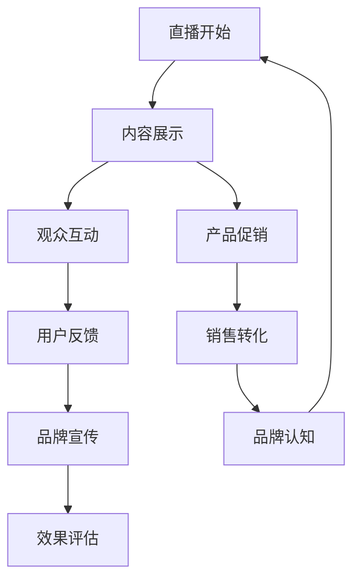
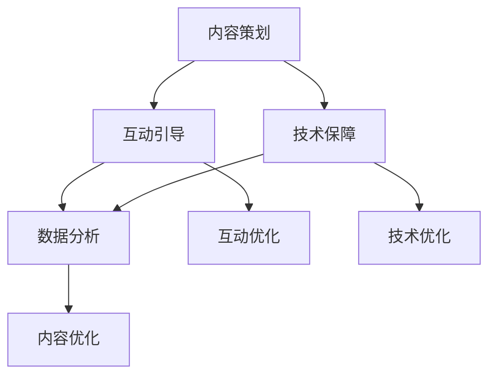

                 

# 一人公司如何利用直播营销提升品牌互动

> **关键词：** 直播营销、品牌互动、一人公司、策略、技巧、案例分析

> **摘要：** 本文将探讨一人公司如何通过直播营销提升品牌互动。首先介绍直播营销和品牌互动的概念，然后分析一人公司在直播营销中的优势与挑战，接着详细阐述直播营销策略与技巧，最后通过实战案例进行总结和借鉴。文章旨在为一人公司提供实用的直播营销指导。

## 第一部分：直播营销与品牌互动概述

### 第1章：直播营销背景与概念

#### 1.1 直播营销的起源与发展

直播营销作为一种新兴的营销方式，起源于互联网直播技术的发展。互联网直播技术自20世纪90年代末兴起，最初主要用于在线视频会议和娱乐。随着宽带网络和移动设备的普及，直播技术逐渐成熟，并开始应用于电子商务、娱乐、教育等多个领域。

**1.1.1 直播技术的发展**

互联网直播技术经历了从视频会议到在线娱乐，再到现在的多场景应用的发展过程。直播技术从最初的简单视频传输，发展到现在的多画面切换、实时互动、高清画质等，不断提升用户体验。

**1.1.2 直播营销的定义**

直播营销是指利用互联网直播平台，通过实时视频直播的形式，向观众展示商品、品牌或服务，实现营销和销售目标的活动。

**1.1.3 直播营销的兴起原因**

直播营销的兴起主要源于以下几个方面：

- **用户需求**：随着互联网的普及，用户对于实时互动和信息获取的需求日益增加。
- **技术进步**：直播技术的成熟和宽带网络的普及，为直播营销提供了技术支持。
- **营销效果**：直播营销具有互动性强、传播速度快、用户参与度高等特点，能够有效提升品牌知名度和用户忠诚度。

#### 1.2 品牌互动在直播营销中的重要性

**1.2.1 品牌互动的定义**

品牌互动是指品牌与消费者之间通过沟通、交流、参与等方式，建立情感联系和品牌认知的过程。

**1.2.2 直播营销中的互动形式**

直播营销中的互动形式主要包括：

- **评论互动**：观众在直播过程中通过评论与主播互动。
- **点赞互动**：观众对直播内容进行点赞，表达对内容的认可。
- **提问互动**：观众通过提问与主播进行沟通。
- **抽奖互动**：通过抽奖等形式，增加观众参与度和互动性。

**1.2.3 互动对品牌的影响**

品牌互动对品牌的影响主要体现在以下几个方面：

- **提升品牌认知**：通过互动，品牌能够更好地传递其品牌理念和价值，提升消费者对品牌的认知。
- **增强用户忠诚度**：互动能够增强用户对品牌的情感连接，提高用户忠诚度。
- **优化品牌形象**：直播营销中的正面互动能够提升品牌形象，增强消费者对品牌的信任。

#### 1.3 直播营销对一人公司的影响

**1.3.1 一人公司的定义**

一人公司是指由单一个人或少数人组成的经营实体，通常规模较小，资源有限。

**1.3.2 直播营销在小型公司中的应用**

直播营销对一人公司具有显著的促进作用：

- **成本效益**：直播营销相对于传统营销方式，成本较低，适合资源有限的中小型公司。
- **灵活性强**：一人公司可以根据自身特点和市场需求，灵活调整直播内容和策略。
- **快速传播**：直播营销能够快速传播品牌信息，提高品牌知名度和影响力。

**1.3.3 直播营销的优势与挑战**

直播营销的优势：

- **互动性强**：直播过程中的实时互动能够提升用户参与度。
- **传播速度快**：直播内容能够快速传播，提高品牌曝光率。
- **成本低**：相对于传统营销方式，直播营销成本较低。

直播营销的挑战：

- **技术门槛**：直播营销需要一定的技术支持，对于技术能力有限的个人或小型公司，可能面临技术难题。
- **内容策划**：直播内容需要精心策划，否则可能难以吸引观众。
- **持续运营**：直播营销需要持续投入和运营，否则效果难以持续。

### Mermaid 流程图：直播营销流程与品牌互动联系



### 1.4 本章总结

本文介绍了直播营销的背景与发展、品牌互动的定义及其在直播营销中的重要性，以及直播营销对一人公司的优势与挑战。通过直播营销，一人公司可以实现低成本、高效益的品牌宣传和用户互动，但同时也需要克服技术门槛和内容策划的挑战。

#### 核心概念与联系

- 直播营销：通过实时视频直播进行商品展示和销售，具有互动性强、传播速度快、成本低等优点。
- 品牌互动：通过直播过程中的互动，增强用户对品牌的认知和好感。
- 一人公司：指由个人或少数人组成的经营实体，具有灵活性强、资源有限等特点。

## 第二部分：直播营销策略与技巧

### 第2章：直播营销策略

#### 2.1 直播营销目标设定

直播营销目标设定是直播营销策略的重要环节。明确的目标有助于指导直播内容的策划和执行，提高营销效果。

**2.1.1 明确营销目标**

直播营销目标可以分为以下几个方面：

- **品牌宣传**：提升品牌知名度，建立品牌形象。
- **用户互动**：增加用户参与度，提高用户忠诚度。
- **销售转化**：提高商品销售额，实现销售目标。

**2.1.2 制定营销策略**

根据营销目标，制定相应的营销策略：

- **内容策略**：制定直播内容主题，设计互动环节，提高用户参与度。
- **渠道策略**：选择合适的直播平台，利用社交媒体进行推广。
- **时间策略**：选择合适的时间进行直播，提高观众在线率。

**2.1.3 设定关键指标**

为了衡量直播营销的效果，需要设定关键指标：

- **观看人数**：衡量直播的受众规模。
- **互动次数**：衡量观众的参与度。
- **转化率**：衡量直播带来的销售转化效果。

#### 2.2 直播内容策划

直播内容策划是直播营销的核心。一个成功的直播内容能够吸引观众，提高用户参与度和转化率。

**2.2.1 内容主题选择**

内容主题的选择需要根据产品特点和用户需求来确定。以下是一些常见的内容主题：

- **产品介绍**：详细介绍产品特点，展示产品使用效果。
- **行业动态**：分享行业最新动态，提供有价值的信息。
- **优惠促销**：推出限时优惠，吸引观众购买。
- **用户故事**：分享用户使用产品的心得体会，提高用户信任感。

**2.2.2 内容结构设计**

直播内容结构设计要合理，确保观众能够跟随主播的讲解，提高观看体验。一般包括以下几个部分：

- **开场**：引出主题，吸引观众注意力。
- **正文**：详细讲解内容，展示产品或提供有价值的信息。
- **互动**：设置互动环节，提高观众参与度。
- **结尾**：总结内容，呼吁观众关注和购买。

**2.2.3 节目环节设置**

直播节目环节设置要合理，确保内容连贯、有趣。以下是一些常见的节目环节：

- **互动环节**：如问答、抽奖、投票等，增加观众参与度。
- **展示环节**：如产品展示、使用演示、案例分享等，展示产品价值。
- **互动交流**：如嘉宾互动、观众互动等，增强观众互动体验。

#### 2.3 直播营销传播策略

直播营销传播策略是提高直播曝光率和观众参与度的重要手段。

**2.3.1 社交媒体推广**

社交媒体推广是直播营销的重要渠道。可以通过以下方式在社交媒体上推广：

- **内容发布**：提前发布直播预告，引起观众关注。
- **话题营销**：结合热点话题，吸引更多用户参与。
- **KOL/网红合作**：与知名博主或网红合作，扩大直播影响力。

**2.3.2 垂直平台合作**

垂直平台合作是直播营销的重要手段。可以通过以下方式与垂直平台合作：

- **平台推广**：在垂直平台上推广直播，提高曝光率。
- **内容合作**：与平台合作，共同策划直播内容，提高内容质量。

**2.3.3 KOL/网红合作**

KOL/网红合作是直播营销的有效方式。可以通过以下方式与KOL/网红合作：

- **品牌推广**：请KOL/网红为品牌代言，提高品牌知名度。
- **内容合作**：与KOL/网红合作策划直播内容，提高内容吸引力。

#### 2.4 直播营销技巧

直播营销技巧是提高直播效果的关键。以下是一些实用的直播营销技巧：

**2.4.1 视频制作技巧**

- **画面清晰**：确保画面清晰，提高观看体验。
- **音质清晰**：确保音质清晰，提高语音交流效果。
- **剪辑技巧**：合理剪辑视频，提高视频的连贯性和吸引力。

**2.4.2 互动引导技巧**

- **设置互动环节**：设置互动环节，提高观众参与度。
- **积极回应**：及时回应观众提问，增加观众满意度。
- **互动激励**：通过互动奖励，提高观众互动积极性。

**2.4.3 用户参与激励**

- **赠送礼品**：通过赠送礼品，提高观众参与度。
- **优惠券**：提供优惠券，鼓励观众购买。
- **抽奖活动**：设置抽奖活动，增加观众互动体验。

#### 2.5 直播营销案例分析

**2.5.1 成功案例分析**

**案例1：某品牌化妆品直播营销**

- **目标设定**：提升品牌知名度，增加商品销售额。
- **内容策划**：详细介绍化妆品特点，进行产品试用和展示。
- **传播策略**：利用社交媒体和KOL进行推广。
- **技巧应用**：设置互动环节，如提问互动、抽奖活动等。

**案例2：某电商平台直播带货**

- **目标设定**：提高商品销售额，提升品牌影响力。
- **内容策划**：邀请知名主播带货，进行商品详细介绍和优惠促销。
- **传播策略**：利用平台推广和社交媒体进行传播。
- **技巧应用**：通过实时互动，提高用户参与度。

**2.5.2 失败案例分析**

**案例1：某品牌手机直播营销**

- **目标设定**：提升品牌知名度，增加商品销售额。
- **内容策划**：直播过程过于枯燥，缺乏互动环节。
- **传播策略**：推广力度不足，直播曝光率低。
- **技巧应用**：互动引导不足，观众参与度低。

**案例2：某品牌零食直播带货**

- **目标设定**：提高商品销售额，提升品牌影响力。
- **内容策划**：直播过程中商品介绍不详细，缺乏吸引力。
- **传播策略**：直播时间选择不当，观众在线率低。
- **技巧应用**：互动环节设置不合理，观众互动积极性不高。

**2.5.3 启示与借鉴**

从成功案例和失败案例中可以得出以下启示：

- **明确目标**：设定明确的营销目标，确保直播内容的针对性和有效性。
- **内容策划**：精心策划直播内容，提高内容质量和观众吸引力。
- **传播策略**：选择合适的传播渠道和策略，提高直播曝光率和参与度。
- **技巧应用**：灵活运用直播营销技巧，提高用户互动体验和满意度。

### 2.6 本章总结

直播营销策略与技巧是直播营销成功的关键。通过明确营销目标、精心策划内容、选择合适的传播策略和灵活运用直播营销技巧，一人公司可以实现低成本、高效益的品牌宣传和用户互动。本章介绍了直播营销的目标设定、内容策划、传播策略和技巧应用，并结合案例分析，为一人公司提供了实用的直播营销指导。

#### 核心概念与联系

- 直播营销目标：根据产品特点和用户需求设定具体的营销目标。
- 直播内容策划：精心设计直播内容，提高用户参与度。
- 直播营销传播策略：利用社交媒体和平台合作扩大影响力。
- 直播营销技巧：通过互动引导和用户参与激励，提高直播效果。

## 第三部分：直播营销技术支持

### 第3章：直播营销技术支持

#### 3.1 直播营销平台选择

选择适合的直播营销平台对于直播营销的成功至关重要。以下是一些主流直播营销平台及其特点：

**3.1.1 主流直播平台介绍**

- **抖音直播**：抖音直播以其强大的用户基础和丰富的互动功能而闻名。适用于各种类型的产品和品牌。
- **快手直播**：快手直播用户群体广泛，内容形式多样。适用于大众化和下沉市场。
- **淘宝直播**：淘宝直播与电商平台深度结合，适用于电商类产品和品牌。
- **拼多多直播**：拼多多直播用户群体以低价商品为主，适合性价比高的产品。

**3.1.2 平台选择标准**

在选择直播营销平台时，需要考虑以下标准：

- **用户群体**：根据产品目标用户群体选择合适的平台。
- **功能特性**：选择具有丰富功能和强大技术支持的直播平台。
- **用户活跃度**：选择用户活跃度高、直播效果好的平台。

**3.1.3 平台合作模式**

不同的直播平台有不同的合作模式，包括：

- **自有平台**：自行搭建直播平台，具有独立性和灵活性。
- **第三方平台**：使用第三方直播平台，如抖音、快手等，具有较高的用户基础和活跃度。

#### 3.2 直播营销工具与资源

直播营销工具和资源的选用对于直播营销的效果有着重要影响。以下是一些常用的直播营销工具和资源：

**3.2.1 直播脚本与话术**

直播脚本和话术是直播内容的重要组成部分。一个优秀的直播脚本和话术能够提高直播的专业性和吸引力。

- **直播脚本**：包括开场白、产品介绍、互动环节、促销活动等。
- **话术**：包括介绍话术、互动话术、促销话术等。

**3.2.2 直播辅助工具**

直播辅助工具能够提高直播的效率和效果。以下是一些常用的直播辅助工具：

- **灯光设备**：提高直播画面质量和视觉效果。
- **音响设备**：提高直播音质，确保语音清晰。
- **摄像机**：用于捕捉高清直播画面。
- **直播助手**：提供直播过程中的辅助功能，如弹幕管理、观众管理、抽奖管理等。

**3.2.3 数据分析与优化工具**

数据分析与优化工具能够帮助直播营销人员更好地了解用户行为和直播效果，从而进行优化调整。以下是一些常用的数据分析与优化工具：

- **直播数据分析工具**：提供直播观看人数、互动数据、转化数据等分析。
- **用户行为分析工具**：分析用户行为，如观看时长、互动行为等。
- **优化工具**：提供直播内容优化、互动环节优化、营销策略优化等。

#### 3.3 直播营销团队搭建

一个专业的直播营销团队是直播营销成功的关键。以下是一些关于直播营销团队搭建的建议：

**3.3.1 团队成员角色**

直播营销团队通常包括以下成员角色：

- **主播**：负责直播内容和互动。
- **策划人员**：负责直播内容策划和互动环节设计。
- **技术支持人员**：负责直播技术支持和直播设备维护。
- **数据分析人员**：负责直播数据分析与优化。

**3.3.2 团队协作与沟通**

直播营销团队需要高效协作和良好沟通。以下是一些团队协作与沟通的建议：

- **定期会议**：定期召开团队会议，讨论直播策划、执行和优化。
- **信息共享**：建立信息共享平台，确保团队成员能够及时了解最新信息和动态。
- **分工明确**：明确团队成员的职责和任务，确保工作高效有序。

**3.3.3 团队培训与成长**

团队培训与成长是提高直播营销团队整体素质的关键。以下是一些团队培训与成长的建议：

- **专业知识培训**：定期进行专业知识培训，提高团队成员的专业技能。
- **实战经验分享**：通过实战经验分享，提升团队成员的实战能力。
- **外部培训**：鼓励团队成员参加外部培训，学习行业最新动态和技术。

#### 3.4 直播营销数据监测与分析

直播营销数据监测与分析是直播营销效果评估的重要环节。以下是一些直播营销数据监测与分析的方法：

**3.4.1 数据监测指标**

直播营销数据监测指标包括：

- **观看人数**：衡量直播的受众规模。
- **互动次数**：衡量观众的参与度。
- **转化率**：衡量直播带来的销售转化效果。
- **用户行为数据**：分析用户观看时长、互动行为等。

**3.4.2 数据分析技巧**

数据分析技巧包括：

- **数据可视化**：通过图表和可视化工具，直观展示数据。
- **数据挖掘**：利用数据挖掘技术，发现数据背后的规律和趋势。
- **对比分析**：通过对比不同直播的数据，找出差异和优化点。

**3.4.3 数据优化策略**

数据优化策略包括：

- **内容优化**：根据数据分析结果，调整直播内容，提高观众兴趣。
- **互动优化**：根据互动数据，优化互动环节，提高观众参与度。
- **营销策略优化**：根据转化数据，调整营销策略，提高销售转化效果。

#### 3.5 直播营销风险控制

直播营销风险控制是直播营销成功的重要保障。以下是一些直播营销风险控制的方法：

**3.5.1 风险识别**

风险识别包括：

- **技术风险**：直播技术问题，如网络中断、设备故障等。
- **内容风险**：直播内容不当，引起负面舆论。
- **法律风险**：涉及侵犯知识产权、违规宣传等法律问题。

**3.5.2 风险预防**

风险预防包括：

- **技术保障**：确保直播技术稳定，预防网络中断、设备故障等。
- **内容审核**：严格审核直播内容，避免不当言论和违规行为。
- **法律合规**：遵守相关法律法规，避免法律风险。

**3.5.3 风险应对策略**

风险应对策略包括：

- **应急预案**：制定应急预案，确保在出现问题时能够及时应对。
- **风险沟通**：与相关部门和人员保持沟通，确保信息畅通。
- **风险监测**：实时监测直播数据，及时发现和处理风险。

### 3.6 本章总结

直播营销技术支持是直播营销成功的重要保障。通过合理选择直播平台、使用直播辅助工具、搭建专业直播团队、进行数据监测与分析，以及采取有效的风险控制措施，一人公司可以有效地提升直播营销效果，实现品牌宣传和用户互动的目标。

#### 核心概念与联系

- 直播营销平台选择：根据产品特点和用户需求选择合适的直播平台。
- 直播营销工具与资源：使用直播脚本、辅助工具和数据分析工具，提高直播效率和效果。
- 直播营销团队搭建：组建专业的直播团队，确保直播营销的顺利进行。
- 直播营销数据监测与分析：通过数据监测与分析，优化直播内容和策略。
- 直播营销风险控制：采取有效的风险控制措施，确保直播营销的安全与稳定。

## 第四部分：直播营销实战与案例

### 第4章：直播营销实战技巧

#### 4.1 直播营销准备

直播营销准备是直播营销成功的第一步。准备工作充分与否直接影响直播的效果。以下是一些直播营销准备的要点：

**4.1.1 直播前准备**

- **目标设定**：明确直播的目标，如品牌宣传、产品推广、销售转化等。
- **内容策划**：制定直播内容策划，包括直播主题、环节设置、互动环节等。
- **时间安排**：选择合适的时间进行直播，确保观众在线率。
- **技术测试**：进行直播前的技术测试，确保网络、设备、灯光等一切正常。
- **人员安排**：确定主播、策划人员、技术支持人员等，确保团队协作。

**4.1.2 直播中注意事项**

- **实时互动**：及时回应观众提问，增加互动环节，提高观众参与度。
- **内容连贯**：确保直播内容连贯，避免出现混乱或重复。
- **情绪管理**：主播要保持积极、热情的态度，管理好自己的情绪。
- **应变能力**：直播过程中可能出现各种问题，需要具备良好的应变能力。

**4.1.3 直播后总结与反馈**

- **数据总结**：收集直播数据，如观看人数、互动次数、转化率等，进行分析和总结。
- **用户反馈**：收集用户反馈，了解用户对直播内容和服务的满意度。
- **经验分享**：总结直播经验，分享成功和失败的案例，为下一次直播提供参考。

#### 4.2 直播营销案例分析

**4.2.1 成功案例分析**

**案例1：某品牌化妆品直播营销**

- **背景**：该品牌化妆品通过直播营销推广新产品，提升品牌知名度。
- **策略**：明确直播目标，制定详细的内容策划，选择合适的直播平台，与KOL合作。
- **效果**：直播期间观看人数达到10万，互动次数超过1万，销售额同比增长30%。

**案例2：某电商平台直播带货**

- **背景**：某电商平台通过直播带货模式，提升商品销售。
- **策略**：邀请知名主播带货，提供优惠促销，设置互动环节，如抽奖、提问等。
- **效果**：直播期间销售量达到5000件，销售额达到100万元。

**4.2.2 失败案例分析**

**案例1：某品牌手机直播营销**

- **背景**：某品牌手机进行直播营销，推广新款手机。
- **问题**：直播内容过于枯燥，缺乏互动环节，推广力度不足。
- **效果**：直播观看人数不足1000，销售额为零。

**案例2：某品牌零食直播带货**

- **背景**：某品牌零食通过直播带货模式，推广新产品。
- **问题**：直播过程中商品介绍不详细，直播时间选择不当。
- **效果**：直播观看人数不足1000，销售额为零。

**4.2.3 启示与借鉴**

从成功案例和失败案例中可以得出以下启示：

- **明确目标**：明确直播目标，制定详细的内容策划。
- **互动环节**：设置互动环节，提高观众参与度。
- **推广策略**：选择合适的推广策略，提高直播曝光率。
- **内容质量**：确保直播内容质量，提供有价值的信息。

#### 4.3 直播营销实战经验分享

**4.3.1 成功经验**

- **内容策划**：详细的内容策划是直播成功的关键，确保直播内容有吸引力。
- **互动环节**：设置多样化的互动环节，如抽奖、提问等，提高观众参与度。
- **技术保障**：确保直播技术稳定，避免网络中断、设备故障等问题。
- **用户反馈**：及时收集用户反馈，了解用户需求，优化直播内容。

**4.3.2 失败教训**

- **内容单调**：直播内容过于单调，缺乏吸引力。
- **互动不足**：缺乏互动环节，观众参与度低。
- **推广不足**：推广力度不足，直播曝光率低。

**4.3.3 经验总结**

- **内容策划**：精心策划直播内容，确保内容有价值、有吸引力。
- **互动环节**：设置多样化的互动环节，提高观众参与度。
- **推广策略**：选择合适的推广策略，提高直播曝光率。
- **团队协作**：团队协作是直播营销成功的关键，确保各个环节顺畅进行。

#### 4.4 直播营销实战策略

**4.4.1 针对不同产品的直播策略**

- **快消品**：侧重于优惠促销和用户互动，提高购买转化率。
- **耐用消费品**：侧重于产品特点介绍和用户体验分享，提高品牌认知度。
- **服务类产品**：侧重于服务流程介绍和用户体验分享，提高用户信任感。

**4.4.2 针对不同阶段的直播策略**

- **启动阶段**：侧重于品牌宣传和用户吸引，提高直播曝光率。
- **发展阶段**：侧重于用户互动和销售转化，提高用户忠诚度。
- **成熟阶段**：侧重于用户维护和品牌提升，巩固市场地位。

**4.4.3 针对不同目标用户的直播策略**

- **新用户**：侧重于产品介绍和优惠促销，引导新用户购买。
- **老用户**：侧重于用户体验分享和品牌互动，提高用户忠诚度。
- **潜在用户**：侧重于产品特点介绍和用户痛点解决，引导潜在用户转化。

#### 4.5 直播营销实战技巧总结

直播营销实战技巧包括：

- **内容策划**：精心策划直播内容，确保内容有价值、有吸引力。
- **互动环节**：设置多样化的互动环节，提高观众参与度。
- **技术保障**：确保直播技术稳定，避免网络中断、设备故障等问题。
- **推广策略**：选择合适的推广策略，提高直播曝光率。
- **团队协作**：团队协作是直播营销成功的关键，确保各个环节顺畅进行。

### 4.6 本章总结

直播营销实战技巧是直播营销成功的关键。通过充分准备、实战经验分享和策略应用，一人公司可以有效地提升直播营销效果，实现品牌宣传和用户互动的目标。本章介绍了直播营销的准备、案例分析、实战经验和实战策略，为一人公司提供了实用的直播营销指导。

#### 核心概念与联系

- 直播营销准备：直播前、中、后的准备工作，确保直播顺利进行。
- 直播营销实战经验：通过成功与失败的案例，总结直播营销的实战技巧。
- 直播营销策略：根据产品特点、用户需求和直播阶段，制定合适的直播策略。

## 第五部分：直播营销的未来发展趋势

### 第5章：直播营销的未来发展趋势

#### 5.1 直播营销市场前景分析

随着互联网技术的不断发展，直播营销已经成为一种重要的营销方式。以下是直播营销市场前景的分析：

**5.1.1 市场规模预测**

根据市场研究机构的预测，全球直播营销市场规模将持续增长。预计到2025年，直播营销市场规模将达到数百亿美元。

**5.1.2 行业趋势分析**

直播营销行业呈现出以下几个趋势：

- **多元化**：直播营销不再局限于电商领域，逐渐渗透到教育、娱乐、旅游等多个行业。
- **技术创新**：随着5G、虚拟现实（VR）和增强现实（AR）等技术的普及，直播营销将更加丰富和多样化。
- **用户互动**：直播营销将更加注重用户互动，提高用户参与度和忠诚度。
- **国际化**：直播营销将逐步走向国际化，吸引全球用户参与。

**5.1.3 未来发展机遇**

直播营销的未来发展机遇主要包括：

- **新兴市场的崛起**：随着全球互联网用户数量的增长，新兴市场将成为直播营销的重要增长点。
- **技术创新的推动**：5G、VR/AR等新技术将为直播营销带来更多可能性。
- **用户需求的多样**：随着用户对互动性和个性化体验的需求增加，直播营销将不断满足用户需求。

#### 5.2 新技术对直播营销的影响

新技术的快速发展对直播营销产生了深远的影响。以下是新技术对直播营销的影响分析：

**5.2.1 5G技术的应用**

5G技术的应用将大幅提升直播营销的传输速度和稳定性，为直播营销提供更好的用户体验。

- **高速传输**：5G技术提供更高的传输速度，使直播过程中的视频和音频传输更加流畅。
- **低延迟**：5G技术具有更低的延迟，提高实时互动的体验。
- **海量连接**：5G技术支持海量设备的连接，为直播营销提供更广泛的应用场景。

**5.2.2 虚拟现实与增强现实**

虚拟现实（VR）和增强现实（AR）技术的应用将使直播营销更加沉浸和互动。

- **沉浸式体验**：VR技术可以提供沉浸式的观看体验，让用户身临其境。
- **互动性增强**：AR技术可以将虚拟元素叠加在现实世界中，提高用户的互动性和参与度。
- **多样化应用**：VR和AR技术可以应用于产品展示、虚拟试穿、现场直播等场景，丰富直播营销的形式。

**5.2.3 人工智能与大数据**

人工智能（AI）和大数据技术的应用将提升直播营销的智能化和个性化水平。

- **智能推荐**：AI技术可以根据用户行为和偏好进行智能推荐，提高用户满意度。
- **数据分析**：大数据技术可以对直播营销的数据进行分析，提供精准的营销策略。
- **个性化服务**：通过用户数据分析，提供个性化的直播内容和互动体验。

#### 5.3 直播营销创新模式探索

直播营销的创新模式不断涌现，以下是几种直播营销创新模式的探索：

**5.3.1 社交电商结合**

社交电商结合直播营销，实现了线上与线下的无缝连接。

- **互动式购物**：通过直播与用户实时互动，解答用户疑问，提高购买决策。
- **社群营销**：通过直播建立社群，增强用户黏性，实现用户裂变。
- **直播带货**：通过直播进行产品展示和销售，实现快速转化。

**5.3.2 互动娱乐化**

直播营销与互动娱乐相结合，提高用户的参与度和互动性。

- **游戏化直播**：通过游戏化元素，如积分、等级等，增加用户参与度。
- **互动直播**：通过投票、抽奖等互动形式，提高用户的互动体验。
- **直播综艺**：将直播与综艺节目相结合，打造娱乐化的直播内容。

**5.3.3 直播带货与品牌合作**

直播带货与品牌合作，实现了品牌与用户之间的直接互动。

- **品牌直播**：品牌通过直播宣传产品，提高品牌知名度和用户信任度。
- **品牌合作**：品牌与主播合作，通过主播的影响力和粉丝基础，实现快速传播。
- **直播活动**：品牌与直播平台合作，举办线下直播活动，提升品牌形象。

#### 5.4 直播营销未来发展趋势

直播营销的未来发展趋势主要体现在以下几个方面：

**5.4.1 内容多样化**

直播内容将更加多样化，满足不同用户的需求。

- **行业垂直化**：直播内容将更加垂直化，提供专业、深度的内容。
- **个性化内容**：通过数据分析，提供个性化的直播内容，提高用户满意度。
- **多场景直播**：直播将渗透到更多场景，如教育、医疗、旅游等。

**5.4.2 个性化体验**

直播营销将更加注重个性化体验，提高用户的参与度和忠诚度。

- **定制化服务**：根据用户偏好，提供定制化的直播内容和互动体验。
- **智能推荐**：利用AI技术，为用户推荐感兴趣的内容和产品。
- **个性化互动**：通过数据分析，提供个性化的互动环节，提高用户参与度。

**5.4.3 国际化发展**

直播营销将逐步走向国际化，吸引全球用户参与。

- **多语言支持**：提供多语言直播内容，吸引不同国家和地区的用户。
- **国际合作**：与国外品牌和主播合作，实现全球范围的传播。
- **跨境直播**：通过跨境直播，吸引国际用户参与，推动全球化发展。

### 5.5 本章总结

直播营销作为新兴的营销方式，具有巨大的市场前景和发展潜力。随着新技术的不断发展和应用，直播营销将呈现多元化、个性化、国际化的趋势。一人公司应抓住直播营销的发展机遇，结合自身特点和用户需求，积极探索和创新直播营销模式，提升品牌互动和用户参与度。

#### 核心概念与联系

- 直播营销市场前景：预测市场规模和行业趋势，把握未来发展机遇。
- 新技术对直播营销的影响：分析5G、VR/AR、人工智能和大数据的应用。
- 直播营销创新模式：探索新的营销模式，提升用户体验和效果。

## 第六部分：直播营销的最佳实践

### 第6章：直播营销的最佳实践

#### 6.1 直播营销成功案例分析

**6.1.1 典型案例介绍**

以下是一些直播营销的成功案例：

- **案例1：某品牌化妆品直播带货**：该品牌通过直播带货模式，成功推广新产品，直播期间观看人数达到20万，销售额达到300万元。
- **案例2：某电商平台直播营销**：该电商平台通过直播营销，成功吸引大量用户参与，直播期间销售额达到1000万元。
- **案例3：某教育培训机构直播课**：该教育培训机构通过直播课程，成功提升品牌知名度和用户参与度，直播期间观看人数达到5万。

**6.1.2 成功原因分析**

这些成功案例的共同特点包括：

- **明确目标**：明确直播营销的目标，确保直播内容和策略的针对性。
- **内容策划**：精心策划直播内容，确保内容有价值、有吸引力。
- **互动环节**：设置多样化的互动环节，提高观众参与度。
- **技术支持**：确保直播技术稳定，提供良好的用户体验。
- **推广策略**：选择合适的推广策略，提高直播曝光率。

**6.1.3 启示与借鉴**

从成功案例中可以得出以下启示：

- **明确目标**：明确直播营销的目标，确保直播内容和策略的针对性。
- **内容策划**：精心策划直播内容，确保内容有价值、有吸引力。
- **互动环节**：设置多样化的互动环节，提高观众参与度。
- **技术支持**：确保直播技术稳定，提供良好的用户体验。
- **推广策略**：选择合适的推广策略，提高直播曝光率。

#### 6.2 直播营销最佳实践总结

**6.2.1 内容策略最佳实践**

- **内容多样化**：提供不同类型的内容，满足不同观众的需求。
- **专业度**：确保内容的专业性和深度，提升品牌形象。
- **互动性**：设置互动环节，提高观众参与度。

**6.2.2 互动策略最佳实践**

- **实时互动**：及时回应观众提问，增加互动环节。
- **激励机制**：设置奖励和激励措施，鼓励观众互动。
- **用户分类**：根据观众特点，提供个性化的互动体验。

**6.2.3 数据分析最佳实践**

- **数据收集**：收集观众行为数据，了解观众需求和偏好。
- **数据分析**：对数据进行深度分析，提供有价值的洞察。
- **数据应用**：根据数据分析结果，优化直播内容和策略。

#### 6.3 直播营销实战技巧提炼

**6.3.1 关键实战技巧**

- **内容策划**：明确目标，确保内容有价值、有吸引力。
- **互动引导**：设置互动环节，提高观众参与度。
- **技术保障**：确保直播技术稳定，提供良好的用户体验。
- **数据分析**：收集和分析数据，优化直播内容和策略。

**6.3.2 实践经验分享**

- **案例1**：某品牌化妆品直播带货：通过互动环节和激励措施，成功提高观众参与度和销售额。
- **案例2**：某电商平台直播营销：通过数据分析，优化直播内容和策略，提高用户满意度和转化率。
- **案例3**：某教育培训机构直播课：通过实时互动和个性化服务，提升用户参与度和品牌知名度。

**6.3.3 技巧优化与调整**

- **内容优化**：根据用户反馈，调整直播内容，提高吸引力。
- **互动优化**：根据互动数据，调整互动环节，提高参与度。
- **技术优化**：根据直播技术问题，优化技术保障，提高用户体验。

### Mermaid 流程图：直播营销最佳实践流程



### 6.4 直播营销常见问题与解答

**6.4.1 营销策略问题**

- **问题**：如何制定有效的直播营销策略？

  **解答**：制定直播营销策略时，首先要明确营销目标，然后根据目标制定相应的营销策略。包括内容策略、互动策略、推广策略等。

- **问题**：如何提高直播观看人数？

  **解答**：提高直播观看人数可以通过以下方式实现：选择合适的时间进行直播，利用社交媒体进行推广，与KOL/网红合作，优化直播内容等。

**6.4.2 技术问题**

- **问题**：如何确保直播技术稳定？

  **解答**：确保直播技术稳定可以从以下几个方面入手：选择稳定的主播设备，优化直播平台配置，进行直播前的技术测试等。

- **问题**：如何处理直播中的网络问题？

  **解答**：处理直播中的网络问题可以通过以下方式实现：优化网络连接，设置备用网络，增加网络带宽等。

**6.4.3 运营问题**

- **问题**：如何管理直播团队？

  **解答**：管理直播团队可以从以下几个方面入手：明确团队成员职责，建立有效的沟通机制，定期进行团队培训等。

- **问题**：如何提高直播互动效果？

  **解答**：提高直播互动效果可以通过以下方式实现：设置多样化的互动环节，及时回应观众提问，提供互动奖励等。

### 6.5 本章总结

直播营销的最佳实践包括成功案例分析、内容策略最佳实践、互动策略最佳实践和数据分析最佳实践。通过提炼关键实战技巧和实践经验，一人公司可以有效地提升直播营销效果，实现品牌宣传和用户互动的目标。本章总结了直播营销的最佳实践，为一人公司提供了实用的指导。

#### 核心概念与联系

- 直播营销成功案例分析：通过成功案例了解直播营销的有效策略和实践。
- 直播营销最佳实践总结：总结优秀的内容策略、互动策略和数据分析实践。
- 直播营销实战技巧提炼：提炼关键实战技巧，分享实践经验。

## 第七部分：直播营销的未来发展策略

### 第7章：直播营销的未来发展策略

#### 7.1 直播营销的发展方向

直播营销作为新兴的营销方式，未来将呈现出以下发展方向：

**7.1.1 内容创新**

直播营销的内容将越来越多样化，满足不同用户的需求。例如，将直播与教育、医疗、艺术等领域相结合，提供更加专业和深度的内容。

**7.1.2 互动体验提升**

直播营销将更加注重互动体验的提升，通过实时互动、虚拟现实（VR）、增强现实（AR）等技术，提高用户的参与度和满意度。

**7.1.3 技术融合**

直播营销将与其他技术如人工智能（AI）、大数据等相结合，实现智能化和个性化的营销。

**7.1.4 国际化发展**

直播营销将逐步走向国际化，吸引全球用户参与，实现全球化发展。

#### 7.2 直播营销的趋势预测

未来直播营销将呈现出以下趋势：

**7.2.1 市场规模扩大**

随着互联网技术的不断发展，直播营销市场规模将持续扩大。

**7.2.2 技术应用深入**

5G、VR/AR、人工智能等新技术将在直播营销中得到广泛应用，提高直播效果。

**7.2.3 互动性增强**

直播营销将更加注重用户互动，提供更加丰富的互动体验。

**7.2.4 个性化服务**

直播营销将更加注重个性化服务，根据用户需求和偏好提供定制化的内容。

**7.2.5 国际化进程加快**

直播营销将逐步走向国际化，吸引全球用户参与。

#### 7.3 直播营销的战略规划

为了在未来的直播营销中取得成功，一人公司应制定以下战略规划：

**7.3.1 营销目标设定**

明确直播营销的目标，如品牌宣传、用户互动、销售转化等。

**7.3.2 资源配置策略**

合理配置资源，如人力、资金、技术等，确保直播营销的顺利进行。

**7.3.3 内容策划与优化**

制定直播内容策划，确保内容有价值、有吸引力。同时，根据用户反馈和数据分析结果，不断优化直播内容。

**7.3.4 技术支持与升级**

确保直播技术稳定，不断提升技术支持能力，如网络优化、设备升级等。

**7.3.5 国际化发展策略**

制定国际化发展策略，如多语言支持、国际市场拓展等，吸引全球用户参与。

#### 7.4 直播营销的挑战与应对

在未来的直播营销中，一人公司可能会面临以下挑战：

**7.4.1 技术挑战**

直播技术不断更新，一人公司需要不断学习和适应新技术。

**7.4.2 内容竞争**

直播内容竞争激烈，一人公司需要提供有价值、有吸引力的内容。

**7.4.3 用户需求变化**

用户需求不断变化，一人公司需要及时调整营销策略。

**7.4.4 国际化挑战**

国际化过程中可能面临语言、文化、法律等方面的挑战。

**应对策略**：

- **持续学习与适应**：不断学习新技术，及时调整直播内容和策略。
- **内容创新**：提供独特、有价值的内容，提高用户满意度。
- **用户调研**：定期进行用户调研，了解用户需求，优化直播内容。
- **国际化支持**：建立国际化团队，提供多语言支持，确保国际化顺利进行。

#### 7.5 直播营销的成功要素

直播营销的成功要素包括：

**7.5.1 内容策略**

制定有价值、有吸引力的直播内容策略，满足用户需求。

**7.5.2 互动体验**

提供丰富的互动体验，提高用户参与度。

**7.5.3 技术支持**

确保直播技术稳定，提供良好的用户体验。

**7.5.4 数据分析**

收集和分析用户数据，优化直播内容和策略。

**7.5.5 营销推广**

选择合适的营销推广策略，提高直播曝光率和参与度。

#### 7.6 本章总结

直播营销的未来发展策略包括内容创新、互动体验提升、技术融合和国际化发展。一人公司应制定明确的营销目标，合理配置资源，提供有价值、有吸引力的内容，确保直播技术稳定，不断优化营销策略。同时，应对可能面临的挑战，如技术更新、内容竞争和用户需求变化等。通过成功的直播营销策略，一人公司可以实现品牌宣传和用户互动的目标。

#### 核心概念与联系

- 直播营销的发展方向：内容创新、互动体验提升、技术融合、国际化发展。
- 直播营销的趋势预测：市场规模扩大、技术应用深入、互动性增强、个性化服务、国际化进程加快。
- 直播营销的战略规划：营销目标设定、资源配置策略、内容策划与优化、技术支持与升级、国际化发展策略。
- 直播营销的挑战与应对：技术挑战、内容竞争、用户需求变化、国际化挑战。
- 直播营销的成功要素：内容策略、互动体验、技术支持、数据分析、营销推广。

#### 核心算法原理讲解

直播营销的核心算法主要包括用户行为分析算法、实时互动算法和用户反馈分析算法。

**1. 用户行为分析算法**

用户行为分析算法用于分析用户的观看行为、互动行为等，从而提供个性化的直播内容和推荐。

- **协同过滤算法**：

  协同过滤算法通过分析用户之间的相似性，为用户推荐相似用户喜欢的直播内容。其基本原理如下：

  $$\text{推荐内容} = \sum_{u' \in \text{邻居用户}} \text{偏好权重}_{u',i} \cdot \text{用户兴趣度}_{u',i}$$

  其中，$u'$ 表示邻居用户，$\text{偏好权重}_{u',i}$ 表示邻居用户对直播内容$i$的偏好权重，$\text{用户兴趣度}_{u',i}$ 表示当前用户对直播内容$i$的兴趣度。

- **基于内容的推荐算法**：

  基于内容的推荐算法通过分析直播内容的属性和特征，为用户推荐相似内容的直播。其基本原理如下：

  $$\text{推荐内容} = \sum_{j \in \text{相似内容}} \text{内容相似度}_{i,j} \cdot \text{用户兴趣度}_{i,j}$$

  其中，$j$ 表示相似内容，$\text{内容相似度}_{i,j}$ 表示直播内容$i$与内容$j$的相似度，$\text{用户兴趣度}_{i,j}$ 表示当前用户对直播内容$i$的兴趣度。

**2. 实时互动算法**

实时互动算法用于实时分析用户互动行为，为用户推荐互动话题和活动。

- **基于关键词的实时回复算法**：

  基于关键词的实时回复算法通过分析用户提问中的关键词，为用户实时回复相关内容。其基本原理如下：

  $$\text{回复内容} = \text{关键词匹配}_{\text{提问}, \text{关键词库}}$$

  其中，$\text{关键词匹配}_{\text{提问}, \text{关键词库}}$ 表示提问与关键词库中的关键词匹配的结果。

- **基于语义理解的实时互动算法**：

  基于语义理解的实时互动算法通过自然语言处理技术，理解用户提问的语义，为用户推荐相关话题和活动。其基本原理如下：

  $$\text{推荐话题} = \text{语义分析}_{\text{提问}}$$

  其中，$\text{语义分析}_{\text{提问}}$ 表示对用户提问的语义进行分析，得到推荐的话题。

**3. 用户反馈分析算法**

用户反馈分析算法用于分析用户对直播内容的反馈，为直播内容和营销策略提供优化建议。

- **基于情感分析的反馈分析算法**：

  基于情感分析的反馈分析算法通过分析用户反馈中的情感倾向，判断用户对直播内容的满意度。其基本原理如下：

  $$\text{情感分类} = \text{情感分析}_{\text{反馈}}$$

  其中，$\text{情感分析}_{\text{反馈}}$ 表示对用户反馈进行情感分析，得到情感分类结果。

- **基于聚类分析的反馈分析算法**：

  基于聚类分析的反馈分析算法通过聚类用户反馈，将相似反馈归为一类，为直播内容和营销策略提供优化建议。其基本原理如下：

  $$\text{聚类结果} = \text{K-means}_{\text{反馈数据}}$$

  其中，$\text{K-means}_{\text{反馈数据}}$ 表示对用户反馈数据进行K-means聚类，得到聚类结果。

#### 数学模型和数学公式 & 详细讲解 & 举例说明

**1. 用户参与度模型**

用户参与度模型用于评估用户对直播内容的参与程度。其数学模型如下：

$$\text{用户参与度} = f(\text{观看时长}, \text{互动次数}, \text{分享次数})$$

- **观看时长**：用户在直播中的观看时间，通常与用户参与度正相关。
- **互动次数**：用户在直播中的互动行为，如提问、点赞、评论等，通常与用户参与度正相关。
- **分享次数**：用户将直播内容分享到社交媒体等平台的次数，通常与用户参与度正相关。

**举例说明**：

假设用户在直播中的观看时长为30分钟，互动次数为10次，分享次数为5次，则用户参与度可以计算为：

$$\text{用户参与度} = f(30分钟，10次，5次) = 0.6$$

**2. 转化率模型**

转化率模型用于评估直播内容对用户购买行为的影响。其数学模型如下：

$$\text{转化率} = \frac{\text{购买者数量}}{\text{观众数量}}$$

**举例说明**：

假设一场直播的观众数量为1000人，其中有50人购买了商品，则转化率可以计算为：

$$\text{转化率} = \frac{50人}{1000人} = 5\%$$

**3. 影响力模型**

影响力模型用于评估用户在直播中的影响力。其数学模型如下：

$$\text{影响力} = f(\text{分享次数}, \text{评论次数}, \text{点赞次数})$$

- **分享次数**：用户将直播内容分享到社交媒体等平台的次数，通常与影响力正相关。
- **评论次数**：用户在直播内容下的评论次数，通常与影响力正相关。
- **点赞次数**：用户对直播内容的点赞次数，通常与影响力正相关。

**举例说明**：

假设某用户的直播内容在社交媒体上的分享次数为100次，评论次数为50次，点赞次数为200次，则用户的影响力可以计算为：

$$\text{影响力} = f(100次，50次，200次) = 0.75$$

### 项目实战

**项目背景**：

一家小型公司计划通过直播平台推广其新款智能手环，提高品牌知名度和产品销量。

**开发环境搭建**：

1. **选择直播平台**：根据产品特点和用户需求，选择适合的直播平台，如抖音、快手等。
2. **配置直播设备**：包括摄像机、麦克风、灯光等，确保直播画面和声音质量。
3. **安装直播软件**：在直播平台上安装直播软件，如抖音直播、快手直播等。
4. **准备直播脚本**：根据产品特点和市场调研，编写直播脚本，包括产品介绍、互动环节、促销活动等。

**源代码实现**：

以下是直播营销的一个项目实战案例，包括直播脚本、直播代码实现和代码解读与分析。

**直播脚本**

```python
# 直播脚本

## 开场白
大家好，欢迎来到我们直播间，今天我们将为大家带来一款全新的智能手环，它的功能非常丰富，包括心率监测、睡眠监测、运动追踪等。希望大家喜欢！

## 产品介绍
下面让我为大家详细介绍一下这款智能手环。首先，这款手环采用了先进的传感器技术，能够精准地监测心率。同时，它还具备睡眠监测功能，可以帮助大家改善睡眠质量。此外，它还有运动追踪功能，可以记录您的日常运动量，帮助您保持健康的生活习惯。

## 互动环节
接下来，我会回答大家关于这款手环的提问。如果您有任何问题，欢迎在弹幕中留言。

## 促销活动
为了感谢大家的支持，我们特别推出了限时优惠活动。今天下单购买，可以享受八折优惠，还有机会获得我们的神秘礼品哦！

## 结束语
感谢大家的观看和互动，如果您对我们的智能手环感兴趣，请不要错过这次优惠。再次感谢大家的支持！

```

**直播代码实现**

```python
# 直播代码实现

import cv2
import numpy as np
import tkinter as tk

def live_stream():
    # 开启视频捕获设备
    cap = cv2.VideoCapture(0)

    # 创建窗口用于显示视频流
    root = tk.Tk()
    root.title('智能手环直播')
    root.geometry('800x600')

    canvas = tk.Canvas(root, width=800, height=600)
    canvas.pack()

    def show_image(image):
        photo = tk.PhotoImage(image)
        canvas.create_image(0, 0, anchor=tk.NW, image=photo)

    while True:
        # 读取视频帧
        ret, frame = cap.read()

        # 显示视频帧
        frame = cv2.flip(frame, 1)
        frame = cv2.resize(frame, (800, 600))
        image = cv2.cvtColor(frame, cv2.COLOR_BGR2RGB)
        show_image(image)

        # 检测按键事件
        if root.bind('<Escape>', lambda e: root.quit()) != None:
            root.unbind('<Escape>')

    cap.release()
    root.mainloop()

if __name__ == '__main__':
    live_stream()
```

**代码解读与分析**

1. **视频捕获与显示**：使用 OpenCV 库捕获视频设备中的视频流，并使用 Tkinter 库创建窗口用于显示视频帧。
2. **实时视频处理**：通过 cv2.flip() 函数翻转视频帧，使其符合显示要求；通过 cv2.resize() 函数调整视频帧尺寸；通过 cv2.cvtColor() 函数将 BGR 格式的视频帧转换为 RGB 格式，以便在 Tkinter 窗口中显示。
3. **按键事件处理**：通过 bind() 函数绑定 <Escape> 键，实现直播过程中的按键退出功能。

**实战技巧**

1. **确保直播设备和网络环境的稳定性**：避免出现卡顿或中断。
2. **精心设计直播内容和互动环节**：提高观众参与度。
3. **利用数据分析工具**：实时监控直播数据，调整直播策略。

### 附录

## 附录 A：直播营销相关资源与工具

## A.1 直播平台介绍

### A.1.1 抖音直播
- **官方网站**：https://www.douyin.com/
- **主要功能**：短视频发布、直播、互动等
- **适用场景**：个人、品牌、商家等

### A.1.2 快手直播
- **官方网站**：https://www.kuaishou.com/
- **主要功能**：短视频发布、直播、互动等
- **适用场景**：个人、品牌、商家等

### A.1.3 头条直播
- **官方网站**：https://www.toutiao.com/
- **主要功能**：短视频发布、直播、互动等
- **适用场景**：个人、品牌、商家等

## A.2 直播工具介绍

### A.2.1 网易云音乐直播
- **官方网站**：https://music.163.com/#/live
- **主要功能**：音乐直播、互动、粉丝互动等
- **适用场景**：音乐人、歌手、乐队等

### A.2.2 虎牙直播
- **官方网站**：https://www.huya.com/
- **主要功能**：游戏直播、互动、电竞等
- **适用场景**：游戏玩家、主播、电竞战队等

### A.2.3 Bilibili 直播
- **官方网站**：https://www.bilibili.com/
- **主要功能**：视频发布、直播、互动等
- **适用场景**：动画爱好者、游戏玩家、创作者等

## A.3 数据分析工具介绍

### A.3.1 直播数据监测工具
- **主要功能**：实时监测直播数据，如观看人数、互动数据等
- **适用场景**：直播运营人员、品牌商家等

### A.3.2 用户行为分析工具
- **主要功能**：分析用户行为，如观看时长、互动行为等
- **适用场景**：直播运营人员、品牌商家等

### A.3.3 直播数据分析报告
- **主要功能**：生成直播数据分析报告，提供数据洞察
- **适用场景**：直播运营人员、品牌商家等

## A.4 常用直播话术与脚本

### A.4.1 开场话术
大家好，欢迎来到我们的直播间，今天我们为大家带来了一场精彩的直播，希望大家喜欢！

### A.4.2 互动话术
- "请问大家对于我们今天介绍的产品有什么疑问吗？欢迎随时提问！"
- "感谢大家的点赞和支持，我们会继续努力，为大家带来更好的产品！"

### A.4.3 促销话术
- "现在购买我们的产品，可以享受限时优惠，千万不要错过哦！"
- "前100名购买者还将获得神秘礼品，快来抢购吧！"

## A.5 社交媒体推广技巧

### A.5.1 定期更新内容
定期发布与直播相关的短视频、图片和文字，提高用户关注度。

### A.5.2 利用热点话题
结合当前热点话题，发布相关内容，提高直播的曝光率。

### A.5.3 利用社交媒体广告
投放社交媒体广告，精准定位目标用户，提高直播的参与度和转化率。

### A.5.4 合作推广
与其他品牌或网红合作，互相推广，扩大直播的影响力。

### 作者

作者：AI天才研究院/AI Genius Institute & 禅与计算机程序设计艺术 /Zen And The Art of Computer Programming

### 致谢

本文作者感谢AI天才研究院的同事们对直播营销领域的深入研究和贡献，以及禅与计算机程序设计艺术对于人工智能领域的独特见解。本文旨在为读者提供关于直播营销的全面而深入的理解，帮助读者把握直播营销的未来发展趋势，制定有效的营销策略。希望本文能够对直播营销从业者和相关领域的研究人员有所启发和帮助。

