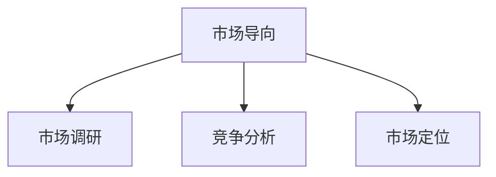
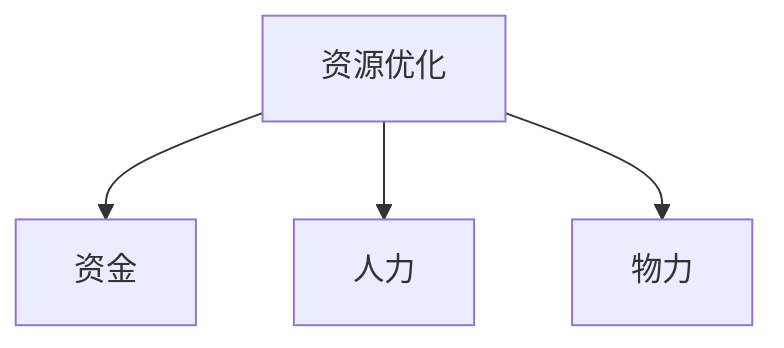
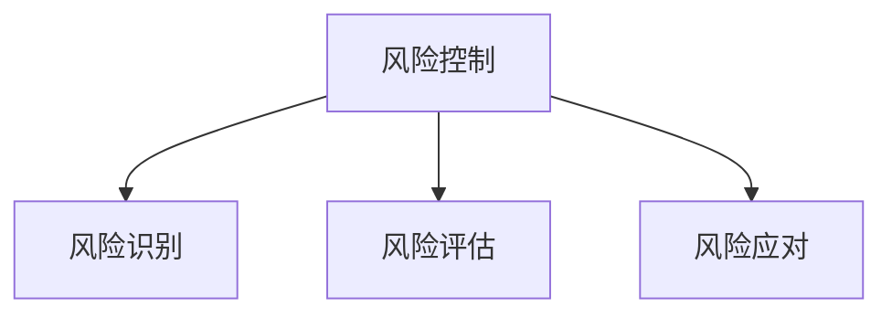

                 

### 第1章 引言

#### 1.1 书籍背景

在当前全球化的商业环境中，公司扩张已经成为企业发展的关键策略之一。然而，对于一人公司而言，如何在资源有限的情况下实现有效扩张，成为了企业家们面临的重要课题。本书籍旨在为一人公司的经营者提供一套全面、系统的扩张策略，帮助他们在竞争中脱颖而出。

#### 1.2 扩张的必要性

一人公司，顾名思义，是指由一个自然人独资经营的企业。这种企业形式具有决策灵活、成本较低等优点，但同时也面临着资金瓶颈、管理能力不足等挑战。为了在激烈的市场竞争中保持优势，一人公司必须适时进行扩张，以实现资源整合、提高市场竞争力。

#### 1.3 读者的期望

本书旨在为读者提供以下方面的帮助：

1. **理解一人公司的特点与挑战**：通过深入分析一人公司的组织结构、优势与劣势，帮助读者全面认识一人公司的运营模式。
2. **掌握扩张策略的概述**：介绍扩张的目标与类型、基本原则以及策略分类，帮助读者构建完整的扩张策略框架。
3. **进行市场分析**：讲解市场调研的方法、市场机会评估和市场风险分析，帮助读者准确把握市场动态。
4. **进行财务分析**：阐述扩张的财务需求、成本与收益分析以及资金来源与预算规划，为读者提供财务方面的指导。
5. **制定人力资源规划**：介绍扩张对人力资源的影响、人力资源需求预测以及招聘与培训策略，帮助读者合理配置人力资源。
6. **实施扩张策略**：详细描述扩张项目的管理、实施步骤以及可能出现的问题及解决方案，为读者提供实操性指导。
7. **案例研究**：通过实际案例，分析一人公司扩张的过程与结果，为读者提供可借鉴的经验。
8. **持续管理**：探讨扩张后的组织结构调整、运营管理和市场策略调整，帮助读者实现长期发展。

通过本书的深入学习，读者将能够：

- 系统地了解一人公司扩张的理论与实践；
- 制定出切实可行的扩张策略；
- 提高一人公司在市场中的竞争力；
- 为企业的长期发展奠定坚实基础。

### 第2章 一人公司的特点与挑战

#### 2.1 一人公司的定义与结构

##### 2.1.1 一人公司的概念

一人公司，即由一个自然人独资经营的企业。这种企业形式在法律上被称为“个人独资企业”或“个人经营企业”。一人公司具有以下特点：

1. **所有权与经营权统一**：一人公司的所有权和经营权集中在创始人手中，创始人对公司的决策、运营具有绝对控制权。
2. **法律形式简单**：一人公司无需设立董事会、监事会等机构，公司治理结构相对简单。
3. **税务优势**：一人公司享受个体工商户的税务优惠政策，通常仅需缴纳个人所得税。

##### 2.1.2 一人公司的组织结构

一人公司的组织结构通常分为以下几个部分：

1. **创始人**：作为公司的唯一股东和法定代表人，负责公司的全面决策和管理。
2. **员工**：根据公司规模和业务需求，一人公司可能需要雇佣员工来协助运营。员工通常分为管理层、技术部门、销售部门等。
3. **财务部门**：负责公司的财务管理和税务申报。对于一人公司而言，财务部门的职责相对简单，但仍需确保合规经营。

##### 2.1.3 一人公司的管理方式

一人公司的管理方式具有以下特点：

1. **集中管理**：由于公司规模较小，决策和运营过程通常由创始人一人负责，决策效率较高。
2. **灵活管理**：一人公司可以根据市场需求和自身能力迅速调整业务策略，经营灵活。
3. **风险管理**：一人公司面临的风险相对集中，经营决策失误可能导致公司破产。

#### 2.2 一人公司的优势与劣势

##### 2.2.1 一人公司的优势

一人公司具有以下优势：

1. **经营灵活**：由于决策集中，一人公司可以快速响应市场变化，调整经营策略。
2. **税务优势**：一人公司享受个体工商户的税务优惠政策，降低税负。
3. **成本较低**：一人公司的组织结构相对简单，运营成本较低。

##### 2.2.2 一人公司的劣势

一人公司也面临以下劣势：

1. **资金瓶颈**：由于个人资金的限制，一人公司在扩张过程中可能面临资金不足的问题。
2. **管理能力不足**：一人公司通常缺乏专业的管理团队，管理能力有限。
3. **风险集中**：一人公司的风险集中，一旦决策失误，可能对整个公司造成严重影响。

#### 2.3 一人公司面临的挑战

##### 2.3.1 市场竞争加剧

随着市场环境的不断变化，一人公司面临的竞争压力越来越大。主要挑战包括：

1. **市场细分**：市场日趋细分，一人公司需要精准定位目标客户群体，提高市场竞争力。
2. **消费者需求变化**：消费者需求不断变化，一人公司需要快速调整产品和服务策略。

##### 2.3.2 技术创新

技术创新是企业发展的关键驱动力。一人公司在技术创新方面面临的挑战包括：

1. **新技术引入**：及时引入新技术，提高产品和服务质量。
2. **技术升级与维护**：不断升级现有技术，确保技术的稳定性和可靠性。

通过本章的分析，我们可以看出一人公司在扩张过程中既面临机遇，也面临挑战。只有充分认识到这些特点与挑战，才能制定出有效的扩张策略，实现企业的持续发展。

#### 2.1 一人公司的定义与结构

##### 2.1.1 一人公司的概念

一人公司，即由一个自然人独资经营的企业，也称为个人独资企业。这种企业形式在法律上具有独立法人地位，但经营风险由投资人个人承担。一人公司具有以下主要特点：

1. **所有权与经营权统一**：一人公司的所有权和经营权集中在创始人手中，创始人作为唯一股东，对公司的经营和管理具有绝对控制权。
2. **法律形式简单**：一人公司的设立程序相对简单，无需设立董事会、监事会等机构，决策效率较高。
3. **税务优势**：一人公司通常按照个体工商户的税收政策进行纳税，享受一定的税收优惠政策。

##### 2.1.2 一人公司的组织结构

一人公司的组织结构相对简单，主要包含以下几部分：

1. **投资人（创始人）**：作为公司的唯一股东，投资人负责公司的全部资产和负债，对公司的经营和管理具有最终决策权。
2. **管理层**：由投资人本人或聘请的专业管理人员组成，负责日常运营管理和决策执行。
3. **员工**：根据公司业务需求，一人公司可能需要雇佣员工，员工分为不同职能部门，如技术部门、销售部门、财务部门等。
4. **财务部门**：负责公司的财务管理和税务申报，确保公司财务活动的合规性。

##### 2.1.3 一人公司的管理方式

一人公司的管理方式具有以下特点：

1. **集中管理**：由于公司规模较小，决策和运营过程通常由创始人一人负责，管理层次简单，决策效率较高。
2. **灵活管理**：一人公司可以根据市场需求和自身能力迅速调整业务策略，经营灵活。
3. **风险管理**：一人公司面临的风险相对集中，经营决策失误可能导致公司破产。因此，创始人需要具备较强的风险识别和应对能力。

#### 2.2 一人公司的优势与劣势

##### 2.2.1 一人公司的优势

一人公司具有以下优势：

1. **经营灵活**：由于决策集中，一人公司可以快速响应市场变化，调整经营策略。这种灵活性有助于公司在竞争激烈的市场中抓住机遇。
2. **税务优势**：一人公司通常按照个体工商户的税收政策进行纳税，享受一定的税收优惠政策，降低税负。
3. **成本较低**：一人公司的组织结构相对简单，运营成本较低。公司无需支付董事薪酬、行政管理费用等，有利于节省成本。

##### 2.2.2 一人公司的劣势

一人公司也面临以下劣势：

1. **资金瓶颈**：由于个人资金的限制，一人公司在扩张过程中可能面临资金不足的问题，限制了公司的进一步发展。
2. **管理能力不足**：一人公司通常缺乏专业的管理团队，管理能力有限，难以应对复杂的市场环境。
3. **风险集中**：一人公司的风险集中，一旦决策失误，可能对整个公司造成严重影响。公司经营风险由投资人个人承担，压力较大。

#### 2.3 一人公司面临的挑战

##### 2.3.1 市场竞争加剧

随着市场环境的不断变化，一人公司面临的竞争压力越来越大。主要挑战包括：

1. **市场细分**：市场日趋细分，一人公司需要精准定位目标客户群体，提高市场竞争力。否则，公司可能在激烈的市场竞争中失去优势。
2. **消费者需求变化**：消费者需求不断变化，一人公司需要快速调整产品和服务策略，以适应市场需求。

##### 2.3.2 技术创新

技术创新是企业发展的关键驱动力。一人公司在技术创新方面面临的挑战包括：

1. **新技术引入**：及时引入新技术，提高产品和服务质量。否则，公司可能被市场淘汰。
2. **技术升级与维护**：不断升级现有技术，确保技术的稳定性和可靠性。技术落后可能导致公司失去市场竞争力。

通过本章的分析，我们可以看出一人公司在扩张过程中既面临机遇，也面临挑战。只有充分认识到这些特点与挑战，才能制定出有效的扩张策略，实现企业的持续发展。

#### 2.1 一人公司的定义与结构

##### 2.1.1 一人公司的概念

一人公司，是指由一个自然人投资设立的有限责任公司。这种公司形式在法律上具有独立的法人地位，但股东的责任仅限于其出资额。一人公司的特点如下：

1. **单一股东**：一人公司的唯一股东可以是自然人、法人或其他组织。股东对公司的经营和管理具有最终决策权。
2. **独立法人**：一人公司作为独立的法人实体，拥有独立的财产权、诉讼权等权利。
3. **有限责任**：股东的责任限于其对公司的出资额，不会因公司债务问题而影响个人财产。

##### 2.1.2 一人公司的组织结构

一人公司的组织结构相对简单，主要包括以下部分：

1. **股东会**：作为公司的最高权力机构，股东会负责决定公司的重大事项，如公司章程的修改、注册资本的变更等。
2. **董事会**：董事会是公司的执行机构，负责公司的日常经营管理和决策执行。一人公司可以设立董事会，也可以由股东直接行使董事职责。
3. **总经理**：总经理作为公司的法定代表人，负责公司的全面管理工作。总经理通常由董事会成员或股东担任。
4. **部门经理**：根据公司的业务需求，一人公司可以设立各部门，如财务部、人力资源部、销售部等。部门经理负责本部门的日常管理和运营。

##### 2.1.3 一人公司的管理方式

一人公司的管理方式具有以下特点：

1. **集中管理**：由于公司规模较小，决策和运营过程通常由股东或董事会成员负责，管理层次简单，决策效率较高。
2. **灵活管理**：一人公司可以根据市场需求和自身能力迅速调整业务策略，经营灵活。
3. **风险管理**：一人公司需要加强对风险的识别和控制，确保公司稳定运营。

#### 2.2 一人公司的优势与劣势

##### 2.2.1 一人公司的优势

一人公司具有以下优势：

1. **决策灵活**：由于股东对公司的经营和管理具有绝对控制权，一人公司可以迅速调整经营策略，抓住市场机遇。
2. **税务优势**：一人公司可以享受税收优惠政策，降低税负。
3. **成本低**：一人公司的组织结构相对简单，运营成本较低。

##### 2.2.2 一人公司的劣势

一人公司也面临以下劣势：

1. **资金瓶颈**：由于个人资金的限制，一人公司在扩张过程中可能面临资金不足的问题。
2. **管理能力不足**：一人公司通常缺乏专业的管理团队，管理能力有限。
3. **风险集中**：一人公司的风险集中，一旦决策失误，可能对整个公司造成严重影响。

#### 2.3 一人公司面临的挑战

##### 2.3.1 市场竞争加剧

随着市场环境的不断变化，一人公司面临的竞争压力越来越大。主要挑战包括：

1. **市场细分**：市场日趋细分，一人公司需要精准定位目标客户群体，提高市场竞争力。
2. **消费者需求变化**：消费者需求不断变化，一人公司需要快速调整产品和服务策略，以适应市场需求。

##### 2.3.2 技术创新

技术创新是企业发展的关键驱动力。一人公司在技术创新方面面临的挑战包括：

1. **新技术引入**：及时引入新技术，提高产品和服务质量。
2. **技术升级与维护**：不断升级现有技术，确保技术的稳定性和可靠性。

通过本章的分析，我们可以看出一人公司在扩张过程中既面临机遇，也面临挑战。只有充分认识到这些特点与挑战，才能制定出有效的扩张策略，实现企业的持续发展。

### 第3章 扩张策略概述

#### 3.1 扩张的目标与类型

##### 3.1.1 扩张的目标

一人公司在进行扩张时，需要明确扩张的目标，以指导后续的策略制定和实施。常见的扩张目标包括：

1. **市场扩张**：开拓新的市场，扩大市场份额，提高品牌知名度。
2. **产品线扩张**：开发新的产品或服务，丰富产品线，提高产品竞争力。
3. **地域扩张**：在国内外开设分支机构或子公司，拓展业务范围。

##### 3.1.2 扩张的类型

根据扩张的方式和内容，一人公司的扩张可以分为以下几种类型：

1. **内部扩张**：通过内部资源优化和整合，提高生产效率、提升产品质量和降低成本，实现规模效应。
2. **外部扩张**：通过并购、合作等方式，获取外部资源和市场机会，实现快速扩张。
3. **横向扩张**：在同一行业或领域内，拓展新的业务领域或产品线，实现多元化经营。
4. **纵向扩张**：在现有业务基础上，向上游或下游延伸，实现业务链条的完整性和竞争优势。

#### 3.2 扩张的基本原则

##### 3.2.1 市场导向

市场导向是扩张策略制定的重要原则，一人公司在进行扩张时需要充分考虑市场需求和竞争态势。具体包括：

1. **市场需求分析**：通过市场调研和数据分析，了解目标市场的规模、增长趋势和潜在机会。
2. **市场竞争分析**：分析竞争对手的市场地位、产品和服务特点，以及自身的竞争优势和劣势。

##### 3.2.2 资源优化

资源优化是提高扩张效果的关键，一人公司需要充分利用内部资源，实现资源的最优配置。具体包括：

1. **资金**：合理规划资金使用，确保扩张项目的资金需求。
2. **人力**：优化人力资源配置，确保关键岗位有足够的专业人才。
3. **物力**：充分利用现有设备和物资，提高生产效率。

##### 3.2.3 风险控制

风险控制是确保扩张项目顺利进行的重要环节，一人公司需要识别和评估扩张过程中的风险，并制定相应的应对措施。具体包括：

1. **风险识别**：通过风险评估和预警机制，识别扩张过程中可能面临的各种风险。
2. **风险评估**：对识别出的风险进行定量和定性分析，评估风险的可能性和影响程度。
3. **风险应对**：根据风险评估结果，制定风险应对策略，包括风险规避、风险减少、风险承担和风险转移。

#### 3.3 扩张策略的分类

##### 3.3.1 市场驱动型扩张策略

市场驱动型扩张策略主要根据市场需求和竞争态势来制定，具体包括：

1. **产品驱动的市场扩张**：通过开发新产品或优化现有产品，满足市场需求，提高市场占有率。
2. **市场驱动的产品扩张**：根据市场需求变化，调整产品结构和策略，实现市场份额的扩大。

##### 3.3.2 资源驱动型扩张策略

资源驱动型扩张策略主要依赖于外部资源的获取和整合，具体包括：

1. **内部资源优化**：通过提高生产效率、优化供应链管理等方式，实现资源的最优配置。
2. **外部资源整合**：通过并购、合作等方式，获取外部资源和市场机会，实现快速扩张。

##### 3.3.3 创新驱动型扩张策略

创新驱动型扩张策略主要依靠技术创新和商业模式创新，具体包括：

1. **技术创新**：通过引入新技术、新产品，提高企业的技术水平和市场竞争力。
2. **商业模式创新**：通过创新商业模式，实现企业收入的多元化。

##### 3.3.4 整合驱动型扩张策略

整合驱动型扩张策略主要通过资源整合和业务整合，实现企业的快速发展，具体包括：

1. **并购**：通过并购其他企业，快速扩大市场份额和业务范围。
2. **合作与联盟**：通过合作和联盟，共同开拓市场和资源，提高企业的竞争力。

##### 3.3.5 多元化扩张策略

多元化扩张策略主要通过业务多元化和市场多元化，实现企业的可持续发展，具体包括：

1. **产品多元化**：开发新的产品或服务，丰富产品线，提高企业竞争力。
2. **市场多元化**：开拓新的市场和业务领域，实现市场的多元化布局。
3. **业务多元化**：通过多元化业务模式，降低企业的经营风险，实现稳定发展。

通过本章的分析，我们可以看出，一人公司在进行扩张时，需要根据自身实际情况和市场环境，制定合适的扩张策略。只有科学合理地制定和实施扩张策略，才能实现企业的长期发展。

#### 3.1 扩张的目标与类型

##### 3.1.1 扩张的目标

一人公司在进行扩张时，首先需要明确扩张的目标。这些目标通常包括：

1. **市场份额提升**：通过扩大销售渠道、增加产品种类或提高服务质量，提高公司在市场中的占有率。
2. **产品线丰富**：拓展公司的产品线，增加新产品的研发和生产，满足更多消费者的需求。
3. **地域扩展**：在国内外设立分支机构或子公司，进入新的市场，提高公司的市场覆盖范围。
4. **技术创新**：通过研发新技术和新产品，提升公司的技术实力和市场竞争力。
5. **品牌影响力增强**：通过市场推广和品牌建设，提升公司在消费者心中的形象和地位。

##### 3.1.2 扩张的类型

根据扩张的方式和目的，一人公司的扩张可以分为以下几种类型：

1. **内部扩张**：通过内部资源优化和整合，提高生产效率、提升产品质量和降低成本，实现规模效应。内部扩张通常包括增加生产设备、扩大生产线、提高员工技能等。
   
   ```mermaid
   graph TD
   A[内部扩张] --> B[增加生产设备]
   A --> C[扩大生产线]
   A --> D[提高员工技能]
   ```

2. **外部扩张**：通过并购、合作等方式，获取外部资源和市场机会，实现快速扩张。外部扩张通常包括收购竞争对手、与合作伙伴建立战略联盟等。

   ```mermaid
   graph TD
   E[外部扩张] --> F[收购竞争对手]
   E --> G[建立战略联盟]
   ```

3. **横向扩张**：在同一行业或领域内，拓展新的业务领域或产品线，实现多元化经营。横向扩张通常包括进入相关产业、收购同类企业等。

   ```mermaid
   graph TD
   H[横向扩张] --> I[进入相关产业]
   H --> J[收购同类企业]
   ```

4. **纵向扩张**：在现有业务基础上，向上游或下游延伸，实现业务链条的完整性和竞争优势。纵向扩张通常包括向上游供应商的并购、向下游客户的拓展等。

   ```mermaid
   graph TD
   K[纵向扩张] --> L[向上游供应商的并购]
   K --> M[向下游客户的拓展]
   ```

通过上述分析和Mermaid流程图，我们可以更清晰地理解一人公司扩张的不同类型和目标。接下来，我们将进一步探讨扩张的基本原则。

#### 3.2 扩张的基本原则

##### 3.2.1 市场导向

市场导向是制定扩张策略的核心原则。一人公司在进行扩张时，需要紧密关注市场动态，以满足市场需求为导向。具体措施包括：

1. **市场调研**：通过定量和定性的市场调研方法，了解目标市场的规模、增长趋势和消费者需求。例如，可以采用问卷调查、访谈等方式收集数据。

2. **竞争分析**：分析竞争对手的市场地位、产品和服务特点，以及自身的竞争优势和劣势。这有助于公司制定有针对性的市场策略。

3. **市场定位**：根据市场调研和竞争分析结果，明确公司的市场定位，制定合适的市场进入策略。例如，可以通过差异化策略、价格策略等提高市场竞争力。



##### 3.2.2 资源优化

资源优化是确保扩张成功的关键。一人公司在进行扩张时，需要充分利用现有资源，实现资源的最优配置。具体包括：

1. **资金**：合理规划资金使用，确保扩张项目的资金需求。可以通过增加自有资金、寻求外部融资等方式解决资金问题。

2. **人力**：优化人力资源配置，确保关键岗位有足够的专业人才。可以通过内部培训、外部招聘等方式提升员工技能。

3. **物力**：充分利用现有设备和物资，提高生产效率。可以通过设备升级、库存优化等措施实现资源优化。



##### 3.2.3 风险控制

风险控制是确保扩张项目顺利进行的重要环节。一人公司在进行扩张时，需要识别和评估扩张过程中的风险，并制定相应的应对措施。具体包括：

1. **风险识别**：通过风险评估和预警机制，识别扩张过程中可能面临的各种风险。例如，资金风险、市场风险、技术风险等。

2. **风险评估**：对识别出的风险进行定量和定性分析，评估风险的可能性和影响程度。例如，可以通过风险矩阵等方法进行风险评估。

3. **风险应对**：根据风险评估结果，制定风险应对策略。例如，可以通过风险规避、风险减少、风险承担和风险转移等措施降低风险。



通过上述原则和Mermaid流程图，我们可以更清晰地理解一人公司在进行扩张时需要考虑的各个方面。接下来，我们将讨论扩张策略的分类。

#### 3.3 扩张策略的分类

##### 3.3.1 市场驱动型扩张策略

市场驱动型扩张策略是指以市场需求和竞争态势为导向，通过市场分析和定位，制定和实施扩张策略。这类策略通常包括以下几种：

1. **产品驱动的市场扩张**：通过开发新产品或优化现有产品，满足市场需求，提高市场占有率。例如，根据消费者需求变化，推出符合市场潮流的新产品。

   ```python
   # 产品驱动的市场扩张伪代码
   def product_driven_expansion():
       # 市场调研
       market_research()
       # 产品开发
       new_product_development()
       # 市场推广
       marketing_promotion()
   ```

2. **市场驱动的产品扩张**：根据市场需求变化，调整产品结构和策略，实现市场份额的扩大。例如，根据市场需求，增加或减少某些产品的生产和销售。

   ```python
   # 市场驱动的产品扩张伪代码
   def market_driven_product_expansion():
       # 市场调研
       market_research()
       # 产品结构调整
       product_structure_adjustment()
       # 销售策略调整
       sales_strategy_adjustment()
   ```

##### 3.3.2 资源驱动型扩张策略

资源驱动型扩张策略是指通过获取和整合外部资源，实现快速扩张。这类策略通常包括以下几种：

1. **内部资源优化**：通过提高生产效率、优化供应链管理等方式，实现资源的最优

