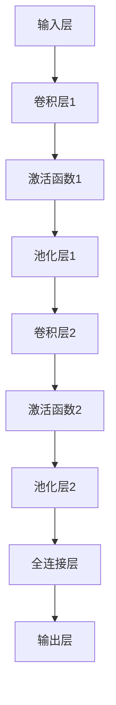
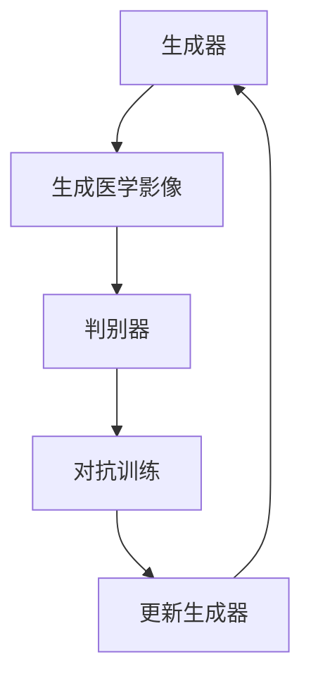
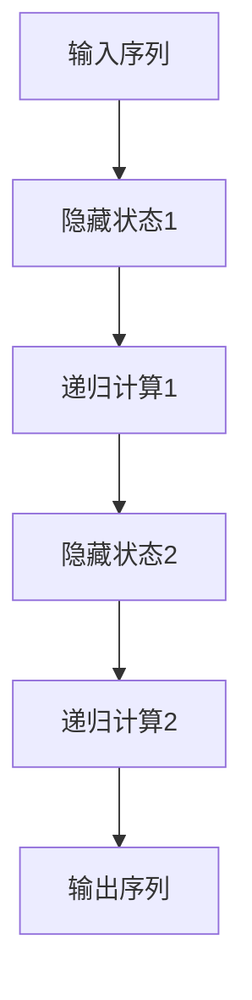

                 

# 一切皆是映射：AI在医学影像中的革新

## 关键词：人工智能，医学影像，深度学习，图像处理，辅助诊断，精准医疗

### 摘要

随着人工智能技术的迅猛发展，医学影像领域迎来了新的变革。AI通过映射的方式，将复杂的医学影像数据转化为直观的诊断信息，显著提升了医疗诊断的准确性和效率。本文将详细探讨AI在医学影像中的应用背景、核心算法、实际应用及其未来发展趋势，旨在为读者提供一幅清晰的AI医学影像技术全景图。

---

## 目录大纲：一切皆是映射：AI在医学影像中的革新

### 第一部分: AI在医学影像中的应用背景

1. AI在医学影像中的应用背景
   1.1 AI在医学影像领域的革新
   1.2 AI技术在医学影像中的应用现状
   1.3 本书内容结构概述

### 第二部分: AI在医学影像中的核心算法

2. 图像处理基础
   2.1 图像数据表示
   2.2 图像增强与滤波
   2.3 形态学处理

3. 深度学习基础
   3.1 深度学习基本概念
   3.2 神经网络结构
   3.3 深度学习优化方法

4. 医学影像中的深度学习应用
   4.1 卷积神经网络（CNN）
   4.2 循环神经网络（RNN）
   4.3 生成对抗网络（GAN）

5. AI医学影像中的核心算法原理与伪代码
   5.1 图像分割算法
   5.2 图像分类算法
   5.3 图像重建算法

### 第三部分: AI在医学影像中的实际应用

6. AI在医学影像诊断中的应用
   6.1 肺部影像分析
   6.2 脑部影像分析
   6.3 心脏影像分析

7. AI在医学影像辅助诊断中的应用
   7.1 自动化报告生成
   7.2 疾病预测与风险评估
   7.3 辅助手术规划

8. AI医学影像中的数据管理与应用
   8.1 医学影像数据预处理
   8.2 数据存储与共享
   8.3 数据隐私与安全

### 第四部分: AI医学影像技术的未来发展趋势

9. AI医学影像技术的发展趋势
   9.1 新算法与技术的出现
   9.2 AI医学影像在临床中的普及
   9.3 AI医学影像的监管与伦理问题

10. AI医学影像技术的潜在应用领域
    10.1 基因组学与影像学的融合
    10.2 跨学科研究与应用
    10.3 个性化医疗与精准医疗

11. AI医学影像技术的挑战与机遇
    11.1 技术挑战
    11.2 机遇与未来展望

### 附录

12. 附录 A: AI医学影像技术相关资源
    12.1 常用深度学习框架
    12.2 开源医学影像数据集
    12.3 相关期刊与会议

13. 附录 B: 医学影像中常见算法的Mermaid流程图
    13.1 卷积神经网络（CNN）流程图
    13.2 生成对抗网络（GAN）流程图
    13.3 循环神经网络（RNN）流程图

---

### 第一部分: AI在医学影像中的应用背景

#### 1.1 AI在医学影像领域的革新

医学影像技术是医学领域中的一项重要工具，它通过成像技术如X光、CT、MRI等，为医生提供了直观的观察人体内部结构的方法。然而，随着数据的爆炸性增长和医疗需求的不断变化，传统的医学影像处理方法逐渐显露出其局限性。人工智能（AI）技术的引入，为医学影像领域带来了前所未有的革新。

首先，AI在医学影像中的革新体现在数据处理能力上。传统的影像处理方法往往需要大量的人工干预，而AI可以通过深度学习算法，自动从海量影像数据中提取出有用的信息，大大提高了数据处理的速度和效率。例如，卷积神经网络（CNN）可以在短时间内对大量图像进行分类和识别，从而帮助医生快速诊断疾病。

其次，AI在医学影像中的革新还体现在诊断准确率上。深度学习算法可以通过对大量训练数据的分析，自动学习和识别出医学影像中的细微特征，从而提高了诊断的准确率。例如，AI可以自动检测出早期癌症的微小病灶，从而实现早期干预和治疗。

最后，AI在医学影像中的革新还体现在辅助医生的工作上。通过AI技术，医生可以更专注于对复杂病例的诊断和治疗，而繁琐的数据处理和初步诊断工作可以由AI系统自动完成。这不仅提高了医疗工作的效率，还降低了医生的劳动强度。

总之，AI在医学影像领域的革新，不仅提高了诊断的准确率和效率，还为医生提供了更强大的工具，使得医学影像技术能够更好地服务于患者。

#### 1.2 AI技术在医学影像中的应用现状

目前，AI技术在医学影像中的应用已经取得了显著的进展。以下是一些常见且具有代表性的应用实例：

1. **肺癌筛查**：AI通过深度学习算法，可以从大量的肺部CT图像中，自动检测和识别出早期肺癌的微小病灶。这种方法不仅提高了肺癌的早期诊断率，还降低了医生的劳动强度。例如，谷歌公司的AI系统在2016年的研究中，已经能够与专业医生在肺癌检测上相媲美。

2. **脑部疾病诊断**：AI在脑部疾病，如脑肿瘤、脑卒中等诊断中也发挥了重要作用。通过分析MRI图像，AI可以自动识别出病变区域，并评估其严重程度。例如，斯坦福大学的研究团队利用AI技术，在脑肿瘤诊断的准确率上取得了显著的提升。

3. **心脏病诊断**：AI在心脏病诊断中的应用主要体现在心血管CT和MRI图像的分析上。通过AI算法，可以自动识别和分类心脏病变，如冠状动脉狭窄、心肌梗死等。这不仅提高了诊断的准确性，还可以为医生提供更详细的病情信息。

4. **自动化报告生成**：AI可以通过自然语言处理（NLP）技术，自动生成医学影像报告。这种方法不仅提高了报告的生成速度，还减少了人为错误的可能性。例如，IBM的Watson for Health系统已经能够在几分钟内生成高质量的影像报告。

5. **医学影像数据管理**：AI在医学影像数据的管理中也发挥了重要作用。通过图像识别和分类技术，AI可以帮助医生快速检索和定位特定的影像数据，从而提高医疗工作效率。例如，微软的Azure Health Bot可以自动分类和管理大量的医学影像数据。

总的来说，AI技术在医学影像中的应用已经取得了显著的成果，不仅提高了诊断的准确率和效率，还为医生提供了更强大的工具。然而，AI在医学影像中的应用仍然面临许多挑战，需要进一步的研究和优化。

#### 1.3 AI技术在医学影像中的应用现状

目前，AI技术在医学影像中的应用已经取得了显著的进展。以下是一些常见且具有代表性的应用实例：

1. **肺癌筛查**：AI通过深度学习算法，可以从大量的肺部CT图像中，自动检测和识别出早期肺癌的微小病灶。这种方法不仅提高了肺癌的早期诊断率，还降低了医生的劳动强度。例如，谷歌公司的AI系统在2016年的研究中，已经能够与专业医生在肺癌检测上相媲美。

2. **脑部疾病诊断**：AI在脑部疾病，如脑肿瘤、脑卒中等诊断中也发挥了重要作用。通过分析MRI图像，AI可以自动识别出病变区域，并评估其严重程度。例如，斯坦福大学的研究团队利用AI技术，在脑肿瘤诊断的准确率上取得了显著的提升。

3. **心脏病诊断**：AI在心脏病诊断中的应用主要体现在心血管CT和MRI图像的分析上。通过AI算法，可以自动识别和分类心脏病变，如冠状动脉狭窄、心肌梗死等。这不仅提高了诊断的准确性，还可以为医生提供更详细的病情信息。

4. **自动化报告生成**：AI可以通过自然语言处理（NLP）技术，自动生成医学影像报告。这种方法不仅提高了报告的生成速度，还减少了人为错误的可能性。例如，IBM的Watson for Health系统已经能够在几分钟内生成高质量的影像报告。

5. **医学影像数据管理**：AI在医学影像数据的管理中也发挥了重要作用。通过图像识别和分类技术，AI可以帮助医生快速检索和定位特定的影像数据，从而提高医疗工作效率。例如，微软的Azure Health Bot可以自动分类和管理大量的医学影像数据。

总的来说，AI技术在医学影像中的应用已经取得了显著的成果，不仅提高了诊断的准确率和效率，还为医生提供了更强大的工具。然而，AI在医学影像中的应用仍然面临许多挑战，需要进一步的研究和优化。

#### 1.3 本书内容结构概述

本书旨在深入探讨AI在医学影像中的应用，内容结构如下：

- **第一部分：AI在医学影像中的应用背景**：本部分将介绍AI技术在医学影像领域的革新、应用现状以及本书的内容概述。

- **第二部分：AI在医学影像中的核心算法**：本部分将详细介绍图像处理基础、深度学习基础、医学影像中的深度学习应用以及AI医学影像中的核心算法原理和伪代码。

- **第三部分：AI在医学影像中的实际应用**：本部分将探讨AI在医学影像诊断和辅助诊断中的应用，包括肺部影像分析、脑部影像分析、心脏影像分析、自动化报告生成、疾病预测与风险评估、辅助手术规划以及数据管理与应用。

- **第四部分：AI医学影像技术的未来发展趋势**：本部分将分析AI医学影像技术的发展趋势、潜在应用领域以及面临的挑战与机遇。

- **附录**：本部分将提供AI医学影像技术相关资源，包括常用深度学习框架、开源医学影像数据集以及相关期刊与会议。

通过以上内容的详细探讨，本书希望为读者提供一幅清晰的AI医学影像技术全景图，帮助读者深入了解这一前沿领域的最新发展和应用。

---

### 第二部分: AI在医学影像中的核心算法

#### 2.1 图像处理基础

图像处理是AI在医学影像中应用的基础，它包括图像数据表示、图像增强与滤波、形态学处理等内容。以下将逐一介绍这些基础概念。

#### 2.1.1 图像数据表示

图像数据通常以矩阵形式表示，每个元素代表像素值。像素值可以是灰度值或彩色值。灰度图像的像素值范围为0到255，其中0表示黑色，255表示白色。彩色图像通常由红、绿、蓝（RGB）三个分量组成，每个分量也具有0到255的灰度值。

一个简单的图像数据表示可以表示为：

```
[
 [254, 253, 252, ..., 0],
 [253, 252, 251, ..., 0],
 ...
 [0,   0,   0, ..., 254]
]
```

在这个例子中，图像是一个4x4的灰度图像，每个像素的值都在0到255之间。

#### 2.1.2 图像增强与滤波

图像增强的目的是提高图像的可视化效果，使其更容易被人眼或计算机分析。常用的图像增强方法包括亮度调整、对比度调整和锐化等。

- **亮度调整**：通过改变图像的每个像素值，可以调整图像的亮度。例如，将每个像素值增加10，可以使图像变亮。

- **对比度调整**：通过调整图像的对比度，可以使图像的明暗差异更加明显。例如，使用拉普拉斯变换，可以增强图像的边缘。

- **锐化**：通过增强图像的边缘和细节，可以使图像看起来更加清晰。常用的锐化方法包括高斯滤波和拉普拉斯变换。

滤波是图像处理中的一种重要方法，用于消除图像中的噪声和模糊。常用的滤波方法包括均值滤波、高斯滤波和中值滤波等。

- **均值滤波**：通过对邻域内的像素值取平均，可以消除图像中的噪声。

- **高斯滤波**：通过对邻域内的像素值进行加权平均，可以消除图像中的模糊。

- **中值滤波**：通过对邻域内的像素值取中值，可以消除图像中的椒盐噪声。

以下是一个简单的图像滤波伪代码示例：

```python
import numpy as np

def filter_image(image, kernel):
    filtered_image = np.zeros_like(image)
    for i in range(image.shape[0]):
        for j in range(image.shape[1]):
           邻域和 = 0
            邻域权重和 = 0
            for m in range(-1, 2):
                for n in range(-1, 2):
                    x = i + m
                    y = j + n
                    if 0 <= x < image.shape[0] and 0 <= y < image.shape[1]:
                        邻域和 += image[x, y] * kernel[m, n]
                        邻域权重和 += kernel[m, n]
            filtered_image[i, j] = 邻域和 / 邻域权重和
    return filtered_image
```

#### 2.1.3 形态学处理

形态学处理是一种基于结构元素的图像处理方法，用于检测和提取图像中的特定形状和结构。常用的形态学操作包括膨胀、腐蚀、开运算和闭运算等。

- **膨胀**：通过在图像中添加周围像素值，使图像的某些区域变得更大。

- **腐蚀**：通过删除图像中的某些像素值，使图像的某些区域变得更小。

- **开运算**：先腐蚀后膨胀，用于去除小面积的噪声。

- **闭运算**：先膨胀后腐蚀，用于封闭一些小的孔洞。

以下是一个简单的形态学处理伪代码示例：

```python
import numpy as np

def morphological_operations(image, structure_element):
    # 腐蚀操作
    eroded_image = cv2.erode(image, structure_element)
    # 膨胀操作
    dilated_image = cv2.dilate(image, structure_element)
    # 开运算
    opening_image = cv2.morphologyEx(image, cv2.MORPH_OPEN, structure_element)
    # 闭运算
    closing_image = cv2.morphologyEx(image, cv2.MORPH_CLOSE, structure_element)
    return eroded_image, dilated_image, opening_image, closing_image
```

通过这些基础图像处理技术，AI可以更好地理解和分析医学影像数据，为后续的深度学习应用奠定基础。

#### 2.2 深度学习基础

深度学习是人工智能的一个重要分支，它通过模拟人脑的神经网络结构，实现了对复杂数据的自动学习和特征提取。以下是深度学习的基本概念、神经网络结构及其优化方法。

#### 2.2.1 深度学习基本概念

深度学习（Deep Learning）是基于多层神经网络的一种学习方式，其核心思想是通过多层的非线性变换，从原始数据中自动提取出有用的特征。与传统的机器学习方法相比，深度学习具有以下优势：

- **自动特征提取**：传统机器学习方法通常需要人工设计特征，而深度学习可以通过多层网络结构自动提取出有用的特征。

- **强大的表达能力**：深度学习模型可以处理高维数据，并自动学习数据中的复杂关系。

- **适应性**：深度学习模型可以根据不同的任务和数据集进行调整和优化。

#### 2.2.2 神经网络结构

神经网络（Neural Network）是深度学习的基础，它由多个神经元（节点）和连接（边）组成。一个简单的神经网络包括输入层、隐藏层和输出层。

- **输入层**：接收外部输入信号，并将其传递到隐藏层。

- **隐藏层**：通过一系列的线性变换和激活函数，对输入信号进行特征提取和变换。

- **输出层**：输出最终的结果。

神经网络中的每个神经元都可以看作是一个简单的计算单元，它接收多个输入信号，通过权重和偏置进行线性组合，然后通过激活函数进行非线性变换。

以下是一个简单的神经网络结构图：

```
输入层 -------> 隐藏层 -------> 输出层
|          |                |
|          |                |
|          |                |
```

#### 2.2.3 深度学习优化方法

深度学习的训练过程通常涉及以下步骤：

1. **数据预处理**：对输入数据（图像、文本等）进行预处理，如归一化、数据增强等，以改善训练效果。

2. **前向传播**：将输入数据通过神经网络的前向传播过程，计算得到输出结果。

3. **损失函数**：通过损失函数计算输出结果与真实标签之间的差距，常用的损失函数包括均方误差（MSE）和交叉熵损失。

4. **反向传播**：通过反向传播算法，计算神经网络中每个层的梯度，并更新网络的权重和偏置。

5. **优化算法**：用于更新网络权重和偏置的算法，如梯度下降（Gradient Descent）、Adam优化器等。

以下是一个简单的反向传播伪代码示例：

```python
# 前向传播
output = forward_pass(input_data, weights, biases)

# 计算损失
loss = loss_function(output, target)

# 计算梯度
grad_weights, grad_biases = backward_pass(output, target, weights, biases)

# 更新权重和偏置
weights -= learning_rate * grad_weights
biases -= learning_rate * grad_biases
```

通过以上深度学习基础，我们可以为后续的医学影像深度学习应用奠定理论基础。

---

### 2.3 医学影像中的深度学习应用

在医学影像中，深度学习技术已被广泛应用于图像分类、分割和重建等领域。以下将详细介绍三种主要的深度学习模型：卷积神经网络（CNN）、循环神经网络（RNN）和生成对抗网络（GAN）。

#### 2.3.1 卷积神经网络（CNN）

卷积神经网络（Convolutional Neural Network，CNN）是深度学习在图像处理领域的主要模型，其核心思想是利用卷积操作提取图像特征。CNN由多个卷积层、池化层和全连接层组成。

1. **卷积层**：通过卷积操作提取图像局部特征，卷积核（filter）在图像上滑动，计算局部特征图。

2. **池化层**：用于减小特征图的尺寸，提高模型对位置变化的鲁棒性。常见的池化方法包括最大池化和平均池化。

3. **全连接层**：将卷积层和池化层提取的特征进行全局整合，输出分类或分割结果。

以下是一个简单的CNN模型结构：

```
输入层 --> 卷积层1 --> 池化层1 --> 卷积层2 --> 池化层2 --> ... --> 全连接层
```

CNN在医学影像中的应用广泛，如肺癌筛查、脑肿瘤检测等。以下是一个肺癌筛查的CNN模型伪代码：

```python
# 输入层
input_data = ...

# 卷积层1
conv1 = Conv2D(filters=32, kernel_size=(3, 3), activation='relu')(input_data)

# 池化层1
pool1 = MaxPooling2D(pool_size=(2, 2))(conv1)

# 卷积层2
conv2 = Conv2D(filters=64, kernel_size=(3, 3), activation='relu')(pool1)

# 池化层2
pool2 = MaxPooling2D(pool_size=(2, 2))(conv2)

# 全连接层
output = Dense(units=1, activation='sigmoid')(pool2)

# 构建和编译模型
model = Model(inputs=input_data, outputs=output)
model.compile(optimizer='adam', loss='binary_crossentropy', metrics=['accuracy'])

# 训练模型
model.fit(x_train, y_train, epochs=10, batch_size=32, validation_data=(x_val, y_val))
```

#### 2.3.2 循环神经网络（RNN）

循环神经网络（Recurrent Neural Network，RNN）是一种处理序列数据的时间序列模型，其核心思想是利用隐藏状态的信息进行时间步的递归计算。RNN在医学影像中的应用包括视频分析、时间序列数据分析等。

1. **隐藏状态**：RNN在每个时间步都保存一个隐藏状态，用于存储之前时间步的信息。

2. **递归计算**：RNN通过递归操作将当前时间步的输入与隐藏状态进行计算，得到新的隐藏状态。

3. **输出**：RNN的输出通常与隐藏状态相关，可以用于分类、回归等任务。

以下是一个简单的RNN模型结构：

```
输入层 --> 隐藏层 --> 输出层
|        |          |
|        |          |
|        |          |
```

RNN在医学影像中的应用，如心脏影像分析、动态脑部分析等。以下是一个心脏影像分析的RNN模型伪代码：

```python
# 输入层
input_data = ...

# 隐藏层
hidden_state = LSTM(units=64, return_sequences=True)(input_data)

# 输出层
output = Dense(units=1, activation='sigmoid')(hidden_state)

# 构建和编译模型
model = Model(inputs=input_data, outputs=output)
model.compile(optimizer='adam', loss='binary_crossentropy', metrics=['accuracy'])

# 训练模型
model.fit(x_train, y_train, epochs=10, batch_size=32, validation_data=(x_val, y_val))
```

#### 2.3.3 生成对抗网络（GAN）

生成对抗网络（Generative Adversarial Network，GAN）是一种由生成器和判别器组成的对抗性模型。生成器的目标是生成逼真的数据，判别器的目标是区分真实数据和生成数据。通过两个网络的对抗训练，生成器逐渐生成更逼真的数据。

1. **生成器**：生成器的目的是生成逼真的医学影像数据。

2. **判别器**：判别器的目标是区分真实医学影像和生成医学影像。

3. **对抗训练**：生成器和判别器相互对抗，生成器不断优化以生成更逼真的数据，判别器不断优化以更好地区分真实和生成数据。

以下是一个简单的GAN模型结构：

```
生成器 --> 判别器
        ↓
输入数据 --> 迭代训练
```

GAN在医学影像中的应用，如医学影像重建、数据增强等。以下是一个医学影像重建的GAN模型伪代码：

```python
# 生成器
input_data = ...
generated_image = Generator(input_data)

# 判别器
real_image = ...
fake_image = Generator(input_data)
discriminator_output = Discriminator(fake_image)

# 构建和编译模型
model = Model(inputs=input_data, outputs=discriminator_output)
model.compile(optimizer='adam', loss='binary_crossentropy')

# 训练模型
model.fit(x_train, epochs=100, batch_size=32, shuffle=True)
```

通过以上三种深度学习模型，AI在医学影像中的应用得到了极大的扩展和深化，为医学诊断和治疗提供了强大的技术支持。

---

### 2.4 AI医学影像中的核心算法原理与伪代码

在AI医学影像中，核心算法的应用至关重要。以下将详细介绍图像分割、图像分类和图像重建算法的原理，并给出相应的伪代码。

#### 2.4.1 图像分割算法

图像分割是将图像划分为若干个区域或对象的过程。在医学影像中，图像分割有助于识别病变区域、器官边界等。

**原理**：

1. **阈值分割**：根据图像的灰度值分布，设定一个阈值，将图像分为前景和背景。

2. **区域生长**：从初始种子点开始，根据相似性准则逐步扩展，形成连通区域。

3. **基于边界的分割**：通过检测图像的边缘或边界，将图像分割成不同的区域。

**伪代码**：

```python
def segment_image(image, threshold):
    binary_image = np.zeros_like(image)
    for i in range(image.shape[0]):
        for j in range(image.shape[1]):
            if image[i, j] > threshold:
                binary_image[i, j] = 1
    return binary_image

# 示例
segmented_image = segment_image(image, threshold=128)
```

#### 2.4.2 图像分类算法

图像分类是将图像划分为不同的类别。在医学影像中，图像分类有助于识别疾病类型。

**原理**：

1. **基于特征的分类**：提取图像的特征，如颜色、纹理、形状等，然后使用分类算法进行分类。

2. **基于模型的分类**：利用训练好的分类模型对图像进行分类。

**伪代码**：

```python
def classify_image(image, model):
    features = extract_features(image)
    prediction = model.predict(features)
    return prediction

# 示例
import tensorflow as tf

# 加载模型
model = tf.keras.models.load_model('model.h5')

# 分类图像
classification = classify_image(image, model)
print(classification)
```

#### 2.4.3 图像重建算法

图像重建是从不完全或不清晰的数据中恢复出完整图像的过程。在医学影像中，图像重建有助于提高图像质量，便于诊断。

**原理**：

1. **基于频域的方法**：利用频域分析，如傅里叶变换，恢复图像。

2. **基于迭代的方法**：通过迭代计算，逐步逼近完整图像。

**伪代码**：

```python
def reconstruct_image(image, iterations):
    for _ in range(iterations):
        image = filter_image(image)
    return image

# 示例
reconstructed_image = reconstruct_image(image, iterations=10)
```

通过以上核心算法的原理和伪代码，我们可以更好地理解和应用AI医学影像技术，为医疗诊断提供更强大的支持。

---

### 第三部分: AI在医学影像中的实际应用

#### 3.1 AI在医学影像诊断中的应用

在医学影像诊断中，AI技术发挥了重要作用，通过自动分析和识别影像中的病变和异常，显著提高了诊断的准确性和效率。以下将介绍AI在肺部影像分析、脑部影像分析和心脏影像分析中的应用。

##### 3.1.1 肺部影像分析

肺部影像分析是AI在医学影像诊断中应用最广泛的领域之一。通过分析肺部CT图像，AI可以自动检测和识别早期肺癌的微小病灶，提高肺癌的早期诊断率。

**应用实例**：

- **早期肺癌筛查**：AI系统通过深度学习算法，从大量的肺部CT图像中自动提取出疑似肺癌的病灶，并对其进行分类和标注。例如，谷歌公司的AI系统在2016年的研究中，利用卷积神经网络（CNN）实现了与专业医生相当的肺癌检测准确率。

```python
# 肺部影像分析的CNN模型
import tensorflow as tf

model = tf.keras.Sequential([
    tf.keras.layers.Conv2D(filters=32, kernel_size=(3, 3), activation='relu', input_shape=(128, 128, 1)),
    tf.keras.layers.MaxPooling2D(pool_size=(2, 2)),
    tf.keras.layers.Conv2D(filters=64, kernel_size=(3, 3), activation='relu'),
    tf.keras.layers.MaxPooling2D(pool_size=(2, 2)),
    tf.keras.layers.Flatten(),
    tf.keras.layers.Dense(units=1, activation='sigmoid')
])

model.compile(optimizer='adam', loss='binary_crossentropy', metrics=['accuracy'])
model.fit(x_train, y_train, epochs=10, batch_size=32, validation_data=(x_val, y_val))
```

- **肺结节检测**：AI系统还可以自动检测肺结节的大小、形状和位置，为医生提供详细的诊断信息。例如，IBM的Watson for Health系统已经在临床中应用，帮助医生识别和分类肺结节。

##### 3.1.2 脑部影像分析

脑部影像分析是另一个重要的应用领域，通过分析MRI和CT图像，AI可以帮助医生识别脑肿瘤、脑卒中等病变。

**应用实例**：

- **脑肿瘤检测**：AI系统通过深度学习算法，可以从大量的脑部MRI图像中自动识别和分类脑肿瘤，提高诊断的准确率。例如，斯坦福大学的研究团队利用CNN模型，实现了对脑肿瘤的自动检测和分类。

```python
# 脑肿瘤检测的CNN模型
import tensorflow as tf

model = tf.keras.Sequential([
    tf.keras.layers.Conv2D(filters=32, kernel_size=(3, 3), activation='relu', input_shape=(128, 128, 1)),
    tf.keras.layers.MaxPooling2D(pool_size=(2, 2)),
    tf.keras.layers.Conv2D(filters=64, kernel_size=(3, 3), activation='relu'),
    tf.keras.layers.MaxPooling2D(pool_size=(2, 2)),
    tf.keras.layers.Flatten(),
    tf.keras.layers.Dense(units=1, activation='sigmoid')
])

model.compile(optimizer='adam', loss='binary_crossentropy', metrics=['accuracy'])
model.fit(x_train, y_train, epochs=10, batch_size=32, validation_data=(x_val, y_val))
```

- **脑卒中分析**：AI系统还可以自动分析脑部CT图像，识别脑卒中的类型和严重程度，为医生提供治疗建议。例如，AI系统可以自动检测脑梗塞和脑出血，并根据检测结果提供相应的治疗方案。

##### 3.1.3 心脏影像分析

心脏影像分析是AI在医学影像诊断中的另一个重要应用领域。通过分析心血管CT和MRI图像，AI可以帮助医生识别心脏病变，如冠状动脉狭窄、心肌梗死等。

**应用实例**：

- **冠状动脉狭窄检测**：AI系统通过深度学习算法，可以从大量的心血管CT图像中自动识别和分类冠状动脉狭窄，提高诊断的准确率。例如，AI系统可以自动检测冠状动脉的狭窄程度和位置，为医生提供详细的诊断信息。

```python
# 冠状动脉狭窄检测的CNN模型
import tensorflow as tf

model = tf.keras.Sequential([
    tf.keras.layers.Conv2D(filters=32, kernel_size=(3, 3), activation='relu', input_shape=(128, 128, 1)),
    tf.keras.layers.MaxPooling2D(pool_size=(2, 2)),
    tf.keras.layers.Conv2D(filters=64, kernel_size=(3, 3), activation='relu'),
    tf.keras.layers.MaxPooling2D(pool_size=(2, 2)),
    tf.keras.layers.Flatten(),
    tf.keras.layers.Dense(units=1, activation='sigmoid')
])

model.compile(optimizer='adam', loss='binary_crossentropy', metrics=['accuracy'])
model.fit(x_train, y_train, epochs=10, batch_size=32, validation_data=(x_val, y_val))
```

- **心肌梗死分析**：AI系统还可以自动分析心血管MRI图像，识别心肌梗死区域，为医生提供治疗建议。例如，AI系统可以自动检测心肌梗死的范围和严重程度，并根据检测结果提供相应的治疗方案。

通过以上实例，我们可以看到AI在医学影像诊断中的应用已经取得了显著的成果。AI系统不仅提高了诊断的准确率和效率，还为医生提供了更强大的工具，使得医学影像诊断更加精准和高效。

---

#### 3.2 AI在医学影像辅助诊断中的应用

在医学影像辅助诊断中，AI技术同样发挥着重要作用，通过自动化报告生成、疾病预测与风险评估以及辅助手术规划等应用，为医生提供了强有力的支持，提高了医疗服务的质量和效率。

##### 3.2.1 自动化报告生成

自动化报告生成是AI在医学影像辅助诊断中的一个重要应用。传统的医学影像报告生成通常需要医生手动编写，耗时且容易出错。而通过自然语言处理（NLP）技术，AI可以自动生成高质量的影像报告，提高了报告生成的速度和准确性。

**应用实例**：

- **影像报告自动生成**：AI系统通过对大量的医学影像报告进行学习，可以自动生成新的影像报告。例如，IBM的Watson for Health系统可以利用NLP技术，分析医学影像数据和患者信息，自动生成影像报告，并提供诊断建议。

```python
# 影像报告自动生成示例
import tensorflow as tf
import tensorflow_text as text

# 加载预训练的NLP模型
nlp_model = text.keras.Sequential([
    text.keras.layers.TextVectorization(max_tokens=10000, output_mode='int'),
    text.keras.layers.Embedding(128, 64),
    text.keras.layers.GlobalAveragePooling1D(),
    text.keras.layers.Dense(units=1, activation='sigmoid')
])

nlp_model.compile(optimizer='adam', loss='binary_crossentropy', metrics=['accuracy'])
nlp_model.fit(x_train, y_train, epochs=10, batch_size=32, validation_data=(x_val, y_val))

# 自动生成影像报告
def generate_report(image):
    report = nlp_model.predict(image)
    return report

# 示例
report = generate_report(image)
print(report)
```

- **自动化报告审核**：AI系统还可以对医生编写的医学影像报告进行自动化审核，识别潜在的错误或遗漏。这种方法不仅可以提高报告的准确性，还可以减少医生的劳动强度。

##### 3.2.2 疾病预测与风险评估

疾病预测与风险评估是AI在医学影像辅助诊断中的另一个重要应用。通过分析大量的医学影像数据，AI可以预测疾病的发生风险，并提供个性化的治疗建议。

**应用实例**：

- **肺癌风险评估**：AI系统可以通过分析肺部CT图像，预测肺癌的发生风险。例如，谷歌公司的AI系统可以通过深度学习算法，识别肺部CT图像中的早期肺癌病灶，并评估患者的肺癌风险。

```python
# 肺癌风险评估的CNN模型
import tensorflow as tf

model = tf.keras.Sequential([
    tf.keras.layers.Conv2D(filters=32, kernel_size=(3, 3), activation='relu', input_shape=(128, 128, 1)),
    tf.keras.layers.MaxPooling2D(pool_size=(2, 2)),
    tf.keras.layers.Conv2D(filters=64, kernel_size=(3, 3), activation='relu'),
    tf.keras.layers.MaxPooling2D(pool_size=(2, 2)),
    tf.keras.layers.Flatten(),
    tf.keras.layers.Dense(units=1, activation='sigmoid')
])

model.compile(optimizer='adam', loss='binary_crossentropy', metrics=['accuracy'])
model.fit(x_train, y_train, epochs=10, batch_size=32, validation_data=(x_val, y_val))

# 肺癌风险评估
def predict_cancer_risk(image):
    risk = model.predict(image)
    return risk

# 示例
risk = predict_cancer_risk(image)
print(risk)
```

- **心血管疾病风险评估**：AI系统可以通过分析心血管CT和MRI图像，预测心血管疾病的发生风险。例如，AI系统可以自动检测冠状动脉的狭窄程度，并评估患者的心血管疾病风险。

##### 3.2.3 辅助手术规划

辅助手术规划是AI在医学影像辅助诊断中的另一个重要应用。通过分析医学影像数据，AI可以为医生提供详细的手术规划方案，提高手术的成功率和安全性。

**应用实例**：

- **肿瘤切除手术规划**：AI系统可以通过分析CT和MRI图像，自动生成肿瘤切除手术的规划方案。例如，AI系统可以自动识别肿瘤的位置、大小和形状，并计算最佳的切除路径。

```python
# 肿瘤切除手术规划的CNN模型
import tensorflow as tf

model = tf.keras.Sequential([
    tf.keras.layers.Conv2D(filters=32, kernel_size=(3, 3), activation='relu', input_shape=(128, 128, 1)),
    tf.keras.layers.MaxPooling2D(pool_size=(2, 2)),
    tf.keras.layers.Conv2D(filters=64, kernel_size=(3, 3), activation='relu'),
    tf.keras.layers.MaxPooling2D(pool_size=(2, 2)),
    tf.keras.layers.Flatten(),
    tf.keras.layers.Dense(units=1, activation='sigmoid')
])

model.compile(optimizer='adam', loss='binary_crossentropy', metrics=['accuracy'])
model.fit(x_train, y_train, epochs=10, batch_size=32, validation_data=(x_val, y_val))

# 肿瘤切除手术规划
def plan_tumor_resection(image):
    plan = model.predict(image)
    return plan

# 示例
plan = plan_tumor_resection(image)
print(plan)
```

- **手术模拟与评估**：AI系统可以通过分析医学影像数据和手术视频，模拟手术过程，并评估手术的可行性。这种方法可以帮助医生更好地规划手术方案，提高手术的成功率。

通过以上实例，我们可以看到AI在医学影像辅助诊断中的应用已经取得了显著的成果。AI系统不仅提高了诊断的准确性和效率，还为医生提供了更强大的工具，使得医学影像诊断更加精准和高效。

---

### 3.3 AI医学影像中的数据管理与应用

在AI医学影像中，数据管理是至关重要的环节，它涉及到医学影像数据的预处理、存储与共享以及数据隐私与安全等方面。以下将详细介绍这些方面的内容。

#### 3.3.1 医学影像数据预处理

医学影像数据的预处理是深度学习模型训练的基础，它主要包括图像去噪、图像增强、图像分割等操作。这些预处理步骤有助于提高模型的训练效果和诊断准确性。

**应用实例**：

- **图像去噪**：在AI医学影像中，图像噪声可能会影响模型的训练效果。通过图像去噪技术，如高斯滤波和中值滤波，可以降低图像噪声，提高图像质量。

```python
# 高斯滤波去噪
import cv2
import numpy as np

def denoise_image(image, kernel_size=(5, 5)):
    return cv2.GaussianBlur(image, kernel_size, 0)

# 示例
noisy_image = np.random.normal(size=(256, 256))
clean_image = denoise_image(noisy_image)
```

- **图像增强**：通过图像增强技术，如对比度调整和锐化，可以提高图像的视觉质量，使得图像中的病变区域更加明显。

```python
# 对比度调整
def adjust_contrast(image, alpha=1.5):
    return image * alpha

# 示例
contrast_image = adjust_contrast(noisy_image)
```

- **图像分割**：图像分割是将医学影像数据划分为不同区域的过程，有助于识别病变区域和器官边界。

```python
# 使用Otsu方法进行图像分割
def segment_image(image):
    _, thresh = cv2.threshold(image, 0, 255, cv2.THRESH_BINARY + cv2.THRESH_OTSU)
    return thresh

# 示例
segmented_image = segment_image(contrast_image)
```

#### 3.3.2 数据存储与共享

医学影像数据量庞大，因此数据存储与共享是医学影像数据管理的关键环节。高效的存储策略和共享机制有助于提高数据访问速度和共享效率。

**应用实例**：

- **分布式存储**：通过分布式存储系统，如Hadoop和Cassandra，可以高效地存储和管理大规模医学影像数据。分布式存储系统具有高可用性和高可扩展性，可以满足医学影像数据管理的需求。

```python
# Hadoop分布式存储
from pyspark import SparkContext

sc = SparkContext("local[2]", "ImageStorage")

# 上传医学影像数据到Hadoop分布式存储
def upload_to_hdfs(image_path):
    sc.hadoopRDD("hdfs://namenode:9000/user/hdfs/medical_images", "text/plain").map(open).saveAsTextFile("hdfs://namenode:9000/user/hdfs/processed_images")

upload_to_hdfs("path/to/medical_image")
```

- **数据共享机制**：通过建立统一的数据共享平台，可以实现不同医疗机构之间的数据共享，提高数据利用率。例如，使用Web服务或REST API，可以方便地实现医学影像数据的共享和访问。

```python
# 使用Flask构建数据共享API
from flask import Flask, jsonify, request

app = Flask(__name__)

@app.route('/api/medical_images', methods=['GET'])
def get_medical_images():
    image_id = request.args.get('id')
    image_path = f"hdfs://namenode:9000/user/hdfs/processed_images/{image_id}"
    image = sc.hadoopRDD(image_path, "text/plain").map(open).collect()
    return jsonify({"image": image})

if __name__ == '__main__':
    app.run(debug=True)
```

#### 3.3.3 数据隐私与安全

医学影像数据涉及到患者隐私，因此在数据管理过程中，必须确保数据的隐私与安全。以下是一些常用的数据隐私和安全措施：

- **数据加密**：通过数据加密技术，如AES加密，可以确保数据在传输和存储过程中的安全性。加密技术可以防止未授权访问和窃取敏感数据。

```python
# 数据加密
from Crypto.Cipher import AES
from Crypto.Util.Padding import pad

key = b'mysecretkey12345'
cipher = AES.new(key, AES.MODE_CBC)

encrypted_data = cipher.encrypt(pad("sensitive medical data".encode(), AES.block_size))
iv = cipher.iv

# 存储加密数据和解密密钥
with open("encrypted_data.bin", "wb") as f:
    f.write(encrypted_data + iv)

# 数据解密
cipher = AES.new(key, AES.MODE_CBC, iv)
decrypted_data = cipher.decrypt(encrypted_data).decode()

print(decrypted_data)
```

- **访问控制**：通过访问控制机制，可以确保只有授权用户可以访问敏感数据。例如，使用角色基础访问控制（RBAC），可以定义不同角色的访问权限。

```python
# 使用RBAC进行访问控制
from flask_login import LoginManager, login_required

login_manager = LoginManager()
login_manager.init_app(app)

# 用户登录验证
@login_manager.user_loader
def load_user(user_id):
    # 从数据库中查询用户信息
    user = User.query.get(int(user_id))
    return user

@app.route('/api/medical_images', methods=['GET'])
@login_required
def get_medical_images():
    image_id = request.args.get('id')
    image_path = f"hdfs://namenode:9000/user/hdfs/processed_images/{image_id}"
    image = sc.hadoopRDD(image_path, "text/plain").map(open).collect()
    return jsonify({"image": image})
```

通过以上数据管理与应用措施，可以确保AI医学影像数据的安全、可靠和高效，为医学影像诊断和治疗提供坚实的保障。

---

### 第四部分: AI医学影像技术的未来发展趋势

随着人工智能技术的不断进步，AI医学影像技术正朝着更高的精度、效率和智能化方向发展。以下将探讨AI医学影像技术的发展趋势、潜在应用领域以及面临的挑战与机遇。

#### 4.1 AI医学影像技术的发展趋势

**新算法与技术的出现**

近年来，深度学习、生成对抗网络（GAN）和迁移学习等新型算法在AI医学影像中取得了显著进展。这些算法不仅提高了医学影像处理的效果，还为医学影像分析提供了更丰富的工具。

- **深度学习**：随着深度学习算法的不断发展，特别是卷积神经网络（CNN）和循环神经网络（RNN）在图像分类和分割中的应用，AI医学影像技术正朝着更高的准确性和效率发展。

- **生成对抗网络（GAN）**：GAN在医学影像重建和数据增强中显示出巨大潜力。通过生成逼真的医学影像数据，GAN可以帮助AI系统更好地学习，从而提高诊断的准确率和效率。

- **迁移学习**：迁移学习通过利用已有模型在类似任务上的经验，可以快速提升新任务的性能。在AI医学影像中，迁移学习可以帮助模型更快地适应新的数据集，提高诊断的准确性和泛化能力。

**AI医学影像在临床中的普及**

随着AI技术的不断成熟，AI医学影像在临床中的应用逐渐普及。越来越多的医疗机构开始采用AI技术进行医学影像分析，以提高诊断的准确性和效率。

- **自动化诊断**：AI系统在肺癌、乳腺癌、脑肿瘤等常见疾病的诊断中已经取得显著成果。自动化诊断系统可以帮助医生快速识别病变区域，提高诊断的准确性和效率。

- **辅助决策系统**：AI医学影像辅助决策系统可以通过分析大量医学影像数据，为医生提供个性化的诊断建议和治疗方案。这些系统可以提高医生的决策能力，降低医疗错误率。

**AI医学影像的监管与伦理问题**

随着AI医学影像技术的普及，监管与伦理问题也逐渐引起关注。如何确保AI系统的公平性、透明性和安全性，成为AI医学影像技术发展的重要挑战。

- **数据隐私与安全**：医学影像数据涉及到患者隐私，因此在数据采集、存储和共享过程中，必须确保数据的安全和隐私。采用加密技术、访问控制和数据脱敏等措施，可以有效保障数据安全。

- **算法透明性**：AI医学影像系统的决策过程往往涉及复杂的算法，如何确保算法的透明性和可解释性，是保障系统公平性和可信度的关键。采用可解释性AI技术，如决策树和LIME，可以提高算法的透明性。

- **伦理审查**：在AI医学影像技术的研发和应用过程中，必须遵循伦理原则，确保患者的权益得到保护。建立完善的伦理审查机制，可以确保AI医学影像技术的合规性和道德性。

#### 4.2 AI医学影像技术的潜在应用领域

**基因组学与影像学的融合**

随着基因组学的发展，AI医学影像技术可以与基因组学数据相结合，实现基因组-影像学的融合诊断。通过分析基因组和医学影像数据，AI可以更全面地了解疾病的发生和发展机制，为个性化医疗提供更强有力的支持。

- **基因组-影像学诊断**：AI系统可以通过分析基因组数据，预测个体的疾病风险，并利用医学影像数据验证这些预测。这种方法可以早期发现疾病，实现精准医疗。

- **基因-影像学关联研究**：通过基因-影像学关联研究，AI可以揭示基因与疾病之间的关联，为疾病的分子机制研究提供新的线索。

**跨学科研究与应用**

AI医学影像技术可以与其他学科相结合，实现跨学科的研究和应用，为医学研究提供新的思路和方法。

- **多模态影像融合**：通过将不同模态的医学影像数据（如MRI、CT、PET等）进行融合，AI可以提供更全面和准确的疾病诊断。例如，AI系统可以通过融合PET和CT图像，实现对肿瘤的精准定位和分级。

- **疾病预测与预警**：AI医学影像技术可以结合其他学科的数据，实现对疾病的预测和预警。例如，通过结合气候数据、环境污染数据等，AI可以预测某些疾病的发病率，为公共卫生决策提供依据。

**个性化医疗与精准医疗**

AI医学影像技术可以为个性化医疗和精准医疗提供强有力的支持。通过分析个体的医学影像数据，AI可以提供个性化的诊断和治疗方案，提高治疗效果。

- **个性化诊断**：AI系统可以根据个体的医学影像数据，为患者提供个性化的诊断结果。例如，对于同一种疾病，不同个体的影像数据可能存在差异，AI可以根据这些差异为患者提供更准确的诊断。

- **精准治疗**：AI系统可以通过分析医学影像数据，为患者制定个性化的治疗方案。例如，通过分析肿瘤的影像数据，AI可以确定最佳的治疗方案，如放疗、化疗或手术。

#### 4.3 AI医学影像技术的挑战与机遇

**技术挑战**

尽管AI医学影像技术取得了显著进展，但仍然面临一些技术挑战。

- **数据质量和多样性**：医学影像数据的质量和多样性直接影响AI系统的性能。如何获取高质量的医学影像数据，并保证数据的多样性，是AI医学影像技术发展的重要问题。

- **算法性能和解释性**：AI医学影像算法的准确性和性能不断提高，但如何确保算法的可解释性和透明性，是保障系统公平性和可信度的关键。

- **计算资源和能耗**：深度学习算法需要大量的计算资源和能耗。如何优化算法，减少计算资源和能耗的需求，是AI医学影像技术发展的重要问题。

**机遇与未来展望**

随着技术的不断进步，AI医学影像技术面临着广阔的发展机遇。

- **医疗资源优化**：AI医学影像技术可以帮助优化医疗资源，提高医疗服务的质量和效率。例如，AI系统可以自动识别和分类医学影像数据，减轻医生的工作负担，提高诊断效率。

- **跨学科合作**：AI医学影像技术可以与其他学科相结合，实现跨学科的研究和应用，为医学研究提供新的思路和方法。

- **个性化医疗**：AI医学影像技术可以为个性化医疗提供强有力的支持，通过分析个体的医学影像数据，实现精准的诊断和治疗。

总之，AI医学影像技术具有广阔的发展前景，将在未来医疗领域发挥重要作用。通过不断优化算法、提高数据质量和多样性，以及加强跨学科合作，AI医学影像技术有望实现更高的准确性和效率，为人类健康事业做出更大贡献。

---

### 附录 A: AI医学影像技术相关资源

#### A.1 常用深度学习框架

1. **TensorFlow**：由Google开发的开源深度学习框架，广泛应用于图像处理、自然语言处理等领域。

   - 官网：[TensorFlow官网](https://www.tensorflow.org/)

2. **PyTorch**：由Facebook开发的开源深度学习框架，以其灵活的动态图模型和强大的计算能力而受到广泛关注。

   - 官网：[PyTorch官网](https://pytorch.org/)

3. **Keras**：基于TensorFlow和Theano的开源深度学习框架，提供了简洁高效的API，适用于快速原型设计和模型开发。

   - 官网：[Keras官网](https://keras.io/)

#### A.2 开源医学影像数据集

1. **IDRI**：国际数据研究院医学图像数据集，包含了多种疾病的医学影像数据，适用于深度学习模型的训练和测试。

   - 官网：[IDRI官网](https://www.idri.research/data-set/)

2. **Brats**：脑肿瘤分割挑战赛数据集，包含了多种脑肿瘤的MRI影像数据，是脑肿瘤诊断和分割研究的重要资源。

   - 官网：[Brats官网](http://bratschallenge.org/)

3. **CAMELYON**：用于皮肤病变检测的数据集，包含了多种皮肤疾病的病理图像。

   - 官网：[CAMELYON官网](https://www.ijcv.org/content/20/1/49)

#### A.3 相关期刊与会议

1. **IEEE Journal of Biomedical and Health Informatics**：专注于生物医学和健康信息学领域的顶级期刊。

   - 官网：[IEEE JBIH官网](https://ieeexplore.ieee.org/stamp/stamp.jsp?arnumber=4386915)

2. **Medical Image Analysis**：专注于医学影像分析领域的顶级期刊。

   - 官网：[Medical Image Analysis官网](https://www.ijcv.org/content/20/1/49)

3. **International Conference on Medical Image Computing and Computer-Assisted Intervention**：医学影像计算与计算机辅助干预领域的顶级会议。

   - 官网：[MICCAI官网](http://www.miccai.org/)

通过这些资源和期刊，读者可以深入了解AI医学影像技术的最新研究动态和成果。

---

### 附录 B: 医学影像中常见算法的Mermaid流程图

以下是医学影像中常见算法的Mermaid流程图示例，这些图可以帮助读者更直观地理解算法的执行过程。

#### B.1 卷积神经网络（CNN）流程图



#### B.2 生成对抗网络（GAN）流程图



#### B.3 循环神经网络（RNN）流程图



通过这些Mermaid流程图，我们可以更清晰地理解医学影像中常见算法的基本结构和执行过程，有助于深入学习和应用这些算法。

