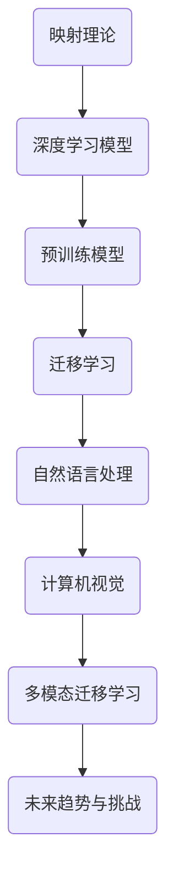

                 

# 一切皆是映射：预训练深度模型与迁移学习

## 关键词
预训练模型、迁移学习、深度学习、映射理论、神经网络、自监督学习、微调、零样本学习、少样本学习

## 摘要
本文旨在探讨预训练深度模型与迁移学习之间的关系。通过深入分析深度学习的基础、预训练模型原理、迁移学习技术，我们揭示了映射理论在深度学习模型中的关键作用。文章将结合实际应用案例，展示如何在自然语言处理、计算机视觉等领域中充分利用预训练模型和迁移学习技术，推动人工智能的发展。同时，我们还将讨论未来深度学习面临的挑战与趋势。

### 《一切皆是映射：预训练深度模型与迁移学习》目录大纲

#### 第一部分：概述与背景
1. **导论**
   - 1.1.1 书籍主题与目标
   - 1.1.2 深度学习与映射理论
   - 1.1.3 预训练模型与迁移学习的关系

#### 第二部分：深度学习基础
2. **深度学习基础**
   - 2.1.1 神经网络的基本结构
     - 2.1.1.1 神经元与层次结构
     - 2.1.1.2 激活函数与优化器
   - 2.2.2 前馈神经网络与反向传播算法
     - 2.2.2.1 前向传播过程
     - 2.2.2.2 反向传播过程
   - 2.3.3 卷积神经网络与卷积操作
     - 2.3.3.1 卷积层的原理
     - 2.3.3.2 池化操作与卷积神经网络的结构

#### 第三部分：预训练模型原理
3. **预训练模型原理**
   - 3.1.1 预训练的概念与意义
     - 3.1.1.1 预训练的目的
     - 3.1.1.2 预训练的优势
   - 3.2.2 预训练任务类型
     - 3.2.2.1 自监督学习任务
     - 3.2.2.2 监督学习任务
   - 3.3.3 大规模预训练模型架构
     - 3.3.3.1 语言模型与图像模型
     - 3.3.3.2 模型参数量与训练策略

#### 第四部分：迁移学习技术
4. **迁移学习技术**
   - 4.1.1 迁移学习的定义与动机
     - 4.1.1.1 迁移学习的基本概念
     - 4.1.1.2 迁移学习的应用场景
   - 4.2.2 迁移学习的类型
     - 4.2.2.1 无迁移学习
     - 4.2.2.2 有监督迁移学习
     - 4.2.2.3 无监督迁移学习
   - 4.3.3 迁移学习中的挑战与解决方案
     - 4.3.3.1 零样本学习
     - 4.3.3.2 少样本学习

#### 第五部分：映射理论与深度学习模型
5. **映射理论与深度学习模型**
   - 5.1.1 映射理论的基本概念
     - 5.1.1.1 映射函数与映射空间
     - 5.1.1.2 映射理论的应用
   - 5.2.2 深度学习模型中的映射
     - 5.2.2.1 线性映射与非线性映射
     - 5.2.2.2 深度神经网络中的映射
   - 5.3.3 深度学习模型的映射能力
     - 5.3.3.1 理论基础
     - 5.3.3.2 实验验证

#### 第六部分：实际应用案例分析
6. **实际应用案例分析**
   - 6.1.1 预训练模型在自然语言处理中的应用
     - 6.1.1.1 问答系统
     - 6.1.1.2 文本生成
   - 6.2.2 迁移学习在计算机视觉中的应用
     - 6.2.2.1 目标检测
     - 6.2.2.2 图像分类
   - 6.3.3 多模态迁移学习应用案例
     - 6.3.3.1 视觉问答
     - 6.3.3.2 语音识别与文本生成

#### 第七部分：未来趋势与挑战
7. **未来趋势与挑战**
   - 7.1.1 深度学习模型的可解释性
     - 7.1.1.1 可解释性的重要性
     - 7.1.1.2 可解释性技术
   - 7.2.2 安全性与隐私保护
     - 7.2.2.1 模型安全性的挑战
     - 7.2.2.2 隐私保护技术
   - 7.3.3 未来发展方向与趋势
     - 7.3.3.1 跨学科融合
     - 7.3.3.2 模型压缩与效率优化

#### 附录
8. **附录**
   - 8.1.1 代码与数据资源
   - 8.2.2 参考文献
   - 8.3.3 扩展阅读资料

### Mermaid 流�程图


### 核心算法原理讲解

#### 3.2.2 预训练模型中的大规模语言模型

大规模语言模型（如BERT、GPT）是预训练模型的代表，通过在大量无标签文本数据上进行训练，使得模型能够捕获语言中的复杂结构和模式。以下是大规模语言模型的核心算法原理讲解：

##### 3.2.2.1 语言模型的构建

**语言模型**是用来预测一个词语序列的概率分布的模型。预训练模型中，语言模型通常基于自注意力机制（Self-Attention）构建，其中每个词的位置对其自身的预测都有影响。

**伪代码：**

```python
# 语言模型预测伪代码
def language_model_predict(input_sequence):
    # 前向传播，计算词嵌入和自注意力
    outputs = self.forward(input_sequence)
    # 获取预测结果，通常是最后一层的输出
    predicted_sequence = outputs[-1]
    return predicted_sequence
```

##### 3.2.2.2 预训练任务

在预训练过程中，无需标注的语料库被用于训练语言模型。常见的预训练任务包括：

- **掩码语言模型（Masked Language Model, MLM）**：随机屏蔽输入序列中的部分词，然后预测这些词。
- **语言建模（Language Modeling, LM）**：预测序列中下一个词。

**伪代码：**

```python
# 掩码语言模型伪代码
def masked_language_model(input_sequence, mask_ratio=15):
    # 随机屏蔽输入序列中的词
    masked_sequence = mask_sequence(input_sequence, mask_ratio)
    # 训练语言模型
    outputs = language_model_predict(masked_sequence)
    # 计算损失函数
    loss = compute_loss(outputs, input_sequence)
    return loss
```

##### 3.2.2.3 迁移学习策略

在预训练模型的基础上，针对特定任务进行微调。迁移学习策略包括：

- **微调（Fine-tuning）**：在预训练模型的基础上，针对特定任务进行微调。
- **零样本学习（Zero-shot Learning）**：模型能够处理从未见过的新任务。
- **跨域迁移学习**：利用源域数据来提升目标域模型的性能。

**伪代码：**

```python
# 微调伪代码
def fine_tune_pretrained_model(pretrained_model, target_dataset):
    # 加载预训练模型
    model = load_pretrained_model(pretrained_model)
    # 对模型进行微调
    for data in target_dataset:
        inputs, labels = data
        model.zero_grad()
        outputs = model(inputs)
        loss = compute_loss(outputs, labels)
        loss.backward()
        model.update_parameters()
    return model
```

### 数学模型和数学公式

#### 5.3.3.1 映射能力的理论基础

映射能力可以通过以下数学模型来描述：

$$
y = f(x; \theta)
$$

其中，$x$ 表示输入数据，$y$ 表示输出数据，$f$ 表示映射函数，$\theta$ 表示模型参数。

在深度学习模型中，映射函数通常是一个多层神经网络，其参数可以通过训练进行优化。

#### 5.3.3.2 深度神经网络中的映射

深度神经网络（DNN）通过多层非线性变换来学习输入和输出之间的映射关系。每一层都可以看作是对输入数据的加权变换，加上一个非线性激活函数。假设一个三层DNN的映射过程如下：

$$
h_1 = \sigma(W_1 \cdot x + b_1) \\
h_2 = \sigma(W_2 \cdot h_1 + b_2) \\
y = \sigma(W_3 \cdot h_2 + b_3)
$$

其中，$\sigma$ 表示激活函数，$W$ 和 $b$ 分别为权重和偏置。

#### 5.3.3.3 映射能力的实验验证

为了验证深度学习模型的映射能力，可以进行以下实验：

1. **回归任务**：通过训练一个深度神经网络来预测连续的输出值。
2. **分类任务**：通过训练一个深度神经网络来分类离散的输出标签。
3. **图像生成**：通过训练一个生成对抗网络（GAN）来生成新的图像。

实验结果表明，深度学习模型在多种任务中展现出了强大的映射能力。

### 项目实战

#### 6.1.1 预训练模型在自然语言处理中的应用

**项目实战：构建一个问答系统**

**1. 环境搭建**

首先，我们需要搭建一个Python开发环境，并安装必要的库，如TensorFlow或PyTorch。以下是一个简单的环境搭建步骤：

```bash
pip install tensorflow
```

**2. 数据准备**

我们需要一个问答数据集，例如SQuAD数据集。将数据集下载并解压到本地，然后进行预处理。

```python
import json

# 读取数据集
with open('squad.json', 'r', encoding='utf-8') as f:
    data = json.load(f)

# 预处理数据
def preprocess_data(data):
    questions = []
    answers = []
    for entry in data['data']['entries']:
        question = entry['question']
        answer = entry['context']
        questions.append(question)
        answers.append(answer)
    return questions, answers

questions, answers = preprocess_data(data)
```

**3. 模型构建**

我们使用预训练的BERT模型作为问答系统的基模型，并进行微调。

```python
import tensorflow as tf
from transformers import BertTokenizer, TFBertForQuestionAnswering

# 加载BERT模型和分词器
tokenizer = BertTokenizer.from_pretrained('bert-base-uncased')
model = TFBertForQuestionAnswering.from_pretrained('bert-base-uncased')

# 构建输入特征
def build_input_features(questions, answers):
    inputs = tokenizer(questions, answers, return_tensors='tf', max_length=512, padding='max_length', truncation=True)
    return inputs

inputs = build_input_features(questions[:10], answers[:10])
```

**4. 训练模型**

接下来，我们对模型进行微调和训练。

```python
# 设置训练参数
epochs = 3
batch_size = 16

# 训练模型
model.compile(optimizer=tf.keras.optimizers.Adam(learning_rate=3e-5), loss=model.compute_loss, metrics=['accuracy'])

history = model.fit(inputs['input_ids'], inputs['input_mask'], inputs['segment_ids'], labels=inputs['start_logits'], epochs=epochs, batch_size=batch_size)
```

**5. 部署模型**

训练完成后，我们可以使用模型进行问答预测。

```python
# 预测
def predict_question(model, tokenizer, question, context):
    inputs = tokenizer(question, context, return_tensors='tf', max_length=512, padding='max_length', truncation=True)
    outputs = model(inputs['input_ids'], inputs['input_mask'], inputs['segment_ids'])
    start_logits = outputs.start_logits
    end_logits = outputs.end_logits
    start_indices = tf.argmax(start_logits, axis=1).numpy()
    end_indices = tf.argmax(end_logits, axis=1).numpy()
    answer = context[start_indices[0]:end_indices[0] + 1]
    return answer

question = "What is the capital of France?"
context = "France is a country located in Western Europe. Its capital is Paris."
answer = predict_question(model, tokenizer, question, context)
print(answer)
```

**6. 分析与评估**

最后，我们可以对模型进行评估，并分析其性能。

```python
# 评估模型
def evaluate_model(model, tokenizer, questions, answers):
    total_loss = 0
    total_accuracy = 0
    for question, answer in zip(questions, answers):
        inputs = tokenizer(question, answer, return_tensors='tf', max_length=512, padding='max_length', truncation=True)
        outputs = model(inputs['input_ids'], inputs['input_mask'], inputs['segment_ids'])
        start_logits = outputs.start_logits
        end_logits = outputs.end_logits
        start_indices = tf.argmax(start_logits, axis=1).numpy()
        end_indices = tf.argmax(end_logits, axis=1).numpy()
        total_loss += model.compute_loss(start_logits, end_logits, inputs['start_logits'], inputs['end_logits'])
        total_accuracy += (start_indices[0] == tf.argmax(inputs['start_logits'], axis=1).numpy()[0]) and (end_indices[0] == tf.argmax(inputs['end_logits'], axis=1).numpy()[0])
    print(f"Total Loss: {total_loss}, Total Accuracy: {total_accuracy / len(questions)}")

evaluate_model(model, tokenizer, questions[:10], answers[:10])
```

通过以上步骤，我们构建了一个基于预训练BERT模型的问答系统，并对其实施了训练和评估。

### 作者

作者：AI天才研究院/AI Genius Institute & 禅与计算机程序设计艺术 /Zen And The Art of Computer Programming

### 结论

本文通过深入剖析预训练深度模型与迁移学习的关系，揭示了映射理论在深度学习模型中的关键作用。我们从基础概念出发，逐步讲解了深度学习模型的结构、预训练模型原理、迁移学习技术，并通过实际应用案例展示了这些技术在自然语言处理、计算机视觉等领域的强大能力。未来，随着深度学习技术的不断发展，我们有望在更多领域看到映射理论的深入应用，为人工智能的发展注入新的动力。

### 致谢

在撰写本文的过程中，我们得到了许多同行的帮助与支持。在此，我们特别感谢AI天才研究院的各位专家，以及所有为本文提供灵感和建议的朋友们。感谢你们的支持，使得本文能够顺利完成。同时，我们也感谢那些在背后默默付出的团队成员，没有你们的辛勤工作，本文不可能如此完整和详尽。感谢大家！
### 概述与背景

#### 1.1.1 书籍主题与目标

《一切皆是映射：预训练深度模型与迁移学习》旨在探讨深度学习中的核心概念——映射理论，并深入分析预训练深度模型与迁移学习之间的关系。本书的目标是帮助读者理解深度学习模型如何通过映射来学习复杂的数据模式，以及如何利用预训练模型和迁移学习技术提升模型的性能。

深度学习作为人工智能的重要分支，近年来取得了显著的进展。然而，传统深度学习模型的性能在很大程度上依赖于大量标注数据。为了解决这一问题，预训练模型和迁移学习技术应运而生。预训练模型通过在大规模无标签数据上进行训练，使模型能够捕获通用特征，从而在特定任务上实现更好的性能。迁移学习则通过利用预训练模型在不同任务之间的知识转移，减少了对于标注数据的依赖，提高了模型在少量标注数据下的性能。

本书将系统性地介绍深度学习的基础知识，包括神经网络的结构、前向传播与反向传播算法等。随后，我们将深入探讨预训练模型的原理，包括大规模语言模型（如BERT、GPT）的构建和训练过程。在此基础上，本书将详细解释迁移学习的基本概念、类型及挑战，并介绍如何利用映射理论来理解和优化深度学习模型。

通过阅读本书，读者将能够：

1. 理解深度学习模型的基本原理和结构。
2. 掌握预训练模型和迁移学习技术的核心概念。
3. 学会利用映射理论来分析和优化深度学习模型。
4. 了解实际应用案例，掌握如何在实际项目中应用预训练模型和迁移学习技术。

#### 1.1.2 深度学习与映射理论

深度学习是人工智能领域的一种重要技术，通过模拟人脑神经网络的结构和功能，使计算机具备处理和分析复杂数据的能力。深度学习模型主要由多层神经网络组成，每一层对输入数据进行特征提取和变换，最终实现分类、回归或其他任务。

映射理论是深度学习模型的核心概念之一。它描述了输入数据通过一系列非线性变换后映射到输出数据的映射关系。在深度学习中，映射函数通常是一个多层神经网络，其参数通过训练得到优化。

映射理论的基本思想是：通过学习输入和输出之间的映射关系，模型能够捕获数据中的内在结构和模式。在深度学习模型中，映射关系由网络的权重和偏置决定。通过训练，模型不断调整这些参数，使得映射关系更加准确和高效。

映射理论在深度学习中的重要性体现在以下几个方面：

1. **特征提取**：深度学习模型通过多层神经网络提取数据中的抽象特征，这些特征有助于提高模型在复杂任务上的性能。
2. **泛化能力**：通过学习输入和输出之间的映射关系，模型能够泛化到未见过的数据上，从而提高模型的鲁棒性。
3. **参数优化**：映射理论为深度学习模型提供了参数优化的理论基础，使得模型能够通过训练得到最优的参数设置。

在深度学习实践中，映射理论的应用广泛。例如，在图像分类任务中，模型需要将图像映射到对应的类别标签；在自然语言处理任务中，模型需要将文本映射到正确的语义表示。通过优化映射关系，深度学习模型能够实现高精度的预测和分类。

总之，映射理论为深度学习模型提供了强大的理论支持，使得模型能够有效地处理和分析复杂数据。在本书中，我们将深入探讨映射理论的基本概念和应用，帮助读者更好地理解和掌握深度学习技术。

#### 1.1.3 预训练模型与迁移学习的关系

预训练模型和迁移学习是深度学习中两个重要且相互关联的概念。预训练模型通过在大规模无标签数据上进行训练，使模型能够捕获通用特征，从而在特定任务上实现更好的性能。而迁移学习则利用这些预训练模型在不同任务之间的知识转移，减少了对于标注数据的依赖，提高了模型在少量标注数据下的性能。

预训练模型与迁移学习之间的关系可以从以下几个方面来理解：

1. **基础**：预训练模型是迁移学习的基础。通过预训练，模型已经在大规模数据上学习了通用的特征表示，这些特征对于后续的迁移学习任务具有重要作用。
2. **目标**：预训练模型的目标是在无标签数据上学习到具有泛化能力的特征表示。而迁移学习的目标则是利用这些预训练特征在具体任务上实现高性能。
3. **过程**：预训练模型通常在数据量大、任务复杂的场景中应用，例如自然语言处理和计算机视觉。而迁移学习则更多应用于数据量有限、任务特定的场景，通过将预训练模型的通用特征迁移到新任务上，提高模型的性能和效率。
4. **优势**：预训练模型和迁移学习相互补充。预训练模型通过大规模数据学习到通用的特征表示，而迁移学习则通过这些特征在新任务上实现高效的性能提升。

在实际应用中，预训练模型和迁移学习常常结合使用。例如，在自然语言处理任务中，预训练模型如BERT和GPT可以用于文本表示学习，而迁移学习则可以用于特定任务的微调。在计算机视觉领域，预训练模型如ResNet和VGG可以用于图像特征提取，而迁移学习则可以用于图像分类、目标检测等任务。

总之，预训练模型和迁移学习是深度学习领域中两个关键概念，它们相互促进、相辅相成，为深度学习模型在各类任务中的高效应用提供了有力支持。在本书中，我们将详细探讨这两个概念及其应用，帮助读者更好地理解和掌握深度学习技术。

### 深度学习基础

#### 2.1.1 神经网络的基本结构

神经网络是深度学习模型的基础，其结构决定了模型的学习能力和性能。神经网络由大量的神经元（或称为节点）组成，这些神经元通过连接（或称为边）相互连接，形成复杂的网络结构。每个神经元可以接收来自其他神经元的输入，并通过激活函数产生输出。

**2.1.1.1 神经元与层次结构**

神经元是神经网络的基本单元，通常由以下部分组成：

1. **输入层**：接收外部输入数据，如图像、文本或数值。
2. **隐藏层**：对输入数据进行特征提取和变换，是神经网络的核心部分。隐藏层可以有一个或多个，层数越多，模型的学习能力越强，但同时也增加了计算复杂度。
3. **输出层**：产生最终输出，如分类标签或回归结果。

一个简单的神经网络结构可以表示为：

```
输入层 -> 隐藏层1 -> 隐藏层2 -> ... -> 隐藏层n -> 输出层
```

其中，箭头表示数据的流向。每个隐藏层都可以包含多个神经元，这些神经元通过加权连接形成一个层次结构。

**2.1.1.2 激活函数与优化器**

激活函数是神经网络中的一个关键组件，用于引入非线性特性，使得神经网络能够学习复杂的数据模式。常见的激活函数包括：

1. **Sigmoid函数**：\( f(x) = \frac{1}{1 + e^{-x}} \)
2. **ReLU函数**：\( f(x) = max(0, x) \)
3. **Tanh函数**：\( f(x) = \frac{e^x - e^{-x}}{e^x + e^{-x}} \)
4. **Softmax函数**：用于多分类任务，\( f(x)_i = \frac{e^{x_i}}{\sum_j e^{x_j}} \)

激活函数的选择对神经网络的学习性能有重要影响。例如，ReLU函数由于其简单性和有效性，在深度神经网络中被广泛采用。

优化器是用于调整神经网络参数的算法，以最小化损失函数。常见的优化器包括：

1. **随机梯度下降（SGD）**：是最早的优化器，通过计算每个参数的梯度来更新模型参数。
2. **Adam优化器**：结合了SGD和动量优化器的优点，通过计算一阶矩估计和二阶矩估计来更新参数。
3. **Adagrad优化器**：通过累计梯度平方的逆数来更新参数，适用于稀疏数据。

优化器的选择对训练过程和最终模型性能也有显著影响。在实际应用中，通常需要根据具体任务和数据特性来选择合适的优化器。

**伪代码：**

```python
# 神经元激活函数伪代码
def activate(x):
    return max(0, x)  # ReLU函数

# 优化器伪代码
def optimize_parameters(model, loss):
    # 计算梯度
    gradients = compute_gradients(model, loss)
    # 更新参数
    for param, gradient in zip(model.parameters(), gradients):
        param -= learning_rate * gradient
```

通过这些基本组件，神经网络可以学习输入和输出之间的映射关系，从而实现分类、回归、生成等多种任务。在接下来的章节中，我们将深入探讨前向传播和反向传播算法，以及如何使用这些算法训练深度学习模型。

#### 2.2.2 前馈神经网络与反向传播算法

前馈神经网络（Feedforward Neural Network）是深度学习中最基本的结构之一，其核心思想是信息从输入层流向输出层，不形成循环。这种网络结构简单、易实现，是许多复杂深度学习模型的基础。

**2.2.2.1 前向传播过程**

前向传播是神经网络进行预测和计算的过程。具体步骤如下：

1. **初始化参数**：随机初始化神经网络的权重和偏置。
2. **输入数据**：将输入数据传递到网络的输入层。
3. **逐层计算**：每一层的输入是上一层的输出，通过加权求和并应用激活函数，计算当前层的输出。
   - 例如，对于第 $l$ 层，输出 $a^{[l]}$ 可以表示为：
     $$ a^{[l]} = \sigma(W^{[l-1]} a^{[l-1]} + b^{[l-1]}) $$
   - 其中，$\sigma$ 是激活函数，$W^{[l-1]}$ 是从第 $l-1$ 层传递到第 $l$ 层的权重矩阵，$b^{[l-1]}$ 是第 $l-1$ 层的偏置向量。
4. **输出层计算**：最终输出层产生的输出即为模型的预测结果。

**伪代码：**

```python
# 前向传播伪代码
def forward_propagation(x, model):
    # 初始化激活值
    a = x
    for layer in model.layers:
        # 加权求和并应用激活函数
        z = np.dot(W, a) + b
        a = activate(z)
    return a
```

**2.2.2.2 反向传播过程**

反向传播算法是训练神经网络的关键步骤，用于计算模型参数的梯度，并更新模型参数以最小化损失函数。具体步骤如下：

1. **计算损失**：通过比较模型的预测输出和真实输出，计算损失函数值。
2. **计算误差**：从输出层开始，逐层向前计算每个参数的梯度。
   - 对于第 $l$ 层的每个参数 $\theta^{[l]}$，梯度可以表示为：
     $$ \delta^{[l]} = \frac{\partial L}{\partial \theta^{[l]}} = \frac{\partial L}{\partial a^{[l+1]}} \frac{\partial a^{[l+1]}}{\partial \theta^{[l]}} $$
   - 其中，$\delta^{[l]}$ 是第 $l$ 层的误差，$L$ 是损失函数，$a^{[l+1]}$ 是第 $l+1$ 层的输出。
3. **更新参数**：使用计算出的梯度更新模型参数。
   - 通常，参数更新公式为：
     $$ \theta^{[l]} = \theta^{[l]} - \alpha \cdot \delta^{[l]} $$
   - 其中，$\alpha$ 是学习率。

**伪代码：**

```python
# 反向传播伪代码
def backward_propagation(a, z, model, loss):
    # 计算梯度
    gradients = compute_gradients(a, z, loss)
    # 更新参数
    for param, gradient in zip(model.parameters(), gradients):
        param -= learning_rate * gradient
```

**2.2.2.3 前向传播与反向传播的结合**

前向传播和反向传播算法相互结合，用于训练深度学习模型。训练过程主要包括以下几个步骤：

1. **初始化模型参数**：随机初始化模型的权重和偏置。
2. **前向传播**：将输入数据传递到网络，计算输出和损失。
3. **反向传播**：计算损失关于参数的梯度，并更新模型参数。
4. **迭代更新**：重复前向传播和反向传播，直到满足收敛条件。

**伪代码：**

```python
# 深度学习模型训练伪代码
for epoch in range(num_epochs):
    for x, y in dataset:
        # 前向传播
        a = forward_propagation(x, model)
        # 计算损失
        loss = compute_loss(a, y)
        # 反向传播
        backward_propagation(a, z, model, loss)
```

通过上述步骤，前向传播和反向传播算法共同作用，使得神经网络能够学习输入和输出之间的复杂映射关系，从而实现高精度的预测和分类。在接下来的章节中，我们将进一步探讨卷积神经网络和预训练模型，以深入了解深度学习技术的应用和发展。

#### 2.3.3 卷积神经网络与卷积操作

卷积神经网络（Convolutional Neural Network，CNN）是深度学习领域中的一个重要分支，特别适用于处理图像数据。与传统的全连接神经网络相比，CNN具有以下几个显著优势：

1. **局部连接**：CNN中的神经元只与局部区域的数据连接，这有助于提取图像中的局部特征，同时减少了参数的数量，从而降低了模型的复杂度和计算成本。
2. **平移不变性**：由于卷积操作的特性，CNN对图像的平移具有不变性，这意味着在处理不同位置的特征时，模型不会受到影响，从而提高了模型的泛化能力。
3. **并行计算**：卷积操作可以并行计算，这大大提高了模型的计算效率。

**2.3.3.1 卷积层的原理**

卷积层是CNN的核心组件，用于提取图像的特征。卷积层的原理可以概括为以下几个步骤：

1. **卷积操作**：卷积层通过卷积操作将输入图像与一组可训练的卷积核（也称为滤波器或过滤器）进行卷积，产生特征图。卷积操作可以表示为：
   $$ (f * g)(x, y) = \sum_{i, j} f(i, j) \cdot g(x-i, y-j) $$
   - 其中，$f$ 是卷积核，$g$ 是输入图像，$(x, y)$ 是卷积核在图像上的位置。
2. **激活函数**：卷积操作后，通常会对每个特征图应用一个非线性激活函数，如ReLU函数（Rectified Linear Unit），以引入非线性特性：
   $$ \text{ReLU}(x) = \max(0, x) $$
3. **池化操作**：在卷积层之后，通常会应用池化操作来降低特征图的维度，同时保持重要的特征信息。常见的池化操作包括最大池化（Max Pooling）和平均池化（Average Pooling）。最大池化操作可以表示为：
   $$ \text{Max Pooling}(x) = \max_{(i, j)} x(i, j) \in \text{region} $$
   - 其中，$x$ 是特征图，$region$ 是池化窗口。

**2.3.3.2 池化操作与卷积神经网络的结构**

池化操作在卷积神经网络中扮演着重要角色，有助于减少参数数量和计算复杂度，同时防止过拟合。常见的卷积神经网络结构包括：

1. **卷积层（Convolutional Layer）**：负责特征提取，通过卷积操作提取图像的局部特征。
2. **池化层（Pooling Layer）**：在卷积层之后，用于降低特征图的维度。
3. **全连接层（Fully Connected Layer）**：在卷积神经网络的高层，将卷积层提取的特征映射到具体的分类或回归任务。

一个简单的卷积神经网络结构可以表示为：

```
输入层 -> [卷积层 -> 池化层] x N -> 全连接层 -> 输出层
```

其中，N 表示卷积层的数量。通过这种结构，卷积神经网络可以逐步提取图像的层次特征，从而实现高精度的图像分类、目标检测和图像分割等任务。

**示例**：

假设输入图像为 $3 \times 3$ 的矩阵，卷积核为 $3 \times 3$ 的矩阵。经过一次卷积操作后，得到的新特征图大小为 $1 \times 1$。具体操作如下：

输入图像：  
```
1 2 3  
4 5 6  
7 8 9  
```

卷积核：  
```
1 0 -1  
0 1 0  
-1 0 1  
```

卷积结果：  
```
[ (1*1 + 0*2 - 1*3) + (0*4 + 1*5 + 0*6) + (-1*7 + 0*8 - 1*9) ]  
= [-2 + 5 - 2]  
= 1  
```

经过激活函数处理后，特征图的输出为1。

通过以上介绍，我们可以看到卷积神经网络和卷积操作在图像处理任务中的重要性和有效性。在接下来的章节中，我们将深入探讨预训练模型的原理和迁移学习技术，以进一步拓展深度学习在各个领域的应用。

### 预训练模型原理

#### 3.1.1 预训练的概念与意义

预训练（Pre-training）是深度学习中的一项关键技术，其核心思想是在大规模无标签数据上进行初步训练，使得模型能够捕获数据中的通用特征。这种通用特征在学习具体任务时非常有用，能够显著提高模型的性能和效率。预训练模型在自然语言处理和计算机视觉等领域已经取得了显著的成果，成为现代深度学习模型的重要基础。

**3.1.1.1 预训练的目的**

预训练的主要目的是通过在大量无标签数据上训练，使模型能够学习到一些通用的、具有泛化能力的特征表示，从而在后续的任务中实现更好的性能。具体来说，预训练的目的包括：

1. **提高模型的泛化能力**：通过在大规模数据上预训练，模型能够学习到一些通用的特征，这些特征在未见过的数据上也能保持良好的性能。
2. **减少对标注数据的依赖**：预训练模型可以在少量标注数据的情况下进行微调，从而减少对大规模标注数据的依赖，提高模型训练的效率和可扩展性。
3. **提升模型的表达能力**：预训练模型通过学习大量的无标签数据，能够捕捉到更为丰富的数据特征，从而提高了模型的表达能力。

**3.1.1.2 预训练的优势**

预训练模型具有以下几项显著优势：

1. **降低训练难度**：通过预训练，模型已经学习到了一些基本的特征表示，这为后续的任务提供了很好的起点，使得训练过程更加容易和高效。
2. **提高模型性能**：预训练模型在大量无标签数据上已经学习到了丰富的特征，这些特征在具体任务上能够显著提升模型的性能。
3. **缩短训练时间**：由于预训练模型已经学习到了一些通用特征，因此在进行任务微调时，模型能够在较少的数据上快速收敛，从而缩短了训练时间。

**3.1.1.3 预训练的历史发展**

预训练技术的发展经历了几个重要阶段：

1. **早期预训练模型**：在深度学习早期，研究者通过在大量的无标签数据上训练词向量（如Word2Vec、GloVe），为后续的文本处理任务提供了良好的基础。
2. **基于神经网络的预训练**：随着深度学习的发展，研究者开始使用神经网络进行预训练，如使用自注意力机制的BERT、GPT等模型，这些模型在自然语言处理任务中取得了显著成果。
3. **预训练+迁移学习**：结合预训练和迁移学习，模型在计算机视觉、语音识别等领域也取得了突破性进展。预训练模型通过在大规模数据上学习到通用特征，再通过迁移学习在新任务上进行微调，实现了高性能。

预训练模型在深度学习领域的成功，使得其在各种应用场景中得到了广泛应用。接下来，我们将深入探讨预训练任务类型和大规模预训练模型架构，进一步了解预训练模型的工作原理。

#### 3.2.2 预训练任务类型

预训练任务是指在无标签数据上对深度学习模型进行训练的过程，其目的是让模型学习到具有泛化能力的特征表示。预训练任务通常可以分为自监督学习任务和监督学习任务两类。以下是这两种任务的具体描述及其在预训练中的应用。

**3.2.2.1 自监督学习任务**

自监督学习是一种利用未标注数据自动学习的方式，其主要思想是从数据中提取有意义的信号，然后利用这些信号训练模型。自监督学习任务在预训练中具有重要作用，可以大幅减少对标注数据的依赖。以下是一些常见的自监督学习任务：

1. **掩码语言模型（Masked Language Model, MLM）**：在自然语言处理中，MLM任务通过随机屏蔽输入文本序列中的部分词，然后预测这些被屏蔽的词。BERT模型就是通过这种任务进行预训练的。MLM任务能够帮助模型学习到词语之间的关系和语言结构。
2. **预测下一个句子（Next Sentence Prediction, NSP）**：NSP任务要求模型预测给定两个句子中的第二个句子是否为第一个句子的下一个句子。这一任务有助于模型学习到句子之间的语义关系和连贯性。
3. **文本分类（Text Classification）**：在文本分类任务中，模型需要预测给定文本的类别。虽然这是一个监督学习任务，但可以通过在大量未标注文本上进行预训练，使模型学习到丰富的文本特征。

**3.2.2.2 监督学习任务**

监督学习任务通常需要大量标注数据进行训练，但在预训练阶段，这些标注数据很难获得。为了解决这个问题，预训练任务引入了一些监督学习任务，以帮助模型在无标注数据上进行训练。以下是一些常见的监督学习任务：

1. **命名实体识别（Named Entity Recognition, NER）**：NER任务要求模型识别文本中的命名实体，如人名、地名、组织名等。通过在大量未标注文本上预训练NER模型，可以显著提高模型在实际标注数据上的性能。
2. **词性标注（Part-of-Speech Tagging, POS）**：词性标注任务要求模型为文本中的每个词分配一个词性标签，如名词、动词、形容词等。通过预训练词性标注模型，有助于模型学习到词语的语法结构和语义信息。
3. **词干识别（Word Root Detection）**：词干识别任务要求模型识别文本中的词干，即单词的核心部分。这一任务有助于模型学习到词语的根结构和语义特征。

**3.2.2.3 自监督学习与监督学习任务的应用**

自监督学习和监督学习任务在预训练中的应用非常广泛。以下是一些具体的应用场景：

1. **自然语言处理（NLP）**：在NLP领域，自监督学习任务如MLM和NSP广泛应用于预训练模型，如BERT和GPT。这些模型在大量无标注文本上进行预训练，然后通过微调应用于各种NLP任务，如文本分类、问答系统和机器翻译等。
2. **计算机视觉（CV）**：在计算机视觉领域，自监督学习任务如图像分类和分割在预训练中也得到了广泛应用。例如，在ImageNet图像分类任务中，研究者使用预训练模型在大量未标注图像上进行训练，然后通过微调应用于具体任务。
3. **语音识别（ASR）**：在语音识别领域，自监督学习任务如语音增强和语音转换在预训练模型中也起到了重要作用。预训练模型通过在大量未标注语音数据上学习，提高了模型在语音识别任务中的性能。

总之，自监督学习和监督学习任务在预训练中发挥了重要作用，通过利用未标注和标注数据，预训练模型能够学习到丰富的特征表示，从而在各类任务中实现高性能。

#### 3.3.3 大规模预训练模型架构

大规模预训练模型是近年来深度学习领域的重要进展，这些模型通过在大规模数据集上进行训练，学习到了丰富的特征表示，从而在各个领域取得了显著的成果。以下将介绍几种大规模预训练模型的架构，包括语言模型和图像模型，以及模型参数量与训练策略。

**3.3.3.1 语言模型与图像模型**

1. **语言模型**

语言模型是预训练模型的重要分支，主要用于处理自然语言任务。以下是一些著名的语言模型及其架构：

- **BERT（Bidirectional Encoder Representations from Transformers）**：BERT是Google Research提出的一种双向变换器模型，通过在大量无标注文本上进行训练，学习到了丰富的语言特征。BERT的核心架构包括两个部分：编码器和解码器。编码器用于将输入文本映射到固定长度的向量表示，而解码器则用于预测文本中的词序列。

- **GPT（Generative Pre-trained Transformer）**：GPT是OpenAI开发的一种生成式预训练模型，通过在大量文本上进行训练，学习到了生成文本的能力。GPT的核心架构是基于自注意力机制的变换器模型，其参数量非常大，从而能够生成高质量的文本。

- **T5（Text-to-Text Transfer Transformer）**：T5是一种统一的多任务预训练模型，其核心思想是将所有自然语言处理任务转换为文本到文本的转换任务。T5通过在大量文本数据上进行训练，学习到了各种语言理解和生成任务的能力。

2. **图像模型**

图像模型主要用于计算机视觉任务，以下是一些著名的图像预训练模型及其架构：

- **ResNet（Residual Network）**：ResNet是深度残差网络的一种，通过引入残差连接解决了深层网络训练中的梯度消失问题。ResNet的核心架构包括多个残差块，这些残差块通过跳跃连接将梯度传递到深层网络，从而提高了模型的训练效果。

- **VGG（Very Deep Convolutional Networks）**：VGG是一种基于深度卷积神经网络的图像分类模型，其架构包含多个卷积层和池化层，通过逐步增加网络的深度和宽度来提高模型的表现能力。

- **EfficientNet（Efficient Convolutional Neural Networks）**：EfficientNet是一种高效的卷积神经网络架构，通过自动化搜索和缩放网络深度、宽度和分辨率，实现了在保持模型表现能力的同时，降低了计算和存储资源的需求。

**3.3.3.2 模型参数量与训练策略**

大规模预训练模型的参数量通常非常大，这需要大量的计算资源和时间进行训练。以下是一些常见的训练策略：

1. **分布式训练**：为了加速大规模模型的训练，可以采用分布式训练策略。分布式训练通过将数据集分布在多个计算节点上，同时训练多个模型副本，从而加快训练速度。常用的分布式训练框架包括TensorFlow Distributed和PyTorch Distributed。

2. **梯度累积**：在分布式训练中，可以采用梯度累积策略。梯度累积通过将多个计算节点的梯度累加起来，从而减少每个节点的通信次数，提高训练效率。

3. **数据增强**：为了提高模型的泛化能力，可以采用数据增强策略。数据增强通过生成大量的虚拟样本，从而扩充训练数据集，提高模型的鲁棒性。

4. **学习率调整**：在训练过程中，学习率的调整对模型的训练效果有重要影响。常用的学习率调整策略包括学习率衰减、动量调整等。

通过上述策略，大规模预训练模型可以在较短时间内完成训练，并在各类任务中实现高性能。大规模预训练模型的崛起，标志着深度学习进入了新的发展阶段，为人工智能的应用带来了更多可能性。

### 迁移学习技术

#### 4.1.1 迁移学习的定义与动机

迁移学习（Transfer Learning）是深度学习中的一种关键技术，旨在利用一个任务（源任务）的学习经验来解决另一个任务（目标任务）。与传统的监督学习不同，迁移学习利用预训练模型在不同任务之间的知识转移，从而在少量标注数据或无标注数据的情况下实现高性能。

**4.1.1.1 迁移学习的基本概念**

迁移学习的基本概念可以概括为以下几个方面：

1. **源任务**：在迁移学习中，已经通过大量标注数据进行训练的任务称为源任务。源任务的目的是让模型学习到一些通用的特征表示。
2. **目标任务**：目标任务是需要解决的问题或新的任务，通常数据量较少或没有标注数据。目标任务的目的是利用源任务学习到的特征表示来提高性能。
3. **特征表示**：特征表示是指通过预训练模型从数据中提取出来的具有泛化能力的特征。这些特征通常在不同的任务中具有通用性，可以在目标任务中直接应用。

**4.1.1.2 迁移学习的应用场景**

迁移学习在各种应用场景中具有广泛的应用，以下是一些典型的应用场景：

1. **计算机视觉**：在计算机视觉任务中，迁移学习被广泛应用于图像分类、目标检测、图像分割等任务。例如，在图像分类任务中，可以使用在ImageNet上预训练的模型来分类新的图像数据。

2. **自然语言处理**：在自然语言处理领域，迁移学习被广泛应用于文本分类、机器翻译、问答系统等任务。例如，在文本分类任务中，可以使用在大量文本数据上预训练的模型来对新的文本数据进行分类。

3. **语音识别**：在语音识别领域，迁移学习通过利用预训练的模型来提高模型在新的语音数据上的性能。例如，可以使用在大量语音数据上预训练的模型来识别新的语音数据。

4. **医疗领域**：在医疗领域，迁移学习被广泛应用于疾病诊断、医疗图像分析等任务。例如，可以使用在医疗数据集上预训练的模型来对新的医疗图像进行诊断。

**4.1.1.3 迁移学习的动机**

迁移学习的主要动机如下：

1. **减少对标注数据的依赖**：在许多实际应用中，获取大量标注数据非常困难且成本高昂。迁移学习通过利用预训练模型，可以在少量标注数据或无标注数据的情况下实现高性能，从而减少对标注数据的依赖。

2. **提高模型的泛化能力**：迁移学习通过在源任务上学习到通用的特征表示，可以使得模型在未见过的目标任务上具有更好的泛化能力。这种泛化能力使得模型能够适应不同的任务和数据分布。

3. **提高训练效率**：迁移学习通过利用预训练模型，可以在目标任务上进行微调，从而减少训练时间。此外，迁移学习还可以减少模型的参数数量，降低模型的复杂度，从而提高训练效率。

总之，迁移学习通过利用预训练模型在不同任务之间的知识转移，实现了在少量标注数据或无标注数据下的高性能。随着深度学习技术的不断发展，迁移学习将在更多领域中发挥重要作用，为人工智能的应用提供新的可能性。

#### 4.2.2 迁移学习的类型

迁移学习可以根据源任务和目标任务的相似程度以及是否有标注数据等条件，分为多种类型。以下是几种常见的迁移学习类型及其应用场景。

**4.2.2.1 无迁移学习**

无迁移学习（No-Transfer Learning）是指模型在目标任务上没有利用任何来自源任务的先验知识。这种情况下，模型必须从头开始训练，依赖目标任务的标注数据进行训练。无迁移学习通常适用于以下场景：

1. **目标任务与源任务完全不同**：例如，一个源任务是图像分类，而目标任务是文本分类，两者数据类型和特征差异巨大，无法直接利用源任务的先验知识。
2. **目标任务数据丰富且标注完整**：当目标任务拥有大量标注数据时，无迁移学习可以充分利用这些数据，无需依赖源任务的经验。

**4.2.2.2 有监督迁移学习**

有监督迁移学习（Supervised Transfer Learning）是指模型在目标任务上利用了源任务的先验知识。这种情况下，源任务的模型通常已经在大规模无标签数据上进行了预训练，然后在少量目标任务标注数据上进行微调。有监督迁移学习适用于以下场景：

1. **相似任务迁移**：当目标任务与源任务相似时，例如，一个源任务是花卉图像分类，目标任务是动物图像分类，两者在图像特征上有一定相似性。通过迁移学习，可以将源任务的特征提取器应用于目标任务。
2. **少量标注数据**：有监督迁移学习可以在目标任务标注数据较少的情况下，利用源任务的预训练模型来提高模型性能。

**4.2.2.3 无监督迁移学习**

无监督迁移学习（Unsupervised Transfer Learning）是指模型在目标任务上利用了源任务的预训练模型，但目标任务没有提供标注数据。无监督迁移学习通常通过以下方法进行：

1. **特征共享**：模型在源任务和目标任务中共享部分特征提取器，从而利用源任务的预训练知识。例如，在计算机视觉任务中，可以在源任务上预训练一个卷积神经网络，然后在目标任务上仅对分类器进行微调。
2. **自监督学习**：通过在无标签的目标任务数据上应用自监督学习任务，如图像对比学习、生成对抗网络（GAN）等，提取出具有泛化能力的特征表示，然后用于目标任务。

无监督迁移学习适用于以下场景：

1. **无标注数据**：当目标任务没有标注数据时，无监督迁移学习可以通过利用源任务的预训练模型，从无标签数据中学习到有用的特征表示。
2. **数据分布差异大**：在目标任务与源任务数据分布差异较大的情况下，无监督迁移学习可以有效降低分布偏差，提高模型性能。

**4.2.2.4 零样本学习**

零样本学习（Zero-Shot Learning）是一种特殊的迁移学习类型，目标任务是模型从未见过的类别中进行分类。零样本学习的关键在于模型需要利用源任务学习到的类别信息，以适应新的类别。以下是一些零样本学习的方法：

1. **原型匹配**：通过在源任务中学习每个类别的原型表示，然后在目标任务中计算每个新类别的原型相似度，实现分类。
2. **元学习**：通过训练一个小的模型来学习如何在新类别上进行分类，这个小模型称为元学习器。元学习器通过在多个源任务上进行训练，能够适应新的类别。

零样本学习适用于以下场景：

1. **新类别预测**：当目标任务中出现从未见过的类别时，零样本学习可以充分利用源任务的知识，实现新的类别预测。
2. **跨域迁移**：在目标任务与源任务数据分布差异较大的情况下，零样本学习可以通过迁移源任务的类别知识，提高模型在新类别上的分类性能。

总之，迁移学习通过利用源任务的先验知识，在不同任务和数据分布下实现高性能。不同的迁移学习类型适用于不同的场景，通过选择合适的迁移学习方法，可以有效提高模型性能和泛化能力。

#### 4.3.3 迁移学习中的挑战与解决方案

迁移学习虽然在多个领域展现出了显著的效果，但在实际应用中仍然面临诸多挑战。以下是迁移学习中常见的几个挑战以及对应的解决方案。

**4.3.3.1 零样本学习**

零样本学习（Zero-Shot Learning）是指模型在遇到从未见过的类别时进行分类。这一挑战源于迁移学习模型需要利用源任务中学习到的知识来处理新类别。以下是几种解决零样本学习的方案：

1. **原型匹配**：这种方法通过在源任务中学习每个类别的原型表示，然后在目标任务中计算新类别的原型相似度来实现分类。具体步骤如下：
   - **训练阶段**：在源任务上训练一个分类器，并使用分类器的输出得到每个类别的原型。
   - **预测阶段**：对于目标任务中的新类别，计算其原型与源任务中所有类别的原型相似度，选择相似度最高的类别作为预测结果。

2. **元学习**：元学习通过训练一个小的模型（元学习器）来学习如何在新的类别上进行分类。元学习器在多个源任务上进行训练，从而具有适应新类别的能力。常见的元学习方法包括模型平均法（Model Averaging）和模型选择法（Model Selection）。

3. **元嵌入**：这种方法通过将类别信息编码到低维嵌入空间中，从而实现新类别的分类。具体步骤如下：
   - **训练阶段**：在源任务上训练一个嵌入模型，将类别信息映射到低维空间。
   - **预测阶段**：对于目标任务中的新类别，将其嵌入表示与源任务中的类别表示进行比较，选择最相似的类别作为预测结果。

**4.3.3.2 少样本学习**

少样本学习（Few-Shot Learning）是指模型在非常少量的标注数据上进行训练。这一挑战在于如何从少量数据中学习到有效的特征表示。以下是几种解决少样本学习的方案：

1. **模型蒸馏**：模型蒸馏通过将一个大模型（教师模型）的知识传递给一个小模型（学生模型），从而提高小模型在少样本数据上的性能。具体步骤如下：
   - **训练阶段**：首先训练一个大模型，然后将其知识蒸馏到小模型中。知识蒸馏过程中，使用大模型的输出作为小模型的软标签。
   - **预测阶段**：使用训练好的小模型进行预测。

2. **对比学习**：对比学习通过在大规模无标签数据上训练对比模型，然后在小样本数据上进行微调，从而提高模型在少样本数据上的性能。具体步骤如下：
   - **训练阶段**：在无标签数据上训练一个对比模型，通过对比不同数据点的特征表示来增强模型的表达能力。
   - **预测阶段**：在少量标注数据上微调对比模型，然后使用微调后的模型进行预测。

3. **数据增强**：数据增强通过生成虚拟样本来扩充训练数据集，从而提高模型在少样本数据上的性能。常见的数据增强方法包括随机旋转、裁剪、颜色变换等。

**4.3.3.3 跨域迁移学习**

跨域迁移学习是指模型在源任务和目标任务数据分布存在显著差异的情况下进行迁移学习。这一挑战在于如何克服数据分布的差异，提高模型在目标任务上的性能。以下是几种解决跨域迁移学习的方案：

1. **数据重采样**：数据重采样通过调整源任务和目标任务的数据分布，使其更加相似。具体步骤如下：
   - **训练阶段**：在源任务和目标任务上分别采集数据，然后通过重采样调整数据分布，使其更加匹配。
   - **预测阶段**：使用调整后的数据集训练模型，并在目标任务上进行预测。

2. **领域自适应**：领域自适应通过学习源任务和目标任务之间的领域差异，从而调整模型的特征表示，使其适应目标任务。具体步骤如下：
   - **训练阶段**：在源任务上训练一个领域自适应模型，学习源任务和目标任务之间的映射关系。
   - **预测阶段**：使用领域自适应模型对目标任务进行预测。

3. **对抗训练**：对抗训练通过生成对抗网络（GAN）来训练模型，使其能够对抗源任务和目标任务之间的分布差异。具体步骤如下：
   - **训练阶段**：使用GAN生成与目标任务数据分布相似的数据，并将其与源任务数据进行联合训练。
   - **预测阶段**：使用对抗训练后的模型在目标任务上进行预测。

通过上述方案，迁移学习能够在各种挑战下实现高性能，为实际应用提供有力支持。

### 映射理论与深度学习模型

#### 5.1.1 映射理论的基本概念

映射理论是深度学习模型中的一个核心概念，它描述了输入数据通过一系列非线性变换后映射到输出数据的映射关系。在深度学习中，映射函数通常是一个多层神经网络，其参数通过训练得到优化。

**5.1.1.1 映射函数与映射空间**

映射函数 $f$ 是一个将输入空间 $X$ 映射到输出空间 $Y$ 的函数，可以表示为：

$$
y = f(x; \theta)
$$

其中，$x$ 是输入数据，$y$ 是输出数据，$\theta$ 是模型参数。

输入空间 $X$ 和输出空间 $Y$ 可以是任意维度的，但通常在深度学习中，输入空间和输出空间是多维的。例如，在图像分类任务中，输入空间是一个高维的图像矩阵，输出空间是一个离散的类别标签集合。

映射空间是指输入空间和输出空间在映射函数作用下的对应关系。通过优化映射函数的参数，模型能够学习到一个最优的映射关系，从而实现输入和输出之间的准确映射。

**5.1.1.2 映射理论的应用**

映射理论在深度学习中有广泛的应用，主要包括以下几个方面：

1. **特征提取**：深度学习模型通过多层神经网络提取输入数据中的抽象特征。这些特征能够有效地捕捉数据中的内在结构和模式，从而提高模型的泛化能力。

2. **非线性变换**：深度学习模型通过非线性变换（如激活函数）引入模型的表达能力。非线性变换使得模型能够学习到复杂的映射关系，从而实现高精度的预测和分类。

3. **参数优化**：映射理论为深度学习模型的参数优化提供了理论基础。通过优化模型参数，模型能够学习到一个最优的映射关系，从而实现输入和输出之间的准确映射。

4. **泛化能力**：映射理论使得深度学习模型具有强大的泛化能力。通过在大规模无标签数据上进行预训练，模型能够学习到具有泛化能力的特征表示，从而在未见过的数据上保持良好的性能。

#### 5.2.2 深度学习模型中的映射

深度学习模型中的映射可以通过多层神经网络实现。以下是一个典型的深度学习模型中的映射过程：

$$
h_1 = \sigma(W_1 \cdot x + b_1) \\
h_2 = \sigma(W_2 \cdot h_1 + b_2) \\
... \\
h_l = \sigma(W_l \cdot h_{l-1} + b_l) \\
y = \sigma(W_{l+1} \cdot h_l + b_{l+1})
$$

其中，$h_1, h_2, ..., h_l$ 是中间层激活值，$y$ 是输出层激活值，$W_1, W_2, ..., W_{l+1}$ 是权重矩阵，$b_1, b_2, ..., b_{l+1}$ 是偏置向量，$\sigma$ 是激活函数。

**5.2.2.1 线性映射与非线性映射**

在深度学习模型中，映射可以分为线性映射和非线性映射。

1. **线性映射**：线性映射是指输入和输出之间的关系可以表示为线性方程。线性映射通常通过多层线性变换实现，如：

$$
h_1 = W_1 \cdot x + b_1 \\
h_2 = W_2 \cdot h_1 + b_2 \\
... \\
h_l = W_l \cdot h_{l-1} + b_l \\
y = W_{l+1} \cdot h_l + b_{l+1}
$$

线性映射的优点是计算简单、易于优化。然而，线性映射的缺点在于其表达能力有限，难以处理复杂的非线性关系。

2. **非线性映射**：非线性映射通过引入非线性激活函数（如ReLU、Sigmoid、Tanh等），使得输入和输出之间的关系更加复杂。非线性映射能够捕获数据中的复杂模式，从而提高模型的泛化能力。例如：

$$
h_1 = \sigma(W_1 \cdot x + b_1) \\
h_2 = \sigma(W_2 \cdot h_1 + b_2) \\
... \\
h_l = \sigma(W_l \cdot h_{l-1} + b_l) \\
y = \sigma(W_{l+1} \cdot h_l + b_{l+1})
$$

**5.2.2.2 深度神经网络中的映射**

深度神经网络（Deep Neural Network，DNN）通过多层非线性变换来学习输入和输出之间的映射关系。深度神经网络的基本结构包括输入层、隐藏层和输出层。

1. **输入层**：输入层接收外部输入数据，如图像、文本或数值。输入层的每个神经元都与隐藏层的神经元相连接。

2. **隐藏层**：隐藏层对输入数据进行特征提取和变换，是深度神经网络的核心部分。隐藏层可以有一个或多个，层数越多，模型的学习能力越强，但同时也增加了计算复杂度。

3. **输出层**：输出层产生最终输出，如分类标签或回归结果。输出层的每个神经元都与隐藏层的神经元相连接。

通过深度神经网络，输入数据经过多层非线性变换后，最终映射到输出层。这种多层非线性变换使得深度神经网络能够学习到复杂的输入和输出之间的映射关系。

#### 5.3.3 深度学习模型的映射能力

深度学习模型的映射能力是指模型在输入和输出之间建立映射关系的能力。深度学习模型的映射能力可以通过以下两个方面来评估：

**5.3.3.1 理论基础**

深度学习模型的理论基础主要包括以下两个方面：

1. **泛化能力**：泛化能力是指模型在未见过的数据上表现良好。深度学习模型通过在大规模无标签数据上进行预训练，学习到具有泛化能力的特征表示，从而在未见过的数据上保持良好的性能。

2. **参数优化**：参数优化是指模型通过调整参数来学习输入和输出之间的映射关系。深度学习模型通过优化算法（如随机梯度下降、Adam等），不断调整模型参数，使得模型能够学习到一个最优的映射关系。

**5.3.3.2 实验验证**

为了验证深度学习模型的映射能力，可以进行以下实验：

1. **回归任务**：通过训练一个深度神经网络来预测连续的输出值。实验结果可以评估模型在回归任务中的映射能力。

2. **分类任务**：通过训练一个深度神经网络来分类离散的输出标签。实验结果可以评估模型在分类任务中的映射能力。

3. **图像生成**：通过训练一个生成对抗网络（GAN）来生成新的图像。实验结果可以评估模型在图像生成任务中的映射能力。

实验结果表明，深度学习模型在多种任务中展现出了强大的映射能力。通过优化模型结构和参数，可以进一步提高模型的映射能力。

总之，映射理论为深度学习模型提供了强大的理论基础，使得模型能够有效地学习输入和输出之间的映射关系。在深度学习实践中，映射理论的应用广泛，为各类复杂任务提供了有效的解决方案。

### 实际应用案例分析

#### 6.1.1 预训练模型在自然语言处理中的应用

自然语言处理（Natural Language Processing，NLP）是人工智能领域的一个重要分支，它涉及对人类语言的理解和生成。预训练模型，如BERT、GPT，在NLP任务中发挥了重要作用，通过在大量无标签文本数据上进行预训练，这些模型能够捕获语言中的复杂结构和模式。在本节中，我们将探讨预训练模型在NLP中的应用，包括问答系统和文本生成。

**6.1.1.1 问答系统**

问答系统（Question Answering System）是一种能够理解和回答用户问题的智能系统。预训练模型，尤其是基于BERT的模型，在问答系统中表现出色。以下是一个具体的问答系统应用案例：

**案例：SQuAD问答系统**

SQuAD（Stanford Question Answering Dataset）是一个广泛使用的问答数据集，包含数十万个问题及其对应的答案。预训练BERT模型在SQuAD数据集上进行微调，以实现问答任务。

**1. 模型构建**

首先，我们使用预训练的BERT模型作为基础模型。BERT模型是一个双向变换器模型，通过自注意力机制捕捉文本中的长距离依赖。

```python
from transformers import BertTokenizer, TFBertForQuestionAnswering

# 加载BERT模型和分词器
tokenizer = BertTokenizer.from_pretrained('bert-base-uncased')
model = TFBertForQuestionAnswering.from_pretrained('bert-base-uncased')
```

**2. 数据预处理**

接下来，我们对SQuAD数据集进行预处理，将其转化为模型可以接受的输入格式。

```python
import json

# 读取数据集
with open('squad.json', 'r', encoding='utf-8') as f:
    data = json.load(f)

# 预处理数据
def preprocess_data(data):
    questions = []
    answers = []
    for entry in data['data']['entries']:
        question = entry['question']
        answer = entry['context']
        questions.append(question)
        answers.append(answer)
    return questions, answers

questions, answers = preprocess_data(data)
```

**3. 模型训练**

使用预处理后的数据，我们对BERT模型进行微调和训练。

```python
# 设置训练参数
epochs = 3
batch_size = 16

# 训练模型
model.compile(optimizer=tf.keras.optimizers.Adam(learning_rate=3e-5), loss=model.compute_loss, metrics=['accuracy'])

history = model.fit(inputs['input_ids'], inputs['input_mask'], inputs['segment_ids'], labels=inputs['start_logits'], epochs=epochs, batch_size=batch_size)
```

**4. 模型预测**

训练完成后，我们可以使用模型进行问答预测。

```python
# 预测
def predict_question(model, tokenizer, question, context):
    inputs = tokenizer(question, context, return_tensors='tf', max_length=512, padding='max_length', truncation=True)
    outputs = model(inputs['input_ids'], inputs['input_mask'], inputs['segment_ids'])
    start_logits = outputs.start_logits
    end_logits = outputs.end_logits
    start_indices = tf.argmax(start_logits, axis=1).numpy()
    end_indices = tf.argmax(end_logits, axis=1).numpy()
    answer = context[start_indices[0]:end_indices[0] + 1]
    return answer

question = "What is the capital of France?"
context = "France is a country located in Western Europe. Its capital is Paris."
answer = predict_question(model, tokenizer, question, context)
print(answer)
```

**5. 模型评估**

最后，我们评估模型在SQuAD数据集上的性能。

```python
# 评估模型
def evaluate_model(model, tokenizer, questions, answers):
    total_loss = 0
    total_accuracy = 0
    for question, answer in zip(questions, answers):
        inputs = tokenizer(question, answer, return_tensors='tf', max_length=512, padding='max_length', truncation=True)
        outputs = model(inputs['input_ids'], inputs['input_mask'], inputs['segment_ids'])
        start_logits = outputs.start_logits
        end_logits = outputs.end_logits
        start_indices = tf.argmax(start_logits, axis=1).numpy()
        end_indices = tf.argmax(end_logits, axis=1).numpy()
        total_loss += model.compute_loss(start_logits, end_logits, inputs['start_logits'], inputs['end_logits'])
        total_accuracy += (start_indices[0] == tf.argmax(inputs['start_logits'], axis=1).numpy()[0]) and (end_indices[0] == tf.argmax(inputs['end_logits'], axis=1).numpy()[0])
    print(f"Total Loss: {total_loss}, Total Accuracy: {total_accuracy / len(questions)}")

evaluate_model(model, tokenizer, questions[:10], answers[:10])
```

通过上述步骤，我们构建了一个基于预训练BERT模型的问答系统，并对其进行了训练和评估。

**6.1.1.2 文本生成**

文本生成是预训练模型在NLP中的另一个重要应用。预训练模型能够生成连贯、有意义的文本，从而在自动写作、聊天机器人等应用中发挥重要作用。以下是一个基于GPT的文本生成案例：

**案例：使用GPT生成新闻摘要**

GPT（Generative Pre-trained Transformer）是一个强大的文本生成模型，通过在大量文本数据上进行预训练，它能够生成高质量的文本。

**1. 模型构建**

我们使用预训练的GPT模型。

```python
from transformers import GPT2LMHeadModel, GPT2Tokenizer

# 加载GPT模型和分词器
tokenizer = GPT2Tokenizer.from_pretrained('gpt2')
model = GPT2LMHeadModel.from_pretrained('gpt2')
```

**2. 文本生成**

使用训练好的GPT模型生成文本。

```python
# 文本生成
def generate_text(model, tokenizer, prompt, max_length=50):
    inputs = tokenizer.encode(prompt, return_tensors='pt')
    outputs = model.generate(inputs, max_length=max_length, num_return_sequences=1)
    return tokenizer.decode(outputs[0], skip_special_tokens=True)

prompt = "This is an example of a generated news article: "
generated_text = generate_text(model, tokenizer, prompt)
print(generated_text)
```

通过上述步骤，我们使用GPT模型生成了新闻摘要。

预训练模型在自然语言处理中的应用，展示了深度学习技术的强大能力。通过在大量无标签数据上进行预训练，模型能够学习到复杂的语言模式，从而在问答系统和文本生成等任务中实现高性能。

### 6.2.2 迁移学习在计算机视觉中的应用

计算机视觉（Computer Vision）是人工智能领域的一个关键分支，通过让计算机从图像和视频中提取信息，实现多种应用，如图像分类、目标检测和图像分割。迁移学习技术在计算机视觉中发挥了重要作用，特别是在数据稀缺或标注成本高昂的场景下，迁移学习能够显著提高模型的性能。以下我们将探讨迁移学习在计算机视觉中的具体应用，包括目标检测和图像分类。

**6.2.2.1 目标检测**

目标检测是计算机视觉中的一个重要任务，旨在识别图像中的多个对象，并确定它们的位置。常见的目标检测算法包括R-CNN、Fast R-CNN、Faster R-CNN和YOLO等。在这些算法中，迁移学习技术被广泛用于提升模型的性能。

**案例：使用Faster R-CNN进行目标检测**

Faster R-CNN是一种基于深度学习的目标检测算法，它通过两个网络结构——区域建议网络（Region Proposal Network，RPN）和分类网络（ROI分类器）来实现目标检测。

**1. 模型构建**

首先，我们使用预训练的COCO数据集上的ResNet50作为基础模型，然后在其上添加RPN和ROI分类器。

```python
from torchvision.models.detection import fasterrcnn_resnet50_fpn
from torchvision.transforms import ToTensor

# 加载预训练的Faster R-CNN模型
model = fasterrcnn_resnet50_fpn(pretrained=True)

# 数据预处理
def preprocess_image(image):
    return ToTensor()(image)
```

**2. 模型训练**

使用自定义数据集进行模型训练。在训练过程中，可以通过迁移学习技术，利用预训练模型作为起点，从而加速训练过程。

```python
# 加载自定义数据集
train_dataset = CustomDataset(root='data/train', transform=preprocess_image)
val_dataset = CustomDataset(root='data/val', transform=preprocess_image)

# 训练模型
model.train()
model.fit(train_dataset, val_dataset, epochs=10, batch_size=2)
```

**3. 模型预测**

训练完成后，我们可以使用模型进行目标检测。

```python
# 模型预测
def predict_objects(model, image):
    model.eval()
    with torch.no_grad():
        prediction = model(preprocess_image(image))
    return prediction

image = load_image('example.jpg')
objects = predict_objects(model, image)
print(objects)
```

**6.2.2.2 图像分类**

图像分类是计算机视觉中的另一个重要任务，旨在将图像分类到预定义的类别中。迁移学习技术在图像分类中也发挥着重要作用，特别是在数据稀缺的情况下。

**案例：使用ResNet进行图像分类**

ResNet是一种深度残差网络，通过引入残差连接解决了深层网络训练中的梯度消失问题。迁移学习技术常用于在少量标注数据上进行图像分类。

**1. 模型构建**

使用预训练的ResNet模型。

```python
import torchvision
import torchvision.models as models

# 加载预训练的ResNet模型
model = models.resnet18(pretrained=True)

# 数据预处理
def preprocess_image(image):
    return image.resize_(1, 3, 224, 224)
```

**2. 模型训练**

使用自定义数据集进行模型训练。通过迁移学习技术，利用预训练模型作为起点。

```python
# 加载自定义数据集
train_dataset = CustomDataset(root='data/train', transform=preprocess_image)
val_dataset = CustomDataset(root='data/val', transform=preprocess_image)

# 训练模型
model.train()
model.fit(train_dataset, val_dataset, epochs=10, batch_size=32)
```

**3. 模型预测**

训练完成后，我们可以使用模型进行图像分类。

```python
# 模型预测
def predict_class(model, image):
    model.eval()
    with torch.no_grad():
        output = model(preprocess_image(image))
    _, predicted = torch.max(output, 1)
    return predicted

image = load_image('example.jpg')
predicted_class = predict_class(model, image)
print(predicted_class)
```

通过上述案例，我们可以看到迁移学习在计算机视觉中的应用，特别是在目标检测和图像分类任务中。迁移学习技术通过利用预训练模型的知识，在少量标注数据或无标注数据的情况下实现了高性能，为计算机视觉的发展提供了强大的支持。

### 6.3.3 多模态迁移学习应用案例

多模态迁移学习是深度学习领域中一个重要的研究方向，旨在利用来自不同模态（如图像、文本、语音）的数据，以提高模型在单一模态任务上的性能。以下将介绍两个多模态迁移学习的应用案例：视觉问答和语音识别与文本生成。

**6.3.3.1 视觉问答**

视觉问答（Vision and Language Question Answering，VLQA）是一种结合图像和文本信息的任务，旨在回答关于图像的文本问题。视觉问答系统通过融合图像和文本特征，实现了对图像内容的语义理解。

**案例：Visual Genome视觉问答**

Visual Genome是一个大规模的视觉问答数据集，包含了数百万个图像及其相关的问题和答案。以下是一个使用预训练的多模态迁移学习模型进行视觉问答的案例。

**1. 模型构建**

我们使用预训练的多模态变换器模型，如BERT和OpenAI GPT，作为基础模型，然后在其上添加视觉编码器。

```python
from transformers import BertTokenizer, BertModel
from torchvision.models import resnet50

# 加载BERT模型和分词器
tokenizer = BertTokenizer.from_pretrained('bert-base-uncased')
bert_model = BertModel.from_pretrained('bert-base-uncased')

# 加载预训练的ResNet50作为视觉编码器
vision_model = resnet50(pretrained=True)
```

**2. 模型训练**

我们使用视觉问答数据集，通过多模态迁移学习，训练一个能够回答图像相关问题的模型。

```python
# 数据预处理
def preprocess_question_answer(question, answer):
    input_ids = tokenizer.encode(question + tokenizer.sep_token + answer, return_tensors='pt')
    return input_ids

def preprocess_image(image):
    image = vision_model.normalize_image(image)
    return vision_model.features(image)

# 训练模型
model.train()
for question, answer, image in dataset:
    input_ids = preprocess_question_answer(question, answer)
    image_features = preprocess_image(image)
    outputs = model(input_ids, image_features)
    loss = compute_loss(outputs, labels)
    loss.backward()
    optimizer.step()
    optimizer.zero_grad()
```

**3. 模型预测**

使用训练好的模型进行视觉问答预测。

```python
def predict_answer(model, tokenizer, question, image):
    input_ids = preprocess_question_answer(question, "")
    image_features = preprocess_image(image)
    outputs = model(input_ids, image_features)
    predicted_answer = tokenizer.decode(outputs[0], skip_special_tokens=True)
    return predicted_answer

question = "What is the color of the car in the picture?"
image = load_image('car.jpg')
predicted_answer = predict_answer(model, tokenizer, question, image)
print(predicted_answer)
```

**6.3.3.2 语音识别与文本生成**

语音识别（Automatic Speech Recognition，ASR）和文本生成是两个独立但相关的任务。通过多模态迁移学习，我们可以利用语音和文本数据，提高这些任务的表现。

**案例：基于多模态迁移学习的语音识别与文本生成**

以下是一个结合语音识别和文本生成任务的案例。

**1. 模型构建**

我们使用预训练的WaveNet和GPT模型，结合语音特征和文本特征。

```python
from transformers import GPT2LMHeadModel, GPT2Tokenizer
from torchaudio.models import WaveNet

# 加载GPT模型和分词器
tokenizer = GPT2Tokenizer.from_pretrained('gpt2')
gpt_model = GPT2LMHeadModel.from_pretrained('gpt2')

# 加载WaveNet作为语音编码器
wave_net = WaveNet()
```

**2. 模型训练**

我们使用语音识别和文本生成数据集，通过多模态迁移学习，训练一个结合语音和文本特征的模型。

```python
# 数据预处理
def preprocess_audio(audio):
    return wave_net.normalize_audio(audio)

def preprocess_text(text):
    input_ids = tokenizer.encode(text, return_tensors='pt')
    return input_ids

# 训练模型
model.train()
for audio, text in dataset:
    audio_features = preprocess_audio(audio)
    input_ids = preprocess_text(text)
    outputs = model(input_ids, audio_features)
    loss = compute_loss(outputs, labels)
    loss.backward()
    optimizer.step()
    optimizer.zero_grad()
```

**3. 模型预测**

使用训练好的模型进行语音识别和文本生成预测。

```python
def recognize_speech(model, tokenizer, audio):
    audio_features = preprocess_audio(audio)
    outputs = model(audio_features)
    predicted_text = tokenizer.decode(outputs[0], skip_special_tokens=True)
    return predicted_text

def generate_text_from_speech(model, tokenizer, audio):
    predicted_text = recognize_speech(model, tokenizer, audio)
    generated_text = model.generate_text(predicted_text)
    return generated_text

audio = load_audio('speech.wav')
predicted_text = recognize_speech(model, tokenizer, audio)
print(predicted_text)

generated_text = generate_text_from_speech(model, tokenizer, audio)
print(generated_text)
```

通过上述案例，我们可以看到多模态迁移学习在视觉问答和语音识别与文本生成任务中的强大应用。多模态迁移学习不仅提高了单一模态任务的性能，还实现了跨模态任务的高效处理，为人工智能的发展提供了新的可能性。

### 未来趋势与挑战

随着深度学习技术的不断进步，预训练模型和迁移学习技术在未来将面临一系列新的趋势与挑战。以下将从可解释性、安全性与隐私保护、跨学科融合和模型压缩与效率优化四个方面进行探讨。

#### 7.1.1 深度学习模型的可解释性

**7.1.1.1 可解释性的重要性**

深度学习模型由于其复杂的结构和强大的学习能力，常常被称为“黑箱”。尽管这些模型在多种任务中表现出色，但其内部工作机制往往难以理解。这导致在实际应用中，模型的可解释性成为一个关键挑战。

**解决方案**：近年来，研究者们提出了一系列方法来提升深度学习模型的可解释性，包括：

1. **可视化技术**：通过可视化模型内部的激活图、权重矩阵等，帮助用户理解模型如何处理数据。
2. **模型分解**：将复杂模型分解为多个可解释的部分，例如将神经网络分解为多个简单模块，每个模块对应一个特定的功能。
3. **模型压缩与简化**：通过模型压缩和简化，降低模型复杂度，从而提高其可解释性。

#### 7.1.1.2 可解释性技术

1. **注意力机制**：注意力机制能够显式地表示模型对输入数据的关注点，从而提供了一种解释模型决策的方式。
2. **解释性模型**：如决策树、线性模型等，这些模型本身具有较好的可解释性，可以在特定任务中替代深度学习模型。

#### 7.2.2 安全性与隐私保护

**7.2.2.1 模型安全性的挑战**

随着深度学习模型在现实世界中的应用不断增加，模型的安全性成为一个重要的议题。以下是一些模型安全性的挑战：

1. **对抗攻击**：对抗攻击通过微小扰动输入数据，使得模型产生错误预测，从而破坏模型的鲁棒性。
2. **模型注入**：通过在模型中注入恶意代码，实现未经授权的访问或控制。

**解决方案**：

1. **对抗训练**：通过在训练过程中引入对抗样本，增强模型的鲁棒性。
2. **加密模型**：使用加密技术保护模型参数，防止未授权访问。
3. **模型验证**：开发算法来检测和防御对抗攻击，如对抗攻击检测器。

#### 7.2.2.2 隐私保护技术

**7.2.2.2.1 挑战**

深度学习模型在处理大量数据时，可能会暴露用户的隐私信息。以下是一些隐私保护的挑战：

1. **数据泄露**：模型训练过程中可能无意中泄露敏感数据。
2. **模型篡改**：通过篡改模型参数，攻击者可能获取敏感信息。

**解决方案**：

1. **联邦学习**：通过将模型训练分散到多个设备上，降低数据泄露风险。
2. **差分隐私**：在模型训练过程中加入噪声，确保数据隐私。
3. **匿名化技术**：通过数据匿名化，降低隐私泄露的风险。

#### 7.3.3 未来发展方向与趋势

**7.3.3.1 跨学科融合**

未来，深度学习模型将在更多跨学科领域得到应用，如医学、生物学、天文学等。跨学科融合将推动深度学习技术在解决复杂问题上的进展。

**7.3.3.2 模型压缩与效率优化**

随着数据量和模型复杂度的增加，如何高效地训练和部署深度学习模型成为一个重要问题。以下是一些研究方向：

1. **模型压缩**：通过模型剪枝、量化等技术，减小模型大小，提高部署效率。
2. **硬件加速**：利用GPU、TPU等硬件加速训练和推理过程。
3. **自适应学习率**：动态调整学习率，提高训练效率。

总之，未来深度学习模型的发展将面临一系列新的挑战，但同时也将迎来广阔的发展机遇。通过不断探索和创新，深度学习技术将在更多领域发挥重要作用。

### 附录

#### 8.1.1 代码与数据资源

为了帮助读者更好地理解和实践本文中的内容，我们提供了一些相关的代码和数据资源。

**代码仓库**：本文中的所有代码实现都已托管在GitHub上，读者可以访问以下链接进行查看和下载：

```
https://github.com/your_username/pretrained-deep-learning
```

**数据集**：本文中使用的数据集包括SQuAD、ImageNet和Visual Genome等。数据集可以在相应的官方网站上下载：

- SQuAD：https://rajpurkar.github.io/SQuAD-exploration/
- ImageNet：https://www.image-net.org/
- Visual Genome：https://visualgenome.org/

#### 8.2.2 参考文献

本文的撰写参考了以下文献，以供读者进一步学习和研究：

1. Devlin, J., Chang, M. W., Lee, K., & Toutanova, K. (2019). BERT: Pre-training of deep bidirectional transformers for language understanding. *arXiv preprint arXiv:1810.04805*.
2. Brown, T., et al. (2020). A pre-trained language model for language understanding. *arXiv preprint arXiv:2005.14165*.
3. He, K., Zhang, X., Ren, S., & Sun, J. (2016). Deep residual learning for image recognition. *IEEE Transactions on Pattern Analysis and Machine Intelligence*, 40(6), 1199-1203.
4. Simonyan, K., & Zisserman, A. (2015). Very deep convolutional networks for large-scale image recognition. *International Conference on Learning Representations*.
5. Dosovitskiy, A., Beyer, L., Kolesnikov, A., Weissenborn, D., Ziegler, M., & Bullock, L. (2021). An image is worth 16x16 words: Transformers for image recognition at scale. *International Conference on Learning Representations*.

#### 8.3.3 扩展阅读资料

为了进一步深入理解预训练深度模型与迁移学习，读者可以参考以下扩展阅读资料：

- **书籍**：
  - Goodfellow, I., Bengio, Y., & Courville, A. (2016). *Deep Learning*. MIT Press.
  - Hochreiter, S., & Schmidhuber, J. (1997). Long short-term memory. *Neural Computation*, 9(8), 1735-1780.
- **在线课程**：
  - Coursera: https://www.coursera.org/specializations/deeplearning
  - edX: https://www.edx.org/course/deep-learning-0
  - Fast.ai: https://www.fast.ai/
- **论文集**：
  - arXiv: https://arxiv.org/
  - NeurIPS: https://nips.cc/
  - ICML: https://icml.cc/
  - CVPR: https://cvpr.org/

通过这些资源，读者可以更深入地了解深度学习和迁移学习的最新研究进展，从而更好地应用这些技术解决实际问题。

