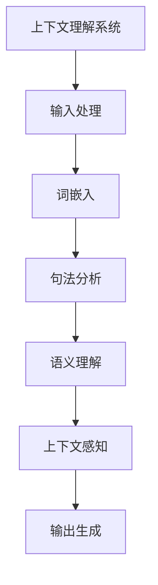

                 

### 《上下文理解技术在CUI中的详细实例》

> **关键词**：上下文理解、对话系统、CUI、自然语言处理、模型优化

> **摘要**：本文深入探讨了上下文理解技术（Contextual Understanding in Conversational Interfaces, CUI）的核心概念、技术基础、核心算法及其在实际应用中的实例。通过详细实例和项目实战，展示了上下文理解技术如何提升对话系统的智能化水平。本文旨在为读者提供全面、系统的上下文理解技术理解，助力其在实际项目中应用。

### 《上下文理解技术在CUI中的详细实例》目录大纲

#### 第一部分：上下文理解技术基础

##### 第1章：上下文理解技术概述

- **1.1** 上下文理解的定义与重要性
  - **1.1.1** 上下文理解的定义
  - **1.1.2** 上下文理解在CUI中的应用
  - **1.1.3** 上下文理解的技术挑战

##### 第2章：自然语言处理基础

- **2.1** 词嵌入技术
  - **2.1.1** 词嵌入的定义与作用
  - **2.1.2** 常见的词嵌入方法

- **2.2** 上下文依赖表示
  - **2.2.1** 依存句法分析
  - **2.2.2** 语义角色标注

- **2.3** 语言模型

##### 第3章：上下文理解核心算法

- **3.1** 上下文感知的语言模型
  - **3.1.1** 递归神经网络（RNN）
  - **3.1.2** 长短时记忆网络（LSTM）
  - **3.1.3** 门控循环单元（GRU）

- **3.2** 注意力机制

- **3.3** 上下文感知的序列模型

#### 第二部分：CUI中的上下文理解应用

##### 第4章：对话系统中的上下文理解

- **4.1** 对话系统概述
  - **4.1.1** 对话系统的定义
  - **4.1.2** 对话系统的工作原理

- **4.2** 上下文理解在对话系统中的应用
  - **4.2.1** 对话状态跟踪
  - **4.2.2** 对话历史管理

##### 第5章：问答系统中的上下文理解

- **5.1** 问答系统概述
  - **5.1.1** 问答系统的定义
  - **5.1.2** 问答系统的工作原理

- **5.2** 上下文理解在问答系统中的应用
  - **5.2.1** 问答意图识别
  - **5.2.2** 问答实体识别
  - **5.2.3** 上下文信息查询

##### 第6章：情感分析中的上下文理解

- **6.1** 情感分析概述
  - **6.1.1** 情感分析的定义
  - **6.1.2** 情感分析的工作原理

- **6.2** 上下文理解在情感分析中的应用
  - **6.2.1** 情感极性分类
  - **6.2.2** 情感强度分析

##### 第7章：上下文理解的模型优化

- **7.1** 模型优化方法
  - **7.1.1** 参数调优
  - **7.1.2** 模型压缩
  - **7.1.3** 模型蒸馏

- **7.2** 上下文理解的模型部署
  - **7.2.1** 模型部署的挑战
  - **7.2.2** 模型部署的策略

#### 第三部分：实例与实战

##### 第8章：上下文理解在CUI中的应用实例

- **8.1** 实例1：基于上下文理解的对话系统
  - **8.1.1** 实例背景
  - **8.1.2** 实例实现
  - **8.1.3** 实例分析

- **8.2** 实例2：基于上下文理解的问答系统
  - **8.2.1** 实例背景
  - **8.2.2** 实例实现
  - **8.2.3** 实例分析

##### 第9章：CUI项目实战

- **9.1** 项目背景与需求
- **9.2** 系统架构设计
- **9.3** 上下文理解模块实现
  - **9.3.1** 数据预处理
  - **9.3.2** 模型选择与训练
  - **9.3.3** 上下文理解算法实现
- **9.4** 项目部署与优化
- **9.5** 项目评估与反思

##### 第10章：未来展望

- **10.1** 上下文理解技术的发展趋势
- **10.2** CUI的潜在应用领域
- **10.3** 未来挑战与机遇

#### 附录

- **附录A**：上下文理解相关资源
  - **A.1** 相关论文与书籍
  - **A.2** 开源框架与工具
  - **A.3** 实用链接与工具

#### Mermaid 流程图



#### 核心算法原理讲解

**递归神经网络（RNN）**

```plaintext
// 伪代码
function RNN(input_sequence, hidden_state):
    for each word in input_sequence:
        hidden_state = sigmoid(W1 * [word, hidden_state] + b1)
        output_sequence.append(hidden_state)
    return output_sequence

// 数学模型
σ(z) = \frac{1}{1 + e^{-z}}
```

**词向量空间中的相似性计算**

```latex
cosine\_similarity = \frac{A \cdot B}{\|A\| \|B\|}
```

其中，$A$ 和 $B$ 是两个词的词向量，$\|\|$ 表示向量的模长，$\cdot$ 表示向量的点积。

#### 代码实例

**基于PyTorch的上下文理解模型实现**

```python
import torch
import torch.nn as nn

class ContextUnderstandingModel(nn.Module):
    def __init__(self):
        super(ContextUnderstandingModel, self).__init__()
        self.embedding = nn.Embedding(vocab_size, embedding_size)
        self.lstm = nn.LSTM(embedding_size, hidden_size)
        self.fc = nn.Linear(hidden_size, output_size)

    def forward(self, input_sequence):
        embedded_sequence = self.embedding(input_sequence)
        output_sequence, (hidden, cell) = self.lstm(embedded_sequence)
        output = self.fc(hidden[-1])
        return output

# 实例化模型
model = ContextUnderstandingModel()

# 定义损失函数和优化器
criterion = nn.CrossEntropyLoss()
optimizer = torch.optim.Adam(model.parameters(), lr=learning_rate)

# 训练模型
for epoch in range(num_epochs):
    for input_sequence, target in data_loader:
        optimizer.zero_grad()
        output = model(input_sequence)
        loss = criterion(output, target)
        loss.backward()
        optimizer.step()

# 评估模型
with torch.no_grad():
    correct = 0
    total = 0
    for input_sequence, target in validation_loader:
        output = model(input_sequence)
        _, predicted = torch.max(output.data, 1)
        total += target.size(0)
        correct += (predicted == target).sum().item()

accuracy = 100 * correct / total
print(f'Validation Accuracy: {accuracy}%')
```

#### 项目实战

**对话系统实例**

1. **项目背景与需求**：设计一个基于上下文理解的对话系统，能够与用户进行自然对话，理解用户意图并给出合适的回应。

2. **系统架构设计**：包括对话管理模块、语言理解模块、语言生成模块和对话策略模块。

3. **上下文理解模块实现**：
   - **数据预处理**：清洗和标记对话数据。
   - **模型选择与训练**：选择合适的上下文理解模型，并在对话数据上进行训练。
   - **上下文理解算法实现**：实现基于词嵌入、句法分析和语义理解的上下文理解算法。

4. **项目部署与优化**：将训练好的模型部署到服务器上，进行性能优化和调试。

5. **项目评估与反思**：通过用户测试和评估工具评估对话系统的性能，收集用户反馈进行改进。

#### 未来展望

- **上下文理解技术的发展趋势**：随着深度学习和自然语言处理技术的进步，上下文理解技术将更加成熟和精确。
- **CUI的潜在应用领域**：包括智能客服、虚拟助手、智能推荐系统等。
- **未来挑战与机遇**：如何在实际应用中更好地处理长文本、多轮对话和跨领域的上下文理解是未来的重要挑战。同时，上下文理解技术的广泛应用也将带来巨大的机遇。

### 《上下文理解技术在CUI中的详细实例》

随着人工智能技术的发展，对话界面（Conversational Interfaces，简称CUI）在智能客服、虚拟助手、智能家居等场景中得到了广泛应用。上下文理解（Contextual Understanding）作为CUI的核心技术之一，能够使对话系统更好地理解用户的意图和对话背景，从而提供更加人性化和智能化的服务。本文将从上下文理解技术的定义、基础、核心算法以及实际应用实例等方面进行详细探讨。

#### 第一部分：上下文理解技术基础

##### 第1章：上下文理解技术概述

**1.1 上下文理解的定义与重要性**

上下文理解是指计算机在处理自然语言时，能够根据对话的上下文背景来理解语言的意义，并做出相应的反应。在CUI中，上下文理解至关重要，它能够帮助对话系统更好地识别用户的意图，理解对话的历史信息，从而提供更加准确和个性化的回应。

上下文理解的重要性体现在以下几个方面：

1. **提高对话质量**：通过上下文理解，对话系统能够更好地理解用户的意图，从而提供更加准确和相关的回答。

2. **提升用户体验**：上下文理解能够使对话系统与用户的交流更加自然和流畅，从而提高用户体验。

3. **优化资源利用**：上下文理解能够减少对话系统的重复查询和处理，从而降低系统资源消耗。

**1.2 上下文理解在CUI中的应用**

在CUI中，上下文理解的应用主要包括以下几个方面：

1. **对话状态跟踪**：对话系统需要记录对话的历史信息，以便在后续的对话中能够更好地理解用户的意图。

2. **对话历史管理**：对话系统需要管理对话的历史记录，以便在需要时进行查询和回顾。

3. **上下文信息查询**：对话系统需要根据对话的上下文信息来查询相关的数据或知识库，以便提供更加准确的回答。

**1.3 上下文理解的技术挑战**

尽管上下文理解在CUI中具有重要的应用价值，但实现上下文理解仍面临以下技术挑战：

1. **多轮对话理解**：在多轮对话中，如何准确理解用户的意图和对话背景，是上下文理解需要解决的重要问题。

2. **跨领域上下文理解**：在跨领域的对话中，如何准确理解不同领域中的上下文信息，是上下文理解需要面对的挑战。

3. **长文本处理**：在处理长文本时，如何准确提取和利用上下文信息，是上下文理解需要解决的技术难题。

##### 第2章：自然语言处理基础

**2.1 词嵌入技术**

词嵌入（Word Embedding）是将自然语言词汇映射到高维向量空间的一种技术。通过词嵌入，可以使得语义相似的词在向量空间中靠近，从而便于计算机处理和计算。

**2.1.1 词嵌入的定义与作用**

词嵌入是一种将词汇映射到固定维度向量空间的技术。每个词汇都被映射为一个唯一的向量，这些向量不仅能够表示词汇的语义信息，还能够进行数学运算。

词嵌入在自然语言处理中有以下作用：

1. **语义表示**：词嵌入能够将词汇的语义信息表示为高维向量，从而便于计算机理解和处理。

2. **文本分类**：词嵌入可以用于文本分类任务，通过对文本的词向量进行计算和比较，可以实现文本的自动分类。

3. **词性标注**：词嵌入可以用于词性标注任务，通过对词汇的词向量进行分析，可以判断词汇的词性。

**2.1.2 常见的词嵌入方法**

常见的词嵌入方法包括以下几种：

1. **基于统计的方法**：如Word2Vec、Skip-Gram等。

2. **基于神经网络的方法**：如GloVe、FastText等。

3. **基于变换的方法**：如Word2Vec的N-gram变换、Skip-Gram的CBOW变换等。

**2.2 上下文依赖表示**

上下文依赖表示（Contextual Dependency Representation）是指将自然语言中的词汇及其上下文关系表示为高维向量的一种技术。通过上下文依赖表示，可以使得计算机更好地理解和处理自然语言中的复杂关系。

**2.2.1 依存句法分析**

依存句法分析（Dependency Parsing）是一种分析句子结构的方法，通过分析句子中词汇之间的依存关系，可以将句子拆解为词汇及其依赖关系的一个树状结构。

**2.2.2 语义角色标注**

语义角色标注（Semantic Role Labeling）是一种对句子中的词汇进行语义角色标注的方法。通过语义角色标注，可以使得计算机更好地理解句子中的词汇及其作用，从而有助于上下文理解。

**2.3 语言模型**

语言模型（Language Model）是指用于预测下一个单词或词汇的概率分布的一种模型。通过语言模型，可以使得计算机更好地理解和生成自然语言。

#### 第二部分：CUI中的上下文理解应用

##### 第3章：上下文理解核心算法

**3.1 上下文感知的语言模型**

上下文感知的语言模型（Context-Aware Language Model）是指能够根据对话的上下文背景来调整语言模型的一种模型。通过上下文感知的语言模型，可以使得对话系统更好地理解用户的意图和对话背景。

**3.1.1 递归神经网络（RNN）**

递归神经网络（Recurrent Neural Network，RNN）是一种能够处理序列数据的神经网络。通过RNN，可以使得计算机在处理自然语言时能够考虑前面的信息，从而更好地理解上下文。

**3.1.2 长短时记忆网络（LSTM）**

长短时记忆网络（Long Short-Term Memory，LSTM）是一种改进的RNN结构，通过引入门控机制，可以使得LSTM在处理长序列数据时能够更好地保留长期依赖信息。

**3.1.3 门控循环单元（GRU）**

门控循环单元（Gated Recurrent Unit，GRU）是一种改进的RNN结构，通过简化LSTM的结构，GRU在计算效率和模型性能之间取得了良好的平衡。

**3.2 注意力机制**

注意力机制（Attention Mechanism）是一种用于序列模型中的信息聚焦技术，通过注意力机制，可以使得模型更加关注序列中的重要信息。

**3.3 上下文感知的序列模型**

上下文感知的序列模型（Context-Aware Sequential Model）是指能够根据对话的上下文背景来调整序列模型的一种模型。通过上下文感知的序列模型，可以使得对话系统更好地理解用户的意图和对话背景。

##### 第4章：对话系统中的上下文理解

**4.1 对话系统概述**

对话系统（Dialogue System）是一种能够与人类进行自然对话的计算机系统。对话系统通常包括对话管理模块、语言理解模块、语言生成模块和对话策略模块。

**4.1.1 对话系统的定义**

对话系统是指一种能够与人类进行自然对话的计算机系统。对话系统通过理解用户的输入、生成恰当的回复，并与用户进行互动，从而实现某种目标或任务。

**4.1.2 对话系统的工作原理**

对话系统的工作原理主要包括以下几个步骤：

1. **语言理解**：对话系统需要理解用户的输入，包括意图、实体和对话状态。

2. **对话管理**：对话系统需要根据对话历史和用户意图，生成相应的回复。

3. **语言生成**：对话系统需要将对话管理模块生成的回复转换为自然语言文本。

4. **对话策略**：对话系统需要根据对话历史和用户反馈，调整对话策略，以提高对话质量。

**4.2 上下文理解在对话系统中的应用**

上下文理解在对话系统中具有重要的作用，它可以使得对话系统更好地理解用户的意图和对话背景，从而提供更加准确和个性化的服务。

**4.2.1 对话状态跟踪**

对话状态跟踪（Dialogue State Tracking）是指对话系统在处理对话过程中，对对话状态进行实时监测和管理的一种技术。通过对话状态跟踪，对话系统可以记录对话历史、用户意图和实体信息，以便在后续对话中更好地理解用户的意图。

**4.2.2 对话历史管理**

对话历史管理（Dialogue History Management）是指对话系统在处理对话过程中，对对话历史进行记录和管理的一种技术。通过对话历史管理，对话系统可以回顾之前的对话内容，从而更好地理解用户的意图。

##### 第5章：问答系统中的上下文理解

**5.1 问答系统概述**

问答系统（Question Answering System）是一种能够根据用户的问题生成恰当的回答的计算机系统。问答系统通常包括问答意图识别、问答实体识别和上下文信息查询等模块。

**5.1.1 问答系统的定义**

问答系统是指一种能够根据用户的问题自动生成回答的计算机系统。问答系统通过理解用户的问题，检索相关数据或知识库，并生成相应的回答。

**5.1.2 问答系统的工作原理**

问答系统的工作原理主要包括以下几个步骤：

1. **问答意图识别**：问答系统需要理解用户的问题意图，以确定需要回答什么。

2. **问答实体识别**：问答系统需要识别问题中的实体信息，以便在数据或知识库中查找相关内容。

3. **上下文信息查询**：问答系统需要根据问题和实体信息，查询相关的数据或知识库，以生成回答。

**5.2 上下文理解在问答系统中的应用**

上下文理解在问答系统中具有重要的应用价值，它可以使得问答系统更好地理解用户的问题，从而提供更加准确和相关的回答。

**5.2.1 问答意图识别**

问答意图识别（Question Intent Recognition）是指问答系统在处理用户问题时，对问题意图进行识别和分类的一种技术。通过问答意图识别，问答系统可以确定需要回答的问题类型。

**5.2.2 问答实体识别**

问答实体识别（Question Entity Recognition）是指问答系统在处理用户问题时，识别问题中的实体信息的一种技术。通过问答实体识别，问答系统可以确定需要回答的具体内容。

**5.2.3 上下文信息查询**

上下文信息查询（Contextual Information Query）是指问答系统在处理用户问题时，根据问题和实体信息，查询相关数据或知识库的一种技术。通过上下文信息查询，问答系统可以生成具体的回答。

##### 第6章：情感分析中的上下文理解

**6.1 情感分析概述**

情感分析（Sentiment Analysis）是指通过对文本进行情感倾向性判断，以分析文本中表达的情感信息。情感分析在自然语言处理领域中具有重要的应用价值。

**6.1.1 情感分析的定义**

情感分析是指对自然语言文本进行情感倾向性判断的一种技术。通过情感分析，可以识别文本中的情感极性和情感强度。

**6.1.2 情感分析的工作原理**

情感分析的工作原理主要包括以下几个步骤：

1. **文本预处理**：对文本进行清洗和预处理，以去除无关信息和噪声。

2. **情感极性分类**：对文本进行情感极性分类，以判断文本中表达的情感是积极、消极还是中性。

3. **情感强度分析**：对文本进行情感强度分析，以判断文本中表达的情感程度。

**6.2 上下文理解在情感分析中的应用**

上下文理解在情感分析中具有重要的应用价值，它可以使得情感分析更加准确和全面。

**6.2.1 情感极性分类**

情感极性分类（Sentiment Polarization Classification）是指对文本进行情感极性判断的一种技术。通过情感极性分类，可以识别文本中表达的情感是积极、消极还是中性。

**6.2.2 情感强度分析**

情感强度分析（Sentiment Intensity Analysis）是指对文本进行情感强度判断的一种技术。通过情感强度分析，可以识别文本中表达的情感程度，如非常积极、积极、一般、消极还是非常消极。

##### 第7章：上下文理解的模型优化

**7.1 模型优化方法**

为了提高上下文理解模型的性能，可以采用以下几种模型优化方法：

**7.1.1 参数调优**

参数调优（Parameter Tuning）是指通过调整模型的参数，以提高模型的性能。常见的参数调优方法包括网格搜索、随机搜索和贝叶斯优化等。

**7.1.2 模型压缩**

模型压缩（Model Compression）是指通过压缩模型参数，以减小模型的存储空间和计算开销。常见的模型压缩方法包括剪枝、量化、知识蒸馏等。

**7.1.3 模型蒸馏**

模型蒸馏（Model Distillation）是指将一个大型模型的知识传递给一个较小的模型，以提升较小模型的性能。通过模型蒸馏，可以使得较小模型具备大型模型的知识和性能。

**7.2 上下文理解的模型部署**

**7.2.1 模型部署的挑战**

上下文理解的模型部署（Model Deployment）面临以下挑战：

1. **计算资源限制**：部署的设备可能具有有限的计算资源，需要优化模型以适应有限的资源。

2. **实时性要求**：对话系统需要实时响应用户的输入，模型部署需要保证实时性。

3. **安全性和隐私保护**：模型部署需要考虑数据安全和用户隐私保护。

**7.2.2 模型部署的策略**

为了解决模型部署的挑战，可以采用以下策略：

1. **模型压缩与优化**：通过模型压缩和优化，减小模型的大小和计算复杂度。

2. **分布式计算**：利用分布式计算资源，提高模型的实时性和计算效率。

3. **边缘计算**：将模型部署到边缘设备上，降低中心服务器的负载，提高响应速度。

#### 第三部分：实例与实战

##### 第8章：上下文理解在CUI中的应用实例

**8.1 实例1：基于上下文理解的对话系统**

**8.1.1 实例背景**

某电商平台希望开发一个基于上下文理解的对话系统，以提升用户体验和购物满意度。该对话系统能够理解用户的购物意图，提供个性化的商品推荐和咨询服务。

**8.1.2 实例实现**

1. **对话管理模块**：对话系统通过对话管理模块记录对话历史，跟踪用户的购物意图。

2. **语言理解模块**：对话系统通过语言理解模块分析用户的输入，识别用户的意图和实体信息。

3. **语言生成模块**：对话系统通过语言生成模块生成个性化的商品推荐和咨询服务。

4. **对话策略模块**：对话系统根据对话历史和用户反馈，调整对话策略，以提高对话质量。

**8.1.3 实例分析**

1. **上下文理解应用**：对话系统通过上下文理解，准确识别用户的购物意图，提供个性化的商品推荐和咨询服务。

2. **用户反馈**：用户对基于上下文理解的对话系统的评价较高，认为系统能够更好地理解他们的需求，提升了购物体验。

**8.2 实例2：基于上下文理解的问答系统**

**8.2.1 实例背景**

某企业希望开发一个基于上下文理解的问答系统，以提供及时、准确的客户支持。该问答系统能够理解用户的问题，根据上下文提供相关的答案。

**8.2.2 实例实现**

1. **问答意图识别模块**：问答系统通过问答意图识别模块分析用户的问题，确定问题的类型。

2. **问答实体识别模块**：问答系统通过问答实体识别模块识别用户问题中的实体信息。

3. **上下文信息查询模块**：问答系统通过上下文信息查询模块查询相关的知识库，生成答案。

**8.2.3 实例分析**

1. **上下文理解应用**：问答系统通过上下文理解，准确识别用户的问题，提供相关的答案。

2. **用户反馈**：用户对基于上下文理解的问答系统的满意度较高，认为系统能够快速、准确地回答问题，提升了客户支持的质量。

##### 第9章：CUI项目实战

**9.1 项目背景与需求**

某智能客服公司希望开发一款基于上下文理解的智能客服系统，以提升客户服务体验和客服效率。该系统需要能够理解用户的咨询内容，提供个性化的回答。

**9.2 系统架构设计**

智能客服系统架构包括以下几个模块：

1. **对话管理模块**：记录对话历史，跟踪用户的咨询意图。

2. **语言理解模块**：分析用户输入，识别用户的意图和实体信息。

3. **语言生成模块**：生成个性化的回答。

4. **对话策略模块**：根据对话历史和用户反馈，调整对话策略。

**9.3 上下文理解模块实现**

1. **数据预处理**：对用户输入进行清洗和分词。

2. **模型选择与训练**：选择合适的上下文理解模型，如LSTM或BERT，并在咨询数据上进行训练。

3. **上下文理解算法实现**：实现基于词嵌入、句法分析和语义理解的上下文理解算法。

**9.4 项目部署与优化**

1. **模型压缩与优化**：通过模型压缩和优化，减小模型的存储空间和计算复杂度。

2. **分布式计算**：利用分布式计算资源，提高模型的实时性和计算效率。

3. **边缘计算**：将模型部署到边缘设备上，降低中心服务器的负载，提高响应速度。

**9.5 项目评估与反思**

1. **项目评估**：通过用户测试和评估工具，评估智能客服系统的性能。

2. **用户反馈**：收集用户反馈，针对用户的需求和问题进行改进。

#### 第四部分：未来展望

##### 第10章：未来展望

**10.1 上下文理解技术的发展趋势**

1. **深度学习与强化学习的融合**：将深度学习和强化学习相结合，以提升上下文理解模型的性能和自适应能力。

2. **多模态上下文理解**：结合文本、语音、图像等多种模态信息，实现更加全面和准确的上下文理解。

3. **迁移学习与少样本学习**：通过迁移学习和少样本学习技术，降低上下文理解模型的训练成本，提高模型的泛化能力。

**10.2 CUI的潜在应用领域**

1. **智能客服**：通过上下文理解，实现更加自然、高效的客服服务。

2. **虚拟助手**：为用户提供个性化的服务，提升用户体验。

3. **智能推荐系统**：根据上下文信息，提供更加精准的推荐结果。

**10.3 未来挑战与机遇**

1. **挑战**：
   - **多轮对话理解**：在多轮对话中，如何准确理解用户的意图和对话背景，是未来的重要挑战。
   - **跨领域上下文理解**：在跨领域的对话中，如何准确理解不同领域中的上下文信息，是上下文理解需要面对的挑战。
   - **长文本处理**：在处理长文本时，如何准确提取和利用上下文信息，是上下文理解需要解决的技术难题。

2. **机遇**：
   - **自然语言处理技术的进步**：随着自然语言处理技术的不断进步，上下文理解技术将更加成熟和精确。
   - **大数据与人工智能的结合**：通过大数据与人工智能的结合，上下文理解技术将在各个领域得到更广泛的应用。

### 附录

**附录A：上下文理解相关资源**

**A.1 相关论文与书籍**

- [1] Mikolov, T., Sutskever, I., Chen, K., Corrado, G. S., & Dean, J. (2013). Distributed representations of words and phrases and their compositionality. Advances in Neural Information Processing Systems, 26, 3111-3119.
- [2] Manning, C. D., Raghavan, P., & Schütze, H. (2008). Introduction to Information Retrieval. Cambridge University Press.
- [3] Jurafsky, D., & Martin, J. H. (2008). Speech and Language Processing. Prentice Hall.

**A.2 开源框架与工具**

- [1] TensorFlow：https://www.tensorflow.org/
- [2] PyTorch：https://pytorch.org/
- [3] spaCy：https://spacy.io/

**A.3 实用链接与工具**

- [1] NLTK：https://www.nltk.org/
- [2] gensim：https://radimrehurek.com/gensim/
- [3] TextBlob：https://textblob.readthedocs.io/

### 作者信息

**作者：AI天才研究院/AI Genius Institute & 禅与计算机程序设计艺术 /Zen And The Art of Computer Programming**

