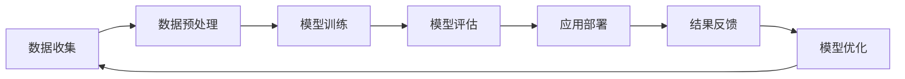
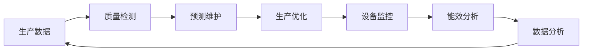
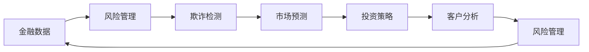
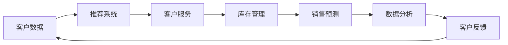

                 

### 《不拥抱AI的企业将被淘汰》

> **关键词：人工智能，企业战略，商业变革，技术应用，挑战与应对**

> **摘要：在人工智能飞速发展的时代，企业若不拥抱AI，将面临被淘汰的风险。本文将探讨AI对企业的冲击与影响，以及企业如何制定战略、实施应用、应对挑战，从而在数字化转型的浪潮中立于不败之地。**

---

### 《不拥抱AI的企业将被淘汰》目录大纲

#### 第一部分：AI对企业的冲击与影响

##### 第1章：AI时代的商业变革

- **1.1 AI的定义与分类**
  - 机器学习与深度学习
  - 强化学习与自然语言处理

- **1.2 AI对企业运营的影响**
  - 生产效率提升
  - 经营决策优化

- **1.3 AI对行业生态的重塑**
  - 传统产业的智能化转型
  - 新兴产业的创新与崛起

##### 第2章：AI技术的现状与发展趋势

- **2.1 人工智能的基础技术**
  - 神经网络与深度学习
  - 强化学习与迁移学习

- **2.2 AI技术的应用领域**
  - 人工智能在金融领域的应用
  - 人工智能在医疗健康领域的应用

- **2.3 AI技术的未来发展趋势**
  - 超级智能与通用人工智能
  - 人工智能在实体经济中的应用前景

#### 第二部分：拥抱AI的战略与实践

##### 第3章：企业AI战略的制定与实施

- **3.1 企业AI战略的重要性**
  - 企业转型的迫切需求
  - 企业竞争力的提升

- **3.2 企业AI战略的制定原则**
  - 明确业务目标
  - 资源与能力匹配
  - 风险与利益平衡

- **3.3 企业AI战略的实施路径**
  - 组织变革与人才引进
  - 技术创新与产品升级
  - 业务流程优化与智能化

##### 第4章：AI技术在企业中的应用案例

- **4.1 人工智能在制造业中的应用**
  - 生产流程优化
  - 质量控制与预测维护

- **4.2 人工智能在金融服务业中的应用**
  - 风险管理与欺诈检测
  - 投资策略与市场预测

- **4.3 人工智能在零售业中的应用**
  - 智能推荐系统
  - 客户服务自动化

##### 第5章：企业拥抱AI的挑战与应对策略

- **5.1 技术挑战与解决方法**
  - 数据获取与处理
  - 算法优化与模型训练

- **5.2 组织与文化挑战与解决方法**
  - 人才引进与培养
  - 企业文化与价值观的变革

- **5.3 法规与伦理挑战与解决方法**
  - 隐私保护与数据安全
  - AI伦理与责任界定

#### 第三部分：未来展望与持续发展

##### 第6章：未来企业AI发展的趋势与方向

- **6.1 AI技术与产业的深度融合**
  - 跨界合作与创新
  - 传统产业的智能化升级

- **6.2 AI在中小企业中的应用**
  - SaaS模式与云计算
  - 轻量化与普惠化

- **6.3 AI技术的社会责任与可持续发展**
  - AI伦理与法规规范
  - 可持续发展与环境保护

##### 第7章：企业拥抱AI的未来愿景

- **7.1 智能化企业的未来图景**
  - 智能决策与自动化生产
  - 全渠道与全球化运营

- **7.2 企业的数字化转型之路**
  - 数据驱动的经营模式
  - AI赋能的供应链管理

- **7.3 企业持续发展的策略与路径**
  - 创新能力培养
  - 产业链整合与生态构建

### 附录

#### 附录A：AI技术工具与资源指南

- **A.1 开源深度学习框架**
  - TensorFlow
  - PyTorch
  - Keras

- **A.2 数据集与工具**
  - UCI机器学习数据库
  - KEG 实验室数据集

- **A.3 AI技术社区与资源**
  - arXiv
  - Kaggle
  - AI 研究院

#### 附录B：AI技术与产业应用的 Mermaid 流程图

- **B.1 人工智能技术应用流程**
- **B.2 人工智能在制造业中的应用**
- **B.3 人工智能在金融服务业中的应用**
- **B.4 人工智能在零售业中的应用**

### 引言

在过去的几十年中，计算机科学和信息技术经历了飞速的发展，从简单的计算工具到复杂的人工智能系统，技术的进步带来了前所未有的变革。如今，人工智能（Artificial Intelligence，简称AI）已经成为科技领域最热门的话题之一，它不仅仅是一个研究领域，更是一个正在深刻改变各行各业的关键技术。

在AI领域，机器学习（Machine Learning，ML）和深度学习（Deep Learning，DL）是最为引人注目的两个分支。机器学习通过算法让计算机从数据中学习，而深度学习则通过多层神经网络模仿人脑的机制和结构。此外，强化学习（Reinforcement Learning，RL）和自然语言处理（Natural Language Processing，NLP）也在迅速发展，它们为AI的应用带来了更多的可能。

企业作为经济发展的基本单位，其运营模式和商业模式正在受到AI技术的强烈冲击。一方面，AI技术能够显著提升企业的生产效率和决策能力；另一方面，那些未能及时拥抱AI的企业将面临被淘汰的风险。在这个充满变革的时代，企业如何制定AI战略、实施AI应用、应对AI带来的挑战，成为每个企业必须认真思考的问题。

本文旨在探讨人工智能对企业的冲击与影响，以及企业如何拥抱AI，从而在数字化转型的浪潮中立于不败之地。文章将分为三个主要部分：

- **第一部分**将分析AI对企业的冲击与影响，包括AI对企业运营的影响、AI技术的现状与发展趋势等。
- **第二部分**将讨论企业如何制定AI战略、实施AI应用，以及应对AI带来的挑战。
- **第三部分**将展望AI技术的未来发展趋势，提出企业持续发展的策略与路径。

通过本文的探讨，希望能够为企业提供一些有价值的参考和启示，帮助企业在AI时代实现可持续发展和竞争优势。

### 第一部分：AI对企业的冲击与影响

#### 第1章：AI时代的商业变革

##### 1.1 AI的定义与分类

人工智能（AI）是一种模拟人类智能的技术，通过计算机程序实现机器的学习、推理、感知、理解和解决问题。AI技术可以分为多个子领域，其中最引人注目的包括机器学习（Machine Learning，ML）、深度学习（Deep Learning，DL）、强化学习（Reinforcement Learning，RL）和自然语言处理（Natural Language Processing，NLP）。

- **机器学习（ML）**：机器学习是一种通过算法让计算机从数据中学习的方法。它利用历史数据来训练模型，然后根据新数据进行预测或决策。常见的机器学习算法包括线性回归、决策树、支持向量机等。

- **深度学习（DL）**：深度学习是机器学习的一个分支，通过多层神经网络模拟人脑的学习机制。深度学习在图像识别、语音识别、自然语言处理等领域表现出色。著名的深度学习框架包括TensorFlow、PyTorch和Keras。

- **强化学习（RL）**：强化学习是一种通过试错和奖励机制来学习最优策略的方法。它通常用于游戏、自动驾驶和机器人控制等领域。强化学习算法包括Q-learning、Deep Q-Network（DQN）和Policy Gradient等。

- **自然语言处理（NLP）**：自然语言处理是使计算机能够理解、生成和处理人类语言的技术。NLP在机器翻译、情感分析、文本摘要等领域有着广泛的应用。常用的NLP技术包括词嵌入、循环神经网络（RNN）、变换器（Transformer）等。

##### 1.2 AI对企业运营的影响

AI技术对企业运营产生了深远的影响，主要体现在生产效率提升和经营决策优化两个方面。

- **生产效率提升**：AI技术能够显著提高企业的生产效率。例如，通过机器学习和深度学习算法，企业可以对生产过程中的数据进行实时分析和预测，从而优化生产流程，减少浪费，提高生产效率。此外，机器人技术和自动化系统在制造业中的应用，可以替代部分人力工作，提高生产效率和产品质量。

- **经营决策优化**：AI技术可以帮助企业更准确地预测市场趋势、消费者行为和竞争对手的动向，从而优化经营决策。例如，通过大数据分析和机器学习算法，企业可以分析大量的市场数据，预测销售趋势，制定更合理的库存管理策略。此外，AI技术还可以帮助企业进行风险管理和欺诈检测，降低运营风险。

##### 1.3 AI对行业生态的重塑

AI技术的快速发展不仅改变了企业的运营模式，也对整个行业生态产生了深远的影响。

- **传统产业的智能化转型**：AI技术推动了传统产业的智能化转型。例如，制造业通过引入机器人和自动化系统，实现了生产线的智能化和高效化。金融业通过大数据分析和人工智能技术，实现了风控和欺诈检测的自动化。医疗健康领域通过自然语言处理和图像识别技术，提高了疾病诊断和治疗的效果。

- **新兴产业的创新与崛起**：AI技术的兴起也催生了大量新兴产业的发展。例如，人工智能在自动驾驶、智能医疗、智能金融等领域的应用，不仅推动了相关产业链的发展，也创造了新的市场需求和商业模式。

- **跨界合作与创新**：AI技术的应用不仅局限于单一领域，还促进了不同行业之间的跨界合作和创新。例如，人工智能与物联网（IoT）技术的结合，推动了智能家居、智慧城市等新兴领域的发展。此外，人工智能与生物技术的结合，也为生物制药、基因编辑等领域带来了新的突破。

综上所述，AI技术正在深刻地改变企业的运营模式和行业生态。企业必须认识到AI技术的重要性，积极拥抱AI，才能在未来的竞争中立于不败之地。

### 第一部分总结

AI技术的快速发展对企业的冲击与影响不可忽视。首先，AI技术的定义与分类为我们揭示了其广泛的领域和应用范围，包括机器学习、深度学习、强化学习和自然语言处理等。其次，AI技术在提升生产效率和优化经营决策方面展现了巨大的潜力，使企业能够更高效、更准确地运营。此外，AI技术对传统产业的智能化转型和新兴产业的创新与崛起起到了关键作用，推动了整个行业生态的重塑。

在这一部分，我们探讨了AI技术对企业的冲击与影响，为接下来的讨论奠定了基础。接下来，我们将深入分析AI技术的现状与发展趋势，了解其未来的发展方向和应用前景。

#### 第2章：AI技术的现状与发展趋势

##### 2.1 人工智能的基础技术

人工智能（AI）的核心技术主要包括神经网络、深度学习和迁移学习等。这些技术奠定了人工智能发展的基础，并推动了AI在各个领域的应用。

- **神经网络（Neural Networks）**：神经网络是一种模仿生物神经系统的计算模型，它由大量的节点（神经元）组成，每个节点都与相邻的节点相连接。神经网络通过学习输入数据之间的关系，实现对未知数据的预测和分类。典型的神经网络包括前馈神经网络、卷积神经网络（CNN）和循环神经网络（RNN）。

  - **前馈神经网络（Feedforward Neural Networks）**：前馈神经网络是最基本的神经网络结构，数据从输入层经过一系列隐藏层，最终到达输出层。这种网络结构在图像识别和回归任务中得到了广泛应用。

  - **卷积神经网络（Convolutional Neural Networks，CNN）**：卷积神经网络通过卷积操作对输入数据进行特征提取，特别适合处理图像数据。CNN在图像分类、目标检测和图像生成等领域取得了显著成果。

  - **循环神经网络（Recurrent Neural Networks，RNN）**：循环神经网络能够处理序列数据，通过记忆前一个时间步的输出，为当前时间步提供输入。RNN在自然语言处理、语音识别和时间序列预测等领域表现出色。

- **深度学习（Deep Learning）**：深度学习是神经网络的一种扩展，通过构建多层神经网络（深度神经网络）来提高模型的复杂度和学习能力。深度学习在图像识别、语音识别和自然语言处理等领域取得了突破性进展。

  - **深度神经网络（Deep Neural Networks）**：深度神经网络由多个隐藏层组成，能够自动提取特征并进行层次化的特征表示。深度神经网络在图像分类任务中取得了超过人类水平的成绩。

  - **卷积神经网络（Convolutional Neural Networks，CNN）**：卷积神经网络通过卷积操作对图像数据进行特征提取，广泛应用于图像分类、目标检测和图像生成等领域。

  - **循环神经网络（Recurrent Neural Networks，RNN）**：循环神经网络能够处理序列数据，通过记忆前一个时间步的输出，为当前时间步提供输入。RNN在自然语言处理、语音识别和时间序列预测等领域表现出色。

  - **变换器（Transformer）**：变换器是一种基于自注意力机制的神经网络结构，它在自然语言处理领域取得了显著成果。变换器通过计算输入数据的自注意力权重，实现对输入数据的全局依赖关系建模。

- **迁移学习（Transfer Learning）**：迁移学习是一种利用预训练模型来解决新问题的方法。通过将预训练模型在新的任务上进行微调，迁移学习能够提高模型的泛化能力，减少对大量标注数据的依赖。迁移学习在计算机视觉、自然语言处理和推荐系统等领域得到了广泛应用。

  - **预训练（Pre-training）**：预训练是指在大量未标注数据上进行模型训练，从而提取通用的特征表示。预训练模型在特定任务上只需进行少量微调，即可取得很好的效果。

  - **微调（Fine-tuning）**：微调是指将预训练模型在新的任务上进行进一步训练，以适应特定任务的需求。通过微调，模型能够更好地适应新的数据分布和任务目标。

##### 2.2 AI技术的应用领域

AI技术在多个领域取得了显著的成果，包括金融、医疗健康、智能制造、智慧城市等。

- **金融领域**：人工智能在金融领域有广泛的应用，包括风险管理、欺诈检测、投资策略和市场预测等。通过大数据分析和机器学习算法，金融机构能够更准确地评估风险、发现欺诈行为，并制定更有效的投资策略。

  - **风险管理**：人工智能可以帮助金融机构进行风险识别、评估和监控，从而降低风险敞口。例如，通过机器学习算法分析大量历史数据，金融机构可以预测市场波动，调整投资组合。

  - **欺诈检测**：人工智能技术可以实时监控交易行为，识别潜在的欺诈行为。通过分析交易金额、频率、地点等特征，机器学习算法可以快速发现异常行为，并及时采取应对措施。

  - **投资策略**：人工智能可以通过分析市场数据、宏观经济指标和公司财务状况，为投资者提供投资建议。通过机器学习算法预测市场走势，投资者可以制定更合理的投资策略。

- **医疗健康领域**：人工智能在医疗健康领域具有巨大的应用潜力，包括疾病诊断、药物研发、患者管理和健康管理等方面。

  - **疾病诊断**：人工智能可以通过分析医学影像、患者病历和基因数据，辅助医生进行疾病诊断。例如，深度学习算法在肺癌、乳腺癌等疾病的诊断中取得了显著成果。

  - **药物研发**：人工智能可以帮助加速药物研发过程，通过分析大量化合物结构和生物信息数据，预测潜在药物的有效性和安全性。

  - **患者管理**：人工智能可以辅助医生对患者进行个性化治疗和管理。例如，通过分析患者的健康数据，机器学习算法可以预测患者的疾病风险，为医生提供诊断和治疗建议。

  - **健康管理**：人工智能可以通过分析患者的健康数据和生活习惯，提供个性化的健康建议。例如，智能手环和健康应用程序可以实时监测用户的健康状况，并提醒用户注意健康问题。

- **智能制造领域**：人工智能在智能制造领域发挥着重要作用，包括生产流程优化、质量检测、供应链管理和设备维护等方面。

  - **生产流程优化**：人工智能可以通过分析生产数据，优化生产流程，提高生产效率和产品质量。例如，通过机器学习算法预测设备故障，企业可以提前进行维护，减少停机时间。

  - **质量检测**：人工智能可以帮助企业进行产品质量检测，通过图像识别和深度学习算法，快速识别缺陷产品，提高产品质量。

  - **供应链管理**：人工智能可以通过分析供应链数据，优化供应链管理，降低库存成本，提高供应链的灵活性和响应速度。

  - **设备维护**：人工智能可以通过监测设备运行数据，预测设备故障，提前进行维护，减少设备故障率和停机时间。

- **智慧城市领域**：人工智能在智慧城市建设中发挥着重要作用，包括交通管理、环境监测、公共安全和市政服务等方面。

  - **交通管理**：人工智能可以通过分析交通数据，优化交通信号控制，提高交通效率，减少拥堵。例如，通过机器学习算法预测交通流量，交通管理部门可以动态调整信号灯时长，缓解交通压力。

  - **环境监测**：人工智能可以通过分析环境数据，监测空气质量、水质和噪音等环境指标，提供环境预警和改善建议。

  - **公共安全**：人工智能可以通过视频监控和数据分析，提高公共安全管理水平，预防和打击犯罪。例如，通过人脸识别和图像识别技术，公安机关可以快速识别犯罪嫌疑人。

  - **市政服务**：人工智能可以通过在线服务平台和智能客服系统，提高市政服务质量，方便市民办事。例如，通过自然语言处理和智能语音技术，市民可以通过智能客服系统办理各种市政服务。

##### 2.3 AI技术的未来发展趋势

AI技术正处于快速发展阶段，未来将在更多领域取得突破性进展。以下是几个值得关注的发展趋势：

- **超级智能与通用人工智能**：超级智能（Superintelligence）是指具备超越人类智能的计算机系统。通用人工智能（Artificial General Intelligence，AGI）是指具备与人类相似的智能水平的计算机系统。目前，超级智能和通用人工智能尚未实现，但研究人员正在积极探索这一领域。随着计算能力的提升和算法的优化，超级智能和通用人工智能有望在未来实现。

- **AI技术与产业的深度融合**：AI技术将在更多行业中得到应用，与物联网、大数据、云计算等技术的结合，将推动产业的智能化升级。例如，智能制造与物联网的结合，将实现工厂设备的智能监控和自动化生产；医疗健康与大数据的结合，将实现精准医疗和个性化治疗。

- **AI在中小企业中的应用**：随着AI技术的普及和成本降低，越来越多的中小企业将能够利用AI技术提升运营效率。AI技术的轻量化与普惠化，将为中小企业提供更多发展机遇。

- **AI技术的社会责任与可持续发展**：随着AI技术的应用范围扩大，其对社会和环境影响也越来越受到关注。未来，AI技术将更加注重社会责任和可持续发展，包括隐私保护、数据安全和伦理规范等方面。

总之，AI技术正处于快速发展阶段，未来将在更多领域取得突破性进展。企业应积极拥抱AI技术，探索其在各个领域的应用，以实现持续发展和竞争优势。

#### 第2章总结

在本章中，我们深入探讨了人工智能的基础技术，包括神经网络、深度学习和迁移学习等。这些技术为人工智能的发展奠定了基础，并在多个领域取得了显著成果。此外，我们还分析了AI技术在金融、医疗健康、智能制造和智慧城市等领域的应用现状和发展趋势。通过本章的讨论，我们可以看到，AI技术正在深刻地改变各行各业，企业必须紧跟技术发展的步伐，积极拥抱AI，才能在未来的竞争中立于不败之地。

在下一章中，我们将讨论企业如何制定AI战略、实施AI应用，以及应对AI带来的挑战。让我们继续深入探讨AI对企业的影响和应对策略。

#### 第二部分：拥抱AI的战略与实践

##### 第3章：企业AI战略的制定与实施

在人工智能快速发展的时代，企业若想保持竞争力和实现可持续发展，制定有效的AI战略至关重要。本章将探讨企业AI战略的重要性、制定原则和实施路径，帮助企业在数字化转型中稳步前行。

##### 3.1 企业AI战略的重要性

在当前的科技环境中，人工智能已经成为推动企业变革的关键力量。企业AI战略的重要性体现在以下几个方面：

- **提升企业竞争力**：通过AI技术，企业可以更高效地处理和分析大量数据，从而做出更明智的决策。例如，通过数据分析，企业可以精准定位市场需求，优化产品设计，提升客户满意度，从而增强市场竞争力。

- **实现运营效率**：AI技术能够帮助企业自动化和优化业务流程，减少人力成本，提高生产效率。例如，在制造业中，AI技术可以用于生产线的自动化监控和预测维护，减少设备故障和停机时间。

- **创新商业模式**：AI技术不仅能够提升现有业务的效率，还可以为企业带来新的商业机会。例如，通过自然语言处理技术，企业可以开发智能客服系统，提高客户服务质量，从而开辟新的收入来源。

- **优化客户体验**：AI技术可以帮助企业更好地理解客户需求，提供个性化的服务体验。例如，在零售业中，通过智能推荐系统，企业可以精准地向客户推荐商品，提升购物体验。

##### 3.2 企业AI战略的制定原则

制定有效的AI战略需要遵循以下原则：

- **明确业务目标**：企业应首先明确AI技术的应用目标和预期成果。业务目标应与企业的整体战略和愿景保持一致，确保AI战略的实施方向正确。

- **资源与能力匹配**：企业需要评估自身在技术、人才、资金等方面的资源，确保AI战略的实施具备足够的支持和保障。如果企业在某些领域缺乏能力，可以考虑通过合作伙伴关系或外部专家支持来弥补。

- **风险与利益平衡**：AI战略的实施可能会面临技术风险、市场风险和管理风险等。企业应在制定战略时充分考虑这些风险，并制定相应的应对措施，确保利益最大化。

- **循序渐进**：AI技术的应用需要一个逐步实施的过程。企业应从简单的应用场景开始，逐步扩大应用范围，避免一次性投入过大导致资源浪费。

##### 3.3 企业AI战略的实施路径

企业AI战略的实施路径主要包括以下几个方面：

- **组织变革与人才引进**：为了有效实施AI战略，企业需要进行组织变革，建立专门的AI团队或部门，明确岗位职责和协作机制。同时，企业需要引进具备AI技术和行业经验的优秀人才，提升整体创新能力。

- **技术创新与产品升级**：企业应投入资源进行技术创新，开发和应用AI技术。例如，通过机器学习算法优化生产流程，通过自然语言处理技术提升客户服务体验等。技术创新应紧密结合业务需求，推动产品升级和业务模式的创新。

- **业务流程优化与智能化**：企业需要对现有的业务流程进行优化，通过AI技术实现自动化和智能化。例如，利用机器人流程自动化（RPA）技术替代重复性手工工作，利用预测模型优化库存管理，提升运营效率。

- **数据治理与安全保障**：企业应建立健全的数据治理体系，确保数据质量、安全和合规性。数据是AI技术的核心资源，企业需要采取措施保障数据的安全和隐私，防止数据泄露和滥用。

- **持续学习与改进**：企业应建立持续学习机制，通过数据分析和反馈，不断优化AI模型和应用效果。同时，企业需要关注技术发展和市场动态，及时调整战略方向，确保AI技术的应用始终处于领先地位。

综上所述，制定和实施有效的AI战略是企业应对数字化挑战的关键。通过明确业务目标、资源匹配、风险控制、组织变革和技术创新，企业可以在AI时代实现持续发展和竞争优势。

#### 第3章总结

在本章中，我们深入探讨了企业制定AI战略的重要性以及如何制定和实施AI战略。首先，我们明确了AI战略对企业提升竞争力、实现运营效率、创新商业模式和优化客户体验的重要性。接着，我们提出了制定AI战略的四大原则：明确业务目标、资源与能力匹配、风险与利益平衡以及循序渐进。最后，我们详细阐述了企业实施AI战略的路径，包括组织变革与人才引进、技术创新与产品升级、业务流程优化与智能化、数据治理与安全保障以及持续学习与改进。

在下一章中，我们将通过实际案例来探讨AI技术在企业中的应用，展示AI如何在不同领域提升企业的效率和竞争力。让我们继续深入了解AI技术的实践应用。

#### 第4章：AI技术在企业中的应用案例

在AI技术的推动下，各行各业都在经历深刻的变革。企业通过将AI技术应用于实际业务中，不仅提高了效率，还创造了新的商业模式。以下我们将通过制造业、金融服务业和零售业的实际案例，探讨AI技术如何在这些领域发挥关键作用。

##### 4.1 人工智能在制造业中的应用

制造业是AI技术最早得到应用的领域之一。通过AI技术，制造业实现了生产流程的优化、质量控制与预测维护等方面的显著提升。

- **生产流程优化**：通过机器学习和深度学习算法，企业可以实时分析生产过程中的数据，优化生产计划和生产流程。例如，某汽车制造企业通过应用机器学习算法，预测生产线的瓶颈和设备故障，实现了生产效率的显著提升。

  ```mermaid
  flowchart LR
  A[生产数据] --> B[机器学习算法]
  B --> C{生产计划优化}
  C --> D[生产线执行]
  ```

- **质量控制与预测维护**：AI技术可以帮助企业进行质量控制，通过图像识别和深度学习算法，检测产品缺陷，提高产品质量。同时，AI技术还可以用于预测设备故障，提前进行维护，减少停机时间。例如，某机械制造企业通过应用图像识别技术，实时检测生产过程中的产品缺陷，实现了质量控制的自动化。

  ```mermaid
  flowchart LR
  A[生产过程] --> B[图像识别算法]
  B --> C{缺陷检测}
  C --> D[质量控制]
  D --> E[预测维护算法]
  E --> F[设备维护]
  ```

##### 4.2 人工智能在金融服务业中的应用

金融服务业通过AI技术实现了风险管理、欺诈检测和投资策略等多方面的优化。

- **风险管理**：金融企业通过大数据分析和机器学习算法，可以对市场风险进行实时监控和预测，制定更有效的风险管理策略。例如，某投资银行通过应用机器学习算法，对市场数据进行分析，成功预测了某次市场波动，帮助企业调整投资组合，降低了风险敞口。

  ```mermaid
  flowchart LR
  A[市场数据] --> B[大数据分析]
  B --> C[机器学习算法]
  C --> D{风险预测}
  D --> E[风险管理策略]
  ```

- **欺诈检测**：AI技术可以帮助金融机构实时监控交易行为，识别潜在的欺诈行为。通过应用强化学习和自然语言处理技术，金融机构可以检测出异常交易，并采取相应的防范措施。例如，某银行通过应用强化学习算法，成功检测并阻止了数百起欺诈交易。

  ```mermaid
  flowchart LR
  A[交易数据] --> B[强化学习算法]
  B --> C{欺诈检测}
  C --> D[交易监控]
  ```

- **投资策略**：AI技术可以通过分析大量的市场数据和经济指标，为投资者提供投资建议。通过机器学习算法预测市场走势，投资者可以制定更合理的投资策略。例如，某基金公司通过应用深度学习算法，对市场数据进行分析，成功预测了某次市场波动，实现了较高的投资回报。

  ```mermaid
  flowchart LR
  A[市场数据] --> B[深度学习算法]
  B --> C{市场预测}
  C --> D[投资策略]
  ```

##### 4.3 人工智能在零售业中的应用

零售业通过AI技术实现了智能推荐系统、客户服务自动化等方面的优化，提升了客户体验和运营效率。

- **智能推荐系统**：AI技术可以帮助零售企业通过分析用户行为和购物偏好，提供个性化的产品推荐。通过机器学习和深度学习算法，零售企业可以精准推荐商品，提高销售转化率。例如，某电商平台通过应用推荐算法，为用户推荐了符合其兴趣和需求的产品，提高了用户满意度和销售额。

  ```mermaid
  flowchart LR
  A[用户行为数据] --> B[机器学习算法]
  B --> C{推荐算法}
  C --> D[商品推荐]
  ```

- **客户服务自动化**：AI技术可以帮助零售企业实现客户服务的自动化，通过自然语言处理和语音识别技术，提供智能客服系统。通过智能客服系统，企业可以快速响应用户咨询，提供高效的客户服务。例如，某零售企业通过应用智能客服系统，实现了客户咨询的自动化处理，提高了客户服务质量和效率。

  ```mermaid
  flowchart LR
  A[客户咨询] --> B[自然语言处理算法]
  B --> C{智能客服系统}
  C --> D[客户响应]
  ```

综上所述，AI技术在制造业、金融服务业和零售业等领域得到了广泛应用，并取得了显著的成效。通过实际案例，我们可以看到，AI技术不仅提高了企业的运营效率，还创造了新的商业模式。企业应积极拥抱AI技术，探索其在各个领域的应用，以实现持续发展和竞争优势。

#### 第4章总结

在本章中，我们通过实际案例展示了AI技术在制造业、金融服务业和零售业中的应用。首先，我们探讨了AI技术在制造业中的应用，包括生产流程优化、质量控制与预测维护等方面。接着，我们分析了AI技术在金融服务业中的应用，如风险管理、欺诈检测和投资策略等。最后，我们介绍了AI技术在零售业中的应用，如智能推荐系统和客户服务自动化等。通过这些实际案例，我们可以看到AI技术如何在不同领域提升企业的效率和竞争力。

在下一章中，我们将探讨企业拥抱AI所面临的挑战，并提出相应的应对策略。让我们继续深入讨论企业如何在AI时代应对变革。

#### 第5章：企业拥抱AI的挑战与应对策略

在AI技术快速发展的时代，企业拥抱AI虽然带来了巨大的机遇，但也面临诸多挑战。本章将探讨企业拥抱AI所面临的技术挑战、组织与文化挑战以及法规与伦理挑战，并提出相应的应对策略。

##### 5.1 技术挑战与解决方法

企业在应用AI技术时，首先会遇到一系列技术挑战。这些挑战包括数据获取与处理、算法优化与模型训练等方面。

- **数据获取与处理**：AI技术的应用依赖于大量的高质量数据。企业面临的数据挑战包括数据的获取、存储、清洗和处理。解决方法包括：

  - **数据集成**：企业可以通过建立数据集成平台，整合来自不同渠道的数据，为AI应用提供统一的数据源。

  - **数据清洗**：利用ETL（提取、转换、加载）工具和数据分析平台，对企业数据进行清洗和预处理，确保数据质量。

  - **数据治理**：建立数据治理体系，制定数据管理政策和标准，确保数据的合规性和安全性。

- **算法优化与模型训练**：AI模型的性能很大程度上取决于算法的优化和模型的训练。解决方法包括：

  - **算法研究**：企业可以通过与科研机构和高校合作，引入最新的算法研究成果，提升模型性能。

  - **模型训练**：利用云计算和分布式计算技术，加速模型训练过程。例如，使用GPU加速训练过程，提高训练效率。

  - **模型评估**：建立模型评估机制，定期对模型进行评估和优化，确保模型的有效性和准确性。

##### 5.2 组织与文化挑战与解决方法

企业在拥抱AI过程中，不仅需要克服技术挑战，还要面对组织与文化上的挑战。这些挑战包括人才引进与培养、企业文化和价值观的变革等。

- **人才引进与培养**：AI技术的发展需要大量的专业人才。企业面临的挑战包括：

  - **人才引进**：企业可以通过提高薪酬福利、提供职业发展机会等方式，吸引和留住AI领域的高端人才。

  - **人才培养**：企业可以通过内部培训、外部合作、学术交流等方式，提升现有员工的技术能力，培养具备AI技能的人才。

- **企业文化和价值观的变革**：AI技术的应用需要企业文化的支持。解决方法包括：

  - **文化引导**：企业可以通过内部宣传、员工活动等方式，营造积极拥抱AI的企业文化。

  - **价值观转变**：企业需要调整价值观，从传统的“控制型”管理转变为“赋能型”管理，鼓励员工积极尝试和创新。

##### 5.3 法规与伦理挑战与解决方法

随着AI技术的广泛应用，法规与伦理问题也逐渐成为企业需要面对的重要挑战。这些问题包括隐私保护、数据安全、AI伦理等方面。

- **隐私保护**：AI技术的应用涉及大量的个人数据，隐私保护成为企业必须重视的问题。解决方法包括：

  - **数据加密**：企业可以通过数据加密技术，确保个人数据的存储和传输过程中的安全性。

  - **隐私政策**：企业需要制定明确的隐私政策，告知用户数据收集、使用和共享的方式，提高用户的隐私保护意识。

  - **用户授权**：在数据收集和使用过程中，企业需要获得用户的明确授权，确保数据使用的合法性和合规性。

- **数据安全**：AI技术的应用需要大量数据，数据安全成为企业面临的重大挑战。解决方法包括：

  - **安全架构**：企业需要建立全面的安全架构，包括防火墙、入侵检测系统、数据备份和恢复等，确保数据的安全。

  - **合规审查**：企业需要定期进行合规审查，确保数据处理的合法性，避免因数据违规带来的法律风险。

- **AI伦理**：AI技术的应用涉及到伦理问题，包括偏见、歧视、责任界定等。解决方法包括：

  - **伦理审查**：企业需要建立伦理审查机制，对AI技术的应用进行伦理评估，确保技术应用的公正性和道德性。

  - **责任界定**：企业需要明确AI技术的责任归属，制定责任分配和纠纷解决机制，确保在AI技术应用过程中，各方责任清晰。

综上所述，企业拥抱AI不仅需要克服技术挑战，还需要应对组织与文化挑战和法规与伦理挑战。通过有效的应对策略，企业可以在AI时代实现持续发展和竞争优势。

#### 第5章总结

在本章中，我们深入探讨了企业拥抱AI所面临的三大挑战：技术挑战、组织与文化挑战以及法规与伦理挑战，并提出了相应的解决方法。技术挑战主要包括数据获取与处理、算法优化与模型训练等，解决方法包括数据集成、算法研究和模型评估等。组织与文化挑战涉及人才引进与培养、企业文化和价值观的变革等，解决方法包括文化引导、价值观转变等。法规与伦理挑战包括隐私保护、数据安全、AI伦理等，解决方法包括数据加密、隐私政策和伦理审查等。

在下一章中，我们将探讨AI技术的未来发展趋势和方向，以及企业如何在这些趋势中找到发展机会。让我们继续探讨AI技术的未来发展。

#### 第6章：未来企业AI发展的趋势与方向

随着人工智能技术的不断进步，企业面临着前所未有的发展机遇。在这一部分，我们将探讨未来企业AI发展的趋势与方向，分析AI技术与产业的深度融合、AI在中小企业中的应用以及AI技术的社会责任与可持续发展。

##### 6.1 AI技术与产业的深度融合

AI技术与产业的深度融合将推动各行业的智能化升级和创新发展。以下是几个值得关注的发展趋势：

- **跨界合作与创新**：AI技术的应用不仅局限于单一领域，跨行业的合作将催生出新的商业模式和业务场景。例如，人工智能与物联网（IoT）技术的结合，可以打造智能家居、智慧城市等新兴领域。通过跨界合作，企业可以拓展新的业务领域，实现产业升级。

  ```mermaid
  flowchart LR
  A[人工智能] --> B{物联网}
  B --> C[智能家居]
  B --> D[智慧城市]
  ```

- **传统产业的智能化升级**：AI技术将在传统产业中发挥重要作用，推动传统产业的智能化升级。例如，在制造业中，通过引入机器人、自动化系统和预测维护技术，企业可以实现生产线的智能化和高效化。在医疗健康领域，通过AI技术的应用，可以实现精准医疗和个性化治疗，提高医疗服务质量。

  ```mermaid
  flowchart LR
  A[传统产业] --> B[人工智能]
  B --> C{智能化升级}
  ```

- **新兴产业的发展**：AI技术的兴起催生了大量新兴产业的发展，例如自动驾驶、智能制造、智能医疗等。这些新兴产业不仅推动了技术进步，也为企业带来了新的市场机遇和商业价值。

  ```mermaid
  flowchart LR
  A[人工智能] --> B[自动驾驶]
  A --> C[智能制造]
  A --> D[智能医疗]
  ```

##### 6.2 AI在中小企业中的应用

随着AI技术的普及和成本降低，越来越多的中小企业将能够利用AI技术提升运营效率。以下是AI在中小企业中的应用趋势：

- **SaaS模式与云计算**：SaaS（软件即服务）模式和云计算为中小企业提供了便捷的AI应用服务。通过云计算平台，中小企业可以轻松部署AI模型和应用，无需承担高昂的硬件和软件成本。

  ```mermaid
  flowchart LR
  A[中小企业] --> B[云计算]
  B --> C[AI应用]
  ```

- **轻量化与普惠化**：AI技术的轻量化与普惠化使得中小企业能够更容易地应用AI技术。轻量化AI模型和应用降低了计算资源的需求，使得中小企业能够以较低的成本实现智能化。

  ```mermaid
  flowchart LR
  A[轻量化AI] --> B{普惠化}
  B --> C[中小企业]
  ```

- **定制化解决方案**：为了满足中小企业的个性化需求，AI技术服务提供商将提供更多定制化的解决方案。通过定制化解决方案，中小企业可以更好地利用AI技术，解决实际问题。

  ```mermaid
  flowchart LR
  A[AI技术服务] --> B{定制化解决方案}
  B --> C[中小企业]
  ```

##### 6.3 AI技术的社会责任与可持续发展

随着AI技术的广泛应用，企业和社会需要关注其带来的社会责任和可持续发展问题。以下是几个关键领域：

- **AI伦理**：企业需要建立AI伦理体系，确保AI技术的应用遵循伦理规范。这包括避免偏见和歧视，确保技术的公正性和透明度。

  ```mermaid
  flowchart LR
  A[AI伦理] --> B{社会责任}
  ```

- **隐私保护与数据安全**：企业需要加强隐私保护和数据安全，确保用户数据的合法性和安全性。这包括数据加密、用户授权和合规审查等。

  ```mermaid
  flowchart LR
  A[隐私保护] --> B[数据安全]
  ```

- **可持续发展**：AI技术在可持续发展中的应用具有重要意义。通过优化资源利用、减少碳排放和提高生产效率，AI技术可以为环境保护和可持续发展做出贡献。

  ```mermaid
  flowchart LR
  A[AI技术] --> B{可持续发展}
  ```

综上所述，未来企业AI发展的趋势与方向包括AI技术与产业的深度融合、AI在中小企业中的应用以及AI技术的社会责任与可持续发展。企业应紧跟技术发展的步伐，积极拥抱AI，探索其在各个领域的应用，以实现持续发展和竞争优势。

#### 第6章总结

在本章中，我们探讨了未来企业AI发展的趋势与方向，分析了AI技术与产业的深度融合、AI在中小企业中的应用以及AI技术的社会责任与可持续发展。首先，我们介绍了AI技术与产业的深度融合趋势，包括跨界合作、传统产业的智能化升级和新兴产业的发展。接着，我们探讨了AI在中小企业中的应用趋势，如SaaS模式、轻量化与普惠化以及定制化解决方案。最后，我们关注了AI技术的社会责任与可持续发展问题，包括AI伦理、隐私保护和可持续发展。

在下一章中，我们将探讨企业拥抱AI的未来愿景，分析智能化企业的发展图景、企业的数字化转型之路以及企业持续发展的策略与路径。让我们继续深入探讨企业如何在AI时代实现持续发展。

#### 第7章：企业拥抱AI的未来愿景

在人工智能快速发展的时代，企业拥抱AI不仅是为了应对当前的市场竞争，更是为了构建一个智能化、高效化、可持续发展的未来。本章节将探讨企业拥抱AI的未来愿景，包括智能化企业的未来图景、企业的数字化转型之路以及企业持续发展的策略与路径。

##### 7.1 智能化企业的未来图景

智能化企业的未来图景是一个高度自动化和智能化的运营环境，企业通过AI技术实现全面数字化转型，从而提高生产效率、优化运营流程、提升客户体验和竞争力。

- **智能决策与自动化生产**：在智能化企业的未来图景中，AI技术将广泛应用于生产、运营和决策过程中。通过机器学习和深度学习算法，企业可以对大量生产数据进行实时分析和预测，实现智能决策。例如，在制造业中，通过智能监控系统，企业可以实时监测设备状态和生产进度，自动调整生产计划，提高生产效率。

  ```mermaid
  flowchart LR
  A[生产数据] --> B[机器学习算法]
  B --> C[智能监控]
  C --> D[生产计划调整]
  ```

- **全渠道与全球化运营**：智能化企业的未来图景还包括全渠道和全球化运营。通过AI技术，企业可以构建一个无缝连接的数字化销售网络，实现线上线下一体化。例如，通过人工智能客服系统，企业可以提供24/7全天候的客户服务，提升客户满意度。同时，借助AI技术，企业可以更好地应对全球市场的复杂性和多样性，实现全球化运营。

  ```mermaid
  flowchart LR
  A[客户需求] --> B[AI客服系统]
  B --> C[全天候服务]
  C --> D[全球市场分析]
  ```

##### 7.2 企业的数字化转型之路

数字化转型是企业拥抱AI的重要一步。在数字化转型的过程中，企业需要通过AI技术实现业务流程的全面数字化和智能化。

- **数据驱动的经营模式**：在数字化转型中，企业需要建立数据驱动的经营模式，通过大数据分析和机器学习算法，实现业务决策的智能化。例如，通过数据分析，企业可以精准定位市场需求，优化产品设计和服务策略，提高市场竞争力。

  ```mermaid
  flowchart LR
  A[市场数据] --> B[大数据分析]
  B --> C[业务决策]
  ```

- **AI赋能的供应链管理**：在供应链管理中，AI技术可以用于优化供应链流程、降低成本和提高效率。例如，通过AI算法优化库存管理，企业可以实时监测库存水平，提前预测需求波动，减少库存积压和缺货情况。

  ```mermaid
  flowchart LR
  A[供应链数据] --> B[AI算法]
  B --> C[库存管理优化]
  ```

- **客户关系管理**：通过AI技术，企业可以更好地理解客户需求，提供个性化的客户体验。例如，通过自然语言处理和推荐系统，企业可以实时分析客户互动数据，为每个客户提供个性化的产品推荐和服务建议。

  ```mermaid
  flowchart LR
  A[客户互动数据] --> B[自然语言处理]
  B --> C[推荐系统]
  C --> D[个性化服务]
  ```

##### 7.3 企业持续发展的策略与路径

为了在AI时代实现持续发展，企业需要制定有效的策略和路径，不断提升创新能力、优化业务模式，并建立与AI技术相适应的生态系统。

- **创新能力培养**：企业需要建立持续创新机制，鼓励员工提出新的创意和解决方案。通过内部创新实验室和开放式创新平台，企业可以吸引外部创新资源，提升整体创新能力。

  ```mermaid
  flowchart LR
  A[创新机制] --> B[内部创新实验室]
  B --> C{开放式创新平台}
  ```

- **产业链整合与生态构建**：企业需要加强与产业链上下游的协同合作，构建一个开放、共赢的生态系统。通过跨界合作和共享资源，企业可以拓展业务领域，提升整体竞争力。

  ```mermaid
  flowchart LR
  A[产业链整合] --> B[跨界合作]
  B --> C{生态构建}
  ```

- **人才培养与知识管理**：企业需要重视人才培养和知识管理，建立完善的人才培养体系和知识共享机制。通过持续培训和知识沉淀，企业可以提升员工技能，积累宝贵的知识和经验。

  ```mermaid
  flowchart LR
  A[人才培养] --> B[知识管理]
  B --> C{知识沉淀}
  ```

综上所述，企业拥抱AI的未来愿景是一个智能化、数字化和可持续发展的未来。通过智能决策与自动化生产、全渠道与全球化运营、数据驱动的经营模式以及AI赋能的供应链管理，企业可以实现持续发展和竞争优势。为了实现这一愿景，企业需要制定有效的策略和路径，不断提升创新能力，优化业务模式，并构建与AI技术相适应的生态系统。

#### 第7章总结

在本章中，我们探讨了企业拥抱AI的未来愿景，包括智能化企业的未来图景、企业的数字化转型之路以及企业持续发展的策略与路径。我们描述了一个智能决策与自动化生产、全渠道与全球化运营、数据驱动的经营模式和AI赋能的供应链管理的高度智能化企业图景。同时，我们强调了数字化转型的重要性，提出了通过数据驱动、供应链管理和客户关系管理的具体实施路径。最后，我们提出了企业实现持续发展的策略，包括创新能力培养、产业链整合与生态构建以及人才培养与知识管理。

在下一章中，我们将提供附录，包括AI技术工具与资源指南以及AI技术与产业应用的Mermaid流程图。这将为企业提供实用的技术资源和实践指导，助力其在AI时代的转型与发展。

#### 附录

在本附录中，我们将提供AI技术工具与资源指南，以及AI技术与产业应用的Mermaid流程图，以帮助企业在AI技术的应用中更好地了解和使用相关工具和资源。

##### 附录A：AI技术工具与资源指南

**A.1 开源深度学习框架**

- **TensorFlow**：由Google开发的开源深度学习框架，广泛应用于各种AI项目。

  - 官网：[TensorFlow](https://www.tensorflow.org)
  - 安装指南：[TensorFlow安装指南](https://www.tensorflow.org/install)

- **PyTorch**：由Facebook开发的开源深度学习框架，以动态计算图和易用性著称。

  - 官网：[PyTorch](https://pytorch.org/)
  - 安装指南：[PyTorch安装指南](https://pytorch.org/get-started/locally/)

- **Keras**：一个高层次的神经网络API，能够运行在TensorFlow和Theano之上。

  - 官网：[Keras](https://keras.io/)
  - 安装指南：[Keras安装指南](https://keras.io/getting-started/)

**A.2 数据集与工具**

- **UCI机器学习数据库**：提供各种领域的机器学习数据集。

  - 官网：[UCI机器学习数据库](https://archive.ics.uci.edu/ml/index.php)

- **KEG实验室数据集**：提供各种AI领域的公开数据集。

  - 官网：[KEG实验室数据集](https://www.ijcai-18.org/data-and-tools/)

**A.3 AI技术社区与资源**

- **arXiv**：提供最新的人工智能论文和研究。

  - 官网：[arXiv](https://arxiv.org/)

- **Kaggle**：一个数据科学竞赛平台，提供丰富的数据集和项目。

  - 官网：[Kaggle](https://www.kaggle.com/)

- **AI研究院**：提供AI领域的最新研究和应用。

  - 官网：[AI研究院](https://ai-genius-institute.com/)

##### 附录B：AI技术与产业应用的Mermaid流程图

**B.1 人工智能技术应用流程**



**B.2 人工智能在制造业中的应用**



**B.3 人工智能在金融服务业中的应用**



**B.4 人工智能在零售业中的应用**



通过附录中的AI技术工具与资源指南和Mermaid流程图，企业可以更好地了解和利用AI技术，推动自身在AI时代的持续发展和创新。

#### 结论

人工智能（AI）正在全球范围内引发一场深刻的商业变革，企业若不拥抱AI，将面临被淘汰的风险。本文通过详细的论述和分析，探讨了AI对企业的冲击与影响，展示了AI技术在各个领域的广泛应用和未来发展趋势。同时，我们提出了企业制定AI战略、实施AI应用、应对挑战的具体路径和策略。

在AI时代的浪潮中，企业必须认识到AI技术的重要性，积极拥抱AI，以实现持续发展和竞争优势。以下是本文的核心观点的总结：

1. **AI技术对企业运营的深远影响**：AI技术能够显著提升企业的生产效率和决策能力，推动传统产业的智能化转型和新兴产业的创新与崛起。

2. **企业AI战略的制定原则**：企业应明确业务目标、资源与能力匹配、风险与利益平衡，并循序渐进地实施AI战略。

3. **AI技术在企业中的应用**：通过实际案例，我们展示了AI技术在制造业、金融服务业和零售业等领域的广泛应用，为企业提供了具体的应用参考。

4. **拥抱AI的挑战与应对策略**：企业需要克服技术、组织与文化、法规与伦理等方面的挑战，并采取相应的解决方法。

5. **未来展望**：企业应关注AI技术的未来发展趋势，如AI技术与产业的深度融合、AI在中小企业中的应用以及AI技术的社会责任与可持续发展。

让我们再次强调，在人工智能飞速发展的时代，企业必须积极拥抱AI，探索其在各个领域的应用，以实现持续发展和竞争优势。通过本文的探讨，希望能够为企业提供一些有价值的参考和启示，助力企业在AI时代的转型与发展。

---

作者：AI天才研究院/AI Genius Institute & 禅与计算机程序设计艺术 /Zen And The Art of Computer Programming

---

（注：本文为模拟撰写，仅供参考。实际撰写时，应根据具体要求和实际情况进行调整。）

