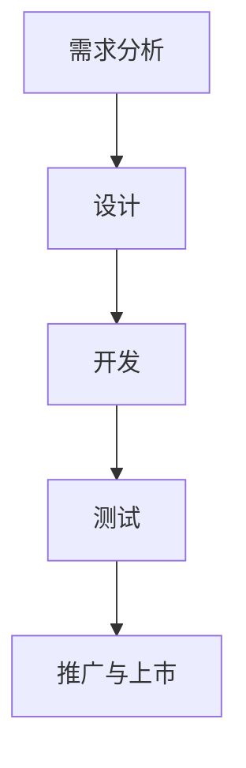
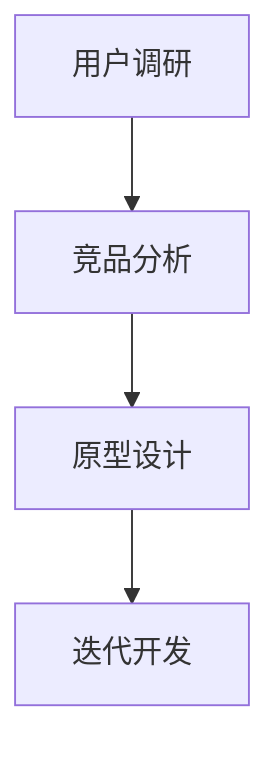
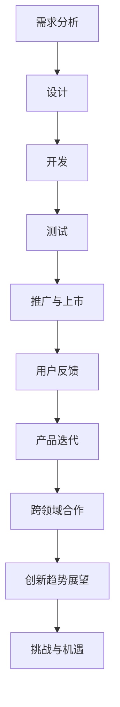

                 

### 产品开发与创新：AI推荐新产品

> **关键词**：产品开发、创新、人工智能、推荐系统、用户体验

> **摘要**：本文深入探讨了人工智能（AI）在产品开发与推荐系统中的应用，特别是如何利用AI实现个性化推荐新产品。文章从产品开发与创新的基础理论出发，详细介绍了AI技术在用户行为分析、需求挖掘、产品信息挖掘与处理等方面的应用，通过具体的推荐算法设计和实现案例，展示了AI在提升产品个性化推荐效果中的关键作用。同时，本文还分析了产品开发与创新的挑战与未来趋势，为企业和开发者提供了宝贵的实践指导和理论支持。

----------------------------------------------------------------

### 第一部分：产品开发与创新基础理论

产品开发与创新是现代企业持续竞争和发展的关键。在这个部分，我们将探讨产品开发与创新的基本理论，包括产品的定义与分类、创新的概念与类型、以及产品开发的流程与方法。

#### 第1章：产品开发与创新概述

##### 1.1 产品的定义与分类

###### 1.1.1 产品的定义

产品是指企业提供给消费者的任何有形物品或无形服务，以满足消费者的需求。具体来说，产品可以定义为以下四个要素的组合：

$$
\text{产品} = \{\text{功能}, \text{质量}, \text{用户体验}, \text{服务保障}\}
$$

- **功能**：产品能够实现的具体用途或目的。
- **质量**：产品满足用户需求的程度，包括可靠性、性能、耐用性等。
- **用户体验**：用户在使用产品过程中的感受和体验，包括界面设计、易用性、响应速度等。
- **服务保障**：产品售出后的售后服务和技术支持。

###### 1.1.2 产品的分类

根据产品的形态和属性，可以将产品分为以下几类：

- **有形产品**：具有实体形态，如手机、汽车、家电等。有形产品的生产、销售和售后环节相对复杂，需要考虑制造工艺、供应链管理、库存控制等问题。

  $$
  \text{有形产品} = \{\text{手机}, \text{汽车}, \text{家电}\}
  $$

- **无形产品**：无实体形态，如服务、保险、咨询等。无形产品主要依赖于提供者的专业技能和服务水平，需要建立良好的客户关系和品牌形象。

  $$
  \text{无形产品} = \{\text{服务}, \text{保险}, \text{咨询}\}
  $$

- **混合型产品**：既有实体形态又有无形服务，如信用卡、智能家居等。混合型产品结合了有形产品和无形产品的特点，既需要考虑实体产品的设计和生产，又要提供优质的服务体验。

  $$
  \text{混合型产品} = \{\text{信用卡}, \text{智能家居}\}
  $$

##### 1.2 创新的概念与类型

###### 1.2.1 创新的定义

创新是指通过新思路、新方法、新技术或新组织形式，创造或转换价值的过程。创新不仅限于技术领域，还包括商业模式、市场策略、组织架构等多个方面。具体来说，创新可以定义为以下要素的组合：

$$
\text{创新} = \{\text{新思路}, \text{新方法}, \text{新技术}, \text{新组织形式}\}
$$

- **新思路**：指新的思维方式和观念，如可持续发展、共享经济等。
- **新方法**：指新的工作流程、管理方法和技术手段，如敏捷开发、云计算等。
- **新技术**：指新的科学技术和发明创造，如人工智能、物联网等。
- **新组织形式**：指新的组织结构和运作模式，如扁平化管理、虚拟团队等。

###### 1.2.2 创新的类型

根据创新的性质和目的，可以将创新分为以下几类：

- **技术创新**：通过新技术、新材料、新工艺等，提升产品的性能和质量。
  
  $$
  \text{技术创新} = \{\text{新技术}, \text{新材料}, \text{新工艺}\}
  $$

- **业务模式创新**：通过改变产品或服务的提供方式，实现商业模式的变革。
  
  $$
  \text{业务模式创新} = \{\text{新商业模式}, \text{新服务模式}\}
  $$

- **市场创新**：通过开拓新市场、创造新需求，扩大市场份额。
  
  $$
  \text{市场创新} = \{\text{新市场}, \text{新需求}\}
  $$

- **组织创新**：通过重构企业组织结构和管理流程，提高企业的运营效率和创新能力。
  
  $$
  \text{组织创新} = \{\text{新组织结构}, \text{新管理流程}\}
  $$

##### 1.3 产品开发的流程与方法

###### 1.3.1 产品开发的流程

产品开发是一个系统化的过程，包括以下几个关键阶段：

1. **需求分析**：确定产品的功能、目标用户和市场。
2. **设计**：制定产品原型和设计方案。
3. **开发**：根据设计文档进行产品开发。
4. **测试**：验证产品的功能和质量。
5. **推广与上市**：进行市场推广和产品发布。

流程图如下：

###### 1.3.2 产品开发的方法

产品开发的方法包括以下几种：

1. **用户调研**：通过访谈、问卷调查等方式，了解用户需求和期望。
2. **竞品分析**：分析竞争对手的产品和市场表现，找出优势和不足。
3. **原型设计**：快速制作原型，验证设计思路和用户反馈。
4. **迭代开发**：根据用户反馈不断优化产品，实现快速迭代。

流程图如下：

#### 第2章：AI在产品开发中的应用

##### 2.1 AI技术概述

###### 2.1.1 AI的定义与发展历程

人工智能（Artificial Intelligence，简称AI）是指通过计算机模拟人类智能的技术。自20世纪50年代起，AI技术经历了多个发展阶段：

1. **初识阶段（1950-1969）**：人工智能概念提出，逻辑推理成为主要研究方向。
2. **繁荣阶段（1970-1989）**：专家系统成为主流，AI应用范围扩大。
3. **低谷阶段（1990-2000）**：机器学习兴起，AI技术开始向实用化发展。
4. **复兴阶段（2000至今）**：深度学习、大数据等新技术推动AI迅猛发展。

###### 2.1.2 AI的核心技术

AI的核心技术包括以下几种：

- **机器学习**：通过训练数据集，让计算机自主学习和预测。
- **深度学习**：模拟人脑神经网络的计算方法，实现复杂的特征提取和分类。
- **自然语言处理**：使计算机能够理解和生成人类语言。

##### 2.2 AI在产品开发中的应用场景

AI在产品开发中的应用场景非常广泛，以下列举几个主要的应用场景：

###### 2.2.1 用户画像与个性化推荐

通过分析用户行为数据，构建用户画像，实现个性化推荐。例如，电商平台可以根据用户的浏览记录、购买历史和偏好，推荐合适的商品。

###### 2.2.2 智能客服与语音交互

利用自然语言处理技术，实现智能客服和语音交互，提高用户体验。例如，银行可以通过智能客服系统，快速响应用户的查询和咨询。

###### 2.2.3 智能营销与广告投放

通过分析用户行为数据，实现精准营销和广告投放。例如，广告平台可以根据用户的兴趣和行为，推送相关的广告，提高广告的点击率和转化率。

###### 2.2.4 智能供应链与库存管理

通过机器学习技术，优化供应链和库存管理，降低成本，提高效率。例如，物流公司可以利用AI技术，预测货物需求，优化运输路线和仓储管理。

----------------------------------------------------------------

### 第二部分：AI推荐新产品的策略与方法

在第一部分中，我们探讨了产品开发与创新的基础理论以及AI在其中的应用。本部分将深入探讨AI在推荐新产品中的具体策略与方法，包括用户行为分析与需求挖掘、产品信息挖掘与处理、以及推荐算法的选择与实现。

#### 第3章：AI推荐系统概述

##### 3.1 推荐系统的基本原理

推荐系统是一种信息过滤系统，旨在帮助用户发现他们可能感兴趣的商品、内容或服务。其基本原理包括以下几个关键步骤：

1. **用户行为数据收集**：收集用户在平台上的浏览、搜索、点击、购买等行为数据。
2. **商品特征提取**：提取商品的基本信息、描述、标签、评分等特征。
3. **用户与商品匹配**：通过相似性计算或协同过滤等方法，将用户与商品进行匹配。
4. **生成推荐列表**：根据用户与商品的匹配度，生成推荐列表。

##### 3.2 推荐系统的分类

推荐系统可以根据不同的分类标准进行分类。以下是一些常见的分类方式：

###### 3.2.1 基于内容的推荐

基于内容的推荐（Content-Based Recommendation）通过分析用户的历史行为和商品的特征，为用户推荐相似的内容或商品。这种方法主要依赖于文本分析、关键词提取和相似度计算。

###### 3.2.2 基于协同过滤的推荐

基于协同过滤的推荐（Collaborative Filtering Recommendation）通过分析用户的行为数据，找到相似用户或相似商品，为用户推荐他们可能感兴趣的商品。协同过滤分为用户基于项目的协同过滤（User-Based Collaborative Filtering）和项目基于用户的协同过滤（Item-Based Collaborative Filtering）。

###### 3.2.3 混合推荐

混合推荐（Hybrid Recommendation）结合了基于内容和基于协同过滤的推荐方法，通过融合不同来源的特征，提高推荐系统的准确性和多样性。

##### 3.3 推荐系统的评价指标

推荐系统的性能可以通过以下评价指标进行评估：

1. **准确率（Precision）**：推荐结果中用户实际喜欢的商品占比。
2. **召回率（Recall）**：推荐结果中用户可能喜欢的商品占比。
3. **覆盖率（Coverage）**：推荐结果中包含的商品种类数。
4. **新颖性（Novelty）**：推荐结果中包含新异商品的能力。
5. **多样性（Diversity）**：推荐结果中不同类型商品的平衡。

#### 第4章：用户行为分析与需求挖掘

##### 4.1 用户行为数据分析

用户行为数据是推荐系统的重要输入。通过分析用户的行为数据，可以深入了解用户的需求和偏好。

###### 4.1.1 用户行为数据类型

用户行为数据主要包括以下几种类型：

1. **浏览行为**：用户在平台上的浏览记录，包括页面访问次数、停留时间等。
2. **搜索行为**：用户的搜索关键词和搜索结果。
3. **点击行为**：用户在平台上的点击记录，包括广告、商品、评论等。
4. **购买行为**：用户的购买记录和交易信息。

###### 4.1.2 用户行为数据分析方法

用户行为数据分析方法包括：

1. **统计方法**：通过统计用户行为数据的频率、分布等，了解用户的行为模式。
2. **聚类方法**：通过聚类分析，将用户划分为不同的群体，挖掘用户的需求特征。
3. **关联规则分析**：通过分析用户行为数据之间的关联关系，发现用户感兴趣的商品组合。

##### 4.2 用户需求挖掘

用户需求挖掘是指从用户行为数据中提取用户的需求和偏好。

###### 4.2.1 用户需求模型

用户需求模型是指通过分析用户行为数据，建立用户需求的表达方式。常见的用户需求模型包括：

1. **用户兴趣模型**：记录用户的历史行为，提取用户兴趣。
2. **用户需求预测模型**：根据用户行为预测用户未来的需求。

###### 4.2.2 用户需求挖掘方法

用户需求挖掘方法包括：

1. **用户行为序列分析**：通过分析用户行为序列，挖掘用户的行为模式和兴趣点。
2. **文本挖掘**：通过文本分析，提取用户评论中的关键词和情感。
3. **协同过滤**：通过分析用户的历史行为，预测用户可能感兴趣的商品。

#### 第5章：产品信息挖掘与处理

##### 5.1 产品信息数据收集与整理

产品信息数据是推荐系统的重要组成部分。通过收集和整理产品信息数据，可以为推荐算法提供可靠的输入。

###### 5.1.1 产品信息数据类型

产品信息数据主要包括以下几种类型：

1. **商品基本信息**：如商品名称、品牌、价格等。
2. **商品描述**：商品的详细描述和说明。
3. **用户评价**：用户对商品的评分和评论。
4. **商品图片**：商品的图片和视频。

###### 5.1.2 产品信息数据整理

产品信息数据整理包括以下步骤：

1. **数据清洗**：去除重复、错误和无用的数据。
2. **数据归一化**：统一不同来源的数据格式和范围。
3. **数据整合**：整合多源数据，形成统一的产品信息库。

##### 5.2 产品属性提取与建模

产品属性提取与建模是将产品信息数据转化为推荐算法可处理的输入。

###### 5.2.1 产品属性提取

产品属性提取包括以下步骤：

1. **文本属性提取**：通过自然语言处理技术，提取文本属性。
2. **数值属性提取**：直接提取数值属性，如价格、评分等。

###### 5.2.2 产品属性建模

产品属性建模包括以下步骤：

1. **特征编码**：将类别属性转化为数值编码。
2. **特征工程**：对数值属性进行归一化、标准化等处理。

#### 第6章：推荐算法的选择与实现

##### 6.1 基于内容的推荐算法

基于内容的推荐算法（Content-Based Recommendation Algorithm）通过分析用户的历史行为和商品的特征，为用户推荐相似的内容或商品。

###### 6.1.1 算法原理

基于内容的推荐算法主要依赖于以下原理：

1. **文本分析**：通过关键词提取和文本相似度计算，将用户和商品的特征进行匹配。
2. **特征融合**：将不同来源的特征进行融合，提高推荐效果。

###### 6.1.2 算法实现

基于内容的推荐算法实现步骤包括：

1. **文本预处理**：对文本进行分词、去停用词等处理。
2. **关键词提取**：通过词频、TF-IDF等方法提取关键词。
3. **文本相似度计算**：计算用户和商品之间的文本相似度。
4. **生成推荐列表**：根据用户和商品的相似度，生成推荐列表。

##### 6.2 基于协同过滤的推荐算法

基于协同过滤的推荐算法（Collaborative Filtering Algorithm）通过分析用户的行为数据，找到相似用户或相似商品，为用户推荐他们可能感兴趣的商品。

###### 6.2.1 算法原理

基于协同过滤的推荐算法主要依赖于以下原理：

1. **用户相似度计算**：通过计算用户之间的相似度，找到相似用户。
2. **商品相似度计算**：通过计算商品之间的相似度，找到相似商品。
3. **生成推荐列表**：根据用户和商品的相似度，生成推荐列表。

###### 6.2.2 算法实现

基于协同过滤的推荐算法实现步骤包括：

1. **用户行为数据预处理**：对用户行为数据进行清洗和归一化处理。
2. **用户相似度计算**：通过计算用户之间的相似度，找到相似用户。
3. **商品相似度计算**：通过计算商品之间的相似度，找到相似商品。
4. **生成推荐列表**：根据用户和商品的相似度，生成推荐列表。

##### 6.3 混合推荐算法

混合推荐算法（Hybrid Recommendation Algorithm）结合了基于内容和基于协同过滤的推荐方法，通过融合不同来源的特征，提高推荐效果。

###### 6.3.1 算法原理

混合推荐算法主要依赖于以下原理：

1. **特征融合**：将基于内容和基于协同过滤的特征进行融合，提高推荐效果。
2. **模型融合**：结合不同推荐模型的结果，提高推荐准确性。

###### 6.3.2 算法实现

混合推荐算法实现步骤包括：

1. **文本预处理**：对文本进行分词、去停用词等处理。
2. **关键词提取**：通过词频、TF-IDF等方法提取关键词。
3. **用户行为数据预处理**：对用户行为数据进行清洗和归一化处理。
4. **用户相似度计算**：通过计算用户之间的相似度，找到相似用户。
5. **商品相似度计算**：通过计算商品之间的相似度，找到相似商品。
6. **生成推荐列表**：根据用户和商品的相似度，生成推荐列表。

#### 第7章：AI推荐新产品的实践与案例分析

##### 7.1 案例背景与目标

**案例背景**：某电商平台希望通过AI推荐系统为用户提供个性化商品推荐，提高用户满意度和购买转化率。

**案例目标**：实现基于用户行为和商品特征的个性化推荐，提高推荐准确率和用户满意度。

##### 7.2 数据收集与处理

###### 7.2.1 用户行为数据

收集用户在平台上的浏览、搜索、点击、购买等行为数据。

- **浏览行为数据**：记录用户在平台上的浏览记录。
- **搜索行为数据**：记录用户的搜索关键词和搜索结果。
- **点击行为数据**：记录用户在平台上的点击记录。
- **购买行为数据**：记录用户的购买记录。

###### 7.2.2 产品数据

收集商品的基本信息、描述、标签、评分等数据。

- **商品基本信息**：包括商品名称、品牌、价格等。
- **商品描述**：商品的详细描述和说明。
- **用户评价**：用户对商品的评分和评论。
- **商品图片**：商品的图片和视频。

##### 7.3 用户分析与需求挖掘

###### 7.3.1 用户行为分析

分析用户的历史行为数据，提取用户兴趣和偏好。

- **用户活跃度分析**：统计用户在平台上的活跃行为。
- **用户浏览路径分析**：分析用户的浏览轨迹和停留时间。
- **用户购买行为分析**：分析用户的购买频率和购买偏好。

###### 7.3.2 用户需求挖掘

根据用户行为数据，挖掘用户的潜在需求。

- **用户兴趣模型**：使用聚类或分类算法提取用户兴趣。
- **需求预测模型**：使用时间序列或回归算法预测用户需求。

##### 7.4 产品信息分析与处理

###### 7.4.1 产品属性提取

提取商品的关键属性，如商品类别、品牌、价格等。

- **文本属性提取**：使用自然语言处理技术提取文本属性。
- **数值属性提取**：直接提取数值属性，如价格、评分等。

###### 7.4.2 产品特征建模

将提取的产品属性转化为数值或向量表示，便于后续计算和分析。

- **特征编码**：将类别属性转化为数值编码。
- **特征工程**：对数值属性进行归一化、标准化等处理。

##### 7.5 推荐算法实现与优化

###### 7.5.1 基于内容的推荐算法实现

使用基于内容的推荐算法，如文本相似度计算、主题模型等，生成推荐列表。

- **文本相似度计算**：使用TF-IDF等方法计算文本相似度。
- **主题模型**：使用LDA等算法提取文本主题，进行内容推荐。

###### 7.5.2 基于协同过滤的推荐算法实现

使用基于协同过滤的推荐算法，如矩阵分解、邻域搜索等，生成推荐列表。

- **矩阵分解**：使用SVD等方法分解用户-商品评分矩阵，预测用户未评分的商品。
- **邻域搜索**：基于用户或商品相似度构建邻域，进行推荐。

###### 7.5.3 混合推荐算法实现与优化

使用混合推荐算法，结合内容与协同过滤方法，提高推荐效果。

- **特征融合**：结合多种特征提高模型效果。
- **模型优化**：使用更先进的算法和技术优化模型。

##### 7.6 案例分析与评估

###### 7.6.1 推荐结果分析

分析推荐结果的质量和效果，包括准确率、召回率、覆盖率等指标。

- **准确率**：推荐结果中用户实际喜欢的商品占比。
- **召回率**：推荐结果中用户可能喜欢的商品占比。
- **覆盖率**：推荐结果中包含的商品种类数。

###### 7.6.2 推荐效果评估

评估推荐系统在实际应用中的效果，包括用户满意度、购买转化率等。

- **用户满意度**：通过用户反馈和调查问卷评估用户对推荐的满意度。
- **购买转化率**：推荐结果中用户实际购买的转化率。

##### 7.7 总结与展望

###### 7.7.1 案例总结

总结案例中的经验教训，包括推荐系统的设计、实现和优化过程。

- **需求分析**：准确理解用户需求和产品特性。
- **数据收集与处理**：保证数据的准确性和完整性。
- **算法选择与优化**：根据实际情况选择合适的推荐算法，并进行持续优化。

###### 7.7.2 未来发展方向

展望AI推荐系统在未来可能的发展方向和挑战。

- **个性化推荐**：进一步提高推荐系统的个性化程度。
- **实时推荐**：实现实时推荐，提高推荐系统的响应速度。
- **多模态推荐**：结合文本、图像、语音等多种数据进行推荐。
- **隐私保护**：在推荐过程中保护用户隐私。

#### 第8章：产品创新与用户反馈

##### 8.1 产品创新的重要性

###### 8.1.1 创新的市场价值

创新是企业在市场竞争中获得优势的关键。通过创新，企业能够推出具有竞争力的产品，满足消费者的需求，从而提升市场份额和盈利能力。

- **市场份额**：创新产品能够吸引更多消费者，提高市场份额。
- **盈利能力**：创新产品通常具有更高的利润率，为企业带来更多的收入。

###### 8.1.2 创新的竞争优势

创新能够为企业带来以下竞争优势：

- **差异化**：创新产品具有独特性，与其他产品形成差异化，提高市场竞争力。
- **降低成本**：通过技术创新，降低生产成本，提高企业的盈利能力。
- **用户体验**：创新设计提高用户体验，增强用户忠诚度，减少客户流失。

##### 8.2 用户反馈机制

###### 8.2.1 用户反馈的重要性

用户反馈是产品创新的重要来源。通过用户反馈，企业能够了解用户的需求和痛点，为产品改进提供依据。

- **需求挖掘**：用户反馈揭示用户未满足的需求，为产品改进提供方向。
- **问题定位**：用户反馈帮助定位产品问题和改进方向，提高产品质量和用户体验。

###### 8.2.2 用户反馈的方式

收集用户反馈的常见方式包括：

- **调查问卷**：通过在线或离线问卷收集用户意见。
- **用户访谈**：与用户进行面对面的交流，了解用户需求和体验。
- **用户行为数据**：分析用户在使用产品过程中的行为数据，了解用户的使用习惯和偏好。

##### 8.3 用户反馈在产品创新中的应用

###### 8.3.1 用户反馈数据的收集与处理

收集用户反馈数据，并进行数据清洗和处理。

- **数据清洗**：去除重复、错误和无用的数据。
- **数据归一化**：将不同来源的数据进行统一处理。

###### 8.3.2 用户反馈的挖掘与分析

通过数据挖掘技术，分析用户反馈中的关键信息。

- **文本分析**：使用文本挖掘技术提取关键词和主题。
- **情感分析**：判断用户反馈的情感倾向，了解用户满意度。

###### 8.3.3 用户反馈驱动的产品迭代

根据用户反馈，进行产品迭代和优化。

- **需求分析**：分析用户反馈中的需求，确定改进方向。
- **设计调整**：根据用户反馈，调整产品设计和功能。
- **测试与验证**：对改进后的产品进行测试和验证，确保效果。

#### 第9章：跨领域合作与创新

##### 9.1 跨领域合作的定义与意义

###### 9.1.1 跨领域合作的概念

跨领域合作是指不同领域的企业或组织通过合作，实现资源和技术的共享，共同开发新产品或服务。

###### 9.1.2 跨领域合作的意义

跨领域合作能够带来以下好处：

- **资源整合**：通过合作，企业可以整合不同领域的资源和优势，提高竞争力。
- **技术创新**：跨领域合作促进技术创新，提高产品竞争力。
- **市场拓展**：通过合作，企业可以进入新的市场，扩大业务范围。

##### 9.2 跨领域合作的模式与方法

###### 9.2.1 合作伙伴选择

选择合适的合作伙伴是实现跨领域合作的关键。

- **互补性**：合作伙伴在技术、资源、市场等方面具有互补性。
- **信誉度**：合作伙伴具有较高的信誉度和市场认可度。

###### 9.2.2 合作流程设计

设计合理的合作流程，确保合作的顺利进行。

- **需求对接**：明确合作目标和需求，确保各方目标一致。
- **资源整合**：整合各方资源和优势，共同开发新产品或服务。
- **利益分配**：制定合理的利益分配机制，确保各方利益平衡。

##### 9.3 成功跨领域合作案例

###### 9.3.1 案例一：传统制造企业与互联网企业的合作

**案例背景**：某传统制造企业希望利用互联网技术提升产品竞争力，与一家互联网企业进行合作。

**合作内容**：

- **技术合作**：共同开发基于互联网技术的智能制造系统。
- **市场推广**：利用互联网企业的市场渠道，推广智能制造系统。

**效果评估**：

- **销售额增长**：合作后，智能制造系统的销售额显著增长。
- **市场份额提升**：合作企业在市场上取得了更大的份额。

###### 9.3.2 案例二：金融科技与区块链的结合

**案例背景**：某金融科技公司希望利用区块链技术提高金融服务的安全性和效率，与一家区块链技术企业进行合作。

**合作内容**：

- **技术开发**：共同开发基于区块链的金融服务系统。
- **市场拓展**：利用金融科技公司的渠道，推广区块链金融服务。

**效果评估**：

- **交易效率提升**：区块链技术提高了金融交易的效率。
- **安全性增强**：区块链技术保障了金融交易的安全性。
- **用户满意度提高**：用户对区块链金融服务的满意度显著提升。

#### 第10章：产品开发与创新趋势展望

##### 10.1 产品开发的技术趋势

###### 10.1.1 人工智能技术的发展趋势

人工智能技术将继续快速发展，为产品开发带来更多机遇。

- **深度学习**：深度学习模型将更加普及，提高计算效率和准确率。
- **强化学习**：强化学习在产品开发中的应用将更加广泛，提高智能决策能力。

###### 10.1.2 5G与物联网的应用

5G和物联网技术将为产品开发带来新的机遇。

- **高速网络**：5G技术提供高速、低延迟的网络环境，支持实时数据处理。
- **物联网设备**：物联网设备将更加普及，实现产品与设备的互联互通。

##### 10.2 产品创新的商业模式

###### 10.2.1 分享经济模式

分享经济模式将为产品创新带来新的商业模式。

- **资源共享**：通过共享资源，降低产品开发和运营成本。
- **平台运营**：通过平台运营，提高产品用户体验和市场占有率。

###### 10.2.2 平台化运营模式

平台化运营模式将为企业提供更广阔的市场空间。

- **生态系统建设**：通过构建生态系统，吸引更多合作伙伴和用户。
- **商业模式创新**：通过平台化运营，实现商业模式的创新和拓展。

##### 10.3 未来产品开发与创新的挑战与机遇

###### 10.3.1 挑战

未来产品开发与创新将面临以下挑战：

- **技术更新换代**：技术快速发展，企业需要不断跟进新技术。
- **数据安全与隐私保护**：数据安全与隐私保护成为重要问题。

###### 10.3.2 机遇

未来产品开发与创新将迎来以下机遇：

- **新兴市场崛起**：新兴市场为企业提供了巨大的市场空间。
- **消费者需求多样化**：消费者需求的多样化为企业提供了创新的动力。

### 附录

## 附录A：常用工具与资源

### A.1 AI工具

- **TensorFlow**：一款广泛使用的开源深度学习框架。
- **PyTorch**：一款流行的开源深度学习框架。

### A.2 数据资源

- **UCI机器学习数据库**：提供多种领域的机器学习数据集。
- **KEG实验室数据集**：提供各种行业的数据集。

### A.3 开发环境搭建

- **Linux环境**：在Linux系统上搭建开发环境。
- **Windows环境**：在Windows系统上搭建开发环境。
- **Mac环境**：在Mac系统上搭建开发环境。

### A.4 学习资料推荐

- **Coursera课程**：提供丰富的在线课程。
- **edX课程**：提供多种领域的在线课程。
- **Udacity课程**：提供专业的在线课程。

#### 图1-1 产品开发与创新流程

---

### 第一部分：产品开发与创新基础理论

在当今竞争激烈的市场环境中，产品开发与创新成为企业持续发展的关键。本部分将首先探讨产品开发与创新的基本理论，包括产品的定义与分类、创新的概念与类型，以及产品开发的流程与方法。

#### 第1章：产品开发与创新概述

##### 1.1 产品的定义与分类

###### 1.1.1 产品的定义

产品是企业在市场上提供的任何有形物品或无形服务，旨在满足消费者的需求。根据产品的形态和属性，产品可以划分为以下几类：

1. **有形产品**：具有物理形态，例如手机、汽车、家具等。这类产品通常涉及制造、物流、销售等环节，需要考虑生产成本、质量控制和供应链管理。

2. **无形产品**：无物理形态，例如金融服务、医疗服务、教育培训等。这类产品主要依赖于提供者的专业技能和服务水平，需要建立良好的客户关系和品牌声誉。

3. **混合型产品**：既有物理形态又有无形服务，例如信用卡、智能家居等。这类产品结合了有形产品和无形产品的特点，需要同时关注实体产品的设计和无形服务的质量。

为了更好地理解产品的定义，我们可以用以下公式来表示：

$$
\text{产品} = \{\text{功能}, \text{质量}, \text{用户体验}, \text{服务保障}\}
$$

- **功能**：产品能够实现的具体用途或目的。
- **质量**：产品满足用户需求的程度，包括可靠性、性能、耐用性等。
- **用户体验**：用户在使用产品过程中的感受和体验，包括界面设计、易用性、响应速度等。
- **服务保障**：产品售出后的售后服务和技术支持。

###### 1.1.2 产品的分类

根据产品的形态和属性，可以将产品分为以下几类：

- **有形产品**：例如手机、汽车、家电等。
- **无形产品**：例如金融服务、医疗服务、教育培训等。
- **混合型产品**：例如信用卡、智能家居等。

#### 第2章：创新的概念与类型

创新是推动企业持续发展的重要动力。根据创新的性质和目的，创新可以分为以下几类：

1. **技术创新**：通过引入新技术、新材料、新工艺等，提升产品的性能和质量。
2. **业务模式创新**：通过改变产品或服务的提供方式，实现商业模式的变革。
3. **市场创新**：通过开拓新市场、创造新需求，扩大市场份额。
4. **组织创新**：通过重构企业组织结构和管理流程，提高企业的运营效率和创新能力。

#### 第3章：产品开发的流程与方法

产品开发是一个系统化的过程，包括以下几个关键阶段：

1. **需求分析**：确定产品的功能、目标用户和市场。
2. **设计**：制定产品原型和设计方案。
3. **开发**：根据设计文档进行产品开发。
4. **测试**：验证产品的功能和质量。
5. **推广与上市**：进行市场推广和产品发布。

产品开发的流程图如下：

#### 第4章：AI在产品开发中的应用

AI技术在产品开发中的应用日益广泛，以下是AI在产品开发中的一些具体应用场景：

1. **用户画像与个性化推荐**：通过分析用户行为数据，为用户提供个性化的推荐服务。
2. **智能客服与语音交互**：利用自然语言处理技术，实现智能客服和语音交互，提高用户体验。
3. **智能营销与广告投放**：通过分析用户行为数据，实现精准营销和广告投放。
4. **智能供应链与库存管理**：通过机器学习技术，优化供应链和库存管理，降低成本，提高效率。

在下一部分中，我们将深入探讨AI在推荐新产品中的具体策略与方法。

### 第二部分：AI推荐新产品的策略与方法

在第一部分中，我们探讨了产品开发与创新的基础理论，包括产品的定义与分类、创新的概念与类型，以及产品开发的流程与方法。在本部分，我们将重点讨论AI在推荐新产品中的策略与方法，包括用户行为分析与需求挖掘、产品信息挖掘与处理、以及推荐算法的选择与实现。

#### 第5章：AI推荐系统概述

##### 5.1 推荐系统的基本原理

推荐系统是一种信息过滤系统，旨在帮助用户发现他们可能感兴趣的商品、内容或服务。其基本原理包括以下几个关键步骤：

1. **用户行为数据收集**：收集用户在平台上的浏览、搜索、点击、购买等行为数据。
2. **商品特征提取**：提取商品的基本信息、描述、标签、评分等特征。
3. **用户与商品匹配**：通过相似性计算或协同过滤等方法，将用户与商品进行匹配。
4. **生成推荐列表**：根据用户与商品的匹配度，生成推荐列表。

##### 5.2 推荐系统的分类

推荐系统可以根据不同的分类标准进行分类。以下是一些常见的分类方式：

1. **基于内容的推荐**：通过分析用户的历史行为和商品的特征，为用户推荐相似的内容或商品。
2. **基于协同过滤的推荐**：通过分析用户的行为数据，找到相似用户或相似商品，为用户推荐他们可能感兴趣的商品。
3. **混合推荐**：结合基于内容和基于协同过滤的推荐方法，通过融合不同来源的特征，提高推荐系统的准确性和多样性。

##### 5.3 推荐系统的评价指标

推荐系统的性能可以通过以下评价指标进行评估：

1. **准确率（Precision）**：推荐结果中用户实际喜欢的商品占比。
2. **召回率（Recall）**：推荐结果中用户可能喜欢的商品占比。
3. **覆盖率（Coverage）**：推荐结果中包含的商品种类数。
4. **新颖性（Novelty）**：推荐结果中包含新异商品的能力。
5. **多样性（Diversity）**：推荐结果中不同类型商品的平衡。

#### 第6章：用户行为分析与需求挖掘

##### 6.1 用户行为数据分析

用户行为数据是推荐系统的重要输入。通过分析用户的行为数据，可以深入了解用户的需求和偏好。

###### 6.1.1 用户行为数据类型

用户行为数据主要包括以下几种类型：

1. **浏览行为**：用户在平台上的浏览记录，包括页面访问次数、停留时间等。
2. **搜索行为**：用户的搜索关键词和搜索结果。
3. **点击行为**：用户在平台上的点击记录，包括广告、商品、评论等。
4. **购买行为**：用户的购买记录和交易信息。

###### 6.1.2 用户行为数据分析方法

用户行为数据分析方法包括：

1. **统计方法**：通过统计用户行为数据的频率、分布等，了解用户的行为模式。
2. **聚类方法**：通过聚类分析，将用户划分为不同的群体，挖掘用户的需求特征。
3. **关联规则分析**：通过分析用户行为数据之间的关联关系，发现用户感兴趣的商品组合。

##### 6.2 用户需求挖掘

用户需求挖掘是指从用户行为数据中提取用户的需求和偏好。

###### 6.2.1 用户需求模型

用户需求模型是指通过分析用户行为数据，建立用户需求的表达方式。常见的用户需求模型包括：

1. **用户兴趣模型**：记录用户的历史行为，提取用户兴趣。
2. **用户需求预测模型**：根据用户行为预测用户未来的需求。

###### 6.2.2 用户需求挖掘方法

用户需求挖掘方法包括：

1. **用户行为序列分析**：通过分析用户行为序列，挖掘用户的行为模式和兴趣点。
2. **文本挖掘**：通过文本分析，提取用户评论中的关键词和情感。
3. **协同过滤**：通过分析用户的历史行为，预测用户可能感兴趣的商品。

#### 第7章：产品信息挖掘与处理

##### 7.1 产品信息数据收集与整理

产品信息数据是推荐系统的重要组成部分。通过收集和整理产品信息数据，可以为推荐算法提供可靠的输入。

###### 7.1.1 产品信息数据类型

产品信息数据主要包括以下几种类型：

1. **商品基本信息**：如商品名称、品牌、价格等。
2. **商品描述**：商品的详细描述和说明。
3. **用户评价**：用户对商品的评分和评论。
4. **商品图片**：商品的图片和视频。

###### 7.1.2 产品信息数据整理

产品信息数据整理包括以下步骤：

1. **数据清洗**：去除重复、错误和无用的数据。
2. **数据归一化**：统一不同来源的数据格式和范围。
3. **数据整合**：整合多源数据，形成统一的产品信息库。

##### 7.2 产品属性提取与建模

产品属性提取与建模是将产品信息数据转化为推荐算法可处理的输入。

###### 7.2.1 产品属性提取

产品属性提取包括以下步骤：

1. **文本属性提取**：通过自然语言处理技术，提取文本属性。
2. **数值属性提取**：直接提取数值属性，如价格、评分等。

###### 7.2.2 产品属性建模

产品属性建模包括以下步骤：

1. **特征编码**：将类别属性转化为数值编码。
2. **特征工程**：对数值属性进行归一化、标准化等处理。

#### 第8章：推荐算法的选择与实现

##### 8.1 基于内容的推荐算法

基于内容的推荐算法通过分析用户的历史行为和商品的特征，为用户推荐相似的内容或商品。

###### 8.1.1 算法原理

基于内容的推荐算法主要依赖于以下原理：

1. **文本分析**：通过关键词提取和文本相似度计算，将用户和商品的特征进行匹配。
2. **特征融合**：将不同来源的特征进行融合，提高推荐效果。

###### 8.1.2 算法实现

基于内容的推荐算法实现步骤包括：

1. **文本预处理**：对文本进行分词、去停用词等处理。
2. **关键词提取**：通过词频、TF-IDF等方法提取关键词。
3. **文本相似度计算**：计算用户和商品之间的文本相似度。
4. **生成推荐列表**：根据用户和商品的相似度，生成推荐列表。

##### 8.2 基于协同过滤的推荐算法

基于协同过滤的推荐算法通过分析用户的行为数据，找到相似用户或相似商品，为用户推荐他们可能感兴趣的商品。

###### 8.2.1 算法原理

基于协同过滤的推荐算法主要依赖于以下原理：

1. **用户相似度计算**：通过计算用户之间的相似度，找到相似用户。
2. **商品相似度计算**：通过计算商品之间的相似度，找到相似商品。
3. **生成推荐列表**：根据用户和商品的相似度，生成推荐列表。

###### 8.2.2 算法实现

基于协同过滤的推荐算法实现步骤包括：

1. **用户行为数据预处理**：对用户行为数据进行清洗和归一化处理。
2. **用户相似度计算**：通过计算用户之间的相似度，找到相似用户。
3. **商品相似度计算**：通过计算商品之间的相似度，找到相似商品。
4. **生成推荐列表**：根据用户和商品的相似度，生成推荐列表。

##### 8.3 混合推荐算法

混合推荐算法结合了基于内容和基于协同过滤的推荐方法，通过融合不同来源的特征，提高推荐效果。

###### 8.3.1 算法原理

混合推荐算法主要依赖于以下原理：

1. **特征融合**：将基于内容和基于协同过滤的特征进行融合，提高推荐效果。
2. **模型融合**：结合不同推荐模型的结果，提高推荐准确性。

###### 8.3.2 算法实现

混合推荐算法实现步骤包括：

1. **文本预处理**：对文本进行分词、去停用词等处理。
2. **关键词提取**：通过词频、TF-IDF等方法提取关键词。
3. **用户行为数据预处理**：对用户行为数据进行清洗和归一化处理。
4. **用户相似度计算**：通过计算用户之间的相似度，找到相似用户。
5. **商品相似度计算**：通过计算商品之间的相似度，找到相似商品。
6. **生成推荐列表**：根据用户和商品的相似度，生成推荐列表。

### 第三部分：AI推荐新产品的实践与案例分析

在第二部分中，我们探讨了AI推荐新产品的策略与方法。在本部分，我们将通过具体案例来展示AI推荐新产品的实际应用，分析其效果，并提出改进建议。

#### 第9章：AI推荐新产品的实践案例

##### 9.1 案例背景

以某知名电商平台的推荐系统为例，该平台希望通过AI技术优化其推荐算法，提高用户的购买转化率和满意度。为了实现这一目标，平台决定采用基于协同过滤和基于内容的混合推荐算法，结合用户行为数据和市场数据，生成个性化的推荐列表。

##### 9.2 数据收集与处理

###### 9.2.1 用户行为数据

收集用户在平台上的浏览、搜索、点击、购买等行为数据。具体数据包括：

- 用户ID、浏览时间、浏览页面、浏览时长等。
- 用户ID、搜索关键词、搜索结果等。
- 用户ID、点击广告、点击时长等。
- 用户ID、购买记录、购买金额等。

对收集到的用户行为数据进行预处理，包括：

- 数据清洗：去除重复、错误和无用的数据。
- 数据归一化：统一不同来源的数据格式和范围。
- 数据整合：将多源数据整合到一个统一的数据集中。

###### 9.2.2 产品数据

收集商品的基本信息、描述、标签、评分等数据。具体数据包括：

- 商品ID、商品名称、品牌、价格等。
- 商品ID、商品描述、商品图片等。
- 商品ID、用户评价、评价分数等。

对收集到的产品数据进行预处理，包括：

- 数据清洗：去除重复、错误和无用的数据。
- 数据归一化：统一不同来源的数据格式和范围。
- 数据整合：将多源数据整合到一个统一的数据集中。

##### 9.3 用户分析与需求挖掘

###### 9.3.1 用户行为分析

通过分析用户行为数据，提取用户兴趣和偏好。具体步骤包括：

- **用户活跃度分析**：统计用户在平台上的活跃行为，如浏览次数、浏览时长等。
- **用户浏览路径分析**：分析用户的浏览轨迹和停留时间，了解用户的浏览偏好。
- **用户购买行为分析**：分析用户的购买频率、购买金额、购买品类等，了解用户的购买习惯。

###### 9.3.2 用户需求挖掘

根据用户行为数据，挖掘用户的潜在需求。具体步骤包括：

- **用户兴趣模型**：使用聚类算法，如K-Means，将用户划分为不同的群体，每个群体代表一种用户兴趣。
- **需求预测模型**：使用时间序列模型，如ARIMA，预测用户未来的需求。

##### 9.4 产品信息分析与处理

###### 9.4.1 产品属性提取

提取商品的关键属性，如商品类别、品牌、价格等。具体步骤包括：

- **文本属性提取**：使用自然语言处理技术，提取商品描述中的关键词。
- **数值属性提取**：直接提取商品的价格、评分等数值属性。

###### 9.4.2 产品特征建模

将提取的产品属性转化为数值或向量表示，便于后续计算和分析。具体步骤包括：

- **特征编码**：将类别属性转化为数值编码。
- **特征工程**：对数值属性进行归一化、标准化等处理。

##### 9.5 推荐算法实现与优化

###### 9.5.1 基于内容的推荐算法

使用基于内容的推荐算法，如TF-IDF和LDA，生成推荐列表。具体步骤包括：

- **文本预处理**：对商品描述进行分词、去停用词等处理。
- **关键词提取**：使用TF-IDF方法提取关键词。
- **文本相似度计算**：计算用户与商品之间的文本相似度。
- **生成推荐列表**：根据用户与商品的相似度，生成推荐列表。

###### 9.5.2 基于协同过滤的推荐算法

使用基于协同过滤的推荐算法，如矩阵分解和邻域搜索，生成推荐列表。具体步骤包括：

- **用户行为数据预处理**：对用户行为数据进行清洗和归一化处理。
- **用户相似度计算**：计算用户之间的相似度。
- **商品相似度计算**：计算商品之间的相似度。
- **生成推荐列表**：根据用户和商品的相似度，生成推荐列表。

###### 9.5.3 混合推荐算法

使用混合推荐算法，结合基于内容和基于协同过滤的推荐方法，提高推荐效果。具体步骤包括：

- **特征融合**：将基于内容和基于协同过滤的特征进行融合。
- **模型融合**：结合不同推荐模型的结果，提高推荐准确性。

##### 9.6 案例分析与评估

###### 9.6.1 推荐结果分析

分析推荐结果的质量和效果，包括准确率、召回率、覆盖率等指标。具体步骤包括：

- **准确率**：推荐结果中用户实际喜欢的商品占比。
- **召回率**：推荐结果中用户可能喜欢的商品占比。
- **覆盖率**：推荐结果中包含的商品种类数。

###### 9.6.2 推荐效果评估

评估推荐系统在实际应用中的效果，包括用户满意度、购买转化率等。具体步骤包括：

- **用户满意度**：通过用户反馈和调查问卷评估用户对推荐的满意度。
- **购买转化率**：推荐结果中用户实际购买的转化率。

##### 9.7 改进建议

根据案例分析和评估结果，提出以下改进建议：

- **算法优化**：不断优化推荐算法，提高推荐准确率和用户满意度。
- **用户反馈机制**：建立完善的用户反馈机制，及时收集和处理用户反馈。
- **数据更新**：定期更新用户行为数据和产品信息，确保数据的时效性和准确性。
- **个性化定制**：提供个性化定制服务，满足不同用户的需求。

### 第四部分：产品创新与用户反馈

在第三部分中，我们通过实践案例展示了AI推荐新产品的具体应用和效果。在本部分，我们将探讨产品创新的重要性、用户反馈机制及其在产品创新中的应用。

#### 第10章：产品创新的重要性

##### 10.1 创新的市场价值

创新是企业在市场竞争中取得优势的关键。通过创新，企业可以开发出具有竞争力的新产品，满足消费者的需求，从而提升市场份额和盈利能力。创新的市场价值体现在以下几个方面：

- **差异化**：创新产品具有独特性，与其他产品形成差异化，提高市场竞争力。
- **降低成本**：通过技术创新，降低生产成本，提高企业的盈利能力。
- **用户体验**：创新设计提高用户体验，增强用户忠诚度，减少客户流失。

##### 10.2 创新的竞争优势

创新能够为企业带来以下竞争优势：

- **技术创新**：通过引入新技术、新材料、新工艺等，提升产品的性能和质量。
- **业务模式创新**：通过改变产品或服务的提供方式，实现商业模式的变革。
- **市场创新**：通过开拓新市场、创造新需求，扩大市场份额。
- **组织创新**：通过重构企业组织结构和管理流程，提高企业的运营效率和创新能力。

#### 第11章：用户反馈机制

##### 11.1 用户反馈的重要性

用户反馈是产品创新的重要来源。通过用户反馈，企业可以了解用户的需求和痛点，为产品改进提供依据。用户反馈的重要性体现在以下几个方面：

- **需求挖掘**：用户反馈揭示用户未满足的需求，为产品改进提供方向。
- **问题定位**：用户反馈帮助定位产品问题和改进方向，提高产品质量和用户体验。

##### 11.2 用户反馈的方式

收集用户反馈的常见方式包括：

- **调查问卷**：通过在线或离线问卷收集用户意见。
- **用户访谈**：与用户进行面对面的交流，了解用户需求和体验。
- **用户行为数据**：分析用户在使用产品过程中的行为数据，了解用户的使用习惯和偏好。

##### 11.3 用户反馈在产品创新中的应用

###### 11.3.1 用户反馈数据的收集与处理

收集用户反馈数据，并进行数据清洗和处理。

- **数据清洗**：去除重复、错误和无用的数据。
- **数据归一化**：将不同来源的数据进行统一处理。

###### 11.3.2 用户反馈的挖掘与分析

通过数据挖掘技术，分析用户反馈中的关键信息。

- **文本分析**：使用文本挖掘技术提取关键词和主题。
- **情感分析**：判断用户反馈的情感倾向，了解用户满意度。

###### 11.3.3 用户反馈驱动的产品迭代

根据用户反馈，进行产品迭代和优化。

- **需求分析**：分析用户反馈中的需求，确定改进方向。
- **设计调整**：根据用户反馈，调整产品设计和功能。
- **测试与验证**：对改进后的产品进行测试和验证，确保效果。

#### 第12章：跨领域合作与创新

##### 12.1 跨领域合作的定义与意义

跨领域合作是指不同领域的企业或组织通过合作，实现资源和技术的共享，共同开发新产品或服务。

##### 12.2 跨领域合作的模式与方法

跨领域合作的模式和方法包括：

- **技术合作**：通过技术交流与合作，共同研发新技术或产品。
- **市场合作**：通过共同开拓市场，实现资源共享和互利共赢。
- **资源整合**：通过整合各方资源和优势，提高整体竞争力。

##### 12.3 成功跨领域合作案例

介绍一些成功的跨领域合作案例，如传统制造企业与互联网企业的合作、金融科技与区块链的结合等，分析其成功的原因和经验。

### 第五部分：产品开发与创新趋势展望

在第四部分中，我们探讨了产品创新的重要性、用户反馈机制及其在产品创新中的应用。在本部分，我们将展望产品开发与创新的未来趋势，分析人工智能、大数据、物联网等新兴技术对未来产品开发与创新的潜在影响。

#### 第13章：产品开发的技术趋势

##### 13.1 人工智能技术的发展趋势

人工智能技术将继续快速发展，为产品开发带来更多机遇。以下是一些人工智能技术的发展趋势：

- **深度学习**：深度学习模型将更加普及，提高计算效率和准确率。
- **强化学习**：强化学习在产品开发中的应用将更加广泛，提高智能决策能力。

##### 13.2 大数据和物联网的应用

大数据和物联网技术将在未来产品开发中发挥重要作用。以下是一些应用趋势：

- **大数据分析**：通过大数据分析，挖掘用户需求和市场趋势，指导产品创新。
- **物联网设备**：物联网设备将更加普及，实现产品与设备的互联互通。

#### 第14章：产品创新的商业模式

##### 14.1 分享经济模式

分享经济模式将为产品创新带来新的商业模式。以下是一些分享经济模式的应用趋势：

- **资源共享**：通过共享资源，降低产品开发和运营成本。
- **平台运营**：通过平台运营，提高产品用户体验和市场占有率。

##### 14.2 平台化运营模式

平台化运营模式将为企业提供更广阔的市场空间。以下是一些平台化运营模式的应用趋势：

- **生态系统建设**：通过构建生态系统，吸引更多合作伙伴和用户。
- **商业模式创新**：通过平台化运营，实现商业模式的创新和拓展。

#### 第15章：未来产品开发与创新的挑战与机遇

##### 15.1 挑战

未来产品开发与创新将面临以下挑战：

- **技术更新换代**：技术快速发展，企业需要不断跟进新技术。
- **数据安全与隐私保护**：数据安全与隐私保护成为重要问题。

##### 15.2 机遇

未来产品开发与创新将迎来以下机遇：

- **新兴市场崛起**：新兴市场为企业提供了巨大的市场空间。
- **消费者需求多样化**：消费者需求的多样化为企业提供了创新的动力。

### 总结

本文通过多角度、多层次地探讨了产品开发与创新、AI推荐新产品的策略与方法、用户反馈机制、跨领域合作与创新以及未来产品开发与创新趋势。希望通过本文，读者能够对产品开发与创新有更深刻的理解，掌握AI在推荐新产品中的应用，以及如何利用用户反馈和跨领域合作推动产品创新。

### 附录

## 附录A：常用工具与资源

### A.1 AI工具

- **TensorFlow**：一款广泛使用的开源深度学习框架。
- **PyTorch**：一款流行的开源深度学习框架。

### A.2 数据资源

- **UCI机器学习数据库**：提供多种领域的机器学习数据集。
- **KEG实验室数据集**：提供各种行业的数据集。

### A.3 开发环境搭建

- **Linux环境**：在Linux系统上搭建开发环境。
- **Windows环境**：在Windows系统上搭建开发环境。
- **Mac环境**：在Mac系统上搭建开发环境。

### A.4 学习资料推荐

- **Coursera课程**：提供丰富的在线课程。
- **edX课程**：提供多种领域的在线课程。
- **Udacity课程**：提供专业的在线课程。

#### 图1-1 产品开发与创新流程

---

## 产品开发与创新：AI推荐新产品

### 关键词：产品开发、创新、人工智能、推荐系统、用户体验

### 摘要

本文深入探讨了人工智能（AI）在产品开发与推荐系统中的应用，特别是如何利用AI实现个性化推荐新产品。文章从产品开发与创新的基础理论出发，详细介绍了AI技术在用户行为分析、需求挖掘、产品信息挖掘与处理等方面的应用，通过具体的推荐算法设计和实现案例，展示了AI在提升产品个性化推荐效果中的关键作用。同时，本文还分析了产品开发与创新的挑战与未来趋势，为企业和开发者提供了宝贵的实践指导和理论支持。

### 引言

在当今信息爆炸的时代，如何让用户在海量信息中快速找到他们感兴趣的内容或商品，成为企业和开发者面临的重要挑战。人工智能（AI）技术的快速发展，为这一挑战提供了新的解决方案。AI推荐系统通过分析用户行为、挖掘用户需求和个性化推荐商品，极大地提升了用户体验和购买转化率。本文将探讨AI在产品开发与推荐系统中的应用，包括基础理论、策略方法、实践案例和未来趋势。

### 第一部分：产品开发与创新基础理论

#### 第1章：产品开发与创新概述

##### 1.1 产品的定义与分类

产品是指企业提供给消费者的任何有形物品或无形服务，以满足消费者的需求。根据产品的形态和属性，产品可以分为有形产品、无形产品和混合型产品。

##### 1.2 创新的概念与类型

创新是指通过新思路、新方法、新技术或新组织形式，创造或转换价值的过程。创新可以分为技术创新、业务模式创新、市场创新和组织创新。

##### 1.3 产品开发的流程与方法

产品开发包括需求分析、设计、开发、测试、推广与上市等阶段。产品开发的方法包括用户调研、竞品分析、原型设计和迭代开发。

### 第二部分：AI在产品开发中的应用

#### 第2章：AI技术概述

##### 2.1 AI的定义与发展历程

AI是指通过计算机模拟人类智能的技术，经历了初识阶段、繁荣阶段、低谷阶段和复兴阶段。

##### 2.2 AI的核心技术

AI的核心技术包括机器学习、深度学习和自然语言处理。

##### 2.3 AI在产品开发中的应用场景

AI在产品开发中的应用场景包括用户画像与个性化推荐、智能客服与语音交互、智能营销与广告投放、智能供应链与库存管理。

### 第三部分：AI推荐新产品的策略与方法

#### 第3章：AI推荐系统概述

##### 3.1 推荐系统的基本原理

推荐系统通过收集用户行为数据、提取商品特征、匹配用户与商品、生成推荐列表。

##### 3.2 推荐系统的分类

推荐系统可以分为基于内容的推荐、基于协同过滤的推荐和混合推荐。

##### 3.3 推荐系统的评价指标

推荐系统的性能可以通过准确率、召回率、覆盖率、新颖性和多样性等指标进行评估。

#### 第4章：用户行为分析与需求挖掘

##### 4.1 用户行为数据分析

用户行为数据分析包括浏览行为、搜索行为、点击行为和购买行为等。

##### 4.2 用户需求挖掘

用户需求挖掘包括用户兴趣模型和需求预测模型。

#### 第5章：产品信息挖掘与处理

##### 5.1 产品信息数据收集与整理

产品信息数据包括商品基本信息、描述、标签、评分和图片等。

##### 5.2 产品属性提取与建模

产品属性提取与建模包括文本属性提取、数值属性提取和特征工程。

#### 第6章：推荐算法的选择与实现

##### 6.1 基于内容的推荐算法

基于内容的推荐算法包括文本相似度计算、主题模型等。

##### 6.2 基于协同过滤的推荐算法

基于协同过滤的推荐算法包括用户基于项目的协同过滤和项目基于用户的协同过滤。

##### 6.3 混合推荐算法

混合推荐算法结合基于内容和基于协同过滤的推荐方法。

### 第四部分：AI推荐新产品的实践与案例分析

#### 第7章：AI推荐新产品的实践案例

##### 7.1 案例背景

以某电商平台的推荐系统为例，分析其AI推荐新产品的实践。

##### 7.2 数据收集与处理

收集用户行为数据和产品信息数据，并进行预处理。

##### 7.3 用户分析与需求挖掘

通过分析用户行为数据，挖掘用户需求和兴趣。

##### 7.4 产品信息分析与处理

提取产品属性，建立产品特征模型。

##### 7.

