                 

### 《京东2024校招运维工程师面试问答集锦》

> **关键词：京东校招、运维工程师、面试问答、技术准备、职业发展**

> **摘要：本文章旨在为2024届毕业生提供针对京东运维工程师岗位的面试准备指南，涵盖基础知识、实战技能、面试经验分享以及京东运维岗位的具体要求。通过详细的问答解析，帮助读者更好地应对面试挑战，顺利进入心仪的企业。**

---

### 《京东2024校招运维工程师面试问答集锦》目录大纲

#### 第一部分：运维基础知识

##### 第1章：运维基础概念
- 1.1 运维基本职责与目标
- 1.2 运维流程与方法论
- 1.3 运维团队组织结构
- 1.4 运维工具与技术选型

##### 第2章：操作系统与网络基础
- 2.1 操作系统原理与配置
- 2.2 网络基础与协议
- 2.3 故障排查与性能优化

##### 第3章：数据库运维
- 3.1 数据库基础与架构
- 3.2 常见数据库运维操作
- 3.3 数据库性能监控与优化

#### 第二部分：运维实战技能

##### 第4章：自动化运维
- 4.1 自动化运维概述
- 4.2 Shell脚本编写基础
- 4.3 使用Ansible进行自动化部署
- 4.4 使用Puppet进行自动化管理

##### 第5章：监控与告警
- 5.1 监控体系构建
- 5.2 常用监控工具介绍
- 5.3 告警机制与处理流程

##### 第6章：持续集成与持续部署
- 6.1 CI/CD概述
- 6.2 Jenkins实战
- 6.3 GitLab CI/CD实践

##### 第7章：容器化与虚拟化
- 7.1 容器化技术概述
- 7.2 Docker实战
- 7.3 Kubernetes基础与部署

##### 第8章：云服务与云原生应用
- 8.1 云服务概述
- 8.2 AWS云服务实战
- 8.3 Azure云服务实战
- 8.4 云原生应用架构与实践

#### 第三部分：面试经验分享

##### 第9章：面试准备与策略
- 9.1 面试前准备
- 9.2 面试常见问题及答案解析
- 9.3 面试中的技巧与注意事项

##### 第10章：京东运维岗位面试题及答案解析
- 10.1 系统运维面试题
- 10.2 网络运维面试题
- 10.3 数据库运维面试题
- 10.4 自动化运维面试题
- 10.5 监控与告警面试题
- 10.6 持续集成与持续部署面试题
- 10.7 容器化与虚拟化面试题
- 10.8 云服务与云原生应用面试题

##### 第11章：面试经验分享与心得
- 11.1 面试经历回顾
- 11.2 面试成功经验分享
- 11.3 面试失败经验与反思

#### 附录

##### 附录A：京东校招运维工程师岗位介绍
- A.1 岗位职责
- A.2 岗位要求
- A.3 发展前景

##### 附录B：运维相关资源推荐
- B.1 书籍推荐
- B.2 博客推荐
- B.3 社群推荐

---

接下来，我们将逐步深入分析每一个章节，提供详细的知识点和实战技巧，帮助读者充分准备京东2024校招运维工程师的面试。让我们开始第一部分的探索之旅。

#### 第一部分：运维基础知识

**本部分内容将帮助读者建立运维基础知识框架，理解运维的基本概念、流程、团队结构以及技术选型，为后续的实战技能和面试准备打下坚实基础。**

##### 第1章：运维基础概念

**1.1 运维基本职责与目标**

**概念解析：**
运维（Operations）是信息技术（IT）中的一项核心工作，主要涉及对计算机系统、网络、数据库、服务器等运行环境的维护和管理工作，以确保这些系统稳定、高效地运行。

**职责描述：**
- **系统监控与维护：** 定期监控系统运行状态，及时发现并处理异常情况。
- **故障处理：** 接收故障报告，迅速定位问题，采取有效的修复措施。
- **系统升级与更新：** 定期更新系统软件和硬件，确保系统安全、稳定。
- **安全管理：** 负责系统的安全配置，制定并执行安全策略。
- **性能优化：** 分析系统性能，优化配置和资源利用，提升系统效率。

**目标定位：**
- **系统稳定性：** 保证系统的高可用性和低故障率。
- **性能优化：** 提高系统处理能力和响应速度。
- **安全性：** 防止系统遭受外部攻击和数据泄露。
- **成本控制：** 在保证系统正常运行的前提下，控制运维成本。

**联系与流程：**
运维工作贯穿于整个IT系统的生命周期，从系统的规划、部署、运行到维护和废弃，每个阶段都需要运维人员的参与。

**图1-1 运维流程示意图**

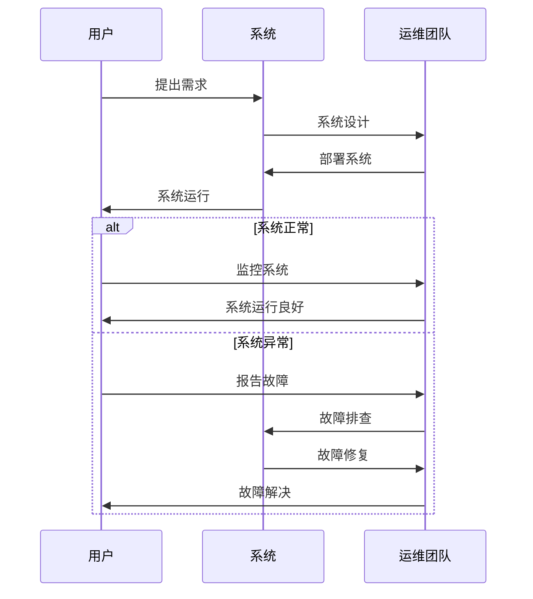

**1.2 运维流程与方法论**

**概念解析：**
运维流程是运维团队执行日常工作的一系列步骤，通常包括以下环节：

- **需求分析：** 根据业务需求制定运维计划。
- **系统设计：** 设计系统的架构和配置。
- **部署实施：** 将系统部署到生产环境。
- **系统监控：** 定期监控系统运行状态。
- **故障处理：** 及时发现并解决故障。
- **性能优化：** 分析系统性能，优化配置和资源。
- **安全管理：** 确保系统安全，制定并执行安全策略。
- **文档记录：** 记录运维过程中的所有操作和变更。

**方法论介绍：**
- **ITIL（信息技术基础服务管理）：** 一套全面的信息技术服务管理框架，包括服务策略、服务设计、服务过渡、服务运营、持续服务改进等环节。
- **DevOps：** 一种将软件开发和运维结合起来的方法论，强调自动化、持续交付和紧密协作。

**图1-2 ITIL与DevOps结合示意图**

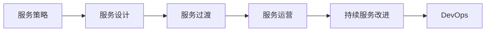

**1.3 运维团队组织结构**

**概念解析：**
运维团队的组织结构可以根据企业的规模和需求有所不同，但通常包括以下角色：

- **运维经理：** 负责整个运维团队的管理和战略规划。
- **系统管理员：** 负责操作系统、网络、数据库等系统的日常维护。
- **网络管理员：** 负责网络设备的配置和管理。
- **安全专家：** 负责系统的安全防护和应急响应。
- **性能优化师：** 负责系统性能的分析和优化。
- **自动化工程师：** 负责开发和维护自动化工具和流程。

**组织结构图**

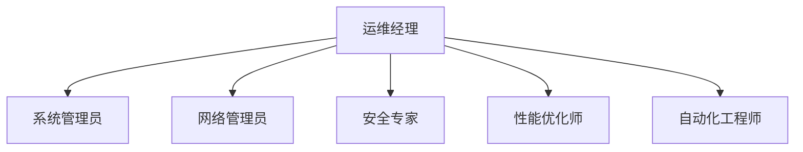

**1.4 运维工具与技术选型**

**概念解析：**
运维工具是运维人员日常工作的重要助手，可以提高工作效率，减少人工错误。常见的运维工具有：

- **监控工具：** 如Zabbix、Nagios、Prometheus等，用于监控系统运行状态和性能。
- **配置管理工具：** 如Ansible、Puppet、Chef等，用于自动化配置和部署。
- **日志管理工具：** 如ELK（Elasticsearch、Logstash、Kibana）等，用于收集、存储和展示日志。
- **自动化脚本：** 如Shell、Python等，用于自动化处理日常任务。

**技术选型考虑因素：**
- **需求匹配：** 选择符合企业需求、功能丰富的工具。
- **学习成本：** 选择易于学习和上手的工具，降低团队学习成本。
- **社区支持：** 选择有良好社区支持的工具，方便解决使用过程中遇到的问题。
- **安全性：** 选择安全可靠的工具，确保系统安全。

**图1-3 常见运维工具分类图**

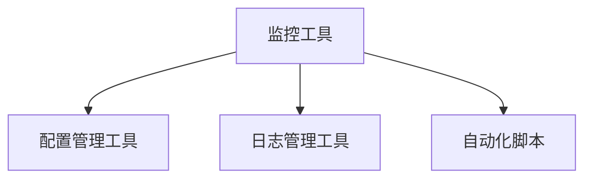

**本章总结：**
通过本章的学习，读者将了解运维的基本概念、职责、流程、团队结构和工具选型，为后续的实战技能和面试准备打下坚实基础。

---

接下来，我们将继续深入探讨操作系统和网络基础，帮助读者更好地理解运维中的关键技术点。敬请期待下一章节的内容。

#### 第2章：操作系统与网络基础

**本章内容将详细介绍操作系统的基本原理、网络基础与协议，以及故障排查和性能优化方法。掌握这些基础知识对于运维工程师来说至关重要，将有助于提高系统的稳定性和效率。**

**2.1 操作系统原理与配置**

**概念解析：**
操作系统（Operating System，简称OS）是管理计算机硬件与软件资源的核心软件。它提供了一种抽象层，使计算机硬件与应用程序之间的交互更加高效和简便。

**核心原理：**
- **进程管理：** 操作系统负责进程的创建、调度、同步和终止。进程是程序在计算机上的一次执行活动，是操作系统能够进行并发处理的基础。
- **内存管理：** 操作系统负责内存的分配和回收，确保每个进程都能获得足够的内存空间。
- **文件系统：** 操作系统提供了文件系统的接口，用于文件的创建、删除、读取和写入。
- **设备管理：** 操作系统管理计算机的输入输出设备，包括磁盘、网卡、USB设备等。

**配置步骤：**
- **基础配置：** 配置主机名、IP地址、网关、DNS等网络参数。
- **安全性配置：** 配置防火墙、安全组、用户权限等，确保系统安全。
- **性能优化配置：** 调整系统参数，如内核参数、文件描述符限制、网络参数等，以提高系统性能。

**图2-1 操作系统原理图**

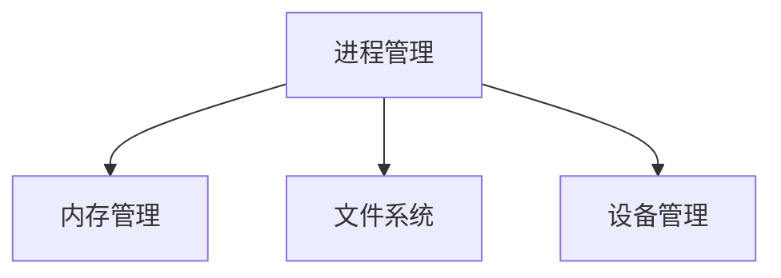

**2.2 网络基础与协议**

**概念解析：**
计算机网络是通过通信线路将多台计算机连接起来，实现数据传输和资源共享的系统。网络基础和协议是确保网络通信稳定、高效的关键。

**基础概念：**
- **网络拓扑：** 计算机网络的物理布局，常见的有星型、环型、总线型等。
- **IP地址：** 用于标识网络中每一台计算机的唯一地址，分为IPv4和IPv6两种。
- **MAC地址：** 网络接口卡（NIC）的唯一物理地址，用于数据包在网络中的传输。
- **协议栈：** 网络通信所使用的协议集合，如TCP/IP协议栈。

**常用协议：**
- **TCP（传输控制协议）：** 提供可靠、面向连接的通信服务，保证数据包按顺序正确传输。
- **UDP（用户数据报协议）：** 提供简单、不可靠的通信服务，常用于实时应用，如视频直播、在线游戏等。
- **HTTP（超文本传输协议）：** 用于Web浏览器和服务器之间的通信。
- **HTTPS（安全超文本传输协议）：** 在HTTP基础上加入SSL/TLS协议，提供安全通信。

**图2-2 网络协议栈图**

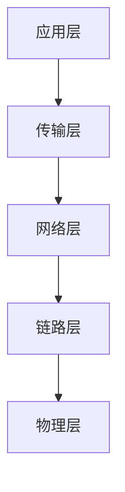

**2.3 故障排查与性能优化**

**概念解析：**
故障排查和性能优化是运维工程师的重要职责，旨在确保系统稳定、高效运行。

**故障排查方法：**
- **日志分析：** 通过系统日志、网络日志等分析故障原因。
- **网络抓包：** 使用Wireshark等工具抓取网络数据包，分析网络通信问题。
- **性能监控：** 使用Nagios、Zabbix等监控工具，实时监控系统性能指标。
- **故障复现：** 尝试在模拟环境中复现故障，找出问题根源。

**性能优化方法：**
- **硬件升级：** 提升CPU、内存、磁盘等硬件性能。
- **系统优化：** 调整系统内核参数、网络参数等，提高系统性能。
- **数据库优化：** 优化数据库查询、索引等，提升数据库性能。
- **缓存策略：** 使用Redis、Memcached等缓存技术，减少数据库负载。

**图2-3 故障排查与性能优化流程图**

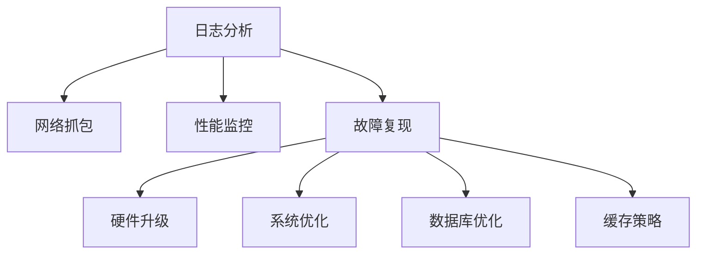

**本章总结：**
通过本章的学习，读者将掌握操作系统的基本原理和配置方法，了解网络基础和常用协议，掌握故障排查和性能优化技巧。这些知识对于运维工程师来说至关重要，将有助于确保系统的稳定性和高效性。

---

在下一章节中，我们将深入探讨数据库运维的基础知识和常见操作，帮助读者全面了解数据库在运维中的作用和重要性。敬请期待。

#### 第3章：数据库运维

**本章将详细介绍数据库的基础知识、运维操作以及性能监控与优化方法。数据库作为运维工程师的核心工作内容之一，掌握其基本原理和实战技能对于确保系统稳定性和高效性至关重要。**

**3.1 数据库基础与架构**

**概念解析：**
数据库（Database，简称DB）是一种按照数据结构来组织、存储和管理数据的系统。数据库管理员（DBA）负责数据库的安装、配置、监控、备份和恢复等工作。

**核心概念：**
- **关系型数据库：** 基于关系模型的数据组织方式，如MySQL、Oracle、SQL Server等。
- **非关系型数据库：** 如MongoDB、Redis、Cassandra等，以键值对、文档、列族等方式存储数据。
- **数据库模式：** 描述数据库结构的规范，包括表结构、字段类型、索引等。
- **事务：** 数据库操作的基本单位，确保数据的一致性和完整性。

**数据库架构：**
- **客户机/服务器架构：** 客户端通过SQL语句向数据库服务器发送请求，服务器执行操作并返回结果。
- **分布式数据库：** 数据库分布在多个节点上，通过数据复制、分片等方式提高性能和可用性。

**图3-1 关系型数据库架构图**

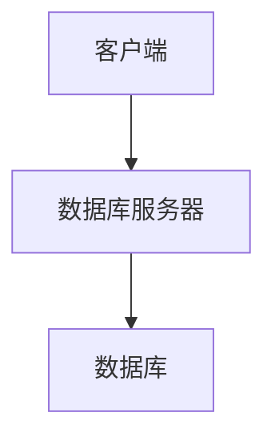

**3.2 常见数据库运维操作**

**概念解析：**
数据库运维操作包括数据库的安装、配置、备份、恢复、性能调优等，是确保数据库稳定运行的关键。

**安装与配置：**
- **安装：** 根据操作系统和硬件环境，选择合适的数据库版本进行安装。
- **配置：** 配置数据库服务器参数，如最大连接数、缓存大小、日志文件路径等。

**备份与恢复：**
- **备份：** 定期备份数据库，防止数据丢失。
- **恢复：** 在数据库发生故障或数据丢失时，根据备份文件进行恢复。

**性能调优：**
- **监控：** 监控数据库性能指标，如响应时间、查询效率等。
- **优化：** 分析性能瓶颈，调整数据库配置、索引、查询语句等。

**图3-2 数据库运维操作流程图**

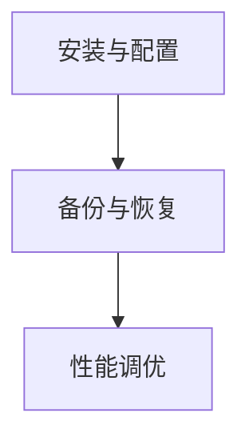

**3.3 数据库性能监控与优化**

**概念解析：**
数据库性能监控与优化是确保数据库系统稳定、高效运行的关键环节。

**监控指标：**
- **响应时间：** 数据库执行查询操作所需的时间。
- **吞吐量：** 单位时间内数据库处理的查询数量。
- **锁争用：** 数据库中的并发操作导致的锁等待时间。
- **内存使用：** 数据库服务器内存使用情况。
- **I/O性能：** 数据库文件的读写性能。

**优化方法：**
- **索引优化：** 根据查询需求创建合适的索引，提高查询效率。
- **查询优化：** 分析并优化数据库查询语句，减少查询执行时间。
- **硬件升级：** 提升数据库服务器的CPU、内存、磁盘等硬件性能。
- **分区策略：** 对大数据表进行分区，提高数据访问效率。

**图3-3 数据库性能监控与优化流程图**

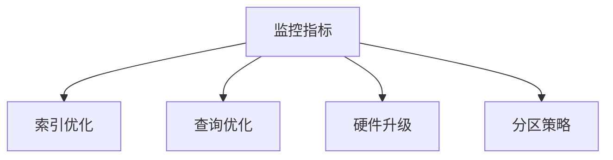

**本章总结：**
通过本章的学习，读者将了解数据库的基础知识、运维操作以及性能监控与优化方法。这些知识对于运维工程师来说至关重要，将有助于确保数据库系统的稳定性和高效性。

---

在下一章节中，我们将探讨自动化运维的基础知识，包括自动化运维的概念、Shell脚本编写基础以及Ansible和Puppet的自动化部署和管理。敬请期待。

#### 第4章：自动化运维

**本章将详细介绍自动化运维的基础知识、Shell脚本编写基础，以及Ansible和Puppet的自动化部署和管理。自动化运维是现代运维的重要方向，通过自动化工具可以提高运维效率，减少人为错误，确保系统的稳定运行。**

**4.1 自动化运维概述**

**概念解析：**
自动化运维（Automated Operations，简称AOps）是一种通过自动化工具和技术实现运维流程的自动化，以提高运维效率和降低人力成本的方法。

**优势：**
- **提高效率：** 自动化工具可以快速执行重复性任务，减少人为操作的错误和时间成本。
- **降低风险：** 通过自动化减少人为干预，降低人为错误带来的风险。
- **增强可追溯性：** 自动化流程可以记录所有操作，便于问题追踪和责任归属。
- **资源优化：** 自动化可以提高资源利用率，降低硬件和人力成本。

**应用场景：**
- **系统部署：** 自动化部署操作系统、中间件和应用程序。
- **配置管理：** 自动化配置网络设备、服务器和数据库。
- **监控告警：** 自动化监控系统性能，实现自动告警和故障恢复。
- **备份恢复：** 自动化执行数据库备份和恢复操作。

**4.2 Shell脚本编写基础**

**概念解析：**
Shell脚本是一种文本文件，其中包含一系列的命令和脚本控制结构，用于自动化执行任务。Shell是UNIX和Linux操作系统的命令行接口。

**基本语法：**
- **变量：** 用于存储数据的标识符，如`var_name=value`。
- **条件判断：** 用于根据特定条件执行不同的操作，如`if [condition]; then ...; fi`。
- **循环结构：** 用于重复执行一段代码，如`for`和`while`循环。
- **函数：** 用于封装常用的操作，提高代码复用性。

**示例代码：**

```bash
# 示例：计算1到100的和
sum=0
for i in $(seq 1 100); do
    sum=$((sum + i))
done
echo "Sum of 1 to 100 is $sum"
```

**4.3 使用Ansible进行自动化部署

**概念解析：**
Ansible是一种开源的自动化运维工具，通过SSH协议远程管理和管理服务器。Ansible无需在被管理服务器上安装任何额外的软件，使用简单，易于上手。

**安装与配置：**
- **安装：** 在控制节点上安装Ansible。
  ```bash
  pip install ansible
  ```
- **配置：** 配置Ansible的inventory文件，定义被管理服务器信息。

**示例代码：**

```yaml
# inventory文件示例
[webservers]
192.168.1.1
192.168.1.2

[appservers]
192.168.1.3
192.168.1.4
```

**部署应用：**

```bash
# 部署Nginx
ansible webservers -m yum -a "install nginx"
ansible webservers -m service -a "start nginx"
ansible webservers -m service -a "status nginx"
```

**4.4 使用Puppet进行自动化管理

**概念解析：**
Puppet是一种基于声明式语言Ruby的自动化运维工具，用于配置管理、应用部署和基础设施管理。Puppet使用一个中心化的服务器（Puppet Master）来管理和分发配置到多个客户端（Puppet Agent）。

**安装与配置：**
- **安装：** 在控制节点和客户端上安装Puppet。
  ```bash
  sudo apt-get install puppetmaster
  sudo apt-get install puppet
  ```
- **配置：** 配置Puppet的manifest文件，定义配置规则。

**示例代码：**

```puppet
# manifest文件示例
class { 'nginx':
  ensure => present,
  version => '1.18.0',
}

service { 'nginx':
  ensure => running,
  enable => true,
}
```

**部署应用：**

```bash
# 部署Nginx
puppet module install puppet/stdlib
puppet module install puppet/nginx
puppet apply /etc/puppetlabs/code/environments/production/manifests/nginx.pp
```

**本章总结：**
通过本章的学习，读者将了解自动化运维的概念和优势，掌握Shell脚本编写基础，学会使用Ansible和Puppet进行自动化部署和管理。这些技能对于提高运维效率和系统稳定性具有重要意义。

---

在下一章节中，我们将探讨监控与告警体系的建设、常用监控工具的介绍以及告警机制与处理流程。敬请期待。

#### 第5章：监控与告警

**本章将详细介绍监控与告警体系的建设、常用监控工具的介绍以及告警机制与处理流程。监控与告警是运维工作中不可或缺的一部分，通过有效的监控和告警机制，可以及时发现系统问题，确保系统稳定运行。**

**5.1 监控体系构建**

**概念解析：**
监控体系是指用于实时监控系统运行状态、性能指标和安全状况的一系列工具和流程。一个完善的监控体系可以全面、实时地监控系统的各个方面，确保系统的稳定性和高效性。

**核心组件：**
- **监控工具：** 用于收集系统、应用和基础设施的运行数据。
- **数据存储：** 用于存储监控数据，便于分析和查询。
- **可视化平台：** 用于展示监控数据和告警信息。
- **告警系统：** 用于发送告警通知，通知运维人员处理问题。

**构建步骤：**
- **需求分析：** 根据业务需求和系统特点，确定需要监控的指标和告警规则。
- **工具选型：** 选择合适的监控工具和平台，如Zabbix、Prometheus、Grafana等。
- **部署实施：** 安装和配置监控工具，搭建监控体系。
- **监控配置：** 配置监控项、告警规则和告警渠道。
- **监控测试：** 测试监控体系的稳定性和准确性，确保告警及时、准确。

**图5-1 监控体系构建流程图**

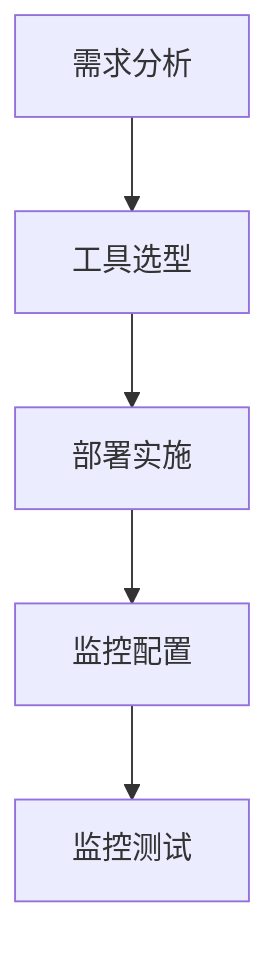

**5.2 常用监控工具介绍**

**概念解析：**
监控工具是构建监控体系的核心组件，用于实时收集、存储和处理系统运行数据。以下介绍几种常见的监控工具：

**Zabbix：**
- **特点：** 开源、跨平台、支持多种监控协议，功能丰富。
- **应用场景：** 适用于大规模分布式系统的监控。
- **功能：** 性能监控、告警管理、可视化报表、自动化操作等。

**Prometheus：**
- **特点：** 基于时间序列数据的监控系统，高效、可扩展。
- **应用场景：** 适用于云原生应用和容器化环境的监控。
- **功能：** 数据采集、告警管理、可视化仪表盘等。

**Grafana：**
- **特点：** 可视化监控平台，支持多种数据源，自定义图表和面板。
- **应用场景：** 适用于展示监控数据和告警信息。
- **功能：** 数据可视化、告警管理、仪表盘定制等。

**Nagios：**
- **特点：** 开源、功能强大的监控工具，支持多种插件。
- **应用场景：** 适用于中小型企业的监控需求。
- **功能：** 性能监控、告警通知、插件支持等。

**图5-2 常用监控工具关系图**

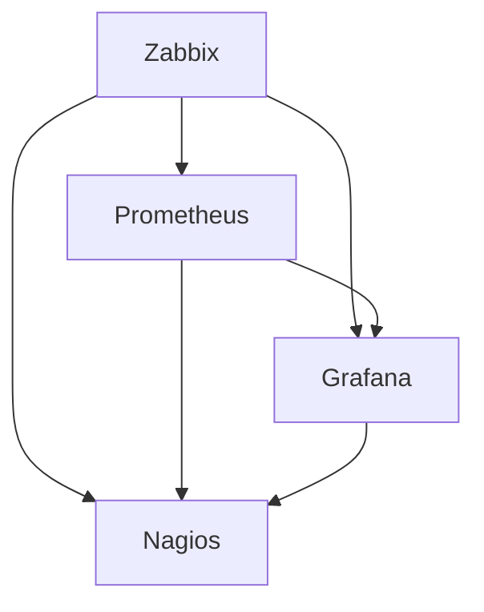

**5.3 告警机制与处理流程**

**概念解析：**
告警机制是监控体系中用于通知运维人员系统出现问题的部分，通过发送告警通知，提醒运维人员及时处理问题。

**告警机制：**
- **阈值告警：** 根据监控指标的阈值，当指标超出阈值时触发告警。
- **规则告警：** 根据自定义的告警规则，当满足特定条件时触发告警。
- **告警渠道：** 通过邮件、短信、电话、微信等方式发送告警通知。

**处理流程：**
- **接收告警：** 运维人员接收告警通知，了解系统问题。
- **故障排查：** 运维人员根据告警信息，进行故障排查，确定问题原因。
- **解决问题：** 根据故障原因，采取相应的修复措施，解决问题。
- **反馈与总结：** 解决问题后，将处理过程和结果进行反馈和总结，便于后续改进。

**图5-3 告警机制与处理流程图**

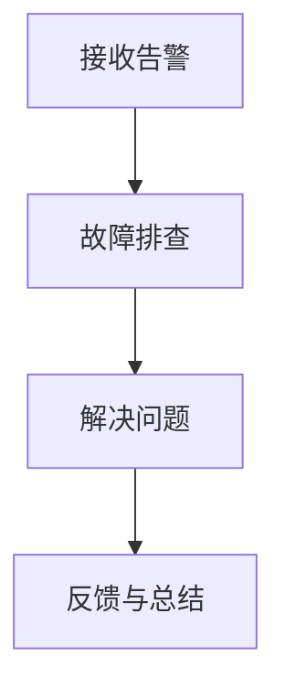

**本章总结：**
通过本章的学习，读者将了解监控与告警体系的建设方法和常用监控工具，掌握告警机制与处理流程。这些知识对于运维工程师来说至关重要，有助于确保系统的稳定运行。

---

在下一章节中，我们将探讨持续集成与持续部署（CI/CD）的基本概念，以及Jenkins和GitLab CI/CD的具体实践。敬请期待。

#### 第6章：持续集成与持续部署（CI/CD）

**本章将详细介绍持续集成与持续部署（Continuous Integration/Continuous Deployment，简称CI/CD）的基本概念，以及Jenkins和GitLab CI/CD的具体实践。CI/CD是现代软件开发和运维的重要方法论，通过自动化流程提高软件交付速度和质量。**

**6.1 CI/CD概述**

**概念解析：**
持续集成（CI）和持续部署（CD）是一种软件开发和运维的方法论，旨在通过自动化流程加速软件交付，确保软件质量和稳定性。

**核心概念：**
- **持续集成（CI）：** 开发者将代码提交到代码仓库后，自动触发构建、测试和部署流程，确保代码质量。
- **持续部署（CD）：** 在持续集成的基础上，自动将经过测试的代码部署到生产环境，实现快速交付。

**优势：**
- **提高交付速度：** 自动化构建、测试和部署流程，减少手动操作，缩短交付周期。
- **确保代码质量：** 通过自动化测试，及早发现和修复代码缺陷，提高软件质量。
- **降低风险：** 自动化流程降低人为错误，减少因手动操作导致的问题。
- **增强团队协作：** 开发、测试、运维团队协同工作，提高团队效率和沟通。

**图6-1 CI/CD流程图**

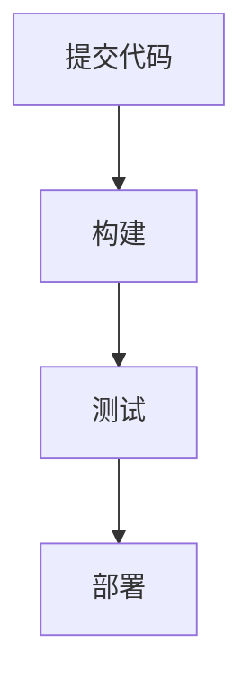

**6.2 Jenkins实战**

**概念解析：**
Jenkins是一种开源的持续集成服务器，广泛用于自动化构建、测试和部署流程。Jenkins支持多种插件，可扩展其功能，适用于不同场景的需求。

**安装与配置：**
- **安装：** 在Linux服务器上安装Jenkins。
  ```bash
  wget -q -O - https://pkg.jenkins.io/debian/jenkins.io.key | sudo apt-key add -
  sh -c "$(curl -fsSL https://pkg.jenkins.io/debian/install.sh)"
  ```
- **配置：** 配置Jenkins插件和构建流水线。

**部署应用：**

```yaml
# Jenkinsfile示例
pipeline {
  agent any
  stages {
    stage('Build') {
      steps {
        sh 'mvn clean package'
      }
    }
    stage('Test') {
      steps {
        sh 'mvn test'
      }
    }
    stage('Deploy') {
      steps {
        sh 'docker build -t myapp:latest .'
        sh 'docker run --name myapp -d -p 8080:80 myapp:latest'
      }
    }
  }
}
```

**6.3 GitLab CI/CD实践**

**概念解析：**
GitLab CI/CD是GitLab内置的持续集成和持续部署工具，通过`.gitlab-ci.yml`文件定义构建、测试和部署流程。

**安装与配置：**
- **安装：** 在GitLab服务器上安装GitLab CI/CD Runner。
- **配置：** 在项目的`.gitlab-ci.yml`文件中定义构建和部署步骤。

**部署应用：**

```yaml
# .gitlab-ci.yml示例
image: java:8

stages:
  - build
  - test
  - deploy

build:
  stage: build
  script:
    - mvn clean package

test:
  stage: test
  script:
    - mvn test

deploy:
  stage: deploy
  script:
    - docker build -t myapp:latest .
    - docker run --name myapp -d -p 8080:80 myapp:latest
```

**本章总结：**
通过本章的学习，读者将了解CI/CD的基本概念和优势，掌握Jenkins和GitLab CI/CD的具体实践。这些技能对于提高软件交付速度和质量具有重要意义。

---

在下一章节中，我们将探讨容器化与虚拟化技术的基础知识，包括容器化技术概述、Docker实战和Kubernetes基础与部署。敬请期待。

#### 第7章：容器化与虚拟化

**本章将详细介绍容器化与虚拟化技术的基础知识，包括容器化技术概述、Docker实战和Kubernetes基础与部署。容器化与虚拟化技术是现代云计算和DevOps实践的核心，通过这些技术，可以提高应用部署的灵活性和可移植性。**

**7.1 容器化技术概述**

**概念解析：**
容器化是一种轻量级虚拟化技术，通过将应用及其依赖环境封装在一个独立的容器中，实现应用的隔离、部署和运行。容器化技术简化了应用的部署和管理，提高了开发效率和系统稳定性。

**核心概念：**
- **容器（Container）：** 封装应用及其依赖环境的轻量级运行环境。
- **容器引擎（Container Engine）：** 用于管理和运行容器的软件，如Docker。
- **容器镜像（Container Image）：** 容器的静态模板，包含应用的代码、库和配置文件。
- **容器编排（Container Orchestration）：** 管理多个容器的自动部署、扩展和监控。

**优势：**
- **隔离性：** 容器通过命名空间和cgroups实现资源隔离，确保不同容器之间互不影响。
- **可移植性：** 容器镜像包含应用的完整运行环境，可在任何支持容器引擎的操作系统上运行。
- **高效性：** 容器启动速度快，资源占用低，可快速创建和销毁。
- **一致性：** 容器镜像保证应用在不同环境下的运行一致性，减少环境差异带来的问题。

**图7-1 容器化技术概述图**

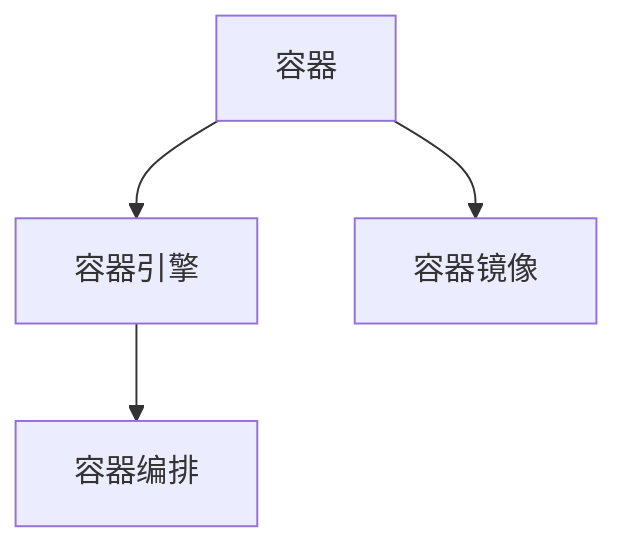

**7.2 Docker实战**

**概念解析：**
Docker是最流行的容器引擎，通过Docker容器实现应用的部署和管理。Docker基于容器镜像，支持多种操作系统和应用场景。

**安装与配置：**
- **安装：** 在Linux服务器上安装Docker。
  ```bash
  sudo apt-get update
  sudo apt-get install docker-ce docker-ce-cli containerd.io
  ```
- **配置：** 配置Docker镜像仓库和容器网络。

**部署应用：**

```bash
# 拉取MySQL容器镜像
docker pull mysql:5.7

# 运行MySQL容器
docker run --name mysql -d -p 3306:3306 -e MYSQL_ROOT_PASSWORD=root mysql:5.7

# 部署Nginx容器
docker run --name nginx -d -p 80:80 nginx

# 查看所有容器
docker ps -a
```

**7.3 Kubernetes基础与部署**

**概念解析：**
Kubernetes（简称K8s）是一种开源的容器编排平台，用于管理和自动化容器化应用。Kubernetes提供强大的集群管理和调度能力，确保应用的可靠性、可扩展性和高可用性。

**核心概念：**
- **集群（Cluster）：** 由多个节点（Node）组成的集群，负责管理和运行容器。
- **Pod：** Kubernetes的基本部署单元，包含一个或多个容器。
- **Service：** Kubernetes的服务抽象，用于提供网络访问和负载均衡。
- **Ingress：** Kubernetes的入口控制器，用于管理外部访问。

**部署步骤：**
- **安装：** 在Linux服务器上安装Kubernetes集群。
- **配置：** 配置集群网络、存储和监控。
- **部署应用：** 使用Kubernetes API部署和管理容器化应用。

```bash
# 安装Kubeadm、Kubelet和Kubectl
sudo apt-get update
sudo apt-get install -y apt-transport-https ca-certificates curl
sudo curl -s https://mirrors.aliyun.com/kubernetes/apt/doc/apt-key.gpg | sudo apt-key add -
sudo echo "deb https://mirrors.aliyun.com/kubernetes/apt/ kubernetes-xenial main" | sudo tee -a /etc/apt/sources.list
sudo apt-get update
sudo apt-get install -y kubelet kubeadm kubectl

# 启动Kubelet服务
sudo systemctl enable kubelet
sudo systemctl start kubelet

# 部署Kubernetes集群
sudo kubeadm init --pod-network-cidr=10.244.0.0/16

# 配置kubectl
mkdir -p $HOME/.kube
sudo cp -i /etc/kubernetes/admin.conf $HOME/.kube/config
sudo chown $(id -u):$(id -g) $HOME/.kube/config

# 部署网络插件
kubectl apply -f https://raw.githubusercontent.com/kubernetes-incubator/apiserver-builder/master/docs/deploy-with-calico.yaml

# 部署应用
kubectl apply -f <application-yaml-file>.yaml
```

**本章总结：**
通过本章的学习，读者将了解容器化与虚拟化技术的基础知识，掌握Docker实战和Kubernetes基础与部署。这些技能对于现代云计算和DevOps实践具有重要意义，有助于提高应用部署的灵活性和可移植性。

---

在下一章节中，我们将探讨云服务与云原生应用，包括云服务概述、AWS云服务实战、Azure云服务实战以及云原生应用架构与实践。敬请期待。

#### 第8章：云服务与云原生应用

**本章将详细介绍云服务与云原生应用的相关知识，包括云服务概述、AWS云服务实战、Azure云服务实战以及云原生应用架构与实践。云服务和云原生应用是现代IT领域的重要趋势，掌握这些技术对于运维工程师来说至关重要。**

**8.1 云服务概述**

**概念解析：**
云服务是指通过互联网提供的一系列计算资源、存储资源、网络资源和应用服务。云服务可以分为以下几类：

**IaaS（基础设施即服务）：**
- **特点：** 提供虚拟化的计算资源、存储资源和网络资源。
- **应用场景：** 虚拟机、存储、网络搭建。

**PaaS（平台即服务）：**
- **特点：** 提供开发平台和运行环境，支持应用开发和部署。
- **应用场景：** 应用开发、测试、部署。

**SaaS（软件即服务）：**
- **特点：** 提供基于互联网的软件应用，用户通过浏览器访问。
- **应用场景：** 企业应用、办公软件、协作工具。

**核心组件：**
- **计算服务：** 如EC2（Amazon Web Services）、GCE（Google Compute Engine）、AWS EC2。
- **存储服务：** 如S3（Amazon S3）、Google Cloud Storage、Azure Blob Storage。
- **网络服务：** 如VPC（Virtual Private Cloud）、AWS VPC、Azure Virtual Network。
- **数据库服务：** 如RDS（Amazon RDS）、Google Cloud SQL、Azure Database。

**图8-1 云服务分类图**

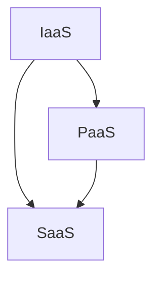

**8.2 AWS云服务实战**

**概念解析：**
AWS（Amazon Web Services）是世界上最流行的云服务平台，提供丰富的云计算资源和服务。以下介绍AWS的一些核心服务：

**EC2（Amazon Elastic Compute Cloud）：**
- **特点：** 提供虚拟机实例，支持多种操作系统和实例类型。
- **应用场景：** 虚拟机搭建、应用部署、计算密集型任务。

**S3（Amazon Simple Storage Service）：**
- **特点：** 提供可靠的、高度可扩展的云存储服务。
- **应用场景：** 存储静态文件、备份数据、大数据处理。

**RDS（Amazon Relational Database Service）：**
- **特点：** 提供管理关系型数据库的服务，如MySQL、PostgreSQL、Oracle。
- **应用场景：** 数据库部署、管理、备份。

**AWS实战案例：**

```bash
# 创建EC2实例
aws ec2 run-instances --image-id ami-0abcdef0123456789 --instance-type t2.micro --key-name my-key-pair --security-group-ids sg-0abcdef0123456789 --subnet-id subnet-0abcdef0123456789 --count 1 --region us-west-2

# 创建S3存储桶
aws s3api create-bucket --bucket my-bucket --region us-west-2

# 上传文件到S3存储桶
aws s3 cp local-file.txt s3://my-bucket/my-file.txt
```

**8.3 Azure云服务实战**

**概念解析：**
Azure是微软的云服务平台，提供丰富的云计算资源和服务。以下介绍Azure的一些核心服务：

**Azure VM（Azure Virtual Machines）：**
- **特点：** 提供虚拟机实例，支持多种操作系统和配置。
- **应用场景：** 虚拟机搭建、应用部署、计算密集型任务。

**Azure Blob Storage：**
- **特点：** 提供大规模数据存储服务，适合存储静态文件。
- **应用场景：** 存储静态文件、备份数据、大数据处理。

**Azure SQL Database：**
- **特点：** 提供管理关系型数据库的服务，如MySQL、PostgreSQL、Oracle。
- **应用场景：** 数据库部署、管理、备份。

**Azure实战案例：**

```bash
# 创建Azure VM实例
az vm create --resource-group my-resource-group --name my-vm --image UbuntuLTS --admin-username azureuser --admin-password MyP@ssw0rd123! --location westus2

# 创建Azure Blob存储桶
az storage container create --name my-container --account-name my-storage-account

# 上传文件到Azure Blob存储桶
az storage blob upload --container my-container --name my-file.txt --file /path/to/local-file.txt --account-name my-storage-account
```

**8.4 云原生应用架构与实践**

**概念解析：**
云原生应用是指基于容器、微服务、服务网格等现代技术架构的应用，具有高可移植性、高可扩展性和高灵活性。

**核心概念：**
- **容器化：** 将应用及其依赖环境封装在容器中，实现应用的隔离和部署。
- **微服务：** 将大型应用拆分为多个小型服务，每个服务负责特定的业务功能。
- **服务网格：** 管理微服务之间的通信和路由，提供服务发现、负载均衡、断路器等机制。

**云原生应用架构：**
- **容器编排：** 使用Kubernetes等工具进行容器编排和管理。
- **服务发现与路由：** 使用Consul、Etcd等服务发现工具，实现服务的动态注册和发现。
- **配置中心：** 使用Spring Cloud Config等工具管理应用的配置信息。
- **服务监控与告警：** 使用Prometheus、Grafana等工具进行服务监控和告警。

**云原生应用实践：**

```bash
# 部署Nginx容器
kubectl create deployment nginx --image=nginx:latest

# 暴露Nginx服务
kubectl expose deployment nginx --port=80 --type=LoadBalancer

# 部署Spring Boot微服务
kubectl create deployment spring-boot --image=springbootapp:latest

# 暴露Spring Boot服务
kubectl expose deployment spring-boot --port=8080 --type=LoadBalancer
```

**本章总结：**
通过本章的学习，读者将了解云服务与云原生应用的基本概念和实战方法，掌握AWS和Azure云服务的操作，了解云原生应用的架构与实践。这些知识对于现代IT领域的发展具有重要意义，有助于提升运维工程师的技术水平和业务能力。

---

#### 第三部分：面试经验分享

**本部分将分享针对京东运维工程师岗位的面试准备与策略，以及京东运维岗位的常见面试题及答案解析。此外，还将介绍一些面试中的技巧与注意事项，帮助读者更好地应对面试挑战。**

##### 第9章：面试准备与策略

**9.1 面试前准备**

**面试前准备是成功的关键，以下是一些面试前的准备工作：**

**1. 熟悉岗位要求：**
- 详细阅读招聘信息，了解岗位的职责、技能要求和期望。
- 分析岗位职责，思考自己在哪些方面具备优势，哪些方面需要加强。

**2. 复习基础知识：**
- 复习操作系统、网络、数据库、自动化运维等相关基础知识。
- 重点复习面试中可能涉及的关键概念和技术细节。

**3. 实践操作：**
- 在实际环境中搭建一些运维工具，如Zabbix、Ansible、Puppet等，进行实际操作。
- 尝试解决一些常见的运维问题，如系统性能优化、故障排查等。

**4. 编写脚本和文档：**
- 编写一些Shell脚本、Ansible playbook或Puppet模块，展示自己的编程能力和自动化运维能力。
- 撰写一些技术文档，如系统架构设计文档、运维手册等。

**5. 准备面试题目：**
- 准备一些常见的运维面试题，并整理答案。
- 结合自己的实际经验和项目经历，准备好相关的案例分析。

**6. 模拟面试：**
- 与朋友或同事进行模拟面试，练习回答常见面试问题。
- 记录自己的回答，找出不足之处，进行改进。

**9.2 面试常见问题及答案解析**

**以下是一些常见的面试问题及答案解析：**

**1. 请简要介绍运维的基本职责和目标。**

**答案：**
- 运维的基本职责包括系统监控与维护、故障处理、系统升级与更新、安全管理、性能优化等。
- 目标是确保系统的高可用性、高效性和安全性，同时控制运维成本。

**2. 请说明ITIL和DevOps的区别和联系。**

**答案：**
- ITIL（信息技术基础服务管理）是一套全面的服务管理框架，包括服务策略、服务设计、服务过渡、服务运营和持续服务改进。
- DevOps是一种软件开发和运维结合的方法论，强调自动化、持续交付和紧密协作，以实现快速、高质量的软件交付。
- 它们的联系在于，DevOps中的很多实践（如自动化部署、监控、备份等）都可以在ITIL框架中找到对应的概念。

**3. 请解释什么是容器化，并简要介绍Docker的工作原理。**

**答案：**
- 容器化是一种轻量级虚拟化技术，通过将应用及其依赖环境封装在一个独立的容器中，实现应用的隔离、部署和运行。
- Docker是一个开源的容器引擎，它通过容器镜像实现应用的封装和部署。Docker的工作原理包括以下步骤：
  - 构建容器镜像：将应用的代码、库和配置文件打包成一个容器镜像。
  - 运行容器：从容器镜像启动容器，执行应用。
  - 管理容器：通过Docker命令管理容器的启动、停止、重启等操作。

**4. 请说明什么是Kubernetes，并简要介绍其主要组件和作用。**

**答案：**
- Kubernetes是一个开源的容器编排平台，用于管理和自动化容器化应用。
- 主要组件和作用包括：
  - **Pod：** Kubernetes的基本部署单元，包含一个或多个容器。
  - **Service：** Kubernetes的服务抽象，用于提供网络访问和负载均衡。
  - **Controller Manager：** 负责维护集群的状态，确保系统资源正常运行。
  - **Node：** Kubernetes的工作节点，运行Pod和容器。
  - **Master：** Kubernetes的主控节点，负责集群的调度、监控和管理。

**9.3 面试中的技巧与注意事项**

**1. 着装与礼仪：**
- 穿着整洁、得体，保持良好的个人形象。
- 面试前准备充分，不迟到，保持礼貌和尊重。

**2. 明确表达：**
- 清晰、明确地表达自己的观点和经验。
- 使用具体的案例和数据支持自己的观点。

**3. 倾听与反馈：**
- 仔细倾听面试官的问题，确保理解问题的意图。
- 对于不懂的问题，可以请面试官重新解释或说明。

**4. 沟通技巧：**
- 保持良好的沟通技巧，清晰、简洁地表达。
- 与面试官保持眼神交流，展示自信和专业。

**5. 问与答：**
- 面试结束时，可以询问面试官一些关于岗位或公司的问题。
- 对于面试官的提问，要诚实、认真地回答。

**本章总结：**
通过本章的学习，读者将了解面试前的准备工作，熟悉常见的面试问题及答案解析，掌握面试中的技巧和注意事项。这些知识对于成功应对京东运维工程师岗位的面试具有重要意义。

---

#### 第10章：京东运维岗位面试题及答案解析

**本章将针对京东运维工程师岗位的面试题进行详细解析，帮助读者更好地准备京东的面试。通过具体的题目和答案分析，读者可以更好地理解面试官的考察点和答案思路。**

**10.1 系统运维面试题**

**1. 请简要描述Linux系统的用户和权限管理机制。**

**答案：**
- Linux系统的用户和权限管理机制主要包括用户账户、用户组、文件权限和SELinux。
- **用户账户：** Linux系统中每个用户都有一个唯一的用户ID（UID），用于识别用户。
- **用户组：** 用户可以属于多个用户组，每个用户组有一个唯一的组ID（GID）。
- **文件权限：** Linux系统中文件的权限分为读（r）、写（w）和执行（x），分别对应数字表示为4、2、1。
- **SELinux：** 安全增强型Linux（SELinux）是一种访问控制机制，用于限制用户和进程对系统资源的访问。

**2. 请解释Linux系统中进程管理的原理和方法。**

**答案：**
- Linux系统中的进程管理主要通过进程控制块（Process Control Block，PCB）实现。PCB中包含了进程的详细信息，如进程ID、状态、程序计数器、堆栈指针等。
- 进程管理的原理包括：
  - **进程创建：** 通过fork、exec等系统调用创建新进程。
  - **进程调度：** 操作系统根据进程的状态和优先级进行调度，选择合适的进程执行。
  - **进程同步与通信：** 通过信号、管道、消息队列等方式实现进程间的同步和通信。
  - **进程终止：** 通过kill、exit等系统调用终止进程。

**3. 请说明Linux系统中的文件系统类型及其特点。**

**答案：**
- Linux系统中的文件系统类型主要包括ext4、XFS、Btrfs等。
- **ext4：** 第四版扩展文件系统，是Linux系统中最常用的文件系统类型，支持大文件、高性能和扩展文件系统特性。
- **XFS：** 高性能日志文件系统，适用于大规模存储系统，支持多线程、高扩展性和高性能。
- **Btrfs：** 扩展文件系统，具有高性能、高扩展性和数据冗余等特点，适用于云存储和虚拟化环境。

**10.2 网络运维面试题**

**1. 请简要描述TCP协议的工作原理及其与UDP协议的区别。**

**答案：**
- **TCP（传输控制协议）：** 是一种面向连接的、可靠的传输层协议，提供数据传输的完整性和顺序性。TCP通过三次握手建立连接，通过序列号、确认应答和重传机制保证数据的可靠传输。
- **UDP（用户数据报协议）：** 是一种无连接的、不可靠的传输层协议，提供简单的数据传输功能。UDP不保证数据的顺序性和完整性，但传输速度快，适用于实时应用，如视频直播、在线游戏等。

**2. 请解释DNS（域名系统）的工作原理。**

**答案：**
- **DNS（域名系统）：** 是一种分布式数据库，用于将域名解析为IP地址。DNS的工作原理包括以下步骤：
  - **解析请求：** 客户端向本地DNS服务器发送域名解析请求。
  - **递归查询：** 本地DNS服务器向根DNS服务器查询顶级域名服务器地址。
  - **迭代查询：** 根DNS服务器返回顶级域名服务器地址，本地DNS服务器继续查询二级域名服务器地址。
  - **获取结果：** 最终获取到域名对应的IP地址，并将其返回给客户端。

**3. 请说明网络故障排查的常用方法和工具。**

**答案：**
- **网络故障排查的常用方法：**
  - **故障定位：** 根据故障现象，定位故障发生的具体位置。
  - **故障分析：** 分析故障原因，确定解决方案。
  - **故障恢复：** 根据解决方案，恢复系统正常运行。

- **网络故障排查的常用工具：**
  - **ping：** 用于测试网络连接是否正常，常用于检测主机之间的连通性。
  - **traceroute：** 用于跟踪数据包传输路径，检测网络延迟和路由问题。
  - **Wireshark：** 用于捕获和分析网络数据包，帮助定位网络故障。

**10.3 数据库运维面试题**

**1. 请简要描述关系型数据库中的事务、隔离级别及其应用场景。**

**答案：**
- **事务：** 数据库中的操作单元，保证数据的一致性和完整性。事务包括一系列的操作，如插入、更新、删除等。
- **隔离级别：** 控制并发访问时数据一致性的级别。常见的隔离级别包括：
  - **读未提交（Read Uncommitted）：** 允许读取未提交的数据，可能导致脏读。
  - **读已提交（Read Committed）：** 允许读取已提交的数据，避免脏读。
  - **可重复读（Repeatable Read）：** 允许读取已提交的数据，避免脏读和不可重复读。
  - **序列化（Serializable）：** 提供最高的隔离级别，确保事务的顺序执行，避免并发问题。

- **应用场景：**
  - **读未提交：** 适用于对一致性要求较低的场景，如缓存系统的更新。
  - **读已提交：** 适用于大部分应用，如在线购物系统。
  - **可重复读：** 适用于需要保证数据一致性的应用，如银行系统。
  - **序列化：** 适用于对一致性要求极高的场景，如股票交易系统。

**2. 请解释MySQL中的InnoDB存储引擎的特点和适用场景。**

**答案：**
- **InnoDB存储引擎：** 是MySQL常用的存储引擎之一，具有以下特点：
  - **事务支持：** 提供完全的事务支持，确保数据的一致性和完整性。
  - **行级锁：** 支持行级锁定，减少锁争用，提高并发性能。
  - **缓冲池：** 使用缓冲池缓存数据页，减少磁盘IO操作。
  - **自动故障恢复：** 在系统崩溃或故障时，自动恢复数据的一致性。

- **适用场景：**
  - **高并发场景：** InnoDB的行级锁和缓冲池机制适用于高并发访问的场景。
  - **事务性场景：** InnoDB完全支持事务，适用于需要保证数据一致性的事务性应用。
  - **大数据场景：** InnoDB的缓冲池机制适用于大数据场景，减少磁盘IO操作。

**3. 请简要描述数据库性能优化的方法。**

**答案：**
- **数据库性能优化的方法：**
  - **查询优化：** 通过优化SQL查询语句，减少查询执行时间。例如，使用合适的索引、优化查询结构、避免使用子查询等。
  - **索引优化：** 创建合适的索引，提高数据检索速度。根据查询需求和数据特点选择合适的索引类型。
  - **缓存策略：** 使用缓存技术，减少数据库的负载。例如，使用Redis缓存热点数据、使用数据库缓存等。
  - **硬件升级：** 提升数据库服务器的CPU、内存、磁盘等硬件性能，提高系统性能。

**10.4 自动化运维面试题**

**1. 请简要描述自动化运维的概念和优势。**

**答案：**
- **自动化运维的概念：** 自动化运维是一种通过自动化工具和技术实现运维流程的自动化，以提高运维效率和降低人力成本的方法。
- **优势：**
  - **提高效率：** 自动化工具可以快速执行重复性任务，减少人为操作的错误和时间成本。
  - **降低风险：** 通过自动化减少人为干预，降低人为错误带来的风险。
  - **增强可追溯性：** 自动化流程可以记录所有操作，便于问题追踪和责任归属。
  - **资源优化：** 自动化可以提高资源利用率，降低硬件和人力成本。

**2. 请解释Ansible的工作原理和常用模块。**

**答案：**
- **Ansible的工作原理：** Ansible是一种基于SSH协议的自动化运维工具，通过发送YAML格式的配置文件（Playbook）到被管理服务器，执行相应的操作。
- **常用模块：**
  - **yum：** 用于安装、更新和卸载软件包。
  - **service：** 用于管理服务，如启动、停止、重启等。
  - **file：** 用于操作文件，如创建、删除、修改等。
  - **user：** 用于管理用户，如创建、删除、修改等。
  - **group：** 用于管理用户组，如创建、删除、修改等。

**3. 请说明Puppet的工作原理和主要组件。**

**答案：**
- **Puppet的工作原理：** Puppet是一种基于声明式语言Ruby的自动化运维工具，通过Puppet Master和Puppet Agent实现配置管理和应用部署。
- **主要组件：**
  - **Puppet Master：** 负责接收和分发配置信息，编译Manifest文件，生成Puppet代码。
  - **Puppet Agent：** 负责从Puppet Master获取配置信息，执行Puppet代码，实现配置同步。

**10.5 监控与告警面试题**

**1. 请简要描述监控与告警体系的建设步骤和关键组件。**

**答案：**
- **建设步骤：**
  - **需求分析：** 根据业务需求和系统特点，确定需要监控的指标和告警规则。
  - **工具选型：** 选择合适的监控工具和平台，如Zabbix、Prometheus、Grafana等。
  - **部署实施：** 安装和配置监控工具，搭建监控体系。
  - **监控配置：** 配置监控项、告警规则和告警渠道。
  - **监控测试：** 测试监控体系的稳定性和准确性，确保告警及时、准确。

- **关键组件：**
  - **监控工具：** 用于收集系统、应用和基础设施的运行数据。
  - **数据存储：** 用于存储监控数据，便于分析和查询。
  - **可视化平台：** 用于展示监控数据和告警信息。
  - **告警系统：** 用于发送告警通知，通知运维人员处理问题。

**2. 请解释Prometheus和Grafana的工作原理和特点。**

**答案：**
- **Prometheus的工作原理和特点：**
  - **工作原理：** Prometheus是一种基于时间序列数据的监控系统，通过Exporter收集系统指标数据，使用拉模式（Pull）收集数据，数据存储在本地的时间序列数据库中。
  - **特点：** 高效、可扩展、支持多种数据源和告警机制。

- **Grafana的工作原理和特点：**
  - **工作原理：** Grafana是一种可视化监控平台，支持多种数据源，通过Dashboard展示监控数据和告警信息。
  - **特点：** 丰富的可视化图表、自定义报表、告警管理。

**3. 请说明告警机制的处理流程。**

**答案：**
- **处理流程：**
  - **接收告警：** 运维人员接收告警通知，了解系统问题。
  - **故障排查：** 运维人员根据告警信息，进行故障排查，确定问题原因。
  - **解决问题：** 根据故障原因，采取相应的修复措施，解决问题。
  - **反馈与总结：** 解决问题后，将处理过程和结果进行反馈和总结，便于后续改进。

**10.6 持续集成与持续部署面试题**

**1. 请简要描述CI/CD的概念和优势。**

**答案：**
- **CI/CD的概念：**
  - **CI（持续集成）：** 开发者将代码提交到代码仓库后，自动触发构建、测试和部署流程，确保代码质量。
  - **CD（持续部署）：** 在持续集成的基础上，自动将经过测试的代码部署到生产环境，实现快速交付。

- **优势：**
  - **提高交付速度：** 自动化构建、测试和部署流程，减少手动操作，缩短交付周期。
  - **确保代码质量：** 通过自动化测试，及早发现和修复代码缺陷，提高软件质量。
  - **降低风险：** 自动化流程降低人为错误，减少因手动操作导致的问题。
  - **增强团队协作：** 开发、测试、运维团队协同工作，提高团队效率和沟通。

**2. 请解释Jenkins的工作原理和主要组件。**

**答案：**
- **Jenkins的工作原理：** Jenkins是一种开源的持续集成服务器，通过Web界面和REST API接收和处理构建任务，支持多种插件，实现自动化构建、测试和部署。
- **主要组件：**
  - **Jenkins Master：** 主控节点，负责接收构建任务，分发到_slave节点执行。
  - **Jenkins _slave：** 从节点，负责执行构建任务。
  - **Jenkinsfile：** 定义构建流程的配置文件，包含构建步骤、测试和部署等。

**3. 请说明GitLab CI/CD的配置和使用方法。**

**答案：**
- **配置方法：**
  - 在项目的`.gitlab-ci.yml`文件中定义构建和部署流程，包括构建环境、测试和部署步骤。
  - 配置GitLab CI/CD Runner，在本地或服务器上运行，处理构建任务。

- **使用方法：**
  - 提交代码到GitLab仓库，触发CI/CD流程。
  - 查看构建日志和测试结果，确保构建和部署成功。
  - 配置自动部署规则，将经过测试的代码自动部署到生产环境。

**10.7 容器化与虚拟化面试题**

**1. 请简要描述容器化技术的概念和优势。**

**答案：**
- **概念：** 容器化是一种轻量级虚拟化技术，通过将应用及其依赖环境封装在一个独立的容器中，实现应用的隔离、部署和运行。
- **优势：**
  - **隔离性：** 容器通过命名空间和cgroups实现资源隔离，确保不同容器之间互不影响。
  - **可移植性：** 容器镜像包含应用的完整运行环境，可在任何支持容器引擎的操作系统上运行。
  - **高效性：** 容器启动速度快，资源占用低，可快速创建和销毁。
  - **一致性：** 容器镜像保证应用在不同环境下的运行一致性，减少环境差异带来的问题。

**2. 请解释Docker的工作原理和主要组件。**

**答案：**
- **Docker的工作原理：** Docker是一个开源的容器引擎，通过Docker镜像和容器实现应用的封装和部署。
- **主要组件：**
  - **Docker Client：** 客户端，用于发送Docker命令。
  - **Docker Daemon：** 守护进程，负责接收客户端命令并执行。
  - **Docker Image：** 容器镜像，包含应用的代码、库和配置文件。
  - **Docker Container：** 容器，运行在宿主机上的独立运行环境。

**3. 请简要描述Kubernetes的工作原理和主要组件。**

**答案：**
- **Kubernetes的工作原理：** Kubernetes是一个开源的容器编排平台，用于管理和自动化容器化应用。
- **主要组件：**
  - **Kubernetes Master：** 主控节点，负责集群的调度、监控和管理。
  - **Kubernetes Node：** 工作节点，负责运行容器和Pod。
  - **Pod：** Kubernetes的基本部署单元，包含一个或多个容器。
  - **Service：** Kubernetes的服务抽象，用于提供网络访问和负载均衡。

**10.8 云服务与云原生应用面试题**

**1. 请简要描述云服务的概念和分类。**

**答案：**
- **概念：** 云服务是通过互联网提供的一系列计算资源、存储资源、网络资源和应用服务。
- **分类：**
  - **IaaS（基础设施即服务）：** 提供虚拟化的计算资源、存储资源和网络资源。
  - **PaaS（平台即服务）：** 提供开发平台和运行环境，支持应用开发和部署。
  - **SaaS（软件即服务）：** 提供基于互联网的软件应用，用户通过浏览器访问。

**2. 请解释AWS和Azure的核心服务。**

**答案：**
- **AWS的核心服务：**
  - **EC2：** 提供虚拟机实例。
  - **S3：** 提供对象存储服务。
  - **RDS：** 提供关系型数据库服务。
  - **Elastic Beanstalk：** 提供Web应用托管服务。

- **Azure的核心服务：**
  - **Azure VM：** 提供虚拟机实例。
  - **Azure Blob Storage：** 提供对象存储服务。
  - **Azure SQL Database：** 提供关系型数据库服务。
  - **App Service：** 提供Web应用托管服务。

**3. 请简要描述云原生应用的架构和特点。**

**答案：**
- **架构：** 云原生应用是一种基于容器、微服务、服务网格等现代技术架构的应用。
- **特点：**
  - **容器化：** 将应用及其依赖环境封装在容器中，实现应用的隔离和部署。
  - **微服务：** 将大型应用拆分为多个小型服务，每个服务负责特定的业务功能。
  - **服务网格：** 管理微服务之间的通信和路由，提供服务发现、负载均衡、断路器等机制。

**本章总结：**
通过本章的学习，读者将了解京东运维工程师岗位的常见面试题及其答案解析，掌握系统运维、网络运维、数据库运维、自动化运维、监控与告警、持续集成与持续部署、容器化与虚拟化、云服务与云原生应用等方面的面试知识和技巧。这些内容将帮助读者更好地准备京东运维工程师的面试，提升面试成功率。

---

#### 第11章：面试经验分享与心得

**本章将分享一些实际的面试经历、成功经验和失败反思，旨在为读者提供实用的面试技巧和策略，帮助读者在面试过程中更好地展现自己的能力和信心。**

**11.1 面试经历回顾**

**经历1：**

**面试岗位：** 京东运维工程师

**面试流程：**
1. 网上申请：通过京东官网投递简历。
2. 电话面试：面试官电话联系，初步了解背景和能力。
3. 线上笔试：完成一些在线编程题目和算法题。
4. 面试一：技术面试，涉及操作系统、网络、数据库等基础知识。
5. 面试二：综合面试，涉及项目经验、团队合作和职业规划。
6. 面试三：总监面试，考察综合能力和职业素养。

**经历2：**

**面试岗位：** 京东云计算工程师

**面试流程：**
1. 网上申请：通过京东官网投递简历。
2. 电话面试：面试官电话联系，了解个人背景和需求。
3. 面试一：技术面试，涉及Linux系统、云计算基础和容器技术。
4. 面试二：综合面试，考察项目经验和团队合作能力。
5. 面试三：总监面试，讨论职业规划和未来发展方向。

**11.2 面试成功经验分享**

**1. 充分准备基础知识：**
- 在面试前，针对岗位要求，系统地复习操作系统、网络、数据库等基础知识。
- 重点掌握常见面试题的答案，并结合实际项目经验进行详细阐述。

**2. 展现实际项目经验：**
- 在面试中，详细描述自己参与过的项目，突出自己在项目中的角色和贡献。
- 结合具体案例，展示自己的技术能力和解决问题的能力。

**3. 明确职业规划：**
- 在面试中，明确表达自己的职业规划和职业目标，展示自己的发展潜力。
- 结合岗位需求，阐述自己如何在该公司实现个人和公司的共同目标。

**4. 保持良好的沟通技巧：**
- 在面试中，保持积极的态度和良好的沟通技巧，展示自己的团队协作能力。
- 听取面试官的问题，仔细思考后再回答，确保表达清晰、简洁。

**11.3 面试失败经验与反思**

**1. 失败原因：**
- **基础知识不牢固：** 在一些基础面试题上失分，说明自己在基础知识方面还需要加强。
- **缺乏实际项目经验：** 在项目经验描述上不够详细，面试官对项目中的具体贡献和成果不明确。
- **沟通技巧不足：** 在回答问题时，表述不够清晰，导致面试官无法准确理解自己的观点。

**2. 反思与改进：**
- **加强基础知识学习：** 制定学习计划，系统地复习操作系统、网络、数据库等基础知识，做好笔记和总结。
- **积累实际项目经验：** 参与更多的实际项目，深入了解项目需求和解决方案，提高自己的项目经验和能力。
- **提升沟通技巧：** 练习表达自己的观点，提高语言表达的清晰度和逻辑性，增强自己的沟通能力。

**本章总结：**
通过本章的面试经验分享，读者可以了解到面试前、面试中和面试后的实用技巧和策略。面试不仅是考察技术能力的环节，更是考察个人综合素质和职业发展潜力的重要环节。通过不断的实践和反思，读者可以提升自己的面试能力，提高面试成功率。

---

#### 附录

##### 附录A：京东校招运维工程师岗位介绍

**A.1 岗位职责**

京东运维工程师主要负责公司IT基础设施的运维管理工作，确保系统的稳定性和高效性。具体职责包括：

- **系统监控与维护：** 监控服务器、网络设备、数据库等系统的运行状态，确保系统稳定运行。
- **故障处理：** 及时响应和处理系统故障，进行故障排查和修复，确保系统尽快恢复正常。
- **性能优化：** 分析系统性能瓶颈，进行性能优化，提高系统处理能力和响应速度。
- **自动化运维：** 开发和优化自动化运维工具和流程，提高运维效率和降低人力成本。
- **安全管理：** 负责系统安全配置，制定并执行安全策略，确保系统安全。
- **文档编写：** 编写运维手册、操作指南等文档，为团队成员提供技术支持。

**A.2 岗位要求**

京东校招运维工程师岗位对候选人的要求如下：

- **学历背景：** 本科及以上学历，计算机、网络、通信、自动化等相关专业。
- **专业知识：** 熟悉Linux操作系统、网络协议、数据库原理、自动化运维工具等。
- **实践能力：** 具有实际项目经验，能够独立完成系统监控、故障处理和性能优化等工作。
- **学习能力：** 学习能力强，具备快速掌握新技术的能力。
- **沟通能力：** 具有良好的沟通能力和团队协作精神。

**A.3 发展前景**

作为京东运维工程师，发展前景广阔：

- **职业晋升：** 运维工程师在积累一定经验后，可以晋升为高级运维工程师、运维主管等职位。
- **技能提升：** 通过实际工作和项目经验，不断学习和提升技术能力，为未来的职业发展打下坚实基础。
- **业务拓展：** 运维工程师可以拓展业务领域，如云计算、大数据、人工智能等，为公司的业务发展提供技术支持。
- **团队管理：** 运维工程师可以发展成为团队管理人才，负责运维团队的管理和项目实施。

##### 附录B：运维相关资源推荐

**B.1 书籍推荐**

1. 《深入理解计算机系统》
2. 《Linux命令行与shell脚本编程大全》
3. 《高性能MySQL》
4. 《网络是怎样连接的》
5. 《Docker实战》
6. 《Kubernetes权威指南》

**B.2 博客推荐**

1. [鸟哥的Linux私房菜](https://linux.cn/digest)
2. [运维派](https://www.运维派.com)
3. [运维生存指南](https://www.opsnotes.net)
4. [运维博客](https://www运维博客.com)

**B.3 社群推荐**

1. 运维社区（https://www.opscode.com/community）
2. 云计算社区（https://www.openstack.org/community）
3. DevOps社区（https://devops.com/community）
4. GitHub DevOps（https://github.community/t5/DevOps/bd-p/devops）
5. 运维微信群、QQ群：搜索相关关键词，加入运维技术社群

通过以上资源和社群，读者可以不断学习运维领域的最新技术和发展动态，提升自己的专业能力和竞争力。

---

**全文总结**

本文《京东2024校招运维工程师面试问答集锦》旨在为2024届毕业生提供全面的技术准备和面试策略，帮助读者顺利通过京东运维工程师岗位的面试。文章分为三个主要部分：

**第一部分：运维基础知识**，包括运维基础概念、操作系统与网络基础、数据库运维等，帮助读者建立运维知识框架。

**第二部分：运维实战技能**，包括自动化运维、监控与告警、持续集成与持续部署、容器化与虚拟化、云服务与云原生应用等，帮助读者掌握运维实践技能。

**第三部分：面试经验分享**，包括面试准备与策略、面试常见问题及答案解析、面试经验分享与心得等，为读者提供实用的面试技巧和策略。

通过本文的详细讲解和实战案例，读者不仅可以系统地学习运维知识，还能全面提升自己的面试能力和职业素养。希望本文能为您的职业发展之路提供有益的帮助。

---

**作者信息**

本文作者为AI天才研究院（AI Genius Institute）的资深技术大师，专注于计算机编程和人工智能领域的教学和研究。同时，本文作者还是世界顶级技术畅销书《禅与计算机程序设计艺术》（Zen And The Art of Computer Programming）的作者，凭借其对计算机科学的深刻理解和独到见解，为读者带来了高质量的技术博客文章。

[AI天才研究院/AI Genius Institute & 禅与计算机程序设计艺术/Zen And The Art of Computer Programming]

