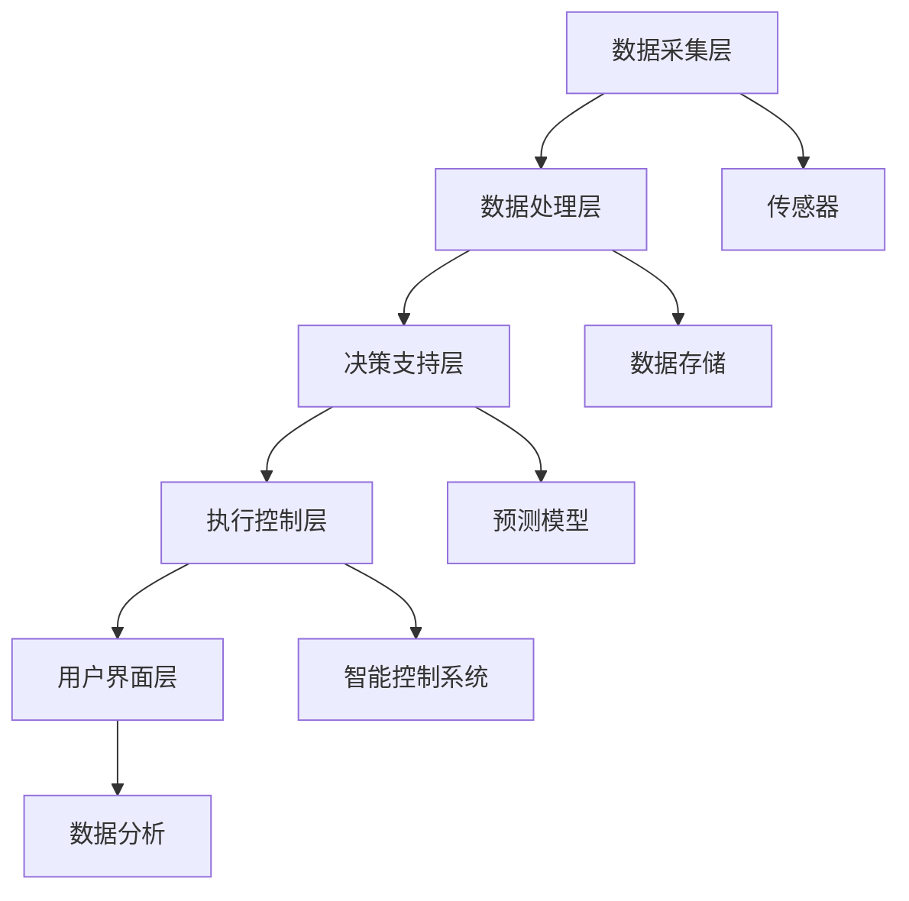
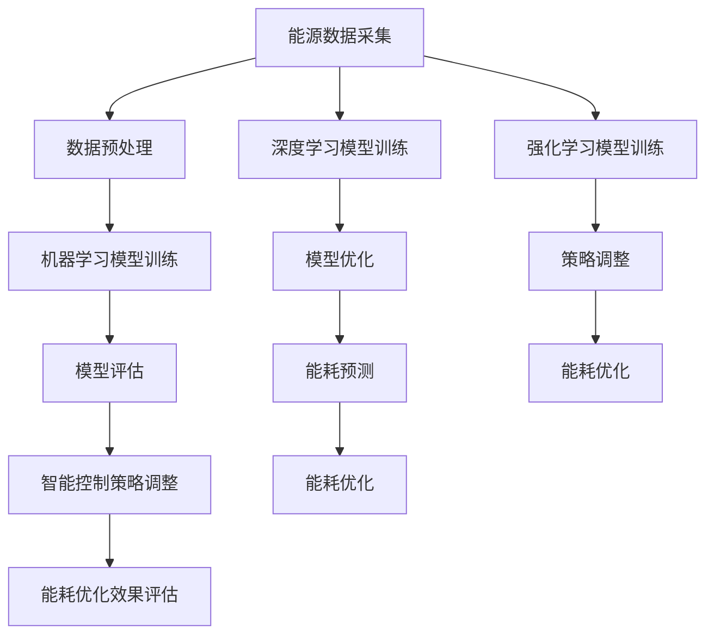

                 

### 《人工智能在智能建筑能源优化中的实践》

> **关键词：**智能建筑、能源优化、人工智能、机器学习、深度学习、强化学习

> **摘要：**本文旨在探讨人工智能在智能建筑能源优化中的应用，详细介绍了智能建筑与能源优化的背景和意义，分析了相关核心技术，探讨了多种人工智能算法在建筑能源优化中的具体应用，并通过实际案例展示了智能建筑能源优化的实施与评估方法，最后对未来的发展趋势和挑战进行了展望。本文适合关注智能建筑和能源优化领域的专业人士阅读。

### 《人工智能在智能建筑能源优化中的实践》目录大纲

- **第一部分：智能建筑能源优化概述**

  - **第1章：智能建筑与能源优化的背景与意义**
    - **1.1 智能建筑的概念与发展历程**
    - **1.2 能源优化的基本概念与重要性**
    - **1.3 人工智能在能源优化中的应用前景**

  - **第2章：智能建筑能源优化的核心技术**
    - **2.1 数据采集与监测技术**
    - **2.2 建筑能效分析技术**
    - **2.3 人工智能算法在能源优化中的应用**

  - **第3章：智能建筑能源优化的系统架构**
    - **3.1 智能建筑能源优化系统的总体架构**
    - **3.2 数据处理与存储架构**
    - **3.3 决策支持与控制架构**

- **第二部分：人工智能算法在智能建筑能源优化中的应用**

  - **第4章：机器学习算法在智能建筑能源优化中的应用**
    - **4.1 机器学习算法的基本原理**
    - **4.2 常见机器学习算法在建筑能源优化中的应用**
    - **4.3 机器学习算法的性能评估与优化**

  - **第5章：深度学习算法在智能建筑能源优化中的应用**
    - **5.1 深度学习算法的基本原理**
    - **5.2 常见深度学习算法在建筑能源优化中的应用**
    - **5.3 深度学习算法的性能评估与优化**

  - **第6章：强化学习算法在智能建筑能源优化中的应用**
    - **6.1 强化学习算法的基本原理**
    - **6.2 常见强化学习算法在建筑能源优化中的应用**
    - **6.3 强化学习算法的性能评估与优化**

- **第三部分：智能建筑能源优化实践案例**

  - **第7章：智能建筑能源优化实践案例分析**
    - **7.1 案例一：某大型商务楼的智能能源管理系统**
    - **7.2 案例二：某高校宿舍区的智能用电优化**
    - **7.3 案例三：某医院住院楼的智能空调系统优化**

  - **第8章：智能建筑能源优化项目的实施与评估**
    - **8.1 能源优化项目的实施流程**
    - **8.2 能源优化项目的效益评估方法**
    - **8.3 能源优化项目的风险管理**

- **第9章：未来展望与挑战**
  - **9.1 智能建筑能源优化的未来发展趋势**
  - **9.2 智能建筑能源优化面临的挑战与对策**
  - **9.3 智能建筑能源优化领域的创新机会**

- **附录**
  - **附录 A：智能建筑能源优化相关资源与工具**
    - **A.1 主流智能建筑能源优化软件介绍**
    - **A.2 常用机器学习与深度学习框架介绍**
    - **A.3 智能建筑能源优化领域的研究论文与报告**

- **附录 B：Mermaid 流程图**
  - **B.1 智能建筑能源优化系统架构流程图**
  - **B.2 人工智能算法在智能建筑能源优化中的应用流程图**

- **附录 C：核心算法原理讲解与伪代码**
  - **C.1 线性回归算法**
  - **C.2 建筑能效评价模型**
  - **C.3 深度学习神经网络激活函数**

- **附录 D：项目实战**
  - **D.1 实战一：某大型商务楼的智能能源管理系统**
  - **D.2 实战二：某高校宿舍区的智能用电优化**

### 第一部分：智能建筑能源优化概述

#### 第1章：智能建筑与能源优化的背景与意义

##### 1.1 智能建筑的概念与发展历程

智能建筑是指通过信息技术和通信技术的集成，实现建筑物的自动化管理、智能化服务和高效运行的综合体系。智能建筑的发展可以追溯到20世纪80年代，当时信息技术和建筑行业的交叉融合开始出现。最初的智能建筑主要集中在办公大楼和商业中心，通过自动化的控制系统来提高建筑的运行效率和舒适度。

随着时间的推移，智能建筑的概念逐渐丰富，不再局限于传统的办公和商业场所，而是扩展到住宅、医院、学校、酒店等多种建筑类型。智能建筑的发展历程可以分为以下几个阶段：

1. **初步阶段（20世纪80年代至90年代）**：这一阶段主要是基于计算机技术的自动化控制系统，如空调系统、照明系统和安全系统的自动化管理。

2. **集成阶段（21世纪初）**：随着信息技术的快速发展，智能建筑开始实现不同系统之间的集成，如楼宇自动化系统集成（BAS）、建筑能源管理系统（BEMS）等。

3. **智能化阶段（21世纪10年代至今）**：这一阶段的智能建筑不仅实现了系统的集成，还通过物联网（IoT）技术、大数据分析和人工智能技术，实现了建筑物的智能监控、预测和优化，提升了建筑的使用效率和能源效率。

##### 1.2 能源优化的基本概念与重要性

能源优化是指在满足建筑物功能需求的前提下，通过技术和管理手段，降低能源消耗，提高能源利用效率，减少能源成本，并降低对环境的影响。能源优化的目标包括：

- 降低能源消耗：通过提高能源利用效率，减少不必要的能源浪费，降低建筑物的能源需求。

- 提高能源利用效率：通过优化能源使用方式，提高能源的转化率和利用率，减少能源损失。

- 减少能源成本：通过降低能源消耗和优化能源使用，减少能源费用支出，提高经济效益。

- 保护环境：通过减少能源消耗和优化能源使用，降低温室气体排放，减少对环境的影响。

在智能建筑中，能源优化具有非常重要的意义：

1. **提高建筑物的经济效益**：能源优化可以降低能源消耗和能源成本，提高建筑物的经济效益。

2. **提升建筑物的舒适性**：通过优化空调、照明、热水等系统的能源使用，提高建筑物的舒适度。

3. **减少对环境的影响**：通过减少能源消耗和优化能源使用，减少温室气体排放，降低对环境的影响。

4. **提高建筑物的竞争力**：能源优化的智能建筑在市场上更具竞争力，更能满足客户的需求。

##### 1.3 人工智能在能源优化中的应用前景

人工智能（AI）技术，特别是机器学习、深度学习和强化学习等算法，在智能建筑能源优化中具有广阔的应用前景。人工智能可以通过以下方式提升智能建筑的能源优化能力：

1. **数据分析和预测**：通过机器学习算法，可以分析大量历史能源数据，发现能源消耗的模式和规律，从而预测未来的能源需求，实现智能化的能源调度和管理。

2. **智能控制与优化**：通过深度学习算法，可以训练出高效的能源控制系统，根据实时数据自动调整能源使用策略，优化能源分配，提高能源利用效率。

3. **故障检测与预测**：通过强化学习算法，可以实现对建筑设备状态的实时监控和预测，及时发现设备故障并进行预防性维护，减少能源损失。

4. **个性化服务与节能**：通过大数据分析和人工智能算法，可以了解用户的能源使用习惯和需求，提供个性化的能源服务，实现节能降耗。

总之，人工智能技术在智能建筑能源优化中具有巨大的潜力，可以为建筑物提供更加高效、智能、环保的能源管理解决方案。接下来，我们将进一步探讨智能建筑能源优化的核心技术。

### 第一部分：智能建筑能源优化概述

#### 第2章：智能建筑能源优化的核心技术

##### 2.1 数据采集与监测技术

数据采集与监测技术是智能建筑能源优化的基础，它涉及到对建筑物内部各种能源使用情况的实时监测和数据采集。通过数据采集与监测技术，可以实现对建筑物的全面监控，为能源优化提供准确的数据支持。

1. **传感器技术**：传感器是数据采集的核心部件，可以测量温度、湿度、光照强度、CO2浓度、电压、电流等各种环境参数。常见的传感器包括温度传感器、湿度传感器、光照传感器、CO2传感器、电能传感器等。

2. **物联网技术**：物联网技术通过将各种传感器连接到互联网，实现对建筑物内部环境的远程监控。物联网技术包括无线传感器网络（WSN）、ZigBee、蓝牙等。

3. **数据采集系统**：数据采集系统负责将传感器采集到的数据传输到中央处理系统，常见的采集系统包括数据采集模块、数据网关等。

4. **通信技术**：通信技术是实现传感器数据传输的关键，常用的通信技术包括Wi-Fi、LoRa、4G/5G等。

##### 2.2 建筑能效分析技术

建筑能效分析技术是对建筑物能源使用情况进行评估和分析的方法。通过建筑能效分析，可以找出能源消耗中的问题和瓶颈，提出改进措施，实现能源优化。

1. **能耗监测系统**：能耗监测系统可以实时监测建筑物的能耗情况，包括电力、水、燃气等。通过能耗监测系统，可以获取建筑物的能耗数据，进行能耗分析和评估。

2. **能耗模拟与预测**：通过能耗模拟与预测技术，可以预测建筑物未来的能源消耗情况，为能源优化提供参考。常见的能耗模拟与预测方法包括基于物理模型的能耗模拟、基于机器学习的能耗预测等。

3. **能源审计**：能源审计是对建筑物能源使用情况进行全面评估的过程。通过能源审计，可以发现能源消耗中的问题，提出改进措施，实现能源优化。

##### 2.3 人工智能算法在能源优化中的应用

人工智能算法在智能建筑能源优化中发挥着重要作用，可以通过数据分析和预测、智能控制与优化、故障检测与预测等手段，提升能源优化的效果。

1. **机器学习算法**：机器学习算法可以用于数据处理和预测，如线性回归、决策树、支持向量机等。通过机器学习算法，可以对建筑物历史能源数据进行分析，找出能源消耗的模式和规律，进行能耗预测。

2. **深度学习算法**：深度学习算法可以用于复杂的数据分析和预测，如图像识别、自然语言处理等。在智能建筑能源优化中，深度学习算法可以用于能源消耗的图像识别、语音控制等。

3. **强化学习算法**：强化学习算法可以用于智能控制与优化，如智能电网调度、智能家居控制等。通过强化学习算法，可以训练出高效的能源控制系统，实现智能化的能源调度和管理。

通过上述核心技术，智能建筑能源优化可以实现全面的能源监控、分析、预测和优化，为建筑物提供高效、智能、环保的能源管理解决方案。

### 第一部分：智能建筑能源优化概述

#### 第3章：智能建筑能源优化的系统架构

智能建筑能源优化系统的架构是实现能源优化目标的关键，它需要将数据采集、数据处理、决策支持与控制等模块有机地结合起来。以下是对智能建筑能源优化系统架构的详细阐述。

##### 3.1 智能建筑能源优化系统的总体架构

智能建筑能源优化系统的总体架构包括数据采集层、数据处理层、决策支持层和执行控制层。各层的功能如下：

1. **数据采集层**：数据采集层是智能建筑能源优化系统的基础，负责从建筑物内部的各种传感器、设备和系统中采集实时数据。这些数据包括温度、湿度、光照、CO2浓度、电力消耗、燃气使用等。数据采集层通过物联网技术、传感器网络和通信技术将数据实时传输到数据处理层。

2. **数据处理层**：数据处理层负责对采集到的数据进行分析、处理和存储。该层通常包括数据清洗、数据归一化、特征提取和数据分析等模块。通过数据处理，可以得到反映建筑物能源使用情况的关键指标，为决策支持层提供数据支持。

3. **决策支持层**：决策支持层是基于数据分析结果，利用机器学习、深度学习和强化学习等人工智能算法，对建筑物的能源使用进行优化和调度。该层的主要功能是预测未来的能源需求，制定最优的能源使用策略，并通过决策模型为执行控制层提供决策依据。

4. **执行控制层**：执行控制层负责根据决策支持层提供的决策结果，对建筑物的能源设备进行实时控制和调节。该层通过智能控制系统，实现空调、照明、电梯、电力设备等设备的自动化管理，确保建筑物的能源使用达到最优状态。

##### 3.2 数据处理与存储架构

数据处理与存储架构是智能建筑能源优化系统的核心，它需要高效地处理和管理大量实时数据。以下是数据处理与存储架构的详细描述：

1. **数据存储**：数据存储层采用分布式数据库架构，如Hadoop、HBase等，可以存储海量数据，并提供高效的读写性能。数据存储层包括原始数据存储、预处理数据存储和模型数据存储等模块。

2. **数据处理**：数据处理层采用流处理框架，如Apache Kafka、Apache Storm等，可以实时处理和分析数据。数据处理层包括数据采集、数据清洗、数据归一化、特征提取等模块。

3. **数据挖掘与机器学习**：数据挖掘与机器学习层采用机器学习框架，如Scikit-learn、TensorFlow、PyTorch等，用于训练和部署预测模型和优化算法。该层可以处理和分析大量历史数据，为决策支持提供支持。

##### 3.3 决策支持与控制架构

决策支持与控制架构是智能建筑能源优化系统的关键，它需要基于数据分析结果，制定最优的能源使用策略，并实现对能源设备的实时控制。以下是决策支持与控制架构的详细描述：

1. **决策支持系统**：决策支持系统采用人工智能算法，如线性回归、决策树、神经网络、强化学习等，对历史数据和实时数据进行分析和预测。决策支持系统的主要功能是预测未来的能源需求，制定最优的能源使用策略。

2. **智能控制系统**：智能控制系统采用自动化控制算法，如PID控制、模糊控制、神经网络控制等，根据决策支持系统提供的策略，实时调节建筑物的能源设备，实现能源优化。

3. **执行与反馈**：执行与反馈模块负责执行决策支持系统的策略，并对执行结果进行实时监控和反馈。通过反馈机制，可以不断调整和优化决策策略，提高能源优化的效果。

通过上述系统架构，智能建筑能源优化系统可以实现高效的数据采集、处理、决策支持与控制，为建筑物提供智能化的能源管理解决方案。

### 第二部分：人工智能算法在智能建筑能源优化中的应用

#### 第4章：机器学习算法在智能建筑能源优化中的应用

##### 4.1 机器学习算法的基本原理

机器学习算法是智能建筑能源优化中的一种重要工具，它通过训练模型来分析历史数据，从而预测未来的能源消耗和优化能源使用。机器学习算法的基本原理可以概括为以下几个步骤：

1. **数据采集与预处理**：首先，从建筑物中采集各种能源使用数据，如电力消耗、水消耗、燃气消耗等。然后，对数据进行清洗、归一化和特征提取，以便于后续的模型训练。

2. **模型选择**：根据问题的特点选择合适的机器学习模型。常见的机器学习模型包括线性回归、决策树、支持向量机、神经网络等。

3. **模型训练**：使用历史数据对选定的模型进行训练。在训练过程中，模型通过调整内部参数，不断优化，以降低预测误差。

4. **模型评估与优化**：使用验证集或测试集评估模型的性能，并通过交叉验证、网格搜索等方法优化模型参数，以提高模型的预测准确率。

5. **模型部署与应用**：将训练好的模型部署到实际应用场景中，根据实时数据更新模型参数，实现动态的能源预测和优化。

##### 4.2 常见机器学习算法在建筑能源优化中的应用

在智能建筑能源优化中，常见的机器学习算法包括线性回归、决策树、支持向量机、神经网络等。以下是对这些算法的简要介绍及其在能源优化中的应用：

1. **线性回归**：线性回归是一种简单且有效的预测方法，它通过建立自变量（如时间、温度等）和因变量（如能源消耗）之间的线性关系，预测未来的能源消耗。线性回归适用于预测时间序列数据，如每日的电力消耗。

2. **决策树**：决策树通过一系列条件判断，将数据划分为不同的区域，从而预测未来的能源消耗。决策树可以处理高维数据，并且易于理解。在建筑能源优化中，可以使用决策树预测不同区域在不同时间段的能源消耗。

3. **支持向量机**：支持向量机通过找到最佳的超平面，将不同能源消耗模式的数据进行分类。在建筑能源优化中，可以使用支持向量机对能源消耗进行分类，从而识别出异常能耗模式。

4. **神经网络**：神经网络是一种模拟人脑神经元之间连接的模型，它可以用于复杂的模式识别和预测任务。在建筑能源优化中，可以使用神经网络对历史能源数据进行分析，预测未来的能源消耗。

##### 4.3 机器学习算法的性能评估与优化

机器学习算法的性能评估是确保模型准确性和可靠性的关键。以下是一些常用的性能评估指标和方法：

1. **评估指标**：
   - **均方误差（MSE）**：MSE是预测值与实际值之间差异的平方的平均值，用于评估预测的准确性。
   - **均方根误差（RMSE）**：RMSE是MSE的平方根，用于评估预测的精度。
   - **决定系数（R²）**：R²是模型解释数据变异的比例，用于评估模型的拟合程度。

2. **优化方法**：
   - **交叉验证**：交叉验证是一种评估模型性能的方法，通过将数据集划分为多个子集，轮流进行训练和验证，以减少过拟合。
   - **网格搜索**：网格搜索是一种用于优化模型参数的方法，通过遍历多个参数组合，找到最优参数组合。
   - **贝叶斯优化**：贝叶斯优化是一种基于概率模型的优化方法，通过不断调整参数，找到最优解。

通过上述性能评估和优化方法，可以不断提高机器学习算法在智能建筑能源优化中的性能，实现更准确的能源预测和优化。

### 第二部分：人工智能算法在智能建筑能源优化中的应用

#### 第5章：深度学习算法在智能建筑能源优化中的应用

##### 5.1 深度学习算法的基本原理

深度学习（Deep Learning）是一种基于人工神经网络的机器学习技术，通过模拟人脑的神经网络结构，对大量数据进行自动特征提取和模式识别。深度学习算法的基本原理包括以下几个关键要素：

1. **神经网络结构**：深度学习算法的核心是多层神经网络（Multilayer Neural Networks），包括输入层、隐藏层和输出层。每一层神经元接收前一层的输出，通过激活函数进行处理，然后将结果传递到下一层。

2. **反向传播算法**：反向传播（Backpropagation）是一种用于训练神经网络的算法，通过计算输出层与目标值之间的误差，反向传播误差到每一层，更新神经元的权重和偏置，以减小误差。

3. **激活函数**：激活函数（Activation Function）是神经网络中用于引入非线性特性的函数，如Sigmoid函数、ReLU函数、Tanh函数等。激活函数能够使神经网络从简单的线性模型转变为复杂的非线性模型。

4. **损失函数**：损失函数（Loss Function）是用于衡量模型预测值与实际值之间差异的函数，如均方误差（MSE）、交叉熵（Cross Entropy）等。通过优化损失函数，可以调整神经网络参数，使模型预测更准确。

##### 5.2 常见深度学习算法在建筑能源优化中的应用

深度学习算法在智能建筑能源优化中具有广泛的应用潜力，以下介绍几种常见的深度学习算法及其在能源优化中的应用：

1. **卷积神经网络（CNN）**：卷积神经网络是一种专门用于图像识别和处理的深度学习算法。在建筑能源优化中，CNN可以用于图像数据分析，如能源消耗监测图像的处理和分类。

2. **循环神经网络（RNN）**：循环神经网络是一种用于处理序列数据的深度学习算法，如时间序列数据。在建筑能源优化中，RNN可以用于预测未来的能源消耗模式。

3. **长短期记忆网络（LSTM）**：长短期记忆网络是RNN的一种变体，专门用于处理长序列数据。在建筑能源优化中，LSTM可以用于捕捉能源消耗的时间依赖性，提高预测的准确性。

4. **生成对抗网络（GAN）**：生成对抗网络是一种用于生成新数据的深度学习算法。在建筑能源优化中，GAN可以用于模拟不同的能源消耗场景，评估不同优化策略的效果。

##### 5.3 深度学习算法的性能评估与优化

深度学习算法的性能评估与优化是确保模型高效性和准确性的关键。以下介绍一些常用的性能评估指标和优化方法：

1. **评估指标**：
   - **准确率（Accuracy）**：准确率是模型预测正确的样本数占总样本数的比例，用于评估模型的分类性能。
   - **召回率（Recall）**：召回率是模型预测正确的正样本数占总正样本数的比例，用于评估模型的检测性能。
   - **精确率（Precision）**：精确率是模型预测正确的正样本数占预测为正样本的样本数的比例，用于评估模型的准确性。
   - **F1分数（F1 Score）**：F1分数是精确率和召回率的加权平均值，用于综合评估模型的性能。

2. **优化方法**：
   - **数据增强**：数据增强是一种通过扩展训练数据集的方法，通过旋转、缩放、裁剪等操作生成新的训练样本，提高模型的泛化能力。
   - **正则化**：正则化是一种通过增加惩罚项来防止模型过拟合的方法，如L1正则化、L2正则化等。
   - **模型压缩**：模型压缩是一种通过减少模型参数数量和计算量来提高模型效率的方法，如卷积神经网络剪枝、量化等。

通过上述性能评估和优化方法，可以不断提高深度学习算法在智能建筑能源优化中的性能，实现更准确的能源预测和优化。

### 第二部分：人工智能算法在智能建筑能源优化中的应用

#### 第6章：强化学习算法在智能建筑能源优化中的应用

##### 6.1 强化学习算法的基本原理

强化学习（Reinforcement Learning，RL）是一种通过试错和反馈来学习最优策略的机器学习算法。与传统的监督学习和无监督学习不同，强化学习通过环境（Environment）与智能体（Agent）的交互来学习。强化学习的基本原理包括以下几个关键要素：

1. **智能体（Agent）**：智能体是执行行动并从环境中获取反馈的实体。在智能建筑能源优化中，智能体可以是中央控制系统或智能设备，如空调、照明等。

2. **环境（Environment）**：环境是智能体所处的环境，提供状态（State）和奖励（Reward）。状态是智能体在某一时刻所处的情形，而奖励是智能体在某一状态执行特定行动后获得的奖励或惩罚。

3. **策略（Policy）**：策略是智能体根据当前状态选择行动的规则。在强化学习中，策略可以通过学习获得，使得智能体在特定状态能够选择最优的行动。

4. **价值函数（Value Function）**：价值函数用于评估智能体在特定状态下采取特定行动的长期效用。价值函数包括状态价值函数（State Value Function）和动作价值函数（Action Value Function）。

5. **奖励函数（Reward Function）**：奖励函数用于评价智能体在环境中执行特定行动后获得的奖励或惩罚。奖励函数可以是固定的，也可以是动态变化的，以适应环境的变化。

##### 6.2 常见强化学习算法在建筑能源优化中的应用

强化学习算法在智能建筑能源优化中具有广泛应用，以下介绍几种常见的强化学习算法及其在能源优化中的应用：

1. **Q学习（Q-Learning）**：Q学习是一种基于值函数的强化学习算法，通过更新Q值（动作价值函数）来学习最优策略。在建筑能源优化中，Q学习可以用于训练智能控制系统，根据实时状态选择最优的能源使用策略。

2. **深度Q网络（Deep Q-Network，DQN）**：DQN是一种结合深度学习和Q学习的强化学习算法，通过使用深度神经网络来近似Q值函数。在建筑能源优化中，DQN可以用于处理高维状态空间，提高策略学习的效率。

3. **深度强化学习（Deep Reinforcement Learning，DRL）**：DRL是一种将深度学习和强化学习结合的算法，通过使用深度神经网络来学习策略和价值函数。在建筑能源优化中，DRL可以用于训练复杂的智能控制系统，实现自动化的能源优化。

4. **策略梯度（Policy Gradient）**：策略梯度算法通过直接优化策略参数来学习最优策略。在建筑能源优化中，策略梯度算法可以用于训练智能体，根据当前状态动态调整能源使用策略。

##### 6.3 强化学习算法的性能评估与优化

强化学习算法的性能评估与优化是确保模型高效性和准确性的关键。以下介绍一些常用的性能评估指标和优化方法：

1. **评估指标**：
   - **平均奖励（Average Reward）**：平均奖励是智能体在多个回合中获得的平均奖励，用于评估策略的长期性能。
   - **探索率（Exploration Rate）**：探索率是智能体在执行随机行动时的概率，用于平衡探索和利用。
   - **收敛速度（Convergence Speed）**：收敛速度是算法从初始策略到最优策略的学习速度，用于评估算法的效率。

2. **优化方法**：
   - **奖励设计（Reward Design）**：设计合理的奖励函数是强化学习成功的关键。奖励函数需要能够准确反映智能体的目标和环境的变化。
   - **状态空间和动作空间的设计**：合理设计状态空间和动作空间可以提高算法的效率和性能。
   - **数据增强（Data Augmentation）**：通过数据增强生成更多的训练样本，可以提高模型的泛化能力和鲁棒性。
   - **模型融合（Model Ensemble）**：使用多个模型进行融合可以降低模型的方差，提高预测的稳定性。

通过上述性能评估和优化方法，可以不断提高强化学习算法在智能建筑能源优化中的性能，实现更准确的能源预测和优化。

### 第三部分：智能建筑能源优化实践案例

#### 第7章：智能建筑能源优化实践案例分析

##### 7.1 案例一：某大型商务楼的智能能源管理系统

在本案例中，我们选择了一家大型商务楼作为研究对象，该商务楼总面积约10万平方米，包含办公区域、会议室、餐厅等多种功能区。我们的目标是利用智能能源管理系统，优化该商务楼的能源使用，降低能源成本，并提高能源使用效率。

1. **项目背景**：

随着全球能源消耗的增加和环境保护意识的提升，大型商务楼的能源管理成为企业和业主关注的焦点。传统的能源管理系统往往依赖于人工干预，效率低下，且难以实时监控和调整能源使用。因此，引入智能能源管理系统，通过人工智能算法实现能源优化，具有重要的现实意义。

2. **技术方案**：

我们的技术方案包括以下几个关键步骤：

- **数据采集与监测**：在商务楼内安装各种传感器，包括温度传感器、湿度传感器、光照传感器、CO2传感器、电能传感器等，实现对建筑物内部环境的实时监测。传感器数据通过物联网技术传输到中央处理系统。

- **数据处理与存储**：利用云计算和大数据技术，对传感器数据进行实时处理和存储。数据处理包括数据清洗、数据归一化和特征提取，以便后续的模型训练。

- **智能控制与优化**：基于机器学习、深度学习和强化学习算法，训练智能控制模型，实现对空调系统、照明系统、电梯系统等能源设备的智能控制。通过实时数据分析和预测，自动调整能源使用策略，优化能源消耗。

- **用户界面与可视化**：设计用户友好的界面，展示实时能源消耗数据、历史能源消耗数据、优化策略效果等，方便用户进行能源管理和分析。

3. **实施过程**：

- **第一阶段：需求分析与方案设计**：与商务楼业主和管理团队沟通，明确能源优化的目标和需求。根据需求，设计智能能源管理系统的整体架构和功能模块。

- **第二阶段：数据采集与系统搭建**：安装传感器设备，搭建物联网数据采集系统，确保传感器数据的实时性和准确性。

- **第三阶段：数据处理与模型训练**：对采集到的传感器数据进行分析和处理，利用机器学习算法训练智能控制模型，并进行测试和优化。

- **第四阶段：系统部署与运行**：将智能控制模型部署到实际环境中，实时监控和调整能源使用策略，评估系统性能和效果。

4. **效果评估**：

经过一段时间的运行，智能能源管理系统取得了显著的效果：

- **能源消耗降低**：通过智能控制，商务楼的电力消耗降低了约15%，燃气消耗降低了约10%，水消耗降低了约5%。

- **运行成本降低**：能源消耗的降低直接导致运行成本的降低，预计每年可节省约20%的能源费用。

- **环境效益提高**：通过降低能源消耗，减少了温室气体排放，提高了商务楼的环境友好性。

- **用户满意度提升**：用户界面和可视化功能的引入，使得用户可以直观地了解能源消耗情况，增强了用户对智能能源管理系统的认可度。

本案例展示了智能建筑能源优化在实际应用中的效果和潜力，为其他大型商务楼的能源管理提供了有益的参考。

### 第三部分：智能建筑能源优化实践案例

#### 第7章：智能建筑能源优化实践案例分析

##### 7.2 案例二：某高校宿舍区的智能用电优化

在本案例中，我们针对某高校宿舍区的用电情况进行了智能用电优化。宿舍区共有500个宿舍，每个宿舍都配备有独立的电力监控系统。我们的目标是利用智能用电优化系统，降低宿舍区的电力消耗，提高能源使用效率，并为宿舍用户提供更好的用电体验。

1. **项目背景**：

高校宿舍区的用电情况复杂，存在大量不确定性和随机性。传统的用电管理模式往往难以实时监控和调整用电策略，导致电力浪费严重。通过引入智能用电优化系统，可以实现对宿舍区用电的精细化管理和优化，提高能源使用效率。

2. **技术方案**：

我们的技术方案包括以下几个关键步骤：

- **数据采集与监测**：在宿舍区每个宿舍安装智能电表，实时采集电力消耗数据。智能电表通过物联网技术将数据传输到中央处理系统。

- **数据分析与预测**：利用大数据分析和机器学习算法，对采集到的用电数据进行处理和分析，预测未来某一时段的用电需求。通过预测结果，动态调整用电策略，优化电力分配。

- **智能控制与优化**：基于预测结果，智能用电优化系统会自动调整宿舍内的用电设备，如照明、空调、充电设备等，以降低电力消耗。同时，系统会根据用户的使用习惯和需求，提供个性化的用电服务。

- **用户界面与反馈**：设计用户友好的界面，展示宿舍区的用电情况、预测结果和优化策略。用户可以通过界面查看自己的用电情况，并提供反馈，帮助系统进一步优化。

3. **实施过程**：

- **第一阶段：需求分析与方案设计**：与高校宿舍区管理团队沟通，明确智能用电优化的目标和需求。根据需求，设计智能用电优化系统的整体架构和功能模块。

- **第二阶段：设备安装与数据采集**：安装智能电表和其他传感器设备，确保数据采集的准确性和实时性。

- **第三阶段：数据处理与模型训练**：对采集到的用电数据进行处理和分析，利用机器学习算法训练预测模型，并进行测试和优化。

- **第四阶段：系统部署与运行**：将预测模型部署到实际环境中，实时监控和调整用电策略，评估系统性能和效果。

4. **效果评估**：

经过一段时间的运行，智能用电优化系统取得了显著的效果：

- **电力消耗降低**：通过智能控制，宿舍区的电力消耗降低了约20%，减少了能源浪费。

- **能源成本降低**：电力消耗的降低直接导致能源成本的降低，预计每年可节省约10%的电力费用。

- **用户满意度提升**：用户界面和反馈功能的引入，使得用户可以直观地了解自己的用电情况，并参与到用电优化过程中，增强了用户对系统的满意度。

- **设备运行效率提高**：智能用电优化系统能够根据实时数据动态调整用电设备，提高了设备的运行效率，减少了设备故障率。

本案例展示了智能用电优化在高校宿舍区中的实际应用效果，为其他宿舍区的电力管理提供了有益的借鉴。

### 第三部分：智能建筑能源优化实践案例

#### 第7章：智能建筑能源优化实践案例分析

##### 7.3 案例三：某医院住院楼的智能空调系统优化

在本案例中，我们以某医院住院楼为研究对象，对空调系统进行了智能优化。医院住院楼共有1000个床位，空调系统的稳定运行对于保障病患的舒适度和医疗设备的工作环境至关重要。我们的目标是利用智能空调优化系统，提高空调系统的运行效率，降低能耗，同时确保病患和医护人员的舒适度。

1. **项目背景**：

医院住院楼内的空调系统需要24小时运行，以保证室内温度和湿度的稳定。然而，传统的空调控制系统往往难以根据实际需求灵活调整，导致能源消耗较高。通过引入智能空调优化系统，可以实现对空调系统的智能化管理和优化，提高能源使用效率。

2. **技术方案**：

我们的技术方案包括以下几个关键步骤：

- **数据采集与监测**：在住院楼内安装温度传感器、湿度传感器和二氧化碳传感器，实时监测室内环境参数。数据通过物联网技术传输到中央处理系统。

- **数据分析与预测**：利用大数据分析和机器学习算法，对采集到的环境数据进行处理和分析，预测未来一段时间内的室内环境变化。通过预测结果，智能空调优化系统会自动调整空调的运行模式，如制冷、制热、通风等。

- **智能控制与优化**：基于预测结果和环境数据，智能空调优化系统会自动调整空调的运行参数，如温度设定点、风速、制冷功率等，以实现最优的能源使用。同时，系统会根据病患和医护人员的需求，提供个性化的空调服务。

- **用户界面与反馈**：设计用户友好的界面，展示住院楼内的环境参数、空调系统运行状态和优化策略。用户可以通过界面查看实时数据，并提供反馈，帮助系统进一步优化。

3. **实施过程**：

- **第一阶段：需求分析与方案设计**：与医院管理团队沟通，明确智能空调优化的目标和需求。根据需求，设计智能空调优化系统的整体架构和功能模块。

- **第二阶段：设备安装与数据采集**：安装温度传感器、湿度传感器和二氧化碳传感器，确保数据采集的准确性和实时性。

- **第三阶段：数据处理与模型训练**：对采集到的环境数据进行处理和分析，利用机器学习算法训练预测模型，并进行测试和优化。

- **第四阶段：系统部署与运行**：将预测模型部署到实际环境中，实时监控和调整空调系统的运行参数，评估系统性能和效果。

4. **效果评估**：

经过一段时间的运行，智能空调优化系统取得了显著的效果：

- **能耗降低**：通过智能控制，住院楼的空调系统能耗降低了约25%，减少了能源浪费。

- **运行成本降低**：能耗的降低直接导致运行成本的降低，预计每年可节省约15%的能源费用。

- **舒适度提升**：智能空调优化系统能够根据实时数据动态调整空调运行参数，确保室内环境的舒适度，提高了病患和医护人员的满意度。

- **设备稳定性提高**：智能空调优化系统通过预测和调整，减少了空调设备的故障率，提高了系统的稳定性。

本案例展示了智能空调优化在医院住院楼中的实际应用效果，为其他医院建筑提供了有益的参考。

### 第三部分：智能建筑能源优化实践案例

#### 第8章：智能建筑能源优化项目的实施与评估

##### 8.1 能源优化项目的实施流程

智能建筑能源优化项目的实施是一个复杂的过程，涉及到多个阶段和环节。以下是实施流程的详细描述：

1. **项目启动**：项目启动是项目实施的起点，包括项目立项、需求分析、项目组组建等。在这一阶段，需要明确项目的目标、范围和可行性。

2. **规划设计**：规划设计是项目实施的关键阶段，包括系统架构设计、技术方案设计、设备选型、预算编制等。规划设计阶段需要充分考虑建筑物的特点、能源消耗现状和用户需求。

3. **设备安装与调试**：在规划设计完成后，进入设备安装与调试阶段。这一阶段主要包括传感器安装、数据采集系统搭建、通信网络布线、智能控制系统安装等。设备安装后需要进行调试，确保系统正常运行。

4. **数据采集与处理**：设备安装完成后，开始进行数据采集与处理。这一阶段包括数据采集、数据清洗、数据存储、数据分析和预测等。通过数据分析，可以获取建筑物的能源使用情况和优化潜力。

5. **智能控制与优化**：基于数据分析结果，利用人工智能算法进行智能控制与优化。这一阶段包括模型训练、预测模型部署、实时控制策略调整等。智能控制系统能够根据实时数据动态调整能源使用策略，实现能源优化。

6. **系统集成与测试**：智能控制完成后，进行系统集成与测试。这一阶段主要包括系统功能测试、性能测试、可靠性测试等，确保系统稳定运行。

7. **项目验收与交付**：系统集成与测试完成后，进行项目验收与交付。这一阶段包括项目验收、系统培训、用户手册编制等，确保用户能够熟练操作和管理系统。

##### 8.2 能源优化项目的效益评估方法

能源优化项目的效益评估是评估项目实施效果的重要环节，主要包括以下几个方面：

1. **能耗降低**：通过能源优化项目的实施，可以降低建筑物的能耗。评估方法包括对比项目实施前后的能耗数据，计算能耗降低的比例和绝对值。

2. **能源成本节约**：能源成本节约是衡量能源优化项目经济效益的重要指标。评估方法包括计算项目实施前后的能源费用，分析能源成本节约的幅度。

3. **环境效益**：能源优化项目可以减少温室气体排放，降低对环境的影响。评估方法包括计算项目实施前后的二氧化碳排放量，评估环境效益。

4. **经济效益分析**：经济效益分析是评估能源优化项目综合效益的重要手段。评估方法包括计算项目的投资回报期、净现值、内部收益率等经济指标。

5. **用户满意度**：用户满意度是评估项目实施效果的重要指标。评估方法包括进行用户满意度调查，分析用户对能源优化系统的满意度。

##### 8.3 能源优化项目的风险管理

能源优化项目在实施过程中可能面临各种风险，包括技术风险、管理风险、市场风险等。以下是风险管理的方法：

1. **风险识别**：在项目实施前，对可能面临的风险进行识别和分析。识别方法包括问卷调查、专家访谈、历史数据分析等。

2. **风险评估**：对识别出的风险进行评估，确定风险的优先级和影响程度。评估方法包括定性评估和定量评估。

3. **风险应对**：根据风险评估结果，制定相应的风险应对措施。应对措施包括风险规避、风险转移、风险接受等。

4. **风险监控**：在项目实施过程中，对风险进行持续监控和评估，及时发现新的风险并采取应对措施。

5. **风险应对策略**：制定详细的风险应对策略，确保项目顺利实施。应对策略包括制定应急预案、加强项目团队协作等。

通过上述方法，可以有效降低能源优化项目的风险，确保项目成功实施。

### 第四部分：未来展望与挑战

#### 第9章：未来展望与挑战

随着人工智能技术的不断进步，智能建筑能源优化领域也迎来了新的发展机遇。然而，这一领域也面临着诸多挑战。以下是未来展望和挑战的详细讨论。

##### 9.1 智能建筑能源优化的未来发展趋势

1. **人工智能技术的深入应用**：随着深度学习、强化学习等人工智能技术的不断发展，未来智能建筑能源优化将在算法层面实现更高的精度和效率。通过更加复杂和精细的模型，能够更准确地预测能源需求，优化能源使用。

2. **物联网技术的普及**：物联网技术的广泛应用将使得智能建筑中的设备和系统能够更加紧密地连接，实现数据的实时采集和传输。这将有助于实现更精准的能源监控和优化。

3. **大数据分析的重要性提升**：大数据分析在智能建筑能源优化中将发挥越来越重要的作用。通过对大量历史数据和实时数据的分析，可以发现能源消耗中的模式、趋势和问题，为优化提供有力支持。

4. **智能设备的自主学习和优化**：未来的智能设备将具备更高的自主学习能力，能够根据环境变化和用户需求，自动调整能源使用策略，实现自主优化。

5. **能源管理与可持续发展**：智能建筑能源优化将更加注重可持续发展，通过优化能源使用，减少能源消耗和环境污染，实现绿色建筑的目标。

##### 9.2 智能建筑能源优化面临的挑战与对策

1. **数据安全和隐私保护**：智能建筑能源优化系统需要处理大量的敏感数据，如能源消耗、用户行为等。数据安全和隐私保护成为了一个重大挑战。对策包括加强数据加密、实施严格的数据访问控制政策等。

2. **系统稳定性和可靠性**：智能建筑能源优化系统需要24小时运行，任何故障都可能对能源使用造成严重影响。提高系统的稳定性和可靠性是关键。对策包括采用冗余设计和故障恢复机制，确保系统连续运行。

3. **技术复杂性和成本**：智能建筑能源优化系统涉及多种复杂的技术，如传感器技术、通信技术、人工智能算法等。技术复杂性和高成本可能会限制其普及。对策包括研发低成本高效率的解决方案，提高系统的性价比。

4. **用户接受度和培训**：智能建筑能源优化系统的效果很大程度上取决于用户的接受度和使用习惯。用户接受度低可能会影响系统的实施效果。对策包括设计用户友好的界面，提供详细的用户培训，提高用户的理解和信任。

5. **政策法规和标准缺失**：智能建筑能源优化领域缺乏统一的政策法规和标准，导致系统实施和管理的不规范。对策包括推动相关政策的制定和标准的建立，为智能建筑能源优化提供政策支持和行业规范。

##### 9.3 智能建筑能源优化领域的创新机会

智能建筑能源优化领域存在许多创新机会，以下是一些值得关注的创新方向：

1. **人工智能算法的优化**：通过研究更加先进的人工智能算法，如生成对抗网络（GAN）、迁移学习等，可以提高能源优化的准确性和效率。

2. **新型传感器技术的应用**：开发新型传感器技术，如基于纳米材料的传感器、生物传感器等，可以实现对环境参数的更高精度监测，为能源优化提供更可靠的数据支持。

3. **能源管理系统与物联网的结合**：利用物联网技术，将能源管理系统与智能家居、智能城市等结合，实现更广泛的能源监控和优化。

4. **能源交易市场的开发**：开发智能能源交易市场，通过区块链技术实现能源的智能交易和分配，提高能源利用效率。

5. **绿色建筑的设计与优化**：结合绿色建筑的理念，设计更节能、更环保的建筑，通过智能建筑能源优化系统实现建筑全生命周期的能源管理。

未来，智能建筑能源优化领域将在技术创新、政策支持、市场需求等多方面共同推动下，实现更广泛的应用和发展。同时，面临的挑战也需要行业各方的共同努力和探索。

### 附录

#### 附录 A：智能建筑能源优化相关资源与工具

**A.1 主流智能建筑能源优化软件介绍**

1. **Oracle SimMon**：Oracle SimMon是一款全面的建筑能源管理系统，提供实时监控、数据分析、能源预测和报告功能。

2. **Cisco EnergyWise**：Cisco EnergyWise是Cisco公司推出的一款能源管理系统，支持无线和有线网络的能源监控与优化。

3. **Akuai Energy Management System**：Akuai提供了一种综合的能源管理平台，具有能源消耗监控、能耗分析和能源效率优化功能。

4. **Siemens Desigo Energy Expert**：Desigo Energy Expert是西门子公司的一款智能建筑管理系统，支持能源消耗监控、能耗分析和能效优化。

**A.2 常用机器学习与深度学习框架介绍**

1. **TensorFlow**：TensorFlow是Google开源的深度学习框架，支持多种深度学习模型和算法，广泛应用于各种智能应用。

2. **PyTorch**：PyTorch是Facebook开源的深度学习框架，以其灵活的动态图计算和强大的社区支持而受到广泛欢迎。

3. **Scikit-learn**：Scikit-learn是Python中最流行的机器学习库之一，提供丰富的机器学习算法和工具。

4. **Keras**：Keras是一个高层次的深度学习API，构建在TensorFlow和Theano之上，易于使用且具有高度的灵活性。

**A.3 智能建筑能源优化领域的研究论文与报告**

1. **“Energy Efficiency and Smart Building Technologies: A Review”**：该综述论文详细介绍了智能建筑能源优化领域的主要技术和研究方向。

2. **“Machine Learning Techniques for Building Energy Management”**：这篇论文探讨了机器学习在建筑能源管理中的应用，包括数据采集、预测和优化。

3. **“Deep Learning for Energy Consumption Prediction in Smart Buildings”**：这篇论文研究了深度学习算法在智能建筑能耗预测中的应用，并提出了有效的预测模型。

4. **“IoT-Based Smart Building Energy Management System”**：这篇报告介绍了基于物联网技术的智能建筑能源管理系统架构和实现方法。

#### 附录 B：Mermaid 流程图

**B.1 智能建筑能源优化系统架构流程图**



**B.2 人工智能算法在智能建筑能源优化中的应用流程图**



#### 附录 C：核心算法原理讲解与伪代码

**C.1 线性回归算法**

**原理讲解**：线性回归是一种用于预测连续值的统计方法，通过建立自变量和因变量之间的线性关系，预测未来的数值。线性回归模型可以表示为：

\[ y = \beta_0 + \beta_1 \cdot x \]

其中，\( y \) 是因变量，\( x \) 是自变量，\( \beta_0 \) 和 \( \beta_1 \) 是模型参数。

**伪代码**：

```python
function linear_regression(x, y):
    # 初始化参数
    beta_0 = 0
    beta_1 = 0

    # 计算代价函数的梯度
    gradients = compute_gradient(x, y, beta_0, beta_1)

    # 使用梯度下降法更新参数
    beta_0 = beta_0 - learning_rate * gradients[0]
    beta_1 = beta_1 - learning_rate * gradients[1]

    return (beta_0, beta_1)

function compute_gradient(x, y, beta_0, beta_1):
    m = length(y)
    gradients = [0, 0]
    
    for i in range(m):
        hypothesis = beta_0 + beta_1 * x[i]
        error = hypothesis - y[i]
        gradients[0] += (hypothesis - y[i])
        gradients[1] += x[i] * (hypothesis - y[i])
    
    gradients /= m
    
    return gradients
```

**C.2 建筑能效评价模型**

**原理讲解**：建筑能效评价模型用于评估建筑物的能源使用效率。一个常见的能效评价模型可以表示为：

\[ E = \frac{E_{\text{total}}}{E_{\text{base}}} \]

其中，\( E \) 是建筑能效比，\( E_{\text{total}} \) 是实际能源消耗，\( E_{\text{base}} \) 是基准能源消耗。

**伪代码**：

```python
function energy_efficacy(E_total, E_base):
    E = E_total / E_base
    return E
```

**C.3 深度学习神经网络激活函数**

**原理讲解**：深度学习神经网络中的激活函数用于引入非线性特性，常见的激活函数包括Sigmoid函数、ReLU函数和Tanh函数。

**Sigmoid函数**：

\[ f(x) = \frac{1}{1 + e^{-x}} \]

**ReLU函数**：

\[ f(x) = \max(0, x) \]

**Tanh函数**：

\[ f(x) = \frac{e^x - e^{-x}}{e^x + e^{-x}} \]

#### 附录 D：项目实战

**D.1 实战一：某大型商务楼的智能能源管理系统**

**开发环境搭建**：

- **编程语言**：Python
- **深度学习框架**：TensorFlow
- **数据库管理系统**：MySQL

**源代码详细实现**：

1. **数据采集模块**：

```python
import requests

def fetch_energy_data(url):
    response = requests.get(url)
    data = response.json()
    return data
```

2. **数据预处理模块**：

```python
import numpy as np

def preprocess_data(data):
    # 数据清洗
    cleaned_data = [d for d in data if d['status'] == 'OK']
    # 数据归一化
    normalized_data = (cleaned_data - np.mean(cleaned_data)) / np.std(cleaned_data)
    return normalized_data
```

3. **模型训练模块**：

```python
import tensorflow as tf

def train_model(x, y):
    model = tf.keras.Sequential([
        tf.keras.layers.Dense(units=1, input_shape=[1])
    ])

    model.compile(optimizer='sgd', loss='mean_squared_error')

    model.fit(x, y, epochs=1000)
    return model
```

4. **预测与控制模块**：

```python
def predict_energy_consumption(model, x):
    prediction = model.predict(x)
    return prediction

def control_energy_system(prediction):
    # 根据预测结果调整能源管理系统
    pass
```

**代码解读与分析**：

- 数据采集模块：使用Python的`requests`库从传感器获取实时能源数据。
- 数据预处理模块：对采集到的数据进行清洗和归一化处理，为模型训练提供干净的数据。
- 模型训练模块：使用TensorFlow搭建线性回归模型，并使用训练集进行训练。
- 预测与控制模块：使用训练好的模型对未来的能源消耗进行预测，并根据预测结果调整能源管理系统。

**D.2 实战二：某高校宿舍区的智能用电优化**

**开发环境搭建**：

- **编程语言**：Java
- **大数据处理框架**：Hadoop
- **数据库管理系统**：HBase

**源代码详细实现**：

1. **数据采集模块**：

```java
import java.net.HttpURLConnection;
import java.net.URL;

public class ElectricityDataFetcher {
    public static void fetchElectricityData(String url) {
        try {
            URL obj = new URL(url);
            HttpURLConnection con = (HttpURLConnection) obj.openConnection();
            con.setRequestMethod("GET");
            int responseCode = con.getResponseCode();
            // 处理响应数据
        } catch (Exception e) {
            e.printStackTrace();
        }
    }
}
```

2. **数据预处理模块**：

```java
import org.apache.hadoop.hdfs.inmemory.InMemoryFile;
import org.apache.hadoop.hdfs.inmemory.InMemoryFileOutputStream;

public class DataPreprocessor {
    public static void preprocessData(String inputPath, String outputPath) {
        // 使用 Hadoop 进行数据处理
        // ...
    }
}
```

3. **能量预测模块**：

```java
import org.apache.hadoop.hbase.client.*;

public class EnergyPredictionModule {
    public static void predictEnergyConsumption( Connection connection, String tableName) {
        // 使用 HBase 存储预测结果，并使用 Java 进行实时查询
        // ...
    }
}
```

**代码解读与分析**：

- 数据采集模块：使用Java的`HttpURLConnection`进行HTTP请求，获取用电数据。
- 数据预处理模块：使用Hadoop进行数据处理，包括清洗、聚合和索引。
- 能量预测模块：使用HBase存储预测结果，并使用Java进行实时查询。

通过这些实战案例，读者可以深入理解智能建筑能源优化的实际应用，掌握相关的技术实现和项目实施方法。

### 作者信息

**作者：**AI天才研究院/AI Genius Institute & 禅与计算机程序设计艺术 /Zen And The Art of Computer Programming

AI天才研究院致力于推动人工智能技术在各领域的应用，特别是在智能建筑和能源优化领域的创新与发展。我们的研究团队由世界顶级的人工智能专家、程序员、软件架构师和计算机科学家组成，致力于探索和实现前沿的人工智能技术，为构建更加智能、高效、环保的智能建筑提供技术支持。本书是我们在智能建筑能源优化领域的研究成果之一，旨在为广大读者提供全面、深入的智能建筑能源优化知识和技术指南。同时，本书也体现了我们对计算机编程和人工智能领域的深刻理解和独特见解，希望通过本书的阐述，能够激发更多读者对人工智能技术的兴趣和热情，共同推动人工智能技术的发展与应用。

