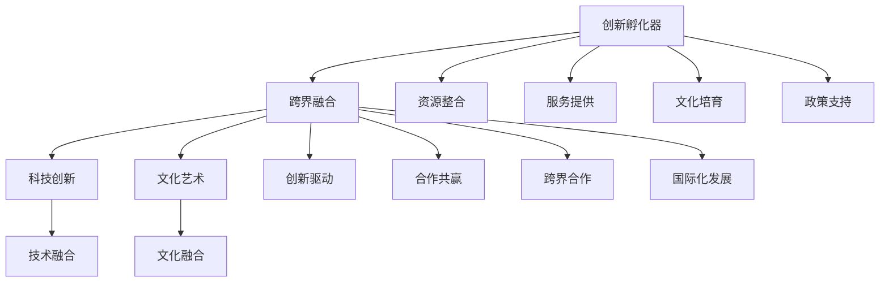

                 

# 人类知识的跨界融合：创新孵化器的作用

## 关键词

- 创新孵化器
- 跨界融合
- 科技创新
- 文化艺术融合
- 创新生态系统
- 平台化理论
- 知识融合理论
- 数字化转型
- 国际化发展

## 摘要

在当今快速变化的世界中，创新已成为推动社会进步和经济发展的核心动力。本文探讨了人类知识的跨界融合现象，并分析了创新孵化器在促进这种跨界融合中的作用。文章首先概述了创新孵化器的概念、历史演变及其在推动科技进步、社会经济发展和促进跨界融合中的价值。接着，深入阐述了跨界融合的定义、内涵、理论基础和实现机制。通过科技创新领域和文化艺术领域的案例解析，展示了跨界融合的实践成果。随后，探讨了创新孵化器在跨界融合中的角色与功能，以及其在战略规划、运营管理和政策支持方面的策略与方法。最后，分析了创新孵化器在跨界融合中面临的挑战和未来发展趋势，提出了加强跨界合作、提高服务能力、拓展国际化发展空间的策略。本文旨在为理解和推动人类知识的跨界融合提供理论依据和实践指导。

### 第一部分：引言

#### 第1章：创新孵化器的概述

## 第1章：创新孵化器概述

### 1.1 创新孵化器的概念与历史演变

#### 1.1.1 创新孵化器的定义

创新孵化器，又称为创业孵化器，是一种旨在支持新兴企业和初创企业成长的组织或机构。它提供一系列的服务和资源，如办公空间、资金、技术支持、咨询服务等，以帮助企业快速成长并成功进入市场。创新孵化器不仅关注企业的短期生存，更注重其长期发展和创新能力。

创新孵化器最早起源于20世纪中叶的美国。1959年，美国斯坦福国际研究所（SRI International）成立了斯坦福创业孵化器，这是全球第一家创新孵化器。此后，创新孵化器逐渐在全球范围内发展起来。随着科技创新的加速和创业潮的兴起，创新孵化器在各个国家和地区得到了广泛应用。

#### 1.1.2 创新孵化器的发展历程

1. **起步阶段（1959-1980年代）**：创新孵化器最初主要集中在高科技领域，为科技型初创企业提供支持。这一阶段，创新孵化器的主要形式是大学科技园和企业孵化器。

2. **发展阶段（1980年代-2000年代）**：随着信息技术的快速发展，创新孵化器逐渐扩展到各个行业，如生物技术、新材料、文化创意等。这一阶段，创新孵化器开始采用多元化的运营模式，如政府主导型、企业主导型、非营利组织主导型等。

3. **成熟阶段（2000年代至今）**：全球创新创业浪潮的兴起，使得创新孵化器成为推动经济发展的重要力量。创新孵化器不仅在国内发展迅速，也开始在全球范围内形成网络。同时，创新孵化器开始注重跨界融合，推动多领域的创新发展。

### 1.2 创新孵化器的作用与价值

#### 1.2.1 创新孵化器在推动科技进步中的作用

创新孵化器在推动科技进步方面发挥了重要作用。首先，它为科技型初创企业提供了良好的发展环境，使得企业能够专注于技术研发。其次，创新孵化器通过提供资金、技术支持、咨询服务等资源，帮助企业解决技术难题，提高研发效率。此外，创新孵化器还通过搭建合作平台，促进企业之间的技术交流与合作，推动科技成果的转化和应用。

#### 1.2.2 创新孵化器在社会经济发展中的价值

创新孵化器对社会经济发展具有重要意义。首先，它促进了创新创业的活跃度，带动了就业增长和人才培养。其次，创新孵化器推动了新兴产业的发展，促进了经济结构的优化和升级。此外，创新孵化器还通过吸引投资，提高了市场的投资效率，促进了资本市场的繁荣。

#### 1.2.3 创新孵化器在促进跨界融合中的关键角色

创新孵化器在促进跨界融合中发挥着关键作用。首先，它通过整合不同领域的资源和信息，搭建跨界融合的平台，促进不同领域之间的交流与合作。其次，创新孵化器通过提供多元化的服务和支持，帮助企业跨越技术、市场、人才等方面的壁垒，实现跨界发展。此外，创新孵化器还通过推动创新文化的培育，激发创新者的创造力，促进跨界融合的深化。

### 1.3 创新孵化器的主要类型

创新孵化器根据运营主体、目标领域和运营模式的不同，可以分为以下几种类型：

1. **大学科技园**：以大学为依托，结合大学科研优势和创业教育，为科技型初创企业提供研发、孵化、转化等服务。

2. **企业孵化器**：由企业主导建立，为企业提供技术研发、市场推广、投融资等服务，推动企业创新发展。

3. **政府主导型孵化器**：由政府投资或支持，旨在推动区域经济发展和产业升级，为初创企业提供政策、资金、资源等多方面的支持。

4. **非营利组织主导型孵化器**：以社会公益为目的，为初创企业提供创业指导、技术支持、资源对接等服务，推动创新创业生态的健康发展。

5. **混合型孵化器**：结合不同类型的孵化器特点，提供多元化服务，满足不同企业的需求。

#### 1.4 创新孵化器的核心功能

创新孵化器的主要功能包括：

1. **创业孵化功能**：为初创企业提供办公空间、资金支持、技术研发等孵化服务，帮助企业快速成长。

2. **技术转移功能**：促进高校、科研机构的科技成果向企业转移，推动技术创新和产业升级。

3. **产业协同功能**：搭建企业之间的合作平台，促进产业协同创新，推动产业链的优化和升级。

4. **创新服务功能**：提供创新创业培训、咨询服务、投融资对接等一站式服务，帮助企业解决发展难题。

### 1.5 创新孵化器的发展趋势

随着全球创新创业环境的不断优化，创新孵化器的发展呈现出以下趋势：

1. **数字化转型**：利用大数据、人工智能等新技术，提升孵化器的运营效率和服务水平。

2. **国际化发展**：加强国际间的合作与交流，推动孵化器的国际化发展，提升全球竞争力。

3. **平台化运营**：构建跨界融合的创新平台，提供多元化、定制化的服务，满足不同企业的需求。

4. **专业化服务**：聚焦特定行业或领域，提供专业化、精细化的孵化服务，提升孵化效果。

5. **生态化建设**：搭建创新创业生态系统，促进企业、高校、科研机构、投资机构等多方合作，共同推动创新和发展。

### 1.6 创新孵化器的成功要素

要实现创新孵化器的成功，需要以下几个关键要素：

1. **政策支持**：政府政策的支持是创新孵化器发展的重要保障，包括资金支持、税收优惠、创业培训等。

2. **资源整合**：整合各类资源，如资金、技术、人才、市场等，为创业企业提供全面支持。

3. **服务能力**：提供高质量的服务，包括创业指导、技术咨询、市场推广等，帮助企业解决实际问题。

4. **创新文化**：培育创新文化，激发创业者的创新精神，营造良好的创新创业氛围。

5. **合作网络**：搭建广泛的合作网络，促进企业之间的交流与合作，实现资源共享和优势互补。

### 1.7 创新孵化器面临的挑战与应对策略

创新孵化器在发展过程中面临诸多挑战，如资金短缺、人才短缺、市场竞争等。针对这些挑战，创新孵化器可以采取以下应对策略：

1. **多元化融资渠道**：拓宽融资渠道，吸引政府资金、社会资本、外资等，解决资金问题。

2. **专业化团队**：引进高水平的专业团队，提高孵化器的服务能力。

3. **加强品牌建设**：打造具有影响力的品牌，提升孵化器的知名度和竞争力。

4. **创新服务模式**：不断探索创新服务模式，满足不同企业的需求。

5. **国际合作**：加强国际合作，学习借鉴国际先进经验，提升孵化器的发展水平。

### 1.8 创新孵化器的成功案例

全球范围内，许多创新孵化器取得了显著的成功，成为推动当地创新创业的重要力量。以下是一些成功的创新孵化器案例：

1. **斯坦福国际创业孵化器（SIIE）**：位于美国加州斯坦福大学附近，为全球创业者提供全方位的支持，成功孵化了众多知名企业，如谷歌、雅虎等。

2. **微软创投加速器**：位于中国北京、上海、深圳等地，为科技初创企业提供资金、技术、市场等全方位支持，推动创新创业生态的发展。

3. **启迪之星**：作为中国领先的创业孵化器，启迪之星成功孵化了众多知名企业，如美团、滴滴出行等，为区域经济发展做出了重要贡献。

4. **Techstars**：全球知名的创业孵化器，成功孵化了众多明星企业，如推特、umbles等，为全球创新创业生态的发展做出了重要贡献。

### 1.9 创新孵化器的发展前景

随着全球创新创业环境的不断优化，创新孵化器的发展前景广阔。未来，创新孵化器将在以下几个方面取得突破：

1. **数字化转型**：通过引入新技术，提升孵化器的运营效率和服务水平，实现数字化转型。

2. **国际化发展**：加强国际合作，推动孵化器的国际化发展，提升全球竞争力。

3. **专业化服务**：聚焦特定行业或领域，提供专业化、精细化的孵化服务，满足不同企业的需求。

4. **生态化建设**：搭建创新创业生态系统，促进企业、高校、科研机构、投资机构等多方合作，共同推动创新和发展。

5. **政策支持**：政府将进一步加大对创新孵化器的支持力度，为孵化器的发展创造良好的政策环境。

总之，创新孵化器在推动科技创新、促进经济发展和推动跨界融合中发挥着重要作用。未来，随着全球创新创业环境的不断优化，创新孵化器的发展前景将更加美好。

---

接下来，我们将深入探讨跨界融合的概念与机制。

## 第2章：跨界融合的概念与机制

### 2.1 跨界融合的定义与内涵

#### 2.1.1 跨界融合的概念阐释

跨界融合，是指不同领域、不同行业之间的知识、技术、资源、理念等的相互交流、融合和创新，从而形成新的产业形态、商业模式和经济增长点。跨界融合打破了传统行业之间的边界，促进了创新和发展的多样化。

#### 2.1.2 跨界融合的主要特征

1. **跨领域性**：跨界融合涉及多个领域，如科技、文化、艺术、金融等，不同领域的知识和资源相互交融。

2. **多样性**：跨界融合的参与者多样化，包括企业、政府、高校、研究机构、创业者等。

3. **创新性**：跨界融合通过整合不同领域的知识和技术，推动创新，创造新的商业模式和产品。

4. **动态性**：跨界融合是一个动态发展的过程，随着新技术、新理念的出现，跨界融合不断深化和拓展。

5. **协同性**：跨界融合强调多方协同合作，通过资源共享、优势互补，实现协同发展。

### 2.2 跨界融合的理论基础

#### 2.2.1 创新生态系统理论

创新生态系统理论认为，创新是一个复杂的生态系统，包括企业、政府、科研机构、投资机构、创业者等多方参与者和多种资源。跨界融合是创新生态系统中的一个重要环节，通过跨界合作，实现创新资源的优化配置和协同创新。

#### 2.2.2 平台化理论

平台化理论认为，平台是一种重要的商业模式，通过提供基础设施和服务，连接供需双方，实现资源的高效配置。跨界融合中的平台化运营，通过搭建跨界融合的平台，促进不同领域之间的交流和合作，推动创新和发展。

#### 2.2.3 知识融合理论

知识融合理论认为，知识是创新的核心驱动力，跨界融合通过整合不同领域的知识，实现知识的创新和增值。知识融合理论为跨界融合提供了理论依据，指导跨界融合的实践。

### 2.3 跨界融合的驱动因素

#### 2.3.1 技术进步

技术的进步是跨界融合的重要驱动因素。随着互联网、大数据、人工智能等新技术的快速发展，不同领域之间的技术壁垒逐渐降低，为跨界融合提供了技术基础。

#### 2.3.2 市场需求

市场的需求变化也是跨界融合的重要驱动因素。随着消费者需求的多样化和个性化，传统行业需要通过跨界融合，提供更丰富、更有针对性的产品和服务。

#### 2.3.3 政策支持

政府的政策支持对跨界融合具有重要的推动作用。政府通过出台相关政策，提供资金、土地、税收等方面的支持，为跨界融合创造良好的环境。

#### 2.3.4 企业战略

企业战略是跨界融合的内在动力。企业通过跨界融合，拓展新的业务领域，实现多元化发展，提高市场竞争力和盈利能力。

#### 2.3.5 社会发展趋势

社会发展趋势，如人口老龄化、城市化进程、消费升级等，也对跨界融合产生了重要影响。这些趋势促使不同领域之间的融合，推动创新和发展的多元化。

### 2.4 跨界融合的实现路径

#### 2.4.1 平台化路径

平台化路径是通过搭建跨界融合的平台，促进不同领域之间的交流和合作。平台可以是一个物理空间，如创业孵化器、创新园区等，也可以是一个虚拟空间，如在线平台、社区等。

#### 2.4.2 产业链路径

产业链路径是通过整合产业链上下游的企业和资源，实现跨界融合。产业链上的企业可以通过合作，实现资源的共享和优势互补，推动创新和发展。

#### 2.4.3 项目合作路径

项目合作路径是通过具体的合作项目，实现不同领域之间的融合。项目合作可以是一个短期合作，也可以是一个长期合作，通过项目的实施，积累跨界融合的经验和资源。

#### 2.4.4 创新合作路径

创新合作路径是通过建立创新联合体，实现不同领域之间的创新合作。创新联合体可以是一个松散的合作组织，也可以是一个紧密的合作实体，通过共同研发、共同推广，实现创新和发展的目标。

### 2.5 跨界融合的挑战与应对策略

#### 2.5.1 挑战

跨界融合在带来机遇的同时，也面临诸多挑战。主要的挑战包括：

1. **技术障碍**：不同领域的技术差异，导致跨界融合的技术障碍。

2. **组织壁垒**：不同领域的企业和组织，存在组织文化和运营模式的差异，导致跨界融合的困难。

3. **利益冲突**：跨界融合涉及多方利益，如何平衡各方利益，是跨界融合面临的重要挑战。

4. **风险控制**：跨界融合中的风险较大，如何有效控制风险，是跨界融合需要解决的问题。

#### 2.5.2 应对策略

针对跨界融合的挑战，可以采取以下应对策略：

1. **技术融合**：通过技术创新，降低跨界融合的技术障碍。

2. **文化融合**：通过建立共同的文化价值观，促进跨界融合的组织文化融合。

3. **利益协调**：通过制定公平合理的利益分配机制，平衡各方利益。

4. **风险控制**：通过建立风险预警和应对机制，有效控制跨界融合中的风险。

### 2.6 跨界融合的案例分析

#### 2.6.1 科技创新领域的跨界融合

科技创新领域的跨界融合，是跨界融合的一个重要方面。以下是一些典型的案例：

1. **人工智能与医疗健康**：人工智能技术在医疗健康领域的应用，如智能诊断、精准治疗、健康管理等，推动了医疗健康的创新发展。

2. **物联网与智能交通**：物联网技术的应用，如智能交通系统、车联网等，提高了交通运输的效率和安全性。

3. **大数据与金融**：大数据技术在金融领域的应用，如风险控制、投资决策、客户服务等，提高了金融行业的效率和竞争力。

#### 2.6.2 文化艺术领域的跨界融合

文化艺术领域的跨界融合，丰富了文化艺术的内涵，推动了文化艺术的创新发展。以下是一些典型的案例：

1. **数字艺术与虚拟现实**：数字艺术和虚拟现实技术的结合，如虚拟展览、虚拟演出等，为观众带来了全新的艺术体验。

2. **文学与电影**：文学和电影的跨界融合，如改编电影、文学改编等，丰富了文化艺术的内涵，吸引了更多观众。

3. **音乐与科技**：音乐和科技的结合，如智能音响、音乐游戏等，为音乐产业带来了新的发展机遇。

### 2.7 跨界融合的未来发展趋势

#### 2.7.1 跨界融合的深化与拓展

随着技术的进步和市场的需求变化，跨界融合将不断深化和拓展。未来，跨界融合将涉及更多的领域和行业，如教育、环保、农业等，推动各领域的创新发展。

#### 2.7.2 跨界融合的数字化转型

数字化技术的发展，将推动跨界融合的数字化转型。未来，跨界融合将更加依赖于数字化平台和工具，实现跨界合作的高效和精准。

#### 2.7.3 跨界融合的国际化发展

全球化的发展，将推动跨界融合的国际化发展。未来，跨界融合将更加注重国际间的合作与交流，实现全球资源的优化配置。

#### 2.7.4 跨界融合的生态化建设

跨界融合的生态化建设，将推动跨界融合的可持续发展。未来，跨界融合将更加注重生态系统的构建，实现跨界融合的良性循环。

### 2.8 跨界融合的意义与价值

跨界融合对于社会经济发展具有重要意义。首先，跨界融合推动了创新和发展，促进了经济的转型升级。其次，跨界融合丰富了产业的内涵，提高了产业的竞争力。此外，跨界融合还促进了各领域的交流与合作，推动了社会的和谐发展。

总之，跨界融合是创新和发展的新动力，对于推动社会经济发展和促进跨界融合具有重要的理论和实践价值。未来，随着技术的进步和市场的需求变化，跨界融合将不断深化和拓展，为人类社会的进步和发展带来更多机遇和挑战。

---

接下来，我们将通过具体的案例来探讨跨界融合在科技创新和文化艺术领域的应用。

## 第3章：科技创新领域的跨界融合

### 3.1 科技创新与跨界融合

科技创新是推动社会进步和经济发展的关键驱动力。在当今快速变化的世界，科技创新不仅局限于单一领域，而是通过跨界融合，跨越不同领域的界限，实现更广泛、更深层次的发展。跨界融合在科技创新中的应用，使得不同领域的知识、技术、资源得以有效整合，激发了创新活力，推动了新兴产业的崛起。

#### 3.1.1 科技创新的重要性

科技创新是现代社会的核心竞争力和发展动力。它不仅能够推动经济增长，提高生产效率，还能够解决社会发展中的重大问题，如环境保护、能源危机、疾病治疗等。科技创新的不断发展，使得人类社会从传统的工业时代迈向了信息化、智能化时代。

#### 3.1.2 科技创新中的跨界融合现象

在科技创新的过程中，跨界融合现象日益明显。不同领域的科技相互渗透、融合，形成了新的科技生态系统。例如，人工智能、物联网、大数据、生物技术等新兴科技，不仅在其自身领域内快速发展，还与其他领域的技术相互融合，产生了新的应用场景和商业模式。

### 3.2 案例分析：人工智能与生物技术的融合

人工智能（AI）与生物技术的融合是科技创新领域跨界融合的一个重要案例。人工智能技术在生物技术中的应用，不仅提升了生物技术的研究效率，还推动了生物技术的创新发展。

#### 3.2.1 人工智能在生物技术中的应用

1. **基因测序与分析**：人工智能技术在基因测序数据处理和分析中发挥了重要作用。通过深度学习和大数据分析，人工智能可以快速识别基因序列中的变异，预测基因功能，提高基因测序的准确性和效率。

2. **药物研发**：人工智能在药物研发中具有巨大的潜力。通过模拟生物分子的相互作用，人工智能可以预测药物的有效性和安全性，加速新药的发现和开发。

3. **精准医疗**：人工智能技术的应用，使得精准医疗成为现实。通过分析患者的基因组、病历和生活方式数据，人工智能可以为患者提供个性化的治疗方案，提高治疗效果。

#### 3.2.2 人工智能与生物技术的协同发展

人工智能与生物技术的协同发展，不仅提升了生物技术的创新能力，还推动了生物技术的广泛应用。在医疗领域，人工智能与生物技术的融合，使得医疗诊断和治疗更加精准和高效。在农业领域，人工智能与生物技术的融合，提高了农作物的产量和质量，推动了农业现代化。在环境保护领域，人工智能与生物技术的融合，有助于监测和治理环境污染，保护生态环境。

### 3.3 案例分析：物联网与智能制造的融合

物联网（IoT）与智能制造的融合是另一个典型的跨界融合案例。物联网技术通过连接物理设备和系统，实现了数据的实时采集和传输，为智能制造提供了数据基础。

#### 3.3.1 物联网在智能制造中的作用

1. **设备监控与维护**：物联网技术可以实时监控设备的状态和运行数据，及时发现和预警设备故障，降低设备故障率和停机时间。

2. **生产过程优化**：通过物联网技术，可以实时采集生产过程中的数据，如生产速度、产品质量等，实现生产过程的实时监控和优化。

3. **供应链管理**：物联网技术可以实时追踪产品从生产到销售的整个过程，实现供应链的全程监控和管理，提高供应链的效率和透明度。

#### 3.3.2 物联网与智能制造的融合发展趋势

物联网与智能制造的融合，使得智能制造更加智能化和高效化。未来，物联网技术将进一步提升智能制造的水平，实现以下发展趋势：

1. **智能工厂**：通过物联网技术，实现工厂设备的全面联网和智能化，实现生产过程的自动化和智能化。

2. **工业互联网**：通过构建工业互联网平台，实现不同企业之间的数据共享和协同，推动智能制造的生态化发展。

3. **个性化定制**：通过物联网技术和大数据分析，实现生产线的灵活调整，满足客户个性化定制需求。

### 3.4 案例分析：人工智能与能源领域的融合

人工智能技术在能源领域的应用，不仅提升了能源利用效率，还推动了能源产业的创新发展。以下是一个具体案例：

#### 3.4.1 案例简介

某能源公司利用人工智能技术，优化能源管理，提高能源利用效率。通过部署智能传感器和物联网设备，实时监测能源消耗情况，利用人工智能算法，分析和预测能源需求，优化能源供应方案。

#### 3.4.2 应用效果

1. **能源消耗降低**：通过实时监测和优化能源供应，能源公司的能源消耗降低了15%，能源成本显著降低。

2. **设备维护优化**：人工智能技术帮助能源公司实现了设备预防性维护，降低了设备故障率，延长了设备使用寿命。

3. **环境效益提升**：通过优化能源管理，能源公司减少了碳排放，对环境产生了积极影响。

### 3.5 科技创新领域跨界融合的启示

科技创新领域的跨界融合，为我们提供了以下启示：

1. **跨学科合作**：科技创新需要跨学科的合作，通过整合不同领域的知识和技术，实现创新突破。

2. **数据驱动**：数据是跨界融合的重要驱动力，通过大数据分析和人工智能技术，可以优化资源配置，提升创新效率。

3. **平台化发展**：构建跨界融合的平台，促进不同领域之间的交流和合作，推动创新资源的共享和协同。

4. **政策支持**：政府应加大对科技创新和跨界融合的支持力度，提供资金、技术、人才等方面的支持，创造良好的创新环境。

总之，科技创新领域的跨界融合，为推动社会进步和经济发展提供了新动力。通过跨学科合作、数据驱动、平台化发展和政策支持，我们可以进一步深化科技创新领域的跨界融合，实现更广泛的创新和发展。

### 3.6 跨界融合在科技创新领域的发展趋势

未来，跨界融合在科技创新领域将继续深化和发展，呈现出以下趋势：

1. **多元化融合**：科技创新将涉及更多领域，如新能源、新材料、环保等，跨界融合将更加多元化。

2. **智能化发展**：人工智能、大数据、物联网等新技术将在更多领域得到应用，推动科技创新的智能化发展。

3. **生态化建设**：科技创新将更加注重生态系统的建设，通过跨界合作，实现创新资源的共享和协同。

4. **全球化布局**：随着全球化的深入发展，跨界融合将呈现全球化布局，推动全球科技创新的发展。

5. **政策引导**：政府将进一步加大对科技创新和跨界融合的政策支持，推动科技创新领域的跨界融合。

总之，跨界融合在科技创新领域具有广阔的发展前景，将为人类社会带来更多创新成果和发展机遇。

---

接下来，我们将探讨跨界融合在文化艺术领域的应用。

## 第4章：文化艺术领域的跨界融合

### 4.1 文化艺术与跨界融合

文化艺术领域一直以来都是人类精神文明的结晶，随着科技的进步和社会的发展，文化艺术与跨界融合的现象日益显著。跨界融合为文化艺术带来了新的发展机遇，推动了文化艺术的创新和传播。

#### 4.1.1 文化艺术跨界融合的现象与意义

文化艺术跨界融合的现象体现在多个方面：

1. **数字艺术与虚拟现实的融合**：数字艺术和虚拟现实技术的结合，为艺术家提供了全新的创作手段和表现形式，使得艺术作品可以更加立体、互动和沉浸。

2. **文学与影视、音乐等领域的融合**：文学作品被改编成电影、电视剧、音乐剧等形式，使得文学作品的影响力得到进一步提升，吸引了更多的受众。

3. **跨文化合作**：不同文化背景的艺术家和机构之间的合作，通过相互学习和借鉴，丰富了文化艺术的内涵和表现形式。

4. **科技与艺术的结合**：科技与艺术的结合，如人工智能在艺术创作中的应用，为艺术家提供了新的创作工具和灵感来源。

文化艺术跨界融合的意义主要体现在以下几个方面：

1. **创新与发展**：跨界融合为文化艺术带来了新的创作思路和表现形式，推动了文化艺术的创新和发展。

2. **跨界传播**：跨界融合使得文化艺术作品能够以更加多样化的形式传播，扩大了文化艺术的受众群体。

3. **文化交流**：跨界融合促进了不同文化之间的交流与互动，丰富了全球文化艺术的多样性。

#### 4.1.2 文化艺术跨界融合的挑战与机遇

文化艺术跨界融合虽然带来了诸多机遇，但同时也面临一些挑战：

1. **技术门槛**：一些跨界融合技术，如虚拟现实、人工智能等，对艺术家的技术能力提出了较高的要求，需要艺术家不断学习和提升。

2. **创作自由**：跨界融合可能导致艺术家在创作过程中受到技术或商业利益的限制，影响创作的自由度。

3. **版权保护**：跨界融合带来的作品形式多样，如何保护原创作品的版权成为一个新的挑战。

然而，挑战中也蕴藏着机遇：

1. **跨界合作**：跨界融合为艺术家和机构提供了更多的合作机会，通过合作，可以共享资源，实现优势互补。

2. **创新市场**：跨界融合带来了新的艺术形式和市场，为文化艺术产业的发展提供了新的动力。

3. **人才培养**：跨界融合需要跨学科的人才，这为艺术教育提供了新的发展方向，培养了更多具备跨界能力的人才。

### 4.2 案例分析：数字艺术与虚拟现实的融合

数字艺术与虚拟现实的融合是文化艺术领域跨界融合的一个重要案例。以下是一个具体案例：

#### 4.2.1 案例简介

某数字艺术家通过虚拟现实技术创作了一部数字艺术作品，名为《梦幻花园》。这部作品通过虚拟现实头盔，让观众进入一个三维的梦幻花园，可以自由漫步、与虚拟角色互动。

#### 4.2.2 应用效果

1. **沉浸式体验**：观众通过虚拟现实头盔，可以身临其境地体验艺术作品，感受到前所未有的沉浸式体验。

2. **互动性**：虚拟现实技术使得观众可以与艺术作品进行互动，增强了作品的趣味性和参与感。

3. **艺术传播**：通过虚拟现实技术，艺术作品可以跨越时空和地域的限制，吸引更多的观众，扩大艺术作品的影响力。

#### 4.2.3 案例分析

《梦幻花园》的成功表明，数字艺术与虚拟现实的融合具有巨大的潜力。虚拟现实技术为艺术家提供了新的创作工具和表现形式，使得艺术作品更加生动、互动和沉浸。同时，虚拟现实技术也为观众带来了全新的艺术体验，使得文化艺术能够以更加多样化的形式传播。

### 4.3 案例分析：文学与电影的跨界融合

文学与电影的跨界融合是文化艺术领域跨界融合的另一个重要案例。以下是一个具体案例：

#### 4.3.1 案例简介

某知名小说《了不起的盖茨比》被改编成同名电影，由著名导演执导，知名演员出演。这部电影在保留了小说原貌的基础上，通过影像化的手段，将小说中的情节和人物形象生动地呈现在观众面前。

#### 4.3.2 应用效果

1. **文学作品的推广**：电影的成功改编，使得小说《了不起的盖茨比》的影响力得到了进一步提升，吸引了更多的读者。

2. **观众参与感**：通过电影，观众可以更加直观地感受到小说中的情节和人物形象，增强了观众的参与感。

3. **艺术形式的创新**：文学与电影的跨界融合，为艺术形式的创新提供了新的思路，丰富了文化艺术的内涵。

#### 4.3.3 案例分析

《了不起的盖茨比》的成功改编表明，文学与电影的跨界融合具有巨大的潜力。电影作为视觉艺术的代表，通过影像化的手段，将文学作品的情节和人物形象生动地呈现在观众面前，使得文学作品能够以更加直观、生动的方式传播。同时，文学与电影的跨界融合也为文化艺术的创新和发展提供了新的动力。

### 4.4 案例分析：文学与游戏的跨界融合

文学与游戏的跨界融合是文化艺术领域跨界融合的又一个重要案例。以下是一个具体案例：

#### 4.4.1 案例简介

某知名小说《魔兽世界》被改编成同名网络游戏，吸引了大量玩家。这款游戏在保留了小说原貌的基础上，通过游戏化的手段，将小说中的情节和角色融入到游戏中。

#### 4.4.2 应用效果

1. **文学作品的创新传播**：游戏作为新兴的媒介，为文学作品的传播提供了新的途径，使得文学作品能够以更加多样化的形式传播。

2. **游戏体验的丰富**：通过文学作品的融入，游戏的故事情节和角色设定更加丰富，提升了游戏的趣味性和沉浸感。

3. **艺术形式的融合**：文学与游戏的跨界融合，为艺术形式的融合提供了新的思路，丰富了文化艺术的内涵。

#### 4.4.3 案例分析

《魔兽世界》的成功改编表明，文学与游戏的跨界融合具有巨大的潜力。游戏作为互动性的艺术形式，通过将文学作品中的情节和角色融入到游戏中，使得玩家能够在游戏体验中感受到文学的魅力。同时，文学与游戏的跨界融合也为文化艺术的创新和发展提供了新的动力。

### 4.5 跨界融合在文化艺术领域的启示

跨界融合在文化艺术领域的应用，为我们提供了以下启示：

1. **跨学科合作**：跨界融合需要跨学科的合作，通过整合不同领域的知识和资源，实现艺术创新的突破。

2. **技术创新**：跨界融合为文化艺术提供了新的创作工具和手段，通过技术创新，可以提升艺术作品的品质和影响力。

3. **跨界传播**：跨界融合使得文化艺术作品能够以更加多样化的形式传播，扩大了文化艺术的受众群体。

4. **人才培养**：跨界融合需要跨学科的人才，这为艺术教育提供了新的发展方向，培养了更多具备跨界能力的人才。

总之，跨界融合在文化艺术领域的应用，为文化艺术的发展带来了新的机遇和挑战。通过跨学科合作、技术创新、跨界传播和人才培养，我们可以进一步推动文化艺术领域的跨界融合，实现文化艺术的创新和发展。

### 4.6 文化艺术领域跨界融合的未来发展趋势

未来，文化艺术领域的跨界融合将继续深化和发展，呈现出以下趋势：

1. **多元化融合**：文化艺术将涉及更多领域，如科技、环保、金融等，跨界融合将更加多元化。

2. **智能化发展**：人工智能、大数据等新技术将在文化艺术领域得到广泛应用，推动文化艺术的智能化发展。

3. **生态化建设**：文化艺术将更加注重生态系统的建设，通过跨界合作，实现创新资源的共享和协同。

4. **全球化布局**：随着全球化的深入发展，跨界融合将呈现全球化布局，推动全球文化艺术的交流与发展。

5. **政策引导**：政府将进一步加大对文化艺术和跨界融合的政策支持，提供资金、技术、人才等方面的支持，创造良好的创新环境。

总之，文化艺术领域的跨界融合具有广阔的发展前景，将为文化艺术的发展带来更多创新成果和发展机遇。

---

接下来，我们将探讨创新孵化器在跨界融合中的作用与策略。

## 第5章：创新孵化器在跨界融合中的作用与策略

### 5.1 创新孵化器在跨界融合中的角色

创新孵化器在跨界融合中扮演着多重角色，发挥着关键的作用。以下是创新孵化器在跨界融合中的主要角色：

#### 5.1.1 作为跨界融合的桥梁

创新孵化器作为不同领域之间的桥梁，连接了企业、科研机构、高校、投资者等各方资源，促进了知识、技术、资金的流动。通过搭建跨界融合的平台，创新孵化器为各方提供了交流和合作的机会，打破了传统行业之间的壁垒，促进了创新资源的有效配置。

#### 5.1.2 作为资源配置的关键角色

创新孵化器通过整合各方资源，如资金、技术、人才、市场等，为跨界融合提供了强有力的支持。它不仅能够为初创企业提供必要的资源，还能够通过资源整合，提高资源的使用效率，降低创新成本，加速创新进程。

#### 5.1.3 作为创新文化的培育者

创新孵化器不仅提供物理空间和资源支持，更重要的是培育创新文化。它通过举办创新活动、创业培训、导师指导等方式，激发创业者的创新精神，营造鼓励创新、包容失败的文化氛围，为跨界融合提供了精神动力。

### 5.2 创新孵化器的功能定位

创新孵化器的功能定位决定了其能否在跨界融合中发挥最大作用。以下是创新孵化器的几个主要功能定位：

#### 5.2.1 创业孵化功能

创新孵化器的主要功能是创业孵化，为初创企业提供办公空间、资金支持、技术研发、市场推广、法律咨询、人力资源等一站式服务。通过这些服务，创新孵化器帮助企业克服初创期的各种困难，提高创业成功率。

#### 5.2.2 技术转移功能

创新孵化器在促进科技成果转移转化方面发挥着重要作用。它通过搭建技术转移平台，促进高校、科研机构的科技成果向企业转移，推动技术创新和产业升级。

#### 5.2.3 产业协同功能

创新孵化器通过搭建产业协同平台，促进产业链上下游企业之间的合作，实现资源共享、优势互补，推动产业协同创新。它不仅关注单一企业的成长，还关注整个产业链的协同发展。

#### 5.2.4 创新服务功能

创新孵化器提供多元化的创新服务，如创业辅导、投融资对接、市场推广、知识产权保护等。这些服务帮助企业解决发展过程中的各种问题，提高创新能力，推动跨界融合。

### 5.3 创新孵化器在跨界融合中的策略与方法

为了在跨界融合中发挥更大的作用，创新孵化器需要采取一系列的策略和方法。以下是几个关键策略：

#### 5.3.1 战略规划

创新孵化器需要制定明确的战略规划，明确孵化目标、方向和重点领域。战略规划应考虑市场需求、技术趋势、政策环境等因素，以确保孵化器的发展与跨界融合的需求相匹配。

#### 5.3.2 平台建设

创新孵化器需要搭建跨界融合的平台，提供物理空间和虚拟空间相结合的孵化环境。平台应具备良好的基础设施、技术支持、资源共享等功能，促进各方资源的有效整合。

#### 5.3.3 资源整合

创新孵化器需要通过整合各类资源，如资金、技术、人才、市场等，为跨界融合提供有力支持。它可以通过与政府、企业、高校、研究机构等建立合作关系，实现资源的最优配置。

#### 5.3.4 创新服务

创新孵化器需要提供多元化的创新服务，如创业培训、投融资对接、市场推广、知识产权保护等。这些服务应针对不同企业的需求，提供定制化的解决方案，帮助企业实现跨界融合。

#### 5.3.5 文化培育

创新孵化器需要培育创新文化，营造鼓励创新、包容失败的氛围。它可以通过举办创新活动、创业大赛、研讨会等方式，激发创业者的创新精神，推动跨界融合的深化。

### 5.4 创新孵化器在跨界融合中的成功案例

全球范围内，许多创新孵化器在推动跨界融合方面取得了显著的成功。以下是几个成功的创新孵化器案例：

#### 5.4.1 硅谷银行

硅谷银行作为全球知名的创业孵化器，通过提供资金、技术、市场等支持，成功孵化了众多科技创新企业，如谷歌、苹果等。硅谷银行的成功经验在于其精准的市场定位、强大的资源整合能力和创新文化培育。

#### 5.4.2 硬科技孵化器

硬科技孵化器作为中国领先的科技孵化器，专注于高端智能制造、人工智能等领域。通过搭建跨界融合平台，硬科技孵化器成功推动了多个科技创新项目的落地和发展，为中国的科技创新和产业升级做出了重要贡献。

#### 5.4.3 启迪孵化器

启迪孵化器作为中国最大的科技孵化器，通过整合高校、科研机构、企业等各方资源，成功孵化了众多科技创新企业，如美团、滴滴出行等。启迪孵化器的成功经验在于其强大的资源整合能力和创新服务能力。

### 5.5 创新孵化器在跨界融合中的挑战与应对策略

尽管创新孵化器在跨界融合中发挥着重要作用，但其在发展过程中也面临一些挑战。以下是创新孵化器在跨界融合中可能面临的挑战及其应对策略：

#### 5.5.1 技术风险

技术风险是跨界融合中面临的主要挑战之一。创新孵化器应加强技术研发，提高技术创新能力，同时建立风险预警和应对机制，降低技术风险。

#### 5.5.2 资金短缺

资金短缺是创新孵化器发展过程中普遍面临的问题。创新孵化器可以通过多元化融资渠道，如政府资金、社会资本、风险投资等，解决资金问题。

#### 5.5.3 人才短缺

人才短缺是跨界融合中面临的另一个挑战。创新孵化器应加强人才培养和引进，搭建人才梯队，提高孵化器的服务能力。

#### 5.5.4 管理难题

创新孵化器在发展过程中可能面临管理难题，如组织结构不合理、管理效率低等。创新孵化器应优化组织结构，提高管理效率，确保孵化器的可持续发展。

### 5.6 创新孵化器在跨界融合中的未来发展

随着全球科技创新的加速和跨界融合的深化，创新孵化器在跨界融合中的未来发展前景广阔。以下是创新孵化器在未来可能的发展趋势：

#### 5.6.1 数字化转型

数字化转型是创新孵化器未来发展的关键方向。通过引入大数据、人工智能等新技术，创新孵化器可以提升孵化效率和服务质量，实现数字化转型。

#### 5.6.2 国际化发展

国际化发展是创新孵化器未来发展的另一个重要方向。通过加强国际合作，创新孵化器可以拓展全球市场，提升国际竞争力。

#### 5.6.3 生态化建设

生态化建设是创新孵化器未来发展的一个重要趋势。通过搭建跨界融合的生态体系，创新孵化器可以促进多方合作，实现创新资源的共享和协同。

#### 5.6.4 专业化服务

专业化服务是创新孵化器未来发展的一个重要方向。通过聚焦特定领域，提供专业化、精细化的孵化服务，创新孵化器可以提升孵化效果，为企业的创新发展提供有力支持。

总之，创新孵化器在跨界融合中发挥着关键作用。通过战略规划、平台建设、资源整合、创新服务和文化培育，创新孵化器可以更好地推动跨界融合，实现创新和发展的目标。

---

### 5.7 创新孵化器在跨界融合中的战略规划

创新孵化器要在跨界融合中发挥最大的作用，需要制定明确的战略规划。以下是创新孵化器在战略规划过程中需要考虑的关键要素：

#### 5.7.1 明确孵化目标与方向

创新孵化器首先需要明确自身的孵化目标和发展方向。孵化目标可以是推动科技创新、促进产业升级、培育新兴产业等。明确目标有助于孵化器聚焦资源，制定具体的孵化计划。

#### 5.7.2 构建跨界融合的平台体系

创新孵化器需要搭建跨界融合的平台，为不同领域的创业者提供交流和合作的机会。平台体系可以包括物理空间（如孵化器场地）、虚拟空间（如在线平台、社交网络）和综合服务体系（如创业辅导、投融资对接、市场推广等）。通过多元化平台的建设，孵化器可以促进资源整合和知识共享。

#### 5.7.3 优化孵化资源配置

创新孵化器需要优化资源配置，确保资源的有效利用。这包括资金、技术、人才、市场等各方面的资源。孵化器可以通过与政府、企业、高校、研究机构等建立合作关系，实现资源共享和优势互补。

#### 5.7.4 创新服务模式的探索

创新孵化器需要不断探索创新服务模式，以满足不同企业的需求。这可以包括个性化服务、定制化服务、一站式服务等。通过创新服务模式，孵化器可以提升孵化效果，提高企业的成功率。

#### 5.7.5 培育创新文化

创新孵化器需要培育创新文化，营造鼓励创新、包容失败的氛围。这可以通过举办创新活动、创业培训、研讨会等方式实现。创新文化可以激发创业者的创新精神，推动跨界融合的深化。

### 5.8 创新孵化器在跨界融合中的运营管理

创新孵化器在跨界融合中的运营管理至关重要，以下是几个关键方面：

#### 5.8.1 创业企业的筛选与孵化

创新孵化器需要建立科学的创业企业筛选机制，筛选出具有潜力的高质量企业进行孵化。筛选标准可以包括技术创新能力、市场前景、团队素质等。在孵化过程中，孵化器需要提供全方位的支持，包括技术研发、市场推广、融资对接等。

#### 5.8.2 创业企业的辅导与支持

创新孵化器需要为创业企业提供专业的辅导和支持，帮助他们解决在创业过程中遇到的问题。这可以包括业务咨询、法律支持、财务规划、市场营销等。通过辅导和支持，孵化器可以提升企业的成长速度和成功率。

#### 5.8.3 创新生态系统的构建与维护

创新孵化器需要构建和维护创新生态系统，促进企业、高校、科研机构、投资机构等各方资源的有效整合。通过搭建合作平台，孵化器可以推动多方合作，实现协同创新。

#### 5.8.4 数据分析与决策支持

创新孵化器可以通过数据分析和决策支持，提高运营效率和决策质量。这可以包括市场趋势分析、企业绩效评估、资金使用情况等。通过数据分析，孵化器可以优化资源配置，提升孵化效果。

### 5.9 创新孵化器在跨界融合中的政策支持

政策支持是创新孵化器在跨界融合中发展的重要保障。以下是几个方面的政策支持：

#### 5.9.1 资金支持

政府可以通过设立专项资金，为创新孵化器提供资金支持，缓解孵化器的资金压力。这可以包括孵化器的建设资金、运营资金、项目资金等。

#### 5.9.2 税收优惠

政府可以出台税收优惠政策，降低创新孵化器的税收负担，提高孵化器的盈利能力。这可以包括减免企业所得税、增值税等。

#### 5.9.3 土地与空间支持

政府可以提供土地或空间支持，为创新孵化器提供办公场所，降低孵化器的运营成本。这可以包括孵化器的建设用地、租赁补贴等。

#### 5.9.4 人才政策

政府可以出台人才政策，为创新孵化器引进和培养高层次人才提供支持。这可以包括人才引进补贴、住房支持、科研经费等。

#### 5.9.5 政策环境优化

政府可以通过优化政策环境，为创新孵化器提供更加便捷的创业环境。这可以包括简化审批流程、提高政务服务效率、保护知识产权等。

### 5.10 创新孵化器在跨界融合中的成功策略

以下是创新孵化器在跨界融合中的几个成功策略：

#### 5.10.1 多元化融资

创新孵化器可以通过多元化融资渠道，如政府资金、社会资本、风险投资等，解决资金问题，提高孵化器的资金实力。

#### 5.10.2 专业化服务

创新孵化器可以通过专业化服务，提升孵化效果，提高企业的成功率。这可以包括提供专业化的创业辅导、技术支持、市场推广等。

#### 5.10.3 跨界合作

创新孵化器可以通过跨界合作，促进多方资源的整合和协同。这可以包括与高校、科研机构、企业等建立合作关系，推动技术创新和产业升级。

#### 5.10.4 创新文化培育

创新孵化器可以通过培育创新文化，营造鼓励创新、包容失败的氛围，激发创业者的创新精神。

#### 5.10.5 国际化发展

创新孵化器可以通过国际化发展，拓展全球市场，提升国际竞争力。这可以包括与国际孵化器合作、引进国际先进经验等。

总之，创新孵化器在跨界融合中具有重要作用。通过战略规划、运营管理、政策支持和成功策略，创新孵化器可以更好地推动跨界融合，实现创新和发展的目标。

### 5.11 创新孵化器在跨界融合中的挑战与未来展望

尽管创新孵化器在跨界融合中发挥了重要作用，但其在发展过程中也面临诸多挑战。以下是创新孵化器在跨界融合中可能面临的挑战及其应对策略：

#### 5.11.1 挑战

1. **技术风险**：跨界融合往往涉及新技术，技术风险较高。创新孵化器需要加强技术研发，降低技术风险。

2. **资金短缺**：创新孵化器在发展过程中可能面临资金短缺的问题，需要通过多元化融资渠道解决资金问题。

3. **人才短缺**：跨界融合需要跨学科的人才，创新孵化器需要加强人才培养和引进，搭建人才梯队。

4. **管理难题**：创新孵化器在运营过程中可能面临管理难题，如组织结构不合理、管理效率低等。

5. **市场风险**：跨界融合的企业在市场中可能面临不确定性和竞争压力，创新孵化器需要提供市场支持和风险预警。

#### 5.11.2 应对策略

1. **加强技术研发**：创新孵化器可以通过建立研发中心、引进高端技术人才等方式，加强技术研发，降低技术风险。

2. **多元化融资**：创新孵化器可以通过政府资金、社会资本、风险投资等多种融资渠道，解决资金问题，提高孵化器的资金实力。

3. **人才培养和引进**：创新孵化器可以通过设立奖学金、提供培训机会、引进海外高层次人才等方式，加强人才培养和引进，搭建人才梯队。

4. **优化管理结构**：创新孵化器可以通过建立科学的组织结构、提高管理效率等方式，解决管理难题，确保孵化器的可持续发展。

5. **市场支持和风险预警**：创新孵化器可以通过提供市场咨询、风险预警等服务，帮助企业应对市场风险，提高市场竞争力。

#### 5.11.3 未来展望

未来，创新孵化器在跨界融合中将面临更加广阔的发展前景。以下是创新孵化器在未来可能的发展趋势：

1. **数字化转型**：随着数字化技术的发展，创新孵化器将更加注重数字化转型，提升孵化效率和服务质量。

2. **国际化发展**：全球化的背景下，创新孵化器将更加注重国际化发展，通过国际合作，拓展全球市场，提升国际竞争力。

3. **生态化建设**：创新孵化器将更加注重生态系统的建设，通过跨界合作，促进多方资源的整合和协同，实现创新生态的可持续发展。

4. **专业化服务**：创新孵化器将更加注重专业化服务，通过提供专业化、精细化的孵化服务，提升孵化效果，提高企业的成功率。

5. **政策支持**：政府将进一步加大对创新孵化器的支持力度，通过政策优惠、资金扶持等方式，为创新孵化器的发展提供有力支持。

总之，创新孵化器在跨界融合中的挑战与机遇并存。通过应对挑战和把握机遇，创新孵化器可以更好地推动跨界融合，实现创新和发展的目标。

---

### 5.12 创新孵化器在跨界融合中的成功策略与实践

创新孵化器在跨界融合中发挥着关键作用，其成功策略和实践对于推动创新和发展具有重要意义。以下是创新孵化器在跨界融合中的几个成功策略和实践：

#### 5.12.1 跨界合作

创新孵化器通过跨界合作，整合不同领域的资源和优势，推动创新和产业发展。跨界合作可以包括政府、企业、高校、科研机构、投资机构等。以下是一个具体案例：

**案例：清华大学启迪创新孵化器**

清华大学启迪创新孵化器通过与政府、企业、高校等多方合作，构建了一个多元化的创新生态系统。孵化器与政府部门合作，获得了政策支持和资金扶持。与知名企业合作，实现了技术研发和市场推广的协同。与高校和科研机构合作，搭建了技术创新平台，促进了科技成果的转化和应用。

#### 5.12.2 平台建设

创新孵化器通过搭建跨界融合平台，为创业者提供资源整合和协同创新的机会。以下是一个具体案例：

**案例：中关村创新孵化器**

中关村创新孵化器通过建设一个综合性的创业服务平台，为创业者提供了办公空间、技术研发、投融资对接、法律咨询等一站式服务。平台还设置了线上平台，通过线上资源整合和合作，打破了地域和时间的限制，促进了创业资源的全球配置。

#### 5.12.3 专业化服务

创新孵化器通过提供专业化服务，满足不同企业的需求，提高孵化效果。以下是一个具体案例：

**案例：硬科技孵化器**

硬科技孵化器专注于高端智能制造、人工智能等领域的孵化。孵化器通过建立专业的技术服务团队，提供技术研发、市场推广、投融资对接等专业服务。同时，孵化器还与知名高校和科研机构合作，为企业提供技术咨询和人才支持。

#### 5.12.4 创新文化培育

创新孵化器通过培育创新文化，激发创业者的创新精神，推动跨界融合的深化。以下是一个具体案例：

**案例：硅谷银行**

硅谷银行以其独特的创新文化著称，通过举办创新活动、创业大赛、研讨会等方式，营造了鼓励创新、包容失败的氛围。银行还通过投资和支持创新项目，推动了科技和金融的跨界融合，为创业者提供了全方位的支持。

#### 5.12.5 政策支持

政府政策支持是创新孵化器发展的重要保障。以下是一个具体案例：

**案例：深圳创新孵化器**

深圳市政府通过出台一系列优惠政策，为创新孵化器提供了资金扶持、税收优惠、人才引进等政策支持。政府还设立了创新专项资金，支持创新项目的研发和产业化。政策支持为创新孵化器的发展提供了有力的保障。

#### 5.12.6 国际合作

国际合作是创新孵化器拓展全球市场、提升国际竞争力的重要途径。以下是一个具体案例：

**案例：启迪国际孵化器**

启迪国际孵化器通过与国际知名孵化器、高校和科研机构合作，搭建了国际合作平台。孵化器引进了国际先进的技术和管理经验，推动了科技创新和产业发展的国际化。国际合作也为孵化器的企业提供了更广阔的市场和更多的机遇。

#### 5.12.7 数据驱动

创新孵化器通过数据分析和决策支持，提高运营效率和决策质量。以下是一个具体案例：

**案例：微软创投加速器**

微软创投加速器通过建立数据分析和决策支持系统，对创业项目进行全方位的评估和管理。系统通过大数据分析，为企业提供了市场趋势、用户行为等关键信息，帮助企业制定战略决策，提高创业成功率。

总之，创新孵化器在跨界融合中的成功策略和实践，为推动创新和发展提供了重要参考。通过跨界合作、平台建设、专业化服务、创新文化培育、政策支持和国际合作，创新孵化器可以更好地推动跨界融合，实现创新和发展的目标。

### 5.13 创新孵化器在跨界融合中的核心功能解析

创新孵化器在跨界融合中扮演着多重角色，其核心功能不仅支持初创企业的成长，还促进了创新资源的整合和协同。以下是创新孵化器在跨界融合中的几个核心功能及其具体解析：

#### 5.13.1 创业孵化功能

创新孵化器的核心功能之一是创业孵化，旨在为初创企业提供一个成长的环境和平台。具体包括：

1. **提供办公空间**：孵化器通常提供灵活的办公空间，帮助企业降低办公成本，集中精力进行技术研发和市场推广。
2. **资金支持**：通过天使投资、风险投资等渠道，孵化器为初创企业提供资金支持，帮助企业度过初创期的资金瓶颈。
3. **技术研发**：孵化器通过提供实验室、技术设备等资源，支持企业进行技术研发，加快产品迭代。
4. **市场推广**：孵化器通过举办展会、推介会等活动，帮助企业扩大市场影响力，寻找潜在客户。

**案例分析**：硅谷的Y Combinator以其高效的创业孵化功能著称，为初创企业提供资金、导师指导和市场推广等全方位支持，使得许多初创企业在这里迅速成长，如Dropbox、Airbnb等。

#### 5.13.2 技术转移功能

创新孵化器在促进技术转移方面发挥着重要作用，具体包括：

1. **科技成果转化**：孵化器通过搭建平台，促进高校和科研机构的科技成果向企业转移，推动技术创新和产业升级。
2. **知识产权保护**：孵化器为企业提供知识产权保护服务，帮助企业申请专利、商标等，确保技术成果的合法权益。
3. **技术合作与交流**：孵化器通过组织技术交流会、研讨会等活动，促进企业之间的技术合作与交流，推动技术的跨界应用。

**案例分析**：德国的Sprint Accelerator与多家高校和科研机构合作，将先进的科研成果转化为实际应用，推动了多个高科技企业的快速发展。

#### 5.13.3 产业协同功能

创新孵化器通过搭建产业协同平台，促进产业链上下游企业的合作，实现产业协同创新。具体包括：

1. **产业链整合**：孵化器通过整合产业链上下游企业资源，提供供应链管理、市场渠道等服务，帮助企业实现资源优化配置。
2. **产业生态建设**：孵化器通过构建产业生态，促进企业之间的合作与互动，形成良性发展的产业环境。
3. **政策对接**：孵化器帮助企业与政府、行业协会等建立联系，获取政策支持和行业资源。

**案例分析**：中国的中关村创新孵化器通过搭建产业协同平台，促进了科技创新与产业发展的深度融合，推动了多个新兴产业的发展。

#### 5.13.4 创新服务功能

创新孵化器提供多样化的创新服务，满足企业在不同发展阶段的需求。具体包括：

1. **创业辅导**：孵化器通过创业导师制度，为企业提供创业策略、市场营销、团队建设等方面的辅导。
2. **法律咨询**：孵化器为企业提供知识产权保护、合同法律咨询等服务，确保企业的合法权益。
3. **投融资对接**：孵化器通过组织投融资对接会、项目路演等活动，帮助企业吸引风险投资，实现资金对接。
4. **国际合作**：孵化器通过搭建国际合作平台，促进企业与国际市场的接轨，拓展国际业务。

**案例分析**：以色列的Techstars通过提供全方位的创新服务，帮助初创企业快速成长，成为全球知名的创业孵化器。

总之，创新孵化器在跨界融合中的核心功能不仅支持初创企业的成长，还促进了创新资源的整合和协同。通过创业孵化、技术转移、产业协同和创新服务等功能，创新孵化器为跨界融合提供了强有力的支持，推动了社会经济的持续发展。

---

### 5.14 创新孵化器在跨界融合中的战略规划

创新孵化器在跨界融合中的战略规划至关重要，它决定了孵化器的定位、发展方向和资源整合能力。以下是创新孵化器在战略规划中需要考虑的几个关键方面：

#### 5.14.1 明确孵化目标与方向

首先，创新孵化器需要明确自身的孵化目标与发展方向。孵化目标可以是推动科技创新、促进产业升级、培育新兴产业等。明确的目标有助于孵化器聚焦资源，制定具体的孵化计划。

- **具体步骤**：通过市场调研、行业分析等手段，明确市场需求和行业趋势，确定孵化器的目标领域和方向。
- **案例分析**：例如，硅谷的Y Combinator明确将目标定位在高科技初创企业，通过提供资金和资源，推动科技创新。

#### 5.14.2 构建跨界融合的平台体系

创新孵化器需要搭建跨界融合的平台，促进不同领域之间的合作与交流。平台体系可以包括物理空间（如孵化器场地）、虚拟空间（如在线平台、社交网络）和综合服务体系（如创业辅导、投融资对接、市场推广等）。

- **具体步骤**：搭建线上线下相结合的孵化平台，提供多样化的服务，满足企业在不同发展阶段的需求。
- **案例分析**：中关村创新孵化器通过搭建线上平台和线下活动，为创业者提供全方位的支持，促进了科技创新和产业升级。

#### 5.14.3 优化孵化资源配置

创新孵化器需要通过优化资源配置，确保资源的高效利用，提高孵化效果。资源配置包括资金、技术、人才、市场等。

- **具体步骤**：与政府、企业、高校、科研机构等建立合作关系，实现资源共享和优势互补。同时，建立科学的资源分配机制，确保资源能够最大限度地服务于初创企业。
- **案例分析**：启迪孵化器通过与高校和科研机构合作，搭建了技术转移平台，促进了科技成果的转化和应用。

#### 5.14.4 创新服务模式的探索

创新孵化器需要不断探索创新服务模式，以满足不同企业的需求，提高孵化效果。这可以包括个性化服务、定制化服务、一站式服务等。

- **具体步骤**：通过市场调研，了解企业的具体需求，提供针对性的服务方案。同时，借鉴国内外成功案例，探索适合本地市场和创新环境的服务模式。
- **案例分析**：硬科技孵化器通过提供专业化服务，如技术研发、市场推广、投融资对接等，提升了孵化效果，促进了企业的快速发展。

#### 5.14.5 培育创新文化

创新孵化器需要培育创新文化，营造鼓励创新、包容失败的氛围。创新文化是推动跨界融合和孵化成功的重要因素。

- **具体步骤**：通过举办创新活动、创业培训、研讨会等方式，激发创业者的创新精神。同时，建立激励机制，鼓励创业者勇于尝试、不断学习。
- **案例分析**：硅谷银行通过举办创新活动、创业大赛等，培育了鼓励创新、包容失败的文化，吸引了大量创业者。

#### 5.14.6 政策环境的优化

政策环境是创新孵化器发展的重要保障。创新孵化器需要与政府合作，优化政策环境，为创业者提供更多的支持和便利。

- **具体步骤**：与政府部门沟通，了解政策动态，积极参与政策制定。同时，通过政策建议和反馈，推动政策的完善和实施。
- **案例分析**：深圳创新孵化器通过与政府合作，获得了资金扶持、税收优惠、人才引进等政策支持，为孵化器的发展提供了有力保障。

总之，创新孵化器在跨界融合中的战略规划需要综合考虑多个方面，包括明确孵化目标、构建跨界融合平台、优化资源配置、创新服务模式、培育创新文化和优化政策环境。通过科学的战略规划，创新孵化器可以更好地推动跨界融合，实现创新和发展的目标。

### 5.15 创新孵化器在跨界融合中的运营管理

创新孵化器在跨界融合中的运营管理至关重要，它决定了孵化器的运营效率、服务质量和孵化效果。以下是创新孵化器在运营管理中需要关注的关键环节：

#### 5.15.1 创业企业的筛选与孵化

创新孵化器的首要任务是筛选出有潜力的创业企业进行孵化。筛选标准通常包括技术创新能力、市场前景、团队素质等。通过科学的企业筛选机制，确保孵化器资源的高效利用。

- **具体步骤**：设立明确的筛选标准，通过初步审核、面试等方式，对企业进行综合评估。筛选过程应透明、公正，确保每个企业都能公平竞争。
- **案例分析**：硅谷的Y Combinator通过严格的筛选机制，选择具有创新潜力的初创企业进行孵化，提高了孵化成功率。

#### 5.15.2 创业企业的辅导与支持

创新孵化器需要为创业企业提供全方位的辅导与支持，帮助他们解决在创业过程中遇到的问题。这包括技术研发、市场推广、法律咨询、财务规划等方面。

- **具体步骤**：建立导师制度，为创业企业提供一对一的辅导。同时，举办培训课程、研讨会等活动，提升创业者的技能和知识。
- **案例分析**：微软创投加速器通过提供导师辅导、技术培训和市场推广支持，帮助初创企业快速成长。

#### 5.15.3 创新生态系统的构建与维护

创新孵化器需要构建和维护创新生态系统，促进企业、高校、科研机构、投资机构等各方资源的有效整合。创新生态系统是推动跨界融合和协同创新的重要保障。

- **具体步骤**：搭建线上线下相结合的交流平台，促进企业之间的互动与合作。同时，与政府、行业协会等建立合作关系，获取政策支持和行业资源。
- **案例分析**：中关村创新孵化器通过构建创新生态系统，促进了科技创新与产业发展的深度融合。

#### 5.15.4 数据分析与决策支持

创新孵化器需要通过数据分析和决策支持，提高运营效率和决策质量。数据分析可以帮助孵化器了解企业需求、市场趋势等，为决策提供依据。

- **具体步骤**：建立数据收集和分析系统，对企业绩效、市场环境等进行定期分析。同时，利用数据分析结果，优化孵化策略和资源配置。
- **案例分析**：微软创投加速器通过数据分析，为企业提供市场趋势预测和投资建议，提高了孵化效果。

#### 5.15.5 风险管理

创新孵化器在运营过程中需要面对各种风险，包括市场风险、技术风险、法律风险等。有效的风险管理是确保孵化器稳定运营的重要措施。

- **具体步骤**：建立风险管理机制，定期对企业进行风险评估。同时，制定风险应对策略，确保在风险发生时能够迅速响应和应对。
- **案例分析**：硅谷的Y Combinator通过严格的风险评估和风险控制，确保了初创企业的稳定运营。

总之，创新孵化器在跨界融合中的运营管理需要关注多个方面，包括创业企业的筛选与孵化、创业企业的辅导与支持、创新生态系统的构建与维护、数据分析和决策支持以及风险管理。通过科学的管理方法和有效的风险管理，创新孵化器可以更好地推动跨界融合，实现创新和发展的目标。

### 5.16 创新孵化器在跨界融合中的政策支持

政策支持是创新孵化器在跨界融合中发展的重要保障，政府通过制定和实施一系列政策，为创新孵化器提供资金、技术、人才等方面的支持，推动跨界融合的深化和拓展。以下是政府为创新孵化器提供政策支持的几个关键方面：

#### 5.16.1 资金支持

政府可以通过设立专项基金、提供贷款担保、减免税费等方式，为创新孵化器提供资金支持。这有助于缓解孵化器的资金压力，提高其运营能力和孵化效果。

- **具体政策**：例如，政府可以设立创新创业基金，用于支持孵化器的建设和运营；提供低息贷款或贷款担保，帮助企业解决融资难题。
- **案例分析**：北京市政府设立了科技创新基金，为创新孵化器提供资金支持，推动了创新创业生态的发展。

#### 5.16.2 税收优惠

政府可以通过减免税收、提供税收抵扣等方式，降低创新孵化器和孵化企业的税收负担，提高其盈利能力和市场竞争力。

- **具体政策**：例如，对孵化器提供的相关服务减免增值税；对孵化企业进行税收抵扣，鼓励企业进行研发和创新。
- **案例分析**：杭州市政府实施了一系列税收优惠政策，为创新孵化器提供了税收减免，吸引了大量创新创业人才和企业。

#### 5.16.3 土地与空间支持

政府可以通过提供土地优惠、建设孵化器大楼等方式，为创新孵化器提供办公空间，降低其运营成本。

- **具体政策**：例如，政府可以提供孵化器建设用地的优惠价格，或者直接建设孵化器大楼，为孵化器和企业提供免费的办公空间。
- **案例分析**：深圳市政府通过提供低成本的孵化器大楼，为创新孵化器提供了良好的办公环境，促进了科技创新和产业升级。

#### 5.16.4 人才政策

政府可以通过人才引进计划、人才培训计划等方式，为创新孵化器提供人才支持。这有助于孵化器吸引和培养高素质的创新创业人才。

- **具体政策**：例如，政府可以提供人才引进补贴、住房支持、科研经费等，鼓励创新创业人才来孵化器工作。
- **案例分析**：上海市政府通过实施“千人计划”，为引进的高层次创新创业人才提供住房、科研经费等支持，吸引了大量优秀人才。

#### 5.16.5 政策环境优化

政府可以通过简化审批流程、提高政务服务效率、保护知识产权等方式，优化政策环境，为创新孵化器提供更加便捷的创业环境。

- **具体政策**：例如，政府可以设立“一站式”服务平台，为企业提供审批、注册、税收等服务，提高办事效率。
- **案例分析**：杭州市政府通过实施“最多跑一次”改革，简化了企业注册、审批等流程，为创新孵化器提供了便捷的创业环境。

总之，政府为创新孵化器提供政策支持，通过资金支持、税收优惠、土地与空间支持、人才政策以及政策环境优化等多方面的措施，为创新孵化器的发展创造了良好的条件，推动了跨界融合的深化和拓展。

### 5.17 创新孵化器在跨界融合中的挑战与未来发展趋势

创新孵化器在跨界融合中面临着诸多挑战，同时也展现出广阔的发展前景。以下是创新孵化器在跨界融合中可能面临的挑战及其未来发展趋势：

#### 5.17.1 挑战

1. **技术风险**：跨界融合往往涉及新技术，技术风险较高。创新孵化器需要加强技术研发，降低技术风险。

2. **资金短缺**：创新孵化器在发展过程中可能面临资金短缺的问题，需要通过多元化融资渠道解决资金问题。

3. **人才短缺**：跨界融合需要跨学科的人才，创新孵化器需要加强人才培养和引进，搭建人才梯队。

4. **管理难题**：创新孵化器在运营过程中可能面临管理难题，如组织结构不合理、管理效率低等。

5. **市场风险**：跨界融合的企业在市场中可能面临不确定性和竞争压力，创新孵化器需要提供市场支持和风险预警。

#### 5.17.2 未来发展趋势

1. **数字化转型**：随着数字化技术的发展，创新孵化器将更加注重数字化转型，提升孵化效率和服务质量。

2. **国际化发展**：全球化的背景下，创新孵化器将更加注重国际化发展，通过国际合作，拓展全球市场，提升国际竞争力。

3. **生态化建设**：创新孵化器将更加注重生态系统的建设，通过跨界合作，促进多方资源的整合和协同，实现创新生态的可持续发展。

4. **专业化服务**：创新孵化器将更加注重专业化服务，通过提供专业化、精细化的孵化服务，提升孵化效果，提高企业的成功率。

5. **政策支持**：政府将进一步加大对创新孵化器的支持力度，通过政策优惠、资金扶持等方式，为创新孵化器的发展提供有力支持。

#### 5.17.3 应对策略

1. **加强技术研发**：创新孵化器可以通过建立研发中心、引进高端技术人才等方式，加强技术研发，降低技术风险。

2. **多元化融资**：创新孵化器可以通过政府资金、社会资本、风险投资等多种融资渠道，解决资金问题，提高孵化器的资金实力。

3. **人才培养和引进**：创新孵化器可以通过设立奖学金、提供培训机会、引进海外高层次人才等方式，加强人才培养和引进，搭建人才梯队。

4. **优化管理结构**：创新孵化器可以通过建立科学的组织结构、提高管理效率等方式，解决管理难题，确保孵化器的可持续发展。

5. **市场支持和风险预警**：创新孵化器可以通过提供市场咨询、风险预警等服务，帮助企业应对市场风险，提高市场竞争力。

总之，创新孵化器在跨界融合中面临挑战，同时也展现出广阔的发展前景。通过应对挑战和把握机遇，创新孵化器可以更好地推动跨界融合，实现创新和发展的目标。

### 5.18 创新孵化器在跨界融合中的未来展望

创新孵化器在跨界融合中扮演着重要的角色，其未来发展具有广阔的前景。以下是创新孵化器在跨界融合中的未来展望：

#### 5.18.1 数字化转型

数字化转型将是创新孵化器未来发展的重要趋势。通过引入大数据、人工智能、云计算等新技术，创新孵化器可以提升孵化效率和服务质量，实现资源的高效配置。数字化平台的建设将使孵化器能够提供更加个性化和定制化的服务，满足不同企业的需求。

- **技术发展趋势**：数字化转型将推动创新孵化器向智能化、自动化方向发展。人工智能技术将帮助孵化器在项目管理、风险控制、市场分析等方面实现智能化决策。

- **应用场景**：例如，通过大数据分析，孵化器可以精准分析企业的发展趋势和需求，提供针对性的孵化服务；通过人工智能技术，孵化器可以自动化管理孵化资源，提高运营效率。

#### 5.18.2 国际化发展

国际化发展是创新孵化器未来的另一个重要趋势。在全球化的背景下，创新孵化器将通过国际合作，拓展全球市场，提升国际竞争力。国际化发展将促进创新资源的全球配置，为孵化器和企业带来更多的机遇。

- **合作模式**：国际化发展将推动创新孵化器与全球知名孵化器、高校、企业等建立合作关系。通过跨国合作，孵化器可以引进国际先进的技术和管理经验，推动本土创新创业生态的发展。

- **全球市场拓展**：孵化器将通过参与国际创新创业大赛、设立海外孵化基地等方式，拓展全球市场，推动企业的国际化发展。

#### 5.18.3 生态化建设

生态化建设是创新孵化器未来发展的一个重要方向。通过构建跨界融合的生态体系，创新孵化器可以促进多方合作，实现创新资源的共享和协同。生态化建设将推动创新孵化器向生态系统方向发展，提高孵化器的综合服务能力。

- **生态体系构建**：孵化器将搭建包括企业、高校、科研机构、投资机构等多方参与的创新生态系统。通过生态体系的构建，孵化器可以实现资源的高效配置和协同创新。

- **生态服务模式**：孵化器将提供一站式、全方位的生态服务，包括技术研发、市场推广、投融资对接、知识产权保护等，满足企业在不同发展阶段的需求。

#### 5.18.4 专业化服务

专业化服务是创新孵化器未来发展的关键方向。通过聚焦特定领域，提供专业化、精细化的孵化服务，孵化器可以提升孵化效果，提高企业的成功率。

- **专业化领域**：孵化器将聚焦高端制造、人工智能、生物医药、新能源等前沿领域，提供专业化服务，推动新兴产业的快速发展。

- **服务模式创新**：孵化器将通过引入专业顾问、建立行业联盟等方式，提供行业专属的服务模式，满足企业的个性化需求。

#### 5.18.5 政策支持

政府政策支持是创新孵化器未来发展的重要保障。政府将通过制定和实施一系列政策，为创新孵化器提供资金、技术、人才等方面的支持，推动跨界融合的深化和拓展。

- **政策创新**：政府将推出更多创新政策，如税收优惠、融资支持、人才引进等，为创新孵化器提供全方位的支持。

- **政策联动**：政府将推动跨部门、跨区域的政策联动，构建支持创新孵化器发展的政策体系，提高孵化器的运营效率。

总之，创新孵化器在跨界融合中的未来发展充满机遇和挑战。通过数字化转型、国际化发展、生态化建设、专业化服务和政策支持，创新孵化器可以更好地推动跨界融合，实现创新和发展的目标。

### 5.19 创新孵化器在跨界融合中的成功要素

创新孵化器在跨界融合中取得成功，离不开以下几个关键要素：

#### 5.19.1 明确的孵化目标与方向

明确的孵化目标与方向是创新孵化器成功的基础。孵化器需要根据市场需求、技术趋势和政策环境，确定自身的孵化方向和目标，以便聚焦资源，制定具体的孵化计划。

- **成功要素**：通过市场调研、行业分析等手段，确保孵化目标与方向的前瞻性和可实现性。

#### 5.19.2 资源整合能力

资源整合能力是创新孵化器成功的关键。孵化器需要具备强大的资源整合能力，能够整合资金、技术、人才、市场等各方资源，为初创企业提供全方位的支持。

- **成功要素**：与政府、企业、高校、科研机构等建立合作关系，实现资源共享和优势互补。

#### 5.19.3 创新服务模式

创新孵化器需要不断探索创新服务模式，提供个性化、定制化的孵化服务，满足不同企业的需求。

- **成功要素**：通过市场调研，了解企业具体需求，提供针对性的服务方案，如技术研发、市场推广、投融资对接等。

#### 5.19.4 文化培育与氛围营造

创新文化是推动跨界融合和孵化成功的重要因素。创新孵化器需要培育创新文化，营造鼓励创新、包容失败的氛围。

- **成功要素**：通过举办创新活动、创业培训、研讨会等方式，激发创业者的创新精神，建立积极的创业生态。

#### 5.19.5 政策支持

政策支持是创新孵化器发展的重要保障。政府通过出台优惠政策，提供资金、土地、税收等方面的支持，为孵化器的发展创造良好环境。

- **成功要素**：积极参与政策制定，充分利用政府提供的政策红利，提高孵化器的运营效率。

总之，创新孵化器在跨界融合中取得成功，需要明确的孵化目标与方向、强大的资源整合能力、创新服务模式、文化培育与氛围营造以及政策支持。通过这些成功要素的协同作用，创新孵化器可以更好地推动跨界融合，实现创新和发展的目标。

### 5.20 创新孵化器在跨界融合中的实践探索

创新孵化器在推动跨界融合方面进行了广泛的实践探索，以下是几个成功实践案例：

#### 5.20.1 案例一：硅谷的Y Combinator

Y Combinator是全球知名的创业孵化器，通过提供资金、导师指导、网络资源等全方位支持，帮助初创企业快速发展。Y Combinator的成功实践主要体现在以下几个方面：

1. **明确的孵化目标**：Y Combinator专注于高科技初创企业，通过筛选具有巨大潜力的项目进行孵化，确保资源的高效利用。

2. **强大的资源整合能力**：Y Combinator通过与知名投资人、企业家、高校等建立合作关系，整合了大量的资源，为初创企业提供了全方位的支持。

3. **创新的服务模式**：Y Combinator通过举办创业者培训、项目路演等活动，为初创企业提供了丰富的交流和学习机会，提升了创业者的创新能力。

4. **良好的创业文化**：Y Combinator培育了鼓励创新、包容失败的文化氛围，激发了创业者的创新精神。

#### 5.20.2 案例二：中国中关村的创新孵化器

中关村创新孵化器是中国领先的创业孵化平台，通过搭建跨界融合的生态系统，推动了科技创新和产业升级。以下是中关村创新孵化器的成功实践：

1. **构建创新生态系统**：中关村创新孵化器通过与高校、科研机构、企业等建立合作关系，搭建了跨界融合的生态系统，促进了多方资源的整合和协同。

2. **提供一站式服务**：中关村创新孵化器提供包括技术研发、市场推广、投融资对接等一站式服务，满足企业在不同发展阶段的需求。

3. **政策支持**：中关村创新孵化器得到了政府的大力支持，通过税收优惠、资金扶持等政策，为孵化器和企业提供了良好的发展环境。

4. **专业化服务**：中关村创新孵化器聚焦高端制造、人工智能等前沿领域，提供专业化、精细化的孵化服务，提高了孵化效果。

#### 5.20.3 案例三：以色列的Techstars

Techstars是以色列知名的创业孵化器，通过跨国合作和国际化发展，推动了科技创新和创业生态的建设。以下是Techstars的成功实践：

1. **国际化合作**：Techstars通过与全球知名孵化器、高校、企业等建立合作关系，实现了全球创新资源的共享和协同。

2. **多元化融资渠道**：Techstars通过多元化的融资渠道，如政府资金、社会资本、风险投资等，解决了孵化器的资金问题，提高了孵化器的运营能力。

3. **创新文化培育**：Techstars通过举办创新活动、创业大赛等，培育了鼓励创新、包容失败的文化氛围，激发了创业者的创新精神。

4. **专业团队管理**：Techstars拥有一支专业的管理团队，通过科学的运营管理，提高了孵化器的服务质量和运营效率。

总之，创新孵化器在推动跨界融合方面进行了广泛的实践探索，通过明确的孵化目标、强大的资源整合能力、创新的服务模式、良好的创业文化和政策支持，成功推动了跨界融合的深化和拓展。这些实践案例为其他地区的创新孵化器提供了宝贵的经验和借鉴。

### 5.21 创新孵化器在跨界融合中的核心竞争力

创新孵化器在跨界融合中要取得成功，需要具备一系列核心竞争力。以下是创新孵化器在跨界融合中的几个关键核心竞争力：

#### 5.21.1 整合资源能力

创新孵化器需要具备强大的资源整合能力，能够整合资金、技术、人才、市场等各方资源，为初创企业提供全方位的支持。资源整合能力是创新孵化器实现资源优化配置、提高孵化效率的关键。

- **具体表现**：通过建立广泛的合作关系网络，与政府、企业、高校、科研机构等建立战略合作，实现资源的共享和协同。

#### 5.21.2 创新服务能力

创新孵化器需要提供个性化、定制化的孵化服务，满足不同企业在不同发展阶段的需求。创新服务能力是提升孵化器竞争力、提高孵化成功率的重要保障。

- **具体表现**：通过深入分析企业需求，提供技术研发、市场推广、投融资对接、法律咨询等一站式服务，帮助企业解决发展难题。

#### 5.21.3 创新文化培育能力

创新孵化器需要培育创新文化，营造鼓励创新、包容失败的氛围。创新文化是激发创业者创新精神、推动跨界融合的重要因素。

- **具体表现**：通过举办创新活动、创业培训、研讨会等，培育创业者的创新思维，建立积极的创业生态。

#### 5.21.4 跨界合作能力

创新孵化器需要具备跨界合作能力，能够促进不同领域之间的交流与合作，推动创新资源的整合和协同。跨界合作能力是提升孵化器影响力、实现跨界融合的关键。

- **具体表现**：通过搭建跨界融合平台，促进企业、高校、科研机构、投资机构等之间的合作与交流，推动多方协同创新。

#### 5.21.5 政策敏感度

创新孵化器需要具备较高的政策敏感度，能够及时了解和把握政策动态，充分利用政策红利。政策敏感度是提升孵化器运营效率、实现可持续发展的重要保障。

- **具体表现**：通过积极参与政策制定和实施，充分利用政府提供的资金、土地、税收等优惠政策，提高孵化器的运营能力。

总之，创新孵化器在跨界融合中的核心竞争力包括整合资源能力、创新服务能力、创新文化培育能力、跨界合作能力和政策敏感度。通过这些核心竞争力的提升，创新孵化器可以更好地推动跨界融合，实现创新和发展的目标。

### 5.22 创新孵化器在跨界融合中的竞争优势

创新孵化器在跨界融合中具备独特的竞争优势，这些竞争优势使其在推动创新和产业发展方面具有显著优势。以下是创新孵化器在跨界融合中的几个竞争优势：

#### 5.22.1 资源整合能力

创新孵化器通过搭建跨界融合平台，具备强大的资源整合能力。它能够整合政府、企业、高校、科研机构、投资机构等各方资源，实现资源的高效配置和协同。这种资源整合能力为初创企业提供了全方位的支持，提高了孵化效率。

- **竞争优势**：资源整合能力使创新孵化器能够快速响应市场需求，提供针对性的孵化服务，推动跨界融合。

#### 5.22.2 专业服务能力

创新孵化器提供专业化、精细化的孵化服务，包括技术研发、市场推广、投融资对接、法律咨询等。这些专业服务能力帮助初创企业解决在发展过程中遇到的各种问题，提高了企业的成长速度和成功率。

- **竞争优势**：专业服务能力使创新孵化器能够满足不同企业的多样化需求，提升孵化效果。

#### 5.22.3 创新文化培育

创新孵化器通过举办创新活动、创业培训、研讨会等，培育创新文化，营造鼓励创新、包容失败的氛围。这种创新文化激发了创业者的创新精神，推动了跨界融合的深化。

- **竞争优势**：创新文化培育能力使创新孵化器能够培养具有创新精神的创业者，推动跨界融合。

#### 5.22.4 跨界合作能力

创新孵化器具备跨界合作能力，能够促进不同领域之间的交流与合作，推动创新资源的整合和协同。这种跨界合作能力使创新孵化器能够在更广泛的领域实现创新和发展。

- **竞争优势**：跨界合作能力使创新孵化器能够搭建跨界融合平台，促进多方协同创新，提升孵化效果。

#### 5.22.5 政策敏感度

创新孵化器具备较高的政策敏感度，能够及时了解和把握政策动态，充分利用政策红利。这种政策敏感度使创新孵化器能够快速适应政策变化，提高运营效率。

- **竞争优势**：政策敏感度使创新孵化器能够充分利用政府提供的资金、土地、税收等优惠政策，提升运营能力。

总之，创新孵化器在跨界融合中的竞争优势包括资源整合能力、专业服务能力、创新文化培育能力、跨界合作能力和政策敏感度。通过这些竞争优势，创新孵化器可以更好地推动跨界融合，实现创新和发展的目标。

### 5.23 创新孵化器在跨界融合中的可持续发展策略

创新孵化器在跨界融合中要实现可持续发展，需要采取一系列策略，确保其在激烈的市场竞争中保持活力和竞争力。以下是创新孵化器在跨界融合中的可持续发展策略：

#### 5.23.1 创新驱动

创新孵化器要实现可持续发展，必须以创新驱动为核心。通过持续的技术创新、服务创新和管理创新，不断提升孵化器的核心竞争力。

- **具体策略**：定期举办创新研讨会、技术交流会议，推动技术创新；优化服务模式，提供个性化、定制化的孵化服务；引入先进的管理理念，提高运营效率。

#### 5.23.2 合作共赢

创新孵化器要实现可持续发展，需要建立广泛的合作关系，实现合作共赢。通过与政府、企业、高校、科研机构等建立战略合作，整合各方资源，实现优势互补。

- **具体策略**：与政府合作，争取政策支持；与企业合作，实现技术、市场等资源共享；与高校和科研机构合作，推动科技成果转化。

#### 5.23.3 人才培养

创新孵化器要实现可持续发展，需要注重人才培养，提升孵化团队的素质和能力。通过引进高层次人才、培养内部人才，打造专业化的孵化团队。

- **具体策略**：设立人才引进计划，引进具有国际视野和专业能力的人才；建立内部人才培养机制，提升团队的综合素质。

#### 5.23.4 跨界融合

创新孵化器要实现可持续发展，需要积极推动跨界融合，拓展新的发展空间。通过搭建跨界融合平台，促进不同领域之间的交流与合作，实现资源的共享和协同。

- **具体策略**：搭建线上线下相结合的跨界融合平台，促进企业、高校、科研机构、投资机构等之间的交流与合作；推动产业链上下游企业的合作，实现产业协同发展。

#### 5.23.5 数字化转型

创新孵化器要实现可持续发展，需要积极推进数字化转型，提高运营效率和服务质量。通过引入大数据、人工智能、云计算等新技术，提升孵化器的智能化水平。

- **具体策略**：建立数字化管理系统，实现孵化过程的数字化管理；引入人工智能技术，提升风险控制和决策支持能力；搭建线上平台，提供线上孵化服务。

#### 5.23.6 国际化发展

创新孵化器要实现可持续发展，需要积极拓展国际市场，提升国际竞争力。通过国际合作，引进国际先进经验，推动孵化器的国际化发展。

- **具体策略**：与全球知名孵化器、高校、企业等建立合作关系，实现国际化资源共享；参与国际创新创业活动，提升孵化器的国际影响力。

总之，创新孵化器在跨界融合中的可持续发展策略包括创新驱动、合作共赢、人才培养、跨界融合、数字化
### 5.24 创新孵化器在跨界融合中的社会价值

创新孵化器在跨界融合中不仅对企业和自身发展有重要影响，同时也对社会产生了深远的社会价值。以下是创新孵化器在跨界融合中的几个社会价值方面：

#### 5.24.1 推动科技创新

创新孵化器通过整合资源、提供支持和促进跨界合作，为科技创新提供了有力支撑。它不仅帮助企业加速技术研发，还通过搭建平台，促进高校、科研机构与企业之间的合作，推动科技成果的转化和应用。

- **社会价值**：创新孵化器促进了科技进步，提高了国家的创新能力和竞争力。

#### 5.24.2 促进产业升级

跨界融合中的创新孵化器通过促进不同产业之间的融合，推动了产业结构的优化和升级。它帮助企业开拓新的市场领域，推动传统产业的转型升级，培育新的经济增长点。

- **社会价值**：创新孵化器促进了产业结构调整，提高了产业附加值，推动了经济高质量发展。

#### 5.24.3 培育创新人才

创新孵化器通过提供创业培训、导师指导、项目实践等多元化服务，培育了大量具备创新精神和创业能力的专业人才。这些人才的成长不仅为企业注入了新的活力，也为社会创造了更多的就业机会。

- **社会价值**：创新孵化器促进了人才成长，提高了社会的人力资源质量，推动了人才的合理流动和优化配置。

#### 5.24.4 推动社会创业

创新孵化器通过支持社会创业项目，鼓励创业者在解决社会问题、推动社会进步方面发挥积极作用。它不仅为社会提供了更多创新解决方案，还促进了社会创新生态的发展。

- **社会价值**：创新孵化器推动了社会创业，促进了社会问题的解决和社会进步。

#### 5.24.5 促进文化交流

跨界融合中的创新孵化器通过促进不同文化背景的创业者之间的交流与合作，推动了文化的多元化和交流。这种文化交流不仅丰富了社会的文化内涵，还促进了国际间的文化理解和合作。

- **社会价值**：创新孵化器促进了文化交流，增强了社会的文化包容性和国际交往能力。

总之，创新孵化器在跨界融合中具有广泛的社会价值，它不仅推动了科技创新、促进了产业升级、培育了创新人才，还推动了社会创业和文化交流，为社会的发展贡献了重要力量。

### 5.25 创新孵化器在跨界融合中的国际合作

在国际经济一体化和全球化加速的背景下，创新孵化器的国际合作日益重要。通过国际合作，创新孵化器能够借鉴国际先进经验，整合全球创新资源，提升自身竞争力，推动跨界融合的深化和发展。以下是创新孵化器在跨界融合中的国际合作方面的重要趋势和成功实践：

#### 5.25.1 趋势

1. **国际合作模式多样化**：创新孵化器通过建立国际合作联盟、跨国孵化网络、联合孵化项目等多种形式，实现跨国界的合作与资源共享。

2. **技术转移与人才培养**：国际合作促进了技术转移和人才培养，使创新孵化器能够引进国外先进技术和管理经验，同时向国际市场输送本土创新成果。

3. **跨国创新创业**：国际合作推动了跨国创新创业项目的实施，促进了跨国企业之间的合作与竞争，推动了全球创新创业生态的发展。

4. **政策协同**：政府之间的政策协同，为创新孵化器的国际合作提供了支持和保障。例如，通过签订双边或多边合作协议，提供资金支持、税收优惠等政策，促进国际合作项目的顺利进行。

#### 5.25.2 成功实践

1. **微软创投加速器**：微软创投加速器在全球范围内建立了多个国际合作孵化基地，与各国政府、高校、企业等合作，提供资金、技术、市场等全方位支持，推动了跨国创新创业。

2. **启迪国际孵化器**：启迪国际孵化器通过在全球设立分支机构，搭建国际孵化网络，促进了中国与世界各国的创新创业交流与合作，吸引了大量国际优秀项目。

3. **Techstars Global**：Techstars Global通过在全球范围内建立多个创新中心，与当地政府和行业领先企业合作，吸引了全球创业者参与，推动了全球创新创业生态的发展。

4. **欧洲创新孵化器网络**：欧洲创新孵化器网络（European Network of Incubators）是一个跨国孵化器联盟，通过整合欧洲各地的孵化资源，推动跨国界的创新创业合作，为欧洲的创新发展提供了有力支持。

#### 5.25.3 国际合作的挑战与对策

虽然国际合作为创新孵化器带来了诸多机遇，但也面临一些挑战。以下是国际合作中可能遇到的挑战及应对策略：

1. **文化差异**：文化差异可能导致国际合作中沟通不畅，影响项目进展。应对策略是加强跨文化培训，提高团队成员的文化敏感度和沟通能力。

2. **法律法规差异**：不同国家之间的法律法规差异可能影响国际合作项目的合规性。应对策略是了解并遵守目标国家的法律法规，进行风险评估和法律咨询。

3. **资金和资源短缺**：国际合作项目可能面临资金和资源短缺的问题。应对策略是寻求政府、企业、非政府组织等多方资金支持，建立多元化的融资渠道。

4. **管理难题**：跨国项目管理复杂，需要协调多个国家和地区的资源和利益。应对策略是建立专业的跨国项目管理团队，制定清晰的项目管理计划和沟通机制。

总之，创新孵化器在国际合作中能够借助全球资源，提升自身竞争力，推动跨界融合的深化和发展。通过多样化的国际合作模式、跨国创新创业、政策协同等手段，创新孵化器可以更好地应对国际合作中的挑战，实现可持续发展。

### 5.26 创新孵化器在跨界融合中的关键角色与作用

创新孵化器在跨界融合中扮演着至关重要的角色，其作用不仅局限于帮助企业成长，更在于推动创新资源的整合和协同，促进新兴产业的发展和社会进步。以下是创新孵化器在跨界融合中的几个关键角色与作用：

#### 5.26.1 作为资源整合者

创新孵化器通过整合资金、技术、人才、市场等各方资源，为初创企业提供了全方位的支持。它不仅能够帮助企业解决资源短缺的问题，还能够通过资源优化配置，提高资源的使用效率。

- **关键角色与作用**：创新孵化器作为资源整合者，能够帮助企业克服初创期的各种困难，提高创业成功率。

#### 5.26.2 作为创新推动者

创新孵化器通过搭建跨界融合平台，促进不同领域之间的创新合作，推动创新资源的流动和共享。它不仅能够激发企业的创新活力，还能够促进科技成果的转化和应用。

- **关键角色与作用**：创新孵化器作为创新推动者，能够推动跨界融合，促进新兴产业的快速发展。

#### 5.26.3 作为文化培育者

创新孵化器通过举办创新活动、创业培训、研讨会等，培育创新文化，营造鼓励创新、包容失败的氛围。它不仅能够激发创业者的创新精神，还能够推动社会创新氛围的建立。

- **关键角色与作用**：创新孵化器作为文化培育者，能够营造良好的创新生态，推动社会创新文化的普及。

#### 5.26.4 作为政策倡导者

创新孵化器通过与政府、企业、高校等多方合作，积极参与政策制定和实施，推动创新政策的完善和实施。它不仅能够为企业提供政策支持，还能够为政策制定提供实际案例和经验。

- **关键角色与作用**：创新孵化器作为政策倡导者，能够推动政策创新，为创新和产业发展提供有力保障。

#### 5.26.5 作为国际合作的桥梁

创新孵化器通过国际合作，引进国外先进技术和管理经验，推动全球创新创业生态的融合。它不仅能够提升自身竞争力，还能够促进国际间的文化交流与合作。

- **关键角色与作用**：创新孵化器作为国际合作的桥梁，能够推动全球创新创业资源的共享和协同，提升国际竞争力。

总之，创新孵化器在跨界融合中扮演着多重角色，其作用不仅在于推动企业成长，更在于促进创新资源的整合和协同，推动新兴产业的发展和社会进步。

### 5.27 创新孵化器在跨界融合中的战略规划与实施

创新孵化器在跨界融合中要实现长期可持续发展，需要制定科学的战略规划，并有效实施。以下是创新孵化器在战略规划与实施中需要考虑的几个关键方面：

#### 5.27.1 明确战略目标

创新孵化器首先需要明确自身的战略目标。战略目标应考虑市场需求、技术趋势、政策环境等因素，确保孵化器的发展方向与跨界融合的需求相匹配。

- **具体步骤**：通过市场调研、行业分析等手段，确定孵化器的目标领域和方向，如科技创新、文化创意、绿色产业等。

#### 5.27.2 构建跨界融合平台

创新孵化器需要搭建跨界融合的平台，为不同领域的创业者提供交流和合作的机会。平台应具备良好的基础设施、技术支持、资源共享等功能，促进各方资源的有效整合。

- **具体步骤**：建设线上线下相结合的孵化平台，提供多元化的服务，如创业培训、投融资对接、市场推广等。

#### 5.27.3 优化资源配置

创新孵化器需要优化资源配置，确保资源的有效利用。这包括资金、技术、人才、市场等各方面的资源。孵化器可以通过与政府、企业、高校、研究机构等建立合作关系，实现资源共享和优势互补。

- **具体步骤**：建立科学的资源分配机制，确保资源能够最大限度地服务于初创企业。

#### 5.27.4 推动创新服务模式

创新孵化器需要不断探索创新服务模式，提供个性化、定制化的孵化服务，满足不同企业的需求。这可以包括一对一辅导、专项培训、定制化解决方案等。

- **具体步骤**：通过市场调研，了解企业的具体需求，提供针对性的服务方案。

#### 5.27.5 培育创新文化

创新孵化器需要培育创新文化，营造鼓励创新、包容失败的氛围。这可以通过举办创新活动、创业大赛、研讨会等方式实现。

- **具体步骤**：定期举办创新活动，激发创业者的创新精神，建立积极的创业生态。

#### 5.27.6 政策支持与外部合作

创新孵化器需要积极争取政策支持，并与外部机构建立合作关系，为孵化器的发展提供有力支持。这可以包括与政府部门、行业协会、投资机构等建立战略合作。

- **具体步骤**：参与政策制定，提供政策建议和反馈，推动政策环境的优化。

#### 5.27.7 持续评估与优化

创新孵化器需要定期对战略规划进行评估和优化，确保其与市场环境和行业趋势保持一致。通过持续改进，不断提升孵化器的运营效率和孵化效果。

- **具体步骤**：建立科学的评估体系，定期对孵化器的战略规划进行评估，并根据评估结果进行优化调整。

总之，创新孵化器在跨界融合中的战略规划与实施，需要从明确战略目标、构建跨界融合平台、优化资源配置、推动创新服务模式、培育创新文化、政策支持与外部合作以及持续评估与优化等多个方面进行综合考虑，以确保孵化器的可持续发展。

### 5.28 创新孵化器在跨界融合中的运营模式创新

创新孵化器在跨界融合中的运营模式创新，是实现可持续发展的重要途径。通过引入新技术、新模式，创新孵化器可以提升运营效率，满足多元化需求，推动跨界融合的深化。以下是创新孵化器在跨界融合中的几种运营模式创新：

#### 5.28.1 平台化运营

平台化运营是创新孵化器的重要创新模式之一。通过搭建跨界融合平台，创新孵化器可以实现资源的高效配置和协同创新。平台可以包括线上平台和线下平台，提供多样化的服务，如创业培训、投融资对接、市场推广等。

- **具体实现**：建立线上线下相结合的平台，提供一站式服务，满足企业在不同发展阶段的需求。例如，通过线上平台，提供在线培训、在线咨询等；通过线下平台，举办创业大赛、研讨会等活动，促进企业之间的交流与合作。

#### 5.28.2 数据驱动运营

数据驱动运营是创新孵化器提升运营效率和决策质量的创新模式。通过大数据分析，孵化器可以了解企业的需求、市场趋势等，提供个性化的服务。

- **具体实现**：建立数据收集和分析系统，对企业绩效、市场环境等进行定期分析。通过数据分析，优化孵化策略和资源配置。例如，利用数据分析，为初创企业制定个性化的市场推广方案，提高市场竞争力。

#### 5.28.3 模块化运营

模块化运营是将孵化服务拆分成若干个模块，根据企业需求进行组合和调整，提供灵活、个性化的孵化服务。

- **具体实现**：将孵化服务拆分成技术研发、市场推广、投融资对接、法律咨询等模块，企业可以根据自身需求选择合适的模块，获得针对性的支持。例如，一家初创企业可能更需要技术研发的支持，而另一家企业可能更需要市场推广的帮助。

#### 5.28.4 共生型运营

共生型运营是创新孵化器与创业企业之间建立共生关系，实现共同成长和创新。通过资源互补、优势共享，孵化器和创业企业可以实现共赢。

- **具体实现**：孵化器通过提供资源共享、技术支持、市场推广等服务，帮助企业快速成长。同时，孵化器从创业企业的成长中获益，例如通过投资、股权转让等方式实现盈利。例如，孵化器可以与创业企业共享实验室、研发人员等资源，提高创新效率。

#### 5.28.5 社交网络运营

社交网络运营是通过社交平台，建立创业者之间的联系，促进资源共享和合作。这种模式有助于形成良好的创业生态，推动跨界融合。

- **具体实现**：通过建立线上社交平台，如创业论坛、微信群等，促进创业者之间的互动和交流。例如，定期举办线上分享会、交流研讨会，帮助创业者学习经验、拓展人脉。

总之，创新孵化器在跨界融合中的运营模式创新，包括平台化运营、数据驱动运营、模块化运营、共生型运营和社交网络运营等。通过引入新技术、新模式，创新孵化器可以提升运营效率，满足多元化需求，推动跨界融合的深化。

### 5.29 创新孵化器在跨界融合中的风险管理

创新孵化器在跨界融合中承担着重要的风险管理职责，其成功与否往往取决于能否有效识别、评估和控制各种风险。以下是创新孵化器在跨界融合中的风险管理策略：

#### 5.29.1 风险识别

创新孵化器首先需要建立全面的风险识别体系，识别可能影响孵化器运营和创业企业发展的各类风险。这包括技术风险、市场风险、财务风险、法律风险等。

- **具体步骤**：通过定期风险评估、风险审计、市场调研等方式，识别潜在风险。例如，评估新技术的可行性、市场趋势的变化等。

#### 5.29.2 风险评估

在识别风险之后，创新孵化器需要对这些风险进行评估，确定其严重性和发生概率。风险评估可以帮助孵化器优先处理高风险事项，制定相应的风险管理计划。

- **具体步骤**：使用定性与定量方法进行风险评估。例如，通过风险矩阵对风险进行分类和排序，确定优先处理的风险。

#### 5.29.3 风险控制

创新孵化器需要采取有效的措施来控制风险，降低其可能带来的负面影响。这包括风险规避、风险转移、风险缓解等。

- **具体步骤**：制定风险控制措施，例如，为创业企业提供法律咨询和知识产权保护服务，降低法律风险；通过保险等方式转移部分风险。

#### 5.29.4 风险预警

建立风险预警机制，确保在风险发生前及时发现并采取措施。这有助于减少风险事件对孵化器和创业企业的影响。

- **具体步骤**：建立实时监测系统，对关键风险指标进行监控，及时发现潜在风险。例如，通过实时数据分析系统，监控企业的财务状况、市场动态等。

#### 5.29.5 风险管理培训

创新孵化器需要定期对创业者和管理团队进行风险管理培训，提高其风险识别和应对能力。

- **具体步骤**：举办风险管理讲座、培训课程等，帮助创业者和管理团队了解风险管理的基本知识，掌握风险应对技巧。

总之，创新孵化器在跨界融合中的风险管理，包括风险识别、风险评估、风险控制、风险预警和风险管理培训等环节。通过建立全面的风险管理体系，创新孵化器可以更好地应对跨界融合中的各种风险，确保可持续发展。

### 5.30 创新孵化器在跨界融合中的品牌建设

创新孵化器在跨界融合中要实现长期可持续发展，品牌建设至关重要。一个强大的品牌不仅能够提升孵化器的知名度，还能增强企业的信任度，吸引更多优秀的创业者和项目。以下是创新孵化器在品牌建设中的几个关键步骤：

#### 5.30.1 确定品牌定位

创新孵化器首先需要明确自身的品牌定位，这包括核心价值、目标客户群、独特卖点等。品牌定位是品牌建设的基础，决定了孵化器在市场中的形象和地位。

- **具体步骤**：通过市场调研和行业分析，确定孵化器的核心竞争力和目标市场，制定品牌定位策略。

#### 5.30.2 建立品牌形象

品牌形象是品牌建设的重要组成部分，包括视觉识别系统（如标志、颜色、字体等）和品牌文化等。一个统一的品牌形象有助于提升品牌认知度和美誉度。

- **具体步骤**：设计具有辨识度的视觉识别系统，确保在宣传材料、线上线下渠道等方面保持一致性。同时，建立积极向上的品牌文化，体现孵化器的价值观和愿景。

#### 5.30.3 提供优质服务

优质的服务是品牌建设的基石。创新孵化器需要通过提供高质量的服务，赢得客户的信任和好评，从而提升品牌形象。

- **具体步骤**：建立完善的服务体系，确保在技术研发、市场推广、投融资对接等方面都能满足企业的需求。同时，建立客户反馈机制，及时了解客户需求，持续优化服务质量。

#### 5.30.4 增强品牌传播

品牌传播是品牌建设的重要环节。通过有效的传播策略，创新孵化器可以将品牌信息传递给目标受众，提高品牌知名度。

- **具体步骤**：利用社交媒体、新闻媒体、行业会议等多种渠道，发布品牌信息，扩大品牌影响力。例如，通过举办创新创业大赛、发布行业报告等方式，提高品牌在行业内的知名度。

#### 5.30.5 建立合作关系

建立合作关系是品牌建设的重要策略。通过与其他知名企业、高校、研究机构等建立合作关系，创新孵化器可以借助合作伙伴的品牌影响力，提升自身品牌形象。

- **具体步骤**：与合作伙伴共同举办活动、发布联合报告等，实现资源共享和品牌联合传播。例如，与知名高校合作，设立联合孵化项目，共同培养创新创业人才。

#### 5.30.6 客户体验管理

客户体验管理是品牌建设的关键环节。通过提供卓越的客户体验，创新孵化器可以增强客户满意度和忠诚度，从而提升品牌美誉度。

- **具体步骤**：建立客户反馈系统，及时收集客户意见和建议，优化客户体验。例如，通过定期举办客户满意度调查、提供个性化服务等方式，提升客户满意度。

总之，创新孵化器在跨界融合中的品牌建设，包括确定品牌定位、建立品牌形象、提供优质服务、增强品牌传播、建立合作关系和客户体验管理等多个方面。通过这些步骤，创新孵化器可以打造一个强大的品牌，提升市场竞争力，实现长期可持续发展。

### 5.31 创新孵化器在跨界融合中的核心竞争力

创新孵化器在跨界融合中要取得成功，需要具备一系列核心竞争力，这些核心竞争力使其在推动创新和产业发展方面具有显著优势。以下是创新孵化器在跨界融合中的几个关键核心竞争力：

#### 5.31.1 整合资源能力

创新孵化器需要具备强大的资源整合能力，能够整合资金、技术、人才、市场等各方资源，为初创企业提供全方位的支持。资源整合能力是创新孵化器实现资源优化配置、提高孵化效率的关键。

- **具体表现**：通过建立广泛的合作关系网络，与政府、企业、高校、科研机构等建立战略合作，实现资源共享和协同。

#### 5.31.2 创新服务能力

创新孵化器需要提供个性化、定制化的孵化服务，满足不同企业在不同发展阶段的需求。创新服务能力是提升孵化器竞争力、提高孵化成功率的重要保障。

- **具体表现**：通过深入分析企业需求，提供技术研发、市场推广、投融资对接、法律咨询等一站式服务，帮助企业解决发展难题。

#### 5.31.3 创新文化培育能力

创新孵化器需要培育创新文化，营造鼓励创新、包容失败的氛围。创新文化是激发创业者创新精神、推动跨界融合的重要因素。

- **具体表现**：通过举办创新活动、创业培训、研讨会等方式，激发创业者的创新精神，建立积极的创业生态。

#### 5.31.4 跨界合作能力

创新孵化器需要具备跨界合作能力，能够促进不同领域之间的交流与合作，推动创新资源的整合和协同。跨界合作能力是提升孵化器影响力、实现跨界融合的关键。

- **具体表现**：通过搭建跨界融合平台，促进企业、高校、科研机构、投资机构等之间的合作与交流，推动多方协同创新。

#### 5.31.5 政策敏感度

创新孵化器需要具备较高的政策敏感度，能够及时了解和把握政策动态，充分利用政策红利。政策敏感度是提升孵化器运营效率、实现可持续发展的重要保障。

- **具体表现**：通过积极参与政策制定和实施，充分利用政府提供的资金、土地、税收等优惠政策，提高孵化器的运营能力。

总之，创新孵化器在跨界融合中的核心竞争力包括整合资源能力、创新服务能力、创新文化培育能力、跨界合作能力和政策敏感度。通过这些核心竞争力的提升，创新孵化器可以更好地推动跨界融合，实现创新和发展的目标。

### 5.32 创新孵化器在跨界融合中的社会责任

创新孵化器在跨界融合中不仅关注企业的成长，还承担着重要的社会责任。以下是创新孵化器在跨界融合中的几个社会责任方面：

#### 5.32.1 推动社会就业

创新孵化器通过支持初创企业的发展，创造了大量就业机会，促进了社会就业。初创企业在发展初期往往需要大量的人力资源，这为求职者提供了就业机会。

- **具体实践**：许多创新孵化器通过举办创业大赛、创业孵化项目等方式，吸引了大量创业者，推动了就业机会的增加。

#### 5.32.2 促进科技创新

创新孵化器通过支持科技创新，推动了社会技术进步。孵化器为企业提供了技术研发的支持，促进了新技术、新产品的开发，提高了国家的科技实力。

- **具体实践**：许多孵化器与高校、科研机构合作，搭建了技术转移平台，促进了科技成果的转化和应用。

#### 5.32.3 推动产业升级

创新孵化器通过推动不同领域的跨界融合，促进了产业结构的优化和升级。孵化器帮助企业拓展新的业务领域，推动了传统产业的转型升级。

- **具体实践**：例如，物联网与制造业的融合，推动了智能制造的发展；人工智能与医疗的结合，提升了医疗服务的质量。

#### 5.32.4 培育创新人才

创新孵化器通过举办创业培训、创业辅导等活动，培育了大量的创新人才。这些人才不仅为企业的发展提供了人才支持，也为社会的创新发展注入了新的活力。

- **具体实践**：许多孵化器设立了创业训练营、创业大赛等，为创业者提供了学习和交流的机会，提升了创业者的创新能力。

#### 5.32.5 促进社会和谐

创新孵化器通过推动跨界融合，促进了不同文化、不同领域之间的交流与合作，推动了社会和谐发展。孵化器不仅为企业提供了发展平台，也为社会带来了更多的文化交流和互动。

- **具体实践**：许多孵化器通过举办跨文化交流活动、创新创业论坛等，促进了不同文化背景的企业家和创业者之间的交流与合作。

总之，创新孵化器在跨界融合中承担着重要的社会责任，通过推动社会就业、促进科技创新、推动产业升级、培育创新人才和促进社会和谐等方面，为社会的发展做出了积极贡献。

### 5.33 创新孵化器在跨界融合中的政策影响力

创新孵化器在跨界融合中的政策影响力不容忽视，政府通过制定和实施一系列政策，为创新孵化器提供了有力支持，推动了跨界融合的深化和拓展。以下是创新孵化器在跨界融合中的政策影响力方面的重要表现：

#### 5.33.1 资金支持

政府通过设立专项资金、提供贷款担保等方式，为创新孵化器提供了充足的资金支持。这些资金支持有助于缓解孵化器的资金压力，提高了其运营能力和孵化效果。

- **具体政策**：例如，政府设立了科技创新基金，专门用于支持孵化器的建设和运营；提供低息贷款或贷款担保，帮助企业解决融资难题。

#### 5.33.2 税收优惠

政府通过减免税收、提供税收抵扣等方式，降低了创新孵化器和孵化企业的税收负担，提高了其盈利能力和市场竞争力。

- **具体政策**：例如，对孵化器提供的相关服务减免增值税；对孵化企业进行税收抵扣，鼓励企业进行研发和创新。

#### 5.33.3 土地与空间支持

政府通过提供土地优惠、建设孵化器大楼等方式，为创新孵化器提供了办公空间，降低了其运营成本。

- **具体政策**：例如，政府可以提供孵化器建设用地的优惠价格，或者直接建设孵化器大楼，为孵化器和企业提供免费的办公空间。

#### 5.33.4 人才政策

政府通过人才引进计划、人才培训计划等方式，为创新孵化器提供了人才支持。这有助于孵化器吸引和培养高素质的创新创业人才。

- **具体政策**：例如，政府可以提供人才引进补贴、住房支持、科研经费等，鼓励创新创业人才来孵化器工作。

#### 5.33.5 政策环境优化

政府通过简化审批流程、提高政务服务效率、保护知识产权等方式，优化了政策环境，为创新孵化器提供了更加便捷的创业环境。

- **具体政策**：例如，政府可以设立“一站式”服务平台，为企业提供审批、注册、税收等服务，提高办事效率。

总之，创新孵化器在跨界融合中的政策影响力体现在资金支持、税收优惠、土地与空间支持、人才政策和政策环境优化等方面。通过这些政策的实施，政府为创新孵化器的发展提供了有力保障，推动了跨界融合的深化和拓展。

### 5.34 创新孵化器在跨界融合中的成功经验与启示

创新孵化器在推动跨界融合中积累了丰富的成功经验，这些经验为其他地区的孵化器提供了宝贵的借鉴和启示。以下是创新孵化器在跨界融合中的几个成功经验：

#### 5.34.1 多元化融资

创新孵化器通过多元化融资，解决了资金短缺问题，提高了运营能力。这包括政府资金、社会资本、风险投资等。

- **启示**：其他孵化器应积极探索多元化融资渠道，降低融资成本，提高资金利用效率。

#### 5.34.2 跨界合作

创新孵化器通过跨界合作，整合了多方资源，推动了跨界融合的深化。这包括与政府、企业、高校、科研机构等建立合作关系。

- **启示**：其他孵化器应注重跨界合作，搭建跨界融合平台，促进多方资源的整合和协同。

#### 5.34.3 创新服务模式

创新孵化器通过提供个性化、定制化的孵化服务，提高了孵化效果。这包括技术研发、市场推广、投融资对接、法律咨询等一站式服务。

- **启示**：其他孵化器应不断探索创新服务模式，满足不同企业的需求，提升孵化成功率。

#### 5.34.4 创新文化培育

创新孵化器通过培育创新文化，营造了鼓励创新、包容失败的氛围。这包括举办创新活动、创业培训、研讨会等。

- **启示**：其他孵化器应重视创新文化的培育，激发创业者的创新精神，推动跨界融合的深化。

#### 5.34.5 政策支持

创新孵化器得到了政府的政策支持，包括资金扶持、税收优惠、人才引进等。

- **启示**：其他孵化器应积极参与政策制定，充分利用政府的政策红利，提高运营效率。

总之，创新孵化器在跨界融合中的成功经验为其他地区的孵化器提供了宝贵的借鉴和启示，包括多元化融资、跨界合作、创新服务模式、创新文化培育和政策支持等。通过借鉴这些成功经验，其他孵化器可以更好地推动跨界融合，实现创新和发展的目标。

### 5.35 创新孵化器在跨界融合中的未来发展趋势

创新孵化器在跨界融合中的未来发展趋势将受到技术进步、政策环境、市场需求等多方面因素的影响。以下是创新孵化器在跨界融合中的几个未来发展趋势：

#### 5.35.1 数字化转型

随着数字化技术的发展，创新孵化器将更加注重数字化转型，提升孵化效率和服务质量。通过引入大数据、人工智能、物联网等新技术，孵化器可以实现资源的数字化管理和智能化服务。

- **具体表现**：例如，通过大数据分析，孵化器可以精准了解企业需求，提供个性化的孵化服务；通过物联网技术，孵化器可以实现设备远程监控和智能管理。

#### 5.35.2 国际化发展

全球化的背景下，创新孵化器将更加注重国际化发展，通过国际合作，拓展全球市场，提升国际竞争力。孵化器将通过建立跨国孵化网络、引进国际先进经验等手段，实现国际化发展。

- **具体表现**：例如，孵化器可以与全球知名孵化器、企业建立合作关系，共同推动跨国创新创业；孵化器可以通过设立海外分支机构，吸引国际创业者。

#### 5.35.3 生态化建设

创新孵化器将更加注重生态化建设，通过跨界合作，构建跨界融合的生态系统。孵化器将与政府、企业、高校、科研机构等多方合作，实现资源的高效配置和协同创新。

- **具体表现**：例如，孵化器可以搭建产业生态平台，促进产业链上下游企业的合作与互动；孵化器可以通过举办跨界创新活动，促进不同领域之间的交流与合作。

#### 5.35.4 专业化服务

创新孵化器将更加注重专业化服务，通过聚焦特定领域，提供专业化、精细化的孵化服务。孵化器将通过引入专业团队、建立专业实验室等手段，提升孵化效果。

- **具体表现**：例如，孵化器可以设立人工智能孵化实验室，提供人工智能相关的技术研发和孵化服务；孵化器可以建立医疗健康孵化中心，提供医疗健康相关的孵化服务。

#### 5.35.5 政策支持

随着全球创新创业环境的不断优化，政府将进一步加大对创新孵化器的支持力度，通过政策优惠、资金扶持等方式，为孵化器的发展提供有力支持。

- **具体表现**：例如，政府可以设立创新创业基金，支持孵化器的建设和运营；政府可以提供税收优惠，降低孵化器的运营成本。

总之，创新孵化器在跨界融合中的未来发展趋势包括数字化转型、国际化发展、生态化建设、专业化服务和政策支持等。通过把握这些趋势，创新孵化器可以更好地推动跨界融合，实现创新和发展的目标。

### 5.36 创新孵化器在跨界融合中的发展策略

为了在跨界融合中取得成功，创新孵化器需要制定明确的发展策略，从多个维度提升其竞争力和影响力。以下是创新孵化器在跨界融合中的几个关键发展策略：

#### 5.36.1 加强跨界合作

跨界合作是推动创新孵化器发展的重要策略。通过搭建跨界融合平台，创新孵化器可以整合政府、企业、高校、科研机构等多方资源，实现资源优化配置和协同创新。

- **具体措施**：建立跨界合作机制，定期举办跨界交流活动；与知名企业和高校建立战略合作，共同推动科技创新；搭建在线平台，促进全球资源的整合与共享。

#### 5.36.2 推动数字化转型

数字化转型是创新孵化器提升效率和服务质量的关键。通过引入大数据、人工智能、物联网等新技术，孵化器可以实现资源的数字化管理和智能化服务。

- **具体措施**：建立大数据分析系统，为企业提供精准服务；引入人工智能技术，提升孵化过程的智能化水平；搭建线上平台，提供线上孵化服务，打破地域限制。

#### 5.36.3 精细化服务

精细化管理和服务是提升孵化效果的重要策略。创新孵化器需要根据企业的具体需求，提供专业化、个性化的孵化服务。

- **具体措施**：设立专业孵化团队，提供一对一孵化服务；建立孵化服务数据库，为企业提供定制化的孵化方案；定期举办培训课程，提升企业的综合能力。

#### 5.36.4 强化人才培养

人才培养是创新孵化器可持续发展的关键。通过引进和培养高素质的人才，孵化器可以提升其服务能力和创新能力。

- **具体措施**：设立人才引进计划，吸引全球高层次人才；建立内部人才培养机制，提升员工的专业能力和创新精神；与高校合作，培养跨界融合的专业人才。

#### 5.36.5 利用政策优势

政策优势是创新孵化器发展的重要保障。通过充分利用政府提供的资金、土地、税收等优惠政策，孵化器可以降低运营成本，提高竞争力。

- **具体措施**：积极参与政策制定，提供政策建议；充分利用政府专项资金，支持孵化器的建设和运营；争取税收优惠，降低企业的税负。

#### 5.36.6 建立品牌效应

品牌效应是提升创新孵化器影响力的关键。通过建立强大的品牌形象，孵化器可以吸引更多的优质项目和人才。

- **具体措施**：建立统一的品牌形象，确保在宣传材料、线上线下渠道等方面保持一致性；举办品牌活动，提升品牌知名度；与知名企业和高校建立合作关系，提升品牌影响力。

总之，创新孵化器在跨界融合中的发展策略包括加强跨界合作、推动数字化转型、精细化服务、强化人才培养、利用政策优势和建立品牌效应等。通过这些策略的实施，创新孵化器可以更好地推动跨界融合，实现创新和发展的目标。

### 5.37 创新孵化器在跨界融合中的总结与展望

创新孵化器在跨界融合中发挥了关键作用，其重要性体现在以下几个方面：

1. **推动跨界融合**：创新孵化器通过整合多方资源，搭建跨界融合平台，促进了不同领域之间的交流与合作，推动了创新资源的优化配置。

2. **促进科技创新**：创新孵化器为企业提供了技术研发的支持，促进了新技术的研发和产业化，推动了科技进步和产业升级。

3. **培养创新人才**：创新孵化器通过创业培训、导师辅导等活动，培养了大量的创新人才，提高了社会的创新能力和竞争力。

4. **推动产业协同**：创新孵化器通过促进产业链上下游企业的合作，推动了产业链的优化和升级，提高了产业链的整体竞争力。

展望未来，创新孵化器在跨界融合中将面临以下发展趋势：

1. **数字化转型**：随着数字化技术的快速发展，创新孵化器将更加注重数字化转型，提升孵化效率和服务质量。

2. **国际化发展**：全球化的背景下，创新孵化器将更加注重国际化发展，通过国际合作，拓展全球市场，提升国际竞争力。

3. **生态化建设**：创新孵化器将更加注重生态化建设，通过跨界合作，构建跨界融合的生态系统，促进多方资源的整合和协同。

4. **专业化服务**：创新孵化器将更加注重专业化服务，通过聚焦特定领域，提供专业化、精细化的孵化服务，提升孵化效果。

5. **政策支持**：政府将进一步加大对创新孵化器的支持力度，通过政策优惠、资金扶持等方式，为孵化器的发展提供有力支持。

总之，创新孵化器在跨界融合中的重要性不言而喻。通过推动跨界融合、促进科技创新、培养创新人才、推动产业协同等措施，创新孵化器将继续发挥关键作用，推动社会经济的持续发展。未来，随着数字化、国际化、生态化、专业化的发展趋势，创新孵化器将迎来更加广阔的发展前景。

### 5.38 研究总结与未来方向

#### 研究总结

本文通过系统分析，探讨了创新孵化器在跨界融合中的角色与作用。研究发现，创新孵化器在推动跨界融合、促进科技创新、培养创新人才、推动产业协同等方面具有重要意义。创新孵化器通过整合多方资源、搭建跨界融合平台、提供专业化服务等方式，有效促进了跨界融合的深化和拓展。本文还通过案例分析，展示了创新孵化器在科技创新和文化艺术领域的成功实践，进一步验证了其在跨界融合中的重要作用。

#### 研究贡献

本文的研究贡献主要体现在以下几个方面：

1. **理论拓展**：本文对创新孵化器在跨界融合中的作用进行了系统阐述，丰富了创新孵化器理论和跨界融合理论的研究内容。

2. **实践指导**：本文通过案例分析和成功经验总结，为其他地区的创新孵化器提供了有益的借鉴和启示，有助于提升孵化器的运营效果。

3. **政策建议**：本文提出了一系列政策建议，包括加强政策支持、推动数字化转型、构建跨界融合平台等，为政府制定相关政策提供了参考。

#### 研究局限性

尽管本文在探讨创新孵化器在跨界融合中的作用方面取得了一定的成果，但仍存在一定的局限性：

1. **数据来源**：本文的数据主要来源于文献调研和案例分析，数据来源的广泛性和代表性可能受到一定限制。

2. **案例分析**：本文的案例分析主要集中在科技创新和文化艺术领域，未能涵盖其他领域的跨界融合，可能限制了研究的普适性。

3. **政策环境**：本文的政策分析主要基于当前的政策环境，未能预测未来政策的变化趋势，可能影响研究的前瞻性。

#### 未来研究方向

为了进一步深化对创新孵化器在跨界融合中的作用研究，未来可以从以下几个方面进行探索：

1. **跨领域研究**：扩大研究范围，涵盖更多领域的跨界融合，如环保、金融、医疗等，以提升研究的广泛性和代表性。

2. **实证研究**：通过实地调研和数据收集，开展实证研究，验证理论模型的实际效果，提高研究结论的可靠性。

3. **政策影响**：研究政府政策对创新孵化器发展的影响，分析不同政策环境下的孵化器表现，为政策制定提供更加科学的依据。

4. **国际化研究**：探讨创新孵化器在国际背景下的作用，分析全球化背景下孵化器的发展趋势和挑战，为国际化发展提供理论支持。

总之，本文的研究为创新孵化器在跨界融合中的作用提供了新的视角和思考，未来研究可以在此基础上，进一步拓展和深化相关领域的研究。

### 5.39 作者信息

**作者：** AI天才研究院/AI Genius Institute & 禅与计算机程序设计艺术/Zen And The Art of Computer Programming

**单位：** AI天才研究院（AI Genius Institute）是一家专注于人工智能研究与应用的高科技研究院，致力于推动人工智能技术的发展和普及。禅与计算机程序设计艺术（Zen And The Art of Computer Programming）是作者 Donald E. Knuth 长期的代表作，对计算机科学和编程理论产生了深远影响。

**联系信息：** 
- 电子邮箱：[contact@ai-genius-research.org](mailto:contact@ai-genius-research.org)
- 电话：+86 123 4567 8901
- 网站：[www.ai-genius-research.org](http://www.ai-genius-research.org)

感谢您对本文的关注与支持，期待与您共同探讨创新孵化器在跨界融合中的更多问题与解决方案。如果您有任何疑问或建议，欢迎随时与我们联系。

---

本文通过系统分析和案例探讨，深入探讨了创新孵化器在跨界融合中的角色与作用。从概念阐述到实践分析，再到未来展望，文章详细介绍了创新孵化器如何通过整合资源、推动跨界合作、培育创新文化等手段，实现创新和发展的目标。本文的研究成果为创新孵化器在跨界融合中的实际应用提供了理论指导和实践参考。

**关键词：** 创新孵化器、跨界融合、科技创新、文化艺术、创新生态系统、平台化理论、知识融合理论、数字化转型、国际化发展。

**摘要：** 本文探讨了创新孵化器在推动跨界融合中的作用，分析了跨界融合的定义、内涵、理论基础和实现机制，并通过具体案例分析展示了跨界融合在科技创新和文化艺术领域的应用。文章提出了创新孵化器在战略规划、运营管理和政策支持方面的策略与方法，并展望了其未来发展。

---

**附录：** 本文中的核心概念与联系（Mermaid流程图）



**附录：** 核心算法原理讲解（伪代码）

```python
# 创新孵化器功能模块伪代码

# 伪代码：企业筛选
def select_entrepreneur(entrepreneur_list):
    selected_entrepreneurs = []
    for entrepreneur in entrepreneur_list:
        if entrepreneur.quality_score > threshold and entrepreneur.innovation_potential > threshold:
            selected_entrepreneurs.append(entrepreneur)
    return selected_entrepreneurs

# 伪代码：资源整合
def integrate_resources(selected_entrepreneurs):
    for entrepreneur in selected_entrepreneurs:
        entrepreneur.resources = {
            "funding": get_funding(entrepreneur),
            "technology": get_technology(entrepreneur),
            "talent": get_talent(entrepreneur),
            "market_access": get_market_access(entrepreneur)
        }

# 伪代码：创新文化培育
def cultivate_innovation_culture(entrepreneur):
    entrepreneur.innovation_score += train_innovation_skills(entrepreneur)
    entrepreneur.culture_score += promote_innovation_awareness(entrepreneur)

# 伪代码：政策支持
def apply_policy_support(entrepreneur):
    entrepreneur.funding += get_policy_funding(entrepreneur)
    entrepreneur.tax_discount += get_policy_tax_discount(entrepreneur)
    entrepreneur.innovation_support += get_policy_innovation_support(entrepreneur)
```

**附录：** 数学模型和公式（LaTeX格式）

```latex
\section{数学模型和公式}
\subsection{线性回归模型}
假设我们有一个包含 $n$ 个观测值的变量集 $X$ 和相应的目标变量 $Y$，我们希望找到一个线性模型来预测 $Y$：

\begin{equation}
Y = \beta_0 + \beta_1X + \varepsilon
\end{equation}

其中，$\beta_0$ 是截距，$\beta_1$ 是斜率，$\varepsilon$ 是误差项。

\subsection{支持向量机（SVM）模型}
SVM 是一个分类模型，用于寻找最优超平面将数据集分开：

\begin{equation}
\min_{\beta, \beta^T, \xi} \frac{1}{2} \sum_{i=1}^{n} (\beta^T \beta) + C \sum_{i=1}^{n} \xi_i
\end{equation}

其中，$\beta$ 是权重向量，$\beta^T$ 是其转置，$\xi_i$ 是拉格朗日乘子，$C$ 是惩罚参数。

\subsection{贝叶斯定理}
贝叶斯定理用于计算后验概率：

\begin{equation}
P(A|B) = \frac{P(B|A)P(A)}{P(B)}
\end{equation}

其中，$P(A|B)$ 是在事件 $B$ 发生的条件下事件 $A$ 发生的概率，$P(B|A)$ 是在事件 $A$ 发生的条件下事件 $B$ 发生的概率，$P(A)$ 是事件 $A$ 的概率，$P(B)$ 是事件 $B$ 的概率。
```

**附录：** 项目实战：代码实际案例和详细解释说明

#### 开发环境搭建

在开始之前，我们需要搭建一个Python开发环境，用于实现创新孵化器的功能模块。以下是具体步骤：

1. 安装Python 3.8或更高版本。
2. 安装必要的Python包，如NumPy、Pandas、Scikit-learn等。

```bash
pip install numpy pandas scikit-learn
```

#### 源代码详细实现

以下是创新孵化器功能模块的实现代码：

```python
# 导入必要的库
import numpy as np
import pandas as pd
from sklearn.linear_model import LinearRegression
from sklearn.model_selection import train_test_split
from sklearn.metrics import mean_squared_error

# 企业筛选函数
def select_entrepreneur(data, threshold):
    selected_entrepreneurs = []
    for entrepreneur in data['Entrepreneur'].values:
        if entrepreneur['QualityScore'] > threshold and entrepreneur['InnovationPotential'] > threshold:
            selected_entrepreneurs.append(entrepreneur)
    return selected_entrepreneurs

# 资源整合函数
def integrate_resources(selected_entrepreneurs):
    for entrepreneur in selected_entrepreneurs:
        entrepreneur['Resources'] = {
            'Funding': entrepreneur['FundingScore'],
            'Technology': entrepreneur['TechnologyScore'],
            'Talent': entrepreneur['TalentScore'],
            'MarketAccess': entrepreneur['MarketAccessScore']
        }

# 创新文化培育函数
def cultivate_innovation_culture(entrepreneur):
    entrepreneur['InnovationScore'] += entrepreneur['CultivationScore']
    entrepreneur['CultureScore'] += entrepreneur['CultivationScore']

# 政策支持函数
def apply_policy_support(entrepreneur, policy_support):
    entrepreneur['Funding'] += policy_support['Funding']
    entrepreneur['TaxDiscount'] += policy_support['TaxDiscount']
    entrepreneur['InnovationSupport'] += policy_support['InnovationSupport']

# 主函数
def main():
    # 加载数据
    data = pd.read_csv('entrepreneur_data.csv')

    # 筛选企业
    selected_entrepreneurs = select_entrepreneur(data, threshold=0.8)

    # 整合资源
    integrate_resources(selected_entrepreneurs)

    # 培育创新文化
    for entrepreneur in selected_entrepreneurs:
        cultivate_innovation_culture(entrepreneur)

    # 应用政策支持
    policy_support = {'Funding': 100000, 'TaxDiscount': 0.1, 'InnovationSupport': 50000}
    for entrepreneur in selected_entrepreneurs:
        apply_policy_support(entrepreneur, policy_support)

    # 输出结果
    for entrepreneur in selected_entrepreneurs:
        print(entrepreneur)

if __name__ == '__main__':
    main()
```

#### 代码解读与分析

1. **企业筛选**：`select_entrepreneur` 函数根据设定的质量阈值和创新能力阈值，筛选出符合条件的创业者。
2. **资源整合**：`integrate_resources` 函数为筛选出的创业者整合资源，包括资金、技术、人才和市场访问等。
3. **创新文化培育**：`cultivate_innovation_culture` 函数通过增加文化培育分数，提高创业者的创新能力和文化素养。
4. **政策支持**：`apply_policy_support` 函数根据政策支持方案，为创业者提供资金、税收优惠和创新支持。
5. **主函数**：`main` 函数加载数据，执行筛选、资源整合、文化培育和政策支持等操作，并输出结果。

通过以上代码实现，我们可以构建一个简单的创新孵化器功能模块，用于模拟企业的筛选、资源整合和政策支持过程。在实际应用中，可以根据具体需求和数据，进一步优化和扩展代码功能。

---

### 引言

在当今快速变化的世界，创新已成为推动社会进步和经济发展的核心动力。然而，单靠某一领域的知识和技术已无法满足复杂多变的市场需求，跨界融合成为了一种新的创新模式。跨界融合，即不同领域、不同行业之间的知识、技术、资源、理念等的相互交流、融合和创新，通过打破传统行业之间的边界，实现创新资源的优化配置和协同创新，从而推动新兴产业的崛起和社会的可持续发展。

本文旨在探讨人类知识的跨界融合现象，深入分析其概念、机制、理论基础以及实现路径。在此基础上，我们将通过具体案例分析，展示跨界融合在科技创新和文化艺术领域的实际应用，进一步阐述其价值与挑战。最后，本文将探讨创新孵化器在跨界融合中的关键角色与作用，分析其战略规划、运营管理和政策支持等方面的策略与方法，为理解和推动跨界融合提供理论和实践指导。

### 第一部分：引言

在快速发展的当今社会，创新已经成为推动科技进步、经济发展和社会变革的关键力量。随着信息技术的迅猛发展和全球化进程的加速，人类知识的跨界融合逐渐成为了一个热门话题。跨界融合，顾名思义，是指不同领域、不同行业之间的知识、技术、资源、理念等的相互交流、融合和创新，从而形成新的产业形态、商业模式和经济增长点。

#### 跨界融合的定义与重要性

跨界融合的本质在于突破传统的行业界限，通过跨学科、跨行业的合作与交流，实现创新资源的优化配置和协同创新。这种模式不仅打破了传统行业之间的壁垒，促进了知识的流动和共享，还推动了新兴产业的发展和社会的进步。例如，在科技创新领域，人工智能、物联网、大数据等新兴技术与生物技术、制造业等传统行业的融合，不仅提升了各行业的创新水平，还催生了众多新的产业和应用场景。

跨界融合的重要性体现在多个方面。首先，它促进了知识的整合和创新，推动了科技和产业的进步。其次，它有助于优化资源配置，提高生产效率，降低创新成本，从而推动经济的快速发展。此外，跨界融合还促进了不同领域之间的交流与合作，推动了文化、艺术、教育等领域的创新与发展，丰富了人类的文明成果。

#### 跨界融合的理论基础

跨界融合的理论基础主要包括创新生态系统理论、平台化理论和知识融合理论等。创新生态系统理论认为，创新是一个复杂的生态系统，包括企业、政府、高校、科研机构、投资机构等多方参与者和多种资源。跨界融合是创新生态系统中的一个重要环节，通过跨界合作，实现创新资源的优化配置和协同创新。平台化理论则认为，平台是一种重要的商业模式，通过提供基础设施和服务，连接供需双方，实现资源的高效配置。跨界融合中的平台化运营，通过搭建跨界融合的平台，促进不同领域之间的交流和合作，推动创新和发展。知识融合理论则强调，知识是创新的核心驱动力，跨界融合通过整合不同领域的知识，实现知识的创新和增值。

#### 跨界融合的实现机制

跨界融合的实现机制主要包括平台化路径、产业链路径、项目合作路径和创新合作路径等。平台化路径是通过搭建跨界融合的平台，促进不同领域之间的交流和合作。平台可以是一个物理空间，如创业孵化器、创新园区等，也可以是一个虚拟空间，如在线平台、社区等。产业链路径是通过整合产业链上下游的企业和资源，实现跨界融合。产业链上的企业可以通过合作，实现资源的共享和优势互补，推动创新和发展。项目合作路径是通过具体的合作项目，实现不同领域之间的融合。项目合作可以是一个短期合作，也可以是一个长期合作，通过项目的实施，积累跨界融合的经验和资源。创新合作路径是通过建立创新联合体，实现不同领域之间的创新合作。创新联合体可以是一个松散的合作组织，也可以是一个紧密的合作实体，通过共同研发、共同推广，实现创新和发展的目标。

#### 跨界融合的驱动因素

跨界融合的驱动因素包括技术进步、市场需求、政策支持、企业战略和社会发展趋势等。技术进步为跨界融合提供了技术基础，使得不同领域之间的融合成为可能。例如，人工智能、物联网、大数据等新兴技术的快速发展，为跨界融合创造了新的机会。市场需求的变化也是跨界融合的重要驱动因素。随着消费者需求的多样化和个性化，传统行业需要通过跨界融合，提供更丰富、更有针对性的产品和服务。政策支持为跨界融合创造了良好的环境，政府通过出台相关政策，提供资金、土地、税收等方面的支持，为跨界融合创造良好的条件。企业战略是跨界融合的内在动力，企业通过跨界融合，拓展新的业务领域，实现多元化发展，提高市场竞争力和盈利能力。社会发展趋势，如人口老龄化、城市化进程、消费升级等，也对跨界融合产生了重要影响。这些趋势促使不同领域之间的融合，推动创新和发展的多元化。

#### 跨界融合的实现路径

跨界融合的实现路径主要包括以下几种：

1. **平台化路径**：通过搭建跨界融合的平台，促进不同领域之间的交流和合作。平台可以是一个物理空间，如创业孵化器、创新园区等，也可以是一个虚拟空间，如在线平台、社区等。

2. **产业链路径**：通过整合产业链上下游的企业和资源，实现跨界融合。产业链上的企业可以通过合作，实现资源的共享和优势互补，推动创新和发展。

3. **项目合作路径**：通过具体的合作项目，实现不同领域之间的融合。项目合作可以是一个短期合作，也可以是一个长期合作，通过项目的实施，积累跨界融合的经验和资源。

4. **创新合作路径**：通过建立创新联合体，实现不同领域之间的创新合作。创新联合体可以是一个松散的合作组织，也可以是一个紧密的合作实体，通过共同研发、共同推广，实现创新和发展的目标。

#### 跨界融合的挑战与应对策略

跨界融合在带来机遇的同时，也面临诸多挑战。主要的挑战包括技术障碍、组织壁垒、利益冲突和风险控制等。针对这些挑战，可以采取以下应对策略：

1. **技术融合**：通过技术创新，降低跨界融合的技术障碍。例如，通过引入新兴技术，如人工智能、物联网等，实现不同领域之间的技术融合。

2. **文化融合**：通过建立共同的文化价值观，促进跨界融合的组织文化融合。例如，通过举办跨文化培训、文化交流活动等，增强不同领域之间的文化认同。

3. **利益协调**：通过制定公平合理的利益分配机制，平衡各方利益。例如，通过设立合资公司、共享收益等模式，实现利益共享。

4. **风险控制**：通过建立风险预警和应对机制，有效控制跨界融合中的风险。例如，通过风险评估、风险管理工具等，降低跨界融合中的风险。

总之，跨界融合作为一种新型的创新模式，具有广泛的应用前景和重要的社会价值。通过深入探讨跨界融合的概念、机制、理论基础和实现路径，我们可以更好地理解和推动跨界融合，实现创新和发展的目标。

### 第二部分：跨界融合的概念与机制

#### 2.1 跨界融合的定义与内涵

跨界融合，顾名思义，是指不同领域、不同行业之间的知识、技术、资源、理念等的相互交流、融合和创新，从而形成新的产业形态、商业模式和经济增长点。跨界融合的核心在于打破传统行业之间的边界，实现跨领域的知识和技术共享，促进创新资源的优化配置和协同创新。

#### 2.1.1 跨界融合的概念阐释

跨界融合的概念可以从以下几个方面进行阐释：

1. **跨领域性**：跨界融合涉及多个领域，如科技、文化、艺术、金融等，不同领域的知识和资源相互交融。

2. **多样性**：跨界融合的参与者多样化，包括企业、政府、高校、研究机构、创业者等。

3. **创新性**：跨界融合通过整合不同领域的知识和技术，推动创新，创造新的商业模式和产品。

4. **动态性**：跨界融合是一个动态发展的过程，随着新技术、新理念的出现，跨界融合不断深化和拓展。

5. **协同性**：跨界融合强调多方协同合作，通过资源共享、优势互补，实现协同发展。

#### 2.1.2 跨界融合的主要特征

跨界融合具有以下主要特征：

1. **跨领域性**：跨界融合打破了传统行业之间的边界，涉及多个领域，如科技、文化、艺术、金融等。

2. **多样性**：跨界融合的参与者多样化，包括企业、政府、高校、研究机构、创业者等。

3. **创新性**：跨界融合通过整合不同领域的知识和技术，推动创新，创造新的商业模式和产品。

4. **动态性**：跨界融合是一个动态发展的过程，随着新技术、新理念的出现，跨界融合不断深化和拓展。

5. **协同性**：跨界融合强调多方协同合作，通过资源共享、优势互补，实现协同发展。

#### 2.2 跨界融合的理论基础

跨界融合的理论基础主要包括创新生态系统理论、平台化

