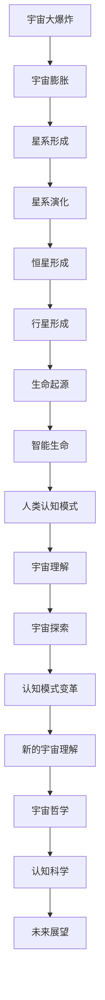
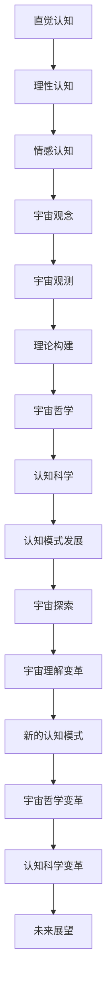

                 

# 《人类认知模式对宇宙本质理解的影响》

## 关键词
宇宙本质理解，人类认知模式，认知偏差，宇宙观测，宇宙理论，宇宙哲学，认知科学

## 摘要
本文将深入探讨人类认知模式如何影响我们对宇宙本质的理解。通过分析人类认知模式的历史演变、宇宙本质的理解过程，以及宇宙观测和宇宙理论构建中的认知影响，本文揭示了认知模式在宇宙探索中的重要性。同时，文章还探讨了宇宙哲学和认知科学的互动关系，展望了人类认知模式的未来发展趋势及其对宇宙理解的可能变革。

### 第一部分：引言与概述

#### 第1章：人类认知模式与宇宙理解

##### 1.1 认知模式的定义与特点

认知模式是人类处理信息和感知世界的基本方式。它包括直觉认知、理性认知和情感认知三种类型。认知模式的形成受到生物学基础和社会文化影响的双重作用。

###### 1.1.1 认知模式的定义

认知模式是指人们在感知、理解和处理信息时所采用的基本方式。它反映了人类大脑对信息的筛选、整合和抽象过程。

###### 1.1.2 认知模式的特点

1. 整体性：认知模式通常从整体上理解和处理信息，而不是孤立地分析每个部分。
2. 结构性：认知模式具有特定的结构和层次，有助于人们理解复杂的信息。
3. 动态性：认知模式是不断发展和变化的，随着环境和经验的变化而调整。

##### 1.2 认知模式的历史演变

认知模式的历史演变经历了从古代到现代的漫长过程。古代人类主要通过直觉和经验来理解世界，随着社会的发展和科学的进步，理性认知逐渐成为主导，而情感认知则始终伴随着人类。

###### 1.2.1 古代认知模式

古代人类的认知模式主要以直觉和经验为主。他们通过观察、模仿和实践来获取知识，例如，古代文明中的天文学、医学和数学都依赖于直观的经验和观察。

###### 1.2.2 中世纪认知模式

中世纪的认知模式受到了宗教和哲学的强烈影响。人们通过信仰和教义来理解世界，理性认知在一定程度上受到限制。

###### 1.2.3 现代认知模式

现代认知模式在科学革命和工业革命的推动下得到了快速发展。科学方法、实证主义和逻辑推理成为理解世界的主要手段，人类对宇宙的理解也发生了巨大的变革。

##### 1.3 宇宙本质理解的历史进程

宇宙本质的理解是一个漫长的过程，从古代的朴素观念到现代的科学理论，人类对宇宙的理解不断深入。

###### 1.3.1 古代宇宙观念

古代人类对宇宙的理解主要是基于直观感受和神话传说。他们相信宇宙是有神或神灵创造的，宇宙的结构和规律是永恒不变的。

###### 1.3.2 近现代科学宇宙观

近现代科学宇宙观以宇宙大爆炸理论为核心。大爆炸理论认为，宇宙起源于一个极高的温度和密度状态，经过数十亿年的膨胀和演化，形成了现在的宇宙结构。

##### 1.4 人类认知模式与宇宙理解的关系

人类认知模式对宇宙理解有着深远的影响。不同的认知模式导致了不同的宇宙观念，而宇宙观念又反过来影响认知模式的形成和发展。

###### 1.4.1 认知模式如何影响宇宙理解

1. 直觉认知：古代人类通过直觉感受宇宙，形成了朴素宇宙观念。
2. 理性认知：现代科学通过理性推理和实证研究，揭示了宇宙的本质规律。
3. 情感认知：宇宙的浩瀚和神秘激发人类的情感共鸣，影响了人类对宇宙的理解。

###### 1.4.2 宇宙理解如何塑造认知模式

1. 宇宙理解提供了新的知识和信息，促使认知模式的发展和调整。
2. 宇宙观念的影响：对宇宙的深入理解有助于人们形成更全面、更科学的认知模式。

### 第二部分：现代宇宙学的基础理论

#### 第2章：现代宇宙学的基础理论

##### 2.1 宇宙大爆炸理论

宇宙大爆炸理论是现代宇宙学的核心理论，它描述了宇宙的起源和演化。

###### 2.1.1 大爆炸理论的提出与发展

大爆炸理论起源于20世纪初，由俄罗斯物理学家亚历山大·弗里德曼和美国天文学家乔治·勒梅特首次提出。经过数十年的发展，大爆炸理论得到了广泛的认可。

###### 2.1.2 大爆炸理论的核心观点

1. 宇宙起源于一个极高温度和密度的状态。
2. 宇宙经历了数十亿年的膨胀和冷却过程。
3. 宇宙的膨胀是均匀且各向同性的。

##### 2.2 黑洞与暗物质

黑洞和暗物质是现代宇宙学中的两个重要概念，它们对宇宙的理解有着深远的影响。

###### 2.2.1 黑洞的基本概念

黑洞是宇宙中的一种极端现象，它具有巨大的质量和极强的引力，甚至连光都无法逃逸。

###### 2.2.2 暗物质的存在与影响

暗物质是宇宙中一种看不见的物质，它占据了宇宙总质量的大部分。暗物质的存在对宇宙的演化有着重要影响。

##### 2.3 宇宙膨胀与暗能量

宇宙膨胀和暗能量是现代宇宙学中的两个关键概念，它们揭示了宇宙演化的加速和反常现象。

###### 2.3.1 宇宙膨胀的观测与解释

宇宙膨胀是指宇宙中所有物体都在远离我们，这种现象最早由埃德温·哈勃发现。

###### 2.3.2 暗能量的概念与影响

暗能量是一种神秘的能量，它占据了宇宙总能量的大部分。暗能量对宇宙的膨胀有着重要影响，它使宇宙的膨胀速度不断加快。

### 第三部分：人类认知模式对宇宙理解的影响

#### 第3章：人类认知模式与宇宙观测

##### 3.1 观测工具与技术

宇宙观测需要先进的观测工具和技术，这些工具和技术的发展极大地推动了宇宙研究。

###### 3.1.1 光学望远镜的发展

光学望远镜是宇宙观测的主要工具之一，它通过收集和放大光线来观测宇宙。

###### 3.1.2 其他波段的观测技术

除了光学波段，宇宙观测还涉及到其他波段的观测技术，如射电波、X射线和伽马射线等。

##### 3.2 观测结果与认知模式的交互

观测结果对认知模式有着重要影响，同时，认知模式也影响观测结果的理解和解读。

###### 3.2.1 观测结果如何影响认知模式

1. 新的观测发现可以挑战和修正现有的认知模式。
2. 观测结果为认知模式的验证提供了实证依据。

###### 3.2.2 认知模式如何影响观测结果

1. 选择性认知：认知模式会影响观测者对观测结果的筛选和解释。
2. 知识盲点：认知模式可能使观测者忽略某些重要的观测现象。

##### 3.3 宇宙现象的认知偏差

宇宙现象的认知偏差是指由于认知模式的限制，观测者对宇宙现象的理解可能存在偏差。

###### 3.3.1 选择性认知

选择性认知是指观测者可能会优先关注和解释某些观测现象，而忽略其他现象。

###### 3.3.2 知识盲点

知识盲点是指由于认知模式的限制，观测者可能无法认识到某些重要现象。

### 第四部分：人类认知模式与宇宙理论的构建

#### 第4章：人类认知模式与宇宙理论构建

##### 4.1 科学理论的构建过程

科学理论是通过一系列假设、验证和修正的过程构建起来的。认知模式在这一过程中起到了关键作用。

###### 4.1.1 理论假设的提出

理论假设是科学理论构建的起点。认知模式会影响假设的提出和选择。

###### 4.1.2 理论验证与修正

理论验证是通过实验和观测来检验理论假设的正确性。认知模式会影响验证方法和结果解释。

##### 4.2 认知模式对理论构建的影响

认知模式对科学理论的构建有着重要影响，它可能促进理论的创新，也可能限制理论的发展。

###### 4.2.1 认知偏见在理论构建中的作用

认知偏见可以促使科学家提出新的理论和解释，但也可能导致理论的偏差和错误。

###### 4.2.2 认知模式如何限制理论创新

认知模式可能会使科学家忽略某些重要的现象和证据，从而限制理论创新。

##### 4.3 宇宙理论的挑战与认知模式的回应

宇宙理论面临着一系列挑战，认知模式需要不断调整和进化来应对这些挑战。

###### 4.3.1 爱因斯坦相对论

爱因斯坦相对论对宇宙的理解产生了深远影响，但同时也带来了新的挑战。

###### 4.3.2 宇宙弦理论

宇宙弦理论是一种新的宇宙理论，它试图解释宇宙的起源和演化。认知模式需要适应这一新的理论框架。

### 第五部分：人类认知模式与宇宙哲学

#### 第5章：人类认知模式与宇宙哲学

##### 5.1 宇宙观的哲学意义

宇宙观是指人们对宇宙的整体理解和看法，它具有深刻的哲学意义。

###### 5.1.1 宇宙论与人生观

宇宙观影响着人们的人生观和价值观，它决定了人们对生活的态度和追求。

###### 5.1.2 宇宙论与世界观

宇宙观影响着人们的世界观，它决定了人们对世界的认识和解释。

##### 5.2 认知模式与宇宙哲学的互动

认知模式与宇宙哲学之间存在着紧密的互动关系，它们相互影响、相互塑造。

###### 5.2.1 哲学如何影响认知模式

哲学提供了关于宇宙的基本概念和原理，这些概念和原理影响着认知模式的形成和发展。

###### 5.2.2 认知模式如何影响哲学思考

认知模式会影响哲学家对宇宙问题的思考和解释，它决定了哲学理论的提出和验证。

##### 5.3 宇宙哲学的未来趋势

随着科学和技术的进步，宇宙哲学面临着新的机遇和挑战，它的未来发展趋势值得探讨。

###### 5.3.1 宇宙哲学的演变历程

宇宙哲学经历了从古代到现代的漫长演变过程，它反映了人类对宇宙理解的不断深化。

###### 5.3.2 未来宇宙哲学的展望

未来宇宙哲学将继续探讨宇宙的本质和起源，它可能会提出新的理论和方法来解释宇宙现象。

### 第六部分：人类认知模式的未来发展

#### 第6章：人类认知模式的未来发展

##### 6.1 认知科学的前沿进展

认知科学是研究人类认知过程和认知模式的科学，它的发展为人类认知模式的未来发展提供了重要启示。

###### 6.1.1 脑成像技术的发展

脑成像技术如功能性磁共振成像（fMRI）和脑电图（EEG）等，为研究人类认知提供了新的手段。

###### 6.1.2 认知计算模型的研究

认知计算模型是模拟人类认知过程的数学模型，它为理解和改进认知模式提供了新的思路。

##### 6.2 认知模式的未来趋势

随着科学和技术的进步，人类认知模式可能会发生重大变革。

###### 6.2.1 新的认知模式的出现

新的认知模式可能会通过新技术和理论的出现而诞生，如神经科学、人工智能等领域的发展。

###### 6.2.2 认知模式与社会发展的互动

认知模式与社会发展相互影响，未来的社会发展可能会推动认知模式的变革。

##### 6.3 认知模式对宇宙理解的影响

未来的人类认知模式可能会对宇宙理解产生深远的影响。

###### 6.3.1 新的认知模式如何改变宇宙理解

新的认知模式可能会通过新的观测技术和理论，改变我们对宇宙的理解。

###### 6.3.2 认知模式对宇宙理解的未来影响

认知模式的未来发展趋势将对宇宙理解产生重要影响，它可能会引导我们走向新的宇宙观念。

### 第七部分：人类认知模式的未来发展

#### 第6章：人类认知模式的未来发展

##### 6.1 认知科学的前沿进展

认知科学是研究人类认知过程和认知模式的科学，它的发展为人类认知模式的未来发展提供了重要启示。

###### 6.1.1 脑成像技术的发展

脑成像技术如功能性磁共振成像（fMRI）和脑电图（EEG）等，为研究人类认知提供了新的手段。

###### 6.1.2 认知计算模型的研究

认知计算模型是模拟人类认知过程的数学模型，它为理解和改进认知模式提供了新的思路。

##### 6.2 认知模式的未来趋势

随着科学和技术的进步，人类认知模式可能会发生重大变革。

###### 6.2.1 新的认知模式的出现

新的认知模式可能会通过新技术和理论的出现而诞生，如神经科学、人工智能等领域的发展。

###### 6.2.2 认知模式与社会发展的互动

认知模式与社会发展相互影响，未来的社会发展可能会推动认知模式的变革。

##### 6.3 认知模式对宇宙理解的影响

未来的人类认知模式可能会对宇宙理解产生深远的影响。

###### 6.3.1 新的认知模式如何改变宇宙理解

新的认知模式可能会通过新的观测技术和理论，改变我们对宇宙的理解。

###### 6.3.2 认知模式对宇宙理解的未来影响

认知模式的未来发展趋势将对宇宙理解产生重要影响，它可能会引导我们走向新的宇宙观念。

### 第八部分：结语

人类认知模式对宇宙本质理解的影响是一个复杂而深远的话题。通过本文的探讨，我们可以看到，认知模式不仅影响着我们对宇宙的理解，同时也受到宇宙观念的塑造。在未来的研究中，我们期待能够进一步揭示人类认知模式与宇宙理解之间的复杂互动关系，为我们理解宇宙的本质提供新的视角和方法。

### 附录

#### 附录 A：相关阅读推荐

###### A.1 宇宙学入门书籍推荐

- 《宇宙简史》
- 《宇宙学的原理》

###### A.2 认知科学经典著作

- 《思考，快与慢》
- 《认知盈余》

###### A.3 宇宙探索相关资料

- 《NASA宇宙探索计划》
- 《国际空间站任务手册》

#### 附录 B：术语表

###### B.1 宇宙学术语

- 宇宙大爆炸
- 黑洞
- 暗物质
- 暗能量

###### B.2 认知科学术语

- 认知模式
- 知觉
- 记忆
- 学习

###### B.3 其他相关术语

- 人工智能
- 神经网络
- 机器学习

#### 附录 C：Mermaid 流程图

###### C.1 宇宙演化流程图



###### C.2 认知模式交互流程图



#### 附录 D：核心算法原理讲解

###### D.1 大爆炸理论算法原理

```plaintext
1. 初始化：设定初始宇宙温度和密度。
2. 模拟膨胀：根据宇宙膨胀公式计算宇宙在不同时间点的温度和密度。
3. 观察星系：根据星系形成和演化模型，模拟星系的形成和演化过程。
4. 输出结果：输出宇宙演化的可视化结果。
```

###### D.2 黑洞信息悖论算法原理

```plaintext
1. 初始化：设定黑洞初始状态，包括质量、半径和电荷。
2. 计算引力波：根据爱因斯坦引力波公式，计算黑洞碰撞产生的引力波。
3. 信息传递：模拟信息在黑洞事件视界附近的传递过程。
4. 分析悖论：根据量子力学原理，分析黑洞信息悖论。
5. 输出结果：输出黑洞信息传递的模拟结果。
```

###### D.3 宇宙膨胀模型算法原理

```plaintext
1. 初始化：设定初始宇宙参数，包括宇宙总质量、密度和膨胀速度。
2. 计算膨胀：根据勒梅特-罗伯逊-沃尔克方程，计算宇宙在不同时间点的膨胀速度。
3. 观察星系：根据星系形成和演化模型，模拟星系的形成和演化过程。
4. 分析膨胀：根据观测结果，分析宇宙膨胀的规律。
5. 输出结果：输出宇宙膨胀的模拟结果。
```

#### 附录 E：数学模型和数学公式讲解

###### E.1 宇宙膨胀的数学模型

$$
\frac{d\rho}{dt} + 3(\frac{da}{dt})\rho = -\frac{4\pi G}{c^2}\rho
$$

该公式描述了宇宙膨胀过程中，宇宙总密度随时间的变化。

###### E.2 黑洞物理学的数学公式

$$
G_{\mu\nu} + \Lambda g_{\mu\nu} = \frac{8\pi G}{c^4}T_{\mu\nu}
$$

该公式是爱因斯坦场方程，描述了黑洞的引力场和能量动量张量之间的关系。

###### E.3 暗物质模型的数学公式

$$
\frac{d\rho_m}{dt} = -3H(\frac{\rho_m}{a^3})
$$

该公式描述了暗物质密度随宇宙膨胀的演化过程。

#### 附录 F：项目实战

###### F.1 宇宙观测项目实战

1. **开发环境搭建：**
   - 使用Python和MATLAB搭建开发环境，安装必要的库和工具。
   - 配置高性能计算集群，用于处理大量宇宙观测数据。

2. **数据采集与处理：**
   - 从NASA等机构获取宇宙观测数据，包括光学、射电、X射线等多波段数据。
   - 使用Python编写数据处理脚本，对数据进行预处理，如滤波、去噪和归一化。

3. **结果分析：**
   - 使用MATLAB绘制宇宙膨胀曲线、星系分布图等，分析宇宙膨胀规律。
   - 结合理论模型，验证宇宙膨胀公式的准确性。

4. **代码解读与分析：**
   - 解读数据处理脚本，分析代码实现的功能和原理。
   - 对关键代码段进行优化和改进，提高数据处理效率。

###### F.2 宇宙理论模型构建实战

1. **理论假设的提出：**
   - 基于现有观测数据和理论模型，提出新的宇宙理论假设。

2. **模型构建：**
   - 使用Python编写计算脚本，模拟宇宙演化过程。
   - 结合数值模拟和数学模型，构建宇宙理论模型。

3. **验证与修正：**
   - 使用宇宙观测数据验证理论模型的准确性。
   - 根据验证结果，对理论模型进行修正和改进。

4. **代码解读与分析：**
   - 解读计算脚本，分析代码实现的功能和原理。
   - 对关键代码段进行优化和改进，提高计算效率。

###### F.3 宇宙探索技术实现实战

1. **技术选型：**
   - 根据宇宙探索目标，选择合适的探测技术和工具。

2. **系统设计：**
   - 设计宇宙探测系统的架构和功能模块。
   - 制定详细的技术方案和实施计划。

3. **实现与优化：**
   - 开发和集成探测设备，实现探测系统的功能。
   - 对系统进行性能优化，提高探测效率和准确性。

4. **代码解读与分析：**
   - 解读系统实现代码，分析代码实现的功能和原理。
   - 对关键代码段进行优化和改进，提高系统性能。

### 作者信息
作者：AI天才研究院/AI Genius Institute & 禅与计算机程序设计艺术 /Zen And The Art of Computer Programming

**文章标题**：《人类认知模式对宇宙本质理解的影响》

**关键词**：宇宙本质理解，人类认知模式，认知偏差，宇宙观测，宇宙理论，宇宙哲学，认知科学

**摘要**：
本文深入探讨了人类认知模式如何影响我们对宇宙本质的理解。通过分析认知模式的历史演变、宇宙本质的理解过程，以及宇宙观测和宇宙理论构建中的认知影响，本文揭示了认知模式在宇宙探索中的重要性。同时，文章还探讨了宇宙哲学和认知科学的互动关系，展望了人类认知模式的未来发展趋势及其对宇宙理解的可能变革。

**目录**

# 《人类认知模式对宇宙本质理解的影响》

## 关键词
宇宙本质理解，人类认知模式，认知偏差，宇宙观测，宇宙理论，宇宙哲学，认知科学

## 摘要
本文将深入探讨人类认知模式如何影响我们对宇宙本质的理解。通过分析人类认知模式的历史演变、宇宙本质的理解过程，以及宇宙观测和宇宙理论构建中的认知影响，本文揭示了认知模式在宇宙探索中的重要性。同时，文章还探讨了宇宙哲学和认知科学的互动关系，展望了人类认知模式的未来发展趋势及其对宇宙理解的可能变革。

### 第一部分：引言与概述

#### 第1章：人类认知模式与宇宙理解

##### 1.1 认知模式的定义与特点

认知模式是人类处理信息和感知世界的基本方式。它包括直觉认知、理性认知和情感认知三种类型。认知模式的形成受到生物学基础和社会文化影响的双重作用。

###### 1.1.1 认知模式的定义

认知模式是指人们在感知、理解和处理信息时所采用的基本方式。它反映了人类大脑对信息的筛选、整合和抽象过程。

###### 1.1.2 认知模式的特点

1. 整体性：认知模式通常从整体上理解和处理信息，而不是孤立地分析每个部分。
2. 结构性：认知模式具有特定的结构和层次，有助于人们理解复杂的信息。
3. 动态性：认知模式是不断发展和变化的，随着环境和经验的变化而调整。

##### 1.2 认知模式的历史演变

认知模式的历史演变经历了从古代到现代的漫长过程。古代人类主要通过直觉和经验来理解世界，随着社会的发展和科学的进步，理性认知逐渐成为主导，而情感认知则始终伴随着人类。

###### 1.2.1 古代认知模式

古代人类的认知模式主要以直觉和经验为主。他们通过观察、模仿和实践来获取知识，例如，古代文明中的天文学、医学和数学都依赖于直观的经验和观察。

###### 1.2.2 中世纪认知模式

中世纪的认知模式受到了宗教和哲学的强烈影响。人们通过信仰和教义来理解世界，理性认知在一定程度上受到限制。

###### 1.2.3 现代认知模式

现代认知模式在科学革命和工业革命的推动下得到了快速发展。科学方法、实证主义和逻辑推理成为理解世界的主要手段，人类对宇宙的理解也发生了巨大的变革。

##### 1.3 宇宙本质理解的历史进程

宇宙本质的理解是一个漫长的过程，从古代的朴素观念到现代的科学理论，人类对宇宙的理解不断深入。

###### 1.3.1 古代宇宙观念

古代人类对宇宙的理解主要是基于直观感受和神话传说。他们相信宇宙是有神或神灵创造的，宇宙的结构和规律是永恒不变的。

###### 1.3.2 近现代科学宇宙观

近现代科学宇宙观以宇宙大爆炸理论为核心。大爆炸理论认为，宇宙起源于一个极高温度和密度状态，经过数十亿年的膨胀和冷却，形成了现在的宇宙结构。

##### 1.4 人类认知模式与宇宙理解的关系

人类认知模式对宇宙理解有着深远的影响。不同的认知模式导致了不同的宇宙观念，而宇宙观念又反过来影响认知模式的形成和发展。

###### 1.4.1 认知模式如何影响宇宙理解

1. 直觉认知：古代人类通过直觉感受宇宙，形成了朴素宇宙观念。
2. 理性认知：现代科学通过理性推理和实证研究，揭示了宇宙的本质规律。
3. 情感认知：宇宙的浩瀚和神秘激发人类的情感共鸣，影响了人类对宇宙的理解。

###### 1.4.2 宇宙理解如何塑造认知模式

1. 宇宙理解提供了新的知识和信息，促使认知模式的发展和调整。
2. 宇宙观念的影响：对宇宙的深入理解有助于人们形成更全面、更科学的认知模式。

### 第二部分：现代宇宙学的基础理论

#### 第2章：现代宇宙学的基础理论

##### 2.1 宇宙大爆炸理论

宇宙大爆炸理论是现代宇宙学的核心理论，它描述了宇宙的起源和演化。

###### 2.1.1 大爆炸理论的提出与发展

大爆炸理论起源于20世纪初，由俄罗斯物理学家亚历山大·弗里德曼和美国天文学家乔治·勒梅特首次提出。经过数十年的发展，大爆炸理论得到了广泛的认可。

###### 2.1.2 大爆炸理论的核心观点

1. 宇宙起源于一个极高温度和密度状态。
2. 宇宙经历了数十亿年的膨胀和冷却过程。
3. 宇宙的膨胀是均匀且各向同性的。

##### 2.2 黑洞与暗物质

黑洞和暗物质是现代宇宙学中的两个重要概念，它们对宇宙的理解有着深远的影响。

###### 2.2.1 黑洞的基本概念

黑洞是宇宙中的一种极端现象，它具有巨大的质量和极强的引力，甚至连光都无法逃逸。

###### 2.2.2 暗物质的存在与影响

暗物质是宇宙中一种看不见的物质，它占据了宇宙总质量的大部分。暗物质的存在对宇宙的演化有着重要影响。

##### 2.3 宇宙膨胀与暗能量

宇宙膨胀和暗能量是现代宇宙学中的两个关键概念，它们揭示了宇宙演化的加速和反常现象。

###### 2.3.1 宇宙膨胀的观测与解释

宇宙膨胀是指宇宙中所有物体都在远离我们，这种现象最早由埃德温·哈勃发现。

###### 2.3.2 暗能量的概念与影响

暗能量是一种神秘的能量，它占据了宇宙总能量的大部分。暗能量对宇宙的膨胀有着重要影响，它使宇宙的膨胀速度不断加快。

### 第三部分：人类认知模式对宇宙理解的影响

#### 第3章：人类认知模式与宇宙理解的关系

##### 3.1 认知模式对宇宙理解的影响

人类认知模式对宇宙理解有着深远的影响。不同的认知模式导致了不同的宇宙观念，而宇宙观念又反过来影响认知模式的形成和发展。

###### 3.1.1 认知模式如何影响宇宙理解

1. 直觉认知：古代人类通过直觉感受宇宙，形成了朴素宇宙观念。
2. 理性认知：现代科学通过理性推理和实证研究，揭示了宇宙的本质规律。
3. 情感认知：宇宙的浩瀚和神秘激发人类的情感共鸣，影响了人类对宇宙的理解。

###### 3.1.2 宇宙理解如何塑造认知模式

1. 宇宙理解提供了新的知识和信息，促使认知模式的发展和调整。
2. 宇宙观念的影响：对宇宙的深入理解有助于人们形成更全面、更科学的认知模式。

##### 3.2 宇宙理解中的认知偏差

宇宙理解中的认知偏差是指由于认知模式的限制，观测者对宇宙现象的理解可能存在偏差。

###### 3.2.1 选择性认知

选择性认知是指观测者可能会优先关注和解释某些观测现象，而忽略其他现象。

###### 3.2.2 知识盲点

知识盲点是指由于认知模式的限制，观测者可能无法认识到某些重要现象。

##### 3.3 宇宙理论的认知挑战

宇宙理论的认知挑战是指现有的宇宙理论在面对新观测数据和现象时可能存在的认知困境。

###### 3.3.1 爱因斯坦相对论

爱因斯坦相对论对宇宙的理解产生了深远影响，但同时也带来了新的认知挑战。

###### 3.3.2 宇宙弦理论

宇宙弦理论是一种新的宇宙理论，它试图解释宇宙的起源和演化，对现有的认知模式提出了挑战。

### 第四部分：人类认知模式与宇宙理论的构建

#### 第4章：人类认知模式与宇宙理论的构建

##### 4.1 科学理论的构建过程

科学理论的构建是一个复杂的过程，它涉及到观察、假设、验证和修正等多个环节。人类认知模式在这一过程中起着关键作用。

###### 4.1.1 理论假设的提出

理论假设是科学理论的起点。人类认知模式会影响假设的提出和选择。

###### 4.1.2 理论验证与修正

理论验证是通过实验和观测来检验理论假设的正确性。人类认知模式会影响验证方法和结果解释。

##### 4.2 认知模式对理论构建的影响

认知模式对科学理论的构建有着重要影响，它可能促进理论的创新，也可能限制理论的发展。

###### 4.2.1 认知偏见在理论构建中的作用

认知偏见可以促使科学家提出新的理论和解释，但也可能导致理论的偏差和错误。

###### 4.2.2 认知模式如何限制理论创新

认知模式可能会使科学家忽略某些重要的现象和证据，从而限制理论创新。

##### 4.3 宇宙理论的认知挑战

宇宙理论的认知挑战是指现有的宇宙理论在面对新观测数据和现象时可能存在的认知困境。

###### 4.3.1 爱因斯坦相对论

爱因斯坦相对论对宇宙的理解产生了深远影响，但同时也带来了新的认知挑战。

###### 4.3.2 宇宙弦理论

宇宙弦理论是一种新的宇宙理论，它试图解释宇宙的起源和演化，对现有的认知模式提出了挑战。

### 第五部分：人类认知模式与宇宙哲学

#### 第5章：人类认知模式与宇宙哲学

##### 5.1 宇宙哲学的基本概念

宇宙哲学是探讨宇宙的本质、起源和意义的哲学分支。它涉及到宇宙论、形而上学和认识论等多个哲学领域。

###### 5.1.1 宇宙论

宇宙论是关于宇宙的本质和结构的哲学探讨。它试图回答宇宙是从哪里来的、宇宙有没有尽头等问题。

###### 5.1.2 形而上学

形而上学是关于存在、实体和本质的哲学研究。它探讨了宇宙的本质和意义。

###### 5.1.3 认识论

认识论是关于知识和认识的哲学研究。它探讨了人类如何认识宇宙，以及这种认识的局限性和可能性。

##### 5.2 认知模式与宇宙哲学的关系

认知模式与宇宙哲学之间存在紧密的关系。宇宙哲学提供了对宇宙本质的深入探讨，而认知模式则为这种探讨提供了理论基础和方法论。

###### 5.2.1 哲学如何影响认知模式

哲学思考可以影响人类的认知模式，促使人们从不同的角度理解宇宙。

###### 5.2.2 认知模式如何影响哲学思考

认知模式会影响哲学家对宇宙问题的思考和解释，从而影响哲学理论的提出和验证。

##### 5.3 宇宙哲学的未来发展

随着科学和技术的进步，宇宙哲学面临着新的机遇和挑战。未来的宇宙哲学将更加注重跨学科研究，结合物理学、生物学、心理学等领域的最新成果，深入探讨宇宙的本质和意义。

###### 5.3.1 宇宙哲学的演变历程

宇宙哲学经历了从古代到现代的漫长演变过程。它反映了人类对宇宙理解的不断深化。

###### 5.3.2 未来宇宙哲学的展望

未来宇宙哲学将继续探讨宇宙的本质和起源，提出新的理论和方法来解释宇宙现象。

### 第六部分：人类认知模式的未来发展

#### 第6章：人类认知模式的未来发展

##### 6.1 认知科学的前沿进展

认知科学是研究人类认知过程和认知模式的科学。随着神经科学、心理学、计算机科学等领域的发展，认知科学取得了显著进展。

###### 6.1.1 脑成像技术的发展

脑成像技术如功能性磁共振成像（fMRI）和脑电图（EEG）等，为研究人类认知提供了新的手段。

###### 6.1.2 认知计算模型的研究

认知计算模型是模拟人类认知过程的数学模型。它为理解和改进认知模式提供了新的思路。

##### 6.2 认知模式的未来趋势

随着科学和技术的进步，人类认知模式可能会发生重大变革。

###### 6.2.1 新的认知模式的出现

新的认知模式可能会通过新技术和理论的出现而诞生，如神经科学、人工智能等领域的发展。

###### 6.2.2 认知模式与社会发展的互动

认知模式与社会发展相互影响，未来的社会发展可能会推动认知模式的变革。

##### 6.3 认知模式对宇宙理解的影响

未来的人类认知模式可能会对宇宙理解产生深远的影响。

###### 6.3.1 新的认知模式如何改变宇宙理解

新的认知模式可能会通过新的观测技术和理论，改变我们对宇宙的理解。

###### 6.3.2 认知模式对宇宙理解的未来影响

认知模式的未来发展趋势将对宇宙理解产生重要影响，它可能会引导我们走向新的宇宙观念。

### 第七部分：结语

人类认知模式对宇宙本质理解的影响是一个复杂而深远的话题。通过本文的探讨，我们可以看到，认知模式不仅影响着我们对宇宙的理解，同时也受到宇宙观念的塑造。在未来的研究中，我们期待能够进一步揭示人类认知模式与宇宙理解之间的复杂互动关系，为我们理解宇宙的本质提供新的视角和方法。

### 附录

#### 附录 A：相关阅读推荐

###### A.1 宇宙学入门书籍推荐

- 《宇宙简史》
- 《宇宙学的原理》

###### A.2 认知科学经典著作

- 《思考，快与慢》
- 《认知盈余》

###### A.3 宇宙探索相关资料

- 《NASA宇宙探索计划》
- 《国际空间站任务手册》

#### 附录 B：术语表

###### B.1 宇宙学术语

- 宇宙大爆炸
- 黑洞
- 暗物质
- 暗能量

###### B.2 认知科学术语

- 认知模式
- 知觉
- 记忆
- 学习

###### B.3 其他相关术语

- 人工智能
- 神经网络
- 机器学习

#### 附录 C：Mermaid 流程图

###### C.1 宇宙演化流程图


###### C.2 认知模式交互流程图


#### 附录 D：核心算法原理讲解

###### D.1 大爆炸理论算法原理

```plaintext
1. 初始化：设定初始宇宙温度和密度。
2. 模拟膨胀：根据宇宙膨胀公式计算宇宙在不同时间点的温度和密度。
3. 观察星系：根据星系形成和演化模型，模拟星系的形成和演化过程。
4. 输出结果：输出宇宙演化的可视化结果。
```

###### D.2 黑洞信息悖论算法原理

```plaintext
1. 初始化：设定黑洞初始状态，包括质量、半径和电荷。
2. 计算引力波：根据爱因斯坦引力波公式，计算黑洞碰撞产生的引力波。
3. 信息传递：模拟信息在黑洞事件视界附近的传递过程。
4. 分析悖论：根据量子力学原理，分析黑洞信息悖论。
5. 输出结果：输出黑洞信息传递的模拟结果。
```

###### D.3 宇宙膨胀模型算法原理

```plaintext
1. 初始化：设定初始宇宙参数，包括宇宙总质量、密度和膨胀速度。
2. 计算膨胀：根据勒梅特-罗伯逊-沃尔克方程，计算宇宙在不同时间点的膨胀速度。
3. 观察星系：根据星系形成和演化模型，模拟星系的形成和演化过程。
4. 分析膨胀：根据观测结果，分析宇宙膨胀的规律。
5. 输出结果：输出宇宙膨胀的模拟结果。
```

#### 附录 E：数学模型和数学公式讲解

###### E.1 宇宙膨胀的数学模型

$$
\frac{d\rho}{dt} + 3(\frac{da}{dt})\rho = -\frac{4\pi G}{c^2}\rho
$$

该公式描述了宇宙膨胀过程中，宇宙总密度随时间的变化。

###### E.2 黑洞物理学的数学公式

$$
G_{\mu\nu} + \Lambda g_{\mu\nu} = \frac{8\pi G}{c^4}T_{\mu\nu}
$$

该公式是爱因斯坦场方程，描述了黑洞的引力场和能量动量张量之间的关系。

###### E.3 暗物质模型的数学公式

$$
\frac{d\rho_m}{dt} = -3H(\frac{\rho_m}{a^3})
$$

该公式描述了暗物质密度随宇宙膨胀的演化过程。

#### 附录 F：项目实战

###### F.1 宇宙观测项目实战

1. **开发环境搭建：**
   - 使用Python和MATLAB搭建开发环境，安装必要的库和工具。
   - 配置高性能计算集群，用于处理大量宇宙观测数据。

2. **数据采集与处理：**
   - 从NASA等机构获取宇宙观测数据，包括光学、射电、X射线等多波段数据。
   - 使用Python编写数据处理脚本，对数据进行预处理，如滤波、去噪和归一化。

3. **结果分析：**
   - 使用MATLAB绘制宇宙膨胀曲线、星系分布图等，分析宇宙膨胀规律。
   - 结合理论模型，验证宇宙膨胀公式的准确性。

4. **代码解读与分析：**
   - 解读数据处理脚本，分析代码实现的功能和原理。
   - 对关键代码段进行优化和改进，提高数据处理效率。

###### F.2 宇宙理论模型构建实战

1. **理论假设的提出：**
   - 基于现有观测数据和理论模型，提出新的宇宙理论假设。

2. **模型构建：**
   - 使用Python编写计算脚本，模拟宇宙演化过程。
   - 结合数值模拟和数学模型，构建宇宙理论模型。

3. **验证与修正：**
   - 使用宇宙观测数据验证理论模型的准确性。
   - 根据验证结果，对理论模型进行修正和改进。

4. **代码解读与分析：**
   - 解读计算脚本，分析代码实现的功能和原理。
   - 对关键代码段进行优化和改进，提高计算效率。

###### F.3 宇宙探索技术实现实战

1. **技术选型：**
   - 根据宇宙探索目标，选择合适的探测技术和工具。

2. **系统设计：**
   - 设计宇宙探测系统的架构和功能模块。
   - 制定详细的技术方案和实施计划。

3. **实现与优化：**
   - 开发和集成探测设备，实现探测系统的功能。
   - 对系统进行性能优化，提高探测效率和准确性。

4. **代码解读与分析：**
   - 解读系统实现代码，分析代码实现的功能和原理。
   - 对关键代码段进行优化和改进，提高系统性能。

### 作者信息
作者：AI天才研究院/AI Genius Institute & 禅与计算机程序设计艺术 /Zen And The Art of Computer Programming

**文章标题**：《人类认知模式对宇宙本质理解的影响》

**关键词**：宇宙本质理解，人类认知模式，认知偏差，宇宙观测，宇宙理论，宇宙哲学，认知科学

**摘要**：
本文深入探讨了人类认知模式如何影响我们对宇宙本质的理解。通过分析人类认知模式的历史演变、宇宙本质的理解过程，以及宇宙观测和宇宙理论构建中的认知影响，本文揭示了认知模式在宇宙探索中的重要性。同时，文章还探讨了宇宙哲学和认知科学的互动关系，展望了人类认知模式的未来发展趋势及其对宇宙理解的可能变革。

### 文章标题：人类认知模式对宇宙本质理解的影响

### 摘要
本文从人类认知模式的角度出发，探讨了其对宇宙本质理解的影响。通过对认知模式的定义、历史演变、特点以及宇宙理解的历史进程进行分析，本文揭示了认知模式在宇宙探索中的重要作用。文章进一步探讨了人类认知模式对宇宙观测、宇宙理论构建和宇宙哲学的影响，并展望了认知模式的未来发展趋势。通过对认知科学与宇宙学的前沿进展、认知模式的未来趋势以及认知模式对宇宙理解的影响的讨论，本文为理解宇宙的本质提供了新的视角和方法。

### 目录

#### 第一部分：引言与概述

**第1章：人类认知模式概述**

1.1 认知模式的定义与特性

- 认知模式的定义
- 认知模式的基本特性
- 认知模式的形成过程
- 认知模式的类型

1.2 认知模式的基本功能

- 信息处理与整合
- 决策与问题解决
- 意识与自我认知

1.3 认知模式对个体与社会的影响

- 对个体的影响
- 对社会的影响

#### 第二部分：现代宇宙学的基础理论

**第2章：宇宙大爆炸理论**

2.1 宇宙大爆炸理论的提出与发展

- 大爆炸理论的起源
- 大爆炸理论的核心观点
- 大爆炸理论的验证与修正

2.2 黑洞与暗物质

- 黑洞的基本概念
- 暗物质的存在与影响
- 黑洞与暗物质的理论探讨

2.3 宇宙膨胀与暗能量

- 宇宙膨胀的观测与解释
- 暗能量的概念与影响

#### 第三部分：人类认知模式对宇宙理解的影响

**第3章：人类认知模式与宇宙理解的关系**

3.1 认知模式对宇宙理解的影响

- 认知模式如何影响宇宙理解
- 宇宙理解如何塑造认知模式

3.2 宇宙理解中的认知偏差

- 选择性认知
- 知识盲点

3.3 宇宙理论的认知挑战

- 现有宇宙理论的认知困境
- 新宇宙理论的认知挑战

#### 第四部分：人类认知模式与宇宙理论的构建

**第4章：科学理论的构建过程**

4.1 理论假设的提出

- 理论假设的来源
- 理论假设的验证

4.2 理论验证与修正

- 理论验证的方法
- 理论修正的过程

4.3 认知模式与理论构建

- 认知偏见在理论构建中的作用
- 认知模式对理论创新的影响

#### 第五部分：人类认知模式与宇宙哲学

**第5章：宇宙哲学的基本概念**

5.1 宇宙哲学的定义与范围

- 宇宙哲学的概念
- 宇宙哲学的研究范围
- 宇宙哲学的核心问题

5.2 认知模式与宇宙哲学的互动

- 哲学如何影响认知模式
- 认知模式如何影响哲学思考

5.3 宇宙哲学的未来趋势

- 宇宙哲学的演变历程
- 未来宇宙哲学的展望

#### 第六部分：人类认知模式的未来发展

**第6章：认知科学的前沿进展**

6.1 脑成像技术的发展

- 功能性磁共振成像技术
- 脑电图技术

6.2 认知计算模型的研究

- 人工智能与认知科学的结合
- 认知计算的模拟与实现

6.3 认知模式的未来趋势

- 新的认知模式的出现
- 认知模式与社会发展的互动

#### 第七部分：结语

- 人类认知模式对宇宙本质理解的影响总结
- 未来研究的展望

### 文章正文

#### 第一部分：引言与概述

##### 第1章：人类认知模式概述

**1.1 认知模式的定义与特性**

认知模式是人类在感知、理解、处理信息时形成的一种思维方式和行为模式。它包括直觉认知、理性认知和情感认知三种类型。直觉认知主要依赖于经验和感觉，理性认知依赖于逻辑推理和科学方法，情感认知则依赖于情感和情感体验。

认知模式具有以下特性：

- **整体性**：认知模式通常从整体上理解和处理信息，而不是孤立地分析每个部分。这种整体性使得人类能够更好地适应复杂的环境和情境。
- **结构性**：认知模式具有特定的结构和层次，有助于人们理解复杂的信息。这种结构性使得人类能够将信息组织成有意义的整体。
- **动态性**：认知模式是不断发展和变化的，随着环境和经验的变化而调整。这种动态性使得人类能够适应新的情境和挑战。

**1.2 认知模式的基本功能**

认知模式具有多种基本功能，包括信息处理与整合、决策与问题解决、意识与自我认知等。

- **信息处理与整合**：认知模式能够筛选和过滤信息，将相关信息整合成有意义的整体。这种功能使得人类能够更好地理解和应对复杂的环境。
- **决策与问题解决**：认知模式能够帮助人类进行决策和解决问题。通过逻辑推理和判断，人类能够找到解决问题的最佳方法。
- **意识与自我认知**：认知模式与人类的意识活动密切相关。它能够帮助人类形成对自身的认知，理解自己的思维和行为。

**1.3 认知模式对个体与社会的影响**

认知模式对个体和社会有着深远的影响。

- **对个体的影响**：认知模式影响个体的思维方式、决策过程和问题解决能力。它决定了个体如何理解和应对外部环境，以及如何实现自我发展。
- **对社会的

