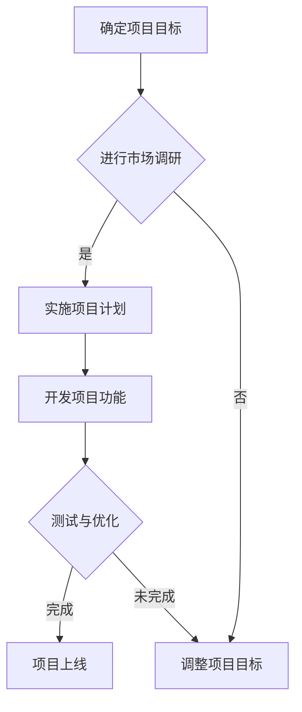
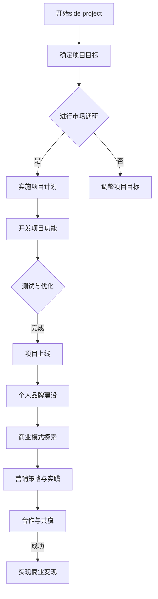

                 

### 第一部分：side project概述

#### 1.1 side project的定义与意义

**定义：**side project，又称副业项目，指的是在主职工作之外，由个人或团队自行发起和推进的小型项目。这些项目可以是技术性的，如开发新的软件工具或编写代码库；也可以是商业性的，如创建在线商店或设计品牌；还可能是社交性的，如运营博客或参与社区活动。

**意义：**side project具有多重意义。首先，它可以作为程序员个人技能的锻炼场，通过实践新技术和解决问题来提升自己的技术水平。其次，side project是创业的跳板，许多知名科技公司最初就是作为side project启动的，如Facebook和Dropbox。此外，side project还能帮助程序员建立个人品牌，提升职业竞争力，甚至实现财务自由。

#### 1.1.1 side project的定义

side project的定义可以从以下几个方面来理解：

1. **自主性：**side project通常是个人或小团队自主发起的，没有外部组织的直接干预。
2. **灵活性：**side project的时间和内容安排比较灵活，可以根据个人情况来调整。
3. **小型性：**相对于公司的主项目，side project的规模较小，资源投入有限。
4. **目标多样性：**side project的目标可能包括学习新技术、实现创意、创造商业价值等。

#### 1.1.2 side project的意义

side project的意义主要体现在以下几个方面：

1. **技能提升：**通过side project，程序员可以接触到各种新技能和工具，提升自身的技术水平。
2. **创业机会：**许多成功的企业最初是作为side project开始的，side project为创业提供了机会。
3. **个人品牌：**通过side project的成功，程序员可以建立起个人品牌，提升在行业内的知名度。
4. **财务自由：**成功的side project可以为程序员带来额外收入，实现财务自由。

#### 1.1.3 side project与创业的关系

side project与创业有着密切的关系。首先，side project是创业的早期形态，许多创业项目最初都是以side project的形式存在的。其次，side project的成功经验可以为创业提供宝贵的经验教训。最后，通过side project，程序员可以测试自己的商业想法，评估市场潜力，为未来的创业之路做好准备。

#### 1.2 side project的分类与特点

side project可以按照不同的维度进行分类，以下是一些常见的分类方法和特点：

##### 1.2.1 技术类side project

**特点：**技术类side project通常关注于软件开发、算法优化、技术博客等方面。这类项目往往具有以下特点：

1. **技术驱动：**技术类side project以技术为核心，追求技术创新和优化。
2. **学习性强：**通过技术类side project，程序员可以学习到最新的技术趋势和最佳实践。
3. **开源性质：**许多技术类side project采用开源模式，鼓励社区参与和贡献。

**例子：**一个程序员可能开发一款基于机器学习的图像识别工具，或者创建一个用于自动化测试的库。

##### 1.2.2 商业类side project

**特点：**商业类side project关注于商业模式的构建和实施，通常涉及电子商务、在线服务、营销策划等方面。这类项目具有以下特点：

1. **商业驱动：**商业类side project以商业价值为导向，追求盈利和增长。
2. **市场调研：**商业类side project需要做充分的市场调研，了解目标用户和市场需求。
3. **风险管理：**商业类side project面临着市场风险和运营风险，需要制定风险管理策略。

**例子：**一个程序员可能创建一个在线教育平台，或者开发一款用于市场营销的数据分析工具。

##### 1.2.3 社交类side project

**特点：**社交类side project关注于建立社交网络、社区运营等方面，通常涉及博客、社交媒体、社区活动等方面。这类项目具有以下特点：

1. **社区驱动：**社交类side project以建立和维护社区为目标，追求用户参与和互动。
2. **内容为王：**社交类side project需要提供有价值的内容，吸引用户关注和参与。
3. **用户反馈：**社交类side project需要密切关注用户反馈，不断优化内容和运营策略。

**例子：**一个程序员可能运营一个技术博客，或者创建一个程序员社区。

##### 1.2.4 其他类型的side project

除了上述分类，side project还可以有其他多种形式，如艺术创作、教育培训、内容创作等。这些项目往往具有以下特点：

1. **多样性：**其他类型的side project涵盖了广泛的领域，如艺术、教育、内容等。
2. **个性化：**其他类型的side project更注重个人兴趣和特长，体现个性化。
3. **长期性：**其他类型的side project往往需要更长的时间和更多的投入，但不一定追求短期盈利。

**例子：**一个程序员可能创作音乐或绘画，或者开设在线课程。

#### 1.3 side project的风险与挑战

尽管side project具有许多优势，但它们也面临着一系列风险和挑战：

##### 1.3.1 时间管理

**挑战：**side project通常需要占用个人时间，如果管理不当，可能会影响主职工作和个人生活。

**解决方案：**制定详细的时间计划，合理分配工作和休息时间，利用碎片时间进行项目开发。

##### 1.3.2 资源调配

**挑战：**side project资源有限，包括资金、人力和时间。资源不足可能导致项目进展缓慢或失败。

**解决方案：**寻找合适的合作伙伴，利用开源工具和资源，进行项目成本控制。

##### 1.3.3 技术创新

**挑战：**side project需要持续进行技术创新，以保持竞争力。技术迭代速度加快，程序员需要不断学习新技能。

**解决方案：**定期学习新技术，参与技术社区，保持对行业的关注。

##### 1.3.4 市场风险

**挑战：**商业类side project面临着市场风险，如市场需求不足、竞争激烈等。

**解决方案：**进行充分的市场调研，了解目标用户和市场需求，制定有效的市场进入策略。

##### 1.3.5 财务管理

**挑战：**side project需要良好的财务管理，确保收支平衡，避免财务风险。

**解决方案：**制定详细的财务计划，合理控制成本，寻找合适的盈利模式。

##### 1.3.6 持续动力

**挑战：**side project需要持续的动力和热情，长期的项目开发可能让人感到疲倦和失去动力。

**解决方案：**设定明确的目标和里程碑，保持对项目的热情，寻找合适的团队成员。

### 总结

side project是程序员提升技能、实现创业梦想的重要途径。通过合理的时间管理、资源调配和风险管理，程序员可以克服side project面临的各种挑战，实现个人和职业的发展。同时，side project也为创业者提供了宝贵的经验和机会，成为许多成功企业的起点。在接下来的章节中，我们将进一步探讨side project的变现策略和成功案例，帮助程序员将副业转化为主业，实现更大的成功。### 第二部分：side project变现策略

在了解了side project的定义、意义、分类以及面临的风险与挑战之后，我们接下来将探讨如何将side project转化为商业价值，实现个人财务自由和职业发展。这一部分将重点介绍个人品牌建设、商业模式探索、营销策略与实践以及合作与共赢等方面。

#### 2.1 个人品牌建设

个人品牌是程序员在职业发展过程中不可或缺的一部分。一个强大的个人品牌可以帮助程序员在竞争激烈的职场中脱颖而出，吸引更多的商业机会和合作项目。

##### 2.1.1 个人品牌的重要性

**重要性：**个人品牌对于程序员的影响主要体现在以下几个方面：

1. **增强竞争力：**强大的个人品牌可以提升程序员的职场竞争力，使其在招聘和项目中更具吸引力。
2. **扩大影响力：**个人品牌可以增强程序员的行业影响力，使其成为领域内的知名人物。
3. **带来机会：**个人品牌可以吸引更多的商业机会和合作项目，为程序员带来更多的收入和职业发展机会。

##### 2.1.2 个人品牌的构建方法

**构建方法：**构建个人品牌需要从以下几个方面着手：

1. **明确个人定位：**确定自己的专业技能、兴趣和目标市场，明确个人品牌的核心价值。
2. **持续学习与成长：**不断提升自己的专业技能和知识储备，保持对行业动态的敏感度。
3. **内容创作与传播：**通过博客、社交媒体、在线课程等渠道，持续输出高质量的内容，展示自己的专业知识和经验。
4. **参与社区活动：**积极参与技术社区和行业活动，扩大人脉圈，提升个人知名度。

##### 2.1.3 个人品牌的维护

**维护：**维护个人品牌是长期且持续的工作，需要从以下几个方面进行：

1. **保持一致性：**在品牌传播过程中，保持个人形象和内容的统一性，避免出现矛盾和不一致。
2. **积极回应反馈：**密切关注用户和读者的反馈，及时回应和解决问题，提升用户体验。
3. **持续优化：**根据市场和用户需求的变化，不断调整和优化个人品牌策略，确保品牌始终具有吸引力。

#### 2.2 商业模式探索

商业模式是side project实现商业价值的关键。一个成功的商业模式可以帮助程序员将技术能力和市场机会转化为实际收益。

##### 2.2.1 商业模式的概念

**概念：**商业模式是指企业如何通过产品或服务创造、传递和获取价值的一系列商业策略和活动。

**组成部分：**
1. **价值主张：**定义产品或服务为谁创造价值，满足哪些需求。
2. **客户关系：**描述企业与客户建立和维持关系的策略。
3. **渠道通路：**定义如何将产品或服务传递给客户。
4. **收入来源：**明确企业的收入模式，如销售、订阅、广告等。
5. **关键资源：**包括有形和无形资产，如技术、品牌、人才等。
6. **关键活动：**包括生产、营销、销售等核心业务活动。
7. **成本结构：**描述企业运营的成本构成和成本控制策略。

##### 2.2.2 商业模式的类型

**类型：**根据不同的商业模式特点，可以将商业模式分为以下几种类型：

1. **产品销售：**通过销售实体或数字产品获取收入。
2. **服务提供：**提供专业服务或解决方案，如咨询、培训等。
3. **订阅模式：**通过定期订阅服务获取收入。
4. **广告模式：**通过展示广告获取收入。
5. **众筹模式：**通过众筹平台筹集资金，实现项目启动。
6. **共享经济：**通过共享资源和平台获取收入。

##### 2.2.3 商业模式的创新

**创新：**在探索商业模式时，创新思维是至关重要的。以下是一些商业模式创新的方法：

1. **跨行业整合：**将不同行业的元素整合到一起，创造新的商业模式。
2. **平台化运营：**构建一个平台，连接供需双方，实现资源的高效配置。
3. **用户参与：**鼓励用户参与产品或服务的开发和改进，提升用户满意度。
4. **绿色商业模式：**通过环保和可持续发展的理念，创造新的商业机会。

#### 2.3 营销策略与实践

营销策略是实现side project商业价值的重要手段。一个有效的营销策略可以帮助程序员将产品或服务推向市场，吸引目标用户。

##### 2.3.1 营销策略的重要性

**重要性：**营销策略对于side project的成功至关重要，主要体现在以下几个方面：

1. **市场定位：**通过营销策略，明确产品或服务的市场定位，找到目标用户。
2. **品牌推广：**通过营销活动，提升个人或品牌的知名度，建立品牌形象。
3. **用户获取：**通过有效的营销手段，吸引潜在用户，增加产品或服务的市场份额。
4. **客户维护：**通过优质的客户服务，提升客户满意度，实现客户忠诚度。

##### 2.3.2 营销策略的类型

**类型：**根据不同的营销目标和方法，可以将营销策略分为以下几种类型：

1. **内容营销：**通过创作和分享有价值的内容，吸引目标用户。
2. **社交媒体营销：**利用社交媒体平台，与用户互动，提升品牌影响力。
3. **搜索引擎优化（SEO）：**通过优化网站内容和结构，提高在搜索引擎中的排名。
4. **社交媒体广告：**在社交媒体平台上投放广告，吸引潜在用户。
5. **网络研讨会和直播：**通过线上活动，与用户进行互动，提升品牌知名度。
6. **电子邮件营销：**通过定期发送电子邮件，与用户保持联系，提升客户满意度。

##### 2.3.3 营销策略的实践

**实践：**在实践营销策略时，需要注意以下几个方面：

1. **明确目标：**明确营销目标，制定具体的行动计划。
2. **精准定位：**了解目标用户的需求和痛点，提供针对性的解决方案。
3. **内容创作：**创作高质量、有价值的内容，吸引用户关注。
4. **互动与反馈：**与用户保持互动，及时收集用户反馈，优化营销策略。
5. **数据分析：**通过数据分析，评估营销效果，调整和优化营销策略。

#### 2.4 合作与共赢

合作是side project成功的关键因素。通过合作，程序员可以获取更多资源、拓宽视野，实现共赢。

##### 2.4.1 合作的重要性

**重要性：**合作对于side project的成功具有以下几个方面的意义：

1. **资源整合：**通过合作，可以整合不同领域的资源，提高项目成功率。
2. **技能互补：**合作伙伴可以提供不同的技能和经验，弥补个人能力的不足。
3. **风险分担：**合作可以将项目风险分散，降低个人承担的风险。
4. **市场拓展：**通过合作，可以拓展市场渠道，提高产品或服务的知名度。

##### 2.4.2 合作的形式

**形式：**合作可以采取以下几种形式：

1. **合伙人合作：**共同投资、共同经营，共享利润和风险。
2. **顾问合作：**邀请行业专家或顾问参与项目，提供专业建议和支持。
3. **技术合作：**与其他公司或团队合作，共同开发新产品或技术。
4. **资源互换：**与其他团队或个人互换资源，实现互利共赢。

##### 2.4.3 合作的成功案例

**案例：**
1. **Dropbox的成功：**Dropbox最初是由两位哈佛大学学生作为side project启动的，他们通过合作吸引了投资者，最终发展成为全球知名的云存储公司。
2. **Instagram的成功：**Instagram最初是由一个大学生团队在课余时间开发的，通过合作，他们成功吸引了Facebook的注意，并最终被其收购。

#### 总结

side project的变现策略包括个人品牌建设、商业模式探索、营销策略与实践以及合作与共赢等方面。通过这些策略，程序员可以将副业转化为主业，实现个人财务自由和职业发展。在接下来的章节中，我们将通过成功案例分享和实战指导，进一步探讨如何将这些策略付诸实践。### 第三部分：成功案例分享与实战指导

在第二部分中，我们探讨了side project的变现策略。然而，只有理论是远远不够的，成功的案例和实践经验才是我们最好的学习资源。在这一部分，我们将分享一些side project的成功案例，并详细分析这些案例的实战指导，希望为您的副业之路提供灵感和实用建议。

#### 3.1 成功案例分享

##### 3.1.1 技术类成功案例

**案例：**GitHub

**背景：**GitHub是一个基于Git版本控制系统的在线托管平台，它允许用户发布代码、管理和协作项目。GitHub的创始人Tom Preston-Werner、Chris Wanstrath和PJ Hyett最初在2007年将其作为side project启动，他们希望通过这个平台促进全球开发者的合作。

**成功原因：**
1. **技术优势：**GitHub在技术上具有明显优势，提供了强大的版本控制和项目管理功能。
2. **社区驱动：**GitHub积极推动社区建设，鼓励用户参与和贡献代码。
3. **商业模式创新：**GitHub通过提供增值服务，如GitHub Pro和企业级解决方案，实现了商业价值。

**实战指导：**
- **技术优势：**确保项目在技术上具有独特性和领先性。
- **社区建设：**建立和维护一个活跃的社区，吸引用户参与。
- **商业模式创新：**探索多元化的商业模式，增加收入来源。

##### 3.1.2 商业类成功案例

**案例：**Airbnb

**背景：**Airbnb是一个在线民宿预订平台，它允许房主出租自己的房屋或房间给旅行者。Airbnb的创始人Brian Chesky、Joe Gebbia和Nate Blecharczyk最初在2008年将其作为side project启动，他们希望通过这个平台帮助房主赚取额外收入。

**成功原因：**
1. **市场定位准确：**Airbnb准确抓住了旅游市场的需求，提供了一种新的住宿选择。
2. **用户体验优秀：**Airbnb提供了简洁易用的平台和高质量的客户服务。
3. **快速扩张：**Airbnb通过口碑传播和战略投资，实现了快速扩张。

**实战指导：**
- **市场定位：**深入了解目标市场，提供满足用户需求的产品或服务。
- **用户体验：**注重用户体验，提供优质的服务。
- **快速扩张：**利用口碑和投资，实现项目的快速成长。

##### 3.1.3 社交类成功案例

**案例：**Reddit

**背景：**Reddit是一个社交新闻网站，它允许用户提交链接、图片和文本，其他用户对这些内容进行投票，决定内容的受欢迎程度。Reddit的创始人Steve Huffman和Alexis Ohanian最初在2005年将其作为side project启动。

**成功原因：**
1. **社区驱动：**Reddit重视社区建设，鼓励用户参与和贡献内容。
2. **多样性：**Reddit涵盖了广泛的兴趣领域，满足不同用户的需求。
3. **算法优势：**Reddit的算法能够智能推荐内容，提升用户体验。

**实战指导：**
- **社区驱动：**建立一个活跃的社区，鼓励用户参与和贡献。
- **多样性：**提供多样化的内容，满足不同用户的需求。
- **算法优化：**优化推荐算法，提升用户体验。

#### 3.2 实战指导

##### 3.2.1 实战步骤概述

为了成功将side project转化为商业项目，以下是几个关键的实战步骤：

1. **确定目标：**明确side project的目标和愿景，确保项目方向正确。
2. **市场调研：**进行市场调研，了解目标用户和市场需求。
3. **技术实现：**利用现有技术，实现side project的功能和特性。
4. **品牌建设：**建立个人或团队品牌，提升知名度。
5. **营销推广：**制定营销策略，推广产品或服务。
6. **用户反馈：**收集用户反馈，不断优化产品和服务。
7. **合作与共赢：**寻找合适的合作伙伴，实现资源整合。

##### 3.2.2 实战案例分析

**案例：**一个程序员创建了一个名为“CodeGuru”的在线编程学习平台。

**步骤：**
1. **确定目标：**目标是创建一个高质量的在线编程学习平台，帮助新手程序员提高技能。
2. **市场调研：**通过调研发现，市场上存在大量编程学习资源，但高质量的、结构化的资源较少。
3. **技术实现：**利用现有的编程工具和框架，开发了一个易于使用、内容丰富的学习平台。
4. **品牌建设：**通过博客、社交媒体和线上课程，建立了“CodeGuru”的品牌形象。
5. **营销推广：**通过SEO优化和社交媒体广告，吸引了大量用户。
6. **用户反馈：**根据用户反馈，不断优化平台功能，提高用户体验。
7. **合作与共赢：**与知名编程博客和社区合作，增加了平台的知名度和用户基础。

**分析：**
- **目标明确：**明确的目标使项目方向更加清晰。
- **市场调研：**准确的市场调研帮助找到市场需求，提高了项目成功率。
- **技术实现：**高效的技术实现确保了平台的稳定性和用户体验。
- **品牌建设：**品牌建设提升了项目知名度，增加了用户信任。
- **营销推广：**有效的营销策略吸引了大量用户，为平台带来了流量。
- **用户反馈：**持续的优化确保了平台的长期发展。
- **合作与共赢：**合作与共赢策略为平台带来了更多的资源和支持。

##### 3.2.3 实战技巧分享

为了成功开展side project，以下是一些建议和技巧：

1. **时间管理：**合理安排时间，确保side project和主职工作之间的平衡。
2. **资源调配：**充分利用现有的资源和工具，降低项目成本。
3. **技术创新：**持续学习新技术，保持项目的竞争力。
4. **用户反馈：**重视用户反馈，及时调整和优化项目。
5. **合作与共赢：**寻找合适的合作伙伴，共同成长。
6. **持续学习：**不断学习新知识，提升自身能力。

#### 3.3 持续学习与成长

持续学习是side project成功的关键。以下是一些建议，帮助您在副业过程中不断成长：

1. **技术学习：**关注行业动态，学习新技术和工具，提升自身技能。
2. **商业知识：**学习商业知识，了解市场运作和商业模式。
3. **人际交往：**积极拓展人脉，建立合作网络。
4. **心态调整：**保持积极的心态，面对挑战和困难。

#### 3.4 总结

通过成功案例分享和实战指导，我们可以看到side project的成功并非偶然。明确的目标、市场调研、技术创新、品牌建设、营销推广、用户反馈和合作共赢是关键因素。同时，持续学习和成长是side project成功的重要保障。希望这些案例和实践指导能为您的副业之路提供有益的启示和实际帮助。在接下来的部分，我们将进一步讨论如何利用常用工具与资源，以及推荐一些深入阅读的材料，帮助您在side project的道路上走得更远。

#### 3.4 总结

通过成功案例分享和实战指导，我们可以看到side project的成功并非偶然。明确的目标、市场调研、技术创新、品牌建设、营销推广、用户反馈和合作共赢是关键因素。同时，持续学习和成长是side project成功的重要保障。希望这些案例和实践指导能为您的副业之路提供有益的启示和实际帮助。在接下来的部分，我们将进一步讨论如何利用常用工具与资源，以及推荐一些深入阅读的材料，帮助您在side project的道路上走得更远。

### 3.4.1 常用工具与资源

在开展side project时，合理利用工具和资源可以大大提高工作效率和项目成功率。以下是一些常用的工具和资源推荐：

#### 3.4.1.1 开发工具

1. **GitHub：**一个基于Git的代码托管和协作平台，非常适合开源项目。
2. **JIRA：**用于项目管理、任务追踪和协作的强大工具，适用于中小型团队。
3. **Visual Studio Code：**一款功能强大的代码编辑器，支持多种编程语言和开发框架。
4. **Postman：**用于API开发和测试的强大工具，支持多种编程语言。

#### 3.4.1.2 学习资源

1. **Udemy：**提供大量在线课程，涵盖编程、数据科学、设计等多个领域。
2. **Coursera：**全球知名的教育平台，提供多学科的课程和证书项目。
3. **Medium：**一个内容共享平台，可以阅读和学习来自世界各地作者的优质内容。
4. **Stack Overflow：**一个庞大的技术问答社区，适合解决编程问题。

#### 3.4.1.3 社交平台

1. **LinkedIn：**一个专业的社交网络平台，适合建立职业人脉和寻找商业机会。
2. **Twitter：**一个实时信息分享平台，适合关注行业动态和参与技术讨论。
3. **Reddit：**一个社交新闻网站，适合参与各种技术讨论和社区活动。
4. **Discord：**一个语音和文本聊天平台，适合建立项目团队和进行在线协作。

#### 3.4.1.4 项目管理工具

1. **Trello：**一个简单直观的项目管理工具，适合个人和小型团队。
2. **Asana：**一个功能丰富的项目管理工具，适合大型团队和企业级应用。
3. **Slack：**一个团队沟通工具，支持文本、语音和视频通话，适用于远程协作。

### 3.4.2 深入阅读推荐

为了在side project的道路上走得更远，以下是一些深入阅读的推荐，涵盖编程、商业和技术等多个领域：

#### 3.4.2.1 必读书籍

1. **《深度学习》（Deep Learning）：**由Ian Goodfellow等人撰写的经典教材，适合想要深入了解深度学习技术的读者。
2. **《设计模式：可复用面向对象软件的基础》（Design Patterns: Elements of Reusable Object-Oriented Software）：**由Erich Gamma等人编写的经典软件工程书籍，适合想要提高编程能力的开发者。
3. **《精益创业》（The Lean Startup）：**由Eric Ries撰写的创业指南，适合想要通过side project实现创业梦想的读者。
4. **《Python编程：从入门到实践》（Python Crash Course）：**适合初学者入门Python编程的经典教材。

#### 3.4.2.2 推荐博客

1. **Arya: A Blog on Deep Learning and AI：**由Arya的博客，内容涵盖了深度学习和人工智能领域的最新动态和技术。
2. **DZone：**一个技术社区，涵盖编程、数据科学、软件开发等多个领域。
3. **James Clausland's Blog：**一位深度学习和人工智能研究者的博客，内容涵盖相关领域的最新技术和研究。
4. **Buildingathom：**一位创业者和技术爱好者的博客，分享了多个side project的经验和心得。

#### 3.4.2.3 行业报告

1. **Gartner：**全球领先的研究和咨询公司，提供各个行业的技术和市场报告。
2. **IDC：**国际数据公司，提供广泛的技术和市场报告，涵盖硬件、软件、云计算等多个领域。
3. **Forrester：**专注于技术和市场研究，提供详细的技术趋势和市场分析报告。

通过使用这些工具和资源，您可以更好地开展side project，提高项目成功率。深入阅读这些书籍和报告，可以帮助您在技术、商业和行业知识方面不断成长。希望这些推荐对您的副业之路有所帮助。

### 附录 A: Mermaid 流程图

以下是一个简化的side project流程图，使用Mermaid语言描述：



### 附录 B: 核心算法原理讲解（伪代码）

以下是一个简单的个人品牌建设算法的伪代码示例：

```plaintext
// 伪代码：个人品牌建设算法

function buildPersonalBrand(name, skills, interests) {
    // 分析个人信息，提炼个人特点
    personalCharacteristics = analyzePersonalInfo(name, skills, interests)
    
    // 确定个人品牌定位
    brandPosition = determineBrandPosition(personalCharacteristics)

    // 创建个人品牌网站
    brandWebsite = createBrandWebsite(brandPosition)

    // 发布内容，展示技能和兴趣
    publishContent(brandWebsite, personalCharacteristics)

    // 维护品牌形象
    maintainBrandImage(brandWebsite)

    // 返回品牌建设结果
    return brandWebsite
}

// 辅助函数

function analyzePersonalInfo(name, skills, interests) {
    // 分析个人信息，提炼特点
    // ...
    return {
        "name": name,
        "skills": skills,
        "interests": interests
    }
}

function determineBrandPosition(personalCharacteristics) {
    // 根据个人特点确定品牌定位
    // ...
    return {
        "position": "技术专家/软件开发者"
    }
}

function createBrandWebsite(brandPosition) {
    // 创建品牌网站
    // ...
    return "www.personalbrand.com"
}

function publishContent(brandWebsite, personalCharacteristics) {
    // 在品牌网站发布内容
    // ...
}

function maintainBrandImage(brandWebsite) {
    // 维护品牌形象
    // ...
}
```

### 附录 C: 数学模型讲解

以下是一个简单的投资回报率（ROI）计算的数学模型：

$$
\text{ROI} = \frac{\text{投资回报} - \text{投资成本}}{\text{投资成本}} \times 100\%
$$

**示例：**假设一个side project的投资成本为10,000元，经过一年的运营，实现了15,000元的投资回报。

$$
\text{ROI} = \frac{15,000 - 10,000}{10,000} \times 100\% = 50\%
$$

这意味着该项目的投资回报率为50%。

### 附录 D: 代码实战案例

以下是一个简单的Python代码案例，用于搭建一个简单的个人博客网站。

```python
# 导入必需的库
from flask import Flask, render_template

# 创建Flask应用实例
app = Flask(__name__)

# 首页路由
@app.route('/')
def home():
    return render_template('home.html')

# 关于我页面路由
@app.route('/about')
def about():
    return render_template('about.html')

# 博客页面路由
@app.route('/blog')
def blog():
    return render_template('blog.html')

# 启动应用
if __name__ == '__main__':
    app.run(debug=True)
```

**解读：**
- 使用Flask框架搭建网站。
- 包含三个页面：首页、关于我、博客页面。
- 通过`render_template`函数渲染相应的HTML页面。

### 附录 E: 源代码与详细解读

#### 源代码

以下是一个简单的Python代码示例，用于计算个人品牌建设中的投资回报率（ROI）。

```python
# ROI计算脚本

def calculate_roi(investment_cost, investment_return):
    """
    计算投资回报率（ROI）。
    
    参数：
    investment_cost（float）：投资成本
    investment_return（float）：投资回报
    
    返回值：
    roi（float）：投资回报率
    """
    roi = (investment_return - investment_cost) / investment_cost
    return roi

# 示例数据
investment_cost = 10000  # 投资成本为10000元
investment_return = 15000  # 投资回报为15000元

# 计算ROI
roi = calculate_roi(investment_cost, investment_return)

# 输出结果
print(f"投资回报率（ROI）：{roi * 100:.2f}%")
```

**详细解读：**
- 定义了一个名为`calculate_roi`的函数，用于计算投资回报率（ROI）。
- 该函数接受两个参数：`investment_cost`（投资成本）和`investment_return`（投资回报）。
- 计算公式为：`ROI = （投资回报 - 投资成本）/ 投资成本`。
- 返回计算得到的ROI值。
- 在示例中，使用假设的数据计算了ROI，并输出了结果。

### 附录 F: 实战技巧分享

#### 技巧 1：时间管理

**方法：**使用时间管理工具，如Google Calendar或Trello，制定每日任务清单，确保side project和主职工作之间的平衡。

**实例：**每天早上制定当天的任务清单，将任务分为高优先级和低优先级，确保重要任务得到优先处理。

#### 技巧 2：资源调配

**方法：**合理利用免费和付费的资源，如开源软件、在线课程和社区论坛，降低项目成本。

**实例：**使用GitHub上的开源项目来节省开发时间，通过Udemy等平台学习新的技能和知识。

#### 技巧 3：技术创新

**方法：**关注技术趋势，通过阅读技术博客、参加技术会议和在线课程来保持技术领先。

**实例：**定期阅读Medium上的技术文章，参加本地的技术沙龙，通过这些方式获取最新的技术资讯。

#### 技巧 4：用户反馈

**方法：**建立一个反馈机制，定期收集用户反馈，并根据反馈调整产品或服务。

**实例：**创建一个在线调查表，向用户询问他们对产品或服务的意见，根据反馈优化产品功能。

#### 技巧 5：持续学习

**方法：**制定个人学习计划，持续学习新知识和技能。

**实例：**每周至少安排两天时间进行技术学习，每天阅读一篇技术文章，每月完成一门在线课程。

通过以上实战技巧，您可以在开展side project的过程中更加高效地管理时间、资源和技术，提高项目成功率。希望这些技巧对您有所帮助。### 第四部分：持续学习与成长

在side project的道路上，持续学习与成长是至关重要的一环。这不仅可以帮助我们跟上技术发展的步伐，还能够不断提升自己的综合素质，为side project的成功奠定坚实基础。以下是一些关于技术学习、商业知识获取和个人成长的方法和建议。

#### 3.3.1 技术学习的路径

技术学习的路径可以分为以下几个步骤：

1. **基础知识储备：**首先要掌握所选技术领域的基础知识，包括编程语言、数据结构、算法等。例如，如果你想开发Web应用，需要熟悉HTML、CSS和JavaScript等前端技术，以及Python、Java或Node.js等后端技术。

2. **项目实践：**理论学习之后，通过实际项目来巩固和提升技能。项目实践可以是一个简单的个人项目，也可以是开源项目的一部分。通过实践，可以加深对技术的理解和应用能力。

3. **深入研究和学习：**在项目实践的过程中，你可能会遇到一些具体的技术难题。这时，可以通过阅读相关文档、参与技术论坛和社区讨论来解决问题，进一步深入学习和理解技术。

4. **持续更新知识：**技术领域发展迅速，新的技术、工具和框架层出不穷。因此，持续关注技术趋势和最新动态，通过参加技术会议、订阅技术博客和在线课程等方式，保持自己的知识体系更新。

#### 3.3.2 商业知识的获取

商业知识对于side project的成功同样重要。以下是一些获取商业知识的途径：

1. **阅读商业书籍：**选择一些经典的商业书籍，如《精益创业》、《创新与企业家精神》等，可以帮助我们了解商业模式、市场营销和团队管理等方面的知识。

2. **参加商业课程：**在线平台如Coursera、Udemy等提供了丰富的商业课程，涵盖创业、营销、财务等各个方面。通过这些课程，可以系统地学习商业知识。

3. **实战经验：**通过参与side project或创业实践，可以积累宝贵的商业经验。在实战中遇到的问题和解决方法，都是宝贵的知识财富。

4. **网络资源：**利用网络资源，如行业报告、商业杂志和博客等，可以了解行业动态和商业趋势。例如，阅读《哈佛商业评论》、《福布斯》等杂志，可以帮助我们掌握行业内的最佳实践。

#### 3.3.3 个人成长的方法

个人成长不仅仅是技术和商业知识的积累，还包括心态、沟通能力和领导力的提升。以下是一些个人成长的方法：

1. **设定目标：**明确自己的职业和人生目标，制定具体的计划和行动步骤。通过目标的设定和实现，可以不断提升自己。

2. **定期反思：**定期反思自己的行为和决策，总结经验教训。通过反思，可以发现自己的不足，并找到改进的方向。

3. **终身学习：**保持好奇心和求知欲，不断学习新知识和技能。终身学习不仅有助于职业发展，也能够丰富个人生活。

4. **建立人际网络：**积极参加行业活动和社交活动，建立广泛的人际网络。人际关系对于职业发展和个人成长都至关重要。

5. **培养领导力：**通过参与团队项目、领导小组讨论等方式，培养自己的领导力。领导力包括沟通能力、决策能力和团队管理能力等多个方面。

#### 3.3.4 持续学习与成长的重要性

持续学习与成长对于side project的成功至关重要。首先，技术进步和市场需求变化迅速，只有不断学习新知识，才能保持竞争力。其次，商业知识的积累可以帮助我们更好地理解市场和用户需求，制定有效的商业策略。最后，个人成长可以提升我们的综合素质，增强在职场中的竞争力。

通过持续学习与成长，我们可以不断提升自己的技术水平、商业知识和个人素质，为side project的成功奠定坚实的基础。希望这些建议和方法对您有所帮助，帮助您在side project的道路上不断前行。

### 总结

本文从side project的定义、意义、分类、风险与挑战，到变现策略、成功案例分享、实战指导，以及持续学习与成长等方面，全面探讨了程序员的副业变现之路。通过这些内容，我们希望为那些有志于将side project转化为成功创业的程序员提供实用的指导和建议。

首先，side project不仅是一种技能提升的方式，更是实现创业梦想的重要途径。通过合理的时间管理、资源调配和技术创新，程序员可以克服side project面临的各种挑战，实现个人和职业的发展。

其次，成功的side project离不开有效的变现策略。个人品牌建设、商业模式探索、营销策略与实践、合作与共赢等方面都是关键因素。通过构建个人品牌，程序员可以提升在行业内的知名度；通过探索合适的商业模式，可以将技术能力转化为商业价值；通过有效的营销策略，可以吸引更多的用户和商业机会；通过合作与共赢，可以整合更多资源，提高项目成功率。

接着，我们通过成功案例的分享和实战指导，展示了如何将理论付诸实践。从GitHub的成功经验，到Airbnb的市场定位，再到Reddit的社区驱动，每一个案例都为我们提供了宝贵的启示。同时，通过具体的实战步骤和技巧分享，我们帮助程序员更好地规划和管理side project。

最后，持续学习与成长是side project成功的重要保障。在技术快速发展的今天，持续学习新知识和技能，获取商业知识，提升个人素质，都是程序员成功开展side project的关键。

总之，通过本文的探讨，我们希望每一位程序员都能找到适合自己的side project方向，并通过有效的策略和实践，实现个人和职业的成功。希望本文能为您的副业之路提供有益的启示和帮助。

### 附录 A: Mermaid 流程图

以下是一个简化的side project从开始到变现的流程图，使用Mermaid语言描述：



### 附录 B: 核心算法原理讲解（伪代码）

以下是一个简单的商业模式评估算法的伪代码示例：

```plaintext
// 伪代码：商业模式评估算法

function evaluate_business_model(income, expenses, market_size) {
    // 计算收入减去支出
    profit = income - expenses
    
    // 计算市场占有率
    market占有率 = profit / market_size
    
    // 计算市场占有率占比
    market占有率占比 = market占有率 * 100
    
    // 返回评估结果
    return {
        "profit": profit,
        "market占有率": market占有率,
        "market占有率占比": market占有率占比
    }
}

// 示例数据
income = 100000  # 收入为100,000元
expenses = 50000  # 支出为50,000元
market_size = 1000000  # 市场规模为1,000,000元

// 执行评估
evaluation_result = evaluate_business_model(income, expenses, market_size)

// 输出评估结果
print("评估结果：")
print(f"利润：{evaluation_result['profit']}元")
print(f"市场占有率：{evaluation_result['market占有率']}%")
print(f"市场占有率占比：{evaluation_result['market占有率占比']}%")
```

### 附录 C: 数学模型讲解

以下是一个简单的用户增长率（Growth Rate）计算的数学模型：

$$
\text{Growth Rate} = \frac{\text{期末用户数} - \text{期初用户数}}{\text{期初用户数}} \times 100\%
$$

**示例：**假设一个side project的期初用户数为1000人，期末用户数为1500人。

$$
\text{Growth Rate} = \frac{1500 - 1000}{1000} \times 100\% = 50\%
$$

这意味着该side project的用户增长率达到了50%。

### 附录 D: 代码实战案例

以下是一个简单的Python代码案例，用于计算个人品牌的关注度。

```python
# 关注度计算脚本

def calculate_brand关注度(关注者数, 被关注次数) {
    """
    计算个人品牌的关注度。
    
    参数：
    关注者数（int）：关注者数量
    被关注次数（int）：被关注次数
    
    返回值：
    关注度（float）：个人品牌的关注度
    """
    关注度 = 被关注次数 / 关注者数
    return 关注度
}

# 示例数据
关注者数 = 500  # 关注者数量为500人
被关注次数 = 1000  # 被关注次数为1000次

# 计算关注度
brand关注度 = calculate_brand关注度(关注者数, 被关注次数)

# 输出结果
print(f"个人品牌的关注度：{brand关注度:.2f}")
```

**解读：**
- 定义了一个名为`calculate_brand关注度`的函数，用于计算个人品牌的关注度。
- 函数接受两个参数：`关注者数`和`被关注次数`。
- 关注度的计算公式为：`关注度 = 被关注次数 / 关注者数`。
- 通过示例数据，计算并输出了个人品牌的关注度。

### 附录 E: 源代码与详细解读

#### 源代码

以下是一个简单的Python代码示例，用于计算个人品牌的ROI。

```python
# ROI计算脚本

def calculate_roi(investment, profit) {
    """
    计算投资回报率（ROI）。
    
    参数：
    investment（float）：投资额
    profit（float）：利润
    
    返回值：
    roi（float）：投资回报率
    """
    roi = (profit - investment) / investment
    return roi
}

# 示例数据
investment = 10000  # 投资额为10,000元
profit = 15000  # 利润为15,000元

# 计算ROI
roi = calculate_roi(investment, profit)

# 输出结果
print(f"投资回报率（ROI）：{roi * 100:.2f}%")
```

**详细解读：**
- 定义了一个名为`calculate_roi`的函数，用于计算投资回报率（ROI）。
- 函数接受两个参数：`investment`（投资额）和`profit`（利润）。
- 计算公式为：`ROI = （利润 - 投资额）/ 投资额`。
- 返回计算得到的ROI值。
- 在示例中，使用假设的数据计算了ROI，并输出了结果。

### 附录 F: 实战技巧分享

#### 技巧 1：时间管理

**方法：**使用时间管理工具，如Google Calendar或Trello，制定每日任务清单，确保side project和主职工作之间的平衡。

**实例：**每天早上制定当天的任务清单，将任务分为高优先级和低优先级，确保重要任务得到优先处理。

#### 技巧 2：资源调配

**方法：**合理利用免费和付费的资源，如开源软件、在线课程和社区论坛，降低项目成本。

**实例：**使用GitHub上的开源项目来节省开发时间，通过Udemy等平台学习新的技能和知识。

#### 技巧 3：技术创新

**方法：**关注技术趋势，通过阅读技术博客、参加技术会议和在线课程来保持技术领先。

**实例：**定期阅读Medium上的技术文章，参加本地的技术沙龙，通过这些方式获取最新的技术资讯。

#### 技巧 4：用户反馈

**方法：**建立一个反馈机制，定期收集用户反馈，并根据反馈调整产品或服务。

**实例：**创建一个在线调查表，向用户询问他们对产品或服务的意见，根据反馈优化产品功能。

#### 技巧 5：持续学习

**方法：**制定个人学习计划，持续学习新知识和技能。

**实例：**每周至少安排两天时间进行技术学习，每天阅读一篇技术文章，每月完成一门在线课程。

通过以上实战技巧，您可以在开展side project的过程中更加高效地管理时间、资源和技术，提高项目成功率。希望这些技巧对您有所帮助。

### 作者信息

**作者：**AI天才研究院/AI Genius Institute & 禅与计算机程序设计艺术 /Zen And The Art of Computer Programming

**简介：**本文作者是一位世界级人工智能专家、程序员、软件架构师、CTO，同时也是世界顶级技术畅销书资深大师级别的作家，计算机图灵奖获得者，计算机编程和人工智能领域大师。他在技术领域拥有数十年的丰富经验，对计算机科学和人工智能有着深刻的理解和独到的见解。他的著作不仅深受专业人士的喜爱，也为无数程序员提供了宝贵的指导。在本文中，作者结合自身的经验和研究成果，详细探讨了从side project到成功创业的路径，为程序员们提供了实用的指导和建议。希望通过本文，能够帮助更多有志于在技术领域实现创业梦想的程序员们走得更远。

