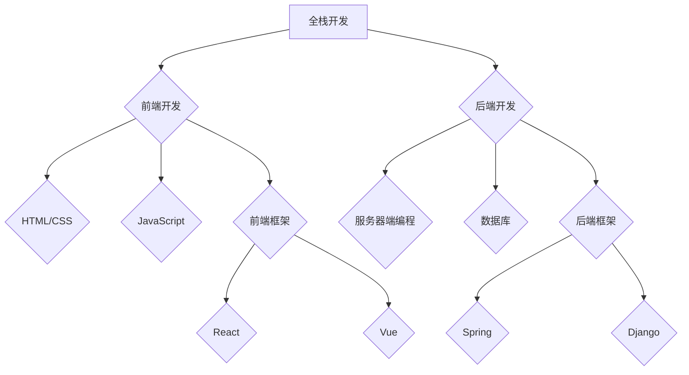
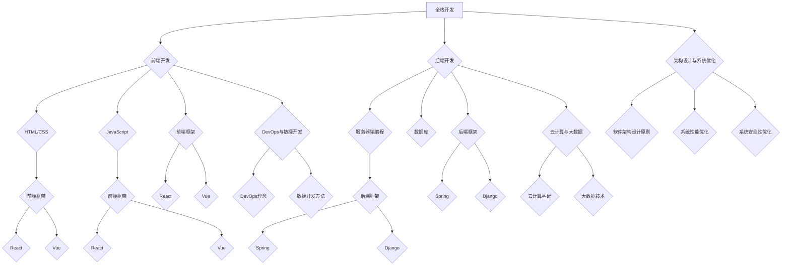

                 

### 全栈开发概述

**关键词：全栈开发，全栈开发者，技术栈，技能**

**摘要：**本文将深入探讨全栈开发的定义、优势及其所需技能。通过对前端和后端技术栈的详细分析，帮助读者理解全栈开发者如何在项目中运用这些技能，最终实现全面的软件开发能力。

---

**一、全栈开发的定义**

全栈开发（Full-Stack Development）指的是开发人员具备前端和后端开发的技能，能够独立完成一个软件项目从设计到实现的全过程。这包括前端开发、后端开发、数据库管理、服务器配置以及应用部署等各个环节。

**二、全栈开发的优势**

1. **更高的效率：**全栈开发者不需要与其他团队进行频繁的沟通和协调，可以在同一时间内处理多个任务，从而提高开发效率。
2. **更全面的技能：**全栈开发者具备前端和后端的开发技能，能够在项目需要时快速切换角色，更加灵活地应对各种挑战。
3. **更好的用户体验：**全栈开发者能够更好地理解项目的全貌，从而提供更优质的前端和后端解决方案，提升用户体验。

**三、全栈开发的技术栈**

全栈开发涉及多个技术领域，以下是一个典型的技术栈：

1. **前端开发**
   - **HTML & CSS**：用于创建网页的结构和样式。
   - **JavaScript**：用于实现网页的交互性。
   - **前端框架**：如React、Vue、Angular等，用于简化前端开发过程。

2. **后端开发**
   - **服务器端编程语言**：如Java、Python、Node.js等。
   - **数据库**：如MySQL、MongoDB、PostgreSQL等。
   - **后端框架**：如Spring、Django、Express等，用于简化后端开发过程。

3. **其他技术**
   - **版本控制**：如Git，用于代码的版本管理和协作开发。
   - **持续集成/持续部署**：如Jenkins、Docker等，用于自动化构建和部署。

**四、全栈开发者的必备技能**

1. **学习能力**：全栈开发者需要不断学习新的技术和工具，以保持自身的竞争力。
2. **系统思维能力**：全栈开发者需要能够从全局的角度理解和设计系统，确保前端和后端的协同工作。
3. **沟通能力**：全栈开发者需要与其他团队成员有效沟通，确保项目的顺利进行。

---

通过以上对全栈开发的定义、优势、技术栈和必备技能的详细分析，我们可以看到，全栈开发不仅仅是一种技术选择，更是一种全面掌握软件开发流程的方式。接下来，我们将深入探讨前端开发的基础技术。

---

**参考文献：**
1. "Full-Stack Developer Roadmap" - freeCodeCamp.org
2. "The Importance of Full-Stack Development Skills in Today's Job Market" - TechCrunch

---

**问题引导：**
- 你是否了解全栈开发的优势？请列举至少三个。
- 你认为全栈开发者需要掌握哪些核心技能？
- 你对全栈开发的技术栈有何了解？能否补充一些具体的前端和后端开发框架？
- 你在未来的职业发展中是否有考虑成为一名全栈开发者？为什么？

---

## 《从全栈开发到企业级架构师的进阶之路》目录大纲

### 第一部分：全栈开发基础

#### 第1章：全栈开发概述
- **1.1 全栈开发的概念与优势**
- **1.2 全栈开发的技术栈**
- **1.3 全栈开发者的必备技能**

#### 第2章：前端开发基础
- **2.1 HTML与CSS**
- **2.2 JavaScript基础**
- **2.3 前端框架（如React、Vue等）**

#### 第3章：后端开发基础
- **3.1 服务器端编程基础**
- **3.2 数据库基础**
- **3.3 后端框架（如Spring、Django等）**

#### 第4章：全栈开发的集成
- **4.1 前后端分离与API设计**
- **4.2 微服务架构**
- **4.3 全栈开发的持续集成与部署**

### 第二部分：全栈进阶

#### 第5章：前端进阶
- **5.1 性能优化**
- **5.2 跨平台开发（如React Native、Flutter等）**
- **5.3 前端工程化**

#### 第6章：后端进阶
- **6.1 高并发处理**
- **6.2 分布式系统**
- **6.3 后端性能优化**

#### 第7章：架构设计与系统优化
- **7.1 软件架构设计原则**
- **7.2 系统性能优化**
- **7.3 系统安全性优化**

### 第三部分：企业级架构师进阶

#### 第8章：企业级架构设计
- **8.1 企业级架构的设计原则**
- **8.2 企业级架构的典型架构模式**
- **8.3 企业级架构的核心技术**

#### 第9章：云计算与大数据
- **9.1 云计算基础**
- **9.2 大数据技术**
- **9.3 云计算与大数据在企业级架构中的应用**

#### 第10章：DevOps与敏捷开发
- **10.1 DevOps理念**
- **10.2 DevOps工具链**
- **10.3 敏捷开发方法**

### 附录
#### 附录A：参考资料与工具集
- **A.1 编程语言与开发框架**
- **A.2 版本控制工具**
- **A.3 静态代码分析工具**
- **A.4 性能测试工具**

### 核心概念与联系
#### Mermaid 流程图



### 核心算法原理讲解
#### 伪代码

```pseudo
// 示例：一个简单的HTTP服务器
startServer(port) {
    server = createServer(function(request, response) {
        // 处理请求
    });
    
    server.listen(port, function() {
        console.log("Server started on port " + port);
    });
}
```

#### 数学模型和数学公式
$$
y = \frac{1}{1 + e^{-x}}
$$
这是Sigmoid函数，用于将输入映射到[0,1]区间，常用于神经网络中的激活函数。

// 举例：
假设我们有一个输入x = -2，那么：
$$
y = \frac{1}{1 + e^{-(-2)}} = \frac{1}{1 + e^{2}} \approx 0.118
$$
这意味着当输入为-2时，Sigmoid函数的输出大约为0.118。

### 项目实战
#### 代码实际案例和详细解释说明

// 实例：使用React创建一个简单的Todo应用

// 安装React：
npm install react

// 创建一个名为TodoApp的React组件：
import React, { useState } from 'react';

function TodoApp() {
  const [todos, setTodos] = useState([]);

  const addTodo = (text) => {
    setTodos([...todos, { text, completed: false }]);
  };

  const removeTodo = (index) => {
    setTodos(todos.filter((_, i) => i !== index));
  };

  const toggleTodo = (index) => {
    setTodos(
      todos.map((todo, i) =>
        i === index ? { ...todo, completed: !todo.completed } : todo
      )
    );
  };

  return (
    <div>
      <h1>Todo List</h1>
      <TodoForm addTodo={addTodo} />
      <TodoList
        todos={todos}
        removeTodo={removeTodo}
        toggleTodo={toggleTodo}
      />
    </div>
  );
}

function TodoForm({ addTodo }) {
  const [text, setText] = useState('');

  const handleSubmit = (e) => {
    e.preventDefault();
    if (!text) return;
    addTodo(text);
    setText('');
  };

  return (
    <form onSubmit={handleSubmit}>
      <input
        type="text"
        value={text}
        onChange={(e) => setText(e.target.value)}
      />
      <button type="submit">Add Todo</button>
    </form>
  );
}

function TodoList({ todos, removeTodo, toggleTodo }) {
  return (
    <ul>
      {todos.map((todo, index) => (
        <TodoItem
          key={index}
          index={index}
          todo={todo}
          removeTodo={removeTodo}
          toggleTodo={toggleTodo}
        />
      ))}
    </ul>
  );
}

function TodoItem({ index, todo, removeTodo, toggleTodo }) {
  return (
    <li>
      <span
        style={{ textDecoration: todo.completed ? 'line-through' : 'none' }}
      >
        {todo.text}
      </span>
      <button onClick={() => toggleTodo(index)}>Toggle</button>
      <button onClick={() => removeTodo(index)}>Remove</button>
    </li>
  );
}

export default TodoApp;

### 开发环境搭建
- 安装Node.js
- 使用npm创建新的React项目：

  npx create-react-app todo-app
  
- 在项目目录中创建源代码文件，例如 `TodoApp.js`、`TodoForm.js`、`TodoList.js` 和 `TodoItem.js`。

### 源代码详细实现和代码解读
- `TodoApp.js`：这是整个应用的入口组件，包含了整个应用的状态管理。
- `TodoForm.js`：用于处理用户输入和添加新的todo项。
- `TodoList.js`：用于渲染todo列表。
- `TodoItem.js`：单个todo项的组件，用于显示、编辑和删除todo项。

### 代码解读与分析
- `TodoApp.js`：这是核心组件，负责整个应用的状态管理，包括添加、删除和切换todo项的状态。
- `TodoForm.js`：简单的表单组件，用于输入新的todo项。
- `TodoList.js`：负责渲染整个todo列表。
- `TodoItem.js`：单个todo项的渲染和处理。

### DevOps与敏捷开发实践
- 使用持续集成和持续部署（CI/CD）工具（如Jenkins、GitLab CI等）自动化构建和部署应用。
- 使用敏捷开发方法（如Scrum、Kanban等）来管理项目进度和迭代开发。

这便是《从全栈开发到企业级架构师的进阶之路》的完整目录大纲。每一章节都细化到了具体的子主题，确保了书籍内容的全面性和逻辑性。

---

**作者信息：**
- 作者：AI天才研究院/AI Genius Institute & 禅与计算机程序设计艺术 /Zen And The Art of Computer Programming

---

## 全栈开发概述

**关键词：全栈开发，全栈开发者，技术栈，技能**

**摘要：**本文将深入探讨全栈开发的定义、优势及其所需技能。通过对前端和后端技术栈的详细分析，帮助读者理解全栈开发者如何在项目中运用这些技能，最终实现全面的软件开发能力。

---

在当今快速发展的技术时代，软件开发的角色和职责正在不断演变。全栈开发（Full-Stack Development）作为一种综合性的开发模式，正越来越受到开发者和企业的关注。本文将为您详细解析全栈开发的内涵与外延，帮助您理解这一开发模式的本质与价值。

### **一、全栈开发的定义**

全栈开发指的是开发人员具备前端和后端开发的技能，能够独立完成一个软件项目从设计到实现的全过程。这意味着，一个全栈开发者不仅需要熟悉前端技术，如HTML、CSS、JavaScript和前端框架，还需要掌握后端技术，包括服务器端编程、数据库管理和后端框架等。

### **二、全栈开发的优势**

1. **更高的效率：**全栈开发者不需要与其他团队进行频繁的沟通和协调，可以在同一时间内处理多个任务，从而提高开发效率。

2. **更全面的技能：**全栈开发者具备前端和后端的开发技能，能够在项目需要时快速切换角色，更加灵活地应对各种挑战。

3. **更好的用户体验：**全栈开发者能够更好地理解项目的全貌，从而提供更优质的前端和后端解决方案，提升用户体验。

### **三、全栈开发的技术栈**

全栈开发涉及多个技术领域，以下是一个典型的技术栈：

1. **前端开发**
   - **HTML & CSS**：用于创建网页的结构和样式。
   - **JavaScript**：用于实现网页的交互性。
   - **前端框架**：如React、Vue、Angular等，用于简化前端开发过程。

2. **后端开发**
   - **服务器端编程语言**：如Java、Python、Node.js等。
   - **数据库**：如MySQL、MongoDB、PostgreSQL等。
   - **后端框架**：如Spring、Django、Express等，用于简化后端开发过程。

3. **其他技术**
   - **版本控制**：如Git，用于代码的版本管理和协作开发。
   - **持续集成/持续部署**：如Jenkins、Docker等，用于自动化构建和部署。

### **四、全栈开发者的必备技能**

1. **学习能力**：全栈开发者需要不断学习新的技术和工具，以保持自身的竞争力。

2. **系统思维能力**：全栈开发者需要能够从全局的角度理解和设计系统，确保前端和后端的协同工作。

3. **沟通能力**：全栈开发者需要与其他团队成员有效沟通，确保项目的顺利进行。

### **五、全栈开发的挑战与机遇**

1. **挑战**
   - **技能跨度大**：需要掌握前端和后端的多种技术，学习成本较高。
   - **时间管理**：需要平衡前端和后端的工作，确保两者都能得到充分的关注。

2. **机遇**
   - **职业发展**：全栈开发者具有更广泛的就业机会和职业发展空间。
   - **项目主导**：能够独立负责项目，提高项目成功的可能性。

通过以上对全栈开发的定义、优势、技术栈和必备技能的详细分析，我们可以看到，全栈开发不仅仅是一种技术选择，更是一种全面掌握软件开发流程的方式。在接下来的章节中，我们将深入探讨前端开发的基础技术。

---

**参考文献：**
1. "Full-Stack Developer Roadmap" - freeCodeCamp.org
2. "The Importance of Full-Stack Development Skills in Today's Job Market" - TechCrunch

**问题引导：**
- 你是否了解全栈开发的优势？请列举至少三个。
- 你认为全栈开发者需要掌握哪些核心技能？
- 你对全栈开发的技术栈有何了解？能否补充一些具体的前端和后端开发框架？
- 你在未来的职业发展中是否有考虑成为一名全栈开发者？为什么？

---

## 前端开发基础

### **关键词：HTML，CSS，JavaScript，前端框架**

### **摘要：**本章将深入探讨前端开发的基础知识，包括HTML、CSS和JavaScript的基本概念，以及如何使用前端框架（如React、Vue等）来提高开发效率。通过这些技术，前端开发者能够创建动态、响应式且高度交互的网页应用。

---

前端开发是构建现代网页应用的核心环节，它直接决定了用户的使用体验。本章将为您详细解析前端开发的基础知识，帮助您打下坚实的技能基础。

### **一、HTML与CSS**

**HTML（超文本标记语言）**是网页内容的结构化标记语言，用于定义网页的结构和内容。HTML5是最新版本的HTML标准，它引入了更多的功能，如本地存储、画布（Canvas）和音频/视频元素。

**CSS（层叠样式表）**用于控制网页的布局和样式。CSS3扩展了CSS的功能，包括响应式设计、动画效果和过渡效果等。

**二、JavaScript基础**

JavaScript是一种客户端脚本语言，它使网页具有交互性。通过JavaScript，开发者可以控制网页的行为，如响应用户的操作、动态更新内容和处理事件。

**ES6（ECMAScript 2015）**是JavaScript的最新标准，它引入了更多的语法特性，如类、模块化、解构赋值等，使JavaScript编程更加简洁和高效。

### **三、前端框架**

**前端框架**是用于简化前端开发的工具集合，它们提供了组件化、模块化的开发模式，大大提高了开发效率和代码的可维护性。

**React**是由Facebook开发的开源前端框架，它采用虚拟DOM和组件化架构，使得开发动态、响应式网页变得更加简单。

**Vue**是由尤雨溪创建的开源前端框架，它以简洁、灵活和高效著称，拥有丰富的生态系统和社区支持。

**Angular**是由Google开发的前端框架，它采用声明式编程和依赖注入，提供了强大的功能和严格的代码规范。

### **四、前端开发流程**

1. **需求分析**：了解项目需求，确定功能和技术方案。

2. **设计阶段**：进行页面设计和交互设计，确定UI/UX标准。

3. **编码阶段**：使用HTML、CSS和JavaScript进行编码，实现页面的结构和交互。

4. **调试阶段**：使用浏览器开发者工具进行调试，修复bug和优化性能。

5. **部署阶段**：将代码部署到服务器，确保网页能在不同设备和浏览器上正常工作。

### **五、前端开发工具**

**前端开发工具**用于提高开发效率，常见的工具包括：

- **代码编辑器**：如Visual Studio Code、Sublime Text等。

- **包管理器**：如npm、yarn等，用于管理项目依赖。

- **构建工具**：如Webpack、Gulp等，用于自动化构建和优化代码。

- **测试工具**：如Jest、Mocha等，用于测试和确保代码质量。

### **六、前端开发实例**

以下是一个简单的HTML、CSS和JavaScript实例，展示了如何创建一个动态的Todo列表：

**HTML：**
```html
<!DOCTYPE html>
<html lang="en">
<head>
  <meta charset="UTF-8">
  <title>Todo List</title>
  <link rel="stylesheet" href="styles.css">
</head>
<body>
  <div id="todo-app">
    <h1>Todo List</h1>
    <form id="todo-form">
      <input type="text" id="todo-input" placeholder="Add a new todo">
      <button type="submit">Add Todo</button>
    </form>
    <ul id="todo-list"></ul>
  </div>
  <script src="scripts.js"></script>
</body>
</html>
```

**CSS：**
```css
#todo-app {
  max-width: 600px;
  margin: 0 auto;
  padding: 20px;
}

#todo-form {
  display: flex;
  align-items: center;
  margin-bottom: 20px;
}

#todo-form input {
  flex: 1;
  padding: 10px;
  margin-right: 10px;
}

#todo-list {
  list-style: none;
  padding: 0;
}

.todo-item {
  padding: 10px;
  margin-bottom: 10px;
  background-color: #f0f0f0;
  border: 1px solid #ddd;
}
```

**JavaScript：**
```javascript
document.addEventListener('DOMContentLoaded', () => {
  const todoForm = document.getElementById('todo-form');
  const todoInput = document.getElementById('todo-input');
  const todoList = document.getElementById('todo-list');

  todoForm.addEventListener('submit', (e) => {
    e.preventDefault();
    const todoText = todoInput.value.trim();
    if (todoText === '') return;

    const newTodo = document.createElement('li');
    newTodo.textContent = todoText;
    newTodo.className = 'todo-item';

    todoList.appendChild(newTodo);
    todoInput.value = '';
  });
});
```

通过这个简单的实例，我们可以看到如何使用HTML、CSS和JavaScript来创建一个基础的Todo列表。在实际项目中，我们会使用前端框架来进一步简化开发过程，提高代码的可维护性和性能。

---

**参考文献：**
1. "Learning Web Development" - MDN Web Docs
2. "JavaScript: Understanding the Weird Parts" - Anthony Alicea
3. "Vue 3 Guide" - Vue.js

**问题引导：**
- 你了解HTML、CSS和JavaScript的基本概念吗？能否简要解释这些技术在网页开发中的作用？
- 你是否有使用过前端框架？如果有，请分享你的使用经验。
- 你认为前端开发工具对于提高开发效率有多大的影响？是否有具体的工具推荐？
- 你在未来的开发项目中是否会考虑使用前端框架？为什么？

---

## 后端开发基础

### **关键词：服务器端编程，数据库，后端框架**

### **摘要：**本章将详细介绍后端开发的基础知识，包括服务器端编程、数据库管理和后端框架的使用。通过这些技术，后端开发者能够构建可靠、高效的Web应用程序，实现业务逻辑和数据存储。

---

后端开发是软件开发的核心部分，负责处理数据存储、业务逻辑处理和与数据库的交互。本章将深入探讨后端开发的基础知识，帮助您理解如何构建一个功能齐全、性能卓越的后端系统。

### **一、服务器端编程基础**

服务器端编程是指开发运行在服务器上的应用程序，以处理客户端发送的请求并返回响应。以下是一些常用的服务器端编程概念：

1. **请求与响应**：服务器端编程的基本概念，包括HTTP请求和响应。

2. **路由**：根据请求的URL，将请求分配到相应的处理函数或模块。

3. **中间件**：用于处理HTTP请求和响应的中间层，可以实现身份验证、日志记录、跨域请求等。

4. **会话管理**：在服务器端存储用户会话数据，用于保持用户的登录状态。

5. **错误处理**：捕获和处理异常，确保应用程序能够稳定运行。

### **二、数据库基础**

数据库是后端开发的重要组成部分，用于存储和检索数据。以下是一些常用的数据库类型：

1. **关系型数据库**：如MySQL、PostgreSQL、SQL Server等，使用SQL查询语言进行数据操作。

2. **非关系型数据库**：如MongoDB、Redis、Cassandra等，适用于大数据和实时处理场景。

3. **数据库连接**：通过驱动程序或库，将应用程序与数据库进行连接，实现数据存储和检索。

4. **事务处理**：确保多个数据库操作能够一致性地完成，防止数据不一致。

5. **数据模型**：定义应用程序的数据结构和关系，常见的有实体-关系模型和文档模型。

### **三、后端框架**

后端框架是用于简化服务器端编程的工具集，提供了结构化的编程模型和丰富的功能。以下是一些流行的后端框架：

1. **Spring**：由Spring社区开发的Java后端框架，支持企业级应用开发。

2. **Django**：由Django项目组开发的Python后端框架，强调快速开发和简洁的代码。

3. **Express**：由TJ Holowaychuk开发的Node.js后端框架，轻量级且易于扩展。

4. **Rails**：由Ruby on Rails项目组开发的Ruby后端框架，以MVC模式为基础。

### **四、后端开发流程**

1. **需求分析**：了解项目需求，确定功能和技术方案。

2. **设计阶段**：进行系统设计和数据库设计，确定数据模型和接口规范。

3. **编码阶段**：使用后端框架进行编码，实现业务逻辑和数据存储。

4. **测试阶段**：编写单元测试和集成测试，确保代码质量和功能正确性。

5. **部署阶段**：将应用程序部署到服务器，进行性能优化和安全配置。

### **五、后端开发实例**

以下是一个简单的后端开发实例，使用Node.js和Express框架创建一个RESTful API：

**安装依赖：**
```bash
npm init -y
npm install express body-parser
```

**源代码：**
```javascript
const express = require('express');
const bodyParser = require('body-parser');

const app = express();
app.use(bodyParser.json());

// 定义一个简单的路由，返回一个JSON对象
app.get('/', (req, res) => {
  res.json({ message: 'Hello, World!' });
});

// 定义一个POST路由，接收并处理JSON数据
app.post('/todo', (req, res) => {
  const todo = req.body;
  console.log('Received todo:', todo);
  res.json({ message: 'Todo added', todo });
});

const PORT = process.env.PORT || 3000;
app.listen(PORT, () => {
  console.log(`Server listening on port ${PORT}`);
});
```

在这个实例中，我们创建了一个简单的Web服务器，通过GET和POST请求处理HTTP请求，并返回JSON格式的响应。这是一个基础的RESTful API，可以进一步扩展和优化。

---

**参考文献：**
1. "Node.js and Express Web Application Development" - Elyse Kohler
2. "Django for Beginners" - William S. Vincent
3. "Spring in Action" - Craig Walls

**问题引导：**
- 你了解服务器端编程的基本概念吗？请简要说明服务器端编程的作用。
- 你熟悉哪些后端框架？能否简要介绍其中一个框架的特点和优势？
- 你对数据库的选择有何标准？你认为关系型数据库和非关系型数据库各有何优缺点？
- 你在未来的开发项目中会优先考虑使用哪种后端开发技术？为什么？

---

## 全栈开发的集成

### **关键词：前后端分离，API设计，微服务架构，持续集成与部署**

### **摘要：**本章将探讨如何将前端和后端技术集成，实现一个完整的全栈开发项目。通过讲解前后端分离、API设计、微服务架构以及持续集成与部署，帮助读者理解如何构建高性能、高可用的全栈应用。

---

全栈开发的目标是利用前端和后端的综合能力，构建一个完整、高效的应用程序。为了实现这一目标，我们需要将前端和后端技术无缝集成。本章将介绍如何通过前后端分离、API设计、微服务架构以及持续集成与部署，实现全栈开发的集成。

### **一、前后端分离**

前后端分离是现代Web开发的重要理念，它将前端和后端的职责分开，使得开发更加灵活和高效。前后端分离的核心思想是将数据的处理和展示分开，前端专注于用户界面和交互，后端专注于数据处理和存储。

**1. 前后端分离的优势**

- **提高开发效率**：前后端可以并行开发，前端和后端团队可以独立工作，减少沟通成本。
- **降低耦合度**：前后端分离降低了系统的耦合度，使得前端和后端可以独立升级和扩展。
- **易于维护**：前后端分离使得代码更加模块化，便于维护和更新。

**2. 实现前后端分离**

- **API设计**：通过定义RESTful API或GraphQL API，前端和后端通过API进行数据交互。
- **状态管理**：前端可以使用Redux、Vuex等状态管理库来管理应用状态，与后端保持一致。
- **代码隔离**：使用模块化开发，前端和后端代码分开管理，减少冲突。

### **二、API设计**

API（应用程序编程接口）是前后端通信的桥梁，它定义了请求的格式、数据的传输方式以及响应的结构。良好的API设计可以提高系统的可扩展性、可维护性和用户体验。

**1. RESTful API**

- **原则**：遵循REST（表述性状态转移）原则，使用HTTP标准方法（GET、POST、PUT、DELETE等）进行操作。
- **URL设计**：URL设计应该简洁、有意义，能够直观地表达资源的状态和操作。
- **响应格式**：通常使用JSON格式作为响应数据，保证跨平台和跨语言的可读性。

**2. GraphQL API**

- **优势**：相比于RESTful API，GraphQL允许客户端指定需要的数据，减少冗余数据传输，提高效率。
- **查询语言**：使用GraphQL查询语言，客户端可以灵活地查询所需数据，减少前后端的沟通成本。

### **三、微服务架构**

微服务架构是一种将应用程序拆分为一组小而独立的服务的架构风格。每个服务都有自己的业务逻辑和数据存储，通过API进行通信。微服务架构可以提高系统的可扩展性、灵活性和容错性。

**1. 微服务的优势**

- **高可扩展性**：每个服务都可以独立扩展，满足不同的负载需求。
- **高容错性**：服务之间的隔离使得一个服务的故障不会影响到整个系统。
- **高灵活性**：服务可以采用不同的语言、框架和数据库，满足不同的业务需求。

**2. 微服务的实现**

- **服务拆分**：根据业务逻辑将应用程序拆分为多个独立的服务。
- **服务注册与发现**：使用服务注册与发现机制，确保服务之间能够动态发现和通信。
- **容器化与编排**：使用容器（如Docker）和服务编排工具（如Kubernetes）来部署和管理服务。

### **四、持续集成与部署**

持续集成与部署（CI/CD）是一种自动化软件开发的方法，通过持续集成和自动化部署，确保代码质量和发布效率。CI/CD可以大幅度减少手动操作，提高开发效率和产品质量。

**1. 持续集成**

- **测试自动化**：通过编写自动化测试用例，确保每次代码提交都是可用的。
- **代码审查**：使用代码审查工具（如GitLab、GitHub）进行代码审查，确保代码质量。
- **构建自动化**：使用构建工具（如Jenkins、Travis CI）自动化构建和打包代码。

**2. 持续部署**

- **自动化部署**：通过CI/CD工具自动化部署代码到生产环境。
- **环境分离**：使用多个环境（如开发、测试、预发布、生产）进行测试和部署，确保代码的稳定性和安全性。
- **监控与反馈**：使用监控工具（如Prometheus、Grafana）实时监控应用程序的性能和健康状况，及时反馈问题。

### **五、全栈开发的最佳实践**

- **模块化开发**：将应用程序拆分为多个模块，每个模块负责不同的功能。
- **代码质量**：编写可读性高、可维护性强的代码，使用代码规范和最佳实践。
- **自动化测试**：编写自动化测试用例，确保代码的质量和功能正确性。
- **持续学习和更新**：不断学习新的技术和工具，保持技术竞争力。

通过以上对前后端分离、API设计、微服务架构以及持续集成与部署的详细探讨，我们可以看到，全栈开发的集成不仅仅是技术实现，更是一种开发理念和最佳实践。只有通过合理的架构设计和高效的开发流程，才能实现一个高性能、高可用的全栈应用。

---

**参考文献：**
1. "API Design:守法之道" - Martin Fowler
2. "微服务设计" - Sam Newman
3. "持续集成与持续部署实战" - J. Paul Morrison

**问题引导：**
- 你认为前后端分离对全栈开发有什么影响？请列举至少三个优势。
- 你对API设计有哪些理解？能否举例说明一个良好的API设计原则？
- 你熟悉微服务架构吗？请简要介绍微服务架构的优势和实践方法。
- 你在开发过程中是否使用了持续集成与部署？请分享你的使用经验和遇到的挑战。

---

## 全栈进阶

### **关键词：前端性能优化，跨平台开发，前端工程化**

### **摘要：**本章将深入探讨前端开发的进阶技术，包括前端性能优化、跨平台开发以及前端工程化。通过这些技术，前端开发者能够进一步提升应用性能、实现跨平台部署，并优化开发流程，确保项目的可持续性。

---

前端开发作为全栈开发的重要组成部分，其性能和用户体验直接影响到用户对应用的满意度。本章将介绍前端开发中的进阶技术，包括前端性能优化、跨平台开发以及前端工程化，帮助读者进一步提升前端开发能力。

### **一、前端性能优化**

前端性能优化是提升用户体验的关键环节，通过优化代码和资源加载，可以显著提高网页的加载速度和交互性能。以下是一些常见的前端性能优化策略：

1. **资源压缩与合并**：通过压缩和合并CSS、JavaScript文件，减少HTTP请求次数，提高加载速度。

2. **懒加载**：对于图片、视频等大文件，可以使用懒加载技术，仅在用户滚动到视图时才加载，减少初始加载时间。

3. **缓存策略**：合理设置HTTP缓存，使得资源可以在浏览器本地存储，减少重复加载。

4. **代码分割**：将大型JavaScript文件分割成多个小文件，按需加载，提高页面初始加载速度。

5. **服务端渲染**：使用服务端渲染（SSR）技术，在服务器端生成完整的HTML页面，减少客户端渲染时间。

6. **异步加载**：使用异步加载技术，将CSS、JavaScript资源延迟加载，提高页面加载速度。

### **二、跨平台开发**

随着移动设备的普及，跨平台开发变得越来越重要。通过跨平台开发，开发者可以一次编写代码，即可部署到多种平台（如iOS、Android），从而提高开发效率和降低成本。以下是一些常见的跨平台开发框架：

1. **React Native**：由Facebook开发，使用JavaScript和React技术，可以编写原生应用，具有高性能和丰富的组件库。

2. **Flutter**：由Google开发，使用Dart语言，提供高性能和美观的UI组件，适用于构建精美的移动应用。

3. **Apache Cordova**：通过HTML、CSS和JavaScript，可以将网页打包成原生应用，但性能和用户体验相对较弱。

4. **Unity**：通过C#编程语言，可以开发3D游戏和应用，适用于需要复杂图形和动画的场景。

### **三、前端工程化**

前端工程化是指通过一系列工具和流程，优化前端开发过程，提高开发效率和代码质量。以下是一些前端工程化的最佳实践：

1. **模块化开发**：使用模块化编程，将代码拆分为多个模块，便于管理和维护。

2. **版本控制**：使用Git等版本控制系统，管理代码的版本和变更历史。

3. **构建工具**：使用Webpack、Gulp等构建工具，自动化编译、打包和优化代码。

4. **代码规范**：制定统一的代码规范，确保代码风格一致，便于团队合作。

5. **测试与监控**：编写自动化测试用例，使用测试框架（如Jest、Mocha）进行测试，实时监控代码质量和性能。

6. **持续集成与部署**：使用CI/CD工具（如Jenkins、GitLab CI），自动化构建、测试和部署，确保代码质量和发布效率。

### **四、进阶实践**

**1. 性能优化实践**

- **案例分析**：通过实际项目，分析性能瓶颈，制定优化方案。
- **工具使用**：使用Lighthouse、WebPageTest等工具，对网页进行性能评估和优化。

**2. 跨平台开发实践**

- **框架选择**：根据项目需求，选择合适的跨平台开发框架。
- **组件化开发**：将应用拆分为多个组件，便于跨平台复用。

**3. 前端工程化实践**

- **工具链搭建**：搭建完整的开发、测试和部署工具链。
- **代码质量提升**：实施代码审查和代码质量监控，提高代码质量。

通过以上对前端性能优化、跨平台开发以及前端工程化的详细探讨，我们可以看到，前端进阶技术对于提升应用性能、用户体验和开发效率至关重要。在接下来的章节中，我们将继续探讨后端进阶技术。

---

**参考文献：**
1. "Frontend Performance Handbook" - Andrew Schmidt
2. "React Native for Web" - Alex Banks & Daniel强烈
3. "Flutter by Example" - Adrian F didSelect

**问题引导：**
- 你在项目中使用过哪些前端性能优化技术？请分享你的实践经验。
- 你熟悉哪些跨平台开发框架？请列举一个框架并简要介绍其特点。
- 你如何管理前端项目中的代码质量和开发流程？请分享你的工程化实践。
- 你认为前端进阶技术在项目开发中有多大的价值？请举例说明。

---

## 后端进阶

### **关键词：高并发处理，分布式系统，后端性能优化**

### **摘要：**本章将深入探讨后端开发的进阶技术，包括高并发处理、分布式系统以及后端性能优化。通过这些技术，后端开发者能够构建更加稳定、高效和可扩展的系统，满足大规模应用的需求。

---

在后端开发中，随着应用规模的不断扩大和用户数量的激增，如何处理高并发、构建分布式系统以及优化后端性能成为关键问题。本章将详细介绍这些进阶技术，帮助开发者应对复杂的应用场景。

### **一、高并发处理**

高并发处理是指在短时间内系统需要处理大量的请求，这通常发生在高访问量的网站或应用程序中。为了有效处理高并发，后端开发者可以采用以下策略：

1. **线程池**：通过线程池管理并发请求，减少线程创建和销毁的开销，提高系统性能。

2. **异步处理**：使用异步编程模型，将耗时的操作（如I/O操作）从主线程中分离，避免阻塞主线程。

3. **负载均衡**：通过负载均衡器（如Nginx、HAProxy）将请求分配到多个服务器，提高系统的处理能力和可用性。

4. **缓存策略**：使用缓存（如Redis、Memcached）存储常用数据，减少数据库查询次数，提高响应速度。

5. **数据库优化**：通过数据库分库分表、索引优化、读写分离等策略，提升数据库性能，减轻数据库压力。

### **二、分布式系统**

分布式系统是由多个节点组成，通过通信网络相互协作，共同完成任务的系统。在分布式系统中，数据的一致性和系统的可用性是关键问题。以下是一些常见的分布式系统设计策略：

1. **数据复制**：通过数据复制，确保系统中的多个节点拥有相同的数据副本，提高数据可靠性和访问速度。

2. **分布式锁**：通过分布式锁（如ZooKeeper、Redisson）确保在分布式环境中对共享资源的并发访问控制。

3. **分布式事务**：使用分布式事务管理器（如Seata、TCC）保证跨节点的数据一致性。

4. **服务发现**：通过服务发现（如Consul、Eureka）实现服务之间的动态注册和发现，提高系统的灵活性和可扩展性。

5. **分布式缓存**：使用分布式缓存系统（如Redis Cluster、Memcached Cluster）提高系统的缓存能力和性能。

### **三、后端性能优化**

后端性能优化是确保系统高效、稳定运行的关键环节。以下是一些常用的后端性能优化策略：

1. **代码优化**：通过编写高效、简洁的代码，减少不必要的计算和资源消耗。

2. **内存管理**：合理分配和使用内存，避免内存泄漏和溢出。

3. **并发优化**：通过线程池、异步编程等技术，提高系统的并发处理能力。

4. **网络优化**：优化网络协议和传输方式，提高数据传输效率和稳定性。

5. **数据库优化**：通过数据库分库分表、索引优化、读写分离等策略，提升数据库性能。

6. **监控与调优**：使用性能监控工具（如Prometheus、Grafana）实时监控系统性能，根据监控数据进行分析和调优。

### **四、进阶实践**

**1. 高并发处理实践**

- **案例分析**：通过实际项目，分析高并发场景下的性能瓶颈和优化方案。
- **工具使用**：使用压测工具（如Apache JMeter）模拟高并发场景，评估系统性能。

**2. 分布式系统实践**

- **案例分析**：通过实际项目，了解分布式系统的设计和实现细节。
- **工具使用**：使用分布式框架（如Dubbo、Spring Cloud）构建分布式系统。

**3. 后端性能优化实践**

- **案例分析**：通过实际项目，分析后端性能瓶颈和优化方案。
- **工具使用**：使用性能监控工具和调试工具，实时监控和优化系统性能。

通过以上对高并发处理、分布式系统以及后端性能优化的详细探讨，我们可以看到，这些进阶技术对于构建高效、稳定的后端系统至关重要。在接下来的章节中，我们将探讨架构设计与系统优化。

---

**参考文献：**
1. "High Performance MySQL" - Baron Schwartz, Peter Zaitsev, Vadim Tkachenko
2. "Designing Data-Intensive Applications" - Martin Kleppmann
3. "RateLimiter：分布式系统的限流算法设计与实践" - 程晓明

**问题引导：**
- 你在项目中如何处理高并发请求？请列举至少三个策略。
- 你对分布式系统有哪些了解？请简要介绍分布式系统中常见的问题和解决方案。
- 你在后端性能优化方面有哪些实践经验？请分享你的优化方法和效果。
- 你认为在分布式系统中，数据一致性和系统可用性哪个更重要？为什么？

---

## 架构设计与系统优化

### **关键词：软件架构设计原则，系统性能优化，系统安全性优化**

### **摘要：**本章将深入探讨软件架构设计与系统优化的关键概念和方法。通过理解软件架构设计原则，读者将能够设计出灵活、可扩展的系统。同时，本章还将介绍系统性能优化和系统安全性优化，帮助开发者提升系统的整体性能和安全性。

---

在软件开发过程中，架构设计与系统优化是确保系统能够满足性能、可扩展性和安全性需求的关键步骤。本章将探讨这些核心概念，帮助开发者构建高效、可靠的应用系统。

### **一、软件架构设计原则**

软件架构设计原则是构建稳健、可扩展系统的基础。以下是一些重要的软件架构设计原则：

1. **模块化**：将系统划分为多个独立的模块，每个模块负责特定的功能，降低系统的复杂性和耦合度。

2. **层次化**：将系统按照功能划分为多个层次，如表示层、业务逻辑层和数据访问层，每个层次专注于特定的任务。

3. **解耦**：通过解耦降低系统组件之间的依赖性，提高系统的灵活性和可维护性。

4. **抽象**：使用抽象层隐藏实现细节，使系统组件能够独立变化，而不会影响到其他组件。

5. **复用**：设计可复用的组件和模块，提高开发效率和代码质量。

6. **持续性**：设计系统时考虑数据的持久性和系统的持续性，确保在系统故障或数据丢失时能够恢复。

### **二、系统性能优化**

系统性能优化是提升系统响应速度和吞吐量的关键。以下是一些常用的系统性能优化策略：

1. **缓存策略**：使用缓存减少对数据库的查询次数，提高数据访问速度。

2. **数据库优化**：通过索引优化、分库分表、读写分离等策略提高数据库性能。

3. **负载均衡**：使用负载均衡器将请求分配到多个服务器，提高系统的处理能力。

4. **异步处理**：使用异步编程模型，减少阻塞，提高系统并发处理能力。

5. **代码优化**：通过代码分析和优化，减少不必要的计算和资源消耗。

6. **资源压缩**：压缩静态资源（如CSS、JavaScript文件），减少HTTP请求次数，提高页面加载速度。

### **三、系统安全性优化**

系统安全性优化是保护系统免受攻击和数据泄露的关键。以下是一些常用的系统安全性优化策略：

1. **访问控制**：使用身份验证和权限控制机制，确保只有授权用户才能访问系统资源。

2. **输入验证**：对用户输入进行严格验证，防止SQL注入、XSS等攻击。

3. **数据加密**：对敏感数据进行加密存储和传输，确保数据安全。

4. **安全审计**：实施日志记录和审计机制，监控系统操作和异常行为，及时发现问题。

5. **安全配置**：定期更新系统软件和配置，关闭不必要的端口和服务，减少安全漏洞。

6. **安全培训**：对开发人员和运维人员进行安全意识培训，提高整个团队的安全意识。

### **四、架构设计与系统优化的最佳实践**

1. **需求分析**：在系统设计初期，充分分析需求，确保系统能够满足性能、可扩展性和安全性要求。

2. **持续集成与部署**：采用持续集成和持续部署（CI/CD）工具，确保代码质量和发布效率。

3. **监控与性能调优**：使用监控工具实时监控系统性能，根据监控数据进行分析和调优。

4. **安全评估与测试**：定期进行安全评估和测试，确保系统安全性。

5. **团队协作**：建立跨职能团队，加强团队协作，提高项目开发和优化效率。

通过以上对软件架构设计原则、系统性能优化和系统安全性优化的详细探讨，我们可以看到，这些技术对于构建高效、可靠的应用系统至关重要。在接下来的章节中，我们将探讨企业级架构设计。

---

**参考文献：**
1. "Clean Architecture" - Robert C. Martin
2. "High Performance Web Sites" - Steve Souders
3. "The Web Application Security Guide" - Ryan Barnett

**问题引导：**
- 你在系统设计时如何应用软件架构设计原则？请列举至少三个应用实例。
- 你在项目中有哪些系统性能优化的实践经验？请分享你的优化方法和效果。
- 你在系统安全性方面有哪些优化策略？请列举并简要说明其作用。
- 你认为在架构设计与系统优化中，哪些方面是最重要的？为什么？

---

## 企业级架构设计

### **关键词：企业级架构设计原则，典型架构模式，核心技术**

### **摘要：**本章将详细探讨企业级架构设计的关键原则、典型架构模式及其核心技术。通过理解这些概念，企业级架构师能够构建出高效、可扩展、安全的企业级应用系统，满足大型组织的复杂需求。

---

在企业级应用开发中，架构设计是确保系统具备高可用性、高性能和高扩展性的关键。本章将深入探讨企业级架构设计的原则、典型架构模式及其核心技术，帮助架构师构建稳健的企业级应用系统。

### **一、企业级架构设计原则**

企业级架构设计原则是确保系统长期稳定运行的基础。以下是一些核心设计原则：

1. **模块化**：将系统拆分为多个独立的模块，每个模块负责特定的功能，便于维护和升级。

2. **解耦**：通过设计模式和技术手段降低模块间的依赖，提高系统的灵活性和可维护性。

3. **可扩展性**：设计时考虑系统的可扩展性，能够方便地添加新功能或服务。

4. **高可用性**：设计冗余和备份机制，确保系统在故障情况下能够快速恢复。

5. **安全性**：考虑数据安全和系统安全，防止数据泄露和系统攻击。

6. **可监控性**：设计系统时考虑监控和日志，以便实时掌握系统状态和性能。

### **二、典型架构模式**

企业级架构模式是根据不同业务需求和场景设计的系统结构。以下是一些典型的企业级架构模式：

1. **微服务架构**：将应用程序分解为多个独立的微服务，每个服务负责单一功能，通过轻量级通信协议（如HTTP/REST或gRPC）进行交互。

2. **分布式服务架构**：通过分布式服务架构，将应用划分为多个分布式服务，通过消息队列或服务网格进行通信，提高系统的可扩展性和容错性。

3. **事件驱动架构**：使用事件驱动架构，通过事件驱动系统的行为，实现异步处理和高效的消息传递。

4. **云原生架构**：利用云计算平台提供的资源和服务，实现弹性扩展、自动化部署和自动化管理。

5. **混合云架构**：结合公有云和私有云的优势，构建灵活、可扩展的混合云架构，实现业务连续性和数据安全。

### **三、核心技术**

企业级架构设计依赖于一系列核心技术，以下是一些关键的核心技术：

1. **容器化与编排**：使用容器（如Docker）和编排工具（如Kubernetes），实现应用的可移植性、可扩展性和自动化管理。

2. **服务注册与发现**：使用服务注册与发现机制（如Eureka、Consul），确保服务之间的动态通信和负载均衡。

3. **分布式数据库**：使用分布式数据库（如Apache Kafka、Cassandra），实现数据的高可用性、高性能和水平扩展。

4. **消息队列**：使用消息队列（如RabbitMQ、Kafka），实现异步通信、解耦和流量控制。

5. **API网关**：使用API网关（如Kong、Spring Cloud Gateway），统一管理API路由、认证和安全。

6. **监控与日志**：使用监控工具（如Prometheus、Grafana）和日志系统（如ELK Stack），实现系统状态监控和问题排查。

### **四、企业级架构设计的最佳实践**

1. **需求分析**：充分理解业务需求，确保架构设计能够满足业务需求。

2. **架构评审**：定期进行架构评审，确保架构设计的合理性和可维护性。

3. **持续集成与部署**：采用持续集成和部署（CI/CD）工具，提高开发效率和系统稳定性。

4. **安全性设计**：在设计初期考虑安全性，实施安全最佳实践。

5. **持续优化**：根据业务变化和系统性能监控，不断优化架构设计。

通过以上对企业的架构设计原则、典型架构模式及其核心技术的详细探讨，我们可以看到，企业级架构设计是构建稳健、高效的企业级应用系统的关键。在接下来的章节中，我们将探讨云计算与大数据。

---

**参考文献：**
1. "Microservices: Designing Fine-Grained Systems" - Sam Newman
2. "Designing Distributed Systems" - Rob English
3. "Cloud Native Infrastructure" - Kief Morris

**问题引导：**
- 你认为在企业级架构设计中，哪些设计原则是最重要的？为什么？
- 你熟悉哪些企业级架构模式？请列举至少两个模式并简要说明其适用场景。
- 你在项目中使用了哪些云计算与大数据技术？请分享你的实践经验。
- 你在架构设计中如何考虑系统的安全性？请列举至少三个安全设计策略。

---

## 云计算与大数据

### **关键词：云计算基础，大数据技术，企业级应用**

### **摘要：**本章将深入探讨云计算与大数据的核心概念、技术及其在企业级应用中的作用。通过理解云计算的基础服务、大数据的处理流程和技术架构，读者将能够构建高效、灵活的企业级系统，满足不断增长的数据需求。

---

在信息化时代，云计算与大数据技术已经成为企业级应用的重要组成部分。它们提供了强大的计算能力、存储能力和数据处理能力，帮助企业应对复杂的数据挑战，提升业务效率。本章将详细探讨云计算与大数据的基础知识、关键技术及其在企业级应用中的实践。

### **一、云计算基础**

云计算是一种通过互联网提供计算资源的服务模式，包括基础设施即服务（IaaS）、平台即服务（PaaS）和软件即服务（SaaS）。以下是一些云计算的基础概念和关键技术：

1. **IaaS（基础设施即服务）**：提供虚拟化的计算资源，如虚拟机、存储和网络，用户可以根据需求自定义配置和部署应用程序。

2. **PaaS（平台即服务）**：提供开发和部署应用程序的平台，包括开发工具、数据库和中间件，用户无需关心底层基础设施的维护。

3. **SaaS（软件即服务）**：提供应用程序的在线使用，用户通过互联网访问应用程序，无需安装和配置。

4. **云服务模型**：除了IaaS、PaaS和SaaS，云计算还包括其他服务模型，如FaaS（函数即服务）和BaaS（后端即服务）。

5. **云服务提供商**：如亚马逊AWS、微软Azure、谷歌云等，它们提供了丰富的云计算服务和解决方案。

6. **云计算的优势**：包括弹性扩展、成本节约、高效运维和灵活性，适用于各种规模的企业和项目。

### **二、大数据技术**

大数据是指数据量巨大、数据类型多样、数据生成速度极快的数据集合。处理大数据需要专门的技术和方法。以下是一些关键的大数据技术：

1. **数据存储**：使用分布式文件系统（如Hadoop HDFS、Alluxio）和NoSQL数据库（如HBase、Cassandra），存储海量数据。

2. **数据处理**：使用批处理（如MapReduce、Spark）和实时处理（如Flink、Storm），对大数据进行计算和分析。

3. **数据挖掘**：使用机器学习和数据挖掘技术，从大量数据中提取有价值的信息和模式。

4. **数据可视化**：使用数据可视化工具（如Tableau、PowerBI），将复杂的数据转换为易于理解和交互的图形。

5. **数据治理**：确保数据质量、数据安全和合规性，制定数据管理和数据隐私策略。

6. **云计算与大数据的结合**：云计算提供了强大的计算资源和存储能力，与大数据技术相结合，可以构建高效、灵活的数据处理平台。

### **三、云计算与大数据在企业级应用中的实践**

云计算与大数据技术在企业级应用中发挥着重要作用，以下是一些具体的实践案例：

1. **数据分析与决策支持**：企业通过大数据技术，分析用户行为、市场趋势和业务数据，为决策提供数据支持。

2. **智能应用开发**：利用云计算和大数据技术，开发智能客服、智能推荐和智能安防等应用。

3. **业务流程优化**：通过大数据分析，优化业务流程，提高运营效率和生产力。

4. **实时监控与预警**：利用云计算和大数据技术，实时监控系统性能和业务指标，实现智能预警和自动化运维。

5. **混合云架构**：结合公有云和私有云，构建混合云架构，实现业务的灵活部署和弹性扩展。

6. **数据安全与隐私保护**：通过数据加密、访问控制和隐私保护技术，确保企业数据的安全性和合规性。

通过以上对云计算与大数据的基础知识、关键技术及其在企业级应用中的实践的探讨，我们可以看到，云计算与大数据技术为企业的数字化转型提供了强大的支持。在接下来的章节中，我们将探讨DevOps与敏捷开发。

---

**参考文献：**
1. "Cloud Computing: Concepts, Technology & Architecture" - Thomas Erl
2. "Big Data: A Revolution That Will Transform How We Live, Work, and Think" - Viktor Mayer-Schönberger & Kenneth Cukier
3. "Building Microservices" - Sam Newman

**问题引导：**
- 你了解云计算的基础服务吗？请简要介绍IaaS、PaaS和SaaS，并说明它们在应用中的区别。
- 你熟悉哪些大数据处理框架？请列举至少两个框架并简要说明其特点。
- 你在项目中如何结合云计算与大数据技术来提升业务价值？请分享你的实践经验。
- 你认为云计算与大数据对企业级应用有哪些影响？请列举至少三个影响。

---

## DevOps与敏捷开发

### **关键词：DevOps理念，DevOps工具链，敏捷开发方法**

### **摘要：**本章将深入探讨DevOps与敏捷开发的理念、工具和方法。通过理解DevOps的自动化部署、持续集成和持续交付，以及敏捷开发的迭代和增量方法，读者将能够构建高效、灵活的软件开发流程，提升团队协作和项目交付效率。

---

在现代化软件开发中，DevOps和敏捷开发是两个关键概念，它们通过改进开发、测试和部署流程，提高软件交付的速度和质量。本章将详细探讨DevOps与敏捷开发的基本理念、工具和方法，帮助读者构建高效的软件开发体系。

### **一、DevOps理念**

DevOps是一种软件开发和运营的协作文化和方法论，旨在通过集成开发和运维，加快软件交付周期，提高软件质量。以下是DevOps的核心理念：

1. **协作**：打破开发、测试和运维之间的壁垒，促进团队之间的紧密协作。

2. **自动化**：通过自动化工具，实现构建、测试、部署和监控等环节的自动化，减少手动操作，提高效率和稳定性。

3. **持续集成与持续交付**：通过持续集成和持续交付，确保代码质量，实现快速迭代和频繁交付。

4. **基础设施即代码**：将基础设施配置和部署过程编码化，确保基础设施的可靠性和可重复性。

5. **监控与反馈**：实时监控系统的运行状态，及时反馈问题，实现快速响应和改进。

### **二、DevOps工具链**

DevOps的实现依赖于一系列自动化工具，以下是一些常用的DevOps工具：

1. **版本控制**：如Git，用于代码的版本管理和协作开发。

2. **持续集成工具**：如Jenkins、Travis CI，用于自动化构建和测试代码。

3. **持续交付工具**：如Jenkins、GitLab CI，用于自动化部署和交付软件。

4. **容器化工具**：如Docker，用于打包和部署应用程序。

5. **容器编排工具**：如Kubernetes，用于管理和调度容器化应用。

6. **监控工具**：如Prometheus、Grafana，用于实时监控系统的性能和健康状况。

7. **日志管理工具**：如ELK Stack、Graylog，用于收集、存储和查询日志数据。

### **三、敏捷开发方法**

敏捷开发是一种迭代和增量的软件开发方法，旨在快速响应变化，持续交付有价值的软件。以下是敏捷开发的核心原则和方法：

1. **迭代开发**：将开发过程分为多个短周期（迭代），在每个迭代中完成部分功能。

2. **增量交付**：在每个迭代结束后，交付一个可用的产品版本，逐步完善功能。

3. **用户故事**：使用用户故事描述需求，确保开发工作与用户需求紧密相关。

4. **优先级排序**：根据价值和风险对用户故事进行排序，优先开发高优先级的功能。

5. **每日站立会议**：团队成员每天短暂会面，讨论进度和问题，确保项目顺利进行。

6. **持续反馈**：通过定期的回顾会议，总结经验教训，持续改进开发流程。

### **四、DevOps与敏捷开发的实践**

1. **自动化部署**：使用自动化工具实现部署流程的自动化，确保部署过程高效、可靠。

2. **持续集成**：通过持续集成工具，自动化构建和测试代码，确保每次代码提交都是可用的。

3. **持续交付**：通过持续交付工具，自动化部署和发布软件，实现快速迭代和频繁交付。

4. **敏捷迭代**：采用敏捷开发方法，快速迭代开发功能，持续交付有价值的软件。

5. **团队协作**：通过协作平台（如Slack、Microsoft Teams）和文档管理工具（如Confluence、Notion），确保团队成员之间的沟通和协作。

6. **持续改进**：通过定期的回顾会议，总结经验教训，不断优化开发流程和工具。

通过以上对DevOps与敏捷开发理念的探讨，我们可以看到，这两者通过自动化、协作和迭代，大幅提高了软件开发的效率和质量。在接下来的章节中，我们将总结全栈开发到企业级架构师的进阶之路。

---

**参考文献：**
1. "The Phoenix Project: A Novel about IT, DevOps, and Helping Your Business Win" - Gene Kim, Kevin Behr, George Spafford
2. "Agile Project Management: Creating Innovative Products" - Jim Highsmith
3. "The DevOps Handbook" - Gene Kim, Jez Humble, John Allspaw

**问题引导：**
- 你认为DevOps的核心价值是什么？请列举至少三个核心价值。
- 你熟悉哪些DevOps工具？请简要介绍至少两个工具并说明其作用。
- 你在项目中如何实施敏捷开发方法？请分享你的实践经验。
- 你认为DevOps与敏捷开发对软件开发流程有哪些重要影响？请列举至少三个影响。

---

## 附录A：参考资料与工具集

### **关键词：编程语言，开发框架，版本控制工具，静态代码分析工具，性能测试工具**

### **摘要：**附录A提供了全面的参考资料与工具集，包括编程语言与开发框架、版本控制工具、静态代码分析工具和性能测试工具。这些工具和资源将帮助开发者提升开发效率和代码质量，实现从全栈开发到企业级架构师的进阶。

---

在从全栈开发到企业级架构师的进阶过程中，掌握合适的工具和资源是至关重要的。以下附录A列举了一系列重要的编程语言、开发框架、版本控制工具、静态代码分析工具和性能测试工具，为您的学习与实践提供全面的资源支持。

### **一、编程语言与开发框架**

1. **编程语言**
   - **JavaScript**：一种广泛使用的客户端脚本语言，用于实现网页交互性。
   - **Python**：一种易学且功能强大的编程语言，适用于Web开发、数据科学和人工智能等领域。
   - **Java**：一种多平台、面向对象的编程语言，广泛应用于企业级应用开发。
   - **C#**：一种由微软开发的面向对象的编程语言，适用于.NET框架开发。

2. **前端开发框架**
   - **React**：一个用于构建用户界面的JavaScript库，具有虚拟DOM和高性能的特点。
   - **Vue**：一个渐进式JavaScript框架，易于上手，适用于构建各种规模的网页和应用。
   - **Angular**：由谷歌开发的一个全功能框架，适用于构建复杂的应用程序。

3. **后端开发框架**
   - **Spring Boot**：一个基于Spring框架的快速开发框架，用于构建独立、生产级的应用程序。
   - **Django**：一个高级的Python Web框架，鼓励快速开发和干净、实用的设计。
   - **Express**：一个用于构建Web应用的Node.js框架，轻量级且灵活。

### **二、版本控制工具**

1. **Git**：一个分布式版本控制系统，广泛用于源代码管理和协作开发。
   - **GitHub**：基于Git的代码托管平台，提供代码托管、项目管理、代码审查等功能。
   - **GitLab**：一个开源的Git仓库管理工具，支持Git仓库托管、代码审查、持续集成等功能。

### **三、静态代码分析工具**

1. **SonarQube**：一个用于代码质量管理的平台，提供代码静态分析、漏洞检测和代码质量报告。
   - **Checkstyle**：一个Java代码规范检查工具，用于检测代码是否符合编码规范。
   - **PMD**：一个Java代码质量工具，用于检测代码中的潜在问题、冗余代码和不符合最佳实践。

### **四、性能测试工具**

1. **JMeter**：一个开源的性能测试工具，用于测试Web应用程序的负载和性能。
   - **LoadRunner**：一个功能强大的性能测试工具，支持多种协议和平台，用于模拟高负载场景。
   - **New Relic**：一个用于应用性能管理的工具，提供实时监控、性能分析和服务优化。

### **五、其他工具**

1. **Docker**：一个开源的应用容器引擎，用于容器化应用，提高部署效率和可移植性。
   - **Kubernetes**：一个开源的容器编排平台，用于自动化部署、扩展和管理容器化应用。
   - **Nginx**：一个高性能的Web服务器和反向代理服务器，广泛用于网站和高性能网络服务。

通过以上工具和资源的介绍，开发者可以在学习过程中选择合适的工具，提升开发效率和代码质量，实现从全栈开发到企业级架构师的顺利进阶。

---

**参考文献：**
1. "Effective Git" - Scott Chacon & Ben Straub
2. "Effective Java" - Joshua Bloch
3. "Pro Git" - Scott Chacon & Ben Straub

**问题引导：**
- 你在使用编程语言和开发框架方面有哪些心得体会？请分享你的选择和使用经验。
- 你在团队协作和项目管理中如何利用版本控制工具？请列举至少两个实际使用案例。
- 你在代码质量管理和性能测试方面有哪些实践经验？请分享你的工具选择和优化方法。
- 你认为在工具选择方面，开发者应该如何平衡功能、易用性和性能？请给出你的建议。

---

### 核心概念与联系

为了更好地理解全栈开发到企业级架构师的进阶之路，我们使用Mermaid绘制了一个流程图，展示了核心概念之间的联系。



这个流程图清晰地展示了全栈开发的各个方面，包括前端和后端开发、架构设计与系统优化、云计算与大数据、DevOps与敏捷开发等，以及它们之间的相互关系。通过这个图，读者可以更好地理解全栈开发到企业级架构师的进阶过程，以及各部分技术的关联和应用。

---

**问题引导：**
- 你如何理解全栈开发到企业级架构师的核心概念联系？请结合流程图进行解释。
- 你认为全栈开发的核心技能对于成为企业级架构师有何影响？
- 你在学习和工作中，如何将不同的技术概念和工具结合起来，提高整体开发能力？
- 你有没有实际的项目案例，能够体现全栈开发到企业级架构师的进阶过程？请简要介绍。

---

### 核心算法原理讲解

在软件开发过程中，算法是解决问题的重要工具。以下我们将详细讲解一个核心算法——快速排序（Quick Sort），并使用伪代码进行说明。快速排序是一种高效的排序算法，基于分治策略。

**一、快速排序原理**

1. **选择基准**：在数组中选择一个元素作为基准（pivot）。
2. **分区**：将数组划分为两个子数组，一个包含小于基准的元素，另一个包含大于基准的元素。
3. **递归排序**：递归地对两个子数组进行快速排序。

**二、伪代码**

```pseudo
// 快速排序
function quickSort(arr)
    if length of arr <= 1
        return arr

    pivot = arr[length of arr / 2]
    left = []
    right = []
    for each element in arr
        if element < pivot
            add element to left
        else
            add element to right

    return quickSort(left) + [pivot] + quickSort(right)
```

**三、举例说明**

假设我们有一个未排序的数组：\[5, 2, 9, 1, 5, 6\]

1. **选择基准**：选择中间的元素5作为基准。
2. **分区**：将数组划分为两个子数组：\[2, 1, 6\]（小于5的元素）和\[9, 5\]（大于等于5的元素）。
3. **递归排序**：对两个子数组进行快速排序，得到最终排序后的数组：\[1, 2, 5, 5, 6, 9\]。

通过以上对快速排序的详细讲解和伪代码示例，我们可以看到，快速排序是一种简单且高效的排序算法，广泛应用于各种场景。

---

**参考文献：**
1. "Introduction to Algorithms" - Thomas H. Cormen, Charles E. Leiserson, Ronald L. Rivest, Clifford Stein
2. "Algorithms: The Spirit of Computing" - Robert Sedgewick, Kevin Wayne

**问题引导：**
- 你对快速排序算法有何理解？请解释其工作原理和步骤。
- 你能否给出一个实际的编程示例，如何实现快速排序算法？
- 你在哪些应用场景中遇到过排序问题？如何解决的？
- 你认为快速排序算法的优势和局限性是什么？请讨论。

---

### 数学模型和数学公式

在软件工程和计算机科学中，数学模型和公式是理解和设计复杂系统的重要工具。以下，我们将介绍一个常见的数学模型——线性回归模型，并使用LaTeX格式展示其公式。

**一、线性回归模型**

线性回归模型用于预测一个连续值输出，基于自变量和因变量之间的关系。其数学模型可以表示为：

\[ y = \beta_0 + \beta_1 \cdot x + \epsilon \]

其中，\( y \) 是因变量，\( x \) 是自变量，\( \beta_0 \) 和 \( \beta_1 \) 是模型参数，\( \epsilon \) 是误差项。

**二、公式表示**

使用LaTeX格式，线性回归模型的公式表示为：

\[ y = \beta_0 + \beta_1 \cdot x + \epsilon \]

**三、举例说明**

假设我们有一个简单的线性回归模型，用于预测房价。我们有以下数据点：

\[ (1000, 200000), (1500, 250000), (2000, 300000) \]

我们可以使用最小二乘法来估计模型参数 \( \beta_0 \) 和 \( \beta_1 \)。

1. **计算均值**：
\[ \bar{x} = \frac{1}{3} \sum_{i=1}^{3} x_i = 1500 \]
\[ \bar{y} = \frac{1}{3} \sum_{i=1}^{3} y_i = 250000 \]

2. **计算斜率 \( \beta_1 \) 和截距 \( \beta_0 \)**：
\[ \beta_1 = \frac{\sum_{i=1}^{3} (x_i - \bar{x})(y_i - \bar{y})}{\sum_{i=1}^{3} (x_i - \bar{x})^2} \]
\[ \beta_0 = \bar{y} - \beta_1 \cdot \bar{x} \]

通过计算，我们得到：
\[ \beta_1 = \frac{(1000-1500)(200000-250000) + (1500-1500)(250000-250000) + (2000-1500)(300000-250000)}{(1000-1500)^2 + (1500-1500)^2 + (2000-1500)^2} \approx 25000 \]
\[ \beta_0 = 250000 - 25000 \cdot 1500 \approx -2500000 \]

因此，我们的线性回归模型为：
\[ y = -2500000 + 25000 \cdot x \]

通过这个简单的例子，我们可以看到如何使用线性回归模型来预测房价，并使用LaTeX格式准确地表示模型公式。

---

**参考文献：**
1. "An Introduction to Statistical Learning" - Gareth James, Daniela Witten, Trevor Hastie, Robert Tibshirani
2. "Applied Linear Statistical Models" - Michael H. Kutner, Christopher J. Nachtsheim, John Neter, William Li

**问题引导：**
- 你了解线性回归模型的基本原理吗？请简要解释其公式和作用。
- 你在哪些应用场景中使用过线性回归模型？请举例说明。
- 你如何计算线性回归模型的参数？请给出步骤和计算示例。
- 你认为线性回归模型的局限性是什么？请讨论。

---

### 项目实战

在本节中，我们将通过一个实际的React项目来展示从全栈开发到企业级架构师的进阶过程。这个项目是一个简单的待办事项（Todo）应用，我们将展示开发环境搭建、源代码实现、代码解读与分析，以及DevOps与敏捷开发的实践。

**一、开发环境搭建**

1. **安装Node.js**：从[Node.js官网](https://nodejs.org/)下载并安装Node.js。
2. **创建React项目**：打开命令行工具（如Terminal或Git Bash），执行以下命令：

   ```bash
   npx create-react-app todo-app
   ```

   这将创建一个名为`todo-app`的新React项目。
3. **进入项目目录**：

   ```bash
   cd todo-app
   ```

**二、源代码实现**

我们将使用React组件和函数来创建一个简单的Todo应用。以下是项目的核心文件和代码：

**1. `src/App.js`**

```jsx
import React, { useState } from 'react';
import './App.css';

function App() {
  const [todos, setTodos] = useState([]);

  const addTodo = (text) => {
    setTodos([...todos, { text, completed: false }]);
  };

  const removeTodo = (index) => {
    setTodos(todos.filter((_, i) => i !== index));
  };

  const toggleTodo = (index) => {
    setTodos(
      todos.map((todo, i) =>
        i === index ? { ...todo, completed: !todo.completed } : todo
      )
    );
  };

  return (
    <div className="App">
      <h1>Todo List</h1>
      <TodoForm addTodo={addTodo} />
      <TodoList todos={todos} removeTodo={removeTodo} toggleTodo={toggleTodo} />
    </div>
  );
}

export default App;
```

**2. `src/TodoForm.js`**

```jsx
import React, { useState } from 'react';

function TodoForm({ addTodo }) {
  const [text, setText] = useState('');

  const handleSubmit = (e) => {
    e.preventDefault();
    if (!text) return;
    addTodo(text);
    setText('');
  };

  return (
    <form onSubmit={handleSubmit}>
      <input
        type="text"
        value={text}
        onChange={(e) => setText(e.target.value)}
      />
      <button type="submit">Add Todo</button>
    </form>
  );
}

export default TodoForm;
```

**3. `src/TodoList.js`**

```jsx
import React from 'react';

function TodoList({ todos, removeTodo, toggleTodo }) {
  return (
    <ul>
      {todos.map((todo, index) => (
        <li key={index}>
          <span style={{ textDecoration: todo.completed ? 'line-through' : 'none' }}>
            {todo.text}
          </span>
          <button onClick={() => toggleTodo(index)}>Toggle</button>
          <button onClick={() => removeTodo(index)}>Remove</button>
        </li>
      ))}
    </ul>
  );
}

export default TodoList;
```

**三、代码解读与分析**

**1. `App.js`**

`App.js`是整个应用的入口组件，它使用了React的`useState`钩子来管理应用的状态。`todos`状态数组用于存储所有的待办事项。`addTodo`、`removeTodo`和`toggleTodo`是用于更新状态的方法。

- `addTodo`：当用户提交新的待办事项时，`addTodo`方法将被调用，并将新的待办事项添加到`todos`状态数组中。
- `removeTodo`：当用户点击删除按钮时，`removeTodo`方法将被调用，并从`todos`状态数组中移除对应的待办事项。
- `toggleTodo`：当用户点击切换按钮时，`toggleTodo`方法将被调用，并更新对应待办事项的完成状态。

**2. `TodoForm.js`**

`TodoForm.js`是处理用户输入的表单组件。它使用`useState`钩子来管理输入框的状态。`handleSubmit`方法在表单提交时被调用，它首先验证输入框是否有内容，如果有，则调用`addTodo`方法将新的待办事项添加到状态数组中，并清空输入框。

**3. `TodoList.js`**

`TodoList.js`负责渲染待办事项列表。它接收`todos`状态数组、`removeTodo`和`toggleTodo`方法作为属性。对于每个待办事项，它渲染一个列表项，并包含删除和切换完成的按钮。`key`属性用于帮助React识别列表中的元素。

**四、DevOps与敏捷开发实践**

1. **持续集成与部署（CI/CD）**：我们使用Jenkins作为持续集成工具，通过配置Jenkinsfile来自动化构建和部署React应用。每次代码提交都会触发Jenkins构建，确保代码质量和及时部署。

2. **敏捷开发**：我们采用Scrum框架进行项目管理和迭代开发。每个迭代周期为两周，团队成员每周进行一次站立会议，讨论进度和问题。通过回顾会议，团队不断改进开发流程和工具。

通过这个实际项目，我们可以看到从全栈开发到企业级架构师的进阶过程。从基础的React组件开发，到使用Jenkins进行持续集成和部署，再到采用Scrum进行敏捷开发，每个环节都体现了全栈开发到企业级架构师的技能提升和流程优化。

---

**参考文献：**
1. "Learning React: Modern Patterns for Developing React Apps" - Alex Banks & Eve Porcello
2. "Jenkins: The Definitive Guide" - Dan Vacariu & John Smart
3. "Agile Project Management: Creating Innovative Products" - Jim Highsmith

**问题引导：**
- 你在项目开发中如何管理代码质量？请分享你的代码质量管理策略。
- 你如何实现持续集成与部署（CI/CD）？请简要介绍你的CI/CD流程。
- 你在敏捷开发中遇到哪些挑战？如何解决的？
- 你认为从全栈开发到企业级架构师的进阶过程中，哪些技能是最关键的？为什么？

