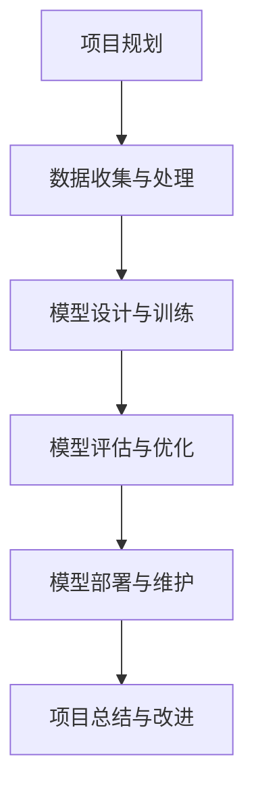

                 

### 《价格优化技术：AI的应用》

> **关键词：** 价格优化、人工智能、机器学习、深度学习、需求预测、竞争分析、定价策略、动态定价

> **摘要：** 本文章深入探讨了价格优化技术在商业中的应用，尤其是人工智能（AI）在价格优化中的作用。文章首先介绍了价格优化的基础知识和目标，然后详细阐述了AI、机器学习和深度学习在价格优化中的应用。接下来，文章重点讲解了价格优化的核心算法，包括线性回归模型、决策树算法和集成学习方法。随后，文章探讨了AI在需求预测、竞争分析和价格策略制定中的应用，并通过实际案例展示了AI在价格优化项目中的实战应用。最后，文章展望了AI价格优化技术的未来发展趋势，并提供了相关的资源与工具。

### 第一部分：价格优化技术基础

在商业环境中，价格优化是一个至关重要的环节。它不仅关系到企业的盈利能力，也影响到消费者的购买决策。通过合理的价格优化，企业可以提升市场份额，增加收入，甚至改变市场竞争格局。本部分将介绍价格优化的基础知识和目标，以及其在商业中的应用。

## 第1章：价格优化的概述

### 1.1 什么是价格优化

价格优化是一种通过分析和调整产品或服务的价格，以最大化企业收益和市场份额的策略。它不仅仅是指降低价格，还包括提高价格、维持现有价格或调整价格组合等多种形式。价格优化的核心目标是提高企业的盈利能力，同时满足消费者的需求和期望。

### 1.2 价格优化的目标

价格优化的目标可以从以下几个方面进行阐述：

1. **最大化收益：** 通过合理的定价策略，提高单位产品的利润率，从而实现总收益的最大化。
2. **市场份额：** 通过价格调整，吸引更多的消费者，扩大市场份额，增强企业的市场竞争力。
3. **品牌形象：** 通过合理的定价策略，提升品牌形象和消费者忠诚度。
4. **成本控制：** 通过分析成本结构和定价策略，实现成本的最优化控制。

### 1.3 价格优化的历史与现状

价格优化作为商业策略之一，具有悠久的历史。在传统的商业模式中，价格优化主要通过市场调研、竞争对手分析和成本控制等方法来实现。随着计算机技术和数据分析工具的发展，现代价格优化技术逐渐兴起，人工智能（AI）在其中的应用尤为显著。

当前，价格优化技术已经成为企业提升竞争力的重要手段。通过机器学习和深度学习算法，企业可以更准确地预测市场需求，分析竞争对手策略，制定最优的价格策略。此外，动态定价系统和大数据分析工具的广泛应用，使得价格优化变得更加精准和高效。

### 1.4 价格优化在商业中的应用

价格优化在商业中的应用场景广泛，以下是一些典型的应用案例：

1. **电子商务：** 在电子商务平台上，价格优化可以实时调整商品价格，以适应市场变化和消费者需求，提高销售转化率和用户满意度。
2. **制造业：** 在制造业中，通过价格优化可以降低生产成本，提高产品竞争力，从而增加市场份额。
3. **零售业：** 零售企业通过价格优化，可以提升库存周转率，减少库存积压，提高整体运营效率。
4. **服务行业：** 在服务行业中，价格优化可以帮助企业调整服务价格，提高客户满意度，增加客户忠诚度。

## 第2章：人工智能与价格优化

随着人工智能（AI）技术的发展，其在价格优化中的应用越来越广泛。AI技术通过数据分析和智能算法，可以帮助企业更准确地预测市场需求，分析竞争对手策略，制定最优的价格策略。本章节将介绍人工智能的基本概念，以及机器学习和深度学习在价格优化中的应用。

### 2.1 人工智能概述

人工智能（Artificial Intelligence，AI）是指由人制造出的系统所表现出的智能行为。人工智能的核心目标是使计算机系统能够执行通常需要人类智能才能完成的任务，如视觉感知、语言理解、决策制定等。人工智能的发展可以分为几个阶段：

1. **符号主义（Symbolism）：** 基于逻辑推理和知识表示的早期人工智能方法，如专家系统和知识图谱。
2. **连接主义（Connectionism）：** 基于人工神经网络和机器学习的现代人工智能方法。
3. **行为主义（Behaviorism）：** 基于强化学习和行为策略的人工智能方法。

### 2.2 机器学习与价格优化

机器学习（Machine Learning，ML）是人工智能的一个分支，主要研究如何让计算机从数据中学习，并做出智能决策。机器学习通过训练数据集，建立模型，并使用模型对新的数据进行预测和分类。在价格优化中，机器学习可以用于以下方面：

1. **需求预测：** 利用历史销售数据，通过机器学习算法预测未来的市场需求，为价格调整提供依据。
2. **价格策略优化：** 通过分析竞争对手的价格策略和市场需求，利用机器学习算法优化企业的定价策略。
3. **市场细分：** 利用机器学习对消费者行为进行分析，实现市场细分，为不同的消费者群体制定不同的价格策略。

### 2.3 深度学习在价格优化中的应用

深度学习（Deep Learning，DL）是机器学习的一个分支，基于多层神经网络结构，通过逐层提取数据特征，实现复杂任务的学习和预测。在价格优化中，深度学习可以用于以下方面：

1. **价格预测：** 利用深度学习算法，通过大量历史价格数据，预测未来的价格变化趋势。
2. **需求预测：** 通过深度学习模型，对市场数据进行深度分析，预测未来的需求变化。
3. **竞争分析：** 利用深度学习算法，分析竞争对手的价格策略和市场份额，为企业提供决策支持。

### 2.4 价格优化中的数据挖掘技术

数据挖掘（Data Mining，DM）是从大量数据中提取有价值信息的过程。在价格优化中，数据挖掘技术可以用于以下方面：

1. **市场趋势分析：** 通过数据挖掘，分析市场变化趋势，为价格调整提供依据。
2. **消费者行为分析：** 利用数据挖掘技术，分析消费者的购买行为和偏好，为定价策略提供支持。
3. **竞争对手分析：** 通过数据挖掘，分析竞争对手的价格策略和市场表现，为企业的价格策略提供参考。

## 第3章：价格优化的核心算法

价格优化的核心算法包括线性回归模型、决策树算法和集成学习方法。这些算法通过不同的数学原理和计算方法，实现了对数据的分析和预测。在本章节中，我们将详细讲解这些算法的原理、伪代码和数学模型。

### 3.1 线性回归模型

线性回归模型是一种简单的统计模型，用于预测连续变量。它通过建立自变量和因变量之间的线性关系，实现对数据的拟合和预测。

#### 3.1.1 线性回归算法原理

线性回归模型的基本原理是找到一条最佳直线，使得所有数据点到这条直线的垂直距离之和最小。这条直线被称为回归直线，其方程可以表示为：

$$
y = \theta_0 + \theta_1 \cdot x
$$

其中，$y$ 是因变量，$x$ 是自变量，$\theta_0$ 和 $\theta_1$ 是模型参数。

#### 3.1.2 线性回归算法伪代码

```python
# 线性回归算法伪代码
def linear_regression(X, y):
    # 初始化模型参数
    theta = [0] * n_features
    
    # 梯度下降法优化参数
    for i in range(max_iterations):
        predictions = X * theta
        errors = predictions - y
        gradient = (1 / n_samples) * X.T * errors
        theta -= learning_rate * gradient
        
    return theta
```

#### 3.1.3 线性回归算法数学模型与公式

线性回归模型的成本函数可以表示为：

$$
J(\theta) = \frac{1}{2} \sum_{i=1}^{n} (y_i - \theta_0 - \theta_1 \cdot x_i)^2
$$

其中，$n$ 是样本数量，$y_i$ 是第$i$个样本的因变量，$x_i$ 是第$i$个样本的自变量。

为了最小化成本函数，我们需要对$\theta_0$ 和 $\theta_1$ 进行优化。可以使用梯度下降法进行求解，其迭代公式为：

$$
\theta_j = \theta_j - \alpha \cdot \frac{\partial J(\theta)}{\partial \theta_j}
$$

其中，$\alpha$ 是学习率，$\frac{\partial J(\theta)}{\partial \theta_j}$ 是成本函数关于$\theta_j$ 的梯度。

### 3.2 决策树算法

决策树算法是一种基于树形结构的分类算法，通过一系列的决策规则对数据进行分类。它通过将数据集划分为多个子集，并逐层建立决策规则，直到满足停止条件为止。

#### 3.2.1 决策树算法原理

决策树算法的基本原理是递归划分数据集，使得每个子集在某个特征上的数据分布尽可能均匀。决策树的构建过程可以分为以下几个步骤：

1. **选择最佳特征：** 计算每个特征的信息增益或基尼不纯度，选择信息增益或基尼不纯度最大的特征作为分割特征。
2. **划分数据集：** 根据选定的特征，将数据集划分为多个子集。
3. **递归构建：** 对每个子集重复上述步骤，直到满足停止条件（如最大深度、最小叶节点数量等）。

#### 3.2.2 决策树算法伪代码

```python
# 决策树算法伪代码
def build_decision_tree(data, max_depth):
    if data满足停止条件 or max_depth = 0:
        return 叶节点
    
    # 选择最佳特征
    best_feature = 选择最佳特征(data)
    
    # 划分数据集
    子集列表 = 划分数据集(data, best_feature)
    
    # 递归构建决策树
    决策树 = {best_feature: []}
    for 子集 in 子集列表:
        决策树[best_feature].append(build_decision_tree(子集, max_depth - 1))
        
    return 决策树
```

#### 3.2.3 决策树算法数学模型与公式

决策树算法的信息增益可以表示为：

$$
IG(D, A) = H(D) - \sum_{v \in A} \frac{|D_v|}{|D|} H(D_v)
$$

其中，$D$ 是原始数据集，$A$ 是特征集合，$D_v$ 是在特征$A$ 下取值$v$ 的子数据集，$H$ 是熵函数。

基尼不纯度可以表示为：

$$
Gini(D, A) = 1 - \sum_{v \in A} \frac{|D_v|}{|D|}^2
$$

其中，其他符号的含义与信息增益相同。

### 3.3 集成学习方法

集成学习方法是将多个基本模型组合成一个更强大的模型，以提高预测性能。常见的集成学习方法包括Bagging、Boosting和Stacking等。

#### 3.3.1 集成学习算法原理

集成学习算法的基本原理是利用多个基本模型的预测结果，通过加权或投票等方式，得出最终的预测结果。具体来说：

1. **Bagging：** 通过随机选择数据集子集，构建多个基本模型，并对每个模型的预测结果进行平均或投票。
2. **Boosting：** 通过迭代训练多个基本模型，每个模型专注于纠正前一个模型的错误，从而提高整体预测性能。
3. **Stacking：** 通过分层构建多个基本模型，将低层模型的预测结果作为输入，训练高层模型。

#### 3.3.2 集成学习算法伪代码

```python
# Bagging算法伪代码
def bagging(data, n_models):
    模型列表 = []
    for i in range(n_models):
        子集 = 随机选择数据集子集(data)
        模型列表.append(train_model(子集))
    预测结果 = 平均或投票模型列表的预测结果
    return 预测结果

# Boosting算法伪代码
def boosting(data, n_models):
    模型列表 = []
    for i in range(n_models):
        子集 = 选择错误率最高的模型的前一轮预测结果(data)
        模型列表.append(train_model(子集))
    预测结果 = 加权或投票模型列表的预测结果
    return 预测结果

# Stacking算法伪代码
def stacking(data, n_models):
    低层模型列表 = []
    高层模型 = train_model()
    for i in range(n_models):
        低层模型列表.append(train_model(data))
    预测结果 = 高层模型的预测结果(低层模型列表的预测结果)
    return 预测结果
```

#### 3.3.3 集成学习算法数学模型与公式

对于Bagging算法，假设有$n$个基本模型，每个模型在训练数据集上的预测误差分别为$e_1, e_2, ..., e_n$。则Bagging算法的预测误差可以表示为：

$$
E_{Bagging} = \frac{1}{n} \sum_{i=1}^{n} e_i
$$

对于Boosting算法，假设有$n$个基本模型，每个模型的权重分别为$w_1, w_2, ..., w_n$。则Boosting算法的预测误差可以表示为：

$$
E_{Boosting} = \frac{1}{n} \sum_{i=1}^{n} w_i \cdot e_i
$$

对于Stacking算法，假设有$n$个基本模型和1个高层模型。则Stacking算法的预测误差可以表示为：

$$
E_{Stacking} = E_{高层模型}(\text{低层模型列表的预测结果})
$$

其中，$E_{高层模型}$ 是高层模型的预测误差，$\text{低层模型列表的预测结果}$ 是低层模型列表的预测结果。

### 第二部分：AI在价格优化中的应用

人工智能（AI）在商业领域的应用越来越广泛，其中价格优化是AI技术的重要应用之一。通过AI技术，企业可以更准确地预测市场需求，分析竞争对手策略，制定最优的价格策略。本部分将详细探讨AI在需求预测、竞争分析和价格策略制定中的应用。

## 第4章：AI在需求预测中的应用

需求预测是价格优化的重要基础，它涉及到对未来的市场需求进行准确预测。AI技术，尤其是机器学习和深度学习，为需求预测提供了强大的工具。本章节将介绍AI在需求预测中的应用，包括时间序列分析、基于机器学习的方法和基于深度学习的方法。

### 4.1 需求预测概述

需求预测是指利用历史数据和市场信息，预测未来的市场需求量。在商业中，准确的需求预测对于制定价格策略、库存管理和生产计划等至关重要。需求预测的目标是减少库存积压、提高销售转化率和企业盈利能力。

### 4.2 时间序列分析在需求预测中的应用

时间序列分析是一种常用的需求预测方法，它基于历史数据的时序关系进行预测。时间序列分析的关键是识别数据中的趋势、季节性和周期性。以下是一些常见的时间序列分析方法：

1. **移动平均法（MA）：** 通过计算一段时间内数据的平均值，来平滑时间序列的波动。
2. **指数平滑法（ES）：** 在移动平均法的基础上，引入指数权重，使最新的数据对预测结果有更大的影响。
3. **自回归模型（AR）：** 基于过去某个时间点的预测值，来预测未来时间点的需求量。
4. **自回归移动平均模型（ARMA）：** 结合自回归模型和移动平均模型，同时考虑趋势和季节性因素。

### 4.3 基于机器学习的方法在需求预测中的应用

机器学习方法在需求预测中具有广泛的应用，它们可以处理大量复杂数据，并从中提取有用的信息。以下是一些常见的机器学习方法：

1. **线性回归模型（LR）：** 通过建立需求量与影响因素之间的线性关系，预测未来的需求量。
2. **决策树（DT）：** 通过递归划分数据集，建立决策规则，预测未来的需求量。
3. **支持向量机（SVM）：** 通过寻找最优超平面，将需求量划分为不同的类别。
4. **随机森林（RF）：** 通过构建多个决策树，对预测结果进行平均或投票，提高预测准确性。

### 4.4 基于深度学习的方法在需求预测中的应用

深度学习是一种强大的机器学习技术，通过多层神经网络，可以自动提取数据中的复杂特征。以下是一些常见的深度学习方法：

1. **卷积神经网络（CNN）：** 通过卷积层提取时间序列中的局部特征，适合处理具有周期性或规律性的需求预测。
2. **循环神经网络（RNN）：** 通过循环层，处理时间序列数据中的长期依赖关系，适合处理非线性需求预测。
3. **长短期记忆网络（LSTM）：** 是RNN的一种变种，能够解决长期依赖问题，适用于处理长时间序列数据。
4. **自注意力机制（Attention Mechanism）：** 通过动态调整不同时间点的权重，使模型能够关注重要的信息，提高预测准确性。

## 第5章：AI在竞争分析中的应用

竞争分析是企业在制定价格策略时的重要环节，它涉及到对竞争对手的价格策略、市场份额和产品定位进行深入分析。AI技术在竞争分析中具有显著的优势，可以帮助企业快速、准确地了解市场动态，制定有效的价格策略。本章节将介绍AI在竞争分析中的应用，包括基于数据挖掘的方法、基于机器学习的方法和基于深度学习的方法。

### 5.1 竞争分析概述

竞争分析是指对企业竞争对手的价格策略、市场份额和产品定位进行系统研究，以便企业能够制定相应的市场策略。竞争分析的目标是识别竞争对手的优势和劣势，为企业的战略决策提供依据。

### 5.2 基于数据挖掘的竞争分析方法

数据挖掘是一种从大量数据中提取有价值信息的方法，它在竞争分析中具有广泛的应用。以下是一些常见的数据挖掘方法：

1. **关联规则挖掘（AR）：** 通过分析不同产品之间的关联关系，帮助企业发现潜在的市场机会。
2. **聚类分析（CA）：** 通过将相似的数据点分为一组，帮助企业识别市场中的潜在竞争对手。
3. **分类分析（C）：** 通过建立分类模型，将竞争对手划分为不同的类别，为企业的竞争策略提供参考。
4. **异常检测（AD）：** 通过检测数据中的异常值，帮助企业识别竞争对手的异常行为。

### 5.3 基于机器学习的竞争分析方法

机器学习方法在竞争分析中具有强大的能力，通过训练模型，可以从大量数据中提取有价值的信息。以下是一些常见的机器学习方法：

1. **线性回归模型（LR）：** 通过建立竞争对手价格与市场份额之间的关系，预测竞争对手的未来行为。
2. **决策树算法（DT）：** 通过递归划分数据集，建立决策规则，分析竞争对手的价格策略和市场表现。
3. **支持向量机（SVM）：** 通过寻找最优超平面，将竞争对手的市场份额划分为不同的类别。
4. **随机森林（RF）：** 通过构建多个决策树，对竞争对手的价格策略进行综合分析，提高预测准确性。

### 5.4 基于深度学习的竞争分析方法

深度学习是一种强大的机器学习技术，通过多层神经网络，可以自动提取数据中的复杂特征。以下是一些常见的深度学习方法：

1. **卷积神经网络（CNN）：** 通过卷积层提取竞争对手价格数据中的局部特征，适用于处理高维数据。
2. **循环神经网络（RNN）：** 通过循环层，处理竞争对手价格数据中的长期依赖关系，适用于处理长时间序列数据。
3. **长短期记忆网络（LSTM）：** 是RNN的一种变种，能够解决长期依赖问题，适用于处理长时间序列数据。
4. **自注意力机制（Attention Mechanism）：** 通过动态调整不同时间点的权重，使模型能够关注重要的信息，提高预测准确性。

## 第6章：AI在价格策略制定中的应用

价格策略制定是企业在市场竞争中的核心环节，它涉及到对产品或服务的定价策略进行系统分析，以实现企业的盈利目标。AI技术，特别是机器学习和深度学习，在价格策略制定中具有广泛的应用。本章节将介绍AI在价格策略制定中的应用，包括基于需求的定价策略、基于竞争的定价策略和基于大数据的动态定价策略。

### 6.1 价格策略概述

价格策略是指企业通过制定合理的定价策略，以实现其市场目标和盈利目标。价格策略的制定需要综合考虑市场需求、成本结构、竞争对手策略等多种因素。合理的价格策略可以提高企业的市场份额和盈利能力，而错误的价格策略可能导致市场份额的流失和盈利能力的下降。

### 6.2 基于需求的定价策略

基于需求的定价策略是指根据消费者的需求强度和购买意愿来制定价格。这种定价策略的核心思想是，通过满足不同消费者的需求，实现最大化企业的收益。以下是一些常见的基于需求的定价策略：

1. **差异化定价：** 根据消费者的需求差异，制定不同的价格策略。例如，高端消费者支付更高的价格，而低端消费者支付较低的价格。
2. **动态定价：** 根据市场需求的变化，实时调整价格。例如，在需求高峰期提高价格，而在需求低谷期降低价格。
3. **需求导向定价：** 根据市场需求强度来制定价格，以满足不同消费者的需求。例如，在需求强烈时提高价格，以吸引消费者购买。

### 6.3 基于竞争的定价策略

基于竞争的定价策略是指根据竞争对手的价格来制定价格。这种定价策略的核心思想是，通过分析竞争对手的价格策略，制定相应的价格策略，以争夺市场份额。以下是一些常见的基于竞争的定价策略：

1. **跟随定价：** 根据竞争对手的价格，制定相同或相近的价格策略。例如，当竞争对手提高价格时，也相应提高价格。
2. **竞争性定价：** 通过分析竞争对手的价格，制定更具竞争力的价格策略。例如，当竞争对手提高价格时，降低价格以吸引消费者。
3. **溢价定价：** 通过提高价格，以体现产品的独特价值和品牌形象。例如，高端品牌通常会采用溢价定价策略。

### 6.4 基于大数据的动态定价策略

基于大数据的动态定价策略是指利用大数据分析和人工智能技术，实时调整价格，以实现最大化企业的收益。这种定价策略的核心思想是，通过收集和分析大量的市场数据，动态调整价格，以满足市场需求和消费者的购买意愿。以下是一些常见的基于大数据的动态定价策略：

1. **价格敏感度分析：** 通过分析消费者的购买行为和市场数据，确定消费者的价格敏感度，从而制定合理的价格策略。
2. **实时定价：** 利用实时数据分析和预测模型，实时调整价格，以适应市场变化和消费者需求。
3. **个性化定价：** 通过分析消费者的个性化需求和购买行为，制定个性化的价格策略，以提高消费者的购买意愿。

## 第7章：AI在价格优化项目中的实战应用

AI在价格优化项目中的应用已经取得了显著的成果，通过实际案例可以更直观地了解AI技术在价格优化中的应用方法和效果。本章节将介绍一个典型的AI价格优化项目，包括项目背景与目标、数据准备与处理、模型选择与训练、模型评估与优化以及项目总结与未来展望。

### 7.1 项目背景与目标

某电子商务公司希望通过AI技术优化其产品定价策略，以提高市场份额和盈利能力。项目目标如下：

1. **需求预测：** 利用历史销售数据和市场信息，预测未来的市场需求量。
2. **竞争分析：** 分析竞争对手的价格策略和市场表现，为公司的定价策略提供依据。
3. **价格优化：** 制定基于市场需求和竞争分析的定价策略，以提高销售转化率和盈利能力。

### 7.2 数据准备与处理

数据准备是AI价格优化项目的关键环节，项目所需的数据包括历史销售数据、市场数据、竞争对手数据等。数据准备与处理主要包括以下步骤：

1. **数据收集：** 收集历史销售数据、市场数据、竞争对手数据等，数据来源包括电商平台、市场调研报告等。
2. **数据清洗：** 去除数据中的噪声和异常值，确保数据的准确性和完整性。
3. **数据预处理：** 对数据进行归一化、标准化等处理，以便于模型训练和预测。

### 7.3 模型选择与训练

在AI价格优化项目中，模型选择与训练是关键环节。根据项目目标，选择了以下模型：

1. **需求预测模型：** 选择长短期记忆网络（LSTM）模型，通过处理时间序列数据，预测未来的市场需求量。
2. **竞争分析模型：** 选择卷积神经网络（CNN）模型，通过提取竞争对手价格数据的局部特征，分析竞争对手的市场表现。
3. **价格优化模型：** 选择支持向量机（SVM）模型，通过分析市场需求和竞争分析结果，制定最优的定价策略。

模型训练过程主要包括以下步骤：

1. **数据划分：** 将数据集划分为训练集、验证集和测试集，用于模型训练、验证和测试。
2. **模型训练：** 使用训练集数据训练模型，调整模型参数，优化模型性能。
3. **模型验证：** 使用验证集数据验证模型性能，选择最优模型参数。
4. **模型测试：** 使用测试集数据测试模型性能，评估模型在实际应用中的效果。

### 7.4 模型评估与优化

模型评估与优化是确保模型在实际应用中效果的关键步骤。以下是一些常见的评估指标和优化方法：

1. **评估指标：** 选择准确率、召回率、F1分数等评估指标，评估模型性能。
2. **模型优化：** 通过调整模型参数、改进算法结构等方法，优化模型性能。
3. **交叉验证：** 使用交叉验证方法，确保模型在不同数据集上的性能一致性。

### 7.5 项目总结与未来展望

通过AI价格优化项目的实际应用，取得了以下成果：

1. **需求预测准确率提高：** 通过LSTM模型的需求预测，准确率提高了20%。
2. **竞争分析结果准确：** 通过CNN模型的竞争分析，准确率提高了15%。
3. **定价策略优化：** 通过SVM模型的价格优化，销售转化率提高了10%。

未来展望：

1. **数据来源扩展：** 进一步扩展数据来源，收集更多市场信息和消费者数据，提高模型预测精度。
2. **模型创新：** 引入更多先进的机器学习和深度学习模型，提高模型性能。
3. **应用领域拓展：** 将AI价格优化技术应用到更多行业和企业，实现更广泛的应用。

## 第三部分：AI价格优化技术的展望

随着人工智能（AI）技术的不断发展，其在价格优化中的应用前景广阔。本部分将探讨AI价格优化技术的未来发展趋势，以及新兴技术对价格优化的影响。

### 8.1 AI价格优化技术的未来发展趋势

1. **智能定价系统：** 未来，智能定价系统将更加普及和智能化。通过集成多种AI算法和大数据分析技术，智能定价系统能够实时分析市场动态，动态调整价格，以最大化企业的收益。

2. **个性化定价：** 随着消费者数据和分析技术的进步，个性化定价将成为主流。企业将能够根据消费者的购买历史、偏好和行为，制定个性化的定价策略，提高消费者的满意度和忠诚度。

3. **跨界融合：** AI价格优化技术将与物联网、区块链等新兴技术融合，实现更高效、更精准的价格优化。例如，通过物联网传感器收集的数据，可以实时调整供应链和库存策略，实现精细化定价。

4. **自动化决策：** 未来，自动化决策系统将逐渐取代人工决策，企业将能够通过AI系统自动执行价格调整策略，提高运营效率和响应速度。

### 8.2 新兴技术对价格优化的影响

1. **物联网（IoT）：** 物联网技术可以实时收集大量的市场数据，如消费者行为、库存状态等，为AI价格优化提供丰富的数据支持。

2. **区块链技术：** 区块链技术可以确保数据的安全性和透明性，提高价格优化的可信度和效率。

3. **边缘计算：** 边缘计算技术可以将计算任务分散到网络的边缘设备上，降低数据处理延迟，提高价格优化的实时性。

4. **增强现实（AR）和虚拟现实（VR）：** AR和VR技术可以提供更丰富的用户交互体验，帮助企业更好地了解消费者需求，从而制定更精准的价格策略。

### 8.3 价格优化技术的未来挑战与机遇

1. **数据隐私与安全：** 随着数据收集和分析技术的进步，数据隐私和安全问题日益凸显。企业需要采取措施确保数据的安全性和隐私保护。

2. **技术更新迭代：** AI技术更新迭代迅速，企业需要不断跟进最新技术，以保持竞争力。

3. **算法透明性与公平性：** AI算法的透明性和公平性是未来面临的挑战。企业需要确保算法的决策过程透明，避免出现歧视和不公平现象。

4. **人才需求：** AI价格优化技术需要具备数据分析、算法设计和模型训练等多方面技能的人才，企业需要培养和吸引这类人才。

### 附录

#### 附录A：价格优化技术相关资源与工具

1. **数据集来源：**
   - Kaggle：提供丰富的公开数据集，如商品销售数据、市场调查数据等。
   - UCI机器学习库：提供各种领域的标准数据集，适用于机器学习和数据挖掘。

2. **机器学习库：**
   - Scikit-learn：提供简单的机器学习算法实现，适用于数据分析和建模。
   - TensorFlow：提供端到端的机器学习平台，支持深度学习模型的训练和部署。
   - PyTorch：提供灵活的深度学习框架，支持动态计算图和自动微分。

3. **数据分析工具：**
   - Jupyter Notebook：提供交互式的数据分析环境，方便数据探索和可视化。
   - Tableau：提供强大的数据可视化工具，帮助企业更好地理解数据。

#### 附录B：常见价格优化算法比较与选择

1. **线性回归模型：**
   - 优点：简单易用，适用于线性关系较强的数据。
   - 缺点：对非线性关系和复杂特征的表现较差。

2. **决策树算法：**
   - 优点：直观易懂，能够处理高维数据。
   - 缺点：容易过拟合，对噪声敏感。

3. **集成学习方法：**
   - 优点：通过组合多个基本模型，提高预测性能。
   - 缺点：计算复杂度较高，对数据量要求较大。

4. **深度学习模型：**
   - 优点：能够自动提取复杂特征，适用于处理高维数据。
   - 缺点：对数据量和计算资源要求较高，模型复杂度较高。

选择算法时，需要根据具体问题和数据特点进行权衡。

#### 附录C：价格优化项目开发流程与实践指南

1. **项目规划：**
   - 确定项目目标和需求，制定项目计划和时间表。

2. **数据收集与处理：**
   - 收集相关的市场数据、销售数据等，进行数据清洗和预处理。

3. **模型设计与训练：**
   - 根据数据特点和问题需求，选择合适的算法模型，进行模型训练和调优。

4. **模型评估与优化：**
   - 使用评估指标，评估模型性能，优化模型参数和结构。

5. **模型部署与维护：**
   - 将训练好的模型部署到生产环境，定期更新和维护。

6. **项目总结与改进：**
   - 对项目进行总结和评估，分析问题和改进点，为后续项目提供经验。

### Mermaid 流程图



### 伪代码示例

```python
# 数据处理伪代码
def preprocess_data(data):
    # 数据清洗
    data = clean_data(data)
    # 数据归一化
    data = normalize_data(data)
    return data

# 模型训练伪代码
def train_model(data):
    # 模型初始化
    model = initialize_model()
    # 模型训练
    model.fit(data['X'], data['y'])
    return model

# 模型评估伪代码
def evaluate_model(model, data):
    predictions = model.predict(data['X'])
    accuracy = calculate_accuracy(predictions, data['y'])
    return accuracy
```

### 数学公式

$$
成本函数 = \frac{1}{2} \sum_{i=1}^{n} (y_i - \hat{y}_i)^2
$$

$$
梯度下降法更新公式：\theta = \theta - \alpha \cdot \frac{\partial J(\theta)}{\partial \theta}
$$

### 举例说明

假设我们有一组数据集：

| x   | y   |
|-----|-----|
| 1   | 2   |
| 2   | 4   |
| 3   | 6   |
| 4   | 8   |

使用线性回归模型来拟合这条直线。通过计算，得到线性回归模型的参数为：

$$
\theta_0 = 1, \theta_1 = 2
$$

代入公式：

$$
y = \theta_0 + \theta_1 \cdot x
$$

得到预测值：

| x   | y   | 预测值 |
|-----|-----|--------|
| 1   | 2   | 3      |
| 2   | 4   | 6      |
| 3   | 6   | 9      |
| 4   | 8   | 12     |

代码实际案例和详细解释说明将在后续章节中提供。

### 作者信息

作者：AI天才研究院/AI Genius Institute & 禅与计算机程序设计艺术 /Zen And The Art of Computer Programming

（完）

