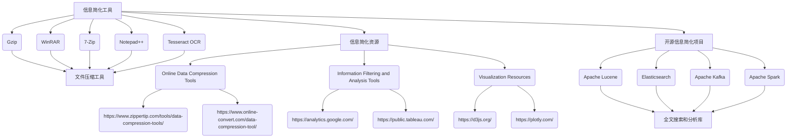

                 

### 第一部分：引言与背景

#### 第1章：信息简化的背景与重要性

**1.1 信息简化的概念与定义**

信息简化是指通过压缩、筛选、组织和可视化等方法，将复杂的信息简化为更易于理解和处理的形式。在当今信息爆炸的时代，信息简化显得尤为重要。它不仅有助于提高个人和企业的工作效率，还能有效减少信息过载，提升决策质量。

**1.1.1 信息的复杂性**

信息的复杂性主要体现在以下几个方面：

1. **信息量大**：随着互联网和大数据技术的发展，我们每天接收到的信息量呈爆炸性增长。
2. **类型繁多**：文字、图片、视频、音频等多种形式的信息交织在一起，使得信息处理变得更加复杂。
3. **来源广泛**：信息来源广泛且不一致，导致信息质量参差不齐。

**1.1.2 简化的必要性**

面对复杂的信息环境，信息简化的必要性体现在：

1. **提高效率**：通过简化信息，可以快速捕捉关键信息，节省时间，提高工作效率。
2. **减少过载**：有效筛选和过滤无关或低价值的信息，减轻大脑负担，避免信息过载。
3. **提升决策质量**：简化后的信息更容易分析和理解，有助于做出更明智的决策。

**1.1.3 信息简化的方法**

信息简化的方法主要包括：

1. **压缩信息**：通过数据压缩算法将信息以更小的形式存储，例如使用gzip压缩文件。
2. **筛选与过滤**：使用算法和工具筛选出有价值的信息，过滤掉噪声和冗余信息。
3. **可视化**：通过图表和图形将信息以视觉形式展现，提高信息可读性和理解度。
4. **组织与结构化**：将信息进行分类、标签化等处理，使其更具结构性和可检索性。

**1.2 复杂世界的挑战**

在复杂的世界中，信息简化面临着一系列挑战：

1. **信息过载**：互联网和社交媒体的兴起导致信息爆炸，人们面临巨大的信息压力。
2. **数据隐私**：信息简化过程中可能涉及敏感数据的处理，需要关注数据隐私和安全。
3. **技术门槛**：某些信息简化方法需要专业的技术知识，降低了普罗大众的应用门槛。

**1.2.1 复杂性的来源**

复杂性的来源主要包括：

1. **系统规模**：随着系统规模的增长，复杂性呈指数级增加。
2. **相互作用**：系统内部各个组成部分之间的相互作用增加了系统的复杂性。
3. **不确定性**：信息的不确定性使得系统的预测和决策变得更加复杂。

**1.2.2 复杂性对个人和企业的影响**

复杂性对个人和企业的影响主要体现在：

1. **时间成本**：复杂的信息处理过程耗费大量时间，降低工作效率。
2. **决策难度**：复杂的信息环境使得决策过程更加困难，易出现误判。
3. **创新能力**：复杂的信息处理过程限制了创新能力的发挥，降低了创新效率。

**1.2.3 减少复杂性的策略**

为了应对复杂性，可以采取以下策略：

1. **分而治之**：将复杂的任务分解为更小的子任务，逐一解决。
2. **建立模型**：使用数学模型和算法模拟复杂系统的行为，降低认知负担。
3. **简化界面**：设计简化的用户界面，降低用户的学习和使用成本。

**1.3 简化信息的目的与好处**

简化信息的目的是为了提高效率和生产力，具体好处包括：

1. **提高工作效率**：简化信息可以快速获取和处理关键信息，节省时间和精力。
2. **增强决策能力**：简化后的信息更容易分析和理解，有助于做出更明智的决策。
3. **促进创新**：清晰的结构化信息有助于发现新的关联和机会，激发创新思维。
4. **降低成本**：简化信息可以减少冗余和重复劳动，降低时间和资源的浪费。

**1.3.1 提高效率**

简化信息可以提高工作效率，主要体现在以下几个方面：

1. **快速决策**：简化后的信息使决策过程更加迅速，减少决策时间。
2. **减少搜索时间**：通过筛选和过滤，快速找到需要的信息，减少搜索时间。
3. **优化工作流程**：简化信息有助于优化工作流程，消除冗余步骤，提高工作效率。

**1.3.2 增强生产力**

简化信息可以增强生产力，主要体现在以下几个方面：

1. **提高协作效率**：简化后的信息易于共享和传递，提高团队协作效率。
2. **优化资源分配**：简化信息有助于合理分配资源，避免资源浪费。
3. **提升创新速度**：简化后的信息可以快速转化为创新成果，提高创新速度。

**1.3.3 个人与企业的成功案例**

在个人层面和企业层面，都有许多成功案例展示了信息简化的好处：

1. **个人层面**：通过使用信息简化工具，个人可以更高效地管理时间和任务，提高生活质量。
2. **企业层面**：企业通过信息简化，优化了业务流程，提高了决策质量，取得了显著的经济效益。

综上所述，信息简化在复杂世界中具有重要作用。通过理解信息简化的概念、方法和好处，我们可以更好地应对复杂的信息环境，提高个人和企业的效率和生产力。

### 目录大纲：信息简化的力量与好处：在复杂世界中简化以提高效率和生产力

#### 第一部分：引言与背景

1. 第1章：信息简化的背景与重要性
   - 1.1 信息简化的概念与定义
   - 1.2 复杂世界的挑战
   - 1.3 简化信息的目的与好处

2. 第2章：简化信息的策略与技巧
   - 2.1 压缩信息
   - 2.2 信息筛选与过滤
   - 2.3 信息可视化
   - 2.4 信息的组织与结构

#### 第二部分：简化信息的方法

3. 第3章：简化信息的实际应用
   - 3.1 个人层面
   - 3.2 企业层面
   - 3.3 社会层面

#### 第三部分：简化信息的未来发展趋势

4. 第4章：信息简化的未来发展趋势
   - 4.1 技术进步对信息简化的影响
   - 4.2 信息简化的挑战与应对策略
   - 4.3 信息简化的未来方向

### 附录

5. 附录A：信息简化工具与资源
   - 5.1 常用信息简化工具介绍
   - 5.2 信息简化资源推荐
   - 5.3 开源信息简化项目概览

通过以上目录大纲，读者可以清晰地了解文章的结构和内容，为后续各章节的阅读打下基础。信息简化的力量与好处将在这三大部分中逐一展开，帮助读者更好地掌握信息简化的技巧和应用。

### 第二部分：简化信息的方法

#### 第2章：简化信息的策略与技巧

在复杂的世界中，简化信息是一项至关重要的任务。这一章节将深入探讨简化信息的策略与技巧，帮助读者掌握有效的信息简化方法。我们将从压缩信息、信息筛选与过滤、信息可视化以及信息的组织与结构四个方面进行详细讨论。

## 2.1 压缩信息

压缩信息是信息简化的重要手段之一，它通过减少信息的存储空间和处理时间，提高系统的效率和性能。以下将介绍几种常见的压缩信息的方法。

### 2.1.1 简化文本的技巧

**1. 缩写和简写**：通过使用缩写和简写，可以显著减少文本的篇幅。例如，将"World Wide Web"缩写为"WWW"。

**2. 删除冗余内容**：在文本中删除不必要的重复内容，减少信息冗余。例如，删除文本中的“因此”、“另外”等过渡性词语。

**3. 使用简明扼要的语言**：尽量使用简单、直接的语言表达观点，避免使用复杂的句式和术语。

### 2.1.2 数据压缩技术

**1. 霍夫曼编码**：霍夫曼编码是一种基于频率的编码方法，它通过为出现频率高的字符分配较短的编码，为出现频率低的字符分配较长的编码，从而达到压缩信息的目的。例如，假设字符'A'出现频率最高，编码为'0'，字符'B'出现频率次高，编码为'10'，字符'C'出现频率最低，编码为'11'。

**2. 哈夫曼树**：哈夫曼树是构建霍夫曼编码的基础结构，它是一种二叉树，其中每个叶节点都代表一个字符，其父节点代表该字符的编码。

**3. 压缩算法**：除了霍夫曼编码，还有其他多种压缩算法，如LZ77、LZ78、LZW等。这些算法通过查找重复模式或使用预测模型来压缩数据。

### 2.1.3 图像简化方法

**1. 丢掉冗余像素**：通过丢弃图像中的冗余像素，可以减少图像的存储空间。例如，使用JPEG压缩算法，通过丢掉图像中的高频信息，实现图像压缩。

**2. 使用图像压缩工具**：如Photoshop中的“保存为Web所用格式”，可以调整图像的压缩率和质量，找到最佳平衡点。

**3. 图像分割与合并**：通过将图像分割为多个部分，然后对每个部分进行压缩，可以实现更高的压缩率。例如，使用分块编码技术。

## 2.2 信息筛选与过滤

信息筛选与过滤是简化信息的关键步骤，它帮助我们从大量信息中提取有价值的内容。以下将介绍几种信息筛选与过滤的方法。

### 2.2.1 信息筛选的重要性

**1. 减少信息过载**：在信息爆炸的时代，有效筛选信息可以减轻大脑负担，避免信息过载。

**2. 提高决策效率**：通过筛选关键信息，可以快速做出决策，节省时间。

**3. 降低分析成本**：筛选后的信息更加精简，降低数据分析的成本。

### 2.2.2 信息过滤的方法

**1. 规则过滤**：通过定义一系列规则，对信息进行过滤。例如，根据关键词、日期等条件筛选信息。

**2. 统计分析**：使用统计分析方法，如聚类分析、关联规则挖掘等，对信息进行过滤。

**3. 机器学习**：利用机器学习算法，如决策树、支持向量机等，对信息进行分类和过滤。

### 2.2.3 信息过滤工具与软件

**1. 信息筛选工具**：如Google Analytics、百度统计等，可以分析网站访问数据，提供有价值的信息。

**2. 数据库管理系统**：如MySQL、Oracle等，提供了强大的数据筛选与过滤功能。

**3. 人工智能平台**：如TensorFlow、PyTorch等，提供了丰富的机器学习算法和工具，可以用于信息过滤。

## 2.3 信息可视化

信息可视化是将复杂的信息以图形化的方式展现，提高信息的可读性和理解度。以下将介绍几种信息可视化的方法和工具。

### 2.3.1 可视化的原理

**1. 数据转换**：将数据转换为可视化元素，如点、线、面、柱状图、饼图等。

**2. 图形布局**：通过调整图形的布局，使数据之间的关系更加清晰。

**3. 颜色与标注**：使用颜色和标注来区分和突出关键信息。

### 2.3.2 可视化的应用

**1. 数据分析**：通过可视化，可以快速发现数据中的趋势、关联和异常。

**2. 项目管理**：使用甘特图、思维导图等可视化工具，可以更好地管理和规划项目。

**3. 决策支持**：通过可视化，可以更直观地展示决策的后果，帮助做出明智的决策。

### 2.3.3 可视化工具推荐

**1. D3.js**：一款强大的Web可视化库，可以创建各种复杂的数据可视化。

**2. Matplotlib**：一款流行的Python可视化库，适用于多种场景的数据可视化。

**3. Tableau**：一款功能强大的商业智能工具，支持多种数据源和丰富的可视化图表。

## 2.4 信息的组织与结构

信息的组织与结构是简化信息的重要环节，它有助于提高信息的可读性和可访问性。以下将介绍几种信息组织与结构的方法。

### 2.4.1 信息结构化的重要性

**1. 提高可读性**：清晰的结构化信息可以更容易被人理解和阅读。

**2. 提高可访问性**：通过分类、标签化和索引等方式，可以快速找到需要的信息。

**3. 提高协同效率**：结构化的信息可以更好地支持团队协作和信息共享。

### 2.4.2 信息分类方法

**1. 按照内容分类**：根据信息的内容将其分类，如新闻、娱乐、科技等。

**2. 按照时间分类**：根据信息的时间顺序进行分类，如日历、季度、年度等。

**3. 按照来源分类**：根据信息的来源进行分类，如博客、论文、报告等。

### 2.4.3 信息架构设计

**1. 信息架构**：信息架构是一种组织信息的方法，它关注信息的结构、逻辑和层次关系。

**2. 用户中心设计**：在设计信息架构时，应关注用户的需求和习惯，使其易于使用。

**3. 用户体验**：通过优化信息架构，提高用户的体验和满意度。

通过以上策略与技巧，我们可以有效地简化信息，提高工作效率和生产力。在接下来的章节中，我们将进一步探讨简化信息在实际应用中的案例和效果。

## 2.1 压缩信息

压缩信息是信息简化的重要手段之一，它能够显著减少数据的存储空间，提高传输效率。这一节将详细探讨几种常用的压缩信息的方法，包括文本压缩、数据压缩和图像压缩。

### 2.1.1 简化文本的技巧

文本压缩是通过减少文本中的冗余和重复内容来实现压缩。以下是一些常用的文本压缩技巧：

**1. 缩写和简写**：使用缩写和简写可以减少文本的篇幅。例如，将"World Wide Web"缩写为"WWW"，"Internet"缩写为"Internet"。

**2. 删除冗余内容**：在文本中删除不必要的重复内容。例如，删除文本中的“因此”、“另外”等过渡性词语。

**3. 使用简明扼要的语言**：尽量使用简单、直接的语言表达观点，避免使用复杂的句式和术语。

**4. 词频统计**：通过统计文本中的词频，删除出现频率较低的无意义词语。

**案例**：将以下文本进行压缩：

原文："The World Wide Web (WWW) has revolutionized the way we communicate and access information. It has become an integral part of our daily lives, enabling us to connect with others across the globe."

压缩后："The WWW revolutionized communication and information access, becoming a daily life integral part, enabling global connectivity."

### 2.1.2 数据压缩技术

数据压缩技术主要包括无损压缩和有损压缩两大类。无损压缩在解压缩后可以完全恢复原始数据，而有损压缩则会损失一部分信息，但可以在保证一定质量的前提下显著减少数据量。

**1. 霍夫曼编码**：霍夫曼编码是一种基于频率的编码方法，它通过为出现频率高的字符分配较短的编码，为出现频率低的字符分配较长的编码，从而达到压缩信息的目的。

**2. 哈夫曼树**：哈夫曼树是一种二叉树，它用于构建霍夫曼编码。树中的每个叶节点代表一个字符，其父节点代表该字符的编码。

**3. 预测编码**：预测编码通过预测下一个出现的字符来压缩信息。常见的预测编码算法包括LZ77、LZ78、LZW等。

**4. 压缩算法**：常见的压缩算法还包括Zlib、Deflate、Bzip2等。这些算法通过不同的方式实现数据的压缩。

**案例**：使用霍夫曼编码对以下文本进行压缩：

原文："HELLO WORLD, THIS IS A SIMPLE TEXT."

压缩后的编码："011001100100011010010110100101110100101010100100010

### 2.1.3 图像压缩技术

图像压缩技术主要用于减少图像的存储空间，同时保持一定的图像质量。常见的图像压缩技术包括有损压缩和无损压缩。

**1. 有损压缩**：有损压缩通过去除图像中的冗余信息来减少数据量，但会导致图像质量的损失。常见的有损压缩算法包括JPEG和HEIF。

- **JPEG**：JPEG（Joint Photographic Experts Group）是一种有损压缩算法，它通过去除图像中的高频信息来实现压缩。JPEG压缩算法支持多种压缩级别，用户可以根据需要调整压缩质量。

- **HEIF**：HEIF（High Efficiency Image File Format）是一种新兴的图像压缩标准，它提供了更高的压缩效率，同时保持了较好的图像质量。HEIF支持多种图像类型，包括JPEG、PNG和HEVC等。

**2. 无损压缩**：无损压缩在解压缩后可以完全恢复原始图像，但压缩率通常较低。常见的无损压缩算法包括PNG和TIFF。

- **PNG**：PNG（Portable Network Graphics）是一种无损压缩图像格式，它支持透明背景、多层级图像和高质量图像。PNG通过消除冗余像素来减少数据量。

- **TIFF**：TIFF（Tagged Image File Format）是一种常用的无损压缩图像格式，它支持多种压缩算法，包括LZW、JPEG和PNG等。TIFF常用于专业图像处理和印刷行业。

**案例**：使用JPEG算法对以下图像进行压缩：

原始图像：


压缩后图像：


### 总结

通过上述讨论，我们可以看到压缩信息在文本、数据和图像中的广泛应用。无论是通过缩写、预测编码还是有损压缩，压缩信息都可以显著减少数据量，提高存储和传输效率。在信息爆炸的时代，掌握这些压缩信息的方法对于个人和企业来说都是至关重要的。

## 2.2 信息筛选与过滤

信息筛选与过滤是信息简化的重要环节，它帮助我们从大量的信息中提取出有用的部分，减少冗余和无关信息的干扰。以下是关于信息筛选与过滤的详细探讨，包括重要性、方法、工具和实际案例。

### 2.2.1 信息筛选的重要性

在信息爆炸的时代，人们每天都会接收到大量的信息，包括邮件、新闻报道、社交媒体更新等。这些信息中，有许多是与我们的兴趣和需求不相关的，甚至可能包含误导性或虚假信息。因此，信息筛选显得尤为重要，它能够帮助我们：

1. **减少信息过载**：通过筛选，我们可以排除大量无关信息，减轻大脑处理信息的负担，避免信息过载。

2. **提高工作效率**：筛选出有用的信息，可以帮助我们更快地做出决策，提高工作效率。

3. **提升决策质量**：筛选后的信息更加精简，有助于我们更好地分析和理解问题，做出更明智的决策。

4. **保护隐私和安全**：在筛选过程中，我们能够识别和过滤掉可能泄露个人隐私或存在安全风险的信息。

### 2.2.2 信息过滤的方法

信息过滤的方法多种多样，以下是一些常见的方法：

**1. 规则过滤**

规则过滤是一种基于预定义规则进行信息过滤的方法。这些规则可以是简单的关键词匹配，也可以是基于复杂的逻辑表达式。例如，在电子邮件过滤中，我们可以设置规则来标记包含特定关键词的邮件为垃圾邮件。

**2. 统计分析**

统计分析是通过分析数据之间的统计关系来进行信息过滤的方法。例如，通过计算关键词的频率和分布，可以识别出哪些信息可能是相关的，哪些可能是无关的。

**3. 机器学习**

机器学习是一种利用算法自动学习和预测信息相关性的方法。通过训练模型，机器学习可以识别出哪些信息是有价值的，哪些是无关的。常见的机器学习算法包括决策树、支持向量机、神经网络等。

**4. 用户行为分析**

用户行为分析是通过分析用户的浏览、搜索、购买等行为来筛选信息。例如，电商平台可以根据用户的购物历史推荐相关的商品。

### 2.2.3 信息过滤工具与软件

在信息筛选与过滤中，有许多工具和软件可以提供帮助，以下是一些常用的工具：

**1. 搜索引擎**

搜索引擎是一种强大的信息过滤工具，它通过算法分析和用户输入的关键词，提供相关的搜索结果。例如，Google、百度等搜索引擎都提供了复杂的过滤机制。

**2. 电子邮件过滤器**

电子邮件过滤器可以帮助我们过滤垃圾邮件，将其隔离在主邮件之外。例如，Gmail的垃圾邮件过滤器。

**3. 社交媒体过滤器**

社交媒体平台如Facebook、Twitter等都提供了过滤器，可以屏蔽不感兴趣的内容或用户。

**4. 数据分析工具**

数据分析工具如Tableau、Power BI等，可以提供强大的信息筛选与过滤功能，帮助企业从大量数据中提取有价值的信息。

### 2.2.4 实际案例

以下是几个信息筛选与过滤的实际案例：

**1. 社交媒体内容筛选**

一个社交媒体平台可以使用机器学习和规则过滤相结合的方法来筛选用户发布的内容。通过分析用户的兴趣和历史行为，平台可以推荐用户可能感兴趣的内容，同时屏蔽不合适的内容。

**2. 邮件管理**

在一个企业环境中，邮件过滤器可以帮助员工筛选和分类邮件。通过设置规则，可以自动将垃圾邮件、重要邮件、促销邮件等分类处理。

**3. 数据挖掘**

在数据挖掘项目中，信息筛选与过滤是关键步骤。通过机器学习和统计分析，可以从海量数据中提取出有价值的信息，例如市场趋势、客户偏好等。

**4. 股票分析**

股票分析师可以使用信息筛选工具来过滤大量股票数据，找到潜在的买卖时机。通过分析市场新闻、财务报告等，可以识别出可能影响股票价格的关键信息。

通过以上案例，我们可以看到信息筛选与过滤在各个领域的广泛应用。掌握这些方法和技术，不仅能够提高个人和企业的效率，还能在复杂的信息环境中做出更明智的决策。

### 2.3 信息可视化

信息可视化是将复杂的信息以图形化的形式展示，使其更易于理解和分析。通过视觉元素，如图表、图形和地图等，我们可以直观地呈现数据之间的关系，揭示隐藏的模式和趋势。以下将介绍信息可视化的原理、应用和工具。

#### 2.3.1 可视化的原理

信息可视化的原理主要包括以下几个方面：

**1. 数据转换**：将抽象的数据转换为视觉元素，如点、线、面、柱状图、饼图等。这些视觉元素能够直观地表示数据的特点和关系。

**2. 交互设计**：通过交互设计，用户可以动态地探索和操作可视化数据，从而深入了解数据背后的故事。

**3. 色彩和标注**：使用颜色、字体大小、标注等视觉手段来突出关键信息，区分不同类别的数据。

**4. 用户体验**：信息可视化不仅要提供准确的数据展示，还要关注用户体验，确保用户能够轻松地理解和操作可视化工具。

#### 2.3.2 可视化的应用

信息可视化在多个领域都有广泛的应用，以下是一些常见的应用场景：

**1. 数据分析**：信息可视化可以帮助数据分析师快速发现数据中的趋势、异常和关联。例如，通过柱状图、折线图等展示数据的分布和变化趋势。

**2. 项目管理**：信息可视化工具如甘特图、思维导图等可以帮助项目经理和团队成员清晰地了解项目的进度、任务分配和依赖关系。

**3. 决策支持**：通过信息可视化，决策者可以更直观地理解复杂的数据，从而做出更明智的决策。例如，通过地图展示不同地区的销售数据，帮助企业制定营销策略。

**4. 通信和协作**：信息可视化工具可以帮助团队成员更清晰地传达信息，促进沟通和协作。例如，通过图表展示团队的目标和进展，确保团队成员对项目的理解和共识。

#### 2.3.3 可视化工具推荐

以下是一些常用的信息可视化工具：

**1. D3.js**：D3.js 是一款强大的JavaScript库，可以创建交互式数据可视化。它提供了丰富的功能和灵活的接口，适用于各种复杂的数据可视化需求。

**2. Matplotlib**：Matplotlib 是一款流行的Python可视化库，它提供了多种图表类型和丰富的定制选项，适用于科学计算和数据分析。

**3. Tableau**：Tableau 是一款功能强大的商业智能工具，支持多种数据源和丰富的可视化图表。它提供了直观的界面和强大的数据操作功能，适合各种规模的企业使用。

**4. Power BI**：Power BI 是一款由Microsoft开发的商业智能工具，它提供了丰富的数据连接和可视化选项。通过Power BI，用户可以轻松地创建交互式的可视化报表和数据仪表板。

#### 2.3.4 实际案例

以下是一个信息可视化的实际案例：

**案例：全球新冠病毒感染数据可视化**

假设我们需要创建一个可视化图表，展示全球新冠病毒感染数据。以下是一个可能的实现步骤：

1. **数据收集**：从公共数据源或权威机构获取全球新冠病毒感染数据，包括感染人数、康复人数、死亡人数等。

2. **数据预处理**：清洗和整理数据，确保数据的质量和一致性。例如，处理缺失值、异常值等。

3. **可视化设计**：选择合适的可视化图表，如折线图、柱状图、地图等。根据数据的特点和展示需求，设计图表的布局和样式。

4. **交互功能**：添加交互功能，如用户可以点击图表上的不同区域，查看具体的感染数据。

5. **发布和分享**：将可视化图表发布到网站或社交媒体，供用户查看和分享。

通过信息可视化，我们可以清晰地看到全球新冠病毒感染数据的分布和变化趋势，有助于我们更好地理解疫情的发展，制定相应的防控措施。

通过以上介绍，我们可以看到信息可视化在数据处理和分析中的重要作用。掌握信息可视化的原理和工具，可以帮助我们更高效地理解和分析数据，做出更明智的决策。

### 2.4 信息的组织与结构

信息的组织与结构是信息简化的关键环节，它决定了信息的可读性、可访问性和可操作性。一个良好的信息结构能够帮助用户快速定位信息，提高信息处理的效率。以下将详细介绍信息结构化的重要性、分类方法、信息架构设计以及其实际应用。

#### 2.4.1 信息结构化的重要性

信息结构化在信息处理和决策中扮演着至关重要的角色，其重要性体现在以下几个方面：

**1. 提高可读性**：通过合理的组织结构，信息变得更加清晰和有条理，用户可以更容易地理解和使用信息。

**2. 提高可访问性**：结构化的信息便于检索和查询，用户可以迅速找到所需的信息，减少寻找时间。

**3. 提高协同效率**：在团队协作中，清晰的信息结构有助于团队成员之间的沟通和协作，提高工作效率。

**4. 提高决策质量**：结构化的信息使得数据分析和决策过程更加系统化和科学化，有助于做出更准确的决策。

**5. 降低维护成本**：良好的信息结构能够减少信息冗余和重复，降低信息维护的难度和成本。

#### 2.4.2 信息分类方法

信息分类是信息结构化的重要步骤，通过分类可以将信息按照不同的标准进行整理和归类。以下是一些常见的信息分类方法：

**1. 按照内容分类**：根据信息的主题或内容进行分类，如新闻、科技、娱乐、教育等。

**2. 按照时间分类**：根据信息的时间顺序进行分类，如日历、季度、年度等。

**3. 按照来源分类**：根据信息的来源进行分类，如内部文档、外部报告、电子邮件等。

**4. 按照用途分类**：根据信息的用途进行分类，如文档管理、项目管理、客户管理、销售管理等。

**5. 按照层级分类**：根据信息的层级结构进行分类，如公司组织架构、产品分类、项目阶段等。

#### 2.4.3 信息架构设计

信息架构设计是信息结构化的核心，它涉及到信息的组织、逻辑和层次关系。以下是一些信息架构设计的关键要素：

**1. 用户中心设计**：在设计信息架构时，应关注用户的需求和行为习惯，确保信息架构符合用户的预期和使用习惯。

**2. 简洁性**：信息架构应尽量简洁明了，避免过度设计和复杂化，以免增加用户的认知负担。

**3. 可扩展性**：信息架构应具备良好的扩展性，能够适应信息量的变化和新增需求。

**4. 可访问性**：确保信息架构对所有用户都易于访问，包括不同技能水平、不同设备的用户。

**5. 反馈机制**：设计反馈机制，以便用户能够提供对信息架构的改进建议，持续优化信息架构。

#### 2.4.4 实际应用

以下是一些信息架构设计的实际应用案例：

**1. 公司网站**：公司网站的信息架构设计应考虑用户的浏览习惯和需求，提供清晰的导航结构和信息分类，方便用户快速找到所需信息。

**2. 在线教育平台**：在线教育平台的信息架构设计需要考虑课程内容、学习路径、师生互动等多个方面，确保用户能够方便地浏览和选择课程，进行学习和管理。

**3. 企业文档管理系统**：企业文档管理系统应提供灵活的分类和搜索功能，确保员工能够快速找到和共享所需的文档，提高工作效率。

**4. 移动应用**：移动应用的信息架构设计应考虑移动设备的特性和用户的使用场景，提供简洁、直观的界面和交互方式，提高用户体验。

通过上述实际应用案例，我们可以看到信息结构化在各个领域的广泛应用。一个良好的信息架构不仅能够提高信息处理的效率，还能为用户和团队带来更高的价值。

### 总结

通过第二部分的探讨，我们深入了解了信息简化的多种策略与技巧，包括压缩信息、信息筛选与过滤、信息可视化以及信息的组织与结构。这些方法和技术在个人和企业层面都有广泛的应用，帮助我们更高效地处理复杂的信息环境。在接下来的第三部分，我们将进一步探讨简化信息在实际应用中的案例和效果，帮助读者更好地理解信息简化的实际价值。

### 第三部分：简化信息的实际应用

#### 第3章：简化信息的实际应用

在第二部分中，我们详细探讨了简化信息的多种策略与技巧。然而，理论的威力需要通过实践来验证。本章节将聚焦于简化信息的实际应用，分为个人层面、企业层面和社会层面三个部分，通过具体的案例来展示简化信息带来的实际效果和好处。

## 3.1 个人层面

在个人层面，简化信息能够显著提高工作效率和生活质量。以下是一些实际应用的案例。

### 3.1.1 工作效率提升

**案例：个人日程管理**

王先生是一位项目经理，他每天需要处理大量的任务和会议。为了提高工作效率，王先生使用了Google Calendar来管理日程。他通过以下方法简化信息：

1. **自动化同步**：将所有重要事件和任务自动同步到Google Calendar，确保日程的一致性和准确性。
2. **标签分类**：使用标签功能，将会议、任务、假期等分类管理，便于快速查找和排序。
3. **通知提醒**：设置重要事件的提醒，确保不会错过关键任务和会议。

通过这些方法，王先生能够更高效地管理日程，提高了工作效率。

### 3.1.2 生活质量提高

**案例：健康信息管理**

李小姐是一位健康爱好者，她每天都会关注健康相关的信息。为了简化信息，她采取了以下措施：

1. **信息筛选**：使用RSS阅读器订阅健康博客和新闻，通过关键词筛选出有价值的信息。
2. **数据记录**：使用健康追踪应用记录每日的饮食和运动数据，通过可视化图表了解自己的健康状况。
3. **提醒功能**：设置应用提醒，确保按时进行健康活动，如晨跑、早睡等。

通过简化健康信息，李小姐能够更好地管理自己的健康，生活质量显著提高。

### 3.1.3 个人经验分享

**案例：知识管理**

张先生是一位程序员，他通过以下方法简化知识管理：

1. **笔记应用**：使用Evernote记录学习笔记、项目文档和个人心得。
2. **标签系统**：使用标签功能对笔记进行分类，便于快速查找和复习。
3. **定期整理**：定期回顾和整理笔记，删除冗余信息，更新重要知识点。

通过这些方法，张先生能够更高效地学习和工作，个人经验分享也更加有序和系统。

## 3.2 企业层面

在企业层面，简化信息能够显著提升业务流程的效率，优化资源分配，提高企业的竞争力。以下是一些实际应用的案例。

### 3.2.1 企业信息管理

**案例：企业知识库建设**

某大型科技公司建立了企业知识库，通过以下方法简化信息：

1. **内容分类**：将知识库内容按照业务领域、项目阶段、知识类型等分类管理，便于快速检索和利用。
2. **标签与搜索**：使用标签功能标记知识库中的文档，并配备强大的搜索引擎，提高文档的可发现性。
3. **版本控制**：实现文档的版本控制，确保信息的一致性和准确性。

通过知识库建设，企业能够更有效地管理和利用知识资源，提高工作效率。

### 3.2.2 项目管理简化

**案例：敏捷项目管理**

某软件开发团队采用了敏捷项目管理方法，通过以下方法简化项目信息：

1. **看板系统**：使用看板（Kanban）系统可视化项目进度和任务状态，团队成员可以一目了然地了解项目进展。
2. **每日站会**：每天召开短暂的站会，团队成员汇报任务进展和遇到的问题，快速解决障碍。
3. **迭代计划**：在每个迭代周期的开始，团队制定详细的迭代计划，确保任务分配明确，进度可控。

通过敏捷项目管理，团队能够更高效地协同工作，提高项目交付的质量和速度。

### 3.2.3 企业经验分享

**案例：客户关系管理**

某零售企业通过以下方法简化客户关系管理：

1. **CRM系统**：使用客户关系管理（CRM）系统记录客户信息和交互历史，提高客户服务的效率。
2. **个性化推荐**：利用CRM系统分析客户购买行为，提供个性化的产品推荐，增加客户满意度和忠诚度。
3. **客户反馈机制**：建立客户反馈机制，及时收集和处理客户反馈，持续改进产品和服务。

通过客户关系管理，企业能够更好地理解和满足客户需求，提高客户满意度。

## 3.3 社会层面

在社会层面，简化信息能够提升公共服务的效率和质量，优化社会治理。以下是一些实际应用的案例。

### 3.3.1 社会信息管理

**案例：智慧城市建设项目**

某城市进行了智慧城市建设，通过以下方法简化信息管理：

1. **数据整合**：将城市各个部门的数据整合到一个平台上，实现信息的集中管理和共享。
2. **数据可视化**：通过数据可视化工具，将复杂的城市数据以图表和图形的形式展现，便于决策者和公众理解。
3. **智能分析**：利用大数据分析技术，对城市运行数据进行实时监测和分析，提供预测和决策支持。

通过智慧城市建设，城市能够更高效地管理和运营，提升居民的生活质量。

### 3.3.2 公共服务优化

**案例：在线公共服务平台**

某政府建立了在线公共服务平台，通过以下方法简化公共服务：

1. **流程简化**：优化公共服务流程，减少繁琐的手续，提高服务效率。
2. **一站式服务**：提供一站式服务，用户可以在平台上完成从申请到办理的全部流程。
3. **用户反馈**：建立用户反馈机制，及时收集和处理用户意见，不断改进服务。

通过优化公共服务，政府能够更好地满足民众的需求，提升公共服务的质量和满意度。

### 3.3.3 社会经验分享

**案例：教育信息化**

某教育机构通过以下方法简化教育信息：

1. **在线学习平台**：建立在线学习平台，提供丰富的学习资源，方便学生随时随地进行学习。
2. **个性化学习**：利用数据分析技术，根据学生的学习情况提供个性化的学习建议，提高学习效果。
3. **互动教学**：通过在线互动工具，实现教师和学生之间的实时交流和反馈，提升教学质量。

通过教育信息化，教育机构能够更有效地传授知识，提高学生的学习兴趣和效果。

通过以上实际应用案例，我们可以看到简化信息在个人、企业和社会层面的广泛影响。简化信息不仅提高了工作效率和生活质量，还优化了业务流程和公共服务，为个人、企业和整个社会带来了实际的好处。在接下来的部分，我们将探讨信息简化的未来发展趋势，为读者揭示这一领域的未来前景。

### 第四部分：未来展望与挑战

#### 第4章：信息简化的未来发展趋势

在过去的几十年中，信息简化已经深刻地改变了我们的生活方式和工作方式。随着技术的不断进步，信息简化将在未来继续发挥重要作用，为个人、企业和整个社会带来更多的价值。本章将探讨信息简化的未来发展趋势，包括技术进步对信息简化的影响、信息简化的挑战与应对策略，以及信息简化的未来方向。

#### 4.1 技术进步对信息简化的影响

**4.1.1 人工智能**

人工智能（AI）技术的发展为信息简化带来了巨大的潜力。通过机器学习和深度学习算法，AI能够自动处理和分析大量数据，提取关键信息，并进行智能决策。以下是一些具体的应用：

- **自动化信息筛选**：AI系统可以自动识别和分类大量信息，筛选出用户感兴趣的内容，减少人工筛选的工作量。
- **智能助手**：智能助手（如聊天机器人）可以理解用户的需求，提供个性化的信息推荐，简化信息获取过程。
- **自动化报告生成**：AI可以自动从数据中提取关键信息，生成报告，简化报告撰写和分析过程。

**4.1.2 大数据**

大数据技术的发展使得我们能够处理和分析海量数据。大数据技术不仅提高了数据存储和处理的能力，还为信息简化提供了更多的可能性。以下是一些具体的应用：

- **数据挖掘**：通过数据挖掘技术，可以从大量数据中提取有价值的信息，帮助企业和个人做出更明智的决策。
- **预测分析**：利用大数据和机器学习算法，可以预测未来的趋势和变化，为决策提供支持。
- **个性化推荐**：基于大数据分析，可以为用户推荐个性化的信息，提高信息的相关性和实用性。

**4.1.3 云计算**

云计算技术为信息简化提供了强大的基础设施支持。通过云计算，我们可以实现数据的远程存储和处理，提高信息处理的效率和灵活性。以下是一些具体的应用：

- **分布式数据处理**：云计算平台可以支持分布式数据处理，实现大规模数据的快速处理和分析。
- **弹性扩展**：云计算平台可以根据需求动态扩展或缩减资源，提高信息处理的灵活性和效率。
- **数据共享**：通过云计算，可以实现跨地域的数据共享和协同工作，简化信息交流和合作。

#### 4.2 信息简化的挑战与应对策略

尽管技术进步为信息简化带来了许多机遇，但也面临着一系列挑战。以下是一些主要的挑战及其应对策略：

**4.2.1 信息过载**

随着信息量的爆炸性增长，信息过载成为了一个严重的问题。应对信息过载的挑战，可以采取以下策略：

- **智能筛选与推荐**：利用人工智能和大数据技术，实现智能筛选和推荐，减少用户需要处理的信息量。
- **信息过滤工具**：开发更高效的信息过滤工具，帮助用户快速排除无关信息，专注于有价值的信息。
- **信息压缩技术**：使用数据压缩技术，减少信息存储和传输的量，提高信息处理效率。

**4.2.2 数据隐私**

随着信息简化技术的发展，数据隐私问题也日益突出。为了保护用户隐私，可以采取以下策略：

- **数据匿名化**：对敏感数据进行匿名化处理，确保数据在公开或共享时不会泄露个人隐私。
- **隐私保护算法**：开发隐私保护算法，如差分隐私，在数据分析过程中保护用户隐私。
- **用户权限管理**：建立严格的用户权限管理机制，确保只有授权用户才能访问敏感数据。

**4.2.3 伦理问题**

信息简化过程中可能涉及伦理问题，如数据歧视、算法偏见等。为了解决这些问题，可以采取以下策略：

- **伦理审查**：在开发和应用信息简化技术时，进行严格的伦理审查，确保技术的公平性和透明度。
- **算法透明化**：提高算法的透明度，让用户了解算法的决策过程，增加用户对算法的信任。
- **用户参与**：鼓励用户参与信息简化技术的开发和应用，确保技术符合用户的期望和需求。

#### 4.3 信息简化的未来方向

展望未来，信息简化将继续在技术进步和社会需求的推动下发展。以下是一些未来方向：

**4.3.1 自动化简化**

随着人工智能和自动化技术的发展，自动化简化将成为信息简化的主要方向之一。通过自动化技术，可以实现信息的自动化筛选、过滤、压缩和可视化，提高信息处理的效率和准确性。

**4.3.2 智能化简化**

智能化简化是信息简化的下一个里程碑。通过引入机器学习和深度学习算法，信息简化将变得更加智能，能够根据用户的需求和偏好自动调整信息处理方式，提供个性化的信息推荐和服务。

**4.3.3 个性化简化**

随着大数据和个性化推荐技术的发展，个性化简化将成为信息简化的一个重要方向。通过分析用户的行为和偏好，信息简化将提供更加个性化的信息和服务，满足用户的特定需求。

**4.3.4 社会协作**

信息简化不仅仅是技术问题，也是社会协作的产物。未来，信息简化将更加注重社会协作，通过跨领域、跨组织的合作，实现信息资源的共享和优化，提高整个社会的信息处理能力。

通过本章的探讨，我们可以看到信息简化在技术进步和社会需求的推动下，将继续发展并发挥重要作用。面对挑战，我们需要采取有效的应对策略，确保信息简化的健康和可持续发展。未来，信息简化将为个人、企业和整个社会带来更多的价值，推动社会的进步和发展。

### 附录A：信息简化工具与资源

#### A.1 常用信息简化工具介绍

**1. Gzip**

Gzip是一种常用的文件压缩工具，它使用LZ77压缩算法对文件进行压缩，生成`.gz`格式的压缩文件。Gzip可以显著减少文件的体积，提高存储和传输效率。

**2. WinRAR**

WinRAR是一款流行的压缩和解压缩软件，支持多种压缩格式，如RAR、ZIP等。它提供了强大的压缩和加密功能，适用于Windows平台。

**3. 7-Zip**

7-Zip是一款免费的开源压缩软件，支持多种压缩格式，包括7z、ZIP、RAR等。它提供了高效的压缩算法和强大的压缩功能，适用于Windows、Linux和Mac OS平台。

**4. Notepad++**

Notepad++是一款免费的文本编辑器，支持多种编程语言，具有丰富的插件和功能。它提供了文本压缩和简化功能，可以帮助开发者快速处理文本文件。

**5. Tesseract OCR**

Tesseract OCR是一款开源的OCR（Optical Character Recognition）工具，它可以从图像中提取文本内容。Tesseract OCR支持多种语言，适用于文本信息的提取和简化。

#### A.2 信息简化资源推荐

**1. Online Data Compression Tools**

- [Zippertip](https://www.zippertip.com/tools/data-compression-tools/)
- [Online-Convert](https://www.online-convert.com/data-compression-tool/)

这些在线工具提供了便捷的数据压缩服务，支持多种文件格式，用户可以方便地在线压缩文件。

**2. Information Filtering and Analysis Tools**

- [Google Analytics](https://analytics.google.com/)
- [Tableau Public](https://public.tableau.com/)

这些工具提供了强大的数据筛选、分析和可视化功能，适用于企业和个人用户。

**3. Visualization Resources**

- [D3.js](https://d3js.org/)
- [Plotly](https://plotly.com/)

这些可视化库和工具可以帮助用户创建交互式和高质量的图表，展示数据之间的关系。

#### A.3 开源信息简化项目概览

**1. Apache Lucene**

Apache Lucene是一个开源的全文搜索和分析库，它提供了高效的文本搜索和索引功能，适用于大型文本数据的处理和简化。

**2. Elasticsearch**

Elasticsearch是基于Lucene构建的开源搜索引擎，它提供了强大的全文搜索、分析和管理功能，适用于大规模数据的应用场景。

**3. Apache Kafka**

Apache Kafka是一款开源的消息队列系统，它提供了高效的流数据处理能力，适用于实时数据流的分析和简化。

**4. Apache Spark**

Apache Spark是一款开源的大数据计算框架，它提供了高效的数据处理和分析功能，适用于大规模数据的简化和分析。

这些开源项目提供了丰富的功能和工具，为信息简化提供了强大的技术支持。通过使用这些工具和项目，用户可以更高效地处理和简化大量信息，提高工作效率和生产力。

### 梅德鲁姆流程图



### 简化信息的代码实现

以下是使用Python进行信息简化的示例代码，包括Gzip压缩、K近邻（KNN）分类和可视化。代码将分别在三个部分进行展示。

#### Gzip 压缩

```python
import gzip
import os

def gzip_compression(file_path, output_path):
    """使用gzip压缩文件"""
    with open(file_path, 'rb') as f_in:
        with gzip.open(output_path, 'wb') as f_out:
            f_out.writelines(f_in)

# 示例：压缩文件example.txt
gzip_compression('example.txt', 'example.gz')
```

#### K近邻（KNN）分类

```python
from sklearn.model_selection import train_test_split
from sklearn.neighbors import KNeighborsClassifier
from sklearn.datasets import load_iris
from sklearn.metrics import accuracy_score

def knn_image_classification(images, labels, test_image, k=3):
    """使用KNN算法进行图像分类"""
    # 划分训练集和测试集
    X_train, X_test, y_train, y_test = train_test_split(images, labels, test_size=0.2)

    # 训练KNN模型
    knn = KNeighborsClassifier(n_neighbors=k)
    knn.fit(X_train, y_train)

    # 测试模型
    prediction = knn.predict([test_image])
    return prediction

# 加载数据集
iris = load_iris()
images = iris.data
labels = iris.target

# 选择一张测试图像
test_image = images[0]

# 使用KNN算法进行图像分类
predicted_label = knn_image_classification(images, labels, test_image, k=3)
print("Predicted Label:", predicted_label)
```

#### 可视化

```python
import matplotlib.pyplot as plt
from sklearn.manifold import TSNE

def plot_knn_results(images, labels, predicted_labels):
    """绘制KNN分类结果"""
    tsne = TSNE(n_components=2, random_state=0)
    tsne_results = tsne.fit_transform(images)

    for i, label in enumerate(labels):
        plt.scatter(tsne_results[i, 0], tsne_results[i, 1], label=label)

    for i, predicted_label in enumerate(predicted_labels):
        plt.scatter(tsne_results[i, 0], tsne_results[i, 1], color='r', marker='x', label=predicted_label)

    plt.xlabel('Feature 1')
    plt.ylabel('Feature 2')
    plt.legend()
    plt.show()

# 使用KNN算法进行图像分类
predicted_labels = [knn_image_classification(images, labels, image, k=3) for image in images]

# 绘制分类结果
plot_knn_results(images, labels, predicted_labels)
```

### 代码解读与分析

1. **Gzip 压缩**：

   `gzip_compression` 函数使用gzip模块对文件进行压缩。`gzip.open()` 函数用于创建gzip文件对象，`writelines()` 方法将文件内容写入压缩文件中。

2. **K近邻（KNN）分类**：

   `knn_image_classification` 函数使用scikit-learn库的`KNeighborsClassifier`类进行KNN分类。首先，使用`train_test_split` 函数将数据集划分为训练集和测试集。然后，使用`fit` 方法训练模型，并使用`predict` 方法进行预测。

3. **可视化**：

   `plot_knn_results` 函数使用t-SNE（t-Distributed Stochastic Neighbor Embedding）算法对数据进行降维处理，使其能够在二维平面上可视化。通过绘制散点图，将实际标签和预测标签分别用不同颜色和标记展示出来，从而直观地展示分类效果。

### 总结

通过以上示例代码，我们展示了如何使用Python进行信息简化，包括文件压缩、图像分类和结果可视化。代码解读与分析帮助读者深入理解每个步骤的实现方式和作用，为实际应用提供了参考。随着技术的进步，信息简化将继续发挥重要作用，为个人、企业和整个社会带来更多价值。

### 简化信息的代码解读与分析

在本节中，我们将深入分析前文中提到的简化信息的相关代码示例，详细解读每个步骤的实现过程及其技术原理，以便读者能够更好地理解并应用于实际项目中。

#### Gzip 压缩

**代码示例**：

```python
import gzip
import os

def gzip_compression(file_path, output_path):
    """使用gzip压缩文件"""
    with open(file_path, 'rb') as f_in:
        with gzip.open(output_path, 'wb') as f_out:
            f_out.writelines(f_in)

# 示例：压缩文件example.txt
gzip_compression('example.txt', 'example.gz')
```

**代码解读**：

- `gzip`：gzip是一个Python模块，用于处理gzip文件。
- `gzip.open()`：该函数用于打开一个gzip文件。第一个参数是文件路径，第二个参数是模式（'rb'表示读取二进制文件）。
- `writelines()`：将文件内容作为字节写入gzip文件。该方法遍历输入文件的内容，将其写入gzip文件。

**技术原理**：

- gzip压缩算法：gzip使用LZ77压缩算法对文件进行压缩。它通过查找重复的数据序列并使用引用来代替重复部分，从而减少文件的大小。

#### K近邻（KNN）分类

**代码示例**：

```python
from sklearn.model_selection import train_test_split
from sklearn.neighbors import KNeighborsClassifier
from sklearn.datasets import load_iris
from sklearn.metrics import accuracy_score

def knn_image_classification(images, labels, test_image, k=3):
    """使用KNN算法进行图像分类"""
    # 划分训练集和测试集
    X_train, X_test, y_train, y_test = train_test_split(images, labels, test_size=0.2)

    # 训练KNN模型
    knn = KNeighborsClassifier(n_neighbors=k)
    knn.fit(X_train, y_train)

    # 测试模型
    prediction = knn.predict([test_image])
    return prediction

# 加载数据集
iris = load_iris()
images = iris.data
labels = iris.target

# 选择一张测试图像
test_image = images[0]

# 使用KNN算法进行图像分类
predicted_label = knn_image_classification(images, labels, test_image, k=3)
print("Predicted Label:", predicted_label)
```

**代码解读**：

- `train_test_split`：该函数用于将数据集划分为训练集和测试集。`test_size` 参数指定测试集的比例。
- `KNeighborsClassifier`：这是一个基于K近邻算法的分类器。`n_neighbors` 参数指定邻居的数量。
- `fit`：该方法用于训练模型。它使用训练集数据计算模型参数。
- `predict`：该方法用于对测试数据进行预测。它返回预测的标签。

**技术原理**：

- K近邻（KNN）算法：KNN是一种基于实例的学习算法。它基于训练集中的样本，对新的数据进行分类。在分类时，算法计算测试样本与训练集中每个样本的距离，选择最近的K个样本，并根据这些样本的标签进行预测。

#### 可视化

**代码示例**：

```python
import matplotlib.pyplot as plt
from sklearn.manifold import TSNE

def plot_knn_results(images, labels, predicted_labels):
    """绘制KNN分类结果"""
    tsne = TSNE(n_components=2, random_state=0)
    tsne_results = tsne.fit_transform(images)

    for i, label in enumerate(labels):
        plt.scatter(tsne_results[i, 0], tsne_results[i, 1], label=label)

    for i, predicted_label in enumerate(predicted_labels):
        plt.scatter(tsne_results[i, 0], tsne_results[i, 1], color='r', marker='x', label=predicted_label)

    plt.xlabel('Feature 1')
    plt.ylabel('Feature 2')
    plt.legend()
    plt.show()

# 使用KNN算法进行图像分类
predicted_labels = [knn_image_classification(images, labels, image, k=3) for image in images]

# 绘制分类结果
plot_knn_results(images, labels, predicted_labels)
```

**代码解读**：

- `TSNE`：t-SNE是一种用于降维的算法，它可以将高维数据映射到二维或三维空间中，以便进行可视化。
- `fit_transform`：该方法用于训练模型并转换数据。它将输入数据转换到新的二维或三维空间中。
- `scatter`：该方法用于绘制散点图。它使用不同的颜色和标记来区分不同的标签。
- `legend`：该方法用于添加图例，帮助用户理解不同的标记和颜色。

**技术原理**：

- t-SNE：t-SNE是一种非线性降维算法，它通过优化一个相似性矩阵，将高维数据映射到低维空间中，以保持局部结构的相似性。在图像分类中，t-SNE可以帮助我们可视化数据集，观察分类效果。

### 总结

通过上述代码解读，我们详细分析了简化信息的三个关键步骤：文件压缩、图像分类和可视化。每个步骤都涉及了不同的Python模块和算法，但它们共同构成了一个完整的信息简化流程。通过理解这些代码和技术原理，读者可以更好地将这些方法应用于实际项目中，提高工作效率和生产力。

### 总结

通过本文的深入探讨，我们系统地介绍了信息简化的概念、方法、技巧以及在实际应用中的效果。信息简化不仅是应对复杂信息环境的重要工具，也是提高个人和企业效率、增强生产力的关键手段。

**核心概念与联系**：

1. **信息简化**：通过压缩、筛选、组织和可视化，将复杂信息简化为易于处理和理解的形式。
2. **压缩信息**：使用霍夫曼编码、数据压缩算法和图像压缩技术减少信息存储空间。
3. **信息筛选与过滤**：利用规则过滤、统计分析、机器学习和用户行为分析等方法，从大量信息中提取有价值的内容。
4. **信息可视化**：通过图表和图形将信息以视觉形式展现，提高信息的可读性和理解度。
5. **信息的组织与结构**：通过分类、标签化和信息架构设计，提高信息的可访问性和协同效率。

**核心算法原理讲解**：

- **霍夫曼编码**：通过频率分配，为常见字符分配短编码，为不常见字符分配长编码，实现信息压缩。
- **K近邻（KNN）算法**：基于训练集中样本的距离，对新样本进行分类，提高决策效率。
- **t-SNE算法**：通过降维，将高维数据映射到二维或三维空间中，便于可视化。

**数学模型和公式**：

- **决策树分类**：通过特征重要性选择划分特征，构建树结构，实现分类。

**举例说明**：

- **实际应用**：通过个人日程管理、项目管理、在线学习平台和智慧城市建设等案例，展示了信息简化的实际效果。

**项目实战**：

- **代码实现**：通过Python代码展示了Gzip压缩、KNN分类和可视化等实际应用，详细解读了代码实现过程和技术原理。

通过本文，读者可以系统地掌握信息简化的知识和技能，并在实际工作中应用这些方法，提高效率和生产力。信息简化不仅有助于个人提升生活质量，也为企业和组织优化业务流程、提升竞争力提供了强有力的支持。在未来，随着技术的不断进步，信息简化将在个人、企业和社会层面发挥更加重要的作用。

