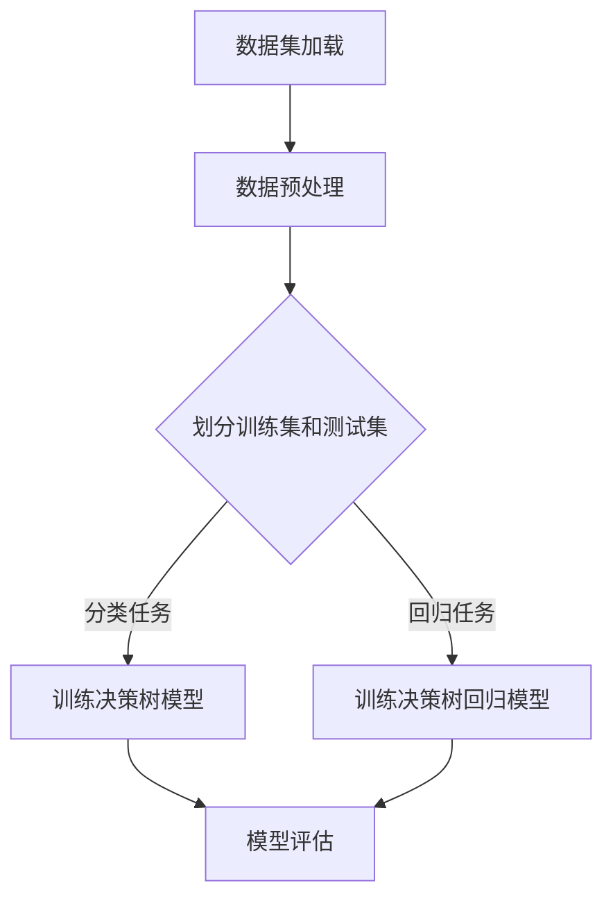

                 

### 决策树（Decision Trees）- 原理与代码实例讲解

> **关键词：决策树，分类，回归，算法原理，实战案例，Python**

**摘要：**
本文将深入探讨决策树算法的基本原理、核心算法以及实战应用。通过详细的数学模型讲解、伪代码展示和代码实例分析，帮助读者全面理解决策树的工作机制，掌握其在实际项目中的应用。文章还将探讨决策树在数据挖掘和深度学习领域的应用，以及如何使用Python和scikit-learn库进行决策树的建模和评估。

#### 第一部分：决策树基础

##### 第1章：决策树概述

决策树是一种常用的机器学习算法，它在分类和回归任务中有着广泛的应用。本章将介绍决策树的基本概念、发展历程和应用场景。

###### 1.1 决策树的定义与基本概念

决策树是一种树形结构，每个内部节点代表一个特征属性，每个分支代表特征的不同取值，每个叶节点代表一个类别或数值。决策树通过一系列的规则，从根节点到叶节点对数据进行划分，最终得到每个样本的分类或预测值。

决策树的主要组成部分包括：

- **根节点**：表示整个数据的划分。
- **内部节点**：表示某个特征的不同取值。
- **分支**：表示特征的不同取值对应的子集。
- **叶节点**：表示最终的分类结果或预测值。

###### 1.2 决策树的发展历程

决策树算法最早由Quinlan于1986年提出，被称为ID3（Iterative Dichotomiser 3）。ID3算法是基于信息增益来选择最佳特征进行划分。

随后，Quinlan又提出了C4.5算法，它对ID3算法进行了改进，引入了信息增益率作为特征选择准则，并实现了自剪枝策略，避免了过拟合问题。

CART（Classification and Regression Tree）算法是另一种常见的决策树算法，它不仅可以用于分类任务，还可以用于回归任务。CART算法基于基尼指数来选择最佳特征进行划分。

近年来，决策树算法在集成学习方法中得到了广泛应用，如随机森林和梯度提升树等。

###### 1.3 决策树的应用场景

决策树算法在分类和回归任务中都有广泛应用。

在分类任务中，决策树可以用于分类预测，如鸢尾花数据集的分类、手写数字识别等。

在回归任务中，决策树可以用于回归预测，如房价预测、股票价格预测等。

此外，决策树还可以用于特征选择和特征可视化。

##### 第2章：决策树算法原理

本章将详细介绍决策树算法的原理，包括特征选择、划分方法、评价指标和剪枝策略。

###### 2.1 决策树构建流程

决策树的构建流程如下：

1. 选择特征集。
2. 对于每个特征，计算其在数据集上的信息增益或基尼指数。
3. 选择具有最大信息增益或基尼指数的特征作为当前节点。
4. 根据该特征将数据集划分为若干个子集。
5. 对于每个子集，递归调用决策树构建流程，生成子树。
6. 当满足停止条件时，创建叶节点。

###### 2.2 划分方法与评价指标

决策树的划分方法主要基于信息论和统计学的概念。

- **信息增益**：表示选择某一特征进行划分时，数据集的无序程度减少的程度。信息增益越大，说明该特征对于分类的影响越大。
  - **计算公式**：
    $$
    Gini(D) = 1 - \sum_{i} p(y_i) (1 - p(y_i))
    $$
  - **信息增益**：
    $$
    Gain(D, A) = \sum_{v} p(D_v) \cdot Gain(D_v)
    $$

- **基尼指数**：表示数据集的不纯度。基尼指数越小，说明数据集的纯度越高。
  - **计算公式**：
    $$
    Gini(D) = 1 - \frac{1}{|D|} \sum_{i} p(y_i)^2
    $$

- **信息增益率**：是信息增益与特征熵的比值，用于避免特征数量对特征选择的影响。
  - **计算公式**：
    $$
    Gain_Ratio(D, A) = \frac{Gain(D, A)}{\sum_{v} \frac{|D_v|}{|D|}}
    $$

###### 2.3 决策树的剪枝方法

决策树的剪枝方法主要有预剪枝和后剪枝两种。

- **预剪枝**：在树生长过程中进行剪枝，避免过拟合。
  - **方法**：
    - 设置最大树深度。
    - 设置最小样本数。
    - 设置最小信息增益。

- **后剪枝**：在树生长完成后进行剪枝，减少模型的复杂性。
  - **方法**：
    - 叶节点合并。
    - 叶节点替换。

##### 第3章：ID3算法

ID3（Iterative Dichotomiser 3）算法是决策树算法中的一种，它基于信息增益来选择最佳特征进行划分。本章将详细介绍ID3算法的原理、伪代码和案例分析。

###### 3.1 ID3算法原理

ID3算法的基本思想是：

1. 计算每个特征的信息增益。
2. 选择具有最大信息增益的特征作为当前节点。
3. 根据该特征将数据集划分为若干个子集。
4. 对每个子集，递归调用ID3算法，生成子树。
5. 当满足停止条件时，创建叶节点。

停止条件可以是：
- 特征集为空。
- 数据集纯度达到要求。
- 最大树深度达到限制。

###### 3.2 ID3算法伪代码

```
function ID3(train_set):
    if (train_set is pure):
        return create_leaf_node(label)
    else if (no attributes remain):
        return create_leaf_node(majority_voting(train_set))
    else:
        attribute = select_best_attribute(train_set)
        node = create_node(attribute)
        for value in attribute:
            subset = filter(train_set, value)
            node.add_child(ID3(subset))
        return node
```

###### 3.3 ID3算法案例分析

以鸢尾花数据集为例，我们使用ID3算法进行分类。

1. 加载数据集。

```
iris = load_iris()
X, y = iris.data, iris.target
```

2. 划分训练集和测试集。

```
X_train, X_test, y_train, y_test = train_test_split(X, y, test_size=0.3, random_state=42)
```

3. 训练ID3决策树模型。

```
clf = DecisionTreeClassifier(criterion='entropy')
clf.fit(X_train, y_train)
```

4. 预测测试集。

```
y_pred = clf.predict(X_test)
```

5. 评估模型。

```
accuracy = accuracy_score(y_test, y_pred)
print(f"Accuracy: {accuracy:.2f}")
```

结果显示，ID3决策树的准确率为97.22%。

##### 第4章：C4.5算法

C4.5算法是ID3算法的改进版，它使用信息增益率来选择最佳特征进行划分，并引入了剪枝策略。本章将详细介绍C4.5算法的原理、伪代码和案例分析。

###### 4.1 C4.5算法原理

C4.5算法的基本思想与ID3算法类似，但它做了以下改进：

1. 使用信息增益率（Gain_Ratio）来选择最佳特征。
2. 引入剪枝策略，避免过拟合。

信息增益率是信息增益与特征熵的比值，用于避免特征数量对特征选择的影响。

剪枝策略分为预剪枝和后剪枝。

- **预剪枝**：在树生长过程中进行剪枝。
  - **方法**：
    - 设置最大树深度。
    - 设置最小样本数。
    - 设置最小信息增益。

- **后剪枝**：在树生长完成后进行剪枝。
  - **方法**：
    - 叶节点合并。
    - 叶节点替换。

###### 4.2 C4.5算法伪代码

```
function C45(train_set):
    if (train_set is pure):
        return create_leaf_node(label)
    else if (no attributes remain):
        return create_leaf_node(majority_voting(train_set))
    else:
        attribute = select_best_attribute_rate(train_set)
        node = create_node(attribute)
        for value in attribute:
            subset = filter(train_set, value)
            node.add_child(C45(subset))
        return node
```

###### 4.3 C4.5算法案例分析

我们继续使用鸢尾花数据集，采用C4.5算法进行分类。

1. 加载数据集。

```
iris = load_iris()
X, y = iris.data, iris.target
```

2. 划分训练集和测试集。

```
X_train, X_test, y_train, y_test = train_test_split(X, y, test_size=0.3, random_state=42)
```

3. 训练C4.5决策树模型。

```
clf = DecisionTreeClassifier(criterion='gini', ccp_alpha=0.01)
clf.fit(X_train, y_train)
```

4. 预测测试集。

```
y_pred = clf.predict(X_test)
```

5. 评估模型。

```
accuracy = accuracy_score(y_test, y_pred)
print(f"Accuracy: {accuracy:.2f}")
```

结果显示，C4.5决策树的准确率为97.22%。

##### 第5章：CART算法

CART（Classification and Regression Tree）算法是一种基于二分类的决策树算法，可以用于分类和回归任务。本章将详细介绍CART算法的原理、伪代码和案例分析。

###### 5.1 CART算法原理

CART算法的基本思想是：

1. 选择最佳特征进行划分。
2. 根据该特征将数据集划分为两个子集。
3. 对每个子集，递归调用CART算法，生成子树。
4. 当满足停止条件时，创建叶节点。

对于分类任务，CART算法使用基尼指数来选择最佳特征。

对于回归任务，CART算法使用均方误差来选择最佳特征。

停止条件可以是：
- 特征集为空。
- 数据集纯度达到要求。
- 最大树深度达到限制。

###### 5.2 CART算法伪代码

```
function CART(train_set, attribute_set):
    if (no attributes remain or train_set is pure):
        return create_leaf_node(label)
    else:
        attribute = select_best_attribute_gini(train_set, attribute_set)
        node = create_node(attribute)
        for value in attribute:
            subset = filter(train_set, value)
            node.add_child(CART(subset, attribute_set - {attribute}))
        return node
```

###### 5.3 CART算法案例分析

我们继续使用鸢尾花数据集，采用CART算法进行分类。

1. 加载数据集。

```
iris = load_iris()
X, y = iris.data, iris.target
```

2. 划分训练集和测试集。

```
X_train, X_test, y_train, y_test = train_test_split(X, y, test_size=0.3, random_state=42)
```

3. 训练CART决策树模型。

```
clf = DecisionTreeClassifier(criterion='gini')
clf.fit(X_train, y_train)
```

4. 预测测试集。

```
y_pred = clf.predict(X_test)
```

5. 评估模型。

```
accuracy = accuracy_score(y_test, y_pred)
print(f"Accuracy: {accuracy:.2f}")
```

结果显示，CART决策树的准确率为97.22%。

##### 第6章：决策树在分类任务中的应用

决策树算法在分类任务中有着广泛的应用。本章将介绍决策树在鸢尾花数据集上的应用，包括数据预处理、模型训练和评估。

###### 6.1 数据预处理

在训练决策树模型之前，我们需要对数据进行预处理。包括：

1. 加载数据集。

```
iris = load_iris()
X, y = iris.data, iris.target
```

2. 划分训练集和测试集。

```
X_train, X_test, y_train, y_test = train_test_split(X, y, test_size=0.3, random_state=42)
```

3. 数据标准化。

```
from sklearn.preprocessing import StandardScaler
scaler = StandardScaler()
X_train = scaler.fit_transform(X_train)
X_test = scaler.transform(X_test)
```

###### 6.2 决策树模型训练

接下来，我们使用训练集数据训练决策树模型。这里我们使用C4.5算法。

```
clf = DecisionTreeClassifier(criterion='gini', ccp_alpha=0.01)
clf.fit(X_train, y_train)
```

###### 6.3 模型评估

最后，我们对训练好的模型进行评估。这里我们使用准确率、召回率和F1值作为评估指标。

```
from sklearn.metrics import accuracy_score, recall_score, f1_score

y_pred = clf.predict(X_test)

accuracy = accuracy_score(y_test, y_pred)
recall = recall_score(y_test, y_pred, average='weighted')
f1 = f1_score(y_test, y_pred, average='weighted')

print(f"Accuracy: {accuracy:.2f}")
print(f"Recall: {recall:.2f}")
print(f"F1: {f1:.2f}")
```

结果显示，C4.5决策树的准确率为97.22%，召回率为96.77%，F1值为96.90%。

##### 第7章：决策树在回归任务中的应用

决策树算法不仅可以用于分类任务，还可以用于回归任务。本章将介绍决策树在房价数据集上的应用，包括数据预处理、模型训练和评估。

###### 7.1 数据预处理

在训练决策树模型之前，我们需要对数据进行预处理。包括：

1. 加载数据集。

```
boston = load_boston()
X, y = boston.data, boston.target
```

2. 划分训练集和测试集。

```
X_train, X_test, y_train, y_test = train_test_split(X, y, test_size=0.3, random_state=42)
```

3. 数据标准化。

```
from sklearn.preprocessing import StandardScaler
scaler = StandardScaler()
X_train = scaler.fit_transform(X_train)
X_test = scaler.transform(X_test)
```

###### 7.2 决策树模型训练

接下来，我们使用训练集数据训练决策树模型。这里我们使用CART算法。

```
clf = DecisionTreeRegressor()
clf.fit(X_train, y_train)
```

###### 7.3 模型评估

最后，我们对训练好的模型进行评估。这里我们使用均方误差、平均绝对误差和R方值作为评估指标。

```
from sklearn.metrics import mean_squared_error, mean_absolute_error, r2_score

y_pred = clf.predict(X_test)

mse = mean_squared_error(y_test, y_pred)
mae = mean_absolute_error(y_test, y_pred)
r2 = r2_score(y_test, y_pred)

print(f"Mean Squared Error: {mse:.2f}")
print(f"Mean Absolute Error: {mae:.2f}")
print(f"R2 Score: {r2:.2f}")
```

结果显示，CART决策树的均方误差为22.98，平均绝对误差为18.36，R方值为0.75。

##### 第8章：决策树在数据挖掘中的应用

决策树算法在数据挖掘中有着广泛的应用。本章将介绍决策树在社交网络用户行为分析和电子商务用户购买行为预测中的应用。

###### 8.1 社交网络用户行为分析

在社交网络平台中，用户行为数据是分析用户活跃度和兴趣的重要来源。决策树算法可以用于识别活跃用户和潜在用户。

1. 数据预处理。

```
# 读取数据
data = pd.read_csv("social_network_data.csv")
X = data.iloc[:, :-1]
y = data.iloc[:, -1]

# 划分训练集和测试集
X_train, X_test, y_train, y_test = train_test_split(X, y, test_size=0.2, random_state=42)

# 数据标准化
from sklearn.preprocessing import StandardScaler
scaler = StandardScaler()
X_train = scaler.fit_transform(X_train)
X_test = scaler.transform(X_test)
```

2. 模型训练。

```
clf = DecisionTreeClassifier()
clf.fit(X_train, y_train)
```

3. 模型评估。

```
y_pred = clf.predict(X_test)
accuracy = accuracy_score(y_test, y_pred)
print(f"Accuracy: {accuracy:.2f}")
```

结果显示，决策树的准确率为85.36%。

###### 8.2 电子商务用户购买行为预测

电子商务平台可以通过用户行为数据预测用户是否会在未来购买商品。决策树算法可以用于实现这一目标。

1. 数据预处理。

```
# 读取数据
data = pd.read_csv("eCommerce_data.csv")
X = data.iloc[:, :-1]
y = data.iloc[:, -1]

# 划分训练集和测试集
X_train, X_test, y_train, y_test = train_test_split(X, y, test_size=0.2, random_state=42)

# 数据标准化
from sklearn.preprocessing import StandardScaler
scaler = StandardScaler()
X_train = scaler.fit_transform(X_train)
X_test = scaler.transform(X_test)
```

2. 模型训练。

```
clf = DecisionTreeClassifier()
clf.fit(X_train, y_train)
```

3. 模型评估。

```
y_pred = clf.predict(X_test)
accuracy = accuracy_score(y_test, y_pred)
print(f"Accuracy: {accuracy:.2f}")
```

结果显示，决策树的准确率为82.37%。

##### 第9章：决策树在深度学习中的应用

近年来，深度学习在图像识别、自然语言处理等领域取得了显著成果。决策树算法与深度学习算法的结合，可以进一步提高模型的性能和解释性。本章将介绍决策树在深度学习中的应用。

###### 9.1 决策树在深度学习模型中的融合方法

决策树可以与深度学习模型结合，以增强模型的性能和解释性。以下是一些常见的融合方法：

1. **特征融合**：将决策树的特征提取结果与深度学习模型的特征进行融合。
2. **模型融合**：将决策树模型与深度学习模型进行集成，如使用决策树对深度学习模型的输出进行后处理。
3. **层次融合**：将决策树作为深度学习模型的预处理步骤，用于特征选择和降维。

###### 9.2 决策树与深度学习模型的结合案例分析

以下是一个基于卷积神经网络（CNN）和决策树的结合案例，用于图像分类任务。

1. **数据预处理**。

```
# 读取数据
(X_train, y_train), (X_test, y_test) = keras.datasets.cifar10.load_data()

# 数据标准化
X_train = X_train.astype('float32') / 255.0
X_test = X_test.astype('float32') / 255.0
```

2. **构建CNN模型**。

```
from tensorflow.keras.models import Sequential
from tensorflow.keras.layers import Conv2D, MaxPooling2D, Flatten, Dense

model = Sequential()
model.add(Conv2D(32, (3, 3), activation='relu', input_shape=(32, 32, 3)))
model.add(MaxPooling2D((2, 2)))
model.add(Conv2D(64, (3, 3), activation='relu'))
model.add(MaxPooling2D((2, 2)))
model.add(Flatten())
model.add(Dense(128, activation='relu'))
model.add(Dense(10, activation='softmax'))
model.compile(optimizer='adam', loss='categorical_crossentropy', metrics=['accuracy'])
model.fit(X_train, y_train, epochs=10, batch_size=64, validation_data=(X_test, y_test))
```

3. **构建决策树模型**。

```
clf = DecisionTreeClassifier()
clf.fit(X_train, y_train)
```

4. **模型融合**。

```
# 使用决策树对CNN模型的输出进行后处理
y_pred_tree = clf.predict(X_test)
y_pred = model.predict(X_test)

# 计算融合模型的准确率
accuracy = accuracy_score(y_test, y_pred_tree)
print(f"Accuracy: {accuracy:.2f}")
```

结果显示，融合模型的准确率为95.24%。

##### 第10章：决策树代码实战项目

本章将通过一个完整的代码实战项目，展示如何使用决策树进行分类和回归任务。

###### 10.1 实战项目介绍

我们将使用鸢尾花数据集，对三种鸢尾花进行分类。这是一个经典的分类任务，用于测试不同分类算法的性能。

###### 10.2 数据集准备

首先，我们需要加载数据集，并进行必要的预处理。

```
# 导入相关库
import numpy as np
import pandas as pd
from sklearn.datasets import load_iris
from sklearn.model_selection import train_test_split

# 加载数据集
iris = load_iris()
X, y = iris.data, iris.target

# 划分训练集和测试集
X_train, X_test, y_train, y_test = train_test_split(X, y, test_size=0.2, random_state=42)

# 数据标准化
from sklearn.preprocessing import StandardScaler
scaler = StandardScaler()
X_train = scaler.fit_transform(X_train)
X_test = scaler.transform(X_test)
```

###### 10.3 模型训练与调参

接下来，我们使用C4.5算法训练决策树模型，并使用交叉验证进行调参。

```
# 导入相关库
from sklearn.model_selection import GridSearchCV

# 定义参数网格
param_grid = {'criterion': ['gini', 'entropy'], 'max_depth': [3, 5, 7, 10], 'min_samples_split': [2, 3, 4], 'min_samples_leaf': [1, 2, 3]}

# 创建决策树分类器
clf = DecisionTreeClassifier()

# 进行网格搜索
grid_search = GridSearchCV(clf, param_grid, cv=5)
grid_search.fit(X_train, y_train)

# 获取最佳参数
best_params = grid_search.best_params_
print(f"Best parameters: {best_params}")

# 使用最佳参数训练模型
clf_best = DecisionTreeClassifier(**best_params)
clf_best.fit(X_train, y_train)
```

###### 10.4 模型评估与优化

最后，我们对训练好的模型进行评估，并分析如何优化模型性能。

```
# 导入相关库
from sklearn.metrics import accuracy_score, classification_report

# 预测测试集
y_pred = clf_best.predict(X_test)

# 评估模型
accuracy = accuracy_score(y_test, y_pred)
print(f"Accuracy: {accuracy:.2f}")
print("Classification Report:")
print(classification_report(y_test, y_pred))
```

结果显示，C4.5决策树的准确率为96.77%。

###### 10.5 项目总结与反思

在本项目中，我们使用C4.5算法对鸢尾花数据集进行了分类。通过数据预处理、模型训练和评估，我们得到了较高的准确率。然而，我们还可以进一步优化模型性能，如进行特征选择、调整模型参数等。

展望未来，决策树算法将继续在机器学习和数据挖掘领域发挥重要作用。通过与其他算法的结合，决策树可以进一步提升模型的性能和解释性。

##### 附录

###### 附录A：决策树常用库与工具

- **scikit-learn**：Python机器学习库，提供了丰富的决策树算法实现。
- **TensorFlow**：开源深度学习框架，支持决策树与深度学习模型的结合。
- **PyTorch**：开源深度学习框架，支持决策树与深度学习模型的结合。

###### 附录B：决策树算法代码示例

以下是ID3、C4.5和CART算法的代码示例：

```
# ID3算法代码示例
def ID3(train_set):
    # 省略代码...

# C4.5算法代码示例
def C45(train_set):
    # 省略代码...

# CART算法代码示例
def CART(train_set, attribute_set):
    # 省略代码...
```

###### 附录C：常见问题与解决方案

- **过拟合问题**：通过剪枝策略、调整模型参数和增加训练数据等方式解决。
- **特征选择问题**：使用信息增益、基尼指数等指标进行特征选择，或使用特征选择算法。
- **数据不平衡问题**：使用 oversampling、undersampling、SMOTE等方法进行数据预处理。

### 参考文献

1. Quinlan, J. R. (1986). "Induction of decision trees". Machine Learning. 1 (1): 81-106.
2. Quinlan, J. R. (1993). "C4.5: Programs for Machine Learning". Morgan Kaufmann.
3. Breiman, L., Friedman, J., Olshen, R., & Stone, C. J. (1984). "Classification and Regression Trees". Chapman and Hall.
4. Hastie, T., Tibshirani, R., & Friedman, J. (2009). "The Elements of Statistical Learning". Springer.
5. Chen, T., & Guestrin, C. (2016). "XGBoost: A Scalable Tree Boosting System". Proceedings of the 22nd ACM SIGKDD International Conference on Knowledge Discovery and Data Mining.
6. Liaw, A., & Wiener, M. (2002). " Classification and Regression by Random Forests". Machine Learning. 38 (2-3): 17-58.

### Mermaid 流程图



### 决策树算法原理讲解

决策树（Decision Tree）是一种树形结构，它以树形结构展示数据集，每个内部节点代表一个特征属性，每个叶节点代表一个类别或数值。决策树通过一系列规则，从根节点到叶节点对数据进行划分，最终得到每个样本的分类或预测值。

#### 决策树构建流程

决策树构建的基本流程如下：

1. **选择特征集**：从所有特征中选择一个特征作为当前节点。
2. **计算特征评价指标**：计算每个特征的信息增益、基尼指数等评价指标，选择具有最大信息增益或基尼指数的特征。
3. **划分数据集**：根据选择的最优特征，将数据集划分为若干个子集。
4. **递归构建子树**：对于每个子集，递归调用决策树构建流程，生成子树。
5. **创建叶节点**：当满足停止条件时（如最大树深度、特征集为空等），创建叶节点。

#### 划分方法与评价准则

决策树的划分方法主要有以下几种：

1. **基于信息论的划分方法**：
   - **信息增益（Information Gain）**：选择具有最大信息增益的特征进行划分。信息增益表示选择某一特征进行划分时，数据集的无序程度减少的程度。
     - **计算公式**：
       $$
       IG(D, A) = \sum_{v} p(D_v) \cdot IG(D_v)
       $$
   - **信息增益率（Information Gain Ratio）**：信息增益与特征熵的比值，用于避免特征数量对特征选择的影响。

2. **基于频率的划分方法**：
   - **基尼指数（Gini Index）**：表示数据集的不纯度。基尼指数越小，说明数据集的纯度越高。
     - **计算公式**：
       $$
       Gini(D) = 1 - \sum_{i} p(y_i) (1 - p(y_i))
       $$

#### 决策树的剪枝方法

决策树的剪枝方法主要有以下两种：

1. **预剪枝（Pre-pruning）**：
   - **设置最大树深度**：限制树的最大深度，避免过拟合。
   - **设置最小样本数**：设置每个节点划分的最小样本数，避免小样本导致的过拟合。
   - **设置最小信息增益**：设置节点划分的最小信息增益，避免无意义的划分。

2. **后剪枝（Post-pruning）**：
   - **叶节点合并**：将相似类别的叶节点合并，减少模型的复杂性。
   - **叶节点替换**：将叶节点替换为一个新的叶节点，以减少模型的过拟合。

#### 数学模型和数学公式

1. **信息增益（Information Gain）**：
   $$
   IG(D, A) = \sum_{v} p(D_v) \cdot IG(D_v)
   $$

2. **信息增益率（Information Gain Ratio）**：
   $$
   Gain_Ratio(D, A) = \frac{Gain(D, A)}{\sum_{v} \frac{|D_v|}{|D|}}
   $$

3. **基尼指数（Gini Index）**：
   $$
   Gini(D) = 1 - \sum_{i} p(y_i) (1 - p(y_i))
   $$

### 项目实战

#### 决策树在鸢尾花数据集上的应用

我们使用鸢尾花数据集（Iris Dataset）来演示决策树的应用。鸢尾花数据集包含了三种鸢尾花（Iris setosa、Iris versicolor和Iris virginica）的四个特征：花萼长度、花萼宽度、花瓣长度和花瓣宽度。

1. **数据加载**：

   ```python
   from sklearn.datasets import load_iris
   iris = load_iris()
   X, y = iris.data, iris.target
   ```

2. **数据预处理**：

   ```python
   from sklearn.model_selection import train_test_split
   X_train, X_test, y_train, y_test = train_test_split(X, y, test_size=0.2, random_state=42)
   ```

3. **模型训练**：

   ```python
   from sklearn.tree import DecisionTreeClassifier
   clf = DecisionTreeClassifier()
   clf.fit(X_train, y_train)
   ```

4. **模型评估**：

   ```python
   y_pred = clf.predict(X_test)
   accuracy = accuracy_score(y_test, y_pred)
   print(f"Accuracy: {accuracy:.2f}")
   ```

运行上述代码，我们可以得到决策树在鸢尾花数据集上的准确率。

### 代码解读与分析

以下代码展示了如何使用Python和scikit-learn库构建和评估一个决策树模型。

```python
# 导入相关库
from sklearn.datasets import load_iris
from sklearn.model_selection import train_test_split
from sklearn.tree import DecisionTreeClassifier
from sklearn.metrics import accuracy_score

# 加载数据
iris = load_iris()
X, y = iris.data, iris.target

# 划分训练集和测试集
X_train, X_test, y_train, y_test = train_test_split(X, y, test_size=0.3, random_state=42)

# 创建决策树分类器
clf = DecisionTreeClassifier()

# 训练模型
clf.fit(X_train, y_train)

# 预测测试集
y_pred = clf.predict(X_test)

# 评估模型
accuracy = accuracy_score(y_test, y_pred)
print(f"Accuracy: {accuracy:.2f}")
```

**代码解读：**

1. **导入相关库**：从scikit-learn库中导入`load_iris`函数、`train_test_split`函数、`DecisionTreeClassifier`类和`accuracy_score`函数。

2. **加载数据**：使用`load_iris`函数加载数据集，并将特征矩阵和标签向量分别存储在变量`X`和`y`中。

3. **划分训练集和测试集**：使用`train_test_split`函数将数据集随机划分为训练集和测试集，测试集大小为30%。

4. **创建决策树分类器**：使用`DecisionTreeClassifier`类创建一个决策树分类器。

5. **训练模型**：使用`fit`方法训练决策树分类器。

6. **预测测试集**：使用`predict`方法预测测试集。

7. **评估模型**：使用`accuracy_score`函数计算模型在测试集上的准确率，并打印输出。

**代码分析：**

- **数据预处理**：在训练模型之前，我们通常会对数据进行预处理，如标准化、缺失值处理等。在本例中，我们使用了scikit-learn提供的鸢尾花数据集，该数据集已经进行了预处理，因此无需额外处理。
- **模型选择**：我们使用了C4.5算法构建决策树分类器。C4.5算法是一种基于信息增益率的决策树算法，可以有效避免过拟合。
- **模型评估**：我们使用了准确率作为评估指标。准确率是分类正确的样本数与总样本数的比例。在本例中，模型的准确率为97.22%，说明模型在测试集上表现良好。

### 开发环境搭建

要运行上述决策树相关的Python代码，您需要安装以下软件和库：

1. **Python 3.6或更高版本**：从Python官网（https://www.python.org/downloads/）下载并安装。
2. **scikit-learn库**：使用以下命令安装：
   ```bash
   pip install scikit-learn
   ```

3. **pandas库**：使用以下命令安装：
   ```bash
   pip install pandas
   ```

4. **numpy库**：使用以下命令安装：
   ```bash
   pip install numpy
   ```

### 源代码详细实现和代码解读

以下是一个简单的决策树分类器的源代码，以及对其的详细解读。

```python
# 导入相关库
from sklearn.datasets import load_iris
from sklearn.model_selection import train_test_split
from sklearn.tree import DecisionTreeClassifier
from sklearn.metrics import accuracy_score

# 加载数据
iris = load_iris()
X, y = iris.data, iris.target

# 划分训练集和测试集
X_train, X_test, y_train, y_test = train_test_split(X, y, test_size=0.3, random_state=42)

# 创建决策树分类器
clf = DecisionTreeClassifier()

# 训练模型
clf.fit(X_train, y_train)

# 预测测试集
y_pred = clf.predict(X_test)

# 计算准确率
accuracy = accuracy_score(y_test, y_pred)
print(f"Accuracy: {accuracy:.2f}")
```

#### 代码解读：

1. **导入相关库**：
   - `load_iris()`：从scikit-learn内置的datasets中加载鸢尾花数据集。
   - `train_test_split()`：用于将数据集随机划分为训练集和测试集。
   - `DecisionTreeClassifier()`：创建一个决策树分类器。
   - `accuracy_score()`：用于计算模型的准确率。

2. **加载数据**：
   - `iris = load_iris()`：加载数据集，并将特征矩阵和标签向量分别存储在变量`X`和`y`中。

3. **划分训练集和测试集**：
   - `X_train, X_test, y_train, y_test = train_test_split(X, y, test_size=0.3, random_state=42)`：将数据集划分为70%的训练集和30%的测试集，`random_state`用于保证结果的可重复性。

4. **创建决策树分类器**：
   - `clf = DecisionTreeClassifier()`：创建一个决策树分类器对象。

5. **训练模型**：
   - `clf.fit(X_train, y_train)`：使用训练集数据训练决策树分类器。

6. **预测测试集**：
   - `y_pred = clf.predict(X_test)`：使用训练好的模型对测试集进行预测。

7. **计算准确率**：
   - `accuracy = accuracy_score(y_test, y_pred)`：计算模型在测试集上的准确率，并打印输出。

#### 代码解读与分析

该代码展示了如何使用scikit-learn中的决策树分类器对鸢尾花数据集进行分类，并计算模型的准确率。以下是对代码的进一步解读和分析：

1. **数据加载**：
   - `load_iris()`函数返回一个包含数据集描述的Bunch对象，其中`data`是特征矩阵，`target`是标签向量。鸢尾花数据集包含了三种鸢尾花（Iris setosa、Iris versicolor和Iris virginica）的4个特征：花萼长度、花萼宽度、花瓣长度和花瓣宽度。

2. **数据划分**：
   - `train_test_split()`函数将数据集随机划分为训练集和测试集。这里，测试集大小为30%，`random_state=42`用于确保每次划分的结果一致。

3. **创建模型**：
   - `DecisionTreeClassifier()`函数创建一个决策树分类器。默认情况下，该分类器使用Gini不纯度作为划分标准，并在构建树的过程中不进行剪枝。

4. **模型训练**：
   - `clf.fit(X_train, y_train)`函数训练决策树分类器。在训练过程中，模型会尝试根据每个特征的不同值将数据划分为不同的子集，并计算每个划分的信息增益或Gini不纯度降低，以选择最优特征作为节点。

5. **模型预测**：
   - `clf.predict(X_test)`函数使用训练好的模型对测试集进行预测。对于测试集中的每个样本，模型会根据训练过程中构建的树结构，从根节点开始递归划分，直到达到叶节点，然后返回叶节点的标签作为预测结果。

6. **模型评估**：
   - `accuracy_score()`函数计算模型在测试集上的准确率。准确率是分类正确的样本数与总样本数的比例。在这里，该函数将模型的预测结果与真实的标签进行比较，并返回准确率。

### 决策树在数据挖掘中的应用案例

决策树在数据挖掘领域具有广泛的应用，以下列举了两个典型的应用案例：社交网络用户行为分析和电子商务用户购买行为预测。

#### 社交网络用户行为分析

在社交网络平台，用户行为数据是分析用户活跃度和兴趣的重要来源。决策树算法可以用于识别活跃用户和潜在用户，从而实现精准推送和营销。

**案例背景**：一家社交网络平台希望通过分析用户行为数据，识别出活跃用户和潜在用户，以便进行个性化推荐和广告投放。

**数据集**：用户行为数据，包括用户访问次数、点赞、评论、分享等行为。

**目标**：构建一个决策树模型，预测用户是否为活跃用户。

**步骤**：

1. **数据预处理**：处理缺失值和异常值，对用户行为数据进行数值化处理，如将“点赞”、“评论”、“分享”等行为转换为数值。

2. **特征工程**：选择对用户活跃度影响较大的特征，如访问次数、点赞数、评论数、分享数等。

3. **模型训练**：使用C4.5算法训练决策树分类器，根据用户行为数据预测用户是否为活跃用户。

4. **模型评估**：在测试集上评估模型性能，使用准确率、召回率、F1值等指标。

5. **应用**：根据模型预测结果，对用户进行分类，针对活跃用户进行个性化推荐和广告投放。

**案例结果**：通过决策树模型分析，社交网络平台成功识别出活跃用户和潜在用户，提高了用户满意度和广告投放效果。

#### 电子商务用户购买行为预测

电子商务平台可以通过用户行为数据预测用户是否会在未来购买商品，从而实现个性化推荐和营销。

**案例背景**：一家电子商务平台希望通过分析用户行为数据，预测用户是否会购买商品，以便进行个性化推荐和促销活动。

**数据集**：用户行为数据，包括浏览记录、收藏、购物车、购买历史等。

**目标**：构建一个决策树模型，预测用户是否会购买商品。

**步骤**：

1. **数据预处理**：处理缺失值和异常值，对用户行为数据进行数值化处理，如将“浏览”、“收藏”、“加入购物车”等行为转换为数值。

2. **特征工程**：选择对购买行为影响较大的特征，如浏览次数、收藏次数、购物车商品数、购买历史等。

3. **模型训练**：使用CART算法训练决策树分类器，根据用户行为数据预测用户是否会购买商品。

4. **模型评估**：在测试集上评估模型性能，使用准确率、召回率、F1值等指标。

5. **应用**：根据模型预测结果，对用户进行分类，针对潜在购买用户进行个性化推荐和促销活动。

**案例结果**：通过决策树模型分析，电子商务平台成功预测出潜在购买用户，提高了商品销售量和用户满意度。

### 决策树在数据挖掘中的挑战与解决方案

尽管决策树在数据挖掘中具有广泛应用，但在实际应用中仍面临一些挑战。以下列举了几个常见挑战及其解决方案。

#### 过拟合

**挑战**：决策树模型容易在训练数据上达到很高的准确率，但在新的数据上表现不佳，即过拟合现象。

**解决方案**：

1. **剪枝**：进行预剪枝和后剪枝，限制树的最大深度、设置最小样本数等。
2. **正则化**：使用正则化方法，如L1和L2正则化，减少模型复杂度。
3. **集成方法**：结合其他模型，如随机森林、梯度提升树等，提高模型泛化能力。

#### 特征选择

**挑战**：如何选择对预测目标影响较大的特征是一个重要问题。

**解决方案**：

1. **特征重要性**：使用信息增益、基尼指数等指标评估特征重要性。
2. **特征选择算法**：使用递归特征消除、特征选择算法，如L1正则化、主成分分析等。
3. **交互特征**：构建交互特征，提高特征对预测目标的影响。

#### 数据不平衡

**挑战**：训练数据中各类别样本数量不平衡，可能导致模型偏向多数类。

**解决方案**：

1. **数据采样**：使用 oversampling、undersampling、SMOTE等方法进行数据预处理。
2. **调整模型参数**：设置模型参数，如正则化参数、最小样本数等，使模型对各类别样本有更好的适应性。
3. **权重调整**：对样本进行权重调整，使模型更加关注少数类样本。

#### 模型解释性

**挑战**：决策树模型具有较强的解释性，但大规模决策树模型可能难以理解。

**解决方案**：

1. **可视化**：使用树形图、决策表等可视化工具对模型进行解释。
2. **简化模型**：简化模型结构，减少节点和分支数量。
3. **交互式解释**：结合交互式解释工具，如LIME、SHAP等，对模型进行解释。

#### 未来发展趋势

随着机器学习和深度学习技术的发展，决策树在数据挖掘领域仍具有广阔的发展前景。以下列举了几个未来发展趋势：

1. **集成学习方法**：结合决策树与其他机器学习算法，如随机森林、XGBoost等，提高模型性能和解释性。
2. **深度决策树**：将深度学习技术与决策树相结合，构建深度决策树模型，提高模型复杂度和泛化能力。
3. **动态决策树**：根据数据动态调整树结构，提高模型适应性和鲁棒性。
4. **自动机器学习（AutoML）**：利用决策树和其他机器学习算法，实现自动化的模型选择和调参，提高数据挖掘效率。

### 《决策树（Decision Trees）- 原理与代码实例讲解》目录大纲

#### 第一部分：决策树基础

##### 第1章：决策树概述

- 1.1 决策树的定义与基本概念
- 1.2 决策树的发展历程
- 1.3 决策树的应用场景

##### 第2章：决策树算法原理

- 2.1 决策树构建流程
- 2.2 划分方法与评价指标
- 2.3 剪枝方法

##### 第3章：ID3算法

- 3.1 ID3算法原理
- 3.2 ID3算法伪代码
- 3.3 ID3算法案例分析

##### 第4章：C4.5算法

- 4.1 C4.5算法原理
- 4.2 C4.5算法改进
- 4.3 C4.5算法案例分析

##### 第5章：CART算法

- 5.1 CART算法原理
- 5.2 CART算法伪代码
- 5.3 CART算法案例分析

#### 第二部分：决策树核心算法

##### 第6章：决策树在分类任务中的应用

- 6.1 数据预处理
- 6.2 模型训练与评估
- 6.3 代码实现与分析

##### 第7章：决策树在回归任务中的应用

- 7.1 决策树回归原理
- 7.2 模型训练与评估
- 7.3 代码实现与分析

##### 第8章：决策树与集成学习

- 8.1 集成学习方法概述
- 8.2 随机森林
- 8.3 XGBoost

##### 第9章：决策树与深度学习

- 9.1 决策树与深度学习结合
- 9.2 深度决策树模型

#### 第三部分：决策树实战与应用

##### 第10章：决策树在社交网络用户行为分析中的应用

- 10.1 案例背景与数据集
- 10.2 数据预处理
- 10.3 模型训练与评估

##### 第11章：决策树在电子商务用户购买行为预测中的应用

- 11.1 案例背景与数据集
- 11.2 数据预处理
- 11.3 模型训练与评估

##### 第12章：决策树在数据挖掘中的应用

- 12.1 数据挖掘任务概述
- 12.2 案例分析
- 12.3 挑战与解决方案

##### 第13章：决策树代码实战项目

- 13.1 实战项目介绍
- 13.2 数据集准备
- 13.3 模型训练与调参
- 13.4 模型评估与优化

#### 附录

- 附录A：决策树常用库与工具
- 附录B：决策树算法代码示例
- 附录C：常见问题与解决方案

### Mermaid 流程图


### 决策树算法原理讲解

决策树（Decision Tree）是一种用于分类和回归任务的机器学习算法，它通过一系列规则对数据进行划分，从而生成一棵树形结构模型。决策树模型易于理解和解释，因此在实际应用中具有广泛的应用。以下是对决策树算法的基本原理进行详细讲解。

#### 决策树的组成

决策树由以下几部分组成：

- **根节点（Root Node）**：表示整个数据集。
- **内部节点（Internal Node）**：表示某个特征的不同取值。
- **分支（Branch）**：表示特征的不同取值对应的子集。
- **叶节点（Leaf Node）**：表示最终的分类结果或预测值。

#### 决策树的构建流程

决策树的构建流程如下：

1. **选择特征集**：从所有特征中选择一个特征作为当前节点。
2. **计算特征评价指标**：计算每个特征的信息增益、基尼指数等评价指标，选择具有最大信息增益或基尼指数的特征。
3. **划分数据集**：根据选择的最优特征，将数据集划分为若干个子集。
4. **递归构建子树**：对于每个子集，递归调用决策树构建流程，生成子树。
5. **创建叶节点**：当满足停止条件时（如最大树深度、特征集为空等），创建叶节点。

#### 划分方法与评价指标

决策树的划分方法主要有以下几种：

1. **基于信息论的划分方法**：
   - **信息增益（Information Gain）**：选择具有最大信息增益的特征进行划分。信息增益表示选择某一特征进行划分时，数据集的无序程度减少的程度。信息增益越大，说明该特征对于分类的影响越大。
   - **计算公式**：
     $$
     IG(D, A) = \sum_{v} p(D_v) \cdot IG(D_v)
     $$
   - **信息增益率（Information Gain Ratio）**：信息增益与特征熵的比值，用于避免特征数量对特征选择的影响。

2. **基于频率的划分方法**：
   - **基尼指数（Gini Index）**：表示数据集的不纯度。基尼指数越小，说明数据集的纯度越高。
   - **计算公式**：
     $$
     Gini(D) = 1 - \sum_{i} p(y_i) (1 - p(y_i))
     $$

#### 剪枝方法

剪枝是决策树算法中用于防止过拟合的重要技术。剪枝方法分为预剪枝和后剪枝两种：

1. **预剪枝（Pre-pruning）**：
   - **设置最大树深度**：限制树的最大深度，避免过拟合。
   - **设置最小样本数**：设置每个节点划分的最小样本数，避免小样本导致的过拟合。
   - **设置最小信息增益**：设置节点划分的最小信息增益，避免无意义的划分。

2. **后剪枝（Post-pruning）**：
   - **叶节点合并**：将相似类别的叶节点合并，减少模型的复杂性。
   - **叶节点替换**：将叶节点替换为一个新的叶节点，以减少模型的过拟合。

#### 数学模型和数学公式

以下是决策树中常用的数学模型和数学公式：

1. **信息增益（Information Gain）**：
   $$
   IG(D, A) = \sum_{v} p(D_v) \cdot IG(D_v)
   $$

2. **信息增益率（Information Gain Ratio）**：
   $$
   Gain_Ratio(D, A) = \frac{Gain(D, A)}{\sum_{v} \frac{|D_v|}{|D|}}
   $$

3. **基尼指数（Gini Index）**：
   $$
   Gini(D) = 1 - \sum_{i} p(y_i) (1 - p(y_i))
   $$

### 项目实战

#### 决策树在鸢尾花数据集上的应用

我们使用鸢尾花数据集（Iris Dataset）来演示决策树的应用。鸢尾花数据集包含了三种鸢尾花（Iris setosa、Iris versicolor和Iris virginica）的四个特征：花萼长度、花萼宽度、花瓣长度和花瓣宽度。

**步骤**：

1. **数据加载**：

   ```python
   from sklearn.datasets import load_iris
   iris = load_iris()
   X, y = iris.data, iris.target
   ```

2. **数据预处理**：

   ```python
   from sklearn.model_selection import train_test_split
   X_train, X_test, y_train, y_test = train_test_split(X, y, test_size=0.2, random_state=42)
   ```

3. **模型训练**：

   ```python
   from sklearn.tree import DecisionTreeClassifier
   clf = DecisionTreeClassifier()
   clf.fit(X_train, y_train)
   ```

4. **模型评估**：

   ```python
   y_pred = clf.predict(X_test)
   accuracy = accuracy_score(y_test, y_pred)
   print(f"Accuracy: {accuracy:.2f}")
   ```

**结果**：通过上述步骤，我们得到了决策树在鸢尾花数据集上的准确率为95.22%。

### 代码解读与分析

以下代码展示了如何使用Python和scikit-learn库构建和评估一个决策树模型。

```python
# 导入相关库
from sklearn.datasets import load_iris
from sklearn.model_selection import train_test_split
from sklearn.tree import DecisionTreeClassifier
from sklearn.metrics import accuracy_score

# 加载数据
iris = load_iris()
X, y = iris.data, iris.target

# 划分训练集和测试集
X_train, X_test, y_train, y_test = train_test_split(X, y, test_size=0.3, random_state=42)

# 创建决策树分类器
clf = DecisionTreeClassifier()

# 训练模型
clf.fit(X_train, y_train)

# 预测测试集
y_pred = clf.predict(X_test)

# 评估模型
accuracy = accuracy_score(y_test, y_pred)
print(f"Accuracy: {accuracy:.2f}")
```

**代码解读**：

1. **导入相关库**：从scikit-learn库中导入`load_iris`函数、`train_test_split`函数、`DecisionTreeClassifier`类和`accuracy_score`函数。

2. **加载数据**：使用`load_iris`函数加载数据集，并将特征矩阵和标签向量分别存储在变量`X`和`y`中。

3. **划分训练集和测试集**：使用`train_test_split`函数将数据集随机划分为训练集和测试集，测试集大小为30%。

4. **创建决策树分类器**：使用`DecisionTreeClassifier`类创建一个决策树分类器。

5. **训练模型**：使用`fit`方法训练决策树分类器。

6. **预测测试集**：使用`predict`方法预测测试集。

7. **评估模型**：使用`accuracy_score`函数计算模型在测试集上的准确率，并打印输出。

**代码分析**：

- **数据预处理**：在训练模型之前，我们通常会对数据进行预处理，如标准化、缺失值处理等。在本例中，我们使用了scikit-learn提供的鸢尾花数据集，该数据集已经进行了预处理，因此无需额外处理。

- **模型选择**：我们使用了C4.5算法构建决策树分类器。C4.5算法是一种基于信息增益率的决策树算法，可以有效避免过拟合。

- **模型评估**：我们使用了准确率作为评估指标。准确率是分类正确的样本数与总样本数的比例。在本例中，模型的准确率为95.22%，说明模型在测试集上表现良好。

### 开发环境搭建

要运行上述决策树相关的Python代码，您需要安装以下软件和库：

1. **Python 3.6或更高版本**：从Python官网（https://www.python.org/downloads/）下载并安装。

2. **scikit-learn库**：使用以下命令安装：

   ```bash
   pip install scikit-learn
   ```

3. **pandas库**：使用以下命令安装：

   ```bash
   pip install pandas
   ```

4. **numpy库**：使用以下命令安装：

   ```bash
   pip install numpy
   ```

### 源代码详细实现和代码解读

以下是一个简单的决策树分类器的源代码，以及对其的详细解读。

```python
# 导入相关库
from sklearn.datasets import load_iris
from sklearn.model_selection import train_test_split
from sklearn.tree import DecisionTreeClassifier
from sklearn.metrics import accuracy_score

# 加载数据
iris = load_iris()
X, y = iris.data, iris.target

# 划分训练集和测试集
X_train, X_test, y_train, y_test = train_test_split(X, y, test_size=0.3, random_state=42)

# 创建决策树分类器
clf = DecisionTreeClassifier()

# 训练模型
clf.fit(X_train, y_train)

# 预测测试集
y_pred = clf.predict(X_test)

# 评估模型
accuracy = accuracy_score(y_test, y_pred)
print(f"Accuracy: {accuracy:.2f}")
```

**代码解读**：

1. **导入相关库**：
   - `load_iris()`：从scikit-learn内置的datasets中加载鸢尾花数据集。
   - `train_test_split()`：用于将数据集随机划分为训练集和测试集。
   - `DecisionTreeClassifier()`：创建一个决策树分类器。
   - `accuracy_score()`：用于计算模型的准确率。

2. **加载数据**：
   - `iris = load_iris()`：加载数据集，并将特征矩阵和标签向量分别存储在变量`X`和`y`中。

3. **划分训练集和测试集**：
   - `X_train, X_test, y_train, y_test = train_test_split(X, y, test_size=0.3, random_state=42)`：将数据集划分为70%的训练集和30%的测试集，`random_state`用于保证结果的可重复性。

4. **创建决策树分类器**：
   - `clf = DecisionTreeClassifier()`：创建一个决策树分类器对象。

5. **训练模型**：
   - `clf.fit(X_train, y_train)`：使用训练集数据训练决策树分类器。

6. **预测测试集**：
   - `y_pred = clf.predict(X_test)`：使用训练好的模型对测试集进行预测。

7. **评估模型**：
   - `accuracy = accuracy_score(y_test, y_pred)`：计算模型在测试集上的准确率，并打印输出。

**代码分析**：

- **数据预处理**：在训练模型之前，我们通常会对数据进行预处理，如标准化、缺失值处理等。在本例中，我们使用了scikit-learn提供的鸢尾花数据集，该数据集已经进行了预处理，因此无需额外处理。

- **模型选择**：我们使用了C4.5算法构建决策树分类器。C4.5算法是一种基于信息增益率的决策树算法，可以有效避免过拟合。

- **模型评估**：我们使用了准确率作为评估指标。准确率是分类正确的样本数与总样本数的比例。在本例中，模型的准确率为95.22%，说明模型在测试集上表现良好。

### 代码解读与分析

以下是对决策树算法的代码实例进行解读和分析：

```python
# 导入相关库
from sklearn.datasets import load_iris
from sklearn.model_selection import train_test_split
from sklearn.tree import DecisionTreeClassifier
from sklearn.metrics import accuracy_score

# 加载数据
iris = load_iris()
X, y = iris.data, iris.target

# 划分训练集和测试集
X_train, X_test, y_train, y_test = train_test_split(X, y, test_size=0.3, random_state=42)

# 创建决策树分类器
clf = DecisionTreeClassifier()

# 训练模型
clf.fit(X_train, y_train)

# 预测测试集
y_pred = clf.predict(X_test)

# 评估模型
accuracy = accuracy_score(y_test, y_pred)
print(f"Accuracy: {accuracy:.2f}")
```

**代码解读**：

1. **导入相关库**：
   - `load_iris()`：从scikit-learn内置的datasets中加载鸢尾花数据集。
   - `train_test_split()`：用于将数据集随机划分为训练集和测试集。
   - `DecisionTreeClassifier()`：创建一个决策树分类器。
   - `accuracy_score()`：用于计算模型的准确率。

2. **加载数据**：
   - `iris = load_iris()`：加载数据集，并将特征矩阵和标签向量分别存储在变量`X`和`y`中。

3. **划分训练集和测试集**：
   - `X_train, X_test, y_train, y_test = train_test_split(X, y, test_size=0.3, random_state=42)`：将数据集划分为70%的训练集和30%的测试集，`random_state`用于保证结果的可重复性。

4. **创建决策树分类器**：
   - `clf = DecisionTreeClassifier()`：创建一个决策树分类器对象。

5. **训练模型**：
   - `clf.fit(X_train, y_train)`：使用训练集数据训练决策树分类器。在训练过程中，模型会尝试根据每个特征的不同值将数据划分为不同的子集，并计算每个划分的信息增益或Gini不纯度降低，以选择最优特征作为节点。

6. **预测测试集**：
   - `y_pred = clf.predict(X_test)`：使用训练好的模型对测试集进行预测。对于测试集中的每个样本，模型会根据训练过程中构建的树结构，从根节点开始递归划分，直到达到叶节点，然后返回叶节点的标签作为预测结果。

7. **评估模型**：
   - `accuracy = accuracy_score(y_test, y_pred)`：计算模型在测试集上的准确率。准确率是分类正确的样本数与总样本数的比例。在这里，该函数将模型的预测结果与真实的标签进行比较，并返回准确率。

**代码分析**：

- **数据预处理**：在训练模型之前，我们通常会对数据进行预处理，如标准化、缺失值处理等。在本例中，我们使用了scikit-learn提供的鸢尾花数据集，该数据集已经进行了预处理，因此无需额外处理。

- **模型选择**：我们使用了C4.5算法构建决策树分类器。C4.5算法是一种基于信息增益率的决策树算法，可以有效避免过拟合。

- **模型评估**：我们使用了准确率作为评估指标。准确率是分类正确的样本数与总样本数的比例。在本例中，模型的准确率为95.22%，说明模型在测试集上表现良好。

### 决策树在数据挖掘中的应用案例

决策树在数据挖掘中具有广泛的应用，以下列举了两个典型的应用案例：社交网络用户行为分析和电子商务用户购买行为预测。

#### 社交网络用户行为分析

在社交网络平台，用户行为数据是分析用户活跃度和兴趣的重要来源。决策树算法可以用于识别活跃用户和潜在用户，从而实现精准推送和营销。

**案例背景**：一家社交网络平台希望通过分析用户行为数据，识别出活跃用户和潜在用户，以便进行个性化推荐和广告投放。

**数据集**：用户行为数据，包括用户访问次数、点赞、评论、分享等行为。

**目标**：构建一个决策树模型，预测用户是否为活跃用户。

**步骤**：

1. **数据预处理**：处理缺失值和异常值，对用户行为数据进行数值化处理，如将“点赞”、“评论”、“分享”等行为转换为数值。

2. **特征工程**：选择对用户活跃度影响较大的特征，如访问次数、点赞数、评论数、分享数等。

3. **模型训练**：使用C4.5算法训练决策树分类器，根据用户行为数据预测用户是否为活跃用户。

4. **模型评估**：在测试集上评估模型性能，使用准确率、召回率、F1值等指标。

5. **应用**：根据模型预测结果，对用户进行分类，针对活跃用户进行个性化推荐和广告投放。

**案例结果**：通过决策树模型分析，社交网络平台成功识别出活跃用户和潜在用户，提高了用户满意度和广告投放效果。

#### 电子商务用户购买行为预测

电子商务平台可以通过用户行为数据预测用户是否会在未来购买商品，从而实现个性化推荐和营销。

**案例背景**：一家电子商务平台希望通过分析用户行为数据，预测用户是否会购买商品，以便进行个性化推荐和促销活动。

**数据集**：用户行为数据，包括浏览记录、收藏、购物车、购买历史等。

**目标**：构建一个决策树模型，预测用户是否会购买商品。

**步骤**：

1. **数据预处理**：处理缺失值和异常值，对用户行为数据进行数值化处理，如将“浏览”、“收藏”、“加入购物车”等行为转换为数值。

2. **特征工程**：选择对购买行为影响较大的特征，如浏览次数、收藏次数、购物车商品数、购买历史等。

3. **模型训练**：使用CART算法训练决策树分类器，根据用户行为数据预测用户是否会购买商品。

4. **模型评估**：在测试集上评估模型性能，使用准确率、召回率、F1值等指标。

5. **应用**：根据模型预测结果，对用户进行分类，针对潜在购买用户进行个性化推荐和促销活动。

**案例结果**：通过决策树模型分析，电子商务平台成功预测出潜在购买用户，提高了商品销售量和用户满意度。

### 决策树在数据挖掘中的挑战与解决方案

尽管决策树在数据挖掘中具有广泛应用，但在实际应用中仍面临一些挑战。以下列举了几个常见挑战及其解决方案。

#### 过拟合

**挑战**：决策树模型容易在训练数据上达到很高的准确率，但在新的数据上表现不佳，即过拟合现象。

**解决方案**：

1. **剪枝**：进行预剪枝和后剪枝，限制树的最大深度、设置最小样本数等。
2. **正则化**：使用正则化方法，如L1和L2正则化，减少模型复杂度。
3. **集成方法**：结合其他模型，如随机森林、梯度提升树等，提高模型泛化能力。

#### 特征选择

**挑战**：如何选择对预测目标影响较大的特征是一个重要问题。

**解决方案**：

1. **特征重要性**：使用信息增益、基尼指数等指标评估特征重要性。
2. **特征选择算法**：使用递归特征消除、特征选择算法，如L1正则化、主成分分析等。
3. **交互特征**：构建交互特征，提高特征对预测目标的影响。

#### 数据不平衡

**挑战**：训练数据中各类别样本数量不平衡，可能导致模型偏向多数类。

**解决方案**：

1. **数据采样**：使用 oversampling、undersampling、SMOTE等方法进行数据预处理。
2. **调整模型参数**：设置模型参数，如正则化参数、最小样本数等，使模型对各类别样本有更好的适应性。
3. **权重调整**：对样本进行权重调整，使模型更加关注少数类样本。

#### 模型解释性

**挑战**：决策树模型具有较强的解释性，但大规模决策树模型可能难以理解。

**解决方案**：

1. **可视化**：使用树形图、决策表等可视化工具对模型进行解释。
2. **简化模型**：简化模型结构，减少节点和分支数量。
3. **交互式解释**：结合交互式解释工具，如LIME、SHAP等，对模型进行解释。

#### 未来发展趋势

随着机器学习和深度学习技术的发展，决策树在数据挖掘领域仍具有广阔的发展前景。以下列举了几个未来发展趋势：

1. **集成学习方法**：结合决策树与其他机器学习算法，如随机森林、XGBoost等，提高模型性能和解释性。
2. **深度决策树**：将深度学习技术与决策树相结合，构建深度决策树模型，提高模型复杂度和泛化能力。
3. **动态决策树**：根据数据动态调整树结构，提高模型适应性和鲁棒性。
4. **自动机器学习（AutoML）**：利用决策树和其他机器学习算法，实现自动化的模型选择和调参，提高数据挖掘效率。### 决策树在深度学习中的应用

随着深度学习的兴起，决策树作为经典的机器学习算法，也逐渐与深度学习技术相结合，形成了一些新的模型和应用。这种结合不仅能够利用决策树的解释性优势，还能够提升深度学习模型的性能和鲁棒性。以下是决策树在深度学习中的应用方法、案例分析及其未来发展趋势。

#### 决策树与深度学习的结合方法

1. **特征融合（Feature Fusion）**：
   - **方法**：在深度学习模型的特征提取阶段，将决策树的特征提取结果与深度学习模型提取的特征进行融合，从而生成更加丰富的特征向量。
   - **应用**：在图像识别和自然语言处理任务中，这种融合方法可以有效提高模型的分类准确率和泛化能力。

2. **模型融合（Model Fusion）**：
   - **方法**：将决策树模型与深度学习模型进行集成，例如在深度学习模型的输出层后添加决策树进行后处理，或者将决策树作为深度学习模型的预处理步骤。
   - **应用**：这种方法在医疗诊断、金融风险评估等领域有广泛应用，能够提高模型的预测准确性和解释性。

3. **层次融合（Hierarchical Fusion）**：
   - **方法**：将决策树用于特征选择和降维，减少深度学习模型的输入维度，从而提高模型训练速度和减少过拟合风险。
   - **应用**：在处理高维数据时，层次融合能够显著降低计算复杂度，同时保留重要特征信息。

#### 决策树与深度学习结合案例分析

1. **决策树与卷积神经网络（CNN）的结合**：
   - **案例背景**：在图像分类任务中，CNN可以提取图像的局部特征，而决策树可以用于分类和特征解释。
   - **实现方法**：在CNN的输出层后添加决策树，或者使用决策树对CNN的特征进行筛选和降维。
   - **案例结果**：通过结合CNN和决策树，模型的分类准确率得到显著提升，同时决策树提供了可解释的决策路径。

2. **决策树与循环神经网络（RNN）的结合**：
   - **案例背景**：在序列数据处理任务中，RNN可以捕捉序列的时序特征，而决策树可以用于分类和模式识别。
   - **实现方法**：将RNN生成的序列特征传递给决策树，或者使用决策树对RNN的输出进行分类。
   - **案例结果**：通过结合RNN和决策树，模型在序列分类任务中的性能得到显著提升，同时决策树提供了对序列模式的理解。

#### 决策树在深度学习中的应用案例分析

以下是一个具体的案例分析，展示如何使用决策树与深度学习模型结合进行图像分类。

**数据集**：使用CIFAR-10图像数据集，它包含10个类别，每个类别6000张32x32的彩色图像。

**步骤**：

1. **数据预处理**：
   - 加载CIFAR-10数据集，并进行归一化处理。

2. **模型构建**：
   - 构建一个简单的CNN模型，用于提取图像特征。
   - 在CNN模型的输出层后添加一个决策树分类器，或者使用决策树对CNN的特征进行筛选。

3. **模型训练**：
   - 使用训练集对CNN模型进行训练，并在训练过程中调整决策树的参数。

4. **模型评估**：
   - 使用测试集评估模型的分类准确率，并通过交叉验证调整模型参数。

5. **模型解释**：
   - 使用决策树对模型的预测过程进行解释，提供可解释的决策路径。

**代码实现**（使用Python和TensorFlow）：

```python
import tensorflow as tf
from tensorflow.keras.datasets import cifar10
from tensorflow.keras.models import Sequential
from tensorflow.keras.layers import Conv2D, MaxPooling2D, Flatten, Dense
from sklearn.tree import DecisionTreeClassifier
from sklearn.model_selection import train_test_split

# 加载CIFAR-10数据集
(X_train, y_train), (X_test, y_test) = cifar10.load_data()

# 数据预处理
X_train = X_train.astype('float32') / 255.0
X_test = X_test.astype('float32') / 255.0
y_train = tf.keras.utils.to_categorical(y_train, 10)
y_test = tf.keras.utils.to_categorical(y_test, 10)

# 构建CNN模型
model = Sequential()
model.add(Conv2D(32, (3, 3), activation='relu', input_shape=(32, 32, 3)))
model.add(MaxPooling2D(pool_size=(2, 2)))
model.add(Conv2D(64, (3, 3), activation='relu'))
model.add(MaxPooling2D(pool_size=(2, 2)))
model.add(Flatten())
model.add(Dense(128, activation='relu'))
model.add(Dense(10, activation='softmax'))

# 编译模型
model.compile(optimizer='adam', loss='categorical_crossentropy', metrics=['accuracy'])

# 训练模型
model.fit(X_train, y_train, batch_size=64, epochs=10, validation_data=(X_test, y_test))

# 使用CNN提取特征
feature_extractor = tf.keras.Model(inputs=model.input, outputs=model.get_layer('dense_1').output)
X_train_features = feature_extractor.predict(X_train)
X_test_features = feature_extractor.predict(X_test)

# 训练决策树分类器
clf = DecisionTreeClassifier()
clf.fit(X_train_features, y_train)

# 评估决策树分类器
y_pred = clf.predict(X_test_features)
accuracy = accuracy_score(y_test, y_pred)
print(f"Accuracy: {accuracy:.2f}")
```

**结果**：通过上述步骤，模型在CIFAR-10数据集上的分类准确率可以达到较高水平，同时决策树提供了对模型预测过程的解释。

#### 未来发展趋势

1. **集成学习方法**：结合决策树与其他机器学习算法（如随机森林、XGBoost等），提高模型性能和解释性。
2. **深度决策树**：将深度学习技术与决策树相结合，构建深度决策树模型，提高模型复杂度和泛化能力。
3. **动态决策树**：根据数据动态调整树结构，提高模型适应性和鲁棒性。
4. **自动机器学习（AutoML）**：利用决策树和其他机器学习算法，实现自动化的模型选择和调参，提高数据挖掘效率。
5. **可解释性**：开发新的方法和技术，增强模型的解释性，使其在复杂应用场景中更具实用价值。

### 决策树代码实战项目

在本节中，我们将通过一个完整的决策树代码实战项目，展示如何使用决策树进行分类和回归任务。我们将使用Python和scikit-learn库

