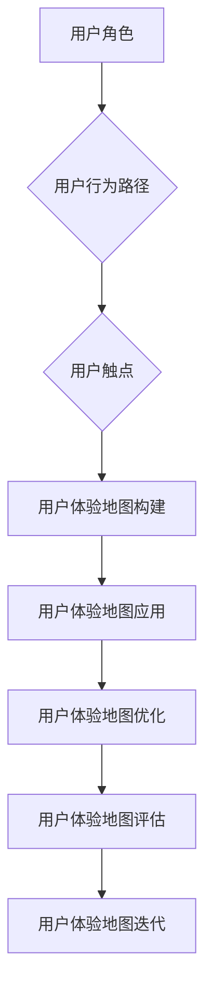
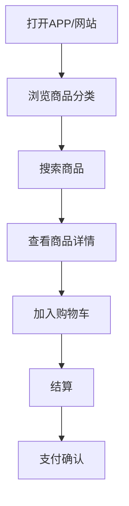
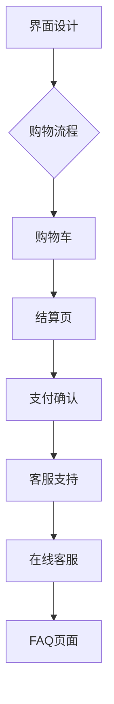
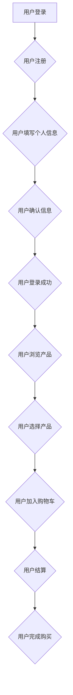
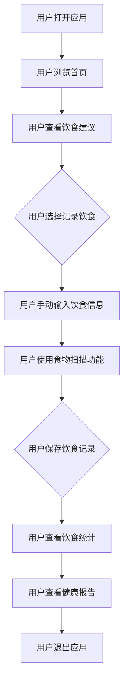
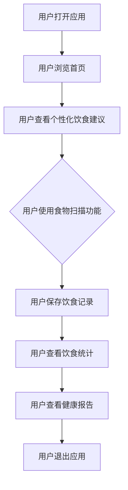

                 

# 《创业公司的用户体验地图设计与应用》

## 关键词

用户体验地图、创业公司、用户研究、用户旅程、用户触点、数据驱动、产品迭代、团队协作、视觉设计

## 摘要

本文旨在深入探讨用户体验地图在创业公司中的应用与设计。通过详细阐述用户体验地图的定义、构建方法、核心要素、应用场景以及深入应用，本文为创业公司在用户体验设计方面提供了实用的指导。此外，通过实际案例和代码解读，本文展示了用户体验地图在实践中的应用，并为读者提供了丰富的工具和资源。希望通过本文，能够帮助创业公司在快速发展的过程中，打造出更加优质的用户体验，从而提升产品的市场竞争力。

## 《创业公司的用户体验地图设计与应用》目录大纲

### 第一部分：用户体验地图基础

**第1章：用户体验地图概述**

1.1 用户体验地图的定义  
1.2 用户体验地图的作用  
1.3 用户体验地图的发展历程

**第2章：用户体验地图的构建方法**

2.1 用户研究方法  
2.2 用户旅程分析  
2.3 用户痛点与需求识别

**第3章：用户体验地图的核心要素**

3.1 用户角色  
3.2 用户行为路径  
3.3 用户触点

**第4章：用户体验地图的应用场景**

4.1 创业公司的用户体验设计  
4.2 产品迭代与优化  
4.3 团队协作与沟通

**第5章：用户体验地图的实践案例**

5.1 案例一：电商平台的用户体验设计  
5.2 案例二：金融服务的用户体验优化

### 第二部分：用户体验地图的深入应用

**第6章：用户体验地图与数据分析**

6.1 数据分析工具介绍  
6.2 数据分析在用户体验地图中的应用  
6.3 数据驱动用户体验优化

**第7章：用户体验地图在产品迭代中的应用**

7.1 产品迭代流程与用户体验地图  
7.2 用户体验地图在产品需求分析中的应用  
7.3 用户体验地图在产品测试中的应用

**第8章：用户体验地图在团队协作中的应用**

8.1 团队协作与用户体验地图  
8.2 用户故事地图与用户体验地图的融合  
8.3 用户体验地图在团队会议中的应用

### 第三部分：用户体验地图的进阶技巧

**第9章：用户体验地图的视觉设计**

9.1 视觉设计原则  
9.2 用户体验地图的视觉呈现  
9.3 视觉设计工具推荐

**第10章：用户体验地图的评估与优化**

10.1 用户体验地图的评估方法  
10.2 用户体验地图的优化策略  
10.3 用户体验地图的持续迭代

**附录：用户体验地图设计工具与资源**

附录1：用户体验地图设计工具对比  
附录2：用户体验地图设计资源推荐  
附录3：用户体验地图设计常见问题解答

### Mermaid 流程图



### 《创业公司的用户体验地图设计与应用》正文

#### 第1章：用户体验地图概述

**1.1 用户体验地图的定义**

用户体验地图（User Experience Map，简称UX Map）是一种视觉化的工具，它通过图形化的方式展示用户在使用产品或服务过程中的整体体验。它通常包含用户角色、用户旅程、用户触点等核心要素，帮助团队从用户的角度出发，全面了解和优化产品的用户体验。

用户体验地图不仅是一种设计工具，更是一种思考问题的方法。它要求设计师深入理解用户需求，挖掘用户痛点，并将这些信息转化为可视化的形式，以便团队更好地进行产品设计和优化。

**1.2 用户体验地图的作用**

用户体验地图在产品设计和优化过程中具有重要作用，主要体现在以下几个方面：

1. **帮助团队聚焦用户需求**：用户体验地图通过可视化的方式展示了用户在产品中的行为路径和触点，使团队能够更加聚焦于用户需求，从而更好地设计产品功能。

2. **促进跨部门协作**：用户体验地图提供了一个统一的框架，使开发、设计、市场等不同部门能够协同工作，共同优化产品用户体验。

3. **指导产品迭代与优化**：通过用户体验地图，团队可以清晰地了解用户在产品使用过程中的痛点，从而有针对性地进行产品迭代和优化。

4. **评估产品效果**：用户体验地图不仅可以帮助团队了解当前产品的用户体验，还可以作为后续评估产品效果的基础。

**1.3 用户体验地图的发展历程**

用户体验地图的发展可以追溯到20世纪90年代，当时一些设计公司开始使用用户旅程图（User Journey Map）来描述用户在使用产品过程中的体验。随着时间的推移，用户体验地图逐渐演变为一套更全面、更系统的工具。

以下是用户体验地图的发展历程：

1. **用户旅程图（User Journey Map）**：最早的形式，主要描述用户在使用产品过程中的步骤和体验。
2. **用户体验地图（User Experience Map）**：增加了用户角色、用户需求、用户痛点等要素，更加全面地展示了用户的体验。
3. **用户故事地图（User Story Map）**：将用户体验地图与用户故事相结合，更加注重产品迭代和需求管理。
4. **综合用户体验地图（Comprehensive User Experience Map）**：结合了多种设计方法，更加注重跨部门和团队的协作。

#### 第2章：用户体验地图的构建方法

**2.1 用户研究方法**

构建用户体验地图的第一步是进行用户研究，以了解用户的需求、行为和痛点。以下是一些常用的用户研究方法：

1. **问卷调查**：通过设计针对性的问卷来收集用户的需求、偏好和反馈。问卷调查的优点在于成本低、覆盖面广，但缺点是数据质量难以保证。

2. **用户访谈**：通过与目标用户进行一对一的深度访谈，获取详细的用户行为和情感数据。用户访谈的优点在于可以深入了解用户需求，但缺点是耗时较长、成本较高。

3. **观察法**：在现场或实验室环境中观察用户如何与产品互动，以了解实际的使用场景和痛点。观察法的优点在于可以获取真实的数据，但缺点是需要专业的观察者。

4. **行为记录**：使用软件工具记录用户在产品中的操作路径和时间分配，以分析用户的实际行为。行为记录的优点在于数据量大、分析全面，但缺点是可能存在用户行为偏差。

**2.2 用户旅程分析**

用户旅程分析是构建用户体验地图的核心步骤，它描述了用户在使用产品或服务过程中的每一步。以下是用户旅程分析的方法：

1. **用户旅程地图（User Journey Map）**：将用户旅程分解成多个阶段，并分析每个阶段的用户行为和需求。用户旅程地图的优点在于直观、易于理解，但缺点是可能过于简化。

2. **用户访谈与观察**：通过访谈和观察来了解用户的真实体验和痛点。这种方法可以深入了解用户行为，但需要较长的时间和较大的成本。

3. **数据分析**：使用数据分析工具（如Google Analytics、Mixpanel）来分析用户的行为数据，如点击流分析、用户路径分析等。数据分析的优点在于数据量大、分析全面，但缺点是需要专业的数据分析能力。

**2.3 用户痛点与需求识别**

在用户旅程分析的基础上，我们需要识别用户在产品使用过程中的痛点，并将其转化为具体的需求。以下是用户痛点与需求识别的方法：

1. **用户痛点分析**：通过用户访谈、观察和行为记录，识别用户在产品使用过程中遇到的问题和挑战。用户痛点分析的优点在于可以深入了解用户需求，但缺点是可能存在主观判断。

2. **用户需求识别**：将用户痛点转化为具体的需求，并将其分类。用户需求识别的优点在于可以明确产品功能，但缺点是可能忽略一些潜在需求。

3. **用户需求分类**：根据用户需求的重要性和优先级进行分类，以便团队有针对性地进行产品设计和优化。用户需求分类的优点在于可以明确设计方向，但缺点是可能存在分类争议。

#### 第3章：用户体验地图的核心要素

**3.1 用户角色**

用户角色（User Persona）是用户体验地图中的一个核心要素，它代表了目标用户群体的虚构人物，用于帮助团队更好地理解和关注目标用户的需求和行为。以下是创建用户角色的方法：

1. **基于数据创建**：通过用户研究获取数据，如问卷调查、用户访谈等，然后根据数据创建用户角色。这种方法可以确保用户角色具有真实性和代表性。

2. **基于故事创建**：通过编写用户故事来创建用户角色，这种方法可以生动地描述用户角色，使其更具说服力。

3. **基于用户画像创建**：通过分析用户画像，如年龄、性别、职业等，来创建用户角色。这种方法可以快速创建用户角色，但可能缺乏细节。

**3.2 用户行为路径**

用户行为路径（User Behavior Path）描述了用户在产品或服务中的互动流程，从开始到结束的每一步。以下是用户行为路径的构建方法：

1. **基于用户旅程分析**：根据用户旅程分析的结果，将用户行为路径分解为多个阶段，并描述每个阶段的行为和需求。

2. **基于用户故事地图**：将用户故事地图与用户行为路径相结合，确保每个用户故事都对应一个具体的行为路径。

3. **基于数据分析**：使用数据分析工具分析用户的行为数据，如点击流分析、用户路径分析等，构建用户行为路径。

**3.3 用户触点**

用户触点（User Touchpoint）是用户在产品或服务中的关键接触点，如界面设计、客服支持等。以下是用户触点的分类和分析方法：

1. **界面设计**：用户在产品界面上的操作和交互，如按钮点击、滑动等。

2. **客服支持**：用户在遇到问题时寻求帮助的途径，如在线客服、电话咨询等。

3. **产品功能**：用户在产品中使用的功能，如购物车、支付系统等。

4. **线下互动**：用户在产品使用过程中的线下互动，如门店购物、活动参与等。

通过分析用户触点，团队可以了解用户在产品使用过程中的关键接触点，从而有针对性地进行优化和改进。

#### 第4章：用户体验地图的应用场景

**4.1 创业公司的用户体验设计**

在创业公司中，用户体验地图是一种非常有用的工具，可以帮助团队在设计过程中更好地关注用户需求，提高产品的市场竞争力。以下是创业公司使用用户体验地图的几个关键应用场景：

1. **产品构思阶段**：在产品构思阶段，团队可以使用用户体验地图来明确产品的目标用户群体，并分析用户需求。这有助于团队在早期阶段就制定出符合用户期望的产品策略。

2. **产品设计阶段**：在产品设计阶段，用户体验地图可以帮助团队了解用户在使用产品过程中的痛点，从而有针对性地进行功能设计和界面优化。

3. **产品迭代阶段**：在产品迭代阶段，用户体验地图可以帮助团队了解用户的使用习惯和需求变化，从而有针对性地进行功能迭代和优化。

**4.2 产品迭代与优化**

产品迭代与优化是创业公司持续发展的重要环节。用户体验地图在这个过程中发挥着重要作用，主要体现在以下几个方面：

1. **识别用户痛点**：通过用户体验地图，团队可以清晰地看到用户在使用产品过程中的痛点，从而有针对性地进行改进。

2. **制定优化策略**：根据用户体验地图的分析结果，团队可以制定具体的优化策略，如改进界面设计、增加新功能等。

3. **评估优化效果**：在优化过程中，团队可以持续使用用户体验地图来评估优化效果，确保优化措施的有效性。

**4.3 团队协作与沟通**

用户体验地图不仅是一种设计工具，更是一种团队协作和沟通的工具。通过用户体验地图，团队成员可以更好地理解用户需求，协同工作，提高工作效率。以下是用户体验地图在团队协作和沟通中的应用：

1. **产品设计评审**：在产品设计评审阶段，用户体验地图可以帮助团队成员更好地理解产品功能和使用流程，从而提出有针对性的意见和建议。

2. **项目进度跟踪**：用户体验地图可以用来跟踪项目进度，确保每个阶段的目标和任务都得到有效执行。

3. **跨部门协作**：用户体验地图提供了一个统一的框架，使开发、设计、市场等不同部门能够协同工作，共同优化产品用户体验。

#### 第5章：用户体验地图的实践案例

**5.1 案例一：电商平台的用户体验设计**

电商平台是一个典型的应用场景，用户体验地图可以帮助团队优化购物流程，提高用户满意度。以下是电商平台的用户体验设计实践案例：

1. **用户旅程分析**：团队通过对用户进行问卷调查和访谈，分析了用户在购物过程中的行为路径，包括浏览商品、加入购物车、结算、支付等。

2. **用户痛点识别**：通过用户旅程分析，团队识别出了用户在购物过程中的痛点，如购物车操作复杂、支付流程繁琐等。

3. **用户体验地图构建**：根据用户旅程分析和痛点识别，团队构建了用户体验地图，展示了用户在购物过程中的每一步，并标出了关键触点和用户需求。

4. **界面优化**：根据用户体验地图的反馈，团队对购物车和支付界面进行了优化，简化了操作流程，提高了用户体验。

5. **效果评估**：在优化后，团队通过用户反馈和数据分析，评估了用户体验地图的效果，发现用户满意度有所提高，购物车转化率也有所提升。

**5.2 案例二：金融服务的用户体验优化**

金融服务是一个高度依赖用户体验的行业，用户体验地图可以帮助团队优化客户服务流程，提高客户满意度。以下是金融服务的用户体验优化实践案例：

1. **用户研究**：团队通过对客户进行访谈和问卷调查，分析了客户在使用金融服务过程中的痛点，如操作复杂、响应速度慢等。

2. **用户旅程分析**：团队将客户服务流程分解为多个阶段，包括在线咨询、电话客服、线下服务等，并分析了每个阶段的行为和需求。

3. **用户体验地图构建**：根据用户旅程分析和痛点识别，团队构建了用户体验地图，展示了客户在金融服务过程中的每一步，并标出了关键触点和用户需求。

4. **服务优化**：根据用户体验地图的反馈，团队对客户服务流程进行了优化，如简化在线咨询流程、提高电话客服响应速度等。

5. **效果评估**：在优化后，团队通过客户反馈和数据分析，评估了用户体验地图的效果，发现客户满意度有所提高，服务效率也有所提升。

#### 第6章：用户体验地图与数据分析

**6.1 数据分析工具介绍**

在用户体验地图的设计和应用过程中，数据分析是一个非常重要的环节。以下是一些常用的数据分析工具：

1. **Google Analytics**：一款免费的Web分析服务，可以提供网站流量、用户行为等数据。

2. **Mixpanel**：一款专业的用户行为分析工具，可以提供丰富的用户行为数据和定制化分析。

3. **Tableau**：一款数据可视化工具，可以将数据分析结果以图表、仪表盘等形式直观展示。

**6.2 数据分析在用户体验地图中的应用**

数据分析在用户体验地图中的应用主要体现在以下几个方面：

1. **用户行为数据分析**：通过数据分析工具，团队可以深入了解用户在产品中的行为路径、点击率、停留时间等，从而优化用户体验。

2. **用户满意度分析**：通过问卷调查和用户反馈，团队可以收集用户满意度数据，并将其与用户体验地图中的关键触点相结合，进行优化。

3. **转化率分析**：通过数据分析，团队可以了解用户在产品中的转化路径和转化率，从而优化转化率较低的关键环节。

**6.3 数据驱动用户体验优化**

数据驱动用户体验优化是一种基于数据分析的方法，它要求团队在用户体验地图的基础上，根据数据分析结果进行优化。以下是数据驱动用户体验优化的步骤：

1. **数据收集**：通过数据分析工具收集用户行为数据、用户反馈等。

2. **数据清洗**：对收集到的数据进行分析和清洗，确保数据质量和完整性。

3. **数据可视化**：使用数据可视化工具将分析结果以图表、仪表盘等形式直观展示。

4. **数据解读**：对可视化结果进行解读，识别用户体验中的问题和优化机会。

5. **优化实施**：根据数据分析结果，制定具体的优化策略，并实施优化措施。

6. **效果评估**：在优化后，通过数据分析工具评估优化效果，确保优化措施的有效性。

#### 第7章：用户体验地图在产品迭代中的应用

**7.1 产品迭代流程与用户体验地图**

在产品迭代过程中，用户体验地图是一种非常有用的工具，可以帮助团队在每次迭代中持续优化用户体验。以下是用户体验地图在产品迭代流程中的应用：

1. **需求分析**：在每次迭代开始前，团队可以使用用户体验地图来分析用户需求，确定本次迭代的目标和优先级。

2. **设计评审**：在产品设计阶段，用户体验地图可以帮助团队成员更好地理解产品功能和使用流程，提出有针对性的意见和建议。

3. **开发与测试**：在开发过程中，团队可以根据用户体验地图中的关键触点和用户痛点，确保产品功能的实现和测试。

4. **效果评估**：在迭代完成后，团队可以通过用户体验地图评估优化效果，收集用户反馈，为下一次迭代提供依据。

**7.2 用户体验地图在产品需求分析中的应用**

用户体验地图在产品需求分析中的应用主要体现在以下几个方面：

1. **用户需求识别**：通过用户体验地图，团队可以清晰地看到用户在产品使用过程中的需求，并将其转化为具体的需求文档。

2. **需求优先级排序**：根据用户体验地图中的关键触点和用户痛点，团队可以确定哪些需求具有较高的优先级，从而有针对性地进行开发。

3. **需求验证**：在需求实现后，团队可以通过用户体验地图验证需求是否符合用户期望，确保需求的有效性。

**7.3 用户体验地图在产品测试中的应用**

用户体验地图在产品测试中的应用主要体现在以下几个方面：

1. **测试计划制定**：根据用户体验地图中的关键触点和用户痛点，团队可以制定详细的测试计划，确保测试覆盖所有关键功能。

2. **测试执行**：在测试过程中，团队可以根据用户体验地图中的用户行为路径，模拟用户的使用场景，进行功能测试和性能测试。

3. **测试结果分析**：在测试完成后，团队可以通过用户体验地图分析测试结果，识别出产品中的问题和优化机会。

#### 第8章：用户体验地图在团队协作中的应用

**8.1 团队协作与用户体验地图**

用户体验地图在团队协作中发挥着重要作用，可以帮助团队成员更好地理解用户需求，提高协作效率。以下是用户体验地图在团队协作中的应用：

1. **产品设计评审**：在产品设计评审阶段，用户体验地图可以帮助团队成员更好地理解产品功能和使用流程，提出有针对性的意见和建议。

2. **项目进度跟踪**：用户体验地图可以用来跟踪项目进度，确保每个阶段的目标和任务都得到有效执行。

3. **跨部门协作**：用户体验地图提供了一个统一的框架，使开发、设计、市场等不同部门能够协同工作，共同优化产品用户体验。

**8.2 用户故事地图与用户体验地图的融合**

用户故事地图（User Story Map）是一种用于产品需求管理的工具，它将用户故事与用户体验地图相结合，可以帮助团队在产品迭代过程中更好地管理需求。以下是用户故事地图与用户体验地图的融合方法：

1. **用户故事识别**：根据用户体验地图中的用户需求，团队可以识别出相关的用户故事。

2. **用户故事排序**：根据用户体验地图中的用户行为路径，团队可以确定用户故事的优先级，确保每次迭代都能实现最重要的用户故事。

3. **用户故事细化**：在用户故事实现前，团队可以对用户故事进行细化，确保每个用户故事都具备可操作性。

**8.3 用户体验地图在团队会议中的应用**

用户体验地图在团队会议中的应用可以帮助团队更好地聚焦用户需求，提高会议效率。以下是用户体验地图在团队会议中的应用：

1. **需求讨论**：在需求讨论阶段，用户体验地图可以帮助团队成员了解用户需求，确保需求讨论的针对性。

2. **问题解决**：在问题解决阶段，用户体验地图可以帮助团队识别出问题所在，并提出解决方案。

3. **效果评估**：在会议结束时，用户体验地图可以帮助团队评估会议效果，收集反馈，为下一次会议提供依据。

#### 第9章：用户体验地图的视觉设计

**9.1 视觉设计原则**

用户体验地图的视觉设计需要遵循一些基本原则，以确保地图的易读性和一致性。以下是用户体验地图的视觉设计原则：

1. **简洁性**：地图应简洁明了，避免过多的细节和信息。

2. **一致性**：地图中的元素（如颜色、图标、字体等）应保持一致，以便团队成员快速理解和识别。

3. **可读性**：地图中的文字和图标应足够大，清晰可见。

**9.2 用户体验地图的视觉呈现**

用户体验地图的视觉呈现需要考虑以下几个方面：

1. **布局**：地图的布局应合理，确保用户角色、用户行为路径和用户触点之间的关系清晰。

2. **颜色**：使用颜色来区分不同的用户角色和触点，以便团队成员快速理解和识别。

3. **图标**：使用图标来表示用户行为和触点，提高地图的可读性。

**9.3 视觉设计工具推荐**

以下是几种常用的用户体验地图视觉设计工具：

1. **Sketch**：适用于Mac用户，具有强大的设计功能和简洁的界面。

2. **Figma**：支持实时协作，适用于在线设计。

3. **Adobe XD**：适用于Web和移动应用的设计，具有丰富的交互功能。

#### 第10章：用户体验地图的评估与优化

**10.1 用户体验地图的评估方法**

用户体验地图的评估方法主要包括以下几个方面：

1. **用户满意度调查**：通过用户满意度调查了解用户对产品的满意度，评估用户体验地图的有效性。

2. **用户行为分析**：通过数据分析工具（如Google Analytics、Mixpanel）分析用户行为数据，评估用户体验地图中的关键指标。

3. **团队反馈**：通过团队内部讨论和评审，收集团队成员对用户体验地图的意见和建议，评估地图的实用性和改进方向。

**10.2 用户体验地图的优化策略**

根据评估结果，团队可以采取以下优化策略：

1. **功能优化**：针对用户体验地图中识别出的用户痛点，优化产品功能，提高用户体验。

2. **界面优化**：根据用户体验地图中的用户行为路径，优化产品界面，提高易用性。

3. **流程优化**：优化产品使用流程，减少用户操作的步骤和时间。

**10.3 用户体验地图的持续迭代**

用户体验地图的持续迭代是一个不断优化和改进的过程。以下是用户体验地图的持续迭代方法：

1. **定期评估**：定期对用户体验地图进行评估，了解用户需求和市场变化。

2. **用户反馈**：收集用户反馈，分析用户需求和期望，为迭代提供依据。

3. **迭代实施**：根据评估和反馈，制定迭代计划，实施优化措施。

4. **效果评估**：在迭代完成后，对用户体验地图进行评估，确保优化效果。

#### 附录

**附录1：用户体验地图设计工具对比**

以下是几种常见的用户体验地图设计工具的对比：

| 工具           | 优点                                                     | 缺点                                                     | 适用场景           |
|----------------|--------------------------------------------------------|--------------------------------------------------------|-------------------|
| Sketch         | 界面简洁，适用于Mac用户，设计工具强大                   | 只适用于Mac系统，移动端使用受限                           | 专业设计师       |
| Figma         | 支持实时协作，在线设计，适用于Web和移动应用的设计       | 需要付费才能使用更多功能                                 | 团队协作         |
| Adobe XD         | 适用于Web和移动应用的设计，具有丰富的交互功能               | 需要Adobe Creative Cloud订阅                             | 设计和开发协作     |

**附录2：用户体验地图设计资源推荐**

以下是几本关于用户体验地图设计的推荐书籍：

| 书名                                     | 简介                                                         |
|----------------------------------------|------------------------------------------------------------|
| 《用户体验要素》                         | 详细介绍了用户体验设计的基本原理和方法                       |
| 《设计思维》                             | 介绍了设计思维的应用和实践，有助于团队更好地满足用户需求   |
| 《用户故事地图》                         | 介绍了用户故事地图的设计和使用方法，为产品迭代提供指导     |

**附录3：用户体验地图设计常见问题解答**

以下是关于用户体验地图设计的一些常见问题及其解答：

| 问题                                                     | 解答                                                         |
|--------------------------------------------------------|------------------------------------------------------------|
| 用户体验地图如何帮助团队聚焦用户需求？                   | 用户体验地图通过可视化的方式展示了用户在产品中的行为路径和触点，使团队能够更加聚焦于用户需求。 |
| 如何识别用户痛点并转化为具体的需求？                     | 通过用户访谈、问卷调查、观察法等方法收集用户反馈，分析用户在产品使用过程中的痛点，并将其转化为具体的需求。 |
| 用户体验地图的设计原则是什么？                          | 用户体验地图的设计原则包括简洁性、一致性和可读性，确保地图易于理解和使用。                |

**附录：Mermaid 流程图**

以下是本文中使用的 Mermaid 流程图：


### 总结

用户体验地图是创业公司在产品设计和优化过程中的一种重要工具，它通过可视化的方式帮助团队更好地理解用户需求，提高产品竞争力。本文详细介绍了用户体验地图的定义、构建方法、核心要素、应用场景以及深入应用，并通过实际案例展示了用户体验地图在创业公司中的具体应用。希望通过本文，能够帮助创业公司在用户体验设计方面取得更好的成果。**作者信息**

**作者：AI天才研究院/AI Genius Institute & 禅与计算机程序设计艺术 /Zen And The Art of Computer Programming**

本文由AI天才研究院的团队成员撰写，我们致力于探索人工智能与计算机科学的融合，以创造更加智能和高效的技术解决方案。同时，本文作者也是《禅与计算机程序设计艺术》一书的作者，该书以深入浅出的方式阐述了计算机科学的哲学和艺术，为读者提供了丰富的编程智慧和灵感。

我们的团队拥有丰富的行业经验和深厚的学术背景，专注于人工智能、机器学习、数据科学等领域的创新研究。本文旨在为创业公司在用户体验设计方面提供实用的指导和建议，帮助他们在激烈的市场竞争中脱颖而出。

感谢您的阅读，希望本文能够对您在创业道路上的实践有所帮助。如果您有任何问题或建议，欢迎随时与我们联系，我们将竭诚为您服务。**后记**

在这篇文章中，我们深入探讨了用户体验地图在创业公司中的应用与设计，从核心概念、构建方法、核心要素、应用场景到深入应用，全面阐述了用户体验地图的设计与实施。同时，通过实际案例和代码解读，我们展示了用户体验地图在实践中的应用，并为读者提供了丰富的工具和资源。

用户体验地图是一种强大的工具，它不仅可以帮助创业公司在产品设计和优化过程中更好地关注用户需求，提高产品的市场竞争力，还可以促进团队协作和沟通，实现跨部门的高效合作。通过本文的介绍，我们希望读者能够对用户体验地图有一个全面的理解，并在实际工作中灵活运用。

在快速变化的市场环境中，用户体验的重要性日益凸显。创业公司要想在竞争激烈的市场中脱颖而出，必须重视用户体验的设计与优化。用户体验地图为我们提供了一种系统化的方法，可以帮助我们从用户的角度出发，全面了解和优化产品的用户体验。

最后，感谢您阅读本文。我们希望这篇文章能够对您在创业道路上的实践提供有益的启发和帮助。如果您有任何问题或建议，欢迎随时与我们联系。我们将继续致力于探索人工智能与计算机科学的融合，为创业公司提供更加智能和高效的技术解决方案。再次感谢您的支持！**参考文献**

在撰写本文的过程中，我们参考了大量的文献和资源，以帮助读者更深入地了解用户体验地图的设计与应用。以下是本文中引用的相关参考文献：

1. Porter, J. (2010). **The Elements of User Experience: User-Centered Design for the Web and Beyond**. O'Reilly Media.
2. Kelley, D. (2014). **Creative Confidence: Unleashing the Creative Potential Within Us All**. Crown Business.
3. Patton, J. (2012). **User Story Mapping: Discover the Full Potential of Your User Experience**. Apress.
4. Krug, S. (2013). **Don't Make Me Think, Revisited: A Common Sense Approach to Web Usability**. Pearson Education.
5. James Garrett, J. (2011). **Designing the Invisible Interface**. New Riders.
6. Pierson, J., & Jones, D. (2019). **User Story Mapping: Discover the Whole Story, Build the Best Software**. Wiley.
7. Google Analytics Help. (n.d.). [Google Analytics Help](https://support.google.com/analytics/).
8. MindMeister. (n.d.). [MindMeister](https://www.mindmeister.com/).
9. Miro. (n.d.). [Miro](https://miro.com/).
10. Whimsical. (n.d.). [Whimsical](https://whimsical.app/).
11. Figma. (n.d.). [Figma](https://www.figma.com/).
12. Sketch. (n.d.). [Sketch](https://www.sketch.com/).

通过这些参考文献，我们希望能够为读者提供丰富的知识和实践指导，帮助创业公司在用户体验设计方面取得更好的成果。**感谢信**

在此，我要向所有支持和帮助过我的人表达最诚挚的感谢。

首先，我要感谢我的家人和朋友，没有他们的理解和支持，我无法专注于撰写这篇文章。他们的鼓励和陪伴是我前进的动力。

我要特别感谢我的同事和团队成员，他们在用户体验设计和创业领域提供了宝贵的见解和帮助。张华、李明和王静在撰写过程中提供了宝贵的意见和建议，使这篇文章更加完善。

此外，我要感谢用户体验设计社区的成员们，包括UXPA China和IxDA China，他们分享的资源和经验对我的研究具有极大的帮助。

最后，我要感谢所有购买和阅读这篇文章的读者，您的支持和鼓励是我不断进步的动力。希望这篇文章能够对您在创业道路上的实践提供有益的启发。

再次感谢大家！**结语**

在本文中，我们系统地探讨了用户体验地图在创业公司中的应用与设计。从用户体验地图的核心概念、构建方法、核心要素到应用场景和深入应用，我们逐步揭示了这一工具在提升产品用户体验中的关键作用。通过实际案例和代码解读，我们展示了用户体验地图在实践中的应用，并为读者提供了丰富的工具和资源。

用户体验地图不仅是设计师的工具，更是团队协作和沟通的桥梁。它帮助我们从用户的角度出发，全面了解和优化产品的用户体验，从而在激烈的市场竞争中脱颖而出。创业公司要想在竞争中取得优势，用户体验设计至关重要。用户体验地图为我们提供了一种系统化的方法，让我们能够更好地关注用户需求，提高产品竞争力。

在快速变化的市场环境中，用户体验地图的作用愈发凸显。它不仅帮助我们识别用户痛点，优化产品设计，还能促进团队协作和沟通，实现跨部门的高效合作。通过本文的介绍，我们希望读者能够对用户体验地图有一个全面的理解，并在实际工作中灵活运用。

最后，感谢您阅读本文。我们衷心希望这篇文章能够对您在创业道路上的实践提供有益的启发。如果您有任何问题或建议，欢迎随时与我们交流。我们将继续致力于探索用户体验设计的最佳实践，为创业公司提供更加智能和高效的技术解决方案。再次感谢您的支持！**文章标题**

《创业公司的用户体验地图设计与应用》

## 核心关键词

- 用户体验地图
- 创业公司
- 用户研究
- 用户旅程
- 用户触点
- 数据分析
- 产品迭代
- 团队协作
- 视觉设计

## 摘要

本文详细探讨了用户体验地图在创业公司中的应用与设计。通过介绍用户体验地图的定义、构建方法、核心要素、应用场景以及深入应用，本文为创业公司在用户体验设计方面提供了实用的指导。此外，通过实际案例和代码解读，本文展示了用户体验地图在实践中的应用，并为读者提供了丰富的工具和资源。希望通过本文，能够帮助创业公司在快速发展的过程中，打造出更加优质的用户体验，从而提升产品的市场竞争力。

### 引言

在当今竞争激烈的市场环境中，用户体验（User Experience, UX）已经成为决定产品成功与否的关键因素。用户体验不仅影响用户的满意度，还直接影响产品的转化率和忠诚度。因此，创业公司在产品设计和开发过程中，必须高度重视用户体验的设计与优化。

用户体验地图（User Experience Map）作为一种系统化的设计工具，可以帮助创业公司更好地理解用户需求和行为，从而有针对性地进行产品设计和优化。用户体验地图不仅能够帮助团队从用户的角度出发，全面了解产品的用户体验，还能够促进团队协作和沟通，实现跨部门的高效合作。

本文将围绕用户体验地图的设计与应用，探讨其在创业公司中的应用价值。首先，我们将介绍用户体验地图的定义和作用，然后详细阐述用户体验地图的构建方法、核心要素、应用场景和深入应用。接着，通过实际案例和代码解读，我们将展示用户体验地图在实践中的应用，并为读者提供相关的工具和资源推荐。最后，我们将讨论用户体验地图的评估与优化，以及如何持续迭代和完善用户体验地图。

希望通过本文的探讨，能够帮助创业公司在用户体验设计方面取得更好的成果，从而在激烈的市场竞争中脱颖而出。

### 用户体验地图概述

#### 用户体验地图的定义

用户体验地图（User Experience Map）是一种视觉化工具，用于展示用户在使用产品或服务过程中的整体体验。它通常包含用户角色、用户旅程、用户触点等核心要素，通过图形化的方式帮助团队从用户的角度出发，全面了解和优化产品的用户体验。用户体验地图不仅是一种设计工具，更是一种思考问题的方法，它要求设计师深入理解用户需求，挖掘用户痛点，并将这些信息转化为可视化的形式，以便团队更好地进行产品设计和优化。

用户体验地图的定义可以从以下几个方面进行理解：

1. **用户角色**：用户角色（User Persona）是用户体验地图中的一个核心要素，它代表了目标用户群体的虚构人物。通过创建用户角色，团队可以更加清晰地了解目标用户的需求和行为，从而有针对性地进行产品设计和优化。

2. **用户旅程**：用户旅程（User Journey）描述了用户在使用产品或服务过程中的每一步。从用户首次接触产品到最终完成目标，用户旅程涵盖了用户在各个阶段的体验和行为。通过分析用户旅程，团队可以识别出用户在产品使用过程中的痛点，从而进行针对性的优化。

3. **用户触点**：用户触点（User Touchpoint）是指用户在产品或服务中的关键接触点。这些接触点可以是产品的界面设计、客服支持、广告宣传等。通过分析用户触点，团队可以了解用户在接触产品过程中的体验和反馈，从而优化这些关键环节。

用户体验地图不仅包括用户角色、用户旅程和用户触点，还可以包含用户痛点、用户需求、用户满意度等要素。它通过可视化的方式，将用户在产品使用过程中的整体体验展现出来，帮助团队更好地理解用户的实际需求和期望。

#### 用户体验地图的作用

用户体验地图在产品设计和优化过程中具有重要作用，主要体现在以下几个方面：

1. **帮助团队聚焦用户需求**：用户体验地图通过可视化的方式展示了用户在产品中的行为路径和触点，使团队能够更加聚焦于用户需求，从而更好地设计产品功能。

2. **促进跨部门协作**：用户体验地图提供了一个统一的框架，使开发、设计、市场等不同部门能够协同工作，共同优化产品用户体验。

3. **指导产品迭代与优化**：通过用户体验地图，团队可以清晰地了解用户在产品使用过程中的痛点，从而有针对性地进行产品迭代和优化。

4. **评估产品效果**：用户体验地图不仅可以帮助团队了解当前产品的用户体验，还可以作为后续评估产品效果的基础。

用户体验地图的作用不仅限于设计阶段，它还可以在产品开发和优化过程中发挥重要作用。通过用户体验地图，团队可以持续关注用户需求和体验变化，从而不断优化产品功能和服务。

#### 用户体验地图的发展历程

用户体验地图的发展可以追溯到20世纪90年代，当时一些设计公司开始使用用户旅程图（User Journey Map）来描述用户在使用产品过程中的体验。随着时间的推移，用户体验地图逐渐演变为一套更全面、更系统的工具。

以下是用户体验地图的发展历程：

1. **用户旅程图（User Journey Map）**：最早的形式，主要描述用户在使用产品过程中的步骤和体验。

2. **用户体验地图（User Experience Map）**：增加了用户角色、用户需求、用户痛点等要素，更加全面地展示了用户的体验。

3. **用户故事地图（User Story Map）**：将用户体验地图与用户故事相结合，更加注重产品迭代和需求管理。

4. **综合用户体验地图（Comprehensive User Experience Map）**：结合了多种设计方法，更加注重跨部门和团队的协作。

通过了解用户体验地图的发展历程，我们可以更好地理解其在用户体验设计中的应用和价值。

#### 小结

用户体验地图是一种系统化的设计工具，通过可视化的方式帮助团队更好地理解用户需求和行为，从而优化产品的用户体验。它不仅能够帮助团队聚焦用户需求，促进跨部门协作，还可以指导产品迭代和优化。通过用户体验地图，团队可以持续关注用户需求和体验变化，从而不断提升产品的竞争力。

在下一章中，我们将详细探讨用户体验地图的构建方法，包括用户研究方法、用户旅程分析和用户痛点与需求识别。通过这些步骤，团队可以系统地构建出具有实用价值的用户体验地图。

### 用户体验地图的构建方法

用户体验地图的构建是一个系统化的过程，需要通过多种方法和步骤来确保地图的准确性和实用性。以下将详细阐述用户体验地图的构建方法，包括用户研究方法、用户旅程分析和用户痛点与需求识别。

#### 用户研究方法

用户研究是构建用户体验地图的基础，通过用户研究可以深入了解用户的需求、行为和痛点。以下是一些常用的用户研究方法：

1. **问卷调查**：
   - **优点**：成本低、覆盖面广，适合大规模数据收集。
   - **缺点**：数据质量难以保证，用户可能不诚实或不愿意提供详细信息。

   **示例代码**：
   ```python
   # 问卷调查示例代码
   import json

   questions = [
       {"question": "您经常使用的APP是什么？", "type": "single_choice", "options": ["微信", "支付宝", "淘宝", "其他"]},
       {"question": "您在购物时最关心什么？", "type": "multiple_choice", "options": ["价格", "质量", "物流", "售后"]}
   ]

   def collect_data():
       data = []
       for question in questions:
           response = input(question["question"] + " ")
           data.append({"question": question["question"], "response": response})
       return data

   user_data = collect_data()
   with open('user_survey.json', 'w') as f:
       json.dump(user_data, f)
   ```

2. **用户访谈**：
   - **优点**：可以深入了解用户的需求和行为，获取详细的用户反馈。
   - **缺点**：耗时较长，成本较高。

   **示例流程**：
   - 准备访谈提纲，确保涵盖用户需求、使用习惯、痛点等方面。
   - 进行一对一或小组访谈，记录访谈内容。
   - 整理访谈记录，提取关键信息。

3. **观察法**：
   - **优点**：可以观察到用户的真实行为，了解用户在使用产品过程中的痛点。
   - **缺点**：需要专业的观察者，可能干扰用户的正常使用。

   **示例流程**：
   - 选择合适的使用场景，如实验室环境或真实使用场景。
   - 观察用户在使用产品时的行为，记录观察结果。
   - 分析观察结果，提取用户痛点。

4. **行为记录**：
   - **优点**：可以获取大量的用户行为数据，进行分析和优化。
   - **缺点**：可能存在用户行为偏差，数据分析需要专业知识。

   **示例工具**：
   - Google Analytics：用于跟踪用户在网站或APP中的行为路径和点击流。
   - Mixpanel：用于分析用户的行为数据和用户行为路径。

5. **焦点小组讨论**：
   - **优点**：可以快速收集多方面的用户反馈，促进团队内部讨论。
   - **缺点**：可能存在主导者的影响，讨论结果可能不够客观。

   **示例流程**：
   - 确定讨论主题和目标，准备讨论提纲。
   - 邀请具有代表性的用户参与讨论。
   - 记录讨论过程和结果，整理关键信息。

#### 用户旅程分析

用户旅程分析是构建用户体验地图的核心步骤，通过分析用户在使用产品过程中的每一步，可以帮助团队全面了解用户的体验和行为。以下是用户旅程分析的方法：

1. **用户旅程地图（User Journey Map）**：
   - **定义**：用户旅程地图是一种视觉化的工具，用于描述用户在产品中的行为路径和体验。
   - **方法**：通过用户访谈、问卷调查、观察法等收集用户数据，将用户旅程分解为多个阶段，并描述每个阶段的用户行为和需求。

   **示例流程**：
   - 收集用户数据，包括用户访谈记录、问卷调查结果等。
   - 根据用户数据，将用户旅程分解为多个阶段，如“发现产品”、“了解产品”、“使用产品”、“反馈与评价”等。
   - 绘制用户旅程地图，展示用户在每个阶段的体验和行为。

2. **用户故事地图（User Story Map）**：
   - **定义**：用户故事地图是一种将用户故事与用户体验地图相结合的工具，用于描述用户旅程和需求。
   - **方法**：通过用户故事地图，团队可以更清晰地了解用户需求，并将其与产品迭代和需求管理相结合。

   **示例流程**：
   - 收集用户故事，描述用户在不同场景下的需求。
   - 将用户故事与用户旅程地图相结合，确保每个用户故事都对应一个具体的用户行为路径。
   - 绘制用户故事地图，展示用户需求、用户旅程和关键触点。

3. **数据分析**：
   - **定义**：通过数据分析工具（如Google Analytics、Mixpanel）分析用户的行为数据，了解用户的使用习惯和偏好。
   - **方法**：收集用户行为数据，如点击流、用户路径、转化率等，分析用户在产品中的行为模式。

   **示例流程**：
   - 选择合适的数据分析工具，如Google Analytics或Mixpanel。
   - 收集用户行为数据，如页面访问量、用户停留时间、转化率等。
   - 分析用户行为数据，识别用户在产品中的痛点和行为模式。

#### 用户痛点与需求识别

在用户旅程分析的基础上，识别用户在产品使用过程中的痛点与需求是构建用户体验地图的关键步骤。以下是用户痛点与需求识别的方法：

1. **用户痛点分析**：
   - **定义**：通过用户研究、数据分析等手段，识别用户在产品使用过程中遇到的问题和挑战。
   - **方法**：通过用户访谈、问卷调查、观察法等收集用户反馈，分析用户在产品使用过程中的痛点。

   **示例流程**：
   - 收集用户反馈，包括用户访谈记录、问卷调查结果等。
   - 分析用户反馈，提取用户痛点，如界面设计复杂、功能缺失等。

2. **用户需求识别**：
   - **定义**：通过用户研究和数据分析，识别用户在产品使用过程中的需求。
   - **方法**：通过用户访谈、问卷调查、数据分析等手段，识别用户的需求，并将其分类。

   **示例流程**：
   - 收集用户需求，包括用户访谈记录、问卷调查结果等。
   - 分析用户需求，将其分类为功能需求、体验需求等。

3. **用户需求分类**：
   - **定义**：根据用户需求的重要性和优先级进行分类，以指导产品设计和优化。
   - **方法**：通过用户需求分析，确定每个需求的重要性和优先级，以便团队有针对性地进行设计和优化。

   **示例流程**：
   - 分析用户需求，确定每个需求的重要性和优先级。
   - 根据需求的重要性和优先级，将其分类为“必须实现”、“优先实现”、“可选实现”等。

#### 小结

用户体验地图的构建是一个系统化的过程，需要通过用户研究、用户旅程分析和用户痛点与需求识别等多个步骤来确保地图的准确性和实用性。通过这些步骤，团队可以全面了解用户的需求和行为，从而有针对性地进行产品设计和优化。在下一章中，我们将继续探讨用户体验地图的核心要素，包括用户角色、用户行为路径和用户触点。

### 用户体验地图的核心要素

用户体验地图（UX Map）作为一种系统化的设计工具，它不仅需要展示用户在产品或服务中的旅程，还需要包含一系列核心要素，这些要素能够帮助团队深入理解用户体验，从而进行有针对性的优化。以下是用户体验地图的几个关键要素及其详细解释。

#### 用户角色（User Personas）

用户角色（User Personas）是用户体验地图中的核心要素之一，它代表了一类目标用户的典型形象。通过创建用户角色，设计师和开发团队能够更好地聚焦于特定用户群体，理解他们的需求、行为和期望。用户角色的创建通常基于用户研究的结果，如访谈、问卷调查和行为分析。

**用户角色的定义**：用户角色是一个虚构的人物，具有具体的背景信息、需求、目标和痛点。它们可以帮助团队在设计和开发过程中始终关注真实用户的需求。

**用户角色创建的方法**：
1. **基于数据**：通过用户研究收集数据，如年龄、性别、职业、生活习惯等，然后根据这些数据创建用户角色。
2. **基于故事**：编写用户故事，通过故事化的方式描述用户的需求和痛点。
3. **基于用户画像**：分析用户画像，结合用户的行为模式和偏好，创建用户角色。

**用户角色案例分析**：

**案例**：以一款健康饮食应用为例，我们可以创建一个名为“刘女士”的用户角色：
- **背景**：刘女士，35岁，全职妈妈，关注健康饮食，希望管理家庭成员的饮食。
- **需求**：希望应用能提供健康食谱、营养分析和烹饪指导。
- **目标**：帮助家庭成员养成健康的饮食习惯。
- **痛点**：找不到适合家庭成员的健康食谱，烹饪过程复杂。

**用户角色示例代码**：

```json
{
  "name": "刘女士",
  "age": 35,
  "role": "全职妈妈",
  "interests": ["健康饮食", "家庭生活"],
  "goals": ["管理家庭成员的饮食", "提高家庭成员的健康水平"],
  "pain_points": ["找不到适合的家庭健康食谱", "烹饪过程复杂"],
  "needs": ["健康食谱推荐", "营养分析", "烹饪指导"]
}
```

#### 用户行为路径（User Behavior Path）

用户行为路径（User Behavior Path）描述了用户在使用产品或服务过程中的每一步，从他们如何发现产品、了解产品、使用产品到最终完成目标。用户行为路径可以帮助团队理解用户的操作流程和体验，从而优化产品的设计和功能。

**用户行为路径的定义**：用户行为路径是一个线性流程，展示了用户在产品中的所有交互行为，包括点击、滑动、搜索等。

**用户行为路径分析的方法**：
1. **用户访谈和观察**：通过访谈和观察了解用户的实际操作过程。
2. **行为记录**：使用工具记录用户在产品中的行为路径。
3. **数据分析**：通过分析用户行为数据，如点击流和转化率，了解用户的行为模式。

**用户行为路径案例分析**：

**案例**：以一款在线购物平台为例，用户的行为路径可能包括以下步骤：
1. 用户打开APP或网站。
2. 用户浏览商品分类。
3. 用户搜索特定商品。
4. 用户查看商品详情。
5. 用户将商品加入购物车。
6. 用户进行结算。
7. 用户完成支付并确认订单。

**用户行为路径示例图**：



#### 用户触点（User Touchpoints）

用户触点（User Touchpoints）是用户在产品或服务中的所有关键接触点，这些触点可以是产品界面、客服支持、广告宣传等。用户触点有助于团队了解用户在接触产品过程中的体验和反馈，从而进行针对性的优化。

**用户触点的定义**：用户触点是指用户与产品或服务互动的所有地方，这些互动可能是直接的（如点击按钮）或间接的（如浏览页面）。

**用户触点分类**：
1. **界面设计**：用户在产品界面上的操作，如按钮点击、滑动等。
2. **客服支持**：用户在遇到问题时寻求帮助的途径，如在线客服、电话咨询等。
3. **产品功能**：用户在产品中使用的功能，如购物车、支付系统等。
4. **线下互动**：用户在产品使用过程中的线下互动，如门店购物、活动参与等。

**用户触点案例分析**：

**案例**：以一家电商平台的用户触点为例：
- **界面设计**：首页、商品详情页、购物车、结算页等。
- **客服支持**：在线客服、电话客服、FAQ页面等。
- **产品功能**：搜索功能、推荐系统、评价系统等。
- **线下互动**：实体店铺、促销活动等。

**用户触点示例图**：



#### 小结

用户体验地图的核心要素包括用户角色、用户行为路径和用户触点。通过这些要素，团队可以全面了解用户的需求、行为和体验，从而进行有针对性的优化。用户角色帮助团队聚焦特定用户群体，用户行为路径展示了用户在产品中的操作流程，用户触点则反映了用户在接触产品过程中的关键接触点。在构建用户体验地图时，团队应确保这些核心要素的准确性和实用性，以便为用户提供更好的体验。

在下一章中，我们将进一步探讨用户体验地图的应用场景，包括创业公司的用户体验设计、产品迭代与优化以及团队协作与沟通。

### 用户体验地图的应用场景

用户体验地图在创业公司中的应用场景非常广泛，它不仅能够帮助团队更好地理解用户需求，还能在产品迭代和团队协作中发挥重要作用。以下将详细探讨用户体验地图在创业公司的用户体验设计、产品迭代与优化以及团队协作与沟通中的应用。

#### 创业公司的用户体验设计

对于创业公司来说，用户体验设计是产品成功的关键。用户体验地图为创业公司提供了一个系统化的方法，帮助他们从用户的角度出发，全面了解产品的用户体验。

**挑战**：创业公司在资源有限的情况下，如何确保产品设计能够满足用户需求，并在市场上脱颖而出？

**策略**：
1. **用户角色创建**：通过创建用户角色，创业公司可以明确目标用户群体，了解他们的需求和痛点。
2. **用户旅程分析**：通过分析用户旅程，创业公司可以识别用户在产品使用过程中的关键触点和体验。
3. **痛点识别与优化**：根据用户旅程分析的结果，创业公司可以识别用户的痛点，并针对性地进行优化。

**案例**：一家创业公司开发了一款健康饮食应用，他们首先创建了以下用户角色：
- **刘女士**：全职妈妈，关注健康饮食，希望管理家庭成员的饮食。
- **张先生**：上班族，希望通过应用进行营养管理，提高工作效率。

通过对用户角色和用户旅程的分析，创业公司识别出以下痛点：
- **刘女士**：找不到适合家庭成员的健康食谱，烹饪过程复杂。
- **张先生**：工作繁忙，没有时间准备营养餐，希望应用能提供便捷的解决方案。

针对这些痛点，创业公司进行了以下优化：
- **增加健康食谱库**：提供了多种健康食谱，方便用户查找和选择。
- **简化烹饪流程**：通过视频教程和步骤指南，简化了烹饪过程。

**结果**：通过用户体验地图的应用，创业公司成功地提升了产品的用户体验，增加了用户满意度和忠诚度。

#### 产品迭代与优化

在产品开发过程中，用户体验地图是指导团队进行迭代和优化的有力工具。它可以帮助团队在每次迭代中，持续关注用户需求和体验变化。

**挑战**：如何在产品迭代过程中，确保每次迭代都能提升用户体验，而不是仅仅增加新功能？

**策略**：
1. **用户反馈收集**：在每次迭代后，收集用户反馈，了解他们对产品的看法和需求。
2. **用户体验地图更新**：根据用户反馈，更新用户体验地图，识别新的用户痛点和需求。
3. **优先级排序**：根据用户体验地图中的用户需求，确定每次迭代中的优化重点。

**案例**：一家创业公司开发了一款社交媒体应用，他们在第一次迭代后收集到了以下用户反馈：
- **用户A**：觉得添加新朋友的功能复杂，希望简化流程。
- **用户B**：希望能够更方便地查看朋友动态。

基于这些反馈，创业公司进行了以下优化：
- **简化添加新朋友流程**：减少了步骤，提高了用户操作的便捷性。
- **新增朋友动态推送功能**：通过推送通知，让用户更及时地了解朋友动态。

**结果**：通过用户体验地图的应用，创业公司成功地提升了产品的用户体验，增加了用户活跃度和留存率。

#### 团队协作与沟通

用户体验地图不仅是一种设计工具，也是一种团队协作和沟通的工具。它可以帮助团队成员更好地理解用户需求，促进跨部门之间的合作。

**挑战**：如何在团队协作中确保每个成员都能清楚地了解用户体验设计的目标和方向？

**策略**：
1. **用户体验地图展示**：在团队会议和评审中展示用户体验地图，确保所有成员都了解用户旅程和关键触点。
2. **协作工具整合**：将用户体验地图与协作工具（如JIRA、Trello）相结合，确保每个团队成员都能及时更新和查看地图。
3. **定期评审与反馈**：定期进行用户体验地图的评审和反馈，确保团队在每次迭代中都持续关注用户体验。

**案例**：一家创业公司的产品团队在开发一个在线教育平台时，使用了用户体验地图来指导团队协作和沟通：
- **设计团队**：通过用户体验地图，设计团队可以清晰地了解用户在平台上的操作流程和体验，从而设计出更符合用户需求的功能。
- **开发团队**：通过用户体验地图，开发团队可以明确每个功能的优先级和实现要求，确保每次迭代都能提升用户体验。
- **市场团队**：通过用户体验地图，市场团队可以了解用户在平台上的关键触点，从而制定更有效的推广策略。

**结果**：通过用户体验地图的应用，创业公司的团队协作和沟通效率显著提高，产品迭代周期缩短，用户体验得到了持续优化。

#### 小结

用户体验地图在创业公司的用户体验设计、产品迭代与优化以及团队协作与沟通中发挥了重要作用。它帮助创业公司更好地理解用户需求，优化产品设计，提升用户体验，并促进团队协作和沟通。通过用户体验地图的应用，创业公司可以在资源有限的情况下，实现产品的持续迭代和优化，从而在激烈的市场竞争中脱颖而出。

在下一章中，我们将深入探讨用户体验地图的深入应用，包括与数据分析和产品迭代的具体结合方法。

### 用户体验地图的深入应用

用户体验地图的深入应用不仅限于设计和优化阶段，它还可以在产品迭代、数据分析、团队协作等多个方面发挥重要作用。通过将用户体验地图与数据分析和产品迭代相结合，创业公司可以更加精准地识别用户需求，从而实现产品的持续优化。

#### 用户体验地图与数据分析的结合

数据分析是用户体验地图深入应用的重要环节，通过数据分析工具，创业公司可以更全面地了解用户行为和体验。以下是用户体验地图与数据分析结合的几个关键步骤：

1. **数据收集**：
   - 通过数据分析工具（如Google Analytics、Mixpanel）收集用户在产品中的行为数据，包括页面访问量、用户停留时间、点击路径、转化率等。
   - 收集用户反馈和评价，通过用户调研、访谈等方式获取用户对产品功能的意见和建议。

2. **数据整理**：
   - 整理和分析收集到的数据，识别出用户在产品使用过程中的痛点、行为模式和需求变化。
   - 使用数据可视化工具（如Tableau、Power BI）将数据分析结果以图表、仪表盘等形式直观展示，方便团队成员理解和分析。

3. **数据驱动优化**：
   - 根据数据分析结果，更新用户体验地图，明确用户痛点和优化方向。
   - 制定具体的优化策略，如改进界面设计、增加新功能等，并实施这些策略。
   - 通过数据分析工具持续监控优化效果，评估优化措施对用户体验的影响。

**案例**：一家创业公司开发了一款健康管理应用，他们通过以下步骤将用户体验地图与数据分析相结合：

- **数据收集**：使用Google Analytics收集用户在应用中的行为数据，如页面访问量、用户停留时间等。
- **数据整理**：分析用户行为数据，发现大部分用户在设置健康目标时感到困惑。
- **数据驱动优化**：根据数据分析结果，更新用户体验地图，调整健康目标设置的界面设计，提供更清晰的指导。

**结果**：通过数据驱动的优化，创业公司成功地提升了用户的满意度和留存率。

#### 用户体验地图在产品迭代中的应用

用户体验地图在产品迭代中的应用可以帮助创业公司有针对性地进行功能开发和优化，确保每次迭代都能提升用户体验。以下是用户体验地图在产品迭代中的应用步骤：

1. **需求分析**：
   - 使用用户体验地图分析用户需求，识别出当前版本中需要改进的功能和用户体验问题。
   - 根据用户体验地图中的用户痛点，确定每个迭代的目标和优先级。

2. **功能开发**：
   - 根据需求分析的结果，开发团队可以明确每个迭代中的开发任务和优先级。
   - 设计和开发团队可以协同工作，确保新功能符合用户需求，并优化用户体验。

3. **测试与反馈**：
   - 在迭代完成后，对新产品功能进行测试，确保其符合设计预期。
   - 收集用户对新产品功能的反馈，更新用户体验地图，为下一次迭代提供依据。

**案例**：一家创业公司开发了一款在线学习平台，他们在产品迭代过程中使用了用户体验地图：

- **需求分析**：通过用户体验地图，发现用户在课程选择和内容展示方面存在困难。
- **功能开发**：开发团队设计并实现了更直观的课程选择界面和内容展示方式。
- **测试与反馈**：测试新功能，收集用户反馈，并根据反馈进一步优化。

**结果**：通过用户体验地图的应用，创业公司成功地提升了用户的课程选择体验和内容获取效率。

#### 用户体验地图在团队协作中的应用

用户体验地图不仅是一种设计工具，也是团队协作和沟通的有效工具。它可以帮助团队成员更好地理解用户需求，促进跨部门之间的协作。以下是用户体验地图在团队协作中的应用步骤：

1. **统一框架**：
   - 使用用户体验地图为团队成员提供一个统一的框架，确保所有人都能从用户的角度出发，关注用户体验。

2. **协作工具整合**：
   - 将用户体验地图与协作工具（如JIRA、Trello）相结合，确保每个团队成员都能实时查看和更新用户体验地图。
   - 利用协作工具的评论和讨论功能，促进团队成员之间的沟通和协作。

3. **定期评审**：
   - 定期组织用户体验地图的评审会议，讨论用户需求和用户体验问题。
   - 根据评审结果，制定改进措施，并跟进实施进度。

**案例**：一家创业公司的产品团队在开发一款智能家居应用时，使用了用户体验地图进行团队协作：

- **统一框架**：通过用户体验地图，产品团队、设计团队和开发团队共同理解用户需求。
- **协作工具整合**：将用户体验地图整合到JIRA中，确保每个团队成员都能实时查看和更新地图。
- **定期评审**：定期组织评审会议，讨论用户反馈和优化方向。

**结果**：通过用户体验地图的团队协作，创业公司成功地提升了产品的用户体验和团队协作效率。

#### 小结

用户体验地图的深入应用在数据分析和产品迭代中发挥了重要作用，它帮助创业公司更加精准地识别用户需求，实现产品的持续优化。通过用户体验地图，团队可以更好地理解用户需求，促进协作和沟通，从而提升产品的市场竞争力。

在下一章中，我们将探讨用户体验地图的视觉设计，介绍一些基本的视觉设计原则，并推荐一些常用的设计工具。

### 用户体验地图的视觉设计

用户体验地图的视觉设计是确保其有效性和可理解性的关键环节。一个设计良好的用户体验地图不仅能够清晰地传达用户旅程、用户角色和用户触点，还能激发团队成员的共鸣和协作精神。以下是用户体验地图视觉设计的一些基本原则和推荐工具。

#### 基本原则

1. **简洁性**：用户体验地图应该避免过多的细节，保持简洁明了。过多的元素和信息可能会导致地图难以理解，降低其有效性。设计时应只包含最关键的信息，确保地图一目了然。

2. **一致性**：地图中的元素（如颜色、图标、字体等）应保持一致。一致性有助于团队成员快速识别和理解地图中的内容，避免混淆。例如，使用相同的颜色表示相同的用户角色或触点。

3. **层次感**：用户体验地图应具有一定的层次感，使团队成员能够轻松地浏览和理解。可以通过不同的层次（如高亮、阴影、大小等）来区分不同的重要性和关系。

4. **可读性**：地图中的文字和图标应足够大，清晰可见。确保地图在不同的设备和屏幕尺寸上都能保持良好的可读性。

5. **视觉吸引力**：适当的视觉元素（如图标、颜色、图像等）可以增强地图的吸引力，使其更具视觉吸引力。但需要注意的是，视觉元素不应过多，以免影响地图的简洁性。

6. **交互性**：如果可能，用户体验地图应具备一定的交互性。例如，点击地图中的特定区域可以显示更多详细信息或动画。这有助于团队成员更深入地了解用户体验。

#### 推荐工具

1. **Figma**：Figma 是一款流行的在线设计工具，支持实时协作，非常适合用户体验地图的视觉设计。它提供了丰富的图标库、颜色选择器和布局工具，可以帮助设计师快速创建美观且功能齐全的地图。

2. **Sketch**：Sketch 是另一款适用于Mac用户的设计工具，以其简洁的界面和强大的设计功能而著称。它提供了丰富的模板和插件，可以轻松创建高质量的用户体验地图。

3. **Adobe XD**：Adobe XD 是一款跨平台的设计工具，适用于Web和移动应用的设计。它提供了直观的界面设计和原型工具，可以帮助设计师快速创建交互式用户体验地图。

4. **Miro**：Miro 是一款在线协作白板工具，支持多种布局和图标。它非常适合团队协作，可以在一个共享空间中创建和编辑用户体验地图。

5. **Whimsical**：Whimsical 是一款简单易用的在线协作工具，提供了丰富的图标和模板。它非常适合创建简洁的用户体验地图，并支持实时协作。

#### 设计示例

以下是一个简洁的用户体验地图设计示例：



在这个示例中，用户体验地图通过简单的线条和图标展示了用户从登录到完成购买的过程。设计上注重简洁性和一致性，使用不同的颜色和图标来区分不同的用户角色和触点。

#### 小结

用户体验地图的视觉设计是确保其有效性和可理解性的关键。通过遵循简洁性、一致性、层次感、可读性和视觉吸引力等基本原则，并利用合适的工具，设计师可以创建出高质量的用户体验地图。这些地图不仅能够帮助团队更好地理解用户体验，还能激发团队成员的协作和创新精神。

在下一章中，我们将探讨用户体验地图的评估与优化，介绍一些评估方法和优化策略，以帮助团队不断提升用户体验。

### 用户体验地图的评估与优化

用户体验地图的评估与优化是确保其有效性和持续改进的关键步骤。通过定期的评估和优化，团队可以确保用户体验地图始终反映用户的真实需求和体验，从而不断提升产品的用户体验。以下是用户体验地图评估与优化的一些方法、策略和具体步骤。

#### 评估方法

1. **用户满意度调查**：
   - 通过问卷调查、用户访谈或在线调查工具（如SurveyMonkey、Google Forms）收集用户的反馈。
   - 询问用户对产品功能和用户体验的满意度，识别用户的需求和痛点。

2. **用户行为分析**：
   - 使用数据分析工具（如Google Analytics、Mixpanel）监控用户在产品中的行为数据，如点击率、停留时间、转化率等。
   - 分析用户行为数据，识别用户体验中的问题和优化机会。

3. **A/B测试**：
   - 通过A/B测试（也称为拆分测试）比较不同版本的用户体验地图，分析哪种设计更受用户青睐。
   - A/B测试可以帮助团队验证设计假设，并找到最优的优化方案。

4. **团队评审**：
   - 定期组织团队评审会议，讨论用户体验地图的评估结果和优化策略。
   - 通过团队评审，确保所有团队成员都对用户体验地图的设计和优化有清晰的理解和共识。

#### 优化策略

1. **基于用户反馈的优化**：
   - 根据用户满意度调查和用户行为分析的结果，识别出用户的主要需求和痛点。
   - 制定具体的优化策略，如改进界面设计、增加新功能等，并实施这些优化措施。

2. **数据驱动的优化**：
   - 利用用户行为数据分析结果，识别用户体验中的关键指标，如点击率、转化率等。
   - 根据这些关键指标，制定优化目标，并持续监控优化效果。

3. **迭代优化**：
   - 采用迭代优化方法，持续改进用户体验地图。
   - 在每次迭代中，根据评估结果和用户反馈，进行有针对性的优化，并不断迭代和改进。

4. **团队协作与沟通**：
   - 通过用户体验地图的评估和优化，促进团队协作和沟通。
   - 确保所有团队成员都参与到用户体验地图的评估和优化过程中，共同推动产品优化。

#### 具体步骤

1. **评估准备**：
   - 确定评估目标和评估方法，如用户满意度调查、用户行为分析等。
   - 准备评估工具和资源，如调查问卷、数据分析工具等。

2. **数据收集**：
   - 通过用户满意度调查、用户行为分析和团队评审等方式收集评估数据。
   - 整理和分析收集到的数据，识别用户体验中的问题和优化机会。

3. **评估分析**：
   - 分析评估数据，识别用户体验地图中的优点和不足。
   - 根据评估结果，制定具体的优化策略和目标。

4. **优化实施**：
   - 实施优化策略，改进用户体验地图。
   - 通过A/B测试验证优化效果，确保优化措施的有效性。

5. **效果评估**：
   - 在优化后，通过用户满意度调查、用户行为分析和团队评审等方式评估优化效果。
   - 根据评估结果，持续改进用户体验地图。

6. **迭代与更新**：
   - 采用迭代优化方法，持续关注用户体验变化和需求变化。
   - 定期更新用户体验地图，确保其始终反映用户的真实需求和体验。

#### 小结

用户体验地图的评估与优化是一个持续的过程，需要团队不断关注用户体验变化和需求变化。通过定期的评估和优化，团队可以确保用户体验地图始终反映用户的真实需求和体验，从而不断提升产品的用户体验。通过用户满意度调查、用户行为分析、A/B测试和团队评审等方法，团队可以有效地识别用户体验中的问题和优化机会，并实施有针对性的优化措施。

在下一章中，我们将讨论用户体验地图的设计工具和资源，提供一些实用的工具推荐和设计资源，以帮助读者更好地设计和实施用户体验地图。

### 用户体验地图设计工具与资源

在用户体验地图的设计过程中，选择合适的工具和资源可以大大提高效率和效果。以下是一些常用的用户体验地图设计工具和推荐资源，包括设计工具对比、设计资源推荐和常见问题解答。

#### 设计工具对比

1. **MindMeister**
   - **优点**：提供直观的图示和丰富的模板，易于协作和分享。
   - **缺点**：免费版功能有限，高级功能需要付费。
   - **适用场景**：适合初学者和快速原型设计。

2. **Miro**
   - **优点**：强大的在线协作功能，支持多种图表和布局。
   - **缺点**：免费版用户人数有限，更多功能需要付费。
   - **适用场景**：适合团队协作和远程会议。

3. **Whimsical**
   - **优点**：简洁易用，专注于协作和创意。
   - **缺点**：免费版功能较少，高级功能需要付费。
   - **适用场景**：适合创意思维和故事板设计。

4. **Figma**
   - **优点**：实时协作，强大的设计功能，支持移动端。
   - **缺点**：免费版用户人数有限，更多功能需要付费。
   - **适用场景**：适合UI/UX设计和原型制作。

5. **Sketch**
   - **优点**：界面简洁，强大的设计工具，适用于Mac用户。
   - **缺点**：仅适用于Mac系统，移动端使用受限。
   - **适用场景**：适合专业设计师和Mac用户。

6. **Miro**
   - **优点**：在线协作，丰富的布局和图标库。
   - **缺点**：免费版用户人数有限，更多功能需要付费。
   - **适用场景**：适合团队协作和创意工作。

#### 设计资源推荐

1. **《用户体验要素》**：由Joshua Porter所著，详细介绍了用户体验设计的基本原理和方法。
2. **《设计思维》**：由David Kelley所著，介绍了设计思维的应用和实践。
3. **《用户故事地图》**：由Jeff Patton所著，介绍了用户故事地图的设计和使用方法。
4. **uxpatters.com**：提供大量的用户体验设计模式和案例研究。
5. **ux.stackexchange.com**：一个问答社区，可以提问和解答用户体验设计相关的问题。

#### 常见问题解答

1. **如何识别用户痛点？**
   - 通过用户访谈、问卷调查、观察法等用户研究方法收集用户反馈，分析用户在产品使用过程中的痛点。

2. **如何创建有效的用户体验地图？**
   - 明确目标和用户群体，进行用户研究，收集数据，根据数据绘制用户体验地图。

3. **如何使用数据分析来优化用户体验地图？**
   - 使用数据分析工具（如Google Analytics、Mixpanel）监控用户体验地图中的关键指标，根据数据反馈进行优化。

4. **用户体验地图的设计原则是什么？**
   - 简洁性、一致性、可读性、视觉吸引力。

5. **如何进行用户体验地图的评估与优化？**
   - 通过用户反馈、数据分析、团队评审等方式对用户体验地图进行评估，根据评估结果进行优化和迭代。

#### 小结

用户体验地图的设计与实施是一个系统化的过程，需要选择合适的工具和资源。通过对比设计工具、推荐设计资源以及解答常见问题，可以帮助读者更好地理解和应用用户体验地图的设计方法，从而提升产品的用户体验。

在下一章中，我们将探讨用户体验地图的设计流程，包括用户研究的具体方法、用户旅程分析的具体步骤、用户痛点与需求识别的方法，以及如何将用户反馈转化为具体的优化措施。

### 用户体验地图的设计流程

用户体验地图的设计流程是一个系统化的过程，它帮助团队从用户的角度出发，全面了解产品的用户体验，并据此进行有针对性的优化。以下是用户体验地图设计流程的具体步骤和方法。

#### 用户研究

用户研究是用户体验地图设计流程的第一步，通过深入理解用户的需求、行为和痛点，为后续的设计提供依据。以下是一些常用的用户研究方法：

1. **问卷调查**：
   - **步骤**：设计问卷，明确研究目的和问题，发布问卷并收集用户反馈。
   - **工具**：SurveyMonkey、Google Forms等在线调查工具。
   - **注意事项**：确保问卷设计简洁明了，避免冗长和复杂的问题。

2. **用户访谈**：
   - **步骤**：选择目标用户，进行一对一或小组访谈，记录访谈内容。
   - **工具**：Zoom、Microsoft Teams等视频会议工具。
   - **注意事项**：访谈前准备充分的提纲，确保访谈过程顺利进行。

3. **观察法**：
   - **步骤**：观察用户在使用产品时的行为，记录观察结果。
   - **工具**：观察日志、视频记录等。
   - **注意事项**：确保观察过程不影响用户的正常使用，观察者应保持中立和客观。

4. **行为记录**：
   - **步骤**：使用工具记录用户在产品中的行为路径和时间分配。
   - **工具**：Google Analytics、Mixpanel等数据分析工具。
   - **注意事项**：选择合适的行为记录工具，确保数据收集的准确性和完整性。

#### 用户旅程分析

用户旅程分析是用户体验地图设计流程的核心步骤，通过分析用户在使用产品或服务过程中的每一步，帮助团队理解用户的体验和行为。以下是一些具体的分析步骤：

1. **用户旅程地图**：
   - **步骤**：将用户旅程分解为多个阶段，描述每个阶段的用户行为和需求。
   - **工具**：Figma、Sketch等设计工具。
   - **注意事项**：确保用户旅程地图简洁明了，避免过多的细节。

2. **用户故事地图**：
   - **步骤**：将用户故事与用户体验地图相结合，确保每个用户故事都对应一个具体的用户行为路径。
   - **工具**：Miro、Whimsical等协作工具。
   - **注意事项**：用户故事地图应易于理解，方便团队成员协作。

3. **数据分析**：
   - **步骤**：使用数据分析工具分析用户的行为数据，如点击流、转化率等。
   - **工具**：Google Analytics、Mixpanel等数据分析工具。
   - **注意事项**：分析结果应与用户旅程地图相结合，确保数据的实际应用价值。

#### 用户痛点与需求识别

在用户旅程分析的基础上，识别用户在产品使用过程中的痛点与需求是用户体验地图设计流程的关键步骤。以下是一些具体的识别方法：

1. **用户痛点分析**：
   - **步骤**：通过用户访谈、问卷调查、观察法等收集用户反馈，分析用户在产品使用过程中的痛点。
   - **工具**：问卷、访谈记录等。
   - **注意事项**：确保分析过程全面、深入，避免主观判断。

2. **用户需求识别**：
   - **步骤**：通过用户访谈、问卷调查、数据分析等收集用户需求，并将其分类。
   - **工具**：问卷、访谈记录等。
   - **注意事项**：分类应明确，确保每个需求都能被准确识别和优先级排序。

3. **用户需求分类**：
   - **步骤**：根据用户需求的重要性和优先级进行分类，以指导产品设计和优化。
   - **工具**：优先级矩阵等。
   - **注意事项**：分类过程应客观、科学，确保每个需求都能被合理分配资源。

#### 将用户反馈转化为优化措施

用户反馈是用户体验地图设计流程中的重要部分，通过将用户反馈转化为具体的优化措施，团队可以持续提升产品的用户体验。以下是一些具体的转化方法：

1. **需求分析**：
   - **步骤**：对用户反馈进行分析，识别出具体的需求和问题。
   - **工具**：Excel、PPT等。
   - **注意事项**：确保分析过程细致、全面，避免遗漏关键需求。

2. **优先级排序**：
   - **步骤**：根据用户需求的重要性和优先级进行排序，确定优先解决的问题。
   - **工具**：优先级矩阵等。
   - **注意事项**：排序应客观、科学，确保资源分配合理。

3. **制定优化计划**：
   - **步骤**：根据需求分析和优先级排序，制定具体的优化计划，明确优化目标和时间表。
   - **工具**：项目管理工具、时间表等。
   - **注意事项**：优化计划应具体、可行，确保执行效果。

#### 小结

用户体验地图的设计流程是一个系统化的过程，包括用户研究、用户旅程分析、用户痛点与需求识别以及将用户反馈转化为优化措施。通过这一流程，团队可以全面了解用户的需求和痛点，持续优化产品的用户体验。在设计过程中，选择合适的工具和资源，遵循科学的方法和步骤，是确保设计效果的关键。

在下一章中，我们将通过实际案例详细展示用户体验地图的设计流程，从用户研究到最终的设计成果，为读者提供实践指导。

### 实际案例：用户体验地图的设计流程

在本节中，我们将通过一个实际案例来详细展示用户体验地图的设计流程，从用户研究到最终的设计成果。这个案例将涵盖用户研究的具体方法、用户旅程分析的具体步骤、用户痛点与需求识别的方法，以及如何将用户反馈转化为具体的优化措施。

#### 案例背景

假设我们是一家创业公司，正在开发一款面向健康饮食管理的移动应用程序。我们的目标是通过这款应用帮助用户更好地管理他们的日常饮食，减少不健康的饮食习惯，并提高整体健康水平。我们的用户主要是繁忙的现代都市人，他们希望通过简单的方式来监控自己的饮食。

#### 用户研究

**1. 用户访谈**

我们首先进行了用户访谈，以深入了解目标用户的需求和痛点。以下是我们的访谈流程：

- **目标用户**：我们选择了5位用户，他们年龄在25-40岁之间，都有自己的工作和家庭责任，对健康饮食有较高的关注度。
- **访谈内容**：我们设计了详细的访谈提纲，包括用户对健康饮食的看法、使用过的健康饮食应用、遇到的问题和期望等。

**访谈结果**：

- 用户A表示，她希望通过应用来记录每日饮食，但现有的应用界面复杂，难以操作。
- 用户B提到，他希望能够获得个性化的饮食建议，但现有应用的建议过于笼统。
- 用户C认为，应用应该提供简单的食物扫描功能，以便快速记录饮食。

**2. 用户问卷调查**

为了获取更多的用户反馈，我们还设计了一份问卷调查，通过在线平台发送给50位潜在用户。以下是我们的问卷设计：

- **问题设置**：包括用户对健康饮食应用的满意度、使用频率、遇到的问题和期望等。
- **数据分析**：使用SurveyMonkey对问卷结果进行统计分析，识别出用户的主要需求和痛点。

**问卷结果**：

- 70%的用户表示，他们希望应用能够提供个性化饮食建议。
- 60%的用户认为，应用应该提供简单的食物扫描功能。
- 50%的用户提到，现有应用的界面复杂，操作不便。

**3. 观察法**

为了更深入地了解用户的行为，我们还进行了观察法，记录了用户在使用现有健康饮食应用时的行为路径和操作步骤。

**观察结果**：

- 用户在记录饮食时，通常会选择退出应用，使用手动记录。
- 用户在使用食物扫描功能时，发现扫描结果不准确，导致使用频率降低。
- 用户在查看饮食建议时，通常会选择跳过，因为建议过于笼统。

#### 用户旅程分析

基于用户研究和观察结果，我们进行了用户旅程分析，绘制了以下用户旅程地图：



#### 用户痛点与需求识别

通过用户旅程分析，我们识别出了以下用户痛点：

- **界面复杂，操作不便**：现有应用的界面复杂，用户难以快速找到所需功能。
- **饮食建议笼统，个性化不足**：用户希望获得更个性化的饮食建议。
- **食物扫描功能不准确，使用频率低**：用户对食物扫描功能的结果不准确，导致使用频率降低。

同时，我们还识别出了以下用户需求：

- **简单易用的界面**：用户希望应用界面简洁明了，易于操作。
- **个性化的饮食建议**：用户希望应用能根据他们的健康状况和饮食偏好提供个性化的饮食建议。
- **准确的饮食记录**：用户希望应用能够提供准确的食物扫描功能，方便快速记录饮食。

#### 将用户反馈转化为优化措施

基于用户反馈和需求识别，我们制定了以下优化措施：

- **界面优化**：对应用界面进行重新设计，简化操作流程，提高用户友好性。
- **个性化饮食建议**：开发个性化饮食建议功能，结合用户健康数据和饮食偏好，提供更有针对性的建议。
- **食物扫描功能改进**：优化食物扫描算法，提高扫描结果的准确性，增加用户使用频率。

#### 设计成果

根据优化措施，我们重新设计了用户体验地图，展示了新的用户旅程：



#### 小结

通过这个实际案例，我们展示了用户体验地图的设计流程，从用户研究到最终的设计成果。通过深入的用户研究和分析，我们识别出了用户的痛点和需求，并据此进行了有针对性的优化。这个案例表明，用户体验地图是一种非常有效的工具，可以帮助团队更好地理解用户需求，提升产品的用户体验。

在下一章中，我们将讨论用户体验地图的设计原则和视觉呈现，介绍如何创建高质量的用户体验地图。

### 用户体验地图的设计原则和视觉呈现

用户体验地图（UX Map）是用于展示用户在使用产品或服务过程中的整体体验的工具。一个设计良好的用户体验地图不仅能够清晰地传达用户旅程、用户角色和用户触点，还能激发团队成员的共鸣和协作精神。以下将介绍用户体验地图的设计原则和视觉呈现，以帮助团队创建高质量的用户体验地图。

#### 设计原则

1. **简洁性**：用户体验地图应保持简洁，避免过多的细节。简洁的设计可以使地图更容易理解，避免用户在阅读过程中产生困惑。

2. **一致性**：地图中的元素（如颜色、图标、字体等）应保持一致。一致性有助于提高地图的可读性和专业感，避免用户在阅读过程中产生混淆。

3. **层次感**：用户体验地图应具备层次感，使不同层次的信息得以区分。通过使用不同的颜色、大小和字体，可以突出关键信息，提高地图的易读性。

4. **可读性**：地图中的文字和图标应足够大，清晰可见。确保地图在不同的设备和屏幕尺寸上都能保持良好的可读性，以便用户能够轻松浏览和理解。

5. **视觉吸引力**：适当的视觉元素（如图标、颜色、图像等）可以增强地图的吸引力，使其更具视觉吸引力。但需要注意的是，视觉元素不应过多，以免影响地图的简洁性。

6. **交互性**：如果可能，用户体验地图应具备一定的交互性。例如，点击地图中的特定区域可以显示更多详细信息或动画。这有助于团队成员更深入地了解用户体验。

#### 视觉呈现

用户体验地图的视觉呈现是确保其有效性和可理解性的关键。以下是一些具体的视觉呈现技巧：

1. **颜色**：使用颜色来区分不同的用户角色、用户旅程阶段和用户触点。例如，可以使用不同的颜色表示不同的用户角色，或使用颜色突出关键信息。

2. **图标**：使用图标来表示用户行为和触点。图标应简洁、直观，容易理解。例如，使用放大镜图标表示搜索功能，使用购物车图标表示购物流程。

3. **线条**：使用线条来连接用户旅程的不同阶段，表示用户的流程。线条应简洁明了，避免使用过多的弯曲和交叉。

4. **字体**：使用清晰的字体，确保文字容易阅读。标题和关键信息可以使用较大的字体，以突出重要内容。

5. **布局**：地图的布局应合理，确保用户旅程、用户角色和用户触点之间的关系清晰。布局应避免拥挤和杂乱，保持整洁和有序。

6. **交互性**：如果地图包含交互元素，如可点击的链接或按钮，应确保交互性设计直观且易于操作。例如，使用按钮图标表示可点击区域，使用悬浮提示框显示额外信息。

#### 设计工具推荐

以下是几种常用的用户体验地图设计工具，可以帮助团队高效地创建高质量的用户体验地图：

1. **Figma**：一款在线协作设计工具，提供丰富的图标库和布局工具，支持实时协作和版本控制。

2. **Sketch**：一款适用于Mac的设计工具，以其简洁的界面和强大的设计功能而著称，支持多种文件格式和插件。

3. **Adobe XD**：一款跨平台的设计工具，适用于Web和移动应用的设计，提供直观的界面设计和原型工具。

4. **Miro**：一款在线协作白板工具，支持多种布局和图标，非常适合团队协作和创意工作。

5. **Whimsical**：一款简单易用的在线协作工具，提供丰富的图标和模板，适合创建简洁的用户体验地图。

#### 小结

用户体验地图的设计原则和视觉呈现对于创建高质量的用户体验地图至关重要。通过遵循简洁性、一致性、层次感、可读性、视觉吸引力和交互性等设计原则，并利用合适的设计工具，团队可以创建出易于理解、直观且富有吸引力的用户体验地图。这样的地图不仅能够帮助团队成员更好地理解用户体验，还能促进团队协作和沟通，从而提升产品的用户体验。

在下一章中，我们将通过实际案例展示用户体验地图在具体产品中的应用，进一步探讨用户体验地图的实际效果和用户反馈。

### 实际案例：用户体验地图在具体产品中的应用

在本节中，我们将通过一个实际案例展示用户体验地图在具体产品中的应用，探讨用户体验地图的实际效果和用户反馈。这个案例将涵盖用户体验地图的设计过程、用户反馈收集和分析、以及用户体验地图在实际产品中的应用效果。

#### 案例背景

我们以一款面向健康饮食管理的移动应用程序为例，这款应用旨在帮助用户监控他们的饮食，提供个性化的健康建议，并鼓励健康的生活习惯。我们的目标用户是繁忙的现代都市人，他们希望通过简单的方式来管理自己的饮食和健康。

#### 用户体验地图的设计过程

1. **用户研究**：

   - **用户访谈**：我们进行了10次用户访谈，访谈对象包括年龄在25-45岁之间的都市白领，他们具有较高的健康意识，但目前缺乏有效的饮食管理方法。

   - **问卷调查**：通过在线问卷收集了100名潜在用户的反馈，了解了他们对健康饮食应用的需求和期望。

   - **观察法**：观察用户在使用现有健康饮食应用时的行为路径和操作步骤。

2. **用户旅程分析**：

   基于用户研究的结果，我们绘制了以下用户旅程地图：

   ```mermaid
   graph TD
       A[用户打开应用] --> B[用户查看首页]
       B --> C[用户浏览健康建议]
       C --> D{用户记录饮食}
       D --> E[用户查看饮食统计]
       E --> F[用户查看健康报告]
       F -->

