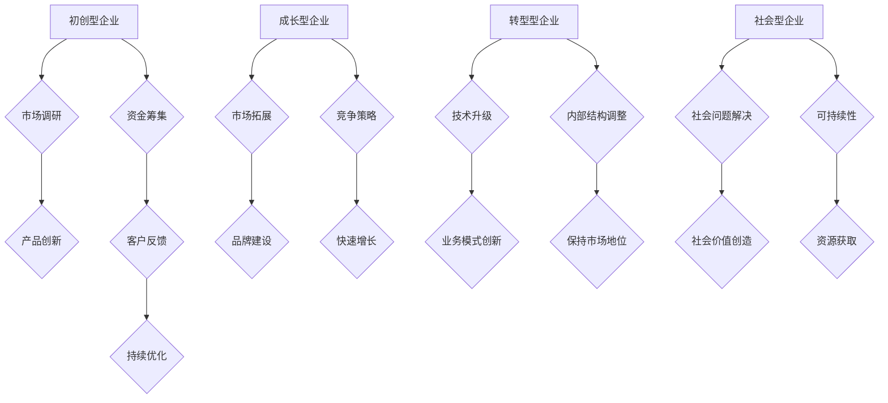
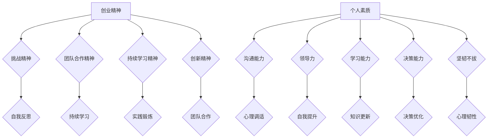
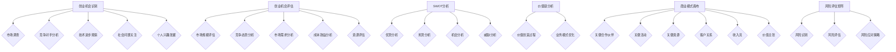

                 

### 引言

> 创业，是无数人梦寐以求的梦想，也是推动社会进步的重要力量。然而，创业并非易事，它充满了不确定性和风险。创业过程中，知识的积累、经验的分享、资源的整合以及策略的制定都至关重要。本文旨在为创业者提供一个全面的创业知识加速器，通过分享创业成果和经验，帮助创业者更好地应对挑战，实现创业梦想。

> 文章关键词：创业、知识、经验、成果、加速器
>
> 摘要：
> 本文章将从创业基础与理念、创业实践与策略、创业成果与经验分享、创业资源与支持等多个维度，深入探讨创业过程中的关键要素和成功路径。通过具体的案例分析和实践指导，本文旨在为创业者提供有价值的参考，助力他们在创业道路上更加稳健地前行。

创业，不仅是一种生活方式，更是一种思维方式。它需要创业者具备敏锐的市场洞察力、坚韧的执行力和卓越的领导力。创业的过程充满了未知和挑战，但正是这些挑战激发了创业者不断探索和前进的动力。本文将带领读者走进创业的世界，共同探讨创业的核心知识、实践策略和成功经验。

在接下来的内容中，我们将分为四个部分进行讨论。第一部分，我们将深入了解创业的定义、类型和创业精神；第二部分，我们将探讨创业实践中的关键策略，包括商业模式的创新、团队的构建与管理以及市场的进入策略；第三部分，我们将通过成功与失败案例分析，总结创业的经验与教训；第四部分，我们将介绍创业所需的资源与支持，帮助创业者更好地获取信息和资源。

通过对创业知识的全面梳理和实践经验的分享，我们希望创业者能够在创业的道路上少走弯路，更快地实现创业目标。创业不仅是为了追求利润，更是为了创造价值、改变世界。让我们携手共进，共同开启这段充满挑战和机遇的创业旅程。

### 第一部分：创业基础与理念

#### 第1章：创业的定义与类型

创业，这个词语在现代社会中越来越频繁地被提及。然而，究竟什么是创业？创业有哪些类型？这些基本问题对于即将踏上创业之路的创业者来说至关重要。

**1.1 创业的起源与发展**

创业的起源可以追溯到人类社会的早期。最早的创业行为可以追溯到农耕社会，人们通过创新农业技术、发展贸易活动等方式，实现了财富的积累和社会地位的提升。随着工业革命的发展，创业活动逐渐变得更加多样化和复杂化。工业革命不仅带来了生产力的巨大提升，也激发了企业家精神，使得创业成为推动社会进步的重要力量。

在现代社会，创业的定义和类型更加丰富和多样化。创业不再仅仅是企业家为了获取利润而进行的经济活动，它更多地被视为一种创新和改变世界的方式。创业者通过创新产品、服务和商业模式，解决了社会问题，创造了新的价值和就业机会。

**1.2 创业的定义与内涵**

创业，简单来说，就是通过创新的方式创建和运营一个企业。创业的核心在于创新，创业者通过发现市场需求、创造新产品或服务，实现商业价值的创造。创业不仅包括创立一个新的企业，还可以包括在现有企业中引入创新性变革。

创业的内涵非常丰富，它不仅仅是商业活动，更是一种社会活动。创业者通过创业活动，不仅实现了个人价值和财富积累，还推动了社会进步和经济发展。创业的精神在于不断探索、勇于尝试和敢于面对挑战。

**1.3 创业的类型**

创业可以分为多种类型，不同类型的创业具有不同的特点和挑战。以下是几种常见的创业类型：

- **初创型企业**：初创型企业是指创立时间较短、规模较小的企业。这些企业通常以创新为主要驱动力，通过市场调研和客户反馈不断优化产品和服务。初创型企业面临的最大挑战是资金短缺和市场不确定性。

- **成长型企业**：成长型企业是指已经取得一定市场份额、规模逐渐扩大的企业。这些企业通常在市场中拥有一定的影响力，并开始逐步建立品牌。成长型企业的挑战在于如何在竞争中保持优势，同时实现可持续的快速增长。

- **转型型企业**：转型型企业是指通过引入新技术、新产品或新商业模式，实现企业转型和升级的企业。转型型企业的创业活动通常涉及到企业内部结构的调整和业务模式的创新。转型型企业的挑战在于如何平衡创新与传统业务，确保企业在转型过程中不失去市场地位。

- **社会型企业**：社会型企业是指以解决社会问题为主要目标的创业企业。这些企业的商业模式通常不以盈利为主要目标，而是通过创造社会价值和解决社会问题来获取支持和资源。社会型企业的挑战在于如何在实现社会价值的同时，保持企业的可持续性。

通过对创业类型的了解，创业者可以根据自身的资源和能力，选择适合自己的创业方向。不同类型的创业虽然面临不同的挑战，但都离不开对市场的洞察、创新能力的培养和团队的有效管理。

**Mermaid 流程图：创业类型的流程图**

通过上述流程图，我们可以清晰地看到不同类型创业的核心活动和挑战。创业者可以根据自身情况和目标，有针对性地进行规划和准备。

**总结**

创业的定义和类型为我们提供了对创业活动的基本认识。初创型企业、成长型企业、转型型企业和社会型企业各有不同的特点和挑战，但都离不开对市场的敏锐洞察、创新能力的培养和团队的有效管理。了解创业类型，有助于创业者选择适合自己的创业方向，制定更有效的创业策略。

在下一章中，我们将进一步探讨创业精神与个人素质，帮助创业者更好地理解创业的本质和自我提升的方向。

### 第2章：创业精神与个人素质

创业不仅仅是一项经济活动，更是一种精神追求。创业精神是创业者内心的驱动力，它决定了创业者能否在面对困难和挑战时坚持不懈。同时，个人素质是创业成功的关键因素之一，它包括沟通能力、领导力和学习能力等多个方面。在本章中，我们将深入探讨创业精神的重要性以及创业所需的个人素质。

#### 2.1 创业精神的重要性

创业精神是一种勇于探索、敢于冒险、不断学习和创新的精神。它既是创业的驱动力，也是创业成功的保障。以下是创业精神的重要性：

- **挑战精神**：创业过程中充满了不确定性和风险，创业者需要有勇气面对这些挑战，敢于尝试新事物，不断突破自我。挑战精神是创业精神的核心，它激励创业者不断追求卓越，勇于承担风险。

- **团队合作精神**：创业不是一个人的战斗，而是团队协作的结果。创业者需要具备团队合作精神，能够与团队成员建立信任，共同面对困难和挑战。团队合作精神是创业成功的重要保障，它能够凝聚团队力量，提高团队效能。

- **持续学习精神**：创业是一个不断学习和成长的过程。创业者需要不断学习新知识、新技能，以适应不断变化的市场环境。持续学习精神是创业者保持竞争力的重要手段，它能够帮助创业者不断更新知识和技能，适应新的市场趋势。

- **创新精神**：创新是创业的灵魂，是创业成功的源泉。创业者需要具备创新精神，能够发现市场机会，创造新的产品或服务。创新精神是创业精神的重要组成部分，它能够推动创业者不断开拓新领域，实现商业价值。

#### 2.2 创业所需的个人素质

创业不仅需要创业精神，还需要具备一系列个人素质。以下是一些关键的个人素质：

- **沟通能力**：沟通能力是创业者必须具备的基本素质。创业者需要与团队成员、合作伙伴、客户和投资者进行有效的沟通。良好的沟通能力能够帮助创业者建立良好的人际关系，提高团队效能，增强企业的竞争力。

- **领导力**：领导力是创业者成功的重要保障。创业者需要具备领导力，能够带领团队朝着共同的目标前进。领导力包括决策能力、协调能力、激励能力和愿景能力。具备领导力的创业者能够更好地管理团队，应对各种挑战，实现企业目标。

- **学习能力**：学习能力是创业者必须具备的核心素质。创业过程中，市场环境和技术不断变化，创业者需要具备快速学习新知识、新技能的能力。学习能力是创业者保持竞争力的关键，它能够帮助创业者快速适应市场变化，抓住市场机会。

- **决策能力**：决策能力是创业者必须具备的重要素质。创业者需要能够在复杂多变的市场环境中做出正确的决策，把握市场机遇，规避市场风险。决策能力包括分析能力、判断能力和执行力。具备决策能力的创业者能够更好地应对市场挑战，实现企业目标。

- **坚韧不拔**：坚韧不拔是创业者必须具备的品质。创业过程中，创业者会遇到各种困难和挑战，需要具备坚韧不拔的精神，持续努力，不轻易放弃。坚韧不拔的创业者能够克服各种困难，最终实现创业目标。

#### 2.3 创业者如何培养个人素质

创业者要培养个人素质，需要从以下几个方面着手：

- **自我反思**：创业者需要经常进行自我反思，了解自己的优势和不足，找到提升的方向。通过自我反思，创业者能够更好地认识自己，提升自我。

- **持续学习**：创业者需要不断学习新知识、新技能，提升自己的综合素质。可以通过参加培训课程、阅读书籍、参加行业会议等方式进行学习。

- **实践锻炼**：创业者需要通过实践锻炼来提升自己的能力。可以尝试参与各种项目，积累实际经验，提升自己的实践能力。

- **团队合作**：创业者需要积极参与团队合作，通过与他人合作来提升自己的沟通能力和领导力。可以通过参与团队项目、加入创业社群等方式进行团队合作。

- **心理调适**：创业者需要保持积极的心态，学会应对压力和挫折。可以通过心理咨询、运动、旅游等方式进行心理调适。

**Mermaid 流程图：创业精神与个人素质的关系**

通过上述流程图，我们可以清晰地看到创业精神与个人素质之间的关系。创业精神是创业者内心的驱动力，而个人素质是创业成功的基础。创业者需要通过自我反思、持续学习、实践锻炼和团队合作等方式，不断提升自己的个人素质，以应对创业过程中的各种挑战。

**总结**

创业精神与个人素质是创业成功的重要因素。创业精神决定了创业者能否在创业过程中坚持不懈，而个人素质则是创业者实现创业目标的关键保障。通过培养创业精神和个人素质，创业者能够更好地应对创业过程中的各种挑战，实现创业梦想。

在下一章中，我们将探讨创业机会识别与评估的方法，帮助创业者更好地发现和把握市场机会。

### 第3章：创业机会识别与评估

创业机会是创业成功的关键因素之一。识别和评估创业机会的能力决定了创业者能否抓住市场机遇，实现商业价值。本章将详细介绍如何识别创业机会，评估其可行性，并提供一些实用的方法和工具，帮助创业者更好地把握创业机会。

#### 3.1 创业机会的识别

创业机会的识别是创业过程中的第一步，也是至关重要的一步。创业者需要具备敏锐的市场洞察力和创新思维，从日常生活中的点滴中发现潜在的商业机会。以下是几种常见的创业机会识别方法：

- **市场调查**：通过市场调查，了解市场需求和消费者行为，发现市场缺口和机会。创业者可以通过问卷调查、访谈、焦点小组讨论等方式收集市场数据，分析消费者的需求和偏好。

- **竞争对手分析**：分析竞争对手的产品和服务，了解他们的优势和不足，从中找到机会。创业者可以通过市场调研、产品分析、用户反馈等方式获取竞争对手的信息。

- **技术进步**：关注技术发展趋势，发现技术变革带来的商业机会。创业者可以关注科技新闻、技术论坛、专利数据库等，了解最新技术进展和应用领域。

- **社会问题**：关注社会问题，通过解决这些问题创造商业价值。创业者可以从环境问题、教育问题、医疗问题等社会热点中寻找机会，开发相应的产品或服务。

- **个人兴趣**：根据个人兴趣和专业知识，发现潜在的商业机会。创业者可以利用自己的专业技能和经验，开发与自身兴趣相关的产品或服务。

#### 3.2 创业机会的评估

识别到创业机会后，创业者需要对机会进行评估，以确定其可行性和潜在风险。以下是几种常用的创业机会评估方法：

- **市场规模评估**：评估目标市场的规模和增长潜力。创业者可以通过市场调研、行业报告等方式了解市场规模，分析市场增长率、市场份额等指标。

- **竞争态势分析**：分析目标市场的竞争格局，评估竞争者的实力和市场份额。创业者可以通过市场调研、竞争者分析等方式了解竞争态势，确定自身在市场中的定位。

- **市场需求分析**：评估目标客户的需求和购买意愿。创业者可以通过问卷调查、用户访谈等方式了解客户需求，分析市场需求。

- **成本效益分析**：评估创业项目的成本和潜在收益，确定项目的经济效益。创业者可以通过财务分析、成本预算等方式进行成本效益分析。

- **资源评估**：评估创业者所拥有的资源和能够获取的资源，确定项目所需的资源和资源获取难度。创业者需要评估自己的资金、技术、人力、市场渠道等资源。

#### 3.3 创业机会评估的实用方法和工具

为了更有效地评估创业机会，创业者可以使用一些实用方法和工具。以下是几种常用的方法和工具：

- **SWOT分析**：SWOT分析是一种常用的战略规划工具，用于评估企业的优势、劣势、机会和威胁。创业者可以通过SWOT分析，全面评估创业机会，确定项目的优劣势和潜在风险。

- **价值链分析**：价值链分析是一种用于分析企业价值创造过程的工具。创业者可以通过价值链分析，了解创业项目的价值创造过程，优化业务模式，提高企业的竞争力。

- **商业模式画布**：商业模式画布是一种用于描述企业商业模式的工具，包括关键合作伙伴、关键活动、关键资源、客户关系、收入流和价值主张等要素。创业者可以通过商业模式画布，梳理创业项目的商业模式，评估其可行性和竞争力。

- **风险评估矩阵**：风险评估矩阵是一种用于评估创业项目风险的工具，包括风险识别、风险评估和风险应对策略。创业者可以通过风险评估矩阵，识别创业项目的风险因素，评估风险程度，制定应对策略。

**Mermaid 流程图：创业机会识别与评估的流程**

通过上述流程图，我们可以清晰地看到创业机会识别与评估的流程和方法。创业者可以根据实际情况，选择合适的方法和工具进行创业机会的识别和评估。

**总结**

创业机会识别与评估是创业过程中至关重要的一步。通过识别创业机会，创业者可以发现潜在的市场需求和商业价值；通过评估创业机会，创业者可以确定项目的可行性和潜在风险。掌握创业机会识别与评估的方法和工具，有助于创业者更好地把握市场机遇，实现创业目标。

在下一章中，我们将探讨创业团队的建设与管理，帮助创业者搭建高效团队，共同迎接创业挑战。

### 第4章：创业团队的建设与管理

创业团队是创业成功的关键因素之一。一个高效的创业团队能够凝聚智慧，共同应对挑战，实现创业目标。本章将详细介绍创业团队建设与管理的方法，包括团队成员的角色与职责、团队文化建设、激励与沟通策略等，帮助创业者构建和领导一支强大的创业团队。

#### 4.1 团队成员的角色与职责

一个成功的创业团队通常由不同角色和职责的成员组成。以下是一些常见的团队成员及其角色与职责：

- **创始人**：创始人通常是创业团队的领导者，负责制定企业的愿景、使命和战略方向。创始人需要具备强烈的领导力和创新能力，能够带领团队朝着共同的目标前进。

- **技术人员**：技术人员是创业团队的核心力量，负责产品或服务的研发和实现。技术人员需要具备扎实的专业技能和解决问题的能力，能够在项目中发挥关键作用。

- **市场人员**：市场人员负责市场调研、产品推广和客户关系管理。市场人员需要具备市场洞察力和沟通能力，能够准确把握市场需求，推动产品销售。

- **财务人员**：财务人员负责企业的财务规划、预算管理和资金筹集。财务人员需要具备财务知识和风险管理能力，能够为企业提供财务支持和决策依据。

- **行政人员**：行政人员负责企业日常行政事务和后勤支持。行政人员需要具备组织协调能力和服务意识，能够为团队成员提供良好的工作环境和后勤保障。

#### 4.2 团队文化的建设

团队文化是创业团队的核心要素之一，它能够凝聚团队成员，增强团队凝聚力。以下是几种常见的团队文化建设方法：

- **共同价值观**：建立共同的价值观是团队文化建设的基石。创业者需要与团队成员共同探讨和确定企业的价值观，使其成为团队共同遵循的行为准则。

- **开放沟通**：开放沟通是团队文化的重要组成部分。创业者需要鼓励团队成员之间的交流，建立良好的沟通渠道，使团队成员能够自由表达自己的想法和建议。

- **团队合作**：团队合作是团队文化的重要体现。创业者需要倡导团队合作精神，鼓励团队成员共同分担任务，共同解决困难。

- **共同目标**：明确共同目标是团队文化建设的关键。创业者需要与团队成员共同制定企业目标，使团队成员明确自己的职责和贡献，增强团队凝聚力。

- **激励机制**：建立激励机制是团队文化建设的重要手段。创业者需要制定合理的激励机制，激励团队成员为实现企业目标而努力。

#### 4.3 团队管理的策略

团队管理是创业成功的重要保障。以下是一些常见的团队管理策略：

- **激励与奖励**：激励与奖励是团队管理的重要手段。创业者需要制定合理的激励机制，通过物质奖励和精神激励，激励团队成员为实现企业目标而努力。

- **沟通与协作**：良好的沟通与协作是团队管理的关键。创业者需要建立有效的沟通渠道，鼓励团队成员之间的协作，提高团队效能。

- **项目管理**：项目管理是团队管理的重要组成部分。创业者需要制定详细的项目计划，明确项目目标和任务分工，确保项目按计划进行。

- **培训与发展**：培训与发展是团队管理的重要策略。创业者需要为团队成员提供培训和发展机会，提高团队成员的专业技能和综合素质。

- **反馈与改进**：反馈与改进是团队管理的重要环节。创业者需要定期收集团队成员的反馈，针对存在的问题进行改进，提高团队管理效能。

#### 4.4 团队建设的实践案例

以下是一个团队建设的实践案例：

**案例：某创业公司的团队建设**

某创业公司成立于2018年，专注于智能家居产品的研发和推广。公司创始团队由5人组成，包括1名创始人、2名技术人员、2名市场人员和1名财务人员。

1. **共同价值观建设**：
   - 创始人与团队成员共同探讨和确定了企业的价值观：“创新、品质、用户至上、团队合作”。
   - 这些价值观被写入公司的使命和愿景，成为团队成员共同遵循的行为准则。

2. **开放沟通与协作**：
   - 公司建立了内部沟通平台，鼓励团队成员随时分享自己的想法和建议。
   - 每周召开团队会议，讨论项目进展和遇到的问题，确保团队成员之间的信息畅通。

3. **激励机制**：
   - 公司制定了激励机制，通过绩效奖金、股权激励等方式激励团队成员。
   - 定期举办团队活动，增强团队成员之间的互动和凝聚力。

4. **项目管理和培训**：
   - 公司制定了详细的项目计划，明确项目目标和任务分工。
   - 定期为团队成员提供技术培训和行业资讯，提高团队成员的专业技能。

5. **反馈与改进**：
   - 公司定期收集团队成员的反馈，针对存在的问题进行改进。
   - 通过定期的团队评估，优化团队管理策略，提高团队效能。

通过上述团队建设和管理策略，该创业公司取得了显著的成功。公司产品在市场上得到了广泛认可，团队成员之间的协作和沟通也日益增强，为公司的持续发展奠定了坚实的基础。

**总结**

创业团队的建设与管理是创业成功的关键。通过明确团队成员的角色与职责、建设团队文化、制定激励与沟通策略，创业者可以构建一支高效、团结的创业团队，共同应对创业挑战。掌握团队建设与管理的实践方法和技巧，有助于创业者更好地领导团队，实现创业目标。

在下一章中，我们将探讨市场分析与定位，帮助创业者更好地了解市场环境，制定有效的市场策略。

### 第5章：市场分析与定位

市场分析与定位是创业过程中至关重要的一环。通过对市场环境的深入分析，创业者可以明确目标客户群体，制定有效的市场策略，提高产品或服务的竞争力。本章将详细介绍市场调查、数据分析、目标客户分析和竞争对手分析等内容，帮助创业者进行全面的市场分析与定位。

#### 5.1 市场调查

市场调查是了解市场环境、把握市场需求的第一步。创业者需要通过市场调查，收集有关市场趋势、消费者行为、竞争对手信息等方面的数据。以下是一些常用的市场调查方法：

- **问卷调查**：问卷调查是一种常见的市场调查方法，通过设计问卷，收集消费者的意见和反馈。问卷调查可以采用线上和线下两种方式进行，有助于大规模收集数据。

- **访谈调查**：访谈调查是通过面对面的交流，深入了解消费者的需求和意见。访谈调查可以获取更加详细和深入的信息，有助于发现潜在的市场机会。

- **焦点小组**：焦点小组是一种集体讨论的方法，通过组织一组消费者或行业专家，进行深入的讨论和交流。焦点小组可以激发创意，收集多样化的观点。

- **观察法**：观察法是通过观察消费者的行为和互动，了解他们的需求和习惯。观察法可以提供真实的行为数据，有助于制定针对性的市场策略。

#### 5.2 数据分析

数据分析是市场分析的重要环节，通过对收集到的市场数据进行分析，创业者可以挖掘出有价值的信息和趋势。以下是一些常用的数据分析方法：

- **描述性分析**：描述性分析主要用于描述市场数据的分布和特征，包括数据汇总、统计图表等。描述性分析可以帮助创业者了解市场的基本情况。

- **推断性分析**：推断性分析主要用于推断总体市场的特征和趋势，包括概率分布、置信区间等。推断性分析可以帮助创业者做出更为科学的决策。

- **相关性分析**：相关性分析主要用于分析不同市场变量之间的关系，包括相关系数、回归分析等。相关性分析可以帮助创业者发现市场因素之间的关联，为市场策略提供依据。

- **预测分析**：预测分析主要用于预测未来的市场趋势和需求，包括时间序列分析、机器学习算法等。预测分析可以帮助创业者提前应对市场变化，制定灵活的市场策略。

#### 5.3 目标客户分析

目标客户分析是市场分析的核心内容之一，通过对目标客户群体的特征和行为进行分析，创业者可以制定更精准的市场策略。以下是一些常用的目标客户分析方法：

- **人口统计特征**：人口统计特征包括年龄、性别、收入、教育背景等。通过分析目标客户的人口统计特征，创业者可以了解客户的基本情况，为市场策略提供依据。

- **行为特征**：行为特征包括购买习惯、消费偏好、使用习惯等。通过分析目标客户的行为特征，创业者可以了解客户的消费行为，为产品设计和营销策略提供参考。

- **心理特征**：心理特征包括价值观、兴趣爱好、生活方式等。通过分析目标客户的心理特征，创业者可以了解客户的内在需求，为产品定位和品牌建设提供方向。

- **购买决策过程**：购买决策过程包括需求识别、信息搜索、评估选择、购买决策和购后行为。通过分析目标客户的购买决策过程，创业者可以了解客户的需求变化和购买行为，优化市场策略。

#### 5.4 竞争对手分析

竞争对手分析是市场分析的重要环节，通过对竞争对手的产品、市场策略、营销手段等方面进行分析，创业者可以了解竞争态势，制定有效的竞争策略。以下是一些常用的竞争对手分析方法：

- **产品分析**：产品分析包括竞争对手的产品功能、性能、价格、市场份额等。通过分析竞争对手的产品，创业者可以了解市场上的竞争格局，优化自己的产品策略。

- **市场策略分析**：市场策略分析包括竞争对手的市场定位、营销渠道、促销策略等。通过分析竞争对手的市场策略，创业者可以了解市场上的竞争手段，为自己的市场策略提供参考。

- **营销手段分析**：营销手段分析包括竞争对手的广告宣传、公关活动、社交媒体推广等。通过分析竞争对手的营销手段，创业者可以了解市场上的营销趋势，优化自己的营销策略。

- **SWOT分析**：SWOT分析是一种常用的战略规划工具，用于分析竞争对手的优势、劣势、机会和威胁。通过SWOT分析，创业者可以全面了解竞争对手的情况，为竞争策略提供依据。

#### 5.5 市场分析与定位的实践案例

以下是一个市场分析与定位的实践案例：

**案例：某健康食品公司的市场分析与定位**

某健康食品公司成立于2019年，专注于提供天然、健康的食品产品。公司创始团队在创业初期，进行了全面的市场分析与定位。

1. **市场调查**：
   - 公司通过问卷调查、访谈和焦点小组调查，收集了消费者对健康食品的需求和购买行为的数据。
   - 通过数据分析，公司发现市场上对天然、有机食品的需求日益增加，消费者对食品的安全性和营养价值有较高的要求。

2. **目标客户分析**：
   - 通过人口统计特征和行为特征分析，公司确定了目标客户群体为25-45岁的中产阶级，他们注重健康生活，有较高的购买力。
   - 通过心理特征分析，公司发现目标客户有追求高品质生活的价值观，注重家庭健康。

3. **竞争对手分析**：
   - 公司分析了市场上主要的健康食品品牌，了解了竞争对手的产品特点、市场策略和营销手段。
   - 通过SWOT分析，公司发现竞争对手在产品种类和营销渠道方面有优势，但在产品质量和品牌形象上存在劣势。

4. **市场定位**：
   - 根据市场分析与定位的结果，公司确定了“天然、有机、高品质”的市场定位。
   - 公司专注于提供高品质的健康食品，满足中产阶级对健康生活的需求，树立品牌形象。

通过全面的市场分析与定位，该公司成功地进入了健康食品市场，取得了良好的市场反响和业绩。

**总结**

市场分析与定位是创业成功的关键环节。通过市场调查、数据分析、目标客户分析和竞争对手分析，创业者可以了解市场环境，把握市场需求，制定有效的市场策略。掌握市场分析与定位的方法和技巧，有助于创业者更好地应对市场变化，实现创业目标。

在下一章中，我们将探讨产品设计与开发，帮助创业者了解产品开发的过程和方法。

### 第6章：产品设计与开发

产品设计与开发是创业过程中至关重要的一环。一个成功的产品不仅需要满足市场需求，还需要具备良好的用户体验和高质量的技术实现。本章将详细介绍产品设计与开发的过程，包括用户需求分析、产品原型设计、开发计划制定和产品迭代等内容，帮助创业者更好地进行产品设计与开发。

#### 6.1 用户需求分析

用户需求分析是产品设计与开发的基础，通过对用户需求进行深入了解和分析，创业者可以明确产品的功能、性能和用户体验。以下是一些用户需求分析的方法：

- **问卷调查**：问卷调查是一种常见的用户需求分析方法，通过设计问卷，收集用户的反馈和建议。问卷调查可以采用线上和线下两种方式进行，有助于大规模收集用户需求数据。

- **访谈调查**：访谈调查是通过面对面的交流，深入了解用户的真实需求和期望。访谈调查可以获取更详细和深入的信息，有助于发现潜在的用户需求。

- **用户调研**：用户调研是通过观察用户的行为和互动，了解用户的使用习惯和需求。用户调研可以提供真实的行为数据，有助于制定针对性的产品策略。

- **用户画像**：用户画像是通过分析用户的基本信息、行为特征和心理特征，构建用户的详细画像。用户画像可以帮助创业者了解用户的整体特征，为产品设计和营销策略提供参考。

#### 6.2 产品原型设计

产品原型设计是产品开发的重要阶段，通过对产品进行初步设计和建模，创业者可以验证产品概念，收集用户反馈，优化产品功能。以下是一些产品原型设计的方法：

- **线框图**：线框图是一种简化的产品界面设计，通过线条和简单的图形表示产品的功能和布局。线框图可以帮助创业者快速搭建产品原型，便于用户进行交互体验。

- **原型设计工具**：原型设计工具如Axure、Sketch、Figma等，可以帮助创业者快速搭建高保真的产品原型。这些工具提供了丰富的交互元素和设计模板，便于创业者进行原型设计和用户测试。

- **用户测试**：用户测试是通过让用户实际使用产品原型，收集用户反馈和建议。用户测试可以帮助创业者发现产品原型中的问题和不足，为产品的优化提供依据。

- **迭代优化**：迭代优化是通过不断进行原型设计和用户测试，逐步完善产品功能。迭代优化可以帮助创业者快速响应用户需求，提高产品的用户体验。

#### 6.3 开发计划制定

开发计划制定是产品开发的重要环节，通过合理的计划安排，创业者可以确保产品按期上线，提高开发效率。以下是一些开发计划制定的方法：

- **需求文档**：需求文档是产品开发的重要文档，包括产品的功能需求、性能需求和使用场景等。需求文档可以帮助开发团队明确产品的开发目标，确保产品功能的实现。

- **项目计划**：项目计划是开发计划的具体执行方案，包括项目的任务分解、时间安排和资源分配等。项目计划可以帮助开发团队合理安排工作，确保项目按期完成。

- **敏捷开发**：敏捷开发是一种灵活的开发方法，通过短周期、频繁迭代的方式进行产品开发。敏捷开发可以帮助创业者快速响应市场变化，提高产品的迭代速度。

- **风险管理**：风险管理是开发计划制定的重要环节，通过对项目风险进行识别和评估，制定相应的风险应对策略。风险管理可以帮助创业者降低项目风险，确保项目的顺利进行。

#### 6.4 产品迭代

产品迭代是产品开发的重要环节，通过不断进行产品优化和升级，创业者可以满足用户需求，提高产品的市场竞争力。以下是一些产品迭代的方法：

- **用户反馈**：用户反馈是产品迭代的重要依据，通过收集用户的反馈和建议，创业者可以了解用户的实际需求和痛点，为产品优化提供参考。

- **数据分析**：数据分析是产品迭代的重要工具，通过分析产品的使用数据和用户行为，创业者可以了解产品的使用情况和用户需求，为产品优化提供数据支持。

- **版本更新**：版本更新是产品迭代的主要方式，通过不断发布新版本，创业者可以优化产品功能，修复漏洞，提升用户体验。

- **持续迭代**：持续迭代是一种持续优化产品的开发方法，通过定期进行产品评估和用户测试，创业者可以不断改进产品，提高产品的市场竞争力。

#### 6.5 产品设计与开发的实践案例

以下是一个产品设计与开发的实践案例：

**案例：某移动健康应用的开发**

某移动健康应用公司成立于2020年，致力于提供一站式的健康管理服务。公司创始团队在产品设计与开发过程中，采取了以下步骤：

1. **用户需求分析**：
   - 公司通过问卷调查和用户访谈，收集了用户对健康管理服务的需求，包括饮食管理、运动跟踪、健康资讯等。
   - 通过用户调研和用户画像分析，公司确定了目标用户群体为25-45岁的中产阶级，他们注重健康生活，有较高的购买力。

2. **产品原型设计**：
   - 公司使用Axure工具搭建了产品原型，包括首页、饮食管理、运动跟踪、健康资讯等模块。
   - 通过用户测试，公司收集了用户的反馈和建议，对产品原型进行了优化。

3. **开发计划制定**：
   - 公司制定了详细的项目计划，包括任务分解、时间安排和资源分配等。
   - 公司采用了敏捷开发方法，通过短周期、频繁迭代的方式进行产品开发。

4. **产品迭代**：
   - 公司通过用户反馈和数据分析，不断优化产品的功能和用户体验。
   - 每周发布一次版本更新，修复漏洞，增加新功能，提升用户体验。

通过严格的产品设计与开发流程，该移动健康应用在市场上取得了良好的反响，用户数量迅速增长，为公司的发展奠定了坚实的基础。

**总结**

产品设计与开发是创业成功的关键环节。通过用户需求分析、产品原型设计、开发计划制定和产品迭代，创业者可以确保产品满足市场需求，提高用户体验，增强产品的市场竞争力。掌握产品设计与开发的实践方法和技巧，有助于创业者更好地实现创业目标。

在下一章中，我们将探讨商业模式与战略，帮助创业者制定有效的商业模式，实现可持续发展。

### 第7章：商业模式与战略

商业模式与战略是创业成功的关键因素之一。一个良好的商业模式能够帮助创业者明确企业的收入来源、成本结构以及核心竞争力，从而实现可持续的盈利和发展。本章将详细介绍商业模式的定义、构成要素、商业模式创新的方法以及战略规划等内容，帮助创业者制定有效的商业模式与战略。

#### 7.1 商业模式的定义与构成要素

商业模式是指企业通过提供产品或服务，获取收入并实现价值创造的过程。一个完整的商业模式包括以下几个核心要素：

- **价值主张**：价值主张是企业向客户提供的独特价值和利益。它是商业模式的起点，决定了企业如何满足客户需求，解决客户问题。价值主张可以是产品、服务、解决方案等，关键在于能够为用户提供独特的价值。

- **客户细分**：客户细分是指企业将市场划分为不同的客户群体，并针对每个群体提供不同的产品或服务。通过客户细分，企业可以更好地了解不同客户群体的需求，制定有针对性的营销策略。

- **渠道**：渠道是指企业将产品或服务传递给客户的方式。渠道可以是线上渠道、线下渠道或者线上线下结合的渠道。选择合适的渠道能够提高产品的市场覆盖率，增加销售机会。

- **客户关系**：客户关系是指企业与客户之间建立的联系和互动。客户关系可以是交易关系、会员关系、合作伙伴关系等。良好的客户关系能够提高客户忠诚度，增加重复购买率。

- **收入来源**：收入来源是指企业通过提供产品或服务获取收入的方式。收入来源可以是直接销售、订阅服务、广告收入、授权收入等。明确收入来源有助于企业制定财务规划和盈利模式。

- **关键资源**：关键资源是企业运营过程中必不可少的重要资源，包括资金、技术、人才、品牌等。关键资源决定了企业的核心竞争力，是企业实现商业模式的关键要素。

- **关键活动**：关键活动是企业为了实现商业模式所必须进行的关键操作和流程。关键活动包括产品开发、市场推广、客户服务、供应链管理等。关键活动的高效运作能够提高企业的运营效率，降低成本。

- **成本结构**：成本结构是指企业运营过程中产生的成本构成和分配方式。成本结构决定了企业的盈利能力和经营模式。合理的成本结构有助于企业实现可持续发展。

#### 7.2 商业模式创新的方法

商业模式创新是创业者在竞争激烈的市场中获取优势的重要手段。以下是一些常见的商业模式创新方法：

- **平台模式**：平台模式是指企业通过搭建一个开放的平台，连接供需双方，实现价值创造和共享。平台模式的核心在于通过提供基础设施和服务，吸引大量用户和商家，形成生态系统。

- **订阅模式**：订阅模式是指企业通过提供持续的订阅服务，获取稳定的收入来源。订阅模式适用于提供持续需求的商品或服务，如在线教育、云计算、会员制等。

- **共享经济模式**：共享经济模式是指企业通过共享闲置资源，提高资源利用效率，实现价值创造。共享经济模式包括共享住宿、共享交通、共享办公等，旨在打破传统经济模式，实现资源共享和优化。

- **粉丝经济模式**：粉丝经济模式是指企业通过建立粉丝社群，培养粉丝忠诚度，实现价值创造。粉丝经济模式适用于具有高粉丝基础的行业，如明星经济、网红经济等。

- **跨界合作模式**：跨界合作模式是指企业通过与其他行业的合作，实现业务拓展和资源整合，创造新的商业模式。跨界合作模式能够打破行业壁垒，实现创新和突破。

#### 7.3 战略规划

战略规划是企业长期发展的重要保障。一个有效的战略规划能够帮助创业者明确企业的目标、路径和资源分配。以下是一些战略规划的方法：

- **愿景规划**：愿景规划是指企业制定长远的发展目标，描述企业的愿景和使命。愿景规划有助于创业者明确企业的发展方向和核心价值观。

- **市场定位**：市场定位是指企业确定自己在市场中的位置和优势，为产品或服务找到合适的定位。市场定位有助于企业在激烈的市场竞争中脱颖而出，建立品牌形象。

- **竞争优势分析**：竞争优势分析是指企业分析自身的竞争优势和劣势，确定企业的核心竞争力。竞争优势分析有助于企业制定有效的战略规划，提高市场竞争力。

- **业务战略规划**：业务战略规划是指企业制定具体的业务发展策略，包括产品策略、市场策略、组织策略等。业务战略规划有助于企业实现业务增长和市场扩张。

- **财务战略规划**：财务战略规划是指企业制定财务目标和财务策略，包括投资规划、成本控制、收益分配等。财务战略规划有助于企业实现财务稳定和可持续发展。

#### 7.4 商业模式与战略的实践案例

以下是一个商业模式与战略的实践案例：

**案例：某在线教育平台**

某在线教育平台成立于2015年，致力于提供高质量的在线教育服务。公司创始团队在商业模式与战略规划方面采取了以下步骤：

1. **商业模式创新**：
   - 公司采用订阅模式，提供按月订阅的课程服务，用户可以灵活选择课程，按需学习。
   - 公司建立了内容生态，与知名专家和学者合作，提供高质量的教育内容，吸引用户订阅。

2. **战略规划**：
   - 公司明确了愿景规划，即成为国内领先的在线教育平台，为学生提供优质的学习资源和服务。
   - 公司进行了市场定位，目标用户群体为中学生和大学生，提供实用、专业的在线课程。
   - 公司进行了竞争优势分析，发现自己在内容质量和用户体验方面具有优势，因此将竞争优势转化为业务战略。

3. **业务战略规划**：
   - 公司制定了一系列业务发展策略，包括课程研发、市场推广、用户服务管理等。
   - 公司通过线上广告、合作渠道等方式扩大市场份额，提高品牌知名度。
   - 公司提供多种用户服务，如课程回放、学习笔记、在线答疑等，提升用户满意度。

4. **财务战略规划**：
   - 公司制定了财务目标和财务策略，包括收入增长、成本控制和利润分配等。
   - 公司通过精细化运营，降低成本，提高运营效率，实现盈利。

通过商业模式创新和有效的战略规划，该在线教育平台在市场上取得了成功，用户数量迅速增长，为公司的发展奠定了坚实的基础。

**总结**

商业模式与战略是创业成功的关键因素。通过明确商业模式的构成要素、创新商业模式以及制定有效的战略规划，创业者可以确保企业的可持续发展。掌握商业模式与战略的实践方法和技巧，有助于创业者更好地应对市场竞争，实现创业目标。

在下一章中，我们将探讨团队管理，帮助创业者更好地激发团队潜力，实现企业目标。

### 第8章：团队管理

团队管理是创业过程中至关重要的一环，一个高效的团队能够推动企业的发展，实现创业目标。本章将详细介绍团队管理的重要性、团队管理策略、激励机制和项目管理等内容，帮助创业者更好地进行团队管理。

#### 8.1 团队管理的重要性

团队管理不仅关系到企业的日常运营，更对企业的长远发展具有重要影响。以下是一些团队管理的重要性：

- **提高工作效率**：团队管理能够合理分配任务，明确工作职责，提高团队成员的工作效率。

- **提升团队凝聚力**：团队管理通过有效的沟通和协作，增强团队成员之间的信任和凝聚力。

- **促进个人成长**：团队管理为团队成员提供成长机会，帮助他们提升专业技能和综合素质。

- **实现企业目标**：团队管理能够确保团队朝着共同的目标前进，实现企业的战略目标。

- **优化资源利用**：团队管理通过合理配置资源，降低运营成本，提高企业的盈利能力。

#### 8.2 团队管理策略

有效的团队管理策略能够提高团队的整体效能，以下是一些常见的团队管理策略：

- **目标管理**：目标管理是指通过明确团队和个人的目标，确保团队成员朝着共同的目标努力。目标管理包括设定明确的目标、制定详细的行动计划和定期评估目标完成情况。

- **沟通策略**：沟通策略是指通过有效的沟通渠道和方法，确保团队成员之间的信息畅通和协同合作。沟通策略包括定期召开团队会议、建立内部沟通平台、开展团队活动和鼓励团队成员之间的互动。

- **激励与奖励**：激励与奖励是团队管理的重要手段，通过合理的激励措施和奖励机制，激发团队成员的工作积极性和创造力。激励与奖励包括绩效奖金、股权激励、荣誉表彰和团队活动等。

- **团队建设**：团队建设是指通过组织团队活动和培训，增强团队成员之间的信任和凝聚力。团队建设包括团队拓展训练、团建活动、团队培训和发展计划等。

- **持续改进**：持续改进是指通过定期评估团队绩效和反馈，不断优化团队管理和工作流程。持续改进包括制定改进计划、实施改进措施和评估改进效果等。

#### 8.3 激励机制

激励机制是团队管理的重要组成部分，合理的激励机制能够激发团队成员的工作积极性和创造力。以下是一些激励机制：

- **绩效奖金**：绩效奖金是根据团队成员的工作表现和业绩贡献，给予相应的奖励。绩效奖金能够激励团队成员努力工作，提高工作效率。

- **股权激励**：股权激励是将部分股权或期权分配给团队成员，使团队成员能够分享企业的成长红利。股权激励能够增强团队成员的归属感和责任感。

- **荣誉表彰**：荣誉表彰是通过颁发荣誉证书、奖杯、奖牌等方式，对优秀团队成员进行表彰和奖励。荣誉表彰能够提升团队成员的自豪感和荣誉感。

- **团队活动**：团队活动是通过组织团队聚餐、团建活动、旅游等，增强团队成员之间的交流和互动。团队活动能够提高团队成员的凝聚力和归属感。

- **职业发展**：职业发展是通过提供培训机会、晋升机会和职业发展规划，帮助团队成员实现职业成长。职业发展能够激励团队成员不断提升自己，为企业创造更多价值。

#### 8.4 项目管理

项目管理是团队管理的重要环节，通过科学的项目管理，确保项目按计划完成，实现项目目标。以下是一些项目管理的方法：

- **项目计划**：项目计划是项目管理的基础，包括项目目标、任务分解、时间安排、资源分配等。项目计划能够明确项目的工作内容和进度，确保项目按计划进行。

- **任务分配**：任务分配是将项目任务分配给团队成员，明确任务职责和完成时间。任务分配能够确保项目任务的合理分配和高效执行。

- **进度监控**：进度监控是项目管理的重要环节，通过定期检查项目进度，及时发现和解决问题。进度监控能够确保项目按计划进行，避免延期和质量问题。

- **风险管理**：风险管理是项目管理的重要措施，通过识别和评估项目风险，制定相应的应对策略。风险管理能够降低项目风险，确保项目的顺利进行。

- **质量保证**：质量保证是项目管理的重要目标，通过制定质量标准和质量控制措施，确保项目的质量。质量保证能够提高项目的成功率，提升企业的市场竞争力。

#### 8.5 团队管理的实践案例

以下是一个团队管理的实践案例：

**案例：某创业公司的团队管理**

某创业公司成立于2018年，专注于移动互联网应用的开发。公司创始团队在团队管理方面采取了以下策略：

1. **目标管理**：
   - 公司制定了明确的年度和季度目标，确保团队和个人的目标与公司整体战略一致。
   - 定期召开团队会议，讨论目标完成情况和进度，及时调整计划。

2. **沟通策略**：
   - 公司建立了内部沟通平台，确保团队成员之间的信息畅通。
   - 每周召开团队会议，讨论项目进展和问题，鼓励团队成员提出建议和反馈。

3. **激励与奖励**：
   - 公司设立了绩效奖金制度，根据团队成员的工作表现和业绩贡献，发放奖金。
   - 定期评选优秀员工，给予荣誉表彰和奖励。

4. **团队建设**：
   - 公司组织团队拓展训练，增强团队成员之间的信任和凝聚力。
   - 定期举办团队聚餐和团建活动，提高团队士气。

5. **项目管理**：
   - 公司制定了详细的项目计划，明确项目目标、任务分解和资源分配。
   - 实施进度监控和风险管理措施，确保项目按计划进行。

通过有效的团队管理，该创业公司在项目开发和运营方面取得了显著成果，团队成员的积极性和创造力得到了充分激发。

**总结**

团队管理是创业成功的关键因素之一。通过有效的团队管理策略、激励机制和项目管理，创业者可以激发团队潜力，实现企业目标。掌握团队管理的实践方法和技巧，有助于创业者更好地应对创业挑战，推动企业持续发展。

在下一章中，我们将探讨资金筹集，帮助创业者了解创业资金的不同来源和筹集策略。

### 第9章：资金筹集

资金筹集是创业过程中不可或缺的一环，它关系到企业的运营、发展以及能否顺利实现创业目标。本章将详细介绍创业资金的不同来源，包括风险投资、天使投资、众筹、政府支持等，以及创业者如何制定有效的资金筹集策略。

#### 9.1 风险投资

风险投资（Venture Capital，简称VC）是创业资金的重要来源之一。风险投资通常由专业的风险投资公司或个人投资者提供，他们专注于投资初创企业和成长型企业，以换取企业的股权。以下是一些关键点：

- **风险投资的特点**：风险投资通常涉及高投入、高风险和高回报。投资者通常希望在企业成长过程中获得高额回报，因此对企业的增长潜力和创新能力有较高的期望。

- **投资阶段**：风险投资通常分为种子轮、天使轮、A轮、B轮等多个阶段。每个阶段的投资额和风险程度不同，种子轮和天使轮投资通常风险最高，但回报潜力也最大。

- **筛选标准**：风险投资公司会根据企业的创新性、市场前景、团队素质、商业模式等多个因素进行评估，筛选出具有潜力的创业项目。

- **筹集策略**：创业者需要准备完善的商业计划书，包括市场分析、商业模式、财务预测等，以吸引风险投资公司的关注。此外，创业者还需要具备良好的沟通能力和谈判技巧，以便在投资谈判中取得有利地位。

#### 9.2 天使投资

天使投资（Angel Investment）通常由个人投资者提供，他们是创业初期的早期支持者。以下是一些关键点：

- **天使投资者的特点**：天使投资者通常具备丰富的行业经验或资金实力，愿意在早期阶段投资初创企业。他们通常以个人身份进行投资，有时也会组建天使投资团体。

- **投资额度**：天使投资通常额度较小，但也能提供宝贵的经验和资源支持。

- **回报期望**：天使投资者通常期望在企业上市或被并购时获得高额回报。

- **筹集策略**：创业者可以通过个人网络、创业孵化器、天使投资俱乐部等渠道寻找天使投资者。创业者需要准备详细的商业计划书，展示企业的创新点和市场潜力，以吸引天使投资者的关注。

#### 9.3 众筹

众筹（Crowdfunding）是一种通过互联网平台向大众筹集资金的融资方式。以下是一些关键点：

- **众筹平台**：常见的众筹平台包括Kickstarter、Indiegogo、京东众筹、淘宝众筹等。每个平台都有不同的特点和规则，创业者需要选择适合自己的平台。

- **众筹类型**：众筹主要分为两类：奖励众筹和股权众筹。奖励众筹是指投资者通过预购产品或服务来支持项目，而股权众筹则是投资者通过购买股权来支持项目。

- **回报机制**：奖励众筹通常提供产品的早期购买权或其他形式的奖励，而股权众筹则提供企业股权。

- **筹集策略**：创业者需要设计吸引人的项目介绍和营销策略，以吸引投资者的关注和参与。此外，创业者还需要制定合理的回报计划和项目进度，确保项目能够按时完成。

#### 9.4 政府支持

政府支持是创业资金的重要来源之一，许多国家和地区都提供各种形式的创业资助和优惠政策。以下是一些关键点：

- **政府资助项目**：政府通常会设立各种创业资助项目，包括创新基金、创业孵化器、小额贷款等。创业者可以通过政府网站或相关部门了解这些项目。

- **税收优惠**：政府还会提供税收优惠，如减免企业所得税、增值税等，以鼓励创业活动。

- **政策支持**：政府还会提供政策支持，如简化审批流程、提供咨询服务等，以降低创业者的创业成本。

- **筹集策略**：创业者需要关注政府发布的创业政策，了解符合自己项目的资助项目，并准备详细的申请材料。此外，创业者还可以参加政府组织的创业培训和研讨会，提升自己的创业能力。

#### 9.5 资金筹集的实践案例

以下是一个资金筹集的实践案例：

**案例：某智能硬件创业公司的资金筹集**

某智能硬件创业公司成立于2019年，专注于开发智能家居设备。在创业初期，公司通过以下方式筹集资金：

1. **风险投资**：
   - 公司在种子轮和天使轮阶段，通过个人网络和创业孵化器，吸引了多名天使投资者的关注。投资者对公司的创新性和市场前景表示认可，投资了约300万元人民币。
   - 在A轮阶段，公司通过完善商业计划和产品原型，成功吸引了某知名风险投资公司的投资，融资金额达到1500万元人民币。

2. **众筹**：
   - 公司在Kickstarter平台上发起众筹项目，通过展示产品的创新性和实用性，吸引了超过1000名投资者的支持。众筹活动共筹集资金200万元人民币，并成功推动了产品的市场推广。

3. **政府支持**：
   - 公司关注政府发布的创业资助项目，通过申请创新基金和小额贷款，获得了约200万元的政府资助。
   - 公司还享受了税收优惠政策，降低了企业的税收负担。

通过多种资金筹集方式，该智能硬件创业公司在创业初期获得了充足的资金支持，为后续的产品研发和市场推广奠定了基础。

**总结**

资金筹集是创业成功的关键环节。通过了解风险投资、天使投资、众筹和政府支持等多种资金来源，以及制定有效的筹集策略，创业者可以更好地应对创业过程中的资金需求。掌握资金筹集的实践方法和技巧，有助于创业者顺利实现创业目标。

在下一章中，我们将探讨创业风险管理，帮助创业者识别和管理创业过程中可能遇到的风险。

### 第10章：创业风险管理

创业过程中，风险是不可避免的。创业者需要具备良好的风险管理能力，以应对各种可能出现的风险，确保企业的稳定发展。本章将详细介绍创业风险管理的各个方面，包括风险识别、风险评估、风险应对策略以及危机管理等内容。

#### 10.1 风险识别

风险识别是风险管理的第一步，它涉及到对创业过程中可能遇到的各种风险进行全面的识别和分类。以下是一些常见的创业风险：

- **市场风险**：市场风险包括市场需求变化、竞争对手行为、市场进入壁垒等因素。市场风险可能导致企业的产品或服务失去市场竞争力，影响企业的收入和利润。

- **财务风险**：财务风险包括资金链断裂、财务报表不真实、融资困难等因素。财务风险可能导致企业无法按时偿还债务，影响企业的正常运营。

- **运营风险**：运营风险包括生产流程不稳定、供应链管理不善、人力资源管理问题等因素。运营风险可能导致企业的生产效率降低，影响产品的质量和交货时间。

- **法律风险**：法律风险包括合同纠纷、知识产权侵权、政策法规变化等因素。法律风险可能导致企业面临诉讼、罚款或其他法律制裁。

- **技术风险**：技术风险包括技术落后、创新能力不足、技术研发失败等因素。技术风险可能导致企业的产品或服务无法满足市场需求，影响企业的竞争力。

- **人员风险**：人员风险包括团队不稳定性、人才流失、团队沟通不畅等因素。人员风险可能导致企业的运营效率降低，影响企业的长期发展。

#### 10.2 风险评估

风险评估是风险管理的第二步，它涉及到对识别出的风险进行定量或定性的评估，以确定风险的严重程度和发生概率。以下是一些常用的风险评估方法：

- **定性评估**：定性评估是通过专家意见、历史数据等方式对风险进行主观评估。定性评估通常用于初步识别和评估风险，帮助决策者了解风险的性质和程度。

- **定量评估**：定量评估是通过数学模型、统计方法等方式对风险进行客观评估。定量评估通常用于对风险进行精确计算，为决策者提供科学依据。

- **风险矩阵**：风险矩阵是一种常用的风险评估工具，通过将风险的发生概率和影响程度进行组合，形成不同的风险等级。风险矩阵可以帮助决策者了解不同风险的优先级，制定相应的应对策略。

#### 10.3 风险应对策略

风险应对策略是风险管理的第三步，它涉及到对评估出的风险制定具体的应对措施，以降低风险对企业的影响。以下是一些常见风险应对策略：

- **风险规避**：风险规避是通过避免参与高风险的活动来降低风险。例如，企业可以通过拒绝签订不利的合同、放弃某些市场机会等来规避风险。

- **风险降低**：风险降低是通过采取措施减少风险的发生概率或影响程度。例如，企业可以通过改进生产流程、加强供应链管理、进行员工培训等方式来降低风险。

- **风险转移**：风险转移是通过将风险转移给其他方来降低风险。例如，企业可以通过购买保险、签订风险分担合同等方式将风险转移给保险公司或其他合作伙伴。

- **风险接受**：风险接受是指企业不采取任何措施来处理风险，而是接受风险的发生。例如，企业可以通过设立风险基金、制定危机应对计划等方式来应对可能的风险。

#### 10.4 危机管理

危机管理是风险管理的重要环节，它涉及到在风险事件发生时，企业如何快速反应，采取有效的措施，减轻损失，恢复运营。以下是一些常见的危机管理措施：

- **危机预警**：危机预警是通过监测市场环境、内部运营指标等，及时发现潜在的危机信号。危机预警可以帮助企业提前采取措施，防止危机的发生。

- **危机响应**：危机响应是在危机事件发生时，企业迅速采取行动，控制危机扩散。危机响应包括紧急应对措施、紧急沟通机制、危机处理团队等。

- **危机沟通**：危机沟通是在危机事件中，企业与内外部利益相关者进行有效沟通，传递真实信息，维护企业形象。危机沟通包括内部沟通、外部沟通、媒体沟通等。

- **危机恢复**：危机恢复是在危机事件得到控制后，企业采取一系列措施，恢复正常运营。危机恢复包括恢复生产、重建信任、优化管理流程等。

#### 10.5 创业风险管理的实践案例

以下是一个创业风险管理的实践案例：

**案例：某电商平台的风险管理**

某电商平台成立于2015年，主要从事跨境电商业务。在创业过程中，该企业采取了以下风险管理措施：

1. **风险识别**：
   - 企业通过市场调研、竞争对手分析等方式，识别出市场风险、财务风险、技术风险和人员风险。

2. **风险评估**：
   - 企业通过专家意见、历史数据等方式，对识别出的风险进行定量和定性评估，确定不同风险的优先级。

3. **风险应对策略**：
   - 企业采取风险规避策略，避免参与高风险的市场机会。
   - 企业采取风险降低策略，通过改进供应链管理、优化生产流程等方式，降低运营风险。
   - 企业采取风险转移策略，通过购买保险、签订风险分担合同等方式，将部分风险转移给其他方。

4. **危机管理**：
   - 企业建立危机预警系统，通过监测市场环境、运营指标等，及时发现潜在的危机信号。
   - 企业建立危机响应团队，制定紧急应对措施和危机处理流程。
   - 企业建立危机沟通机制，与内部团队、合作伙伴、客户等进行有效沟通，传递真实信息。

通过有效的风险管理措施，该电商平台在创业过程中成功应对了各种风险，保持了稳定的发展。

**总结**

创业风险管理是创业过程中不可或缺的一环。通过风险识别、风险评估、风险应对策略和危机管理，创业者可以降低风险对企业的影响，确保企业的稳定发展。掌握创业风险管理的实践方法和技巧，有助于创业者更好地应对创业过程中的各种挑战。

在下一章中，我们将分享创业成功案例，通过实际案例的分析，总结创业成功的关键要素。

### 第11章：创业成功案例

创业成功的故事总是让人充满期待和敬佩。通过分析成功创业案例，我们可以总结出一些关键的成功要素，为创业者提供宝贵的经验和启示。以下是一些经典的创业成功案例及其成功要素：

#### 11.1 案例一：Airbnb

**创业历程**：Airbnb成立于2008年，由Brian Chesky、Joe Gebbia和Nathan Blecharczyk创立。最初，Airbnb只是为无家可归的人提供住宿服务，后来逐渐发展成为全球最大的短期租房平台。

**成功要素**：

- **创新性商业模式**：Airbnb通过将闲置房屋资源转化为商业机会，打破了传统的住宿市场格局，实现了共享经济的创新。

- **用户至上**：Airbnb注重用户体验，提供了简单易用的平台和可靠的预订服务，赢得了大量用户的支持。

- **快速扩张**：Airbnb采用了快速扩张策略，通过全球市场拓展和战略合作，迅速占领市场份额。

- **团队协作**：Airbnb团队具备强大的执行力，能够迅速响应市场变化，不断优化产品和服务。

#### 11.2 案例二：Uber

**创业历程**：Uber成立于2009年，由Garrett Camp和Travis Kalanick创立。Uber最初是一家出租车软件公司，后来发展成为全球最大的共享出行平台。

**成功要素**：

- **市场需求定位**：Uber准确捕捉到城市出行需求，通过提供便捷、高效的出行服务，满足了用户的出行需求。

- **技术创新**：Uber利用大数据和人工智能技术，提升了出行效率和用户体验。

- **灵活策略**：Uber采用了灵活的市场策略，根据不同国家和地区的市场特点，进行本地化运营。

- **品牌建设**：Uber通过品牌推广和营销活动，建立了强大的品牌影响力，吸引了大量用户和司机。

#### 11.3 案例三：Slack

**创业历程**：Slack成立于2013年，由Stewart Butterfield创立。Slack是一款团队协作工具，旨在简化团队沟通和协作流程。

**成功要素**：

- **用户体验**：Slack注重用户体验，提供了简单、直观的界面和丰富的功能，深受用户喜爱。

- **市场需求**：Slack准确捕捉到了现代企业对于高效沟通和协作工具的需求，迅速在市场上占据了一席之地。

- **快速迭代**：Slack采用了快速迭代开发策略，不断优化产品功能和用户体验，保持了市场竞争力。

- **生态系统建设**：Slack通过开放API，构建了一个庞大的生态系统，吸引了大量的第三方开发者和服务商。

#### 11.4 案例四：WhatsApp

**创业历程**：WhatsApp成立于2009年，由Brian Acton和Jan Koum创立。WhatsApp最初是一款即时通讯软件，后来发展成为全球最大的通讯应用之一。

**成功要素**：

- **简单易用**：WhatsApp以简单、易用的设计赢得了大量用户，用户无需复杂的操作即可实现通讯需求。

- **免费服务**：WhatsApp提供了免费的服务，吸引用户广泛使用，并通过广告和付费功能实现了盈利。

- **国际化发展**：WhatsApp通过国际化战略，迅速占领了全球市场，满足了不同国家和地区的用户需求。

- **团队文化**：WhatsApp团队注重团队合作和文化建设，为员工提供了良好的工作环境和发展机会。

**总结**

通过分析上述成功创业案例，我们可以总结出一些共同的成功要素，包括创新性商业模式、市场需求定位、用户体验、技术创新、快速迭代、生态系统建设等。这些成功要素不仅适用于创业初期的企业，也对企业的长期发展具有指导意义。创业者可以从这些案例中汲取经验，结合自身实际情况，制定有效的创业策略，实现创业成功。

在下一章中，我们将通过一些创业故事，提供更多的成功经验和启示，帮助创业者更好地理解创业的挑战和机遇。

### 第12章：创业故事与启示

创业不仅是一场商业冒险，更是一种生活方式的变革。通过分享一些真实的创业故事，我们可以从中汲取成功经验，认识到创业过程中的挑战，以及如何应对和克服这些挑战。

#### 12.1 故事一：从零到一，梦想照进现实

**主人公**：李明（化名），30岁，计算机专业毕业生。

**创业历程**：李明在大学期间就表现出对编程的浓厚兴趣，毕业后选择创业，成立了专注于移动应用开发的科技公司。最初，李明只有几个合作伙伴，公司规模很小，客户资源有限。为了吸引客户，李明白天在公司开发产品，晚上则跑到咖啡厅推广服务。

**成功经验**：

- **坚韧不拔**：李明在创业初期遇到了很多挫折，包括资金短缺、客户流失等。但他从未放弃，坚持不懈地寻找新的机会。

- **灵活应变**：在市场变化时，李明能够迅速调整策略，比如通过优化产品功能和降低价格来吸引客户。

- **客户至上**：李明始终将客户需求放在首位，不断改进产品和服务，赢得了客户的信任和好评。

**启示**：创业是一场持久战，需要坚韧不拔和灵活应对。创业者应该时刻关注客户需求，不断提升产品和服务的质量。

#### 12.2 故事二：跨界创业，创造新市场

**主人公**：王华（化名），35岁，前互联网公司高管。

**创业历程**：王华在一家知名互联网公司工作多年，积累了一定的管理经验和人脉资源。2018年，他决定跨界创业，进入健康食品领域。起初，市场对健康食品的需求并不强烈，但王华通过深入了解消费者需求，开发了多款具有创新性和健康属性的产品，迅速占领市场。

**成功经验**：

- **深入了解市场**：王华在创业前进行了充分的市场调研，了解了消费者的真实需求，这为他制定产品策略提供了重要依据。

- **创新驱动**：王华注重产品的创新性，通过不断研发新产品，满足了市场的多样化需求。

- **品牌建设**：王华重视品牌建设，通过精准营销和高质量的服务，树立了良好的品牌形象。

**启示**：创业者应该深入了解市场，抓住市场需求，创新驱动是成功的关键。同时，品牌建设也是创业成功的重要一环。

#### 12.3 故事三：困境中逆袭，实现创业梦想

**主人公**：张琳（化名），28岁，市场营销专业毕业生。

**创业历程**：张琳在毕业后选择了创业，但由于缺乏经验和管理能力，公司运营一度陷入困境。她不仅面临资金链断裂，还遭遇了团队不稳定的问题。然而，张琳没有放弃，她通过学习管理知识、优化团队结构，逐步扭转了局势。

**成功经验**：

- **持续学习**：张琳在创业过程中不断学习，提升自己的管理能力和业务水平。

- **优化团队**：张琳通过引进专业人才、调整团队结构，提高了团队效率和执行力。

- **积极应对**：张琳在面对困境时，保持了积极的心态，勇于承担责任，积极寻找解决问题的方法。

**启示**：创业者需要具备持续学习的能力，优化团队结构，积极应对挑战。在困境中，保持积极的心态和责任感是成功的重要因素。

#### 12.4 故事四：从失败中站起来，迎接新的挑战

**主人公**：刘强（化名），40岁，前创业者。

**创业历程**：刘强曾是一家互联网公司的创始人，但由于市场竞争激烈，公司最终倒闭。面对失败，刘强没有气馁，他总结了失败的原因，并重新制定了创业计划。他选择了一个新的市场领域，通过精细的市场调研和精准的营销策略，成功再次创业。

**成功经验**：

- **总结经验**：刘强在失败后进行了深刻的反思，总结了失败的原因，为后续创业奠定了基础。

- **精准定位**：刘强在创业前进行了充分的市场调研，准确捕捉到了市场需求，制定了精准的市场策略。

- **持续创新**：刘强注重产品的创新性，通过不断改进产品和服务，保持了市场竞争力。

**启示**：失败并不可怕，重要的是从中吸取教训，总结经验。精准的市场定位和持续的创新是创业成功的关键。

**总结**

通过上述创业故事，我们可以看到，创业路上充满了挑战和困难，但只要有坚韧不拔的精神、持续学习的能力和积极应对的态度，创业者就能够克服困难，实现创业梦想。每一个创业故事都蕴含着宝贵的经验和启示，为创业者提供了有益的参考。在创业的道路上，不断学习和进步，勇敢面对挑战，才能走向成功的彼岸。

在最后这一部分，我们将总结全文，强调创业知识的重要性，并鼓励读者积极学习和实践。

### 总结

创业，是每一个怀揣梦想的人的梦想与追求。然而，创业之路并非一帆风顺，它充满了未知和挑战。在这篇文章中，我们从创业知识概述、创业实践指南、创业风险管理到创业成功案例，系统地探讨了创业过程中的关键要素和成功路径。

首先，我们明确了创业的定义与类型，了解了创业环境分析和创业核心概念。接着，我们深入探讨了创业团队建设、市场分析与定位、产品设计与开发、商业模式与战略、团队管理等方面的实践指南。在此基础上，我们详细阐述了创业风险管理的各个环节，以及如何通过有效的资金筹集策略来支持创业发展。最后，我们通过成功创业案例和创业故事，总结了创业成功的关键要素和启示。

创业知识的积累和经验分享对创业者至关重要。知识是创业成功的基础，它能够帮助创业者更好地理解市场、把握机遇、规避风险。经验分享则是创业者的智慧结晶，通过他人的成功与失败，我们可以少走弯路，更快地实现创业目标。

在此，我们鼓励每一位读者积极学习和实践创业知识。创业不仅需要理论知识，更需要实际操作和不断试错。从市场调研到产品开发，从团队管理到资金筹集，每一个环节都值得深入研究和实践。通过不断学习和实践，我们相信每一位创业者都能在创业的道路上取得成功。

最后，感谢您的阅读。希望本文能够为您的创业之旅提供一些有益的启示和帮助。让我们共同探索创业的奥秘，追逐梦想，创造属于自己的辉煌。

### 附录：创业资源汇总

#### 附录A：创业工具与平台推荐

- **创业孵化器**：以下是一些知名创业孵化器，为初创企业提供了办公空间、资金支持、导师辅导等资源。
  - **Y Combinator**：全球知名孵化器，每年孵化多个初创企业。
  - **Techstars**：国际性的创业孵化器，提供全球化的资源和网络。
  - **创业工场**：中国知名孵化器，专注于TMT领域的创业项目。

- **创业投资平台**：以下是一些知名的创业投资平台，为创业者提供了融资机会。
  - **天使汇**：中国天使投资平台，汇聚了大量天使投资人。
  - **人人投**：专注于早期项目的融资平台，提供天使投资和股权众筹服务。
  - **Kickstarter**：全球知名的众筹平台，适用于创意型项目的融资。

#### 附录B：创业书籍与课程推荐

- **经典创业书籍**：
  - 《创业维艰》（The Hard Thing About Hard Things）：本·霍洛维茨（Ben Horowitz）的创业心得分享，适合创业者阅读。
  - 《创业精神》（The Lean Startup）：埃里克·莱斯（Eric Ries）的创业方法论，强调快速迭代和用户反馈。
  - 《创业者的圣经》（The E-Myth Revisited）：迈克尔·E·格罗斯（Michael E. Gerber）的经典著作，详细介绍了创业过程和管理。

- **创业课程推荐**：
  - **哈佛商学院创业课程**：通过视频和课程资料，介绍创业的基本概念和策略。
  - **网易云课堂**：《创业管理》课程，由国内知名教授讲授，适合创业者学习。
  - **Coursera**：提供了多门创业相关课程，涵盖创业策略、市场营销、财务管理等方面。

#### 附录C：创业网络资源汇总

- **创业社区和论坛**：以下是一些知名的创业社区和论坛，创业者可以在这里交流经验、获取资源。
  - **创业邦**：国内知名的创业媒体，提供创业资讯、活动信息和资源对接。
  - **知乎**：拥有大量创业相关的问题和回答，适合创业者学习和交流。
  - **领英**：全球知名的职场社交平台，创业者可以在这里建立人脉、获取行业信息。

- **创业媒体**：以下是一些知名的创业媒体，提供创业资讯、案例分析等资源。
  - **创业家**：专注于创业者的媒体，提供深度报道和案例分析。
  - **36氪**：关注创业公司和创业趋势，提供最新的创业资讯和项目报道。
  - **创业邦**：提供创业相关资讯、活动信息和资源对接。

通过以上创业资源汇总，创业者可以获取丰富的创业知识、经验和资源，为自己的创业之路提供有力支持。祝每一位创业者都能在创业的道路上取得成功！

