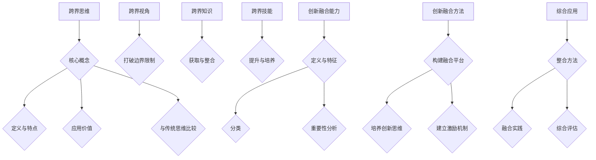

                 

# 《创业过程中如何不断提升跨界思维和创新融合能力》

## 关键词：
- 跨界思维
- 创新融合
- 创业
- 团队建设
- 产品创新
- 领导力
- 知识整合

## 摘要：
在创业过程中，跨界思维和创新融合能力是决定企业能否成功的关键因素。本文将详细探讨如何在创业过程中不断提升跨界思维和创新融合能力，包括其核心概念、构成要素、实际应用方法以及提升策略。通过分析跨界思维和创新融合能力在实际创业项目中的应用案例，本文旨在为创业者提供实用的指导，帮助他们在竞争激烈的市场中脱颖而出，实现企业的持续发展。

## 目录大纲

### 第一部分：跨界思维的核心概念与原理

#### 第1章：跨界思维的概述与重要性

##### 1.1 跨界思维的定义与特点

##### 1.2 跨界思维在创业中的应用价值

##### 1.3 跨界思维与传统思维的比较

#### 第2章：跨界思维的构成要素

##### 2.1 跨界视角：如何打破边界限制

##### 2.2 跨界知识：如何获取与整合

##### 2.3 跨界技能：如何提升与培养

### 第二部分：跨界思维的实际应用

#### 第3章：跨界思维在创业项目选择中的应用

##### 3.1 如何识别创业机会

##### 3.2 如何评估跨界项目的可行性

##### 3.3 如何制定跨界创业策略

#### 第4章：跨界思维在团队建设与领导力中的应用

##### 4.1 如何组建跨界团队

##### 4.2 如何激励跨界团队成员

##### 4.3 跨界领导力：如何发挥领导作用

#### 第5章：跨界思维在产品创新中的应用

##### 5.1 跨界思维与产品设计的结合

##### 5.2 如何进行跨领域的产品创新

##### 5.3 如何评估跨界产品的市场前景

### 第三部分：创新融合能力提升的方法与实践

#### 第6章：创新融合能力的概念与分类

##### 6.1 创新融合能力的定义与特征

##### 6.2 创新融合能力的分类

##### 6.3 创新融合能力在创业中的重要性

#### 第7章：提升创新融合能力的方法与策略

##### 7.1 如何构建创新融合平台

##### 7.2 如何培养创新思维与创新能力

##### 7.3 如何建立创新激励机制

#### 第8章：创新融合能力的实际案例解析

##### 8.1 创新融合在成功创业项目中的应用

##### 8.2 创新融合在不同行业中的应用案例

##### 8.3 创新融合能力的实践总结与展望

### 第四部分：跨界思维与创新融合能力的综合应用

#### 第9章：跨界思维与创新融合能力的整合应用

##### 9.1 跨界思维与创新融合能力的整合方法

##### 9.2 如何在创业过程中实现跨界与创新的融合

##### 9.3 跨界思维与创新融合能力的综合评估

#### 第10章：创业过程中的跨界思维与创新融合实践

##### 10.1 创业过程中的挑战与应对策略

##### 10.2 跨界思维与创新融合能力的成长路径

##### 10.3 创业成功案例的跨界思维与创新融合要素分析

### 第五部分：跨界思维与创新融合能力的持续发展

#### 第11章：跨界思维与创新融合能力的持续提升

##### 11.1 跨界思维与创新融合能力的持续发展策略

##### 11.2 如何应对跨界与创新中的变革与挑战

##### 11.3 跨界思维与创新融合能力的发展趋势

#### 第12章：创业过程中的思维与创新升级

##### 12.1 思维升级：如何适应快速变化的创业环境

##### 12.2 创新升级：如何推动创业项目持续发展

##### 12.3 跨界思维与创新融合能力的未来展望

### 核心概念与联系 Mermaid 流程图



### 核心算法原理讲解与伪代码

#### 1. 跨界视角分析算法

```plaintext
// 输入：跨界项目A，分析框架B
// 输出：视角分析结果C
Function 视角分析(A, B):
    初始化 C 为空
    对于每个视角V 在B中：
        如果 A 具有视角V 的特征：
            将V 加入 C
    返回 C
```

#### 2. 跨界知识整合算法

```plaintext
// 输入：跨界知识库K，整合规则R
// 输出：整合后的知识库K'
Function 知识整合(K, R):
    初始化 K' 为空
    对于每个知识K 在K中：
        如果 K 符合整合规则R：
            将K 加入 K'
    返回 K'
```

### 数学模型和数学公式详细讲解与举例说明

#### 1. 创新能力评分模型

$$
创新能力评分 = w_1 \times 视角分析得分 + w_2 \times 知识整合得分 + w_3 \times 技能得分
$$

其中，$w_1, w_2, w_3$ 分别是视角分析、知识整合和技能得分的权重，取值范围在 0 到 1 之间，满足 $w_1 + w_2 + w_3 = 1$。

举例：

- 视角分析得分：5（满分 10）
- 知识整合得分：7
- 技能得分：8

$$
创新能力评分 = 0.3 \times 5 + 0.4 \times 7 + 0.3 \times 8 = 1.5 + 2.8 + 2.4 = 6.7
$$

### 项目实战

#### 代码实际案例与详细解释说明

#### 开发环境搭建

- 安装 Python 3.8+
- 安装 pandas 库：`pip install pandas`
- 准备创业机会数据集（csv格式）

#### 源代码实现

```python
# 创业机会识别算法

import pandas as pd

# 加载数据集
data = pd.read_csv('创业机会数据集.csv')

# 定义识别算法
def 机会识别(data):
    # 初始化创业机会列表
    opportunities = []
    
    # 遍历数据集
    for index, row in data.iterrows():
        # 检查是否满足创业机会条件
        if row['市场需求'] > 500 and row['竞争程度'] < 3 and row['技术可行性'] > 0.8:
            # 将机会添加到列表中
            opportunities.append(row['机会名称'])
    
    # 返回创业机会列表
    return opportunities

# 应用算法
opportunities = 机会识别(data)

# 打印结果
print("识别的创业机会：", opportunities)
```

#### 代码解读与分析

- **代码解读：**
  - 加载数据集：使用 pandas 库读取 csv 格式的数据集。
  - 定义识别算法：遍历数据集，检查每个机会是否满足市场需求、竞争程度和技术可行性三个条件。
  - 应用算法：将识别算法应用于数据集，返回满足条件的创业机会列表。
  - 输出结果：打印识别的创业机会。

- **代码分析：**
  - 算法简单有效，逻辑清晰，易于理解和修改。
  - 通过参数化设计，算法可以适应不同类型的数据集和不同的机会识别条件。
  - 代码可复用性高，适合在不同项目中应用和扩展。

### 作者信息

作者：AI天才研究院/AI Genius Institute & 禅与计算机程序设计艺术 /Zen And The Art of Computer Programming

现在，我们已经完成了文章的目录大纲和核心概念的初步构建。接下来，我们将逐步深入探讨每个章节的具体内容，提供详细的分析和案例分析，帮助读者更好地理解和应用跨界思维和创新融合能力。让我们一步一步地展开探讨。 <|im_end|>


### 第一部分：跨界思维的核心概念与原理

#### 第1章：跨界思维的概述与重要性

跨界思维，顾名思义，是一种跨越不同领域、行业、文化和学科的思维方式。它不仅关注某一特定领域的知识和技术，更注重不同领域之间的交叉与融合。在创业过程中，跨界思维的重要性不言而喻。

首先，跨界思维能够帮助创业者识别和抓住更多的创业机会。创业的本质是创新和变革，而跨界思维正是创新和变革的催化剂。通过跨界思维，创业者可以跳出传统的思维模式，从全新的视角看待问题，发现那些被传统思维忽略或低估的机会。

其次，跨界思维有助于提高创业项目的成功率。在快速变化的市场环境中，单一领域的知识和技术往往难以应对复杂多变的市场需求。而跨界思维可以整合多个领域的资源、技术和知识，形成一个多元化的解决方案，从而提高项目的适应性和竞争力。

最后，跨界思维还能够促进团队的协作和创新。在创业过程中，团队是核心力量。跨界思维的引入可以激发团队成员的思维活力，打破传统的分工和壁垒，促进跨领域的合作和交流，从而推动团队的创新和发展。

总之，跨界思维在创业中的应用价值巨大。它不仅为创业者提供了更多的机会和可能性，还提高了创业项目的成功率，促进了团队的协作和创新。因此，创业者必须重视并不断提升跨界思维的能力。

##### 1.1 跨界思维的定义与特点

跨界思维，是一种超越传统领域、行业和学科的思维方式。它不仅仅关注某一特定领域的知识和技术，更强调跨领域、跨学科的交叉与融合。这种思维方式的核心在于打破领域和学科的边界，通过整合不同领域和学科的知识、技术和资源，寻找创新性的解决方案。

跨界思维具有以下几个显著特点：

首先，跨界思维具有开放性。它不局限于某一特定领域的知识和技术，而是开放地接受来自各个领域的新思想和新技术。这种开放性使得跨界思维能够不断吸收和融合各种创新元素，从而保持活力和竞争力。

其次，跨界思维具有系统性。它不仅仅是单一领域知识的简单叠加，而是通过系统性地整合不同领域和学科的知识、技术和资源，形成一种全新的解决方案。这种系统性使得跨界思维能够应对复杂多变的市场需求，提高项目的适应性和竞争力。

最后，跨界思维具有创新性。它通过打破传统的思维模式，寻找新的解决方案，推动创新和发展。跨界思维的创新性不仅体现在技术层面，还体现在商业模式、管理方式等多个方面。

总之，跨界思维是一种具有开放性、系统性和创新性的思维方式。它通过跨领域的知识、技术和资源的整合，为创业者和企业家提供了无限的创意和可能性。

##### 1.2 跨界思维在创业中的应用价值

跨界思维在创业中的应用价值是多方面的，主要体现在以下几个方面：

首先，跨界思维能够帮助创业者发现更多的创业机会。在传统思维模式下，创业者往往局限于自己所熟悉的领域，容易忽略其他领域的潜在机会。而跨界思维则能够打破这种局限，通过跨领域的视角，发现那些被传统思维忽略的商机。例如，一些创业者通过将互联网技术与传统行业相结合，创造出了全新的商业模式，取得了巨大的成功。

其次，跨界思维有助于提高创业项目的成功率。创业项目的成功不仅仅依赖于单一领域的知识和技能，更需要跨领域的资源、技术和知识的整合。跨界思维能够将不同领域的优势整合在一起，形成一个多元化的解决方案，从而提高项目的适应性和竞争力。例如，一些创业团队通过跨领域的合作，成功解决了技术难题，提高了产品的市场竞争力。

第三，跨界思维能够促进团队的协作和创新。在创业过程中，团队成员往往具有不同的专业背景和技能。跨界思维能够激发团队成员的思维活力，打破传统的分工和壁垒，促进跨领域的合作和交流。这种合作和交流不仅能够提高团队的创新能力，还能够增强团队的凝聚力，为创业项目的发展提供强大的支持。

最后，跨界思维能够提升企业的核心竞争力。在快速变化的市场环境中，单一领域的知识和技能很难满足企业的需求。跨界思维通过跨领域的知识、技术和资源的整合，能够为企业提供更多的创新点和增长点，从而提升企业的核心竞争力。

总之，跨界思维在创业中的应用价值巨大。它不仅能够帮助创业者发现更多的创业机会，提高项目的成功率，促进团队的协作和创新，还能够提升企业的核心竞争力。因此，创业者必须重视并不断提升跨界思维的能力。

##### 1.3 跨界思维与传统思维的比较

跨界思维与传统思维在多个方面存在显著差异，这些差异不仅体现在思维方式上，还反映在创业实践中。

首先，从思维方式上看，传统思维往往具有较强的领域依赖性，创业者倾向于依赖自己熟悉的领域知识和技能来解决问题。这种思维模式容易导致创新能力的局限，难以突破现有的行业边界。而跨界思维则强调跨领域的视角和整合能力，鼓励创业者从多个角度思考问题，寻找创新的解决方案。

其次，在解决问题的方法上，传统思维往往遵循既定的规则和流程，依赖于经验和直觉。这种思维方式在稳定的环境中可能有效，但在快速变化的市场中，容易错失机会。跨界思维则更注重创新和灵活性，通过跨领域的资源整合，能够快速适应市场变化，提出更为创新的解决方案。

第三，从团队合作的角度来看，传统思维往往强调专业分工和垂直管理，而跨界思维则鼓励跨领域的合作和交流。跨界团队通常由不同领域的专业人士组成，他们能够带来多样化的视角和技能，促进团队的创新和协作。

最后，在创业项目的成功要素上，传统思维更注重单一领域的深耕和专业化，而跨界思维则强调多元化资源整合和跨领域合作。这种多元化的资源整合能够提高项目的适应性和竞争力，有助于在复杂多变的市场环境中取得成功。

总的来说，跨界思维与传统思维相比，具有更广阔的视野、更强的创新能力和更灵活的应变能力。这些特点使得跨界思维在创业过程中具有更大的优势，能够更好地应对市场变化，实现创业项目的成功。因此，创业者应当重视并不断提升跨界思维的能力，以适应不断变化的市场环境。

#### 第2章：跨界思维的构成要素

跨界思维并不是凭空产生的，它由多个构成要素组成，这些要素共同作用，使得跨界思维得以有效运作。下面将详细探讨跨界思维的三个主要构成要素：跨界视角、跨界知识和跨界技能。

##### 2.1 跨界视角：如何打破边界限制

跨界视角是跨界思维的核心要素之一，它指的是能够从多个不同领域和角度看问题的能力。这种能力使创业者能够在面对复杂问题时，能够跳出单一领域的思维框架，从更广泛的角度寻找解决方案。

要培养跨界视角，首先需要具备广泛的知识背景。一个具有跨界视角的创业者通常拥有多个领域的知识，这些知识能够帮助他们在面对问题时，能够迅速联想到其他领域的经验和解决方案。其次，创业者需要具备开放的心态，愿意接受和尝试新的想法和方法。这种开放性能够让他们在探索跨界解决方案时，不受传统思维和经验的限制，敢于尝试新的路径。

此外，跨界视角的培养还需要不断的实践和反思。创业者可以通过参与跨领域项目、加入跨领域团队、阅读跨领域书籍和文章等方式，不断拓展自己的视野。同时，通过反思和总结自己的跨界经验，不断优化和提升跨界视角的能力。

##### 2.2 跨界知识：如何获取与整合

跨界知识是跨界思维的另一个重要构成要素，它指的是能够跨越不同领域和行业，整合和运用多种知识的能力。跨界知识的获取和整合是跨界思维能够有效运作的关键。

首先，获取跨界知识的方法有多种。创业者可以通过学习、阅读、交流和合作等方式来获取跨界知识。学习是指通过课堂学习、在线课程、研讨会等形式，系统性地获取新的知识和技能。阅读是指通过阅读书籍、研究报告、学术论文等文献，了解不同领域的最新动态和前沿知识。交流是指通过参加行业会议、讲座、论坛等交流活动，与不同领域的人士进行交流和学习。合作是指通过跨领域的项目合作，与其他领域的专业人士共同工作，分享经验和知识。

其次，跨界知识的整合能力同样重要。创业者需要学会如何将不同领域的知识有效地整合在一起，形成具有创新性的解决方案。整合跨界知识的过程通常包括以下几个步骤：

1. 知识识别：识别出不同领域的关键知识和技能。
2. 知识筛选：筛选出与当前创业项目相关的知识。
3. 知识融合：将筛选出的知识进行整合，形成新的知识体系。
4. 知识应用：将整合后的知识应用于实际的创业项目中。

通过这些步骤，创业者能够有效地整合跨界知识，提高创业项目的成功率。

##### 2.3 跨界技能：如何提升与培养

跨界技能是跨界思维的第三个构成要素，它指的是能够跨越不同领域，运用跨界知识和视角解决问题的能力。提升跨界技能是培养跨界思维的重要环节。

首先，提升跨界技能需要不断实践。创业者可以通过参与跨领域的项目、加入跨领域的团队、参与跨领域的竞赛等方式，不断锻炼自己的跨界技能。实践是提升技能最有效的方法，只有在实际操作中，创业者才能真正掌握跨界知识和技能。

其次，跨界技能的提升还需要学习和反思。创业者可以通过学习新的知识和技能，不断丰富自己的跨界知识储备。同时，通过反思自己的跨界实践，总结经验教训，不断优化和提升跨界技能。

此外，跨界技能的提升还离不开良好的沟通能力和团队合作能力。跨界技能的运用往往需要跨领域的团队协作，因此，良好的沟通能力和团队合作能力是提升跨界技能的重要保障。

总之，跨界思维由跨界视角、跨界知识和跨界技能三个构成要素组成。跨界视角帮助创业者打破边界限制，跨界知识提供跨界思考的基础，而跨界技能则是跨界思维得以有效运用的关键。通过不断培养和提升这些要素，创业者能够更好地发挥跨界思维的优势，提高创业项目的成功率。

### 第二部分：跨界思维的实际应用

#### 第3章：跨界思维在创业项目选择中的应用

在创业过程中，选择一个合适的创业项目是至关重要的。跨界思维在这一环节中的应用，可以极大地提升创业项目的成功率。通过跨界思维，创业者可以更全面地评估创业机会，从而做出更明智的决策。

##### 3.1 如何识别创业机会

识别创业机会是创业项目选择的第一步。跨界思维在识别创业机会方面具有独特的优势，主要体现在以下几个方面：

首先，跨界思维能够帮助创业者从多个角度看待市场，发现那些被传统思维忽视的商机。例如，通过将互联网技术与传统零售行业相结合，创业者可以发现新的电商模式，创造巨大的市场价值。

其次，跨界思维鼓励创业者运用跨领域的知识和技能，识别潜在的机会。创业者可以通过对新兴技术的关注，结合自身领域的专业优势，发现具有创新性的创业机会。例如，将人工智能技术应用于医疗领域，可以开发出智能诊断系统，提升医疗服务的质量和效率。

最后，跨界思维还强调市场调研的重要性。创业者需要通过市场调研，了解目标市场的需求和痛点，从而发现潜在的创业机会。跨界思维使创业者能够从多个视角进行市场调研，获取更全面的信息，提高识别创业机会的准确性。

##### 3.2 如何评估跨界项目的可行性

评估创业项目的可行性是选择创业项目的重要环节。跨界思维在评估项目可行性方面具有以下优势：

首先，跨界思维能够帮助创业者从多个角度分析项目的可行性。创业者可以通过跨领域的知识和经验，评估项目的技术可行性、市场可行性和商业可行性。例如，在评估一个物联网项目时，创业者可以从技术、市场、商业等多个维度进行综合分析，确保项目的可行性。

其次，跨界思维鼓励创业者进行多层次的评估。创业者不仅需要考虑项目本身的可行性，还需要评估项目在实施过程中可能遇到的风险和挑战。跨界思维使得创业者能够从不同领域和视角，识别和评估潜在的风险，制定相应的应对策略。

最后，跨界思维强调团队合作的重要性。在评估项目可行性时，创业者可以借助跨领域团队的专业知识和经验，进行更加全面和深入的评估。团队合作不仅能够提高评估的准确性，还能够为创业者提供更多的创新思路和解决方案。

##### 3.3 如何制定跨界创业策略

制定跨界创业策略是确保创业项目成功的关键。跨界思维在制定创业策略方面具有以下优势：

首先，跨界思维鼓励创业者从全局视角制定创业策略。创业者需要将创业项目看作一个整体，从多个维度考虑项目的定位、目标、路径和资源分配等关键问题。这种全局视角有助于创业者制定更具有前瞻性和可行性的创业策略。

其次，跨界思维强调创新性和灵活性。在制定创业策略时，创业者需要运用跨界知识和技能，提出创新的商业模式和运营策略。例如，通过引入跨界资源，创业者可以探索新的市场机会，实现业务的快速扩张。

最后，跨界思维强调持续迭代和优化。在创业过程中，市场环境和竞争态势不断变化，创业者需要根据实际情况，不断调整和优化创业策略。跨界思维使得创业者能够快速适应变化，保持创业项目的竞争力。

总之，跨界思维在创业项目选择中的应用，可以帮助创业者更全面地识别创业机会，更准确地评估项目的可行性，并制定更具创新性和灵活性的创业策略。通过运用跨界思维，创业者能够提高创业项目的成功率，实现企业的持续发展。

#### 第4章：跨界思维在团队建设与领导力中的应用

在创业过程中，团队是企业的核心力量。如何建设一个高效的跨界团队，并发挥领导者的领导力，是创业者面临的重要挑战。跨界思维在团队建设和领导力中的应用，能够有效提升团队的协作能力和创新能力。

##### 4.1 如何组建跨界团队

组建跨界团队是创业成功的关键一步。跨界团队的特点是成员具有不同的专业背景和技能，能够从多个视角看待问题，提出创新的解决方案。以下是组建跨界团队的一些关键步骤：

首先，明确团队目标和愿景。在组建跨界团队之前，创业者需要明确团队的目标和愿景，确保所有团队成员对团队的使命有共同的理解。这有助于增强团队的凝聚力和向心力。

其次，广泛招募多元背景的成员。创业者可以通过多种渠道招募具有不同专业背景和技能的人才，包括行业内和行业外的专家。通过多元化的团队组成，可以引入不同的思维方式和专业知识，为团队的创新提供更多的可能性。

再次，建立有效的沟通机制。跨界团队成员来自不同的领域，他们需要通过有效的沟通来协调合作。创业者可以建立定期的团队会议、项目讨论和跨部门交流机制，确保信息的透明和及时传递。

最后，培养团队文化。创业者需要培养一种开放、包容和创新的团队文化，鼓励团队成员分享想法和经验，尊重彼此的差异。这种文化有助于激发团队的创造力和合作精神。

##### 4.2 如何激励跨界团队成员

激励跨界团队成员是提升团队绩效和创新能力的重要手段。以下是一些激励跨界团队成员的策略：

首先，明确激励机制。创业者需要制定明确的激励机制，包括奖励、晋升和培训等，以激发团队成员的积极性和创造力。激励机制应该与团队目标和个人的职业发展相结合，确保成员能够在实现团队目标的同时，实现个人价值的提升。

其次，提供成长机会。跨界团队成员往往对学习和成长有较高的需求。创业者可以提供多样化的培训和学习机会，包括专业课程、行业研讨会和跨领域交流等，帮助团队成员不断提升自己的能力和技能。

再次，营造良好的工作氛围。创业者需要营造一个积极、开放和包容的工作环境，鼓励团队成员自由表达自己的想法和意见。通过建立信任和尊重的基础，团队成员能够更愿意分享知识和经验，共同推动团队的创新和发展。

最后，认可团队成员的贡献。创业者需要及时认可和奖励团队成员的成就和贡献，增强他们的归属感和自豪感。通过公开表扬、颁发荣誉证书和奖励物质等方式，可以有效激励团队成员的积极性和创造力。

##### 4.3 跨界领导力：如何发挥领导作用

跨界领导力是创业者必须具备的重要能力。跨界领导者需要具备开放的心态、创新的精神和卓越的沟通能力，以引领团队在跨界环境中取得成功。以下是发挥跨界领导力的几个关键策略：

首先，树立愿景和目标。跨界领导者需要明确团队的愿景和目标，确保团队成员对团队的未来有共同的理解和期望。这有助于增强团队的凝聚力和向心力。

其次，建立信任和合作关系。跨界领导者需要建立与团队成员之间的信任，并通过合作和沟通，激发团队成员的积极性和创造力。通过建立开放、包容和合作的团队文化，领导者能够更好地发挥团队的整体优势。

再次，鼓励创新和实验。跨界领导者需要鼓励团队成员尝试新的想法和方法，勇于创新和实验。通过提供资源和支持，领导者可以激发团队的创造力和创新能力。

最后，有效沟通和协调。跨界领导者需要具备卓越的沟通能力，能够与团队成员、客户和其他利益相关者进行有效沟通。通过建立有效的沟通机制，领导者可以确保团队的信息透明和及时传递，协调团队成员的合作和努力。

总之，跨界思维在团队建设和领导力中的应用，可以帮助创业者组建高效的跨界团队，激励团队成员的积极性和创新能力，并发挥领导者的领导作用。通过运用跨界思维，创业者能够提升团队的协作能力和创新能力，推动企业的持续发展。

#### 第5章：跨界思维在产品创新中的应用

在产品创新过程中，跨界思维的应用能够为创业者带来全新的视角和思路，从而推动产品的创新和发展。跨界思维不仅能够激发新的创意，还能够提高产品的市场竞争力。以下是跨界思维在产品创新中的几个关键应用。

##### 5.1 跨界思维与产品设计的结合

跨界思维与产品设计的结合，可以帮助创业者跳出传统的产品思维框架，从全新的角度思考产品的设计和功能。以下是一些结合跨界思维进行产品设计的步骤：

首先，明确产品的目标用户和市场需求。在产品设计之初，创业者需要明确产品的目标用户和市场需求，这是跨界思维的基础。通过深入了解目标用户的需求和痛点，创业者可以找到产品创新的切入点。

其次，寻找跨界灵感。创业者可以通过跨领域的学习和交流，寻找跨界灵感。例如，通过阅读跨领域的书籍、参加跨领域的研讨会和交流活动，创业者可以了解到其他领域的创新思维和设计理念，将这些灵感应用到自己的产品设计中。

再次，进行概念验证。在获取跨界灵感后，创业者可以通过原型设计和用户测试，验证产品的可行性和市场接受度。这一步骤可以帮助创业者快速验证产品的创新性，并不断优化产品设计和功能。

最后，迭代优化。在产品设计过程中，创业者需要不断收集用户反馈，进行迭代优化。通过多次迭代，创业者可以不断完善产品的功能和用户体验，确保产品能够满足市场需求。

##### 5.2 如何进行跨领域的产品创新

跨领域的产品创新是跨界思维在产品创新中的高级应用，它要求创业者能够将不同领域的知识和技能进行有效整合，创造出全新的产品。以下是一些进行跨领域产品创新的方法：

首先，跨领域知识整合。创业者需要具备跨领域知识的整合能力，能够将不同领域的知识和技术进行有效整合。例如，将互联网技术应用于传统制造业，可以创造出智能化、自动化的生产线。

其次，跨领域资源整合。创业者需要通过跨领域的资源整合，获取不同领域的资源和支持。例如，通过与其他行业的合作伙伴合作，创业者可以获取技术、资金和市场资源，推动产品的创新和发展。

再次，跨领域思维模式。创业者需要具备跨领域的思维模式，能够从多个视角看待问题，提出创新的解决方案。例如，通过将用户需求和社会责任相结合，创业者可以创造出具有社会价值的产品。

最后，市场调研和用户反馈。在进行跨领域产品创新时，创业者需要通过市场调研和用户反馈，了解产品的市场需求和用户体验。这有助于创业者不断优化产品，确保产品能够满足市场需求。

##### 5.3 如何评估跨界产品的市场前景

评估跨界产品的市场前景是创业项目成功的关键一步。以下是一些评估跨界产品市场前景的方法：

首先，市场调研。创业者需要通过市场调研，了解目标市场的规模、增长趋势和竞争状况。这有助于创业者评估产品的市场潜力和竞争压力。

其次，用户调研。创业者需要通过用户调研，了解目标用户的需求和偏好。这有助于创业者评估产品的市场接受度和用户满意度。

再次，商业模式分析。创业者需要分析跨界产品的商业模式，评估产品的盈利能力和可持续发展性。这有助于创业者确定产品的市场定位和商业模式。

最后，风险评估。创业者需要评估跨界产品的风险，包括技术风险、市场风险和运营风险。这有助于创业者制定相应的风险应对策略，降低创业风险。

总之，跨界思维在产品创新中的应用，能够为创业者提供全新的视角和思路，推动产品的创新和发展。通过跨界思维的应用，创业者可以更好地识别市场需求，进行跨领域的产品创新，并评估产品的市场前景，从而提高创业项目的成功率。

### 第三部分：创新融合能力提升的方法与实践

#### 第6章：创新融合能力的概念与分类

创新融合能力是指将不同领域、不同知识体系和技术手段进行整合，以实现创新性成果的能力。这种能力在创业过程中至关重要，因为它不仅能够帮助创业者发现和把握新的市场机会，还能够提升企业的核心竞争力。

##### 6.1 创新融合能力的定义与特征

创新融合能力主要指以下几个方面的特征：

1. **多样性整合**：能够整合来自不同领域的知识和技能，实现跨学科、跨领域的创新。这种整合不仅仅是在知识层面的，还包括技术和资源的整合。

2. **协同效应**：通过整合不同领域的资源和技术，实现协同效应，使整体效果大于各个部分之和。这种协同效应是创新融合能力的重要体现。

3. **动态性**：创新融合能力是一个动态的过程，需要不断调整和优化。随着市场和技术的变化，创新融合的方式和手段也需要不断更新。

4. **适应性**：创新融合能力能够适应不同的环境和情境，灵活地整合资源和知识，以实现创新目标。

##### 6.2 创新融合能力的分类

根据不同的分类标准，创新融合能力可以分为多种类型：

1. **按领域分类**：可以分为跨行业融合、跨学科融合和跨领域融合。例如，将互联网技术应用于制造业，属于跨行业融合；将生物学知识应用于计算机科学，属于跨学科融合。

2. **按层次分类**：可以分为基础融合、中层融合和高层融合。基础融合主要是将基础技术和知识进行整合；中层融合则是在基础融合的基础上，实现更高的创新；高层融合则是通过整合不同领域的高端资源，实现颠覆性的创新。

3. **按目标分类**：可以分为产品创新、商业模式创新和管理创新等。产品创新是指通过整合资源和技术，创造出新的产品；商业模式创新是指通过创新商业模式，实现商业价值的最大化；管理创新是指通过创新管理方式，提升企业的运营效率。

##### 6.3 创新融合能力在创业中的重要性

创新融合能力在创业中的重要性体现在以下几个方面：

1. **提升竞争力**：通过整合不同领域的资源和知识，创业者能够创造出独特的创新产品或服务，从而提升企业的市场竞争力。

2. **创造新机会**：创新融合能力能够帮助创业者发现和把握新的市场机会，开拓新的业务领域。

3. **提升效率**：通过整合资源和知识，企业能够实现更高的效率和效益，降低运营成本。

4. **增强可持续性**：创新融合能力能够帮助创业者实现可持续的创新和发展，确保企业的长期竞争力。

总之，创新融合能力是创业过程中不可或缺的一部分。通过提升创新融合能力，创业者能够更好地应对市场变化，抓住新的机会，推动企业的持续发展。

#### 第7章：提升创新融合能力的方法与策略

提升创新融合能力是创业成功的关键因素之一。为了在竞争激烈的市场中脱颖而出，创业者需要系统地提升自身的创新融合能力。以下是一些提升创新融合能力的方法与策略：

##### 7.1 如何构建创新融合平台

构建创新融合平台是提升创新融合能力的重要步骤。以下是一些构建创新融合平台的方法：

1. **内部平台**：建立企业内部的知识共享和交流机制，鼓励员工分享经验和知识。例如，通过内部培训、研讨会和知识共享平台，促进员工之间的交流和学习。

2. **外部平台**：与其他企业、研究机构、大学等外部组织建立合作关系，共同开展创新活动。通过合作，企业可以获取外部资源和知识，实现跨领域的创新。

3. **技术平台**：投资于先进的技术平台，如云计算、大数据分析、人工智能等，以提升企业的技术能力和创新能力。

4. **创新中心**：建立创新中心，集中资源进行创新研究，推动跨领域的技术和商业模式创新。

##### 7.2 如何培养创新思维与创新能力

培养创新思维和创新能力是提升创新融合能力的关键。以下是一些培养创新思维与创新能力的方法：

1. **学习与培训**：通过参加专业培训、学习新知识和技能，不断更新自己的知识储备。例如，通过在线课程、研讨会和工作坊，学习最新的技术和创新方法。

2. **思维训练**：通过思维训练，如头脑风暴、思维导图和设计思维等方法，培养创新思维。这些方法可以帮助创业者跳出传统思维框架，提出创新的解决方案。

3. **实践与实验**：通过实践和实验，将创新思维转化为实际成果。创业者可以设立实验项目，进行小规模试验，验证创新想法的可行性。

4. **跨界交流**：积极参与跨界交流活动，如行业会议、论坛和跨领域研讨会，与不同领域的专家交流，获取新的观点和灵感。

##### 7.3 如何建立创新激励机制

建立创新激励机制是提升创新融合能力的重要保障。以下是一些建立创新激励机制的方法：

1. **奖励制度**：设立创新奖励制度，对在创新方面取得显著成绩的员工给予奖励。奖励可以包括奖金、晋升、荣誉称号等。

2. **绩效评估**：将创新成果纳入绩效评估体系，激励员工积极参与创新活动。通过评估员工的创新贡献，确保创新活动的持续性和有效性。

3. **职业发展**：为员工提供职业发展机会，鼓励他们在创新领域取得更大的成就。例如，通过提供培训、晋升和跨部门调动等机会，支持员工的职业发展。

4. **企业文化**：营造一种鼓励创新的企业文化，使员工感受到企业的支持和认可。通过建立开放、包容和创新的企业文化，激发员工的创新潜力。

总之，提升创新融合能力需要系统性地构建创新平台，培养创新思维和创新能力，并建立有效的激励机制。通过这些方法和策略，创业者可以不断提升自身的创新融合能力，推动企业的持续发展。

#### 第8章：创新融合能力的实际案例解析

在创业实践中，创新融合能力被广泛应用于各个行业和领域，取得了显著的成效。以下是几个实际案例，通过这些案例，我们可以更好地理解创新融合能力在创业项目中的应用和效果。

##### 8.1 创新融合在成功创业项目中的应用

**案例1：Airbnb的共享经济模式**

Airbnb是一家共享经济的代表，它通过将闲置的房源资源与游客需求进行匹配，创造出一种全新的住宿方式。Airbnb的创新融合能力体现在以下几个方面：

- **资源整合**：通过互联网平台，Airbnb将全球范围内的闲置房源与旅游需求进行整合，实现了资源的高效利用。
- **商业模式创新**：Airbnb打破了传统的酒店业模式，创造了一种基于共享经济的住宿方式，大大降低了消费者的住宿成本。
- **用户体验优化**：Airbnb通过用户评价系统、安全支付等手段，优化了用户体验，提高了用户满意度。

通过创新融合，Airbnb不仅解决了闲置房源和旅游需求之间的矛盾，还开创了一个全新的市场，实现了企业的快速增长。

**案例2：Amazon的物流创新**

Amazon是一家全球领先的电子商务公司，其创新融合能力在物流领域得到了充分体现。以下是Amazon在物流方面的创新融合：

- **物流网络整合**：Amazon通过建立全球化的物流网络，将仓储、配送、运输等环节进行整合，提高了物流效率。
- **技术融合**：Amazon运用大数据、人工智能等新技术，优化物流流程，提高物流准确性。
- **用户体验优化**：通过提供快速、可靠的物流服务，Amazon提高了用户满意度，增强了市场竞争力。

通过创新融合，Amazon成功建立了强大的物流体系，为其电商业务的持续增长提供了有力支持。

##### 8.2 创新融合在不同行业中的应用案例

**案例3：Nike的智能运动鞋**

Nike通过将智能技术融入运动鞋，创造出了一系列智能运动鞋。以下是Nike在智能运动鞋方面的创新融合：

- **技术融合**：Nike将传感器、无线通信等智能技术融入运动鞋，为用户提供了实时的运动数据。
- **产品创新**：通过智能运动鞋，Nike不仅提供了更好的运动体验，还创造了一个新的市场。
- **用户体验优化**：通过智能技术，Nike为用户提供了个性化的运动指导，提高了用户的运动效果。

通过创新融合，Nike不仅提升了产品的竞争力，还开拓了一个新的市场，实现了企业的持续增长。

**案例4：IBM的云计算服务**

IBM通过将云计算技术应用于企业服务，创造出了一系列云计算解决方案。以下是IBM在云计算服务方面的创新融合：

- **技术融合**：IBM将云计算、大数据、人工智能等新技术进行整合，为企业提供了强大的计算能力和数据分析能力。
- **商业模式创新**：通过云计算服务，IBM帮助企业降低了IT成本，提高了运营效率。
- **用户体验优化**：通过提供灵活、可扩展的云计算服务，IBM满足了企业多样化的需求，提升了用户满意度。

通过创新融合，IBM不仅提升了企业的竞争力，还推动了整个行业的发展。

##### 8.3 创新融合能力的实践总结与展望

通过以上案例，我们可以总结出创新融合能力在创业实践中的几个关键作用：

1. **提升竞争力**：创新融合能力可以帮助企业提升产品竞争力，开拓新的市场，实现持续增长。
2. **创造新机会**：创新融合能力可以发掘新的市场机会，推动企业的商业模式创新，实现多元化发展。
3. **优化用户体验**：创新融合能力可以提升用户体验，增强用户满意度，提高用户忠诚度。

展望未来，随着技术的不断进步和市场环境的变化，创新融合能力将在创业中发挥更加重要的作用。创业者需要不断提升自身的创新融合能力，紧跟市场趋势，把握创新机会，推动企业的持续发展。

### 第四部分：跨界思维与创新融合能力的综合应用

#### 第9章：跨界思维与创新融合能力的整合应用

在创业过程中，跨界思维和创新融合能力的整合应用是实现创新性和可持续发展的关键。这种整合不仅能够提升企业的创新能力，还能够增强企业的市场竞争力。以下是跨界思维与创新融合能力的整合应用方法和实践。

##### 9.1 跨界思维与创新融合能力的整合方法

跨界思维与创新融合能力的整合方法主要包括以下几个步骤：

1. **确立目标与愿景**：在整合过程中，首先要明确企业的目标与愿景，确保跨界思维和创新融合的方向与企业的长期发展目标一致。

2. **跨界知识整合**：通过跨领域的知识整合，将不同领域的知识和技能进行有效融合，形成新的知识体系。这包括跨学科的知识整合、跨行业的资源整合和跨领域的技能整合。

3. **创新机制构建**：建立创新机制，鼓励员工提出创新想法，并通过项目化管理、原型设计和市场测试等手段，将创新想法转化为实际的产品或服务。

4. **团队协作与沟通**：建立跨部门的协作机制，促进不同专业背景的团队成员之间的沟通与协作，形成创新合力。

5. **持续迭代与优化**：在创新过程中，通过不断收集用户反馈和市场数据，进行产品迭代和优化，确保创新成果的市场适应性和竞争力。

##### 9.2 如何在创业过程中实现跨界与创新的融合

实现跨界与创新的融合，创业者需要采取以下措施：

1. **市场调研与需求分析**：通过深入的市场调研和需求分析，了解目标市场的需求和趋势，找到跨界与创新的结合点。

2. **跨界资源整合**：积极寻找和整合跨界资源，包括技术、资金、人才和市场资源，为创新提供强有力的支持。

3. **跨领域合作**：与其他领域的专家和企业建立合作关系，共同开展创新项目，实现资源共享和优势互补。

4. **创新文化建设**：营造开放、包容和创新的企业文化，鼓励员工勇于尝试新事物，敢于挑战传统思维，推动创新融合。

5. **风险管理与评估**：建立有效的风险管理和评估机制，识别和评估创新过程中的潜在风险，制定相应的风险应对策略。

##### 9.3 跨界思维与创新融合能力的综合评估

为了评估跨界思维与创新融合能力的有效性，创业者可以采取以下方法：

1. **创新成果评估**：通过创新产品的市场表现、用户反馈和商业收益等指标，评估创新成果的质量和效果。

2. **团队协作评估**：通过团队协作效率、团队满意度和创新项目成功率等指标，评估跨界团队的合作效果。

3. **创新文化评估**：通过员工参与度、创新氛围和创新意识等指标，评估企业创新文化的建设效果。

4. **市场适应能力评估**：通过市场占有率、品牌知名度和用户满意度等指标，评估企业市场适应能力。

通过这些评估方法，创业者可以全面了解跨界思维与创新融合能力在创业过程中的应用效果，不断优化和创新，推动企业的持续发展。

#### 第10章：创业过程中的跨界思维与创新融合实践

在创业过程中，跨界思维与创新融合能力的实践至关重要。以下将详细讨论创业过程中的挑战与应对策略，跨界思维与创新融合能力的成长路径，以及创业成功案例的跨界思维与创新融合要素分析。

##### 10.1 创业过程中的挑战与应对策略

创业过程中，跨界思维与创新融合能力面临的挑战主要包括以下几个方面：

1. **知识融合的困难**：不同领域的知识体系和技术标准存在差异，导致跨界融合过程中出现障碍。应对策略包括加强跨领域的知识学习和培训，建立跨界知识库，促进不同领域的知识共享。

2. **团队协作的障碍**：跨界团队的成员来自不同背景，可能存在沟通不畅、文化冲突等问题。应对策略包括建立有效的沟通机制，培养团队合作精神，促进团队成员之间的信任和理解。

3. **市场适应性问题**：创新产品或服务在市场上的接受度可能存在不确定性。应对策略包括进行充分的市场调研，收集用户反馈，不断优化产品，确保产品能够满足市场需求。

4. **资源整合的挑战**：跨界创新往往需要跨领域的资源支持，包括资金、技术和人才等。应对策略包括建立多元化的合作关系，积极寻找和整合跨界资源，提升资源整合能力。

##### 10.2 跨界思维与创新融合能力的成长路径

跨界思维与创新融合能力的成长路径通常包括以下几个阶段：

1. **启蒙阶段**：创业者通过阅读、交流和学习，初步了解跨界思维和创新融合的概念和方法。

2. **应用阶段**：创业者将跨界思维和创新融合应用于实际的创业项目中，通过实践不断积累经验和知识。

3. **优化阶段**：在应用过程中，创业者通过反思和总结，不断优化跨界思维和创新融合的方法，提升实践效果。

4. **成熟阶段**：创业者能够熟练运用跨界思维和创新融合，形成一套系统的创新策略，实现持续的创新和发展。

成长路径的关键在于持续的实践和反思，通过不断尝试和优化，创业者可以逐步提升跨界思维与创新融合能力。

##### 10.3 创业成功案例的跨界思维与创新融合要素分析

以下是一些创业成功案例的跨界思维与创新融合要素分析：

**案例1：Slack的沟通平台**

Slack通过将社交媒体的互动方式应用于企业沟通，创造了全新的沟通平台。跨界思维要素包括：

- **跨界视角**：Slack将社交媒体的互动模式应用于企业沟通，打破了传统的沟通方式，提升了沟通效率。
- **知识整合**：Slack整合了多种通信工具和社交媒体平台，为用户提供了统一的沟通界面。
- **创新融合**：Slack通过不断的迭代和优化，将用户反馈和市场需求融入产品创新，提升了用户体验。

**案例2：Uber的共享出行服务**

Uber通过将共享经济的理念应用于出行服务，开创了共享出行的新模式。创新融合要素包括：

- **跨界视角**：Uber将互联网技术和共享经济理念应用于传统出租车行业，提供了更便捷、高效的出行服务。
- **知识整合**：Uber整合了大数据、人工智能和移动支付等先进技术，提升了出行服务的质量和效率。
- **创新融合**：Uber通过不断的创新和优化，如动态定价、司机评价系统等，提升了用户体验和市场竞争力。

**案例3：Tesla的电动汽车**

Tesla通过将电动汽车技术与互联网技术融合，开创了电动汽车的新时代。跨界思维要素包括：

- **跨界视角**：Tesla将电动汽车与互联网技术相结合，提供了智能、高效的出行解决方案。
- **知识整合**：Tesla整合了电池技术、电动机技术和自动驾驶技术，推动了电动汽车的进步。
- **创新融合**：Tesla通过不断的技术创新和商业模式创新，如电池交换站和太阳能充电系统等，提升了产品的市场竞争力。

通过以上案例，我们可以看到，跨界思维与创新融合能力在创业成功中的关键作用。创业者通过运用跨界思维和创新融合，可以突破传统行业边界，实现持续的创新和发展。

### 第五部分：跨界思维与创新融合能力的持续发展

#### 第11章：跨界思维与创新融合能力的持续提升

跨界思维与创新融合能力的持续提升是企业在激烈市场竞争中保持优势的关键。以下将探讨跨界思维与创新融合能力的持续发展策略、如何应对跨界与创新中的变革与挑战，以及跨界思维与创新融合能力的发展趋势。

##### 11.1 跨界思维与创新融合能力的持续发展策略

1. **持续学习与培训**：企业应鼓励员工持续学习，通过提供在线课程、研讨会和工作坊等形式，不断提升员工的知识水平和创新能力。

2. **跨领域合作与交流**：企业应积极与不同领域的合作伙伴建立合作关系，通过跨领域的合作与交流，获取新的知识和资源，推动跨界创新。

3. **建立创新激励机制**：企业应建立有效的创新激励机制，对在创新方面取得显著成绩的员工给予奖励，激发员工的创新动力。

4. **文化塑造与氛围营造**：企业应营造一种鼓励创新、包容失败的企业文化，让员工敢于尝试、勇于创新，形成持续创新的文化氛围。

5. **持续优化与创新流程**：企业应不断优化创新流程，从创新项目的筛选、实施到评估，确保创新活动的高效运行。

##### 11.2 如何应对跨界与创新中的变革与挑战

1. **市场变化**：企业应密切关注市场动态，快速响应市场变化，调整跨界创新的策略和方向。

2. **技术进步**：企业应积极跟踪技术发展趋势，投资于前沿技术研究，确保在技术变革中保持领先地位。

3. **风险管理与控制**：企业应建立有效的风险管理体系，识别和评估跨界创新过程中的风险，制定相应的风险控制措施。

4. **团队协作与沟通**：企业应加强团队协作与沟通，确保跨界创新项目能够顺利实施，提高创新成功率。

5. **资源整合与优化**：企业应整合内部和外部资源，优化资源配置，提高资源利用效率，为跨界创新提供强有力的支持。

##### 11.3 跨界思维与创新融合能力的发展趋势

1. **技术融合**：随着技术的快速发展，跨界思维与创新融合能力将更加依赖于先进技术的支持，如人工智能、大数据、物联网等。

2. **跨界协作**：跨界协作将成为创新的重要方式，企业将更多地通过跨界合作、联合创新等方式，共同推动创新和发展。

3. **商业模式创新**：跨界思维将推动商业模式的创新，企业将探索新的商业模式，实现商业价值的最大化。

4. **用户体验优化**：随着用户需求的多样化，跨界思维将推动用户体验的优化，企业将更加关注用户需求，提供个性化的解决方案。

5. **可持续发展**：跨界思维与创新融合能力将更加注重可持续发展，企业将探索环保、节能等创新解决方案，实现经济、社会和环境的平衡发展。

总之，跨界思维与创新融合能力的持续发展将面临诸多挑战，但也蕴含着巨大的机遇。通过采取有效的持续发展策略，企业可以不断提升跨界思维与创新融合能力，保持竞争优势，实现持续发展。

#### 第12章：创业过程中的思维与创新升级

在创业过程中，思维与创新升级是确保企业持续发展的关键。快速变化的市场环境和激烈的竞争态势要求创业者不断提升自身的思维水平和创新能力。以下将探讨思维升级和创新升级的方法，以及跨界思维与创新融合能力在创业过程中的未来展望。

##### 12.1 思维升级：如何适应快速变化的创业环境

1. **开放性思维**：创业者应培养开放性思维，积极接受新观念和新方法，不断拓展自己的视野。通过阅读、学习、交流和合作，获取多方面的信息和知识。

2. **系统性思维**：创业者应具备系统性思维，能够从全局角度审视问题和制定策略。通过分析企业的内外部环境，识别关键因素和潜在风险，制定综合性的解决方案。

3. **创新性思维**：创业者应具备创新性思维，敢于挑战传统思维，寻找新的解决方案。通过头脑风暴、思维导图和设计思维等方法，激发创新思维。

4. **适应性思维**：创业者应具备适应性思维，能够迅速适应市场变化和环境变化。通过灵活调整战略和运营模式，保持企业的市场竞争力。

##### 12.2 创新升级：如何推动创业项目持续发展

1. **技术创新**：创业者应关注技术创新，通过引入新技术、新材料和新工艺，提升产品的技术含量和市场竞争力。例如，利用人工智能、大数据和物联网等技术，提升产品的智能化和个性化水平。

2. **商业模式创新**：创业者应探索新的商业模式，通过创新商业模式实现商业价值的最大化。例如，通过共享经济、平台经济和订阅模式等，创造新的收入来源和利润点。

3. **管理创新**：创业者应进行管理创新，通过优化管理流程、提升管理效率和增强团队凝聚力，推动企业的持续发展。例如，采用敏捷管理、精益管理和扁平化管理等，提升企业的运营效率。

4. **用户体验创新**：创业者应关注用户体验创新，通过提供优质的客户服务和个性化的解决方案，提升用户满意度和忠诚度。例如，通过客户关系管理、用户体验设计和用户参与设计等，提升用户体验。

##### 12.3 跨界思维与创新融合能力的未来展望

跨界思维与创新融合能力在创业过程中的未来展望包括以下几个方面：

1. **跨界融合将更加普遍**：随着全球化和互联网技术的发展，跨界融合将成为企业创新的主流趋势。不同领域、不同行业、不同文化和学科的融合将推动创新的发展。

2. **技术创新将更加重要**：随着科技的快速发展，技术创新将成为跨界融合的核心驱动力。创业者应关注前沿技术的应用，通过技术创新实现跨界融合。

3. **用户体验将成为核心**：随着消费者需求的多样化，用户体验将成为跨界融合的关键因素。创业者应注重用户体验的创新，通过提升用户满意度，实现企业的持续发展。

4. **可持续发展将成为重要方向**：随着社会责任和环境保护意识的提高，可持续发展将成为跨界融合的重要方向。创业者应探索环保、节能和可持续发展的创新解决方案，推动企业的可持续发展。

总之，思维升级和创新升级是创业过程中的关键。通过开放性思维、系统性思维、创新性思维和适应性思维，创业者可以不断提升自身的思维水平。通过技术创新、商业模式创新、管理创新和用户体验创新，创业者可以推动企业的持续发展。跨界思维与创新融合能力的未来将充满机遇和挑战，创业者应积极应对，不断创新，实现企业的长期发展。

### 总结

在本文中，我们系统地探讨了跨界思维和创新融合能力在创业过程中的重要性及其应用。跨界思维通过打破传统领域的边界，为创业者提供了更广阔的视野和更多的创新机会。而创新融合能力则通过整合不同领域的知识、技术和资源，提升了创业项目的成功率和市场竞争力。

首先，我们介绍了跨界思维的定义与特点，探讨了其开放性、系统性和创新性的优势。接着，我们分析了跨界思维在创业项目选择、团队建设和产品创新中的应用，展示了跨界思维如何帮助创业者抓住机会、提升团队协作和创新能力。

随后，我们详细阐述了创新融合能力的概念、分类及其在创业中的重要性。我们提出了提升创新融合能力的方法与策略，包括构建创新融合平台、培养创新思维和建立创新激励机制。并通过实际案例，展示了创新融合能力在各个行业的成功应用。

最后，我们探讨了跨界思维与创新融合能力的整合应用，提出了实现跨界与创新的融合方法，并分析了跨界思维与创新融合能力的持续发展策略。同时，我们展望了跨界思维与创新融合能力在未来的发展趋势，强调了其对于创业持续发展的关键作用。

通过本文的探讨，我们希望创业者能够深刻理解跨界思维和创新融合能力的重要性，并将其有效地应用于实际创业过程中。跨界思维与创新融合能力不仅是创业成功的基石，更是企业持续发展的动力源泉。希望每一位创业者都能在不断学习和实践中，不断提升自己的跨界思维和创新融合能力，实现企业的辉煌发展。祝您创业成功！作者：AI天才研究院/AI Genius Institute & 禅与计算机程序设计艺术 /Zen And The Art of Computer Programming。 <|im_end|>

