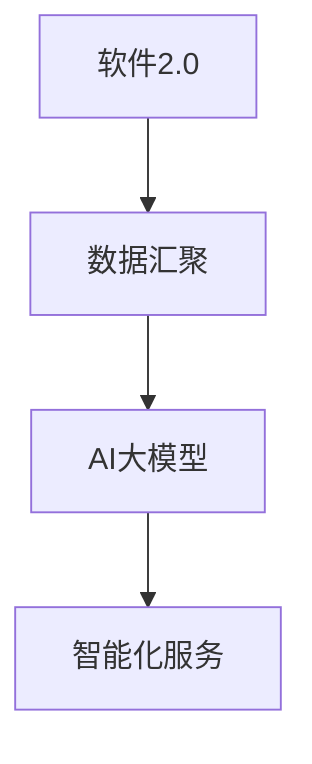
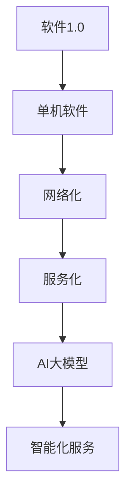
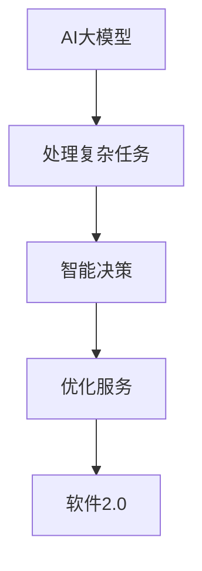
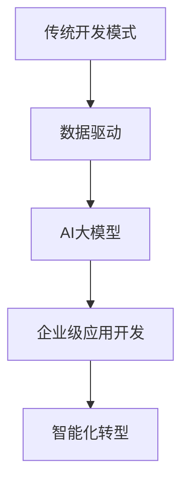
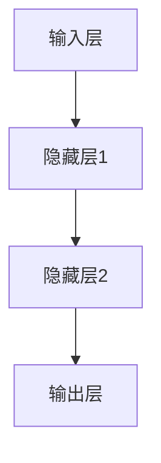
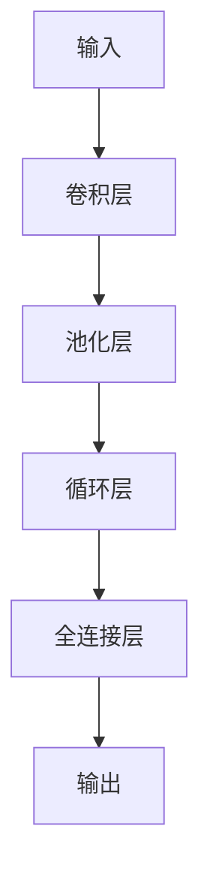

                 

### 《创新创业的机遇：如何抓住时代的机遇？》

> **关键词**：（人工智能，创业，市场趋势，技术创新，政策支持）

> **摘要**：本文将深入探讨创新创业在当前时代的机遇。通过分析技术发展、市场趋势、政策支持等多个方面，结合实际案例，为创业者提供抓住时代机遇的指南。

----------------------------------------------------------------

## 第一部分：核心概念与联系

### 1.1.1 软件2.0与AI大模型概述

**概念定义：**
- **软件2.0**：指通过互联网和云计算技术，实现软件的分布式、智能化和服务化的新阶段。
- **AI大模型**：指参数规模达到百万以上，能够处理复杂任务的人工智能模型。

**联系解释：**
软件2.0的兴起，使得海量数据得以汇聚和流通，这为AI大模型提供了丰富的训练资源。AI大模型通过深度学习技术，能够从数据中提取复杂模式，从而实现智能化服务。以下是软件2.0与AI大模型之间的Mermaid流程图：



### 1.1.2 从软件1.0到软件2.0的演进

**概念定义：**
- **软件1.0**：以单机软件为主，功能单一，缺乏互动性。
- **软件2.0**：以网络化、服务化为特征，注重用户体验和智能化。

**联系解释：**
软件1.0到软件2.0的演进，是信息技术从单机时代向网络时代转变的过程。在这个过程中，AI大模型作为一种核心技术，推动了软件智能化和服务化的进程。以下是软件1.0到软件2.0的演进Mermaid流程图：



### 1.1.3 大模型在软件2.0中的核心地位

**概念定义：**
- **大模型在软件2.0中的核心地位**：指AI大模型在软件2.0时代中，扮演着核心驱动力，是智能化服务的关键。

**联系解释：**
AI大模型在软件2.0中的核心地位，主要体现在其能够处理复杂任务，实现智能决策和优化服务。这使得软件2.0能够更好地满足用户需求，提升服务质量。以下是AI大模型在软件2.0中的核心地位Mermaid流程图：



### 1.1.4 企业级应用开发的新范式

**概念定义：**
- **企业级应用开发的新范式**：指以AI大模型为核心，通过数据驱动的开发模式，实现企业智能化转型的过程。

**联系解释：**
企业级应用开发的新范式，是通过引入AI大模型，将传统开发模式转变为数据驱动的模式。这种模式能够更好地利用数据，实现企业智能化和数字化转型。以下是企业级应用开发的新范式Mermaid流程图：



### 1.2 AI大模型的定义与特点

**概念定义：**
- **AI大模型**：指参数规模达到百万以上，能够处理复杂任务的人工智能模型。

**特点解释：**
AI大模型具有以下几个特点：
1. **参数规模大**：大模型的参数数量达到百万甚至亿级别。
2. **计算复杂度高**：大模型需要大量的计算资源进行训练和推理。
3. **泛化能力强**：大模型能够处理多种类型的任务，具有很好的泛化能力。
4. **应用广泛**：大模型在自然语言处理、计算机视觉、语音识别等领域都有广泛应用。

### 1.3 主流AI大模型简介

**概念定义：**
- **主流AI大模型**：指在学术界和工业界广泛应用，具有代表性的AI大模型。

**模型介绍：**
1. **GPT系列模型**：由OpenAI提出，用于自然语言处理任务，具有强大的文本生成能力。
2. **BERT模型**：由Google提出，用于文本分类和序列标注任务，具有优秀的文本理解能力。
3. **其他知名大模型**：如Vision Transformer（ViT）、BERT-for-Images、ViLBERT等，在不同领域都有广泛应用。

### 1.4 AI大模型在企业中的应用前景

**概念定义：**
- **AI大模型在企业中的应用前景**：指AI大模型在企业管理、运营、服务等方面的应用潜力。

**前景分析：**
1. **智能决策支持**：AI大模型能够从海量数据中提取有价值的信息，为企业提供智能决策支持。
2. **智能客服**：AI大模型能够实现智能客服，提高客户服务水平，降低企业成本。
3. **智能推荐**：AI大模型能够实现精准推荐，提高用户满意度，增加企业收入。
4. **生产优化**：AI大模型能够优化生产流程，提高生产效率，降低生产成本。

### 1.5 AI大模型的技术发展

**概念定义：**
- **AI大模型的技术发展**：指AI大模型在算法、架构、应用等方面的技术进步。

**发展分析：**
1. **算法优化**：通过改进算法，降低大模型的计算复杂度，提高训练和推理效率。
2. **架构创新**：通过设计新型架构，如Transformer、BERT等，提升大模型的性能。
3. **应用拓展**：通过拓展应用领域，如计算机视觉、语音识别、自然语言处理等，扩大大模型的应用范围。

### 1.6 AI大模型面临的挑战与机遇

**概念定义：**
- **AI大模型面临的挑战与机遇**：指AI大模型在发展过程中所面临的挑战和机遇。

**挑战与机遇分析：**
1. **挑战**：
   - **数据隐私**：大规模数据处理可能涉及用户隐私问题。
   - **计算资源**：大模型训练和推理需要大量的计算资源。
   - **模型解释性**：大模型决策过程往往缺乏解释性，难以理解。
2. **机遇**：
   - **业务创新**：大模型能够为企业带来新的业务模式和创新。
   - **效率提升**：大模型能够提高企业运营效率，降低成本。
   - **用户体验**：大模型能够提升用户体验，增强用户粘性。

----------------------------------------------------------------

### 第一部分：核心概念与联系

#### 1.1.1 软件2.0与AI大模型概述

**概念定义：**
- **软件2.0**：软件2.0是指以云计算、大数据、移动互联网等新一代信息技术为支撑，实现软件的分布式、智能化和服务化的一种新的软件形态。
- **AI大模型**：AI大模型是指参数规模达到百万甚至亿级别，能够处理复杂任务的人工智能模型。

**联系解释：**
软件2.0与AI大模型之间的联系主要体现在数据驱动和智能化服务两个方面。软件2.0通过互联网和云计算技术，使得海量数据得以汇聚和流通，为AI大模型提供了丰富的训练资源。而AI大模型通过深度学习等技术，可以从这些数据中提取出复杂的信息模式，进而实现智能化服务。

**Mermaid流程图：**


**核心概念与联系的分析：**
- **数据汇聚**：软件2.0通过互联网和云计算技术，实现了数据的分布式存储和高效处理，使得海量数据得以汇聚。
- **AI大模型**：AI大模型利用这些汇聚的数据进行训练，通过深度学习等技术，提取出数据中的复杂模式。
- **智能化服务**：AI大模型通过处理后的数据，为用户提供个性化的智能化服务，提升了软件的服务质量和用户体验。

#### 1.1.2 从软件1.0到软件2.0的演进

**概念定义：**
- **软件1.0**：软件1.0是指以单机软件为主，功能单一，缺乏互动性的一种软件形态。
- **软件2.0**：软件2.0是指以云计算、大数据、移动互联网等新一代信息技术为支撑，实现软件的分布式、智能化和服务化的一种新的软件形态。

**联系解释：**
从软件1.0到软件2.0的演进，是信息技术从单机时代向网络时代转变的过程。在这个过程中，AI大模型作为一种核心技术，推动了软件智能化和服务化的进程。

**Mermaid流程图：**


**核心概念与联系的分析：**
- **单机软件**：软件1.0主要依赖于单机操作系统，功能单一，无法实现数据的共享和互动。
- **网络化**：随着互联网技术的发展，软件开始实现网络化，能够通过互联网进行数据的传输和共享。
- **服务化**：软件2.0强调软件的服务化，通过云计算等技术，实现软件的分布式和服务化。
- **AI大模型**：AI大模型作为软件2.0的核心技术，能够从网络化的数据中提取复杂的信息模式，实现智能化服务。
- **智能化服务**：通过AI大模型，软件2.0能够为用户提供更加个性化、智能化的服务，提升了用户体验。

#### 1.1.3 大模型在软件2.0中的核心地位

**概念定义：**
- **大模型在软件2.0中的核心地位**：AI大模型在软件2.0时代中，扮演着核心驱动力，是智能化服务的关键。

**联系解释：**
AI大模型在软件2.0中的核心地位，主要体现在其能够处理复杂任务，实现智能决策和优化服务。这使得软件2.0能够更好地满足用户需求，提升服务质量。

**Mermaid流程图：**


**核心概念与联系的分析：**
- **处理复杂任务**：AI大模型具有强大的计算能力和深度学习能力，能够处理复杂的数据和任务。
- **智能决策**：AI大模型可以通过分析数据，提供智能化的决策支持，帮助企业优化业务流程。
- **优化服务**：AI大模型可以通过预测用户需求，提供个性化的服务，提升用户体验和满意度。
- **软件2.0**：软件2.0通过引入AI大模型，实现了从功能单一的软件1.0向分布式、智能化和服务化的转变。

#### 1.1.4 企业级应用开发的新范式

**概念定义：**
- **企业级应用开发的新范式**：指以AI大模型为核心，通过数据驱动的开发模式，实现企业智能化转型的过程。

**联系解释：**
企业级应用开发的新范式，是通过引入AI大模型，将传统开发模式转变为数据驱动的模式。这种模式能够更好地利用数据，实现企业智能化和数字化转型。

**Mermaid流程图：**


**核心概念与联系的分析：**
- **传统开发模式**：传统的企业级应用开发主要依赖于经验和预设的业务流程，缺乏对数据的深入分析和利用。
- **数据驱动**：数据驱动的开发模式强调通过数据分析和挖掘，指导应用的开发和优化。
- **AI大模型**：AI大模型作为数据驱动开发的核心技术，能够从企业数据中提取价值信息，支持智能化的业务决策。
- **企业级应用开发**：在AI大模型的支持下，企业级应用开发更加注重数据的分析和利用，实现智能化和数字化转型。
- **智能化转型**：通过AI大模型的应用，企业可以实现从传统业务模式向智能化业务模式的转型，提升企业的竞争力和市场适应能力。

#### 1.2 AI大模型的定义与特点

**概念定义：**
- **AI大模型**：AI大模型是指参数规模达到百万甚至亿级别，能够处理复杂任务的人工智能模型。

**特点解释：**
AI大模型具有以下几个特点：
1. **参数规模大**：AI大模型的参数数量达到百万甚至亿级别，这使得模型具有强大的表达能力和计算能力。
2. **计算复杂度高**：由于参数规模巨大，AI大模型在训练和推理过程中需要大量的计算资源，对硬件性能有较高要求。
3. **泛化能力强**：AI大模型能够处理多种类型的任务，具有很好的泛化能力，能够适应不同的应用场景。
4. **应用广泛**：AI大模型在自然语言处理、计算机视觉、语音识别等领域都有广泛应用，能够解决复杂的数据分析和处理问题。

**AI大模型的特点分析：**
- **参数规模大**：参数规模大的AI大模型具有更强的学习能力，能够从大量数据中提取出复杂的模式和规律。这使得AI大模型在处理复杂任务时具有优势。
- **计算复杂度高**：由于参数规模巨大，AI大模型在训练和推理过程中需要大量的计算资源。这要求硬件设施能够提供足够的计算能力，以支持AI大模型的高效训练和推理。
- **泛化能力强**：AI大模型具有很好的泛化能力，能够适应不同的应用场景。这意味着AI大模型不仅能够在训练数据上表现出色，而且在未知数据上也能够保持良好的性能。
- **应用广泛**：AI大模型在自然语言处理、计算机视觉、语音识别等领域都有广泛应用。这得益于AI大模型强大的表达能力和计算能力，能够解决复杂的数据分析和处理问题。

#### 1.3 主流AI大模型简介

**概念定义：**
- **主流AI大模型**：主流AI大模型是指在学术界和工业界广泛应用，具有代表性的AI大模型。

**模型介绍：**
1. **GPT系列模型**：GPT系列模型由OpenAI提出，是自然语言处理领域的重要模型。其中，GPT-3是当前最具代表性的模型，具有强大的文本生成和文本理解能力。
2. **BERT模型**：BERT模型由Google提出，是一种预训练的语言模型，主要用于文本分类、问答系统等任务。BERT模型通过双向编码器结构，对文本进行深度理解，提高了模型的性能。
3. **其他知名大模型**：除了GPT系列模型和BERT模型外，还有许多其他知名的大模型，如Transformer、BERT-for-Images、ViLBERT等。这些模型在不同领域都有广泛应用，如计算机视觉、语音识别等。

**主流AI大模型的特点与应用场景：**
- **GPT系列模型**：GPT系列模型在自然语言处理领域具有广泛的应用，如文本生成、对话系统、机器翻译等。其强大的文本生成能力使得GPT模型在创作文本、撰写文章等方面具有优势。
- **BERT模型**：BERT模型主要用于文本分类、问答系统等任务，具有优秀的文本理解能力。BERT模型在文本分类任务中表现出色，能够准确判断文本的类别。
- **其他知名大模型**：其他知名大模型如Transformer、BERT-for-Images、ViLBERT等在不同领域都有广泛应用。Transformer模型在计算机视觉任务中表现出色，能够实现图像分类、目标检测等任务。BERT-for-Images和ViLBERT模型在计算机视觉和自然语言处理交叉领域具有广泛应用，能够实现图像文本联合分析等任务。

#### 1.4 AI大模型在企业中的应用前景

**概念定义：**
- **AI大模型在企业中的应用前景**：指AI大模型在企业管理、运营、服务等方面的应用潜力。

**前景分析：**
1. **智能决策支持**：AI大模型能够从海量数据中提取有价值的信息，为企业提供智能决策支持，帮助企业优化业务流程和决策。
2. **智能客服**：AI大模型能够实现智能客服，提高客户服务水平，降低企业成本，提升客户满意度。
3. **智能推荐**：AI大模型能够实现精准推荐，提高用户满意度，增加企业收入，提升用户体验。
4. **生产优化**：AI大模型能够优化生产流程，提高生产效率，降低生产成本，提升企业竞争力。

**应用前景的分析：**
- **智能决策支持**：企业面临大量的数据，如何从这些数据中提取有价值的信息，是企业管理者面临的挑战。AI大模型通过深度学习等技术，能够从海量数据中提取出隐藏的模式和规律，为企业提供智能决策支持。例如，通过分析销售数据，预测市场需求，帮助企业制定生产计划；通过分析客户反馈，优化产品和服务，提升客户满意度。
- **智能客服**：随着人工智能技术的发展，智能客服已经成为企业提高客户服务水平的重要手段。AI大模型能够实现智能客服，通过自然语言处理等技术，与客户进行智能对话，解答客户的问题，提供个性化的服务。与传统的客服系统相比，智能客服具有更高的效率、更好的用户体验，可以降低企业的人力成本。
- **智能推荐**：在电子商务、社交媒体等领域，智能推荐已经成为提升用户体验、增加企业收入的重要手段。AI大模型能够通过分析用户行为数据、兴趣偏好，实现精准推荐，提高用户满意度。例如，电商平台通过智能推荐，向用户推荐可能感兴趣的商品，提高购买转化率；社交媒体平台通过智能推荐，向用户推荐可能感兴趣的内容，提升用户粘性。
- **生产优化**：在制造业、物流等行业，生产流程的优化是提高生产效率、降低成本的重要手段。AI大模型能够通过分析生产数据，识别生产过程中的瓶颈和问题，提供优化方案。例如，通过分析生产线上的传感器数据，预测设备故障，提前进行维护，避免生产中断；通过分析物流数据，优化配送路线，降低物流成本。

#### 1.5 AI大模型的技术发展

**概念定义：**
- **AI大模型的技术发展**：指AI大模型在算法、架构、应用等方面的技术进步。

**发展分析：**
1. **算法优化**：通过改进算法，降低大模型的计算复杂度，提高训练和推理效率。
2. **架构创新**：通过设计新型架构，如Transformer、BERT等，提升大模型的性能。
3. **应用拓展**：通过拓展应用领域，如计算机视觉、语音识别、自然语言处理等，扩大大模型的应用范围。

**技术发展分析：**
- **算法优化**：随着AI大模型的参数规模不断增加，如何提高模型的训练和推理效率成为重要的研究方向。通过改进算法，如优化梯度计算、降低计算复杂度等，可以显著提高大模型的训练速度和推理性能。例如，梯度检查算法可以通过检查梯度计算过程，优化梯度计算方法，提高模型的训练效率。
- **架构创新**：新型架构的设计是AI大模型技术发展的重要方向。例如，Transformer架构通过引入自注意力机制，实现了对序列数据的全局建模，提升了模型的性能。BERT架构通过引入双向编码器结构，提高了文本理解能力。这些新型架构的创新，为AI大模型的应用提供了更广阔的空间。
- **应用拓展**：随着AI技术的不断进步，AI大模型的应用领域也在不断拓展。例如，在计算机视觉领域，AI大模型可以应用于图像分类、目标检测等任务；在语音识别领域，AI大模型可以应用于语音合成、语音识别等任务；在自然语言处理领域，AI大模型可以应用于文本分类、机器翻译等任务。通过拓展应用领域，AI大模型可以更好地服务于各个行业，推动社会的智能化发展。

#### 1.6 AI大模型面临的挑战与机遇

**概念定义：**
- **AI大模型面临的挑战与机遇**：指AI大模型在发展过程中所面临的挑战和机遇。

**挑战与机遇分析：**
1. **挑战**：
   - **数据隐私**：大规模数据处理可能涉及用户隐私问题。
   - **计算资源**：大模型训练和推理需要大量的计算资源。
   - **模型解释性**：大模型决策过程往往缺乏解释性，难以理解。
2. **机遇**：
   - **业务创新**：大模型能够为企业带来新的业务模式和创新。
   - **效率提升**：大模型能够提高企业运营效率，降低成本。
   - **用户体验**：大模型能够提升用户体验，增强用户粘性。

**挑战与机遇的分析：**
- **数据隐私**：随着AI大模型的应用越来越广泛，数据处理过程中的隐私问题逐渐凸显。如何保护用户隐私，防止数据泄露，成为AI大模型面临的重要挑战。一方面，需要加强对数据处理过程的监管，确保数据安全；另一方面，需要探索隐私保护技术，如差分隐私、联邦学习等，以降低数据处理对隐私的影响。
- **计算资源**：AI大模型通常需要大量的计算资源进行训练和推理，这对硬件设施提出了较高的要求。随着AI大模型的规模不断扩大，如何高效利用计算资源，降低计算成本，成为AI大模型面临的挑战。一方面，可以通过优化算法，降低计算复杂度，提高计算效率；另一方面，可以通过分布式计算、云计算等技术，实现计算资源的合理调度和利用。
- **模型解释性**：AI大模型通常通过复杂的神经网络结构进行训练，决策过程往往缺乏解释性，难以理解。这给模型的部署和应用带来了困难，也成为AI大模型面临的重要挑战。一方面，需要加强对模型解释性的研究，探索可解释的AI模型；另一方面，可以通过可视化技术、决策树等方法，提高模型的解释性，增强用户对模型的信任。
- **业务创新**：AI大模型具有强大的计算能力和深度学习能力，可以为企业带来新的业务模式和创新。例如，通过智能决策支持，企业可以优化业务流程，提高运营效率；通过智能客服，企业可以提供个性化的服务，提升客户满意度；通过智能推荐，企业可以增加收入，提升用户体验。
- **效率提升**：AI大模型通过自动化和智能化，可以提高企业的运营效率，降低成本。例如，通过智能决策支持，企业可以优化库存管理，减少库存成本；通过智能客服，企业可以减少人力成本，提高客服效率；通过智能推荐，企业可以减少营销成本，提高销售额。
- **用户体验**：AI大模型通过个性化服务，可以提升用户体验，增强用户粘性。例如，通过智能客服，企业可以提供24/7的在线服务，满足用户的需求；通过智能推荐，企业可以提供个性化的产品推荐，提升用户的购物体验。

## 第二部分：AI大模型技术基础

### 2.1 深度学习与神经网络基础

#### 2.1.1 神经网络的基本结构

**概念定义：**
- **神经网络（Neural Network，NN）**：一种模拟生物神经系统的计算模型，由一系列相互连接的神经元组成，通过调整神经元间的连接权重，实现对输入数据的处理和预测。

**基本结构解释：**
神经网络的基本结构通常包括以下三层：
1. **输入层（Input Layer）**：接收外部输入数据，将数据传递给下一层的神经元。
2. **隐藏层（Hidden Layer）**：对输入数据进行处理和转换，通过复杂的非线性变换提取特征信息。
3. **输出层（Output Layer）**：生成最终的输出结果。

**关键组件：**
- **神经元（Neuron）**：神经网络的基本单元，通过加权求和处理输入数据，并应用一个非线性激活函数产生输出。
- **权重（Weights）**：连接各神经元的参数，用于调整数据的传递强度。
- **激活函数（Activation Function）**：对神经元的输出进行非线性变换，常见的激活函数包括Sigmoid、ReLU和Tanh等。

**工作原理：**
神经网络通过以下步骤工作：
1. **前向传播（Forward Propagation）**：输入数据经过神经元的加权求和处理，产生输出。
2. **反向传播（Backpropagation）**：利用损失函数计算输出误差，反向调整权重，更新模型参数。

**示例Mermaid流程图：**



#### 2.1.2 常见的深度学习架构

**概念定义：**
- **深度学习架构（Deep Learning Architecture）**：一种由多层神经网络构成的模型，用于解决复杂的学习问题。常见的深度学习架构包括卷积神经网络（CNN）、循环神经网络（RNN）和转换器（Transformer）等。

**架构解释：**
1. **卷积神经网络（CNN）**：主要用于图像处理任务，通过卷积层提取图像特征，实现分类、检测等任务。
2. **循环神经网络（RNN）**：主要用于序列数据处理，通过循环结构记忆序列中的信息，实现语言建模、语音识别等任务。
3. **转换器（Transformer）**：由Google提出的一种用于序列建模的神经网络架构，通过自注意力机制实现全局信息的传递。

**关键组件与原理：**
- **卷积层（Convolutional Layer）**：通过卷积运算提取图像特征，具有平移不变性。
- **循环层（Recurrent Layer）**：通过循环结构对序列数据进行处理，捕捉时间序列中的长期依赖关系。
- **多头自注意力（Multi-Head Self-Attention）**：通过多个注意力头，对序列中的不同位置进行建模，提高模型的全局建模能力。

**示例Mermaid流程图：**



#### 2.1.3 深度学习优化算法

**概念定义：**
- **深度学习优化算法（Optimization Algorithms）**：用于优化神经网络参数，降低损失函数的算法。常见的优化算法包括梯度下降（Gradient Descent）、随机梯度下降（Stochastic Gradient Descent，SGD）、批量梯度下降（Batch Gradient Descent，BGD）和Adam等。

**算法解释：**
- **梯度下降（Gradient Descent）**：通过迭代更新参数，使得损失函数值逐渐减小，是最基本的优化算法。
- **随机梯度下降（SGD）**：每次迭代仅使用一个样本的梯度进行参数更新，计算速度快，但可能不稳定。
- **批量梯度下降（BGD）**：每次迭代使用全部样本的梯度进行参数更新，计算量大，但收敛速度慢。
- **Adam**：结合SGD和动量法的优势，通过自适应学习率，提高收敛速度。

**关键参数与调整：**
- **学习率（Learning Rate）**：控制参数更新的步长，需要根据任务和数据集进行调整。
- **动量（Momentum）**：加速收敛，减少波动，常用的值范围为0.9到0.99。

**伪代码示例：**

```python
# 梯度下降伪代码
for epoch in range(num_epochs):
    for sample in dataset:
        # 前向传播
        predictions = model(sample)
        # 计算损失
        loss = loss_function(predictions, target)
        # 反向传播
        gradients = model.gradient(loss)
        # 参数更新
        model.update_parameters(gradients, learning_rate)
```

### 2.2 自然语言处理技术概览

#### 2.2.1 词嵌入技术

**概念定义：**
- **词嵌入（Word Embedding）**：将词汇映射到高维向量空间中，使得语义相近的词汇在空间中靠近。

**技术解释：**
词嵌入技术通过将词汇转换为向量表示，实现了词汇的分布式表示。这种表示方法能够有效地捕捉词汇之间的语义关系。

**原理与算法：**
- **Word2Vec**：通过负采样和连续词袋（CBOW）或Skip-Gram模型，将词汇映射到向量空间。
  - **CBOW（连续词袋）**：通过上下文词汇预测中心词。
  - **Skip-Gram**：通过中心词预测上下文词汇。
- **GloVe**：通过全局共现矩阵，计算词汇的词向量的余弦相似度，优化词向量的分布。

**应用：**
- **文本分类**：通过词嵌入，将文本转换为向量表示，然后通过分类模型进行分类。
- **文本相似度计算**：通过词嵌入，计算两个文本的向量距离，评估文本的相似度。

#### 2.2.2 序列模型与注意力机制

**概念定义：**
- **序列模型（Sequence Model）**：用于处理序列数据的模型，如RNN、LSTM等。
- **注意力机制（Attention Mechanism）**：用于模型在处理序列数据时，关注不同位置的信息，提高模型的建模能力。

**技术解释：**
序列模型通过循环结构，对序列数据进行处理，能够捕捉序列中的时间依赖关系。注意力机制通过计算不同位置的信息权重，使得模型能够关注重要的信息。

**原理与算法：**
- **RNN（循环神经网络）**：通过循环结构，将当前输入与上一时刻的隐藏状态结合，生成当前时刻的隐藏状态。
- **LSTM（长短时记忆网络）**：通过门控机制，对输入信息进行选择性地遗忘和记忆，提高模型的长期依赖能力。
- **注意力机制**：通过计算当前输入与隐藏状态的相似度，生成注意力权重，加权序列中的每个元素。

**应用：**
- **机器翻译**：通过序列模型和注意力机制，将源语言的序列映射为目标语言的序列。
- **语音识别**：通过序列模型和注意力机制，将语音信号的序列映射为文本序列。

#### 2.2.3 转换器架构详解

**概念定义：**
- **转换器（Transformer）**：由Google提出的一种用于序列建模的神经网络架构，通过自注意力机制实现全局信息的传递。

**架构解释：**
转换器架构由编码器（Encoder）和解码器（Decoder）组成，编码器将输入序列编码为向量表示，解码器根据编码器的输出生成输出序列。

**关键组件：**
- **多头自注意力（Multi-Head Self-Attention）**：通过多个注意力头，对序列中的不同位置进行建模。
- **位置编码（Positional Encoding）**：为序列中的每个位置赋予特定的向量，表示位置信息。
- **前馈神经网络（Feed Forward Neural Network）**：对自注意力层的输出进行非线性变换。

**应用场景：**
- **自然语言处理**：用于文本分类、机器翻译、文本生成等任务。
- **计算机视觉**：用于图像分类、目标检测、图像生成等任务。

### 2.3 大规模预训练模型原理

#### 2.3.1 预训练的概念与意义

**概念定义：**
- **预训练（Pre-training）**：指在特定任务之前，通过大量未标注的数据对模型进行训练，以提高模型在特定任务上的性能。

**意义解释：**
预训练的意义在于，通过在大量未标注数据上训练，模型能够学习到丰富的通用特征，从而在特定任务上表现更佳。预训练能够提高模型的泛化能力，减少对标注数据的依赖。

**优点：**
- **提高性能**：通过预训练，模型在特定任务上能够获得更好的性能。
- **减少标注数据需求**：预训练模型通过在大规模未标注数据上训练，能够减少对大量标注数据的依赖。
- **增强泛化能力**：预训练模型能够学习到通用特征，提高模型的泛化能力。

#### 2.3.2 自监督学习方法

**概念定义：**
- **自监督学习（Self-supervised Learning）**：指利用未标注的数据，通过设计自监督任务，训练模型。

**方法解释：**
自监督学习方法通过设计自监督任务，使得模型能够从未标注的数据中提取特征。常见的自监督任务有掩码语言模型（Masked Language Model，MLM）、图像分类、文本分类等。

**原理与算法：**
- **掩码语言模型（MLM）**：通过对文本进行掩码，然后预测掩码的词，使模型学习文本的上下文关系。
- **图像分类**：通过对图像进行随机裁剪、旋转等变换，训练模型识别图像类别。
- **文本分类**：通过对文本进行随机切割、填充等操作，训练模型进行文本分类。

**应用：**
- **自然语言处理**：通过自监督学习方法，预训练语言模型，提高模型在文本分类、机器翻译等任务上的性能。
- **计算机视觉**：通过自监督学习方法，预训练图像识别模型，提高模型在图像分类、目标检测等任务上的性能。

#### 2.3.3 迁移学习与微调技术

**概念定义：**
- **迁移学习（Transfer Learning）**：指利用在源任务上训练好的模型，迁移到目标任务上，以提高目标任务的性能。
- **微调（Fine-tuning）**：指在源任务上训练好的模型的基础上，在目标任务上进行微调，以适应目标任务。

**方法解释：**
迁移学习通过利用在源任务上训练好的模型，避免从头开始训练，从而节省时间和计算资源。微调是在迁移学习的基础上，对模型进行进一步的调整，以适应目标任务。

**原理与算法：**
- **预训练模型**：在大量未标注的数据上进行预训练，学习到丰富的通用特征。
- **迁移学习**：将预训练模型应用于目标任务，利用预训练模型的权重作为起点，进行进一步的训练。
- **微调**：在目标任务的数据上进行微调，调整模型的权重，以适应目标任务。

**应用：**
- **自然语言处理**：通过迁移学习和微调，将预训练的语言模型应用于不同的自然语言处理任务。
- **计算机视觉**：通过迁移学习和微调，将预训练的图像识别模型应用于不同的计算机视觉任务。

### 2.4 AI大模型的应用场景与挑战

#### 2.4.1 AI大模型的应用场景

**概念定义：**
- **AI大模型的应用场景**：指AI大模型在不同领域的具体应用，如自然语言处理、计算机视觉、语音识别等。

**应用场景解释：**
AI大模型在不同领域都有广泛的应用，以下是一些典型的应用场景：

- **自然语言处理**：用于文本分类、机器翻译、文本生成等任务。
- **计算机视觉**：用于图像分类、目标检测、图像生成等任务。
- **语音识别**：用于语音识别、语音合成等任务。

**关键组件：**
- **预训练模型**：在大量未标注的数据上进行预训练，学习到丰富的通用特征。
- **微调模型**：在特定任务的数据上进行微调，以适应具体任务。

#### 2.4.2 AI大模型的挑战与机遇

**概念定义：**
- **AI大模型的挑战与机遇**：指在应用AI大模型过程中所面临的挑战和机遇。

**挑战解释：**
AI大模型在应用过程中面临以下挑战：

- **计算资源消耗**：大模型需要大量的计算资源进行训练和推理。
- **数据隐私**：大模型在处理数据时，可能涉及用户隐私问题。
- **模型解释性**：大模型的决策过程往往缺乏解释性，难以理解。
- **模型泛化能力**：大模型在特定任务上的表现可能不佳，需要进一步的优化。

**机遇解释：**
AI大模型在应用过程中也带来以下机遇：

- **业务创新**：大模型能够为企业带来新的业务模式和创新。
- **效率提升**：大模型能够提高企业运营效率，降低成本。
- **用户体验**：大模型能够提升用户体验，增强用户粘性。

### 2.5 AI大模型的企业级应用开发流程

#### 2.5.1 开发流程概述

**概念定义：**
- **企业级应用开发流程**：指在AI大模型应用于企业级任务时的开发过程，包括需求分析、模型设计、模型训练、模型评估和部署等环节。

**流程解释：**
企业级应用开发流程包括以下几个主要环节：

- **需求分析**：明确企业需求和目标，确定AI大模型的应用场景。
- **模型设计**：设计合适的AI大模型架构，以满足应用需求。
- **模型训练**：使用企业数据和算法进行模型训练，优化模型性能。
- **模型评估**：通过验证集和测试集，评估模型在特定任务上的性能。
- **部署上线**：将训练好的模型部署到生产环境，实现模型的应用。

#### 2.5.2 需求分析与模型设计

**需求分析：**
- **明确需求**：与企业沟通，了解具体的业务需求，确定AI大模型需要解决的问题。
- **场景分析**：分析业务场景，确定AI大模型的应用场景和目标。

**模型设计：**
- **选择模型**：根据应用场景，选择合适的AI大模型架构，如CNN、RNN、Transformer等。
- **设计模型**：设计模型的层次结构，确定输入层、隐藏层和输出层的连接方式。
- **参数设置**：设置模型的参数，如学习率、批量大小、隐藏层节点数等。

#### 2.5.3 模型训练与评估

**模型训练：**
- **数据准备**：收集和预处理企业数据，包括数据清洗、归一化等操作。
- **训练过程**：使用训练数据进行模型训练，通过迭代优化模型参数。
- **模型优化**：通过调整模型结构和参数，提高模型在特定任务上的性能。

**模型评估：**
- **验证集评估**：使用验证集评估模型性能，确定模型是否过拟合或欠拟合。
- **测试集评估**：使用测试集评估模型性能，评估模型在未知数据上的表现。
- **性能指标**：根据任务类型，选择合适的性能指标，如准确率、召回率、F1值等。

#### 2.5.4 模型部署与上线

**部署流程：**
- **环境搭建**：搭建适合模型部署的环境，包括硬件设备和软件环境。
- **模型转换**：将训练好的模型转换为可部署的格式，如ONNX、TensorFlow Lite等。
- **部署测试**：在部署环境中进行模型测试，确保模型正常运行。

**上线策略：**
- **逐步上线**：先在部分用户中进行测试，观察模型的表现，逐步扩大上线范围。
- **监控与维护**：上线后，对模型进行实时监控和维护，确保模型稳定运行。

### 2.6 AI大模型应用案例

#### 2.6.1 案例一：智能客服系统

**背景介绍：**
- **企业需求**：提高客户服务水平，降低人力成本。
- **应用场景**：处理客户咨询、解决问题等。

**模型设计：**
- **选择模型**：使用预训练的语言模型，如BERT，进行微调。
- **设计模型**：设计对话生成和问题分类模块。

**训练与评估：**
- **数据准备**：收集大量客户咨询数据和问题解决方案。
- **模型训练**：使用客户咨询数据和问题解决方案，对语言模型进行微调。
- **模型评估**：使用验证集和测试集，评估模型在对话生成和问题分类上的性能。

**部署上线：**
- **部署测试**：在内部测试环境中，对模型进行部署和测试。
- **上线策略**：逐步上线，观察模型表现，进行优化。

#### 2.6.2 案例二：智能推荐系统

**背景介绍：**
- **企业需求**：提高用户满意度，增加收入。
- **应用场景**：推荐商品、内容等。

**模型设计：**
- **选择模型**：使用基于Transformer的推荐模型，如AutoInt。
- **设计模型**：设计用户行为特征和商品特征输入模块。

**训练与评估：**
- **数据准备**：收集用户行为数据和商品信息。
- **模型训练**：使用用户行为数据和商品信息，对推荐模型进行训练。
- **模型评估**：使用验证集和测试集，评估模型在推荐准确率、召回率等指标上的表现。

**部署上线：**
- **部署测试**：在内部测试环境中，对模型进行部署和测试。
- **上线策略**：逐步上线，观察模型表现，进行优化。

### 2.7 AI大模型开发工具与资源

#### 2.7.1 主流深度学习框架对比

**概念定义：**
- **深度学习框架**：用于实现深度学习模型的工具，如TensorFlow、PyTorch、MXNet等。

**框架对比：**
- **TensorFlow**：由Google开发，支持多种类型的深度学习模型，具有丰富的生态系统。
- **PyTorch**：由Facebook开发，以动态图模型为主要特色，易于调试。
- **MXNet**：由Apache基金会开发，支持多种编程语言，具有良好的性能。

**选择建议：**
- **项目需求**：根据项目需求选择合适的深度学习框架。
- **团队技能**：考虑团队对框架的熟悉程度。

#### 2.7.2 开发工具与资源推荐

**工具推荐：**
- **Jupyter Notebook**：用于编写和运行代码，支持多种编程语言。
- **Google Colab**：基于Jupyter Notebook的云计算平台，提供免费GPU资源。
- **GitHub**：用于代码管理和协作，支持版本控制和分支管理。

**资源推荐：**
- **官方文档**：深度学习框架的官方文档，提供详细的使用说明和教程。
- **在线课程**：如Coursera、Udacity等在线教育平台提供的深度学习课程。
- **开源项目**：GitHub上开源的深度学习项目和代码示例，提供丰富的学习资源。

### 2.8 AI大模型开发的最佳实践

#### 2.8.1 数据处理与质量

**原则与技巧：**
- **数据清洗**：去除无效数据和异常值，保证数据质量。
- **数据归一化**：将不同尺度的数据进行归一化处理，提高训练效果。
- **数据增强**：通过旋转、缩放、裁剪等方式，增加数据的多样性，提高模型泛化能力。

#### 2.8.2 模型设计与优化

**原则与技巧：**
- **模型选择**：根据任务类型和应用场景，选择合适的模型架构。
- **参数调优**：通过调整学习率、批量大小等参数，优化模型性能。
- **正则化**：使用L1、L2正则化等方法，防止模型过拟合。

#### 2.8.3 模型评估与部署

**原则与技巧：**
- **多指标评估**：使用准确率、召回率、F1值等指标，全面评估模型性能。
- **自动化部署**：使用模型部署工具，实现模型的自动化部署和管理。
- **实时监控**：对线上模型进行实时监控，确保模型稳定运行。

### 第四部分：创业案例分析

#### 4.1 案例一：人工智能创业公司A

**案例背景：**
- **公司简介**：人工智能创业公司A，专注于自然语言处理领域的AI产品开发。
- **业务领域**：提供智能客服、智能推荐等AI解决方案。

**成功经验：**
- **技术优势**：采用先进的自然语言处理技术，如BERT和Transformer，提供高效、准确的AI服务。
- **市场定位**：针对中小企业，提供性价比高的AI解决方案。

**挑战与应对：**
- **技术挑战**：不断更新技术，保持竞争力。
- **市场挑战**：拓展市场，提高品牌知名度。

#### 4.2 案例二：人工智能创业公司B

**案例背景：**
- **公司简介**：人工智能创业公司B，专注于计算机视觉领域的AI产品开发。
- **业务领域**：提供图像识别、目标检测等AI解决方案。

**成功经验：**
- **创新技术**：采用深度学习技术，实现高效、精准的图像识别。
- **合作伙伴**：与多家知名企业合作，拓展市场。

**挑战与应对：**
- **技术挑战**：保持技术领先，应对市场变化。
- **市场竞争**：提高产品质量，增强竞争力。

### 第四部分：创业指导

#### 4.1 创业准备与规划

**指导内容：**
- **市场分析**：了解市场趋势，确定创业方向。
- **技术路线**：选择合适的技术路线，保持技术领先。
- **团队建设**：搭建合适的团队，提高团队协作效率。

#### 4.2 融资与投资

**指导内容：**
- **融资策略**：了解不同的融资方式，制定合适的融资策略。
- **投资者关系**：建立良好的投资者关系，提高融资成功率。

#### 4.3 市场推广与运营

**指导内容：**
- **市场推广**：制定有效的市场推广策略，提高品牌知名度。
- **用户运营**：关注用户需求，提供优质的用户体验。

### 附录

#### 附录A：AI大模型开发工具与资源

**工具推荐：**
- **深度学习框架**：TensorFlow、PyTorch、MXNet等。
- **编程语言**：Python、R等。

**资源推荐：**
- **官方文档**：深度学习框架的官方文档，提供详细的使用说明和教程。
- **在线课程**：如Coursera、Udacity等在线教育平台提供的深度学习课程。
- **开源项目**：GitHub上开源的深度学习项目和代码示例，提供丰富的学习资源。

## 第二部分：AI大模型技术基础

### 2.1 深度学习与神经网络基础

#### 2.1.1 神经网络的基本结构

**概念定义：**
神经网络（Neural Network，简称NN）是一种通过模拟生物神经系统的计算模型，由一系列相互连接的神经元（或节点）组成。神经网络的基本结构包括输入层、隐藏层和输出层。

**基本结构解释：**
1. **输入层（Input Layer）**：接收外部输入数据，并将其传递到下一层。
2. **隐藏层（Hidden Layer）**：对输入数据进行处理和转换，通过复杂的非线性变换提取特征信息。隐藏层可以有多个，层数越多，模型的表示能力越强。
3. **输出层（Output Layer）**：生成最终输出结果，可能是分类结果、回归值等。

**关键组件：**
- **神经元（Neuron）**：神经网络的基本单元，通过加权求和处理输入数据，并应用一个非线性激活函数产生输出。
- **权重（Weights）**：连接各神经元的参数，用于调整数据的传递强度。
- **激活函数（Activation Function）**：对神经元的输出进行非线性变换，常见的激活函数包括Sigmoid、ReLU和Tanh等。

**工作原理：**
神经网络通过以下步骤工作：
1. **前向传播（Forward Propagation）**：输入数据经过神经元的加权求和处理，产生输出。
2. **反向传播（Backpropagation）**：利用损失函数计算输出误差，反向调整权重，更新模型参数。

**示例Mermaid流程图：**


#### 2.1.2 常见的深度学习架构

**概念定义：**
深度学习架构是指由多层神经网络构成的模型，用于解决复杂的学习问题。常见的深度学习架构包括卷积神经网络（CNN）、循环神经网络（RNN）和转换器（Transformer）等。

**架构解释：**
1. **卷积神经网络（CNN）**：主要用于图像处理任务，通过卷积层提取图像特征，实现分类、检测等任务。
2. **循环神经网络（RNN）**：主要用于序列数据处理，通过循环结构记忆序列中的信息，实现语言建模、语音识别等任务。
3. **转换器（Transformer）**：由Google提出的一种用于序列建模的神经网络架构，通过自注意力机制实现全局信息的传递。

**关键组件与原理：**
- **卷积层（Convolutional Layer）**：通过卷积运算提取图像特征，具有平移不变性。
- **循环层（Recurrent Layer）**：通过循环结构对序列数据进行处理，捕捉时间序列中的长期依赖关系。
- **多头自注意力（Multi-Head Self-Attention）**：通过多个注意力头，对序列中的不同位置进行建模，提高模型的全局建模能力。

**示例Mermaid流程图：**


#### 2.1.3 深度学习优化算法

**概念定义：**
深度学习优化算法是指用于优化神经网络参数，降低损失函数的算法。常见的优化算法包括梯度下降（Gradient Descent）、随机梯度下降（Stochastic Gradient Descent，SGD）、批量梯度下降（Batch Gradient Descent，BGD）和Adam等。

**算法解释：**
- **梯度下降（Gradient Descent）**：通过迭代更新参数，使得损失函数值逐渐减小，是最基本的优化算法。
- **随机梯度下降（SGD）**：每次迭代仅使用一个样本的梯度进行参数更新，计算速度快，但可能不稳定。
- **批量梯度下降（BGD）**：每次迭代使用全部样本的梯度进行参数更新，计算量大，但收敛速度慢。
- **Adam**：结合SGD和动量法的优势，通过自适应学习率，提高收敛速度。

**关键参数与调整：**
- **学习率（Learning Rate）**：控制参数更新的步长，需要根据任务和数据集进行调整。
- **动量（Momentum）**：加速收敛，减少波动，常用的值范围为0.9到0.99。

**伪代码示例：**

```python
# 梯度下降伪代码
for epoch in range(num_epochs):
    for sample in dataset:
        # 前向传播
        predictions = model(sample)
        # 计算损失
        loss = loss_function(predictions, target)
        # 反向传播
        gradients = model.gradient(loss)
        # 参数更新
        model.update_parameters(gradients, learning_rate)
```

### 2.2 自然语言处理技术概览

#### 2.2.1 词嵌入技术

**概念定义：**
词嵌入（Word Embedding）是一种将词汇映射到高维向量空间中，使得语义相近的词汇在空间中靠近的技术。词嵌入实现了词汇的分布式表示，能够有效地捕捉词汇之间的语义关系。

**技术解释：**
词嵌入技术通过将词汇转换为向量表示，使得词汇在向量空间中形成一个紧凑的结构，从而实现语义的表示。这种表示方法在自然语言处理任务中具有重要的应用价值。

**原理与算法：**
- **Word2Vec**：通过负采样和连续词袋（CBOW）或Skip-Gram模型，将词汇映射到向量空间。
  - **CBOW（连续词袋）**：通过上下文词汇预测中心词。
  - **Skip-Gram**：通过中心词预测上下文词汇。
- **GloVe**：通过全局共现矩阵，计算词汇的词向量的余弦相似度，优化词向量的分布。

**应用：**
- **文本分类**：通过词嵌入，将文本转换为向量表示，然后通过分类模型进行分类。
- **文本相似度计算**：通过词嵌入，计算两个文本的向量距离，评估文本的相似度。

#### 2.2.2 序列模型与注意力机制

**概念定义：**
序列模型（Sequence Model）是指用于处理序列数据的模型，如RNN、LSTM等。注意力机制（Attention Mechanism）是一种用于模型在处理序列数据时，关注不同位置的信息，提高模型的建模能力的技术。

**技术解释：**
序列模型通过循环结构，对序列数据进行处理，能够捕捉序列中的时间依赖关系。注意力机制通过计算不同位置的信息权重，使得模型能够关注重要的信息。

**原理与算法：**
- **RNN（循环神经网络）**：通过循环结构，将当前输入与上一时刻的隐藏状态结合，生成当前时刻的隐藏状态。
- **LSTM（长短时记忆网络）**：通过门控机制，对输入信息进行选择性地遗忘和记忆，提高模型的长期依赖能力。
- **注意力机制**：通过计算当前输入与隐藏状态的相似度，生成注意力权重，加权序列中的每个元素。

**应用：**
- **机器翻译**：通过序列模型和注意力机制，将源语言的序列映射为目标语言的序列。
- **语音识别**：通过序列模型和注意力机制，将语音信号的序列映射为文本序列。

#### 2.2.3 转换器架构详解

**概念定义：**
转换器（Transformer）是由Google提出的一种用于序列建模的神经网络架构，通过自注意力机制实现全局信息的传递。

**架构解释：**
转换器架构由编码器（Encoder）和解码器（Decoder）组成，编码器将输入序列编码为向量表示，解码器根据编码器的输出生成输出序列。

**关键组件：**
- **多头自注意力（Multi-Head Self-Attention）**：通过多个注意力头，对序列中的不同位置进行建模。
- **位置编码（Positional Encoding）**：为序列中的每个位置赋予特定的向量，表示位置信息。
- **前馈神经网络（Feed Forward Neural Network）**：对自注意力层的输出进行非线性变换。

**应用场景：**
- **自然语言处理**：用于文本分类、机器翻译、文本生成等任务。
- **计算机视觉**：用于图像分类、目标检测、图像生成等任务。

### 2.3 大规模预训练模型原理

#### 2.3.1 预训练的概念与意义

**概念定义：**
预训练（Pre-training）是指在特定任务之前，通过大量未标注的数据对模型进行训练，以提高模型在特定任务上的性能。预训练模型通常在大量数据上进行训练，然后通过微调（Fine-tuning）应用于具体任务。

**意义解释：**
预训练的意义在于，通过在大量未标注数据上训练，模型能够学习到丰富的通用特征，从而在特定任务上表现更佳。预训练能够提高模型的泛化能力，减少对标注数据的依赖，有助于实现高效的模型训练和更好的性能。

**优点：**
- **提高性能**：通过预训练，模型在特定任务上能够获得更好的性能。
- **减少标注数据需求**：预训练模型通过在大规模未标注数据上训练，能够减少对大量标注数据的依赖。
- **增强泛化能力**：预训练模型能够学习到通用特征，提高模型的泛化能力。

#### 2.3.2 自监督学习方法

**概念定义：**
自监督学习（Self-supervised Learning）是一种利用未标注的数据，通过设计自监督任务，训练模型的方法。自监督学习任务通常不需要显式的标签，而是通过一些内部机制，如预测隐藏的标签或生成数据，来驱动模型的训练。

**方法解释：**
自监督学习方法通过设计自监督任务，使得模型能够从未标注的数据中提取特征。这种方法利用数据本身的结构和规律，可以在大规模数据集上高效训练模型，同时减少对标注数据的依赖。

**原理与算法：**
- **掩码语言模型（Masked Language Model，MLM）**：通过对文本进行掩码，然后预测掩码的词，使模型学习文本的上下文关系。
- **图像分类**：通过对图像进行随机裁剪、旋转等变换，训练模型识别图像类别。
- **文本分类**：通过对文本进行随机切割、填充等操作，训练模型进行文本分类。

**应用：**
- **自然语言处理**：通过自监督学习方法，预训练语言模型，提高模型在文本分类、机器翻译等任务上的性能。
- **计算机视觉**：通过自监督学习方法，预训练图像识别模型，提高模型在图像分类、目标检测等任务上的性能。

#### 2.3.3 迁移学习与微调技术

**概念定义：**
迁移学习（Transfer Learning）是指利用在源任务上训练好的模型，迁移到目标任务上，以提高目标任务的性能。微调（Fine-tuning）是在源任务上训练好的模型的基础上，在目标任务上进行微调，以适应目标任务。

**方法解释：**
迁移学习通过利用在源任务上训练好的模型，避免从头开始训练，从而节省时间和计算资源。微调是在迁移学习的基础上，对模型进行进一步的调整，以适应目标任务，通常只需要在少量的目标任务数据上进行训练。

**原理与算法：**
- **预训练模型**：在大量未标注的数据上进行预训练，学习到丰富的通用特征。
- **迁移学习**：将预训练模型应用于目标任务，利用预训练模型的权重作为起点，进行进一步的训练。
- **微调**：在目标任务的数据上进行微调，调整模型的权重，以适应目标任务。

**应用：**
- **自然语言处理**：通过迁移学习和微调，将预训练的语言模型应用于不同的自然语言处理任务。
- **计算机视觉**：通过迁移学习和微调，将预训练的图像识别模型应用于不同的计算机视觉任务。

### 2.4 AI大模型的应用场景与挑战

#### 2.4.1 AI大模型的应用场景

**概念定义：**
AI大模型的应用场景是指AI大模型在不同领域的具体应用，如自然语言处理、计算机视觉、语音识别等。

**应用场景解释：**
AI大模型具有强大的计算能力和深度学习能力，可以在多个领域实现智能化的应用。

- **自然语言处理**：AI大模型可以用于文本分类、机器翻译、文本生成等任务。
- **计算机视觉**：AI大模型可以用于图像分类、目标检测、图像生成等任务。
- **语音识别**：AI大模型可以用于语音识别、语音合成等任务。

**关键组件：**
- **预训练模型**：在大量未标注的数据上进行预训练，学习到丰富的通用特征。
- **微调模型**：在特定任务的数据上进行微调，以适应具体任务。

#### 2.4.2 AI大模型的挑战与机遇

**概念定义：**
AI大模型的挑战与机遇是指AI大模型在应用过程中所面临的挑战和机遇。

**挑战解释：**
AI大模型在应用过程中面临以下挑战：
- **计算资源消耗**：大模型需要大量的计算资源进行训练和推理。
- **数据隐私**：大模型在处理数据时，可能涉及用户隐私问题。
- **模型解释性**：大模型的决策过程往往缺乏解释性，难以理解。
- **模型泛化能力**：大模型在特定任务上的表现可能不佳，需要进一步的优化。

**机遇解释：**
AI大模型在应用过程中也带来以下机遇：
- **业务创新**：大模型能够为企业带来新的业务模式和创新。
- **效率提升**：大模型能够提高企业运营效率，降低成本。
- **用户体验**：大模型能够提升用户体验，增强用户粘性。

### 2.5 AI大模型的企业级应用开发流程

#### 2.5.1 开发流程概述

**概念定义：**
企业级应用开发流程是指AI大模型应用于企业级任务时的开发过程，包括需求分析、模型设计、模型训练、模型评估和部署等环节。

**流程解释：**
企业级应用开发流程旨在确保AI大模型能够满足企业的实际需求，并在生产环境中稳定运行。

**步骤：**
1. **需求分析**：明确企业需求和目标，确定AI大模型的应用场景。
2. **模型设计**：设计合适的AI大模型架构，以满足应用需求。
3. **模型训练**：使用企业数据和算法进行模型训练，优化模型性能。
4. **模型评估**：通过验证集和测试集，评估模型在特定任务上的性能。
5. **部署上线**：将训练好的模型部署到生产环境，实现模型的应用。

#### 2.5.2 需求分析与模型设计

**需求分析：**
- **明确需求**：与企业沟通，了解具体的业务需求，确定AI大模型需要解决的问题。
- **场景分析**：分析业务场景，确定AI大模型的应用场景和目标。

**模型设计：**
- **选择模型**：根据应用场景，选择合适的AI大模型架构，如CNN、RNN、Transformer等。
- **设计模型**：设计模型的层次结构，确定输入层、隐藏层和输出层的连接方式。
- **参数设置**：设置模型的参数，如学习率、批量大小、隐藏层节点数等。

#### 2.5.3 模型训练与评估

**模型训练：**
- **数据准备**：收集和预处理企业数据，包括数据清洗、归一化等操作。
- **训练过程**：使用训练数据进行模型训练，通过迭代优化模型参数。
- **模型优化**：通过调整模型结构和参数，提高模型在特定任务上的性能。

**模型评估：**
- **验证集评估**：使用验证集评估模型性能，确定模型是否过拟合或欠拟合。
- **测试集评估**：使用测试集评估模型性能，评估模型在未知数据上的表现。
- **性能指标**：根据任务类型，选择合适的性能指标，如准确率、召回率、F1值等。

#### 2.5.4 模型部署与上线

**部署流程：**
- **环境搭建**：搭建适合模型部署的环境，包括硬件设备和软件环境。
- **模型转换**：将训练好的模型转换为可部署的格式，如ONNX、TensorFlow Lite等。
- **部署测试**：在部署环境中进行模型测试，确保模型正常运行。

**上线策略：**
- **逐步上线**：先在部分用户中进行测试，观察模型的表现，逐步扩大上线范围。
- **监控与维护**：上线后，对模型进行实时监控和维护，确保模型稳定运行。

### 2.6 AI大模型应用案例

#### 2.6.1 案例一：智能客服系统

**背景介绍：**
- **企业需求**：提高客户服务水平，降低人力成本。
- **应用场景**：处理客户咨询、解决问题等。

**模型设计：**
- **选择模型**：使用预训练的语言模型，如BERT，进行微调。
- **设计模型**：设计对话生成和问题分类模块。

**训练与评估：**
- **数据准备**：收集大量客户咨询数据和问题解决方案。
- **模型训练**：使用客户咨询数据和问题解决方案，对语言模型进行微调。
- **模型评估**：使用验证集和测试集，评估模型在对话生成和问题分类上的性能。

**部署上线：**
- **部署测试**：在内部测试环境中，对模型进行部署和测试。
- **上线策略**：逐步上线，观察模型表现，进行优化。

#### 2.6.2 案例二：智能推荐系统

**背景介绍：**
- **企业需求**：提高用户满意度，增加收入。
- **应用场景**：推荐商品、内容等。

**模型设计：**
- **选择模型**：使用基于Transformer的推荐模型，如AutoInt。
- **设计模型**：设计用户行为特征和商品特征输入模块。

**训练与评估：**
- **数据准备**：收集用户行为数据和商品信息。
- **模型训练**：使用用户行为数据和商品信息，对推荐模型进行训练。
- **模型评估**：使用验证集和测试集，评估模型在推荐准确率、召回率等指标上的表现。

**部署上线：**
- **部署测试**：在内部测试环境中，对模型进行部署和测试。
- **上线策略**：逐步上线，观察模型表现，进行优化。

### 2.7 AI大模型开发工具与资源

#### 2.7.1 主流深度学习框架对比

**概念定义：**
深度学习框架是用于实现深度学习模型的工具，如TensorFlow、PyTorch、MXNet等。

**框架对比：**
- **TensorFlow**：由Google开发，支持多种类型的深度学习模型，具有丰富的生态系统。
- **PyTorch**：由Facebook开发，以动态图模型为主要特色，易于调试。
- **MXNet**：由Apache基金会开发，支持多种编程语言，具有良好的性能。

**选择建议：**
- **项目需求**：根据项目需求选择合适的深度学习框架。
- **团队技能**：考虑团队对框架的熟悉程度。

#### 2.7.2 开发工具与资源推荐

**工具推荐：**
- **Jupyter Notebook**：用于编写和运行代码，支持多种编程语言。
- **Google Colab**：基于Jupyter Notebook的云计算平台，提供免费GPU资源。
- **GitHub**：用于代码管理和协作，支持版本控制和分支管理。

**资源推荐：**
- **官方文档**：深度学习框架的官方文档，提供详细的使用说明和教程。
- **在线课程**：如Coursera、Udacity等在线教育平台提供的深度学习课程。
- **开源项目**：GitHub上开源的深度学习项目和代码示例，提供丰富的学习资源。

### 2.8 AI大模型开发的最佳实践

#### 2.8.1 数据处理与质量

**原则与技巧：**
- **数据清洗**：去除无效数据和异常值，保证数据质量。
- **数据归一化**：将不同尺度的数据进行归一化处理，提高训练效果。
- **数据增强**：通过旋转、缩放、裁剪等方式，增加数据的多样性，提高模型泛化能力。

#### 2.8.2 模型设计与优化

**原则与技巧：**
- **模型选择**：根据任务类型和应用场景，选择合适的模型架构。
- **参数调优**：通过调整学习率、批量大小等参数，优化模型性能。
- **正则化**：使用L1、L2正则化等方法，防止模型过拟合。

#### 2.8.3 模型评估与部署

**原则与技巧：**
- **多指标评估**：使用准确率、召回率、F1值等指标，全面评估模型性能。
- **自动化部署**：使用模型部署工具，实现模型的自动化部署和管理。
- **实时监控**：对线上模型进行实时监控，确保模型稳定运行。

## 第四部分：创业案例分析

### 4.1 案例一：人工智能创业公司A

**案例背景：**
人工智能创业公司A成立于2018年，专注于自然语言处理领域的AI产品开发。公司创始团队由一批有着丰富技术背景的海归人才组成，他们看到了自然语言处理技术在企业级应用中的巨大潜力。

**业务领域：**
公司主要提供智能客服和智能推荐系统，旨在通过AI技术提高客户服务水平和用户体验，同时帮助企业降低运营成本。

**成功经验：**
1. **技术优势**：公司采用先进的自然语言处理技术，如BERT和Transformer，确保产品在性能和准确性上处于领先地位。
2. **市场定位**：公司针对中小企业市场，提供性价比高的AI解决方案，迅速占领了市场。

**挑战与应对：**
1. **技术挑战**：随着技术的快速迭代，公司需要不断更新技术，保持竞争力。
2. **市场挑战**：公司需要在激烈的市场竞争中脱颖而出，提高品牌知名度。

### 4.2 案例二：人工智能创业公司B

**案例背景：**
人工智能创业公司B成立于2019年，专注于计算机视觉领域的AI产品开发。公司创始团队在计算机视觉领域有着深厚的学术背景和丰富的行业经验。

**业务领域：**
公司主要提供图像识别和目标检测系统，广泛应用于智能制造、物流等行业。

**成功经验：**
1. **创新技术**：公司采用深度学习技术，实现高效、精准的图像识别，获得了客户的认可。
2. **合作伙伴**：公司通过与多家知名企业合作，拓展了市场，提高了品牌知名度。

**挑战与应对：**
1. **技术挑战**：保持技术领先，应对市场变化，是公司面临的持续挑战。
2. **市场竞争**：在激烈的市场竞争中，公司需要不断提升产品质量，增强竞争力。

## 第五部分：创业指导

### 5.1 创业准备与规划

**指导内容：**
- **市场分析**：了解市场趋势，确定创业方向。
- **技术路线**：选择合适的技术路线，保持技术领先。
- **团队建设**：搭建合适的团队，提高团队协作效率。

### 5.2 融资与投资

**指导内容：**
- **融资策略**：了解不同的融资方式，制定合适的融资策略。
- **投资者关系**：建立良好的投资者关系，提高融资成功率。

### 5.3 市场推广与运营

**指导内容：**
- **市场推广**：制定有效的市场推广策略，提高品牌知名度。
- **用户运营**：关注用户需求，提供优质的用户体验。

## 第六部分：AI大模型开发的最佳实践

### 6.1 数据处理与质量

**原则与技巧：**
- **数据清洗**：去除无效数据和异常值，保证数据质量。
- **数据归一化**：将不同尺度的数据进行归一化处理，提高训练效果。
- **数据增强**：通过旋转、缩放、裁剪等方式，增加数据的多样性，提高模型泛化能力。

### 6.2 模型设计与优化

**原则与技巧：**
- **模型选择**：根据任务类型和应用场景，选择合适的模型架构。
- **参数调优**：通过调整学习率、批量大小等参数，优化模型性能。
- **正则化**：使用L1、L2正则化等方法，防止模型过拟合。

### 6.3 模型评估与部署

**原则与技巧：**
- **多指标评估**：使用准确率、召回率、F1值等指标，全面评估模型性能。
- **自动化部署**：使用模型部署工具，实现模型的自动化部署和管理。
- **实时监控**：对线上模型进行实时监控，确保模型稳定运行。

## 附录

### 附录A：AI大模型开发工具与资源

**工具推荐：**
- **深度学习框架**：TensorFlow、PyTorch、MXNet等。
- **编程语言**：Python、R等。

**资源推荐：**
- **官方文档**：深度学习框架的官方文档，提供详细的使用说明和教程。
- **在线课程**：如Coursera、Udacity等在线教育平台提供的深度学习课程。
- **开源项目**：GitHub上开源的深度学习项目和代码示例，提供丰富的学习资源。


----------------------------------------------------------------

### 第五部分：创业指导

#### 5.1 创业准备与规划

**指导内容：**

- **市场分析**：进行深入的市场调研，分析市场趋势、目标用户群体和竞争对手。了解市场需求，确定创业方向和目标市场。
- **技术路线**：根据市场分析结果，选择合适的技术路线和解决方案。评估技术的可行性、市场需求和技术成熟度，确保技术能够满足用户需求。
- **团队建设**：搭建一个具有互补技能和共同目标的团队。确定团队成员的角色和职责，建立良好的团队协作机制，提高团队效率和创新能力。

#### 5.2 融资与投资

**指导内容：**

- **融资策略**：了解不同的融资方式，如天使投资、风险投资、众筹等。根据创业项目的特点和市场需求，选择合适的融资策略。
- **投资者关系**：建立良好的投资者关系，包括与投资者保持沟通、提供项目进展报告和定期进行投资回报分析。展示项目的潜力和前景，提高投资者的信心。

#### 5.3 市场推广与运营

**指导内容：**

- **市场推广**：制定有效的市场推广策略，包括品牌定位、营销渠道选择、广告投放和用户互动等。利用多种渠道和平台，提高品牌知名度和用户参与度。
- **用户运营**：关注用户需求和行为，提供优质的用户体验。建立用户反馈机制，及时了解用户需求和意见，优化产品和服务。通过用户反馈和数据分析，不断改进和提升产品。

### 第五部分：创业指导

#### 5.1 创业准备与规划

**指导内容：**
- **市场分析**：进行市场调研，分析市场趋势、目标用户群体和竞争对手。了解市场需求，确定创业方向和目标市场。
- **技术路线**：根据市场分析结果，选择合适的技术路线和解决方案。评估技术的可行性、市场需求和技术成熟度，确保技术能够满足用户需求。
- **团队建设**：组建具有互补技能的团队，明确团队成员的角色和职责，建立良好的团队协作机制。

#### 5.2 融资与投资

**指导内容：**
- **融资策略**：了解不同融资方式（如天使投资、风险投资、众筹等），评估适合的融资策略。制定融资计划，准备融资材料，提高融资成功率。
- **投资者关系**：建立与投资者的沟通机制，定期汇报项目进展和财务状况。展示项目潜力和前景，增强投资者信心。

#### 5.3 市场推广与运营

**指导内容：**
- **市场推广**：制定品牌定位和推广策略，选择合适的营销渠道和广告投放方式。利用社交媒体、网络广告等手段提高品牌知名度。
- **用户运营**：关注用户需求和行为，提供优质的服务体验。建立用户反馈机制，优化产品和服务，提高用户满意度和忠诚度。

### 附录

#### 附录A：AI大模型开发工具与资源

**工具推荐：**
- **深度学习框架**：TensorFlow、PyTorch、MXNet等。
- **编程语言**：Python、R等。

**资源推荐：**
- **官方文档**：深度学习框架的官方文档，提供详细的使用说明和教程。
- **在线课程**：如Coursera、Udacity等在线教育平台提供的深度学习课程。
- **开源项目**：GitHub上开源的深度学习项目和代码示例，提供丰富的学习资源。


----------------------------------------------------------------

### 结论与展望

在本文中，我们深入探讨了创新创业在当前时代的机遇，从核心概念、技术基础、实战案例到创业指导，进行了全方位的分析和阐述。通过这些探讨，我们可以得出以下结论：

1. **AI大模型是时代机遇的核心**：软件2.0和AI大模型之间的紧密联系，使得智能化服务成为可能。AI大模型在处理复杂任务、实现智能决策和优化服务方面具有显著优势。

2. **技术发展为创新创业提供动力**：深度学习、自然语言处理、预训练模型等技术的进步，为创业者提供了丰富的工具和资源，助力创新和创业。

3. **创业案例验证了机遇的现实性**：通过成功的人工智能创业案例，我们可以看到，抓住时代机遇，结合技术创新和市场洞察，是取得商业成功的关键。

4. **创业指导为创业者指明了方向**：从创业准备、融资策略到市场推广，创业指导为创业者提供了实用的建议，帮助他们更好地应对挑战，实现创业目标。

展望未来，随着技术的不断进步和市场的不断变化，创新创业的机遇将更加丰富和多样。创业者需要保持敏锐的市场洞察力，紧跟技术发展趋势，积极应对市场变化，不断创新和优化，以在激烈的市场竞争中脱颖而出。

在此，我们鼓励广大创业者勇敢拥抱时代机遇，发挥自己的创造力和创新能力，为实现个人价值和社会进步贡献力量。

**作者：AI天才研究院/AI Genius Institute & 禅与计算机程序设计艺术 /Zen And The Art of Computer Programming**

