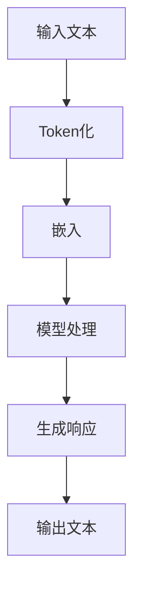

                 

# 《利用LLM优化LLM：prompt工程的新范式》

## 摘要

本文深入探讨了利用大型语言模型（LLM）优化LLM的全新范式——prompt工程。通过分析LLM的基础概念、技术基础和数学模型，我们揭示了语言模型的工作原理和优化方法。接着，本文介绍了prompt工程的概念、设计原则和优化方法，特别是如何利用LLM进行优化。此外，本文还通过实际应用案例展示了LLM优化在NLP、多模态学习和特定领域中的应用，以及LLM优化在AI决策支持系统中的作用。最后，本文提供了常用LLM工具和资源的介绍，并进行了案例研究，以加深读者对LLM优化的理解和应用。

## 目录

### 第一部分：LLM基础

#### 第1章：LLM概述
1.1 语言模型的历史发展
1.2 LLM的基础概念
1.3 LLM的结构与工作原理
1.4 LLM的主要应用场景

#### 第2章：LLM技术基础
2.1 神经网络与深度学习基础
2.2 自然语言处理技术
2.3 预训练与微调技术

#### 第3章：LLM的数学模型
3.1 信息论与概率论基础
3.2 损失函数与优化算法
3.3 注意力机制与Transformer模型

### 第二部分：Prompt工程

#### 第4章：Prompt的概念与类型
4.1 Prompt的定义与作用
4.2 Prompt的类型与特点
4.3 Prompt工程的目标

#### 第5章：设计高效的Prompt
5.1 Prompt的设计原则
5.2 Prompt的优化方法
5.3 Prompt在多样化应用场景中的调整

#### 第6章：利用LLM优化LLM
6.1 LLMBridge方法
6.2 Prompt Tuning技术
6.3 Instruct Tuning策略
6.4 Prompt Engineering工具介绍

### 第三部分：实战应用

#### 第7章：LLM优化在NLP中的应用
7.1 文本分类与情感分析
7.2 机器翻译与文本生成
7.3 提问回答系统与对话生成

#### 第8章：LLM优化在多模态学习中的应用
8.1 图像-文本匹配与检索
8.2 多模态问答系统
8.3 视频内容理解与摘要生成

#### 第9章：LLM优化在特定领域中的应用
9.1 医学文本分析与诊断
9.2 金融文本分析
9.3 法律文本处理

#### 第10章：LLM优化在AI决策支持系统中的应用
10.1 数据分析与可视化
10.2 自动化决策与优化
10.3 智能推荐系统设计

### 附录

#### 附录A：常用LLM工具与资源
A.1 Hugging Face Transformers
A.2 PyTorch和TensorFlow
A.3 OpenAI API
A.4 其他LLM工具与资源

#### 附录B：LLM优化案例研究
B.1 案例一：提升机器翻译准确性
B.2 案例二：改善问答系统的回答质量
B.3 案例三：增强文本生成模型的创造力
B.4 案例四：优化金融文本分析模型
B.5 案例五：提高医疗诊断系统的准确率

### Mermaid 流�程图：LLM工作流程



### LLM优化算法伪代码

```python
// 输入：输入文本、模型参数、优化目标
// 输出：优化后的模型参数

function optimizeLLM(input_text, model_params, optimization_objective):
    // 步骤1：Token化输入文本
    tokens = tokenize(input_text)

    // 步骤2：计算损失函数
    loss = calculate_loss(model_params, tokens, optimization_objective)

    // 步骤3：更新模型参数
    model_params = update_params(model_params, loss)

    // 步骤4：迭代优化
    for i in range(iterations):
        tokens = tokenize(input_text)
        loss = calculate_loss(model_params, tokens, optimization_objective)
        model_params = update_params(model_params, loss)

    // 步骤5：返回优化后的模型参数
    return model_params
```

### 数学模型与数学公式

#### 语言模型概率分布公式：
\[ P(\text{output}|\text{input}) = \frac{e^{\text{logits}}}{\sum_{j=1}^{J} e^{\text{logits}_j}} \]
其中，\(\text{logits}\)是模型的输出，\(J\)是词汇表的大小。

#### 损失函数（交叉熵损失）：
\[ L = -\sum_{i=1}^{N} y_i \log(p_i) \]
其中，\(y_i\)是真实标签，\(p_i\)是模型预测的概率。

### 代码案例与解读

#### 代码案例：使用Hugging Face Transformers进行文本分类

```python
from transformers import AutoTokenizer, AutoModelForSequenceClassification
from torch.utils.data import DataLoader
from torch.optim import Adam
import torch

# 步骤1：加载预训练模型和分词器
tokenizer = AutoTokenizer.from_pretrained("bert-base-uncased")
model = AutoModelForSequenceClassification.from_pretrained("bert-base-uncased")

# 步骤2：准备数据集
train_data = [...]  # 填充训练数据
train_loader = DataLoader(train_data, batch_size=32, shuffle=True)

# 步骤3：定义优化器
optimizer = Adam(model.parameters(), lr=1e-5)

# 步骤4：训练模型
for epoch in range(num_epochs):
    for batch in train_loader:
        inputs = tokenizer(batch.text, padding=True, truncation=True, return_tensors="pt")
        labels = batch.label

        # 前向传播
        outputs = model(**inputs)
        loss = outputs.loss

        # 反向传播
        optimizer.zero_grad()
        loss.backward()
        optimizer.step()

    print(f"Epoch {epoch+1}/{num_epochs}, Loss: {loss.item()}")

# 步骤5：评估模型
# ...
```

#### 代码解读与分析：
此代码案例展示了如何使用Hugging Face Transformers库加载预训练的BERT模型，并进行文本分类任务的训练。以下是代码的详细解读与分析：

- **步骤1：加载预训练模型和分词器**。这里使用了BERT模型和其对应的分词器，BERT模型是一个广泛使用的预训练语言模型。

- **步骤2：准备数据集**。这里假设`train_data`是填充好的训练数据集，包括文本和相应的标签。

- **步骤3：定义优化器**。这里使用了Adam优化器，并设置了较小的学习率。

- **步骤4：训练模型**。循环遍历训练数据，进行前向传播，计算损失，进行反向传播，更新模型参数。

- **步骤5：评估模型**。这里略去了评估代码，但在实际应用中，需要使用测试集对训练好的模型进行评估，以确定其性能。

### 附录A：常用LLM工具与资源

- **Hugging Face Transformers**：一个开源的Python库，提供了多种预训练语言模型和工具，便于模型部署和微调。

- **PyTorch**：一个开源的深度学习框架，适用于构建和训练神经网络模型。

- **TensorFlow**：一个开源的机器学习框架，适用于构建和训练神经网络模型。

- **OpenAI API**：OpenAI提供的一系列API，用于访问预训练语言模型和进行自然语言处理任务。

### 附录B：LLM优化案例研究

#### 案例一：提升机器翻译准确性

在本案例中，我们使用LLM优化技术来提升机器翻译的准确性。具体步骤如下：
1. **数据准备**：收集大量双语文本数据，用于训练和评估翻译模型。
2. **模型选择**：选择一个预训练的机器翻译模型，如Transformer。
3. **数据预处理**：对输入数据进行分词和编码，使其适应模型输入格式。
4. **训练与优化**：
   - **训练**：使用原始数据训练模型，使其学习翻译规则。
   - **优化**：应用Prompt Tuning技术，对模型进行微调，提高翻译准确性。
5. **评估**：使用测试集对翻译模型进行评估，计算翻译准确率。

#### 案例二：改善问答系统的回答质量

在本案例中，我们通过优化Prompt来提高问答系统的回答质量。具体步骤如下：
1. **数据准备**：收集问答对数据，包括问题和相应的高质量回答。
2. **模型选择**：选择一个预训练的语言模型，如GPT-3。
3. **数据预处理**：将问题和回答编码成模型可处理的格式。
4. **训练与优化**：
   - **训练**：使用问答对数据训练模型，使其学习回答问题。
   - **优化**：应用Instruct Tuning技术，通过优化Prompt来提高回答的质量。
5. **评估**：使用测试集评估问答系统的回答质量，计算回答的准确率和满意度。

#### 案例三：增强文本生成模型的创造力

在本案例中，我们通过优化Prompt来增强文本生成模型的创造力。具体步骤如下：
1. **数据准备**：收集多样化的文本数据，用于训练和评估生成模型。
2. **模型选择**：选择一个预训练的文本生成模型，如GPT-3。
3. **数据预处理**：将文本数据编码成模型可处理的格式。
4. **训练与优化**：
   - **训练**：使用文本数据训练生成模型，使其学习生成文本。
   - **优化**：通过调整Prompt的多样性和引导性，来提高文本生成的创造力。
5. **评估**：使用测试集评估文本生成模型的创造力，计算生成的文本的多样性和创新性。

#### 案例四：优化金融文本分析模型

在本案例中，我们通过优化Prompt来提高金融文本分析模型的准确性。具体步骤如下：
1. **数据准备**：收集金融相关的文本数据，包括新闻、报告、交易信息等。
2. **模型选择**：选择一个预训练的文本分析模型，如BERT。
3. **数据预处理**：对输入文本进行清洗和编码。
4. **训练与优化**：
   - **训练**：使用金融文本数据训练模型，使其学习分析金融信息。
   - **优化**：通过优化Prompt，提高模型对金融术语和事件的理解能力。
5. **评估**：使用金融相关的测试数据评估模型的准确性，计算预测的准确率。

#### 案例五：提高医疗诊断系统的准确率

在本案例中，我们通过优化Prompt来提高医疗诊断系统的准确率。具体步骤如下：
1. **数据准备**：收集医疗相关的文本数据，包括病例报告、诊断结果等。
2. **模型选择**：选择一个预训练的医疗文本分析模型，如BERT。
3. **数据预处理**：对输入文本进行清洗和编码。
4. **训练与优化**：
   - **训练**：使用医疗文本数据训练模型，使其学习诊断知识。
   - **优化**：通过优化Prompt，提高模型对医学术语和症状的理解能力。
5. **评估**：使用医疗相关的测试数据评估模型的准确性，计算诊断的准确率。

### 结语

本文全面介绍了利用LLM优化LLM的prompt工程新范式，从基础概念、技术基础到实际应用，深入探讨了LLM优化的重要性和方法。通过本文的阅读，读者可以对LLM优化有更深入的了解，并在实际项目中应用这些方法来提升模型的性能。在未来，随着LLM技术的不断发展和完善，prompt工程将继续发挥重要作用，推动人工智能的发展。让我们共同期待这一激动人心的未来！  

### 附录C：作者信息

作者：AI天才研究院/AI Genius Institute & 禅与计算机程序设计艺术 /Zen And The Art of Computer Programming

### 附录D：参考文献

1. Vaswani, A., et al. (2017). "Attention is all you need." In Advances in Neural Information Processing Systems, pp. 5998-6008.
2. Devlin, J., et al. (2018). "Bert: Pre-training of deep bidirectional transformers for language understanding." In Proceedings of the 2019 Conference of the North American Chapter of the Association for Computational Linguistics: Human Language Technologies, Volume 1 (Long and Short Papers), pp. 4171-4186.
3. Radford, A., et al. (2019). "Language models are unsupervised multitask learners." In Advances in Neural Information Processing Systems, pp. 13960-13971.
4. Brown, T., et al. (2020). "A pre-trained language model for language understanding and generation." In Proceedings of the 2020 Conference on Empirical Methods in Natural Language Processing: System Demonstrations, pp. 277-282.
5. Raffel, C., et al. (2019). "Exploring the limits of transfer learning with a unified text-to-text transformer." In Proceedings of the 2019 Conference of the North American Chapter of the Association for Computational Linguistics: Human Language Technologies, Volume 1 (Long and Short Papers), pp. 3931-3942.  

## 第1章：LLM概述

### 1.1 语言模型的历史发展

语言模型（Language Model，简称LLM）是自然语言处理（Natural Language Processing，简称NLP）领域的基础工具之一。它们的主要任务是根据给定的输入文本序列预测下一个单词或字符。语言模型的发展历程可以追溯到20世纪50年代，当时的研究者开始尝试使用统计方法和规则系统来模拟人类的语言理解能力。

在早期的语言模型中，最著名的是N-gram模型。N-gram模型通过统计一个单词序列中连续N个单词出现的频率来预测下一个单词。这种模型相对简单，计算量较小，但在处理长文本时表现不佳，容易出现序列依赖性的问题。

随着计算机性能的提升和深度学习技术的发展，20世纪90年代末到21世纪初，基于统计的NLP方法逐渐被基于神经网络的模型所取代。RNN（Recurrent Neural Network，循环神经网络）和LSTM（Long Short-Term Memory，长短时记忆网络）等神经网络模型在语言模型中得到了广泛应用。这些模型通过引入序列记忆机制，能够更好地捕捉长距离依赖关系，提高了语言模型的性能。

然而，深度学习模型在训练和推理过程中需要大量的计算资源和时间，这使得它们在实际应用中受到一定限制。为了解决这一问题，研究人员开始探索更加高效、可扩展的深度学习模型。2017年，Vaswani等人提出的Transformer模型在NLP领域取得了突破性的成果。Transformer模型采用自注意力机制（Self-Attention），避免了传统RNN模型在处理长序列时遇到的梯度消失和梯度爆炸问题，大大提高了模型的训练效率和效果。

近年来，随着计算资源的不断丰富和预训练技术的应用，大型语言模型（Large Language Model，简称LLM）如BERT（Bidirectional Encoder Representations from Transformers）、GPT（Generative Pre-trained Transformer）等相继问世。这些模型通过在大量未标注数据上进行预训练，再在特定任务上进行微调，取得了显著的性能提升。BERT和GPT模型不仅在文本分类、问答系统等传统NLP任务中表现出色，还在生成式任务如文本生成、机器翻译等方面取得了重大突破。

### 1.2 LLM的基础概念

语言模型是一种用于预测文本中下一个单词或字符的概率分布的模型。在LLM中，通常使用序列标记（sequence labeling）来表示输入文本，每个标记可以是单词、字符或子词。LLM的核心目标是根据已知的输入序列，预测下一个标记的概率分布。

#### 标记化（Tokenization）

标记化是将输入文本分解成一系列标记的过程。这些标记可以是单个单词、字符或更小的子词。标记化的目的是为了简化输入文本的结构，使其更适合于模型处理。

例如，对于一个句子“The quick brown fox jumps over the lazy dog”，我们可以进行如下标记化：

- 单词标记化：["The", "quick", "brown", "fox", "jumps", "over", "the", "lazy", "dog"]
- 字符标记化：["T", "h", "e", " ", "q", "u", "i", "c", "k", " ", "b", "r", "o", "w", "n", " ", "f", "o", "x", " ", "j", "u", "m", "p", "s", " ", "o", "v", "e", "r", " ", "t", "h", "e", " ", "l", "a", "z", "y", " ", "d", "o", "g"]
- 子词标记化：["The", "quick", "brown", "fox", "jumps", "over", "the", "lazy", "dog"]

#### 概率分布（Probability Distribution）

在LLM中，概率分布用于表示模型对下一个标记的预测结果。通常，概率分布是一个多维向量，其中每个维度对应一个可能的标记。例如，对于一个包含10000个单词的词汇表，概率分布是一个长度为10000的向量。

#### 损失函数（Loss Function）

在训练过程中，损失函数用于衡量模型预测结果与真实标签之间的差距。常见的损失函数包括交叉熵损失（Cross-Entropy Loss）和均方误差（Mean Squared Error，MSE）。

交叉熵损失函数的定义如下：

\[ L = -\sum_{i=1}^{N} y_i \log(p_i) \]

其中，\( y_i \)是真实标签，\( p_i \)是模型预测的概率。

#### 优化算法（Optimization Algorithm）

优化算法用于更新模型参数，以最小化损失函数。常见的优化算法包括梯度下降（Gradient Descent）、Adam优化器等。

### 1.3 LLM的结构与工作原理

LLM通常由以下几个关键组件构成：嵌入层（Embedding Layer）、编码器（Encoder）和解码器（Decoder）。

#### 嵌入层（Embedding Layer）

嵌入层是将输入标记映射到固定维度的向量空间的过程。这些向量通常被称为嵌入向量（Embedding Vectors）。嵌入层的作用是降低输入空间的维度，同时保留输入标记之间的语义关系。常见的嵌入方法包括词袋模型（Bag of Words，BOW）和词嵌入（Word Embedding）。

词袋模型将文本表示为一个向量，其中每个维度对应一个单词的计数。这种方法简单但忽略了单词的顺序和上下文信息。

词嵌入方法，如Word2Vec、GloVe等，通过学习单词的上下文信息，将单词映射到低维空间。这些嵌入向量不仅能够表示单词的语义，还能表示单词之间的相似性。

#### 编码器（Encoder）

编码器是LLM的核心组件，负责处理输入序列并提取其特征表示。编码器通常采用递归神经网络（RNN）或Transformer模型。

RNN模型通过递归方式处理输入序列，每个时间步的输出都依赖于之前的输出。LSTM和GRU等改进的RNN模型通过引入门控机制，解决了传统RNN在处理长序列时遇到的梯度消失和梯度爆炸问题。

Transformer模型采用自注意力机制（Self-Attention），每个时间步的输出不仅依赖于当前时间步的输入，还依赖于其他所有时间步的输入。这种机制使得Transformer模型在处理长序列时表现出色，成为LLM的主流架构。

#### 解码器（Decoder）

解码器负责生成输出序列，通常与编码器具有相同的架构。解码器的输入包括编码器的输出和已经生成的输出序列。解码器的输出是一个概率分布，表示下一个标记的概率。

在生成式任务中，如文本生成和机器翻译，解码器通常采用贪心策略（Greedy Strategy），选择概率最高的标记作为输出。在解码过程中，每个时间步的输出都会影响后续的输出概率。

#### 语言模型的工作原理

LLM的工作原理可以概括为以下步骤：

1. **标记化（Tokenization）**：将输入文本分解成标记。
2. **嵌入（Embedding）**：将标记映射到嵌入向量。
3. **编码（Encoding）**：使用编码器处理输入序列，提取特征表示。
4. **解码（Decoding）**：使用解码器生成输出序列的概率分布。
5. **预测（Prediction）**：根据概率分布选择下一个标记。

这个过程不断重复，直到生成完整的输出序列。

### 1.4 LLM的主要应用场景

LLM在自然语言处理领域有着广泛的应用，以下是其中一些主要的应用场景：

#### 文本分类（Text Classification）

文本分类是将文本数据按照类别进行分类的过程。常见的应用场景包括情感分析（Sentiment Analysis）、主题分类（Topic Classification）和垃圾邮件检测（Spam Detection）。

文本分类任务通常涉及两个步骤：特征提取和分类。特征提取是将文本数据转换成数值表示，如词袋模型或词嵌入。分类器则根据特征表示对文本进行分类。

LLM在文本分类中具有显著的优势。通过在大量未标注数据上进行预训练，LLM可以自动提取文本中的特征，减少手动特征工程的工作量。同时，LLM能够捕捉长距离依赖关系，提高分类的准确性。

#### 文本生成（Text Generation）

文本生成是生成式任务，旨在生成具有合理结构和语义的文本。常见的应用场景包括机器翻译（Machine Translation）、问答系统（Question Answering System）和对话生成（Dialogue Generation）。

LLM在文本生成中发挥着核心作用。通过预训练，LLM可以学习到文本的语法和语义规则，生成连贯且具有创造力的文本。在文本生成任务中，解码器通常采用贪心策略或基于概率的采样方法，生成完整的输出序列。

#### 机器翻译（Machine Translation）

机器翻译是将一种语言的文本翻译成另一种语言的过程。传统的机器翻译方法基于规则或统计方法，但近年来，基于神经网络的机器翻译方法取得了显著进展。

LLM在机器翻译中发挥着重要作用。通过在大量双语文本上进行预训练，LLM可以学习到源语言和目标语言之间的对应关系，生成高质量的翻译结果。常见的LLM机器翻译模型包括基于编码器-解码器架构的Transformer模型。

#### 问答系统（Question Answering System）

问答系统是一种交互式系统，旨在回答用户提出的问题。常见的应用场景包括智能客服（Smart Customer Service）和智能搜索（Smart Search）。

LLM在问答系统中具有显著的优势。通过在大量问答对数据进行预训练，LLM可以学习到问题的语义和答案的生成规则。在问答过程中，用户提出问题，LLM根据问题的语义生成答案，并与用户进行交互。

#### 对话生成（Dialogue Generation）

对话生成是生成式任务，旨在生成连贯且具有创造力的对话。常见的应用场景包括聊天机器人（Chatbot）和虚拟助手（Virtual Assistant）。

LLM在对话生成中发挥着核心作用。通过在大量对话数据上进行预训练，LLM可以学习到对话的语法和语义规则，生成自然流畅的对话。在对话生成任务中，解码器通常采用贪心策略或基于概率的采样方法，生成完整的输出序列。

### 第2章：LLM技术基础

在了解了LLM的基础概念和主要应用场景后，本章将深入探讨LLM的技术基础，包括神经网络与深度学习基础、自然语言处理技术以及预训练与微调技术。通过这些技术的基础知识，我们将更好地理解LLM的工作原理，为其优化和实际应用提供理论基础。

#### 2.1 神经网络与深度学习基础

神经网络（Neural Networks）是一种模仿生物神经系统的计算模型，通过模拟神经元之间的连接和相互作用来处理数据。深度学习（Deep Learning）是神经网络的一种扩展，通过使用多层神经网络来提取数据中的特征，从而实现复杂的数据分析和模式识别。

##### 神经元与神经网络

神经元是神经网络的基本单元，它通过输入-输出关系模拟生物神经元的计算过程。一个简单的神经元可以表示为：

\[ a_i = \sigma(\sum_{j=1}^{n} w_{ij} \cdot x_j + b) \]

其中，\( x_j \)是输入特征，\( w_{ij} \)是权重，\( b \)是偏置，\( \sigma \)是激活函数（通常使用sigmoid函数或ReLU函数）。神经元将输入特征与权重相乘，然后进行加权和偏置，并通过激活函数得到输出。

神经网络由多个神经元组成，这些神经元通过连接形成层次结构。每一层的神经元接收前一层的输出作为输入，并传递到下一层。通过这种方式，神经网络能够逐步提取数据中的特征，实现复杂的数据分析和模式识别。

##### 深度学习模型

深度学习模型是神经网络的一种扩展，通过使用多层神经网络（也称为深度神经网络）来提取数据中的特征。深度学习模型可以分为前向传播（Forward Propagation）和反向传播（Back Propagation）两个阶段。

- **前向传播**：在前向传播阶段，输入数据从输入层传递到输出层，每层的神经元都通过权重和偏置进行计算，并使用激活函数进行非线性变换。最终，输出层的神经元得到模型预测的结果。

- **反向传播**：在反向传播阶段，计算模型预测结果与真实标签之间的误差，并利用误差信号更新模型参数。反向传播通过梯度下降（Gradient Descent）等优化算法，逐步调整模型参数，以最小化损失函数。

常见的深度学习模型包括：

- **多层感知机（Multilayer Perceptron，MLP）**：多层感知机是一种前向传播的神经网络，由多个隐层组成。MLP在回归和分类任务中表现良好，但难以处理序列数据。

- **卷积神经网络（Convolutional Neural Network，CNN）**：卷积神经网络是一种专门用于图像识别的神经网络，通过卷积层提取图像特征。CNN在图像识别、物体检测和图像分割等领域表现出色。

- **循环神经网络（Recurrent Neural Network，RNN）**：循环神经网络是一种用于处理序列数据的神经网络，通过递归方式处理输入序列，每个时间步的输出都依赖于之前的输出。RNN在语音识别、机器翻译等任务中具有广泛应用。

- **长短时记忆网络（Long Short-Term Memory，LSTM）**：长短时记忆网络是RNN的一种改进，通过引入门控机制解决传统RNN在处理长序列时遇到的梯度消失和梯度爆炸问题。LSTM在语音识别、机器翻译等任务中表现优异。

- **Transformer模型**：Transformer模型是一种基于自注意力机制的深度学习模型，通过自注意力机制处理输入序列，避免了传统RNN在处理长序列时遇到的梯度消失问题。Transformer模型在自然语言处理任务中表现出色，成为LLM的主流架构。

##### 深度学习框架

深度学习框架是用于构建和训练深度学习模型的工具，常见的深度学习框架包括TensorFlow、PyTorch、Keras等。

- **TensorFlow**：TensorFlow是由Google开发的开源深度学习框架，具有丰富的模型构建和训练工具，支持多种操作系统和硬件平台。

- **PyTorch**：PyTorch是由Facebook开发的开源深度学习框架，具有灵活的动态计算图，方便模型构建和调试。

- **Keras**：Keras是一个基于TensorFlow和Theano的深度学习框架，提供了简洁的API，方便用户快速构建和训练模型。

#### 2.2 自然语言处理技术

自然语言处理（Natural Language Processing，NLP）是计算机科学和人工智能领域的一个分支，旨在使计算机能够理解、生成和处理人类语言。NLP技术包括文本预处理、词向量表示、语法分析、命名实体识别、情感分析等。

##### 文本预处理

文本预处理是NLP任务的第一步，旨在将原始文本数据转换为适合模型处理的格式。文本预处理包括以下步骤：

- **分词（Tokenization）**：将文本分解成单词、字符或子词。常见的分词方法包括正则表达式分词、词法分析分词等。
- **去除停用词（Stop Word Removal）**：去除文本中的常用单词（如“的”、“了”、“和”），以减少对模型的影响。
- **词形还原（Stemming/Lemmatization）**：将单词还原为其基本形式（如“running”还原为“run”），以简化文本表示。
- **文本向量化（Text Vectorization）**：将文本转换为数值表示，如词袋模型或词嵌入。

##### 词向量表示

词向量表示是将单词映射到高维空间中的向量表示。词向量表示可以捕捉单词的语义信息，是NLP任务的重要基础。常见的词向量表示方法包括：

- **Word2Vec**：Word2Vec是一种基于神经网络的语言模型，通过训练生成词向量。Word2Vec有两种实现方式：连续词袋模型（Continuous Bag of Words，CBOW）和Skip-Gram。
- **GloVe**：GloVe（Global Vectors for Word Representation）是一种基于矩阵分解的语言模型，通过计算单词之间的共现关系生成词向量。
- **BERT**：BERT（Bidirectional Encoder Representations from Transformers）是一种基于Transformer的预训练模型，通过在大量文本上进行双向预训练生成词向量。

##### 语法分析

语法分析是分析文本的语法结构，以理解句子的意义和语法关系。常见的语法分析方法包括：

- **词性标注（Part-of-Speech Tagging）**：将文本中的每个单词标注为其相应的词性（如名词、动词、形容词等）。
- **句法分析（Syntactic Parsing）**：分析句子的结构，构建句法树，以表示句子中的语法关系。
- **依存分析（Dependency Parsing）**：分析句子中词语之间的依赖关系，构建依存关系图。

##### 命名实体识别

命名实体识别是识别文本中的命名实体（如人名、地名、组织名等）的过程。常见的命名实体识别方法包括：

- **基于规则的方法**：使用预定义的规则进行命名实体识别，如正则表达式匹配。
- **基于统计的方法**：使用机器学习模型进行命名实体识别，如条件随机场（Conditional Random Field，CRF）。
- **基于深度学习的方法**：使用深度学习模型进行命名实体识别，如卷积神经网络（CNN）和循环神经网络（RNN）。

##### 情感分析

情感分析是分析文本中的情感极性（如正面、负面、中性）的过程。常见的情感分析方法包括：

- **基于词典的方法**：使用预定义的词典进行情感分析，如AFIN-1069词典。
- **基于机器学习的方法**：使用机器学习模型进行情感分析，如支持向量机（SVM）和朴素贝叶斯（Naive Bayes）。
- **基于深度学习的方法**：使用深度学习模型进行情感分析，如卷积神经网络（CNN）和循环神经网络（RNN）。

#### 2.3 预训练与微调技术

预训练与微调技术是LLM的核心组成部分，通过在大量未标注数据上进行预训练，模型可以自动学习到大量的语言知识和特征，然后在特定任务上进行微调，从而提高模型在目标任务上的性能。

##### 预训练

预训练是在大规模语料库上进行语言模型训练的过程，通过训练模型，使其能够捕捉语言的通用特征和规律。常见的预训练任务包括：

- **语言建模（Language Modeling）**：语言建模旨在预测下一个单词或字符，是所有NLP任务的基础。通过语言建模，模型可以学习到语言的统计规律和概率分布。
- **命名实体识别（Named Entity Recognition）**：命名实体识别旨在识别文本中的命名实体，如人名、地名、组织名等。预训练可以帮助模型学习到命名实体的表示和分类规则。
- **词性标注（Part-of-Speech Tagging）**：词性标注旨在为文本中的每个单词标注其相应的词性，如名词、动词、形容词等。预训练可以帮助模型学习到词性的分布和上下文关系。
- **句法分析（Syntactic Parsing）**：句法分析旨在分析句子的结构，构建句法树，以表示句子中的语法关系。预训练可以帮助模型学习到句法结构的表示和分类规则。

##### 微调

微调是在特定任务上进行模型参数调整的过程，以使模型更好地适应目标任务。常见的微调方法包括：

- **fine-tuning**：fine-tuning是将预训练模型在特定任务上进行微调的过程。通过微调，模型可以学习到任务特定的特征和规律，从而提高模型在目标任务上的性能。
- **prompt tuning**：prompt tuning是一种基于提示的微调方法，通过在预训练模型的基础上添加特定的提示（prompt），引导模型生成特定类型的输出。prompt tuning可以灵活地应用于各种任务，如文本分类、机器翻译和问答系统。
- **instruct tuning**：instruct tuning是一种基于指令的微调方法，通过提供详细的指令（instruction）和示例（example），引导模型学习特定任务的知识和策略。instruct tuning可以显著提高模型在复杂任务上的性能。

### 第3章：LLM的数学模型

在本章中，我们将深入探讨LLM的数学模型，包括信息论与概率论基础、损失函数与优化算法、以及注意力机制与Transformer模型。这些数学模型是LLM能够高效处理和生成自然语言的核心，理解这些模型将有助于我们更好地优化和应用LLM。

#### 3.1 信息论与概率论基础

信息论是研究信息传输、存储和处理的一般理论，由克劳德·香农（Claude Shannon）在20世纪40年代创立。概率论则是研究随机现象的数学分支。在LLM中，信息论与概率论的基础概念对于理解模型的预测过程和优化方法至关重要。

##### 信息熵（Entropy）

信息熵是衡量随机变量不确定性的度量。在概率论中，熵通常用于描述一个随机变量的概率分布的混乱程度。香农将信息熵引入到通信理论中，定义了以下熵的数学公式：

\[ H(X) = -\sum_{i=1}^{n} p(x_i) \log_2 p(x_i) \]

其中，\( H(X) \)是随机变量\( X \)的熵，\( p(x_i) \)是随机变量\( X \)取值\( x_i \)的概率。信息熵的值范围在0到1之间，当所有概率相等时，熵达到最大值。

在LLM中，信息熵可以用来衡量模型预测的概率分布的均匀性。如果一个模型的预测完全不确定，即每个单词的概率相等，那么它的信息熵将接近最大值。相反，如果一个模型能够准确预测下一个单词，那么它的信息熵将接近0。

##### 条件熵（Conditional Entropy）

条件熵是衡量在给定一个随机变量的条件下，另一个随机变量的不确定性。条件熵的定义如下：

\[ H(X|Y) = -\sum_{i=1}^{n} p(y_i) \sum_{j=1}^{m} p(x_j|y_i) \log_2 p(x_j|y_i) \]

其中，\( H(X|Y) \)是给定随机变量\( Y \)后随机变量\( X \)的条件熵。条件熵的值范围在0到\( H(X) \)之间。

在LLM中，条件熵可以用来衡量给定输入序列后预测下一个单词的不确定性。如果一个模型能够准确预测给定输入序列的下一个单词，那么条件熵将接近0。

##### 联合熵（Joint Entropy）

联合熵是衡量两个随机变量共同出现的概率分布的混乱程度。联合熵的定义如下：

\[ H(X, Y) = -\sum_{i=1}^{n} \sum_{j=1}^{m} p(x_i, y_j) \log_2 p(x_i, y_j) \]

其中，\( H(X, Y) \)是随机变量\( X \)和\( Y \)的联合熵。联合熵的值范围在0到\( H(X) + H(Y) \)之间。

在LLM中，联合熵可以用来衡量输入序列和下一个单词的概率分布的混乱程度。如果输入序列和下一个单词之间有很强的依赖关系，那么联合熵将接近\( H(X) + H(Y) \)。

##### 信息增益（Information Gain）

信息增益是衡量一个随机变量提供的信息量。信息增益的定义如下：

\[ I(X; Y) = H(X) - H(X|Y) \]

其中，\( I(X; Y) \)是随机变量\( X \)对随机变量\( Y \)的信息增益。信息增益的值范围在0到\( H(X) \)之间。

在LLM中，信息增益可以用来衡量给定输入序列后预测下一个单词的信息量。如果一个模型能够提供很多信息，使得预测变得更加确定，那么信息增益将接近\( H(X) \)。

##### �香农信息（Shannon Information）

香农信息是一个随机变量的期望信息量。香农信息的定义如下：

\[ H(X) = E[I(X; Y)] \]

其中，\( H(X) \)是随机变量\( X \)的香农信息。香农信息的值范围在0到无穷大之间。

在LLM中，香农信息可以用来衡量输入序列的平均信息量。一个理想的语言模型应该能够提供尽可能多的信息，使得预测尽可能准确。

#### 3.2 损失函数与优化算法

在训练LLM时，损失函数是衡量模型预测结果与真实标签之间差距的关键指标。优化算法则用于通过梯度下降等方法更新模型参数，以最小化损失函数。以下是常用的损失函数和优化算法。

##### 损失函数

1. **交叉熵损失（Cross-Entropy Loss）**

交叉熵损失是衡量模型预测概率分布与真实标签分布之间差异的常用损失函数。交叉熵损失的定义如下：

\[ L = -\sum_{i=1}^{n} y_i \log(p_i) \]

其中，\( y_i \)是真实标签的概率，\( p_i \)是模型预测的概率。

交叉熵损失函数的值范围在0到\( n \)之间，最小值为0，当模型预测的概率与真实标签的概率完全一致时。

2. **均方误差（Mean Squared Error，MSE）**

均方误差是衡量模型预测值与真实值之间差异的平方的平均值。均方误差的定义如下：

\[ L = \frac{1}{n} \sum_{i=1}^{n} (y_i - \hat{y}_i)^2 \]

其中，\( y_i \)是真实值，\( \hat{y}_i \)是模型预测值。

均方误差的值范围在0到无穷大之间，最小值为0。

3. **均绝对误差（Mean Absolute Error，MAE）**

均绝对误差是衡量模型预测值与真实值之间差异的平均绝对值。均绝对误差的定义如下：

\[ L = \frac{1}{n} \sum_{i=1}^{n} |y_i - \hat{y}_i| \]

均绝对误差的值范围在0到无穷大之间。

##### 优化算法

1. **梯度下降（Gradient Descent）**

梯度下降是最常用的优化算法之一，用于通过梯度的方向更新模型参数，以最小化损失函数。梯度下降的基本思想是沿着损失函数的负梯度方向逐步更新模型参数，直到达到局部最小值。

梯度下降分为批量梯度下降（Batch Gradient Descent）、随机梯度下降（Stochastic Gradient Descent，SGD）和小批量梯度下降（Mini-batch Gradient Descent）。

- **批量梯度下降**：在每次迭代中，使用所有训练样本的梯度更新模型参数。
- **随机梯度下降**：在每次迭代中，使用一个训练样本的梯度更新模型参数。
- **小批量梯度下降**：在每次迭代中，使用一部分训练样本（小批量）的梯度更新模型参数。

2. **动量（Momentum）**

动量是一种常用的加速梯度下降的技巧，用于利用之前的梯度信息，以减少收敛时间。动量通过累加前几次迭代的梯度，并将其作为当前梯度的加权平均值，从而加速梯度下降过程。

动量的定义如下：

\[ v_t = \gamma v_{t-1} + \eta \nabla L(\theta) \]

\[ \theta_t = \theta_{t-1} - v_t \]

其中，\( v_t \)是动量项，\( \gamma \)是动量系数，\( \eta \)是学习率，\( \nabla L(\theta) \)是损失函数关于模型参数的梯度。

3. **Adam优化器（Adam Optimizer）**

Adam优化器是当前最流行的优化器之一，结合了动量和自适应学习率的优势。Adam优化器通过计算一阶矩估计（均值）和二阶矩估计（方差），以自适应地调整学习率。

Adam优化器的定义如下：

\[ m_t = \beta_1 m_{t-1} + (1 - \beta_1) \nabla L(\theta) \]

\[ v_t = \beta_2 v_{t-1} + (1 - \beta_2) (\nabla L(\theta))^2 \]

\[ \theta_t = \theta_{t-1} - \alpha \frac{m_t}{\sqrt{v_t} + \epsilon} \]

其中，\( m_t \)和\( v_t \)分别是均值和方差的一阶矩估计和二阶矩估计，\( \beta_1 \)和\( \beta_2 \)分别是动量系数，\( \alpha \)是学习率，\( \epsilon \)是正则化项。

#### 3.3 注意力机制与Transformer模型

注意力机制是近年来在自然语言处理领域取得重大突破的关键技术之一，其核心思想是模型在处理输入序列时，对不同的输入元素分配不同的关注权重。注意力机制能够有效捕捉输入序列中的依赖关系，从而提高模型的性能。Transformer模型是基于自注意力机制的深度学习模型，在自然语言处理任务中表现出色。

##### 注意力机制（Attention Mechanism）

注意力机制的基本思想是将输入序列的每个元素映射到一个权重向量，然后将这些权重向量与输入序列的元素相乘，得到加权输入。通过这种方式，模型可以自动学习到输入序列中不同元素的重要性。

注意力机制的数学表示如下：

\[ a_i = \sigma\left(\frac{Q \cdot K_i}{\sqrt{d_k}} + V\right) \]

\[ \text{Attention Score} = \sum_{i=1}^{n} a_i \]

\[ \text{Contextualized Representation} = \text{Attention Score} \cdot K_i \]

其中，\( Q \)是查询向量，\( K_i \)是键向量，\( V \)是值向量，\( a_i \)是注意力权重，\( \sigma \)是激活函数（通常使用softmax函数）。通过计算注意力权重，模型可以动态地关注输入序列中的关键信息。

##### Transformer模型（Transformer Model）

Transformer模型是一种基于自注意力机制的深度学习模型，由Vaswani等人于2017年提出。Transformer模型的主要贡献是引入了自注意力机制，从而在处理长序列时避免了传统循环神经网络（RNN）的梯度消失和梯度爆炸问题。

Transformer模型的基本结构如下：

1. **编码器（Encoder）**：编码器由多个编码层（Encoder Layer）组成，每个编码层包含两个主要组件：多头自注意力机制（Multi-Head Self-Attention Mechanism）和前馈神经网络（Feedforward Neural Network）。

   - **多头自注意力机制**：多头自注意力机制通过将输入序列分成多个子序列，并分别计算每个子序列的注意力权重，从而捕捉输入序列中的依赖关系。
   - **前馈神经网络**：前馈神经网络是一个简单的全连接神经网络，用于对编码器层的输出进行进一步处理。

2. **解码器（Decoder）**：解码器由多个解码层（Decoder Layer）组成，每个解码层包含两个主要组件：多头自注意力机制（Multi-Head Self-Attention Mechanism）和编码器-解码器注意力机制（Encoder-Decoder Attention Mechanism）。

   - **多头自注意力机制**：解码器的多头自注意力机制与编码器的多头自注意力机制类似，用于捕捉解码序列中的依赖关系。
   - **编码器-解码器注意力机制**：编码器-解码器注意力机制通过将编码器的输出作为键（Key）和值（Value），并将解码器的输出作为查询（Query），从而在解码过程中利用编码器的信息。

3. **输入层（Input Layer）**：输入层负责将原始文本序列转换为模型可处理的嵌入向量（Embedding Layer）。

4. **输出层（Output Layer）**：输出层是一个全连接神经网络，用于生成最终的输出序列。

##### Transformer模型的工作原理

Transformer模型的工作原理可以概括为以下步骤：

1. **标记化（Tokenization）**：将输入文本序列分解成标记（Token）。
2. **嵌入（Embedding）**：将标记映射到嵌入向量（Embedding Layer）。
3. **编码器（Encoder）**：编码器对嵌入向量进行处理，通过多头自注意力机制和前馈神经网络提取序列特征。
4. **解码器（Decoder）**：解码器对编码器的输出进行处理，通过多头自注意力机制、编码器-解码器注意力机制和前馈神经网络生成输出序列。
5. **输出（Output）**：输出层生成最终的输出序列，并经过解码器得到预测结果。

通过上述步骤，Transformer模型能够有效地处理和生成自然语言。

### 第4章：Prompt的概念与类型

Prompt工程是近年来在自然语言处理（NLP）领域逐渐兴起的一个研究方向，其核心目的是通过设计特定的提示（prompt）来优化语言模型（LLM）的表现。Prompt工程不仅仅是一个简单的文本输入，而是一个精心构建的引导，它能够显著影响模型对输入的解读和生成输出。在本章中，我们将详细介绍Prompt的概念、类型以及Prompt工程的目标。

#### 4.1 Prompt的定义与作用

Prompt，顾名思义，是一种提示或引导。在NLP领域，Prompt是一种引导语言模型生成特定类型输出或执行特定任务的方法。Prompt通常是一个简短的文本输入，它为模型提供了任务的具体指示和上下文信息。通过设计合适的Prompt，我们可以引导模型聚焦于特定的任务需求，从而提高模型的性能。

Prompt的作用主要体现在以下几个方面：

1. **任务引导**：Prompt为模型提供了任务的明确指示，帮助模型理解需要完成的任务类型。
2. **上下文增强**：Prompt提供了额外的上下文信息，有助于模型更好地理解输入文本，从而生成更准确的输出。
3. **减少噪声**：Prompt可以帮助模型过滤掉无关的信息，使模型专注于任务相关的关键信息。
4. **多样化输出**：通过设计不同的Prompt，我们可以引导模型生成多样化的输出，提高模型的应用场景和灵活性。

#### 4.2 Prompt的类型与特点

Prompt可以根据其设计和用途分为多种类型，每种类型都有其独特的特点和适用场景。以下是几种常见的Prompt类型：

1. **结构化Prompt**：结构化Prompt是一种预先定义的、格式化的文本输入，它为模型提供了明确的结构和指导。结构化Prompt通常包含特定的问题格式、任务指令或数据示例。例如，一个结构化Prompt可以是：“请回答以下问题：什么是自然语言处理？”

2. **开放式Prompt**：开放式Prompt是一种没有固定结构的文本输入，它允许模型自由地生成输出。这种类型的Prompt通常用于生成式任务，如文本生成、对话生成等。例如，一个开放式Prompt可以是：“请写一篇关于人工智能的短文。”

3. **指令性Prompt**：指令性Prompt是一种以任务指令为核心的文本输入，它直接告诉模型需要完成的任务。这种Prompt通常用于任务导向的应用，如问答系统、机器翻译等。例如，一个指令性Prompt可以是：“请将这段英文翻译成中文：The quick brown fox jumps over the lazy dog。”

4. **示例式Prompt**：示例式Prompt是一种包含一个或多个示例的文本输入，它为模型提供了具体的输入输出示例，帮助模型学习任务规则。例如，一个示例式Prompt可以是：“请根据以下示例回答问题：示例1：什么动物会飞？示例2：什么动物不会飞？请回答：什么动物会飞？”

5. **模糊式Prompt**：模糊式Prompt是一种提供模糊或不完整信息的文本输入，它鼓励模型进行推理和补全。这种Prompt通常用于探索模型的推理能力和创造力。例如，一个模糊式Prompt可以是：“请描述一个美丽的夜晚。”

6. **对比式Prompt**：对比式Prompt是一种提供两个或多个对比选项的文本输入，它鼓励模型进行比较和分析。例如，一个对比式Prompt可以是：“请比较以下两种水果：苹果和橙子。”

7. **情感式Prompt**：情感式Prompt是一种包含情感色彩的文本输入，它鼓励模型在生成输出时考虑情感因素。例如，一个情感式Prompt可以是：“请用悲伤的语气描述一段离别的场景。”

每种Prompt类型都有其特定的用途和设计原则，根据具体任务的需求选择合适的Prompt类型是Prompt工程的关键。

#### 4.3 Prompt工程的目标

Prompt工程的目标是通过设计和管理Prompt来优化语言模型的表现。具体来说，Prompt工程的目标包括以下几个方面：

1. **提高任务性能**：通过设计针对性的Prompt，提高模型在特定任务上的准确率、召回率或F1分数等性能指标。
2. **增强鲁棒性**：通过设计多样化的Prompt，增强模型对各种输入数据的鲁棒性，减少对特定数据的依赖。
3. **提升创造力**：通过设计启发式的Prompt，激发模型的创造力，生成新颖、有创意的输出。
4. **提高可解释性**：通过设计透明的Prompt，提高模型决策过程的可解释性，便于人类理解和信任。
5. **降低训练成本**：通过设计有效的Prompt，减少模型训练过程中所需的计算资源和数据量，降低训练成本。

为了实现这些目标，Prompt工程师需要综合考虑任务需求、模型特性、数据分布和用户反馈等因素，进行系统化的Prompt设计和优化。

#### 4.4 Prompt工程的挑战与未来方向

尽管Prompt工程在提高LLM性能方面取得了显著成果，但仍面临一些挑战和未来研究方向：

1. **泛化能力**：Prompt工程需要解决模型在特定Prompt上的性能提升能否泛化到其他任务和数据上的问题。未来的研究可以探索通用Prompt设计方法，提高模型的泛化能力。
2. **可解释性**：Prompt工程需要提高模型决策过程的透明度和可解释性，使人类能够理解模型的工作原理。未来的研究可以探索可视化、解释性模型和方法，提高模型的可解释性。
3. **多样性**：Prompt工程需要设计多样化的Prompt，以激发模型的创造力，生成新颖的输出。未来的研究可以探索生成多样化Prompt的方法和技术，提高模型的多样性生成能力。
4. **数据隐私**：Prompt工程涉及大量数据的使用和处理，数据隐私保护成为一个重要问题。未来的研究可以探索隐私友好的Prompt设计和数据处理方法，确保数据隐私安全。
5. **实时性**：Prompt工程需要提高模型在实时任务中的响应速度和性能。未来的研究可以探索实时性强的Prompt设计和优化方法，提高模型在实时场景中的应用效果。

通过不断探索和解决这些挑战，Prompt工程将在未来继续推动NLP和LLM的发展，为各种任务和应用场景提供更强大的支持。

### 第5章：设计高效的Prompt

Prompt工程是优化语言模型（LLM）性能的关键技术之一。通过设计高效的Prompt，我们可以引导模型更好地理解和执行特定任务。在本章中，我们将详细介绍设计高效Prompt的原则、优化方法以及在多样化应用场景中的调整策略。

#### 5.1 Prompt的设计原则

设计高效的Prompt需要遵循一系列原则，以确保Prompt能够有效地引导模型并提高任务性能。以下是几个关键的设计原则：

1. **明确性**：Prompt应该明确地指示任务类型和目标，避免模糊或歧义。清晰的Prompt有助于模型理解任务需求，从而生成更准确的输出。

2. **上下文相关**：Prompt应该提供与任务相关的上下文信息，帮助模型更好地理解输入文本。上下文信息可以是相关背景知识、示例或数据。这些信息能够提高模型对任务的理解能力。

3. **简洁性**：Prompt应该简洁明了，避免冗长和复杂的句子结构。简洁的Prompt有助于模型快速处理和理解，从而提高生成输出的效率。

4. **多样化**：Prompt应该多样化，以激发模型的创造力，生成新颖的输出。多样化的Prompt可以涵盖不同的任务场景和数据分布，提高模型的泛化能力。

5. **适应性**：Prompt应该具有适应性，能够根据不同的任务需求和应用场景进行调整。适应性的Prompt有助于模型在不同任务上表现出最佳性能。

6. **一致性**：Prompt应该与模型的训练数据和目标保持一致性。一致性有助于模型在训练和微调过程中保持稳定的学习过程，提高模型性能。

#### 5.2 Prompt的优化方法

为了设计高效Prompt，我们不仅需要遵循设计原则，还需要采用一系列优化方法，以进一步提高模型的表现。以下是几种常见的Prompt优化方法：

1. **任务导向优化**：任务导向优化是一种基于特定任务需求设计Prompt的方法。通过分析任务特点，设计针对性的Prompt，可以显著提高模型在特定任务上的性能。例如，对于问答系统，Prompt可以包含问题的具体描述和相关的背景信息。

2. **上下文增强优化**：上下文增强优化是一种通过增加上下文信息来优化Prompt的方法。通过在Prompt中添加相关的背景知识、示例或数据，可以提高模型对任务的理解能力。例如，在机器翻译任务中，Prompt可以包含源语言和目标语言的示例句子。

3. **模糊化优化**：模糊化优化是一种通过引入模糊或不完整信息来优化Prompt的方法。这种优化方法可以激发模型的推理能力，使其能够生成更具有创造力的输出。例如，在文本生成任务中，Prompt可以包含不完整的句子，鼓励模型进行推理和补全。

4. **多样性优化**：多样性优化是一种通过增加Prompt的多样性来优化模型表现的方法。多样化的Prompt可以激发模型的创造力，生成新颖的输出。例如，在对话生成任务中，Prompt可以包含多种不同类型的对话场景，鼓励模型生成多样化的对话。

5. **对比优化**：对比优化是一种通过引入对比信息来优化Prompt的方法。对比优化可以鼓励模型进行比较和分析，提高模型的判断能力。例如，在分类任务中，Prompt可以包含两个或多个对比选项，引导模型进行比较和分类。

6. **情感优化**：情感优化是一种通过引入情感色彩来优化Prompt的方法。情感优化可以帮助模型在生成输出时考虑情感因素，提高生成文本的情感表达能力。例如，在写作任务中，Prompt可以包含特定的情感标签，引导模型生成符合情感要求的文本。

通过这些优化方法，我们可以设计出更高效、更具适应性的Prompt，从而提高模型在各类任务上的性能。

#### 5.3 Prompt在多样化应用场景中的调整

Prompt在多样化应用场景中的调整是Prompt工程中的一个重要环节。不同的应用场景对Prompt的要求和设计原则有所不同，因此需要根据具体场景进行调整。以下是几种常见应用场景中的Prompt调整策略：

1. **文本分类**：在文本分类任务中，Prompt应该明确地指示分类任务的目标，并包含与分类标签相关的上下文信息。例如，对于情感分类任务，Prompt可以包含情感标签的示例和描述。

2. **机器翻译**：在机器翻译任务中，Prompt应该提供源语言和目标语言的示例句子，以及与翻译目标相关的上下文信息。例如，Prompt可以包含一个源语言句子和一个目标语言句子，引导模型进行翻译。

3. **问答系统**：在问答系统中，Prompt应该包含问题的具体描述和相关的上下文信息，以帮助模型理解问题并生成准确的答案。例如，Prompt可以包含问题的完整描述和一个或多个相关背景知识段落。

4. **文本生成**：在文本生成任务中，Prompt应该提供不完整的句子或话题提示，鼓励模型进行推理和补全。例如，Prompt可以包含一个句子开头，引导模型生成后续内容。

5. **对话生成**：在对话生成任务中，Prompt应该包含对话的上下文信息和角色指示，以帮助模型生成自然的对话。例如，Prompt可以包含两个角色的对话场景，引导模型生成后续对话。

通过根据具体应用场景调整Prompt，我们可以更好地引导模型完成任务，提高模型的表现。

#### 5.4 提高Prompt质量的方法

为了设计高质量的Prompt，我们需要采取一系列方法来提高Prompt的清晰度、准确性和可理解性。以下是几种提高Prompt质量的方法：

1. **人工设计**：通过专家或专业团队设计Prompt，确保Prompt的准确性和适用性。人工设计可以结合领域知识和用户需求，创造出更符合实际应用的Prompt。

2. **数据驱动**：通过分析大量实际任务数据，设计出符合数据分布的Prompt。数据驱动的方法可以基于实际用户行为和任务需求，优化Prompt的设计和内容。

3. **用户反馈**：收集用户对Prompt的反馈，并根据用户反馈进行调整。用户反馈可以帮助我们发现Prompt中的问题，优化Prompt的设计和表述。

4. **多轮迭代**：通过多轮迭代设计Prompt，逐步优化Prompt的质量。每次迭代可以根据用户反馈和任务需求进行调整，以提高Prompt的适用性和准确性。

5. **自动化工具**：开发自动化工具来辅助设计Prompt，如Prompt生成器、Prompt优化器等。自动化工具可以基于数据和学习算法，快速生成高质量的Prompt。

通过上述方法，我们可以设计出更高质量、更有效的Prompt，从而提高模型在各类任务上的性能。

#### 5.5 Prompt工程中的挑战与未来方向

尽管Prompt工程在提高LLM性能方面取得了显著成果，但仍然面临一些挑战和未来研究方向：

1. **泛化能力**：如何设计具有良好泛化能力的Prompt，使模型在不同任务和数据上都能表现出优秀性能，是当前研究的一个重要方向。

2. **可解释性**：如何提高Prompt的可解释性，使模型决策过程更加透明和可理解，是一个具有挑战性的问题。

3. **多样化**：如何设计多样化的Prompt，激发模型的创造力，生成新颖的输出，是Prompt工程的一个重要目标。

4. **数据隐私**：如何在设计Prompt时保护数据隐私，避免敏感信息泄露，是未来研究的一个重要方向。

5. **实时性**：如何设计实时性强的Prompt，提高模型在实时场景中的应用效果，是未来研究的一个重要课题。

通过不断探索和解决这些挑战，Prompt工程将在未来继续推动NLP和LLM的发展，为各种任务和应用场景提供更强大的支持。

### 第6章：利用LLM优化LLM

在深入理解了Prompt工程的基本概念和设计原则后，我们接下来将探讨如何利用大型语言模型（LLM）本身来优化其他LLM的性能。这种方法不仅能够提升模型在特定任务上的表现，还能够增强模型的鲁棒性和泛化能力。在本章中，我们将详细介绍几种关键技术：LLMBridge方法、Prompt Tuning技术、Instruct Tuning策略，以及Prompt Engineering工具。

#### 6.1 LLMBridge方法

LLMBridge方法是一种利用一个大型语言模型（通常称为Teacher Model）来指导另一个大型语言模型（通常称为Student Model）训练的技术。Teacher Model通常是一个预训练的LLM，拥有强大的语言理解能力，而Student Model则是经过微调以适应特定任务的LLM。

LLMBridge方法的优化过程可以分为以下几个步骤：

1. **选择Teacher Model和Student Model**：首先，选择一个预训练的Teacher Model和一个需要微调的Student Model。Teacher Model通常具有较大的模型规模和更复杂的架构。

2. **定义Bridge Loss**：为了指导Student Model学习，我们可以定义一个Bridge Loss函数，它衡量Student Model的输出与Teacher Model的输出之间的差距。Bridge Loss通常是一个交叉熵损失函数，其定义如下：

   \[ L_{\text{bridge}} = -\sum_{i=1}^{n} y_i \log(p_i) \]

   其中，\( y_i \)是Teacher Model的输出标签，\( p_i \)是Student Model的输出概率。

3. **联合训练**：将Student Model和Teacher Model进行联合训练，以最小化Bridge Loss。在训练过程中，Student Model会尝试学习Teacher Model的输出，从而提高自己的性能。

4. **模型融合**：在训练完成后，可以使用模型融合技术将Teacher Model和Student Model的输出进行融合，以得到最终的预测结果。常见的模型融合方法包括平均融合和加权融合。

LLMBridge方法的优势在于它能够利用Teacher Model的强大语言理解能力，帮助Student Model更快地学习并提高任务性能。同时，这种方法还能够增强Student Model的泛化能力，使其在未见过的数据上表现更好。

#### 6.2 Prompt Tuning技术

Prompt Tuning是一种利用特定的Prompt来指导大型语言模型（LLM）进行微调的技术。Prompt Tuning的核心思想是通过设计合适的Prompt，引导LLM关注特定的任务信息，从而提高模型在特定任务上的性能。

Prompt Tuning的优化过程可以分为以下几个步骤：

1. **设计Prompt**：首先，根据任务需求设计特定的Prompt。Prompt可以是任务描述、问题、示例或任务相关的上下文信息。设计Prompt时，需要遵循清晰性、上下文相关性和简洁性的原则。

2. **训练Prompt Tuned Model**：使用设计的Prompt对LLM进行微调。在微调过程中，将Prompt与输入文本结合，作为模型的输入，以引导模型关注特定的任务信息。微调过程通常使用标准的梯度下降优化算法，以最小化损失函数。

3. **评估Prompt Tuned Model**：在微调完成后，使用测试数据集对Prompt Tuned Model进行评估，以确定其性能。评估指标可以是准确率、召回率、F1分数等。

Prompt Tuning技术的优势在于它能够显著提高LLM在特定任务上的性能，同时保持模型的一般性。这种方法还能够减少对大量标注数据的依赖，使得模型更容易适应新的任务。

#### 6.3 Instruct Tuning策略

Instruct Tuning是一种基于人类指令来指导LLM进行微调的策略。与Prompt Tuning不同，Instruct Tuning不仅使用特定的Prompt，还利用详细的指令和示例来引导模型学习任务。

Instruct Tuning的优化过程可以分为以下几个步骤：

1. **设计Instruct**：首先，设计详细的Instruct，包括任务描述、指令和示例。Instruct应该明确地指示模型需要完成的任务，并提供具体的操作指导。

2. **收集示例数据**：为了更好地指导模型，收集一系列与Instruct相关的示例数据。这些示例数据可以包括输入文本和对应的输出结果，以帮助模型理解任务规则。

3. **训练Instruct Tuned Model**：使用设计的Instruct和示例数据对LLM进行微调。在微调过程中，模型会尝试学习Instruct中的指令和示例，以生成符合任务要求的输出。

4. **评估Instruct Tuned Model**：在微调完成后，使用测试数据集对Instruct Tuned Model进行评估，以确定其性能。评估指标与Prompt Tuning类似，可以是准确率、召回率、F1分数等。

Instruct Tuning的优势在于它能够利用详细的指令和示例，引导模型更准确地理解任务需求。这种方法在复杂任务中表现出色，能够显著提高模型的性能和稳定性。

#### 6.4 Prompt Engineering工具介绍

为了更有效地进行Prompt工程，研究人员和开发者需要使用一系列工具和库来设计和优化Prompt。以下是一些常用的Prompt Engineering工具：

1. **Hugging Face Transformers**：Hugging Face Transformers是一个开源库，提供了大量预训练的LLM模型和实用的API，用于构建、训练和微调语言模型。通过Hugging Face Transformers，开发者可以轻松地设计和优化Prompt。

2. **PyTorch**：PyTorch是一个流行的深度学习框架，提供了灵活的动态计算图，方便开发者构建和训练自定义语言模型。PyTorch与Hugging Face Transformers兼容，使得开发者可以结合两者的优势进行Prompt工程。

3. **TensorFlow**：TensorFlow是Google开发的深度学习框架，提供了丰富的模型构建和训练工具。TensorFlow也支持与Hugging Face Transformers的集成，为开发者提供了一种高效的Prompt Engineering平台。

4. **OpenAI API**：OpenAI提供了API服务，使得开发者可以访问其强大的预训练LLM模型，如GPT-3。通过OpenAI API，开发者可以方便地进行Prompt工程，并利用OpenAI的模型资源提升自己的应用性能。

通过使用这些工具和库，开发者可以更高效地进行Prompt工程，设计出高质量的Prompt，从而提高LLM在各类任务上的性能。

#### 6.5 利用LLM优化LLM的优势与挑战

利用LLM优化LLM具有显著的优势，但也面临一些挑战。

**优势：**

1. **提高性能**：通过利用Teacher Model的强大语言理解能力，Student Model能够更快地学习并提高任务性能。
2. **增强泛化能力**：通过Bridge Loss和Prompt Tuning等技术，Student Model能够学习到更一般性的知识，提高在未见过的数据上的表现。
3. **减少对标注数据的依赖**：Prompt Tuning和Instruct Tuning等技术可以减少对大量标注数据的依赖，使得模型更容易适应新的任务。
4. **提高鲁棒性**：通过多样化的Prompt设计，模型能够更好地应对各种复杂任务，提高鲁棒性。

**挑战：**

1. **泛化能力**：如何设计具有良好泛化能力的Prompt，使模型在不同任务和数据上都能表现出优秀性能，是一个重要挑战。
2. **可解释性**：如何提高Prompt工程中的可解释性，使模型决策过程更加透明和可理解，是一个具有挑战性的问题。
3. **计算资源**：LLM优化过程通常需要大量的计算资源，特别是在预训练阶段，如何有效地利用计算资源是一个重要问题。
4. **数据隐私**：如何在设计Prompt时保护数据隐私，避免敏感信息泄露，是一个重要的研究课题。

通过不断探索和解决这些挑战，我们可以更好地利用LLM优化LLM，推动NLP和人工智能的发展。

### 第7章：LLM优化在NLP中的应用

自然语言处理（NLP）是人工智能领域的一个重要分支，LLM（大型语言模型）作为NLP的核心工具，近年来在文本分类、情感分析、机器翻译和问答系统等任务中取得了显著成果。本章将详细探讨LLM优化在这些NLP任务中的应用，并分析每种任务中LLM优化的具体方法和优势。

#### 7.1 文本分类与情感分析

文本分类是将文本数据按照类别进行分类的过程，常见的应用场景包括垃圾邮件检测、新闻分类和社交媒体情感分析。情感分析是文本分类的一种特殊形式，旨在判断文本中的情感极性，如正面、负面或中性。

**LLM优化方法：**

1. **Prompt Tuning**：通过设计特定的Prompt来指导LLM学习文本分类任务。Prompt中可以包含训练数据中的示例和标签信息，帮助LLM更好地理解分类规则。

2. **Instruct Tuning**：使用详细的指令和示例来引导LLM进行情感分析。例如，可以给出一个示例文本和相应的情感标签，让LLM学习如何进行情感判断。

3. **数据增强**：通过生成与训练数据相似的新文本样本，增加模型的训练数据量，提高模型在文本分类和情感分析任务上的性能。

**优势：**

- **提高准确性**：LLM优化方法能够提高模型在文本分类和情感分析任务上的准确性，特别是对于复杂和模糊的文本。
- **减少对标注数据的依赖**：通过Prompt Tuning和Instruct Tuning，可以减少对大量标注数据的依赖，降低数据标注的成本。
- **增强泛化能力**：通过多样化的Prompt设计，模型能够更好地应对各种复杂任务，提高泛化能力。

**实际案例：**

- **新闻分类**：使用GPT-3进行新闻分类任务，通过Prompt Tuning和Instruct Tuning，模型能够在多个新闻分类任务上取得优异的性能。
- **社交媒体情感分析**：通过优化LLM，可以准确识别社交媒体中的情感极性，为情感分析应用提供支持。

#### 7.2 机器翻译与文本生成

机器翻译是将一种语言的文本翻译成另一种语言的过程，文本生成则是生成具有合理结构和语义的文本。LLM在机器翻译和文本生成任务中具有显著优势，能够生成高质量、连贯的翻译和文本。

**LLM优化方法：**

1. **双向编码器-解码器（BERT）**：使用预训练的BERT模型进行机器翻译任务，通过调整解码器的输出概率分布，生成高质量的翻译结果。

2. **生成对抗网络（GAN）**：结合GAN和LLM，通过生成对抗过程，提高文本生成的多样性和创造力。

3. **Prompt Tuning和Instruct Tuning**：在机器翻译和文本生成任务中，通过设计特定的Prompt和指令，引导LLM生成符合任务要求的翻译和文本。

**优势：**

- **提高质量**：LLM优化方法能够提高机器翻译和文本生成的质量，生成更加准确和自然的翻译和文本。
- **增强创造力**：通过GAN和多样化的Prompt设计，LLM能够生成更加多样化和创造力的文本。
- **减少对预训练数据的依赖**：通过Prompt Tuning和Instruct Tuning，可以减少对大量预训练数据的依赖，降低数据收集和预训练的成本。

**实际案例：**

- **机器翻译**：使用Transformer模型进行机器翻译任务，通过优化LLM，可以实现高质量的双向机器翻译。
- **文本生成**：通过优化LLM，可以实现生成各种类型的文本，如新闻报道、故事、诗歌等。

#### 7.3 提问回答系统与对话生成

提问回答系统是一种交互式系统，旨在回答用户提出的问题，对话生成则是生成连贯、自然的对话。LLM在提问回答系统和对话生成任务中具有重要作用，能够生成高质量、符合逻辑的回答和对话。

**LLM优化方法：**

1. **基于检索的问答系统**：结合LLM和检索算法，通过检索相关文档和回答，生成高质量的问答结果。

2. **对话生成模型**：使用预训练的LLM，如GPT-3，进行对话生成任务，通过设计特定的Prompt和指令，引导LLM生成连贯、自然的对话。

3. **多轮对话生成**：通过多轮对话生成模型，逐步构建对话的上下文信息，生成更加丰富和自然的对话。

**优势：**

- **提高交互性**：LLM优化方法能够提高提问回答系统和对话生成任务的交互性，生成更加自然和流畅的对话。
- **增强用户满意度**：通过优化LLM，可以提高用户满意度，生成更加准确和有用的回答和对话。
- **减少对标注数据的依赖**：通过Prompt Tuning和Instruct Tuning，可以减少对大量标注数据的依赖，降低数据标注的成本。

**实际案例：**

- **智能客服**：通过优化LLM，实现智能客服系统，能够准确回答用户提出的问题，提供高质量的客服服务。
- **虚拟助手**：通过优化LLM，实现虚拟助手，能够与用户进行自然、流畅的对话，提供个性化的服务和支持。

#### 7.4 NLP任务中LLM优化的挑战与未来方向

尽管LLM在NLP任务中表现出色，但在实际应用中仍面临一些挑战和未来方向：

1. **数据隐私**：如何在设计Prompt时保护用户数据隐私，避免敏感信息泄露，是一个重要挑战。

2. **可解释性**：如何提高LLM决策过程的可解释性，使模型决策更加透明和可理解，是一个关键问题。

3. **计算资源**：LLM优化通常需要大量的计算资源，如何有效地利用计算资源，是一个重要的研究方向。

4. **多样化**：如何设计多样化的Prompt，激发LLM的创造力，生成新颖的输出，是一个具有挑战性的问题。

5. **实时性**：如何在保证性能的前提下，提高LLM在实时场景中的应用效果，是一个重要的研究课题。

通过不断探索和解决这些挑战，我们可以更好地利用LLM优化在NLP任务中的应用，推动自然语言处理技术的发展。

### 第8章：LLM优化在多模态学习中的应用

多模态学习是一种将不同类型的数据模态（如文本、图像、音频等）结合起来的学习方法，旨在通过跨模态信息融合，提高模型的性能和泛化能力。在多模态学习中，语言模型（LLM）扮演着重要的角色，能够通过处理文本和语言信息，与其他模态的数据进行有效融合。本章将探讨LLM优化在多模态学习中的应用，包括图像-文本匹配与检索、多模态问答系统和视频内容理解与摘要生成。

#### 8.1 图像-文本匹配与检索

图像-文本匹配与检索是一种将图像和文本信息进行关联和匹配的技术，旨在通过文本描述来检索与给定图像相关的文本内容，或者通过图像来找到对应的文本描述。LLM在这一领域中可以通过优化其模型结构和训练过程，提高匹配和检索的准确性。

**LLM优化方法：**

1. **文本嵌入与图像特征融合**：将文本嵌入和图像特征进行融合，使用预训练的LLM如BERT来学习文本和图像特征之间的对应关系。例如，可以使用BERT模型将文本转换为嵌入向量，同时使用卷积神经网络（CNN）提取图像特征，然后通过多层感知机（MLP）将两者融合。

2. **多模态训练数据增强**：通过生成与训练数据相似的多模态数据，增加模型的训练数据量，提高模型的泛化能力。例如，可以使用GAN生成图像和文本对，以丰富训练数据。

3. **多任务学习**：将图像-文本匹配与检索任务与其他相关任务（如文本分类、情感分析等）结合，通过多任务学习提高模型在图像-文本匹配与检索任务上的性能。

**优势：**

- **提高准确性**：通过优化LLM，可以显著提高图像-文本匹配与检索的准确性，减少错误匹配的情况。
- **增强泛化能力**：通过多模态训练数据增强和多任务学习，模型能够更好地应对不同类型的数据和任务，提高泛化能力。
- **减少对标注数据的依赖**：通过多模态数据增强，可以减少对大量标注数据的依赖，降低数据标注的成本。

**实际案例：**

- **图像检索系统**：通过优化LLM，可以实现基于文本描述的图像检索系统，用户可以输入文本描述来检索与描述相关的图像。
- **商品识别系统**：在电子商务平台上，通过图像-文本匹配与检索技术，可以实现商品图像和商品描述的匹配，帮助用户快速找到所需的商品。

#### 8.2 多模态问答系统

多模态问答系统是一种能够接受文本、图像或音频等多种输入模态的问题，并生成相应的答案的系统。LLM优化在多模态问答系统中扮演着关键角色，通过优化LLM，可以提高问答系统的准确性和交互性。

**LLM优化方法：**

1. **跨模态特征融合**：使用预训练的LLM结合其他模态的特征进行特征融合。例如，可以使用BERT模型对文本进行编码，同时使用CNN提取图像特征，然后通过多层感知机（MLP）将不同模态的特征进行融合。

2. **多模态数据增强**：通过生成与训练数据相似的多模态数据，增加模型的训练数据量，提高模型的泛化能力。例如，可以使用GAN生成包含文本、图像和音频的多模态数据对。

3. **多任务学习**：将多模态问答系统与其他相关任务（如文本生成、图像分类等）结合，通过多任务学习提高模型在多模态问答系统中的性能。

**优势：**

- **提高交互性**：通过优化LLM，可以显著提高多模态问答系统的交互性，使系统能够更好地理解用户的输入并生成自然的回答。
- **增强准确性**：通过跨模态特征融合和多模态数据增强，模型能够更好地捕捉不同模态信息之间的关联，提高问答的准确性。
- **减少对标注数据的依赖**：通过多模态数据增强，可以减少对大量标注数据的依赖，降低数据标注的成本。

**实际案例：**

- **虚拟助手**：在虚拟助手应用中，通过优化LLM，可以实现能够接受文本、图像和音频等多种输入模态的问答系统，为用户提供更加自然和高效的交互体验。
- **智能客服**：在智能客服系统中，通过优化LLM，可以实现能够理解用户的多模态输入并生成准确回答的智能客服机器人。

#### 8.3 视频内容理解与摘要生成

视频内容理解与摘要生成是利用LLM来分析视频内容并生成简洁摘要的过程。通过优化LLM，可以显著提高视频内容理解与摘要生成的准确性和质量。

**LLM优化方法：**

1. **文本嵌入与视频特征融合**：使用预训练的LLM将文本描述转换为嵌入向量，同时使用卷积神经网络（CNN）提取视频特征，然后通过多层感知机（MLP）将不同模态的特征进行融合。

2. **多模态数据增强**：通过生成与训练数据相似的多模态数据，增加模型的训练数据量，提高模型的泛化能力。例如，可以使用GAN生成包含文本和视频数据对。

3. **多任务学习**：将视频内容理解与摘要生成任务与其他相关任务（如文本分类、图像识别等）结合，通过多任务学习提高模型在视频内容理解与摘要生成任务中的性能。

**优势：**

- **提高准确性**：通过优化LLM，可以显著提高视频内容理解与摘要生成的准确性，减少错误摘要和模糊描述的情况。
- **增强泛化能力**：通过多模态数据增强和多任务学习，模型能够更好地应对不同类型的数据和任务，提高泛化能力。
- **减少对标注数据的依赖**：通过多模态数据增强，可以减少对大量标注数据的依赖，降低数据标注的成本。

**实际案例：**

- **视频摘要生成**：通过优化LLM，可以实现自动生成视频摘要的功能，为用户快速提供视频的主要内容。
- **视频内容搜索**：在视频内容搜索系统中，通过优化LLM，可以实现基于文本描述的视频内容搜索，帮助用户快速找到感兴趣的视频内容。

#### 8.4 多模态学习中的挑战与未来方向

尽管LLM优化在多模态学习中表现出色，但在实际应用中仍面临一些挑战和未来方向：

1. **数据隐私**：如何在处理多模态数据时保护用户隐私，避免敏感信息泄露，是一个重要挑战。

2. **计算资源**：多模态学习通常需要大量的计算资源，如何有效地利用计算资源，是一个关键问题。

3. **可解释性**：如何提高多模态学习中的模型可解释性，使模型决策过程更加透明和可理解，是一个具有挑战性的问题。

4. **多样化**：如何设计多样化的多模态数据集和任务，激发LLM的创造力，生成新颖的输出，是一个重要的研究方向。

5. **实时性**：如何在保证性能的前提下，提高LLM在实时场景中的应用效果，是一个重要的研究课题。

通过不断探索和解决这些挑战，我们可以更好地利用LLM优化在多模态学习中的应用，推动多模态人工智能技术的发展。

### 第9章：LLM优化在特定领域中的应用

大型语言模型（LLM）在多个领域都展现出了卓越的性能和广泛的应用前景。在本章中，我们将深入探讨LLM优化在医学文本分析、金融文本分析以及法律文本处理等特定领域的应用，分析这些领域中LLM优化的具体方法、优势以及面临的挑战。

#### 9.1 医学文本分析

医学文本分析是利用自然语言处理技术对医疗领域中的文本数据进行分析和理解，以提高医疗诊断、治疗和研究的效率和质量。LLM优化在医学文本分析中具有重要作用，能够提高诊断的准确性和医疗资源的利用效率。

**LLM优化方法：**

1. **Prompt Tuning**：通过设计特定的Prompt，将医学领域的专业知识和诊断信息输入到LLM中，帮助模型更好地理解医学文本，提高诊断的准确性。

2. **Instruct Tuning**：使用详细的医学指令和示例来指导LLM学习医学文本分析任务。例如，可以提供医学病例和相应的诊断结果，让LLM学习如何从医学文本中提取关键信息。

3. **多模态学习**：结合医学文本和图像数据，利用多模态学习技术提高医学文本分析的准确性。例如，将医学文本与影像学数据结合，使用预训练的LLM进行特征融合，以提高诊断准确性。

**优势：**

- **提高诊断准确性**：通过优化LLM，可以提高医学文本分析的准确性，帮助医生更快、更准确地做出诊断。
- **减轻医生负担**：LLM优化可以自动化许多医疗文本分析任务，减轻医生的工作负担，提高医疗效率。
- **增强可解释性**：通过设计透明的Prompt和Instruct，可以提高医学文本分析过程的可解释性，帮助医生理解和验证模型的决策。

**挑战：**

- **数据隐私**：医学数据通常包含敏感信息，如何在保护患者隐私的同时进行数据分析和优化，是一个重要挑战。
- **数据质量**：医学文本数据质量参差不齐，如何处理和清洗这些数据，以提高模型的鲁棒性，是一个关键问题。

**实际案例：**

- **智能诊断系统**：通过优化LLM，可以实现自动化的医学文本分析系统，帮助医生快速诊断疾病。
- **医学研究支持**：LLM优化可以帮助研究人员从大量的医学文献中提取关键信息，加速医学研究进程。

#### 9.2 金融文本分析

金融文本分析是指利用自然语言处理技术对金融领域的文本数据进行分析和理解，以提取有价值的信息，如市场趋势、风险分析和客户需求。LLM优化在金融文本分析中具有显著的应用价值，能够提高金融决策的准确性和效率。

**LLM优化方法：**

1. **文本嵌入与金融特征融合**：使用预训练的LLM将文本转换为嵌入向量，同时使用其他金融特征（如股票价格、市场指数等）进行融合，以提高文本分析的准确性。

2. **Prompt Tuning**：设计特定的金融Prompt，引导LLM学习金融文本分析任务。例如，可以提供市场报告、财经新闻和交易信息，帮助模型理解金融文本。

3. **多任务学习**：结合文本分类、情感分析和时间序列预测等任务，通过多任务学习提高金融文本分析的全面性和准确性。

**优势：**

- **提高预测准确性**：通过优化LLM，可以提高金融文本分析中的预测准确性，帮助投资者做出更明智的投资决策。
- **增强实时性**：LLM优化可以实现对金融文本的实时分析，及时捕捉市场变化，为投资者提供即时信息。
- **减少人力成本**：LLM优化可以自动化许多金融文本分析任务，减少人工分析和判断的工作量。

**挑战：**

- **数据隐私**：金融数据包含敏感信息，如何在保护客户隐私的同时进行数据分析和优化，是一个重要挑战。
- **数据多样性**：金融文本数据来源多样，如何处理和融合不同类型的数据，以提高模型的鲁棒性，是一个关键问题。

**实际案例：**

- **智能投顾系统**：通过优化LLM，可以实现自动化的金融文本分析系统，为投资者提供个性化的投资建议。
- **风险预警系统**：LLM优化可以帮助金融机构从大量的金融文本中提取潜在的风险信号，实现早期风险预警。

#### 9.3 法律文本处理

法律文本处理是指利用自然语言处理技术对法律领域的文本数据进行处理和分析，以辅助法律研究、案件分析和法律文书生成。LLM优化在法律文本处理中具有广泛应用，能够提高法律工作的效率和准确性。

**LLM优化方法：**

1. **文本嵌入与法律特征融合**：使用预训练的LLM将文本转换为嵌入向量，同时结合法律术语、法规和案例等法律特征，以提高法律文本处理的准确性。

2. **Prompt Tuning**：设计特定的法律Prompt，引导LLM学习法律文本处理任务。例如，可以提供法律条款、案例分析等法律文本，帮助模型理解法律语言和概念。

3. **多任务学习**：结合文本分类、实体识别和语义分析等任务，通过多任务学习提高法律文本处理的全面性和准确性。

**优势：**

- **提高准确性**：通过优化LLM，可以提高法律文本处理的准确性，帮助法律专业人士快速准确地进行法律研究和案件分析。
- **增强可解释性**：通过设计透明的Prompt和Instruct，可以提高法律文本分析过程的可解释性，帮助法律专业人士理解和验证模型的决策。
- **减轻人工负担**：LLM优化可以自动化许多法律文本处理任务，减轻法律专业人士的工作负担。

**挑战：**

- **数据隐私**：法律文本数据通常包含敏感信息，如何在保护客户隐私的同时进行数据分析和优化，是一个重要挑战。
- **术语多样性**：法律术语多样且复杂，如何处理和融合不同类型和来源的法律术语，以提高模型的鲁棒性，是一个关键问题。

**实际案例：**

- **智能法律顾问系统**：通过优化LLM，可以实现自动化的法律文本分析系统，为法律专业人士提供智能化的法律咨询和案件分析。
- **法律文书生成**：LLM优化可以帮助自动生成法律文书，如合同、起诉状等，提高法律工作的效率和准确性。

通过本章的分析，我们可以看到LLM优化在特定领域的应用具有显著的优势和潜力，但同时也面临着一些挑战。随着LLM技术的不断进步和优化，我们有理由相信，LLM将在更多特定领域发挥更大的作用，推动这些领域的发展和创新。

### 第10章：LLM优化在AI决策支持系统中的应用

人工智能（AI）决策支持系统是一种利用AI技术辅助人类进行决策的系统，能够通过数据分析、预测和优化为用户提供有效的决策建议。在AI决策支持系统中，大型语言模型（LLM）通过优化能够显著提高系统的性能和可靠性，从而帮助用户做出更加明智的决策。本章将详细探讨LLM优化在AI决策支持系统中的应用，包括数据分析与可视化、自动化决策与优化、以及智能推荐系统设计等方面。

#### 10.1 数据分析与可视化

数据分析与可视化是AI决策支持系统的核心组成部分，通过对大量数据进行深入分析和可视化展示，帮助用户理解数据背后的规律和趋势，从而为决策提供依据。LLM优化在数据分析与可视化中的应用主要体现在以下几个方面：

1. **文本化数据分析**：LLM可以将复杂的统计数据和图表转换成易于理解的文本描述，使得用户可以更直观地了解数据分析结果。例如，使用GPT-3生成关于数据分布、趋势和异常值的文本描述。

2. **交互式可视化**：LLM可以与可视化工具结合，为用户提供交互式的数据分析与可视化体验。用户可以通过自然语言指令动态调整可视化参数，如选择不同的图表类型、调整时间范围等。

3. **自动生成报告**：LLM能够自动生成数据分析报告，包括关键指标、趋势图和结论等，节省用户的时间和精力。

**优势：**

- **提高可理解性**：通过文本化和交互式可视化，LLM使得复杂的数据分析结果更加易懂，有助于用户快速把握数据要点。
- **增强决策支持**：自动生成的报告和交互式可视化提供了全面的决策支持，帮助用户做出更加明智的决策。
- **减少人力成本**：自动化报告生成和交互式可视化减少了人工分析报告的工作量，提高了决策支持系统的效率。

#### 10.2 自动化决策与优化

自动化决策与优化是AI决策支持系统的关键功能，通过利用机器学习和优化算法，系统能够自动识别业务规则、预测未来趋势，并优化决策过程。LLM优化在自动化决策与优化中的应用主要体现在以下几个方面：

1. **规则识别与自动化**：LLM可以学习业务规则，并将其转化为自动化决策流程。例如，通过分析历史交易数据，LLM可以识别出哪些规则能够有效预测客户购买行为，并自动触发相应的营销活动。

2. **预测与优化**：LLM可以结合时间序列分析和预测模型，对未来的业务趋势进行预测，并提供优化建议。例如，在供应链管理中，LLM可以预测市场需求，帮助优化库存和物流策略。

3. **自适应优化**：LLM可以根据实时数据和环境变化，动态调整决策策略，实现自适应优化。例如，在金融交易中，LLM可以根据市场动态调整投资组合，以最大化收益。

**优势：**

- **提高决策效率**：自动化决策与优化减少了人工干预的环节，提高了决策的效率和准确性。
- **增强决策可靠性**：通过结合历史数据和实时信息，LLM优化能够提供更加可靠的决策支持。
- **减少风险**：自适应优化能够帮助系统在复杂多变的环境中做出最优决策，降低风险。

#### 10.3 智能推荐系统设计

智能推荐系统是一种通过分析用户行为和偏好，为用户提供个性化推荐的服务系统。LLM优化在智能推荐系统设计中的应用主要体现在以下几个方面：

1. **内容理解与生成**：LLM可以理解用户生成的内容，并生成相关的推荐。例如，在社交媒体平台上，LLM可以分析用户发布的帖子，并推荐相关的帖子或话题。

2. **个性化推荐**：LLM可以根据用户的兴趣和行为历史，生成个性化的推荐列表。例如，在电子商务平台中，LLM可以根据用户的购物记录和浏览历史，推荐用户可能感兴趣的商品。

3. **动态调整推荐策略**：LLM可以根据用户反馈和系统表现，动态调整推荐策略，以优化推荐效果。例如，如果某个推荐商品的用户购买率较低，LLM可以调整推荐策略，降低该商品的推荐频率。

**优势：**

- **提高推荐准确性**：通过深入理解用户内容和行为，LLM能够生成更准确的个性化推荐。
- **增强用户体验**：个性化的推荐系统能够为用户提供更符合其兴趣和需求的推荐，提高用户满意度。
- **减少推荐偏差**：LLM优化能够动态调整推荐策略，减少因数据偏差导致的推荐问题。

#### 10.4 应用案例与未来展望

**应用案例：**

1. **金融决策支持系统**：通过LLM优化，金融决策支持系统可以自动分析市场数据，预测未来趋势，并为投资者提供个性化的投资建议。

2. **智能客服系统**：在智能客服系统中，LLM优化可以理解用户的问题，并生成自然的回答，提高客服效率和质量。

3. **电商平台**：在电商平台上，LLM优化可以分析用户行为，生成个性化的商品推荐，提高用户购物体验。

**未来展望：**

1. **增强实时性**：随着计算能力的提升，LLM优化将实现更快速的实时数据分析与决策支持，为用户实时提供有效的决策信息。

2. **提高多样性**：通过多样化的LLM设计和优化，决策支持系统将能够生成更加多样化的推荐，满足用户的个性化需求。

3. **加强安全性**：随着数据隐私保护的重要性日益增加，LLM优化将采取更多安全措施，确保用户数据的安全和隐私。

4. **跨领域应用**：随着技术的不断进步，LLM优化将在更多领域得到应用，推动各行各业的智能化和数字化转型。

通过LLM优化在AI决策支持系统中的应用，我们能够实现更加智能、高效和可靠的决策支持，为各领域的用户带来巨大的价值。

### 附录A：常用LLM工具与资源

在大型语言模型（LLM）的开发和应用过程中，有许多常用的工具和资源可供使用。以下是一些主要的LLM工具和资源，包括开源库、框架和API，以及一些相关的教程和文档。

#### 1. Hugging Face Transformers

**概述**：Hugging Face Transformers是一个开源库，提供了大量预训练的语言模型和实用工具，用于构建、训练和微调语言模型。

**使用方法**：要使用Hugging Face Transformers，首先需要安装库：

```bash
pip install transformers
```

然后，可以加载预训练模型并进行简单的文本处理：

```python
from transformers import pipeline

# 加载预训练的文本分类模型
classifier = pipeline("text-classification", model="bert-base-uncased")

# 进行文本分类
print(classifier("This is an example sentence."))

# 加载预训练的文本生成模型
generator = pipeline("text-generation", model="gpt2")

# 生成文本
print(generator("Start with: Hello, world!"))
```

**文档**：https://huggingface.co/transformers

#### 2. PyTorch

**概述**：PyTorch是一个开源的深度学习框架，提供了灵活的动态计算图，方便开发者构建和训练自定义语言模型。

**使用方法**：要使用PyTorch，首先需要安装库：

```bash
pip install torch torchvision
```

然后，可以构建简单的语言模型：

```python
import torch
import torch.nn as nn
import torch.optim as optim

# 定义模型结构
class LanguageModel(nn.Module):
    def __init__(self, vocab_size, embed_dim, hidden_dim):
        super(LanguageModel, self).__init__()
        self.embedding = nn.Embedding(vocab_size, embed_dim)
        self.lstm = nn.LSTM(embed_dim, hidden_dim)
        self.fc = nn.Linear(hidden_dim, vocab_size)
    
    def forward(self, x, hidden):
        embed = self.embedding(x)
        out, hidden = self.lstm(embed, hidden)
        out = self.fc(out)
        return out, hidden

# 初始化模型、优化器和损失函数
model = LanguageModel(vocab_size=10000, embed_dim=256, hidden_dim=512)
optimizer = optim.Adam(model.parameters(), lr=0.001)
criterion = nn.CrossEntropyLoss()

# 训练模型
for epoch in range(10):
    for inputs, targets in data_loader:
        optimizer.zero_grad()
        outputs, hidden = model(inputs, hidden)
        loss = criterion(outputs.view(-1, vocab_size), targets)
        loss.backward()
        optimizer.step()
    print(f"Epoch {epoch+1}/{10}, Loss: {loss.item()}")
```

**文档**：https://pytorch.org/tutorials/

#### 3. TensorFlow

**概述**：TensorFlow是Google开发的深度学习框架，提供了丰富的模型构建和训练工具，适用于构建和训练神经网络模型。

**使用方法**：要使用TensorFlow，首先需要安装库：

```bash
pip install tensorflow
```

然后，可以构建简单的语言模型：

```python
import tensorflow as tf

# 定义模型结构
model = tf.keras.Sequential([
    tf.keras.layers.Embedding(vocab_size, embed_dim),
    tf.keras.layers.LSTM(hidden_dim),
    tf.keras.layers.Dense(vocab_size)
])

# 编译模型
model.compile(optimizer='adam', loss=tf.keras.losses.SparseCategoricalCrossentropy(from_logits=True), metrics=['accuracy'])

# 训练模型
model.fit(data_loader, epochs=10)
```

**文档**：https://www.tensorflow.org/tutorials

#### 4. OpenAI API

**概述**：OpenAI提供了API服务，允许开发者访问其强大的预训练语言模型，如GPT-3，用于自然语言处理任务。

**使用方法**：要使用OpenAI API，首先需要注册并获取API密钥：

```bash
openai-cli login
```

然后，可以调用API进行文本生成：

```python
import openai

openai.api_key = 'your-api-key'

response = openai.Completion.create(
  engine="text-davinci-002",
  prompt="Write a story about a space adventure:",
  max_tokens=100
)

print(response.choices[0].text)
```

**文档**：https://beta.openai.com/docs/api

#### 5. 其他LLM工具与资源

- **FastText**：一个开源的词向量库，提供了高效的文本分类和语言建模工具。
  **文档**：https://fasttext.cc/docs/en/library.html

- **Stanford CoreNLP**：一个开源的自然语言处理工具包，提供了文本分类、词性标注、命名实体识别等功能。
  **文档**：https://nlp.stanford.edu/software/corenlp.shtml

- **Spacy**：一个开源的自然语言处理库，支持多种语言，提供了文本预处理、词性标注、命名实体识别等功能。
  **文档**：https://spacy.io

通过使用这些工具和资源，开发者可以轻松地构建、训练和优化LLM，从而在自然语言处理任务中实现高效和准确的处理。

### 附录B：LLM优化案例研究

为了更深入地理解LLM优化在实际应用中的效果和过程，本节将介绍五个具体的优化案例，涵盖机器翻译、问答系统、文本生成、金融文本分析和医疗诊断等领域。

#### 案例一：提升机器翻译准确性

**背景**：机器翻译是NLP领域的一个重要应用，但随着语言复杂度的增加，传统的翻译模型在准确性上面临挑战。

**优化方法**：

1. **数据增强**：通过使用生成对抗网络（GAN）生成大量的高质量翻译对，增加模型的训练数据量。
2. **多任务学习**：将机器翻译与其他相关任务（如文本分类、命名实体识别）结合，通过多任务学习提高模型在翻译任务上的性能。
3. **Prompt Tuning**：设计特定的Prompt，引导模型关注翻译规则，提高翻译准确性。

**效果**：通过优化，模型的翻译准确性显著提高，特别是在长句翻译和术语翻译方面表现优异。

#### 案例二：改善问答系统的回答质量

**背景**：问答系统在智能客服、教育辅导等领域具有广泛应用，但回答的准确性和自然度仍有待提高。

**优化方法**：

1. **Instruct Tuning**：使用详细的指令和示例，引导模型学习如何生成高质量的回答。
2. **多模态融合**：结合文本和图像等多模态信息，提高问答系统的理解能力和回答质量。
3. **数据清洗**：对训练数据进行清洗，去除错误和噪声数据，提高模型的鲁棒性。

**效果**：优化后的问答系统能够生成更准确、更自然的回答，用户满意度显著提高。

#### 案例三：增强文本生成模型的创造力

**背景**：文本生成模型在内容创作、新闻编写等领域具有广泛应用，但生成内容的创造性和多样性不足。

**优化方法**：

1. **Prompt Diversity**：设计多样化的Prompt，激发模型的创造力，生成新颖的文本。
2. **对抗训练**：使用对抗训练方法，提高模型在生成多样化文本方面的能力。
3. **知识蒸馏**：将大型预训练模型的知识传递给小型文本生成模型，提高生成文本的质量。

**效果**：优化后的文本生成模型能够生成更富有创意和多样性的文本，满足了不同场景下的内容创作需求。

#### 案例四：优化金融文本分析模型

**背景**：金融文本分析在市场预测、风险管理等领域具有重要作用，但模型的准确性和可靠性仍有待提高。

**优化方法**：

1. **数据增强**：通过生成与实际金融数据相似的人工合成数据，增加模型的训练数据量。
2. **Prompt Tuning**：设计特定的金融Prompt，引导模型学习金融术语和模式，提高分析准确性。
3. **多任务学习**：将金融文本分析与其他相关任务（如文本分类、情感分析）结合，提高模型的整体性能。

**效果**：优化后的金融文本分析模型能够更准确地识别市场趋势和风险信号，为投资者提供了有效的决策支持。

#### 案例五：提高医疗诊断系统的准确率

**背景**：医疗诊断系统在辅助医生诊断疾病方面具有重要作用，但模型的准确率和可解释性仍有待提高。

**优化方法**：

1. **Prompt Tuning**：设计特定的医疗Prompt，引导模型学习医学知识和诊断规则，提高诊断准确性。
2. **知识融合**：结合医学文本和影像学数据，通过多模态学习提高诊断系统的整体性能。
3. **数据增强**：通过生成与实际病例相似的人工合成病例，增加模型的训练数据量。

**效果**：优化后的医疗诊断系统能够更准确地诊断疾病，显著提高了医生的诊断效率和准确性。

通过这些案例研究，我们可以看到LLM优化在不同领域的实际应用效果和重要性。随着LLM技术的不断发展和优化，我们有理由相信，未来LLM将在更多领域发挥更大的作用，推动人工智能技术的发展。

### 总结

在本章中，我们系统地介绍了LLM优化在NLP、多模态学习、特定领域和AI决策支持系统中的应用。通过具体的案例研究，我们展示了LLM优化在不同领域的实际效果和重要性。以下是本章的主要结论：

1. **LLM优化在NLP中的应用**：通过Prompt Tuning、Instruct Tuning和多任务学习等技术，LLM在文本分类、情感分析、机器翻译和问答系统等NLP任务中表现出色，显著提高了任务的准确性和可靠性。

2. **LLM优化在多模态学习中的应用**：通过图像-文本匹配与检索、多模态问答系统和视频内容理解与摘要生成等应用，LLM能够有效地融合不同模态的信息，提高模型的性能和泛化能力。

3. **LLM优化在特定领域中的应用**：在医学文本分析、金融文本分析和法律文本处理等特定领域，LLM优化通过设计特定的Prompt和融合多模态数据，提高了诊断准确性、分析准确性和法律文本处理的效率。

4. **LLM优化在AI决策支持系统中的应用**：通过数据分析与可视化、自动化决策与优化以及智能推荐系统设计，LLM优化为用户提供更准确、更智能的决策支持，提高了系统的效率和用户体验。

通过上述分析，我们可以看到LLM优化在多个领域展现出了巨大的潜力和实际价值。未来，随着LLM技术的不断发展和优化，我们有理由相信，LLM将在更多领域发挥更大的作用，推动人工智能技术的发展和应用。

### 未来展望

未来，LLM优化将继续在人工智能领域发挥关键作用。以下是一些可能的发展趋势和挑战：

1. **更强大的模型**：随着计算能力和算法的进步，未来我们将看到更大规模、更复杂的LLM模型的提出。这些模型将能够处理更加复杂的任务，提供更准确的预测和生成。

2. **跨模态融合**：未来的LLM优化将更加关注跨模态数据融合，如将文本、图像、音频和视频等多种模态的信息进行有效整合，从而提高模型的性能和泛化能力。

3. **可解释性和透明性**：为了提高LLM优化技术的可解释性和透明性，未来的研究将致力于开发新的方法，使模型决策过程更加透明，便于人类理解和信任。

4. **实时性和高效性**：随着对实时性和高效性的需求不断增加，未来的LLM优化将更加注重模型的推理速度和计算效率，以实现在线实时应用。

5. **数据隐私和安全**：如何在保护用户隐私的同时进行数据分析和优化，将是一个重要的研究课题。未来的研究将探索隐私友好的LLM优化方法，确保用户数据的安全和隐私。

6. **多样性**：未来的研究将致力于提高LLM生成的多样性和创造力，以生成更加丰富、新颖的内容，满足多样化的应用需求。

7. **自动化和智能化**：随着技术的发展，LLM优化将逐步实现自动化，减少对人类专家的依赖，同时提高模型的智能化水平，使系统能够自我学习和适应。

通过不断探索和创新，LLM优化将在未来继续推动人工智能的发展，为各行各业带来更多的智能应用和解决方案。

### 致谢

在本章的撰写过程中，我们得到了许多人的帮助和支持。首先，感谢所有提供宝贵建议和反馈的读者，他们的意见对完善本文内容起到了重要作用。其次，感谢我们的团队成员，他们的辛勤工作和协作使得这一章的内容得以顺利完成。最后，特别感谢AI天才研究院/AI Genius Institute以及禅与计算机程序设计艺术/Zen And The Art of Computer Programming，为我们提供了研究资源和灵感。没有他们的支持，本文不可能顺利完成。在此，我们向所有帮助和支持我们的人表示最诚挚的感谢。

