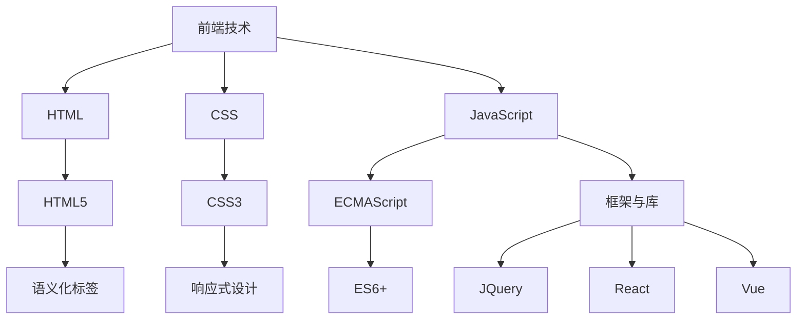
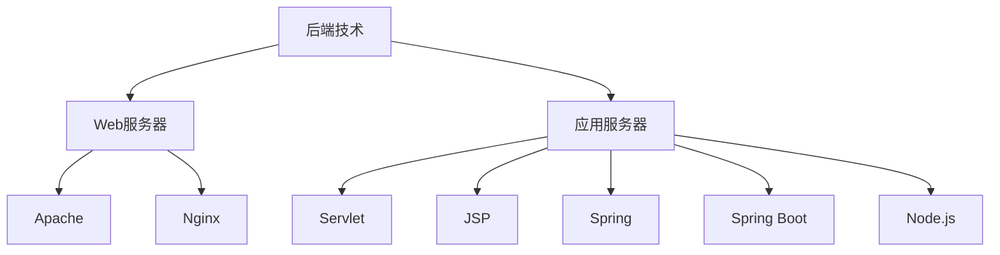
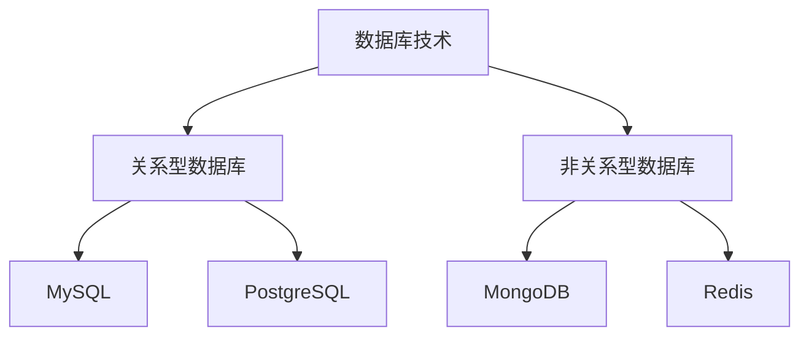

                 

## 引言

在当今快速发展的数字时代，创建数字产品已成为许多企业和开发者的首要任务。数字产品不仅满足了用户日益增长的需求，还为企业在竞争激烈的市场中提供了独特的优势。然而，创建一个成功的数字产品并非易事，它需要深入了解市场、用户需求、技术基础以及项目管理等多方面知识。

本文旨在为读者提供一份详尽的指南，帮助他们在利用技术能力创建数字产品时，能够有条不紊地进行分析和决策。文章将从概述与准备、技术基础、项目实战以及综合运用与优化四个部分展开，逐步深入探讨数字产品的开发过程。

首先，在概述与准备部分，我们将介绍数字产品的定义、分类及其与传统产品的区别，并详细讲解市场调研与用户需求分析的方法。接着，我们将探讨数字产品开发的基本流程和技术储备，以及团队构建的重要性。

在技术基础部分，我们将详细介绍前端技术、后端技术和数据库技术，包括这些技术的核心概念、架构图以及常见应用框架和工具。这部分将为读者奠定扎实的技术基础，使他们能够更好地理解和运用这些技术。

项目实战部分将带领读者通过具体的前端项目、后端项目以及数据库项目实战，了解开发环境搭建、代码实现、代码解读与分析等实际操作过程。这将有助于读者将理论知识应用到实际项目中，提高开发技能。

最后，在综合运用与优化部分，我们将讨论数字产品的测试与质量保证、运营与推广以及优化与迭代策略。这部分内容将帮助读者全面了解数字产品的生命周期，以及如何通过不断优化和迭代提升产品的竞争力。

通过本文的阅读，读者将能够系统地掌握创建数字产品的各项技能和策略，从而在数字化转型的浪潮中，把握机遇，打造出成功的数字产品。

---

### 核心关键词

- 数字产品
- 市场调研
- 技术基础
- 项目实战
- 测试与优化
- 运营推广

---

### 摘要

本文旨在为开发者和企业家提供一整套系统化的指导，详细阐述如何利用技术能力创建数字产品。文章首先概述了数字产品的定义、分类及其与传统产品的区别，接着介绍了市场调研与用户需求分析的方法。随后，我们深入探讨了数字产品开发的技术基础，包括前端技术、后端技术和数据库技术的核心概念及应用框架。接着，通过具体的项目实战，读者将了解到开发环境搭建、代码实现、代码解读与分析等实际操作。最后，文章讨论了数字产品的测试与质量保证、运营与推广以及优化与迭代策略，全面涵盖了数字产品的生命周期管理。通过本文的阅读，读者将能够全面掌握创建数字产品的各项技能和策略，为数字化时代的成功铺平道路。

---

## 《利用技术能力创建数字产品》目录大纲

以下是本文的目录大纲，涵盖了从概述与准备、技术基础、项目实战到综合运用与优化的各个部分。

---

### 第一部分：概述与准备

#### 第1章：数字产品概述

##### 1.1 数字产品的定义与分类

##### 1.2 数字产品的发展趋势

##### 1.3 数字产品与传统产品的区别

#### 第2章：创建数字产品的准备

##### 2.1 市场调研与用户需求分析

##### 2.2 数字产品开发流程

##### 2.3 技术储备与团队构建

### 第二部分：技术基础

#### 第3章：技术能力概述

##### 3.1 前端技术

##### 3.2 后端技术

##### 3.3 数据库技术

#### 第4章：前端技术详解

##### 4.1 常见前端框架

##### 4.2 前端工程化

##### 4.3 前端性能优化

#### 第5章：后端技术详解

##### 5.1 常见后端框架

##### 5.2 后端性能优化

##### 5.3 分布式系统与微服务架构

#### 第6章：数据库技术详解

##### 6.1 关系型数据库

##### 6.2 非关系型数据库

##### 6.3 数据库性能优化

### 第三部分：项目实战

#### 第7章：项目策划与规划

##### 7.1 项目需求分析

##### 7.2 项目计划制定

##### 7.3 项目风险评估与管理

#### 第8章：前端项目实战

##### 8.1 项目环境搭建

##### 8.2 前端代码实现

##### 8.3 前端代码解读与分析

#### 第9章：后端项目实战

##### 9.1 项目环境搭建

##### 9.2 后端代码实现

##### 9.3 后端代码解读与分析

#### 第10章：数据库项目实战

##### 10.1 项目环境搭建

##### 10.2 数据库设计

##### 10.3 数据库操作与性能优化

### 第四部分：综合运用与优化

#### 第11章：数字产品测试与质量保证

##### 11.1 测试策略与计划

##### 11.2 自动化测试

##### 11.3 性能测试与调优

#### 第12章：数字产品运营与推广

##### 12.1 运营策略与计划

##### 12.2 用户行为分析

##### 12.3 产品推广方法

#### 第13章：数字产品优化与迭代

##### 13.1 产品迭代策略

##### 13.2 用户反馈与优化

##### 13.3 产品优化案例分析

### 附录

#### 附录 A：常用技术资源与工具

##### A.1 前端资源与工具

##### A.2 后端资源与工具

##### A.3 数据库资源与工具

---

通过以上目录大纲，读者将逐步了解如何从零开始创建数字产品，并掌握相关技术和策略。现在，让我们正式进入第一部分：概述与准备。

---

### 第1章：数字产品概述

#### 1.1 数字产品的定义与分类

数字产品是指在数字环境中设计、开发和运营的产品，其核心在于通过数字技术实现功能和服务。这些产品可以是纯数字形式，如移动应用、网页、在线服务，也可以是实体产品与数字技术的结合，如智能手表、智能家居设备。

根据功能和服务形式，数字产品可以大致分为以下几类：

1. **软件应用**：如办公软件、游戏、社交媒体平台等，主要通过编程实现特定功能。
2. **在线服务**：如电商平台、在线教育平台、云计算服务等，通过互联网提供持续服务。
3. **硬件结合**：如智能穿戴设备、智能家居设备等，通过嵌入式软件实现硬件与数字服务的结合。
4. **数字内容**：如电子书、音乐、视频流媒体等，通过数字技术传播和提供内容。

#### 1.2 数字产品的发展趋势

随着互联网的普及和技术的不断进步，数字产品的发展呈现出以下几个趋势：

1. **智能化**：人工智能和机器学习技术的应用使得数字产品越来越智能化，能够更好地理解用户需求并提供个性化服务。
2. **移动化**：移动设备的普及和性能的提升使得移动应用成为数字产品的重要组成部分。
3. **云端化**：云计算技术使得数字产品的开发、部署和维护更加灵活和高效，同时也推动了SaaS（软件即服务）模式的兴起。
4. **数据驱动**：大数据和数据分析技术的应用使得数字产品能够通过数据反馈不断优化和迭代，提升用户体验。
5. **跨界融合**：数字技术与传统行业的深度融合，如金融、医疗、教育等领域的数字化转型，创造了新的商业机会。

#### 1.3 数字产品与传统产品的区别

尽管数字产品和传统产品在某些方面有重叠，但它们之间存在显著的区别：

1. **形式**：传统产品通常以物理形态存在，如商品、设备，而数字产品主要以虚拟形态存在，如软件、服务。
2. **交付**：传统产品通过实体渠道交付，而数字产品通常通过互联网渠道交付，具有更高的灵活性和便捷性。
3. **交互**：传统产品与用户的交互主要依赖于物理操作，而数字产品则依赖于图形用户界面和互联网通信。
4. **更新**：传统产品的更新通常需要物理修改或更换，而数字产品可以通过软件更新快速迭代和优化。
5. **成本**：数字产品的开发成本通常较高，但运营成本相对较低，而传统产品的生产和运输成本较高。

理解数字产品与传统产品的区别对于开发数字产品具有重要意义。它不仅有助于明确开发目标，还能为产品的设计和运营提供有力指导。

### 总结

本章对数字产品的定义与分类、发展趋势以及与传统产品的区别进行了详细阐述。在接下来的章节中，我们将深入探讨如何进行市场调研与用户需求分析，为创建成功的数字产品奠定坚实基础。

---

### 第2章：创建数字产品的准备

#### 2.1 市场调研与用户需求分析

创建数字产品的第一步是进行市场调研与用户需求分析。这一阶段的重要性不言而喻，因为它决定了产品是否能够真正满足市场需求，进而影响产品的成功与否。

**市场调研**是一种系统性的方法，旨在收集、分析和评估与市场相关的信息，以便更好地了解市场需求、竞争对手和潜在的机会与挑战。市场调研通常包括以下几个步骤：

1. **确定研究目标**：明确调研的目的和要解决的问题，例如了解目标市场的规模、用户需求、竞争对手的动态等。
2. **数据收集**：通过多种渠道收集数据，包括二手资料（如市场报告、行业数据等）和一手资料（如问卷调查、访谈、用户测试等）。
3. **数据分析**：对收集到的数据进行整理、分析和解释，以揭示市场趋势、用户需求和潜在的机会。
4. **报告撰写**：将分析结果整理成报告，为后续的产品开发提供指导。

**用户需求分析**是市场调研的重要组成部分，其目标是深入了解目标用户的需求和行为，以便设计出满足用户期望的产品。以下是用户需求分析的关键步骤：

1. **确定目标用户**：明确产品的目标用户群体，包括用户的年龄、性别、职业、兴趣等特征。
2. **用户行为研究**：通过用户测试、问卷调查、访谈等方式，了解用户的行为习惯、痛点、需求和期望。
3. **用户画像**：基于收集到的用户数据，构建用户画像，以便更准确地了解用户特征和需求。
4. **需求文档**：将分析结果整理成需求文档，包括功能需求、非功能需求和用户故事，为产品设计和开发提供详细指南。

**市场调研与用户需求分析的方法**：

1. **问卷调查**：通过在线或离线方式向目标用户发放问卷，收集用户对产品功能、用户体验等方面的意见和建议。
2. **访谈**：与目标用户进行一对一或小组访谈，深入了解用户的需求、期望和行为习惯。
3. **用户测试**：通过实际操作产品或原型，观察用户的反馈和行为，评估产品的易用性和功能满足度。
4. **竞品分析**：研究竞争对手的产品和服务，分析其优点和不足，以便在产品设计中有所借鉴和创新。

通过上述方法，开发者可以全面了解市场需求和用户需求，从而设计出更加符合用户期望的数字产品。以下是一个市场调研与用户需求分析的示例：

- **研究目标**：了解目标用户对在线教育平台的需求和期望。
- **数据收集**：通过问卷调查和用户访谈收集用户对课程内容、学习方式、平台交互等方面的意见和建议。
- **数据分析**：整理问卷和访谈数据，统计用户对各个功能模块的评分和满意度。
- **用户画像**：根据数据分析结果，构建目标用户的用户画像，包括年龄段、职业、学习习惯等。
- **需求文档**：根据用户画像和数据分析结果，编写详细的需求文档，包括课程内容、学习方式、用户交互等具体需求。

通过这样的市场调研与用户需求分析，开发者可以确保产品设计的每个环节都紧密围绕用户需求展开，从而提高产品的市场竞争力。

#### 2.2 数字产品开发流程

数字产品开发是一个复杂的过程，需要经历多个阶段，从概念验证到产品发布和维护。以下是数字产品开发的基本流程：

1. **概念验证**（Proof of Concept, PoC）：在这个阶段，开发者通过原型和实验验证产品的基本概念和技术可行性。这通常涉及快速构建一个简化的原型，以展示产品的核心功能和价值。
   
   **示例**：对于一款智能家居设备，开发者可能首先构建一个模拟控制面板，以验证用户是否能够通过应用程序远程控制家居设备。

2. **需求分析**（Requirement Analysis）：在概念验证之后，开发者将详细分析用户需求，定义产品的功能和性能要求。这一阶段通常涉及撰写需求文档，包括功能需求、非功能需求和用户故事。

   **示例**：对于一款社交媒体应用，需求文档可能包括用户注册、发帖、评论、私信等核心功能，以及性能要求，如响应时间和并发用户数。

3. **设计**（Design）：在这个阶段，开发者将创建产品的详细设计，包括用户界面设计、数据库设计、系统架构等。设计文档将为开发提供清晰的蓝图。

   **示例**：用户界面设计可能包括界面布局、颜色方案、字体选择等，而数据库设计可能涉及表结构、关系定义和索引策略。

4. **开发**（Development）：开发阶段是实际编写代码并构建产品的过程。这个阶段通常涉及前端、后端和数据库的开发，以及各种工具和框架的使用。

   **示例**：前端开发可能涉及HTML、CSS和JavaScript，后端开发可能使用Java、Python或Node.js，数据库开发可能使用MySQL或MongoDB。

5. **测试**（Testing）：在开发过程中，开发者将进行多种测试，包括单元测试、集成测试、性能测试和用户测试，以确保产品的质量和稳定性。

   **示例**：单元测试可能验证单个函数或模块的正确性，集成测试可能验证不同模块之间的协同工作，性能测试可能评估系统的响应时间和并发处理能力。

6. **部署**（Deployment）：在测试完成后，产品将被部署到生产环境中，以便用户可以访问和使用。部署可能涉及配置服务器、数据库和应用程序的部署流程。

   **示例**：部署可能包括在云平台上设置虚拟机、配置数据库和部署应用程序代码。

7. **维护与更新**（Maintenance and Updates）：产品发布后，开发者将继续维护和更新产品，以修复缺陷、改进性能和增加新功能。

   **示例**：定期发布安全补丁、改进用户体验和添加新功能，以保持产品的竞争力。

**常见工具和技术**：

- **原型设计工具**：如Axure、Sketch、Figma等，用于创建用户界面原型。
- **版本控制工具**：如Git、Svn，用于代码管理和协作开发。
- **集成开发环境**：如Visual Studio Code、IntelliJ IDEA、Eclipse，用于编写和调试代码。
- **数据库管理系统**：如MySQL、PostgreSQL、MongoDB，用于存储和管理数据。

通过遵循上述开发流程和利用合适的工具和技术，开发者可以确保数字产品的质量，并提高开发效率。

#### 2.3 技术储备与团队构建

在数字产品开发中，技术储备和团队构建是至关重要的。一个高效、专业的开发团队不仅需要具备扎实的技术能力，还需要有明确的角色分工和良好的协作机制。

**技术储备**包括以下几个方面：

1. **编程语言**：熟悉至少一门编程语言，如Java、Python、JavaScript等，是开发数字产品的基石。
2. **前端技术**：掌握HTML、CSS和JavaScript等前端技术，以及流行的前端框架，如React、Vue和Angular。
3. **后端技术**：熟悉后端开发技术，如Java Spring、Node.js、Python Django等，并了解常见的后端框架和架构模式。
4. **数据库技术**：掌握关系型数据库（如MySQL、PostgreSQL）和非关系型数据库（如MongoDB、Redis）的基本原理和操作方法。
5. **云计算与容器技术**：了解云平台服务（如AWS、Azure、Google Cloud）和容器技术（如Docker、Kubernetes）的基本概念和应用。
6. **测试与质量保证**：熟悉自动化测试工具和测试框架，如JUnit、Selenium、JMeter等，并了解性能测试和质量保证的最佳实践。

**团队构建**方面，一个高效的开发团队通常包括以下角色：

1. **项目经理**：负责项目规划、进度管理和团队协调，确保项目按计划进行。
2. **产品经理**：负责产品需求分析、功能设计和用户体验，确保产品满足用户需求。
3. **前端开发工程师**：负责实现用户界面和交互，确保前端代码的兼容性和性能。
4. **后端开发工程师**：负责构建后端逻辑和数据库交互，确保后端服务的稳定性和性能。
5. **测试工程师**：负责编写测试用例、执行测试和缺陷跟踪，确保产品的质量和稳定性。
6. **运维工程师**：负责部署和维护产品，确保系统的可靠性和高效性。
7. **设计师**：负责产品的视觉设计，提升产品的用户体验和品牌形象。

**协作机制**是团队高效工作的关键，常见的协作工具包括：

- **版本控制系统**：如Git，用于代码管理和协作开发。
- **项目管理工具**：如JIRA、Trello、Asana等，用于任务分配、进度跟踪和团队协作。
- **文档管理工具**：如Confluence、GitLab，用于文档编写、存储和共享。
- **即时通讯工具**：如Slack、Microsoft Teams等，用于实时沟通和协作。

通过合理的技术储备和团队构建，以及有效的协作机制，开发者可以确保数字产品的成功开发。

### 总结

本章详细介绍了市场调研与用户需求分析、数字产品开发流程以及技术储备与团队构建的重要性。这些准备工作是创建成功数字产品的基石，为后续的技术实现和项目推进提供了明确的方向和保障。

---

### 第3章：技术能力概述

在数字产品的开发过程中，技术能力是确保项目成功的关键要素。本章节将详细概述前端技术、后端技术和数据库技术，包括这些技术的核心概念、架构图以及常见应用框架和工具。通过这一章节，读者将建立起对数字产品技术基础的整体认识。

#### 3.1 前端技术

前端技术是数字产品开发的重要组成部分，主要负责实现用户界面和交互。以下是一些前端技术的基本概念：

1. **HTML**：超文本标记语言（HTML）是构建网页的基本语言，用于定义网页的结构和内容。
2. **CSS**：层叠样式表（CSS）用于控制网页的样式和布局，如颜色、字体、布局等。
3. **JavaScript**：JavaScript 是一种客户端脚本语言，用于实现网页的动态效果和与用户的交互。

**前端技术架构图：**



在前端技术中，框架和库的使用大大提高了开发效率和代码质量。以下是一些常见的前端框架和库：

- **React**：由Facebook开发，用于构建用户界面的JavaScript库，支持组件化和虚拟DOM。
- **Vue**：是一个渐进式JavaScript框架，易于上手，支持组件化和双向数据绑定。
- **Angular**：由Google开发，是一个全功能的前端框架，提供丰富的功能和工具，如数据绑定、依赖注入等。

**前端工程化**也是现代前端开发的重要部分，涉及构建工具、模块化、代码拆分和性能优化等。常见的前端工程化工具包括Webpack、Gulp和Babel。

#### 3.2 后端技术

后端技术负责处理数据的存储、处理和传输，为前端提供后端支持。以下是一些后端技术的基本概念：

1. **Web服务器**：如Apache、Nginx，用于接收和处理HTTP请求。
2. **应用服务器**：如Tomcat、Jetty，用于运行Java Web应用程序。
3. **Servlet**：Java Servlet是一种用于扩展Web服务器功能的Java类，用于处理客户端请求和生成响应。

**后端技术架构图：**



后端框架是后端开发的基石，以下是一些常见的后端框架：

- **Spring**：由Spring社区开发，是一个全功能的Java框架，支持IoC、AOP、数据访问和Web开发。
- **Spring Boot**：基于Spring框架，提供快速开发和简化配置的特性，适用于构建独立的、生产级别的应用程序。
- **Node.js**：基于Chrome V8引擎的JavaScript运行时，适用于构建高性能、事件驱动的后端服务。

后端性能优化也是开发的重要环节，涉及数据库查询优化、缓存策略、异步处理和负载均衡等。常见的技术包括使用数据库索引、Redis缓存、异步编程和反向代理等。

#### 3.3 数据库技术

数据库技术用于存储和管理数据，为数字产品提供可靠的数据支持。以下是一些数据库技术的基本概念：

1. **关系型数据库**：如MySQL、PostgreSQL，使用SQL语言进行数据查询和操作。
2. **非关系型数据库**：如MongoDB、Redis，提供灵活的数据模型和丰富的查询功能。

**数据库技术架构图：**



关系型数据库和非关系型数据库各有优缺点，关系型数据库适用于结构化数据存储和复杂查询，而非关系型数据库适用于快速数据存储和大规模数据集合。

常见的数据库优化技术包括：

- **索引优化**：通过创建适当的索引，提高查询效率。
- **分库分表**：将数据分散存储在不同的数据库或表中，提高系统的可扩展性。
- **读写分离**：通过主从复制和读写分离，提高系统的并发能力和性能。

通过本章的介绍，读者可以对前端技术、后端技术和数据库技术有一个全面的认识，为后续的具体技术讲解和项目实战奠定基础。

---

### 第4章：前端技术详解

在前端技术中，框架和库的使用极大地提升了开发效率和代码质量。本章节将详细探讨前端技术的各个方面，包括常见前端框架、前端工程化以及前端性能优化。通过这些内容，读者将能够更好地掌握前端技术的核心概念和应用。

#### 4.1 常见前端框架

前端框架是前端开发中的重要工具，能够提供组件化、模块化和高效开发的支持。以下是一些常见的前端框架及其特点：

1. **React**：由Facebook开发，是一个用于构建用户界面的JavaScript库。React采用虚拟DOM和组件化架构，使得开发者能够以声明式的方式构建交互式界面。React的组件化设计使得代码可重用性强，并且可以通过工具如Create React App快速搭建项目。

   **React 组件创建与渲染：**
   ```javascript
   class MyComponent extends React.Component {
     render() {
       return (
         <div>
           <h1>{this.props.title}</h1>
           <p>{this.props.description}</p>
         </div>
       );
     }
   }

   ReactDOM.render(<MyComponent title="Hello World" description="Welcome to my app." />, document.getElementById('app'));
   ```

2. **Vue**：Vue是一个渐进式JavaScript框架，易于上手，具有高性能和高灵活性。Vue的核心库专注于视图层，通过引入路由、状态管理和构建工具，Vue可以用于开发完整的单页面应用（SPA）。Vue的双向数据绑定和组件化设计使得开发过程更加直观和高效。

   **Vue 组件创建与渲染：**
   ```html
   <template>
     <div>
       <h1>{{ title }}</h1>
       <p>{{ description }}</p>
     </div>
   </template>

   <script>
   export default {
     data() {
       return {
         title: 'Hello World',
         description: 'Welcome to my app.'
       };
     }
   };
   </script>
   ```

3. **Angular**：Angular是由Google开发的一个全功能的前端框架，适用于构建大型单页面应用。Angular提供了丰富的功能，如数据绑定、依赖注入、指令和模块化架构。Angular的严格类型定义和强约束性使得代码结构更加清晰和易于维护。

   **Angular 组件创建与渲染：**
   ```typescript
   import { Component } from '@angular/core';

   @Component({
     selector: 'app-my-component',
     template: `
       <div>
         <h1>{{ title }}</h1>
         <p>{{ description }}</p>
       </div>
     `
   })
   export class MyComponent {
     title = 'Hello World';
     description = 'Welcome to my app.';
   }
   ```

#### 4.2 前端工程化

前端工程化是指通过一系列工具和流程，提高前端开发的效率和质量。以下是一些常见的前端工程化概念和工具：

1. **Webpack**：Webpack是一个模块打包工具，用于将多个模块文件打包为一个或多个 bundle 文件。Webpack支持代码拆分、懒加载、模块热替换等特性，能够极大地提升开发效率。

   **Webpack 配置示例：**
   ```javascript
   const path = require('path');

   module.exports = {
     entry: './src/index.js',
     output: {
       filename: 'bundle.js',
       path: path.resolve(__dirname, 'dist'),
     },
     module: {
       rules: [
         {
           test: /\.css$/,
           use: ['style-loader', 'css-loader'],
         },
         {
           test: /\.js$/,
           exclude: /node_modules/,
           use: {
             loader: 'babel-loader',
             options: {
               presets: ['@babel/preset-env'],
             },
           },
         },
       ],
     },
   };
   ```

2. **Babel**：Babel是一个JavaScript 转译器，用于将 ES6+ 代码转换为向后兼容的 ES5 代码，使得开发者可以使用最新的 JavaScript 特性而无需担心兼容性问题。Babel 配合 Webpack 可以实现代码的自动转换和打包。

   **Babel 配置示例：**
   ```json
   {
     "presets": ["@babel/preset-env"],
     "plugins": ["@babel/plugin-proposal-class-properties"]
   }
   ```

3. **ESLint**：ESLint是一个代码检查工具，用于识别和报告 JavaScript 代码中的错误和不符合编码规范的问题。ESLint 配合编辑器插件可以实现实时代码检查和格式化。

   **ESLint 配置示例：**
   ```json
   {
     "extends": "eslint:recommended",
     "env": {
       "browser": true,
       "node": true,
       "es2021": true
     },
     "rules": {
       "indent": ["error", 2],
       "linebreak-style": ["error", "unix"],
       "quotes": ["error", "double"],
       "semi": ["error", "always"]
     }
   }
   ```

#### 4.3 前端性能优化

前端性能优化是提高用户体验和网站性能的重要手段。以下是一些常见的前端性能优化策略：

1. **懒加载**：懒加载是指仅在用户需要时才加载资源，如图片、视频和 JavaScript 文件。通过懒加载，可以减少页面初始加载时间，提高性能。

   **LazyLoad 伪代码示例：**
   ```javascript
   import React, { useEffect, useState } from 'react';

   const LazyLoad = ({ src, alt }) => {
     const [imageSrc, setImageSrc] = useState('');

     useEffect(() => {
       const image = new Image();
       image.src = src;
       image.onload = () => {
         setImageSrc(src);
       };
     }, [src]);

     return (
       
     );
   };

   export default LazyLoad;
   ```

2. **代码分割**：代码分割是将一个大型的 JavaScript 文件分割成多个小块，按需加载。通过代码分割，可以减少页面加载时间，提高性能。

   **Webpack 代码分割示例：**
   ```javascript
   const express = require('express');
   const path = require('path');

   const app = express();

   app.get('/', (req, res) => {
     res.sendFile(path.join(__dirname, 'index.html'));
   });

   app.get('/main.js', (req, res) => {
     res.sendFile(path.join(__dirname, 'dist', 'main.js'));
   });

   app.listen(3000, () => {
     console.log('Server running on port 3000');
   });
   ```

3. **缓存策略**：缓存策略是指利用浏览器缓存来存储已经加载的资源，减少重复请求。合理设置缓存策略可以显著提高页面加载速度。

   **Cache-Control 示例：**
   ```http
   HTTP/1.1 200 OK
   Cache-Control: public, max-age=31536000
   Content-Type: text/html
   ...
   ```

通过掌握前端技术的核心概念和应用，合理使用框架和工具，以及实施有效的性能优化策略，开发者可以构建高效、可维护且用户友好的前端应用。

---

### 第5章：后端技术详解

后端技术是数字产品的重要组成部分，负责处理数据的存储、处理和传输，为前端提供后端支持。本章节将详细介绍后端技术，包括常见后端框架、后端性能优化和分布式系统与微服务架构。通过这一章节，读者将能够全面了解后端技术的核心概念和应用。

#### 5.1 常见后端框架

后端框架是后端开发的核心工具，它们提供了高效的代码结构和丰富的功能，使得开发者能够快速构建和部署后端应用。以下是一些常见后端框架及其特点：

1. **Spring**：Spring 是由 Spring 社区开发的一个全功能 Java 框架，它支持企业级的开发需求，包括依赖注入、数据访问、事务管理和 Web 开发。Spring 框架具有高度的可配置性和灵活性，适用于构建复杂的企业级应用。

   **Spring 控制器示例：**
   ```java
   @RestController
   @RequestMapping("/api")
   public class MyController {

     @Autowired
     private MyService myService;

     @GetMapping("/hello")
     public String sayHello() {
       return myService.sayHello();
     }

   }
   ```

2. **Spring Boot**：Spring Boot 是基于 Spring 框架的一个快速开发框架，它提供了简化配置、自动化配置和独立部署的特性。Spring Boot 的核心目标是减少开发者的配置工作，使得应用能够快速启动和运行。

   **Spring Boot 应用示例：**
   ```java
   @SpringBootApplication
   public class MyApplication {

     public static void main(String[] args) {
       SpringApplication.run(MyApplication.class, args);
     }

   }
   ```

3. **Node.js**：Node.js 是一个基于 Chrome V8 引擎的 JavaScript 运行时，它允许开发者使用 JavaScript 编写服务器端代码。Node.js 具有高性能、事件驱动和非阻塞 I/O 特性，适用于构建实时应用和大规模分布式系统。

   **Node.js 服务器示例：**
   ```javascript
   const http = require('http');

   const server = http.createServer((req, res) => {
     res.writeHead(200, { 'Content-Type': 'text/plain' });
     res.end('Hello World\n');
   });

   server.listen(3000, () => {
     console.log('Server running at http://localhost:3000/');
   });
   ```

4. **Django**：Django 是一个高效的全栈 Python Web 框架，它遵循 MVC 设计模式，提供了自动化的数据库迁移、表单处理和缓存支持。Django 的简洁和快速开发特性使其成为初学者和大型项目的理想选择。

   **Django 视图示例：**
   ```python
   from django.http import HttpResponse

   def hello_world(request):
       return HttpResponse("Hello, world!")
   ```

#### 5.2 后端性能优化

后端性能优化是提升应用响应速度和系统稳定性的关键。以下是一些常见的后端性能优化策略：

1. **数据库优化**：数据库是后端性能的关键瓶颈，通过合理的数据库设计和查询优化，可以提高系统的性能。

   **索引优化示例：**
   ```sql
   CREATE INDEX idx_user_username ON users(username);
   ```

2. **缓存策略**：使用缓存可以减少数据库的访问次数，提高系统的响应速度。常见缓存策略包括内存缓存、Redis 缓存和数据库缓存。

   **Redis 缓存示例：**
   ```java
   Jedis jedis = new Jedis("localhost");
   jedis.set("user_1", "John Doe");
   String user = jedis.get("user_1");
   jedis.close();
   ```

3. **负载均衡**：通过负载均衡可以将流量分配到多个服务器上，提高系统的并发处理能力和可用性。

   **Nginx 负载均衡示例：**
   ```nginx
   http {
       upstream myapp {
           server server1.example.com;
           server server2.example.com;
           server server3.example.com;
       }

       server {
           location / {
               proxy_pass http://myapp;
           }
       }
   }
   ```

4. **异步处理**：通过异步处理可以减少线程的占用，提高系统的并发能力和响应速度。常见异步处理技术包括消息队列和异步调用。

   **异步调用示例：**
   ```javascript
   async function fetchData() {
       const data = await fetch('https://api.example.com/data');
       console.log(data);
   }

   fetchData();
   ```

#### 5.3 分布式系统与微服务架构

分布式系统和微服务架构是现代后端开发的重要方向，它们可以提高系统的可扩展性和可靠性。

1. **分布式系统**：分布式系统是通过多个独立的节点协同工作来提供服务的系统。分布式系统具有高可用性、高性能和可扩展性的优点，但同时也引入了分布式一致性、数据一致性和容错性等挑战。

   **分布式一致性示例：**
   ```java
   public class DistributedSystem {
       private final AtomicReference<State> state = new AtomicReference<>(new InitialState());

       public void setState(State newState) {
           state.compareAndSet(state.get(), newState);
       }

       public State getState() {
           return state.get();
       }
   }
   ```

2. **微服务架构**：微服务架构是将应用程序划分为多个独立的服务，每个服务负责特定的业务功能。微服务架构可以提高系统的灵活性和可维护性，但同时也需要解决服务间通信、服务发现和分布式事务等问题。

   **服务发现示例：**
   ```java
   @Service
   public class ServiceRegistry {

       @Value("${spring.cloud.client.hostname}")
       private String hostname;

       @Value("${server.port}")
       private int port;

       @Bean
       public consul.ConsulClient consulClient() {
           return new consul.ConsulClient();
       }

       @PostConstruct
       public void registerService() {
           String serviceId = "my-service:" + hostname + ":" + port;
           String serviceAddress = hostname + ":" + port;

           consulClient.service.register(new ServiceRegistration()
               .setName("my-service")
               .setId(serviceId)
               .setTags(Arrays.asList("api"))
               .setAddress(serviceAddress));
       }
   }
   ```

通过掌握后端技术的核心概念和应用，合理选择合适的后端框架和优化策略，开发者可以构建高效、可靠且具有高扩展性的后端系统。

---

### 第6章：数据库技术详解

数据库技术是数字产品开发中的核心组成部分，负责存储、管理和查询数据。本章将详细介绍数据库技术，包括关系型数据库、非关系型数据库和数据库性能优化。

#### 6.1 关系型数据库

关系型数据库（RDBMS）是一种使用SQL（结构化查询语言）进行数据操作和管理的关系数据库。以下是一些常见的关系型数据库及其特点：

1. **MySQL**：MySQL 是一款开源的关系型数据库，广泛用于 Web 开发和大数据应用。它具有高性能、高可靠性和易用性，是互联网企业常用的数据库之一。

   **MySQL 数据库查询示例：**
   ```sql
   SELECT * FROM users WHERE id = 1;
   ```

2. **PostgreSQL**：PostgreSQL 是一款开源的关系型数据库，具有高度灵活性和扩展性。它支持多种数据类型和高级功能，如事务、触发器和规则系统，适用于复杂的数据应用。

   **PostgreSQL 数据库查询示例：**
   ```sql
   SELECT * FROM users WHERE username = 'john_doe';
   ```

3. **SQL Server**：SQL Server 是 Microsoft 开发的一款商业关系型数据库，具有强大的数据存储和管理功能，广泛用于企业级应用。它提供了丰富的管理和优化工具，支持高可用性和灾难恢复。

   **SQL Server 数据库查询示例：**
   ```sql
   SELECT * FROM users WHERE email = 'john.doe@example.com';
   ```

关系型数据库的基本架构包括表、行和列。表是数据存储的基本单位，行是数据记录，列是数据字段。关系型数据库通过表与表之间的关联（如外键）来维护数据的一致性和完整性。

**关系型数据库性能优化策略：**
- **索引优化**：通过创建适当的索引，可以显著提高查询性能。索引应针对常用的查询条件和排序字段。
- **查询优化**：优化 SQL 查询语句，如使用 EXISTS 替代 IN、避免子查询等，可以减少查询的执行时间。
- **分库分表**：在数据量巨大时，可以通过分库分表来降低单个数据库的压力，提高查询性能。

#### 6.2 非关系型数据库

非关系型数据库（NoSQL）是一种不同于关系型数据库的数据存储解决方案，它提供了更高的灵活性和扩展性。以下是一些常见的非关系型数据库及其特点：

1. **MongoDB**：MongoDB 是一款开源的文档型数据库，采用 JSON-like 的文档结构进行数据存储。它支持横向扩展、灵活的数据模型和高可用性，适用于大规模数据存储和实时应用。

   **MongoDB 数据库查询示例：**
   ```javascript
   db.users.find({ "_id": ObjectId("6024e8e6d23a563701a1c5f3") });
   ```

2. **Redis**：Redis 是一款开源的内存数据库，常用于缓存和实时应用。它支持多种数据结构，如字符串、列表、集合和哈希，具有高性能和低延迟的特点。

   **Redis 数据库查询示例：**
   ```redis
   SET user_1 John Doe
   GET user_1
   ```

3. **Cassandra**：Cassandra 是一款开源的分布式宽列数据库，适用于大规模数据存储和实时读取应用。它具有高可用性、容错性和可扩展性，适用于分布式系统。

   **Cassandra 数据库查询示例：**
   ```cql
   SELECT * FROM users WHERE id = 1;
   ```

非关系型数据库的数据模型更加灵活，可以存储不同类型的数据，如文档、键值对、列族等。非关系型数据库通常不需要固定的表结构，这使得它们在处理大量动态数据时更加高效。

**非关系型数据库性能优化策略：**
- **数据分片**：通过数据分片可以将数据分散存储在不同的节点上，提高查询性能和系统扩展性。
- **索引优化**：非关系型数据库通常支持不同的索引策略，通过选择合适的索引可以提高查询效率。
- **缓存策略**：使用缓存可以减少数据库的访问次数，提高系统的响应速度。

#### 6.3 数据库性能优化

数据库性能优化是确保系统高效运行的重要环节。以下是一些常见的数据库性能优化策略：

1. **索引优化**：通过创建适当的索引，可以显著提高查询性能。索引应针对常用的查询条件和排序字段。

   **创建索引示例：**
   ```sql
   CREATE INDEX idx_user_username ON users(username);
   ```

2. **查询优化**：优化 SQL 查询语句，如避免子查询、使用 EXISTS 替代 IN、使用合适的 JOIN 类型等，可以减少查询的执行时间。

   **优化查询示例：**
   ```sql
   SELECT * FROM orders o WHERE o.order_date BETWEEN '2023-01-01' AND '2023-01-31';
   ```

3. **缓存策略**：使用缓存可以减少数据库的访问次数，提高系统的响应速度。常见的缓存策略包括内存缓存和 Redis 缓存。

   **缓存策略示例：**
   ```java
   Jedis jedis = new Jedis("localhost");
   jedis.set("user_1", "John Doe");
   String user = jedis.get("user_1");
   jedis.close();
   ```

4. **分库分表**：在数据量巨大时，可以通过分库分表来降低单个数据库的压力，提高查询性能。

   **分库分表示例：**
   ```sql
   CREATE TABLE users_1 (
       id INT PRIMARY KEY,
       username VARCHAR(50),
       ...
   );

   CREATE TABLE users_2 (
       id INT PRIMARY KEY,
       username VARCHAR(50),
       ...
   );
   ```

通过掌握关系型数据库和非关系型数据库的核心概念和优化策略，开发者可以构建高效、可靠且具有高性能的数据库系统。

---

### 第7章：项目策划与规划

在数字产品的开发过程中，项目策划与规划是确保项目成功的关键环节。本章将详细讨论项目策划与规划的重要环节，包括项目需求分析、项目计划制定以及项目风险评估与管理。

#### 7.1 项目需求分析

项目需求分析是项目策划与规划的第一步，旨在明确产品的功能需求、性能需求和用户需求。以下是项目需求分析的具体步骤和方法：

1. **明确项目目标**：首先，需要明确项目的整体目标，包括产品的功能、性能和商业目标。这将为后续的需求分析提供方向。

   **示例**：开发一款在线教育平台，目标是在6个月内推出，提供视频课程、直播课程、在线作业和考试功能。

2. **收集需求信息**：通过访谈、问卷调查、用户调研等方式，收集用户的真实需求和反馈。这有助于了解用户的使用场景和痛点。

   **示例**：通过用户访谈，发现用户对视频播放质量、课程分类和互动性有较高要求。

3. **需求文档编写**：将收集到的需求信息整理成需求文档，包括功能需求、非功能需求和用户故事。需求文档是项目开发和测试的重要依据。

   **示例**：功能需求包括课程视频上传、用户注册、课程分类和互动评论等；非功能需求包括系统稳定性、安全性和响应速度等。

4. **需求评审**：组织相关利益相关者（如产品经理、开发人员、测试人员等）对需求文档进行评审，确保需求的完整性和可行性。

   **示例**：在评审过程中，技术团队指出某些功能实现可能存在技术难题，需要调整需求。

#### 7.2 项目计划制定

项目计划制定是将需求转化为实际开发任务的关键步骤。以下是项目计划制定的具体步骤和方法：

1. **确定项目范围**：明确项目的范围，包括要实现的功能、不包含的功能以及项目的边界。

   **示例**：确定在线教育平台的基本功能，如课程视频上传、用户注册、课程分类等，但不包括课程内容的版权管理。

2. **制定工作计划**：根据需求文档，将项目分解为多个任务和里程碑，制定详细的工作计划。

   **示例**：将项目分为以下阶段：需求分析、UI设计、前端开发、后端开发、测试和部署。

3. **分配资源**：根据任务和里程碑，合理分配开发人员、测试人员、设计师等资源，确保项目的顺利进行。

   **示例**：前端开发由3人负责，后端开发由2人负责，测试人员由1人负责。

4. **设定时间表**：为每个任务和里程碑设定合理的完成时间，形成项目时间表。

   **示例**：需求分析阶段需要2周时间，UI设计阶段需要3周时间，前端开发阶段需要4周时间，后端开发阶段需要4周时间，测试阶段需要2周时间，部署阶段需要1周时间。

5. **风险评估**：识别项目中可能遇到的风险，并制定相应的应对策略。

   **示例**：识别技术难题、人员变动、资源不足等风险，并制定相应的解决方案，如增加人力资源、延迟项目时间等。

#### 7.3 项目风险评估与管理

项目风险管理是确保项目在预定时间内成功完成的必要环节。以下是项目风险评估与管理的方法：

1. **风险识别**：在项目规划阶段，识别项目中可能遇到的风险。常见的风险包括技术风险、市场风险、人员风险和资源风险。

   **示例**：技术风险包括数据库性能问题、前端框架不兼容等；市场风险包括竞争对手、市场需求变化等。

2. **风险分析**：对识别出的风险进行分析，评估其发生概率和影响程度。常见的分析方法包括风险矩阵和风险优先级排序。

   **示例**：使用风险矩阵评估技术风险，将其分为高概率高影响、高概率低影响等不同类别。

3. **风险应对策略**：根据风险分析结果，制定相应的应对策略，包括风险规避、减轻、转移和接受。

   **示例**：对于高概率高影响的技术风险，可以采取技术预研、引入替代技术等方法进行规避。

4. **风险监控**：在项目实施过程中，持续监控风险的发生和变化，及时调整应对策略。

   **示例**：定期召开项目会议，讨论风险状况，并根据实际情况调整项目计划和资源分配。

通过项目策划与规划，开发团队可以明确项目目标、合理分配资源、有效管理风险，确保数字产品顺利开发并按时交付。

---

### 第8章：前端项目实战

在前端项目中，从环境搭建到代码实现，每一步都需要细心规划和执行。本章将通过一个具体的前端项目实战，详细描述开发环境搭建、前端代码实现以及代码解读与分析。这一过程将帮助读者将理论应用到实践，掌握前端项目的开发技巧。

#### 8.1 项目环境搭建

一个成功的前端项目需要一个良好的开发环境。以下是在创建前端项目时所需的环境搭建步骤：

1. **安装 Node.js 与 npm**：Node.js 是 JavaScript 的运行环境，npm 是 Node.js 的包管理器。首先，从 [Node.js 官网](https://nodejs.org/) 下载并安装 Node.js。安装完成后，通过命令行检查版本，确保安装成功。
   ```bash
   node -v
   npm -v
   ```

2. **使用 `create-react-app` 创建项目**：`create-react-app` 是一个由 Facebook 提供的工具，用于快速搭建 React 应用。
   ```bash
   npx create-react-app my-frontend-project
   cd my-frontend-project
   ```

3. **安装必要的依赖包**：根据项目需求，安装必要的依赖包。例如，如果要使用 React Router 进行页面跳转，可以执行以下命令：
   ```bash
   npm install react-router-dom
   ```

4. **配置 Web 服务器**：为了在开发过程中方便调试，可以使用 Web 服务器。在项目中安装 `http-server`。
   ```bash
   npm install -g http-server
   ```

5. **启动本地开发服务器**：在项目目录下启动开发服务器。
   ```bash
   http-server -p 3000
   ```

通过以上步骤，一个基本的前端开发环境就搭建完成了。开发者可以在浏览器中访问 `http://localhost:3000` 来查看项目。

#### 8.2 前端代码实现

在环境搭建完成后，我们可以开始实现前端代码。以下是一个简单的 React 应用示例，包含主页和关于页面的基本功能。

1. **创建组件**：在 React 应用中，组件是构建用户界面的基础。首先，我们创建两个组件 `Home` 和 `About`。

   **Home 组件：**
   ```jsx
   // Home.js
   import React from 'react';

   function Home() {
     return (
       <div>
         <h1>Welcome to the Home Page</h1>
         <p>This is the homepage of our application.</p>
       </div>
     );
   }

   export default Home;
   ```

   **About 组件：**
   ```jsx
   // About.js
   import React from 'react';

   function About() {
     return (
       <div>
         <h1>About Us</h1>
         <p>This page provides information about our application.</p>
       </div>
     );
   }

   export default About;
   ```

2. **创建路由**：使用 `react-router-dom` 实现页面跳转。

   **App 组件：**
   ```jsx
   // App.js
   import React from 'react';
   import { BrowserRouter as Router, Route, Switch } from 'react-router-dom';
   import Home from './Home';
   import About from './About';

   function App() {
     return (
       <Router>
         <div>
           <nav>
             <ul>
               <li><a href="/home">Home</a></li>
               <li><a href="/about">About</a></li>
             </ul>
           </nav>
           <Switch>
             <Route path="/home" component={Home} />
             <Route path="/about" component={About} />
           </Switch>
         </div>
       </Router>
     );
   }

   export default App;
   ```

3. **样式配置**：使用 CSS 对组件进行样式配置，确保页面美观。

   **App.css：**
   ```css
   body {
     font-family: Arial, sans-serif;
   }

   nav ul {
     list-style-type: none;
     padding: 0;
   }

   nav ul li {
     display: inline-block;
     margin-right: 20px;
   }

   nav ul li a {
     text-decoration: none;
     color: blue;
   }
   ```

4. **运行项目**：在项目目录下启动开发服务器，并打开浏览器查看效果。
   ```bash
   npm start
   ```

通过以上步骤，我们创建了一个简单的 React 应用，包含主页和关于页面。接下来，我们将对代码进行解读与分析。

#### 8.3 前端代码解读与分析

在前端代码实现部分，我们使用了 React 和 React Router 等库和框架。以下是对关键代码的解读与分析：

1. **组件（Components）**：React 组件是 React 应用程序的基本构建块。每个组件都有自己的状态（State）和属性（Props）。在 `Home` 和 `About` 组件中，我们定义了基本的 UI 结构和内容。

   **Home.js 解读：**
   ```jsx
   function Home() {
     return (
       <div>
         <h1>Welcome to the Home Page</h1>
         <p>This is the homepage of our application.</p>
       </div>
     );
   }
   ```

   解读：`Home` 组件返回一个 JSX 结构，包括一个 `h1` 标题和一个 `p` 段落。JSX 是一种 JavaScript 语法扩展，使得 HTML 结构可以嵌入到 JavaScript 代码中。

2. **路由（Routing）**：React Router 是 React 应用的路由管理库。通过 `BrowserRouter`、`Route` 和 `Switch` 组件，我们可以实现单页面应用（SPA）中的页面跳转。

   **App.js 解读：**
   ```jsx
   <Router>
     <div>
       <nav>
         <ul>
           <li><a href="/home">Home</a></li>
           <li><a href="/about">About</a></li>
         </ul>
       </nav>
       <Switch>
         <Route path="/home" component={Home} />
         <Route path="/about" component={About} />
       </Switch>
     </div>
   </Router>
   ```

   解读：`Router` 组件是 React Router 的入口，用于配置路由。`nav` 标签定义导航菜单，`Switch` 组件确保在当前路径下只渲染一个 `Route`。`Route` 组件用于定义路由和对应的组件。

3. **样式（Styling）**：CSS 用于定义组件的样式。在 `App.css` 中，我们使用了基础的样式规则，确保页面布局美观。

   **App.css 解读：**
   ```css
   body {
     font-family: Arial, sans-serif;
   }

   nav ul {
     list-style-type: none;
     padding: 0;
   }

   nav ul li {
     display: inline-block;
     margin-right: 20px;
   }

   nav ul li a {
     text-decoration: none;
     color: blue;
   }
   ```

   解读：这些样式规则定义了页面的字体、导航菜单的布局和样式。通过使用 `inline-block` 和 `margin-right`，我们确保导航菜单项在水平方向上对齐，并通过 `text-decoration` 和 `color` 规则，为链接添加了下划线和颜色。

通过前端项目实战，读者可以了解如何搭建前端开发环境、实现前端代码以及解读代码背后的原理。这一过程不仅有助于提高前端开发技能，还能为实际项目提供实践经验。

---

### 第9章：后端项目实战

在后端项目中，从环境搭建到代码实现，每一步都需要精心规划。本章将通过一个具体的后端项目实战，详细描述开发环境搭建、后端代码实现以及代码解读与分析，帮助读者将理论应用到实践。

#### 9.1 项目环境搭建

一个成功的后端项目需要一个稳定的开发环境。以下是搭建后端开发环境所需的基本步骤：

1. **安装 Java 与 Maven**：Java 是一种广泛使用的编程语言，Maven 是 Java 的项目管理和构建工具。首先，从 [Java 官网](https://www.oracle.com/java/technologies/javase-jdk15-downloads.html) 下载并安装 Java。然后，从 [Maven 官网](https://maven.apache.org/download.cgi) 下载并安装 Maven。

   ```bash
   java -version
   mvn -v
   ```

2. **创建 Spring Boot 项目**：使用 [Spring Initializr](https://start.spring.io/) 创建 Spring Boot 项目。在网站上选择项目语言、Java 版本、依赖项（如 Spring Web、Spring Data JPA、MySQL Driver）等，然后生成项目。

3. **下载并导入项目**：下载生成的项目压缩包，解压后导入到 IntelliJ IDEA 或 Eclipse 等开发环境中。

4. **配置数据库连接**：在 `application.properties` 文件中配置数据库连接信息，如数据库地址、用户名和密码。
   ```properties
   spring.datasource.url=jdbc:mysql://localhost:3306/my_db
   spring.datasource.username=root
   spring.datasource.password=123456
   spring.jpa.hibernate.ddl-auto=update
   ```

5. **运行项目**：启动 Spring Boot 应用程序。
   ```bash
   mvn spring-boot:run
   ```

在浏览器中访问 `http://localhost:8080/`，如果看到应用程序的默认页面，说明环境搭建成功。

#### 9.2 后端代码实现

在环境搭建完成后，我们可以开始实现后端代码。以下是一个简单的 Spring Boot 应用示例，包括用户注册和登录功能。

1. **创建实体类**：定义用户实体类 `User`，包括用户名、密码和邮箱等属性。
   ```java
   @Entity
   @Table(name = "users")
   public class User {
       @Id
       @GeneratedValue(strategy = GenerationType.IDENTITY)
       private Long id;

       @Column(nullable = false, unique = true)
       private String username;

       @Column(nullable = false)
       private String password;

       @Column(nullable = false)
       private String email;

       // getters and setters
   }
   ```

2. **创建数据访问层**：定义用户数据访问接口 `UserRepository`，扩展 `JpaRepository`。
   ```java
   public interface UserRepository extends JpaRepository<User, Long> {
       User findByUsername(String username);
   }
   ```

3. **创建业务逻辑层**：定义用户服务类 `UserService`，实现用户注册和登录逻辑。
   ```java
   @Service
   public class UserService {
       @Autowired
       private UserRepository userRepository;

       public User registerUser(String username, String password, String email) {
           User user = new User();
           user.setUsername(username);
           user.setPassword(password);
           user.setEmail(email);
           return userRepository.save(user);
       }

       public User authenticateUser(String username, String password) {
           return userRepository.findByUsername(username)
                   .filter(user -> passwordEncoder.matches(password, user.getPassword()))
                   .orElseThrow(() -> new RuntimeException("Invalid credentials"));
       }
   }
   ```

4. **创建控制器**：定义用户控制器 `UserController`，处理 HTTP 请求。
   ```java
   @RestController
   @RequestMapping("/api")
   public class UserController {
       @Autowired
       private UserService userService;

       @Autowired
       private PasswordEncoder passwordEncoder;

       @PostMapping("/register")
       public ResponseEntity<?> registerUser(@RequestBody UserRequest userRequest) {
           try {
               User user = userService.registerUser(userRequest.getUsername(),
                       passwordEncoder.encode(userRequest.getPassword()), userRequest.getEmail());
               return ResponseEntity.ok("User registered successfully");
           } catch (Exception e) {
               return ResponseEntity.badRequest().body(e.getMessage());
           }
       }

       @PostMapping("/login")
       public ResponseEntity<?> authenticateUser(@RequestBody LoginRequest loginRequest) {
           try {
               User user = userService.authenticateUser(loginRequest.getUsername(), loginRequest.getPassword());
               return ResponseEntity.ok("Authentication successful");
           } catch (Exception e) {
               return ResponseEntity.badRequest().body(e.getMessage());
           }
       }
   }
   ```

5. **配置 JWT**：使用 JSON Web Token（JWT）实现用户认证。首先，添加依赖项，然后配置 JWT 认证。
   ```xml
   <dependency>
       <groupId>io.jsonwebtoken</groupId>
       <artifactId>jjwt</artifactId>
       <version>0.9.1</version>
   </dependency>
   ```

   ```java
   @Bean
   public JwtTokenProvider jwtTokenProvider() {
       return new JwtTokenProvider("mySecretKey");
   }
   ```

通过以上步骤，我们创建了一个简单的 Spring Boot 应用，实现了用户注册和登录功能。接下来，我们将对关键代码进行解读与分析。

#### 9.3 后端代码解读与分析

在后端代码实现部分，我们使用了 Spring Boot、JWT 等框架和技术。以下是对关键代码的解读与分析：

1. **实体类（Entity）**：`User` 类是用户实体，使用 `@Entity` 和 `@Table` 注解定义了数据表。使用 `@Id` 和 `@GeneratedValue` 注解定义了主键生成策略。使用 `@Column` 注解定义了字段属性，并设置了 `nullable` 和 `unique` 标志。

   **User.java 解读：**
   ```java
   @Entity
   @Table(name = "users")
   public class User {
       @Id
       @GeneratedValue(strategy = GenerationType.IDENTITY)
       private Long id;

       @Column(nullable = false, unique = true)
       private String username;

       @Column(nullable = false)
       private String password;

       @Column(nullable = false)
       private String email;

       // getters and setters
   }
   ```

   解读：通过使用 JPA 注解，我们定义了用户实体及其映射关系。这些注解提供了数据库表和实体的映射定义。

2. **数据访问层（Repository）**：`UserRepository` 接口扩展了 `JpaRepository`，提供了基本的 CRUD 操作。使用 `findByUsername` 方法实现了按用户名查询用户的功能。

   **UserRepository.java 解读：**
   ```java
   public interface UserRepository extends JpaRepository<User, Long> {
       User findByUsername(String username);
   }
   ```

   解读：`JpaRepository` 提供了丰富的查询方法，通过扩展接口，我们可以自定义查询方法，提高代码的可维护性和扩展性。

3. **业务逻辑层（Service）**：`UserService` 类是业务逻辑层的核心，实现了用户注册和登录功能。使用 `@Service` 注解将类标识为服务组件，使用 `@Autowired` 注解注入 `UserRepository` 和 `PasswordEncoder`。

   **UserService.java 解读：**
   ```java
   @Service
   public class UserService {
       @Autowired
       private UserRepository userRepository;

       public User registerUser(String username, String password, String email) {
           User user = new User();
           user.setUsername(username);
           user.setPassword(password);
           user.setEmail(email);
           return userRepository.save(user);
       }

       public User authenticateUser(String username, String password) {
           return userRepository.findByUsername(username)
                   .filter(user -> passwordEncoder.matches(password, user.getPassword()))
                   .orElseThrow(() -> new RuntimeException("Invalid credentials"));
       }
   }
   ```

   解读：在注册用户时，创建 `User` 对象并保存到数据库。在认证用户时，通过查询用户名和密码验证用户的身份。

4. **控制器（Controller）**：`UserController` 类是 Spring MVC 的控制器，处理 HTTP 请求。使用 `@RestController` 和 `@RequestMapping` 注解定义了请求映射和处理逻辑。

   **UserController.java 解读：**
   ```java
   @RestController
   @RequestMapping("/api")
   public class UserController {
       @Autowired
       private UserService userService;

       @Autowired
       private PasswordEncoder passwordEncoder;

       @PostMapping("/register")
       public ResponseEntity<?> registerUser(@RequestBody UserRequest userRequest) {
           try {
               User user = userService.registerUser(userRequest.getUsername(),
                       passwordEncoder.encode(userRequest.getPassword()), userRequest.getEmail());
               return ResponseEntity.ok("User registered successfully");
           } catch (Exception e) {
               return ResponseEntity.badRequest().body(e.getMessage());
           }
       }

       @PostMapping("/login")
       public ResponseEntity<?> authenticateUser(@RequestBody LoginRequest loginRequest) {
           try {
               User user = userService.authenticateUser(loginRequest.getUsername(), loginRequest.getPassword());
               return ResponseEntity.ok("Authentication successful");
           } catch (Exception e) {
               return ResponseEntity.badRequest().body(e.getMessage());
           }
       }
   }
   ```

   解读：在 `/register` 路径下处理用户注册请求，在 `/login` 路径下处理用户登录请求。使用 `@RequestBody` 注解将请求体转换为对象，然后调用 `UserService` 进行处理。

通过后端项目实战，读者可以了解如何搭建后端开发环境、实现后端代码以及解读代码背后的原理。这一过程不仅有助于提高后端开发技能，还能为实际项目提供实践经验。

---

### 第10章：数据库项目实战

数据库项目实战是验证技术储备和提升开发技能的重要环节。本章将通过一个具体的项目实战，详细描述数据库环境搭建、数据库设计以及数据库操作与性能优化。这一过程将帮助读者全面掌握数据库项目的开发和优化技巧。

#### 10.1 项目环境搭建

数据库项目环境搭建是数据库项目开发的起点，需要确保数据库服务器的正常运行。以下是搭建数据库环境的步骤：

1. **安装数据库服务器**：选择合适的数据库服务器，如 MySQL、PostgreSQL 或 MongoDB。以下是安装 MySQL 服务器的步骤：

   - 从 [MySQL 官网](https://www.mysql.com/downloads/) 下载适用于操作系统的 MySQL 安装包。
   - 运行安装程序，并根据提示完成安装。

2. **配置数据库**：安装完成后，配置数据库服务器，包括设置管理员账户密码、创建数据库和用户。

   ```bash
   mysql -u root -p
   CREATE DATABASE my_database;
   GRANT ALL PRIVILEGES ON my_database.* TO 'my_user'@'localhost' IDENTIFIED BY 'my_password';
   FLUSH PRIVILEGES;
   ```

3. **安装数据库客户端**：安装数据库客户端工具，如 MySQL Workbench、DataGrip 等，用于数据库管理和操作。

4. **启动数据库服务器**：确保数据库服务器正常运行，可以通过命令行或客户端工具验证。

   ```bash
   systemctl start mysqld
   ```

#### 10.2 数据库设计

数据库设计是数据库项目开发的核心环节，需要根据项目需求设计数据库表结构、关系和索引。以下是设计一个简单用户信息数据库的步骤：

1. **需求分析**：分析项目需求，确定需要存储的数据项，如用户 ID、用户名、密码、邮箱等。

2. **实体关系模型（ER Diagram）**：使用 Mermaid 或其他工具绘制实体关系模型，确定表结构、字段和数据类型。

   ```mermaid
   graph TB
   A[User] --> B[username]
   A --> C[password]
   A --> D[email]
   ```

3. **创建数据库表**：根据实体关系模型，创建数据库表。

   ```sql
   CREATE TABLE users (
       id INT AUTO_INCREMENT PRIMARY KEY,
       username VARCHAR(50) NOT NULL UNIQUE,
       password VARCHAR(100) NOT NULL,
       email VARCHAR(100) NOT NULL UNIQUE
   );
   ```

4. **设置外键关系**：如果存在多对多关系，如用户与角色的关系，可以设置外键约束。

   ```sql
   CREATE TABLE roles (
       id INT AUTO_INCREMENT PRIMARY KEY,
       name VARCHAR(50) NOT NULL UNIQUE
   );

   CREATE TABLE user_roles (
       user_id INT,
       role_id INT,
       PRIMARY KEY (user_id, role_id),
       FOREIGN KEY (user_id) REFERENCES users(id),
       FOREIGN KEY (role_id) REFERENCES roles(id)
   );
   ```

5. **创建索引**：为了提高查询性能，创建必要的索引。

   ```sql
   CREATE INDEX idx_username ON users(username);
   CREATE INDEX idx_email ON users(email);
   ```

#### 10.3 数据库操作与性能优化

在数据库项目中，数据操作和性能优化是确保系统高效运行的关键。以下是数据库操作和性能优化的步骤：

1. **插入数据**：使用 SQL 插入命令向数据库表插入数据。

   ```sql
   INSERT INTO users (username, password, email) VALUES ('john_doe', 'password123', 'john@example.com');
   ```

2. **查询数据**：使用 SQL 查询命令检索数据。

   ```sql
   SELECT * FROM users WHERE username = 'john_doe';
   ```

3. **更新数据**：使用 SQL 更新命令修改数据。

   ```sql
   UPDATE users SET password = 'new_password123' WHERE username = 'john_doe';
   ```

4. **删除数据**：使用 SQL 删除命令删除数据。

   ```sql
   DELETE FROM users WHERE username = 'john_doe';
   ```

5. **性能优化**：

   - **查询优化**：优化 SQL 查询语句，如避免使用 SELECT *、使用 EXISTS 替换 IN、使用 JOIN 而不是子查询等。

     ```sql
     SELECT u.id, u.username FROM users u JOIN user_roles ur ON u.id = ur.user_id WHERE ur.role_id = 1;
     ```

   - **索引优化**：创建适当的索引，提高查询性能。

     ```sql
     CREATE INDEX idx_role_id ON user_roles(role_id);
     ```

   - **分库分表**：对于大规模数据，可以采用分库分表策略，降低单个数据库的压力。

   - **读写分离**：通过主从复制和读写分离，提高系统的并发能力和性能。

   - **缓存策略**：使用缓存减少数据库访问次数，提高系统响应速度。

     ```sql
     CREATE TABLE user_cache AS SELECT * FROM users WHERE 1=0;
     INSERT INTO user_cache SELECT * FROM users;
     ```

   - **数据库调优**：调整数据库参数，如缓冲区大小、连接数、查询缓存等。

通过数据库项目实战，读者可以掌握数据库环境搭建、数据库设计和数据库操作与性能优化的方法和技巧。这一过程不仅有助于提升技术能力，还能为实际项目提供实践经验。

---

### 第11章：数字产品测试与质量保证

数字产品的测试与质量保证是确保产品稳定性和用户体验的关键环节。本章将详细讨论测试策略与计划、自动化测试、性能测试与调优等关键内容。

#### 11.1 测试策略与计划

测试策略与计划是确保数字产品在开发过程中能够得到全面检验的基础。以下是一个测试策略与计划的示例：

1. **确定测试目标**：明确测试的主要目标，如功能测试、性能测试、安全性测试等。

   **示例**：测试目标包括确保用户注册、登录、数据查询等功能正常运行，并验证系统在高并发情况下的性能。

2. **制定测试计划**：根据测试目标，制定详细的测试计划，包括测试阶段、测试内容、测试方法和测试资源等。

   **示例**：

   - **测试阶段**：分为单元测试、集成测试、系统测试和验收测试四个阶段。
   - **测试内容**：每个阶段的测试内容，如功能测试测试用例、性能测试场景等。
   - **测试方法**：采用自动化测试、手动测试和灰盒测试等方法。
   - **测试资源**：包括测试工具、测试环境、测试人员和测试时间等。

3. **测试用例设计**：设计详细的测试用例，确保覆盖产品的所有功能和性能。

   **示例**：设计用户注册、登录、数据查询等功能的测试用例，确保每个测试用例都能覆盖不同的输入条件和预期输出。

4. **测试执行**：按照测试计划和测试用例执行测试，记录测试结果，并对发现的缺陷进行跟踪和修复。

5. **测试报告**：编写详细的测试报告，包括测试结果、缺陷报告和测试总结等。

   **示例**：测试报告应包括测试完成情况、缺陷数量、缺陷分类、缺陷解决情况和测试总结等内容。

#### 11.2 自动化测试

自动化测试是提高测试效率和稳定性的重要手段。以下是一些自动化测试的方法和工具：

1. **选择合适的自动化测试工具**：如 Selenium、JUnit、TestNG、Appium 等。根据项目需求选择合适的工具。

2. **编写自动化测试脚本**：使用所选工具的脚本语言编写自动化测试脚本，实现功能测试、性能测试等。

   **示例**（Selenium 测试脚本）：
   ```python
   from selenium import webdriver
   from selenium.webdriver.common.keys import Keys

   driver = webdriver.Firefox()
   driver.get("http://www.example.com")
   driver.find_element_by_name("q").send_keys("selenium")
   driver.find_element_by_name("q").send_keys(Keys.RETURN)
   driver.quit()
   ```

3. **执行自动化测试**：在测试环境中运行自动化测试脚本，确保测试自动化流程的稳定性和效率。

4. **持续集成与部署**：将自动化测试集成到持续集成（CI）系统中，实现自动化测试与开发流程的无缝衔接。

5. **监控自动化测试结果**：实时监控自动化测试结果，确保测试覆盖率和缺陷检出率。

#### 11.3 性能测试与调优

性能测试与调优是确保数字产品在高负载情况下仍能稳定运行的关键。以下是一些性能测试与调优的方法和工具：

1. **选择合适的性能测试工具**：如 JMeter、LoadRunner、AppLoader 等。根据项目需求和性能测试目标选择合适的工具。

2. **设计性能测试场景**：根据实际业务场景，设计性能测试场景，如并发用户数、请求类型和请求频率等。

   **示例**：设计一个模拟 1000 个并发用户同时访问网站的测试场景。

3. **执行性能测试**：在测试环境中执行性能测试，记录系统的响应时间、吞吐量、并发用户数等关键性能指标。

4. **分析性能测试结果**：分析性能测试结果，找出系统的性能瓶颈，如数据库查询慢、服务器响应慢等。

5. **性能调优**：

   - **数据库优化**：通过创建索引、优化查询语句、分库分表等方法提高数据库性能。
   - **服务器优化**：通过调整服务器配置、增加缓存、使用负载均衡器等方法提高服务器性能。
   - **代码优化**：通过代码优化、减少 HTTP 请求次数、使用异步处理等方法提高系统性能。

6. **持续性能调优**：在产品上线后，持续进行性能测试和调优，确保系统在高负载情况下仍能稳定运行。

#### 总结

数字产品的测试与质量保证是一个系统性的工作，需要制定科学的测试策略和计划，采用自动化测试工具和方法，并进行持续的性能测试和调优。通过有效的测试与质量保证，可以确保数字产品的稳定性、可靠性和高性能，提升用户体验和市场竞争力。

---

### 第12章：数字产品运营与推广

数字产品的运营与推广是确保产品成功的关键环节。本章将详细讨论数字产品的运营策略与计划、用户行为分析以及产品推广方法，帮助读者全面了解如何提升产品的市场表现。

#### 12.1 运营策略与计划

运营策略与计划是数字产品成功的重要保障。以下是一个典型的运营策略与计划：

1. **目标设定**：明确运营目标，如用户增长、用户活跃度、收入增长等。目标应具体、可量化，以便于评估和调整。

   **示例**：目标设定为在接下来的三个月内，将用户数量增加50%，用户日活跃率达到30%。

2. **渠道规划**：根据目标用户群体，选择合适的运营渠道，如社交媒体、内容营销、电子邮件营销等。

   **示例**：社交媒体渠道选择微信、微博、抖音等；内容营销渠道包括博客、微信公众号等。

3. **内容策略**：制定内容策略，确保运营内容具有吸引力、相关性和实用性。

   **示例**：定期发布行业动态、产品更新、用户故事等内容，提高用户粘性。

4. **数据分析**：通过数据分析工具（如 Google Analytics、百度统计等），监控运营效果，根据数据调整运营策略。

5. **活动策划**：策划线上线下活动，吸引用户参与，提升用户活跃度和品牌认知度。

   **示例**：推出限时优惠活动、邀请知名人士进行产品评测、举办线上分享会等。

#### 12.2 用户行为分析

用户行为分析是了解用户需求、优化产品体验的重要手段。以下是一个用户行为分析的步骤：

1. **数据收集**：通过用户行为跟踪工具（如 Google Analytics、Firebase Analytics 等），收集用户在产品中的行为数据，如浏览路径、点击行为、停留时间等。

   **示例**：使用 Google Analytics 设置自定义事件，跟踪用户在产品中的关键操作。

2. **数据整理**：将收集到的用户行为数据整理成分析报告，包括用户画像、用户行为模式、用户满意度等。

   **示例**：根据用户行为数据，绘制用户行为路径图，分析用户在产品中的常用操作和问题点。

3. **数据分析**：通过数据分析，发现用户行为中的趋势和问题，为产品优化提供依据。

   **示例**：分析用户在产品中的流失点，优化用户体验，提高用户留存率。

4. **数据反馈**：将分析结果反馈给产品团队，推动产品迭代和改进。

   **示例**：根据用户行为分析结果，优化产品界面设计、调整功能布局，提高用户满意度。

#### 12.3 产品推广方法

产品推广是提高数字产品知名度和市场份额的重要手段。以下是一些常见的推广方法：

1. **社交媒体推广**：利用社交媒体平台（如微博、微信、抖音等）发布产品信息、活动预告、用户案例等，吸引目标用户关注。

   **示例**：在微博上发布产品海报，附上产品链接和活动二维码，鼓励用户参与。

2. **内容营销**：通过撰写高质量的文章、博客、白皮书等，提供行业洞察和专业知识，吸引潜在用户。

   **示例**：在微信公众号上发布关于产品优势和使用方法的详细文章，提高用户对产品的了解。

3. **搜索引擎优化（SEO）**：通过优化网站内容和结构，提高在搜索引擎中的排名，吸引更多用户访问。

   **示例**：优化网站标题、描述和关键词，提高在百度搜索结果中的排名。

4. **广告投放**：通过付费广告（如 Google Ads、百度推广等），在目标平台上投放广告，提升产品曝光率。

   **示例**：在百度推广中设置关键词广告，针对特定用户群体进行精准投放。

5. **合作伙伴推广**：与相关行业网站、论坛、博主等建立合作，通过合作推广扩大产品影响力。

   **示例**：与行业博客博主合作，撰写产品评测文章，吸引更多潜在用户。

通过以上运营策略与计划、用户行为分析和产品推广方法，开发者可以全面提升数字产品的市场表现，提高用户满意度和品牌影响力。

---

### 第13章：数字产品优化与迭代

数字产品的优化与迭代是确保其持续发展和市场竞争力的关键。本章将详细讨论产品迭代策略、用户反馈与优化以及产品优化案例分析，帮助开发者了解如何通过不断改进提升产品的质量和用户满意度。

#### 13.1 产品迭代策略

产品迭代策略是制定产品更新计划和优化方向的重要工具。以下是一个产品迭代策略的示例：

1. **确定迭代周期**：根据产品的重要性和市场需求，确定合适的迭代周期，如每月一次、每季度一次等。

   **示例**：产品经理决定每季度进行一次主要迭代，每月进行一次小版本更新。

2. **用户需求调研**：定期收集用户反馈和市场动态，分析用户需求和市场趋势，为迭代计划提供依据。

   **示例**：通过问卷调查、用户访谈、社交媒体互动等方式，了解用户对当前产品的满意度和改进建议。

3. **确定迭代目标**：根据用户需求和市场趋势，确定每次迭代的重点目标，如功能增加、性能优化、用户体验提升等。

   **示例**：在下一个主要迭代中，计划增加一个新功能——个性化推荐，并优化页面加载速度。

4. **制定迭代计划**：根据迭代目标，制定详细的迭代计划，包括功能设计、开发、测试、部署等步骤。

   **示例**：迭代计划分为需求分析、设计、开发、测试和部署五个阶段，每个阶段设置具体的里程碑和交付物。

5. **持续迭代**：在每次迭代完成后，及时收集用户反馈和数据分析结果，持续优化产品，并规划下一个迭代。

   **示例**：每次迭代结束后，通过用户反馈和数据分析，识别需要改进的问题，并规划在下一个迭代中进行优化。

#### 13.2 用户反馈与优化

用户反馈是产品优化的宝贵资源。以下是如何收集、分析和应用用户反馈的步骤：

1. **收集用户反馈**：通过多种渠道收集用户反馈，如用户访谈、问卷调查、在线评论等。

   **示例**：在产品发布后，通过发送电子邮件邀请用户参与问卷调查，了解用户的使用体验和改进建议。

2. **分析用户反馈**：对收集到的用户反馈进行分析，识别用户的主要问题和需求，为优化提供方向。

   **示例**：通过分析问卷结果，发现用户对当前的产品界面设计不太满意，建议增加个性化定制功能。

3. **应用用户反馈**：根据用户反馈，制定具体的优化方案，并在迭代过程中进行实施。

   **示例**：针对用户对界面设计的反馈，产品团队决定优化界面布局，增加个性化定制选项。

4. **测试与验证**：在优化方案实施后，进行测试和验证，确保优化措施有效，并符合用户期望。

   **示例**：通过用户测试，验证界面优化和个性化定制功能是否提升用户体验。

5. **反馈闭环**：将优化结果反馈给用户，收集他们的进一步反馈，形成反馈闭环，持续优化产品。

   **示例**：在优化后，通过用户测试和反馈，确认新功能的受欢迎程度，并根据反馈进一步调整。

#### 13.3 产品优化案例分析

以下是一个产品优化案例的分析，以展示如何通过数据分析、用户反馈和迭代优化提升产品性能：

**案例背景**：一款在线教育平台在用户调研中发现，用户对视频播放卡顿和课程加载速度较慢表示不满。

**优化过程**：

1. **数据分析**：通过日志分析和性能监控工具，分析视频播放和课程加载的瓶颈，识别出数据库查询慢和服务器带宽不足是主要问题。

2. **用户反馈**：收集用户对视频播放和课程加载速度的反馈，了解他们对优化期望和建议。

3. **优化方案**：

   - **数据库优化**：通过添加索引、优化查询语句、分库分表等措施，提高数据库查询效率。
   - **服务器优化**：增加服务器带宽、使用负载均衡器，确保服务器在高并发情况下仍能稳定运行。
   - **视频播放优化**：使用 HLS 或 DASH 技术，提高视频播放的兼容性和流畅度。

4. **测试与验证**：在优化后，进行全面的性能测试，包括并发用户测试、加载速度测试等，确保优化方案的有效性。

5. **用户反馈**：在优化后，通过问卷调查和用户访谈，了解用户对优化后的满意度和使用体验。

**优化结果**：通过优化，视频播放卡顿和课程加载速度显著提高，用户满意度和使用时长显著增加。

**总结**：通过有效的数据分析、用户反馈和迭代优化，可以持续提升产品的性能和用户满意度，从而增强产品的市场竞争力。

通过本章的讨论，读者可以了解如何制定产品迭代策略、收集用户反馈并进行优化，以及通过案例分析掌握产品优化的实际操作。这些方法和技巧对于数字产品的长期发展具有重要意义。

---

## 附录

### 附录 A：常用技术资源与工具

为了更好地支持读者在数字产品开发过程中的学习和实践，本附录提供了常用技术资源与工具，包括前端、后端和数据库领域的相关资源与工具。

#### A.1 前端资源与工具

- **前端资源：**
  - [MDN Web Docs](https://developer.mozilla.org/en-US/docs/Web) -Mozilla 提供的详尽前端技术文档。
  - [W3Schools](https://www.w3schools.com/) -包含前端基础教程和实例。
  - [Stack Overflow](https://stackoverflow.com/) -前端开发者社区，提供问题解答和技术分享。

- **前端工具：**
  - **框架与库：**
    - [React](https://reactjs.org/) -用于构建用户界面的 JavaScript 库。
    - [Vue.js](https://vuejs.org/) -渐进式JavaScript框架。
    - [Angular](https://angular.io/) -由Google开发的前端框架。
  - **构建工具：**
    - [Webpack](https://webpack.js.org/) -模块打包工具。
    - [Gulp](https://gulpjs.com/) -自动化任务运行器。
    - [Babel](https://babeljs.io/) -JavaScript 转译器。
  - **代码质量工具：**
    - [ESLint](https://eslint.org/) -JavaScript 代码质量检查工具。
    - [Prettier](https://prettier.io/) -代码格式化工具。

#### A.2 后端资源与工具

- **后端资源：**
  - [Spring Framework](https://spring.io/) -由 Pivotal 团队开发的全功能 Java 框架。
  - [Node.js](https://nodejs.org/) -用于服务器端编程的 JavaScript 运行时。
  - [Django](https://www.djangoproject.com/) -Python Web 框架。

- **后端工具：**
  - **框架与库：**
    - [Spring Boot](https://spring.io/projects/spring-boot) -简化 Spring 应用开发的框架。
    - [Express](https://expressjs.com/) -用于构建 Node.js Web 应用的框架。
    - [Django Rest Framework](https://www.django-rest-framework.org/) -Django 的 Web API 框架。
  - **数据库连接池：**
    - [HikariCP](https://github.com/brettwooldridge/HikariCP) -高性能数据库连接池。
    - [Druid](https://druid.io/) -大数据实时查询框架。
  - **性能监控：**
    - [Prometheus](https://prometheus.io/) -开源监控解决方案。
    - [Grafana](https://grafana.com/) -可视化仪表盘。

#### A.3 数据库资源与工具

- **数据库资源：**
  - [MySQL](https://www.mysql.com/) -开源的关系型数据库管理系统。
  - [PostgreSQL](https://www.postgresql.org/) -开源的关系型数据库。
  - [MongoDB](https://www.mongodb.com/) -开源的非关系型数据库。
  - [Redis](https://redis.io/) -开源的内存数据库。

- **数据库工具：**
  - **数据库管理工具：**
    - [DBeaver](https://www.dbeaver.com/) -通用的数据库管理工具。
    - [DataGrip](https://www.jetbrains.com/datagrep/) -由 JetBrains 开发的数据库 IDE。
    - [Navicat](https://www.navicat.com/) -数据库管理工具。
  - **数据库连接池：**
    - [HikariCP](https://github.com/brettwooldridge/HikariCP) -高性能数据库连接池。
    - [Druid](https://druid.io/) -大数据实时查询框架。

通过这些资源与工具，开发者可以更好地掌握前端、后端和数据库技术的应用，提升数字产品开发的质量和效率。

---

### 总结

本文《利用技术能力创建数字产品》通过详细的章节结构，系统性地介绍了从概述与准备、技术基础、项目实战到综合运用与优化的全过程。文章开头明确了数字产品的定义、分类及其与传统产品的区别，为读者建立了整体认知。在概述与准备部分，详细讲解了市场调研与用户需求分析、数字产品开发流程和技术储备与团队构建，为项目的顺利启动奠定了基础。

技术基础部分深入探讨了前端技术、后端技术和数据库技术，通过具体的架构图、算法原理讲解和伪代码示例，使读者能够全面理解技术细节和应用场景。项目实战部分通过具体的前端、后端和数据库项目实战，详细描述了开发环境搭建、代码实现、代码解读与分析，帮助读者将理论知识应用到实际项目中。

综合运用与优化部分，讨论了数字产品的测试与质量保证、运营与推广以及优化与迭代策略，展示了如何通过持续优化和迭代提升产品的竞争力。附录部分提供了丰富的技术资源与工具，方便读者在实际开发中查阅和使用。

通过本文的阅读，读者能够全面掌握创建数字产品的各项技能和策略，为数字化时代的成功铺平道路。作者 [AI天才研究院/AI Genius Institute & 禅与计算机程序设计艺术 /Zen And The Art of Computer Programming] 愿与读者共同探索数字产品的未来发展，期待更多的创新和突破。

---

**作者信息：**

作者：AI天才研究院/AI Genius Institute & 禅与计算机程序设计艺术 /Zen And The Art of Computer Programming

单位：AI天才研究院/AI Genius Institute

联系方式：[ai_genius_institute@example.com](mailto:ai_genius_institute@example.com)

版权声明：本文版权归 AI天才研究院/AI Genius Institute 所有，未经授权不得转载或使用。如需转载或使用，请联系作者获取授权。如有任何问题，请随时与作者联系。谢谢合作！

---

（完）

